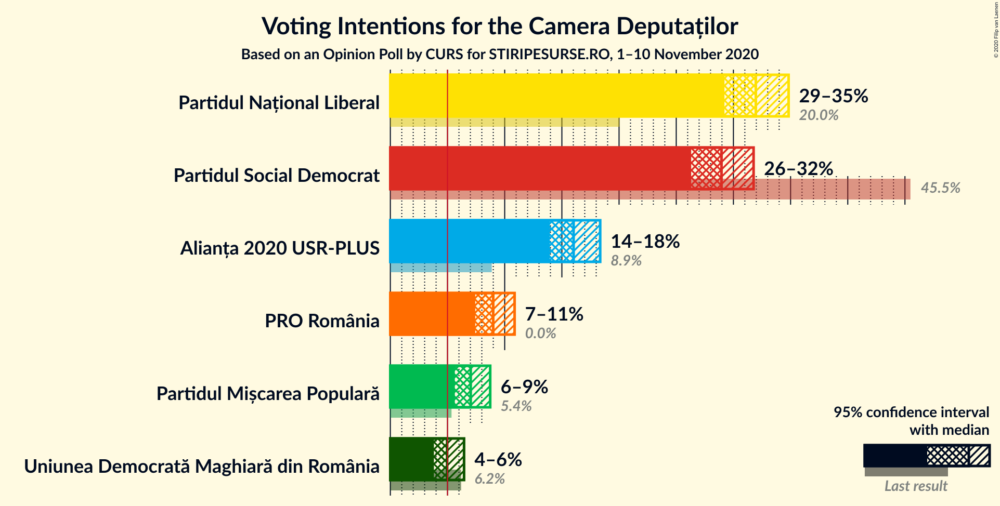
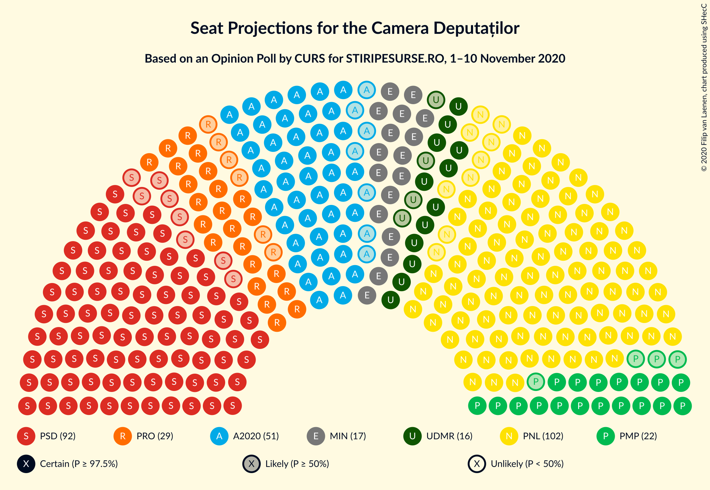
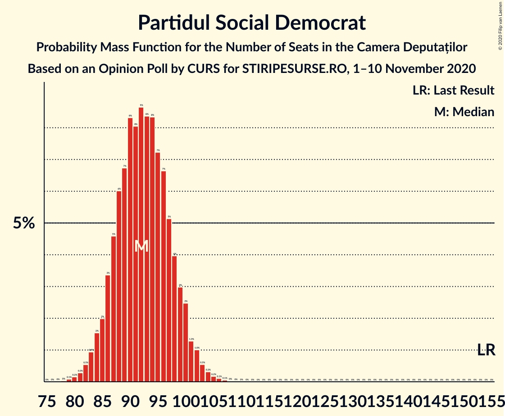
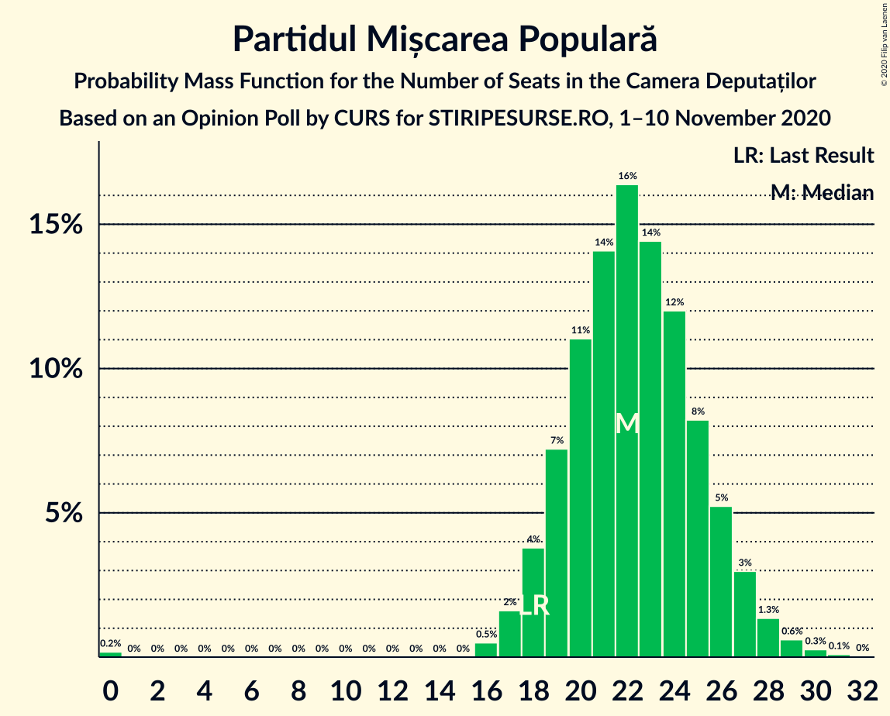
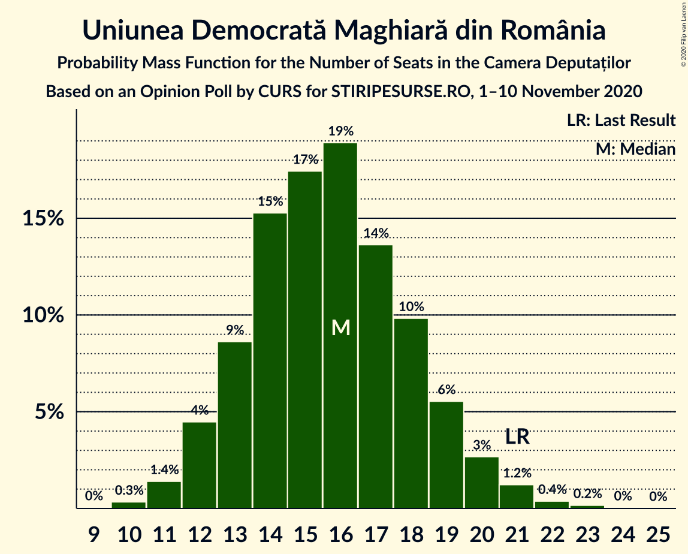
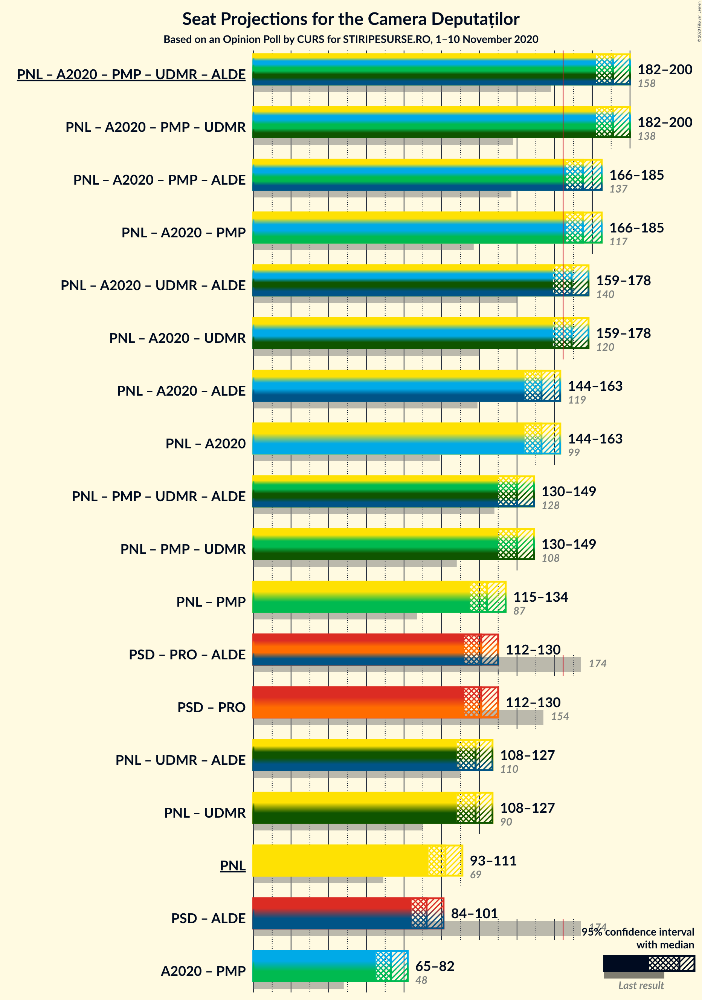
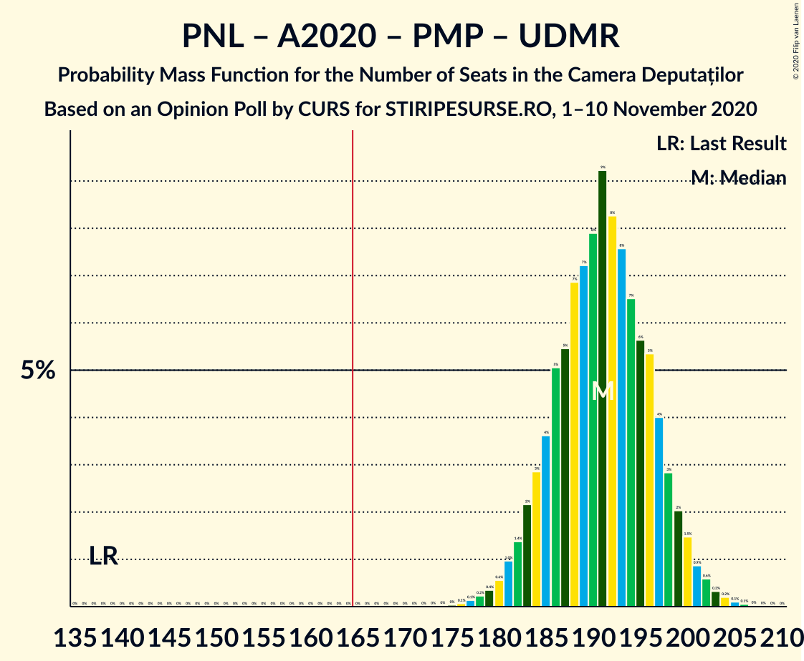
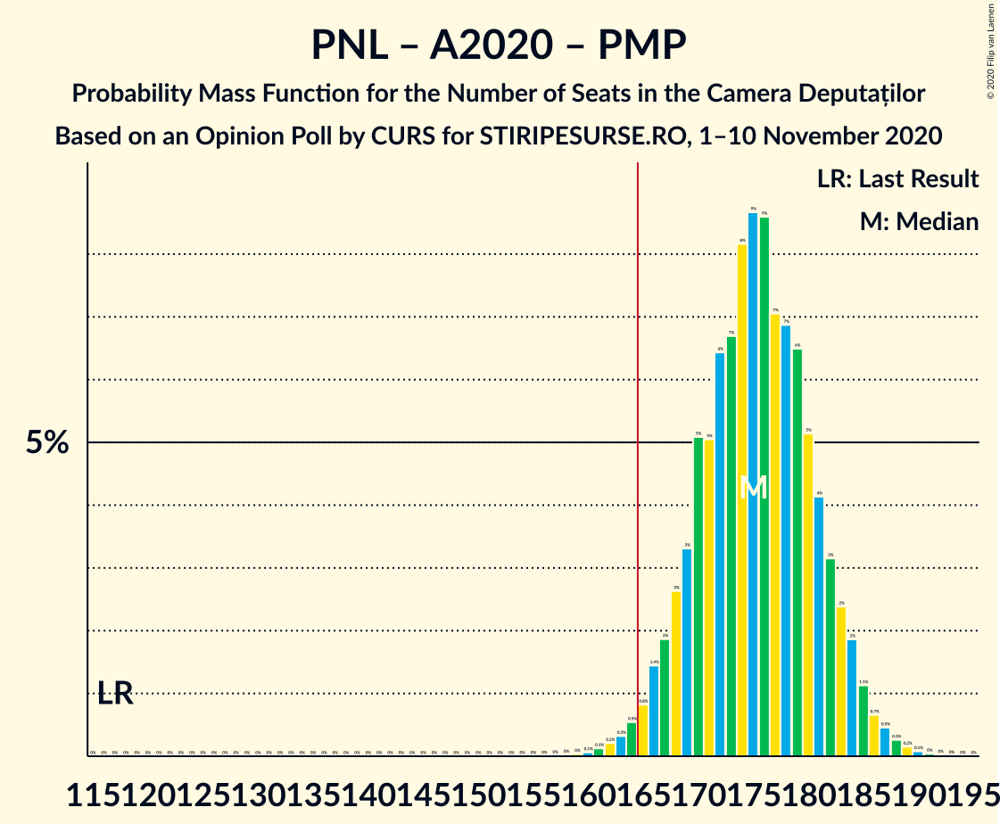
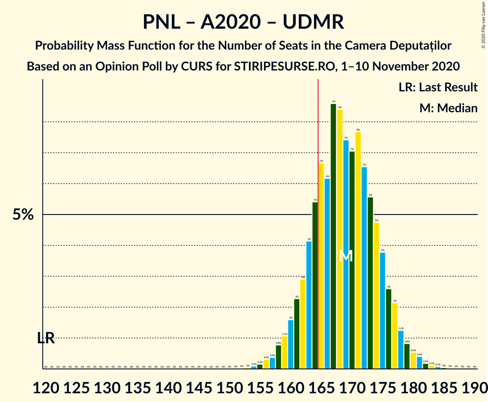
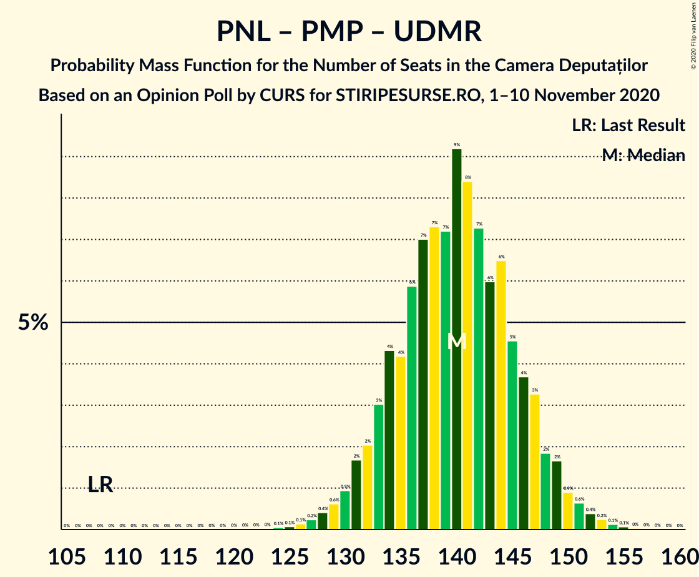

# Opinion Poll by CURS for STIRIPESURSE.RO, 1–10 November 2020

<a href="#voting-intentions">Voting Intentions</a> | <a href="#seats">Seats</a> | <a href="#coalitions">Coalitions</a> | <a href="#technical-information">Technical Information</a>

## Voting Intentions

### Confidence Intervals

| Party | Last Result | Poll Result | 80% Confidence Interval | 90% Confidence Interval | 95% Confidence Interval | 99% Confidence Interval |
|:-----:|:-----------:|:-----------:|:-----------------------:|:-----------------------:|:-----------------------:|:-----------------------:|
| Partidul Național Liberal | 20.0% | 32.0% | 30.2–33.8% |29.7–34.4% |29.2–34.8% |28.4–35.7% |
| Partidul Social Democrat | 45.5% | 29.0% | 27.2–30.8% |26.7–31.3% |26.3–31.8% |25.5–32.6% |
| Alianța 2020 USR-PLUS | 8.9% | 16.0% | 14.7–17.5% |14.3–18.0% |13.9–18.4% |13.3–19.1% |
| PRO România | 0.0% | 9.0% | 8.0–10.2% |7.7–10.6% |7.4–10.9% |7.0–11.5% |
| Partidul Mișcarea Populară | 5.4% | 7.0% | 6.1–8.1% |5.9–8.5% |5.6–8.7% |5.2–9.3% |
| Uniunea Democrată Maghiară din România | 6.2% | 5.0% | 4.2–5.9% |4.0–6.2% |3.8–6.4% |3.5–6.9% |

*Note:* The poll result column reflects the actual value used in the calculations. Published results may vary slightly, and in addition be rounded to fewer digits.

## Seats

### Confidence Intervals

| Party | Last Result | Median | 80% Confidence Interval | 90% Confidence Interval | 95% Confidence Interval | 99% Confidence Interval |
|:-----:|:-----------:|:------:|:-----------------------:|:-----------------------:|:-----------------------:|:-----------------------:|
| <a href="#partidul-național-liberal">Partidul Național Liberal</a> | 69 | 102 | 96–108 |95–110 |93–111 |90–114 |
| <a href="#partidul-social-democrat">Partidul Social Democrat</a> | 154 | 92 | 87–98 |85–100 |84–101 |81–104 |
| <a href="#alianța-2020-usr-plus">Alianța 2020 USR-PLUS</a> | 30 | 51 | 46–56 |45–57 |44–58 |42–61 |
| <a href="#pro-românia">PRO România</a> | 0 | 29 | 25–32 |24–33 |23–34 |22–36 |
| <a href="#partidul-mișcarea-populară">Partidul Mișcarea Populară</a> | 18 | 22 | 19–26 |18–27 |18–27 |16–29 |
| <a href="#uniunea-democrată-maghiară-din-românia">Uniunea Democrată Maghiară din România</a> | 21 | 16 | 13–19 |12–19 |12–20 |11–22 |

### Partidul Național Liberal

*For a full overview of the results for this party, see the [Partidul Național Liberal](party-partidulnaționalliberal.html) page.*

| Number of Seats | Probability | Accumulated | Special Marks |
|:---------------:|:-----------:|:-----------:|:-------------:|
| 69 | 0% | 100% | Last Result |
| 70 | 0% | 100% |  |
| 71 | 0% | 100% |  |
| 72 | 0% | 100% |  |
| 73 | 0% | 100% |  |
| 74 | 0% | 100% |  |
| 75 | 0% | 100% |  |
| 76 | 0% | 100% |  |
| 77 | 0% | 100% |  |
| 78 | 0% | 100% |  |
| 79 | 0% | 100% |  |
| 80 | 0% | 100% |  |
| 81 | 0% | 100% |  |
| 82 | 0% | 100% |  |
| 83 | 0% | 100% |  |
| 84 | 0% | 100% |  |
| 85 | 0% | 100% |  |
| 86 | 0% | 100% |  |
| 87 | 0% | 100% |  |
| 88 | 0.1% | 99.9% |  |
| 89 | 0.1% | 99.9% |  |
| 90 | 0.2% | 99.7% |  |
| 91 | 0.4% | 99.5% |  |
| 92 | 0.8% | 99.1% |  |
| 93 | 1.4% | 98% |  |
| 94 | 2% | 97% |  |
| 95 | 3% | 95% |  |
| 96 | 4% | 93% |  |
| 97 | 5% | 89% |  |
| 98 | 6% | 84% |  |
| 99 | 6% | 78% |  |
| 100 | 8% | 71% |  |
| 101 | 10% | 63% |  |
| 102 | 8% | 53% | Median |
| 103 | 8% | 45% |  |
| 104 | 9% | 38% |  |
| 105 | 7% | 29% |  |
| 106 | 5% | 22% |  |
| 107 | 4% | 16% |  |
| 108 | 4% | 12% |  |
| 109 | 3% | 8% |  |
| 110 | 2% | 5% |  |
| 111 | 1.2% | 3% |  |
| 112 | 0.9% | 2% |  |
| 113 | 0.6% | 1.2% |  |
| 114 | 0.3% | 0.7% |  |
| 115 | 0.2% | 0.4% |  |
| 116 | 0.1% | 0.2% |  |
| 117 | 0.1% | 0.1% |  |
| 118 | 0% | 0.1% |  |
| 119 | 0% | 0% |  |

### Partidul Social Democrat

*For a full overview of the results for this party, see the [Partidul Social Democrat](party-partidulsocialdemocrat.html) page.*

| Number of Seats | Probability | Accumulated | Special Marks |
|:---------------:|:-----------:|:-----------:|:-------------:|
| 78 | 0% | 100% |  |
| 79 | 0.1% | 99.9% |  |
| 80 | 0.2% | 99.9% |  |
| 81 | 0.3% | 99.7% |  |
| 82 | 0.5% | 99.4% |  |
| 83 | 0.9% | 98.9% |  |
| 84 | 2% | 98% |  |
| 85 | 2% | 96% |  |
| 86 | 3% | 94% |  |
| 87 | 5% | 91% |  |
| 88 | 6% | 86% |  |
| 89 | 7% | 80% |  |
| 90 | 8% | 74% |  |
| 91 | 8% | 65% |  |
| 92 | 9% | 57% | Median |
| 93 | 8% | 49% |  |
| 94 | 8% | 40% |  |
| 95 | 7% | 32% |  |
| 96 | 7% | 25% |  |
| 97 | 5% | 18% |  |
| 98 | 4% | 13% |  |
| 99 | 3% | 9% |  |
| 100 | 2% | 6% |  |
| 101 | 1.3% | 4% |  |
| 102 | 1.0% | 2% |  |
| 103 | 0.5% | 1.3% |  |
| 104 | 0.3% | 0.7% |  |
| 105 | 0.2% | 0.4% |  |
| 106 | 0.1% | 0.2% |  |
| 107 | 0.1% | 0.1% |  |
| 108 | 0% | 0.1% |  |
| 109 | 0% | 0% |  |
| 110 | 0% | 0% |  |
| 111 | 0% | 0% |  |
| 112 | 0% | 0% |  |
| 113 | 0% | 0% |  |
| 114 | 0% | 0% |  |
| 115 | 0% | 0% |  |
| 116 | 0% | 0% |  |
| 117 | 0% | 0% |  |
| 118 | 0% | 0% |  |
| 119 | 0% | 0% |  |
| 120 | 0% | 0% |  |
| 121 | 0% | 0% |  |
| 122 | 0% | 0% |  |
| 123 | 0% | 0% |  |
| 124 | 0% | 0% |  |
| 125 | 0% | 0% |  |
| 126 | 0% | 0% |  |
| 127 | 0% | 0% |  |
| 128 | 0% | 0% |  |
| 129 | 0% | 0% |  |
| 130 | 0% | 0% |  |
| 131 | 0% | 0% |  |
| 132 | 0% | 0% |  |
| 133 | 0% | 0% |  |
| 134 | 0% | 0% |  |
| 135 | 0% | 0% |  |
| 136 | 0% | 0% |  |
| 137 | 0% | 0% |  |
| 138 | 0% | 0% |  |
| 139 | 0% | 0% |  |
| 140 | 0% | 0% |  |
| 141 | 0% | 0% |  |
| 142 | 0% | 0% |  |
| 143 | 0% | 0% |  |
| 144 | 0% | 0% |  |
| 145 | 0% | 0% |  |
| 146 | 0% | 0% |  |
| 147 | 0% | 0% |  |
| 148 | 0% | 0% |  |
| 149 | 0% | 0% |  |
| 150 | 0% | 0% |  |
| 151 | 0% | 0% |  |
| 152 | 0% | 0% |  |
| 153 | 0% | 0% |  |
| 154 | 0% | 0% | Last Result |

### Alianța 2020 USR-PLUS

*For a full overview of the results for this party, see the [Alianța 2020 USR-PLUS](party-alianța2020usr-plus.html) page.*

| Number of Seats | Probability | Accumulated | Special Marks |
|:---------------:|:-----------:|:-----------:|:-------------:|
| 30 | 0% | 100% | Last Result |
| 31 | 0% | 100% |  |
| 32 | 0% | 100% |  |
| 33 | 0% | 100% |  |
| 34 | 0% | 100% |  |
| 35 | 0% | 100% |  |
| 36 | 0% | 100% |  |
| 37 | 0% | 100% |  |
| 38 | 0% | 100% |  |
| 39 | 0% | 100% |  |
| 40 | 0.1% | 100% |  |
| 41 | 0.2% | 99.9% |  |
| 42 | 0.4% | 99.7% |  |
| 43 | 0.8% | 99.3% |  |
| 44 | 2% | 98.5% |  |
| 45 | 3% | 97% |  |
| 46 | 4% | 94% |  |
| 47 | 6% | 90% |  |
| 48 | 9% | 84% |  |
| 49 | 9% | 75% |  |
| 50 | 11% | 66% |  |
| 51 | 10% | 55% | Median |
| 52 | 11% | 45% |  |
| 53 | 9% | 34% |  |
| 54 | 8% | 25% |  |
| 55 | 6% | 17% |  |
| 56 | 4% | 11% |  |
| 57 | 3% | 7% |  |
| 58 | 2% | 4% |  |
| 59 | 1.1% | 2% |  |
| 60 | 0.6% | 1.2% |  |
| 61 | 0.3% | 0.6% |  |
| 62 | 0.1% | 0.3% |  |
| 63 | 0.1% | 0.1% |  |
| 64 | 0% | 0.1% |  |
| 65 | 0% | 0% |  |

### PRO România

*For a full overview of the results for this party, see the [PRO România](party-proromânia.html) page.*

| Number of Seats | Probability | Accumulated | Special Marks |
|:---------------:|:-----------:|:-----------:|:-------------:|
| 0 | 0% | 100% | Last Result |
| 1 | 0% | 100% |  |
| 2 | 0% | 100% |  |
| 3 | 0% | 100% |  |
| 4 | 0% | 100% |  |
| 5 | 0% | 100% |  |
| 6 | 0% | 100% |  |
| 7 | 0% | 100% |  |
| 8 | 0% | 100% |  |
| 9 | 0% | 100% |  |
| 10 | 0% | 100% |  |
| 11 | 0% | 100% |  |
| 12 | 0% | 100% |  |
| 13 | 0% | 100% |  |
| 14 | 0% | 100% |  |
| 15 | 0% | 100% |  |
| 16 | 0% | 100% |  |
| 17 | 0% | 100% |  |
| 18 | 0% | 100% |  |
| 19 | 0% | 100% |  |
| 20 | 0.1% | 100% |  |
| 21 | 0.3% | 99.9% |  |
| 22 | 0.7% | 99.6% |  |
| 23 | 2% | 98.9% |  |
| 24 | 5% | 97% |  |
| 25 | 6% | 93% |  |
| 26 | 10% | 87% |  |
| 27 | 15% | 77% |  |
| 28 | 12% | 62% |  |
| 29 | 13% | 50% | Median |
| 30 | 14% | 37% |  |
| 31 | 8% | 23% |  |
| 32 | 6% | 15% |  |
| 33 | 5% | 9% |  |
| 34 | 2% | 4% |  |
| 35 | 1.2% | 2% |  |
| 36 | 0.7% | 1.1% |  |
| 37 | 0.2% | 0.4% |  |
| 38 | 0.1% | 0.2% |  |
| 39 | 0% | 0.1% |  |
| 40 | 0% | 0% |  |

### Partidul Mișcarea Populară

*For a full overview of the results for this party, see the [Partidul Mișcarea Populară](party-partidulmișcareapopulară.html) page.*

| Number of Seats | Probability | Accumulated | Special Marks |
|:---------------:|:-----------:|:-----------:|:-------------:|
| 0 | 0.2% | 100% |  |
| 1 | 0% | 99.8% |  |
| 2 | 0% | 99.8% |  |
| 3 | 0% | 99.8% |  |
| 4 | 0% | 99.8% |  |
| 5 | 0% | 99.8% |  |
| 6 | 0% | 99.8% |  |
| 7 | 0% | 99.8% |  |
| 8 | 0% | 99.8% |  |
| 9 | 0% | 99.8% |  |
| 10 | 0% | 99.8% |  |
| 11 | 0% | 99.8% |  |
| 12 | 0% | 99.8% |  |
| 13 | 0% | 99.8% |  |
| 14 | 0% | 99.8% |  |
| 15 | 0% | 99.8% |  |
| 16 | 0.5% | 99.8% |  |
| 17 | 2% | 99.3% |  |
| 18 | 4% | 98% | Last Result |
| 19 | 7% | 94% |  |
| 20 | 11% | 87% |  |
| 21 | 14% | 76% |  |
| 22 | 16% | 62% | Median |
| 23 | 14% | 45% |  |
| 24 | 12% | 31% |  |
| 25 | 8% | 19% |  |
| 26 | 5% | 11% |  |
| 27 | 3% | 5% |  |
| 28 | 1.3% | 2% |  |
| 29 | 0.6% | 1.0% |  |
| 30 | 0.3% | 0.4% |  |
| 31 | 0.1% | 0.1% |  |
| 32 | 0% | 0% |  |

### Uniunea Democrată Maghiară din România

*For a full overview of the results for this party, see the [Uniunea Democrată Maghiară din România](party-uniuneademocratămaghiarădinromânia.html) page.*

| Number of Seats | Probability | Accumulated | Special Marks |
|:---------------:|:-----------:|:-----------:|:-------------:|
| 9 | 0% | 100% |  |
| 10 | 0.3% | 99.9% |  |
| 11 | 1.4% | 99.6% |  |
| 12 | 4% | 98% |  |
| 13 | 9% | 94% |  |
| 14 | 15% | 85% |  |
| 15 | 17% | 70% |  |
| 16 | 19% | 52% | Median |
| 17 | 14% | 33% |  |
| 18 | 10% | 20% |  |
| 19 | 6% | 10% |  |
| 20 | 3% | 4% |  |
| 21 | 1.2% | 2% | Last Result |
| 22 | 0.4% | 0.6% |  |
| 23 | 0.2% | 0.2% |  |
| 24 | 0% | 0.1% |  |
| 25 | 0% | 0% |  |

## Coalitions

### Confidence Intervals

| Coalition | Last Result | Median | Majority? | 80% Confidence Interval | 90% Confidence Interval | 95% Confidence Interval | 99% Confidence Interval |
|:---------:|:-----------:|:------:|:---------:|:-----------------------:|:-----------------------:|:-----------------------:|:-----------------------:|
| Partidul Național Liberal – Alianța 2020 USR-PLUS – Partidul Mișcarea Populară – Uniunea Democrată Maghiară din România | 138 | 191 | 100% | 185–197 | 183–199 | 182–200 | 178–203 |
| Partidul Național Liberal – Alianța 2020 USR-PLUS – Partidul Mișcarea Populară | 117 | 175 | 98.7% | 169–182 | 167–183 | 166–185 | 163–188 |
| Partidul Național Liberal – Alianța 2020 USR-PLUS – Uniunea Democrată Maghiară din România | 120 | 169 | 81% | 163–175 | 161–177 | 159–178 | 156–181 |
| Partidul Național Liberal – Alianța 2020 USR-PLUS | 99 | 153 | 1.0% | 147–159 | 145–161 | 144–163 | 141–166 |
| Partidul Național Liberal – Partidul Mișcarea Populară – Uniunea Democrată Maghiară din România | 108 | 140 | 0% | 134–146 | 132–148 | 130–149 | 127–153 |
| Partidul Național Liberal – Partidul Mișcarea Populară | 87 | 124 | 0% | 118–130 | 116–132 | 115–134 | 112–137 |
| Partidul Social Democrat – PRO România | 154 | 121 | 0% | 115–127 | 113–129 | 112–130 | 109–134 |
| Partidul Național Liberal – Uniunea Democrată Maghiară din România | 90 | 118 | 0% | 112–124 | 110–126 | 108–127 | 106–130 |
| Partidul Național Liberal | 69 | 102 | 0% | 96–108 | 95–110 | 93–111 | 90–114 |
| Alianța 2020 USR-PLUS – Partidul Mișcarea Populară | 48 | 73 | 0% | 68–79 | 67–80 | 65–82 | 63–84 |

### Partidul Național Liberal – Alianța 2020 USR-PLUS – Partidul Mișcarea Populară – Uniunea Democrată Maghiară din România

| Number of Seats | Probability | Accumulated | Special Marks |
|:---------------:|:-----------:|:-----------:|:-------------:|
| 138 | 0% | 100% | Last Result |
| 139 | 0% | 100% |  |
| 140 | 0% | 100% |  |
| 141 | 0% | 100% |  |
| 142 | 0% | 100% |  |
| 143 | 0% | 100% |  |
| 144 | 0% | 100% |  |
| 145 | 0% | 100% |  |
| 146 | 0% | 100% |  |
| 147 | 0% | 100% |  |
| 148 | 0% | 100% |  |
| 149 | 0% | 100% |  |
| 150 | 0% | 100% |  |
| 151 | 0% | 100% |  |
| 152 | 0% | 100% |  |
| 153 | 0% | 100% |  |
| 154 | 0% | 100% |  |
| 155 | 0% | 100% |  |
| 156 | 0% | 100% |  |
| 157 | 0% | 100% |  |
| 158 | 0% | 100% |  |
| 159 | 0% | 100% |  |
| 160 | 0% | 100% |  |
| 161 | 0% | 100% |  |
| 162 | 0% | 100% |  |
| 163 | 0% | 100% |  |
| 164 | 0% | 100% |  |
| 165 | 0% | 100% | Majority |
| 166 | 0% | 100% |  |
| 167 | 0% | 100% |  |
| 168 | 0% | 100% |  |
| 169 | 0% | 100% |  |
| 170 | 0% | 100% |  |
| 171 | 0% | 100% |  |
| 172 | 0% | 100% |  |
| 173 | 0% | 100% |  |
| 174 | 0% | 100% |  |
| 175 | 0% | 100% |  |
| 176 | 0.1% | 99.9% |  |
| 177 | 0.1% | 99.9% |  |
| 178 | 0.2% | 99.7% |  |
| 179 | 0.4% | 99.5% |  |
| 180 | 0.6% | 99.1% |  |
| 181 | 1.0% | 98.6% |  |
| 182 | 1.4% | 98% |  |
| 183 | 2% | 96% |  |
| 184 | 3% | 94% |  |
| 185 | 4% | 91% |  |
| 186 | 5% | 88% |  |
| 187 | 5% | 83% |  |
| 188 | 7% | 77% |  |
| 189 | 7% | 70% |  |
| 190 | 8% | 63% |  |
| 191 | 9% | 55% | Median |
| 192 | 8% | 46% |  |
| 193 | 8% | 38% |  |
| 194 | 7% | 30% |  |
| 195 | 6% | 24% |  |
| 196 | 5% | 18% |  |
| 197 | 4% | 13% |  |
| 198 | 3% | 9% |  |
| 199 | 2% | 6% |  |
| 200 | 1.5% | 4% |  |
| 201 | 0.9% | 2% |  |
| 202 | 0.6% | 1.3% |  |
| 203 | 0.3% | 0.7% |  |
| 204 | 0.2% | 0.4% |  |
| 205 | 0.1% | 0.2% |  |
| 206 | 0.1% | 0.1% |  |
| 207 | 0% | 0% |  |

### Partidul Național Liberal – Alianța 2020 USR-PLUS – Partidul Mișcarea Populară

| Number of Seats | Probability | Accumulated | Special Marks |
|:---------------:|:-----------:|:-----------:|:-------------:|
| 117 | 0% | 100% | Last Result |
| 118 | 0% | 100% |  |
| 119 | 0% | 100% |  |
| 120 | 0% | 100% |  |
| 121 | 0% | 100% |  |
| 122 | 0% | 100% |  |
| 123 | 0% | 100% |  |
| 124 | 0% | 100% |  |
| 125 | 0% | 100% |  |
| 126 | 0% | 100% |  |
| 127 | 0% | 100% |  |
| 128 | 0% | 100% |  |
| 129 | 0% | 100% |  |
| 130 | 0% | 100% |  |
| 131 | 0% | 100% |  |
| 132 | 0% | 100% |  |
| 133 | 0% | 100% |  |
| 134 | 0% | 100% |  |
| 135 | 0% | 100% |  |
| 136 | 0% | 100% |  |
| 137 | 0% | 100% |  |
| 138 | 0% | 100% |  |
| 139 | 0% | 100% |  |
| 140 | 0% | 100% |  |
| 141 | 0% | 100% |  |
| 142 | 0% | 100% |  |
| 143 | 0% | 100% |  |
| 144 | 0% | 100% |  |
| 145 | 0% | 100% |  |
| 146 | 0% | 100% |  |
| 147 | 0% | 100% |  |
| 148 | 0% | 100% |  |
| 149 | 0% | 100% |  |
| 150 | 0% | 100% |  |
| 151 | 0% | 100% |  |
| 152 | 0% | 100% |  |
| 153 | 0% | 100% |  |
| 154 | 0% | 100% |  |
| 155 | 0% | 100% |  |
| 156 | 0% | 100% |  |
| 157 | 0% | 100% |  |
| 158 | 0% | 100% |  |
| 159 | 0% | 100% |  |
| 160 | 0.1% | 99.9% |  |
| 161 | 0.1% | 99.9% |  |
| 162 | 0.2% | 99.7% |  |
| 163 | 0.3% | 99.5% |  |
| 164 | 0.5% | 99.2% |  |
| 165 | 0.8% | 98.7% | Majority |
| 166 | 1.4% | 98% |  |
| 167 | 2% | 96% |  |
| 168 | 3% | 95% |  |
| 169 | 3% | 92% |  |
| 170 | 5% | 89% |  |
| 171 | 5% | 83% |  |
| 172 | 6% | 78% |  |
| 173 | 7% | 72% |  |
| 174 | 8% | 65% |  |
| 175 | 9% | 57% | Median |
| 176 | 9% | 48% |  |
| 177 | 7% | 40% |  |
| 178 | 7% | 33% |  |
| 179 | 6% | 26% |  |
| 180 | 5% | 19% |  |
| 181 | 4% | 14% |  |
| 182 | 3% | 10% |  |
| 183 | 2% | 7% |  |
| 184 | 2% | 5% |  |
| 185 | 1.1% | 3% |  |
| 186 | 0.7% | 2% |  |
| 187 | 0.5% | 1.0% |  |
| 188 | 0.3% | 0.6% |  |
| 189 | 0.2% | 0.3% |  |
| 190 | 0.1% | 0.2% |  |
| 191 | 0% | 0.1% |  |
| 192 | 0% | 0% |  |

### Partidul Național Liberal – Alianța 2020 USR-PLUS – Uniunea Democrată Maghiară din România

| Number of Seats | Probability | Accumulated | Special Marks |
|:---------------:|:-----------:|:-----------:|:-------------:|
| 120 | 0% | 100% | Last Result |
| 121 | 0% | 100% |  |
| 122 | 0% | 100% |  |
| 123 | 0% | 100% |  |
| 124 | 0% | 100% |  |
| 125 | 0% | 100% |  |
| 126 | 0% | 100% |  |
| 127 | 0% | 100% |  |
| 128 | 0% | 100% |  |
| 129 | 0% | 100% |  |
| 130 | 0% | 100% |  |
| 131 | 0% | 100% |  |
| 132 | 0% | 100% |  |
| 133 | 0% | 100% |  |
| 134 | 0% | 100% |  |
| 135 | 0% | 100% |  |
| 136 | 0% | 100% |  |
| 137 | 0% | 100% |  |
| 138 | 0% | 100% |  |
| 139 | 0% | 100% |  |
| 140 | 0% | 100% |  |
| 141 | 0% | 100% |  |
| 142 | 0% | 100% |  |
| 143 | 0% | 100% |  |
| 144 | 0% | 100% |  |
| 145 | 0% | 100% |  |
| 146 | 0% | 100% |  |
| 147 | 0% | 100% |  |
| 148 | 0% | 100% |  |
| 149 | 0% | 100% |  |
| 150 | 0% | 100% |  |
| 151 | 0% | 100% |  |
| 152 | 0% | 100% |  |
| 153 | 0% | 100% |  |
| 154 | 0.1% | 99.9% |  |
| 155 | 0.2% | 99.8% |  |
| 156 | 0.3% | 99.7% |  |
| 157 | 0.4% | 99.4% |  |
| 158 | 0.8% | 99.0% |  |
| 159 | 1.1% | 98% |  |
| 160 | 2% | 97% |  |
| 161 | 2% | 96% |  |
| 162 | 3% | 93% |  |
| 163 | 4% | 90% |  |
| 164 | 5% | 86% |  |
| 165 | 7% | 81% | Majority |
| 166 | 6% | 74% |  |
| 167 | 9% | 68% |  |
| 168 | 8% | 59% |  |
| 169 | 7% | 51% | Median |
| 170 | 7% | 44% |  |
| 171 | 8% | 37% |  |
| 172 | 7% | 29% |  |
| 173 | 6% | 22% |  |
| 174 | 5% | 17% |  |
| 175 | 4% | 12% |  |
| 176 | 3% | 8% |  |
| 177 | 2% | 6% |  |
| 178 | 1.2% | 3% |  |
| 179 | 0.8% | 2% |  |
| 180 | 0.5% | 1.4% |  |
| 181 | 0.4% | 0.9% |  |
| 182 | 0.2% | 0.5% |  |
| 183 | 0.1% | 0.3% |  |
| 184 | 0.1% | 0.2% |  |
| 185 | 0% | 0.1% |  |
| 186 | 0% | 0.1% |  |
| 187 | 0% | 0% |  |

### Partidul Național Liberal – Alianța 2020 USR-PLUS

| Number of Seats | Probability | Accumulated | Special Marks |
|:---------------:|:-----------:|:-----------:|:-------------:|
| 99 | 0% | 100% | Last Result |
| 100 | 0% | 100% |  |
| 101 | 0% | 100% |  |
| 102 | 0% | 100% |  |
| 103 | 0% | 100% |  |
| 104 | 0% | 100% |  |
| 105 | 0% | 100% |  |
| 106 | 0% | 100% |  |
| 107 | 0% | 100% |  |
| 108 | 0% | 100% |  |
| 109 | 0% | 100% |  |
| 110 | 0% | 100% |  |
| 111 | 0% | 100% |  |
| 112 | 0% | 100% |  |
| 113 | 0% | 100% |  |
| 114 | 0% | 100% |  |
| 115 | 0% | 100% |  |
| 116 | 0% | 100% |  |
| 117 | 0% | 100% |  |
| 118 | 0% | 100% |  |
| 119 | 0% | 100% |  |
| 120 | 0% | 100% |  |
| 121 | 0% | 100% |  |
| 122 | 0% | 100% |  |
| 123 | 0% | 100% |  |
| 124 | 0% | 100% |  |
| 125 | 0% | 100% |  |
| 126 | 0% | 100% |  |
| 127 | 0% | 100% |  |
| 128 | 0% | 100% |  |
| 129 | 0% | 100% |  |
| 130 | 0% | 100% |  |
| 131 | 0% | 100% |  |
| 132 | 0% | 100% |  |
| 133 | 0% | 100% |  |
| 134 | 0% | 100% |  |
| 135 | 0% | 100% |  |
| 136 | 0% | 100% |  |
| 137 | 0% | 100% |  |
| 138 | 0.1% | 99.9% |  |
| 139 | 0.1% | 99.9% |  |
| 140 | 0.2% | 99.7% |  |
| 141 | 0.4% | 99.5% |  |
| 142 | 0.5% | 99.1% |  |
| 143 | 1.0% | 98.6% |  |
| 144 | 1.5% | 98% |  |
| 145 | 2% | 96% |  |
| 146 | 3% | 94% |  |
| 147 | 4% | 91% |  |
| 148 | 5% | 87% |  |
| 149 | 6% | 83% |  |
| 150 | 7% | 77% |  |
| 151 | 8% | 70% |  |
| 152 | 7% | 62% |  |
| 153 | 8% | 54% | Median |
| 154 | 8% | 47% |  |
| 155 | 8% | 38% |  |
| 156 | 7% | 31% |  |
| 157 | 5% | 24% |  |
| 158 | 6% | 19% |  |
| 159 | 3% | 13% |  |
| 160 | 4% | 10% |  |
| 161 | 2% | 6% |  |
| 162 | 1.4% | 4% |  |
| 163 | 1.2% | 3% |  |
| 164 | 0.6% | 2% |  |
| 165 | 0.4% | 1.0% | Majority |
| 166 | 0.3% | 0.6% |  |
| 167 | 0.1% | 0.3% |  |
| 168 | 0.1% | 0.2% |  |
| 169 | 0% | 0.1% |  |
| 170 | 0% | 0.1% |  |
| 171 | 0% | 0% |  |

### Partidul Național Liberal – Partidul Mișcarea Populară – Uniunea Democrată Maghiară din România

| Number of Seats | Probability | Accumulated | Special Marks |
|:---------------:|:-----------:|:-----------:|:-------------:|
| 108 | 0% | 100% | Last Result |
| 109 | 0% | 100% |  |
| 110 | 0% | 100% |  |
| 111 | 0% | 100% |  |
| 112 | 0% | 100% |  |
| 113 | 0% | 100% |  |
| 114 | 0% | 100% |  |
| 115 | 0% | 100% |  |
| 116 | 0% | 100% |  |
| 117 | 0% | 100% |  |
| 118 | 0% | 100% |  |
| 119 | 0% | 100% |  |
| 120 | 0% | 100% |  |
| 121 | 0% | 100% |  |
| 122 | 0% | 100% |  |
| 123 | 0% | 100% |  |
| 124 | 0.1% | 99.9% |  |
| 125 | 0.1% | 99.9% |  |
| 126 | 0.1% | 99.8% |  |
| 127 | 0.2% | 99.7% |  |
| 128 | 0.4% | 99.4% |  |
| 129 | 0.6% | 99.0% |  |
| 130 | 0.9% | 98% |  |
| 131 | 2% | 97% |  |
| 132 | 2% | 96% |  |
| 133 | 3% | 94% |  |
| 134 | 4% | 91% |  |
| 135 | 4% | 86% |  |
| 136 | 6% | 82% |  |
| 137 | 7% | 76% |  |
| 138 | 7% | 69% |  |
| 139 | 7% | 62% |  |
| 140 | 9% | 55% | Median |
| 141 | 8% | 46% |  |
| 142 | 7% | 37% |  |
| 143 | 6% | 30% |  |
| 144 | 6% | 24% |  |
| 145 | 5% | 17% |  |
| 146 | 4% | 13% |  |
| 147 | 3% | 9% |  |
| 148 | 2% | 6% |  |
| 149 | 2% | 4% |  |
| 150 | 0.9% | 2% |  |
| 151 | 0.6% | 2% |  |
| 152 | 0.4% | 0.9% |  |
| 153 | 0.2% | 0.5% |  |
| 154 | 0.1% | 0.3% |  |
| 155 | 0.1% | 0.1% |  |
| 156 | 0% | 0.1% |  |
| 157 | 0% | 0% |  |

### Partidul Național Liberal – Partidul Mișcarea Populară

| Number of Seats | Probability | Accumulated | Special Marks |
|:---------------:|:-----------:|:-----------:|:-------------:|
| 87 | 0% | 100% | Last Result |
| 88 | 0% | 100% |  |
| 89 | 0% | 100% |  |
| 90 | 0% | 100% |  |
| 91 | 0% | 100% |  |
| 92 | 0% | 100% |  |
| 93 | 0% | 100% |  |
| 94 | 0% | 100% |  |
| 95 | 0% | 100% |  |
| 96 | 0% | 100% |  |
| 97 | 0% | 100% |  |
| 98 | 0% | 100% |  |
| 99 | 0% | 100% |  |
| 100 | 0% | 100% |  |
| 101 | 0% | 100% |  |
| 102 | 0% | 100% |  |
| 103 | 0% | 100% |  |
| 104 | 0% | 100% |  |
| 105 | 0% | 100% |  |
| 106 | 0% | 100% |  |
| 107 | 0% | 99.9% |  |
| 108 | 0% | 99.9% |  |
| 109 | 0.1% | 99.9% |  |
| 110 | 0.1% | 99.8% |  |
| 111 | 0.2% | 99.7% |  |
| 112 | 0.3% | 99.5% |  |
| 113 | 0.5% | 99.3% |  |
| 114 | 0.9% | 98.8% |  |
| 115 | 1.3% | 98% |  |
| 116 | 2% | 97% |  |
| 117 | 2% | 95% |  |
| 118 | 4% | 92% |  |
| 119 | 4% | 88% |  |
| 120 | 5% | 84% |  |
| 121 | 7% | 79% |  |
| 122 | 7% | 72% |  |
| 123 | 8% | 64% |  |
| 124 | 9% | 57% | Median |
| 125 | 9% | 48% |  |
| 126 | 7% | 39% |  |
| 127 | 7% | 32% |  |
| 128 | 7% | 25% |  |
| 129 | 5% | 19% |  |
| 130 | 4% | 14% |  |
| 131 | 3% | 10% |  |
| 132 | 2% | 7% |  |
| 133 | 1.5% | 4% |  |
| 134 | 1.1% | 3% |  |
| 135 | 0.7% | 2% |  |
| 136 | 0.4% | 1.0% |  |
| 137 | 0.3% | 0.6% |  |
| 138 | 0.1% | 0.3% |  |
| 139 | 0.1% | 0.2% |  |
| 140 | 0% | 0.1% |  |
| 141 | 0% | 0% |  |

### Partidul Social Democrat – PRO România

| Number of Seats | Probability | Accumulated | Special Marks |
|:---------------:|:-----------:|:-----------:|:-------------:|
| 106 | 0.1% | 100% |  |
| 107 | 0.1% | 99.9% |  |
| 108 | 0.2% | 99.8% |  |
| 109 | 0.3% | 99.6% |  |
| 110 | 0.6% | 99.3% |  |
| 111 | 0.9% | 98.7% |  |
| 112 | 1.5% | 98% |  |
| 113 | 2% | 96% |  |
| 114 | 3% | 94% |  |
| 115 | 4% | 91% |  |
| 116 | 5% | 87% |  |
| 117 | 6% | 82% |  |
| 118 | 7% | 76% |  |
| 119 | 8% | 70% |  |
| 120 | 8% | 62% |  |
| 121 | 9% | 54% | Median |
| 122 | 8% | 45% |  |
| 123 | 7% | 37% |  |
| 124 | 7% | 30% |  |
| 125 | 5% | 23% |  |
| 126 | 5% | 17% |  |
| 127 | 4% | 12% |  |
| 128 | 3% | 9% |  |
| 129 | 2% | 6% |  |
| 130 | 1.4% | 4% |  |
| 131 | 1.0% | 2% |  |
| 132 | 0.6% | 1.4% |  |
| 133 | 0.4% | 0.9% |  |
| 134 | 0.2% | 0.5% |  |
| 135 | 0.1% | 0.3% |  |
| 136 | 0.1% | 0.1% |  |
| 137 | 0% | 0.1% |  |
| 138 | 0% | 0% |  |
| 139 | 0% | 0% |  |
| 140 | 0% | 0% |  |
| 141 | 0% | 0% |  |
| 142 | 0% | 0% |  |
| 143 | 0% | 0% |  |
| 144 | 0% | 0% |  |
| 145 | 0% | 0% |  |
| 146 | 0% | 0% |  |
| 147 | 0% | 0% |  |
| 148 | 0% | 0% |  |
| 149 | 0% | 0% |  |
| 150 | 0% | 0% |  |
| 151 | 0% | 0% |  |
| 152 | 0% | 0% |  |
| 153 | 0% | 0% |  |
| 154 | 0% | 0% | Last Result |

### Partidul Național Liberal – Uniunea Democrată Maghiară din România

| Number of Seats | Probability | Accumulated | Special Marks |
|:---------------:|:-----------:|:-----------:|:-------------:|
| 90 | 0% | 100% | Last Result |
| 91 | 0% | 100% |  |
| 92 | 0% | 100% |  |
| 93 | 0% | 100% |  |
| 94 | 0% | 100% |  |
| 95 | 0% | 100% |  |
| 96 | 0% | 100% |  |
| 97 | 0% | 100% |  |
| 98 | 0% | 100% |  |
| 99 | 0% | 100% |  |
| 100 | 0% | 100% |  |
| 101 | 0% | 100% |  |
| 102 | 0% | 100% |  |
| 103 | 0.1% | 99.9% |  |
| 104 | 0.1% | 99.9% |  |
| 105 | 0.2% | 99.8% |  |
| 106 | 0.4% | 99.6% |  |
| 107 | 0.6% | 99.2% |  |
| 108 | 1.1% | 98.6% |  |
| 109 | 1.5% | 97% |  |
| 110 | 2% | 96% |  |
| 111 | 3% | 94% |  |
| 112 | 4% | 91% |  |
| 113 | 5% | 87% |  |
| 114 | 6% | 81% |  |
| 115 | 7% | 75% |  |
| 116 | 8% | 68% |  |
| 117 | 8% | 60% |  |
| 118 | 10% | 52% | Median |
| 119 | 7% | 42% |  |
| 120 | 7% | 35% |  |
| 121 | 6% | 27% |  |
| 122 | 5% | 21% |  |
| 123 | 5% | 16% |  |
| 124 | 3% | 11% |  |
| 125 | 3% | 8% |  |
| 126 | 2% | 5% |  |
| 127 | 1.2% | 3% |  |
| 128 | 0.9% | 2% |  |
| 129 | 0.5% | 1.2% |  |
| 130 | 0.3% | 0.7% |  |
| 131 | 0.2% | 0.4% |  |
| 132 | 0.1% | 0.2% |  |
| 133 | 0.1% | 0.1% |  |
| 134 | 0% | 0.1% |  |
| 135 | 0% | 0% |  |

### Partidul Național Liberal

| Number of Seats | Probability | Accumulated | Special Marks |
|:---------------:|:-----------:|:-----------:|:-------------:|
| 69 | 0% | 100% | Last Result |
| 70 | 0% | 100% |  |
| 71 | 0% | 100% |  |
| 72 | 0% | 100% |  |
| 73 | 0% | 100% |  |
| 74 | 0% | 100% |  |
| 75 | 0% | 100% |  |
| 76 | 0% | 100% |  |
| 77 | 0% | 100% |  |
| 78 | 0% | 100% |  |
| 79 | 0% | 100% |  |
| 80 | 0% | 100% |  |
| 81 | 0% | 100% |  |
| 82 | 0% | 100% |  |
| 83 | 0% | 100% |  |
| 84 | 0% | 100% |  |
| 85 | 0% | 100% |  |
| 86 | 0% | 100% |  |
| 87 | 0% | 100% |  |
| 88 | 0.1% | 99.9% |  |
| 89 | 0.1% | 99.9% |  |
| 90 | 0.2% | 99.7% |  |
| 91 | 0.4% | 99.5% |  |
| 92 | 0.8% | 99.1% |  |
| 93 | 1.4% | 98% |  |
| 94 | 2% | 97% |  |
| 95 | 3% | 95% |  |
| 96 | 4% | 93% |  |
| 97 | 5% | 89% |  |
| 98 | 6% | 84% |  |
| 99 | 6% | 78% |  |
| 100 | 8% | 71% |  |
| 101 | 10% | 63% |  |
| 102 | 8% | 53% | Median |
| 103 | 8% | 45% |  |
| 104 | 9% | 38% |  |
| 105 | 7% | 29% |  |
| 106 | 5% | 22% |  |
| 107 | 4% | 16% |  |
| 108 | 4% | 12% |  |
| 109 | 3% | 8% |  |
| 110 | 2% | 5% |  |
| 111 | 1.2% | 3% |  |
| 112 | 0.9% | 2% |  |
| 113 | 0.6% | 1.2% |  |
| 114 | 0.3% | 0.7% |  |
| 115 | 0.2% | 0.4% |  |
| 116 | 0.1% | 0.2% |  |
| 117 | 0.1% | 0.1% |  |
| 118 | 0% | 0.1% |  |
| 119 | 0% | 0% |  |

### Alianța 2020 USR-PLUS – Partidul Mișcarea Populară

| Number of Seats | Probability | Accumulated | Special Marks |
|:---------------:|:-----------:|:-----------:|:-------------:|
| 48 | 0% | 100% | Last Result |
| 49 | 0% | 100% |  |
| 50 | 0% | 100% |  |
| 51 | 0% | 100% |  |
| 52 | 0% | 100% |  |
| 53 | 0% | 100% |  |
| 54 | 0% | 99.9% |  |
| 55 | 0% | 99.9% |  |
| 56 | 0% | 99.9% |  |
| 57 | 0% | 99.9% |  |
| 58 | 0% | 99.9% |  |
| 59 | 0% | 99.8% |  |
| 60 | 0.1% | 99.8% |  |
| 61 | 0.1% | 99.8% |  |
| 62 | 0.2% | 99.7% |  |
| 63 | 0.4% | 99.5% |  |
| 64 | 0.7% | 99.1% |  |
| 65 | 1.1% | 98% |  |
| 66 | 2% | 97% |  |
| 67 | 4% | 95% |  |
| 68 | 4% | 92% |  |
| 69 | 5% | 88% |  |
| 70 | 8% | 83% |  |
| 71 | 8% | 75% |  |
| 72 | 8% | 67% |  |
| 73 | 11% | 58% | Median |
| 74 | 10% | 48% |  |
| 75 | 8% | 38% |  |
| 76 | 8% | 30% |  |
| 77 | 7% | 22% |  |
| 78 | 5% | 15% |  |
| 79 | 3% | 11% |  |
| 80 | 3% | 7% |  |
| 81 | 2% | 4% |  |
| 82 | 1.0% | 3% |  |
| 83 | 0.7% | 2% |  |
| 84 | 0.4% | 0.9% |  |
| 85 | 0.2% | 0.4% |  |
| 86 | 0.1% | 0.2% |  |
| 87 | 0.1% | 0.1% |  |
| 88 | 0% | 0% |  |

## Technical Information

### Opinion Poll

+ **Polling firm:** CURS
+ **Commissioner(s):** STIRIPESURSE.RO
+ **Fieldwork period:** 1–10 November 2020

### Calculations

+ **Sample size:** 1067
+ **Simulations done:** 1,048,576
+ **Error estimate:** 0.93%

