# Opinion Poll by Sociopol, 28–29 November 2020

<a href="#voting-intentions">Voting Intentions</a> | <a href="#seats">Seats</a> | <a href="#coalitions">Coalitions</a> | <a href="#technical-information">Technical Information</a>

## Voting Intentions

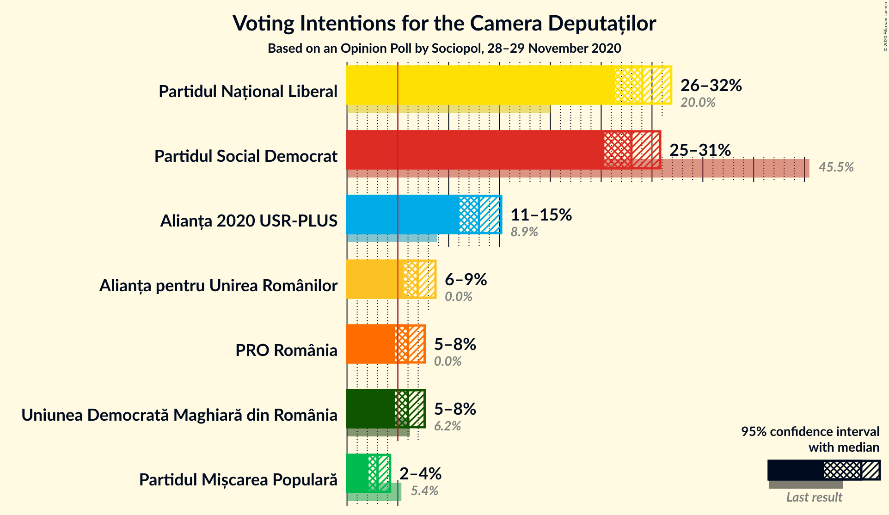

### Confidence Intervals

| Party | Last Result | Poll Result | 80% Confidence Interval | 90% Confidence Interval | 95% Confidence Interval | 99% Confidence Interval |
|:-----:|:-----------:|:-----------:|:-----------------------:|:-----------------------:|:-----------------------:|:-----------------------:|
| Partidul Național Liberal | 20.0% | 29.0% | 27.3–30.9% |26.8–31.4% |26.4–31.9% |25.5–32.8% |
| Partidul Social Democrat | 45.5% | 28.0% | 26.2–29.8% |25.7–30.3% |25.3–30.8% |24.5–31.7% |
| Alianța 2020 USR-PLUS | 8.9% | 13.0% | 11.7–14.4% |11.4–14.8% |11.1–15.2% |10.5–15.9% |
| Alianța pentru Unirea Românilor | 0.0% | 7.0% | 6.1–8.1% |5.8–8.4% |5.6–8.7% |5.2–9.3% |
| Uniunea Democrată Maghiară din România | 6.2% | 6.0% | 5.2–7.1% |4.9–7.4% |4.7–7.6% |4.3–8.2% |
| PRO România | 0.0% | 6.0% | 5.2–7.1% |4.9–7.4% |4.7–7.6% |4.3–8.2% |
| Partidul Mișcarea Populară | 5.4% | 3.0% | 2.4–3.8% |2.3–4.0% |2.1–4.2% |1.9–4.6% |

*Note:* The poll result column reflects the actual value used in the calculations. Published results may vary slightly, and in addition be rounded to fewer digits.

## Seats

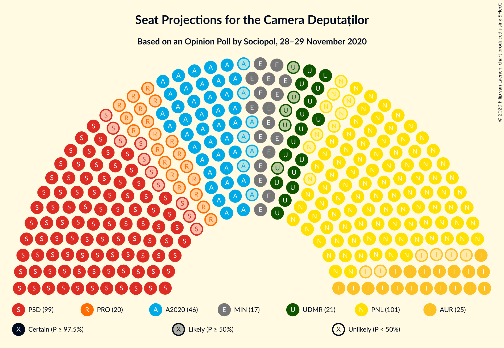

### Confidence Intervals

| Party | Last Result | Median | 80% Confidence Interval | 90% Confidence Interval | 95% Confidence Interval | 99% Confidence Interval |
|:-----:|:-----------:|:------:|:-----------------------:|:-----------------------:|:-----------------------:|:-----------------------:|
| <a href="#partidul-național-liberal">Partidul Național Liberal</a> | 69 | 102 | 96–110 |94–112 |92–114 |90–118 |
| <a href="#partidul-social-democrat">Partidul Social Democrat</a> | 154 | 99 | 92–106 |90–107 |89–109 |86–113 |
| <a href="#alianța-2020-usr-plus">Alianța 2020 USR-PLUS</a> | 30 | 46 | 41–51 |39–52 |39–54 |37–56 |
| <a href="#alianța-pentru-unirea-românilor">Alianța pentru Unirea Românilor</a> | 0 | 25 | 21–28 |20–29 |19–30 |17–32 |
| <a href="#uniunea-democrată-maghiară-din-românia">Uniunea Democrată Maghiară din România</a> | 21 | 21 | 17–25 |17–26 |16–27 |15–28 |
| <a href="#pro-românia">PRO România</a> | 0 | 20 | 17–24 |0–26 |0–26 |0–28 |
| <a href="#partidul-mișcarea-populară">Partidul Mișcarea Populară</a> | 18 | 0 | 0 |0 |0 |0 |

### Partidul Național Liberal

*For a full overview of the results for this party, see the [Partidul Național Liberal](party-partidulnaționalliberal.html) page.*

| Number of Seats | Probability | Accumulated | Special Marks |
|:---------------:|:-----------:|:-----------:|:-------------:|
| 69 | 0% | 100% | Last Result |
| 70 | 0% | 100% |  |
| 71 | 0% | 100% |  |
| 72 | 0% | 100% |  |
| 73 | 0% | 100% |  |
| 74 | 0% | 100% |  |
| 75 | 0% | 100% |  |
| 76 | 0% | 100% |  |
| 77 | 0% | 100% |  |
| 78 | 0% | 100% |  |
| 79 | 0% | 100% |  |
| 80 | 0% | 100% |  |
| 81 | 0% | 100% |  |
| 82 | 0% | 100% |  |
| 83 | 0% | 100% |  |
| 84 | 0% | 100% |  |
| 85 | 0% | 100% |  |
| 86 | 0% | 100% |  |
| 87 | 0.1% | 100% |  |
| 88 | 0.1% | 99.9% |  |
| 89 | 0.3% | 99.8% |  |
| 90 | 0.4% | 99.5% |  |
| 91 | 0.7% | 99.2% |  |
| 92 | 1.0% | 98% |  |
| 93 | 1.0% | 97% |  |
| 94 | 2% | 96% |  |
| 95 | 3% | 94% |  |
| 96 | 4% | 91% |  |
| 97 | 6% | 88% |  |
| 98 | 6% | 82% |  |
| 99 | 9% | 76% |  |
| 100 | 6% | 67% |  |
| 101 | 7% | 62% |  |
| 102 | 6% | 55% | Median |
| 103 | 8% | 49% |  |
| 104 | 6% | 41% |  |
| 105 | 9% | 35% |  |
| 106 | 5% | 27% |  |
| 107 | 5% | 22% |  |
| 108 | 3% | 16% |  |
| 109 | 2% | 13% |  |
| 110 | 3% | 10% |  |
| 111 | 2% | 7% |  |
| 112 | 2% | 6% |  |
| 113 | 0.8% | 4% |  |
| 114 | 1.0% | 3% |  |
| 115 | 0.8% | 2% |  |
| 116 | 0.4% | 1.3% |  |
| 117 | 0.2% | 0.9% |  |
| 118 | 0.3% | 0.7% |  |
| 119 | 0.1% | 0.4% |  |
| 120 | 0.1% | 0.3% |  |
| 121 | 0.1% | 0.2% |  |
| 122 | 0% | 0.1% |  |
| 123 | 0% | 0% |  |

### Partidul Social Democrat

*For a full overview of the results for this party, see the [Partidul Social Democrat](party-partidulsocialdemocrat.html) page.*

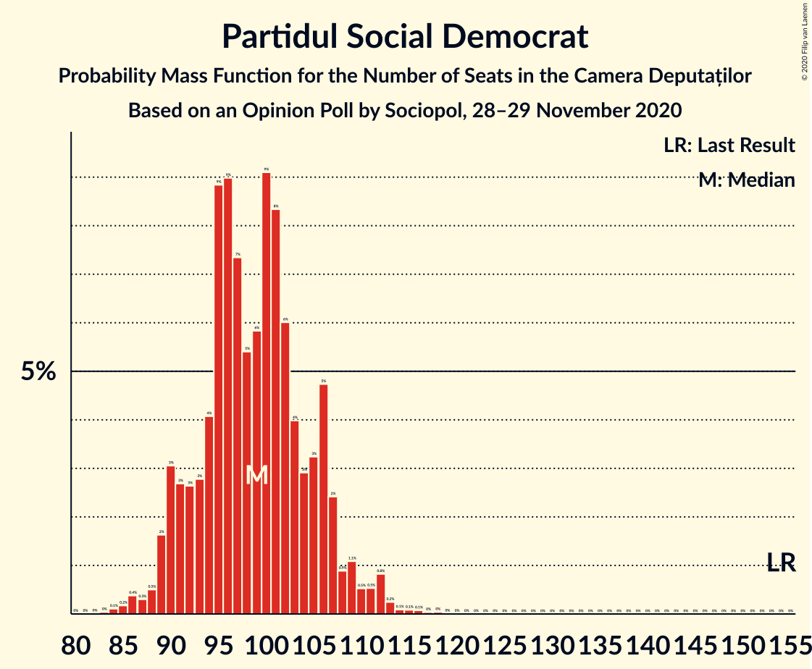

| Number of Seats | Probability | Accumulated | Special Marks |
|:---------------:|:-----------:|:-----------:|:-------------:|
| 83 | 0% | 100% |  |
| 84 | 0.1% | 99.9% |  |
| 85 | 0.2% | 99.8% |  |
| 86 | 0.4% | 99.6% |  |
| 87 | 0.3% | 99.3% |  |
| 88 | 0.5% | 99.0% |  |
| 89 | 2% | 98% |  |
| 90 | 3% | 97% |  |
| 91 | 3% | 94% |  |
| 92 | 3% | 91% |  |
| 93 | 3% | 88% |  |
| 94 | 4% | 86% |  |
| 95 | 9% | 82% |  |
| 96 | 9% | 73% |  |
| 97 | 7% | 64% |  |
| 98 | 5% | 56% |  |
| 99 | 6% | 51% | Median |
| 100 | 9% | 45% |  |
| 101 | 8% | 36% |  |
| 102 | 6% | 28% |  |
| 103 | 4% | 22% |  |
| 104 | 3% | 18% |  |
| 105 | 3% | 15% |  |
| 106 | 5% | 12% |  |
| 107 | 2% | 7% |  |
| 108 | 0.9% | 4% |  |
| 109 | 1.1% | 4% |  |
| 110 | 0.5% | 2% |  |
| 111 | 0.5% | 2% |  |
| 112 | 0.8% | 1.4% |  |
| 113 | 0.2% | 0.6% |  |
| 114 | 0.1% | 0.4% |  |
| 115 | 0.1% | 0.3% |  |
| 116 | 0.1% | 0.2% |  |
| 117 | 0% | 0.1% |  |
| 118 | 0% | 0.1% |  |
| 119 | 0% | 0% |  |
| 120 | 0% | 0% |  |
| 121 | 0% | 0% |  |
| 122 | 0% | 0% |  |
| 123 | 0% | 0% |  |
| 124 | 0% | 0% |  |
| 125 | 0% | 0% |  |
| 126 | 0% | 0% |  |
| 127 | 0% | 0% |  |
| 128 | 0% | 0% |  |
| 129 | 0% | 0% |  |
| 130 | 0% | 0% |  |
| 131 | 0% | 0% |  |
| 132 | 0% | 0% |  |
| 133 | 0% | 0% |  |
| 134 | 0% | 0% |  |
| 135 | 0% | 0% |  |
| 136 | 0% | 0% |  |
| 137 | 0% | 0% |  |
| 138 | 0% | 0% |  |
| 139 | 0% | 0% |  |
| 140 | 0% | 0% |  |
| 141 | 0% | 0% |  |
| 142 | 0% | 0% |  |
| 143 | 0% | 0% |  |
| 144 | 0% | 0% |  |
| 145 | 0% | 0% |  |
| 146 | 0% | 0% |  |
| 147 | 0% | 0% |  |
| 148 | 0% | 0% |  |
| 149 | 0% | 0% |  |
| 150 | 0% | 0% |  |
| 151 | 0% | 0% |  |
| 152 | 0% | 0% |  |
| 153 | 0% | 0% |  |
| 154 | 0% | 0% | Last Result |

### Alianța 2020 USR-PLUS

*For a full overview of the results for this party, see the [Alianța 2020 USR-PLUS](party-alianța2020usr-plus.html) page.*

| Number of Seats | Probability | Accumulated | Special Marks |
|:---------------:|:-----------:|:-----------:|:-------------:|
| 30 | 0% | 100% | Last Result |
| 31 | 0% | 100% |  |
| 32 | 0% | 100% |  |
| 33 | 0% | 100% |  |
| 34 | 0.1% | 100% |  |
| 35 | 0.1% | 99.9% |  |
| 36 | 0.3% | 99.8% |  |
| 37 | 0.7% | 99.5% |  |
| 38 | 0.9% | 98.9% |  |
| 39 | 4% | 98% |  |
| 40 | 2% | 94% |  |
| 41 | 6% | 92% |  |
| 42 | 5% | 86% |  |
| 43 | 9% | 81% |  |
| 44 | 11% | 73% |  |
| 45 | 7% | 61% |  |
| 46 | 12% | 55% | Median |
| 47 | 8% | 42% |  |
| 48 | 14% | 34% |  |
| 49 | 5% | 20% |  |
| 50 | 4% | 15% |  |
| 51 | 4% | 11% |  |
| 52 | 2% | 7% |  |
| 53 | 2% | 5% |  |
| 54 | 0.7% | 3% |  |
| 55 | 1.0% | 2% |  |
| 56 | 0.5% | 0.9% |  |
| 57 | 0.2% | 0.4% |  |
| 58 | 0.1% | 0.2% |  |
| 59 | 0% | 0.1% |  |
| 60 | 0% | 0% |  |

### Alianța pentru Unirea Românilor

*For a full overview of the results for this party, see the [Alianța pentru Unirea Românilor](party-alianțapentruunirearomânilor.html) page.*

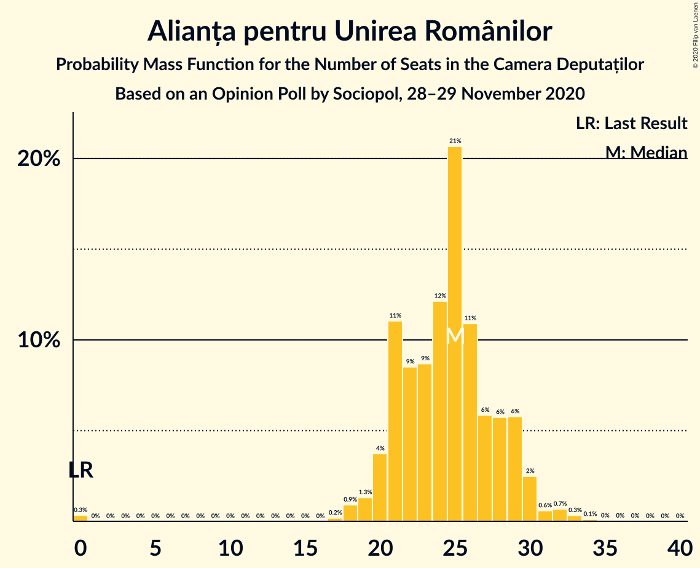

| Number of Seats | Probability | Accumulated | Special Marks |
|:---------------:|:-----------:|:-----------:|:-------------:|
| 0 | 0.3% | 100% | Last Result |
| 1 | 0% | 99.7% |  |
| 2 | 0% | 99.7% |  |
| 3 | 0% | 99.7% |  |
| 4 | 0% | 99.7% |  |
| 5 | 0% | 99.7% |  |
| 6 | 0% | 99.7% |  |
| 7 | 0% | 99.7% |  |
| 8 | 0% | 99.7% |  |
| 9 | 0% | 99.7% |  |
| 10 | 0% | 99.7% |  |
| 11 | 0% | 99.7% |  |
| 12 | 0% | 99.7% |  |
| 13 | 0% | 99.7% |  |
| 14 | 0% | 99.7% |  |
| 15 | 0% | 99.7% |  |
| 16 | 0% | 99.7% |  |
| 17 | 0.2% | 99.7% |  |
| 18 | 0.9% | 99.5% |  |
| 19 | 1.3% | 98.6% |  |
| 20 | 4% | 97% |  |
| 21 | 11% | 94% |  |
| 22 | 9% | 83% |  |
| 23 | 9% | 74% |  |
| 24 | 12% | 65% |  |
| 25 | 21% | 53% | Median |
| 26 | 11% | 32% |  |
| 27 | 6% | 22% |  |
| 28 | 6% | 16% |  |
| 29 | 6% | 10% |  |
| 30 | 2% | 4% |  |
| 31 | 0.6% | 2% |  |
| 32 | 0.7% | 1.2% |  |
| 33 | 0.3% | 0.5% |  |
| 34 | 0.1% | 0.2% |  |
| 35 | 0% | 0.1% |  |
| 36 | 0% | 0% |  |

### Uniunea Democrată Maghiară din România

*For a full overview of the results for this party, see the [Uniunea Democrată Maghiară din România](party-uniuneademocratămaghiarădinromânia.html) page.*

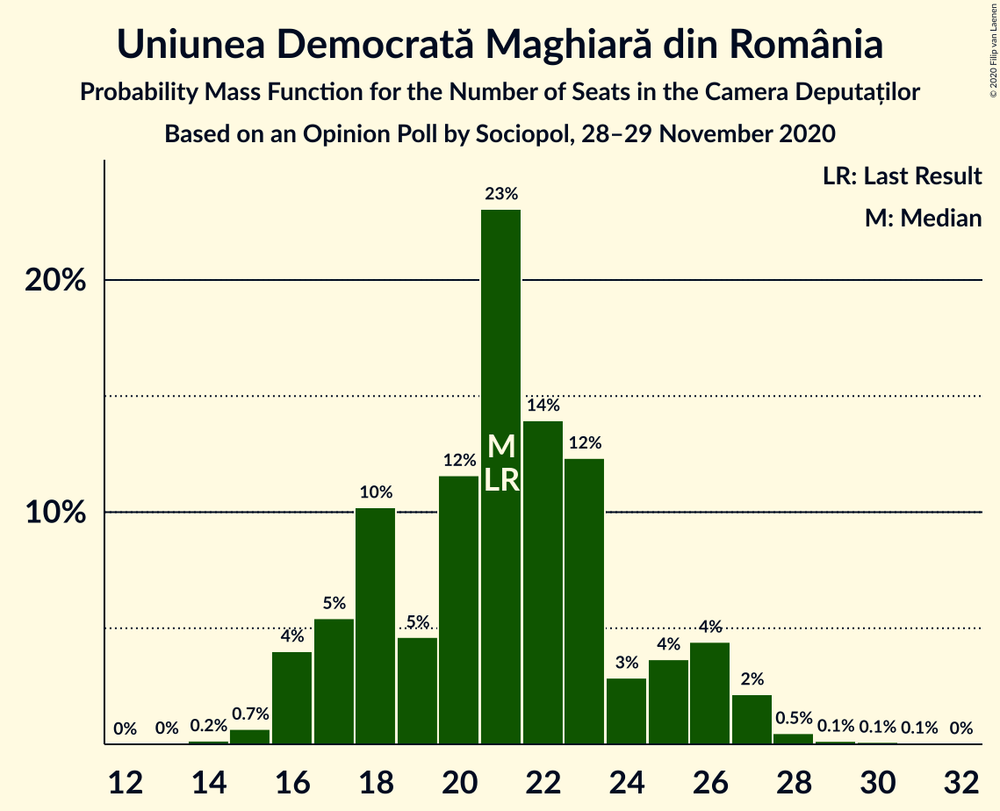

| Number of Seats | Probability | Accumulated | Special Marks |
|:---------------:|:-----------:|:-----------:|:-------------:|
| 13 | 0% | 100% |  |
| 14 | 0.2% | 99.9% |  |
| 15 | 0.7% | 99.8% |  |
| 16 | 4% | 99.1% |  |
| 17 | 5% | 95% |  |
| 18 | 10% | 90% |  |
| 19 | 5% | 79% |  |
| 20 | 12% | 75% |  |
| 21 | 23% | 63% | Last Result, Median |
| 22 | 14% | 40% |  |
| 23 | 12% | 26% |  |
| 24 | 3% | 14% |  |
| 25 | 4% | 11% |  |
| 26 | 4% | 7% |  |
| 27 | 2% | 3% |  |
| 28 | 0.5% | 0.8% |  |
| 29 | 0.1% | 0.3% |  |
| 30 | 0.1% | 0.2% |  |
| 31 | 0.1% | 0.1% |  |
| 32 | 0% | 0% |  |

### PRO România

*For a full overview of the results for this party, see the [PRO România](party-proromânia.html) page.*

| Number of Seats | Probability | Accumulated | Special Marks |
|:---------------:|:-----------:|:-----------:|:-------------:|
| 0 | 9% | 100% | Last Result |
| 1 | 0% | 91% |  |
| 2 | 0% | 91% |  |
| 3 | 0% | 91% |  |
| 4 | 0% | 91% |  |
| 5 | 0% | 91% |  |
| 6 | 0% | 91% |  |
| 7 | 0% | 91% |  |
| 8 | 0% | 91% |  |
| 9 | 0% | 91% |  |
| 10 | 0% | 91% |  |
| 11 | 0% | 91% |  |
| 12 | 0% | 91% |  |
| 13 | 0% | 91% |  |
| 14 | 0% | 91% |  |
| 15 | 0% | 91% |  |
| 16 | 0% | 91% |  |
| 17 | 2% | 91% |  |
| 18 | 6% | 89% |  |
| 19 | 11% | 83% |  |
| 20 | 23% | 72% | Median |
| 21 | 9% | 49% |  |
| 22 | 11% | 41% |  |
| 23 | 16% | 30% |  |
| 24 | 4% | 13% |  |
| 25 | 4% | 9% |  |
| 26 | 4% | 6% |  |
| 27 | 1.0% | 2% |  |
| 28 | 0.5% | 0.9% |  |
| 29 | 0.3% | 0.4% |  |
| 30 | 0.1% | 0.1% |  |
| 31 | 0% | 0.1% |  |
| 32 | 0% | 0% |  |

### Partidul Mișcarea Populară

*For a full overview of the results for this party, see the [Partidul Mișcarea Populară](party-partidulmișcareapopulară.html) page.*

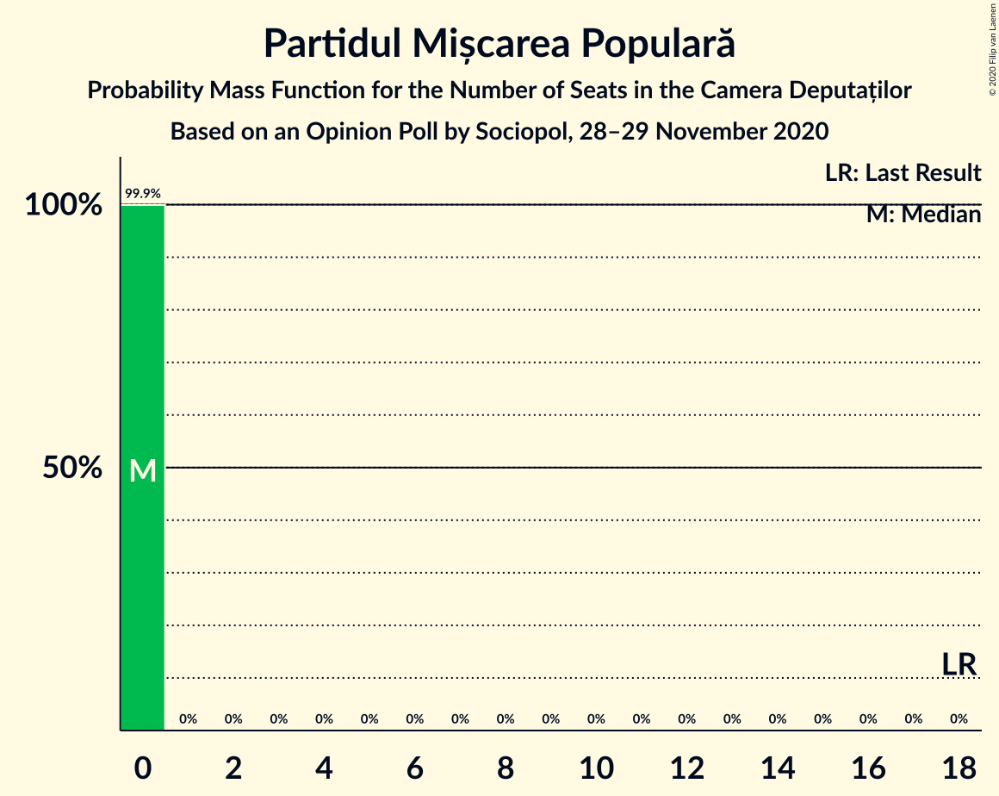

| Number of Seats | Probability | Accumulated | Special Marks |
|:---------------:|:-----------:|:-----------:|:-------------:|
| 0 | 99.9% | 100% | Median |
| 1 | 0% | 0.1% |  |
| 2 | 0% | 0.1% |  |
| 3 | 0% | 0.1% |  |
| 4 | 0% | 0.1% |  |
| 5 | 0% | 0.1% |  |
| 6 | 0% | 0.1% |  |
| 7 | 0% | 0.1% |  |
| 8 | 0% | 0.1% |  |
| 9 | 0% | 0.1% |  |
| 10 | 0% | 0.1% |  |
| 11 | 0% | 0.1% |  |
| 12 | 0% | 0.1% |  |
| 13 | 0% | 0.1% |  |
| 14 | 0% | 0.1% |  |
| 15 | 0% | 0.1% |  |
| 16 | 0% | 0.1% |  |
| 17 | 0% | 0.1% |  |
| 18 | 0% | 0% | Last Result |

## Coalitions

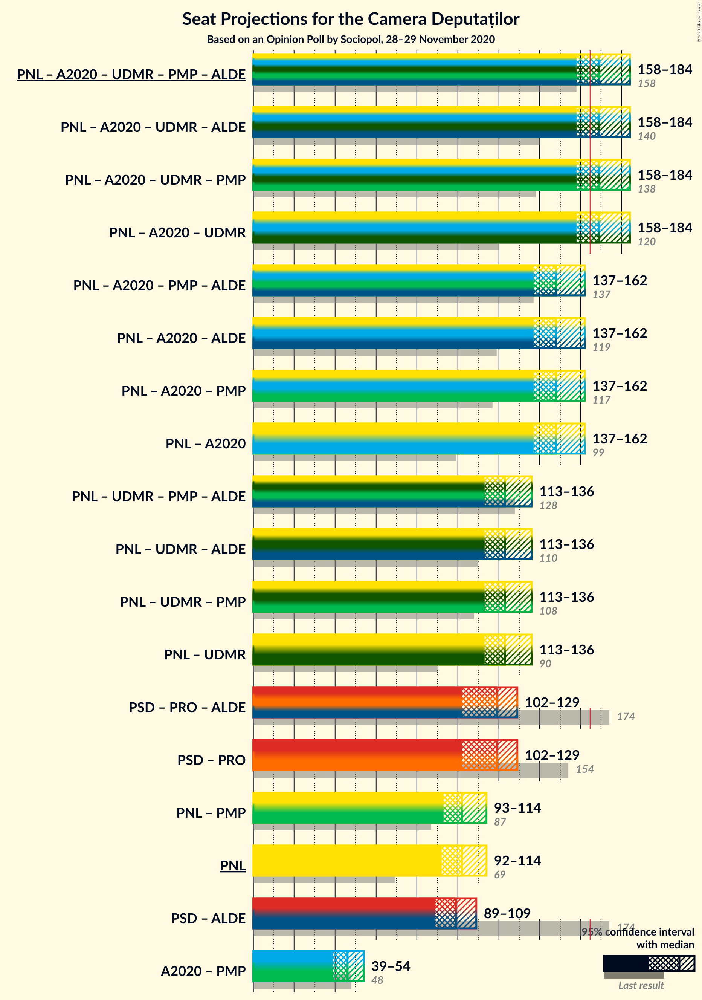

### Confidence Intervals

| Coalition | Last Result | Median | Majority? | 80% Confidence Interval | 90% Confidence Interval | 95% Confidence Interval | 99% Confidence Interval |
|:---------:|:-----------:|:------:|:---------:|:-----------------------:|:-----------------------:|:-----------------------:|:-----------------------:|
| Partidul Național Liberal – Alianța 2020 USR-PLUS – Uniunea Democrată Maghiară din România – Partidul Mișcarea Populară | 138 | 169 | 77% | 162–177 | 160–182 | 158–184 | 155–189 |
| Partidul Național Liberal – Alianța 2020 USR-PLUS – Uniunea Democrată Maghiară din România | 120 | 169 | 77% | 162–177 | 160–182 | 158–184 | 155–189 |
| Partidul Național Liberal – Alianța 2020 USR-PLUS – Partidul Mișcarea Populară | 117 | 148 | 1.1% | 141–156 | 139–159 | 137–162 | 134–167 |
| Partidul Național Liberal – Alianța 2020 USR-PLUS | 99 | 148 | 1.1% | 141–156 | 139–159 | 137–162 | 134–167 |
| Partidul Național Liberal – Uniunea Democrată Maghiară din România – Partidul Mișcarea Populară | 108 | 123 | 0% | 117–131 | 115–134 | 113–136 | 110–141 |
| Partidul Național Liberal – Uniunea Democrată Maghiară din România | 90 | 123 | 0% | 117–131 | 115–134 | 113–136 | 110–141 |
| Partidul Social Democrat – PRO România | 154 | 119 | 0% | 110–126 | 106–127 | 102–129 | 97–133 |
| Partidul Național Liberal – Partidul Mișcarea Populară | 87 | 102 | 0% | 96–110 | 94–112 | 93–114 | 90–118 |
| Partidul Național Liberal | 69 | 102 | 0% | 96–110 | 94–112 | 92–114 | 90–118 |
| Alianța 2020 USR-PLUS – Partidul Mișcarea Populară | 48 | 46 | 0% | 41–51 | 39–53 | 39–54 | 37–56 |

### Partidul Național Liberal – Alianța 2020 USR-PLUS – Uniunea Democrată Maghiară din România – Partidul Mișcarea Populară

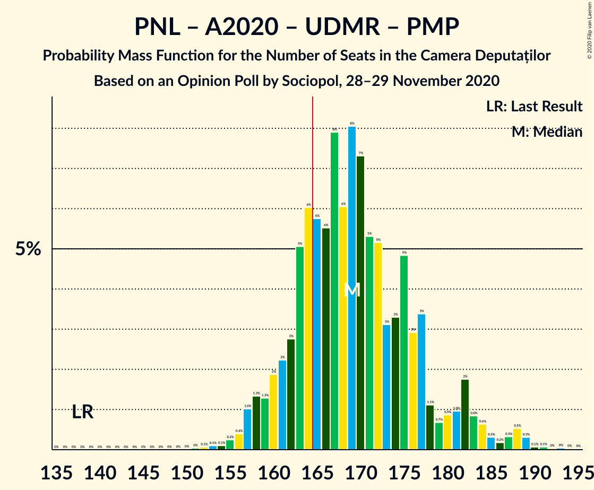

| Number of Seats | Probability | Accumulated | Special Marks |
|:---------------:|:-----------:|:-----------:|:-------------:|
| 138 | 0% | 100% | Last Result |
| 139 | 0% | 100% |  |
| 140 | 0% | 100% |  |
| 141 | 0% | 100% |  |
| 142 | 0% | 100% |  |
| 143 | 0% | 100% |  |
| 144 | 0% | 100% |  |
| 145 | 0% | 100% |  |
| 146 | 0% | 100% |  |
| 147 | 0% | 100% |  |
| 148 | 0% | 100% |  |
| 149 | 0% | 100% |  |
| 150 | 0% | 100% |  |
| 151 | 0% | 100% |  |
| 152 | 0.1% | 99.9% |  |
| 153 | 0.1% | 99.9% |  |
| 154 | 0.1% | 99.8% |  |
| 155 | 0.2% | 99.7% |  |
| 156 | 0.4% | 99.4% |  |
| 157 | 1.0% | 99.0% |  |
| 158 | 1.3% | 98% |  |
| 159 | 1.3% | 97% |  |
| 160 | 2% | 95% |  |
| 161 | 2% | 94% |  |
| 162 | 3% | 91% |  |
| 163 | 5% | 89% |  |
| 164 | 6% | 83% |  |
| 165 | 6% | 77% | Majority |
| 166 | 6% | 72% |  |
| 167 | 8% | 66% |  |
| 168 | 6% | 58% |  |
| 169 | 8% | 52% | Median |
| 170 | 7% | 44% |  |
| 171 | 5% | 37% |  |
| 172 | 5% | 32% |  |
| 173 | 3% | 26% |  |
| 174 | 3% | 23% |  |
| 175 | 5% | 20% |  |
| 176 | 3% | 15% |  |
| 177 | 3% | 12% |  |
| 178 | 1.1% | 9% |  |
| 179 | 0.7% | 8% |  |
| 180 | 0.9% | 7% |  |
| 181 | 1.0% | 6% |  |
| 182 | 2% | 5% |  |
| 183 | 0.8% | 3% |  |
| 184 | 0.6% | 3% |  |
| 185 | 0.3% | 2% |  |
| 186 | 0.2% | 2% |  |
| 187 | 0.3% | 1.5% |  |
| 188 | 0.5% | 1.1% |  |
| 189 | 0.3% | 0.6% |  |
| 190 | 0.1% | 0.3% |  |
| 191 | 0.1% | 0.2% |  |
| 192 | 0% | 0.2% |  |
| 193 | 0% | 0.1% |  |
| 194 | 0% | 0.1% |  |
| 195 | 0% | 0% |  |

### Partidul Național Liberal – Alianța 2020 USR-PLUS – Uniunea Democrată Maghiară din România

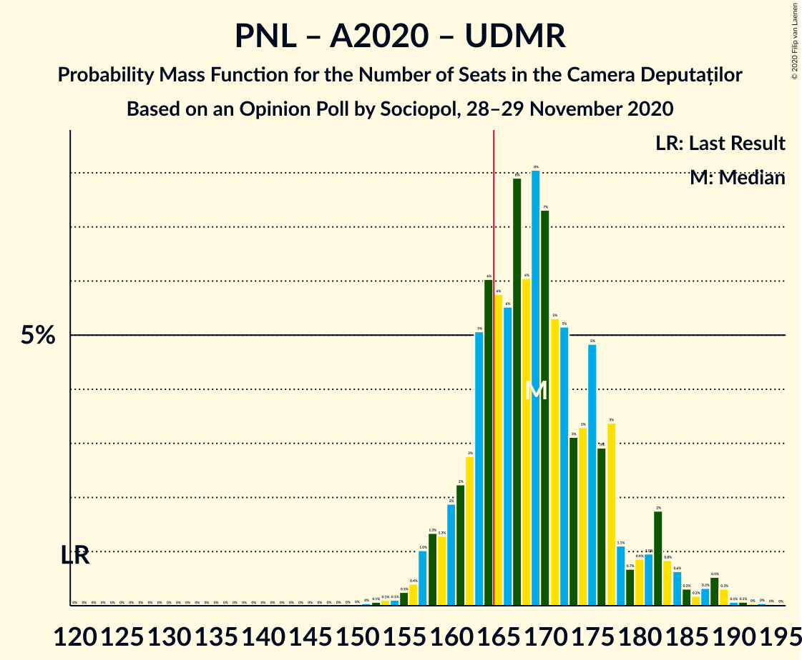

| Number of Seats | Probability | Accumulated | Special Marks |
|:---------------:|:-----------:|:-----------:|:-------------:|
| 120 | 0% | 100% | Last Result |
| 121 | 0% | 100% |  |
| 122 | 0% | 100% |  |
| 123 | 0% | 100% |  |
| 124 | 0% | 100% |  |
| 125 | 0% | 100% |  |
| 126 | 0% | 100% |  |
| 127 | 0% | 100% |  |
| 128 | 0% | 100% |  |
| 129 | 0% | 100% |  |
| 130 | 0% | 100% |  |
| 131 | 0% | 100% |  |
| 132 | 0% | 100% |  |
| 133 | 0% | 100% |  |
| 134 | 0% | 100% |  |
| 135 | 0% | 100% |  |
| 136 | 0% | 100% |  |
| 137 | 0% | 100% |  |
| 138 | 0% | 100% |  |
| 139 | 0% | 100% |  |
| 140 | 0% | 100% |  |
| 141 | 0% | 100% |  |
| 142 | 0% | 100% |  |
| 143 | 0% | 100% |  |
| 144 | 0% | 100% |  |
| 145 | 0% | 100% |  |
| 146 | 0% | 100% |  |
| 147 | 0% | 100% |  |
| 148 | 0% | 100% |  |
| 149 | 0% | 100% |  |
| 150 | 0% | 100% |  |
| 151 | 0% | 100% |  |
| 152 | 0.1% | 99.9% |  |
| 153 | 0.1% | 99.9% |  |
| 154 | 0.1% | 99.8% |  |
| 155 | 0.3% | 99.7% |  |
| 156 | 0.4% | 99.4% |  |
| 157 | 1.0% | 99.0% |  |
| 158 | 1.3% | 98% |  |
| 159 | 1.3% | 97% |  |
| 160 | 2% | 95% |  |
| 161 | 2% | 93% |  |
| 162 | 3% | 91% |  |
| 163 | 5% | 88% |  |
| 164 | 6% | 83% |  |
| 165 | 6% | 77% | Majority |
| 166 | 6% | 72% |  |
| 167 | 8% | 66% |  |
| 168 | 6% | 58% |  |
| 169 | 8% | 52% | Median |
| 170 | 7% | 44% |  |
| 171 | 5% | 37% |  |
| 172 | 5% | 31% |  |
| 173 | 3% | 26% |  |
| 174 | 3% | 23% |  |
| 175 | 5% | 20% |  |
| 176 | 3% | 15% |  |
| 177 | 3% | 12% |  |
| 178 | 1.1% | 9% |  |
| 179 | 0.7% | 8% |  |
| 180 | 0.9% | 7% |  |
| 181 | 1.0% | 6% |  |
| 182 | 2% | 5% |  |
| 183 | 0.8% | 3% |  |
| 184 | 0.6% | 3% |  |
| 185 | 0.3% | 2% |  |
| 186 | 0.2% | 2% |  |
| 187 | 0.3% | 1.4% |  |
| 188 | 0.5% | 1.1% |  |
| 189 | 0.3% | 0.6% |  |
| 190 | 0.1% | 0.3% |  |
| 191 | 0.1% | 0.2% |  |
| 192 | 0% | 0.1% |  |
| 193 | 0% | 0.1% |  |
| 194 | 0% | 0.1% |  |
| 195 | 0% | 0% |  |

### Partidul Național Liberal – Alianța 2020 USR-PLUS – Partidul Mișcarea Populară

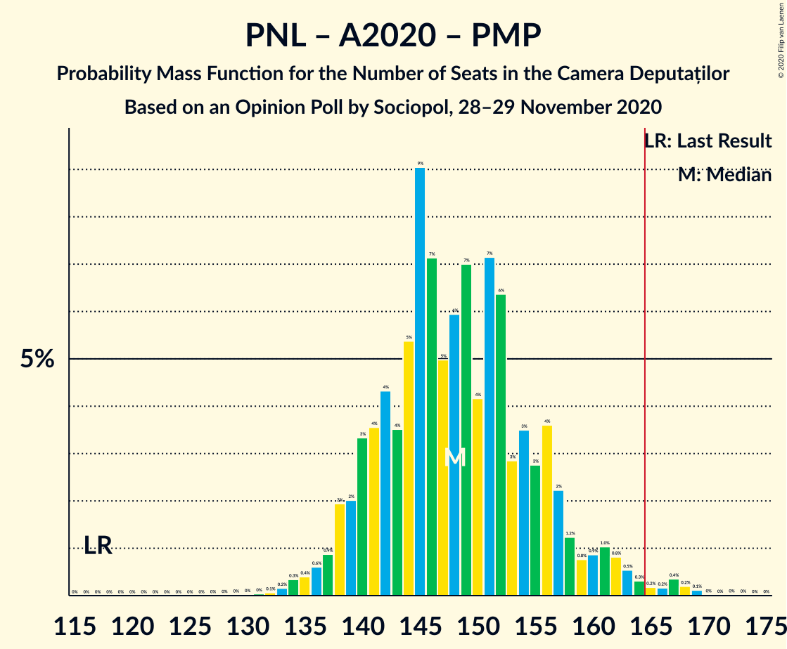

| Number of Seats | Probability | Accumulated | Special Marks |
|:---------------:|:-----------:|:-----------:|:-------------:|
| 117 | 0% | 100% | Last Result |
| 118 | 0% | 100% |  |
| 119 | 0% | 100% |  |
| 120 | 0% | 100% |  |
| 121 | 0% | 100% |  |
| 122 | 0% | 100% |  |
| 123 | 0% | 100% |  |
| 124 | 0% | 100% |  |
| 125 | 0% | 100% |  |
| 126 | 0% | 100% |  |
| 127 | 0% | 100% |  |
| 128 | 0% | 100% |  |
| 129 | 0% | 100% |  |
| 130 | 0% | 100% |  |
| 131 | 0% | 99.9% |  |
| 132 | 0.1% | 99.9% |  |
| 133 | 0.2% | 99.8% |  |
| 134 | 0.3% | 99.7% |  |
| 135 | 0.4% | 99.3% |  |
| 136 | 0.6% | 98.9% |  |
| 137 | 0.9% | 98% |  |
| 138 | 2% | 97% |  |
| 139 | 2% | 96% |  |
| 140 | 3% | 94% |  |
| 141 | 4% | 90% |  |
| 142 | 4% | 87% |  |
| 143 | 4% | 82% |  |
| 144 | 5% | 79% |  |
| 145 | 9% | 73% |  |
| 146 | 7% | 64% |  |
| 147 | 5% | 57% |  |
| 148 | 6% | 52% | Median |
| 149 | 7% | 46% |  |
| 150 | 4% | 39% |  |
| 151 | 7% | 35% |  |
| 152 | 6% | 28% |  |
| 153 | 3% | 22% |  |
| 154 | 3% | 19% |  |
| 155 | 3% | 15% |  |
| 156 | 4% | 12% |  |
| 157 | 2% | 9% |  |
| 158 | 1.2% | 7% |  |
| 159 | 0.8% | 5% |  |
| 160 | 0.9% | 5% |  |
| 161 | 1.0% | 4% |  |
| 162 | 0.8% | 3% |  |
| 163 | 0.5% | 2% |  |
| 164 | 0.3% | 1.4% |  |
| 165 | 0.2% | 1.1% | Majority |
| 166 | 0.2% | 0.9% |  |
| 167 | 0.4% | 0.8% |  |
| 168 | 0.2% | 0.4% |  |
| 169 | 0.1% | 0.2% |  |
| 170 | 0% | 0.1% |  |
| 171 | 0% | 0.1% |  |
| 172 | 0% | 0.1% |  |
| 173 | 0% | 0% |  |

### Partidul Național Liberal – Alianța 2020 USR-PLUS

| Number of Seats | Probability | Accumulated | Special Marks |
|:---------------:|:-----------:|:-----------:|:-------------:|
| 99 | 0% | 100% | Last Result |
| 100 | 0% | 100% |  |
| 101 | 0% | 100% |  |
| 102 | 0% | 100% |  |
| 103 | 0% | 100% |  |
| 104 | 0% | 100% |  |
| 105 | 0% | 100% |  |
| 106 | 0% | 100% |  |
| 107 | 0% | 100% |  |
| 108 | 0% | 100% |  |
| 109 | 0% | 100% |  |
| 110 | 0% | 100% |  |
| 111 | 0% | 100% |  |
| 112 | 0% | 100% |  |
| 113 | 0% | 100% |  |
| 114 | 0% | 100% |  |
| 115 | 0% | 100% |  |
| 116 | 0% | 100% |  |
| 117 | 0% | 100% |  |
| 118 | 0% | 100% |  |
| 119 | 0% | 100% |  |
| 120 | 0% | 100% |  |
| 121 | 0% | 100% |  |
| 122 | 0% | 100% |  |
| 123 | 0% | 100% |  |
| 124 | 0% | 100% |  |
| 125 | 0% | 100% |  |
| 126 | 0% | 100% |  |
| 127 | 0% | 100% |  |
| 128 | 0% | 100% |  |
| 129 | 0% | 100% |  |
| 130 | 0% | 100% |  |
| 131 | 0% | 99.9% |  |
| 132 | 0.1% | 99.9% |  |
| 133 | 0.2% | 99.8% |  |
| 134 | 0.3% | 99.7% |  |
| 135 | 0.4% | 99.3% |  |
| 136 | 0.6% | 98.9% |  |
| 137 | 0.9% | 98% |  |
| 138 | 2% | 97% |  |
| 139 | 2% | 95% |  |
| 140 | 3% | 93% |  |
| 141 | 4% | 90% |  |
| 142 | 4% | 87% |  |
| 143 | 4% | 82% |  |
| 144 | 5% | 79% |  |
| 145 | 9% | 73% |  |
| 146 | 7% | 64% |  |
| 147 | 5% | 57% |  |
| 148 | 6% | 52% | Median |
| 149 | 7% | 46% |  |
| 150 | 4% | 39% |  |
| 151 | 7% | 35% |  |
| 152 | 6% | 28% |  |
| 153 | 3% | 22% |  |
| 154 | 3% | 19% |  |
| 155 | 3% | 15% |  |
| 156 | 4% | 12% |  |
| 157 | 2% | 9% |  |
| 158 | 1.2% | 7% |  |
| 159 | 0.8% | 5% |  |
| 160 | 0.9% | 5% |  |
| 161 | 1.0% | 4% |  |
| 162 | 0.8% | 3% |  |
| 163 | 0.5% | 2% |  |
| 164 | 0.3% | 1.4% |  |
| 165 | 0.2% | 1.1% | Majority |
| 166 | 0.2% | 0.9% |  |
| 167 | 0.4% | 0.7% |  |
| 168 | 0.2% | 0.4% |  |
| 169 | 0.1% | 0.2% |  |
| 170 | 0% | 0.1% |  |
| 171 | 0% | 0.1% |  |
| 172 | 0% | 0% |  |

### Partidul Național Liberal – Uniunea Democrată Maghiară din România – Partidul Mișcarea Populară

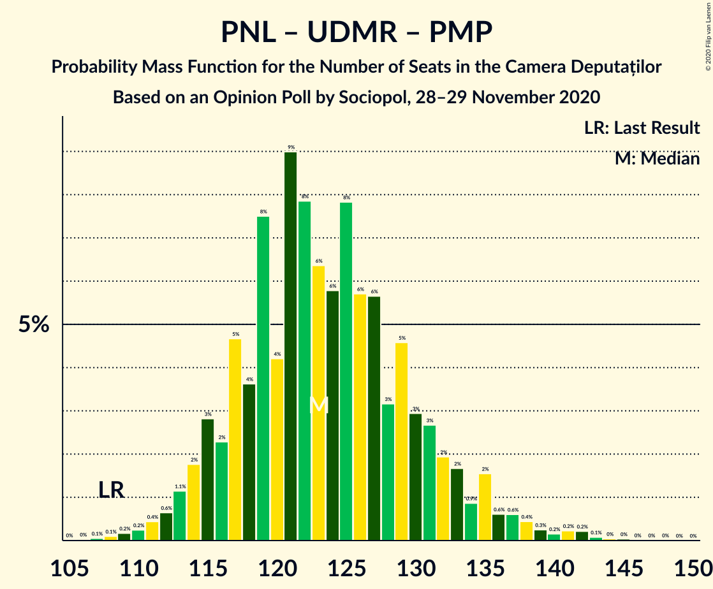

| Number of Seats | Probability | Accumulated | Special Marks |
|:---------------:|:-----------:|:-----------:|:-------------:|
| 106 | 0% | 100% |  |
| 107 | 0.1% | 99.9% |  |
| 108 | 0.1% | 99.9% | Last Result |
| 109 | 0.2% | 99.8% |  |
| 110 | 0.2% | 99.6% |  |
| 111 | 0.4% | 99.4% |  |
| 112 | 0.6% | 98.9% |  |
| 113 | 1.1% | 98% |  |
| 114 | 2% | 97% |  |
| 115 | 3% | 95% |  |
| 116 | 2% | 93% |  |
| 117 | 5% | 90% |  |
| 118 | 4% | 86% |  |
| 119 | 8% | 82% |  |
| 120 | 4% | 74% |  |
| 121 | 9% | 70% |  |
| 122 | 8% | 61% |  |
| 123 | 6% | 53% | Median |
| 124 | 6% | 47% |  |
| 125 | 8% | 41% |  |
| 126 | 6% | 33% |  |
| 127 | 6% | 28% |  |
| 128 | 3% | 22% |  |
| 129 | 5% | 19% |  |
| 130 | 3% | 14% |  |
| 131 | 3% | 11% |  |
| 132 | 2% | 9% |  |
| 133 | 2% | 7% |  |
| 134 | 0.9% | 5% |  |
| 135 | 2% | 4% |  |
| 136 | 0.6% | 3% |  |
| 137 | 0.6% | 2% |  |
| 138 | 0.4% | 1.5% |  |
| 139 | 0.3% | 1.1% |  |
| 140 | 0.2% | 0.8% |  |
| 141 | 0.2% | 0.6% |  |
| 142 | 0.2% | 0.4% |  |
| 143 | 0.1% | 0.2% |  |
| 144 | 0% | 0.1% |  |
| 145 | 0% | 0.1% |  |
| 146 | 0% | 0% |  |

### Partidul Național Liberal – Uniunea Democrată Maghiară din România

| Number of Seats | Probability | Accumulated | Special Marks |
|:---------------:|:-----------:|:-----------:|:-------------:|
| 90 | 0% | 100% | Last Result |
| 91 | 0% | 100% |  |
| 92 | 0% | 100% |  |
| 93 | 0% | 100% |  |
| 94 | 0% | 100% |  |
| 95 | 0% | 100% |  |
| 96 | 0% | 100% |  |
| 97 | 0% | 100% |  |
| 98 | 0% | 100% |  |
| 99 | 0% | 100% |  |
| 100 | 0% | 100% |  |
| 101 | 0% | 100% |  |
| 102 | 0% | 100% |  |
| 103 | 0% | 100% |  |
| 104 | 0% | 100% |  |
| 105 | 0% | 100% |  |
| 106 | 0% | 100% |  |
| 107 | 0.1% | 99.9% |  |
| 108 | 0.1% | 99.9% |  |
| 109 | 0.2% | 99.8% |  |
| 110 | 0.2% | 99.6% |  |
| 111 | 0.4% | 99.4% |  |
| 112 | 0.6% | 98.9% |  |
| 113 | 1.2% | 98% |  |
| 114 | 2% | 97% |  |
| 115 | 3% | 95% |  |
| 116 | 2% | 93% |  |
| 117 | 5% | 90% |  |
| 118 | 4% | 86% |  |
| 119 | 8% | 82% |  |
| 120 | 4% | 74% |  |
| 121 | 9% | 70% |  |
| 122 | 8% | 61% |  |
| 123 | 6% | 53% | Median |
| 124 | 6% | 47% |  |
| 125 | 8% | 41% |  |
| 126 | 6% | 33% |  |
| 127 | 6% | 28% |  |
| 128 | 3% | 22% |  |
| 129 | 5% | 19% |  |
| 130 | 3% | 14% |  |
| 131 | 3% | 11% |  |
| 132 | 2% | 9% |  |
| 133 | 2% | 7% |  |
| 134 | 0.9% | 5% |  |
| 135 | 2% | 4% |  |
| 136 | 0.6% | 3% |  |
| 137 | 0.6% | 2% |  |
| 138 | 0.4% | 1.5% |  |
| 139 | 0.2% | 1.0% |  |
| 140 | 0.2% | 0.8% |  |
| 141 | 0.2% | 0.6% |  |
| 142 | 0.2% | 0.4% |  |
| 143 | 0.1% | 0.2% |  |
| 144 | 0% | 0.1% |  |
| 145 | 0% | 0.1% |  |
| 146 | 0% | 0% |  |

### Partidul Social Democrat – PRO România

| Number of Seats | Probability | Accumulated | Special Marks |
|:---------------:|:-----------:|:-----------:|:-------------:|
| 94 | 0.1% | 100% |  |
| 95 | 0.1% | 99.9% |  |
| 96 | 0.2% | 99.7% |  |
| 97 | 0.1% | 99.6% |  |
| 98 | 0.2% | 99.4% |  |
| 99 | 0.2% | 99.3% |  |
| 100 | 0.5% | 99.1% |  |
| 101 | 0.8% | 98.6% |  |
| 102 | 0.5% | 98% |  |
| 103 | 0.7% | 97% |  |
| 104 | 0.3% | 97% |  |
| 105 | 0.9% | 96% |  |
| 106 | 0.9% | 95% |  |
| 107 | 1.2% | 94% |  |
| 108 | 0.8% | 93% |  |
| 109 | 1.2% | 92% |  |
| 110 | 2% | 91% |  |
| 111 | 2% | 89% |  |
| 112 | 3% | 87% |  |
| 113 | 3% | 85% |  |
| 114 | 4% | 81% |  |
| 115 | 6% | 77% |  |
| 116 | 5% | 71% |  |
| 117 | 6% | 66% |  |
| 118 | 8% | 60% |  |
| 119 | 7% | 53% | Median |
| 120 | 8% | 46% |  |
| 121 | 6% | 37% |  |
| 122 | 6% | 31% |  |
| 123 | 6% | 25% |  |
| 124 | 5% | 20% |  |
| 125 | 4% | 15% |  |
| 126 | 3% | 11% |  |
| 127 | 3% | 8% |  |
| 128 | 1.5% | 5% |  |
| 129 | 1.3% | 3% |  |
| 130 | 0.8% | 2% |  |
| 131 | 0.5% | 1.4% |  |
| 132 | 0.3% | 0.9% |  |
| 133 | 0.2% | 0.6% |  |
| 134 | 0.1% | 0.3% |  |
| 135 | 0.1% | 0.2% |  |
| 136 | 0.1% | 0.1% |  |
| 137 | 0% | 0.1% |  |
| 138 | 0% | 0% |  |
| 139 | 0% | 0% |  |
| 140 | 0% | 0% |  |
| 141 | 0% | 0% |  |
| 142 | 0% | 0% |  |
| 143 | 0% | 0% |  |
| 144 | 0% | 0% |  |
| 145 | 0% | 0% |  |
| 146 | 0% | 0% |  |
| 147 | 0% | 0% |  |
| 148 | 0% | 0% |  |
| 149 | 0% | 0% |  |
| 150 | 0% | 0% |  |
| 151 | 0% | 0% |  |
| 152 | 0% | 0% |  |
| 153 | 0% | 0% |  |
| 154 | 0% | 0% | Last Result |

### Partidul Național Liberal – Partidul Mișcarea Populară

| Number of Seats | Probability | Accumulated | Special Marks |
|:---------------:|:-----------:|:-----------:|:-------------:|
| 87 | 0.1% | 100% | Last Result |
| 88 | 0.1% | 99.9% |  |
| 89 | 0.3% | 99.8% |  |
| 90 | 0.4% | 99.5% |  |
| 91 | 0.7% | 99.2% |  |
| 92 | 1.0% | 98% |  |
| 93 | 1.0% | 98% |  |
| 94 | 2% | 96% |  |
| 95 | 3% | 94% |  |
| 96 | 4% | 91% |  |
| 97 | 6% | 88% |  |
| 98 | 6% | 82% |  |
| 99 | 9% | 76% |  |
| 100 | 6% | 67% |  |
| 101 | 7% | 62% |  |
| 102 | 6% | 55% | Median |
| 103 | 8% | 49% |  |
| 104 | 6% | 41% |  |
| 105 | 9% | 35% |  |
| 106 | 5% | 27% |  |
| 107 | 5% | 22% |  |
| 108 | 3% | 16% |  |
| 109 | 2% | 13% |  |
| 110 | 3% | 10% |  |
| 111 | 2% | 7% |  |
| 112 | 2% | 6% |  |
| 113 | 0.8% | 4% |  |
| 114 | 1.1% | 3% |  |
| 115 | 0.8% | 2% |  |
| 116 | 0.4% | 1.3% |  |
| 117 | 0.2% | 1.0% |  |
| 118 | 0.3% | 0.7% |  |
| 119 | 0.1% | 0.4% |  |
| 120 | 0.1% | 0.3% |  |
| 121 | 0.1% | 0.2% |  |
| 122 | 0% | 0.1% |  |
| 123 | 0% | 0% |  |

### Partidul Național Liberal

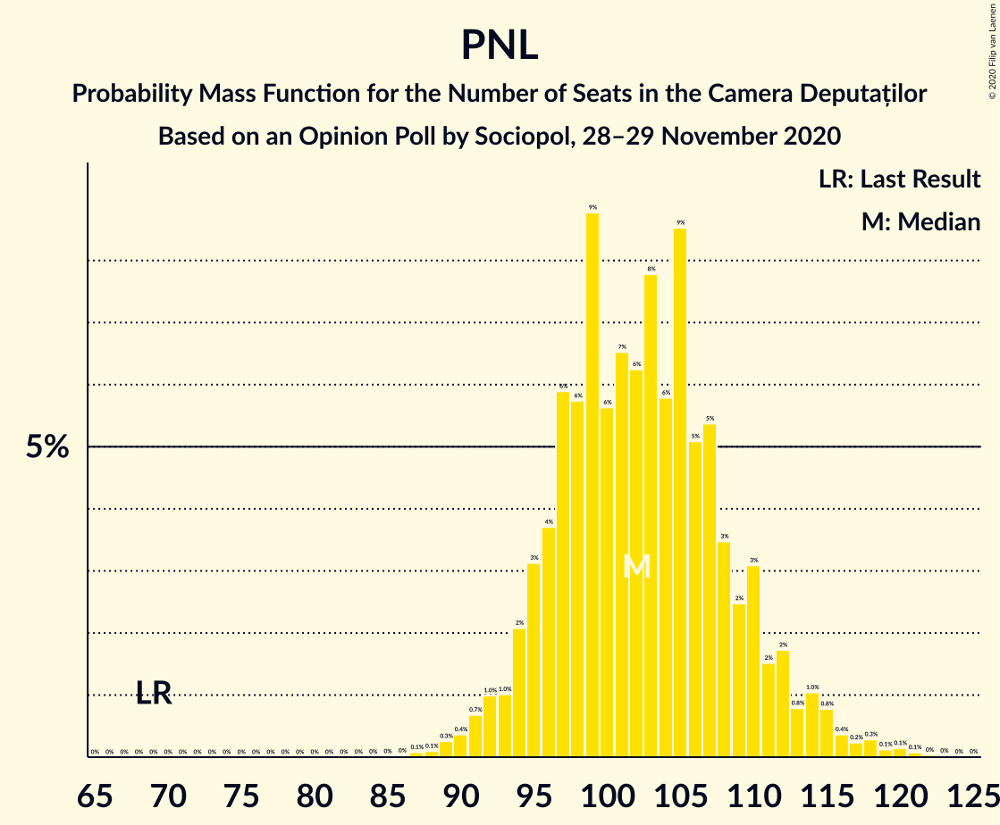

| Number of Seats | Probability | Accumulated | Special Marks |
|:---------------:|:-----------:|:-----------:|:-------------:|
| 69 | 0% | 100% | Last Result |
| 70 | 0% | 100% |  |
| 71 | 0% | 100% |  |
| 72 | 0% | 100% |  |
| 73 | 0% | 100% |  |
| 74 | 0% | 100% |  |
| 75 | 0% | 100% |  |
| 76 | 0% | 100% |  |
| 77 | 0% | 100% |  |
| 78 | 0% | 100% |  |
| 79 | 0% | 100% |  |
| 80 | 0% | 100% |  |
| 81 | 0% | 100% |  |
| 82 | 0% | 100% |  |
| 83 | 0% | 100% |  |
| 84 | 0% | 100% |  |
| 85 | 0% | 100% |  |
| 86 | 0% | 100% |  |
| 87 | 0.1% | 100% |  |
| 88 | 0.1% | 99.9% |  |
| 89 | 0.3% | 99.8% |  |
| 90 | 0.4% | 99.5% |  |
| 91 | 0.7% | 99.2% |  |
| 92 | 1.0% | 98% |  |
| 93 | 1.0% | 97% |  |
| 94 | 2% | 96% |  |
| 95 | 3% | 94% |  |
| 96 | 4% | 91% |  |
| 97 | 6% | 88% |  |
| 98 | 6% | 82% |  |
| 99 | 9% | 76% |  |
| 100 | 6% | 67% |  |
| 101 | 7% | 62% |  |
| 102 | 6% | 55% | Median |
| 103 | 8% | 49% |  |
| 104 | 6% | 41% |  |
| 105 | 9% | 35% |  |
| 106 | 5% | 27% |  |
| 107 | 5% | 22% |  |
| 108 | 3% | 16% |  |
| 109 | 2% | 13% |  |
| 110 | 3% | 10% |  |
| 111 | 2% | 7% |  |
| 112 | 2% | 6% |  |
| 113 | 0.8% | 4% |  |
| 114 | 1.0% | 3% |  |
| 115 | 0.8% | 2% |  |
| 116 | 0.4% | 1.3% |  |
| 117 | 0.2% | 0.9% |  |
| 118 | 0.3% | 0.7% |  |
| 119 | 0.1% | 0.4% |  |
| 120 | 0.1% | 0.3% |  |
| 121 | 0.1% | 0.2% |  |
| 122 | 0% | 0.1% |  |
| 123 | 0% | 0% |  |

### Alianța 2020 USR-PLUS – Partidul Mișcarea Populară

| Number of Seats | Probability | Accumulated | Special Marks |
|:---------------:|:-----------:|:-----------:|:-------------:|
| 34 | 0.1% | 100% |  |
| 35 | 0.1% | 99.9% |  |
| 36 | 0.3% | 99.8% |  |
| 37 | 0.7% | 99.5% |  |
| 38 | 0.9% | 98.9% |  |
| 39 | 4% | 98% |  |
| 40 | 2% | 94% |  |
| 41 | 6% | 92% |  |
| 42 | 5% | 86% |  |
| 43 | 9% | 81% |  |
| 44 | 11% | 73% |  |
| 45 | 7% | 61% |  |
| 46 | 12% | 55% | Median |
| 47 | 8% | 42% |  |
| 48 | 14% | 34% | Last Result |
| 49 | 5% | 20% |  |
| 50 | 4% | 15% |  |
| 51 | 4% | 11% |  |
| 52 | 2% | 7% |  |
| 53 | 2% | 5% |  |
| 54 | 0.7% | 3% |  |
| 55 | 1.0% | 2% |  |
| 56 | 0.5% | 1.0% |  |
| 57 | 0.2% | 0.5% |  |
| 58 | 0.1% | 0.2% |  |
| 59 | 0.1% | 0.1% |  |
| 60 | 0% | 0.1% |  |
| 61 | 0% | 0.1% |  |
| 62 | 0% | 0% |  |

## Technical Information

### Opinion Poll

+ **Polling firm:** Sociopol
+ **Commissioner(s):** —
+ **Fieldwork period:** 28–29 November 2020

### Calculations

+ **Sample size:** 1033
+ **Simulations done:** 1,048,576
+ **Error estimate:** 1.36%

