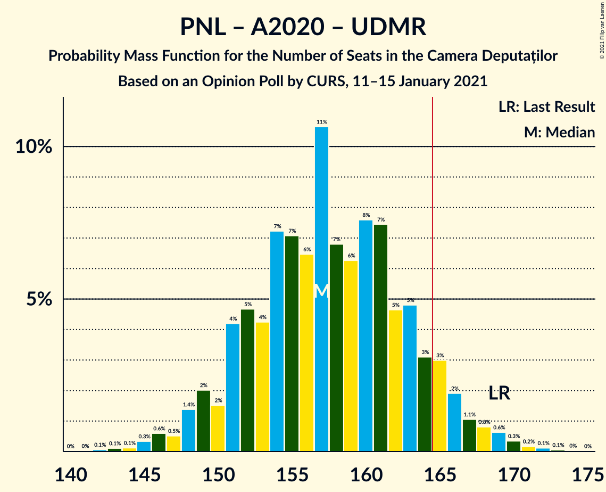
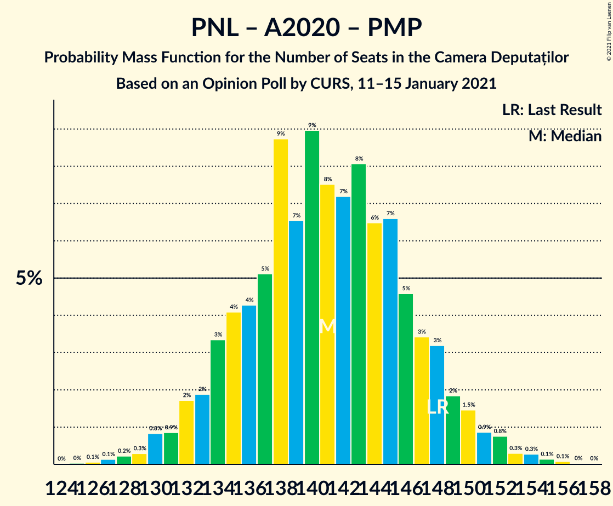

# Opinion Poll by CURS, 11–15 January 2021

<a href="#voting-intentions">Voting Intentions</a> | <a href="#seats">Seats</a> | <a href="#coalitions">Coalitions</a> | <a href="#technical-information">Technical Information</a>

## Voting Intentions

### Confidence Intervals

| Party | Last Result | Poll Result | 80% Confidence Interval | 90% Confidence Interval | 95% Confidence Interval | 99% Confidence Interval |
|:-----:|:-----------:|:-----------:|:-----------------------:|:-----------------------:|:-----------------------:|:-----------------------:|
| Partidul Social Democrat | 28.9% | 34.0% | 32.2–35.9% |31.7–36.4% |31.3–36.9% |30.4–37.8% |
| Partidul Național Liberal | 25.2% | 26.0% | 24.4–27.8% |23.9–28.2% |23.5–28.7% |22.7–29.5% |
| Alianța 2020 USR-PLUS | 15.4% | 16.0% | 14.6–17.5% |14.3–17.9% |13.9–18.3% |13.3–19.0% |
| Alianța pentru Unirea Românilor | 9.1% | 12.0% | 10.8–13.4% |10.5–13.7% |10.2–14.1% |9.7–14.7% |
| Uniunea Democrată Maghiară din România | 5.7% | 5.0% | 4.3–6.0% |4.0–6.2% |3.9–6.5% |3.5–7.0% |
| Partidul Mișcarea Populară | 4.8% | 3.0% | 2.4–3.8% |2.3–4.0% |2.1–4.2% |1.9–4.6% |
| PRO România | 4.1% | 2.0% | 1.6–2.7% |1.4–2.9% |1.3–3.0% |1.1–3.4% |

*Note:* The poll result column reflects the actual value used in the calculations. Published results may vary slightly, and in addition be rounded to fewer digits.

## Seats

### Confidence Intervals

| Party | Last Result | Median | 80% Confidence Interval | 90% Confidence Interval | 95% Confidence Interval | 99% Confidence Interval |
|:-----:|:-----------:|:------:|:-----------------------:|:-----------------------:|:-----------------------:|:-----------------------:|
| <a href="#partidul-social-democrat">Partidul Social Democrat</a> | 110 | 114 | 108–120 |106–122 |105–124 |102–127 |
| <a href="#partidul-național-liberal">Partidul Național Liberal</a> | 93 | 87 | 82–93 |80–95 |79–96 |76–99 |
| <a href="#alianța-2020-usr-plus">Alianța 2020 USR-PLUS</a> | 55 | 53 | 49–58 |48–60 |47–61 |45–64 |
| <a href="#alianța-pentru-unirea-românilor">Alianța pentru Unirea Românilor</a> | 33 | 40 | 36–44 |35–46 |34–47 |32–49 |
| <a href="#uniunea-democrată-maghiară-din-românia">Uniunea Democrată Maghiară din România</a> | 21 | 17 | 14–20 |13–21 |13–21 |11–23 |
| <a href="#partidul-mișcarea-populară">Partidul Mișcarea Populară</a> | 0 | 0 | 0 |0 |0 |0 |
| <a href="#pro-românia">PRO România</a> | 0 | 0 | 0 |0 |0 |0 |

### Partidul Social Democrat

*For a full overview of the results for this party, see the [Partidul Social Democrat](party-partidulsocialdemocrat.html) page.*

| Number of Seats | Probability | Accumulated | Special Marks |
|:---------------:|:-----------:|:-----------:|:-------------:|
| 99 | 0% | 100% |  |
| 100 | 0.1% | 99.9% |  |
| 101 | 0.2% | 99.8% |  |
| 102 | 0.3% | 99.7% |  |
| 103 | 0.4% | 99.3% |  |
| 104 | 0.8% | 98.9% |  |
| 105 | 1.2% | 98% |  |
| 106 | 2% | 97% |  |
| 107 | 3% | 95% |  |
| 108 | 3% | 92% |  |
| 109 | 5% | 89% |  |
| 110 | 6% | 84% | Last Result |
| 111 | 8% | 78% |  |
| 112 | 7% | 71% |  |
| 113 | 7% | 64% |  |
| 114 | 8% | 57% | Median |
| 115 | 9% | 48% |  |
| 116 | 7% | 39% |  |
| 117 | 7% | 32% |  |
| 118 | 6% | 25% |  |
| 119 | 6% | 19% |  |
| 120 | 4% | 13% |  |
| 121 | 2% | 9% |  |
| 122 | 2% | 6% |  |
| 123 | 1.3% | 4% |  |
| 124 | 1.2% | 3% |  |
| 125 | 0.7% | 2% |  |
| 126 | 0.3% | 0.9% |  |
| 127 | 0.2% | 0.5% |  |
| 128 | 0.1% | 0.3% |  |
| 129 | 0.1% | 0.2% |  |
| 130 | 0.1% | 0.1% |  |
| 131 | 0% | 0% |  |

### Partidul Național Liberal

*For a full overview of the results for this party, see the [Partidul Național Liberal](party-partidulnaționalliberal.html) page.*

| Number of Seats | Probability | Accumulated | Special Marks |
|:---------------:|:-----------:|:-----------:|:-------------:|
| 73 | 0% | 100% |  |
| 74 | 0.1% | 99.9% |  |
| 75 | 0.2% | 99.9% |  |
| 76 | 0.3% | 99.7% |  |
| 77 | 0.7% | 99.4% |  |
| 78 | 0.9% | 98.8% |  |
| 79 | 2% | 98% |  |
| 80 | 2% | 96% |  |
| 81 | 3% | 94% |  |
| 82 | 5% | 91% |  |
| 83 | 7% | 86% |  |
| 84 | 7% | 79% |  |
| 85 | 8% | 73% |  |
| 86 | 7% | 65% |  |
| 87 | 10% | 58% | Median |
| 88 | 9% | 47% |  |
| 89 | 8% | 38% |  |
| 90 | 6% | 30% |  |
| 91 | 7% | 24% |  |
| 92 | 5% | 17% |  |
| 93 | 4% | 12% | Last Result |
| 94 | 3% | 8% |  |
| 95 | 2% | 5% |  |
| 96 | 2% | 3% |  |
| 97 | 0.8% | 2% |  |
| 98 | 0.5% | 1.1% |  |
| 99 | 0.3% | 0.6% |  |
| 100 | 0.2% | 0.3% |  |
| 101 | 0.1% | 0.2% |  |
| 102 | 0.1% | 0.1% |  |
| 103 | 0% | 0% |  |

### Alianța 2020 USR-PLUS

*For a full overview of the results for this party, see the [Alianța 2020 USR-PLUS](party-alianța2020usr-plus.html) page.*

| Number of Seats | Probability | Accumulated | Special Marks |
|:---------------:|:-----------:|:-----------:|:-------------:|
| 42 | 0% | 100% |  |
| 43 | 0.1% | 99.9% |  |
| 44 | 0.2% | 99.8% |  |
| 45 | 0.8% | 99.6% |  |
| 46 | 1.1% | 98.7% |  |
| 47 | 2% | 98% |  |
| 48 | 3% | 95% |  |
| 49 | 6% | 93% |  |
| 50 | 5% | 86% |  |
| 51 | 10% | 82% |  |
| 52 | 8% | 72% |  |
| 53 | 15% | 64% | Median |
| 54 | 8% | 49% |  |
| 55 | 10% | 41% | Last Result |
| 56 | 9% | 31% |  |
| 57 | 8% | 21% |  |
| 58 | 4% | 14% |  |
| 59 | 4% | 10% |  |
| 60 | 3% | 6% |  |
| 61 | 1.4% | 3% |  |
| 62 | 0.7% | 2% |  |
| 63 | 0.6% | 1.2% |  |
| 64 | 0.4% | 0.6% |  |
| 65 | 0.1% | 0.2% |  |
| 66 | 0.1% | 0.1% |  |
| 67 | 0% | 0% |  |

### Alianța pentru Unirea Românilor

*For a full overview of the results for this party, see the [Alianța pentru Unirea Românilor](party-alianțapentruunirearomânilor.html) page.*

| Number of Seats | Probability | Accumulated | Special Marks |
|:---------------:|:-----------:|:-----------:|:-------------:|
| 30 | 0.1% | 100% |  |
| 31 | 0.2% | 99.9% |  |
| 32 | 0.4% | 99.8% |  |
| 33 | 1.0% | 99.4% | Last Result |
| 34 | 2% | 98% |  |
| 35 | 4% | 97% |  |
| 36 | 5% | 93% |  |
| 37 | 9% | 87% |  |
| 38 | 10% | 79% |  |
| 39 | 11% | 69% |  |
| 40 | 13% | 58% | Median |
| 41 | 11% | 45% |  |
| 42 | 11% | 34% |  |
| 43 | 7% | 23% |  |
| 44 | 6% | 16% |  |
| 45 | 4% | 9% |  |
| 46 | 2% | 6% |  |
| 47 | 2% | 3% |  |
| 48 | 0.7% | 1.4% |  |
| 49 | 0.5% | 0.8% |  |
| 50 | 0.1% | 0.3% |  |
| 51 | 0.1% | 0.2% |  |
| 52 | 0% | 0.1% |  |
| 53 | 0% | 0% |  |

### Uniunea Democrată Maghiară din România

*For a full overview of the results for this party, see the [Uniunea Democrată Maghiară din România](party-uniuneademocratămaghiarădinromânia.html) page.*

| Number of Seats | Probability | Accumulated | Special Marks |
|:---------------:|:-----------:|:-----------:|:-------------:|
| 10 | 0.1% | 100% |  |
| 11 | 0.5% | 99.9% |  |
| 12 | 2% | 99.4% |  |
| 13 | 5% | 98% |  |
| 14 | 9% | 93% |  |
| 15 | 16% | 83% |  |
| 16 | 17% | 67% |  |
| 17 | 18% | 51% | Median |
| 18 | 13% | 33% |  |
| 19 | 11% | 21% |  |
| 20 | 5% | 10% |  |
| 21 | 3% | 5% | Last Result |
| 22 | 1.3% | 2% |  |
| 23 | 0.5% | 0.7% |  |
| 24 | 0.2% | 0.2% |  |
| 25 | 0.1% | 0.1% |  |
| 26 | 0% | 0% |  |

### Partidul Mișcarea Populară

*For a full overview of the results for this party, see the [Partidul Mișcarea Populară](party-partidulmișcareapopulară.html) page.*

| Number of Seats | Probability | Accumulated | Special Marks |
|:---------------:|:-----------:|:-----------:|:-------------:|
| 0 | 99.9% | 100% | Last Result, Median |
| 1 | 0% | 0.1% |  |
| 2 | 0% | 0.1% |  |
| 3 | 0% | 0.1% |  |
| 4 | 0% | 0.1% |  |
| 5 | 0% | 0.1% |  |
| 6 | 0% | 0.1% |  |
| 7 | 0% | 0.1% |  |
| 8 | 0% | 0.1% |  |
| 9 | 0% | 0.1% |  |
| 10 | 0% | 0.1% |  |
| 11 | 0% | 0.1% |  |
| 12 | 0% | 0.1% |  |
| 13 | 0% | 0.1% |  |
| 14 | 0% | 0.1% |  |
| 15 | 0% | 0.1% |  |
| 16 | 0% | 0.1% |  |
| 17 | 0% | 0% |  |

### PRO România

*For a full overview of the results for this party, see the [PRO România](party-proromânia.html) page.*

| Number of Seats | Probability | Accumulated | Special Marks |
|:---------------:|:-----------:|:-----------:|:-------------:|
| 0 | 100% | 100% | Last Result, Median |

## Coalitions

### Confidence Intervals

| Coalition | Last Result | Median | Majority? | 80% Confidence Interval | 90% Confidence Interval | 95% Confidence Interval | 99% Confidence Interval |
|:---------:|:-----------:|:------:|:---------:|:-----------------------:|:-----------------------:|:-----------------------:|:-----------------------:|
| Partidul Național Liberal – Alianța 2020 USR-PLUS – Uniunea Democrată Maghiară din România – Partidul Mișcarea Populară | 169 | 157 | 8% | 151–164 | 149–166 | 148–167 | 145–170 |
| Partidul Național Liberal – Alianța 2020 USR-PLUS – Uniunea Democrată Maghiară din România | 169 | 157 | 8% | 151–164 | 149–166 | 148–167 | 145–170 |
| Partidul Național Liberal – Alianța 2020 USR-PLUS – Partidul Mișcarea Populară | 148 | 141 | 0% | 135–147 | 133–149 | 132–150 | 129–154 |
| Partidul Național Liberal – Alianța 2020 USR-PLUS | 148 | 141 | 0% | 135–147 | 133–149 | 132–150 | 129–154 |
| Partidul Social Democrat – PRO România | 110 | 114 | 0% | 108–120 | 106–122 | 105–124 | 102–127 |
| Partidul Național Liberal – Uniunea Democrată Maghiară din România – Partidul Mișcarea Populară | 114 | 104 | 0% | 98–110 | 96–112 | 95–113 | 92–116 |
| Partidul Național Liberal – Uniunea Democrată Maghiară din România | 114 | 104 | 0% | 98–110 | 96–112 | 95–113 | 92–116 |
| Partidul Național Liberal – Partidul Mișcarea Populară | 93 | 87 | 0% | 82–93 | 80–95 | 79–96 | 76–99 |
| Partidul Național Liberal | 93 | 87 | 0% | 82–93 | 80–95 | 79–96 | 76–99 |
| Alianța 2020 USR-PLUS – Partidul Mișcarea Populară | 55 | 53 | 0% | 49–58 | 48–60 | 47–61 | 45–64 |

### Partidul Național Liberal – Alianța 2020 USR-PLUS – Uniunea Democrată Maghiară din România – Partidul Mișcarea Populară

| Number of Seats | Probability | Accumulated | Special Marks |
|:---------------:|:-----------:|:-----------:|:-------------:|
| 142 | 0.1% | 100% |  |
| 143 | 0.1% | 99.9% |  |
| 144 | 0.1% | 99.8% |  |
| 145 | 0.3% | 99.7% |  |
| 146 | 0.6% | 99.3% |  |
| 147 | 0.5% | 98.8% |  |
| 148 | 1.4% | 98% |  |
| 149 | 2% | 97% |  |
| 150 | 2% | 95% |  |
| 151 | 4% | 93% |  |
| 152 | 5% | 89% |  |
| 153 | 4% | 84% |  |
| 154 | 7% | 80% |  |
| 155 | 7% | 73% |  |
| 156 | 6% | 66% |  |
| 157 | 11% | 59% | Median |
| 158 | 7% | 49% |  |
| 159 | 6% | 42% |  |
| 160 | 8% | 36% |  |
| 161 | 7% | 28% |  |
| 162 | 5% | 21% |  |
| 163 | 5% | 16% |  |
| 164 | 3% | 11% |  |
| 165 | 3% | 8% | Majority |
| 166 | 2% | 5% |  |
| 167 | 1.1% | 3% |  |
| 168 | 0.8% | 2% |  |
| 169 | 0.6% | 1.4% | Last Result |
| 170 | 0.3% | 0.7% |  |
| 171 | 0.2% | 0.4% |  |
| 172 | 0.1% | 0.2% |  |
| 173 | 0.1% | 0.1% |  |
| 174 | 0% | 0.1% |  |
| 175 | 0% | 0% |  |

### Partidul Național Liberal – Alianța 2020 USR-PLUS – Uniunea Democrată Maghiară din România

| Number of Seats | Probability | Accumulated | Special Marks |
|:---------------:|:-----------:|:-----------:|:-------------:|
| 142 | 0.1% | 100% |  |
| 143 | 0.1% | 99.9% |  |
| 144 | 0.1% | 99.8% |  |
| 145 | 0.3% | 99.7% |  |
| 146 | 0.6% | 99.3% |  |
| 147 | 0.5% | 98.7% |  |
| 148 | 1.4% | 98% |  |
| 149 | 2% | 97% |  |
| 150 | 2% | 95% |  |
| 151 | 4% | 93% |  |
| 152 | 5% | 89% |  |
| 153 | 4% | 84% |  |
| 154 | 7% | 80% |  |
| 155 | 7% | 73% |  |
| 156 | 6% | 66% |  |
| 157 | 11% | 59% | Median |
| 158 | 7% | 49% |  |
| 159 | 6% | 42% |  |
| 160 | 8% | 36% |  |
| 161 | 7% | 28% |  |
| 162 | 5% | 21% |  |
| 163 | 5% | 16% |  |
| 164 | 3% | 11% |  |
| 165 | 3% | 8% | Majority |
| 166 | 2% | 5% |  |
| 167 | 1.1% | 3% |  |
| 168 | 0.8% | 2% |  |
| 169 | 0.6% | 1.4% | Last Result |
| 170 | 0.3% | 0.7% |  |
| 171 | 0.2% | 0.4% |  |
| 172 | 0.1% | 0.2% |  |
| 173 | 0.1% | 0.1% |  |
| 174 | 0% | 0.1% |  |
| 175 | 0% | 0% |  |

### Partidul Național Liberal – Alianța 2020 USR-PLUS – Partidul Mișcarea Populară

| Number of Seats | Probability | Accumulated | Special Marks |
|:---------------:|:-----------:|:-----------:|:-------------:|
| 125 | 0% | 100% |  |
| 126 | 0.1% | 99.9% |  |
| 127 | 0.1% | 99.9% |  |
| 128 | 0.2% | 99.7% |  |
| 129 | 0.3% | 99.5% |  |
| 130 | 0.8% | 99.2% |  |
| 131 | 0.9% | 98% |  |
| 132 | 2% | 98% |  |
| 133 | 2% | 96% |  |
| 134 | 3% | 94% |  |
| 135 | 4% | 91% |  |
| 136 | 4% | 86% |  |
| 137 | 5% | 82% |  |
| 138 | 9% | 77% |  |
| 139 | 7% | 68% |  |
| 140 | 9% | 62% | Median |
| 141 | 8% | 53% |  |
| 142 | 7% | 45% |  |
| 143 | 8% | 38% |  |
| 144 | 6% | 30% |  |
| 145 | 7% | 24% |  |
| 146 | 5% | 17% |  |
| 147 | 3% | 12% |  |
| 148 | 3% | 9% | Last Result |
| 149 | 2% | 6% |  |
| 150 | 1.5% | 4% |  |
| 151 | 0.9% | 2% |  |
| 152 | 0.8% | 2% |  |
| 153 | 0.3% | 0.9% |  |
| 154 | 0.3% | 0.6% |  |
| 155 | 0.1% | 0.3% |  |
| 156 | 0.1% | 0.2% |  |
| 157 | 0% | 0.1% |  |
| 158 | 0% | 0% |  |

### Partidul Național Liberal – Alianța 2020 USR-PLUS

| Number of Seats | Probability | Accumulated | Special Marks |
|:---------------:|:-----------:|:-----------:|:-------------:|
| 125 | 0% | 100% |  |
| 126 | 0.1% | 99.9% |  |
| 127 | 0.1% | 99.9% |  |
| 128 | 0.2% | 99.7% |  |
| 129 | 0.3% | 99.5% |  |
| 130 | 0.8% | 99.2% |  |
| 131 | 0.9% | 98% |  |
| 132 | 2% | 98% |  |
| 133 | 2% | 96% |  |
| 134 | 3% | 94% |  |
| 135 | 4% | 91% |  |
| 136 | 4% | 86% |  |
| 137 | 5% | 82% |  |
| 138 | 9% | 77% |  |
| 139 | 7% | 68% |  |
| 140 | 9% | 62% | Median |
| 141 | 8% | 53% |  |
| 142 | 7% | 45% |  |
| 143 | 8% | 38% |  |
| 144 | 6% | 30% |  |
| 145 | 7% | 24% |  |
| 146 | 5% | 17% |  |
| 147 | 3% | 12% |  |
| 148 | 3% | 9% | Last Result |
| 149 | 2% | 6% |  |
| 150 | 1.5% | 4% |  |
| 151 | 0.9% | 2% |  |
| 152 | 0.8% | 2% |  |
| 153 | 0.3% | 0.8% |  |
| 154 | 0.3% | 0.6% |  |
| 155 | 0.1% | 0.3% |  |
| 156 | 0.1% | 0.1% |  |
| 157 | 0% | 0.1% |  |
| 158 | 0% | 0% |  |

### Partidul Social Democrat – PRO România

| Number of Seats | Probability | Accumulated | Special Marks |
|:---------------:|:-----------:|:-----------:|:-------------:|
| 99 | 0% | 100% |  |
| 100 | 0.1% | 99.9% |  |
| 101 | 0.2% | 99.8% |  |
| 102 | 0.3% | 99.7% |  |
| 103 | 0.4% | 99.3% |  |
| 104 | 0.8% | 98.9% |  |
| 105 | 1.2% | 98% |  |
| 106 | 2% | 97% |  |
| 107 | 3% | 95% |  |
| 108 | 3% | 92% |  |
| 109 | 5% | 89% |  |
| 110 | 6% | 84% | Last Result |
| 111 | 8% | 78% |  |
| 112 | 7% | 71% |  |
| 113 | 7% | 64% |  |
| 114 | 8% | 57% | Median |
| 115 | 9% | 48% |  |
| 116 | 7% | 39% |  |
| 117 | 7% | 32% |  |
| 118 | 6% | 25% |  |
| 119 | 6% | 19% |  |
| 120 | 4% | 13% |  |
| 121 | 2% | 9% |  |
| 122 | 2% | 6% |  |
| 123 | 1.3% | 4% |  |
| 124 | 1.2% | 3% |  |
| 125 | 0.7% | 2% |  |
| 126 | 0.3% | 0.9% |  |
| 127 | 0.2% | 0.5% |  |
| 128 | 0.1% | 0.3% |  |
| 129 | 0.1% | 0.2% |  |
| 130 | 0.1% | 0.1% |  |
| 131 | 0% | 0% |  |

### Partidul Național Liberal – Uniunea Democrată Maghiară din România – Partidul Mișcarea Populară

| Number of Seats | Probability | Accumulated | Special Marks |
|:---------------:|:-----------:|:-----------:|:-------------:|
| 89 | 0.1% | 100% |  |
| 90 | 0.1% | 99.9% |  |
| 91 | 0.2% | 99.8% |  |
| 92 | 0.3% | 99.7% |  |
| 93 | 0.6% | 99.4% |  |
| 94 | 0.9% | 98.8% |  |
| 95 | 1.2% | 98% |  |
| 96 | 2% | 97% |  |
| 97 | 3% | 95% |  |
| 98 | 4% | 92% |  |
| 99 | 4% | 88% |  |
| 100 | 7% | 83% |  |
| 101 | 6% | 76% |  |
| 102 | 9% | 70% |  |
| 103 | 9% | 61% |  |
| 104 | 8% | 53% | Median |
| 105 | 8% | 44% |  |
| 106 | 7% | 36% |  |
| 107 | 7% | 30% |  |
| 108 | 6% | 22% |  |
| 109 | 5% | 16% |  |
| 110 | 3% | 11% |  |
| 111 | 3% | 8% |  |
| 112 | 2% | 5% |  |
| 113 | 1.4% | 3% |  |
| 114 | 0.8% | 2% | Last Result |
| 115 | 0.5% | 1.3% |  |
| 116 | 0.4% | 0.8% |  |
| 117 | 0.2% | 0.4% |  |
| 118 | 0.1% | 0.2% |  |
| 119 | 0% | 0.1% |  |
| 120 | 0% | 0.1% |  |
| 121 | 0% | 0% |  |

### Partidul Național Liberal – Uniunea Democrată Maghiară din România

| Number of Seats | Probability | Accumulated | Special Marks |
|:---------------:|:-----------:|:-----------:|:-------------:|
| 89 | 0.1% | 100% |  |
| 90 | 0.1% | 99.9% |  |
| 91 | 0.2% | 99.8% |  |
| 92 | 0.3% | 99.7% |  |
| 93 | 0.6% | 99.4% |  |
| 94 | 0.9% | 98.8% |  |
| 95 | 1.2% | 98% |  |
| 96 | 2% | 97% |  |
| 97 | 3% | 95% |  |
| 98 | 4% | 92% |  |
| 99 | 4% | 88% |  |
| 100 | 7% | 83% |  |
| 101 | 6% | 76% |  |
| 102 | 9% | 70% |  |
| 103 | 9% | 61% |  |
| 104 | 8% | 52% | Median |
| 105 | 8% | 44% |  |
| 106 | 7% | 36% |  |
| 107 | 7% | 30% |  |
| 108 | 6% | 22% |  |
| 109 | 5% | 16% |  |
| 110 | 3% | 11% |  |
| 111 | 3% | 8% |  |
| 112 | 2% | 5% |  |
| 113 | 1.4% | 3% |  |
| 114 | 0.8% | 2% | Last Result |
| 115 | 0.5% | 1.3% |  |
| 116 | 0.4% | 0.7% |  |
| 117 | 0.2% | 0.4% |  |
| 118 | 0.1% | 0.2% |  |
| 119 | 0% | 0.1% |  |
| 120 | 0% | 0.1% |  |
| 121 | 0% | 0% |  |

### Partidul Național Liberal – Partidul Mișcarea Populară

| Number of Seats | Probability | Accumulated | Special Marks |
|:---------------:|:-----------:|:-----------:|:-------------:|
| 73 | 0% | 100% |  |
| 74 | 0.1% | 99.9% |  |
| 75 | 0.2% | 99.9% |  |
| 76 | 0.3% | 99.7% |  |
| 77 | 0.7% | 99.4% |  |
| 78 | 0.9% | 98.8% |  |
| 79 | 2% | 98% |  |
| 80 | 2% | 96% |  |
| 81 | 3% | 94% |  |
| 82 | 5% | 91% |  |
| 83 | 7% | 86% |  |
| 84 | 7% | 79% |  |
| 85 | 8% | 73% |  |
| 86 | 7% | 65% |  |
| 87 | 10% | 58% | Median |
| 88 | 9% | 47% |  |
| 89 | 8% | 38% |  |
| 90 | 6% | 30% |  |
| 91 | 7% | 24% |  |
| 92 | 5% | 17% |  |
| 93 | 4% | 12% | Last Result |
| 94 | 3% | 8% |  |
| 95 | 2% | 5% |  |
| 96 | 2% | 3% |  |
| 97 | 0.8% | 2% |  |
| 98 | 0.5% | 1.2% |  |
| 99 | 0.3% | 0.7% |  |
| 100 | 0.2% | 0.3% |  |
| 101 | 0.1% | 0.2% |  |
| 102 | 0.1% | 0.1% |  |
| 103 | 0% | 0.1% |  |
| 104 | 0% | 0% |  |

### Partidul Național Liberal

| Number of Seats | Probability | Accumulated | Special Marks |
|:---------------:|:-----------:|:-----------:|:-------------:|
| 73 | 0% | 100% |  |
| 74 | 0.1% | 99.9% |  |
| 75 | 0.2% | 99.9% |  |
| 76 | 0.3% | 99.7% |  |
| 77 | 0.7% | 99.4% |  |
| 78 | 0.9% | 98.8% |  |
| 79 | 2% | 98% |  |
| 80 | 2% | 96% |  |
| 81 | 3% | 94% |  |
| 82 | 5% | 91% |  |
| 83 | 7% | 86% |  |
| 84 | 7% | 79% |  |
| 85 | 8% | 73% |  |
| 86 | 7% | 65% |  |
| 87 | 10% | 58% | Median |
| 88 | 9% | 47% |  |
| 89 | 8% | 38% |  |
| 90 | 6% | 30% |  |
| 91 | 7% | 24% |  |
| 92 | 5% | 17% |  |
| 93 | 4% | 12% | Last Result |
| 94 | 3% | 8% |  |
| 95 | 2% | 5% |  |
| 96 | 2% | 3% |  |
| 97 | 0.8% | 2% |  |
| 98 | 0.5% | 1.1% |  |
| 99 | 0.3% | 0.6% |  |
| 100 | 0.2% | 0.3% |  |
| 101 | 0.1% | 0.2% |  |
| 102 | 0.1% | 0.1% |  |
| 103 | 0% | 0% |  |

### Alianța 2020 USR-PLUS – Partidul Mișcarea Populară

| Number of Seats | Probability | Accumulated | Special Marks |
|:---------------:|:-----------:|:-----------:|:-------------:|
| 42 | 0% | 100% |  |
| 43 | 0.1% | 99.9% |  |
| 44 | 0.2% | 99.8% |  |
| 45 | 0.8% | 99.6% |  |
| 46 | 1.1% | 98.7% |  |
| 47 | 2% | 98% |  |
| 48 | 3% | 95% |  |
| 49 | 6% | 93% |  |
| 50 | 5% | 86% |  |
| 51 | 10% | 82% |  |
| 52 | 8% | 72% |  |
| 53 | 15% | 64% | Median |
| 54 | 8% | 49% |  |
| 55 | 10% | 41% | Last Result |
| 56 | 9% | 31% |  |
| 57 | 8% | 21% |  |
| 58 | 4% | 14% |  |
| 59 | 4% | 10% |  |
| 60 | 3% | 6% |  |
| 61 | 1.4% | 3% |  |
| 62 | 0.7% | 2% |  |
| 63 | 0.6% | 1.2% |  |
| 64 | 0.4% | 0.6% |  |
| 65 | 0.1% | 0.3% |  |
| 66 | 0.1% | 0.1% |  |
| 67 | 0% | 0.1% |  |
| 68 | 0% | 0.1% |  |
| 69 | 0% | 0% |  |

## Technical Information

### Opinion Poll

+ **Polling firm:** CURS
+ **Commissioner(s):** —
+ **Fieldwork period:** 11–15 January 2021

### Calculations

+ **Sample size:** 1100
+ **Simulations done:** 1,048,576
+ **Error estimate:** 2.07%

