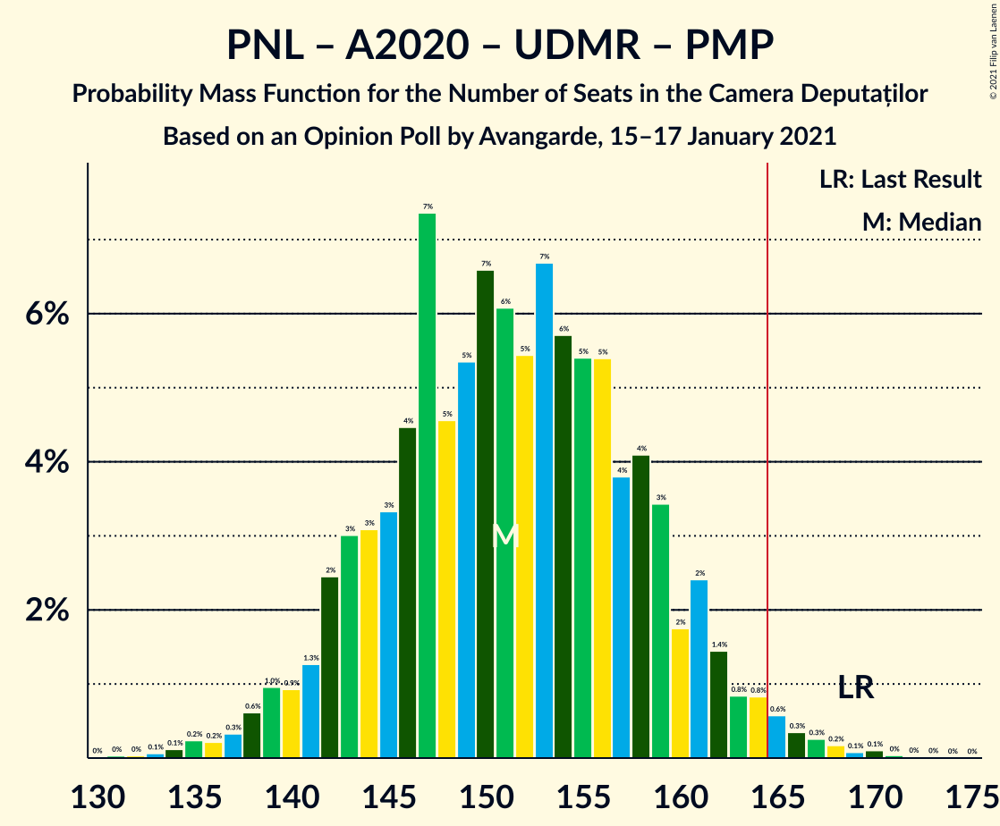
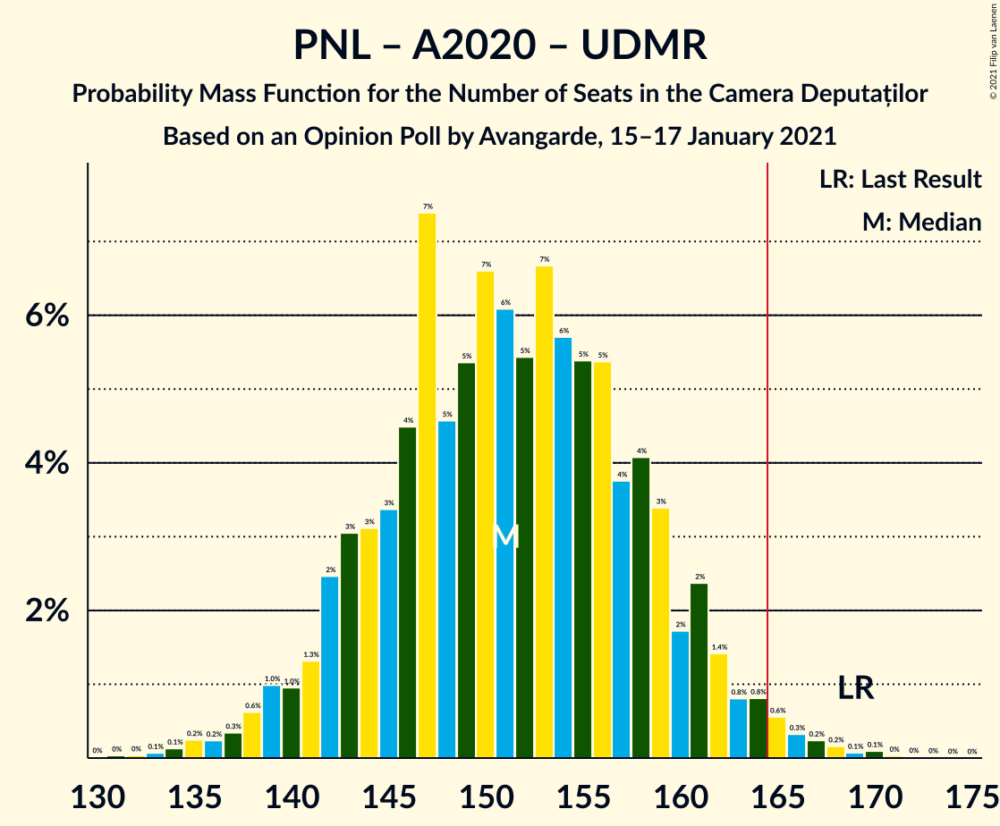
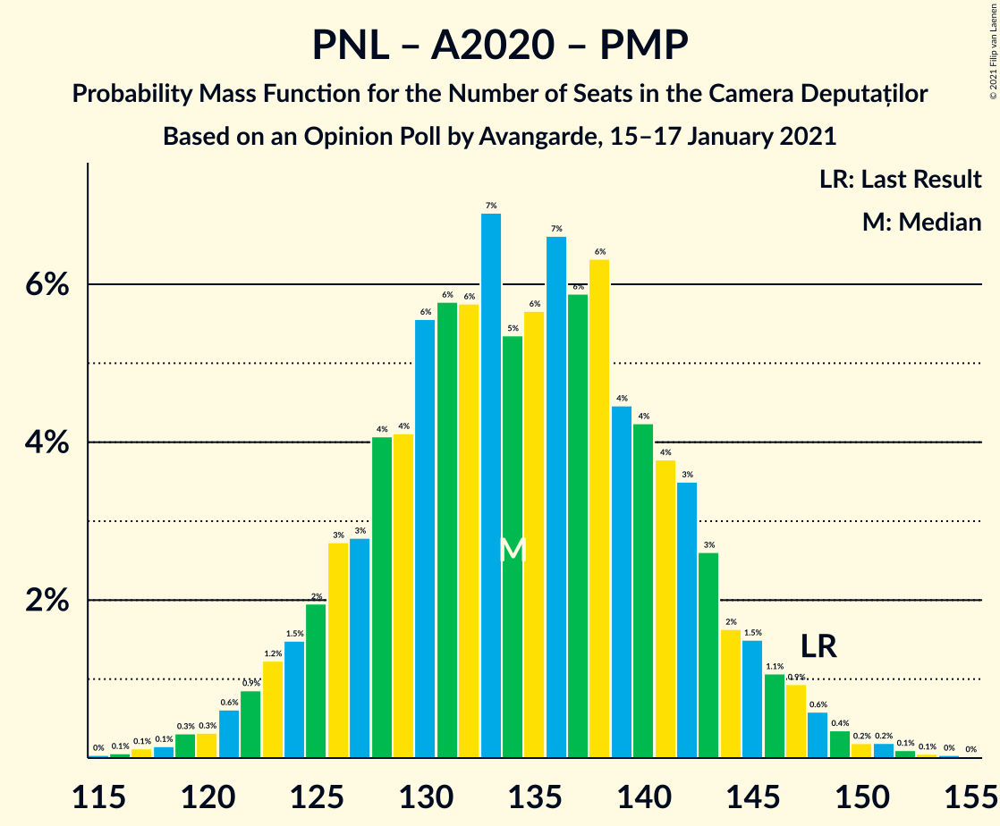
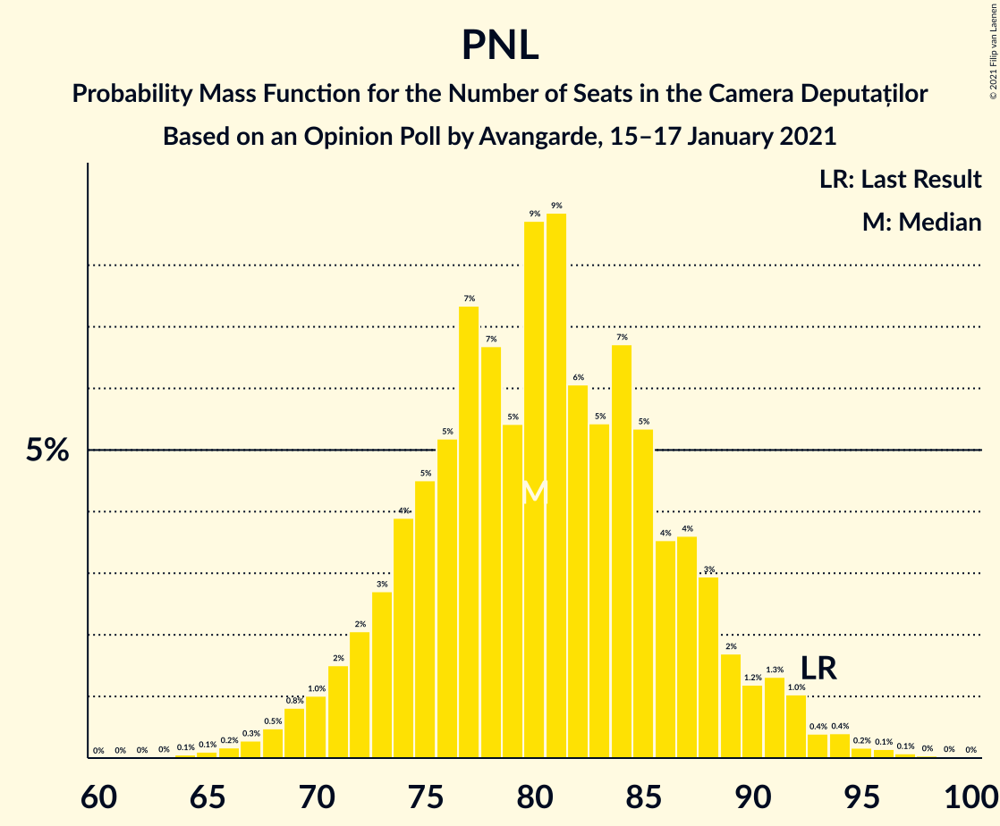

# Opinion Poll by Avangarde, 15–17 January 2021

<a href="#voting-intentions">Voting Intentions</a> | <a href="#seats">Seats</a> | <a href="#coalitions">Coalitions</a> | <a href="#technical-information">Technical Information</a>

## Voting Intentions

### Confidence Intervals

| Party | Last Result | Poll Result | 80% Confidence Interval | 90% Confidence Interval | 95% Confidence Interval | 99% Confidence Interval |
|:-----:|:-----------:|:-----------:|:-----------------------:|:-----------------------:|:-----------------------:|:-----------------------:|
| Partidul Social Democrat | 28.9% | 33.9% | 31.7–36.3% |31.1–36.9% |30.5–37.5% |29.5–38.6% |
| Partidul Național Liberal | 25.2% | 23.9% | 22.0–26.1% |21.4–26.7% |20.9–27.2% |20.0–28.3% |
| Alianța 2020 USR-PLUS | 15.4% | 16.1% | 14.4–17.9% |13.9–18.5% |13.5–18.9% |12.8–19.9% |
| Alianța pentru Unirea Românilor | 9.1% | 13.9% | 12.4–15.7% |11.9–16.2% |11.6–16.7% |10.9–17.6% |
| Uniunea Democrată Maghiară din România | 5.7% | 5.1% | 4.2–6.3% |3.9–6.6% |3.7–7.0% |3.3–7.6% |
| Partidul Mișcarea Populară | 4.8% | 3.0% | 2.3–3.9% |2.1–4.2% |1.9–4.5% |1.7–5.0% |
| PRO România | 4.1% | 1.0% | 0.7–1.7% |0.5–1.8% |0.5–2.0% |0.4–2.4% |

*Note:* The poll result column reflects the actual value used in the calculations. Published results may vary slightly, and in addition be rounded to fewer digits.

## Seats

### Confidence Intervals

| Party | Last Result | Median | 80% Confidence Interval | 90% Confidence Interval | 95% Confidence Interval | 99% Confidence Interval |
|:-----:|:-----------:|:------:|:-----------------------:|:-----------------------:|:-----------------------:|:-----------------------:|
| <a href="#partidul-social-democrat">Partidul Social Democrat</a> | 110 | 114 | 107–122 |104–124 |103–126 |99–129 |
| <a href="#partidul-național-liberal">Partidul Național Liberal</a> | 93 | 80 | 74–87 |72–90 |70–92 |67–94 |
| <a href="#alianța-2020-usr-plus">Alianța 2020 USR-PLUS</a> | 55 | 54 | 48–59 |46–62 |45–63 |43–66 |
| <a href="#alianța-pentru-unirea-românilor">Alianța pentru Unirea Românilor</a> | 33 | 46 | 41–53 |40–54 |38–56 |37–58 |
| <a href="#uniunea-democrată-maghiară-din-românia">Uniunea Democrată Maghiară din România</a> | 21 | 17 | 14–21 |12–22 |12–23 |11–25 |
| <a href="#partidul-mișcarea-populară">Partidul Mișcarea Populară</a> | 0 | 0 | 0 |0 |0 |0–16 |
| <a href="#pro-românia">PRO România</a> | 0 | 0 | 0 |0 |0 |0 |

### Partidul Social Democrat

*For a full overview of the results for this party, see the [Partidul Social Democrat](party-partidulsocialdemocrat.html) page.*

| Number of Seats | Probability | Accumulated | Special Marks |
|:---------------:|:-----------:|:-----------:|:-------------:|
| 95 | 0% | 100% |  |
| 96 | 0.1% | 99.9% |  |
| 97 | 0.1% | 99.8% |  |
| 98 | 0.2% | 99.8% |  |
| 99 | 0.4% | 99.6% |  |
| 100 | 0.3% | 99.2% |  |
| 101 | 0.6% | 98.9% |  |
| 102 | 0.2% | 98% |  |
| 103 | 2% | 98% |  |
| 104 | 1.2% | 96% |  |
| 105 | 1.2% | 95% |  |
| 106 | 3% | 93% |  |
| 107 | 1.2% | 90% |  |
| 108 | 5% | 89% |  |
| 109 | 7% | 84% |  |
| 110 | 3% | 77% | Last Result |
| 111 | 13% | 74% |  |
| 112 | 3% | 61% |  |
| 113 | 6% | 58% |  |
| 114 | 11% | 52% | Median |
| 115 | 5% | 41% |  |
| 116 | 9% | 36% |  |
| 117 | 3% | 27% |  |
| 118 | 4% | 25% |  |
| 119 | 2% | 20% |  |
| 120 | 4% | 19% |  |
| 121 | 4% | 15% |  |
| 122 | 1.3% | 11% |  |
| 123 | 4% | 10% |  |
| 124 | 2% | 6% |  |
| 125 | 0.2% | 4% |  |
| 126 | 2% | 3% |  |
| 127 | 0.3% | 1.4% |  |
| 128 | 0.4% | 1.0% |  |
| 129 | 0.3% | 0.6% |  |
| 130 | 0.1% | 0.3% |  |
| 131 | 0.1% | 0.2% |  |
| 132 | 0% | 0.1% |  |
| 133 | 0% | 0.1% |  |
| 134 | 0% | 0.1% |  |
| 135 | 0% | 0% |  |

### Partidul Național Liberal

*For a full overview of the results for this party, see the [Partidul Național Liberal](party-partidulnaționalliberal.html) page.*

| Number of Seats | Probability | Accumulated | Special Marks |
|:---------------:|:-----------:|:-----------:|:-------------:|
| 64 | 0% | 100% |  |
| 65 | 0.2% | 99.9% |  |
| 66 | 0.1% | 99.7% |  |
| 67 | 0.4% | 99.6% |  |
| 68 | 0.3% | 99.2% |  |
| 69 | 1.0% | 98.9% |  |
| 70 | 1.0% | 98% |  |
| 71 | 1.4% | 97% |  |
| 72 | 2% | 95% |  |
| 73 | 1.0% | 93% |  |
| 74 | 6% | 92% |  |
| 75 | 5% | 86% |  |
| 76 | 2% | 81% |  |
| 77 | 8% | 79% |  |
| 78 | 5% | 71% |  |
| 79 | 6% | 66% |  |
| 80 | 10% | 60% | Median |
| 81 | 7% | 49% |  |
| 82 | 2% | 42% |  |
| 83 | 13% | 41% |  |
| 84 | 5% | 28% |  |
| 85 | 2% | 23% |  |
| 86 | 8% | 21% |  |
| 87 | 4% | 13% |  |
| 88 | 1.4% | 9% |  |
| 89 | 2% | 7% |  |
| 90 | 3% | 6% |  |
| 91 | 0.4% | 3% |  |
| 92 | 1.3% | 3% |  |
| 93 | 0.7% | 1.3% | Last Result |
| 94 | 0.1% | 0.6% |  |
| 95 | 0.1% | 0.5% |  |
| 96 | 0.2% | 0.3% |  |
| 97 | 0% | 0.1% |  |
| 98 | 0.1% | 0.1% |  |
| 99 | 0.1% | 0.1% |  |
| 100 | 0% | 0% |  |

### Alianța 2020 USR-PLUS

*For a full overview of the results for this party, see the [Alianța 2020 USR-PLUS](party-alianța2020usr-plus.html) page.*

| Number of Seats | Probability | Accumulated | Special Marks |
|:---------------:|:-----------:|:-----------:|:-------------:|
| 40 | 0.1% | 100% |  |
| 41 | 0.1% | 99.9% |  |
| 42 | 0.2% | 99.7% |  |
| 43 | 0.4% | 99.6% |  |
| 44 | 1.1% | 99.1% |  |
| 45 | 2% | 98% |  |
| 46 | 2% | 96% |  |
| 47 | 3% | 95% |  |
| 48 | 5% | 92% |  |
| 49 | 4% | 87% |  |
| 50 | 6% | 83% |  |
| 51 | 8% | 78% |  |
| 52 | 10% | 70% |  |
| 53 | 9% | 60% |  |
| 54 | 9% | 51% | Median |
| 55 | 10% | 42% | Last Result |
| 56 | 6% | 32% |  |
| 57 | 5% | 25% |  |
| 58 | 6% | 21% |  |
| 59 | 5% | 15% |  |
| 60 | 2% | 9% |  |
| 61 | 2% | 7% |  |
| 62 | 2% | 5% |  |
| 63 | 1.5% | 3% |  |
| 64 | 0.7% | 2% |  |
| 65 | 0.4% | 1.1% |  |
| 66 | 0.3% | 0.7% |  |
| 67 | 0.2% | 0.4% |  |
| 68 | 0.1% | 0.2% |  |
| 69 | 0.1% | 0.1% |  |
| 70 | 0% | 0.1% |  |
| 71 | 0% | 0% |  |

### Alianța pentru Unirea Românilor

*For a full overview of the results for this party, see the [Alianța pentru Unirea Românilor](party-alianțapentruunirearomânilor.html) page.*

| Number of Seats | Probability | Accumulated | Special Marks |
|:---------------:|:-----------:|:-----------:|:-------------:|
| 33 | 0% | 100% | Last Result |
| 34 | 0% | 99.9% |  |
| 35 | 0.2% | 99.9% |  |
| 36 | 0.1% | 99.7% |  |
| 37 | 1.3% | 99.6% |  |
| 38 | 0.9% | 98% |  |
| 39 | 1.3% | 97% |  |
| 40 | 5% | 96% |  |
| 41 | 2% | 91% |  |
| 42 | 11% | 89% |  |
| 43 | 1.4% | 79% |  |
| 44 | 13% | 77% |  |
| 45 | 5% | 64% |  |
| 46 | 10% | 59% | Median |
| 47 | 10% | 49% |  |
| 48 | 4% | 39% |  |
| 49 | 12% | 35% |  |
| 50 | 2% | 24% |  |
| 51 | 9% | 22% |  |
| 52 | 1.0% | 13% |  |
| 53 | 4% | 12% |  |
| 54 | 3% | 8% |  |
| 55 | 2% | 4% |  |
| 56 | 1.2% | 3% |  |
| 57 | 0.1% | 1.3% |  |
| 58 | 0.8% | 1.2% |  |
| 59 | 0.1% | 0.4% |  |
| 60 | 0.2% | 0.4% |  |
| 61 | 0.1% | 0.1% |  |
| 62 | 0% | 0.1% |  |
| 63 | 0% | 0% |  |

### Uniunea Democrată Maghiară din România

*For a full overview of the results for this party, see the [Uniunea Democrată Maghiară din România](party-uniuneademocratămaghiarădinromânia.html) page.*

| Number of Seats | Probability | Accumulated | Special Marks |
|:---------------:|:-----------:|:-----------:|:-------------:|
| 9 | 0.1% | 100% |  |
| 10 | 0.4% | 99.9% |  |
| 11 | 2% | 99.5% |  |
| 12 | 3% | 98% |  |
| 13 | 4% | 95% |  |
| 14 | 9% | 90% |  |
| 15 | 12% | 81% |  |
| 16 | 11% | 70% |  |
| 17 | 15% | 59% | Median |
| 18 | 15% | 44% |  |
| 19 | 9% | 29% |  |
| 20 | 10% | 20% |  |
| 21 | 5% | 10% | Last Result |
| 22 | 2% | 5% |  |
| 23 | 1.4% | 3% |  |
| 24 | 0.7% | 2% |  |
| 25 | 0.5% | 0.8% |  |
| 26 | 0.2% | 0.3% |  |
| 27 | 0.1% | 0.1% |  |
| 28 | 0% | 0.1% |  |
| 29 | 0% | 0% |  |

### Partidul Mișcarea Populară

*For a full overview of the results for this party, see the [Partidul Mișcarea Populară](party-partidulmișcareapopulară.html) page.*

| Number of Seats | Probability | Accumulated | Special Marks |
|:---------------:|:-----------:|:-----------:|:-------------:|
| 0 | 99.4% | 100% | Last Result, Median |
| 1 | 0% | 0.6% |  |
| 2 | 0% | 0.6% |  |
| 3 | 0% | 0.6% |  |
| 4 | 0% | 0.6% |  |
| 5 | 0% | 0.6% |  |
| 6 | 0% | 0.6% |  |
| 7 | 0% | 0.6% |  |
| 8 | 0% | 0.6% |  |
| 9 | 0% | 0.6% |  |
| 10 | 0% | 0.6% |  |
| 11 | 0% | 0.6% |  |
| 12 | 0% | 0.6% |  |
| 13 | 0% | 0.6% |  |
| 14 | 0% | 0.6% |  |
| 15 | 0% | 0.6% |  |
| 16 | 0.3% | 0.6% |  |
| 17 | 0.2% | 0.2% |  |
| 18 | 0.1% | 0.1% |  |
| 19 | 0% | 0% |  |

### PRO România

*For a full overview of the results for this party, see the [PRO România](party-proromânia.html) page.*

| Number of Seats | Probability | Accumulated | Special Marks |
|:---------------:|:-----------:|:-----------:|:-------------:|
| 0 | 100% | 100% | Last Result, Median |

## Coalitions

### Confidence Intervals

| Coalition | Last Result | Median | Majority? | 80% Confidence Interval | 90% Confidence Interval | 95% Confidence Interval | 99% Confidence Interval |
|:---------:|:-----------:|:------:|:---------:|:-----------------------:|:-----------------------:|:-----------------------:|:-----------------------:|
| Partidul Național Liberal – Alianța 2020 USR-PLUS – Uniunea Democrată Maghiară din România – Partidul Mișcarea Populară | 169 | 152 | 2% | 143–159 | 141–161 | 140–164 | 137–168 |
| Partidul Național Liberal – Alianța 2020 USR-PLUS – Uniunea Democrată Maghiară din România | 169 | 152 | 2% | 143–159 | 141–161 | 140–164 | 136–168 |
| Partidul Național Liberal – Alianța 2020 USR-PLUS – Partidul Mișcarea Populară | 148 | 135 | 0% | 126–141 | 124–145 | 122–147 | 120–150 |
| Partidul Național Liberal – Alianța 2020 USR-PLUS | 148 | 135 | 0% | 126–141 | 124–145 | 122–147 | 120–150 |
| Partidul Social Democrat – PRO România | 110 | 114 | 0% | 107–122 | 104–124 | 103–126 | 99–129 |
| Partidul Național Liberal – Uniunea Democrată Maghiară din România – Partidul Mișcarea Populară | 114 | 98 | 0% | 90–105 | 89–107 | 87–109 | 83–113 |
| Partidul Național Liberal – Uniunea Democrată Maghiară din România | 114 | 98 | 0% | 90–105 | 89–107 | 87–108 | 83–111 |
| Partidul Național Liberal – Partidul Mișcarea Populară | 93 | 80 | 0% | 74–87 | 72–90 | 70–92 | 67–95 |
| Partidul Național Liberal | 93 | 80 | 0% | 74–87 | 72–90 | 70–92 | 67–94 |
| Alianța 2020 USR-PLUS – Partidul Mișcarea Populară | 55 | 54 | 0% | 48–59 | 46–62 | 45–63 | 43–67 |

### Partidul Național Liberal – Alianța 2020 USR-PLUS – Uniunea Democrată Maghiară din România – Partidul Mișcarea Populară

| Number of Seats | Probability | Accumulated | Special Marks |
|:---------------:|:-----------:|:-----------:|:-------------:|
| 131 | 0.1% | 100% |  |
| 132 | 0% | 99.9% |  |
| 133 | 0% | 99.9% |  |
| 134 | 0.1% | 99.8% |  |
| 135 | 0% | 99.7% |  |
| 136 | 0.2% | 99.7% |  |
| 137 | 0.1% | 99.5% |  |
| 138 | 0.7% | 99.4% |  |
| 139 | 0.3% | 98.7% |  |
| 140 | 2% | 98% |  |
| 141 | 2% | 97% |  |
| 142 | 3% | 95% |  |
| 143 | 5% | 92% |  |
| 144 | 1.1% | 87% |  |
| 145 | 6% | 86% |  |
| 146 | 4% | 80% |  |
| 147 | 6% | 76% |  |
| 148 | 2% | 71% |  |
| 149 | 1.4% | 68% |  |
| 150 | 8% | 67% |  |
| 151 | 3% | 59% | Median |
| 152 | 8% | 56% |  |
| 153 | 3% | 48% |  |
| 154 | 11% | 45% |  |
| 155 | 8% | 35% |  |
| 156 | 10% | 26% |  |
| 157 | 4% | 17% |  |
| 158 | 2% | 12% |  |
| 159 | 4% | 11% |  |
| 160 | 1.1% | 7% |  |
| 161 | 2% | 6% |  |
| 162 | 0.6% | 4% |  |
| 163 | 0.7% | 3% |  |
| 164 | 0.7% | 3% |  |
| 165 | 0.6% | 2% | Majority |
| 166 | 0.6% | 1.5% |  |
| 167 | 0.2% | 0.9% |  |
| 168 | 0.4% | 0.7% |  |
| 169 | 0.1% | 0.3% | Last Result |
| 170 | 0.1% | 0.2% |  |
| 171 | 0.1% | 0.1% |  |
| 172 | 0% | 0% |  |

### Partidul Național Liberal – Alianța 2020 USR-PLUS – Uniunea Democrată Maghiară din România

| Number of Seats | Probability | Accumulated | Special Marks |
|:---------------:|:-----------:|:-----------:|:-------------:|
| 130 | 0% | 100% |  |
| 131 | 0.1% | 99.9% |  |
| 132 | 0% | 99.9% |  |
| 133 | 0.1% | 99.9% |  |
| 134 | 0.1% | 99.8% |  |
| 135 | 0% | 99.7% |  |
| 136 | 0.2% | 99.7% |  |
| 137 | 0.1% | 99.5% |  |
| 138 | 0.7% | 99.4% |  |
| 139 | 0.3% | 98.7% |  |
| 140 | 2% | 98% |  |
| 141 | 2% | 97% |  |
| 142 | 3% | 94% |  |
| 143 | 5% | 92% |  |
| 144 | 1.2% | 87% |  |
| 145 | 6% | 86% |  |
| 146 | 4% | 80% |  |
| 147 | 6% | 76% |  |
| 148 | 2% | 70% |  |
| 149 | 1.4% | 68% |  |
| 150 | 8% | 67% |  |
| 151 | 3% | 59% | Median |
| 152 | 8% | 56% |  |
| 153 | 3% | 48% |  |
| 154 | 11% | 45% |  |
| 155 | 8% | 34% |  |
| 156 | 10% | 26% |  |
| 157 | 4% | 16% |  |
| 158 | 2% | 12% |  |
| 159 | 4% | 10% |  |
| 160 | 1.1% | 7% |  |
| 161 | 2% | 5% |  |
| 162 | 0.6% | 4% |  |
| 163 | 0.7% | 3% |  |
| 164 | 0.7% | 3% |  |
| 165 | 0.6% | 2% | Majority |
| 166 | 0.6% | 1.4% |  |
| 167 | 0.1% | 0.8% |  |
| 168 | 0.4% | 0.7% |  |
| 169 | 0.1% | 0.2% | Last Result |
| 170 | 0% | 0.2% |  |
| 171 | 0.1% | 0.1% |  |
| 172 | 0% | 0% |  |

### Partidul Național Liberal – Alianța 2020 USR-PLUS – Partidul Mișcarea Populară

| Number of Seats | Probability | Accumulated | Special Marks |
|:---------------:|:-----------:|:-----------:|:-------------:|
| 113 | 0% | 100% |  |
| 114 | 0% | 99.9% |  |
| 115 | 0% | 99.9% |  |
| 116 | 0% | 99.9% |  |
| 117 | 0% | 99.9% |  |
| 118 | 0% | 99.8% |  |
| 119 | 0.1% | 99.8% |  |
| 120 | 0.2% | 99.6% |  |
| 121 | 0.4% | 99.4% |  |
| 122 | 2% | 99.0% |  |
| 123 | 1.5% | 97% |  |
| 124 | 2% | 96% |  |
| 125 | 2% | 93% |  |
| 126 | 2% | 91% |  |
| 127 | 3% | 89% |  |
| 128 | 4% | 87% |  |
| 129 | 2% | 83% |  |
| 130 | 9% | 81% |  |
| 131 | 4% | 72% |  |
| 132 | 6% | 69% |  |
| 133 | 4% | 63% |  |
| 134 | 3% | 58% | Median |
| 135 | 6% | 55% |  |
| 136 | 8% | 49% |  |
| 137 | 4% | 41% |  |
| 138 | 17% | 37% |  |
| 139 | 4% | 20% |  |
| 140 | 4% | 16% |  |
| 141 | 4% | 13% |  |
| 142 | 2% | 9% |  |
| 143 | 0.6% | 7% |  |
| 144 | 0.8% | 6% |  |
| 145 | 1.4% | 5% |  |
| 146 | 1.2% | 4% |  |
| 147 | 0.4% | 3% |  |
| 148 | 1.2% | 2% | Last Result |
| 149 | 0.4% | 1.0% |  |
| 150 | 0.2% | 0.6% |  |
| 151 | 0.2% | 0.4% |  |
| 152 | 0.1% | 0.2% |  |
| 153 | 0% | 0.1% |  |
| 154 | 0% | 0.1% |  |
| 155 | 0% | 0% |  |

### Partidul Național Liberal – Alianța 2020 USR-PLUS

| Number of Seats | Probability | Accumulated | Special Marks |
|:---------------:|:-----------:|:-----------:|:-------------:|
| 113 | 0% | 100% |  |
| 114 | 0% | 99.9% |  |
| 115 | 0% | 99.9% |  |
| 116 | 0% | 99.9% |  |
| 117 | 0% | 99.8% |  |
| 118 | 0.1% | 99.8% |  |
| 119 | 0.1% | 99.7% |  |
| 120 | 0.2% | 99.6% |  |
| 121 | 0.4% | 99.4% |  |
| 122 | 2% | 98.9% |  |
| 123 | 2% | 97% |  |
| 124 | 2% | 95% |  |
| 125 | 2% | 93% |  |
| 126 | 2% | 91% |  |
| 127 | 3% | 89% |  |
| 128 | 4% | 86% |  |
| 129 | 2% | 82% |  |
| 130 | 9% | 80% |  |
| 131 | 4% | 72% |  |
| 132 | 6% | 68% |  |
| 133 | 4% | 62% |  |
| 134 | 3% | 58% | Median |
| 135 | 6% | 55% |  |
| 136 | 8% | 49% |  |
| 137 | 4% | 41% |  |
| 138 | 17% | 37% |  |
| 139 | 4% | 20% |  |
| 140 | 4% | 16% |  |
| 141 | 4% | 12% |  |
| 142 | 2% | 8% |  |
| 143 | 0.6% | 6% |  |
| 144 | 0.8% | 6% |  |
| 145 | 1.4% | 5% |  |
| 146 | 1.2% | 4% |  |
| 147 | 0.4% | 3% |  |
| 148 | 1.2% | 2% | Last Result |
| 149 | 0.4% | 1.0% |  |
| 150 | 0.2% | 0.5% |  |
| 151 | 0.2% | 0.3% |  |
| 152 | 0.1% | 0.2% |  |
| 153 | 0% | 0.1% |  |
| 154 | 0% | 0.1% |  |
| 155 | 0% | 0% |  |

### Partidul Social Democrat – PRO România

| Number of Seats | Probability | Accumulated | Special Marks |
|:---------------:|:-----------:|:-----------:|:-------------:|
| 95 | 0% | 100% |  |
| 96 | 0.1% | 99.9% |  |
| 97 | 0.1% | 99.8% |  |
| 98 | 0.2% | 99.8% |  |
| 99 | 0.4% | 99.6% |  |
| 100 | 0.3% | 99.2% |  |
| 101 | 0.6% | 98.9% |  |
| 102 | 0.2% | 98% |  |
| 103 | 2% | 98% |  |
| 104 | 1.2% | 96% |  |
| 105 | 1.2% | 95% |  |
| 106 | 3% | 93% |  |
| 107 | 1.2% | 90% |  |
| 108 | 5% | 89% |  |
| 109 | 7% | 84% |  |
| 110 | 3% | 77% | Last Result |
| 111 | 13% | 74% |  |
| 112 | 3% | 61% |  |
| 113 | 6% | 58% |  |
| 114 | 11% | 52% | Median |
| 115 | 5% | 41% |  |
| 116 | 9% | 36% |  |
| 117 | 3% | 27% |  |
| 118 | 4% | 25% |  |
| 119 | 2% | 20% |  |
| 120 | 4% | 19% |  |
| 121 | 4% | 15% |  |
| 122 | 1.3% | 11% |  |
| 123 | 4% | 10% |  |
| 124 | 2% | 6% |  |
| 125 | 0.2% | 4% |  |
| 126 | 2% | 3% |  |
| 127 | 0.3% | 1.4% |  |
| 128 | 0.4% | 1.0% |  |
| 129 | 0.3% | 0.6% |  |
| 130 | 0.1% | 0.3% |  |
| 131 | 0.1% | 0.2% |  |
| 132 | 0% | 0.1% |  |
| 133 | 0% | 0.1% |  |
| 134 | 0% | 0.1% |  |
| 135 | 0% | 0% |  |

### Partidul Național Liberal – Uniunea Democrată Maghiară din România – Partidul Mișcarea Populară

| Number of Seats | Probability | Accumulated | Special Marks |
|:---------------:|:-----------:|:-----------:|:-------------:|
| 79 | 0% | 100% |  |
| 80 | 0% | 99.9% |  |
| 81 | 0.1% | 99.9% |  |
| 82 | 0.3% | 99.8% |  |
| 83 | 0.3% | 99.6% |  |
| 84 | 0.7% | 99.3% |  |
| 85 | 0.4% | 98.6% |  |
| 86 | 0.5% | 98% |  |
| 87 | 2% | 98% |  |
| 88 | 1.1% | 96% |  |
| 89 | 0.8% | 95% |  |
| 90 | 5% | 94% |  |
| 91 | 5% | 90% |  |
| 92 | 5% | 84% |  |
| 93 | 3% | 79% |  |
| 94 | 5% | 76% |  |
| 95 | 7% | 71% |  |
| 96 | 3% | 64% |  |
| 97 | 5% | 61% | Median |
| 98 | 9% | 56% |  |
| 99 | 5% | 46% |  |
| 100 | 9% | 42% |  |
| 101 | 9% | 33% |  |
| 102 | 6% | 25% |  |
| 103 | 4% | 19% |  |
| 104 | 2% | 14% |  |
| 105 | 4% | 12% |  |
| 106 | 1.4% | 8% |  |
| 107 | 3% | 7% |  |
| 108 | 1.3% | 4% |  |
| 109 | 1.2% | 3% |  |
| 110 | 0.6% | 2% |  |
| 111 | 0.3% | 1.1% |  |
| 112 | 0.2% | 0.7% |  |
| 113 | 0.2% | 0.5% |  |
| 114 | 0.1% | 0.4% | Last Result |
| 115 | 0.1% | 0.3% |  |
| 116 | 0.1% | 0.2% |  |
| 117 | 0% | 0.1% |  |
| 118 | 0% | 0.1% |  |
| 119 | 0% | 0% |  |

### Partidul Național Liberal – Uniunea Democrată Maghiară din România

| Number of Seats | Probability | Accumulated | Special Marks |
|:---------------:|:-----------:|:-----------:|:-------------:|
| 79 | 0% | 100% |  |
| 80 | 0.1% | 99.9% |  |
| 81 | 0.1% | 99.9% |  |
| 82 | 0.3% | 99.8% |  |
| 83 | 0.3% | 99.6% |  |
| 84 | 0.8% | 99.3% |  |
| 85 | 0.4% | 98.5% |  |
| 86 | 0.5% | 98% |  |
| 87 | 2% | 98% |  |
| 88 | 1.1% | 96% |  |
| 89 | 0.8% | 95% |  |
| 90 | 5% | 94% |  |
| 91 | 5% | 90% |  |
| 92 | 5% | 84% |  |
| 93 | 3% | 79% |  |
| 94 | 5% | 76% |  |
| 95 | 7% | 71% |  |
| 96 | 3% | 64% |  |
| 97 | 5% | 61% | Median |
| 98 | 9% | 55% |  |
| 99 | 5% | 46% |  |
| 100 | 9% | 41% |  |
| 101 | 9% | 33% |  |
| 102 | 6% | 24% |  |
| 103 | 4% | 18% |  |
| 104 | 2% | 14% |  |
| 105 | 4% | 11% |  |
| 106 | 1.4% | 8% |  |
| 107 | 3% | 6% |  |
| 108 | 1.2% | 4% |  |
| 109 | 1.2% | 2% |  |
| 110 | 0.5% | 1.2% |  |
| 111 | 0.2% | 0.7% |  |
| 112 | 0.1% | 0.5% |  |
| 113 | 0.1% | 0.4% |  |
| 114 | 0.1% | 0.3% | Last Result |
| 115 | 0% | 0.2% |  |
| 116 | 0.1% | 0.1% |  |
| 117 | 0% | 0.1% |  |
| 118 | 0% | 0% |  |

### Partidul Național Liberal – Partidul Mișcarea Populară

| Number of Seats | Probability | Accumulated | Special Marks |
|:---------------:|:-----------:|:-----------:|:-------------:|
| 64 | 0% | 100% |  |
| 65 | 0.2% | 99.9% |  |
| 66 | 0.1% | 99.7% |  |
| 67 | 0.4% | 99.6% |  |
| 68 | 0.3% | 99.2% |  |
| 69 | 1.0% | 98.9% |  |
| 70 | 1.0% | 98% |  |
| 71 | 1.4% | 97% |  |
| 72 | 2% | 95% |  |
| 73 | 1.0% | 93% |  |
| 74 | 6% | 92% |  |
| 75 | 5% | 86% |  |
| 76 | 2% | 81% |  |
| 77 | 8% | 79% |  |
| 78 | 5% | 71% |  |
| 79 | 6% | 66% |  |
| 80 | 10% | 60% | Median |
| 81 | 7% | 50% |  |
| 82 | 2% | 43% |  |
| 83 | 13% | 41% |  |
| 84 | 5% | 29% |  |
| 85 | 2% | 24% |  |
| 86 | 8% | 21% |  |
| 87 | 4% | 13% |  |
| 88 | 1.4% | 9% |  |
| 89 | 2% | 8% |  |
| 90 | 3% | 6% |  |
| 91 | 0.4% | 3% |  |
| 92 | 1.4% | 3% |  |
| 93 | 0.7% | 2% | Last Result |
| 94 | 0.4% | 1.0% |  |
| 95 | 0.1% | 0.6% |  |
| 96 | 0.2% | 0.4% |  |
| 97 | 0% | 0.3% |  |
| 98 | 0.1% | 0.2% |  |
| 99 | 0.1% | 0.1% |  |
| 100 | 0% | 0.1% |  |
| 101 | 0% | 0% |  |

### Partidul Național Liberal

| Number of Seats | Probability | Accumulated | Special Marks |
|:---------------:|:-----------:|:-----------:|:-------------:|
| 64 | 0% | 100% |  |
| 65 | 0.2% | 99.9% |  |
| 66 | 0.1% | 99.7% |  |
| 67 | 0.4% | 99.6% |  |
| 68 | 0.3% | 99.2% |  |
| 69 | 1.0% | 98.9% |  |
| 70 | 1.0% | 98% |  |
| 71 | 1.4% | 97% |  |
| 72 | 2% | 95% |  |
| 73 | 1.0% | 93% |  |
| 74 | 6% | 92% |  |
| 75 | 5% | 86% |  |
| 76 | 2% | 81% |  |
| 77 | 8% | 79% |  |
| 78 | 5% | 71% |  |
| 79 | 6% | 66% |  |
| 80 | 10% | 60% | Median |
| 81 | 7% | 49% |  |
| 82 | 2% | 42% |  |
| 83 | 13% | 41% |  |
| 84 | 5% | 28% |  |
| 85 | 2% | 23% |  |
| 86 | 8% | 21% |  |
| 87 | 4% | 13% |  |
| 88 | 1.4% | 9% |  |
| 89 | 2% | 7% |  |
| 90 | 3% | 6% |  |
| 91 | 0.4% | 3% |  |
| 92 | 1.3% | 3% |  |
| 93 | 0.7% | 1.3% | Last Result |
| 94 | 0.1% | 0.6% |  |
| 95 | 0.1% | 0.5% |  |
| 96 | 0.2% | 0.3% |  |
| 97 | 0% | 0.1% |  |
| 98 | 0.1% | 0.1% |  |
| 99 | 0.1% | 0.1% |  |
| 100 | 0% | 0% |  |

### Alianța 2020 USR-PLUS – Partidul Mișcarea Populară

| Number of Seats | Probability | Accumulated | Special Marks |
|:---------------:|:-----------:|:-----------:|:-------------:|
| 40 | 0.1% | 100% |  |
| 41 | 0.1% | 99.9% |  |
| 42 | 0.2% | 99.8% |  |
| 43 | 0.4% | 99.6% |  |
| 44 | 1.1% | 99.1% |  |
| 45 | 2% | 98% |  |
| 46 | 2% | 96% |  |
| 47 | 3% | 95% |  |
| 48 | 5% | 92% |  |
| 49 | 4% | 88% |  |
| 50 | 6% | 84% |  |
| 51 | 8% | 78% |  |
| 52 | 10% | 70% |  |
| 53 | 9% | 60% |  |
| 54 | 9% | 52% | Median |
| 55 | 10% | 43% | Last Result |
| 56 | 6% | 32% |  |
| 57 | 5% | 26% |  |
| 58 | 6% | 21% |  |
| 59 | 5% | 15% |  |
| 60 | 2% | 10% |  |
| 61 | 2% | 8% |  |
| 62 | 2% | 6% |  |
| 63 | 2% | 4% |  |
| 64 | 1.0% | 2% |  |
| 65 | 0.4% | 1.4% |  |
| 66 | 0.4% | 1.0% |  |
| 67 | 0.2% | 0.6% |  |
| 68 | 0.1% | 0.4% |  |
| 69 | 0.1% | 0.3% |  |
| 70 | 0.1% | 0.2% |  |
| 71 | 0% | 0.1% |  |
| 72 | 0% | 0.1% |  |
| 73 | 0% | 0.1% |  |
| 74 | 0% | 0% |  |

## Technical Information

### Opinion Poll

+ **Polling firm:** Avangarde
+ **Commissioner(s):** —
+ **Fieldwork period:** 15–17 January 2021

### Calculations

+ **Sample size:** 710
+ **Simulations done:** 131,072
+ **Error estimate:** 1.34%

