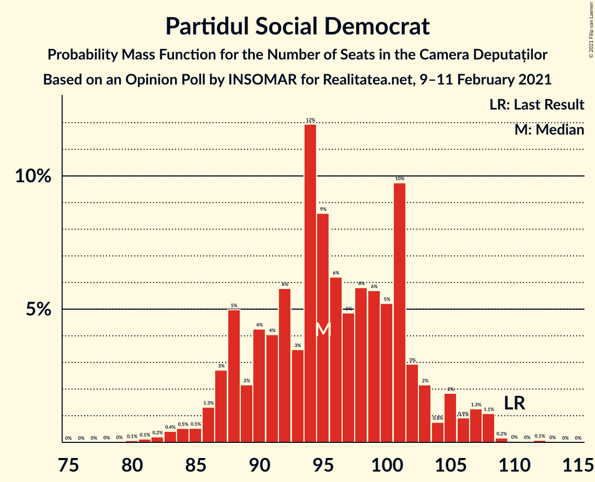
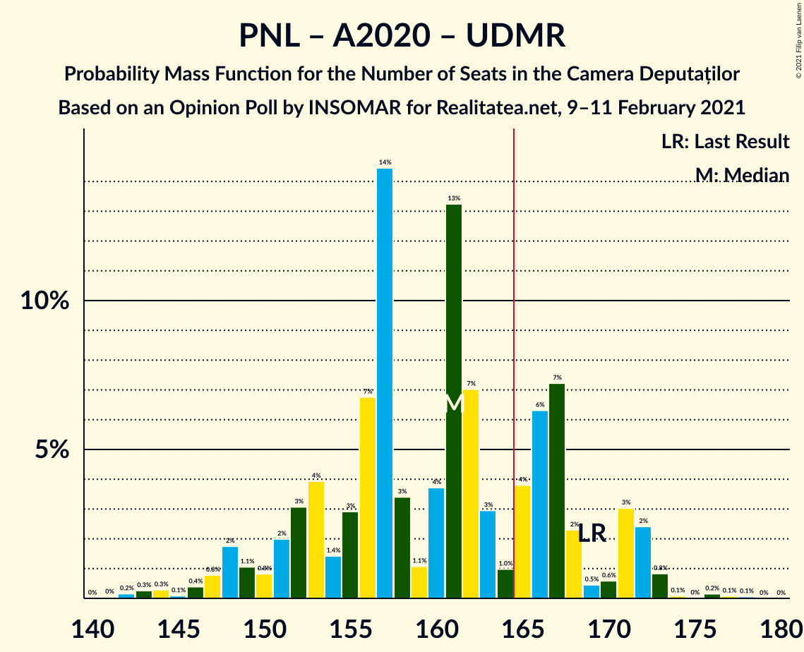

# Opinion Poll by INSOMAR for Realitatea.net, 9–11 February 2021

<a href="#voting-intentions">Voting Intentions</a> | <a href="#seats">Seats</a> | <a href="#coalitions">Coalitions</a> | <a href="#technical-information">Technical Information</a>

## Voting Intentions

### Confidence Intervals

| Party | Last Result | Poll Result | 80% Confidence Interval | 90% Confidence Interval | 95% Confidence Interval | 99% Confidence Interval |
|:-----:|:-----------:|:-----------:|:-----------------------:|:-----------------------:|:-----------------------:|:-----------------------:|
| Partidul Social Democrat | 28.9% | 28.0% | 26.2–29.8% |25.7–30.3% |25.3–30.8% |24.5–31.7% |
| Partidul Național Liberal | 25.2% | 27.0% | 25.3–28.8% |24.8–29.3% |24.4–29.8% |23.5–30.7% |
| Alianța pentru Unirea Românilor | 9.1% | 16.0% | 14.6–17.6% |14.2–18.0% |13.9–18.4% |13.3–19.2% |
| Alianța 2020 USR-PLUS | 15.4% | 14.0% | 12.7–15.5% |12.3–15.9% |12.0–16.2% |11.4–17.0% |
| Uniunea Democrată Maghiară din România | 5.7% | 6.0% | 5.2–7.1% |4.9–7.4% |4.7–7.7% |4.3–8.2% |
| Partidul Mișcarea Populară | 4.8% | 4.0% | 3.3–4.9% |3.1–5.1% |2.9–5.4% |2.7–5.8% |
| PRO România | 4.1% | 1.0% | 0.7–1.5% |0.6–1.6% |0.5–1.8% |0.4–2.1% |

*Note:* The poll result column reflects the actual value used in the calculations. Published results may vary slightly, and in addition be rounded to fewer digits.

## Seats

### Confidence Intervals

| Party | Last Result | Median | 80% Confidence Interval | 90% Confidence Interval | 95% Confidence Interval | 99% Confidence Interval |
|:-----:|:-----------:|:------:|:-----------------------:|:-----------------------:|:-----------------------:|:-----------------------:|
| <a href="#partidul-social-democrat">Partidul Social Democrat</a> | 110 | 96 | 88–104 |87–107 |86–108 |82–108 |
| <a href="#partidul-național-liberal">Partidul Național Liberal</a> | 93 | 92 | 85–100 |83–102 |81–103 |80–107 |
| <a href="#alianța-pentru-unirea-românilor">Alianța pentru Unirea Românilor</a> | 33 | 54 | 50–61 |48–62 |46–64 |44–65 |
| <a href="#alianța-2020-usr-plus">Alianța 2020 USR-PLUS</a> | 55 | 47 | 43–54 |41–55 |40–57 |38–58 |
| <a href="#uniunea-democrată-maghiară-din-românia">Uniunea Democrată Maghiară din România</a> | 21 | 20 | 17–24 |16–25 |15–26 |14–28 |
| <a href="#partidul-mișcarea-populară">Partidul Mișcarea Populară</a> | 0 | 0 | 0 |0–16 |0–18 |0–19 |
| <a href="#pro-românia">PRO România</a> | 0 | 0 | 0 |0 |0 |0 |

### Partidul Social Democrat

*For a full overview of the results for this party, see the [Partidul Social Democrat](party-partidulsocialdemocrat.html) page.*

| Number of Seats | Probability | Accumulated | Special Marks |
|:---------------:|:-----------:|:-----------:|:-------------:|
| 79 | 0.1% | 100% |  |
| 80 | 0.1% | 99.9% |  |
| 81 | 0.2% | 99.8% |  |
| 82 | 0.2% | 99.6% |  |
| 83 | 1.0% | 99.5% |  |
| 84 | 0.4% | 98.5% |  |
| 85 | 0.3% | 98% |  |
| 86 | 1.4% | 98% |  |
| 87 | 5% | 96% |  |
| 88 | 8% | 91% |  |
| 89 | 1.2% | 83% |  |
| 90 | 4% | 82% |  |
| 91 | 8% | 79% |  |
| 92 | 2% | 71% |  |
| 93 | 3% | 69% |  |
| 94 | 6% | 65% |  |
| 95 | 7% | 59% |  |
| 96 | 4% | 52% | Median |
| 97 | 4% | 48% |  |
| 98 | 2% | 44% |  |
| 99 | 13% | 42% |  |
| 100 | 6% | 29% |  |
| 101 | 3% | 23% |  |
| 102 | 3% | 20% |  |
| 103 | 6% | 17% |  |
| 104 | 2% | 11% |  |
| 105 | 0.6% | 9% |  |
| 106 | 2% | 8% |  |
| 107 | 2% | 7% |  |
| 108 | 4% | 4% |  |
| 109 | 0.2% | 0.3% |  |
| 110 | 0% | 0.1% | Last Result |
| 111 | 0% | 0.1% |  |
| 112 | 0% | 0.1% |  |
| 113 | 0% | 0% |  |

### Partidul Național Liberal

*For a full overview of the results for this party, see the [Partidul Național Liberal](party-partidulnaționalliberal.html) page.*

| Number of Seats | Probability | Accumulated | Special Marks |
|:---------------:|:-----------:|:-----------:|:-------------:|
| 75 | 0% | 100% |  |
| 76 | 0% | 99.9% |  |
| 77 | 0.1% | 99.9% |  |
| 78 | 0% | 99.8% |  |
| 79 | 0.2% | 99.8% |  |
| 80 | 0.4% | 99.6% |  |
| 81 | 2% | 99.2% |  |
| 82 | 0.6% | 97% |  |
| 83 | 2% | 96% |  |
| 84 | 2% | 94% |  |
| 85 | 6% | 92% |  |
| 86 | 2% | 86% |  |
| 87 | 5% | 83% |  |
| 88 | 6% | 79% |  |
| 89 | 2% | 73% |  |
| 90 | 12% | 71% |  |
| 91 | 3% | 59% |  |
| 92 | 7% | 56% | Median |
| 93 | 11% | 49% | Last Result |
| 94 | 3% | 38% |  |
| 95 | 7% | 35% |  |
| 96 | 4% | 28% |  |
| 97 | 5% | 24% |  |
| 98 | 2% | 20% |  |
| 99 | 1.3% | 17% |  |
| 100 | 10% | 16% |  |
| 101 | 0.9% | 6% |  |
| 102 | 3% | 5% |  |
| 103 | 0.4% | 3% |  |
| 104 | 0.7% | 2% |  |
| 105 | 0.4% | 1.5% |  |
| 106 | 0.4% | 1.0% |  |
| 107 | 0.3% | 0.6% |  |
| 108 | 0.2% | 0.3% |  |
| 109 | 0% | 0.1% |  |
| 110 | 0% | 0.1% |  |
| 111 | 0% | 0% |  |

### Alianța pentru Unirea Românilor

*For a full overview of the results for this party, see the [Alianța pentru Unirea Românilor](party-alianțapentruunirearomânilor.html) page.*

| Number of Seats | Probability | Accumulated | Special Marks |
|:---------------:|:-----------:|:-----------:|:-------------:|
| 33 | 0% | 100% | Last Result |
| 34 | 0% | 100% |  |
| 35 | 0% | 100% |  |
| 36 | 0% | 100% |  |
| 37 | 0% | 100% |  |
| 38 | 0% | 100% |  |
| 39 | 0% | 100% |  |
| 40 | 0% | 100% |  |
| 41 | 0% | 100% |  |
| 42 | 0.1% | 100% |  |
| 43 | 0.1% | 99.9% |  |
| 44 | 0.4% | 99.8% |  |
| 45 | 0.6% | 99.4% |  |
| 46 | 2% | 98.8% |  |
| 47 | 0.4% | 97% |  |
| 48 | 2% | 97% |  |
| 49 | 1.3% | 94% |  |
| 50 | 10% | 93% |  |
| 51 | 6% | 83% |  |
| 52 | 6% | 76% |  |
| 53 | 10% | 71% |  |
| 54 | 12% | 60% | Median |
| 55 | 7% | 48% |  |
| 56 | 6% | 41% |  |
| 57 | 13% | 35% |  |
| 58 | 4% | 22% |  |
| 59 | 4% | 18% |  |
| 60 | 3% | 14% |  |
| 61 | 4% | 11% |  |
| 62 | 2% | 7% |  |
| 63 | 0.3% | 5% |  |
| 64 | 2% | 4% |  |
| 65 | 2% | 2% |  |
| 66 | 0.3% | 0.4% |  |
| 67 | 0% | 0.1% |  |
| 68 | 0% | 0.1% |  |
| 69 | 0% | 0.1% |  |
| 70 | 0% | 0% |  |

### Alianța 2020 USR-PLUS

*For a full overview of the results for this party, see the [Alianța 2020 USR-PLUS](party-alianța2020usr-plus.html) page.*

| Number of Seats | Probability | Accumulated | Special Marks |
|:---------------:|:-----------:|:-----------:|:-------------:|
| 35 | 0% | 100% |  |
| 36 | 0% | 99.9% |  |
| 37 | 0.1% | 99.9% |  |
| 38 | 0.9% | 99.8% |  |
| 39 | 0.8% | 98.9% |  |
| 40 | 2% | 98% |  |
| 41 | 1.4% | 96% |  |
| 42 | 5% | 95% |  |
| 43 | 12% | 90% |  |
| 44 | 3% | 78% |  |
| 45 | 6% | 75% |  |
| 46 | 13% | 69% |  |
| 47 | 12% | 55% | Median |
| 48 | 4% | 43% |  |
| 49 | 8% | 39% |  |
| 50 | 8% | 31% |  |
| 51 | 4% | 23% |  |
| 52 | 2% | 19% |  |
| 53 | 4% | 17% |  |
| 54 | 8% | 13% |  |
| 55 | 3% | 5% | Last Result |
| 56 | 0.1% | 3% |  |
| 57 | 2% | 3% |  |
| 58 | 0.5% | 0.9% |  |
| 59 | 0.2% | 0.4% |  |
| 60 | 0% | 0.2% |  |
| 61 | 0% | 0.2% |  |
| 62 | 0.1% | 0.1% |  |
| 63 | 0% | 0% |  |

### Uniunea Democrată Maghiară din România

*For a full overview of the results for this party, see the [Uniunea Democrată Maghiară din România](party-uniuneademocratămaghiarădinromânia.html) page.*

| Number of Seats | Probability | Accumulated | Special Marks |
|:---------------:|:-----------:|:-----------:|:-------------:|
| 13 | 0.1% | 100% |  |
| 14 | 0.7% | 99.8% |  |
| 15 | 2% | 99.2% |  |
| 16 | 3% | 97% |  |
| 17 | 9% | 94% |  |
| 18 | 15% | 86% |  |
| 19 | 7% | 71% |  |
| 20 | 18% | 64% | Median |
| 21 | 12% | 46% | Last Result |
| 22 | 11% | 35% |  |
| 23 | 12% | 23% |  |
| 24 | 5% | 11% |  |
| 25 | 2% | 6% |  |
| 26 | 3% | 4% |  |
| 27 | 0.4% | 1.1% |  |
| 28 | 0.3% | 0.7% |  |
| 29 | 0.1% | 0.4% |  |
| 30 | 0.2% | 0.3% |  |
| 31 | 0% | 0% |  |

### Partidul Mișcarea Populară

*For a full overview of the results for this party, see the [Partidul Mișcarea Populară](party-partidulmișcareapopulară.html) page.*

| Number of Seats | Probability | Accumulated | Special Marks |
|:---------------:|:-----------:|:-----------:|:-------------:|
| 0 | 95% | 100% | Last Result, Median |
| 1 | 0% | 5% |  |
| 2 | 0% | 5% |  |
| 3 | 0% | 5% |  |
| 4 | 0% | 5% |  |
| 5 | 0% | 5% |  |
| 6 | 0% | 5% |  |
| 7 | 0% | 5% |  |
| 8 | 0% | 5% |  |
| 9 | 0% | 5% |  |
| 10 | 0% | 5% |  |
| 11 | 0% | 5% |  |
| 12 | 0% | 5% |  |
| 13 | 0% | 5% |  |
| 14 | 0% | 5% |  |
| 15 | 0% | 5% |  |
| 16 | 0.5% | 5% |  |
| 17 | 2% | 5% |  |
| 18 | 0.9% | 3% |  |
| 19 | 1.5% | 2% |  |
| 20 | 0.1% | 0.2% |  |
| 21 | 0.1% | 0.1% |  |
| 22 | 0% | 0% |  |

### PRO România

*For a full overview of the results for this party, see the [PRO România](party-proromânia.html) page.*

| Number of Seats | Probability | Accumulated | Special Marks |
|:---------------:|:-----------:|:-----------:|:-------------:|
| 0 | 100% | 100% | Last Result, Median |

## Coalitions

### Confidence Intervals

| Coalition | Last Result | Median | Majority? | 80% Confidence Interval | 90% Confidence Interval | 95% Confidence Interval | 99% Confidence Interval |
|:---------:|:-----------:|:------:|:---------:|:-----------------------:|:-----------------------:|:-----------------------:|:-----------------------:|
| Partidul Național Liberal – Alianța 2020 USR-PLUS – Uniunea Democrată Maghiară din România – Partidul Mișcarea Populară | 169 | 158 | 45% | 152–171 | 151–172 | 151–173 | 150–177 |
| Partidul Național Liberal – Alianța 2020 USR-PLUS – Uniunea Democrată Maghiară din România | 169 | 157 | 41% | 152–171 | 151–171 | 147–172 | 143–173 |
| Partidul Național Liberal – Alianța 2020 USR-PLUS – Partidul Mișcarea Populară | 148 | 140 | 0% | 132–149 | 130–151 | 130–154 | 129–157 |
| Partidul Național Liberal – Alianța 2020 USR-PLUS | 148 | 138 | 0% | 131–149 | 130–150 | 128–152 | 126–154 |
| Partidul Național Liberal – Uniunea Democrată Maghiară din România – Partidul Mișcarea Populară | 114 | 113 | 0% | 105–122 | 103–125 | 101–126 | 100–132 |
| Partidul Național Liberal – Uniunea Democrată Maghiară din România | 114 | 113 | 0% | 105–122 | 102–123 | 101–125 | 98–127 |
| Partidul Social Democrat – PRO România | 110 | 96 | 0% | 88–104 | 87–107 | 86–108 | 82–108 |
| Partidul Național Liberal – Partidul Mișcarea Populară | 93 | 93 | 0% | 85–101 | 84–103 | 82–106 | 80–111 |
| Partidul Național Liberal | 93 | 92 | 0% | 85–100 | 83–102 | 81–103 | 80–107 |
| Alianța 2020 USR-PLUS – Partidul Mișcarea Populară | 55 | 47 | 0% | 43–55 | 42–58 | 40–61 | 38–68 |

### Partidul Național Liberal – Alianța 2020 USR-PLUS – Uniunea Democrată Maghiară din România – Partidul Mișcarea Populară

| Number of Seats | Probability | Accumulated | Special Marks |
|:---------------:|:-----------:|:-----------:|:-------------:|
| 149 | 0% | 100% |  |
| 150 | 1.0% | 99.9% |  |
| 151 | 5% | 98.9% |  |
| 152 | 4% | 94% |  |
| 153 | 8% | 90% |  |
| 154 | 3% | 82% |  |
| 155 | 3% | 79% |  |
| 156 | 11% | 75% |  |
| 157 | 12% | 64% |  |
| 158 | 3% | 52% |  |
| 159 | 0.5% | 49% | Median |
| 160 | 1.2% | 48% |  |
| 161 | 0.5% | 47% |  |
| 162 | 2% | 47% |  |
| 163 | 0.3% | 45% |  |
| 164 | 0.2% | 45% |  |
| 165 | 4% | 45% | Majority |
| 166 | 5% | 41% |  |
| 167 | 15% | 36% |  |
| 168 | 5% | 21% |  |
| 169 | 1.2% | 16% | Last Result |
| 170 | 0.7% | 15% |  |
| 171 | 9% | 14% |  |
| 172 | 2% | 5% |  |
| 173 | 2% | 4% |  |
| 174 | 0.2% | 2% |  |
| 175 | 0.5% | 2% |  |
| 176 | 0.6% | 1.2% |  |
| 177 | 0.2% | 0.6% |  |
| 178 | 0.1% | 0.4% |  |
| 179 | 0.1% | 0.3% |  |
| 180 | 0.2% | 0.3% |  |
| 181 | 0.1% | 0.1% |  |
| 182 | 0% | 0% |  |

### Partidul Național Liberal – Alianța 2020 USR-PLUS – Uniunea Democrată Maghiară din România

| Number of Seats | Probability | Accumulated | Special Marks |
|:---------------:|:-----------:|:-----------:|:-------------:|
| 141 | 0.1% | 100% |  |
| 142 | 0.1% | 99.9% |  |
| 143 | 0.9% | 99.7% |  |
| 144 | 0.3% | 98.9% |  |
| 145 | 0.1% | 98.6% |  |
| 146 | 0.4% | 98.6% |  |
| 147 | 1.0% | 98% |  |
| 148 | 0% | 97% |  |
| 149 | 0.3% | 97% |  |
| 150 | 1.2% | 97% |  |
| 151 | 5% | 96% |  |
| 152 | 4% | 91% |  |
| 153 | 8% | 87% |  |
| 154 | 3% | 79% |  |
| 155 | 3% | 75% |  |
| 156 | 12% | 72% |  |
| 157 | 13% | 60% |  |
| 158 | 3% | 48% |  |
| 159 | 1.0% | 45% | Median |
| 160 | 0.3% | 44% |  |
| 161 | 0.3% | 43% |  |
| 162 | 2% | 43% |  |
| 163 | 0.2% | 41% |  |
| 164 | 0.2% | 41% |  |
| 165 | 3% | 41% | Majority |
| 166 | 3% | 38% |  |
| 167 | 15% | 34% |  |
| 168 | 5% | 19% |  |
| 169 | 1.2% | 14% | Last Result |
| 170 | 0.6% | 13% |  |
| 171 | 9% | 13% |  |
| 172 | 2% | 3% |  |
| 173 | 2% | 2% |  |
| 174 | 0.1% | 0.2% |  |
| 175 | 0% | 0% |  |

### Partidul Național Liberal – Alianța 2020 USR-PLUS – Partidul Mișcarea Populară

| Number of Seats | Probability | Accumulated | Special Marks |
|:---------------:|:-----------:|:-----------:|:-------------:|
| 124 | 0% | 100% |  |
| 125 | 0% | 99.9% |  |
| 126 | 0.1% | 99.9% |  |
| 127 | 0.2% | 99.8% |  |
| 128 | 0.1% | 99.6% |  |
| 129 | 1.4% | 99.5% |  |
| 130 | 4% | 98% |  |
| 131 | 4% | 95% |  |
| 132 | 2% | 91% |  |
| 133 | 5% | 89% |  |
| 134 | 6% | 84% |  |
| 135 | 2% | 78% |  |
| 136 | 8% | 76% |  |
| 137 | 3% | 68% |  |
| 138 | 10% | 65% |  |
| 139 | 2% | 54% | Median |
| 140 | 5% | 53% |  |
| 141 | 1.5% | 48% |  |
| 142 | 6% | 46% |  |
| 143 | 4% | 41% |  |
| 144 | 0.9% | 37% |  |
| 145 | 3% | 36% |  |
| 146 | 2% | 33% |  |
| 147 | 14% | 31% |  |
| 148 | 3% | 17% | Last Result |
| 149 | 7% | 14% |  |
| 150 | 1.3% | 7% |  |
| 151 | 2% | 6% |  |
| 152 | 0.6% | 4% |  |
| 153 | 0.5% | 3% |  |
| 154 | 1.3% | 3% |  |
| 155 | 0.6% | 2% |  |
| 156 | 0.3% | 1.0% |  |
| 157 | 0.3% | 0.7% |  |
| 158 | 0.1% | 0.4% |  |
| 159 | 0.1% | 0.3% |  |
| 160 | 0% | 0.2% |  |
| 161 | 0.1% | 0.2% |  |
| 162 | 0% | 0.1% |  |
| 163 | 0.1% | 0.1% |  |
| 164 | 0% | 0% |  |

### Partidul Național Liberal – Alianța 2020 USR-PLUS

| Number of Seats | Probability | Accumulated | Special Marks |
|:---------------:|:-----------:|:-----------:|:-------------:|
| 120 | 0.1% | 100% |  |
| 121 | 0.1% | 99.9% |  |
| 122 | 0.1% | 99.8% |  |
| 123 | 0% | 99.7% |  |
| 124 | 0.1% | 99.7% |  |
| 125 | 0.2% | 99.7% |  |
| 126 | 1.0% | 99.5% |  |
| 127 | 0.2% | 98.5% |  |
| 128 | 2% | 98% |  |
| 129 | 1.4% | 97% |  |
| 130 | 4% | 95% |  |
| 131 | 4% | 92% |  |
| 132 | 2% | 88% |  |
| 133 | 6% | 86% |  |
| 134 | 6% | 80% |  |
| 135 | 2% | 74% |  |
| 136 | 9% | 72% |  |
| 137 | 3% | 64% |  |
| 138 | 11% | 61% |  |
| 139 | 2% | 50% | Median |
| 140 | 5% | 48% |  |
| 141 | 2% | 44% |  |
| 142 | 6% | 42% |  |
| 143 | 3% | 36% |  |
| 144 | 0.9% | 33% |  |
| 145 | 3% | 32% |  |
| 146 | 2% | 29% |  |
| 147 | 13% | 28% |  |
| 148 | 3% | 15% | Last Result |
| 149 | 7% | 12% |  |
| 150 | 1.2% | 5% |  |
| 151 | 1.2% | 4% |  |
| 152 | 0.6% | 3% |  |
| 153 | 0.4% | 2% |  |
| 154 | 1.3% | 2% |  |
| 155 | 0.1% | 0.4% |  |
| 156 | 0.3% | 0.3% |  |
| 157 | 0% | 0% |  |

### Partidul Național Liberal – Uniunea Democrată Maghiară din România – Partidul Mișcarea Populară

| Number of Seats | Probability | Accumulated | Special Marks |
|:---------------:|:-----------:|:-----------:|:-------------:|
| 97 | 0% | 100% |  |
| 98 | 0.2% | 99.9% |  |
| 99 | 0.2% | 99.8% |  |
| 100 | 0.4% | 99.6% |  |
| 101 | 2% | 99.1% |  |
| 102 | 2% | 97% |  |
| 103 | 1.5% | 95% |  |
| 104 | 1.5% | 94% |  |
| 105 | 5% | 92% |  |
| 106 | 2% | 87% |  |
| 107 | 5% | 85% |  |
| 108 | 3% | 80% |  |
| 109 | 4% | 78% |  |
| 110 | 5% | 74% |  |
| 111 | 5% | 69% |  |
| 112 | 8% | 64% | Median |
| 113 | 15% | 56% |  |
| 114 | 3% | 41% | Last Result |
| 115 | 3% | 38% |  |
| 116 | 1.0% | 36% |  |
| 117 | 1.4% | 35% |  |
| 118 | 6% | 33% |  |
| 119 | 4% | 28% |  |
| 120 | 6% | 23% |  |
| 121 | 3% | 17% |  |
| 122 | 6% | 14% |  |
| 123 | 0.8% | 8% |  |
| 124 | 0.9% | 7% |  |
| 125 | 4% | 6% |  |
| 126 | 0.5% | 3% |  |
| 127 | 0.3% | 2% |  |
| 128 | 0.6% | 2% |  |
| 129 | 0.2% | 1.1% |  |
| 130 | 0.1% | 0.9% |  |
| 131 | 0.2% | 0.8% |  |
| 132 | 0.5% | 0.7% |  |
| 133 | 0% | 0.2% |  |
| 134 | 0.1% | 0.1% |  |
| 135 | 0% | 0.1% |  |
| 136 | 0% | 0.1% |  |
| 137 | 0% | 0.1% |  |
| 138 | 0.1% | 0.1% |  |
| 139 | 0% | 0% |  |

### Partidul Național Liberal – Uniunea Democrată Maghiară din România

| Number of Seats | Probability | Accumulated | Special Marks |
|:---------------:|:-----------:|:-----------:|:-------------:|
| 95 | 0.1% | 100% |  |
| 96 | 0% | 99.9% |  |
| 97 | 0.4% | 99.9% |  |
| 98 | 0.2% | 99.6% |  |
| 99 | 0.2% | 99.4% |  |
| 100 | 0.5% | 99.1% |  |
| 101 | 2% | 98.7% |  |
| 102 | 2% | 96% |  |
| 103 | 3% | 94% |  |
| 104 | 2% | 92% |  |
| 105 | 5% | 90% |  |
| 106 | 3% | 85% |  |
| 107 | 5% | 82% |  |
| 108 | 3% | 77% |  |
| 109 | 4% | 74% |  |
| 110 | 5% | 69% |  |
| 111 | 5% | 64% |  |
| 112 | 8% | 59% | Median |
| 113 | 15% | 52% |  |
| 114 | 3% | 37% | Last Result |
| 115 | 3% | 34% |  |
| 116 | 1.0% | 31% |  |
| 117 | 1.4% | 30% |  |
| 118 | 5% | 28% |  |
| 119 | 4% | 23% |  |
| 120 | 5% | 19% |  |
| 121 | 2% | 14% |  |
| 122 | 6% | 11% |  |
| 123 | 0.7% | 5% |  |
| 124 | 0.6% | 4% |  |
| 125 | 3% | 4% |  |
| 126 | 0.4% | 1.1% |  |
| 127 | 0.2% | 0.7% |  |
| 128 | 0.2% | 0.5% |  |
| 129 | 0.1% | 0.2% |  |
| 130 | 0% | 0.2% |  |
| 131 | 0.1% | 0.1% |  |
| 132 | 0% | 0% |  |

### Partidul Social Democrat – PRO România

| Number of Seats | Probability | Accumulated | Special Marks |
|:---------------:|:-----------:|:-----------:|:-------------:|
| 79 | 0.1% | 100% |  |
| 80 | 0.1% | 99.9% |  |
| 81 | 0.2% | 99.8% |  |
| 82 | 0.2% | 99.6% |  |
| 83 | 1.0% | 99.5% |  |
| 84 | 0.4% | 98.5% |  |
| 85 | 0.3% | 98% |  |
| 86 | 1.4% | 98% |  |
| 87 | 5% | 96% |  |
| 88 | 8% | 91% |  |
| 89 | 1.2% | 83% |  |
| 90 | 4% | 82% |  |
| 91 | 8% | 79% |  |
| 92 | 2% | 71% |  |
| 93 | 3% | 69% |  |
| 94 | 6% | 65% |  |
| 95 | 7% | 59% |  |
| 96 | 4% | 52% | Median |
| 97 | 4% | 48% |  |
| 98 | 2% | 44% |  |
| 99 | 13% | 42% |  |
| 100 | 6% | 29% |  |
| 101 | 3% | 23% |  |
| 102 | 3% | 20% |  |
| 103 | 6% | 17% |  |
| 104 | 2% | 11% |  |
| 105 | 0.6% | 9% |  |
| 106 | 2% | 8% |  |
| 107 | 2% | 7% |  |
| 108 | 4% | 4% |  |
| 109 | 0.2% | 0.3% |  |
| 110 | 0% | 0.1% | Last Result |
| 111 | 0% | 0.1% |  |
| 112 | 0% | 0.1% |  |
| 113 | 0% | 0% |  |

### Partidul Național Liberal – Partidul Mișcarea Populară

| Number of Seats | Probability | Accumulated | Special Marks |
|:---------------:|:-----------:|:-----------:|:-------------:|
| 77 | 0% | 100% |  |
| 78 | 0% | 99.9% |  |
| 79 | 0.2% | 99.9% |  |
| 80 | 0.3% | 99.7% |  |
| 81 | 2% | 99.4% |  |
| 82 | 0.6% | 98% |  |
| 83 | 1.4% | 97% |  |
| 84 | 2% | 96% |  |
| 85 | 6% | 94% |  |
| 86 | 2% | 88% |  |
| 87 | 3% | 86% |  |
| 88 | 5% | 82% |  |
| 89 | 2% | 77% |  |
| 90 | 12% | 75% |  |
| 91 | 3% | 63% |  |
| 92 | 7% | 61% | Median |
| 93 | 11% | 54% | Last Result |
| 94 | 3% | 43% |  |
| 95 | 7% | 40% |  |
| 96 | 4% | 33% |  |
| 97 | 5% | 29% |  |
| 98 | 3% | 25% |  |
| 99 | 1.5% | 22% |  |
| 100 | 10% | 20% |  |
| 101 | 1.4% | 11% |  |
| 102 | 3% | 9% |  |
| 103 | 1.2% | 6% |  |
| 104 | 0.8% | 5% |  |
| 105 | 0.6% | 4% |  |
| 106 | 1.4% | 3% |  |
| 107 | 0.6% | 2% |  |
| 108 | 0.3% | 1.5% |  |
| 109 | 0.2% | 1.2% |  |
| 110 | 0.1% | 1.0% |  |
| 111 | 0.7% | 0.9% |  |
| 112 | 0.1% | 0.2% |  |
| 113 | 0% | 0.1% |  |
| 114 | 0% | 0.1% |  |
| 115 | 0.1% | 0.1% |  |
| 116 | 0% | 0% |  |

### Partidul Național Liberal

| Number of Seats | Probability | Accumulated | Special Marks |
|:---------------:|:-----------:|:-----------:|:-------------:|
| 75 | 0% | 100% |  |
| 76 | 0% | 99.9% |  |
| 77 | 0.1% | 99.9% |  |
| 78 | 0% | 99.8% |  |
| 79 | 0.2% | 99.8% |  |
| 80 | 0.4% | 99.6% |  |
| 81 | 2% | 99.2% |  |
| 82 | 0.6% | 97% |  |
| 83 | 2% | 96% |  |
| 84 | 2% | 94% |  |
| 85 | 6% | 92% |  |
| 86 | 2% | 86% |  |
| 87 | 5% | 83% |  |
| 88 | 6% | 79% |  |
| 89 | 2% | 73% |  |
| 90 | 12% | 71% |  |
| 91 | 3% | 59% |  |
| 92 | 7% | 56% | Median |
| 93 | 11% | 49% | Last Result |
| 94 | 3% | 38% |  |
| 95 | 7% | 35% |  |
| 96 | 4% | 28% |  |
| 97 | 5% | 24% |  |
| 98 | 2% | 20% |  |
| 99 | 1.3% | 17% |  |
| 100 | 10% | 16% |  |
| 101 | 0.9% | 6% |  |
| 102 | 3% | 5% |  |
| 103 | 0.4% | 3% |  |
| 104 | 0.7% | 2% |  |
| 105 | 0.4% | 1.5% |  |
| 106 | 0.4% | 1.0% |  |
| 107 | 0.3% | 0.6% |  |
| 108 | 0.2% | 0.3% |  |
| 109 | 0% | 0.1% |  |
| 110 | 0% | 0.1% |  |
| 111 | 0% | 0% |  |

### Alianța 2020 USR-PLUS – Partidul Mișcarea Populară

| Number of Seats | Probability | Accumulated | Special Marks |
|:---------------:|:-----------:|:-----------:|:-------------:|
| 36 | 0% | 100% |  |
| 37 | 0.1% | 99.9% |  |
| 38 | 0.9% | 99.9% |  |
| 39 | 0.6% | 99.0% |  |
| 40 | 1.0% | 98% |  |
| 41 | 0.5% | 97% |  |
| 42 | 5% | 97% |  |
| 43 | 12% | 92% |  |
| 44 | 2% | 80% |  |
| 45 | 6% | 78% |  |
| 46 | 13% | 72% |  |
| 47 | 12% | 59% | Median |
| 48 | 4% | 47% |  |
| 49 | 8% | 43% |  |
| 50 | 8% | 36% |  |
| 51 | 4% | 28% |  |
| 52 | 2% | 24% |  |
| 53 | 4% | 22% |  |
| 54 | 8% | 18% |  |
| 55 | 3% | 10% | Last Result |
| 56 | 0.2% | 8% |  |
| 57 | 3% | 8% |  |
| 58 | 0.5% | 5% |  |
| 59 | 0.5% | 5% |  |
| 60 | 1.1% | 4% |  |
| 61 | 0.6% | 3% |  |
| 62 | 0.2% | 2% |  |
| 63 | 0.3% | 2% |  |
| 64 | 0.7% | 2% |  |
| 65 | 0.1% | 1.2% |  |
| 66 | 0.2% | 1.1% |  |
| 67 | 0% | 0.9% |  |
| 68 | 0.4% | 0.9% |  |
| 69 | 0.1% | 0.4% |  |
| 70 | 0.2% | 0.3% |  |
| 71 | 0.1% | 0.1% |  |
| 72 | 0% | 0% |  |

## Technical Information

### Opinion Poll

+ **Polling firm:** INSOMAR
+ **Commissioner(s):** Realitatea.net
+ **Fieldwork period:** 9–11 February 2021

### Calculations

+ **Sample size:** 1030
+ **Simulations done:** 32,768
+ **Error estimate:** 2.13%

