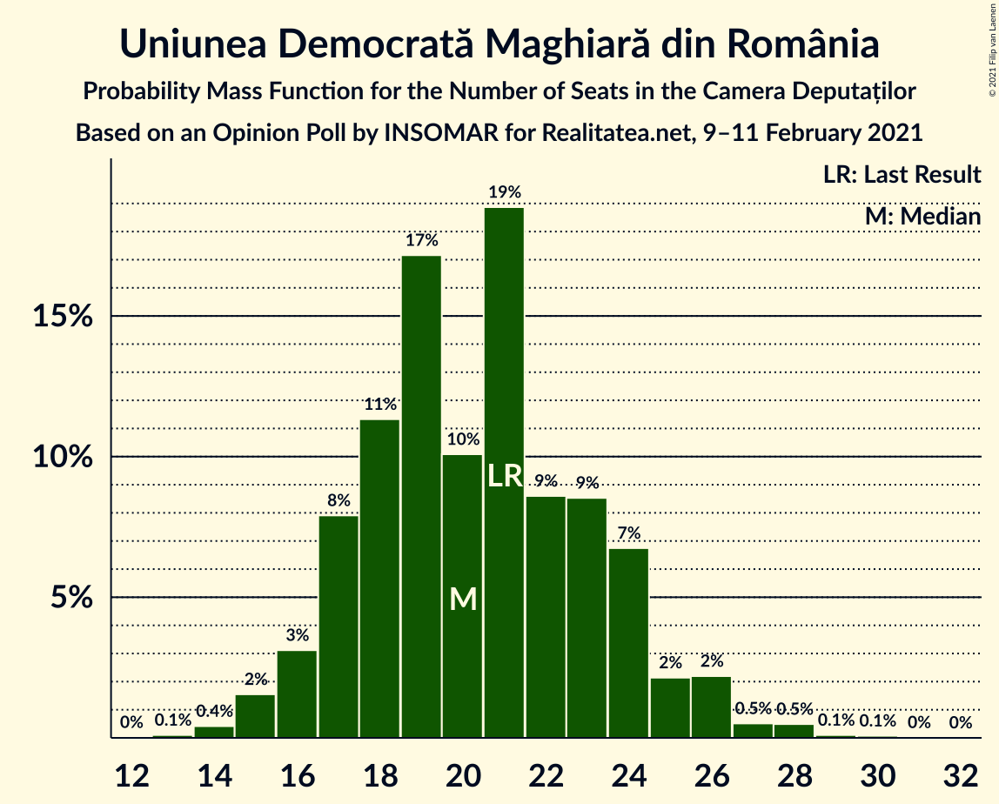
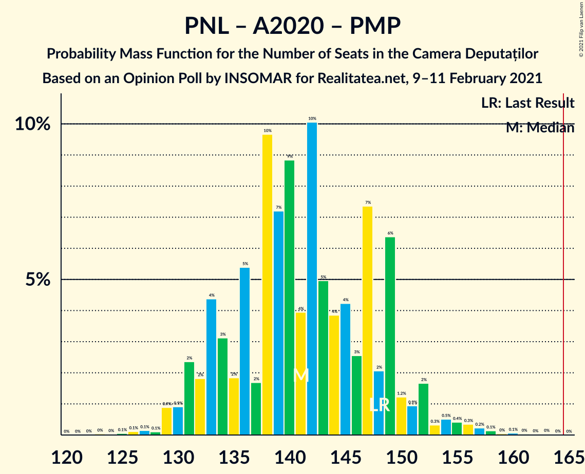
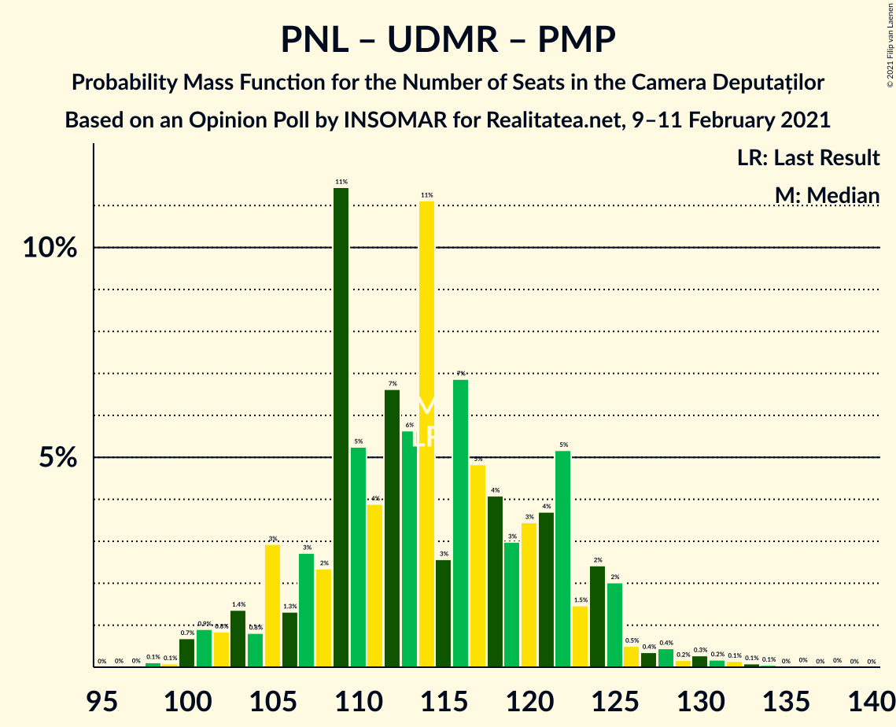

# Opinion Poll by INSOMAR for Realitatea.net, 9–11 February 2021

<a href="#voting-intentions">Voting Intentions</a> | <a href="#seats">Seats</a> | <a href="#coalitions">Coalitions</a> | <a href="#technical-information">Technical Information</a>

## Voting Intentions

### Confidence Intervals

| Party | Last Result | Poll Result | 80% Confidence Interval | 90% Confidence Interval | 95% Confidence Interval | 99% Confidence Interval |
|:-----:|:-----------:|:-----------:|:-----------------------:|:-----------------------:|:-----------------------:|:-----------------------:|
| Partidul Social Democrat | 28.9% | 28.0% | 26.2–29.8% |25.7–30.3% |25.3–30.8% |24.5–31.7% |
| Partidul Național Liberal | 25.2% | 27.0% | 25.3–28.8% |24.8–29.3% |24.4–29.8% |23.5–30.7% |
| Alianța pentru Unirea Românilor | 9.1% | 16.0% | 14.6–17.6% |14.2–18.0% |13.9–18.4% |13.3–19.2% |
| Alianța 2020 USR-PLUS | 15.4% | 14.0% | 12.7–15.5% |12.3–15.9% |12.0–16.2% |11.4–17.0% |
| Uniunea Democrată Maghiară din România | 5.7% | 6.0% | 5.2–7.1% |4.9–7.4% |4.7–7.7% |4.3–8.2% |
| Partidul Mișcarea Populară | 4.8% | 4.0% | 3.3–4.9% |3.1–5.1% |2.9–5.4% |2.7–5.8% |
| PRO România | 4.1% | 1.0% | 0.7–1.5% |0.6–1.6% |0.5–1.8% |0.4–2.1% |

*Note:* The poll result column reflects the actual value used in the calculations. Published results may vary slightly, and in addition be rounded to fewer digits.

## Seats

### Confidence Intervals

| Party | Last Result | Median | 80% Confidence Interval | 90% Confidence Interval | 95% Confidence Interval | 99% Confidence Interval |
|:-----:|:-----------:|:------:|:-----------------------:|:-----------------------:|:-----------------------:|:-----------------------:|
| <a href="#partidul-social-democrat">Partidul Social Democrat</a> | 110 | 95 | 88–102 |87–105 |86–107 |83–108 |
| <a href="#partidul-național-liberal">Partidul Național Liberal</a> | 93 | 93 | 85–100 |83–102 |81–102 |79–105 |
| <a href="#alianța-pentru-unirea-românilor">Alianța pentru Unirea Românilor</a> | 33 | 54 | 50–59 |48–62 |47–63 |45–66 |
| <a href="#alianța-2020-usr-plus">Alianța 2020 USR-PLUS</a> | 55 | 47 | 43–53 |42–54 |40–55 |38–58 |
| <a href="#uniunea-democrată-maghiară-din-românia">Uniunea Democrată Maghiară din România</a> | 21 | 20 | 17–24 |16–25 |16–26 |14–28 |
| <a href="#partidul-mișcarea-populară">Partidul Mișcarea Populară</a> | 0 | 0 | 0 |0–17 |0–17 |0–19 |
| <a href="#pro-românia">PRO România</a> | 0 | 0 | 0 |0 |0 |0 |

### Partidul Social Democrat

*For a full overview of the results for this party, see the [Partidul Social Democrat](party-partidulsocialdemocrat.html) page.*

| Number of Seats | Probability | Accumulated | Special Marks |
|:---------------:|:-----------:|:-----------:|:-------------:|
| 80 | 0.1% | 100% |  |
| 81 | 0.1% | 99.9% |  |
| 82 | 0.2% | 99.8% |  |
| 83 | 0.4% | 99.6% |  |
| 84 | 0.5% | 99.1% |  |
| 85 | 0.5% | 98.6% |  |
| 86 | 1.3% | 98% |  |
| 87 | 3% | 97% |  |
| 88 | 5% | 94% |  |
| 89 | 2% | 89% |  |
| 90 | 4% | 87% |  |
| 91 | 4% | 83% |  |
| 92 | 6% | 79% |  |
| 93 | 3% | 73% |  |
| 94 | 12% | 69% |  |
| 95 | 9% | 57% | Median |
| 96 | 6% | 49% |  |
| 97 | 5% | 43% |  |
| 98 | 6% | 38% |  |
| 99 | 6% | 32% |  |
| 100 | 5% | 26% |  |
| 101 | 10% | 21% |  |
| 102 | 3% | 11% |  |
| 103 | 2% | 8% |  |
| 104 | 0.8% | 6% |  |
| 105 | 2% | 5% |  |
| 106 | 0.9% | 4% |  |
| 107 | 1.3% | 3% |  |
| 108 | 1.1% | 1.4% |  |
| 109 | 0.2% | 0.4% |  |
| 110 | 0% | 0.2% | Last Result |
| 111 | 0% | 0.1% |  |
| 112 | 0.1% | 0.1% |  |
| 113 | 0% | 0% |  |

### Partidul Național Liberal

*For a full overview of the results for this party, see the [Partidul Național Liberal](party-partidulnaționalliberal.html) page.*

| Number of Seats | Probability | Accumulated | Special Marks |
|:---------------:|:-----------:|:-----------:|:-------------:|
| 76 | 0% | 100% |  |
| 77 | 0.2% | 99.9% |  |
| 78 | 0.2% | 99.7% |  |
| 79 | 0.3% | 99.6% |  |
| 80 | 0.3% | 99.3% |  |
| 81 | 2% | 99.0% |  |
| 82 | 0.4% | 97% |  |
| 83 | 2% | 97% |  |
| 84 | 1.2% | 94% |  |
| 85 | 4% | 93% |  |
| 86 | 5% | 89% |  |
| 87 | 2% | 84% |  |
| 88 | 8% | 82% |  |
| 89 | 3% | 74% |  |
| 90 | 11% | 71% |  |
| 91 | 6% | 61% |  |
| 92 | 4% | 55% |  |
| 93 | 13% | 51% | Last Result, Median |
| 94 | 3% | 38% |  |
| 95 | 7% | 35% |  |
| 96 | 4% | 28% |  |
| 97 | 5% | 23% |  |
| 98 | 6% | 18% |  |
| 99 | 0.9% | 12% |  |
| 100 | 5% | 11% |  |
| 101 | 0.9% | 6% |  |
| 102 | 3% | 5% |  |
| 103 | 0.6% | 2% |  |
| 104 | 0.4% | 1.4% |  |
| 105 | 0.5% | 1.0% |  |
| 106 | 0.1% | 0.5% |  |
| 107 | 0.1% | 0.3% |  |
| 108 | 0.1% | 0.2% |  |
| 109 | 0% | 0.1% |  |
| 110 | 0% | 0% |  |

### Alianța pentru Unirea Românilor

*For a full overview of the results for this party, see the [Alianța pentru Unirea Românilor](party-alianțapentruunirearomânilor.html) page.*

| Number of Seats | Probability | Accumulated | Special Marks |
|:---------------:|:-----------:|:-----------:|:-------------:|
| 33 | 0% | 100% | Last Result |
| 34 | 0% | 100% |  |
| 35 | 0% | 100% |  |
| 36 | 0% | 100% |  |
| 37 | 0% | 100% |  |
| 38 | 0% | 100% |  |
| 39 | 0% | 100% |  |
| 40 | 0% | 100% |  |
| 41 | 0% | 100% |  |
| 42 | 0.1% | 100% |  |
| 43 | 0.1% | 99.9% |  |
| 44 | 0.2% | 99.8% |  |
| 45 | 0.3% | 99.6% |  |
| 46 | 1.3% | 99.3% |  |
| 47 | 2% | 98% |  |
| 48 | 2% | 96% |  |
| 49 | 3% | 94% |  |
| 50 | 6% | 91% |  |
| 51 | 5% | 85% |  |
| 52 | 7% | 80% |  |
| 53 | 6% | 73% |  |
| 54 | 17% | 67% | Median |
| 55 | 8% | 49% |  |
| 56 | 6% | 41% |  |
| 57 | 13% | 35% |  |
| 58 | 7% | 22% |  |
| 59 | 6% | 15% |  |
| 60 | 2% | 9% |  |
| 61 | 2% | 7% |  |
| 62 | 2% | 5% |  |
| 63 | 0.8% | 3% |  |
| 64 | 1.0% | 2% |  |
| 65 | 0.7% | 1.3% |  |
| 66 | 0.3% | 0.6% |  |
| 67 | 0.2% | 0.2% |  |
| 68 | 0% | 0.1% |  |
| 69 | 0% | 0% |  |

### Alianța 2020 USR-PLUS

*For a full overview of the results for this party, see the [Alianța 2020 USR-PLUS](party-alianța2020usr-plus.html) page.*

| Number of Seats | Probability | Accumulated | Special Marks |
|:---------------:|:-----------:|:-----------:|:-------------:|
| 36 | 0.1% | 100% |  |
| 37 | 0.1% | 99.9% |  |
| 38 | 0.4% | 99.8% |  |
| 39 | 0.8% | 99.4% |  |
| 40 | 1.4% | 98.6% |  |
| 41 | 1.2% | 97% |  |
| 42 | 5% | 96% |  |
| 43 | 8% | 91% |  |
| 44 | 7% | 84% |  |
| 45 | 8% | 76% |  |
| 46 | 9% | 69% |  |
| 47 | 12% | 60% | Median |
| 48 | 12% | 48% |  |
| 49 | 9% | 36% |  |
| 50 | 7% | 27% |  |
| 51 | 3% | 20% |  |
| 52 | 6% | 17% |  |
| 53 | 4% | 11% |  |
| 54 | 3% | 7% |  |
| 55 | 2% | 4% | Last Result |
| 56 | 0.5% | 2% |  |
| 57 | 0.7% | 2% |  |
| 58 | 0.5% | 0.9% |  |
| 59 | 0.2% | 0.4% |  |
| 60 | 0.1% | 0.2% |  |
| 61 | 0% | 0.1% |  |
| 62 | 0% | 0.1% |  |
| 63 | 0% | 0% |  |

### Uniunea Democrată Maghiară din România

*For a full overview of the results for this party, see the [Uniunea Democrată Maghiară din România](party-uniuneademocratămaghiarădinromânia.html) page.*

| Number of Seats | Probability | Accumulated | Special Marks |
|:---------------:|:-----------:|:-----------:|:-------------:|
| 13 | 0.1% | 100% |  |
| 14 | 0.4% | 99.9% |  |
| 15 | 2% | 99.5% |  |
| 16 | 3% | 98% |  |
| 17 | 8% | 95% |  |
| 18 | 11% | 87% |  |
| 19 | 17% | 76% |  |
| 20 | 10% | 58% | Median |
| 21 | 19% | 48% | Last Result |
| 22 | 9% | 29% |  |
| 23 | 9% | 21% |  |
| 24 | 7% | 12% |  |
| 25 | 2% | 6% |  |
| 26 | 2% | 3% |  |
| 27 | 0.5% | 1.2% |  |
| 28 | 0.5% | 0.7% |  |
| 29 | 0.1% | 0.2% |  |
| 30 | 0.1% | 0.1% |  |
| 31 | 0% | 0% |  |

### Partidul Mișcarea Populară

*For a full overview of the results for this party, see the [Partidul Mișcarea Populară](party-partidulmișcareapopulară.html) page.*

| Number of Seats | Probability | Accumulated | Special Marks |
|:---------------:|:-----------:|:-----------:|:-------------:|
| 0 | 92% | 100% | Last Result, Median |
| 1 | 0% | 8% |  |
| 2 | 0% | 8% |  |
| 3 | 0% | 8% |  |
| 4 | 0% | 8% |  |
| 5 | 0% | 8% |  |
| 6 | 0% | 8% |  |
| 7 | 0% | 8% |  |
| 8 | 0% | 8% |  |
| 9 | 0% | 8% |  |
| 10 | 0% | 8% |  |
| 11 | 0% | 8% |  |
| 12 | 0% | 8% |  |
| 13 | 0% | 8% |  |
| 14 | 0% | 8% |  |
| 15 | 0% | 8% |  |
| 16 | 2% | 8% |  |
| 17 | 5% | 6% |  |
| 18 | 1.1% | 2% |  |
| 19 | 0.6% | 0.9% |  |
| 20 | 0.2% | 0.3% |  |
| 21 | 0.1% | 0.1% |  |
| 22 | 0% | 0% |  |

### PRO România

*For a full overview of the results for this party, see the [PRO România](party-proromânia.html) page.*

| Number of Seats | Probability | Accumulated | Special Marks |
|:---------------:|:-----------:|:-----------:|:-------------:|
| 0 | 100% | 100% | Last Result, Median |

## Coalitions

### Confidence Intervals

| Coalition | Last Result | Median | Majority? | 80% Confidence Interval | 90% Confidence Interval | 95% Confidence Interval | 99% Confidence Interval |
|:---------:|:-----------:|:------:|:---------:|:-----------------------:|:-----------------------:|:-----------------------:|:-----------------------:|
| Partidul Național Liberal – Alianța 2020 USR-PLUS – Uniunea Democrată Maghiară din România – Partidul Mișcarea Populară | 169 | 161 | 34% | 155–170 | 152–172 | 151–173 | 148–176 |
| Partidul Național Liberal – Alianța 2020 USR-PLUS – Uniunea Democrată Maghiară din România | 169 | 161 | 27% | 152–168 | 150–171 | 148–172 | 143–173 |
| Partidul Național Liberal – Alianța 2020 USR-PLUS – Partidul Mișcarea Populară | 148 | 141 | 0% | 133–149 | 132–150 | 131–152 | 129–157 |
| Partidul Național Liberal – Alianța 2020 USR-PLUS | 148 | 140 | 0% | 132–148 | 130–149 | 129–151 | 125–154 |
| Partidul Național Liberal – Uniunea Democrată Maghiară din România – Partidul Mișcarea Populară | 114 | 114 | 0% | 107–122 | 105–124 | 102–125 | 100–131 |
| Partidul Național Liberal – Uniunea Democrată Maghiară din România | 114 | 113 | 0% | 105–121 | 103–122 | 101–124 | 98–126 |
| Partidul Social Democrat – PRO România | 110 | 95 | 0% | 88–102 | 87–105 | 86–107 | 83–108 |
| Partidul Național Liberal – Partidul Mișcarea Populară | 93 | 93 | 0% | 86–102 | 85–103 | 83–105 | 81–111 |
| Partidul Național Liberal | 93 | 93 | 0% | 85–100 | 83–102 | 81–102 | 79–105 |
| Alianța 2020 USR-PLUS – Partidul Mișcarea Populară | 55 | 48 | 0% | 43–56 | 42–61 | 41–63 | 39–68 |

### Partidul Național Liberal – Alianța 2020 USR-PLUS – Uniunea Democrată Maghiară din România – Partidul Mișcarea Populară

| Number of Seats | Probability | Accumulated | Special Marks |
|:---------------:|:-----------:|:-----------:|:-------------:|
| 145 | 0% | 100% |  |
| 146 | 0.1% | 99.9% |  |
| 147 | 0.3% | 99.8% |  |
| 148 | 0.1% | 99.5% |  |
| 149 | 0.1% | 99.4% |  |
| 150 | 0.6% | 99.3% |  |
| 151 | 2% | 98.7% |  |
| 152 | 3% | 97% |  |
| 153 | 2% | 94% |  |
| 154 | 1.3% | 92% |  |
| 155 | 3% | 91% |  |
| 156 | 6% | 88% |  |
| 157 | 14% | 81% |  |
| 158 | 3% | 67% |  |
| 159 | 0.8% | 64% |  |
| 160 | 4% | 63% | Median |
| 161 | 13% | 59% |  |
| 162 | 7% | 46% |  |
| 163 | 3% | 39% |  |
| 164 | 2% | 35% |  |
| 165 | 4% | 34% | Majority |
| 166 | 8% | 29% |  |
| 167 | 7% | 21% |  |
| 168 | 2% | 14% |  |
| 169 | 0.7% | 12% | Last Result |
| 170 | 3% | 11% |  |
| 171 | 3% | 8% |  |
| 172 | 3% | 5% |  |
| 173 | 1.0% | 3% |  |
| 174 | 0.3% | 2% |  |
| 175 | 0.4% | 1.3% |  |
| 176 | 0.4% | 0.9% |  |
| 177 | 0.1% | 0.5% |  |
| 178 | 0.1% | 0.3% |  |
| 179 | 0.1% | 0.2% |  |
| 180 | 0.1% | 0.2% |  |
| 181 | 0% | 0.1% |  |
| 182 | 0% | 0% |  |

### Partidul Național Liberal – Alianța 2020 USR-PLUS – Uniunea Democrată Maghiară din România

| Number of Seats | Probability | Accumulated | Special Marks |
|:---------------:|:-----------:|:-----------:|:-------------:|
| 141 | 0% | 100% |  |
| 142 | 0.2% | 99.9% |  |
| 143 | 0.3% | 99.8% |  |
| 144 | 0.3% | 99.5% |  |
| 145 | 0.1% | 99.2% |  |
| 146 | 0.4% | 99.1% |  |
| 147 | 0.8% | 98.7% |  |
| 148 | 2% | 98% |  |
| 149 | 1.1% | 96% |  |
| 150 | 0.8% | 95% |  |
| 151 | 2% | 94% |  |
| 152 | 3% | 92% |  |
| 153 | 4% | 89% |  |
| 154 | 1.4% | 85% |  |
| 155 | 3% | 84% |  |
| 156 | 7% | 81% |  |
| 157 | 14% | 74% |  |
| 158 | 3% | 60% |  |
| 159 | 1.1% | 56% |  |
| 160 | 4% | 55% | Median |
| 161 | 13% | 52% |  |
| 162 | 7% | 38% |  |
| 163 | 3% | 31% |  |
| 164 | 1.0% | 28% |  |
| 165 | 4% | 27% | Majority |
| 166 | 6% | 24% |  |
| 167 | 7% | 17% |  |
| 168 | 2% | 10% |  |
| 169 | 0.5% | 8% | Last Result |
| 170 | 0.6% | 7% |  |
| 171 | 3% | 7% |  |
| 172 | 2% | 4% |  |
| 173 | 0.8% | 1.2% |  |
| 174 | 0.1% | 0.4% |  |
| 175 | 0% | 0.3% |  |
| 176 | 0.2% | 0.3% |  |
| 177 | 0.1% | 0.2% |  |
| 178 | 0.1% | 0.1% |  |
| 179 | 0% | 0% |  |

### Partidul Național Liberal – Alianța 2020 USR-PLUS – Partidul Mișcarea Populară

| Number of Seats | Probability | Accumulated | Special Marks |
|:---------------:|:-----------:|:-----------:|:-------------:|
| 123 | 0% | 100% |  |
| 124 | 0% | 99.9% |  |
| 125 | 0.1% | 99.9% |  |
| 126 | 0.1% | 99.9% |  |
| 127 | 0.1% | 99.8% |  |
| 128 | 0.1% | 99.6% |  |
| 129 | 0.9% | 99.5% |  |
| 130 | 0.9% | 98.6% |  |
| 131 | 2% | 98% |  |
| 132 | 2% | 95% |  |
| 133 | 4% | 94% |  |
| 134 | 3% | 89% |  |
| 135 | 2% | 86% |  |
| 136 | 5% | 84% |  |
| 137 | 2% | 79% |  |
| 138 | 10% | 77% |  |
| 139 | 7% | 67% |  |
| 140 | 9% | 60% | Median |
| 141 | 4% | 51% |  |
| 142 | 10% | 47% |  |
| 143 | 5% | 37% |  |
| 144 | 4% | 32% |  |
| 145 | 4% | 29% |  |
| 146 | 3% | 24% |  |
| 147 | 7% | 22% |  |
| 148 | 2% | 14% | Last Result |
| 149 | 6% | 12% |  |
| 150 | 1.2% | 6% |  |
| 151 | 0.9% | 5% |  |
| 152 | 2% | 4% |  |
| 153 | 0.3% | 2% |  |
| 154 | 0.5% | 2% |  |
| 155 | 0.4% | 1.3% |  |
| 156 | 0.3% | 0.9% |  |
| 157 | 0.2% | 0.6% |  |
| 158 | 0.1% | 0.3% |  |
| 159 | 0% | 0.2% |  |
| 160 | 0.1% | 0.2% |  |
| 161 | 0% | 0.1% |  |
| 162 | 0% | 0.1% |  |
| 163 | 0% | 0% |  |

### Partidul Național Liberal – Alianța 2020 USR-PLUS

| Number of Seats | Probability | Accumulated | Special Marks |
|:---------------:|:-----------:|:-----------:|:-------------:|
| 120 | 0% | 100% |  |
| 121 | 0% | 99.9% |  |
| 122 | 0.1% | 99.9% |  |
| 123 | 0.2% | 99.8% |  |
| 124 | 0.1% | 99.7% |  |
| 125 | 0.3% | 99.6% |  |
| 126 | 0.4% | 99.3% |  |
| 127 | 0.2% | 98.8% |  |
| 128 | 0.6% | 98.6% |  |
| 129 | 1.2% | 98% |  |
| 130 | 3% | 97% |  |
| 131 | 3% | 94% |  |
| 132 | 4% | 91% |  |
| 133 | 5% | 87% |  |
| 134 | 3% | 82% |  |
| 135 | 2% | 79% |  |
| 136 | 6% | 77% |  |
| 137 | 2% | 71% |  |
| 138 | 10% | 70% |  |
| 139 | 7% | 60% |  |
| 140 | 9% | 52% | Median |
| 141 | 4% | 44% |  |
| 142 | 10% | 40% |  |
| 143 | 5% | 30% |  |
| 144 | 4% | 25% |  |
| 145 | 4% | 21% |  |
| 146 | 2% | 18% |  |
| 147 | 6% | 16% |  |
| 148 | 2% | 10% | Last Result |
| 149 | 4% | 8% |  |
| 150 | 1.0% | 4% |  |
| 151 | 0.6% | 3% |  |
| 152 | 1.5% | 2% |  |
| 153 | 0.2% | 1.0% |  |
| 154 | 0.4% | 0.8% |  |
| 155 | 0.1% | 0.4% |  |
| 156 | 0.2% | 0.3% |  |
| 157 | 0% | 0.1% |  |
| 158 | 0.1% | 0.1% |  |
| 159 | 0% | 0% |  |

### Partidul Național Liberal – Uniunea Democrată Maghiară din România – Partidul Mișcarea Populară

| Number of Seats | Probability | Accumulated | Special Marks |
|:---------------:|:-----------:|:-----------:|:-------------:|
| 97 | 0% | 100% |  |
| 98 | 0.1% | 99.9% |  |
| 99 | 0.1% | 99.8% |  |
| 100 | 0.7% | 99.7% |  |
| 101 | 0.9% | 99.1% |  |
| 102 | 0.8% | 98% |  |
| 103 | 1.4% | 97% |  |
| 104 | 0.8% | 96% |  |
| 105 | 3% | 95% |  |
| 106 | 1.3% | 92% |  |
| 107 | 3% | 91% |  |
| 108 | 2% | 88% |  |
| 109 | 11% | 86% |  |
| 110 | 5% | 74% |  |
| 111 | 4% | 69% |  |
| 112 | 7% | 65% |  |
| 113 | 6% | 59% | Median |
| 114 | 11% | 53% | Last Result |
| 115 | 3% | 42% |  |
| 116 | 7% | 39% |  |
| 117 | 5% | 32% |  |
| 118 | 4% | 28% |  |
| 119 | 3% | 24% |  |
| 120 | 3% | 21% |  |
| 121 | 4% | 17% |  |
| 122 | 5% | 13% |  |
| 123 | 1.5% | 8% |  |
| 124 | 2% | 7% |  |
| 125 | 2% | 4% |  |
| 126 | 0.5% | 2% |  |
| 127 | 0.4% | 2% |  |
| 128 | 0.4% | 1.4% |  |
| 129 | 0.2% | 1.0% |  |
| 130 | 0.3% | 0.8% |  |
| 131 | 0.2% | 0.5% |  |
| 132 | 0.1% | 0.4% |  |
| 133 | 0.1% | 0.2% |  |
| 134 | 0.1% | 0.1% |  |
| 135 | 0% | 0.1% |  |
| 136 | 0% | 0.1% |  |
| 137 | 0% | 0% |  |

### Partidul Național Liberal – Uniunea Democrată Maghiară din România

| Number of Seats | Probability | Accumulated | Special Marks |
|:---------------:|:-----------:|:-----------:|:-------------:|
| 95 | 0% | 100% |  |
| 96 | 0.1% | 99.9% |  |
| 97 | 0.1% | 99.9% |  |
| 98 | 0.4% | 99.8% |  |
| 99 | 0.7% | 99.4% |  |
| 100 | 1.0% | 98.7% |  |
| 101 | 1.2% | 98% |  |
| 102 | 1.1% | 96% |  |
| 103 | 2% | 95% |  |
| 104 | 1.0% | 94% |  |
| 105 | 4% | 93% |  |
| 106 | 3% | 89% |  |
| 107 | 5% | 86% |  |
| 108 | 2% | 81% |  |
| 109 | 12% | 79% |  |
| 110 | 5% | 67% |  |
| 111 | 4% | 62% |  |
| 112 | 7% | 58% |  |
| 113 | 6% | 51% | Median |
| 114 | 11% | 45% | Last Result |
| 115 | 3% | 34% |  |
| 116 | 6% | 32% |  |
| 117 | 5% | 25% |  |
| 118 | 4% | 21% |  |
| 119 | 3% | 17% |  |
| 120 | 3% | 14% |  |
| 121 | 4% | 11% |  |
| 122 | 4% | 8% |  |
| 123 | 1.3% | 4% |  |
| 124 | 0.4% | 3% |  |
| 125 | 2% | 2% |  |
| 126 | 0.3% | 0.7% |  |
| 127 | 0.1% | 0.4% |  |
| 128 | 0.1% | 0.3% |  |
| 129 | 0.1% | 0.2% |  |
| 130 | 0.1% | 0.1% |  |
| 131 | 0% | 0% |  |

### Partidul Social Democrat – PRO România

| Number of Seats | Probability | Accumulated | Special Marks |
|:---------------:|:-----------:|:-----------:|:-------------:|
| 80 | 0.1% | 100% |  |
| 81 | 0.1% | 99.9% |  |
| 82 | 0.2% | 99.8% |  |
| 83 | 0.4% | 99.6% |  |
| 84 | 0.5% | 99.1% |  |
| 85 | 0.5% | 98.6% |  |
| 86 | 1.3% | 98% |  |
| 87 | 3% | 97% |  |
| 88 | 5% | 94% |  |
| 89 | 2% | 89% |  |
| 90 | 4% | 87% |  |
| 91 | 4% | 83% |  |
| 92 | 6% | 79% |  |
| 93 | 3% | 73% |  |
| 94 | 12% | 69% |  |
| 95 | 9% | 57% | Median |
| 96 | 6% | 49% |  |
| 97 | 5% | 43% |  |
| 98 | 6% | 38% |  |
| 99 | 6% | 32% |  |
| 100 | 5% | 26% |  |
| 101 | 10% | 21% |  |
| 102 | 3% | 11% |  |
| 103 | 2% | 8% |  |
| 104 | 0.8% | 6% |  |
| 105 | 2% | 5% |  |
| 106 | 0.9% | 4% |  |
| 107 | 1.3% | 3% |  |
| 108 | 1.1% | 1.4% |  |
| 109 | 0.2% | 0.4% |  |
| 110 | 0% | 0.2% | Last Result |
| 111 | 0% | 0.1% |  |
| 112 | 0.1% | 0.1% |  |
| 113 | 0% | 0% |  |

### Partidul Național Liberal – Partidul Mișcarea Populară

| Number of Seats | Probability | Accumulated | Special Marks |
|:---------------:|:-----------:|:-----------:|:-------------:|
| 77 | 0% | 100% |  |
| 78 | 0.1% | 99.9% |  |
| 79 | 0.1% | 99.9% |  |
| 80 | 0.2% | 99.7% |  |
| 81 | 1.1% | 99.5% |  |
| 82 | 0.3% | 98% |  |
| 83 | 2% | 98% |  |
| 84 | 0.9% | 96% |  |
| 85 | 4% | 95% |  |
| 86 | 2% | 91% |  |
| 87 | 2% | 89% |  |
| 88 | 7% | 88% |  |
| 89 | 3% | 81% |  |
| 90 | 10% | 78% |  |
| 91 | 6% | 68% |  |
| 92 | 3% | 62% |  |
| 93 | 13% | 59% | Last Result, Median |
| 94 | 3% | 46% |  |
| 95 | 7% | 43% |  |
| 96 | 4% | 36% |  |
| 97 | 5% | 31% |  |
| 98 | 7% | 26% |  |
| 99 | 0.9% | 19% |  |
| 100 | 6% | 18% |  |
| 101 | 1.2% | 13% |  |
| 102 | 3% | 11% |  |
| 103 | 4% | 8% |  |
| 104 | 2% | 5% |  |
| 105 | 0.7% | 3% |  |
| 106 | 0.6% | 2% |  |
| 107 | 0.3% | 2% |  |
| 108 | 0.3% | 1.3% |  |
| 109 | 0.3% | 1.0% |  |
| 110 | 0.1% | 0.7% |  |
| 111 | 0.2% | 0.5% |  |
| 112 | 0.1% | 0.3% |  |
| 113 | 0.1% | 0.2% |  |
| 114 | 0% | 0.1% |  |
| 115 | 0% | 0.1% |  |
| 116 | 0% | 0.1% |  |
| 117 | 0% | 0.1% |  |
| 118 | 0% | 0% |  |

### Partidul Național Liberal

| Number of Seats | Probability | Accumulated | Special Marks |
|:---------------:|:-----------:|:-----------:|:-------------:|
| 76 | 0% | 100% |  |
| 77 | 0.2% | 99.9% |  |
| 78 | 0.2% | 99.7% |  |
| 79 | 0.3% | 99.6% |  |
| 80 | 0.3% | 99.3% |  |
| 81 | 2% | 99.0% |  |
| 82 | 0.4% | 97% |  |
| 83 | 2% | 97% |  |
| 84 | 1.2% | 94% |  |
| 85 | 4% | 93% |  |
| 86 | 5% | 89% |  |
| 87 | 2% | 84% |  |
| 88 | 8% | 82% |  |
| 89 | 3% | 74% |  |
| 90 | 11% | 71% |  |
| 91 | 6% | 61% |  |
| 92 | 4% | 55% |  |
| 93 | 13% | 51% | Last Result, Median |
| 94 | 3% | 38% |  |
| 95 | 7% | 35% |  |
| 96 | 4% | 28% |  |
| 97 | 5% | 23% |  |
| 98 | 6% | 18% |  |
| 99 | 0.9% | 12% |  |
| 100 | 5% | 11% |  |
| 101 | 0.9% | 6% |  |
| 102 | 3% | 5% |  |
| 103 | 0.6% | 2% |  |
| 104 | 0.4% | 1.4% |  |
| 105 | 0.5% | 1.0% |  |
| 106 | 0.1% | 0.5% |  |
| 107 | 0.1% | 0.3% |  |
| 108 | 0.1% | 0.2% |  |
| 109 | 0% | 0.1% |  |
| 110 | 0% | 0% |  |

### Alianța 2020 USR-PLUS – Partidul Mișcarea Populară

| Number of Seats | Probability | Accumulated | Special Marks |
|:---------------:|:-----------:|:-----------:|:-------------:|
| 36 | 0% | 100% |  |
| 37 | 0.1% | 99.9% |  |
| 38 | 0.3% | 99.9% |  |
| 39 | 0.7% | 99.5% |  |
| 40 | 1.1% | 98.8% |  |
| 41 | 0.9% | 98% |  |
| 42 | 3% | 97% |  |
| 43 | 7% | 93% |  |
| 44 | 6% | 86% |  |
| 45 | 7% | 80% |  |
| 46 | 6% | 73% |  |
| 47 | 12% | 66% | Median |
| 48 | 12% | 54% |  |
| 49 | 8% | 43% |  |
| 50 | 7% | 35% |  |
| 51 | 3% | 28% |  |
| 52 | 6% | 25% |  |
| 53 | 4% | 19% |  |
| 54 | 3% | 15% |  |
| 55 | 2% | 12% | Last Result |
| 56 | 0.7% | 10% |  |
| 57 | 1.0% | 10% |  |
| 58 | 1.5% | 9% |  |
| 59 | 0.4% | 7% |  |
| 60 | 0.7% | 7% |  |
| 61 | 1.1% | 6% |  |
| 62 | 0.4% | 5% |  |
| 63 | 2% | 4% |  |
| 64 | 0.4% | 2% |  |
| 65 | 0.4% | 2% |  |
| 66 | 0.9% | 2% |  |
| 67 | 0.1% | 0.7% |  |
| 68 | 0.3% | 0.6% |  |
| 69 | 0.1% | 0.3% |  |
| 70 | 0.1% | 0.2% |  |
| 71 | 0.1% | 0.1% |  |
| 72 | 0% | 0.1% |  |
| 73 | 0% | 0% |  |

## Technical Information

### Opinion Poll

+ **Polling firm:** INSOMAR
+ **Commissioner(s):** Realitatea.net
+ **Fieldwork period:** 9–11 February 2021

### Calculations

+ **Sample size:** 1030
+ **Simulations done:** 131,072
+ **Error estimate:** 0.94%

