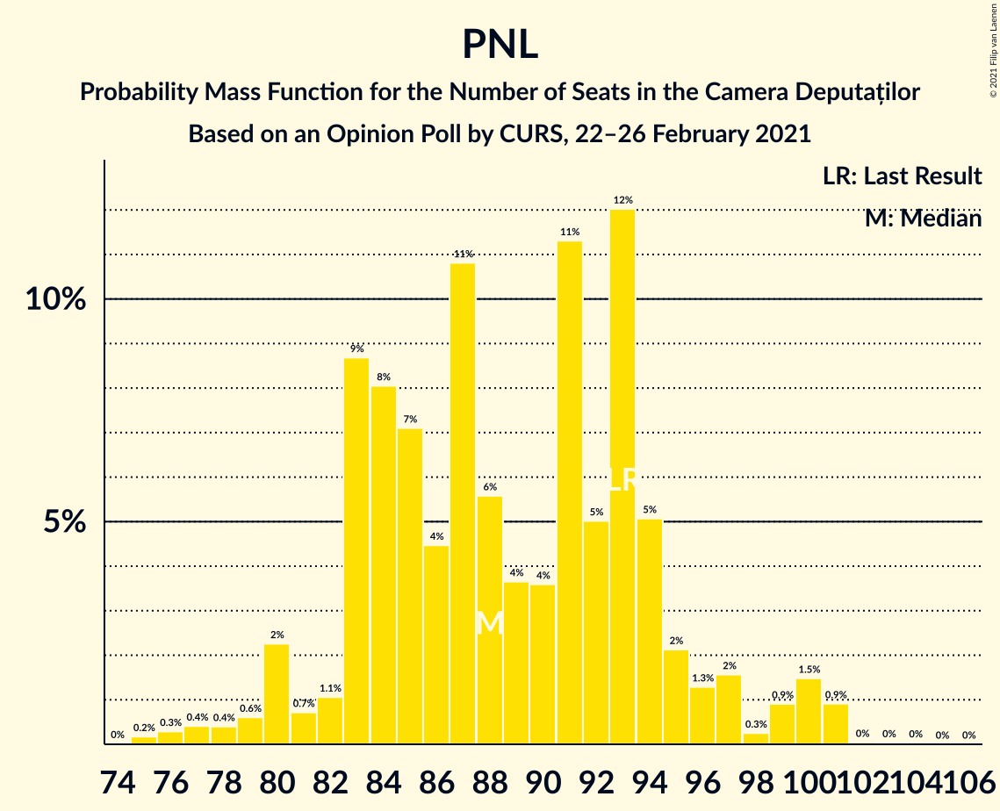

# Opinion Poll by CURS, 22–26 February 2021

<a href="#voting-intentions">Voting Intentions</a> | <a href="#seats">Seats</a> | <a href="#coalitions">Coalitions</a> | <a href="#technical-information">Technical Information</a>

## Voting Intentions

### Confidence Intervals

| Party | Last Result | Poll Result | 80% Confidence Interval | 90% Confidence Interval | 95% Confidence Interval | 99% Confidence Interval |
|:-----:|:-----------:|:-----------:|:-----------------------:|:-----------------------:|:-----------------------:|:-----------------------:|
| Partidul Social Democrat | 28.9% | 34.0% | 32.2–35.9% |31.7–36.4% |31.3–36.9% |30.4–37.8% |
| Partidul Național Liberal | 25.2% | 25.0% | 23.4–26.7% |22.9–27.2% |22.5–27.6% |21.8–28.5% |
| Alianța 2020 USR-PLUS | 15.4% | 16.0% | 14.6–17.5% |14.3–17.9% |13.9–18.3% |13.3–19.0% |
| Alianța pentru Unirea Românilor | 9.1% | 9.0% | 8.0–10.2% |7.7–10.5% |7.4–10.9% |7.0–11.4% |
| Uniunea Democrată Maghiară din România | 5.7% | 4.0% | 3.3–4.9% |3.1–5.1% |3.0–5.3% |2.7–5.8% |
| Partidul Mișcarea Populară | 4.8% | 3.0% | 2.4–3.8% |2.3–4.0% |2.1–4.2% |1.9–4.6% |
| PRO România | 4.1% | 2.0% | 1.6–2.7% |1.4–2.9% |1.3–3.0% |1.1–3.4% |

*Note:* The poll result column reflects the actual value used in the calculations. Published results may vary slightly, and in addition be rounded to fewer digits.

## Seats

### Confidence Intervals

| Party | Last Result | Median | 80% Confidence Interval | 90% Confidence Interval | 95% Confidence Interval | 99% Confidence Interval |
|:-----:|:-----------:|:------:|:-----------------------:|:-----------------------:|:-----------------------:|:-----------------------:|
| <a href="#partidul-social-democrat">Partidul Social Democrat</a> | 110 | 120 | 114–127 |113–129 |111–130 |108–133 |
| <a href="#partidul-național-liberal">Partidul Național Liberal</a> | 93 | 89 | 83–95 |81–96 |80–98 |77–101 |
| <a href="#alianța-2020-usr-plus">Alianța 2020 USR-PLUS</a> | 55 | 57 | 52–62 |51–63 |49–65 |47–67 |
| <a href="#alianța-pentru-unirea-românilor">Alianța pentru Unirea Românilor</a> | 33 | 32 | 28–36 |27–37 |26–38 |24–40 |
| <a href="#uniunea-democrată-maghiară-din-românia">Uniunea Democrată Maghiară din România</a> | 21 | 14 | 11–17 |11–18 |10–19 |9–20 |
| <a href="#partidul-mișcarea-populară">Partidul Mișcarea Populară</a> | 0 | 0 | 0 |0 |0 |0 |
| <a href="#pro-românia">PRO România</a> | 0 | 0 | 0 |0 |0 |0 |

### Partidul Social Democrat

*For a full overview of the results for this party, see the [Partidul Social Democrat](party-partidulsocialdemocrat.html) page.*

| Number of Seats | Probability | Accumulated | Special Marks |
|:---------------:|:-----------:|:-----------:|:-------------:|
| 105 | 0% | 100% |  |
| 106 | 0.1% | 99.9% |  |
| 107 | 0.1% | 99.8% |  |
| 108 | 0.3% | 99.7% |  |
| 109 | 0.6% | 99.4% |  |
| 110 | 0.8% | 98.9% | Last Result |
| 111 | 0.9% | 98% |  |
| 112 | 2% | 97% |  |
| 113 | 3% | 96% |  |
| 114 | 3% | 93% |  |
| 115 | 4% | 89% |  |
| 116 | 5% | 85% |  |
| 117 | 6% | 80% |  |
| 118 | 8% | 74% |  |
| 119 | 8% | 65% |  |
| 120 | 8% | 57% | Median |
| 121 | 7% | 50% |  |
| 122 | 8% | 43% |  |
| 123 | 9% | 35% |  |
| 124 | 6% | 26% |  |
| 125 | 5% | 20% |  |
| 126 | 4% | 15% |  |
| 127 | 3% | 12% |  |
| 128 | 3% | 9% |  |
| 129 | 2% | 5% |  |
| 130 | 1.2% | 4% |  |
| 131 | 0.8% | 2% |  |
| 132 | 0.7% | 2% |  |
| 133 | 0.5% | 0.9% |  |
| 134 | 0.2% | 0.5% |  |
| 135 | 0.1% | 0.3% |  |
| 136 | 0.1% | 0.2% |  |
| 137 | 0.1% | 0.1% |  |
| 138 | 0% | 0% |  |

### Partidul Național Liberal

*For a full overview of the results for this party, see the [Partidul Național Liberal](party-partidulnaționalliberal.html) page.*

| Number of Seats | Probability | Accumulated | Special Marks |
|:---------------:|:-----------:|:-----------:|:-------------:|
| 74 | 0% | 100% |  |
| 75 | 0.1% | 99.9% |  |
| 76 | 0.1% | 99.8% |  |
| 77 | 0.3% | 99.7% |  |
| 78 | 0.6% | 99.4% |  |
| 79 | 1.0% | 98.9% |  |
| 80 | 1.3% | 98% |  |
| 81 | 2% | 97% |  |
| 82 | 3% | 94% |  |
| 83 | 4% | 91% |  |
| 84 | 5% | 87% |  |
| 85 | 6% | 82% |  |
| 86 | 8% | 76% |  |
| 87 | 8% | 69% |  |
| 88 | 9% | 60% |  |
| 89 | 9% | 51% | Median |
| 90 | 10% | 43% |  |
| 91 | 6% | 33% |  |
| 92 | 6% | 27% |  |
| 93 | 6% | 21% | Last Result |
| 94 | 4% | 14% |  |
| 95 | 4% | 11% |  |
| 96 | 2% | 7% |  |
| 97 | 1.5% | 4% |  |
| 98 | 1.3% | 3% |  |
| 99 | 0.6% | 2% |  |
| 100 | 0.4% | 1.0% |  |
| 101 | 0.3% | 0.6% |  |
| 102 | 0.1% | 0.3% |  |
| 103 | 0.1% | 0.1% |  |
| 104 | 0% | 0.1% |  |
| 105 | 0% | 0% |  |

### Alianța 2020 USR-PLUS

*For a full overview of the results for this party, see the [Alianța 2020 USR-PLUS](party-alianța2020usr-plus.html) page.*

| Number of Seats | Probability | Accumulated | Special Marks |
|:---------------:|:-----------:|:-----------:|:-------------:|
| 45 | 0.1% | 100% |  |
| 46 | 0.1% | 99.9% |  |
| 47 | 0.3% | 99.7% |  |
| 48 | 0.9% | 99.4% |  |
| 49 | 1.3% | 98.5% |  |
| 50 | 2% | 97% |  |
| 51 | 4% | 95% |  |
| 52 | 5% | 91% |  |
| 53 | 5% | 86% |  |
| 54 | 9% | 81% |  |
| 55 | 11% | 72% | Last Result |
| 56 | 8% | 60% |  |
| 57 | 8% | 52% | Median |
| 58 | 12% | 44% |  |
| 59 | 9% | 32% |  |
| 60 | 5% | 23% |  |
| 61 | 6% | 17% |  |
| 62 | 5% | 12% |  |
| 63 | 2% | 7% |  |
| 64 | 2% | 5% |  |
| 65 | 2% | 3% |  |
| 66 | 0.6% | 1.3% |  |
| 67 | 0.2% | 0.7% |  |
| 68 | 0.2% | 0.4% |  |
| 69 | 0.1% | 0.2% |  |
| 70 | 0% | 0.1% |  |
| 71 | 0% | 0% |  |

### Alianța pentru Unirea Românilor

*For a full overview of the results for this party, see the [Alianța pentru Unirea Românilor](party-alianțapentruunirearomânilor.html) page.*

| Number of Seats | Probability | Accumulated | Special Marks |
|:---------------:|:-----------:|:-----------:|:-------------:|
| 23 | 0.1% | 100% |  |
| 24 | 0.4% | 99.8% |  |
| 25 | 0.9% | 99.4% |  |
| 26 | 2% | 98.5% |  |
| 27 | 3% | 97% |  |
| 28 | 7% | 93% |  |
| 29 | 9% | 87% |  |
| 30 | 11% | 77% |  |
| 31 | 11% | 67% |  |
| 32 | 13% | 55% | Median |
| 33 | 14% | 42% | Last Result |
| 34 | 9% | 29% |  |
| 35 | 7% | 19% |  |
| 36 | 5% | 12% |  |
| 37 | 4% | 7% |  |
| 38 | 2% | 3% |  |
| 39 | 1.0% | 2% |  |
| 40 | 0.5% | 0.8% |  |
| 41 | 0.2% | 0.3% |  |
| 42 | 0.1% | 0.2% |  |
| 43 | 0% | 0.1% |  |
| 44 | 0% | 0% |  |

### Uniunea Democrată Maghiară din România

*For a full overview of the results for this party, see the [Uniunea Democrată Maghiară din România](party-uniuneademocratămaghiarădinromânia.html) page.*

| Number of Seats | Probability | Accumulated | Special Marks |
|:---------------:|:-----------:|:-----------:|:-------------:|
| 8 | 0.1% | 100% |  |
| 9 | 0.7% | 99.9% |  |
| 10 | 3% | 99.2% |  |
| 11 | 6% | 96% |  |
| 12 | 13% | 90% |  |
| 13 | 17% | 77% |  |
| 14 | 18% | 60% | Median |
| 15 | 18% | 42% |  |
| 16 | 11% | 24% |  |
| 17 | 7% | 13% |  |
| 18 | 3% | 6% |  |
| 19 | 2% | 3% |  |
| 20 | 0.6% | 0.9% |  |
| 21 | 0.2% | 0.3% | Last Result |
| 22 | 0.1% | 0.1% |  |
| 23 | 0% | 0% |  |

### Partidul Mișcarea Populară

*For a full overview of the results for this party, see the [Partidul Mișcarea Populară](party-partidulmișcareapopulară.html) page.*

| Number of Seats | Probability | Accumulated | Special Marks |
|:---------------:|:-----------:|:-----------:|:-------------:|
| 0 | 99.9% | 100% | Last Result, Median |
| 1 | 0% | 0.1% |  |
| 2 | 0% | 0.1% |  |
| 3 | 0% | 0.1% |  |
| 4 | 0% | 0.1% |  |
| 5 | 0% | 0.1% |  |
| 6 | 0% | 0.1% |  |
| 7 | 0% | 0.1% |  |
| 8 | 0% | 0.1% |  |
| 9 | 0% | 0.1% |  |
| 10 | 0% | 0.1% |  |
| 11 | 0% | 0.1% |  |
| 12 | 0% | 0.1% |  |
| 13 | 0% | 0.1% |  |
| 14 | 0% | 0.1% |  |
| 15 | 0% | 0.1% |  |
| 16 | 0% | 0.1% |  |
| 17 | 0% | 0.1% |  |
| 18 | 0% | 0% |  |

### PRO România

*For a full overview of the results for this party, see the [PRO România](party-proromânia.html) page.*

| Number of Seats | Probability | Accumulated | Special Marks |
|:---------------:|:-----------:|:-----------:|:-------------:|
| 0 | 100% | 100% | Last Result, Median |

## Coalitions

### Confidence Intervals

| Coalition | Last Result | Median | Majority? | 80% Confidence Interval | 90% Confidence Interval | 95% Confidence Interval | 99% Confidence Interval |
|:---------:|:-----------:|:------:|:---------:|:-----------------------:|:-----------------------:|:-----------------------:|:-----------------------:|
| Partidul Național Liberal – Alianța 2020 USR-PLUS – Uniunea Democrată Maghiară din România – Partidul Mișcarea Populară | 169 | 160 | 16% | 153–166 | 151–168 | 149–169 | 147–172 |
| Partidul Național Liberal – Alianța 2020 USR-PLUS – Uniunea Democrată Maghiară din România | 169 | 160 | 16% | 153–166 | 151–168 | 149–169 | 147–172 |
| Partidul Național Liberal – Alianța 2020 USR-PLUS – Partidul Mișcarea Populară | 148 | 145 | 0% | 139–152 | 137–154 | 136–155 | 133–158 |
| Partidul Național Liberal – Alianța 2020 USR-PLUS | 148 | 145 | 0% | 139–152 | 137–154 | 136–155 | 132–158 |
| Partidul Social Democrat – PRO România | 110 | 120 | 0% | 114–127 | 113–129 | 111–130 | 108–133 |
| Partidul Național Liberal – Uniunea Democrată Maghiară din România – Partidul Mișcarea Populară | 114 | 103 | 0% | 97–109 | 95–111 | 94–112 | 91–115 |
| Partidul Național Liberal – Uniunea Democrată Maghiară din România | 114 | 103 | 0% | 97–109 | 95–111 | 94–112 | 91–115 |
| Partidul Național Liberal – Partidul Mișcarea Populară | 93 | 89 | 0% | 83–95 | 81–96 | 80–98 | 77–101 |
| Partidul Național Liberal | 93 | 89 | 0% | 83–95 | 81–96 | 80–98 | 77–101 |
| Alianța 2020 USR-PLUS – Partidul Mișcarea Populară | 55 | 57 | 0% | 52–62 | 51–63 | 49–65 | 47–67 |

### Partidul Național Liberal – Alianța 2020 USR-PLUS – Uniunea Democrată Maghiară din România – Partidul Mișcarea Populară

| Number of Seats | Probability | Accumulated | Special Marks |
|:---------------:|:-----------:|:-----------:|:-------------:|
| 143 | 0.1% | 100% |  |
| 144 | 0% | 99.9% |  |
| 145 | 0.2% | 99.9% |  |
| 146 | 0.2% | 99.7% |  |
| 147 | 0.4% | 99.5% |  |
| 148 | 0.5% | 99.2% |  |
| 149 | 1.2% | 98.7% |  |
| 150 | 1.2% | 97% |  |
| 151 | 2% | 96% |  |
| 152 | 3% | 94% |  |
| 153 | 4% | 92% |  |
| 154 | 4% | 88% |  |
| 155 | 5% | 84% |  |
| 156 | 7% | 79% |  |
| 157 | 5% | 72% |  |
| 158 | 9% | 67% |  |
| 159 | 7% | 58% |  |
| 160 | 10% | 52% | Median |
| 161 | 6% | 42% |  |
| 162 | 9% | 36% |  |
| 163 | 5% | 27% |  |
| 164 | 6% | 23% |  |
| 165 | 4% | 16% | Majority |
| 166 | 5% | 12% |  |
| 167 | 2% | 8% |  |
| 168 | 2% | 6% |  |
| 169 | 1.2% | 4% | Last Result |
| 170 | 1.0% | 2% |  |
| 171 | 0.4% | 1.4% |  |
| 172 | 0.6% | 1.0% |  |
| 173 | 0.2% | 0.4% |  |
| 174 | 0.1% | 0.3% |  |
| 175 | 0.1% | 0.2% |  |
| 176 | 0% | 0.1% |  |
| 177 | 0% | 0% |  |

### Partidul Național Liberal – Alianța 2020 USR-PLUS – Uniunea Democrată Maghiară din România

| Number of Seats | Probability | Accumulated | Special Marks |
|:---------------:|:-----------:|:-----------:|:-------------:|
| 143 | 0.1% | 100% |  |
| 144 | 0% | 99.9% |  |
| 145 | 0.2% | 99.9% |  |
| 146 | 0.2% | 99.7% |  |
| 147 | 0.4% | 99.5% |  |
| 148 | 0.5% | 99.2% |  |
| 149 | 1.2% | 98.6% |  |
| 150 | 1.2% | 97% |  |
| 151 | 2% | 96% |  |
| 152 | 3% | 94% |  |
| 153 | 4% | 92% |  |
| 154 | 4% | 88% |  |
| 155 | 5% | 84% |  |
| 156 | 7% | 79% |  |
| 157 | 5% | 72% |  |
| 158 | 9% | 67% |  |
| 159 | 7% | 58% |  |
| 160 | 10% | 51% | Median |
| 161 | 6% | 42% |  |
| 162 | 9% | 36% |  |
| 163 | 5% | 27% |  |
| 164 | 6% | 22% |  |
| 165 | 4% | 16% | Majority |
| 166 | 5% | 12% |  |
| 167 | 2% | 8% |  |
| 168 | 2% | 6% |  |
| 169 | 1.2% | 4% | Last Result |
| 170 | 1.0% | 2% |  |
| 171 | 0.4% | 1.4% |  |
| 172 | 0.6% | 1.0% |  |
| 173 | 0.2% | 0.4% |  |
| 174 | 0.1% | 0.3% |  |
| 175 | 0.1% | 0.2% |  |
| 176 | 0% | 0.1% |  |
| 177 | 0% | 0% |  |

### Partidul Național Liberal – Alianța 2020 USR-PLUS – Partidul Mișcarea Populară

| Number of Seats | Probability | Accumulated | Special Marks |
|:---------------:|:-----------:|:-----------:|:-------------:|
| 129 | 0% | 100% |  |
| 130 | 0.1% | 99.9% |  |
| 131 | 0.2% | 99.9% |  |
| 132 | 0.2% | 99.7% |  |
| 133 | 0.3% | 99.5% |  |
| 134 | 0.7% | 99.2% |  |
| 135 | 0.9% | 98% |  |
| 136 | 1.3% | 98% |  |
| 137 | 2% | 96% |  |
| 138 | 3% | 94% |  |
| 139 | 4% | 92% |  |
| 140 | 4% | 88% |  |
| 141 | 5% | 83% |  |
| 142 | 6% | 79% |  |
| 143 | 7% | 73% |  |
| 144 | 8% | 66% |  |
| 145 | 8% | 58% |  |
| 146 | 9% | 50% | Median |
| 147 | 7% | 41% |  |
| 148 | 8% | 34% | Last Result |
| 149 | 5% | 27% |  |
| 150 | 5% | 21% |  |
| 151 | 4% | 16% |  |
| 152 | 3% | 12% |  |
| 153 | 3% | 8% |  |
| 154 | 2% | 5% |  |
| 155 | 2% | 4% |  |
| 156 | 0.8% | 2% |  |
| 157 | 0.6% | 1.4% |  |
| 158 | 0.4% | 0.9% |  |
| 159 | 0.2% | 0.5% |  |
| 160 | 0.1% | 0.3% |  |
| 161 | 0.1% | 0.1% |  |
| 162 | 0% | 0.1% |  |
| 163 | 0% | 0% |  |

### Partidul Național Liberal – Alianța 2020 USR-PLUS

| Number of Seats | Probability | Accumulated | Special Marks |
|:---------------:|:-----------:|:-----------:|:-------------:|
| 129 | 0% | 100% |  |
| 130 | 0.1% | 99.9% |  |
| 131 | 0.2% | 99.9% |  |
| 132 | 0.2% | 99.7% |  |
| 133 | 0.3% | 99.5% |  |
| 134 | 0.7% | 99.2% |  |
| 135 | 0.9% | 98% |  |
| 136 | 1.3% | 98% |  |
| 137 | 2% | 96% |  |
| 138 | 3% | 94% |  |
| 139 | 4% | 92% |  |
| 140 | 4% | 88% |  |
| 141 | 5% | 83% |  |
| 142 | 6% | 79% |  |
| 143 | 7% | 73% |  |
| 144 | 8% | 66% |  |
| 145 | 8% | 58% |  |
| 146 | 9% | 50% | Median |
| 147 | 7% | 41% |  |
| 148 | 8% | 34% | Last Result |
| 149 | 5% | 27% |  |
| 150 | 5% | 21% |  |
| 151 | 4% | 16% |  |
| 152 | 3% | 12% |  |
| 153 | 3% | 8% |  |
| 154 | 2% | 5% |  |
| 155 | 2% | 4% |  |
| 156 | 0.8% | 2% |  |
| 157 | 0.6% | 1.4% |  |
| 158 | 0.4% | 0.8% |  |
| 159 | 0.2% | 0.5% |  |
| 160 | 0.1% | 0.2% |  |
| 161 | 0.1% | 0.1% |  |
| 162 | 0% | 0.1% |  |
| 163 | 0% | 0% |  |

### Partidul Social Democrat – PRO România

| Number of Seats | Probability | Accumulated | Special Marks |
|:---------------:|:-----------:|:-----------:|:-------------:|
| 105 | 0% | 100% |  |
| 106 | 0.1% | 99.9% |  |
| 107 | 0.1% | 99.8% |  |
| 108 | 0.3% | 99.7% |  |
| 109 | 0.6% | 99.4% |  |
| 110 | 0.8% | 98.9% | Last Result |
| 111 | 0.9% | 98% |  |
| 112 | 2% | 97% |  |
| 113 | 3% | 96% |  |
| 114 | 3% | 93% |  |
| 115 | 4% | 89% |  |
| 116 | 5% | 85% |  |
| 117 | 6% | 80% |  |
| 118 | 8% | 74% |  |
| 119 | 8% | 65% |  |
| 120 | 8% | 57% | Median |
| 121 | 7% | 50% |  |
| 122 | 8% | 43% |  |
| 123 | 9% | 35% |  |
| 124 | 6% | 26% |  |
| 125 | 5% | 20% |  |
| 126 | 4% | 15% |  |
| 127 | 3% | 12% |  |
| 128 | 3% | 9% |  |
| 129 | 2% | 5% |  |
| 130 | 1.2% | 4% |  |
| 131 | 0.8% | 2% |  |
| 132 | 0.7% | 2% |  |
| 133 | 0.5% | 0.9% |  |
| 134 | 0.2% | 0.5% |  |
| 135 | 0.1% | 0.3% |  |
| 136 | 0.1% | 0.2% |  |
| 137 | 0.1% | 0.1% |  |
| 138 | 0% | 0% |  |

### Partidul Național Liberal – Uniunea Democrată Maghiară din România – Partidul Mișcarea Populară

| Number of Seats | Probability | Accumulated | Special Marks |
|:---------------:|:-----------:|:-----------:|:-------------:|
| 88 | 0.1% | 100% |  |
| 89 | 0.1% | 99.9% |  |
| 90 | 0.2% | 99.8% |  |
| 91 | 0.4% | 99.6% |  |
| 92 | 0.7% | 99.1% |  |
| 93 | 0.8% | 98% |  |
| 94 | 1.3% | 98% |  |
| 95 | 3% | 96% |  |
| 96 | 3% | 94% |  |
| 97 | 4% | 90% |  |
| 98 | 5% | 86% |  |
| 99 | 6% | 82% |  |
| 100 | 6% | 76% |  |
| 101 | 8% | 69% |  |
| 102 | 11% | 62% |  |
| 103 | 8% | 50% | Median |
| 104 | 6% | 42% |  |
| 105 | 6% | 36% |  |
| 106 | 7% | 30% |  |
| 107 | 6% | 22% |  |
| 108 | 5% | 16% |  |
| 109 | 3% | 11% |  |
| 110 | 2% | 8% |  |
| 111 | 2% | 5% |  |
| 112 | 1.3% | 4% |  |
| 113 | 1.1% | 2% |  |
| 114 | 0.6% | 1.3% | Last Result |
| 115 | 0.3% | 0.7% |  |
| 116 | 0.2% | 0.4% |  |
| 117 | 0.1% | 0.2% |  |
| 118 | 0.1% | 0.1% |  |
| 119 | 0% | 0.1% |  |
| 120 | 0% | 0% |  |

### Partidul Național Liberal – Uniunea Democrată Maghiară din România

| Number of Seats | Probability | Accumulated | Special Marks |
|:---------------:|:-----------:|:-----------:|:-------------:|
| 88 | 0.1% | 100% |  |
| 89 | 0.1% | 99.9% |  |
| 90 | 0.2% | 99.8% |  |
| 91 | 0.4% | 99.6% |  |
| 92 | 0.7% | 99.1% |  |
| 93 | 0.8% | 98% |  |
| 94 | 1.3% | 98% |  |
| 95 | 3% | 96% |  |
| 96 | 3% | 94% |  |
| 97 | 4% | 90% |  |
| 98 | 5% | 86% |  |
| 99 | 6% | 82% |  |
| 100 | 6% | 76% |  |
| 101 | 8% | 69% |  |
| 102 | 11% | 62% |  |
| 103 | 8% | 50% | Median |
| 104 | 6% | 42% |  |
| 105 | 6% | 36% |  |
| 106 | 7% | 30% |  |
| 107 | 6% | 22% |  |
| 108 | 5% | 16% |  |
| 109 | 3% | 11% |  |
| 110 | 2% | 8% |  |
| 111 | 2% | 5% |  |
| 112 | 1.3% | 4% |  |
| 113 | 1.1% | 2% |  |
| 114 | 0.6% | 1.2% | Last Result |
| 115 | 0.3% | 0.7% |  |
| 116 | 0.2% | 0.4% |  |
| 117 | 0.1% | 0.2% |  |
| 118 | 0.1% | 0.1% |  |
| 119 | 0% | 0.1% |  |
| 120 | 0% | 0% |  |

### Partidul Național Liberal – Partidul Mișcarea Populară

| Number of Seats | Probability | Accumulated | Special Marks |
|:---------------:|:-----------:|:-----------:|:-------------:|
| 74 | 0% | 100% |  |
| 75 | 0.1% | 99.9% |  |
| 76 | 0.1% | 99.9% |  |
| 77 | 0.3% | 99.7% |  |
| 78 | 0.5% | 99.4% |  |
| 79 | 1.0% | 98.9% |  |
| 80 | 1.3% | 98% |  |
| 81 | 2% | 97% |  |
| 82 | 3% | 94% |  |
| 83 | 4% | 91% |  |
| 84 | 5% | 87% |  |
| 85 | 6% | 82% |  |
| 86 | 8% | 76% |  |
| 87 | 8% | 69% |  |
| 88 | 9% | 60% |  |
| 89 | 9% | 51% | Median |
| 90 | 10% | 43% |  |
| 91 | 6% | 33% |  |
| 92 | 6% | 27% |  |
| 93 | 6% | 21% | Last Result |
| 94 | 4% | 14% |  |
| 95 | 4% | 11% |  |
| 96 | 2% | 7% |  |
| 97 | 1.5% | 4% |  |
| 98 | 1.3% | 3% |  |
| 99 | 0.6% | 2% |  |
| 100 | 0.4% | 1.1% |  |
| 101 | 0.3% | 0.7% |  |
| 102 | 0.1% | 0.3% |  |
| 103 | 0.1% | 0.2% |  |
| 104 | 0% | 0.1% |  |
| 105 | 0% | 0.1% |  |
| 106 | 0% | 0% |  |

### Partidul Național Liberal

| Number of Seats | Probability | Accumulated | Special Marks |
|:---------------:|:-----------:|:-----------:|:-------------:|
| 74 | 0% | 100% |  |
| 75 | 0.1% | 99.9% |  |
| 76 | 0.1% | 99.8% |  |
| 77 | 0.3% | 99.7% |  |
| 78 | 0.6% | 99.4% |  |
| 79 | 1.0% | 98.9% |  |
| 80 | 1.3% | 98% |  |
| 81 | 2% | 97% |  |
| 82 | 3% | 94% |  |
| 83 | 4% | 91% |  |
| 84 | 5% | 87% |  |
| 85 | 6% | 82% |  |
| 86 | 8% | 76% |  |
| 87 | 8% | 69% |  |
| 88 | 9% | 60% |  |
| 89 | 9% | 51% | Median |
| 90 | 10% | 43% |  |
| 91 | 6% | 33% |  |
| 92 | 6% | 27% |  |
| 93 | 6% | 21% | Last Result |
| 94 | 4% | 14% |  |
| 95 | 4% | 11% |  |
| 96 | 2% | 7% |  |
| 97 | 1.5% | 4% |  |
| 98 | 1.3% | 3% |  |
| 99 | 0.6% | 2% |  |
| 100 | 0.4% | 1.0% |  |
| 101 | 0.3% | 0.6% |  |
| 102 | 0.1% | 0.3% |  |
| 103 | 0.1% | 0.1% |  |
| 104 | 0% | 0.1% |  |
| 105 | 0% | 0% |  |

### Alianța 2020 USR-PLUS – Partidul Mișcarea Populară

| Number of Seats | Probability | Accumulated | Special Marks |
|:---------------:|:-----------:|:-----------:|:-------------:|
| 45 | 0.1% | 100% |  |
| 46 | 0.1% | 99.9% |  |
| 47 | 0.3% | 99.7% |  |
| 48 | 0.9% | 99.4% |  |
| 49 | 1.2% | 98.5% |  |
| 50 | 2% | 97% |  |
| 51 | 4% | 95% |  |
| 52 | 5% | 91% |  |
| 53 | 5% | 86% |  |
| 54 | 9% | 81% |  |
| 55 | 11% | 72% | Last Result |
| 56 | 8% | 60% |  |
| 57 | 8% | 52% | Median |
| 58 | 12% | 44% |  |
| 59 | 9% | 32% |  |
| 60 | 5% | 23% |  |
| 61 | 6% | 18% |  |
| 62 | 5% | 12% |  |
| 63 | 2% | 7% |  |
| 64 | 2% | 5% |  |
| 65 | 2% | 3% |  |
| 66 | 0.6% | 1.4% |  |
| 67 | 0.2% | 0.7% |  |
| 68 | 0.2% | 0.5% |  |
| 69 | 0.1% | 0.3% |  |
| 70 | 0% | 0.1% |  |
| 71 | 0% | 0.1% |  |
| 72 | 0% | 0% |  |

## Technical Information

### Opinion Poll

+ **Polling firm:** CURS
+ **Commissioner(s):** —
+ **Fieldwork period:** 22–26 February 2021

### Calculations

+ **Sample size:** 1100
+ **Simulations done:** 1,048,576
+ **Error estimate:** 0.66%

