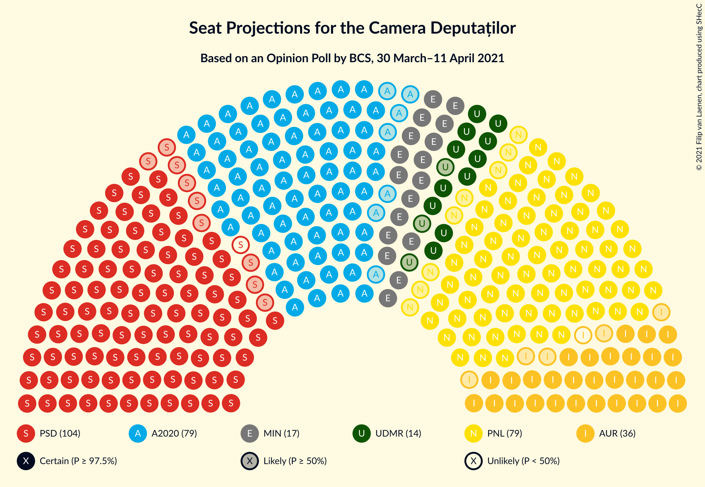
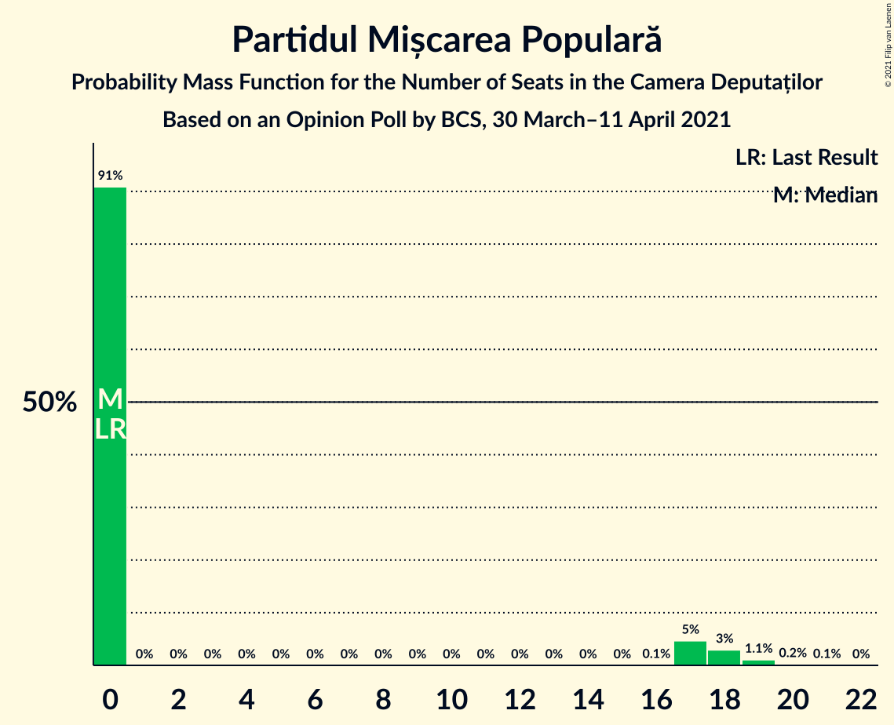
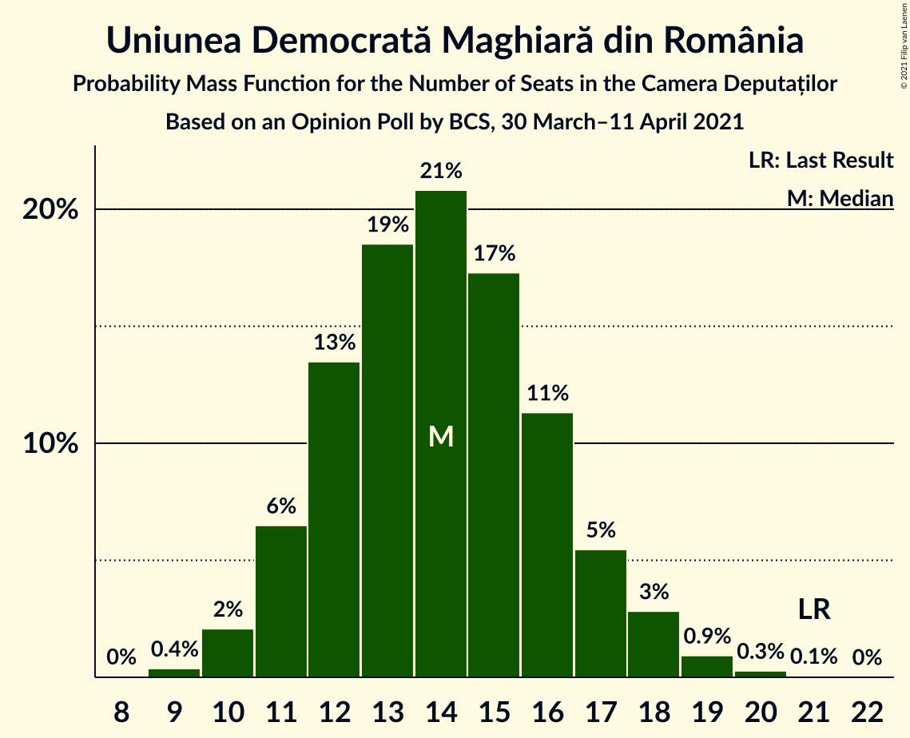
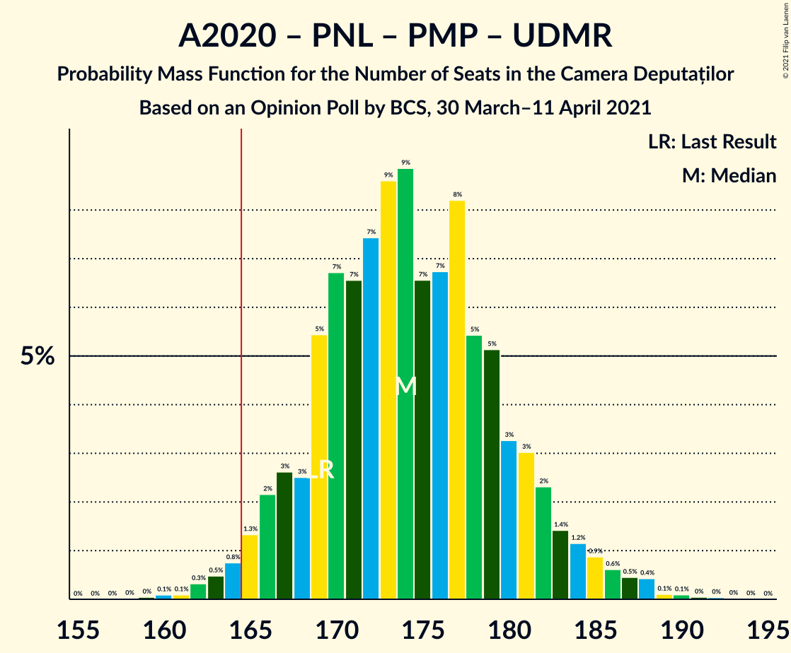

# Opinion Poll by BCS, 30 March–11 April 2021

<a href="#voting-intentions">Voting Intentions</a> | <a href="#seats">Seats</a> | <a href="#coalitions">Coalitions</a> | <a href="#technical-information">Technical Information</a>

## Voting Intentions

### Confidence Intervals

| Party | Last Result | Poll Result | 80% Confidence Interval | 90% Confidence Interval | 95% Confidence Interval | 99% Confidence Interval |
|:-----:|:-----------:|:-----------:|:-----------------------:|:-----------------------:|:-----------------------:|:-----------------------:|
| Partidul Social Democrat | 28.9% | 28.9% | 27.4–30.5% |27.0–31.0% |26.6–31.4% |25.9–32.1% |
| Alianța 2020 USR-PLUS | 15.4% | 22.5% | 21.2–24.0% |20.8–24.4% |20.4–24.8% |19.8–25.5% |
| Partidul Național Liberal | 25.2% | 22.3% | 20.9–23.8% |20.6–24.2% |20.2–24.6% |19.6–25.3% |
| Alianța pentru Unirea Românilor | 9.1% | 10.0% | 9.0–11.1% |8.8–11.4% |8.5–11.7% |8.1–12.2% |
| Partidul Mișcarea Populară | 4.8% | 4.2% | 3.6–5.0% |3.4–5.2% |3.3–5.4% |3.0–5.8% |
| Uniunea Democrată Maghiară din România | 5.7% | 4.0% | 3.4–4.8% |3.2–5.0% |3.1–5.2% |2.9–5.6% |
| PRO România | 4.1% | 2.9% | 2.4–3.6% |2.2–3.7% |2.1–3.9% |1.9–4.2% |

*Note:* The poll result column reflects the actual value used in the calculations. Published results may vary slightly, and in addition be rounded to fewer digits.

## Seats

### Confidence Intervals

| Party | Last Result | Median | 80% Confidence Interval | 90% Confidence Interval | 95% Confidence Interval | 99% Confidence Interval |
|:-----:|:-----------:|:------:|:-----------------------:|:-----------------------:|:-----------------------:|:-----------------------:|
| <a href="#partidul-social-democrat">Partidul Social Democrat</a> | 110 | 103 | 97–108 |95–110 |94–111 |90–114 |
| <a href="#alianța-2020-usr-plus">Alianța 2020 USR-PLUS</a> | 55 | 79 | 74–85 |73–87 |72–88 |69–90 |
| <a href="#partidul-național-liberal">Partidul Național Liberal</a> | 93 | 79 | 74–84 |72–86 |71–87 |68–89 |
| <a href="#alianța-pentru-unirea-românilor">Alianța pentru Unirea Românilor</a> | 33 | 35 | 32–39 |31–40 |30–41 |28–43 |
| <a href="#partidul-mișcarea-populară">Partidul Mișcarea Populară</a> | 0 | 0 | 0 |0–17 |0–18 |0–19 |
| <a href="#uniunea-democrată-maghiară-din-românia">Uniunea Democrată Maghiară din România</a> | 21 | 14 | 12–16 |11–17 |11–18 |10–19 |
| <a href="#pro-românia">PRO România</a> | 0 | 0 | 0 |0 |0 |0 |

### Partidul Social Democrat

*For a full overview of the results for this party, see the [Partidul Social Democrat](party-partidulsocialdemocrat.html) page.*

| Number of Seats | Probability | Accumulated | Special Marks |
|:---------------:|:-----------:|:-----------:|:-------------:|
| 87 | 0% | 100% |  |
| 88 | 0.1% | 99.9% |  |
| 89 | 0.2% | 99.9% |  |
| 90 | 0.3% | 99.7% |  |
| 91 | 0.3% | 99.4% |  |
| 92 | 0.5% | 99.1% |  |
| 93 | 0.9% | 98.6% |  |
| 94 | 1.4% | 98% |  |
| 95 | 2% | 96% |  |
| 96 | 3% | 94% |  |
| 97 | 5% | 91% |  |
| 98 | 5% | 86% |  |
| 99 | 6% | 80% |  |
| 100 | 6% | 75% |  |
| 101 | 8% | 69% |  |
| 102 | 10% | 61% |  |
| 103 | 10% | 51% | Median |
| 104 | 10% | 42% |  |
| 105 | 9% | 32% |  |
| 106 | 5% | 23% |  |
| 107 | 4% | 17% |  |
| 108 | 4% | 13% |  |
| 109 | 3% | 9% |  |
| 110 | 2% | 6% | Last Result |
| 111 | 1.4% | 4% |  |
| 112 | 1.2% | 2% |  |
| 113 | 0.4% | 1.0% |  |
| 114 | 0.2% | 0.5% |  |
| 115 | 0.2% | 0.3% |  |
| 116 | 0.1% | 0.2% |  |
| 117 | 0% | 0.1% |  |
| 118 | 0% | 0% |  |

### Alianța 2020 USR-PLUS

*For a full overview of the results for this party, see the [Alianța 2020 USR-PLUS](party-alianța2020usr-plus.html) page.*

| Number of Seats | Probability | Accumulated | Special Marks |
|:---------------:|:-----------:|:-----------:|:-------------:|
| 55 | 0% | 100% | Last Result |
| 56 | 0% | 100% |  |
| 57 | 0% | 100% |  |
| 58 | 0% | 100% |  |
| 59 | 0% | 100% |  |
| 60 | 0% | 100% |  |
| 61 | 0% | 100% |  |
| 62 | 0% | 100% |  |
| 63 | 0% | 100% |  |
| 64 | 0% | 100% |  |
| 65 | 0% | 100% |  |
| 66 | 0% | 100% |  |
| 67 | 0.1% | 99.9% |  |
| 68 | 0.2% | 99.9% |  |
| 69 | 0.3% | 99.7% |  |
| 70 | 0.5% | 99.4% |  |
| 71 | 1.0% | 98.9% |  |
| 72 | 2% | 98% |  |
| 73 | 3% | 96% |  |
| 74 | 4% | 93% |  |
| 75 | 5% | 90% |  |
| 76 | 6% | 85% |  |
| 77 | 8% | 79% |  |
| 78 | 11% | 70% |  |
| 79 | 11% | 60% | Median |
| 80 | 9% | 49% |  |
| 81 | 9% | 40% |  |
| 82 | 7% | 31% |  |
| 83 | 6% | 24% |  |
| 84 | 5% | 18% |  |
| 85 | 4% | 13% |  |
| 86 | 3% | 8% |  |
| 87 | 2% | 5% |  |
| 88 | 1.2% | 3% |  |
| 89 | 0.8% | 2% |  |
| 90 | 0.4% | 0.8% |  |
| 91 | 0.2% | 0.4% |  |
| 92 | 0.1% | 0.2% |  |
| 93 | 0.1% | 0.1% |  |
| 94 | 0% | 0% |  |

### Partidul Național Liberal

*For a full overview of the results for this party, see the [Partidul Național Liberal](party-partidulnaționalliberal.html) page.*

| Number of Seats | Probability | Accumulated | Special Marks |
|:---------------:|:-----------:|:-----------:|:-------------:|
| 66 | 0% | 100% |  |
| 67 | 0.1% | 99.9% |  |
| 68 | 0.3% | 99.8% |  |
| 69 | 0.5% | 99.5% |  |
| 70 | 1.0% | 99.0% |  |
| 71 | 1.4% | 98% |  |
| 72 | 3% | 97% |  |
| 73 | 4% | 94% |  |
| 74 | 4% | 90% |  |
| 75 | 6% | 87% |  |
| 76 | 7% | 80% |  |
| 77 | 9% | 74% |  |
| 78 | 9% | 65% |  |
| 79 | 10% | 56% | Median |
| 80 | 9% | 46% |  |
| 81 | 10% | 37% |  |
| 82 | 7% | 28% |  |
| 83 | 7% | 21% |  |
| 84 | 5% | 14% |  |
| 85 | 4% | 9% |  |
| 86 | 2% | 5% |  |
| 87 | 1.4% | 3% |  |
| 88 | 0.9% | 2% |  |
| 89 | 0.4% | 0.9% |  |
| 90 | 0.2% | 0.4% |  |
| 91 | 0.1% | 0.2% |  |
| 92 | 0.1% | 0.1% |  |
| 93 | 0% | 0% | Last Result |

### Alianța pentru Unirea Românilor

*For a full overview of the results for this party, see the [Alianța pentru Unirea Românilor](party-alianțapentruunirearomânilor.html) page.*

| Number of Seats | Probability | Accumulated | Special Marks |
|:---------------:|:-----------:|:-----------:|:-------------:|
| 26 | 0.1% | 100% |  |
| 27 | 0.1% | 99.9% |  |
| 28 | 0.5% | 99.8% |  |
| 29 | 1.1% | 99.2% |  |
| 30 | 2% | 98% |  |
| 31 | 5% | 96% |  |
| 32 | 9% | 90% |  |
| 33 | 9% | 82% | Last Result |
| 34 | 13% | 72% |  |
| 35 | 13% | 59% | Median |
| 36 | 13% | 46% |  |
| 37 | 12% | 33% |  |
| 38 | 9% | 22% |  |
| 39 | 5% | 13% |  |
| 40 | 4% | 7% |  |
| 41 | 2% | 4% |  |
| 42 | 0.9% | 2% |  |
| 43 | 0.5% | 0.8% |  |
| 44 | 0.2% | 0.3% |  |
| 45 | 0.1% | 0.1% |  |
| 46 | 0% | 0% |  |

### Partidul Mișcarea Populară

*For a full overview of the results for this party, see the [Partidul Mișcarea Populară](party-partidulmișcareapopulară.html) page.*

| Number of Seats | Probability | Accumulated | Special Marks |
|:---------------:|:-----------:|:-----------:|:-------------:|
| 0 | 91% | 100% | Last Result, Median |
| 1 | 0% | 9% |  |
| 2 | 0% | 9% |  |
| 3 | 0% | 9% |  |
| 4 | 0% | 9% |  |
| 5 | 0% | 9% |  |
| 6 | 0% | 9% |  |
| 7 | 0% | 9% |  |
| 8 | 0% | 9% |  |
| 9 | 0% | 9% |  |
| 10 | 0% | 9% |  |
| 11 | 0% | 9% |  |
| 12 | 0% | 9% |  |
| 13 | 0% | 9% |  |
| 14 | 0% | 9% |  |
| 15 | 0% | 9% |  |
| 16 | 0.1% | 9% |  |
| 17 | 5% | 9% |  |
| 18 | 3% | 4% |  |
| 19 | 1.1% | 1.4% |  |
| 20 | 0.2% | 0.3% |  |
| 21 | 0.1% | 0.1% |  |
| 22 | 0% | 0% |  |

### Uniunea Democrată Maghiară din România

*For a full overview of the results for this party, see the [Uniunea Democrată Maghiară din România](party-uniuneademocratămaghiarădinromânia.html) page.*

| Number of Seats | Probability | Accumulated | Special Marks |
|:---------------:|:-----------:|:-----------:|:-------------:|
| 9 | 0.4% | 100% |  |
| 10 | 2% | 99.6% |  |
| 11 | 6% | 98% |  |
| 12 | 13% | 91% |  |
| 13 | 19% | 78% |  |
| 14 | 21% | 59% | Median |
| 15 | 17% | 38% |  |
| 16 | 11% | 21% |  |
| 17 | 5% | 10% |  |
| 18 | 3% | 4% |  |
| 19 | 0.9% | 1.3% |  |
| 20 | 0.3% | 0.4% |  |
| 21 | 0.1% | 0.1% | Last Result |
| 22 | 0% | 0% |  |

### PRO România

*For a full overview of the results for this party, see the [PRO România](party-proromânia.html) page.*

| Number of Seats | Probability | Accumulated | Special Marks |
|:---------------:|:-----------:|:-----------:|:-------------:|
| 0 | 100% | 100% | Last Result, Median |

## Coalitions

### Confidence Intervals

| Coalition | Last Result | Median | Majority? | 80% Confidence Interval | 90% Confidence Interval | 95% Confidence Interval | 99% Confidence Interval |
|:---------:|:-----------:|:------:|:---------:|:-----------------------:|:-----------------------:|:-----------------------:|:-----------------------:|
| Alianța 2020 USR-PLUS – Partidul Național Liberal – Partidul Mișcarea Populară – Uniunea Democrată Maghiară din România | 169 | 174 | 98% | 168–181 | 166–183 | 165–185 | 162–188 |
| Alianța 2020 USR-PLUS – Partidul Național Liberal – Uniunea Democrată Maghiară din România | 169 | 173 | 93% | 166–179 | 163–181 | 161–182 | 157–185 |
| Alianța 2020 USR-PLUS – Partidul Național Liberal – Partidul Mișcarea Populară | 148 | 160 | 20% | 154–167 | 152–169 | 151–171 | 148–175 |
| Alianța 2020 USR-PLUS – Partidul Național Liberal | 148 | 159 | 13% | 152–165 | 149–167 | 148–168 | 144–171 |
| Partidul Social Democrat – PRO România | 110 | 103 | 0% | 97–108 | 95–110 | 94–111 | 90–114 |
| Partidul Național Liberal – Partidul Mișcarea Populară – Uniunea Democrată Maghiară din România | 114 | 94 | 0% | 89–102 | 87–105 | 86–108 | 83–112 |
| Partidul Național Liberal – Uniunea Democrată Maghiară din România | 114 | 93 | 0% | 87–99 | 86–100 | 84–101 | 81–104 |
| Alianța 2020 USR-PLUS – Partidul Mișcarea Populară | 55 | 80 | 0% | 75–88 | 74–93 | 73–95 | 70–99 |
| Partidul Național Liberal – Partidul Mișcarea Populară | 93 | 80 | 0% | 75–87 | 73–92 | 72–94 | 70–98 |
| Partidul Național Liberal | 93 | 79 | 0% | 74–84 | 72–86 | 71–87 | 68–89 |

### Alianța 2020 USR-PLUS – Partidul Național Liberal – Partidul Mișcarea Populară – Uniunea Democrată Maghiară din România

| Number of Seats | Probability | Accumulated | Special Marks |
|:---------------:|:-----------:|:-----------:|:-------------:|
| 159 | 0% | 100% |  |
| 160 | 0.1% | 99.9% |  |
| 161 | 0.1% | 99.8% |  |
| 162 | 0.3% | 99.7% |  |
| 163 | 0.5% | 99.4% |  |
| 164 | 0.8% | 98.9% |  |
| 165 | 1.3% | 98% | Majority |
| 166 | 2% | 97% |  |
| 167 | 3% | 95% |  |
| 168 | 3% | 92% |  |
| 169 | 5% | 90% | Last Result |
| 170 | 7% | 84% |  |
| 171 | 7% | 77% |  |
| 172 | 7% | 71% | Median |
| 173 | 9% | 63% |  |
| 174 | 9% | 55% |  |
| 175 | 7% | 46% |  |
| 176 | 7% | 39% |  |
| 177 | 8% | 33% |  |
| 178 | 5% | 24% |  |
| 179 | 5% | 19% |  |
| 180 | 3% | 14% |  |
| 181 | 3% | 11% |  |
| 182 | 2% | 8% |  |
| 183 | 1.4% | 5% |  |
| 184 | 1.2% | 4% |  |
| 185 | 0.9% | 3% |  |
| 186 | 0.6% | 2% |  |
| 187 | 0.5% | 1.2% |  |
| 188 | 0.4% | 0.8% |  |
| 189 | 0.1% | 0.3% |  |
| 190 | 0.1% | 0.2% |  |
| 191 | 0% | 0.1% |  |
| 192 | 0% | 0.1% |  |
| 193 | 0% | 0% |  |

### Alianța 2020 USR-PLUS – Partidul Național Liberal – Uniunea Democrată Maghiară din România

| Number of Seats | Probability | Accumulated | Special Marks |
|:---------------:|:-----------:|:-----------:|:-------------:|
| 153 | 0% | 100% |  |
| 154 | 0.1% | 99.9% |  |
| 155 | 0.1% | 99.9% |  |
| 156 | 0.1% | 99.8% |  |
| 157 | 0.3% | 99.6% |  |
| 158 | 0.4% | 99.4% |  |
| 159 | 0.6% | 98.9% |  |
| 160 | 0.7% | 98% |  |
| 161 | 0.7% | 98% |  |
| 162 | 1.3% | 97% |  |
| 163 | 1.3% | 96% |  |
| 164 | 2% | 94% |  |
| 165 | 2% | 93% | Majority |
| 166 | 3% | 91% |  |
| 167 | 3% | 88% |  |
| 168 | 3% | 85% |  |
| 169 | 6% | 82% | Last Result |
| 170 | 7% | 76% |  |
| 171 | 7% | 69% |  |
| 172 | 7% | 62% | Median |
| 173 | 9% | 55% |  |
| 174 | 9% | 46% |  |
| 175 | 6% | 37% |  |
| 176 | 6% | 31% |  |
| 177 | 8% | 25% |  |
| 178 | 5% | 17% |  |
| 179 | 4% | 12% |  |
| 180 | 3% | 8% |  |
| 181 | 2% | 5% |  |
| 182 | 1.5% | 3% |  |
| 183 | 0.9% | 2% |  |
| 184 | 0.4% | 1.1% |  |
| 185 | 0.3% | 0.6% |  |
| 186 | 0.2% | 0.3% |  |
| 187 | 0.1% | 0.1% |  |
| 188 | 0% | 0.1% |  |
| 189 | 0% | 0% |  |

### Alianța 2020 USR-PLUS – Partidul Național Liberal – Partidul Mișcarea Populară

| Number of Seats | Probability | Accumulated | Special Marks |
|:---------------:|:-----------:|:-----------:|:-------------:|
| 145 | 0% | 100% |  |
| 146 | 0.1% | 99.9% |  |
| 147 | 0.1% | 99.8% |  |
| 148 | 0.3% | 99.7% | Last Result |
| 149 | 0.5% | 99.4% |  |
| 150 | 0.7% | 98.9% |  |
| 151 | 1.4% | 98% |  |
| 152 | 2% | 97% |  |
| 153 | 3% | 95% |  |
| 154 | 4% | 92% |  |
| 155 | 5% | 88% |  |
| 156 | 7% | 83% |  |
| 157 | 6% | 76% |  |
| 158 | 7% | 71% | Median |
| 159 | 10% | 63% |  |
| 160 | 6% | 53% |  |
| 161 | 8% | 47% |  |
| 162 | 8% | 39% |  |
| 163 | 6% | 31% |  |
| 164 | 5% | 25% |  |
| 165 | 5% | 20% | Majority |
| 166 | 4% | 15% |  |
| 167 | 3% | 11% |  |
| 168 | 2% | 8% |  |
| 169 | 1.5% | 6% |  |
| 170 | 1.3% | 4% |  |
| 171 | 1.1% | 3% |  |
| 172 | 0.7% | 2% |  |
| 173 | 0.6% | 1.5% |  |
| 174 | 0.3% | 0.9% |  |
| 175 | 0.3% | 0.6% |  |
| 176 | 0.1% | 0.3% |  |
| 177 | 0.1% | 0.2% |  |
| 178 | 0.1% | 0.1% |  |
| 179 | 0% | 0.1% |  |
| 180 | 0% | 0% |  |

### Alianța 2020 USR-PLUS – Partidul Național Liberal

| Number of Seats | Probability | Accumulated | Special Marks |
|:---------------:|:-----------:|:-----------:|:-------------:|
| 140 | 0.1% | 100% |  |
| 141 | 0% | 99.9% |  |
| 142 | 0.1% | 99.8% |  |
| 143 | 0.2% | 99.7% |  |
| 144 | 0.2% | 99.5% |  |
| 145 | 0.4% | 99.3% |  |
| 146 | 0.7% | 98.9% |  |
| 147 | 0.7% | 98% |  |
| 148 | 1.1% | 98% | Last Result |
| 149 | 2% | 96% |  |
| 150 | 1.2% | 95% |  |
| 151 | 2% | 93% |  |
| 152 | 3% | 91% |  |
| 153 | 3% | 88% |  |
| 154 | 4% | 85% |  |
| 155 | 5% | 81% |  |
| 156 | 7% | 75% |  |
| 157 | 6% | 68% |  |
| 158 | 7% | 62% | Median |
| 159 | 10% | 54% |  |
| 160 | 6% | 44% |  |
| 161 | 8% | 38% |  |
| 162 | 8% | 30% |  |
| 163 | 6% | 23% |  |
| 164 | 5% | 17% |  |
| 165 | 4% | 13% | Majority |
| 166 | 3% | 8% |  |
| 167 | 2% | 5% |  |
| 168 | 2% | 4% |  |
| 169 | 0.9% | 2% |  |
| 170 | 0.5% | 1.1% |  |
| 171 | 0.3% | 0.6% |  |
| 172 | 0.2% | 0.3% |  |
| 173 | 0.1% | 0.1% |  |
| 174 | 0% | 0.1% |  |
| 175 | 0% | 0% |  |

### Partidul Social Democrat – PRO România

| Number of Seats | Probability | Accumulated | Special Marks |
|:---------------:|:-----------:|:-----------:|:-------------:|
| 87 | 0% | 100% |  |
| 88 | 0.1% | 99.9% |  |
| 89 | 0.2% | 99.9% |  |
| 90 | 0.3% | 99.7% |  |
| 91 | 0.3% | 99.4% |  |
| 92 | 0.5% | 99.1% |  |
| 93 | 0.9% | 98.6% |  |
| 94 | 1.4% | 98% |  |
| 95 | 2% | 96% |  |
| 96 | 3% | 94% |  |
| 97 | 5% | 91% |  |
| 98 | 5% | 86% |  |
| 99 | 6% | 80% |  |
| 100 | 6% | 75% |  |
| 101 | 8% | 69% |  |
| 102 | 10% | 61% |  |
| 103 | 10% | 51% | Median |
| 104 | 10% | 42% |  |
| 105 | 9% | 32% |  |
| 106 | 5% | 23% |  |
| 107 | 4% | 17% |  |
| 108 | 4% | 13% |  |
| 109 | 3% | 9% |  |
| 110 | 2% | 6% | Last Result |
| 111 | 1.4% | 4% |  |
| 112 | 1.2% | 2% |  |
| 113 | 0.4% | 1.0% |  |
| 114 | 0.2% | 0.5% |  |
| 115 | 0.2% | 0.3% |  |
| 116 | 0.1% | 0.2% |  |
| 117 | 0% | 0.1% |  |
| 118 | 0% | 0% |  |

### Partidul Național Liberal – Partidul Mișcarea Populară – Uniunea Democrată Maghiară din România

| Number of Seats | Probability | Accumulated | Special Marks |
|:---------------:|:-----------:|:-----------:|:-------------:|
| 80 | 0% | 100% |  |
| 81 | 0.1% | 99.9% |  |
| 82 | 0.1% | 99.9% |  |
| 83 | 0.4% | 99.7% |  |
| 84 | 0.6% | 99.4% |  |
| 85 | 1.0% | 98.8% |  |
| 86 | 2% | 98% |  |
| 87 | 2% | 96% |  |
| 88 | 3% | 94% |  |
| 89 | 5% | 90% |  |
| 90 | 6% | 85% |  |
| 91 | 8% | 80% |  |
| 92 | 9% | 72% |  |
| 93 | 8% | 64% | Median |
| 94 | 8% | 55% |  |
| 95 | 10% | 47% |  |
| 96 | 7% | 37% |  |
| 97 | 5% | 30% |  |
| 98 | 6% | 25% |  |
| 99 | 3% | 19% |  |
| 100 | 4% | 16% |  |
| 101 | 2% | 12% |  |
| 102 | 2% | 10% |  |
| 103 | 1.3% | 8% |  |
| 104 | 1.4% | 7% |  |
| 105 | 0.9% | 6% |  |
| 106 | 0.9% | 5% |  |
| 107 | 1.1% | 4% |  |
| 108 | 0.7% | 3% |  |
| 109 | 0.8% | 2% |  |
| 110 | 0.4% | 1.3% |  |
| 111 | 0.3% | 0.9% |  |
| 112 | 0.2% | 0.6% |  |
| 113 | 0.1% | 0.3% |  |
| 114 | 0.1% | 0.2% | Last Result |
| 115 | 0.1% | 0.1% |  |
| 116 | 0% | 0.1% |  |
| 117 | 0% | 0% |  |

### Partidul Național Liberal – Uniunea Democrată Maghiară din România

| Number of Seats | Probability | Accumulated | Special Marks |
|:---------------:|:-----------:|:-----------:|:-------------:|
| 78 | 0% | 100% |  |
| 79 | 0.1% | 99.9% |  |
| 80 | 0.2% | 99.9% |  |
| 81 | 0.2% | 99.7% |  |
| 82 | 0.4% | 99.5% |  |
| 83 | 0.9% | 99.1% |  |
| 84 | 1.0% | 98% |  |
| 85 | 2% | 97% |  |
| 86 | 3% | 95% |  |
| 87 | 3% | 93% |  |
| 88 | 4% | 89% |  |
| 89 | 6% | 85% |  |
| 90 | 7% | 80% |  |
| 91 | 8% | 73% |  |
| 92 | 9% | 64% |  |
| 93 | 8% | 55% | Median |
| 94 | 8% | 47% |  |
| 95 | 10% | 38% |  |
| 96 | 7% | 28% |  |
| 97 | 5% | 21% |  |
| 98 | 6% | 16% |  |
| 99 | 3% | 10% |  |
| 100 | 3% | 7% |  |
| 101 | 2% | 4% |  |
| 102 | 0.9% | 2% |  |
| 103 | 0.6% | 1.3% |  |
| 104 | 0.4% | 0.7% |  |
| 105 | 0.2% | 0.3% |  |
| 106 | 0.1% | 0.2% |  |
| 107 | 0.1% | 0.1% |  |
| 108 | 0% | 0% |  |
| 109 | 0% | 0% |  |
| 110 | 0% | 0% |  |
| 111 | 0% | 0% |  |
| 112 | 0% | 0% |  |
| 113 | 0% | 0% |  |
| 114 | 0% | 0% | Last Result |

### Alianța 2020 USR-PLUS – Partidul Mișcarea Populară

| Number of Seats | Probability | Accumulated | Special Marks |
|:---------------:|:-----------:|:-----------:|:-------------:|
| 55 | 0% | 100% | Last Result |
| 56 | 0% | 100% |  |
| 57 | 0% | 100% |  |
| 58 | 0% | 100% |  |
| 59 | 0% | 100% |  |
| 60 | 0% | 100% |  |
| 61 | 0% | 100% |  |
| 62 | 0% | 100% |  |
| 63 | 0% | 100% |  |
| 64 | 0% | 100% |  |
| 65 | 0% | 100% |  |
| 66 | 0% | 100% |  |
| 67 | 0% | 100% |  |
| 68 | 0.1% | 100% |  |
| 69 | 0.1% | 99.9% |  |
| 70 | 0.3% | 99.8% |  |
| 71 | 0.5% | 99.5% |  |
| 72 | 1.1% | 99.0% |  |
| 73 | 2% | 98% |  |
| 74 | 3% | 96% |  |
| 75 | 4% | 93% |  |
| 76 | 5% | 89% |  |
| 77 | 7% | 84% |  |
| 78 | 10% | 77% |  |
| 79 | 10% | 67% | Median |
| 80 | 9% | 57% |  |
| 81 | 9% | 48% |  |
| 82 | 7% | 39% |  |
| 83 | 6% | 33% |  |
| 84 | 5% | 27% |  |
| 85 | 4% | 22% |  |
| 86 | 3% | 17% |  |
| 87 | 3% | 14% |  |
| 88 | 2% | 11% |  |
| 89 | 1.3% | 10% |  |
| 90 | 1.1% | 9% |  |
| 91 | 1.1% | 7% |  |
| 92 | 0.9% | 6% |  |
| 93 | 0.9% | 6% |  |
| 94 | 1.2% | 5% |  |
| 95 | 1.0% | 3% |  |
| 96 | 0.8% | 2% |  |
| 97 | 0.6% | 2% |  |
| 98 | 0.4% | 1.1% |  |
| 99 | 0.3% | 0.7% |  |
| 100 | 0.1% | 0.4% |  |
| 101 | 0.1% | 0.2% |  |
| 102 | 0.1% | 0.1% |  |
| 103 | 0% | 0.1% |  |
| 104 | 0% | 0% |  |

### Partidul Național Liberal – Partidul Mișcarea Populară

| Number of Seats | Probability | Accumulated | Special Marks |
|:---------------:|:-----------:|:-----------:|:-------------:|
| 67 | 0% | 100% |  |
| 68 | 0.1% | 99.9% |  |
| 69 | 0.2% | 99.8% |  |
| 70 | 0.5% | 99.6% |  |
| 71 | 0.9% | 99.1% |  |
| 72 | 2% | 98% |  |
| 73 | 3% | 97% |  |
| 74 | 3% | 94% |  |
| 75 | 5% | 91% |  |
| 76 | 6% | 86% |  |
| 77 | 8% | 80% |  |
| 78 | 9% | 72% |  |
| 79 | 9% | 64% | Median |
| 80 | 9% | 55% |  |
| 81 | 9% | 46% |  |
| 82 | 7% | 37% |  |
| 83 | 7% | 30% |  |
| 84 | 5% | 23% |  |
| 85 | 4% | 18% |  |
| 86 | 2% | 14% |  |
| 87 | 2% | 12% |  |
| 88 | 1.2% | 10% |  |
| 89 | 1.0% | 9% |  |
| 90 | 1.4% | 8% |  |
| 91 | 0.8% | 6% |  |
| 92 | 1.3% | 6% |  |
| 93 | 0.7% | 4% | Last Result |
| 94 | 1.2% | 4% |  |
| 95 | 0.7% | 2% |  |
| 96 | 0.5% | 2% |  |
| 97 | 0.4% | 1.2% |  |
| 98 | 0.4% | 0.8% |  |
| 99 | 0.2% | 0.5% |  |
| 100 | 0.1% | 0.2% |  |
| 101 | 0.1% | 0.2% |  |
| 102 | 0% | 0.1% |  |
| 103 | 0% | 0% |  |

### Partidul Național Liberal

| Number of Seats | Probability | Accumulated | Special Marks |
|:---------------:|:-----------:|:-----------:|:-------------:|
| 66 | 0% | 100% |  |
| 67 | 0.1% | 99.9% |  |
| 68 | 0.3% | 99.8% |  |
| 69 | 0.5% | 99.5% |  |
| 70 | 1.0% | 99.0% |  |
| 71 | 1.4% | 98% |  |
| 72 | 3% | 97% |  |
| 73 | 4% | 94% |  |
| 74 | 4% | 90% |  |
| 75 | 6% | 87% |  |
| 76 | 7% | 80% |  |
| 77 | 9% | 74% |  |
| 78 | 9% | 65% |  |
| 79 | 10% | 56% | Median |
| 80 | 9% | 46% |  |
| 81 | 10% | 37% |  |
| 82 | 7% | 28% |  |
| 83 | 7% | 21% |  |
| 84 | 5% | 14% |  |
| 85 | 4% | 9% |  |
| 86 | 2% | 5% |  |
| 87 | 1.4% | 3% |  |
| 88 | 0.9% | 2% |  |
| 89 | 0.4% | 0.9% |  |
| 90 | 0.2% | 0.4% |  |
| 91 | 0.1% | 0.2% |  |
| 92 | 0.1% | 0.1% |  |
| 93 | 0% | 0% | Last Result |

## Technical Information

### Opinion Poll

+ **Polling firm:** BCS
+ **Commissioner(s):** —
+ **Fieldwork period:** 30 March–11 April 2021

### Calculations

+ **Sample size:** 1420
+ **Simulations done:** 1,048,576
+ **Error estimate:** 0.61%

