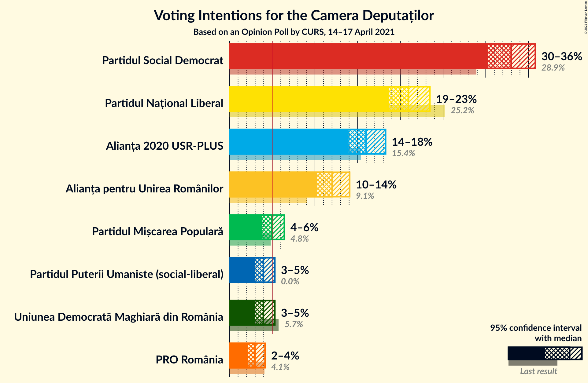
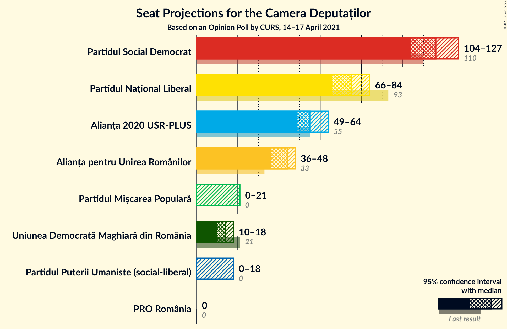
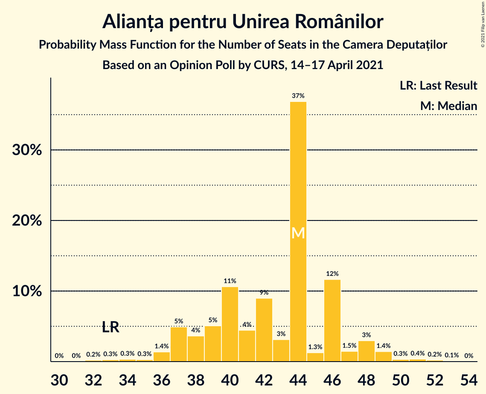
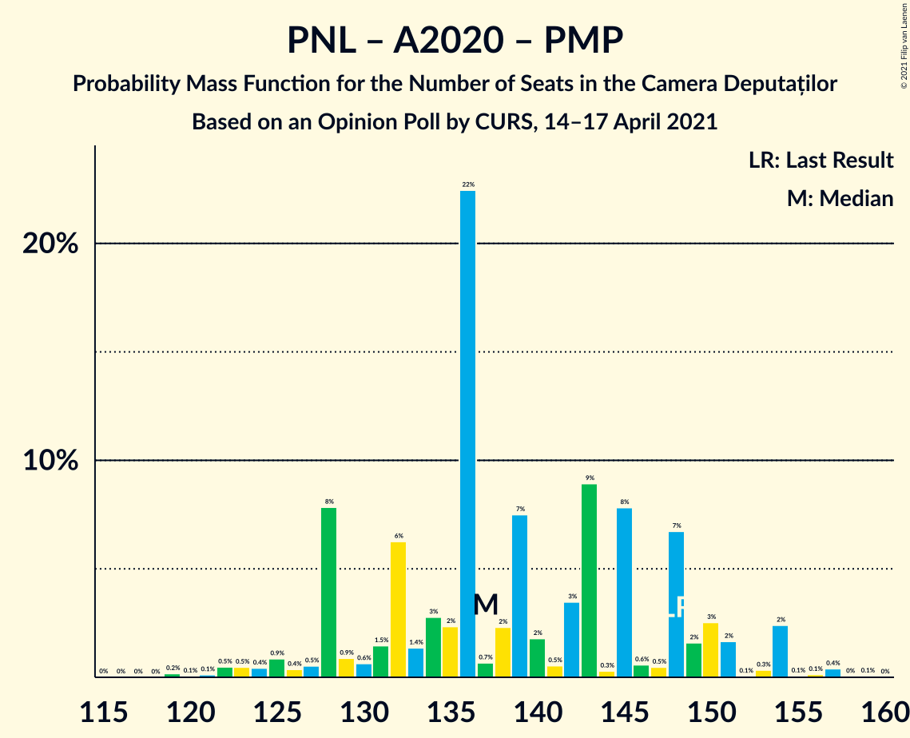
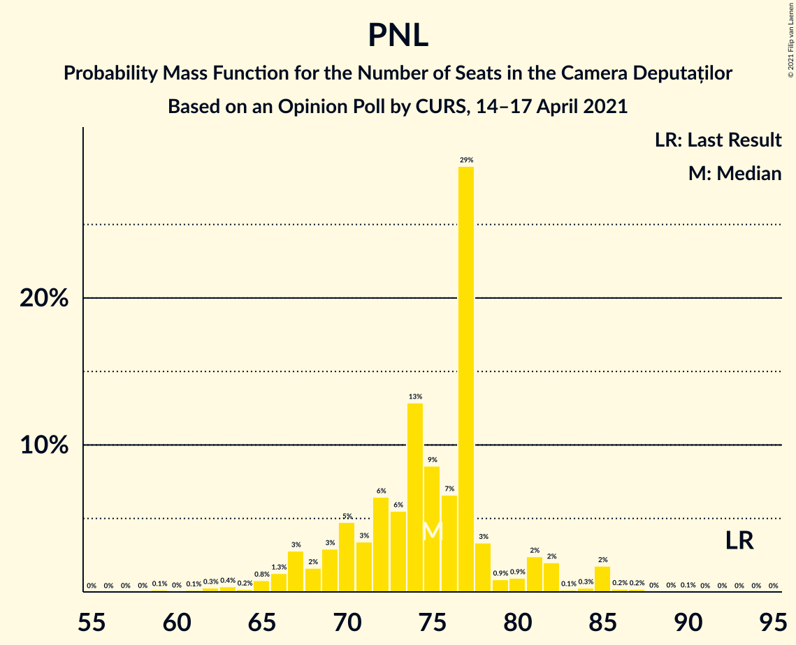

# Opinion Poll by CURS, 14–17 April 2021

<a href="#voting-intentions">Voting Intentions</a> | <a href="#seats">Seats</a> | <a href="#coalitions">Coalitions</a> | <a href="#technical-information">Technical Information</a>

## Voting Intentions

### Confidence Intervals

| Party | Last Result | Poll Result | 80% Confidence Interval | 90% Confidence Interval | 95% Confidence Interval | 99% Confidence Interval |
|:-----:|:-----------:|:-----------:|:-----------------------:|:-----------------------:|:-----------------------:|:-----------------------:|
| Partidul Social Democrat | 28.9% | 34.4% | 32.6–36.3% |32.1–36.8% |31.7–37.3% |30.8–38.2% |
| Partidul Național Liberal | 25.2% | 21.9% | 20.3–23.5% |19.9–24.0% |19.5–24.4% |18.8–25.2% |
| Alianța 2020 USR-PLUS | 15.4% | 16.7% | 15.3–18.2% |15.0–18.7% |14.6–19.0% |14.0–19.8% |
| Alianța pentru Unirea Românilor | 9.1% | 12.5% | 11.3–13.8% |10.9–14.2% |10.6–14.6% |10.1–15.2% |
| Partidul Mișcarea Populară | 4.8% | 5.2% | 4.5–6.2% |4.3–6.5% |4.1–6.7% |3.7–7.2% |
| Uniunea Democrată Maghiară din România | 5.7% | 4.2% | 3.5–5.0% |3.3–5.3% |3.1–5.5% |2.8–6.0% |
| PRO România | 4.1% | 3.2% | 2.6–3.9% |2.4–4.2% |2.3–4.4% |2.0–4.8% |

*Note:* The poll result column reflects the actual value used in the calculations. Published results may vary slightly, and in addition be rounded to fewer digits.

## Seats

### Confidence Intervals

| Party | Last Result | Median | 80% Confidence Interval | 90% Confidence Interval | 95% Confidence Interval | 99% Confidence Interval |
|:-----:|:-----------:|:------:|:-----------------------:|:-----------------------:|:-----------------------:|:-----------------------:|
| <a href="#partidul-social-democrat">Partidul Social Democrat</a> | 110 | 113 | 108–124 |107–126 |106–128 |102–130 |
| <a href="#partidul-național-liberal">Partidul Național Liberal</a> | 93 | 73 | 68–79 |66–81 |65–82 |62–86 |
| <a href="#alianța-2020-usr-plus">Alianța 2020 USR-PLUS</a> | 55 | 56 | 51–61 |49–63 |48–65 |46–67 |
| <a href="#alianța-pentru-unirea-românilor">Alianța pentru Unirea Românilor</a> | 33 | 42 | 37–46 |36–48 |35–49 |33–52 |
| <a href="#partidul-mișcarea-populară">Partidul Mișcarea Populară</a> | 0 | 17 | 0–20 |0–21 |0–22 |0–23 |
| <a href="#uniunea-democrată-maghiară-din-românia">Uniunea Democrată Maghiară din România</a> | 21 | 14 | 11–16 |10–17 |10–18 |9–20 |
| <a href="#pro-românia">PRO România</a> | 0 | 0 | 0 |0 |0 |0 |

### Partidul Social Democrat

*For a full overview of the results for this party, see the [Partidul Social Democrat](party-partidulsocialdemocrat.html) page.*

| Number of Seats | Probability | Accumulated | Special Marks |
|:---------------:|:-----------:|:-----------:|:-------------:|
| 98 | 0.1% | 100% |  |
| 99 | 0.1% | 99.9% |  |
| 100 | 0.1% | 99.9% |  |
| 101 | 0.2% | 99.8% |  |
| 102 | 0.2% | 99.6% |  |
| 103 | 0.3% | 99.4% |  |
| 104 | 0.5% | 99.1% |  |
| 105 | 0.6% | 98.6% |  |
| 106 | 2% | 98% |  |
| 107 | 1.5% | 96% |  |
| 108 | 6% | 94% |  |
| 109 | 6% | 88% |  |
| 110 | 5% | 82% | Last Result |
| 111 | 12% | 77% |  |
| 112 | 8% | 65% |  |
| 113 | 8% | 57% | Median |
| 114 | 7% | 49% |  |
| 115 | 6% | 42% |  |
| 116 | 5% | 36% |  |
| 117 | 3% | 32% |  |
| 118 | 2% | 29% |  |
| 119 | 3% | 27% |  |
| 120 | 2% | 24% |  |
| 121 | 3% | 22% |  |
| 122 | 3% | 19% |  |
| 123 | 3% | 15% |  |
| 124 | 4% | 12% |  |
| 125 | 2% | 9% |  |
| 126 | 2% | 6% |  |
| 127 | 2% | 4% |  |
| 128 | 0.8% | 3% |  |
| 129 | 0.9% | 2% |  |
| 130 | 0.4% | 0.8% |  |
| 131 | 0.1% | 0.4% |  |
| 132 | 0.1% | 0.2% |  |
| 133 | 0.1% | 0.1% |  |
| 134 | 0% | 0% |  |

### Partidul Național Liberal

*For a full overview of the results for this party, see the [Partidul Național Liberal](party-partidulnaționalliberal.html) page.*

| Number of Seats | Probability | Accumulated | Special Marks |
|:---------------:|:-----------:|:-----------:|:-------------:|
| 59 | 0% | 100% |  |
| 60 | 0.1% | 99.9% |  |
| 61 | 0.2% | 99.9% |  |
| 62 | 0.3% | 99.7% |  |
| 63 | 0.5% | 99.4% |  |
| 64 | 1.3% | 98.9% |  |
| 65 | 2% | 98% |  |
| 66 | 3% | 96% |  |
| 67 | 3% | 93% |  |
| 68 | 4% | 90% |  |
| 69 | 7% | 86% |  |
| 70 | 7% | 79% |  |
| 71 | 8% | 72% |  |
| 72 | 9% | 64% |  |
| 73 | 8% | 55% | Median |
| 74 | 9% | 47% |  |
| 75 | 7% | 38% |  |
| 76 | 8% | 30% |  |
| 77 | 5% | 23% |  |
| 78 | 4% | 17% |  |
| 79 | 4% | 13% |  |
| 80 | 3% | 9% |  |
| 81 | 2% | 6% |  |
| 82 | 1.4% | 4% |  |
| 83 | 0.8% | 2% |  |
| 84 | 0.6% | 2% |  |
| 85 | 0.5% | 1.1% |  |
| 86 | 0.3% | 0.6% |  |
| 87 | 0.2% | 0.3% |  |
| 88 | 0.1% | 0.2% |  |
| 89 | 0.1% | 0.1% |  |
| 90 | 0% | 0% |  |
| 91 | 0% | 0% |  |
| 92 | 0% | 0% |  |
| 93 | 0% | 0% | Last Result |

### Alianța 2020 USR-PLUS

*For a full overview of the results for this party, see the [Alianța 2020 USR-PLUS](party-alianța2020usr-plus.html) page.*

| Number of Seats | Probability | Accumulated | Special Marks |
|:---------------:|:-----------:|:-----------:|:-------------:|
| 44 | 0.1% | 100% |  |
| 45 | 0.2% | 99.9% |  |
| 46 | 0.3% | 99.7% |  |
| 47 | 0.9% | 99.4% |  |
| 48 | 2% | 98.5% |  |
| 49 | 2% | 97% |  |
| 50 | 3% | 95% |  |
| 51 | 4% | 91% |  |
| 52 | 6% | 87% |  |
| 53 | 9% | 81% |  |
| 54 | 11% | 72% |  |
| 55 | 10% | 61% | Last Result |
| 56 | 8% | 51% | Median |
| 57 | 9% | 43% |  |
| 58 | 8% | 34% |  |
| 59 | 9% | 27% |  |
| 60 | 5% | 18% |  |
| 61 | 4% | 13% |  |
| 62 | 3% | 9% |  |
| 63 | 2% | 6% |  |
| 64 | 1.4% | 4% |  |
| 65 | 1.3% | 3% |  |
| 66 | 0.5% | 1.2% |  |
| 67 | 0.3% | 0.6% |  |
| 68 | 0.2% | 0.3% |  |
| 69 | 0.1% | 0.2% |  |
| 70 | 0% | 0.1% |  |
| 71 | 0% | 0% |  |

### Alianța pentru Unirea Românilor

*For a full overview of the results for this party, see the [Alianța pentru Unirea Românilor](party-alianțapentruunirearomânilor.html) page.*

| Number of Seats | Probability | Accumulated | Special Marks |
|:---------------:|:-----------:|:-----------:|:-------------:|
| 31 | 0.1% | 100% |  |
| 32 | 0.2% | 99.9% |  |
| 33 | 0.4% | 99.7% | Last Result |
| 34 | 0.9% | 99.3% |  |
| 35 | 2% | 98% |  |
| 36 | 3% | 97% |  |
| 37 | 5% | 94% |  |
| 38 | 6% | 89% |  |
| 39 | 10% | 83% |  |
| 40 | 11% | 73% |  |
| 41 | 11% | 62% |  |
| 42 | 11% | 51% | Median |
| 43 | 10% | 40% |  |
| 44 | 9% | 30% |  |
| 45 | 6% | 21% |  |
| 46 | 5% | 14% |  |
| 47 | 4% | 10% |  |
| 48 | 2% | 6% |  |
| 49 | 1.5% | 3% |  |
| 50 | 0.9% | 2% |  |
| 51 | 0.6% | 1.1% |  |
| 52 | 0.3% | 0.5% |  |
| 53 | 0.1% | 0.2% |  |
| 54 | 0.1% | 0.1% |  |
| 55 | 0% | 0% |  |

### Partidul Mișcarea Populară

*For a full overview of the results for this party, see the [Partidul Mișcarea Populară](party-partidulmișcareapopulară.html) page.*

| Number of Seats | Probability | Accumulated | Special Marks |
|:---------------:|:-----------:|:-----------:|:-------------:|
| 0 | 32% | 100% | Last Result |
| 1 | 0% | 68% |  |
| 2 | 0% | 68% |  |
| 3 | 0% | 68% |  |
| 4 | 0% | 68% |  |
| 5 | 0% | 68% |  |
| 6 | 0% | 68% |  |
| 7 | 0% | 68% |  |
| 8 | 0% | 68% |  |
| 9 | 0% | 68% |  |
| 10 | 0% | 68% |  |
| 11 | 0% | 68% |  |
| 12 | 0% | 68% |  |
| 13 | 0% | 68% |  |
| 14 | 0% | 68% |  |
| 15 | 0% | 68% |  |
| 16 | 6% | 68% |  |
| 17 | 18% | 62% | Median |
| 18 | 16% | 44% |  |
| 19 | 13% | 29% |  |
| 20 | 8% | 16% |  |
| 21 | 4% | 8% |  |
| 22 | 2% | 3% |  |
| 23 | 0.7% | 1.1% |  |
| 24 | 0.3% | 0.4% |  |
| 25 | 0.1% | 0.1% |  |
| 26 | 0% | 0% |  |

### Uniunea Democrată Maghiară din România

*For a full overview of the results for this party, see the [Uniunea Democrată Maghiară din România](party-uniuneademocratămaghiarădinromânia.html) page.*

| Number of Seats | Probability | Accumulated | Special Marks |
|:---------------:|:-----------:|:-----------:|:-------------:|
| 8 | 0.2% | 100% |  |
| 9 | 1.1% | 99.8% |  |
| 10 | 5% | 98.7% |  |
| 11 | 9% | 94% |  |
| 12 | 14% | 85% |  |
| 13 | 19% | 71% |  |
| 14 | 20% | 52% | Median |
| 15 | 13% | 32% |  |
| 16 | 10% | 19% |  |
| 17 | 5% | 9% |  |
| 18 | 3% | 4% |  |
| 19 | 1.1% | 2% |  |
| 20 | 0.4% | 0.6% |  |
| 21 | 0.1% | 0.2% | Last Result |
| 22 | 0% | 0.1% |  |
| 23 | 0% | 0% |  |

### PRO România

*For a full overview of the results for this party, see the [PRO România](party-proromânia.html) page.*

| Number of Seats | Probability | Accumulated | Special Marks |
|:---------------:|:-----------:|:-----------:|:-------------:|
| 0 | 99.8% | 100% | Last Result, Median |
| 1 | 0% | 0.2% |  |
| 2 | 0% | 0.2% |  |
| 3 | 0% | 0.2% |  |
| 4 | 0% | 0.2% |  |
| 5 | 0% | 0.2% |  |
| 6 | 0% | 0.2% |  |
| 7 | 0% | 0.2% |  |
| 8 | 0% | 0.2% |  |
| 9 | 0% | 0.2% |  |
| 10 | 0% | 0.2% |  |
| 11 | 0% | 0.2% |  |
| 12 | 0% | 0.2% |  |
| 13 | 0% | 0.2% |  |
| 14 | 0% | 0.2% |  |
| 15 | 0% | 0.2% |  |
| 16 | 0.1% | 0.2% |  |
| 17 | 0.1% | 0.1% |  |
| 18 | 0% | 0% |  |

## Coalitions

### Confidence Intervals

| Coalition | Last Result | Median | Majority? | 80% Confidence Interval | 90% Confidence Interval | 95% Confidence Interval | 99% Confidence Interval |
|:---------:|:-----------:|:------:|:---------:|:-----------------------:|:-----------------------:|:-----------------------:|:-----------------------:|
| Partidul Național Liberal – Alianța 2020 USR-PLUS – Partidul Mișcarea Populară – Uniunea Democrată Maghiară din România | 169 | 156 | 7% | 146–164 | 143–165 | 141–167 | 137–170 |
| Partidul Național Liberal – Alianța 2020 USR-PLUS – Uniunea Democrată Maghiară din România | 169 | 142 | 0% | 135–151 | 133–154 | 131–156 | 128–160 |
| Partidul Național Liberal – Alianța 2020 USR-PLUS – Partidul Mișcarea Populară | 148 | 143 | 0% | 131–150 | 129–152 | 127–153 | 123–156 |
| Partidul Național Liberal – Alianța 2020 USR-PLUS | 148 | 129 | 0% | 122–137 | 120–139 | 118–142 | 115–146 |
| Partidul Social Democrat – PRO România | 110 | 113 | 0% | 108–124 | 107–126 | 106–128 | 102–130 |
| Partidul Național Liberal – Partidul Mișcarea Populară – Uniunea Democrată Maghiară din România | 114 | 101 | 0% | 88–108 | 86–110 | 84–111 | 81–114 |
| Partidul Național Liberal – Partidul Mișcarea Populară | 93 | 88 | 0% | 74–94 | 72–96 | 70–98 | 67–101 |
| Partidul Național Liberal – Uniunea Democrată Maghiară din România | 114 | 87 | 0% | 81–94 | 79–95 | 78–97 | 75–101 |
| Partidul Național Liberal | 93 | 73 | 0% | 68–79 | 66–81 | 65–82 | 62–86 |
| Alianța 2020 USR-PLUS – Partidul Mișcarea Populară | 55 | 71 | 0% | 56–77 | 54–79 | 52–80 | 50–83 |

### Partidul Național Liberal – Alianța 2020 USR-PLUS – Partidul Mișcarea Populară – Uniunea Democrată Maghiară din România

| Number of Seats | Probability | Accumulated | Special Marks |
|:---------------:|:-----------:|:-----------:|:-------------:|
| 134 | 0.1% | 100% |  |
| 135 | 0.1% | 99.9% |  |
| 136 | 0.2% | 99.8% |  |
| 137 | 0.2% | 99.6% |  |
| 138 | 0.3% | 99.4% |  |
| 139 | 0.4% | 99.0% |  |
| 140 | 0.6% | 98.6% |  |
| 141 | 0.8% | 98% |  |
| 142 | 1.0% | 97% |  |
| 143 | 1.2% | 96% |  |
| 144 | 2% | 95% |  |
| 145 | 2% | 93% |  |
| 146 | 3% | 91% |  |
| 147 | 2% | 88% |  |
| 148 | 4% | 86% |  |
| 149 | 3% | 82% |  |
| 150 | 4% | 79% |  |
| 151 | 4% | 76% |  |
| 152 | 4% | 72% |  |
| 153 | 5% | 68% |  |
| 154 | 6% | 63% |  |
| 155 | 5% | 58% |  |
| 156 | 5% | 53% |  |
| 157 | 6% | 48% |  |
| 158 | 5% | 42% |  |
| 159 | 5% | 37% |  |
| 160 | 8% | 32% | Median |
| 161 | 5% | 24% |  |
| 162 | 5% | 19% |  |
| 163 | 4% | 14% |  |
| 164 | 3% | 10% |  |
| 165 | 2% | 7% | Majority |
| 166 | 2% | 5% |  |
| 167 | 1.1% | 3% |  |
| 168 | 0.8% | 2% |  |
| 169 | 0.4% | 1.0% | Last Result |
| 170 | 0.3% | 0.6% |  |
| 171 | 0.1% | 0.3% |  |
| 172 | 0.1% | 0.2% |  |
| 173 | 0% | 0.1% |  |
| 174 | 0% | 0% |  |

### Partidul Național Liberal – Alianța 2020 USR-PLUS – Uniunea Democrată Maghiară din România

| Number of Seats | Probability | Accumulated | Special Marks |
|:---------------:|:-----------:|:-----------:|:-------------:|
| 125 | 0% | 100% |  |
| 126 | 0.1% | 99.9% |  |
| 127 | 0.2% | 99.9% |  |
| 128 | 0.2% | 99.7% |  |
| 129 | 0.5% | 99.5% |  |
| 130 | 0.5% | 99.0% |  |
| 131 | 1.0% | 98% |  |
| 132 | 2% | 97% |  |
| 133 | 2% | 96% |  |
| 134 | 2% | 94% |  |
| 135 | 4% | 92% |  |
| 136 | 4% | 88% |  |
| 137 | 6% | 83% |  |
| 138 | 4% | 78% |  |
| 139 | 4% | 73% |  |
| 140 | 7% | 69% |  |
| 141 | 5% | 62% |  |
| 142 | 8% | 57% |  |
| 143 | 5% | 49% | Median |
| 144 | 5% | 44% |  |
| 145 | 5% | 39% |  |
| 146 | 7% | 34% |  |
| 147 | 3% | 27% |  |
| 148 | 5% | 24% |  |
| 149 | 3% | 18% |  |
| 150 | 3% | 15% |  |
| 151 | 3% | 12% |  |
| 152 | 2% | 9% |  |
| 153 | 2% | 8% |  |
| 154 | 2% | 6% |  |
| 155 | 1.2% | 4% |  |
| 156 | 0.9% | 3% |  |
| 157 | 0.6% | 2% |  |
| 158 | 0.5% | 1.5% |  |
| 159 | 0.3% | 1.0% |  |
| 160 | 0.3% | 0.7% |  |
| 161 | 0.1% | 0.3% |  |
| 162 | 0.1% | 0.2% |  |
| 163 | 0% | 0.1% |  |
| 164 | 0% | 0.1% |  |
| 165 | 0% | 0% | Majority |
| 166 | 0% | 0% |  |
| 167 | 0% | 0% |  |
| 168 | 0% | 0% |  |
| 169 | 0% | 0% | Last Result |

### Partidul Național Liberal – Alianța 2020 USR-PLUS – Partidul Mișcarea Populară

| Number of Seats | Probability | Accumulated | Special Marks |
|:---------------:|:-----------:|:-----------:|:-------------:|
| 120 | 0% | 100% |  |
| 121 | 0.1% | 99.9% |  |
| 122 | 0.2% | 99.8% |  |
| 123 | 0.2% | 99.6% |  |
| 124 | 0.4% | 99.4% |  |
| 125 | 0.5% | 99.0% |  |
| 126 | 0.6% | 98.6% |  |
| 127 | 0.9% | 98% |  |
| 128 | 2% | 97% |  |
| 129 | 1.2% | 96% |  |
| 130 | 2% | 94% |  |
| 131 | 3% | 93% |  |
| 132 | 2% | 90% |  |
| 133 | 4% | 88% |  |
| 134 | 2% | 84% |  |
| 135 | 3% | 82% |  |
| 136 | 3% | 79% |  |
| 137 | 3% | 76% |  |
| 138 | 4% | 73% |  |
| 139 | 4% | 69% |  |
| 140 | 5% | 65% |  |
| 141 | 4% | 60% |  |
| 142 | 6% | 56% |  |
| 143 | 5% | 51% |  |
| 144 | 6% | 46% |  |
| 145 | 6% | 40% |  |
| 146 | 6% | 34% | Median |
| 147 | 7% | 29% |  |
| 148 | 4% | 22% | Last Result |
| 149 | 6% | 18% |  |
| 150 | 3% | 11% |  |
| 151 | 3% | 8% |  |
| 152 | 2% | 6% |  |
| 153 | 2% | 4% |  |
| 154 | 0.8% | 2% |  |
| 155 | 0.6% | 1.3% |  |
| 156 | 0.3% | 0.7% |  |
| 157 | 0.2% | 0.4% |  |
| 158 | 0.1% | 0.2% |  |
| 159 | 0% | 0.1% |  |
| 160 | 0% | 0.1% |  |
| 161 | 0% | 0% |  |

### Partidul Național Liberal – Alianța 2020 USR-PLUS

| Number of Seats | Probability | Accumulated | Special Marks |
|:---------------:|:-----------:|:-----------:|:-------------:|
| 112 | 0.1% | 100% |  |
| 113 | 0.1% | 99.9% |  |
| 114 | 0.2% | 99.8% |  |
| 115 | 0.3% | 99.6% |  |
| 116 | 0.5% | 99.4% |  |
| 117 | 0.8% | 98.9% |  |
| 118 | 1.1% | 98% |  |
| 119 | 2% | 97% |  |
| 120 | 2% | 95% |  |
| 121 | 3% | 93% |  |
| 122 | 3% | 90% |  |
| 123 | 5% | 87% |  |
| 124 | 5% | 82% |  |
| 125 | 5% | 77% |  |
| 126 | 6% | 72% |  |
| 127 | 6% | 66% |  |
| 128 | 8% | 60% |  |
| 129 | 7% | 52% | Median |
| 130 | 5% | 46% |  |
| 131 | 6% | 40% |  |
| 132 | 6% | 34% |  |
| 133 | 6% | 28% |  |
| 134 | 4% | 22% |  |
| 135 | 4% | 18% |  |
| 136 | 3% | 14% |  |
| 137 | 2% | 12% |  |
| 138 | 3% | 9% |  |
| 139 | 2% | 7% |  |
| 140 | 0.9% | 5% |  |
| 141 | 1.3% | 4% |  |
| 142 | 0.9% | 3% |  |
| 143 | 0.4% | 2% |  |
| 144 | 0.5% | 1.3% |  |
| 145 | 0.2% | 0.8% |  |
| 146 | 0.3% | 0.6% |  |
| 147 | 0.1% | 0.3% |  |
| 148 | 0.1% | 0.2% | Last Result |
| 149 | 0% | 0.1% |  |
| 150 | 0% | 0% |  |

### Partidul Social Democrat – PRO România

| Number of Seats | Probability | Accumulated | Special Marks |
|:---------------:|:-----------:|:-----------:|:-------------:|
| 98 | 0.1% | 100% |  |
| 99 | 0% | 99.9% |  |
| 100 | 0.1% | 99.9% |  |
| 101 | 0.2% | 99.8% |  |
| 102 | 0.2% | 99.6% |  |
| 103 | 0.3% | 99.4% |  |
| 104 | 0.5% | 99.1% |  |
| 105 | 0.6% | 98.7% |  |
| 106 | 2% | 98% |  |
| 107 | 1.5% | 96% |  |
| 108 | 6% | 95% |  |
| 109 | 6% | 88% |  |
| 110 | 5% | 82% | Last Result |
| 111 | 12% | 77% |  |
| 112 | 8% | 65% |  |
| 113 | 8% | 57% | Median |
| 114 | 7% | 49% |  |
| 115 | 6% | 42% |  |
| 116 | 5% | 37% |  |
| 117 | 3% | 32% |  |
| 118 | 2% | 29% |  |
| 119 | 3% | 27% |  |
| 120 | 2% | 24% |  |
| 121 | 3% | 22% |  |
| 122 | 3% | 19% |  |
| 123 | 3% | 15% |  |
| 124 | 4% | 12% |  |
| 125 | 2% | 9% |  |
| 126 | 2% | 7% |  |
| 127 | 2% | 4% |  |
| 128 | 0.8% | 3% |  |
| 129 | 0.9% | 2% |  |
| 130 | 0.4% | 0.9% |  |
| 131 | 0.2% | 0.4% |  |
| 132 | 0.2% | 0.3% |  |
| 133 | 0.1% | 0.1% |  |
| 134 | 0% | 0.1% |  |
| 135 | 0% | 0% |  |

### Partidul Național Liberal – Partidul Mișcarea Populară – Uniunea Democrată Maghiară din România

| Number of Seats | Probability | Accumulated | Special Marks |
|:---------------:|:-----------:|:-----------:|:-------------:|
| 78 | 0.1% | 100% |  |
| 79 | 0.1% | 99.9% |  |
| 80 | 0.2% | 99.8% |  |
| 81 | 0.4% | 99.6% |  |
| 82 | 0.5% | 99.2% |  |
| 83 | 0.8% | 98.6% |  |
| 84 | 1.3% | 98% |  |
| 85 | 1.2% | 97% |  |
| 86 | 2% | 95% |  |
| 87 | 2% | 94% |  |
| 88 | 3% | 92% |  |
| 89 | 3% | 89% |  |
| 90 | 2% | 87% |  |
| 91 | 3% | 84% |  |
| 92 | 3% | 81% |  |
| 93 | 2% | 78% |  |
| 94 | 2% | 76% |  |
| 95 | 3% | 73% |  |
| 96 | 2% | 70% |  |
| 97 | 2% | 68% |  |
| 98 | 3% | 65% |  |
| 99 | 4% | 62% |  |
| 100 | 5% | 58% |  |
| 101 | 7% | 53% |  |
| 102 | 6% | 46% |  |
| 103 | 7% | 41% |  |
| 104 | 4% | 33% | Median |
| 105 | 6% | 29% |  |
| 106 | 5% | 23% |  |
| 107 | 5% | 18% |  |
| 108 | 4% | 13% |  |
| 109 | 2% | 9% |  |
| 110 | 2% | 7% |  |
| 111 | 2% | 4% |  |
| 112 | 0.8% | 2% |  |
| 113 | 0.6% | 1.4% |  |
| 114 | 0.4% | 0.9% | Last Result |
| 115 | 0.2% | 0.5% |  |
| 116 | 0.1% | 0.3% |  |
| 117 | 0.1% | 0.1% |  |
| 118 | 0% | 0.1% |  |
| 119 | 0% | 0% |  |

### Partidul Național Liberal – Partidul Mișcarea Populară

| Number of Seats | Probability | Accumulated | Special Marks |
|:---------------:|:-----------:|:-----------:|:-------------:|
| 64 | 0.1% | 100% |  |
| 65 | 0.1% | 99.9% |  |
| 66 | 0.3% | 99.8% |  |
| 67 | 0.3% | 99.6% |  |
| 68 | 0.4% | 99.3% |  |
| 69 | 0.9% | 98.8% |  |
| 70 | 1.2% | 98% |  |
| 71 | 1.2% | 97% |  |
| 72 | 2% | 96% |  |
| 73 | 2% | 94% |  |
| 74 | 3% | 91% |  |
| 75 | 2% | 88% |  |
| 76 | 3% | 86% |  |
| 77 | 3% | 83% |  |
| 78 | 3% | 80% |  |
| 79 | 3% | 77% |  |
| 80 | 2% | 75% |  |
| 81 | 2% | 72% |  |
| 82 | 2% | 70% |  |
| 83 | 2% | 68% |  |
| 84 | 3% | 66% |  |
| 85 | 3% | 63% |  |
| 86 | 3% | 61% |  |
| 87 | 5% | 57% |  |
| 88 | 7% | 52% |  |
| 89 | 6% | 45% |  |
| 90 | 6% | 39% | Median |
| 91 | 6% | 33% |  |
| 92 | 6% | 27% |  |
| 93 | 6% | 21% | Last Result |
| 94 | 5% | 15% |  |
| 95 | 3% | 10% |  |
| 96 | 2% | 7% |  |
| 97 | 1.4% | 4% |  |
| 98 | 1.4% | 3% |  |
| 99 | 0.7% | 2% |  |
| 100 | 0.4% | 0.9% |  |
| 101 | 0.2% | 0.5% |  |
| 102 | 0.2% | 0.3% |  |
| 103 | 0.1% | 0.1% |  |
| 104 | 0% | 0.1% |  |
| 105 | 0% | 0% |  |

### Partidul Național Liberal – Uniunea Democrată Maghiară din România

| Number of Seats | Probability | Accumulated | Special Marks |
|:---------------:|:-----------:|:-----------:|:-------------:|
| 72 | 0.1% | 100% |  |
| 73 | 0.1% | 99.9% |  |
| 74 | 0.2% | 99.8% |  |
| 75 | 0.4% | 99.6% |  |
| 76 | 0.6% | 99.3% |  |
| 77 | 0.9% | 98.7% |  |
| 78 | 2% | 98% |  |
| 79 | 2% | 96% |  |
| 80 | 3% | 94% |  |
| 81 | 5% | 91% |  |
| 82 | 6% | 86% |  |
| 83 | 6% | 80% |  |
| 84 | 7% | 74% |  |
| 85 | 8% | 67% |  |
| 86 | 8% | 59% |  |
| 87 | 7% | 51% | Median |
| 88 | 7% | 44% |  |
| 89 | 7% | 37% |  |
| 90 | 5% | 30% |  |
| 91 | 6% | 24% |  |
| 92 | 4% | 18% |  |
| 93 | 3% | 14% |  |
| 94 | 3% | 10% |  |
| 95 | 3% | 7% |  |
| 96 | 2% | 5% |  |
| 97 | 1.0% | 3% |  |
| 98 | 0.6% | 2% |  |
| 99 | 0.5% | 1.4% |  |
| 100 | 0.4% | 1.0% |  |
| 101 | 0.3% | 0.6% |  |
| 102 | 0.2% | 0.3% |  |
| 103 | 0.1% | 0.2% |  |
| 104 | 0% | 0.1% |  |
| 105 | 0% | 0% |  |
| 106 | 0% | 0% |  |
| 107 | 0% | 0% |  |
| 108 | 0% | 0% |  |
| 109 | 0% | 0% |  |
| 110 | 0% | 0% |  |
| 111 | 0% | 0% |  |
| 112 | 0% | 0% |  |
| 113 | 0% | 0% |  |
| 114 | 0% | 0% | Last Result |

### Partidul Național Liberal

| Number of Seats | Probability | Accumulated | Special Marks |
|:---------------:|:-----------:|:-----------:|:-------------:|
| 59 | 0% | 100% |  |
| 60 | 0.1% | 99.9% |  |
| 61 | 0.2% | 99.9% |  |
| 62 | 0.3% | 99.7% |  |
| 63 | 0.5% | 99.4% |  |
| 64 | 1.3% | 98.9% |  |
| 65 | 2% | 98% |  |
| 66 | 3% | 96% |  |
| 67 | 3% | 93% |  |
| 68 | 4% | 90% |  |
| 69 | 7% | 86% |  |
| 70 | 7% | 79% |  |
| 71 | 8% | 72% |  |
| 72 | 9% | 64% |  |
| 73 | 8% | 55% | Median |
| 74 | 9% | 47% |  |
| 75 | 7% | 38% |  |
| 76 | 8% | 30% |  |
| 77 | 5% | 23% |  |
| 78 | 4% | 17% |  |
| 79 | 4% | 13% |  |
| 80 | 3% | 9% |  |
| 81 | 2% | 6% |  |
| 82 | 1.4% | 4% |  |
| 83 | 0.8% | 2% |  |
| 84 | 0.6% | 2% |  |
| 85 | 0.5% | 1.1% |  |
| 86 | 0.3% | 0.6% |  |
| 87 | 0.2% | 0.3% |  |
| 88 | 0.1% | 0.2% |  |
| 89 | 0.1% | 0.1% |  |
| 90 | 0% | 0% |  |
| 91 | 0% | 0% |  |
| 92 | 0% | 0% |  |
| 93 | 0% | 0% | Last Result |

### Alianța 2020 USR-PLUS – Partidul Mișcarea Populară

| Number of Seats | Probability | Accumulated | Special Marks |
|:---------------:|:-----------:|:-----------:|:-------------:|
| 47 | 0% | 100% |  |
| 48 | 0.1% | 99.9% |  |
| 49 | 0.2% | 99.8% |  |
| 50 | 0.4% | 99.6% |  |
| 51 | 0.6% | 99.2% |  |
| 52 | 1.1% | 98.6% |  |
| 53 | 2% | 97% |  |
| 54 | 2% | 96% |  |
| 55 | 3% | 94% | Last Result |
| 56 | 2% | 91% |  |
| 57 | 3% | 89% |  |
| 58 | 3% | 86% |  |
| 59 | 3% | 83% |  |
| 60 | 2% | 79% |  |
| 61 | 2% | 77% |  |
| 62 | 2% | 74% |  |
| 63 | 2% | 72% |  |
| 64 | 1.3% | 71% |  |
| 65 | 2% | 70% |  |
| 66 | 2% | 68% |  |
| 67 | 2% | 66% |  |
| 68 | 3% | 64% |  |
| 69 | 4% | 61% |  |
| 70 | 5% | 57% |  |
| 71 | 7% | 52% |  |
| 72 | 6% | 46% |  |
| 73 | 8% | 40% | Median |
| 74 | 7% | 32% |  |
| 75 | 5% | 25% |  |
| 76 | 5% | 20% |  |
| 77 | 5% | 14% |  |
| 78 | 3% | 9% |  |
| 79 | 2% | 6% |  |
| 80 | 1.4% | 4% |  |
| 81 | 1.2% | 2% |  |
| 82 | 0.6% | 1.2% |  |
| 83 | 0.2% | 0.6% |  |
| 84 | 0.2% | 0.3% |  |
| 85 | 0.1% | 0.1% |  |
| 86 | 0% | 0.1% |  |
| 87 | 0% | 0% |  |

## Technical Information

### Opinion Poll

+ **Polling firm:** CURS
+ **Commissioner(s):** —
+ **Fieldwork period:** 14–17 April 2021

### Calculations

+ **Sample size:** 1107
+ **Simulations done:** 1,048,576
+ **Error estimate:** 1.17%

