# Opinion Poll by INSOMAR for Realitatea.net, 7 May 2021

<a href="#voting-intentions">Voting Intentions</a> | <a href="#seats">Seats</a> | <a href="#coalitions">Coalitions</a> | <a href="#technical-information">Technical Information</a>

## Voting Intentions

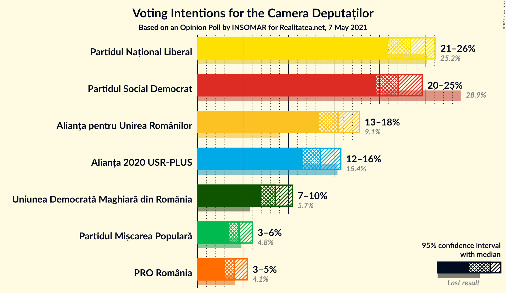

### Confidence Intervals

| Party | Last Result | Poll Result | 80% Confidence Interval | 90% Confidence Interval | 95% Confidence Interval | 99% Confidence Interval |
|:-----:|:-----------:|:-----------:|:-----------------------:|:-----------------------:|:-----------------------:|:-----------------------:|
| Partidul Național Liberal | 25.2% | 23.4% | 21.8–25.2% |21.3–25.7% |20.9–26.1% |20.1–26.9% |
| Partidul Social Democrat | 28.9% | 22.0% | 20.4–23.8% |20.0–24.2% |19.6–24.7% |18.9–25.5% |
| Alianța pentru Unirea Românilor | 9.1% | 15.4% | 14.1–17.0% |13.7–17.4% |13.4–17.8% |12.7–18.5% |
| Alianța 2020 USR-PLUS | 15.4% | 13.5% | 12.2–15.0% |11.8–15.4% |11.5–15.7% |10.9–16.4% |
| Uniunea Democrată Maghiară din România | 5.7% | 8.5% | 7.5–9.8% |7.2–10.1% |7.0–10.4% |6.5–11.0% |
| Partidul Mișcarea Populară | 4.8% | 4.6% | 3.8–5.5% |3.6–5.8% |3.4–6.0% |3.1–6.5% |
| PRO România | 4.1% | 4.1% | 3.4–5.0% |3.2–5.2% |3.0–5.5% |2.7–5.9% |

*Note:* The poll result column reflects the actual value used in the calculations. Published results may vary slightly, and in addition be rounded to fewer digits.

## Seats

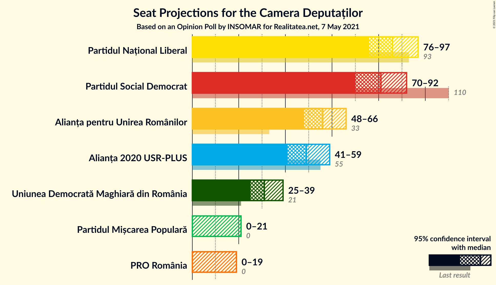

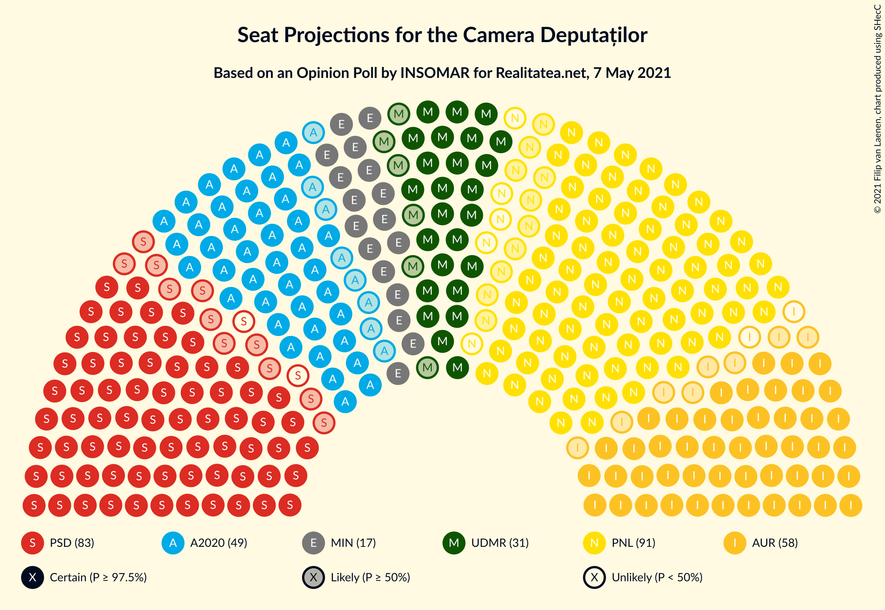

### Confidence Intervals

| Party | Last Result | Median | 80% Confidence Interval | 90% Confidence Interval | 95% Confidence Interval | 99% Confidence Interval |
|:-----:|:-----------:|:------:|:-----------------------:|:-----------------------:|:-----------------------:|:-----------------------:|
| <a href="#partidul-național-liberal">Partidul Național Liberal</a> | 93 | 86 | 77–94 |76–96 |76–97 |72–100 |
| <a href="#partidul-social-democrat">Partidul Social Democrat</a> | 110 | 81 | 74–88 |72–91 |70–92 |68–96 |
| <a href="#alianța-pentru-unirea-românilor">Alianța pentru Unirea Românilor</a> | 33 | 56 | 51–63 |50–65 |48–66 |45–69 |
| <a href="#alianța-2020-usr-plus">Alianța 2020 USR-PLUS</a> | 55 | 49 | 44–55 |43–57 |41–59 |40–61 |
| <a href="#uniunea-democrată-maghiară-din-românia">Uniunea Democrată Maghiară din România</a> | 21 | 31 | 27–35 |26–37 |25–39 |23–40 |
| <a href="#partidul-mișcarea-populară">Partidul Mișcarea Populară</a> | 0 | 0 | 0–19 |0–20 |0–21 |0–23 |
| <a href="#pro-românia">PRO România</a> | 0 | 0 | 0 |0–18 |0–19 |0–21 |

### Partidul Național Liberal

*For a full overview of the results for this party, see the [Partidul Național Liberal](party-partidulnaționalliberal.html) page.*

| Number of Seats | Probability | Accumulated | Special Marks |
|:---------------:|:-----------:|:-----------:|:-------------:|
| 69 | 0% | 100% |  |
| 70 | 0.3% | 99.9% |  |
| 71 | 0.1% | 99.7% |  |
| 72 | 0.2% | 99.6% |  |
| 73 | 0.3% | 99.4% |  |
| 74 | 0.8% | 99.1% |  |
| 75 | 0.5% | 98% |  |
| 76 | 4% | 98% |  |
| 77 | 5% | 94% |  |
| 78 | 2% | 89% |  |
| 79 | 4% | 87% |  |
| 80 | 3% | 83% |  |
| 81 | 5% | 81% |  |
| 82 | 2% | 76% |  |
| 83 | 2% | 74% |  |
| 84 | 8% | 71% |  |
| 85 | 3% | 63% |  |
| 86 | 14% | 60% | Median |
| 87 | 1.1% | 46% |  |
| 88 | 3% | 45% |  |
| 89 | 4% | 41% |  |
| 90 | 5% | 38% |  |
| 91 | 18% | 33% |  |
| 92 | 0.5% | 15% |  |
| 93 | 3% | 14% | Last Result |
| 94 | 4% | 11% |  |
| 95 | 0.7% | 6% |  |
| 96 | 3% | 6% |  |
| 97 | 0.2% | 3% |  |
| 98 | 0.9% | 2% |  |
| 99 | 0.8% | 1.5% |  |
| 100 | 0.5% | 0.7% |  |
| 101 | 0% | 0.1% |  |
| 102 | 0% | 0.1% |  |
| 103 | 0% | 0.1% |  |
| 104 | 0% | 0% |  |

### Partidul Social Democrat

*For a full overview of the results for this party, see the [Partidul Social Democrat](party-partidulsocialdemocrat.html) page.*

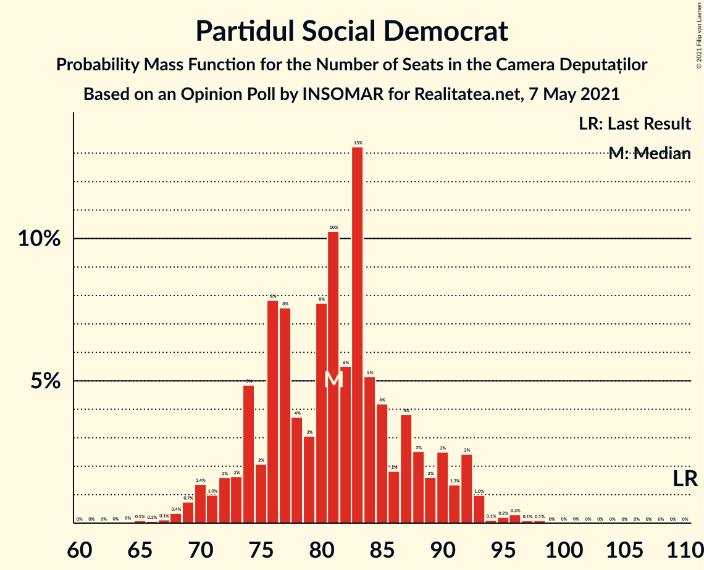

| Number of Seats | Probability | Accumulated | Special Marks |
|:---------------:|:-----------:|:-----------:|:-------------:|
| 64 | 0% | 100% |  |
| 65 | 0.1% | 99.9% |  |
| 66 | 0.1% | 99.9% |  |
| 67 | 0.1% | 99.8% |  |
| 68 | 0.4% | 99.7% |  |
| 69 | 0.7% | 99.3% |  |
| 70 | 1.4% | 98.6% |  |
| 71 | 1.0% | 97% |  |
| 72 | 2% | 96% |  |
| 73 | 2% | 95% |  |
| 74 | 5% | 93% |  |
| 75 | 2% | 88% |  |
| 76 | 8% | 86% |  |
| 77 | 8% | 78% |  |
| 78 | 4% | 71% |  |
| 79 | 3% | 67% |  |
| 80 | 8% | 64% |  |
| 81 | 10% | 56% | Median |
| 82 | 6% | 46% |  |
| 83 | 13% | 40% |  |
| 84 | 5% | 27% |  |
| 85 | 4% | 22% |  |
| 86 | 2% | 18% |  |
| 87 | 4% | 16% |  |
| 88 | 3% | 12% |  |
| 89 | 2% | 10% |  |
| 90 | 3% | 8% |  |
| 91 | 1.3% | 6% |  |
| 92 | 2% | 4% |  |
| 93 | 1.0% | 2% |  |
| 94 | 0.1% | 0.8% |  |
| 95 | 0.2% | 0.7% |  |
| 96 | 0.3% | 0.5% |  |
| 97 | 0.1% | 0.2% |  |
| 98 | 0.1% | 0.1% |  |
| 99 | 0% | 0% |  |
| 100 | 0% | 0% |  |
| 101 | 0% | 0% |  |
| 102 | 0% | 0% |  |
| 103 | 0% | 0% |  |
| 104 | 0% | 0% |  |
| 105 | 0% | 0% |  |
| 106 | 0% | 0% |  |
| 107 | 0% | 0% |  |
| 108 | 0% | 0% |  |
| 109 | 0% | 0% |  |
| 110 | 0% | 0% | Last Result |

### Alianța pentru Unirea Românilor

*For a full overview of the results for this party, see the [Alianța pentru Unirea Românilor](party-alianțapentruunirearomânilor.html) page.*

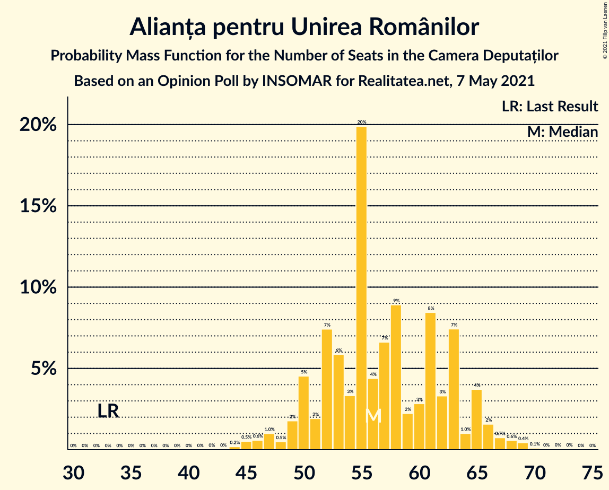

| Number of Seats | Probability | Accumulated | Special Marks |
|:---------------:|:-----------:|:-----------:|:-------------:|
| 33 | 0% | 100% | Last Result |
| 34 | 0% | 100% |  |
| 35 | 0% | 100% |  |
| 36 | 0% | 100% |  |
| 37 | 0% | 100% |  |
| 38 | 0% | 100% |  |
| 39 | 0% | 100% |  |
| 40 | 0% | 100% |  |
| 41 | 0% | 100% |  |
| 42 | 0% | 100% |  |
| 43 | 0% | 100% |  |
| 44 | 0.2% | 99.9% |  |
| 45 | 0.5% | 99.8% |  |
| 46 | 0.6% | 99.2% |  |
| 47 | 1.0% | 98.7% |  |
| 48 | 0.5% | 98% |  |
| 49 | 2% | 97% |  |
| 50 | 5% | 95% |  |
| 51 | 2% | 91% |  |
| 52 | 7% | 89% |  |
| 53 | 6% | 82% |  |
| 54 | 3% | 76% |  |
| 55 | 20% | 72% |  |
| 56 | 4% | 52% | Median |
| 57 | 7% | 48% |  |
| 58 | 9% | 41% |  |
| 59 | 2% | 33% |  |
| 60 | 3% | 30% |  |
| 61 | 8% | 27% |  |
| 62 | 3% | 19% |  |
| 63 | 7% | 16% |  |
| 64 | 1.0% | 8% |  |
| 65 | 4% | 7% |  |
| 66 | 2% | 4% |  |
| 67 | 0.7% | 2% |  |
| 68 | 0.6% | 1.2% |  |
| 69 | 0.4% | 0.7% |  |
| 70 | 0.1% | 0.2% |  |
| 71 | 0% | 0.1% |  |
| 72 | 0% | 0.1% |  |
| 73 | 0% | 0% |  |

### Alianța 2020 USR-PLUS

*For a full overview of the results for this party, see the [Alianța 2020 USR-PLUS](party-alianța2020usr-plus.html) page.*

| Number of Seats | Probability | Accumulated | Special Marks |
|:---------------:|:-----------:|:-----------:|:-------------:|
| 37 | 0.1% | 100% |  |
| 38 | 0.2% | 99.9% |  |
| 39 | 0.1% | 99.7% |  |
| 40 | 1.2% | 99.6% |  |
| 41 | 1.1% | 98% |  |
| 42 | 1.5% | 97% |  |
| 43 | 2% | 96% |  |
| 44 | 5% | 94% |  |
| 45 | 7% | 89% |  |
| 46 | 7% | 82% |  |
| 47 | 10% | 75% |  |
| 48 | 6% | 65% |  |
| 49 | 11% | 59% | Median |
| 50 | 9% | 47% |  |
| 51 | 3% | 39% |  |
| 52 | 14% | 36% |  |
| 53 | 2% | 22% |  |
| 54 | 1.5% | 20% |  |
| 55 | 10% | 18% | Last Result |
| 56 | 3% | 8% |  |
| 57 | 1.3% | 5% |  |
| 58 | 0.7% | 4% |  |
| 59 | 2% | 3% |  |
| 60 | 0.6% | 1.4% |  |
| 61 | 0.3% | 0.7% |  |
| 62 | 0.2% | 0.4% |  |
| 63 | 0.1% | 0.2% |  |
| 64 | 0% | 0.1% |  |
| 65 | 0% | 0% |  |

### Uniunea Democrată Maghiară din România

*For a full overview of the results for this party, see the [Uniunea Democrată Maghiară din România](party-uniuneademocratămaghiarădinromânia.html) page.*

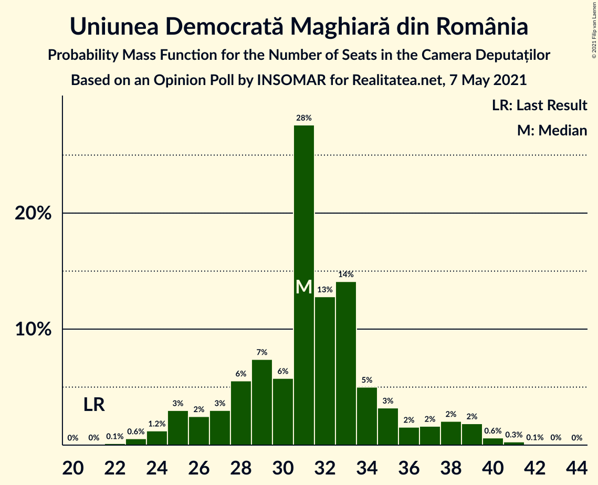

| Number of Seats | Probability | Accumulated | Special Marks |
|:---------------:|:-----------:|:-----------:|:-------------:|
| 21 | 0% | 100% | Last Result |
| 22 | 0.1% | 99.9% |  |
| 23 | 0.6% | 99.8% |  |
| 24 | 1.2% | 99.2% |  |
| 25 | 3% | 98% |  |
| 26 | 2% | 95% |  |
| 27 | 3% | 93% |  |
| 28 | 6% | 90% |  |
| 29 | 7% | 84% |  |
| 30 | 6% | 77% |  |
| 31 | 28% | 71% | Median |
| 32 | 13% | 43% |  |
| 33 | 14% | 30% |  |
| 34 | 5% | 16% |  |
| 35 | 3% | 11% |  |
| 36 | 2% | 8% |  |
| 37 | 2% | 7% |  |
| 38 | 2% | 5% |  |
| 39 | 2% | 3% |  |
| 40 | 0.6% | 1.0% |  |
| 41 | 0.3% | 0.4% |  |
| 42 | 0.1% | 0.1% |  |
| 43 | 0% | 0.1% |  |
| 44 | 0% | 0% |  |

### Partidul Mișcarea Populară

*For a full overview of the results for this party, see the [Partidul Mișcarea Populară](party-partidulmișcareapopulară.html) page.*

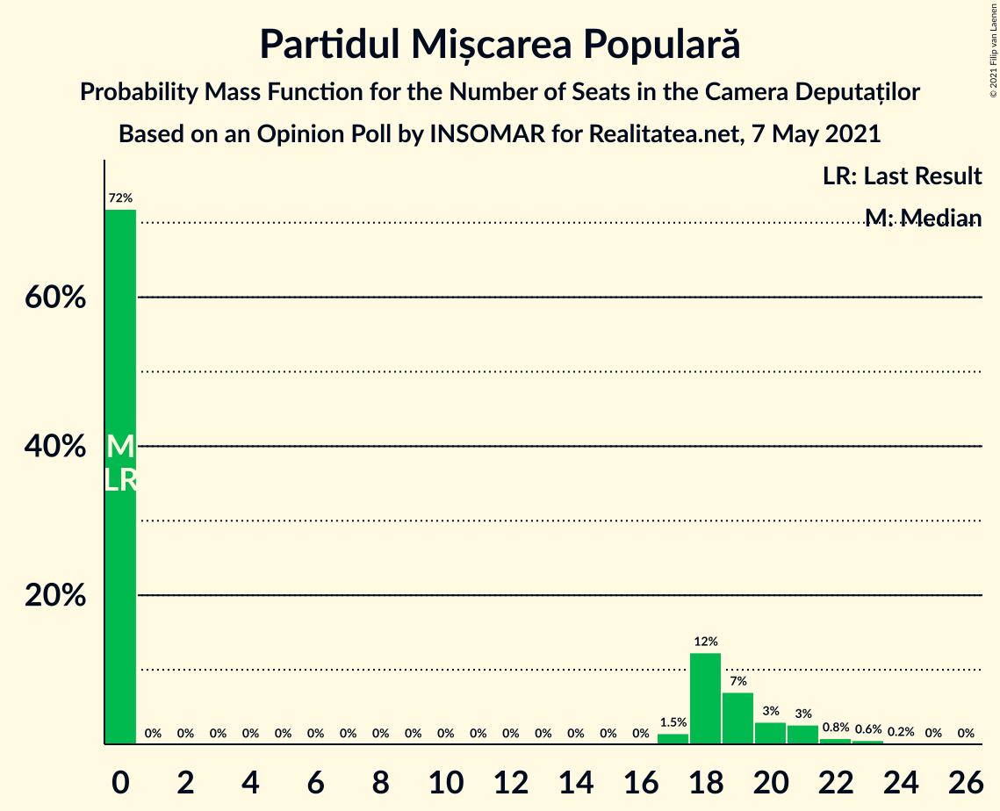

| Number of Seats | Probability | Accumulated | Special Marks |
|:---------------:|:-----------:|:-----------:|:-------------:|
| 0 | 72% | 100% | Last Result, Median |
| 1 | 0% | 28% |  |
| 2 | 0% | 28% |  |
| 3 | 0% | 28% |  |
| 4 | 0% | 28% |  |
| 5 | 0% | 28% |  |
| 6 | 0% | 28% |  |
| 7 | 0% | 28% |  |
| 8 | 0% | 28% |  |
| 9 | 0% | 28% |  |
| 10 | 0% | 28% |  |
| 11 | 0% | 28% |  |
| 12 | 0% | 28% |  |
| 13 | 0% | 28% |  |
| 14 | 0% | 28% |  |
| 15 | 0% | 28% |  |
| 16 | 0% | 28% |  |
| 17 | 1.5% | 28% |  |
| 18 | 12% | 27% |  |
| 19 | 7% | 14% |  |
| 20 | 3% | 7% |  |
| 21 | 3% | 4% |  |
| 22 | 0.8% | 2% |  |
| 23 | 0.6% | 0.8% |  |
| 24 | 0.2% | 0.3% |  |
| 25 | 0% | 0.1% |  |
| 26 | 0% | 0% |  |

### PRO România

*For a full overview of the results for this party, see the [PRO România](party-proromânia.html) page.*

| Number of Seats | Probability | Accumulated | Special Marks |
|:---------------:|:-----------:|:-----------:|:-------------:|
| 0 | 92% | 100% | Last Result, Median |
| 1 | 0% | 8% |  |
| 2 | 0% | 8% |  |
| 3 | 0% | 8% |  |
| 4 | 0% | 8% |  |
| 5 | 0% | 8% |  |
| 6 | 0% | 8% |  |
| 7 | 0% | 8% |  |
| 8 | 0% | 8% |  |
| 9 | 0% | 8% |  |
| 10 | 0% | 8% |  |
| 11 | 0% | 8% |  |
| 12 | 0% | 8% |  |
| 13 | 0% | 8% |  |
| 14 | 0% | 8% |  |
| 15 | 0% | 8% |  |
| 16 | 0% | 8% |  |
| 17 | 2% | 8% |  |
| 18 | 3% | 7% |  |
| 19 | 2% | 3% |  |
| 20 | 0.9% | 2% |  |
| 21 | 0.5% | 0.8% |  |
| 22 | 0.2% | 0.3% |  |
| 23 | 0% | 0% |  |

## Coalitions

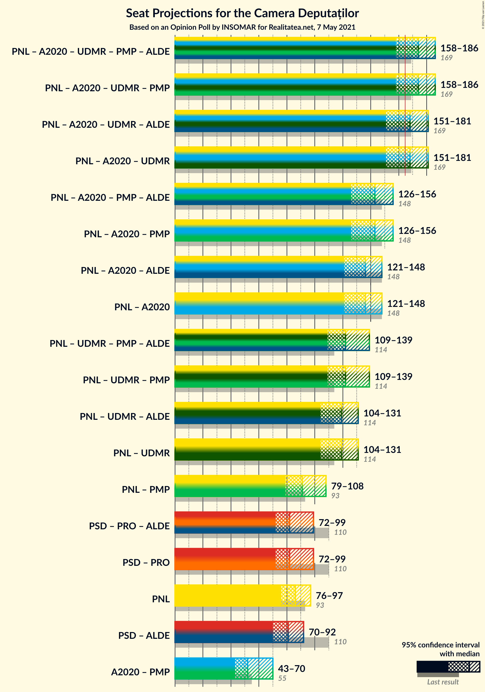

### Confidence Intervals

| Coalition | Last Result | Median | Majority? | 80% Confidence Interval | 90% Confidence Interval | 95% Confidence Interval | 99% Confidence Interval |
|:---------:|:-----------:|:------:|:---------:|:-----------------------:|:-----------------------:|:-----------------------:|:-----------------------:|
| Partidul Național Liberal – Alianța 2020 USR-PLUS – Uniunea Democrată Maghiară din România – Partidul Mișcarea Populară | 169 | 174 | 84% | 162–181 | 160–185 | 158–186 | 153–191 |
| Partidul Național Liberal – Alianța 2020 USR-PLUS – Uniunea Democrată Maghiară din România | 169 | 168 | 62% | 157–177 | 154–180 | 151–181 | 145–184 |
| Partidul Național Liberal – Alianța 2020 USR-PLUS – Partidul Mișcarea Populară | 148 | 143 | 0% | 130–150 | 128–155 | 126–156 | 124–160 |
| Partidul Național Liberal – Alianța 2020 USR-PLUS | 148 | 136 | 0% | 126–146 | 123–148 | 121–148 | 118–150 |
| Partidul Național Liberal – Uniunea Democrată Maghiară din România – Partidul Mișcarea Populară | 114 | 122 | 0% | 115–135 | 112–137 | 109–139 | 105–140 |
| Partidul Național Liberal – Uniunea Democrată Maghiară din România | 114 | 119 | 0% | 109–125 | 107–128 | 104–131 | 98–132 |
| Partidul Național Liberal – Partidul Mișcarea Populară | 93 | 91 | 0% | 82–104 | 79–107 | 79–108 | 76–111 |
| Partidul Social Democrat – PRO România | 110 | 82 | 0% | 75–92 | 74–95 | 72–99 | 69–104 |
| Partidul Național Liberal | 93 | 86 | 0% | 77–94 | 76–96 | 76–97 | 72–100 |
| Alianța 2020 USR-PLUS – Partidul Mișcarea Populară | 55 | 52 | 0% | 45–68 | 45–68 | 43–70 | 41–76 |

### Partidul Național Liberal – Alianța 2020 USR-PLUS – Uniunea Democrată Maghiară din România – Partidul Mișcarea Populară

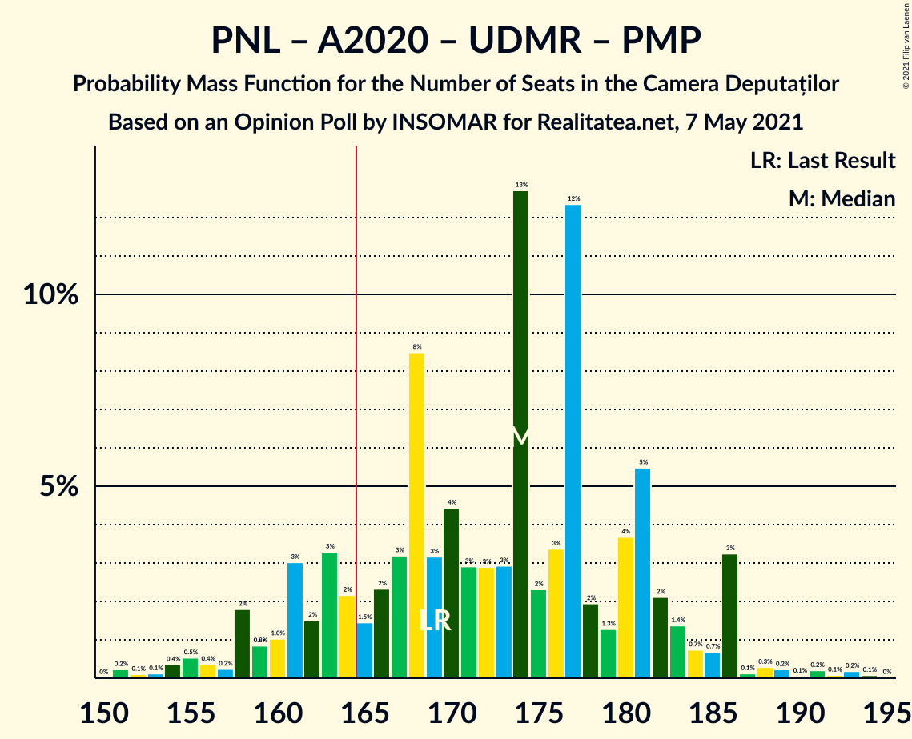

| Number of Seats | Probability | Accumulated | Special Marks |
|:---------------:|:-----------:|:-----------:|:-------------:|
| 150 | 0% | 100% |  |
| 151 | 0.2% | 99.9% |  |
| 152 | 0.1% | 99.7% |  |
| 153 | 0.1% | 99.6% |  |
| 154 | 0.4% | 99.5% |  |
| 155 | 0.5% | 99.1% |  |
| 156 | 0.4% | 98.6% |  |
| 157 | 0.2% | 98% |  |
| 158 | 2% | 98% |  |
| 159 | 0.8% | 96% |  |
| 160 | 1.0% | 95% |  |
| 161 | 3% | 94% |  |
| 162 | 2% | 91% |  |
| 163 | 3% | 90% |  |
| 164 | 2% | 87% |  |
| 165 | 1.5% | 84% | Majority |
| 166 | 2% | 83% | Median |
| 167 | 3% | 81% |  |
| 168 | 8% | 77% |  |
| 169 | 3% | 69% | Last Result |
| 170 | 4% | 66% |  |
| 171 | 3% | 61% |  |
| 172 | 3% | 58% |  |
| 173 | 3% | 55% |  |
| 174 | 13% | 53% |  |
| 175 | 2% | 40% |  |
| 176 | 3% | 38% |  |
| 177 | 12% | 34% |  |
| 178 | 2% | 22% |  |
| 179 | 1.3% | 20% |  |
| 180 | 4% | 19% |  |
| 181 | 5% | 15% |  |
| 182 | 2% | 9% |  |
| 183 | 1.4% | 7% |  |
| 184 | 0.7% | 6% |  |
| 185 | 0.7% | 5% |  |
| 186 | 3% | 5% |  |
| 187 | 0.1% | 1.3% |  |
| 188 | 0.3% | 1.2% |  |
| 189 | 0.2% | 0.9% |  |
| 190 | 0.1% | 0.6% |  |
| 191 | 0.2% | 0.6% |  |
| 192 | 0.1% | 0.4% |  |
| 193 | 0.2% | 0.3% |  |
| 194 | 0.1% | 0.1% |  |
| 195 | 0% | 0% |  |

### Partidul Național Liberal – Alianța 2020 USR-PLUS – Uniunea Democrată Maghiară din România

| Number of Seats | Probability | Accumulated | Special Marks |
|:---------------:|:-----------:|:-----------:|:-------------:|
| 142 | 0% | 100% |  |
| 143 | 0.1% | 99.9% |  |
| 144 | 0.2% | 99.8% |  |
| 145 | 0.3% | 99.7% |  |
| 146 | 0% | 99.4% |  |
| 147 | 0.2% | 99.4% |  |
| 148 | 0.8% | 99.2% |  |
| 149 | 0.3% | 98% |  |
| 150 | 0.2% | 98% |  |
| 151 | 1.1% | 98% |  |
| 152 | 0.5% | 97% |  |
| 153 | 0.5% | 96% |  |
| 154 | 2% | 96% |  |
| 155 | 1.2% | 94% |  |
| 156 | 2% | 93% |  |
| 157 | 0.8% | 90% |  |
| 158 | 4% | 89% |  |
| 159 | 5% | 86% |  |
| 160 | 4% | 81% |  |
| 161 | 3% | 77% |  |
| 162 | 5% | 74% |  |
| 163 | 3% | 69% |  |
| 164 | 3% | 65% |  |
| 165 | 2% | 62% | Majority |
| 166 | 2% | 60% | Median |
| 167 | 3% | 58% |  |
| 168 | 11% | 55% |  |
| 169 | 3% | 43% | Last Result |
| 170 | 4% | 41% |  |
| 171 | 3% | 36% |  |
| 172 | 2% | 33% |  |
| 173 | 2% | 31% |  |
| 174 | 12% | 29% |  |
| 175 | 0.6% | 17% |  |
| 176 | 2% | 17% |  |
| 177 | 7% | 15% |  |
| 178 | 1.1% | 8% |  |
| 179 | 0.6% | 7% |  |
| 180 | 3% | 6% |  |
| 181 | 2% | 3% |  |
| 182 | 0.4% | 2% |  |
| 183 | 0.6% | 1.2% |  |
| 184 | 0.5% | 0.6% |  |
| 185 | 0% | 0.1% |  |
| 186 | 0% | 0.1% |  |
| 187 | 0% | 0.1% |  |
| 188 | 0% | 0% |  |

### Partidul Național Liberal – Alianța 2020 USR-PLUS – Partidul Mișcarea Populară

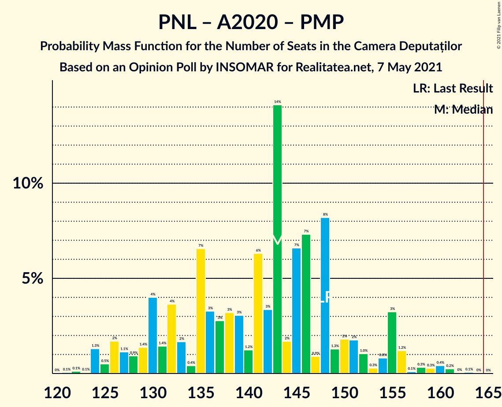

| Number of Seats | Probability | Accumulated | Special Marks |
|:---------------:|:-----------:|:-----------:|:-------------:|
| 120 | 0% | 100% |  |
| 121 | 0.1% | 99.9% |  |
| 122 | 0.1% | 99.9% |  |
| 123 | 0.1% | 99.8% |  |
| 124 | 1.3% | 99.7% |  |
| 125 | 0.5% | 98% |  |
| 126 | 2% | 98% |  |
| 127 | 1.1% | 96% |  |
| 128 | 0.9% | 95% |  |
| 129 | 1.4% | 94% |  |
| 130 | 4% | 93% |  |
| 131 | 1.4% | 89% |  |
| 132 | 4% | 87% |  |
| 133 | 2% | 84% |  |
| 134 | 0.4% | 82% |  |
| 135 | 7% | 82% | Median |
| 136 | 3% | 75% |  |
| 137 | 3% | 72% |  |
| 138 | 3% | 69% |  |
| 139 | 3% | 66% |  |
| 140 | 1.2% | 63% |  |
| 141 | 6% | 61% |  |
| 142 | 3% | 55% |  |
| 143 | 14% | 52% |  |
| 144 | 2% | 38% |  |
| 145 | 7% | 36% |  |
| 146 | 7% | 29% |  |
| 147 | 0.9% | 22% |  |
| 148 | 8% | 21% | Last Result |
| 149 | 1.3% | 13% |  |
| 150 | 2% | 12% |  |
| 151 | 2% | 10% |  |
| 152 | 1.0% | 8% |  |
| 153 | 0.3% | 7% |  |
| 154 | 0.8% | 7% |  |
| 155 | 3% | 6% |  |
| 156 | 1.2% | 3% |  |
| 157 | 0.1% | 2% |  |
| 158 | 0.3% | 1.4% |  |
| 159 | 0.3% | 1.1% |  |
| 160 | 0.4% | 0.8% |  |
| 161 | 0.2% | 0.4% |  |
| 162 | 0% | 0.2% |  |
| 163 | 0.1% | 0.1% |  |
| 164 | 0% | 0.1% |  |
| 165 | 0% | 0% | Majority |

### Partidul Național Liberal – Alianța 2020 USR-PLUS

| Number of Seats | Probability | Accumulated | Special Marks |
|:---------------:|:-----------:|:-----------:|:-------------:|
| 114 | 0.1% | 100% |  |
| 115 | 0% | 99.9% |  |
| 116 | 0.2% | 99.8% |  |
| 117 | 0.1% | 99.6% |  |
| 118 | 0.1% | 99.5% |  |
| 119 | 0.7% | 99.4% |  |
| 120 | 0.2% | 98.7% |  |
| 121 | 1.1% | 98.6% |  |
| 122 | 0.6% | 97% |  |
| 123 | 2% | 97% |  |
| 124 | 3% | 95% |  |
| 125 | 2% | 92% |  |
| 126 | 3% | 90% |  |
| 127 | 6% | 87% |  |
| 128 | 1.4% | 81% |  |
| 129 | 4% | 80% |  |
| 130 | 4% | 76% |  |
| 131 | 2% | 71% |  |
| 132 | 5% | 69% |  |
| 133 | 3% | 64% |  |
| 134 | 0.8% | 61% |  |
| 135 | 8% | 61% | Median |
| 136 | 4% | 53% |  |
| 137 | 5% | 49% |  |
| 138 | 3% | 44% |  |
| 139 | 3% | 40% |  |
| 140 | 0.8% | 37% |  |
| 141 | 7% | 37% |  |
| 142 | 2% | 30% |  |
| 143 | 12% | 28% |  |
| 144 | 0.5% | 16% |  |
| 145 | 2% | 15% |  |
| 146 | 6% | 13% |  |
| 147 | 0.6% | 6% |  |
| 148 | 4% | 6% | Last Result |
| 149 | 0.4% | 1.3% |  |
| 150 | 0.4% | 0.9% |  |
| 151 | 0.1% | 0.5% |  |
| 152 | 0.1% | 0.4% |  |
| 153 | 0.1% | 0.2% |  |
| 154 | 0.1% | 0.1% |  |
| 155 | 0% | 0% |  |

### Partidul Național Liberal – Uniunea Democrată Maghiară din România – Partidul Mișcarea Populară

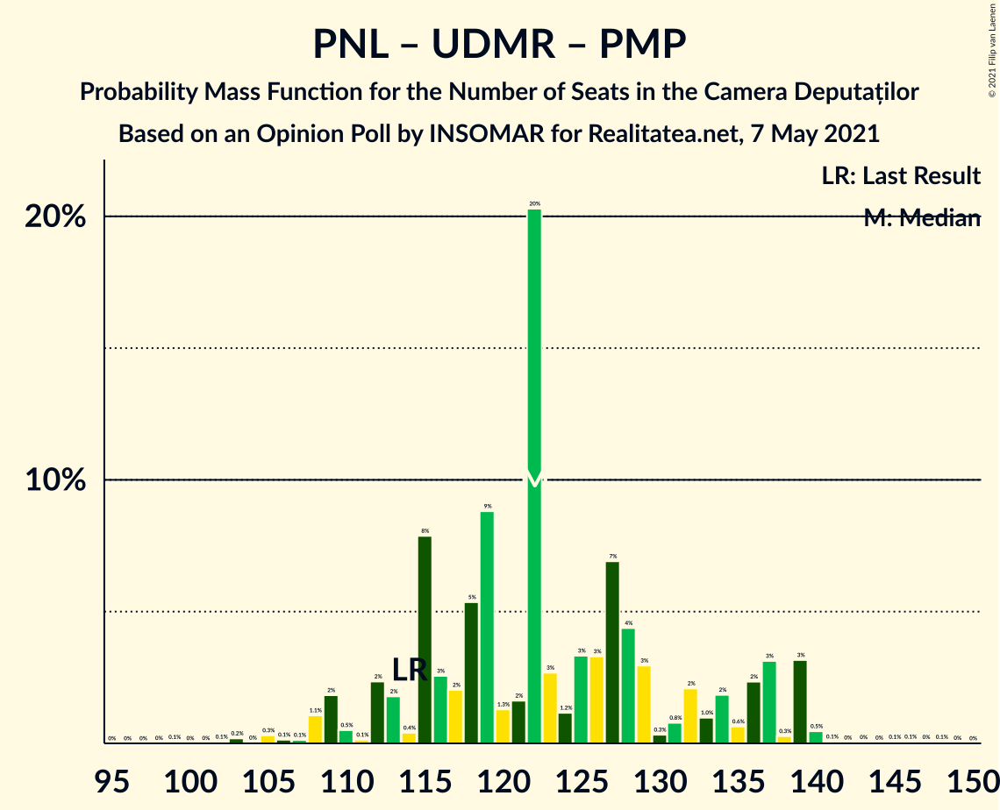

| Number of Seats | Probability | Accumulated | Special Marks |
|:---------------:|:-----------:|:-----------:|:-------------:|
| 99 | 0.1% | 100% |  |
| 100 | 0% | 99.9% |  |
| 101 | 0% | 99.9% |  |
| 102 | 0.1% | 99.9% |  |
| 103 | 0.2% | 99.9% |  |
| 104 | 0% | 99.7% |  |
| 105 | 0.3% | 99.6% |  |
| 106 | 0.1% | 99.3% |  |
| 107 | 0.1% | 99.2% |  |
| 108 | 1.1% | 99.1% |  |
| 109 | 2% | 98% |  |
| 110 | 0.5% | 96% |  |
| 111 | 0.1% | 96% |  |
| 112 | 2% | 96% |  |
| 113 | 2% | 93% |  |
| 114 | 0.4% | 91% | Last Result |
| 115 | 8% | 91% |  |
| 116 | 3% | 83% |  |
| 117 | 2% | 81% | Median |
| 118 | 5% | 79% |  |
| 119 | 9% | 73% |  |
| 120 | 1.3% | 64% |  |
| 121 | 2% | 63% |  |
| 122 | 20% | 61% |  |
| 123 | 3% | 41% |  |
| 124 | 1.2% | 38% |  |
| 125 | 3% | 37% |  |
| 126 | 3% | 34% |  |
| 127 | 7% | 31% |  |
| 128 | 4% | 24% |  |
| 129 | 3% | 19% |  |
| 130 | 0.3% | 16% |  |
| 131 | 0.8% | 16% |  |
| 132 | 2% | 15% |  |
| 133 | 1.0% | 13% |  |
| 134 | 2% | 12% |  |
| 135 | 0.6% | 10% |  |
| 136 | 2% | 10% |  |
| 137 | 3% | 7% |  |
| 138 | 0.3% | 4% |  |
| 139 | 3% | 4% |  |
| 140 | 0.5% | 0.9% |  |
| 141 | 0.1% | 0.4% |  |
| 142 | 0% | 0.3% |  |
| 143 | 0% | 0.3% |  |
| 144 | 0% | 0.3% |  |
| 145 | 0.1% | 0.2% |  |
| 146 | 0.1% | 0.2% |  |
| 147 | 0% | 0.1% |  |
| 148 | 0.1% | 0.1% |  |
| 149 | 0% | 0% |  |

### Partidul Național Liberal – Uniunea Democrată Maghiară din România

| Number of Seats | Probability | Accumulated | Special Marks |
|:---------------:|:-----------:|:-----------:|:-------------:|
| 98 | 0.5% | 100% |  |
| 99 | 0.3% | 99.5% |  |
| 100 | 0.1% | 99.2% |  |
| 101 | 0% | 99.1% |  |
| 102 | 0.1% | 99.1% |  |
| 103 | 0.5% | 99.0% |  |
| 104 | 1.4% | 98% |  |
| 105 | 0.6% | 97% |  |
| 106 | 0.2% | 97% |  |
| 107 | 1.3% | 96% |  |
| 108 | 4% | 95% |  |
| 109 | 7% | 91% |  |
| 110 | 1.4% | 84% |  |
| 111 | 2% | 83% |  |
| 112 | 3% | 80% |  |
| 113 | 4% | 78% |  |
| 114 | 1.1% | 74% | Last Result |
| 115 | 8% | 73% |  |
| 116 | 4% | 65% |  |
| 117 | 2% | 61% | Median |
| 118 | 9% | 59% |  |
| 119 | 9% | 50% |  |
| 120 | 2% | 41% |  |
| 121 | 5% | 39% |  |
| 122 | 20% | 34% |  |
| 123 | 2% | 14% |  |
| 124 | 0.3% | 12% |  |
| 125 | 2% | 11% |  |
| 126 | 2% | 9% |  |
| 127 | 0.2% | 7% |  |
| 128 | 3% | 7% |  |
| 129 | 1.3% | 4% |  |
| 130 | 0.1% | 3% |  |
| 131 | 0.6% | 3% |  |
| 132 | 2% | 2% |  |
| 133 | 0.1% | 0.3% |  |
| 134 | 0% | 0.2% |  |
| 135 | 0.1% | 0.2% |  |
| 136 | 0.1% | 0.1% |  |
| 137 | 0% | 0% |  |

### Partidul Național Liberal – Partidul Mișcarea Populară

| Number of Seats | Probability | Accumulated | Special Marks |
|:---------------:|:-----------:|:-----------:|:-------------:|
| 70 | 0% | 100% |  |
| 71 | 0% | 99.9% |  |
| 72 | 0% | 99.9% |  |
| 73 | 0% | 99.9% |  |
| 74 | 0.1% | 99.9% |  |
| 75 | 0.1% | 99.8% |  |
| 76 | 0.4% | 99.7% |  |
| 77 | 1.1% | 99.3% |  |
| 78 | 0.5% | 98% |  |
| 79 | 3% | 98% |  |
| 80 | 0.7% | 95% |  |
| 81 | 4% | 94% |  |
| 82 | 2% | 90% |  |
| 83 | 2% | 89% |  |
| 84 | 7% | 87% |  |
| 85 | 0.3% | 80% |  |
| 86 | 12% | 80% | Median |
| 87 | 0.6% | 68% |  |
| 88 | 3% | 67% |  |
| 89 | 4% | 65% |  |
| 90 | 1.3% | 61% |  |
| 91 | 18% | 60% |  |
| 92 | 0.8% | 42% |  |
| 93 | 4% | 41% | Last Result |
| 94 | 4% | 37% |  |
| 95 | 6% | 33% |  |
| 96 | 4% | 26% |  |
| 97 | 2% | 22% |  |
| 98 | 2% | 20% |  |
| 99 | 2% | 18% |  |
| 100 | 1.3% | 17% |  |
| 101 | 1.4% | 15% |  |
| 102 | 1.4% | 14% |  |
| 103 | 1.5% | 13% |  |
| 104 | 5% | 11% |  |
| 105 | 0.4% | 7% |  |
| 106 | 1.1% | 6% |  |
| 107 | 0.2% | 5% |  |
| 108 | 3% | 5% |  |
| 109 | 0.4% | 2% |  |
| 110 | 0.7% | 1.3% |  |
| 111 | 0.3% | 0.6% |  |
| 112 | 0% | 0.3% |  |
| 113 | 0.1% | 0.3% |  |
| 114 | 0.1% | 0.2% |  |
| 115 | 0.1% | 0.1% |  |
| 116 | 0% | 0.1% |  |
| 117 | 0% | 0% |  |

### Partidul Social Democrat – PRO România

| Number of Seats | Probability | Accumulated | Special Marks |
|:---------------:|:-----------:|:-----------:|:-------------:|
| 65 | 0.1% | 100% |  |
| 66 | 0% | 99.9% |  |
| 67 | 0.1% | 99.9% |  |
| 68 | 0.2% | 99.8% |  |
| 69 | 0.1% | 99.6% |  |
| 70 | 1.2% | 99.5% |  |
| 71 | 0.6% | 98% |  |
| 72 | 1.4% | 98% |  |
| 73 | 1.1% | 96% |  |
| 74 | 4% | 95% |  |
| 75 | 1.5% | 91% |  |
| 76 | 7% | 90% |  |
| 77 | 7% | 82% |  |
| 78 | 3% | 75% |  |
| 79 | 2% | 72% |  |
| 80 | 7% | 69% |  |
| 81 | 9% | 62% | Median |
| 82 | 5% | 53% |  |
| 83 | 13% | 47% |  |
| 84 | 5% | 35% |  |
| 85 | 4% | 30% |  |
| 86 | 2% | 26% |  |
| 87 | 4% | 24% |  |
| 88 | 3% | 20% |  |
| 89 | 2% | 17% |  |
| 90 | 3% | 15% |  |
| 91 | 2% | 12% |  |
| 92 | 3% | 10% |  |
| 93 | 1.5% | 8% |  |
| 94 | 0.3% | 6% |  |
| 95 | 0.9% | 6% |  |
| 96 | 0.7% | 5% |  |
| 97 | 0.5% | 4% |  |
| 98 | 0.4% | 4% |  |
| 99 | 2% | 3% |  |
| 100 | 0.3% | 2% |  |
| 101 | 0.4% | 1.3% |  |
| 102 | 0% | 0.9% |  |
| 103 | 0.1% | 0.9% |  |
| 104 | 0.5% | 0.7% |  |
| 105 | 0.1% | 0.2% |  |
| 106 | 0% | 0.1% |  |
| 107 | 0% | 0.1% |  |
| 108 | 0% | 0% |  |
| 109 | 0% | 0% |  |
| 110 | 0% | 0% | Last Result |

### Partidul Național Liberal

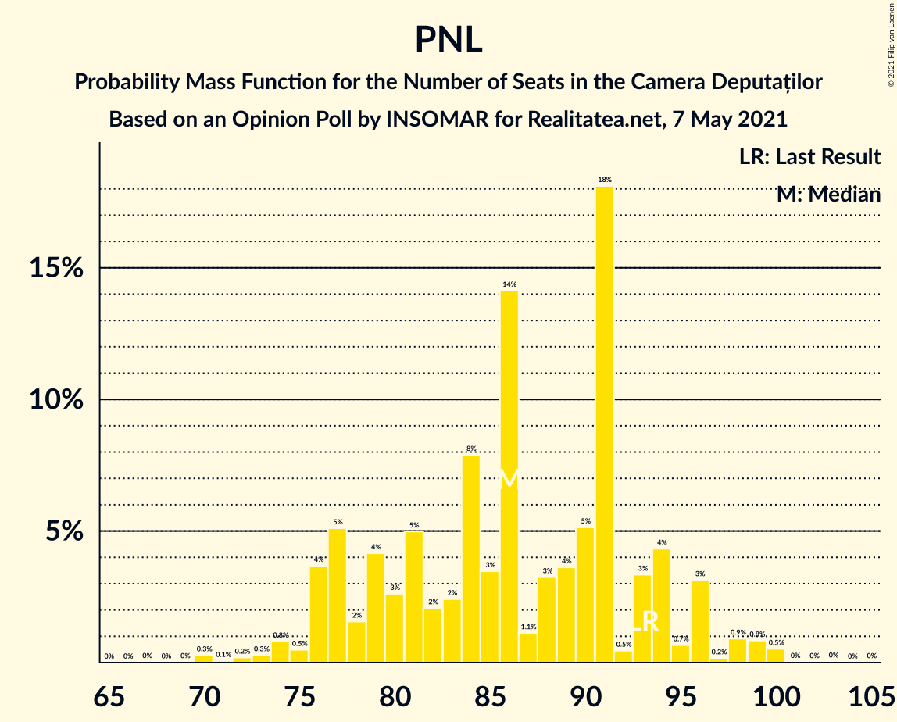

| Number of Seats | Probability | Accumulated | Special Marks |
|:---------------:|:-----------:|:-----------:|:-------------:|
| 69 | 0% | 100% |  |
| 70 | 0.3% | 99.9% |  |
| 71 | 0.1% | 99.7% |  |
| 72 | 0.2% | 99.6% |  |
| 73 | 0.3% | 99.4% |  |
| 74 | 0.8% | 99.1% |  |
| 75 | 0.5% | 98% |  |
| 76 | 4% | 98% |  |
| 77 | 5% | 94% |  |
| 78 | 2% | 89% |  |
| 79 | 4% | 87% |  |
| 80 | 3% | 83% |  |
| 81 | 5% | 81% |  |
| 82 | 2% | 76% |  |
| 83 | 2% | 74% |  |
| 84 | 8% | 71% |  |
| 85 | 3% | 63% |  |
| 86 | 14% | 60% | Median |
| 87 | 1.1% | 46% |  |
| 88 | 3% | 45% |  |
| 89 | 4% | 41% |  |
| 90 | 5% | 38% |  |
| 91 | 18% | 33% |  |
| 92 | 0.5% | 15% |  |
| 93 | 3% | 14% | Last Result |
| 94 | 4% | 11% |  |
| 95 | 0.7% | 6% |  |
| 96 | 3% | 6% |  |
| 97 | 0.2% | 3% |  |
| 98 | 0.9% | 2% |  |
| 99 | 0.8% | 1.5% |  |
| 100 | 0.5% | 0.7% |  |
| 101 | 0% | 0.1% |  |
| 102 | 0% | 0.1% |  |
| 103 | 0% | 0.1% |  |
| 104 | 0% | 0% |  |

### Alianța 2020 USR-PLUS – Partidul Mișcarea Populară

| Number of Seats | Probability | Accumulated | Special Marks |
|:---------------:|:-----------:|:-----------:|:-------------:|
| 38 | 0% | 100% |  |
| 39 | 0.1% | 99.9% |  |
| 40 | 0% | 99.9% |  |
| 41 | 0.4% | 99.8% |  |
| 42 | 1.3% | 99.4% |  |
| 43 | 1.1% | 98% |  |
| 44 | 2% | 97% |  |
| 45 | 6% | 95% |  |
| 46 | 5% | 90% |  |
| 47 | 4% | 85% |  |
| 48 | 5% | 81% |  |
| 49 | 10% | 77% | Median |
| 50 | 3% | 67% |  |
| 51 | 3% | 64% |  |
| 52 | 14% | 62% |  |
| 53 | 2% | 48% |  |
| 54 | 1.0% | 47% |  |
| 55 | 10% | 46% | Last Result |
| 56 | 3% | 36% |  |
| 57 | 1.2% | 33% |  |
| 58 | 1.3% | 32% |  |
| 59 | 3% | 30% |  |
| 60 | 1.0% | 28% |  |
| 61 | 0.4% | 27% |  |
| 62 | 0.9% | 26% |  |
| 63 | 3% | 25% |  |
| 64 | 2% | 22% |  |
| 65 | 4% | 20% |  |
| 66 | 3% | 16% |  |
| 67 | 3% | 13% |  |
| 68 | 6% | 10% |  |
| 69 | 0.4% | 4% |  |
| 70 | 1.3% | 4% |  |
| 71 | 0.5% | 2% |  |
| 72 | 0.2% | 2% |  |
| 73 | 0.5% | 2% |  |
| 74 | 0.4% | 1.2% |  |
| 75 | 0.3% | 0.8% |  |
| 76 | 0.3% | 0.5% |  |
| 77 | 0.1% | 0.2% |  |
| 78 | 0% | 0.1% |  |
| 79 | 0% | 0.1% |  |
| 80 | 0% | 0% |  |

## Technical Information

### Opinion Poll

+ **Polling firm:** INSOMAR
+ **Commissioner(s):** Realitatea.net
+ **Fieldwork period:** 7 May 2021

### Calculations

+ **Sample size:** 1030
+ **Simulations done:** 131,072
+ **Error estimate:** 1.19%

