# Opinion Poll by Avangarde, 1–31 May 2021

<a href="#voting-intentions">Voting Intentions</a> | <a href="#seats">Seats</a> | <a href="#coalitions">Coalitions</a> | <a href="#technical-information">Technical Information</a>

## Voting Intentions

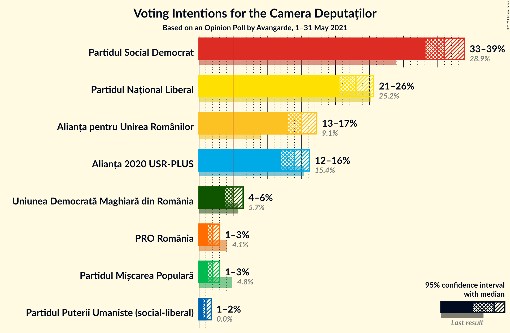

### Confidence Intervals

| Party | Last Result | Poll Result | 80% Confidence Interval | 90% Confidence Interval | 95% Confidence Interval | 99% Confidence Interval |
|:-----:|:-----------:|:-----------:|:-----------------------:|:-----------------------:|:-----------------------:|:-----------------------:|
| Partidul Social Democrat | 28.9% | 36.0% | 34.2–37.9% |33.7–38.4% |33.2–38.9% |32.3–39.8% |
| Partidul Național Liberal | 25.2% | 23.0% | 21.4–24.7% |21.0–25.2% |20.6–25.6% |19.9–26.4% |
| Alianța pentru Unirea Românilor | 9.1% | 15.0% | 13.7–16.5% |13.3–16.9% |13.0–17.2% |12.4–18.0% |
| Alianța 2020 USR-PLUS | 15.4% | 14.0% | 12.7–15.4% |12.4–15.8% |12.1–16.2% |11.5–16.9% |
| Uniunea Democrată Maghiară din România | 5.7% | 5.0% | 4.3–6.0% |4.0–6.2% |3.9–6.5% |3.5–7.0% |
| Partidul Mișcarea Populară | 4.8% | 2.0% | 1.6–2.7% |1.4–2.9% |1.3–3.0% |1.1–3.4% |
| PRO România | 4.1% | 2.0% | 1.6–2.7% |1.4–2.9% |1.3–3.0% |1.1–3.4% |
| Partidul Puterii Umaniste (social-liberal) | 0.0% | 1.0% | 0.7–1.5% |0.6–1.7% |0.6–1.8% |0.4–2.1% |

*Note:* The poll result column reflects the actual value used in the calculations. Published results may vary slightly, and in addition be rounded to fewer digits.

## Seats

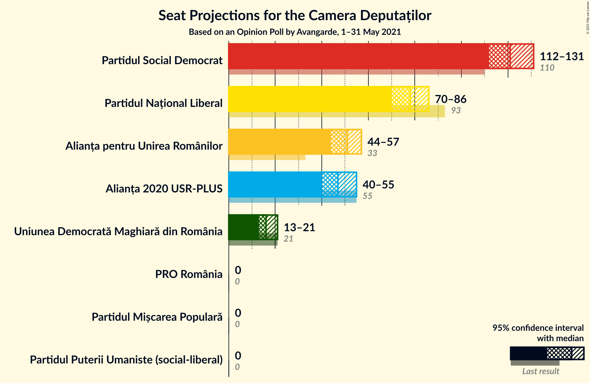

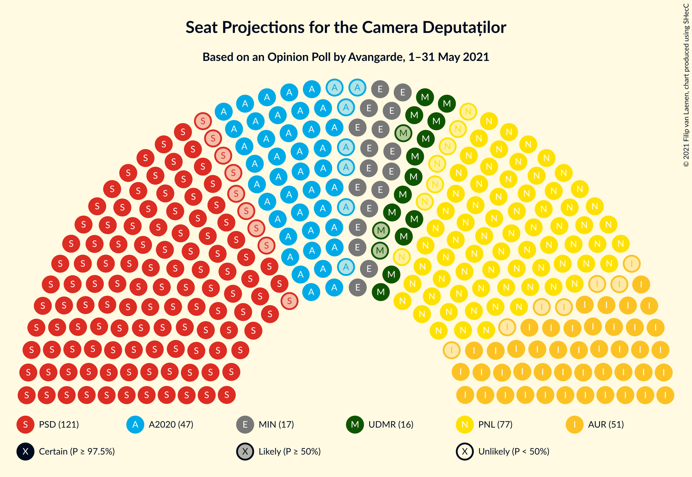

### Confidence Intervals

| Party | Last Result | Median | 80% Confidence Interval | 90% Confidence Interval | 95% Confidence Interval | 99% Confidence Interval |
|:-----:|:-----------:|:------:|:-----------------------:|:-----------------------:|:-----------------------:|:-----------------------:|
| <a href="#partidul-social-democrat">Partidul Social Democrat</a> | 110 | 121 | 115–126 |113–129 |112–131 |110–133 |
| <a href="#partidul-național-liberal">Partidul Național Liberal</a> | 93 | 78 | 73–84 |70–85 |70–86 |66–89 |
| <a href="#alianța-pentru-unirea-românilor">Alianța pentru Unirea Românilor</a> | 33 | 51 | 46–54 |45–55 |44–57 |41–60 |
| <a href="#alianța-2020-usr-plus">Alianța 2020 USR-PLUS</a> | 55 | 47 | 42–52 |42–53 |40–55 |37–57 |
| <a href="#uniunea-democrată-maghiară-din-românia">Uniunea Democrată Maghiară din România</a> | 21 | 16 | 14–20 |13–20 |13–21 |12–23 |
| <a href="#partidul-mișcarea-populară">Partidul Mișcarea Populară</a> | 0 | 0 | 0 |0 |0 |0 |
| <a href="#pro-românia">PRO România</a> | 0 | 0 | 0 |0 |0 |0 |
| <a href="#partidul-puterii-umaniste-(social-liberal)">Partidul Puterii Umaniste (social-liberal)</a> | 0 | 0 | 0 |0 |0 |0 |

### Partidul Social Democrat

*For a full overview of the results for this party, see the [Partidul Social Democrat](party-partidulsocialdemocrat.html) page.*

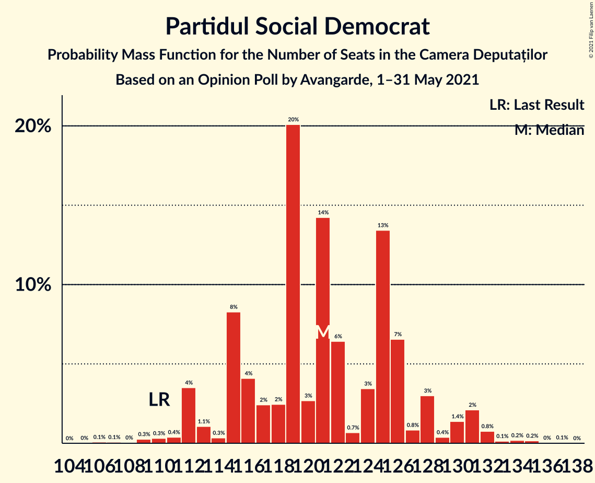

| Number of Seats | Probability | Accumulated | Special Marks |
|:---------------:|:-----------:|:-----------:|:-------------:|
| 106 | 0.1% | 100% |  |
| 107 | 0.1% | 99.9% |  |
| 108 | 0% | 99.8% |  |
| 109 | 0.3% | 99.8% |  |
| 110 | 0.3% | 99.5% | Last Result |
| 111 | 0.4% | 99.2% |  |
| 112 | 4% | 98.8% |  |
| 113 | 1.1% | 95% |  |
| 114 | 0.3% | 94% |  |
| 115 | 8% | 94% |  |
| 116 | 4% | 86% |  |
| 117 | 2% | 82% |  |
| 118 | 2% | 79% |  |
| 119 | 20% | 77% |  |
| 120 | 3% | 57% |  |
| 121 | 14% | 54% | Median |
| 122 | 6% | 40% |  |
| 123 | 0.7% | 33% |  |
| 124 | 3% | 32% |  |
| 125 | 13% | 29% |  |
| 126 | 7% | 16% |  |
| 127 | 0.8% | 9% |  |
| 128 | 3% | 8% |  |
| 129 | 0.4% | 5% |  |
| 130 | 1.4% | 5% |  |
| 131 | 2% | 3% |  |
| 132 | 0.8% | 1.4% |  |
| 133 | 0.1% | 0.6% |  |
| 134 | 0.2% | 0.5% |  |
| 135 | 0.2% | 0.3% |  |
| 136 | 0% | 0.1% |  |
| 137 | 0.1% | 0.1% |  |
| 138 | 0% | 0% |  |

### Partidul Național Liberal

*For a full overview of the results for this party, see the [Partidul Național Liberal](party-partidulnaționalliberal.html) page.*

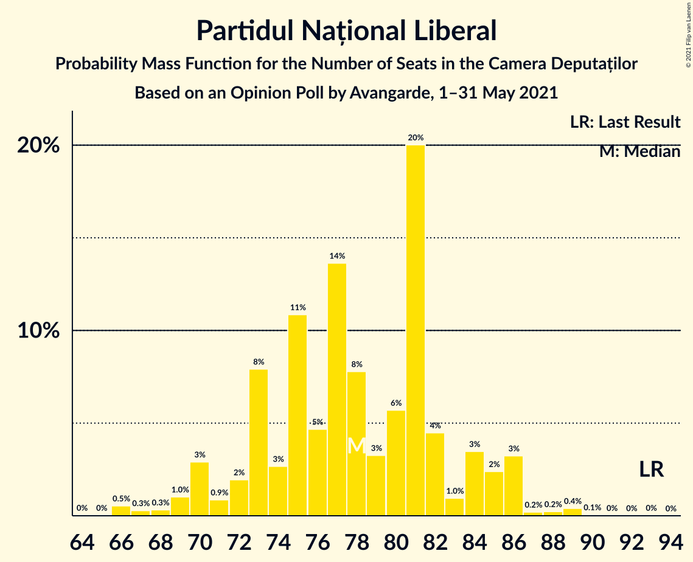

| Number of Seats | Probability | Accumulated | Special Marks |
|:---------------:|:-----------:|:-----------:|:-------------:|
| 64 | 0% | 100% |  |
| 65 | 0% | 99.9% |  |
| 66 | 0.5% | 99.9% |  |
| 67 | 0.3% | 99.4% |  |
| 68 | 0.3% | 99.1% |  |
| 69 | 1.0% | 98.8% |  |
| 70 | 3% | 98% |  |
| 71 | 0.9% | 95% |  |
| 72 | 2% | 94% |  |
| 73 | 8% | 92% |  |
| 74 | 3% | 84% |  |
| 75 | 11% | 81% |  |
| 76 | 5% | 71% |  |
| 77 | 14% | 66% |  |
| 78 | 8% | 52% | Median |
| 79 | 3% | 44% |  |
| 80 | 6% | 41% |  |
| 81 | 20% | 36% |  |
| 82 | 4% | 15% |  |
| 83 | 1.0% | 11% |  |
| 84 | 3% | 10% |  |
| 85 | 2% | 7% |  |
| 86 | 3% | 4% |  |
| 87 | 0.2% | 1.0% |  |
| 88 | 0.2% | 0.8% |  |
| 89 | 0.4% | 0.5% |  |
| 90 | 0.1% | 0.1% |  |
| 91 | 0% | 0.1% |  |
| 92 | 0% | 0% |  |
| 93 | 0% | 0% | Last Result |

### Alianța pentru Unirea Românilor

*For a full overview of the results for this party, see the [Alianța pentru Unirea Românilor](party-alianțapentruunirearomânilor.html) page.*

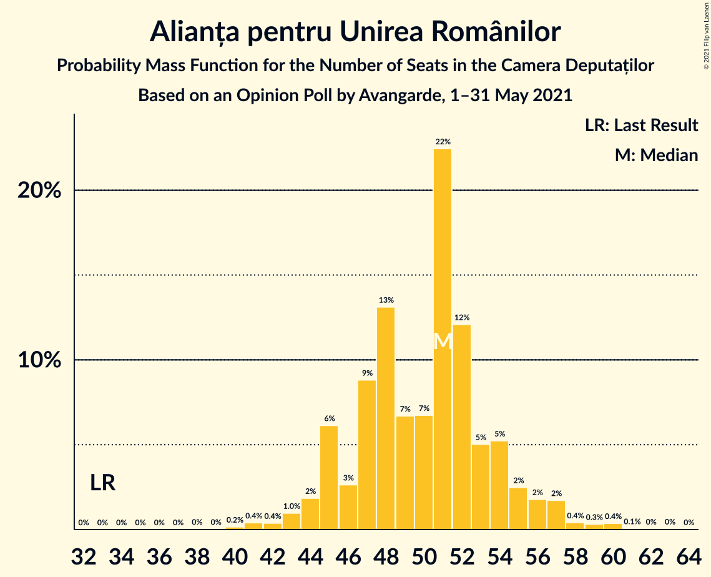

| Number of Seats | Probability | Accumulated | Special Marks |
|:---------------:|:-----------:|:-----------:|:-------------:|
| 33 | 0% | 100% | Last Result |
| 34 | 0% | 100% |  |
| 35 | 0% | 100% |  |
| 36 | 0% | 100% |  |
| 37 | 0% | 100% |  |
| 38 | 0% | 100% |  |
| 39 | 0% | 100% |  |
| 40 | 0.2% | 99.9% |  |
| 41 | 0.4% | 99.8% |  |
| 42 | 0.4% | 99.4% |  |
| 43 | 1.0% | 99.0% |  |
| 44 | 2% | 98% |  |
| 45 | 6% | 96% |  |
| 46 | 3% | 90% |  |
| 47 | 9% | 87% |  |
| 48 | 13% | 79% |  |
| 49 | 7% | 65% |  |
| 50 | 7% | 59% |  |
| 51 | 22% | 52% | Median |
| 52 | 12% | 30% |  |
| 53 | 5% | 18% |  |
| 54 | 5% | 12% |  |
| 55 | 2% | 7% |  |
| 56 | 2% | 5% |  |
| 57 | 2% | 3% |  |
| 58 | 0.4% | 1.3% |  |
| 59 | 0.3% | 0.9% |  |
| 60 | 0.4% | 0.5% |  |
| 61 | 0.1% | 0.2% |  |
| 62 | 0% | 0.1% |  |
| 63 | 0% | 0.1% |  |
| 64 | 0% | 0% |  |

### Alianța 2020 USR-PLUS

*For a full overview of the results for this party, see the [Alianța 2020 USR-PLUS](party-alianța2020usr-plus.html) page.*

| Number of Seats | Probability | Accumulated | Special Marks |
|:---------------:|:-----------:|:-----------:|:-------------:|
| 36 | 0.2% | 100% |  |
| 37 | 0.3% | 99.8% |  |
| 38 | 0.2% | 99.5% |  |
| 39 | 0.6% | 99.3% |  |
| 40 | 1.3% | 98.7% |  |
| 41 | 1.2% | 97% |  |
| 42 | 9% | 96% |  |
| 43 | 6% | 87% |  |
| 44 | 4% | 82% |  |
| 45 | 4% | 78% |  |
| 46 | 15% | 74% |  |
| 47 | 22% | 58% | Median |
| 48 | 12% | 36% |  |
| 49 | 4% | 24% |  |
| 50 | 4% | 20% |  |
| 51 | 4% | 16% |  |
| 52 | 6% | 12% |  |
| 53 | 2% | 6% |  |
| 54 | 1.4% | 4% |  |
| 55 | 0.4% | 3% | Last Result |
| 56 | 0.6% | 2% |  |
| 57 | 1.5% | 2% |  |
| 58 | 0.3% | 0.4% |  |
| 59 | 0% | 0.1% |  |
| 60 | 0% | 0% |  |

### Uniunea Democrată Maghiară din România

*For a full overview of the results for this party, see the [Uniunea Democrată Maghiară din România](party-uniuneademocratămaghiarădinromânia.html) page.*

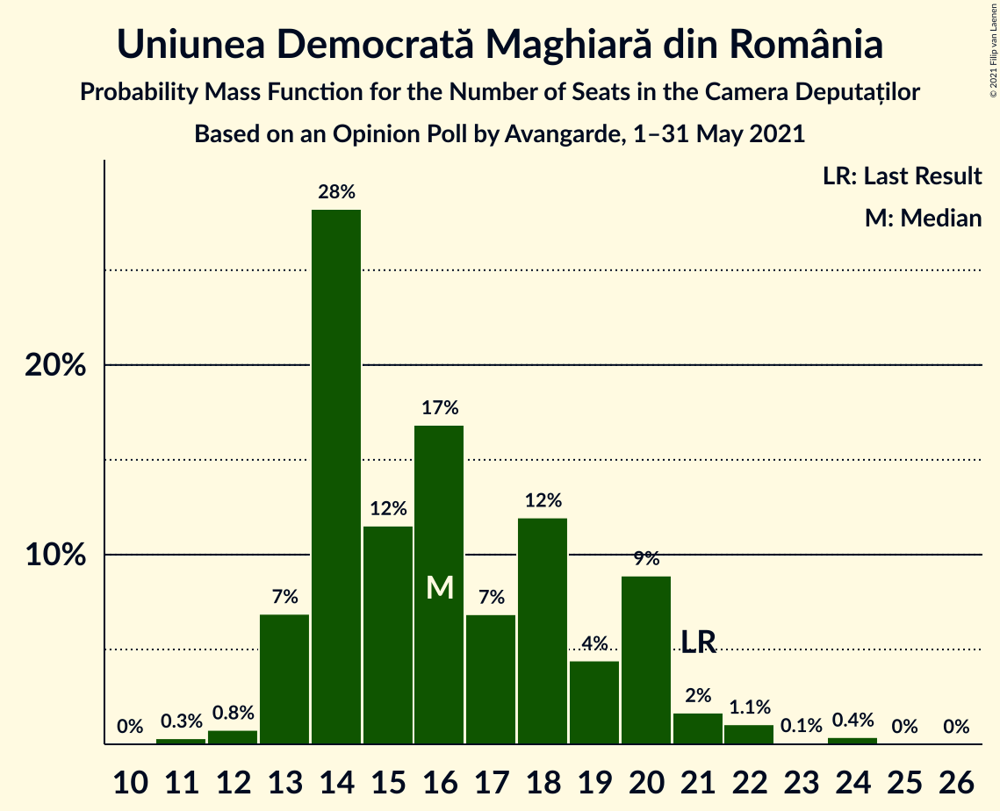

| Number of Seats | Probability | Accumulated | Special Marks |
|:---------------:|:-----------:|:-----------:|:-------------:|
| 11 | 0.3% | 100% |  |
| 12 | 0.8% | 99.6% |  |
| 13 | 7% | 98.9% |  |
| 14 | 28% | 92% |  |
| 15 | 12% | 64% |  |
| 16 | 17% | 52% | Median |
| 17 | 7% | 35% |  |
| 18 | 12% | 29% |  |
| 19 | 4% | 17% |  |
| 20 | 9% | 12% |  |
| 21 | 2% | 3% | Last Result |
| 22 | 1.1% | 2% |  |
| 23 | 0.1% | 0.5% |  |
| 24 | 0.4% | 0.5% |  |
| 25 | 0% | 0.1% |  |
| 26 | 0% | 0% |  |

### Partidul Mișcarea Populară

*For a full overview of the results for this party, see the [Partidul Mișcarea Populară](party-partidulmișcareapopulară.html) page.*

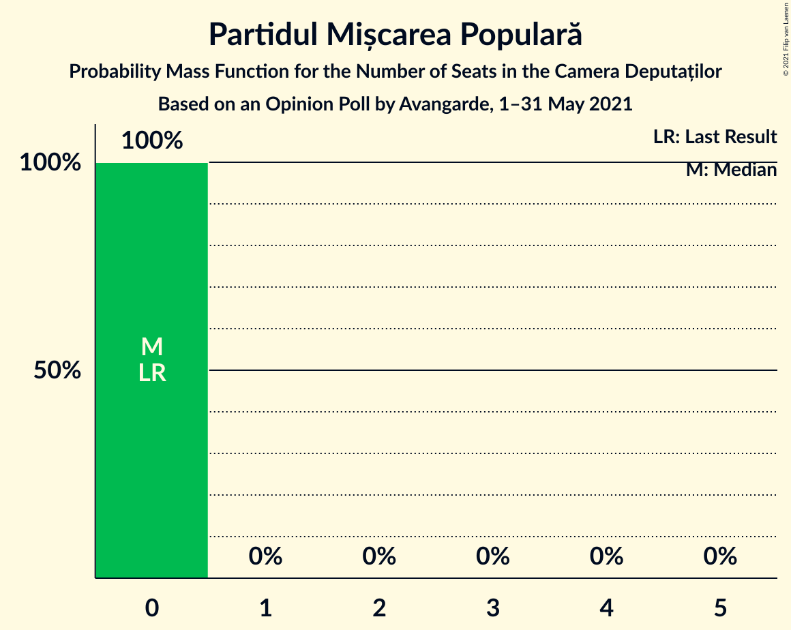

| Number of Seats | Probability | Accumulated | Special Marks |
|:---------------:|:-----------:|:-----------:|:-------------:|
| 0 | 100% | 100% | Last Result, Median |

### PRO România

*For a full overview of the results for this party, see the [PRO România](party-proromânia.html) page.*

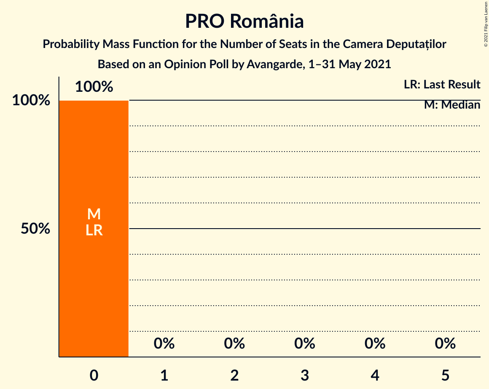

| Number of Seats | Probability | Accumulated | Special Marks |
|:---------------:|:-----------:|:-----------:|:-------------:|
| 0 | 100% | 100% | Last Result, Median |

### Partidul Puterii Umaniste (social-liberal)

*For a full overview of the results for this party, see the [Partidul Puterii Umaniste (social-liberal)](party-partidulputeriiumanistesocial-liberal.html) page.*

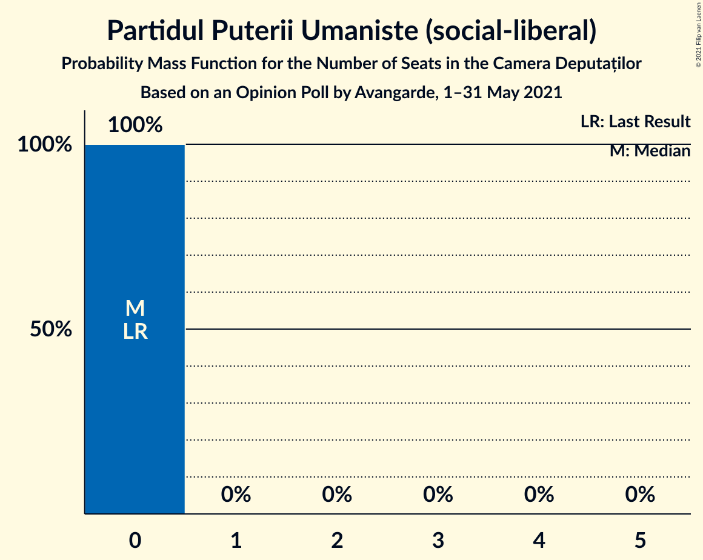

| Number of Seats | Probability | Accumulated | Special Marks |
|:---------------:|:-----------:|:-----------:|:-------------:|
| 0 | 100% | 100% | Last Result, Median |

## Coalitions

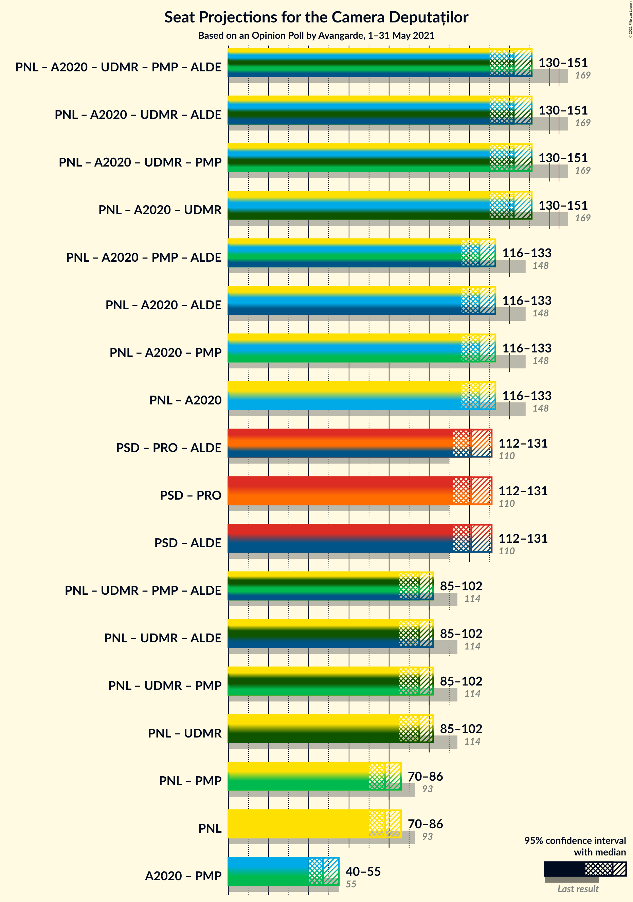

### Confidence Intervals

| Coalition | Last Result | Median | Majority? | 80% Confidence Interval | 90% Confidence Interval | 95% Confidence Interval | 99% Confidence Interval |
|:---------:|:-----------:|:------:|:---------:|:-----------------------:|:-----------------------:|:-----------------------:|:-----------------------:|
| Partidul Național Liberal – Alianța 2020 USR-PLUS – Uniunea Democrată Maghiară din România – Partidul Mișcarea Populară | 169 | 142 | 0% | 135–148 | 132–149 | 130–151 | 127–152 |
| Partidul Național Liberal – Alianța 2020 USR-PLUS – Uniunea Democrată Maghiară din România | 169 | 142 | 0% | 135–148 | 132–149 | 130–151 | 127–152 |
| Partidul Național Liberal – Alianța 2020 USR-PLUS – Partidul Mișcarea Populară | 148 | 125 | 0% | 119–130 | 117–133 | 116–133 | 112–135 |
| Partidul Național Liberal – Alianța 2020 USR-PLUS | 148 | 125 | 0% | 119–130 | 117–133 | 116–133 | 112–135 |
| Partidul Social Democrat – PRO România | 110 | 121 | 0% | 115–126 | 113–129 | 112–131 | 110–133 |
| Partidul Național Liberal – Uniunea Democrată Maghiară din România – Partidul Mișcarea Populară | 114 | 95 | 0% | 89–100 | 86–102 | 85–102 | 82–107 |
| Partidul Național Liberal – Uniunea Democrată Maghiară din România | 114 | 95 | 0% | 89–100 | 86–102 | 85–102 | 82–107 |
| Partidul Național Liberal – Partidul Mișcarea Populară | 93 | 78 | 0% | 73–84 | 70–85 | 70–86 | 66–89 |
| Partidul Național Liberal | 93 | 78 | 0% | 73–84 | 70–85 | 70–86 | 66–89 |
| Alianța 2020 USR-PLUS – Partidul Mișcarea Populară | 55 | 47 | 0% | 42–52 | 42–53 | 40–55 | 37–57 |

### Partidul Național Liberal – Alianța 2020 USR-PLUS – Uniunea Democrată Maghiară din România – Partidul Mișcarea Populară

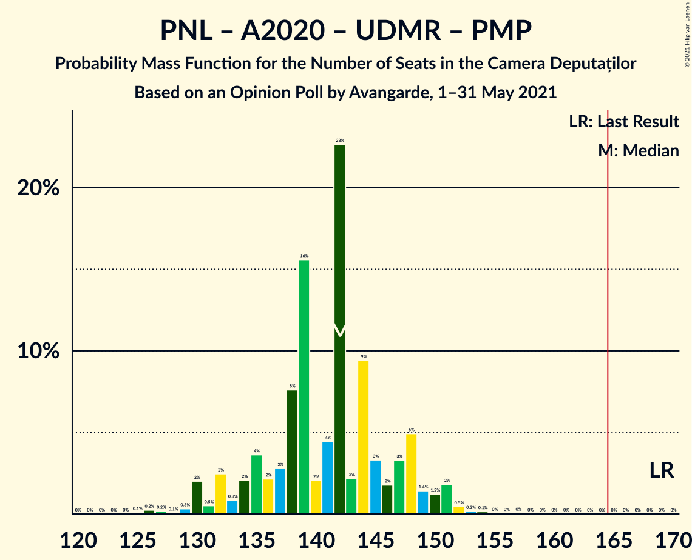

| Number of Seats | Probability | Accumulated | Special Marks |
|:---------------:|:-----------:|:-----------:|:-------------:|
| 125 | 0.1% | 100% |  |
| 126 | 0.2% | 99.9% |  |
| 127 | 0.2% | 99.7% |  |
| 128 | 0.1% | 99.5% |  |
| 129 | 0.3% | 99.4% |  |
| 130 | 2% | 99.1% |  |
| 131 | 0.5% | 97% |  |
| 132 | 2% | 97% |  |
| 133 | 0.8% | 94% |  |
| 134 | 2% | 93% |  |
| 135 | 4% | 91% |  |
| 136 | 2% | 88% |  |
| 137 | 3% | 85% |  |
| 138 | 8% | 83% |  |
| 139 | 16% | 75% |  |
| 140 | 2% | 59% |  |
| 141 | 4% | 57% | Median |
| 142 | 23% | 53% |  |
| 143 | 2% | 30% |  |
| 144 | 9% | 28% |  |
| 145 | 3% | 19% |  |
| 146 | 2% | 15% |  |
| 147 | 3% | 14% |  |
| 148 | 5% | 10% |  |
| 149 | 1.4% | 5% |  |
| 150 | 1.2% | 4% |  |
| 151 | 2% | 3% |  |
| 152 | 0.5% | 0.9% |  |
| 153 | 0.2% | 0.5% |  |
| 154 | 0.1% | 0.3% |  |
| 155 | 0% | 0.1% |  |
| 156 | 0% | 0.1% |  |
| 157 | 0% | 0.1% |  |
| 158 | 0% | 0% |  |
| 159 | 0% | 0% |  |
| 160 | 0% | 0% |  |
| 161 | 0% | 0% |  |
| 162 | 0% | 0% |  |
| 163 | 0% | 0% |  |
| 164 | 0% | 0% |  |
| 165 | 0% | 0% | Majority |
| 166 | 0% | 0% |  |
| 167 | 0% | 0% |  |
| 168 | 0% | 0% |  |
| 169 | 0% | 0% | Last Result |

### Partidul Național Liberal – Alianța 2020 USR-PLUS – Uniunea Democrată Maghiară din România

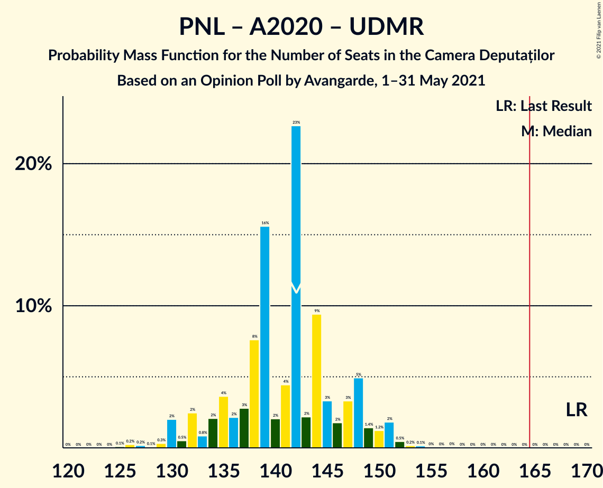

| Number of Seats | Probability | Accumulated | Special Marks |
|:---------------:|:-----------:|:-----------:|:-------------:|
| 125 | 0.1% | 100% |  |
| 126 | 0.2% | 99.9% |  |
| 127 | 0.2% | 99.7% |  |
| 128 | 0.1% | 99.5% |  |
| 129 | 0.3% | 99.4% |  |
| 130 | 2% | 99.1% |  |
| 131 | 0.5% | 97% |  |
| 132 | 2% | 97% |  |
| 133 | 0.8% | 94% |  |
| 134 | 2% | 93% |  |
| 135 | 4% | 91% |  |
| 136 | 2% | 88% |  |
| 137 | 3% | 85% |  |
| 138 | 8% | 83% |  |
| 139 | 16% | 75% |  |
| 140 | 2% | 59% |  |
| 141 | 4% | 57% | Median |
| 142 | 23% | 53% |  |
| 143 | 2% | 30% |  |
| 144 | 9% | 28% |  |
| 145 | 3% | 19% |  |
| 146 | 2% | 15% |  |
| 147 | 3% | 14% |  |
| 148 | 5% | 10% |  |
| 149 | 1.4% | 5% |  |
| 150 | 1.2% | 4% |  |
| 151 | 2% | 3% |  |
| 152 | 0.5% | 0.9% |  |
| 153 | 0.2% | 0.5% |  |
| 154 | 0.1% | 0.3% |  |
| 155 | 0% | 0.1% |  |
| 156 | 0% | 0.1% |  |
| 157 | 0% | 0.1% |  |
| 158 | 0% | 0% |  |
| 159 | 0% | 0% |  |
| 160 | 0% | 0% |  |
| 161 | 0% | 0% |  |
| 162 | 0% | 0% |  |
| 163 | 0% | 0% |  |
| 164 | 0% | 0% |  |
| 165 | 0% | 0% | Majority |
| 166 | 0% | 0% |  |
| 167 | 0% | 0% |  |
| 168 | 0% | 0% |  |
| 169 | 0% | 0% | Last Result |

### Partidul Național Liberal – Alianța 2020 USR-PLUS – Partidul Mișcarea Populară

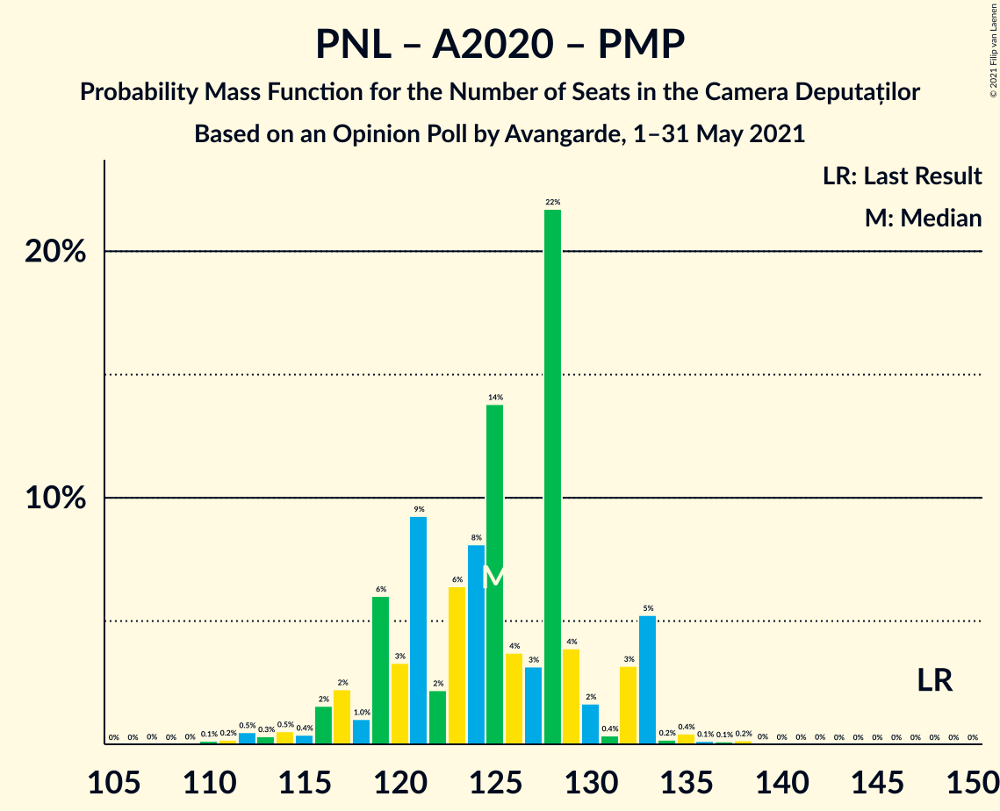

| Number of Seats | Probability | Accumulated | Special Marks |
|:---------------:|:-----------:|:-----------:|:-------------:|
| 109 | 0% | 100% |  |
| 110 | 0.1% | 99.9% |  |
| 111 | 0.2% | 99.8% |  |
| 112 | 0.5% | 99.6% |  |
| 113 | 0.3% | 99.1% |  |
| 114 | 0.5% | 98.8% |  |
| 115 | 0.4% | 98% |  |
| 116 | 2% | 98% |  |
| 117 | 2% | 96% |  |
| 118 | 1.0% | 94% |  |
| 119 | 6% | 93% |  |
| 120 | 3% | 87% |  |
| 121 | 9% | 84% |  |
| 122 | 2% | 75% |  |
| 123 | 6% | 72% |  |
| 124 | 8% | 66% |  |
| 125 | 14% | 58% | Median |
| 126 | 4% | 44% |  |
| 127 | 3% | 40% |  |
| 128 | 22% | 37% |  |
| 129 | 4% | 15% |  |
| 130 | 2% | 12% |  |
| 131 | 0.4% | 10% |  |
| 132 | 3% | 10% |  |
| 133 | 5% | 6% |  |
| 134 | 0.2% | 1.1% |  |
| 135 | 0.4% | 0.9% |  |
| 136 | 0.1% | 0.5% |  |
| 137 | 0.1% | 0.3% |  |
| 138 | 0.2% | 0.2% |  |
| 139 | 0% | 0.1% |  |
| 140 | 0% | 0% |  |
| 141 | 0% | 0% |  |
| 142 | 0% | 0% |  |
| 143 | 0% | 0% |  |
| 144 | 0% | 0% |  |
| 145 | 0% | 0% |  |
| 146 | 0% | 0% |  |
| 147 | 0% | 0% |  |
| 148 | 0% | 0% | Last Result |

### Partidul Național Liberal – Alianța 2020 USR-PLUS

| Number of Seats | Probability | Accumulated | Special Marks |
|:---------------:|:-----------:|:-----------:|:-------------:|
| 109 | 0% | 100% |  |
| 110 | 0.1% | 99.9% |  |
| 111 | 0.2% | 99.8% |  |
| 112 | 0.5% | 99.6% |  |
| 113 | 0.3% | 99.1% |  |
| 114 | 0.5% | 98.8% |  |
| 115 | 0.4% | 98% |  |
| 116 | 2% | 98% |  |
| 117 | 2% | 96% |  |
| 118 | 1.0% | 94% |  |
| 119 | 6% | 93% |  |
| 120 | 3% | 87% |  |
| 121 | 9% | 84% |  |
| 122 | 2% | 75% |  |
| 123 | 6% | 72% |  |
| 124 | 8% | 66% |  |
| 125 | 14% | 58% | Median |
| 126 | 4% | 44% |  |
| 127 | 3% | 40% |  |
| 128 | 22% | 37% |  |
| 129 | 4% | 15% |  |
| 130 | 2% | 12% |  |
| 131 | 0.4% | 10% |  |
| 132 | 3% | 10% |  |
| 133 | 5% | 6% |  |
| 134 | 0.2% | 1.1% |  |
| 135 | 0.4% | 0.9% |  |
| 136 | 0.1% | 0.5% |  |
| 137 | 0.1% | 0.3% |  |
| 138 | 0.2% | 0.2% |  |
| 139 | 0% | 0.1% |  |
| 140 | 0% | 0% |  |
| 141 | 0% | 0% |  |
| 142 | 0% | 0% |  |
| 143 | 0% | 0% |  |
| 144 | 0% | 0% |  |
| 145 | 0% | 0% |  |
| 146 | 0% | 0% |  |
| 147 | 0% | 0% |  |
| 148 | 0% | 0% | Last Result |

### Partidul Social Democrat – PRO România

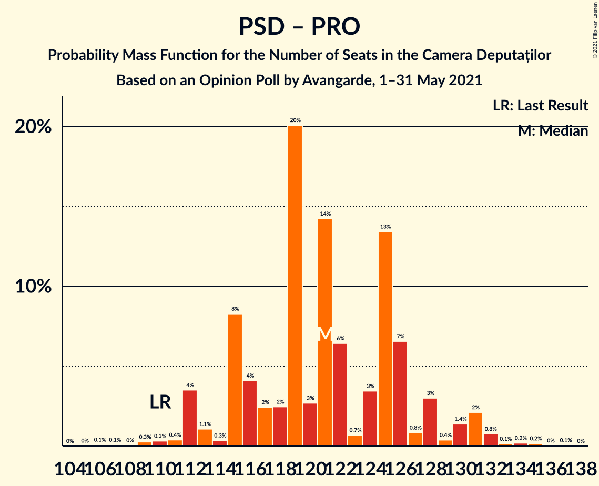

| Number of Seats | Probability | Accumulated | Special Marks |
|:---------------:|:-----------:|:-----------:|:-------------:|
| 106 | 0.1% | 100% |  |
| 107 | 0.1% | 99.9% |  |
| 108 | 0% | 99.8% |  |
| 109 | 0.3% | 99.8% |  |
| 110 | 0.3% | 99.5% | Last Result |
| 111 | 0.4% | 99.2% |  |
| 112 | 4% | 98.8% |  |
| 113 | 1.1% | 95% |  |
| 114 | 0.3% | 94% |  |
| 115 | 8% | 94% |  |
| 116 | 4% | 86% |  |
| 117 | 2% | 82% |  |
| 118 | 2% | 79% |  |
| 119 | 20% | 77% |  |
| 120 | 3% | 57% |  |
| 121 | 14% | 54% | Median |
| 122 | 6% | 40% |  |
| 123 | 0.7% | 33% |  |
| 124 | 3% | 32% |  |
| 125 | 13% | 29% |  |
| 126 | 7% | 16% |  |
| 127 | 0.8% | 9% |  |
| 128 | 3% | 8% |  |
| 129 | 0.4% | 5% |  |
| 130 | 1.4% | 5% |  |
| 131 | 2% | 3% |  |
| 132 | 0.8% | 1.4% |  |
| 133 | 0.1% | 0.6% |  |
| 134 | 0.2% | 0.5% |  |
| 135 | 0.2% | 0.3% |  |
| 136 | 0% | 0.1% |  |
| 137 | 0.1% | 0.1% |  |
| 138 | 0% | 0% |  |

### Partidul Național Liberal – Uniunea Democrată Maghiară din România – Partidul Mișcarea Populară

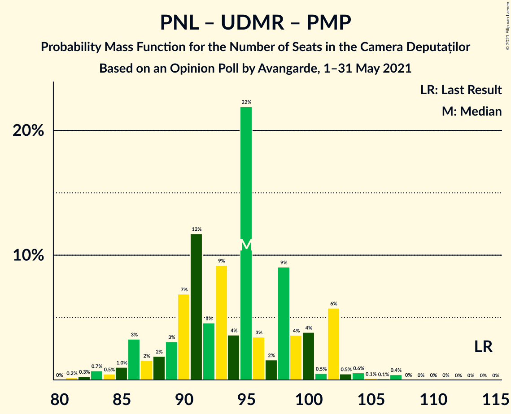

| Number of Seats | Probability | Accumulated | Special Marks |
|:---------------:|:-----------:|:-----------:|:-------------:|
| 80 | 0% | 100% |  |
| 81 | 0.2% | 99.9% |  |
| 82 | 0.3% | 99.8% |  |
| 83 | 0.7% | 99.5% |  |
| 84 | 0.5% | 98.7% |  |
| 85 | 1.0% | 98% |  |
| 86 | 3% | 97% |  |
| 87 | 2% | 94% |  |
| 88 | 2% | 92% |  |
| 89 | 3% | 91% |  |
| 90 | 7% | 87% |  |
| 91 | 12% | 81% |  |
| 92 | 5% | 69% |  |
| 93 | 9% | 64% |  |
| 94 | 4% | 55% | Median |
| 95 | 22% | 51% |  |
| 96 | 3% | 30% |  |
| 97 | 2% | 26% |  |
| 98 | 9% | 25% |  |
| 99 | 4% | 15% |  |
| 100 | 4% | 12% |  |
| 101 | 0.5% | 8% |  |
| 102 | 6% | 8% |  |
| 103 | 0.5% | 2% |  |
| 104 | 0.6% | 1.3% |  |
| 105 | 0.1% | 0.7% |  |
| 106 | 0.1% | 0.6% |  |
| 107 | 0.4% | 0.5% |  |
| 108 | 0% | 0.1% |  |
| 109 | 0% | 0.1% |  |
| 110 | 0% | 0% |  |
| 111 | 0% | 0% |  |
| 112 | 0% | 0% |  |
| 113 | 0% | 0% |  |
| 114 | 0% | 0% | Last Result |

### Partidul Național Liberal – Uniunea Democrată Maghiară din România

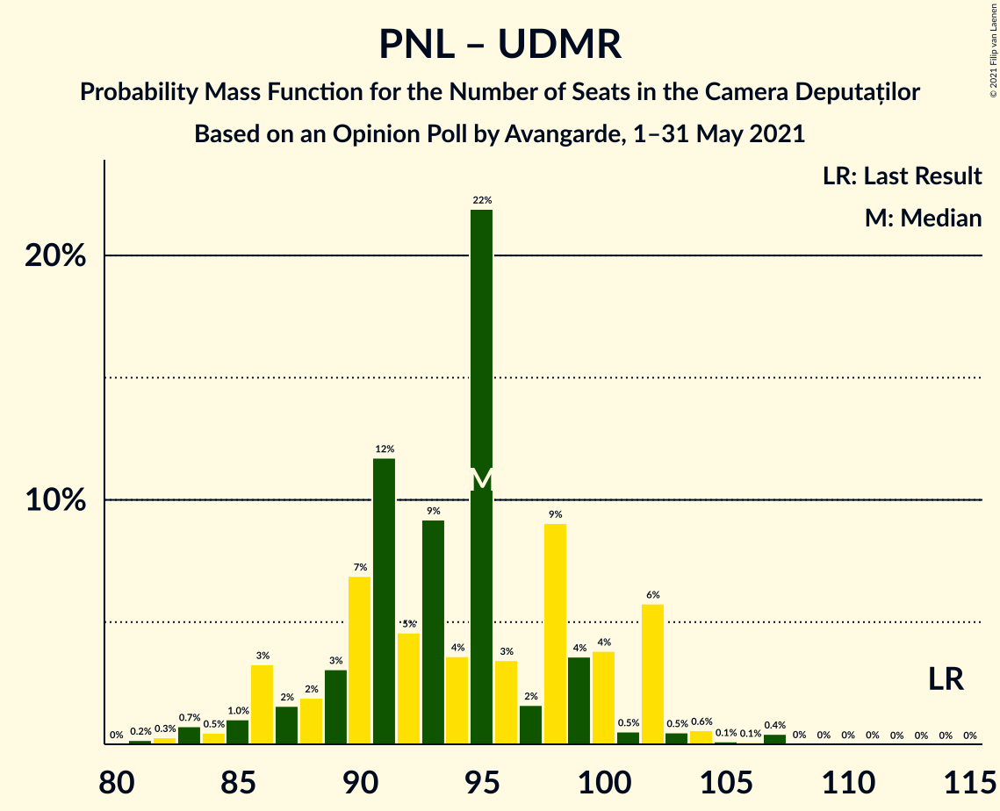

| Number of Seats | Probability | Accumulated | Special Marks |
|:---------------:|:-----------:|:-----------:|:-------------:|
| 80 | 0% | 100% |  |
| 81 | 0.2% | 99.9% |  |
| 82 | 0.3% | 99.8% |  |
| 83 | 0.7% | 99.5% |  |
| 84 | 0.5% | 98.7% |  |
| 85 | 1.0% | 98% |  |
| 86 | 3% | 97% |  |
| 87 | 2% | 94% |  |
| 88 | 2% | 92% |  |
| 89 | 3% | 91% |  |
| 90 | 7% | 87% |  |
| 91 | 12% | 81% |  |
| 92 | 5% | 69% |  |
| 93 | 9% | 64% |  |
| 94 | 4% | 55% | Median |
| 95 | 22% | 51% |  |
| 96 | 3% | 30% |  |
| 97 | 2% | 26% |  |
| 98 | 9% | 25% |  |
| 99 | 4% | 15% |  |
| 100 | 4% | 12% |  |
| 101 | 0.5% | 8% |  |
| 102 | 6% | 8% |  |
| 103 | 0.5% | 2% |  |
| 104 | 0.6% | 1.3% |  |
| 105 | 0.1% | 0.7% |  |
| 106 | 0.1% | 0.6% |  |
| 107 | 0.4% | 0.5% |  |
| 108 | 0% | 0.1% |  |
| 109 | 0% | 0.1% |  |
| 110 | 0% | 0% |  |
| 111 | 0% | 0% |  |
| 112 | 0% | 0% |  |
| 113 | 0% | 0% |  |
| 114 | 0% | 0% | Last Result |

### Partidul Național Liberal – Partidul Mișcarea Populară

| Number of Seats | Probability | Accumulated | Special Marks |
|:---------------:|:-----------:|:-----------:|:-------------:|
| 64 | 0% | 100% |  |
| 65 | 0% | 99.9% |  |
| 66 | 0.5% | 99.9% |  |
| 67 | 0.3% | 99.4% |  |
| 68 | 0.3% | 99.1% |  |
| 69 | 1.0% | 98.8% |  |
| 70 | 3% | 98% |  |
| 71 | 0.9% | 95% |  |
| 72 | 2% | 94% |  |
| 73 | 8% | 92% |  |
| 74 | 3% | 84% |  |
| 75 | 11% | 81% |  |
| 76 | 5% | 71% |  |
| 77 | 14% | 66% |  |
| 78 | 8% | 52% | Median |
| 79 | 3% | 44% |  |
| 80 | 6% | 41% |  |
| 81 | 20% | 36% |  |
| 82 | 4% | 15% |  |
| 83 | 1.0% | 11% |  |
| 84 | 3% | 10% |  |
| 85 | 2% | 7% |  |
| 86 | 3% | 4% |  |
| 87 | 0.2% | 1.0% |  |
| 88 | 0.2% | 0.8% |  |
| 89 | 0.4% | 0.5% |  |
| 90 | 0.1% | 0.1% |  |
| 91 | 0% | 0.1% |  |
| 92 | 0% | 0% |  |
| 93 | 0% | 0% | Last Result |

### Partidul Național Liberal

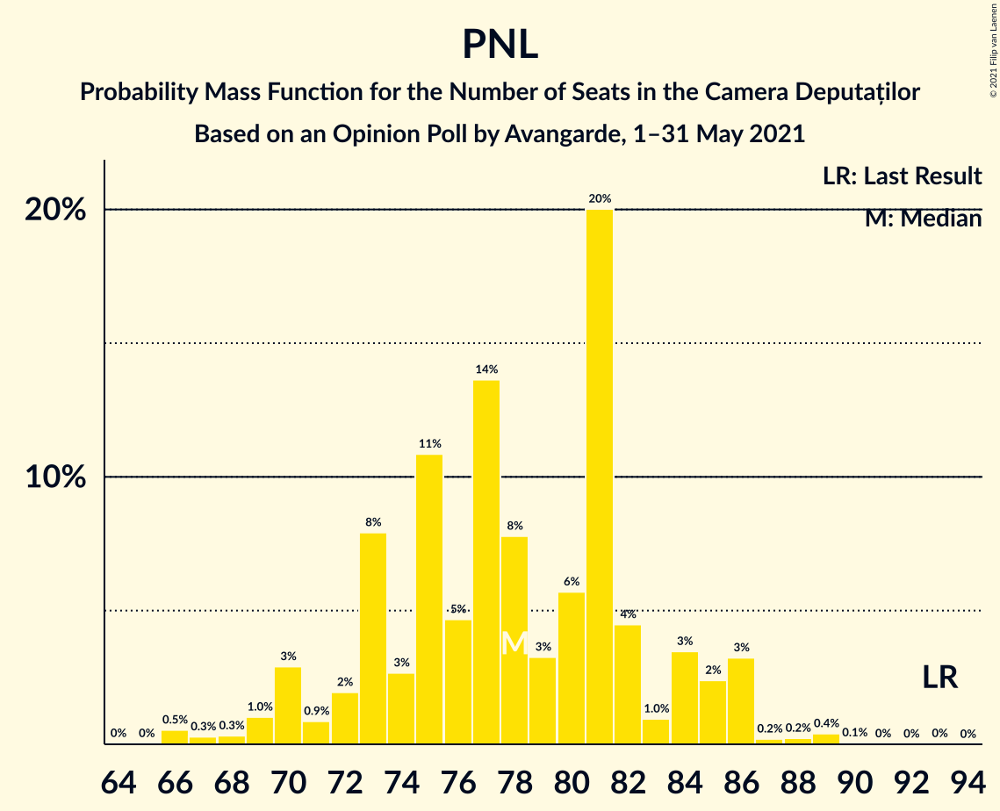

| Number of Seats | Probability | Accumulated | Special Marks |
|:---------------:|:-----------:|:-----------:|:-------------:|
| 64 | 0% | 100% |  |
| 65 | 0% | 99.9% |  |
| 66 | 0.5% | 99.9% |  |
| 67 | 0.3% | 99.4% |  |
| 68 | 0.3% | 99.1% |  |
| 69 | 1.0% | 98.8% |  |
| 70 | 3% | 98% |  |
| 71 | 0.9% | 95% |  |
| 72 | 2% | 94% |  |
| 73 | 8% | 92% |  |
| 74 | 3% | 84% |  |
| 75 | 11% | 81% |  |
| 76 | 5% | 71% |  |
| 77 | 14% | 66% |  |
| 78 | 8% | 52% | Median |
| 79 | 3% | 44% |  |
| 80 | 6% | 41% |  |
| 81 | 20% | 36% |  |
| 82 | 4% | 15% |  |
| 83 | 1.0% | 11% |  |
| 84 | 3% | 10% |  |
| 85 | 2% | 7% |  |
| 86 | 3% | 4% |  |
| 87 | 0.2% | 1.0% |  |
| 88 | 0.2% | 0.8% |  |
| 89 | 0.4% | 0.5% |  |
| 90 | 0.1% | 0.1% |  |
| 91 | 0% | 0.1% |  |
| 92 | 0% | 0% |  |
| 93 | 0% | 0% | Last Result |

### Alianța 2020 USR-PLUS – Partidul Mișcarea Populară

| Number of Seats | Probability | Accumulated | Special Marks |
|:---------------:|:-----------:|:-----------:|:-------------:|
| 36 | 0.2% | 100% |  |
| 37 | 0.3% | 99.8% |  |
| 38 | 0.2% | 99.5% |  |
| 39 | 0.6% | 99.3% |  |
| 40 | 1.3% | 98.7% |  |
| 41 | 1.2% | 97% |  |
| 42 | 9% | 96% |  |
| 43 | 6% | 87% |  |
| 44 | 4% | 82% |  |
| 45 | 4% | 78% |  |
| 46 | 15% | 74% |  |
| 47 | 22% | 58% | Median |
| 48 | 12% | 36% |  |
| 49 | 4% | 24% |  |
| 50 | 4% | 20% |  |
| 51 | 4% | 16% |  |
| 52 | 6% | 12% |  |
| 53 | 2% | 6% |  |
| 54 | 1.4% | 4% |  |
| 55 | 0.4% | 3% | Last Result |
| 56 | 0.6% | 2% |  |
| 57 | 1.5% | 2% |  |
| 58 | 0.3% | 0.4% |  |
| 59 | 0% | 0.1% |  |
| 60 | 0% | 0% |  |

## Technical Information

### Opinion Poll

+ **Polling firm:** Avangarde
+ **Commissioner(s):** —
+ **Fieldwork period:** 1–31 May 2021

### Calculations

+ **Sample size:** 1100
+ **Simulations done:** 131,072
+ **Error estimate:** 1.89%

