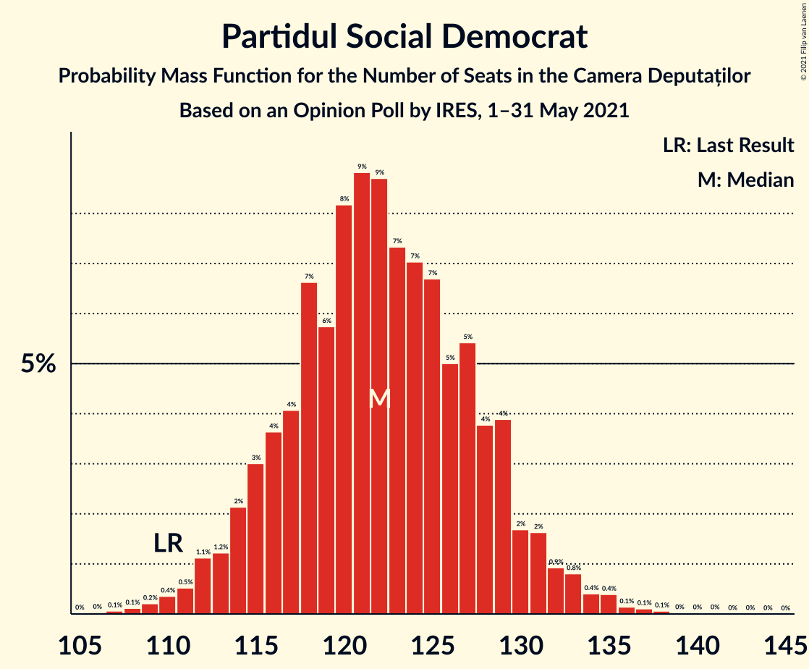
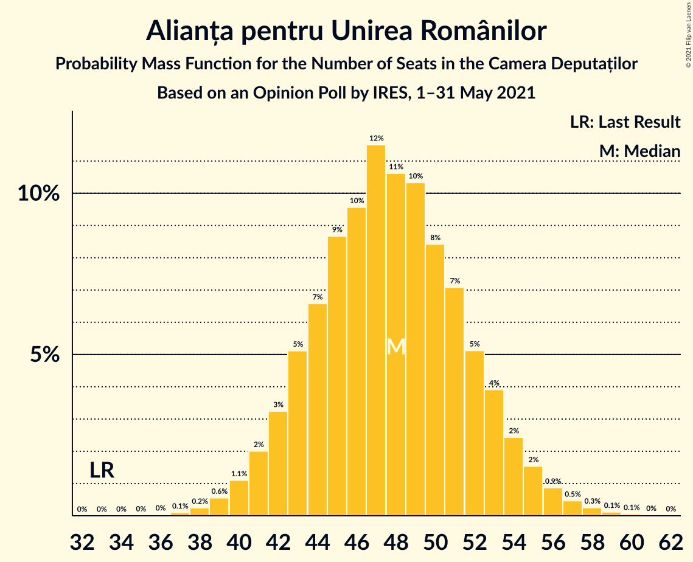
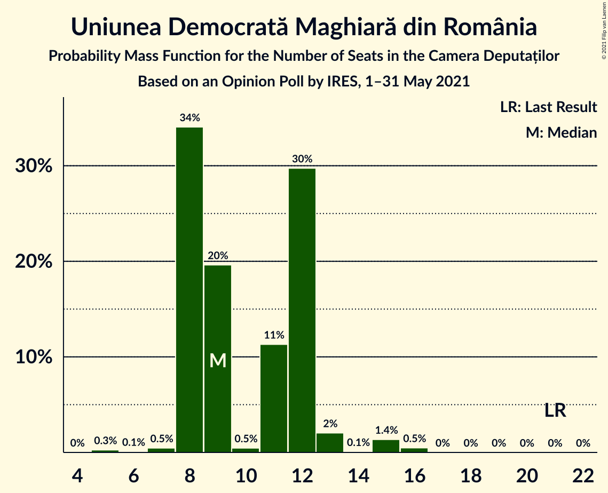
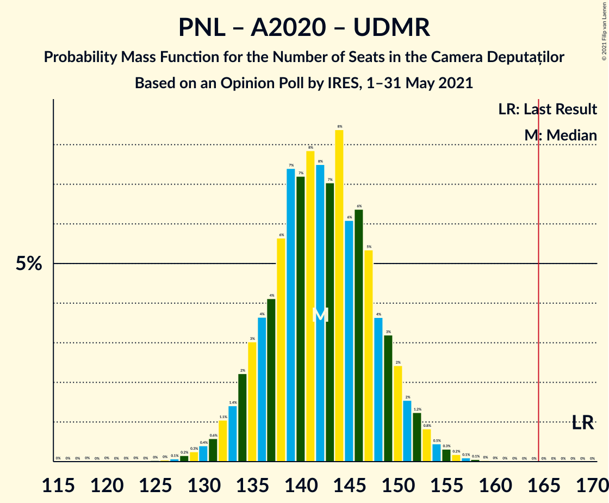

# Opinion Poll by IRES, 1–31 May 2021

<a href="#voting-intentions">Voting Intentions</a> | <a href="#seats">Seats</a> | <a href="#coalitions">Coalitions</a> | <a href="#technical-information">Technical Information</a>

## Voting Intentions

### Confidence Intervals

| Party | Last Result | Poll Result | 80% Confidence Interval | 90% Confidence Interval | 95% Confidence Interval | 99% Confidence Interval |
|:-----:|:-----------:|:-----------:|:-----------------------:|:-----------------------:|:-----------------------:|:-----------------------:|
| Partidul Social Democrat | 28.9% | 34.9% | 33.1–36.8% |32.6–37.3% |32.1–37.8% |31.3–38.7% |
| Partidul Național Liberal | 25.2% | 27.2% | 25.5–29.0% |25.0–29.5% |24.6–29.9% |23.8–30.8% |
| Alianța pentru Unirea Românilor | 9.1% | 13.6% | 12.4–15.0% |12.0–15.5% |11.7–15.8% |11.2–16.5% |
| Alianța 2020 USR-PLUS | 15.4% | 10.6% | 9.5–11.9% |9.2–12.3% |8.9–12.6% |8.4–13.2% |
| Uniunea Democrată Maghiară din România | 5.7% | 2.9% | 2.3–3.7% |2.2–3.9% |2.1–4.1% |1.8–4.5% |
| PRO România | 4.1% | 2.9% | 2.3–3.7% |2.2–3.9% |2.1–4.1% |1.8–4.5% |

*Note:* The poll result column reflects the actual value used in the calculations. Published results may vary slightly, and in addition be rounded to fewer digits.

## Seats

### Confidence Intervals

| Party | Last Result | Median | 80% Confidence Interval | 90% Confidence Interval | 95% Confidence Interval | 99% Confidence Interval |
|:-----:|:-----------:|:------:|:-----------------------:|:-----------------------:|:-----------------------:|:-----------------------:|
| <a href="#partidul-social-democrat">Partidul Social Democrat</a> | 110 | 121 | 115–128 |114–129 |113–131 |109–135 |
| <a href="#partidul-național-liberal">Partidul Național Liberal</a> | 93 | 96 | 89–101 |88–103 |87–105 |84–108 |
| <a href="#alianța-pentru-unirea-românilor">Alianța pentru Unirea Românilor</a> | 33 | 48 | 44–53 |42–54 |41–55 |39–58 |
| <a href="#alianța-2020-usr-plus">Alianța 2020 USR-PLUS</a> | 55 | 37 | 33–41 |31–43 |31–43 |29–46 |
| <a href="#uniunea-democrată-maghiară-din-românia">Uniunea Democrată Maghiară din România</a> | 21 | 11 | 8–12 |8–12 |8–13 |7–16 |
| <a href="#pro-românia">PRO România</a> | 0 | 0 | 0 |0 |0 |0 |

### Partidul Social Democrat

*For a full overview of the results for this party, see the [Partidul Social Democrat](party-partidulsocialdemocrat.html) page.*

| Number of Seats | Probability | Accumulated | Special Marks |
|:---------------:|:-----------:|:-----------:|:-------------:|
| 106 | 0.1% | 100% |  |
| 107 | 0.1% | 99.9% |  |
| 108 | 0.1% | 99.8% |  |
| 109 | 0.3% | 99.7% |  |
| 110 | 0.4% | 99.4% | Last Result |
| 111 | 0.3% | 99.0% |  |
| 112 | 1.1% | 98.7% |  |
| 113 | 2% | 98% |  |
| 114 | 3% | 95% |  |
| 115 | 6% | 92% |  |
| 116 | 6% | 86% |  |
| 117 | 4% | 81% |  |
| 118 | 3% | 77% |  |
| 119 | 2% | 74% |  |
| 120 | 11% | 72% |  |
| 121 | 13% | 61% | Median |
| 122 | 16% | 48% |  |
| 123 | 8% | 32% |  |
| 124 | 6% | 23% |  |
| 125 | 0.9% | 17% |  |
| 126 | 0.5% | 16% |  |
| 127 | 2% | 16% |  |
| 128 | 6% | 14% |  |
| 129 | 3% | 8% |  |
| 130 | 2% | 5% |  |
| 131 | 1.3% | 3% |  |
| 132 | 0.5% | 1.3% |  |
| 133 | 0.1% | 0.8% |  |
| 134 | 0.1% | 0.7% |  |
| 135 | 0.2% | 0.7% |  |
| 136 | 0.2% | 0.5% |  |
| 137 | 0.1% | 0.3% |  |
| 138 | 0.1% | 0.2% |  |
| 139 | 0.1% | 0.1% |  |
| 140 | 0% | 0% |  |

### Partidul Național Liberal

*For a full overview of the results for this party, see the [Partidul Național Liberal](party-partidulnaționalliberal.html) page.*

| Number of Seats | Probability | Accumulated | Special Marks |
|:---------------:|:-----------:|:-----------:|:-------------:|
| 81 | 0% | 100% |  |
| 82 | 0.1% | 99.9% |  |
| 83 | 0.2% | 99.8% |  |
| 84 | 0.3% | 99.6% |  |
| 85 | 0.7% | 99.3% |  |
| 86 | 0.9% | 98.6% |  |
| 87 | 1.5% | 98% |  |
| 88 | 3% | 96% |  |
| 89 | 4% | 94% |  |
| 90 | 3% | 89% |  |
| 91 | 6% | 87% |  |
| 92 | 6% | 81% |  |
| 93 | 7% | 75% | Last Result |
| 94 | 8% | 68% |  |
| 95 | 10% | 60% |  |
| 96 | 7% | 51% | Median |
| 97 | 11% | 43% |  |
| 98 | 5% | 32% |  |
| 99 | 9% | 27% |  |
| 100 | 3% | 17% |  |
| 101 | 6% | 15% |  |
| 102 | 2% | 9% |  |
| 103 | 2% | 7% |  |
| 104 | 1.2% | 4% |  |
| 105 | 2% | 3% |  |
| 106 | 0.5% | 2% |  |
| 107 | 0.7% | 1.2% |  |
| 108 | 0.1% | 0.5% |  |
| 109 | 0.3% | 0.4% |  |
| 110 | 0.1% | 0.2% |  |
| 111 | 0% | 0.1% |  |
| 112 | 0% | 0% |  |

### Alianța pentru Unirea Românilor

*For a full overview of the results for this party, see the [Alianța pentru Unirea Românilor](party-alianțapentruunirearomânilor.html) page.*

| Number of Seats | Probability | Accumulated | Special Marks |
|:---------------:|:-----------:|:-----------:|:-------------:|
| 33 | 0% | 100% | Last Result |
| 34 | 0% | 100% |  |
| 35 | 0% | 100% |  |
| 36 | 0% | 100% |  |
| 37 | 0.1% | 99.9% |  |
| 38 | 0.2% | 99.8% |  |
| 39 | 0.5% | 99.6% |  |
| 40 | 0.7% | 99.1% |  |
| 41 | 1.4% | 98% |  |
| 42 | 2% | 97% |  |
| 43 | 4% | 95% |  |
| 44 | 5% | 91% |  |
| 45 | 5% | 86% |  |
| 46 | 12% | 81% |  |
| 47 | 8% | 69% |  |
| 48 | 13% | 61% | Median |
| 49 | 11% | 47% |  |
| 50 | 9% | 37% |  |
| 51 | 9% | 28% |  |
| 52 | 7% | 19% |  |
| 53 | 5% | 13% |  |
| 54 | 3% | 7% |  |
| 55 | 2% | 5% |  |
| 56 | 1.1% | 2% |  |
| 57 | 0.5% | 1.3% |  |
| 58 | 0.4% | 0.7% |  |
| 59 | 0.2% | 0.3% |  |
| 60 | 0.1% | 0.1% |  |
| 61 | 0% | 0.1% |  |
| 62 | 0% | 0% |  |

### Alianța 2020 USR-PLUS

*For a full overview of the results for this party, see the [Alianța 2020 USR-PLUS](party-alianța2020usr-plus.html) page.*

| Number of Seats | Probability | Accumulated | Special Marks |
|:---------------:|:-----------:|:-----------:|:-------------:|
| 0 | 0.1% | 100% |  |
| 1 | 0% | 99.9% |  |
| 2 | 0% | 99.9% |  |
| 3 | 0% | 99.9% |  |
| 4 | 0% | 99.9% |  |
| 5 | 0% | 99.9% |  |
| 6 | 0% | 99.9% |  |
| 7 | 0% | 99.9% |  |
| 8 | 0% | 99.9% |  |
| 9 | 0% | 99.9% |  |
| 10 | 0% | 99.9% |  |
| 11 | 0% | 99.9% |  |
| 12 | 0% | 99.9% |  |
| 13 | 0% | 99.9% |  |
| 14 | 0% | 99.9% |  |
| 15 | 0% | 99.9% |  |
| 16 | 0% | 99.9% |  |
| 17 | 0% | 99.9% |  |
| 18 | 0% | 99.9% |  |
| 19 | 0% | 99.9% |  |
| 20 | 0% | 99.9% |  |
| 21 | 0% | 99.9% |  |
| 22 | 0% | 99.9% |  |
| 23 | 0% | 99.9% |  |
| 24 | 0% | 99.9% |  |
| 25 | 0% | 99.9% |  |
| 26 | 0% | 99.9% |  |
| 27 | 0% | 99.9% |  |
| 28 | 0.1% | 99.9% |  |
| 29 | 0.4% | 99.8% |  |
| 30 | 1.3% | 99.4% |  |
| 31 | 3% | 98% |  |
| 32 | 2% | 95% |  |
| 33 | 7% | 93% |  |
| 34 | 11% | 85% |  |
| 35 | 14% | 74% |  |
| 36 | 8% | 60% |  |
| 37 | 9% | 52% | Median |
| 38 | 14% | 43% |  |
| 39 | 15% | 29% |  |
| 40 | 4% | 15% |  |
| 41 | 2% | 11% |  |
| 42 | 3% | 9% |  |
| 43 | 4% | 6% |  |
| 44 | 0.7% | 2% |  |
| 45 | 0.3% | 1.0% |  |
| 46 | 0.4% | 0.7% |  |
| 47 | 0.2% | 0.4% |  |
| 48 | 0.1% | 0.1% |  |
| 49 | 0% | 0% |  |
| 50 | 0% | 0% |  |
| 51 | 0% | 0% |  |
| 52 | 0% | 0% |  |
| 53 | 0% | 0% |  |
| 54 | 0% | 0% |  |
| 55 | 0% | 0% | Last Result |

### Uniunea Democrată Maghiară din România

*For a full overview of the results for this party, see the [Uniunea Democrată Maghiară din România](party-uniuneademocratămaghiarădinromânia.html) page.*

| Number of Seats | Probability | Accumulated | Special Marks |
|:---------------:|:-----------:|:-----------:|:-------------:|
| 5 | 0.3% | 100% |  |
| 6 | 0.1% | 99.7% |  |
| 7 | 0.6% | 99.6% |  |
| 8 | 30% | 99.0% |  |
| 9 | 18% | 69% |  |
| 10 | 0.7% | 51% |  |
| 11 | 14% | 51% | Median |
| 12 | 33% | 37% |  |
| 13 | 2% | 4% |  |
| 14 | 0% | 2% |  |
| 15 | 1.4% | 2% |  |
| 16 | 0.6% | 0.6% |  |
| 17 | 0% | 0% |  |
| 18 | 0% | 0% |  |
| 19 | 0% | 0% |  |
| 20 | 0% | 0% |  |
| 21 | 0% | 0% | Last Result |

### PRO România

*For a full overview of the results for this party, see the [PRO România](party-proromânia.html) page.*

| Number of Seats | Probability | Accumulated | Special Marks |
|:---------------:|:-----------:|:-----------:|:-------------:|
| 0 | 99.9% | 100% | Last Result, Median |
| 1 | 0% | 0.1% |  |
| 2 | 0% | 0.1% |  |
| 3 | 0% | 0.1% |  |
| 4 | 0% | 0.1% |  |
| 5 | 0% | 0.1% |  |
| 6 | 0% | 0.1% |  |
| 7 | 0% | 0.1% |  |
| 8 | 0% | 0.1% |  |
| 9 | 0% | 0.1% |  |
| 10 | 0% | 0.1% |  |
| 11 | 0% | 0.1% |  |
| 12 | 0% | 0.1% |  |
| 13 | 0% | 0.1% |  |
| 14 | 0% | 0.1% |  |
| 15 | 0% | 0.1% |  |
| 16 | 0% | 0.1% |  |
| 17 | 0% | 0% |  |

## Coalitions

### Confidence Intervals

| Coalition | Last Result | Median | Majority? | 80% Confidence Interval | 90% Confidence Interval | 95% Confidence Interval | 99% Confidence Interval |
|:---------:|:-----------:|:------:|:---------:|:-----------------------:|:-----------------------:|:-----------------------:|:-----------------------:|
| Partidul Național Liberal – Alianța 2020 USR-PLUS – Uniunea Democrată Maghiară din România | 169 | 142 | 0% | 136–149 | 134–151 | 132–153 | 129–155 |
| Partidul Național Liberal – Alianța 2020 USR-PLUS | 148 | 132 | 0% | 126–138 | 124–140 | 123–142 | 119–145 |
| Partidul Social Democrat – PRO România | 110 | 121 | 0% | 115–128 | 114–129 | 113–131 | 109–136 |
| Partidul Național Liberal – Uniunea Democrată Maghiară din România | 114 | 105 | 0% | 100–112 | 98–113 | 97–115 | 94–118 |
| Partidul Național Liberal | 93 | 96 | 0% | 89–101 | 88–103 | 87–105 | 84–108 |

### Partidul Național Liberal – Alianța 2020 USR-PLUS – Uniunea Democrată Maghiară din România

| Number of Seats | Probability | Accumulated | Special Marks |
|:---------------:|:-----------:|:-----------:|:-------------:|
| 120 | 0% | 100% |  |
| 121 | 0% | 99.9% |  |
| 122 | 0% | 99.9% |  |
| 123 | 0% | 99.9% |  |
| 124 | 0% | 99.9% |  |
| 125 | 0% | 99.9% |  |
| 126 | 0% | 99.9% |  |
| 127 | 0.1% | 99.9% |  |
| 128 | 0.1% | 99.8% |  |
| 129 | 0.4% | 99.7% |  |
| 130 | 0.3% | 99.3% |  |
| 131 | 0.3% | 99.0% |  |
| 132 | 1.3% | 98.7% |  |
| 133 | 0.9% | 97% |  |
| 134 | 2% | 97% |  |
| 135 | 3% | 94% |  |
| 136 | 3% | 91% |  |
| 137 | 4% | 88% |  |
| 138 | 5% | 83% |  |
| 139 | 8% | 78% |  |
| 140 | 3% | 71% |  |
| 141 | 10% | 67% |  |
| 142 | 9% | 58% |  |
| 143 | 5% | 49% |  |
| 144 | 12% | 45% | Median |
| 145 | 4% | 33% |  |
| 146 | 8% | 29% |  |
| 147 | 6% | 21% |  |
| 148 | 4% | 15% |  |
| 149 | 3% | 11% |  |
| 150 | 3% | 8% |  |
| 151 | 2% | 5% |  |
| 152 | 0.6% | 3% |  |
| 153 | 1.4% | 3% |  |
| 154 | 0.3% | 1.2% |  |
| 155 | 0.4% | 0.8% |  |
| 156 | 0.2% | 0.4% |  |
| 157 | 0.1% | 0.2% |  |
| 158 | 0.1% | 0.1% |  |
| 159 | 0% | 0.1% |  |
| 160 | 0% | 0% |  |
| 161 | 0% | 0% |  |
| 162 | 0% | 0% |  |
| 163 | 0% | 0% |  |
| 164 | 0% | 0% |  |
| 165 | 0% | 0% | Majority |
| 166 | 0% | 0% |  |
| 167 | 0% | 0% |  |
| 168 | 0% | 0% |  |
| 169 | 0% | 0% | Last Result |

### Partidul Național Liberal – Alianța 2020 USR-PLUS

| Number of Seats | Probability | Accumulated | Special Marks |
|:---------------:|:-----------:|:-----------:|:-------------:|
| 110 | 0% | 100% |  |
| 111 | 0% | 99.9% |  |
| 112 | 0% | 99.9% |  |
| 113 | 0% | 99.9% |  |
| 114 | 0% | 99.9% |  |
| 115 | 0% | 99.9% |  |
| 116 | 0% | 99.9% |  |
| 117 | 0.1% | 99.9% |  |
| 118 | 0.2% | 99.8% |  |
| 119 | 0.1% | 99.6% |  |
| 120 | 0.3% | 99.5% |  |
| 121 | 0.8% | 99.2% |  |
| 122 | 0.5% | 98% |  |
| 123 | 2% | 98% |  |
| 124 | 2% | 95% |  |
| 125 | 3% | 94% |  |
| 126 | 5% | 91% |  |
| 127 | 4% | 87% |  |
| 128 | 5% | 82% |  |
| 129 | 5% | 78% |  |
| 130 | 10% | 73% |  |
| 131 | 4% | 62% |  |
| 132 | 9% | 58% |  |
| 133 | 9% | 50% | Median |
| 134 | 5% | 40% |  |
| 135 | 10% | 35% |  |
| 136 | 4% | 25% |  |
| 137 | 7% | 21% |  |
| 138 | 5% | 14% |  |
| 139 | 4% | 10% |  |
| 140 | 2% | 6% |  |
| 141 | 1.5% | 5% |  |
| 142 | 1.4% | 3% |  |
| 143 | 0.6% | 2% |  |
| 144 | 0.6% | 1.3% |  |
| 145 | 0.2% | 0.7% |  |
| 146 | 0.2% | 0.5% |  |
| 147 | 0.1% | 0.3% |  |
| 148 | 0% | 0.1% | Last Result |
| 149 | 0% | 0.1% |  |
| 150 | 0% | 0% |  |

### Partidul Social Democrat – PRO România

| Number of Seats | Probability | Accumulated | Special Marks |
|:---------------:|:-----------:|:-----------:|:-------------:|
| 106 | 0.1% | 100% |  |
| 107 | 0.1% | 99.9% |  |
| 108 | 0.1% | 99.8% |  |
| 109 | 0.3% | 99.7% |  |
| 110 | 0.4% | 99.4% | Last Result |
| 111 | 0.3% | 99.0% |  |
| 112 | 1.1% | 98.7% |  |
| 113 | 2% | 98% |  |
| 114 | 3% | 95% |  |
| 115 | 6% | 92% |  |
| 116 | 6% | 86% |  |
| 117 | 4% | 81% |  |
| 118 | 3% | 77% |  |
| 119 | 2% | 74% |  |
| 120 | 11% | 72% |  |
| 121 | 13% | 61% | Median |
| 122 | 16% | 48% |  |
| 123 | 8% | 32% |  |
| 124 | 6% | 23% |  |
| 125 | 0.9% | 17% |  |
| 126 | 0.5% | 17% |  |
| 127 | 2% | 16% |  |
| 128 | 6% | 14% |  |
| 129 | 3% | 8% |  |
| 130 | 2% | 5% |  |
| 131 | 1.3% | 3% |  |
| 132 | 0.5% | 1.3% |  |
| 133 | 0.1% | 0.8% |  |
| 134 | 0.1% | 0.8% |  |
| 135 | 0.2% | 0.7% |  |
| 136 | 0.2% | 0.5% |  |
| 137 | 0.1% | 0.3% |  |
| 138 | 0.1% | 0.2% |  |
| 139 | 0.1% | 0.1% |  |
| 140 | 0% | 0.1% |  |
| 141 | 0% | 0% |  |

### Partidul Național Liberal – Uniunea Democrată Maghiară din România

| Number of Seats | Probability | Accumulated | Special Marks |
|:---------------:|:-----------:|:-----------:|:-------------:|
| 90 | 0% | 100% |  |
| 91 | 0.1% | 99.9% |  |
| 92 | 0.1% | 99.9% |  |
| 93 | 0.1% | 99.7% |  |
| 94 | 0.5% | 99.6% |  |
| 95 | 0.7% | 99.1% |  |
| 96 | 0.5% | 98% |  |
| 97 | 3% | 98% |  |
| 98 | 1.1% | 95% |  |
| 99 | 3% | 94% |  |
| 100 | 2% | 91% |  |
| 101 | 6% | 88% |  |
| 102 | 7% | 82% |  |
| 103 | 6% | 75% |  |
| 104 | 7% | 69% |  |
| 105 | 12% | 62% |  |
| 106 | 4% | 50% |  |
| 107 | 14% | 46% | Median |
| 108 | 2% | 32% |  |
| 109 | 11% | 30% |  |
| 110 | 2% | 19% |  |
| 111 | 6% | 16% |  |
| 112 | 3% | 11% |  |
| 113 | 3% | 8% |  |
| 114 | 2% | 5% | Last Result |
| 115 | 1.2% | 3% |  |
| 116 | 0.3% | 2% |  |
| 117 | 0.7% | 1.3% |  |
| 118 | 0.1% | 0.6% |  |
| 119 | 0.3% | 0.5% |  |
| 120 | 0.1% | 0.2% |  |
| 121 | 0.1% | 0.1% |  |
| 122 | 0% | 0.1% |  |
| 123 | 0% | 0% |  |

### Partidul Național Liberal

| Number of Seats | Probability | Accumulated | Special Marks |
|:---------------:|:-----------:|:-----------:|:-------------:|
| 81 | 0% | 100% |  |
| 82 | 0.1% | 99.9% |  |
| 83 | 0.2% | 99.8% |  |
| 84 | 0.3% | 99.6% |  |
| 85 | 0.7% | 99.3% |  |
| 86 | 0.9% | 98.6% |  |
| 87 | 1.5% | 98% |  |
| 88 | 3% | 96% |  |
| 89 | 4% | 94% |  |
| 90 | 3% | 89% |  |
| 91 | 6% | 87% |  |
| 92 | 6% | 81% |  |
| 93 | 7% | 75% | Last Result |
| 94 | 8% | 68% |  |
| 95 | 10% | 60% |  |
| 96 | 7% | 51% | Median |
| 97 | 11% | 43% |  |
| 98 | 5% | 32% |  |
| 99 | 9% | 27% |  |
| 100 | 3% | 17% |  |
| 101 | 6% | 15% |  |
| 102 | 2% | 9% |  |
| 103 | 2% | 7% |  |
| 104 | 1.2% | 4% |  |
| 105 | 2% | 3% |  |
| 106 | 0.5% | 2% |  |
| 107 | 0.7% | 1.2% |  |
| 108 | 0.1% | 0.5% |  |
| 109 | 0.3% | 0.4% |  |
| 110 | 0.1% | 0.2% |  |
| 111 | 0% | 0.1% |  |
| 112 | 0% | 0% |  |

## Technical Information

### Opinion Poll

+ **Polling firm:** IRES
+ **Commissioner(s):** —
+ **Fieldwork period:** 1–31 May 2021

### Calculations

+ **Sample size:** 1100
+ **Simulations done:** 131,072
+ **Error estimate:** 0.69%

