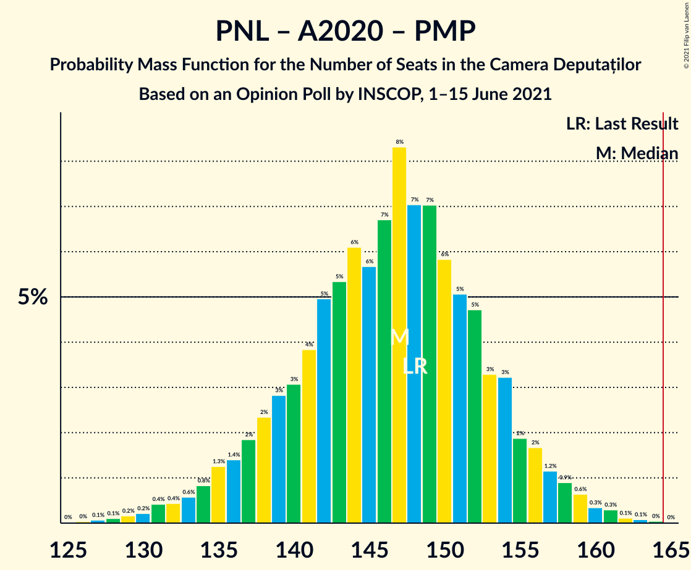

# Opinion Poll by INSCOP, 1–15 June 2021

<a href="#voting-intentions">Voting Intentions</a> | <a href="#seats">Seats</a> | <a href="#coalitions">Coalitions</a> | <a href="#technical-information">Technical Information</a>

## Voting Intentions

### Confidence Intervals

| Party | Last Result | Poll Result | 80% Confidence Interval | 90% Confidence Interval | 95% Confidence Interval | 99% Confidence Interval |
|:-----:|:-----------:|:-----------:|:-----------------------:|:-----------------------:|:-----------------------:|:-----------------------:|
| Partidul Social Democrat | 28.9% | 30.2% | 28.4–32.0% |28.0–32.5% |27.5–33.0% |26.7–33.9% |
| Partidul Național Liberal | 25.2% | 26.6% | 25.0–28.4% |24.5–28.9% |24.1–29.3% |23.3–30.2% |
| Alianța pentru Unirea Românilor | 9.1% | 14.2% | 12.9–15.6% |12.5–16.0% |12.2–16.4% |11.7–17.1% |
| Alianța 2020 USR-PLUS | 15.4% | 13.2% | 11.9–14.6% |11.6–15.0% |11.3–15.3% |10.7–16.0% |
| PRO România | 4.1% | 4.3% | 3.6–5.2% |3.4–5.4% |3.2–5.6% |2.9–6.1% |
| Partidul Mișcarea Populară | 4.8% | 2.8% | 2.3–3.6% |2.1–3.8% |2.0–4.0% |1.8–4.4% |

*Note:* The poll result column reflects the actual value used in the calculations. Published results may vary slightly, and in addition be rounded to fewer digits.

## Seats

### Confidence Intervals

| Party | Last Result | Median | 80% Confidence Interval | 90% Confidence Interval | 95% Confidence Interval | 99% Confidence Interval |
|:-----:|:-----------:|:------:|:-----------------------:|:-----------------------:|:-----------------------:|:-----------------------:|
| <a href="#partidul-social-democrat">Partidul Social Democrat</a> | 110 | 111 | 105–119 |101–120 |100–121 |99–124 |
| <a href="#partidul-național-liberal">Partidul Național Liberal</a> | 93 | 98 | 91–105 |90–106 |87–106 |85–111 |
| <a href="#alianța-pentru-unirea-românilor">Alianța pentru Unirea Românilor</a> | 33 | 52 | 47–57 |46–59 |44–60 |42–63 |
| <a href="#alianța-2020-usr-plus">Alianța 2020 USR-PLUS</a> | 55 | 48 | 43–53 |42–55 |41–56 |39–58 |
| <a href="#pro-românia">PRO România</a> | 0 | 0 | 0–18 |0–19 |0–19 |0–21 |
| <a href="#partidul-mișcarea-populară">Partidul Mișcarea Populară</a> | 0 | 0 | 0 |0 |0 |0 |

### Partidul Social Democrat

*For a full overview of the results for this party, see the [Partidul Social Democrat](party-partidulsocialdemocrat.html) page.*

| Number of Seats | Probability | Accumulated | Special Marks |
|:---------------:|:-----------:|:-----------:|:-------------:|
| 93 | 0% | 100% |  |
| 94 | 0% | 99.9% |  |
| 95 | 0.1% | 99.9% |  |
| 96 | 0.1% | 99.8% |  |
| 97 | 0.1% | 99.7% |  |
| 98 | 0.1% | 99.6% |  |
| 99 | 1.4% | 99.5% |  |
| 100 | 2% | 98% |  |
| 101 | 2% | 96% |  |
| 102 | 3% | 93% |  |
| 103 | 0.3% | 91% |  |
| 104 | 0.4% | 91% |  |
| 105 | 2% | 90% |  |
| 106 | 3% | 88% |  |
| 107 | 10% | 85% |  |
| 108 | 7% | 75% |  |
| 109 | 3% | 69% |  |
| 110 | 4% | 65% | Last Result |
| 111 | 14% | 61% | Median |
| 112 | 17% | 47% |  |
| 113 | 8% | 30% |  |
| 114 | 1.4% | 22% |  |
| 115 | 0.5% | 21% |  |
| 116 | 0.9% | 20% |  |
| 117 | 2% | 19% |  |
| 118 | 6% | 17% |  |
| 119 | 6% | 11% |  |
| 120 | 2% | 5% |  |
| 121 | 0.8% | 3% |  |
| 122 | 0.8% | 2% |  |
| 123 | 0.8% | 1.5% |  |
| 124 | 0.4% | 0.6% |  |
| 125 | 0.1% | 0.3% |  |
| 126 | 0% | 0.1% |  |
| 127 | 0% | 0.1% |  |
| 128 | 0% | 0.1% |  |
| 129 | 0% | 0.1% |  |
| 130 | 0% | 0% |  |

### Partidul Național Liberal

*For a full overview of the results for this party, see the [Partidul Național Liberal](party-partidulnaționalliberal.html) page.*

| Number of Seats | Probability | Accumulated | Special Marks |
|:---------------:|:-----------:|:-----------:|:-------------:|
| 82 | 0% | 100% |  |
| 83 | 0.1% | 99.9% |  |
| 84 | 0.3% | 99.8% |  |
| 85 | 0.9% | 99.6% |  |
| 86 | 0.8% | 98.6% |  |
| 87 | 0.4% | 98% |  |
| 88 | 0.3% | 97% |  |
| 89 | 0.8% | 97% |  |
| 90 | 3% | 96% |  |
| 91 | 5% | 93% |  |
| 92 | 8% | 88% |  |
| 93 | 5% | 80% | Last Result |
| 94 | 0.6% | 75% |  |
| 95 | 0.8% | 75% |  |
| 96 | 4% | 74% |  |
| 97 | 10% | 70% |  |
| 98 | 20% | 59% | Median |
| 99 | 9% | 40% |  |
| 100 | 3% | 31% |  |
| 101 | 0.5% | 28% |  |
| 102 | 1.4% | 27% |  |
| 103 | 6% | 26% |  |
| 104 | 7% | 20% |  |
| 105 | 6% | 13% |  |
| 106 | 4% | 6% |  |
| 107 | 0.4% | 2% |  |
| 108 | 0% | 2% |  |
| 109 | 0.3% | 2% |  |
| 110 | 0.5% | 1.4% |  |
| 111 | 0.6% | 1.0% |  |
| 112 | 0.3% | 0.4% |  |
| 113 | 0.1% | 0.1% |  |
| 114 | 0% | 0% |  |

### Alianța pentru Unirea Românilor

*For a full overview of the results for this party, see the [Alianța pentru Unirea Românilor](party-alianțapentruunirearomânilor.html) page.*

| Number of Seats | Probability | Accumulated | Special Marks |
|:---------------:|:-----------:|:-----------:|:-------------:|
| 33 | 0% | 100% | Last Result |
| 34 | 0% | 100% |  |
| 35 | 0% | 100% |  |
| 36 | 0% | 100% |  |
| 37 | 0% | 100% |  |
| 38 | 0% | 100% |  |
| 39 | 0% | 100% |  |
| 40 | 0.1% | 99.9% |  |
| 41 | 0.2% | 99.9% |  |
| 42 | 0.3% | 99.7% |  |
| 43 | 0.6% | 99.4% |  |
| 44 | 2% | 98.8% |  |
| 45 | 2% | 97% |  |
| 46 | 3% | 95% |  |
| 47 | 4% | 92% |  |
| 48 | 6% | 88% |  |
| 49 | 4% | 82% |  |
| 50 | 11% | 78% |  |
| 51 | 13% | 66% |  |
| 52 | 8% | 53% | Median |
| 53 | 11% | 45% |  |
| 54 | 7% | 33% |  |
| 55 | 4% | 27% |  |
| 56 | 9% | 23% |  |
| 57 | 6% | 14% |  |
| 58 | 2% | 8% |  |
| 59 | 3% | 6% |  |
| 60 | 0.7% | 3% |  |
| 61 | 0.6% | 2% |  |
| 62 | 0.6% | 1.2% |  |
| 63 | 0.5% | 0.7% |  |
| 64 | 0.1% | 0.2% |  |
| 65 | 0.1% | 0.1% |  |
| 66 | 0% | 0.1% |  |
| 67 | 0% | 0% |  |

### Alianța 2020 USR-PLUS

*For a full overview of the results for this party, see the [Alianța 2020 USR-PLUS](party-alianța2020usr-plus.html) page.*

| Number of Seats | Probability | Accumulated | Special Marks |
|:---------------:|:-----------:|:-----------:|:-------------:|
| 36 | 0% | 100% |  |
| 37 | 0.1% | 99.9% |  |
| 38 | 0.2% | 99.9% |  |
| 39 | 0.8% | 99.7% |  |
| 40 | 0.8% | 98.9% |  |
| 41 | 0.8% | 98% |  |
| 42 | 3% | 97% |  |
| 43 | 6% | 94% |  |
| 44 | 4% | 88% |  |
| 45 | 6% | 84% |  |
| 46 | 8% | 78% |  |
| 47 | 13% | 70% |  |
| 48 | 7% | 56% | Median |
| 49 | 13% | 49% |  |
| 50 | 8% | 36% |  |
| 51 | 5% | 27% |  |
| 52 | 8% | 22% |  |
| 53 | 6% | 15% |  |
| 54 | 3% | 8% |  |
| 55 | 1.2% | 5% | Last Result |
| 56 | 2% | 4% |  |
| 57 | 1.2% | 2% |  |
| 58 | 0.5% | 1.0% |  |
| 59 | 0.2% | 0.5% |  |
| 60 | 0.2% | 0.3% |  |
| 61 | 0.1% | 0.1% |  |
| 62 | 0% | 0.1% |  |
| 63 | 0% | 0% |  |

### PRO România

*For a full overview of the results for this party, see the [PRO România](party-proromânia.html) page.*

| Number of Seats | Probability | Accumulated | Special Marks |
|:---------------:|:-----------:|:-----------:|:-------------:|
| 0 | 87% | 100% | Last Result, Median |
| 1 | 0% | 13% |  |
| 2 | 0% | 13% |  |
| 3 | 0% | 13% |  |
| 4 | 0% | 13% |  |
| 5 | 0% | 13% |  |
| 6 | 0% | 13% |  |
| 7 | 0% | 13% |  |
| 8 | 0% | 13% |  |
| 9 | 0% | 13% |  |
| 10 | 0% | 13% |  |
| 11 | 0% | 13% |  |
| 12 | 0% | 13% |  |
| 13 | 0% | 13% |  |
| 14 | 0% | 13% |  |
| 15 | 0% | 13% |  |
| 16 | 0% | 13% |  |
| 17 | 2% | 13% |  |
| 18 | 5% | 11% |  |
| 19 | 4% | 6% |  |
| 20 | 1.3% | 2% |  |
| 21 | 0.6% | 0.9% |  |
| 22 | 0.2% | 0.3% |  |
| 23 | 0.1% | 0.1% |  |
| 24 | 0% | 0% |  |

### Partidul Mișcarea Populară

*For a full overview of the results for this party, see the [Partidul Mișcarea Populară](party-partidulmișcareapopulară.html) page.*

| Number of Seats | Probability | Accumulated | Special Marks |
|:---------------:|:-----------:|:-----------:|:-------------:|
| 0 | 100% | 100% | Last Result, Median |

## Coalitions

### Confidence Intervals

| Coalition | Last Result | Median | Majority? | 80% Confidence Interval | 90% Confidence Interval | 95% Confidence Interval | 99% Confidence Interval |
|:---------:|:-----------:|:------:|:---------:|:-----------------------:|:-----------------------:|:-----------------------:|:-----------------------:|
| Partidul Național Liberal – Alianța 2020 USR-PLUS – Partidul Mișcarea Populară | 148 | 147 | 0.1% | 138–153 | 136–155 | 134–157 | 131–161 |
| Partidul Național Liberal – Alianța 2020 USR-PLUS | 148 | 147 | 0.1% | 138–153 | 136–155 | 134–157 | 131–161 |
| Partidul Social Democrat – PRO România | 110 | 112 | 0% | 107–122 | 106–127 | 101–129 | 99–131 |
| Partidul Național Liberal – Partidul Mișcarea Populară | 93 | 98 | 0% | 91–105 | 90–106 | 87–106 | 85–111 |
| Partidul Național Liberal | 93 | 98 | 0% | 91–105 | 90–106 | 87–106 | 85–111 |
| Alianța 2020 USR-PLUS – Partidul Mișcarea Populară | 55 | 48 | 0% | 43–53 | 42–55 | 41–56 | 39–59 |

### Partidul Național Liberal – Alianța 2020 USR-PLUS – Partidul Mișcarea Populară

| Number of Seats | Probability | Accumulated | Special Marks |
|:---------------:|:-----------:|:-----------:|:-------------:|
| 126 | 0.1% | 100% |  |
| 127 | 0% | 99.9% |  |
| 128 | 0% | 99.9% |  |
| 129 | 0.1% | 99.8% |  |
| 130 | 0.1% | 99.7% |  |
| 131 | 0.8% | 99.6% |  |
| 132 | 0.1% | 98.8% |  |
| 133 | 1.0% | 98.6% |  |
| 134 | 0.9% | 98% |  |
| 135 | 1.4% | 97% |  |
| 136 | 2% | 95% |  |
| 137 | 2% | 93% |  |
| 138 | 2% | 92% |  |
| 139 | 3% | 89% |  |
| 140 | 2% | 86% |  |
| 141 | 5% | 84% |  |
| 142 | 5% | 80% |  |
| 143 | 4% | 75% |  |
| 144 | 5% | 70% |  |
| 145 | 7% | 65% |  |
| 146 | 4% | 58% | Median |
| 147 | 11% | 55% |  |
| 148 | 9% | 44% | Last Result |
| 149 | 2% | 35% |  |
| 150 | 4% | 33% |  |
| 151 | 9% | 28% |  |
| 152 | 6% | 19% |  |
| 153 | 3% | 13% |  |
| 154 | 3% | 10% |  |
| 155 | 2% | 7% |  |
| 156 | 1.3% | 5% |  |
| 157 | 2% | 4% |  |
| 158 | 0.4% | 2% |  |
| 159 | 0.7% | 2% |  |
| 160 | 0.3% | 0.9% |  |
| 161 | 0.3% | 0.6% |  |
| 162 | 0.1% | 0.3% |  |
| 163 | 0.1% | 0.2% |  |
| 164 | 0% | 0.1% |  |
| 165 | 0% | 0.1% | Majority |
| 166 | 0% | 0% |  |

### Partidul Național Liberal – Alianța 2020 USR-PLUS

| Number of Seats | Probability | Accumulated | Special Marks |
|:---------------:|:-----------:|:-----------:|:-------------:|
| 126 | 0.1% | 100% |  |
| 127 | 0% | 99.9% |  |
| 128 | 0% | 99.9% |  |
| 129 | 0.1% | 99.8% |  |
| 130 | 0.1% | 99.7% |  |
| 131 | 0.8% | 99.6% |  |
| 132 | 0.1% | 98.7% |  |
| 133 | 1.0% | 98.6% |  |
| 134 | 0.9% | 98% |  |
| 135 | 1.4% | 97% |  |
| 136 | 2% | 95% |  |
| 137 | 2% | 93% |  |
| 138 | 2% | 92% |  |
| 139 | 3% | 89% |  |
| 140 | 2% | 86% |  |
| 141 | 5% | 84% |  |
| 142 | 5% | 80% |  |
| 143 | 4% | 75% |  |
| 144 | 5% | 70% |  |
| 145 | 7% | 65% |  |
| 146 | 4% | 58% | Median |
| 147 | 11% | 55% |  |
| 148 | 9% | 44% | Last Result |
| 149 | 2% | 35% |  |
| 150 | 4% | 33% |  |
| 151 | 9% | 28% |  |
| 152 | 6% | 19% |  |
| 153 | 3% | 13% |  |
| 154 | 3% | 10% |  |
| 155 | 2% | 7% |  |
| 156 | 1.3% | 5% |  |
| 157 | 2% | 4% |  |
| 158 | 0.4% | 2% |  |
| 159 | 0.7% | 2% |  |
| 160 | 0.3% | 0.9% |  |
| 161 | 0.3% | 0.6% |  |
| 162 | 0.1% | 0.3% |  |
| 163 | 0.1% | 0.2% |  |
| 164 | 0% | 0.1% |  |
| 165 | 0% | 0.1% | Majority |
| 166 | 0% | 0% |  |

### Partidul Social Democrat – PRO România

| Number of Seats | Probability | Accumulated | Special Marks |
|:---------------:|:-----------:|:-----------:|:-------------:|
| 96 | 0% | 100% |  |
| 97 | 0% | 99.9% |  |
| 98 | 0% | 99.9% |  |
| 99 | 0.4% | 99.9% |  |
| 100 | 0.9% | 99.4% |  |
| 101 | 1.3% | 98.6% |  |
| 102 | 0.7% | 97% |  |
| 103 | 0.1% | 97% |  |
| 104 | 0.3% | 96% |  |
| 105 | 0.9% | 96% |  |
| 106 | 2% | 95% |  |
| 107 | 9% | 93% |  |
| 108 | 6% | 84% |  |
| 109 | 2% | 77% |  |
| 110 | 3% | 75% | Last Result |
| 111 | 13% | 72% | Median |
| 112 | 16% | 59% |  |
| 113 | 8% | 43% |  |
| 114 | 1.4% | 35% |  |
| 115 | 0.5% | 34% |  |
| 116 | 0.9% | 33% |  |
| 117 | 3% | 33% |  |
| 118 | 7% | 30% |  |
| 119 | 8% | 23% |  |
| 120 | 4% | 15% |  |
| 121 | 1.2% | 11% |  |
| 122 | 1.3% | 10% |  |
| 123 | 2% | 9% |  |
| 124 | 0.9% | 7% |  |
| 125 | 0.6% | 6% |  |
| 126 | 0.4% | 6% |  |
| 127 | 0.6% | 5% |  |
| 128 | 0.9% | 5% |  |
| 129 | 2% | 4% |  |
| 130 | 0.8% | 2% |  |
| 131 | 0.7% | 1.1% |  |
| 132 | 0.3% | 0.5% |  |
| 133 | 0.1% | 0.2% |  |
| 134 | 0.1% | 0.1% |  |
| 135 | 0% | 0.1% |  |
| 136 | 0% | 0.1% |  |
| 137 | 0% | 0% |  |

### Partidul Național Liberal – Partidul Mișcarea Populară

| Number of Seats | Probability | Accumulated | Special Marks |
|:---------------:|:-----------:|:-----------:|:-------------:|
| 82 | 0% | 100% |  |
| 83 | 0.1% | 99.9% |  |
| 84 | 0.3% | 99.8% |  |
| 85 | 0.9% | 99.6% |  |
| 86 | 0.8% | 98.6% |  |
| 87 | 0.4% | 98% |  |
| 88 | 0.3% | 97% |  |
| 89 | 0.8% | 97% |  |
| 90 | 3% | 96% |  |
| 91 | 5% | 93% |  |
| 92 | 8% | 88% |  |
| 93 | 5% | 80% | Last Result |
| 94 | 0.6% | 75% |  |
| 95 | 0.8% | 75% |  |
| 96 | 4% | 74% |  |
| 97 | 10% | 70% |  |
| 98 | 20% | 59% | Median |
| 99 | 9% | 40% |  |
| 100 | 3% | 31% |  |
| 101 | 0.5% | 28% |  |
| 102 | 1.4% | 27% |  |
| 103 | 6% | 26% |  |
| 104 | 7% | 20% |  |
| 105 | 6% | 13% |  |
| 106 | 4% | 6% |  |
| 107 | 0.4% | 2% |  |
| 108 | 0% | 2% |  |
| 109 | 0.3% | 2% |  |
| 110 | 0.5% | 1.4% |  |
| 111 | 0.6% | 1.0% |  |
| 112 | 0.3% | 0.4% |  |
| 113 | 0.1% | 0.1% |  |
| 114 | 0% | 0.1% |  |
| 115 | 0% | 0% |  |

### Partidul Național Liberal

| Number of Seats | Probability | Accumulated | Special Marks |
|:---------------:|:-----------:|:-----------:|:-------------:|
| 82 | 0% | 100% |  |
| 83 | 0.1% | 99.9% |  |
| 84 | 0.3% | 99.8% |  |
| 85 | 0.9% | 99.6% |  |
| 86 | 0.8% | 98.6% |  |
| 87 | 0.4% | 98% |  |
| 88 | 0.3% | 97% |  |
| 89 | 0.8% | 97% |  |
| 90 | 3% | 96% |  |
| 91 | 5% | 93% |  |
| 92 | 8% | 88% |  |
| 93 | 5% | 80% | Last Result |
| 94 | 0.6% | 75% |  |
| 95 | 0.8% | 75% |  |
| 96 | 4% | 74% |  |
| 97 | 10% | 70% |  |
| 98 | 20% | 59% | Median |
| 99 | 9% | 40% |  |
| 100 | 3% | 31% |  |
| 101 | 0.5% | 28% |  |
| 102 | 1.4% | 27% |  |
| 103 | 6% | 26% |  |
| 104 | 7% | 20% |  |
| 105 | 6% | 13% |  |
| 106 | 4% | 6% |  |
| 107 | 0.4% | 2% |  |
| 108 | 0% | 2% |  |
| 109 | 0.3% | 2% |  |
| 110 | 0.5% | 1.4% |  |
| 111 | 0.6% | 1.0% |  |
| 112 | 0.3% | 0.4% |  |
| 113 | 0.1% | 0.1% |  |
| 114 | 0% | 0% |  |

### Alianța 2020 USR-PLUS – Partidul Mișcarea Populară

| Number of Seats | Probability | Accumulated | Special Marks |
|:---------------:|:-----------:|:-----------:|:-------------:|
| 36 | 0% | 100% |  |
| 37 | 0.1% | 99.9% |  |
| 38 | 0.2% | 99.9% |  |
| 39 | 0.8% | 99.7% |  |
| 40 | 0.8% | 98.9% |  |
| 41 | 0.8% | 98% |  |
| 42 | 3% | 97% |  |
| 43 | 6% | 94% |  |
| 44 | 4% | 88% |  |
| 45 | 6% | 84% |  |
| 46 | 8% | 78% |  |
| 47 | 13% | 70% |  |
| 48 | 7% | 56% | Median |
| 49 | 13% | 49% |  |
| 50 | 8% | 36% |  |
| 51 | 5% | 27% |  |
| 52 | 8% | 22% |  |
| 53 | 6% | 15% |  |
| 54 | 3% | 8% |  |
| 55 | 1.2% | 5% | Last Result |
| 56 | 2% | 4% |  |
| 57 | 1.2% | 2% |  |
| 58 | 0.5% | 1.0% |  |
| 59 | 0.2% | 0.5% |  |
| 60 | 0.2% | 0.3% |  |
| 61 | 0.1% | 0.2% |  |
| 62 | 0% | 0.1% |  |
| 63 | 0% | 0% |  |

## Technical Information

### Opinion Poll

+ **Polling firm:** INSCOP
+ **Commissioner(s):** —
+ **Fieldwork period:** 1–15 June 2021

### Calculations

+ **Sample size:** 1100
+ **Simulations done:** 131,072
+ **Error estimate:** 1.16%

