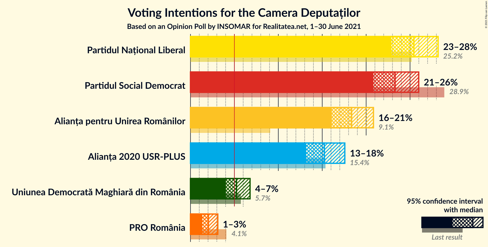
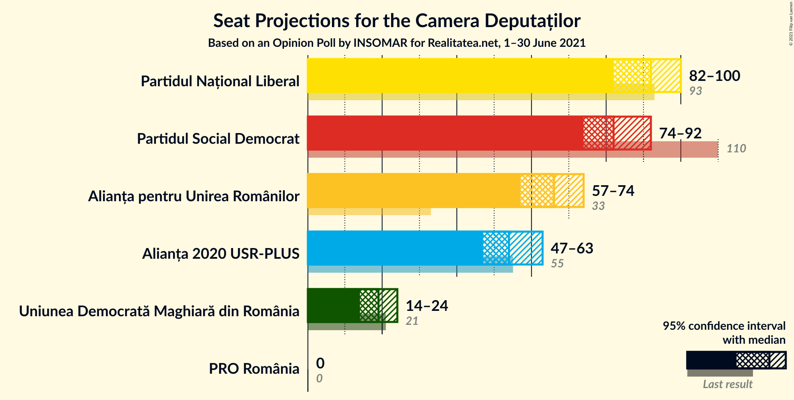
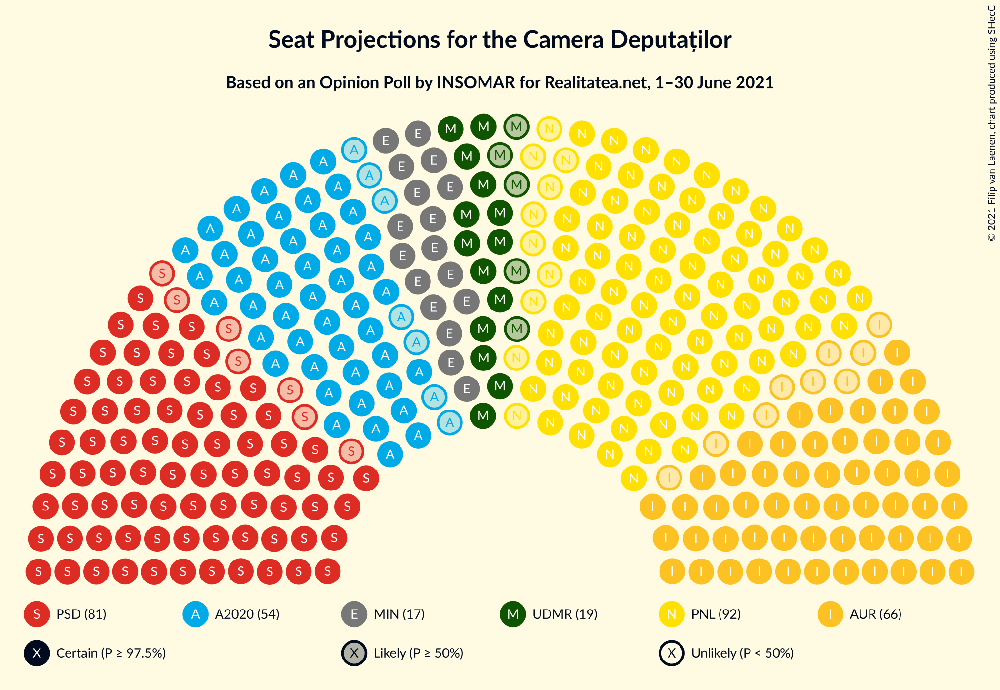
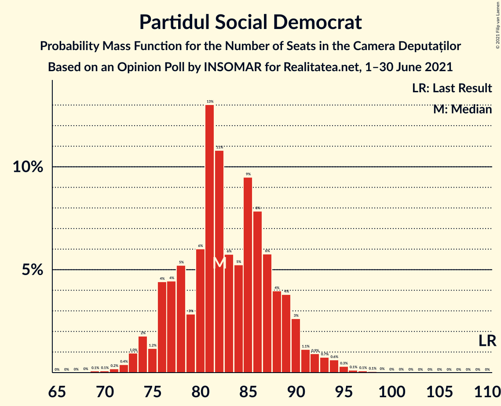
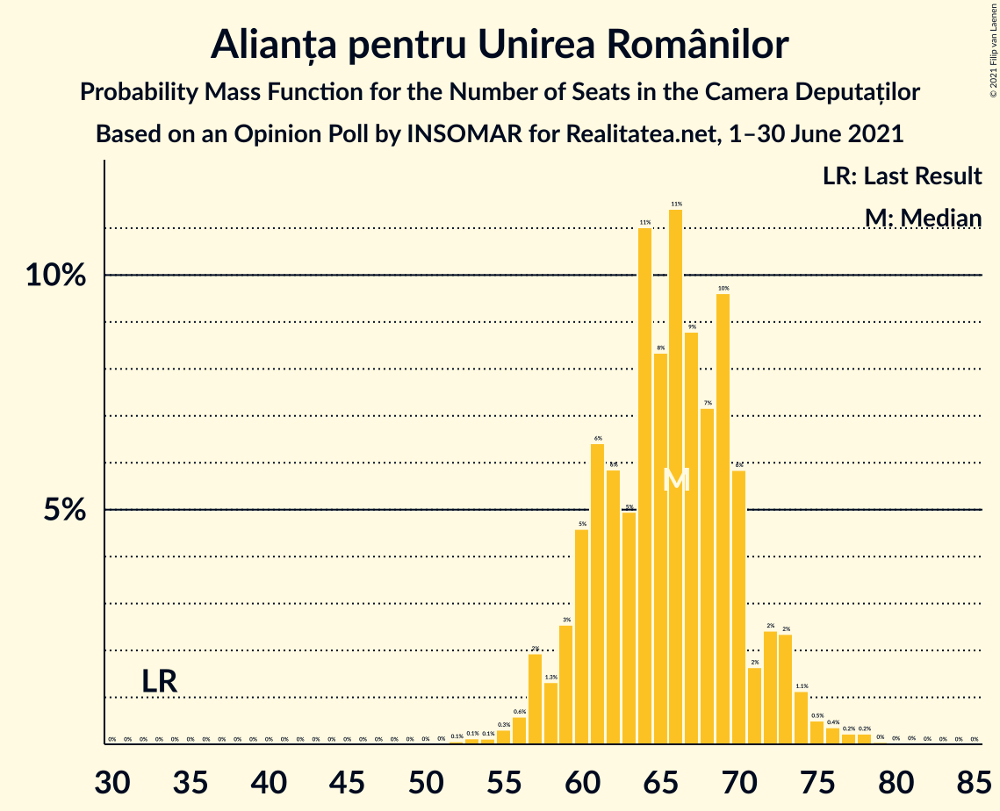
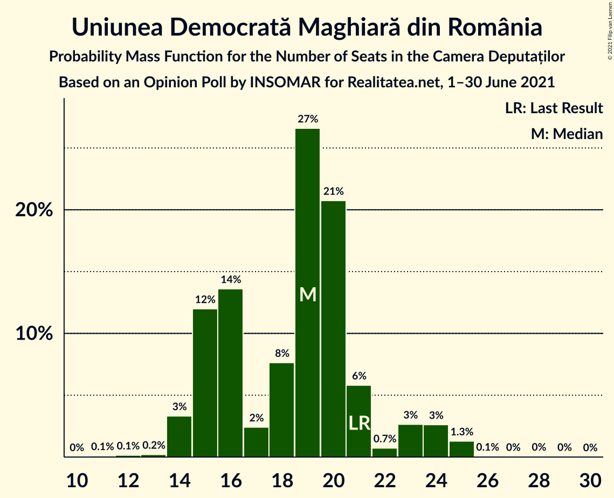
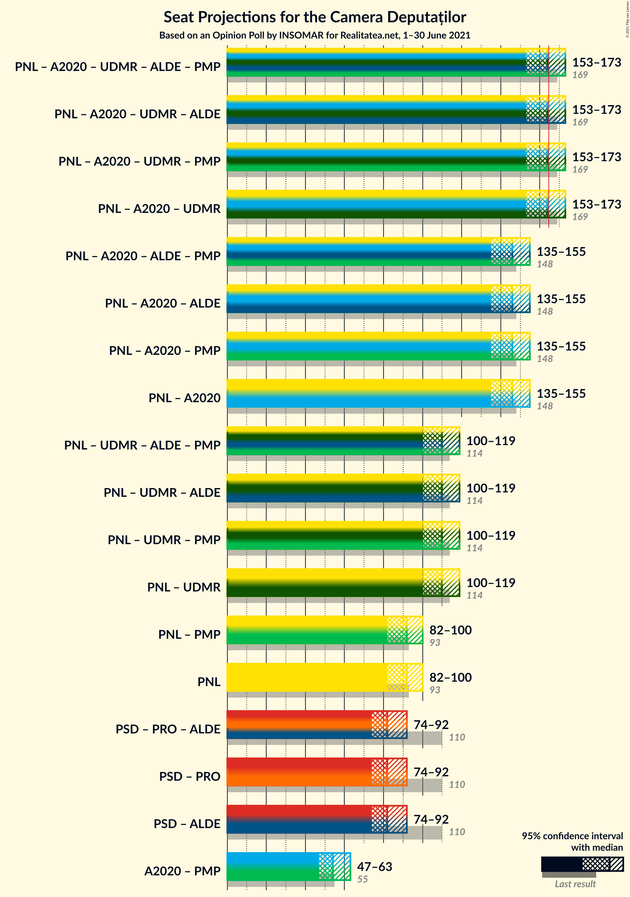
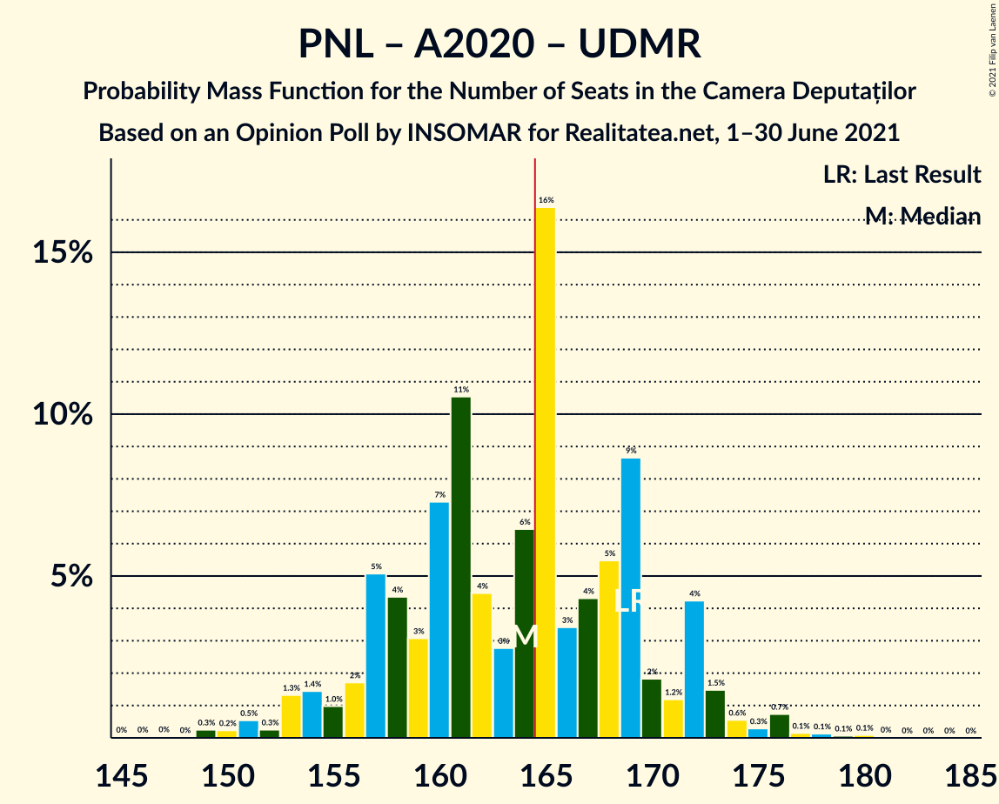

# Opinion Poll by INSOMAR for Realitatea.net, 1–30 June 2021

<a href="#voting-intentions">Voting Intentions</a> | <a href="#seats">Seats</a> | <a href="#coalitions">Coalitions</a> | <a href="#technical-information">Technical Information</a>

## Voting Intentions

### Confidence Intervals

| Party | Last Result | Poll Result | 80% Confidence Interval | 90% Confidence Interval | 95% Confidence Interval | 99% Confidence Interval |
|:-----:|:-----------:|:-----------:|:-----------------------:|:-----------------------:|:-----------------------:|:-----------------------:|
| Partidul Național Liberal | 25.2% | 25.4% | 23.7–27.2% |23.3–27.8% |22.9–28.2% |22.1–29.1% |
| Partidul Social Democrat | 28.9% | 23.3% | 21.7–25.1% |21.2–25.6% |20.8–26.0% |20.1–26.8% |
| Alianța pentru Unirea Românilor | 9.1% | 18.3% | 16.9–20.0% |16.5–20.4% |16.1–20.8% |15.4–21.6% |
| Alianța 2020 USR-PLUS | 15.4% | 15.2% | 13.9–16.8% |13.5–17.2% |13.2–17.6% |12.5–18.3% |
| Uniunea Democrată Maghiară din România | 5.7% | 5.2% | 4.5–6.2% |4.2–6.5% |4.0–6.8% |3.7–7.3% |
| PRO România | 4.1% | 2.0% | 1.6–2.7% |1.4–2.9% |1.3–3.1% |1.1–3.5% |

*Note:* The poll result column reflects the actual value used in the calculations. Published results may vary slightly, and in addition be rounded to fewer digits.

## Seats

### Confidence Intervals

| Party | Last Result | Median | 80% Confidence Interval | 90% Confidence Interval | 95% Confidence Interval | 99% Confidence Interval |
|:-----:|:-----------:|:------:|:-----------------------:|:-----------------------:|:-----------------------:|:-----------------------:|
| <a href="#partidul-național-liberal">Partidul Național Liberal</a> | 93 | 92 | 86–97 |83–98 |82–100 |79–103 |
| <a href="#partidul-social-democrat">Partidul Social Democrat</a> | 110 | 82 | 77–89 |76–90 |74–92 |72–95 |
| <a href="#alianța-pentru-unirea-românilor">Alianța pentru Unirea Românilor</a> | 33 | 66 | 60–70 |59–72 |57–74 |55–77 |
| <a href="#alianța-2020-usr-plus">Alianța 2020 USR-PLUS</a> | 55 | 54 | 49–59 |48–60 |47–63 |44–64 |
| <a href="#uniunea-democrată-maghiară-din-românia">Uniunea Democrată Maghiară din România</a> | 21 | 19 | 15–21 |15–23 |14–24 |14–25 |
| <a href="#pro-românia">PRO România</a> | 0 | 0 | 0 |0 |0 |0 |

### Partidul Național Liberal

*For a full overview of the results for this party, see the [Partidul Național Liberal](party-partidulnaționalliberal.html) page.*

| Number of Seats | Probability | Accumulated | Special Marks |
|:---------------:|:-----------:|:-----------:|:-------------:|
| 76 | 0.1% | 100% |  |
| 77 | 0.1% | 99.9% |  |
| 78 | 0.1% | 99.8% |  |
| 79 | 0.5% | 99.6% |  |
| 80 | 0.8% | 99.1% |  |
| 81 | 0.7% | 98% |  |
| 82 | 1.2% | 98% |  |
| 83 | 2% | 96% |  |
| 84 | 1.3% | 95% |  |
| 85 | 3% | 93% |  |
| 86 | 8% | 90% |  |
| 87 | 3% | 82% |  |
| 88 | 6% | 79% |  |
| 89 | 11% | 73% |  |
| 90 | 6% | 62% |  |
| 91 | 6% | 56% |  |
| 92 | 14% | 50% | Median |
| 93 | 7% | 36% | Last Result |
| 94 | 4% | 29% |  |
| 95 | 7% | 25% |  |
| 96 | 7% | 17% |  |
| 97 | 0.8% | 10% |  |
| 98 | 5% | 10% |  |
| 99 | 2% | 5% |  |
| 100 | 0.3% | 3% |  |
| 101 | 1.3% | 2% |  |
| 102 | 0.4% | 0.9% |  |
| 103 | 0.1% | 0.5% |  |
| 104 | 0.2% | 0.4% |  |
| 105 | 0.1% | 0.2% |  |
| 106 | 0% | 0.1% |  |
| 107 | 0% | 0.1% |  |
| 108 | 0% | 0% |  |

### Partidul Social Democrat

*For a full overview of the results for this party, see the [Partidul Social Democrat](party-partidulsocialdemocrat.html) page.*

| Number of Seats | Probability | Accumulated | Special Marks |
|:---------------:|:-----------:|:-----------:|:-------------:|
| 68 | 0% | 100% |  |
| 69 | 0.1% | 99.9% |  |
| 70 | 0.1% | 99.9% |  |
| 71 | 0.2% | 99.8% |  |
| 72 | 0.4% | 99.6% |  |
| 73 | 1.0% | 99.2% |  |
| 74 | 2% | 98% |  |
| 75 | 1.2% | 96% |  |
| 76 | 4% | 95% |  |
| 77 | 4% | 91% |  |
| 78 | 5% | 86% |  |
| 79 | 3% | 81% |  |
| 80 | 6% | 78% |  |
| 81 | 13% | 72% |  |
| 82 | 11% | 59% | Median |
| 83 | 6% | 49% |  |
| 84 | 5% | 43% |  |
| 85 | 9% | 38% |  |
| 86 | 8% | 28% |  |
| 87 | 6% | 20% |  |
| 88 | 4% | 14% |  |
| 89 | 4% | 10% |  |
| 90 | 3% | 7% |  |
| 91 | 1.1% | 4% |  |
| 92 | 0.9% | 3% |  |
| 93 | 0.7% | 2% |  |
| 94 | 0.6% | 1.2% |  |
| 95 | 0.3% | 0.6% |  |
| 96 | 0.1% | 0.3% |  |
| 97 | 0.1% | 0.2% |  |
| 98 | 0.1% | 0.1% |  |
| 99 | 0% | 0.1% |  |
| 100 | 0% | 0% |  |
| 101 | 0% | 0% |  |
| 102 | 0% | 0% |  |
| 103 | 0% | 0% |  |
| 104 | 0% | 0% |  |
| 105 | 0% | 0% |  |
| 106 | 0% | 0% |  |
| 107 | 0% | 0% |  |
| 108 | 0% | 0% |  |
| 109 | 0% | 0% |  |
| 110 | 0% | 0% | Last Result |

### Alianța pentru Unirea Românilor

*For a full overview of the results for this party, see the [Alianța pentru Unirea Românilor](party-alianțapentruunirearomânilor.html) page.*

| Number of Seats | Probability | Accumulated | Special Marks |
|:---------------:|:-----------:|:-----------:|:-------------:|
| 33 | 0% | 100% | Last Result |
| 34 | 0% | 100% |  |
| 35 | 0% | 100% |  |
| 36 | 0% | 100% |  |
| 37 | 0% | 100% |  |
| 38 | 0% | 100% |  |
| 39 | 0% | 100% |  |
| 40 | 0% | 100% |  |
| 41 | 0% | 100% |  |
| 42 | 0% | 100% |  |
| 43 | 0% | 100% |  |
| 44 | 0% | 100% |  |
| 45 | 0% | 100% |  |
| 46 | 0% | 100% |  |
| 47 | 0% | 100% |  |
| 48 | 0% | 100% |  |
| 49 | 0% | 100% |  |
| 50 | 0% | 100% |  |
| 51 | 0% | 100% |  |
| 52 | 0.1% | 100% |  |
| 53 | 0.1% | 99.9% |  |
| 54 | 0.1% | 99.8% |  |
| 55 | 0.3% | 99.7% |  |
| 56 | 0.6% | 99.4% |  |
| 57 | 2% | 98.8% |  |
| 58 | 1.3% | 97% |  |
| 59 | 3% | 96% |  |
| 60 | 5% | 93% |  |
| 61 | 6% | 88% |  |
| 62 | 6% | 82% |  |
| 63 | 5% | 76% |  |
| 64 | 11% | 71% |  |
| 65 | 8% | 60% |  |
| 66 | 11% | 52% | Median |
| 67 | 9% | 40% |  |
| 68 | 7% | 32% |  |
| 69 | 10% | 24% |  |
| 70 | 6% | 15% |  |
| 71 | 2% | 9% |  |
| 72 | 2% | 7% |  |
| 73 | 2% | 5% |  |
| 74 | 1.1% | 3% |  |
| 75 | 0.5% | 1.4% |  |
| 76 | 0.4% | 0.9% |  |
| 77 | 0.2% | 0.6% |  |
| 78 | 0.2% | 0.3% |  |
| 79 | 0% | 0.1% |  |
| 80 | 0% | 0.1% |  |
| 81 | 0% | 0% |  |

### Alianța 2020 USR-PLUS

*For a full overview of the results for this party, see the [Alianța 2020 USR-PLUS](party-alianța2020usr-plus.html) page.*

| Number of Seats | Probability | Accumulated | Special Marks |
|:---------------:|:-----------:|:-----------:|:-------------:|
| 43 | 0.2% | 100% |  |
| 44 | 0.4% | 99.7% |  |
| 45 | 0.4% | 99.3% |  |
| 46 | 0.3% | 98.9% |  |
| 47 | 2% | 98.7% |  |
| 48 | 5% | 97% |  |
| 49 | 11% | 93% |  |
| 50 | 2% | 82% |  |
| 51 | 1.2% | 79% |  |
| 52 | 5% | 78% |  |
| 53 | 14% | 73% |  |
| 54 | 20% | 59% | Median |
| 55 | 8% | 39% | Last Result |
| 56 | 2% | 32% |  |
| 57 | 4% | 30% |  |
| 58 | 13% | 26% |  |
| 59 | 6% | 13% |  |
| 60 | 3% | 7% |  |
| 61 | 0.4% | 4% |  |
| 62 | 0.5% | 4% |  |
| 63 | 2% | 3% |  |
| 64 | 1.1% | 2% |  |
| 65 | 0.3% | 0.5% |  |
| 66 | 0% | 0.2% |  |
| 67 | 0% | 0.1% |  |
| 68 | 0.1% | 0.1% |  |
| 69 | 0% | 0% |  |

### Uniunea Democrată Maghiară din România

*For a full overview of the results for this party, see the [Uniunea Democrată Maghiară din România](party-uniuneademocratămaghiarădinromânia.html) page.*

| Number of Seats | Probability | Accumulated | Special Marks |
|:---------------:|:-----------:|:-----------:|:-------------:|
| 11 | 0.1% | 100% |  |
| 12 | 0.1% | 99.9% |  |
| 13 | 0.2% | 99.7% |  |
| 14 | 3% | 99.5% |  |
| 15 | 12% | 96% |  |
| 16 | 14% | 84% |  |
| 17 | 2% | 71% |  |
| 18 | 8% | 68% |  |
| 19 | 27% | 61% | Median |
| 20 | 21% | 34% |  |
| 21 | 6% | 13% | Last Result |
| 22 | 0.7% | 7% |  |
| 23 | 3% | 7% |  |
| 24 | 3% | 4% |  |
| 25 | 1.3% | 1.5% |  |
| 26 | 0.1% | 0.2% |  |
| 27 | 0% | 0.1% |  |
| 28 | 0% | 0.1% |  |
| 29 | 0% | 0% |  |

### PRO România

*For a full overview of the results for this party, see the [PRO România](party-proromânia.html) page.*

| Number of Seats | Probability | Accumulated | Special Marks |
|:---------------:|:-----------:|:-----------:|:-------------:|
| 0 | 100% | 100% | Last Result, Median |

## Coalitions

### Confidence Intervals

| Coalition | Last Result | Median | Majority? | 80% Confidence Interval | 90% Confidence Interval | 95% Confidence Interval | 99% Confidence Interval |
|:---------:|:-----------:|:------:|:---------:|:-----------------------:|:-----------------------:|:-----------------------:|:-----------------------:|
| Partidul Național Liberal – Alianța 2020 USR-PLUS – Uniunea Democrată Maghiară din România | 169 | 164 | 49% | 157–170 | 155–172 | 153–173 | 150–176 |
| Partidul Național Liberal – Alianța 2020 USR-PLUS | 148 | 146 | 0% | 139–152 | 137–153 | 135–155 | 132–158 |
| Partidul Național Liberal – Uniunea Democrată Maghiară din România | 114 | 110 | 0% | 104–115 | 102–118 | 100–119 | 97–122 |
| Partidul Național Liberal | 93 | 92 | 0% | 86–97 | 83–98 | 82–100 | 79–103 |
| Partidul Social Democrat – PRO România | 110 | 82 | 0% | 77–89 | 76–90 | 74–92 | 72–95 |

### Partidul Național Liberal – Alianța 2020 USR-PLUS – Uniunea Democrată Maghiară din România

| Number of Seats | Probability | Accumulated | Special Marks |
|:---------------:|:-----------:|:-----------:|:-------------:|
| 146 | 0% | 100% |  |
| 147 | 0% | 99.9% |  |
| 148 | 0% | 99.9% |  |
| 149 | 0.3% | 99.9% |  |
| 150 | 0.2% | 99.6% |  |
| 151 | 0.5% | 99.4% |  |
| 152 | 0.3% | 98.8% |  |
| 153 | 1.3% | 98.6% |  |
| 154 | 1.4% | 97% |  |
| 155 | 1.0% | 96% |  |
| 156 | 2% | 95% |  |
| 157 | 5% | 93% |  |
| 158 | 4% | 88% |  |
| 159 | 3% | 84% |  |
| 160 | 7% | 81% |  |
| 161 | 11% | 73% |  |
| 162 | 4% | 63% |  |
| 163 | 3% | 58% |  |
| 164 | 6% | 56% |  |
| 165 | 16% | 49% | Median, Majority |
| 166 | 3% | 33% |  |
| 167 | 4% | 29% |  |
| 168 | 5% | 25% |  |
| 169 | 9% | 19% | Last Result |
| 170 | 2% | 11% |  |
| 171 | 1.2% | 9% |  |
| 172 | 4% | 8% |  |
| 173 | 1.5% | 4% |  |
| 174 | 0.6% | 2% |  |
| 175 | 0.3% | 2% |  |
| 176 | 0.7% | 1.2% |  |
| 177 | 0.1% | 0.5% |  |
| 178 | 0.1% | 0.3% |  |
| 179 | 0.1% | 0.2% |  |
| 180 | 0.1% | 0.1% |  |
| 181 | 0% | 0.1% |  |
| 182 | 0% | 0% |  |

### Partidul Național Liberal – Alianța 2020 USR-PLUS

| Number of Seats | Probability | Accumulated | Special Marks |
|:---------------:|:-----------:|:-----------:|:-------------:|
| 128 | 0% | 100% |  |
| 129 | 0.1% | 99.9% |  |
| 130 | 0.1% | 99.8% |  |
| 131 | 0.2% | 99.7% |  |
| 132 | 0.2% | 99.5% |  |
| 133 | 0.9% | 99.3% |  |
| 134 | 0.7% | 98% |  |
| 135 | 1.2% | 98% |  |
| 136 | 1.3% | 97% |  |
| 137 | 1.2% | 95% |  |
| 138 | 3% | 94% |  |
| 139 | 5% | 91% |  |
| 140 | 5% | 86% |  |
| 141 | 6% | 82% |  |
| 142 | 6% | 76% |  |
| 143 | 4% | 70% |  |
| 144 | 9% | 65% |  |
| 145 | 6% | 57% |  |
| 146 | 13% | 51% | Median |
| 147 | 5% | 39% |  |
| 148 | 4% | 33% | Last Result |
| 149 | 9% | 29% |  |
| 150 | 6% | 21% |  |
| 151 | 4% | 15% |  |
| 152 | 5% | 11% |  |
| 153 | 2% | 6% |  |
| 154 | 1.2% | 5% |  |
| 155 | 1.0% | 3% |  |
| 156 | 0.8% | 2% |  |
| 157 | 0.8% | 1.5% |  |
| 158 | 0.2% | 0.7% |  |
| 159 | 0.2% | 0.5% |  |
| 160 | 0.1% | 0.3% |  |
| 161 | 0.1% | 0.1% |  |
| 162 | 0% | 0.1% |  |
| 163 | 0% | 0% |  |

### Partidul Național Liberal – Uniunea Democrată Maghiară din România

| Number of Seats | Probability | Accumulated | Special Marks |
|:---------------:|:-----------:|:-----------:|:-------------:|
| 93 | 0% | 100% |  |
| 94 | 0.1% | 99.9% |  |
| 95 | 0.1% | 99.9% |  |
| 96 | 0.2% | 99.8% |  |
| 97 | 0.3% | 99.6% |  |
| 98 | 0.8% | 99.3% |  |
| 99 | 0.9% | 98% |  |
| 100 | 0.9% | 98% |  |
| 101 | 1.2% | 97% |  |
| 102 | 3% | 95% |  |
| 103 | 0.9% | 93% |  |
| 104 | 7% | 92% |  |
| 105 | 7% | 85% |  |
| 106 | 6% | 78% |  |
| 107 | 8% | 72% |  |
| 108 | 6% | 63% |  |
| 109 | 7% | 58% |  |
| 110 | 2% | 51% |  |
| 111 | 14% | 49% | Median |
| 112 | 6% | 35% |  |
| 113 | 7% | 28% |  |
| 114 | 7% | 21% | Last Result |
| 115 | 6% | 15% |  |
| 116 | 2% | 8% |  |
| 117 | 0.5% | 6% |  |
| 118 | 3% | 6% |  |
| 119 | 0.7% | 3% |  |
| 120 | 0.8% | 2% |  |
| 121 | 0.8% | 1.5% |  |
| 122 | 0.5% | 0.7% |  |
| 123 | 0.1% | 0.2% |  |
| 124 | 0.1% | 0.2% |  |
| 125 | 0% | 0.1% |  |
| 126 | 0% | 0.1% |  |
| 127 | 0% | 0% |  |

### Partidul Național Liberal

| Number of Seats | Probability | Accumulated | Special Marks |
|:---------------:|:-----------:|:-----------:|:-------------:|
| 76 | 0.1% | 100% |  |
| 77 | 0.1% | 99.9% |  |
| 78 | 0.1% | 99.8% |  |
| 79 | 0.5% | 99.6% |  |
| 80 | 0.8% | 99.1% |  |
| 81 | 0.7% | 98% |  |
| 82 | 1.2% | 98% |  |
| 83 | 2% | 96% |  |
| 84 | 1.3% | 95% |  |
| 85 | 3% | 93% |  |
| 86 | 8% | 90% |  |
| 87 | 3% | 82% |  |
| 88 | 6% | 79% |  |
| 89 | 11% | 73% |  |
| 90 | 6% | 62% |  |
| 91 | 6% | 56% |  |
| 92 | 14% | 50% | Median |
| 93 | 7% | 36% | Last Result |
| 94 | 4% | 29% |  |
| 95 | 7% | 25% |  |
| 96 | 7% | 17% |  |
| 97 | 0.8% | 10% |  |
| 98 | 5% | 10% |  |
| 99 | 2% | 5% |  |
| 100 | 0.3% | 3% |  |
| 101 | 1.3% | 2% |  |
| 102 | 0.4% | 0.9% |  |
| 103 | 0.1% | 0.5% |  |
| 104 | 0.2% | 0.4% |  |
| 105 | 0.1% | 0.2% |  |
| 106 | 0% | 0.1% |  |
| 107 | 0% | 0.1% |  |
| 108 | 0% | 0% |  |

### Partidul Social Democrat – PRO România

| Number of Seats | Probability | Accumulated | Special Marks |
|:---------------:|:-----------:|:-----------:|:-------------:|
| 68 | 0% | 100% |  |
| 69 | 0.1% | 99.9% |  |
| 70 | 0.1% | 99.9% |  |
| 71 | 0.2% | 99.8% |  |
| 72 | 0.4% | 99.6% |  |
| 73 | 1.0% | 99.2% |  |
| 74 | 2% | 98% |  |
| 75 | 1.2% | 96% |  |
| 76 | 4% | 95% |  |
| 77 | 4% | 91% |  |
| 78 | 5% | 86% |  |
| 79 | 3% | 81% |  |
| 80 | 6% | 78% |  |
| 81 | 13% | 72% |  |
| 82 | 11% | 59% | Median |
| 83 | 6% | 49% |  |
| 84 | 5% | 43% |  |
| 85 | 9% | 38% |  |
| 86 | 8% | 28% |  |
| 87 | 6% | 20% |  |
| 88 | 4% | 14% |  |
| 89 | 4% | 10% |  |
| 90 | 3% | 7% |  |
| 91 | 1.1% | 4% |  |
| 92 | 0.9% | 3% |  |
| 93 | 0.7% | 2% |  |
| 94 | 0.6% | 1.2% |  |
| 95 | 0.3% | 0.6% |  |
| 96 | 0.1% | 0.3% |  |
| 97 | 0.1% | 0.2% |  |
| 98 | 0.1% | 0.1% |  |
| 99 | 0% | 0.1% |  |
| 100 | 0% | 0% |  |
| 101 | 0% | 0% |  |
| 102 | 0% | 0% |  |
| 103 | 0% | 0% |  |
| 104 | 0% | 0% |  |
| 105 | 0% | 0% |  |
| 106 | 0% | 0% |  |
| 107 | 0% | 0% |  |
| 108 | 0% | 0% |  |
| 109 | 0% | 0% |  |
| 110 | 0% | 0% | Last Result |

## Technical Information

### Opinion Poll

+ **Polling firm:** INSOMAR
+ **Commissioner(s):** Realitatea.net
+ **Fieldwork period:** 1–30 June 2021

### Calculations

+ **Sample size:** 1030
+ **Simulations done:** 131,072
+ **Error estimate:** 0.87%

