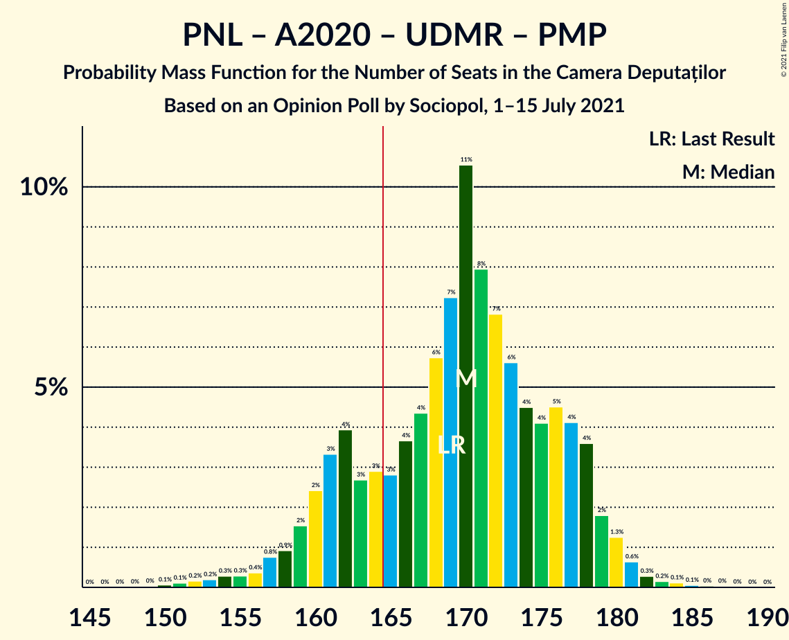
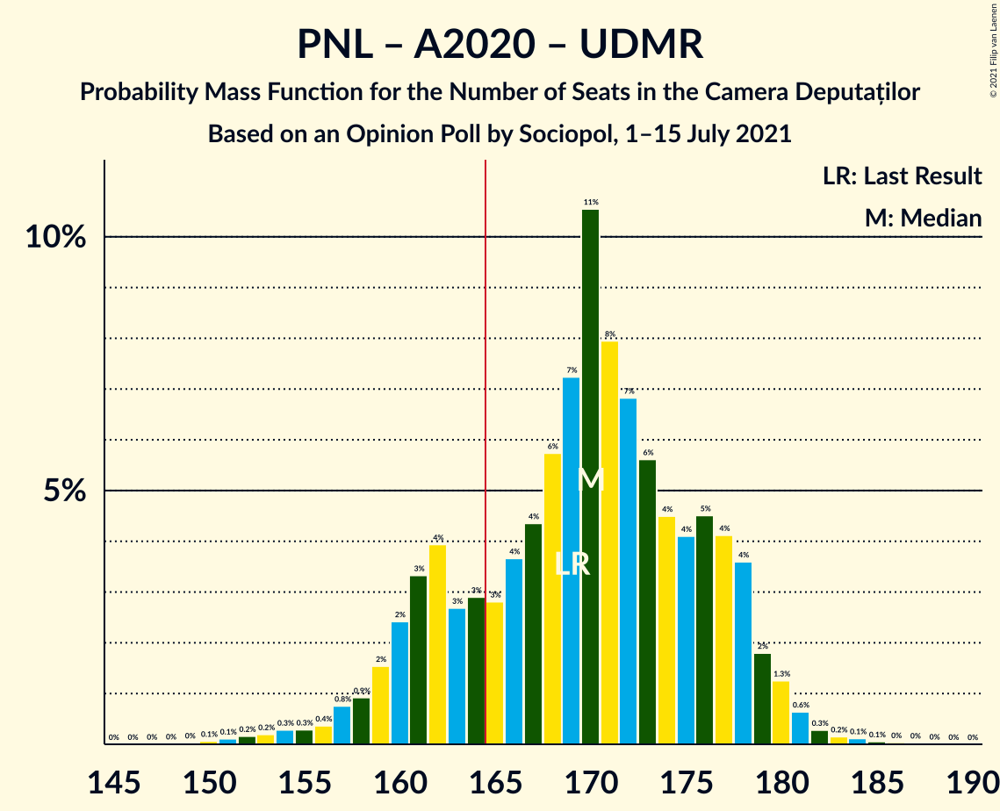
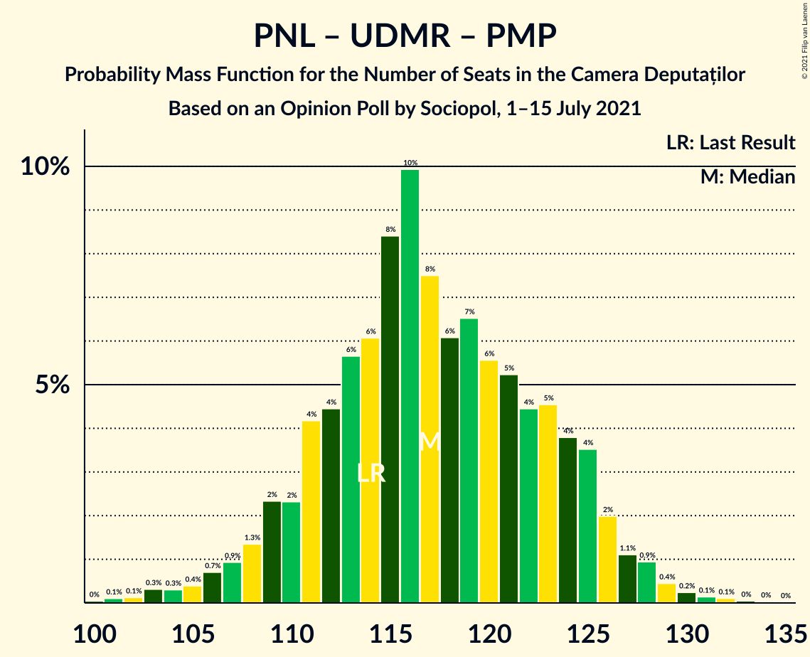

# Opinion Poll by Sociopol, 1–15 July 2021

<a href="#voting-intentions">Voting Intentions</a> | <a href="#seats">Seats</a> | <a href="#coalitions">Coalitions</a> | <a href="#technical-information">Technical Information</a>

## Voting Intentions

### Confidence Intervals

| Party | Last Result | Poll Result | 80% Confidence Interval | 90% Confidence Interval | 95% Confidence Interval | 99% Confidence Interval |
|:-----:|:-----------:|:-----------:|:-----------------------:|:-----------------------:|:-----------------------:|:-----------------------:|
| Partidul Social Democrat | 28.9% | 32.0% | 30.2–33.9% |29.7–34.4% |29.3–34.8% |28.5–35.7% |
| Partidul Național Liberal | 25.2% | 27.8% | 26.1–29.6% |25.7–30.1% |25.2–30.5% |24.4–31.4% |
| Alianța 2020 USR-PLUS | 15.4% | 15.5% | 14.1–16.9% |13.7–17.4% |13.4–17.7% |12.8–18.4% |
| Alianța pentru Unirea Românilor | 9.1% | 10.3% | 9.2–11.5% |8.9–11.9% |8.6–12.2% |8.1–12.8% |
| Uniunea Democrată Maghiară din România | 5.7% | 7.2% | 6.3–8.3% |6.0–8.6% |5.8–8.9% |5.4–9.4% |
| PRO România | 4.1% | 4.1% | 3.4–5.0% |3.2–5.2% |3.1–5.4% |2.8–5.9% |
| Partidul Mișcarea Populară | 4.8% | 2.1% | 1.6–2.8% |1.5–3.0% |1.4–3.1% |1.2–3.5% |

*Note:* The poll result column reflects the actual value used in the calculations. Published results may vary slightly, and in addition be rounded to fewer digits.

## Seats

### Confidence Intervals

| Party | Last Result | Median | 80% Confidence Interval | 90% Confidence Interval | 95% Confidence Interval | 99% Confidence Interval |
|:-----:|:-----------:|:------:|:-----------------------:|:-----------------------:|:-----------------------:|:-----------------------:|
| <a href="#partidul-social-democrat">Partidul Social Democrat</a> | 110 | 107 | 101–114 |99–115 |97–117 |94–120 |
| <a href="#partidul-național-liberal">Partidul Național Liberal</a> | 93 | 93 | 88–100 |86–101 |84–102 |81–105 |
| <a href="#alianța-2020-usr-plus">Alianța 2020 USR-PLUS</a> | 55 | 53 | 47–57 |46–58 |45–59 |43–62 |
| <a href="#alianța-pentru-unirea-românilor">Alianța pentru Unirea Românilor</a> | 33 | 33 | 30–38 |29–40 |28–41 |27–43 |
| <a href="#uniunea-democrată-maghiară-din-românia">Uniunea Democrată Maghiară din România</a> | 21 | 24 | 21–27 |20–29 |19–29 |18–31 |
| <a href="#pro-românia">PRO România</a> | 0 | 0 | 0–16 |0–17 |0–17 |0–19 |
| <a href="#partidul-mișcarea-populară">Partidul Mișcarea Populară</a> | 0 | 0 | 0 |0 |0 |0 |

### Partidul Social Democrat

*For a full overview of the results for this party, see the [Partidul Social Democrat](party-partidulsocialdemocrat.html) page.*

| Number of Seats | Probability | Accumulated | Special Marks |
|:---------------:|:-----------:|:-----------:|:-------------:|
| 90 | 0% | 100% |  |
| 91 | 0% | 99.9% |  |
| 92 | 0.1% | 99.9% |  |
| 93 | 0.2% | 99.8% |  |
| 94 | 0.3% | 99.6% |  |
| 95 | 0.3% | 99.4% |  |
| 96 | 0.6% | 99.0% |  |
| 97 | 1.0% | 98% |  |
| 98 | 2% | 97% |  |
| 99 | 2% | 96% |  |
| 100 | 3% | 94% |  |
| 101 | 3% | 91% |  |
| 102 | 6% | 88% |  |
| 103 | 6% | 82% |  |
| 104 | 6% | 77% |  |
| 105 | 7% | 70% |  |
| 106 | 9% | 64% |  |
| 107 | 8% | 54% | Median |
| 108 | 7% | 47% |  |
| 109 | 8% | 40% |  |
| 110 | 7% | 32% | Last Result |
| 111 | 6% | 24% |  |
| 112 | 4% | 18% |  |
| 113 | 4% | 14% |  |
| 114 | 3% | 10% |  |
| 115 | 2% | 7% |  |
| 116 | 1.4% | 5% |  |
| 117 | 1.3% | 3% |  |
| 118 | 0.8% | 2% |  |
| 119 | 0.5% | 1.2% |  |
| 120 | 0.2% | 0.7% |  |
| 121 | 0.3% | 0.5% |  |
| 122 | 0.1% | 0.2% |  |
| 123 | 0.1% | 0.1% |  |
| 124 | 0% | 0% |  |

### Partidul Național Liberal

*For a full overview of the results for this party, see the [Partidul Național Liberal](party-partidulnaționalliberal.html) page.*

| Number of Seats | Probability | Accumulated | Special Marks |
|:---------------:|:-----------:|:-----------:|:-------------:|
| 78 | 0.1% | 100% |  |
| 79 | 0.1% | 99.9% |  |
| 80 | 0.2% | 99.8% |  |
| 81 | 0.5% | 99.5% |  |
| 82 | 0.5% | 99.0% |  |
| 83 | 0.8% | 98.5% |  |
| 84 | 0.9% | 98% |  |
| 85 | 1.2% | 97% |  |
| 86 | 2% | 96% |  |
| 87 | 3% | 93% |  |
| 88 | 5% | 91% |  |
| 89 | 6% | 86% |  |
| 90 | 8% | 80% |  |
| 91 | 10% | 71% |  |
| 92 | 11% | 61% |  |
| 93 | 9% | 50% | Last Result, Median |
| 94 | 5% | 42% |  |
| 95 | 6% | 37% |  |
| 96 | 4% | 31% |  |
| 97 | 5% | 27% |  |
| 98 | 4% | 22% |  |
| 99 | 6% | 18% |  |
| 100 | 5% | 12% |  |
| 101 | 3% | 6% |  |
| 102 | 1.4% | 3% |  |
| 103 | 0.6% | 2% |  |
| 104 | 0.4% | 1.1% |  |
| 105 | 0.2% | 0.7% |  |
| 106 | 0.1% | 0.5% |  |
| 107 | 0.1% | 0.3% |  |
| 108 | 0.1% | 0.2% |  |
| 109 | 0.1% | 0.1% |  |
| 110 | 0% | 0% |  |

### Alianța 2020 USR-PLUS

*For a full overview of the results for this party, see the [Alianța 2020 USR-PLUS](party-alianța2020usr-plus.html) page.*

| Number of Seats | Probability | Accumulated | Special Marks |
|:---------------:|:-----------:|:-----------:|:-------------:|
| 40 | 0.1% | 100% |  |
| 41 | 0.1% | 99.9% |  |
| 42 | 0.2% | 99.8% |  |
| 43 | 0.6% | 99.6% |  |
| 44 | 0.8% | 99.0% |  |
| 45 | 2% | 98% |  |
| 46 | 3% | 96% |  |
| 47 | 4% | 93% |  |
| 48 | 5% | 89% |  |
| 49 | 7% | 84% |  |
| 50 | 8% | 76% |  |
| 51 | 7% | 69% |  |
| 52 | 9% | 62% |  |
| 53 | 9% | 52% | Median |
| 54 | 11% | 43% |  |
| 55 | 10% | 32% | Last Result |
| 56 | 9% | 22% |  |
| 57 | 5% | 13% |  |
| 58 | 3% | 7% |  |
| 59 | 2% | 5% |  |
| 60 | 1.1% | 2% |  |
| 61 | 0.6% | 1.3% |  |
| 62 | 0.4% | 0.8% |  |
| 63 | 0.2% | 0.4% |  |
| 64 | 0.1% | 0.2% |  |
| 65 | 0% | 0.1% |  |
| 66 | 0% | 0% |  |

### Alianța pentru Unirea Românilor

*For a full overview of the results for this party, see the [Alianța pentru Unirea Românilor](party-alianțapentruunirearomânilor.html) page.*

| Number of Seats | Probability | Accumulated | Special Marks |
|:---------------:|:-----------:|:-----------:|:-------------:|
| 25 | 0.1% | 100% |  |
| 26 | 0.2% | 99.9% |  |
| 27 | 0.7% | 99.7% |  |
| 28 | 2% | 99.0% |  |
| 29 | 5% | 97% |  |
| 30 | 9% | 92% |  |
| 31 | 12% | 83% |  |
| 32 | 15% | 71% |  |
| 33 | 15% | 56% | Last Result, Median |
| 34 | 12% | 41% |  |
| 35 | 10% | 29% |  |
| 36 | 5% | 19% |  |
| 37 | 3% | 14% |  |
| 38 | 3% | 10% |  |
| 39 | 2% | 8% |  |
| 40 | 2% | 5% |  |
| 41 | 1.3% | 3% |  |
| 42 | 1.0% | 2% |  |
| 43 | 0.6% | 1.0% |  |
| 44 | 0.3% | 0.4% |  |
| 45 | 0.1% | 0.2% |  |
| 46 | 0% | 0.1% |  |
| 47 | 0% | 0% |  |

### Uniunea Democrată Maghiară din România

*For a full overview of the results for this party, see the [Uniunea Democrată Maghiară din România](party-uniuneademocratămaghiarădinromânia.html) page.*

| Number of Seats | Probability | Accumulated | Special Marks |
|:---------------:|:-----------:|:-----------:|:-------------:|
| 16 | 0.1% | 100% |  |
| 17 | 0.3% | 99.9% |  |
| 18 | 1.2% | 99.6% |  |
| 19 | 3% | 98% |  |
| 20 | 5% | 96% |  |
| 21 | 9% | 91% | Last Result |
| 22 | 11% | 82% |  |
| 23 | 14% | 71% |  |
| 24 | 16% | 57% | Median |
| 25 | 14% | 41% |  |
| 26 | 10% | 27% |  |
| 27 | 7% | 17% |  |
| 28 | 4% | 10% |  |
| 29 | 3% | 5% |  |
| 30 | 1.2% | 2% |  |
| 31 | 0.5% | 0.9% |  |
| 32 | 0.2% | 0.4% |  |
| 33 | 0.1% | 0.2% |  |
| 34 | 0% | 0% |  |

### PRO România

*For a full overview of the results for this party, see the [PRO România](party-proromânia.html) page.*

| Number of Seats | Probability | Accumulated | Special Marks |
|:---------------:|:-----------:|:-----------:|:-------------:|
| 0 | 89% | 100% | Last Result, Median |
| 1 | 0% | 11% |  |
| 2 | 0% | 11% |  |
| 3 | 0% | 11% |  |
| 4 | 0% | 11% |  |
| 5 | 0% | 11% |  |
| 6 | 0% | 11% |  |
| 7 | 0% | 11% |  |
| 8 | 0% | 11% |  |
| 9 | 0% | 11% |  |
| 10 | 0% | 11% |  |
| 11 | 0% | 11% |  |
| 12 | 0% | 11% |  |
| 13 | 0% | 11% |  |
| 14 | 0% | 11% |  |
| 15 | 0% | 11% |  |
| 16 | 5% | 11% |  |
| 17 | 4% | 6% |  |
| 18 | 2% | 2% |  |
| 19 | 0.6% | 0.8% |  |
| 20 | 0.2% | 0.2% |  |
| 21 | 0% | 0% |  |

### Partidul Mișcarea Populară

*For a full overview of the results for this party, see the [Partidul Mișcarea Populară](party-partidulmișcareapopulară.html) page.*

| Number of Seats | Probability | Accumulated | Special Marks |
|:---------------:|:-----------:|:-----------:|:-------------:|
| 0 | 100% | 100% | Last Result, Median |

## Coalitions

### Confidence Intervals

| Coalition | Last Result | Median | Majority? | 80% Confidence Interval | 90% Confidence Interval | 95% Confidence Interval | 99% Confidence Interval |
|:---------:|:-----------:|:------:|:---------:|:-----------------------:|:-----------------------:|:-----------------------:|:-----------------------:|
| Partidul Național Liberal – Alianța 2020 USR-PLUS – Uniunea Democrată Maghiară din România – Partidul Mișcarea Populară | 169 | 170 | 80% | 161–177 | 160–178 | 158–180 | 153–182 |
| Partidul Național Liberal – Alianța 2020 USR-PLUS – Uniunea Democrată Maghiară din România | 169 | 170 | 80% | 161–177 | 160–178 | 158–180 | 153–182 |
| Partidul Național Liberal – Alianța 2020 USR-PLUS – Partidul Mișcarea Populară | 148 | 146 | 0% | 138–153 | 136–154 | 135–156 | 130–158 |
| Partidul Național Liberal – Alianța 2020 USR-PLUS | 148 | 146 | 0% | 138–153 | 136–154 | 135–156 | 130–158 |
| Partidul Național Liberal – Uniunea Democrată Maghiară din România – Partidul Mișcarea Populară | 114 | 117 | 0% | 111–124 | 109–126 | 107–127 | 103–130 |
| Partidul Național Liberal – Uniunea Democrată Maghiară din România | 114 | 117 | 0% | 111–124 | 109–126 | 107–127 | 103–130 |
| Partidul Social Democrat – PRO România | 110 | 109 | 0% | 102–117 | 101–120 | 99–122 | 96–126 |
| Partidul Național Liberal – Partidul Mișcarea Populară | 93 | 93 | 0% | 88–100 | 86–101 | 84–102 | 81–105 |
| Partidul Național Liberal | 93 | 93 | 0% | 88–100 | 86–101 | 84–102 | 81–105 |
| Alianța 2020 USR-PLUS – Partidul Mișcarea Populară | 55 | 53 | 0% | 47–57 | 46–58 | 45–59 | 43–62 |

### Partidul Național Liberal – Alianța 2020 USR-PLUS – Uniunea Democrată Maghiară din România – Partidul Mișcarea Populară

| Number of Seats | Probability | Accumulated | Special Marks |
|:---------------:|:-----------:|:-----------:|:-------------:|
| 149 | 0% | 100% |  |
| 150 | 0.1% | 99.9% |  |
| 151 | 0.1% | 99.9% |  |
| 152 | 0.2% | 99.8% |  |
| 153 | 0.2% | 99.6% |  |
| 154 | 0.3% | 99.4% |  |
| 155 | 0.3% | 99.1% |  |
| 156 | 0.4% | 98.8% |  |
| 157 | 0.8% | 98% |  |
| 158 | 0.9% | 98% |  |
| 159 | 2% | 97% |  |
| 160 | 2% | 95% |  |
| 161 | 3% | 93% |  |
| 162 | 4% | 89% |  |
| 163 | 3% | 86% |  |
| 164 | 3% | 83% |  |
| 165 | 3% | 80% | Majority |
| 166 | 4% | 77% |  |
| 167 | 4% | 73% |  |
| 168 | 6% | 69% |  |
| 169 | 7% | 63% | Last Result |
| 170 | 11% | 56% | Median |
| 171 | 8% | 46% |  |
| 172 | 7% | 38% |  |
| 173 | 6% | 31% |  |
| 174 | 4% | 25% |  |
| 175 | 4% | 21% |  |
| 176 | 5% | 17% |  |
| 177 | 4% | 12% |  |
| 178 | 4% | 8% |  |
| 179 | 2% | 4% |  |
| 180 | 1.3% | 3% |  |
| 181 | 0.6% | 1.3% |  |
| 182 | 0.3% | 0.7% |  |
| 183 | 0.2% | 0.4% |  |
| 184 | 0.1% | 0.3% |  |
| 185 | 0.1% | 0.1% |  |
| 186 | 0% | 0.1% |  |
| 187 | 0% | 0% |  |

### Partidul Național Liberal – Alianța 2020 USR-PLUS – Uniunea Democrată Maghiară din România

| Number of Seats | Probability | Accumulated | Special Marks |
|:---------------:|:-----------:|:-----------:|:-------------:|
| 149 | 0% | 100% |  |
| 150 | 0.1% | 99.9% |  |
| 151 | 0.1% | 99.9% |  |
| 152 | 0.2% | 99.8% |  |
| 153 | 0.2% | 99.6% |  |
| 154 | 0.3% | 99.4% |  |
| 155 | 0.3% | 99.1% |  |
| 156 | 0.4% | 98.8% |  |
| 157 | 0.8% | 98% |  |
| 158 | 0.9% | 98% |  |
| 159 | 2% | 97% |  |
| 160 | 2% | 95% |  |
| 161 | 3% | 93% |  |
| 162 | 4% | 89% |  |
| 163 | 3% | 86% |  |
| 164 | 3% | 83% |  |
| 165 | 3% | 80% | Majority |
| 166 | 4% | 77% |  |
| 167 | 4% | 73% |  |
| 168 | 6% | 69% |  |
| 169 | 7% | 63% | Last Result |
| 170 | 11% | 56% | Median |
| 171 | 8% | 46% |  |
| 172 | 7% | 38% |  |
| 173 | 6% | 31% |  |
| 174 | 4% | 25% |  |
| 175 | 4% | 21% |  |
| 176 | 5% | 17% |  |
| 177 | 4% | 12% |  |
| 178 | 4% | 8% |  |
| 179 | 2% | 4% |  |
| 180 | 1.3% | 3% |  |
| 181 | 0.6% | 1.3% |  |
| 182 | 0.3% | 0.7% |  |
| 183 | 0.2% | 0.4% |  |
| 184 | 0.1% | 0.3% |  |
| 185 | 0.1% | 0.1% |  |
| 186 | 0% | 0.1% |  |
| 187 | 0% | 0% |  |

### Partidul Național Liberal – Alianța 2020 USR-PLUS – Partidul Mișcarea Populară

| Number of Seats | Probability | Accumulated | Special Marks |
|:---------------:|:-----------:|:-----------:|:-------------:|
| 126 | 0% | 100% |  |
| 127 | 0.1% | 99.9% |  |
| 128 | 0.1% | 99.9% |  |
| 129 | 0.2% | 99.8% |  |
| 130 | 0.2% | 99.6% |  |
| 131 | 0.3% | 99.4% |  |
| 132 | 0.3% | 99.1% |  |
| 133 | 0.4% | 98.7% |  |
| 134 | 0.7% | 98% |  |
| 135 | 1.2% | 98% |  |
| 136 | 2% | 96% |  |
| 137 | 3% | 94% |  |
| 138 | 3% | 91% |  |
| 139 | 4% | 88% |  |
| 140 | 3% | 84% |  |
| 141 | 3% | 81% |  |
| 142 | 4% | 78% |  |
| 143 | 5% | 74% |  |
| 144 | 7% | 69% |  |
| 145 | 8% | 62% |  |
| 146 | 9% | 54% | Median |
| 147 | 10% | 46% |  |
| 148 | 7% | 36% | Last Result |
| 149 | 5% | 29% |  |
| 150 | 4% | 24% |  |
| 151 | 4% | 21% |  |
| 152 | 5% | 17% |  |
| 153 | 5% | 12% |  |
| 154 | 3% | 7% |  |
| 155 | 2% | 4% |  |
| 156 | 1.4% | 3% |  |
| 157 | 0.6% | 1.3% |  |
| 158 | 0.2% | 0.7% |  |
| 159 | 0.2% | 0.5% |  |
| 160 | 0.1% | 0.3% |  |
| 161 | 0.1% | 0.2% |  |
| 162 | 0% | 0.1% |  |
| 163 | 0% | 0.1% |  |
| 164 | 0% | 0% |  |

### Partidul Național Liberal – Alianța 2020 USR-PLUS

| Number of Seats | Probability | Accumulated | Special Marks |
|:---------------:|:-----------:|:-----------:|:-------------:|
| 126 | 0% | 100% |  |
| 127 | 0.1% | 99.9% |  |
| 128 | 0.1% | 99.9% |  |
| 129 | 0.2% | 99.8% |  |
| 130 | 0.2% | 99.6% |  |
| 131 | 0.3% | 99.4% |  |
| 132 | 0.3% | 99.1% |  |
| 133 | 0.4% | 98.7% |  |
| 134 | 0.7% | 98% |  |
| 135 | 1.2% | 98% |  |
| 136 | 2% | 96% |  |
| 137 | 3% | 94% |  |
| 138 | 3% | 91% |  |
| 139 | 4% | 88% |  |
| 140 | 3% | 84% |  |
| 141 | 3% | 81% |  |
| 142 | 4% | 78% |  |
| 143 | 5% | 74% |  |
| 144 | 7% | 69% |  |
| 145 | 8% | 62% |  |
| 146 | 9% | 54% | Median |
| 147 | 10% | 46% |  |
| 148 | 7% | 36% | Last Result |
| 149 | 5% | 29% |  |
| 150 | 4% | 24% |  |
| 151 | 4% | 21% |  |
| 152 | 5% | 17% |  |
| 153 | 5% | 12% |  |
| 154 | 3% | 7% |  |
| 155 | 2% | 4% |  |
| 156 | 1.4% | 3% |  |
| 157 | 0.6% | 1.3% |  |
| 158 | 0.2% | 0.7% |  |
| 159 | 0.2% | 0.5% |  |
| 160 | 0.1% | 0.3% |  |
| 161 | 0.1% | 0.2% |  |
| 162 | 0% | 0.1% |  |
| 163 | 0% | 0.1% |  |
| 164 | 0% | 0% |  |

### Partidul Național Liberal – Uniunea Democrată Maghiară din România – Partidul Mișcarea Populară

| Number of Seats | Probability | Accumulated | Special Marks |
|:---------------:|:-----------:|:-----------:|:-------------:|
| 100 | 0% | 100% |  |
| 101 | 0.1% | 99.9% |  |
| 102 | 0.1% | 99.8% |  |
| 103 | 0.3% | 99.7% |  |
| 104 | 0.3% | 99.4% |  |
| 105 | 0.4% | 99.1% |  |
| 106 | 0.7% | 98.7% |  |
| 107 | 0.9% | 98% |  |
| 108 | 1.3% | 97% |  |
| 109 | 2% | 96% |  |
| 110 | 2% | 93% |  |
| 111 | 4% | 91% |  |
| 112 | 4% | 87% |  |
| 113 | 6% | 82% |  |
| 114 | 6% | 77% | Last Result |
| 115 | 8% | 71% |  |
| 116 | 10% | 62% |  |
| 117 | 8% | 52% | Median |
| 118 | 6% | 45% |  |
| 119 | 7% | 39% |  |
| 120 | 6% | 32% |  |
| 121 | 5% | 27% |  |
| 122 | 4% | 21% |  |
| 123 | 5% | 17% |  |
| 124 | 4% | 12% |  |
| 125 | 4% | 9% |  |
| 126 | 2% | 5% |  |
| 127 | 1.1% | 3% |  |
| 128 | 0.9% | 2% |  |
| 129 | 0.4% | 1.1% |  |
| 130 | 0.2% | 0.6% |  |
| 131 | 0.1% | 0.4% |  |
| 132 | 0.1% | 0.2% |  |
| 133 | 0% | 0.1% |  |
| 134 | 0% | 0.1% |  |
| 135 | 0% | 0% |  |

### Partidul Național Liberal – Uniunea Democrată Maghiară din România

| Number of Seats | Probability | Accumulated | Special Marks |
|:---------------:|:-----------:|:-----------:|:-------------:|
| 100 | 0% | 100% |  |
| 101 | 0.1% | 99.9% |  |
| 102 | 0.1% | 99.8% |  |
| 103 | 0.3% | 99.7% |  |
| 104 | 0.3% | 99.4% |  |
| 105 | 0.4% | 99.1% |  |
| 106 | 0.7% | 98.7% |  |
| 107 | 0.9% | 98% |  |
| 108 | 1.3% | 97% |  |
| 109 | 2% | 96% |  |
| 110 | 2% | 93% |  |
| 111 | 4% | 91% |  |
| 112 | 4% | 87% |  |
| 113 | 6% | 82% |  |
| 114 | 6% | 77% | Last Result |
| 115 | 8% | 71% |  |
| 116 | 10% | 62% |  |
| 117 | 8% | 52% | Median |
| 118 | 6% | 45% |  |
| 119 | 7% | 39% |  |
| 120 | 6% | 32% |  |
| 121 | 5% | 27% |  |
| 122 | 4% | 21% |  |
| 123 | 5% | 17% |  |
| 124 | 4% | 12% |  |
| 125 | 4% | 9% |  |
| 126 | 2% | 5% |  |
| 127 | 1.1% | 3% |  |
| 128 | 0.9% | 2% |  |
| 129 | 0.4% | 1.1% |  |
| 130 | 0.2% | 0.6% |  |
| 131 | 0.1% | 0.4% |  |
| 132 | 0.1% | 0.2% |  |
| 133 | 0% | 0.1% |  |
| 134 | 0% | 0.1% |  |
| 135 | 0% | 0% |  |

### Partidul Social Democrat – PRO România

| Number of Seats | Probability | Accumulated | Special Marks |
|:---------------:|:-----------:|:-----------:|:-------------:|
| 93 | 0% | 100% |  |
| 94 | 0.1% | 99.9% |  |
| 95 | 0.1% | 99.8% |  |
| 96 | 0.2% | 99.7% |  |
| 97 | 0.5% | 99.5% |  |
| 98 | 0.9% | 99.0% |  |
| 99 | 1.2% | 98% |  |
| 100 | 1.3% | 97% |  |
| 101 | 3% | 96% |  |
| 102 | 4% | 93% |  |
| 103 | 5% | 89% |  |
| 104 | 5% | 84% |  |
| 105 | 6% | 79% |  |
| 106 | 9% | 73% |  |
| 107 | 7% | 64% | Median |
| 108 | 6% | 57% |  |
| 109 | 8% | 51% |  |
| 110 | 7% | 43% | Last Result |
| 111 | 6% | 35% |  |
| 112 | 4% | 29% |  |
| 113 | 4% | 25% |  |
| 114 | 4% | 21% |  |
| 115 | 3% | 17% |  |
| 116 | 3% | 14% |  |
| 117 | 2% | 11% |  |
| 118 | 2% | 9% |  |
| 119 | 1.4% | 7% |  |
| 120 | 1.5% | 6% |  |
| 121 | 0.9% | 4% |  |
| 122 | 0.9% | 3% |  |
| 123 | 0.7% | 2% |  |
| 124 | 0.5% | 2% |  |
| 125 | 0.4% | 1.1% |  |
| 126 | 0.3% | 0.7% |  |
| 127 | 0.1% | 0.4% |  |
| 128 | 0.1% | 0.3% |  |
| 129 | 0.1% | 0.2% |  |
| 130 | 0.1% | 0.1% |  |
| 131 | 0% | 0.1% |  |
| 132 | 0% | 0% |  |

### Partidul Național Liberal – Partidul Mișcarea Populară

| Number of Seats | Probability | Accumulated | Special Marks |
|:---------------:|:-----------:|:-----------:|:-------------:|
| 78 | 0.1% | 100% |  |
| 79 | 0.1% | 99.9% |  |
| 80 | 0.2% | 99.8% |  |
| 81 | 0.5% | 99.5% |  |
| 82 | 0.5% | 99.0% |  |
| 83 | 0.8% | 98.5% |  |
| 84 | 0.9% | 98% |  |
| 85 | 1.2% | 97% |  |
| 86 | 2% | 96% |  |
| 87 | 3% | 93% |  |
| 88 | 5% | 91% |  |
| 89 | 6% | 86% |  |
| 90 | 8% | 80% |  |
| 91 | 10% | 71% |  |
| 92 | 11% | 61% |  |
| 93 | 9% | 50% | Last Result, Median |
| 94 | 5% | 42% |  |
| 95 | 6% | 37% |  |
| 96 | 4% | 31% |  |
| 97 | 5% | 27% |  |
| 98 | 4% | 22% |  |
| 99 | 6% | 18% |  |
| 100 | 5% | 12% |  |
| 101 | 3% | 6% |  |
| 102 | 1.4% | 3% |  |
| 103 | 0.6% | 2% |  |
| 104 | 0.4% | 1.1% |  |
| 105 | 0.2% | 0.7% |  |
| 106 | 0.1% | 0.5% |  |
| 107 | 0.1% | 0.3% |  |
| 108 | 0.1% | 0.2% |  |
| 109 | 0.1% | 0.1% |  |
| 110 | 0% | 0% |  |

### Partidul Național Liberal

| Number of Seats | Probability | Accumulated | Special Marks |
|:---------------:|:-----------:|:-----------:|:-------------:|
| 78 | 0.1% | 100% |  |
| 79 | 0.1% | 99.9% |  |
| 80 | 0.2% | 99.8% |  |
| 81 | 0.5% | 99.5% |  |
| 82 | 0.5% | 99.0% |  |
| 83 | 0.8% | 98.5% |  |
| 84 | 0.9% | 98% |  |
| 85 | 1.2% | 97% |  |
| 86 | 2% | 96% |  |
| 87 | 3% | 93% |  |
| 88 | 5% | 91% |  |
| 89 | 6% | 86% |  |
| 90 | 8% | 80% |  |
| 91 | 10% | 71% |  |
| 92 | 11% | 61% |  |
| 93 | 9% | 50% | Last Result, Median |
| 94 | 5% | 42% |  |
| 95 | 6% | 37% |  |
| 96 | 4% | 31% |  |
| 97 | 5% | 27% |  |
| 98 | 4% | 22% |  |
| 99 | 6% | 18% |  |
| 100 | 5% | 12% |  |
| 101 | 3% | 6% |  |
| 102 | 1.4% | 3% |  |
| 103 | 0.6% | 2% |  |
| 104 | 0.4% | 1.1% |  |
| 105 | 0.2% | 0.7% |  |
| 106 | 0.1% | 0.5% |  |
| 107 | 0.1% | 0.3% |  |
| 108 | 0.1% | 0.2% |  |
| 109 | 0.1% | 0.1% |  |
| 110 | 0% | 0% |  |

### Alianța 2020 USR-PLUS – Partidul Mișcarea Populară

| Number of Seats | Probability | Accumulated | Special Marks |
|:---------------:|:-----------:|:-----------:|:-------------:|
| 40 | 0.1% | 100% |  |
| 41 | 0.1% | 99.9% |  |
| 42 | 0.2% | 99.8% |  |
| 43 | 0.6% | 99.6% |  |
| 44 | 0.8% | 99.0% |  |
| 45 | 2% | 98% |  |
| 46 | 3% | 96% |  |
| 47 | 4% | 93% |  |
| 48 | 5% | 89% |  |
| 49 | 7% | 84% |  |
| 50 | 8% | 76% |  |
| 51 | 7% | 69% |  |
| 52 | 9% | 62% |  |
| 53 | 9% | 52% | Median |
| 54 | 11% | 43% |  |
| 55 | 10% | 32% | Last Result |
| 56 | 9% | 22% |  |
| 57 | 5% | 13% |  |
| 58 | 3% | 7% |  |
| 59 | 2% | 5% |  |
| 60 | 1.1% | 2% |  |
| 61 | 0.6% | 1.3% |  |
| 62 | 0.4% | 0.8% |  |
| 63 | 0.2% | 0.4% |  |
| 64 | 0.1% | 0.2% |  |
| 65 | 0% | 0.1% |  |
| 66 | 0% | 0% |  |

## Technical Information

### Opinion Poll

+ **Polling firm:** Sociopol
+ **Commissioner(s):** —
+ **Fieldwork period:** 1–15 July 2021

### Calculations

+ **Sample size:** 1100
+ **Simulations done:** 1,048,576
+ **Error estimate:** 0.44%

