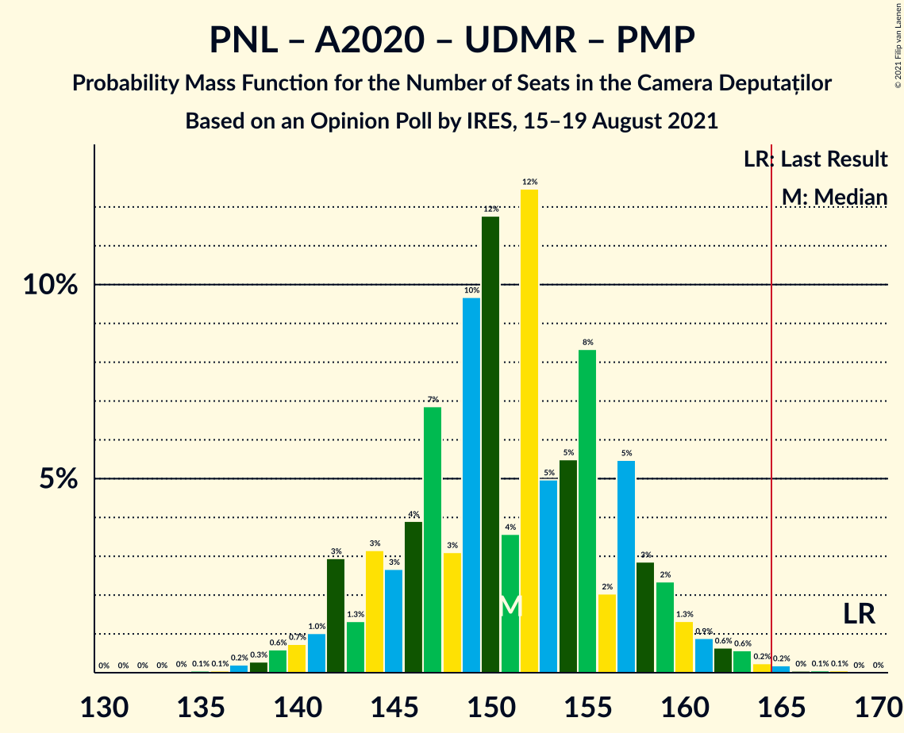
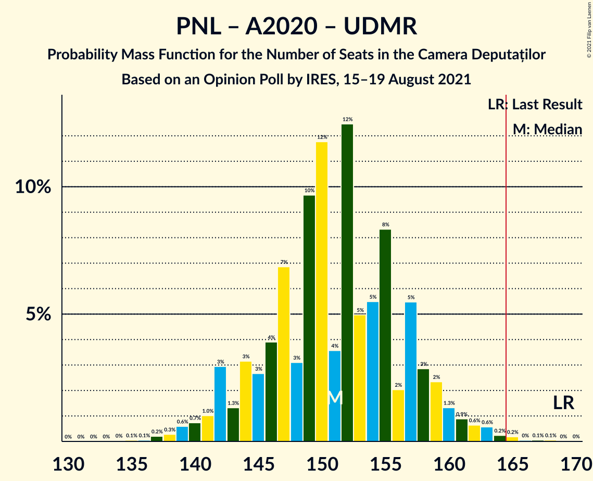

# Opinion Poll by IRES, 15–19 August 2021

<a href="#voting-intentions">Voting Intentions</a> | <a href="#seats">Seats</a> | <a href="#coalitions">Coalitions</a> | <a href="#technical-information">Technical Information</a>

## Voting Intentions

### Confidence Intervals

| Party | Last Result | Poll Result | 80% Confidence Interval | 90% Confidence Interval | 95% Confidence Interval | 99% Confidence Interval |
|:-----:|:-----------:|:-----------:|:-----------------------:|:-----------------------:|:-----------------------:|:-----------------------:|
| Partidul Social Democrat | 28.9% | 35.0% | 33.1–37.0% |32.6–37.5% |32.1–38.0% |31.2–38.9% |
| Partidul Național Liberal | 25.2% | 27.0% | 25.3–28.9% |24.8–29.4% |24.4–29.9% |23.6–30.8% |
| Alianța 2020 USR-PLUS | 15.4% | 14.0% | 12.7–15.5% |12.3–15.9% |12.0–16.3% |11.4–17.0% |
| Alianța pentru Unirea Românilor | 9.1% | 14.0% | 12.7–15.5% |12.3–15.9% |12.0–16.3% |11.4–17.0% |
| Uniunea Democrată Maghiară din România | 5.7% | 5.0% | 4.2–6.0% |4.0–6.2% |3.8–6.5% |3.4–7.0% |
| PRO România | 4.1% | 3.0% | 2.4–3.8% |2.2–4.0% |2.1–4.2% |1.8–4.6% |
| Partidul Mișcarea Populară | 4.8% | 2.0% | 1.5–2.7% |1.4–2.9% |1.3–3.1% |1.1–3.4% |

*Note:* The poll result column reflects the actual value used in the calculations. Published results may vary slightly, and in addition be rounded to fewer digits.

## Seats

### Confidence Intervals

| Party | Last Result | Median | 80% Confidence Interval | 90% Confidence Interval | 95% Confidence Interval | 99% Confidence Interval |
|:-----:|:-----------:|:------:|:-----------------------:|:-----------------------:|:-----------------------:|:-----------------------:|
| <a href="#partidul-social-democrat">Partidul Social Democrat</a> | 110 | 113 | 107–121 |107–122 |107–124 |103–128 |
| <a href="#partidul-național-liberal">Partidul Național Liberal</a> | 93 | 90 | 84–94 |82–95 |81–97 |77–101 |
| <a href="#alianța-2020-usr-plus">Alianța 2020 USR-PLUS</a> | 55 | 46 | 43–51 |40–51 |39–52 |38–55 |
| <a href="#alianța-pentru-unirea-românilor">Alianța pentru Unirea Românilor</a> | 33 | 47 | 42–50 |41–51 |39–53 |38–55 |
| <a href="#uniunea-democrată-maghiară-din-românia">Uniunea Democrată Maghiară din România</a> | 21 | 16 | 13–19 |13–19 |12–20 |12–22 |
| <a href="#pro-românia">PRO România</a> | 0 | 0 | 0 |0 |0 |0 |
| <a href="#partidul-mișcarea-populară">Partidul Mișcarea Populară</a> | 0 | 0 | 0 |0 |0 |0 |

### Partidul Social Democrat

*For a full overview of the results for this party, see the [Partidul Social Democrat](party-partidulsocialdemocrat.html) page.*

| Number of Seats | Probability | Accumulated | Special Marks |
|:---------------:|:-----------:|:-----------:|:-------------:|
| 99 | 0.1% | 100% |  |
| 100 | 0% | 99.9% |  |
| 101 | 0.1% | 99.9% |  |
| 102 | 0.1% | 99.8% |  |
| 103 | 0.2% | 99.7% |  |
| 104 | 0.1% | 99.4% |  |
| 105 | 0.2% | 99.4% |  |
| 106 | 1.0% | 99.2% |  |
| 107 | 8% | 98% |  |
| 108 | 8% | 90% |  |
| 109 | 7% | 82% |  |
| 110 | 13% | 75% | Last Result |
| 111 | 2% | 62% |  |
| 112 | 1.3% | 60% |  |
| 113 | 13% | 58% | Median |
| 114 | 3% | 45% |  |
| 115 | 8% | 42% |  |
| 116 | 7% | 34% |  |
| 117 | 12% | 28% |  |
| 118 | 2% | 16% |  |
| 119 | 1.5% | 14% |  |
| 120 | 3% | 13% |  |
| 121 | 4% | 10% |  |
| 122 | 2% | 6% |  |
| 123 | 0.4% | 4% |  |
| 124 | 2% | 4% |  |
| 125 | 0.3% | 2% |  |
| 126 | 1.0% | 2% |  |
| 127 | 0% | 0.8% |  |
| 128 | 0.7% | 0.8% |  |
| 129 | 0% | 0.1% |  |
| 130 | 0% | 0.1% |  |
| 131 | 0% | 0.1% |  |
| 132 | 0% | 0% |  |

### Partidul Național Liberal

*For a full overview of the results for this party, see the [Partidul Național Liberal](party-partidulnaționalliberal.html) page.*

| Number of Seats | Probability | Accumulated | Special Marks |
|:---------------:|:-----------:|:-----------:|:-------------:|
| 74 | 0.1% | 100% |  |
| 75 | 0% | 99.9% |  |
| 76 | 0.1% | 99.8% |  |
| 77 | 0.4% | 99.8% |  |
| 78 | 0.2% | 99.4% |  |
| 79 | 0.1% | 99.2% |  |
| 80 | 0.6% | 99.1% |  |
| 81 | 2% | 98% |  |
| 82 | 2% | 96% |  |
| 83 | 0.7% | 94% |  |
| 84 | 12% | 94% |  |
| 85 | 3% | 82% |  |
| 86 | 3% | 79% |  |
| 87 | 8% | 76% |  |
| 88 | 3% | 68% |  |
| 89 | 12% | 65% |  |
| 90 | 10% | 53% | Median |
| 91 | 19% | 43% |  |
| 92 | 0.6% | 24% |  |
| 93 | 9% | 23% | Last Result |
| 94 | 7% | 15% |  |
| 95 | 4% | 8% |  |
| 96 | 0.4% | 3% |  |
| 97 | 0.6% | 3% |  |
| 98 | 0.1% | 2% |  |
| 99 | 2% | 2% |  |
| 100 | 0% | 0.8% |  |
| 101 | 0.5% | 0.8% |  |
| 102 | 0% | 0.2% |  |
| 103 | 0.1% | 0.2% |  |
| 104 | 0% | 0.1% |  |
| 105 | 0% | 0.1% |  |
| 106 | 0.1% | 0.1% |  |
| 107 | 0% | 0% |  |

### Alianța 2020 USR-PLUS

*For a full overview of the results for this party, see the [Alianța 2020 USR-PLUS](party-alianța2020usr-plus.html) page.*

| Number of Seats | Probability | Accumulated | Special Marks |
|:---------------:|:-----------:|:-----------:|:-------------:|
| 36 | 0.3% | 100% |  |
| 37 | 0.1% | 99.7% |  |
| 38 | 0.1% | 99.6% |  |
| 39 | 3% | 99.5% |  |
| 40 | 2% | 97% |  |
| 41 | 3% | 95% |  |
| 42 | 0.7% | 92% |  |
| 43 | 10% | 91% |  |
| 44 | 24% | 81% |  |
| 45 | 0.9% | 58% |  |
| 46 | 15% | 57% | Median |
| 47 | 2% | 42% |  |
| 48 | 14% | 40% |  |
| 49 | 3% | 26% |  |
| 50 | 2% | 23% |  |
| 51 | 17% | 22% |  |
| 52 | 2% | 4% |  |
| 53 | 0.3% | 2% |  |
| 54 | 0.4% | 2% |  |
| 55 | 0.7% | 1.2% | Last Result |
| 56 | 0.2% | 0.5% |  |
| 57 | 0% | 0.2% |  |
| 58 | 0% | 0.2% |  |
| 59 | 0.2% | 0.2% |  |
| 60 | 0% | 0% |  |

### Alianța pentru Unirea Românilor

*For a full overview of the results for this party, see the [Alianța pentru Unirea Românilor](party-alianțapentruunirearomânilor.html) page.*

| Number of Seats | Probability | Accumulated | Special Marks |
|:---------------:|:-----------:|:-----------:|:-------------:|
| 33 | 0% | 100% | Last Result |
| 34 | 0% | 100% |  |
| 35 | 0.1% | 100% |  |
| 36 | 0.1% | 99.9% |  |
| 37 | 0.1% | 99.8% |  |
| 38 | 0.3% | 99.7% |  |
| 39 | 2% | 99.4% |  |
| 40 | 0.5% | 97% |  |
| 41 | 6% | 97% |  |
| 42 | 6% | 91% |  |
| 43 | 3% | 85% |  |
| 44 | 9% | 82% |  |
| 45 | 8% | 73% |  |
| 46 | 15% | 65% |  |
| 47 | 11% | 51% | Median |
| 48 | 2% | 40% |  |
| 49 | 1.1% | 38% |  |
| 50 | 30% | 36% |  |
| 51 | 2% | 6% |  |
| 52 | 2% | 4% |  |
| 53 | 2% | 3% |  |
| 54 | 0.2% | 1.1% |  |
| 55 | 0.7% | 0.9% |  |
| 56 | 0.1% | 0.2% |  |
| 57 | 0% | 0.1% |  |
| 58 | 0% | 0% |  |

### Uniunea Democrată Maghiară din România

*For a full overview of the results for this party, see the [Uniunea Democrată Maghiară din România](party-uniuneademocratămaghiarădinromânia.html) page.*

| Number of Seats | Probability | Accumulated | Special Marks |
|:---------------:|:-----------:|:-----------:|:-------------:|
| 10 | 0.1% | 100% |  |
| 11 | 0.2% | 99.8% |  |
| 12 | 2% | 99.6% |  |
| 13 | 10% | 97% |  |
| 14 | 15% | 87% |  |
| 15 | 4% | 72% |  |
| 16 | 19% | 68% | Median |
| 17 | 20% | 49% |  |
| 18 | 12% | 29% |  |
| 19 | 13% | 17% |  |
| 20 | 2% | 4% |  |
| 21 | 1.4% | 2% | Last Result |
| 22 | 0.6% | 0.8% |  |
| 23 | 0.1% | 0.2% |  |
| 24 | 0% | 0.1% |  |
| 25 | 0.1% | 0.1% |  |
| 26 | 0% | 0% |  |

### PRO România

*For a full overview of the results for this party, see the [PRO România](party-proromânia.html) page.*

| Number of Seats | Probability | Accumulated | Special Marks |
|:---------------:|:-----------:|:-----------:|:-------------:|
| 0 | 99.9% | 100% | Last Result, Median |
| 1 | 0% | 0.1% |  |
| 2 | 0% | 0.1% |  |
| 3 | 0% | 0.1% |  |
| 4 | 0% | 0.1% |  |
| 5 | 0% | 0.1% |  |
| 6 | 0% | 0.1% |  |
| 7 | 0% | 0.1% |  |
| 8 | 0% | 0.1% |  |
| 9 | 0% | 0.1% |  |
| 10 | 0% | 0.1% |  |
| 11 | 0% | 0.1% |  |
| 12 | 0% | 0.1% |  |
| 13 | 0% | 0.1% |  |
| 14 | 0% | 0.1% |  |
| 15 | 0% | 0.1% |  |
| 16 | 0% | 0.1% |  |
| 17 | 0% | 0% |  |

### Partidul Mișcarea Populară

*For a full overview of the results for this party, see the [Partidul Mișcarea Populară](party-partidulmișcareapopulară.html) page.*

| Number of Seats | Probability | Accumulated | Special Marks |
|:---------------:|:-----------:|:-----------:|:-------------:|
| 0 | 100% | 100% | Last Result, Median |

## Coalitions

### Confidence Intervals

| Coalition | Last Result | Median | Majority? | 80% Confidence Interval | 90% Confidence Interval | 95% Confidence Interval | 99% Confidence Interval |
|:---------:|:-----------:|:------:|:---------:|:-----------------------:|:-----------------------:|:-----------------------:|:-----------------------:|
| Partidul Național Liberal – Alianța 2020 USR-PLUS – Uniunea Democrată Maghiară din România – Partidul Mișcarea Populară | 169 | 152 | 0.3% | 146–158 | 143–159 | 141–161 | 139–164 |
| Partidul Național Liberal – Alianța 2020 USR-PLUS – Uniunea Democrată Maghiară din România | 169 | 152 | 0.3% | 146–158 | 143–159 | 141–161 | 139–164 |
| Partidul Național Liberal – Alianța 2020 USR-PLUS – Partidul Mișcarea Populară | 148 | 135 | 0% | 130–142 | 127–145 | 124–145 | 122–148 |
| Partidul Național Liberal – Alianța 2020 USR-PLUS | 148 | 135 | 0% | 130–142 | 127–145 | 124–145 | 122–148 |
| Partidul Social Democrat – PRO România | 110 | 113 | 0% | 107–121 | 107–122 | 107–124 | 103–128 |
| Partidul Național Liberal – Uniunea Democrată Maghiară din România – Partidul Mișcarea Populară | 114 | 106 | 0% | 101–109 | 98–112 | 97–115 | 93–117 |
| Partidul Național Liberal – Uniunea Democrată Maghiară din România | 114 | 106 | 0% | 101–109 | 98–112 | 97–115 | 93–117 |
| Partidul Național Liberal – Partidul Mișcarea Populară | 93 | 90 | 0% | 84–94 | 82–95 | 81–97 | 77–101 |
| Partidul Național Liberal | 93 | 90 | 0% | 84–94 | 82–95 | 81–97 | 77–101 |
| Alianța 2020 USR-PLUS – Partidul Mișcarea Populară | 55 | 46 | 0% | 43–51 | 40–51 | 39–52 | 38–55 |

### Partidul Național Liberal – Alianța 2020 USR-PLUS – Uniunea Democrată Maghiară din România – Partidul Mișcarea Populară

| Number of Seats | Probability | Accumulated | Special Marks |
|:---------------:|:-----------:|:-----------:|:-------------:|
| 134 | 0.1% | 100% |  |
| 135 | 0% | 99.9% |  |
| 136 | 0% | 99.9% |  |
| 137 | 0.1% | 99.9% |  |
| 138 | 0.3% | 99.8% |  |
| 139 | 0.8% | 99.5% |  |
| 140 | 0.1% | 98.7% |  |
| 141 | 1.4% | 98.7% |  |
| 142 | 0.5% | 97% |  |
| 143 | 2% | 97% |  |
| 144 | 2% | 95% |  |
| 145 | 2% | 93% |  |
| 146 | 3% | 91% |  |
| 147 | 0.9% | 88% |  |
| 148 | 0.9% | 87% |  |
| 149 | 27% | 86% |  |
| 150 | 0.8% | 60% |  |
| 151 | 2% | 59% |  |
| 152 | 18% | 57% | Median |
| 153 | 1.3% | 39% |  |
| 154 | 4% | 38% |  |
| 155 | 9% | 33% |  |
| 156 | 5% | 24% |  |
| 157 | 7% | 19% |  |
| 158 | 6% | 12% |  |
| 159 | 2% | 6% |  |
| 160 | 1.2% | 4% |  |
| 161 | 2% | 3% |  |
| 162 | 0.2% | 1.0% |  |
| 163 | 0.2% | 0.8% |  |
| 164 | 0.3% | 0.6% |  |
| 165 | 0.2% | 0.3% | Majority |
| 166 | 0.1% | 0.2% |  |
| 167 | 0% | 0.1% |  |
| 168 | 0% | 0% |  |
| 169 | 0% | 0% | Last Result |

### Partidul Național Liberal – Alianța 2020 USR-PLUS – Uniunea Democrată Maghiară din România

| Number of Seats | Probability | Accumulated | Special Marks |
|:---------------:|:-----------:|:-----------:|:-------------:|
| 134 | 0.1% | 100% |  |
| 135 | 0% | 99.9% |  |
| 136 | 0% | 99.9% |  |
| 137 | 0.1% | 99.9% |  |
| 138 | 0.3% | 99.8% |  |
| 139 | 0.8% | 99.5% |  |
| 140 | 0.1% | 98.7% |  |
| 141 | 1.4% | 98.7% |  |
| 142 | 0.5% | 97% |  |
| 143 | 2% | 97% |  |
| 144 | 2% | 95% |  |
| 145 | 2% | 93% |  |
| 146 | 3% | 91% |  |
| 147 | 0.9% | 88% |  |
| 148 | 0.9% | 87% |  |
| 149 | 27% | 86% |  |
| 150 | 0.8% | 60% |  |
| 151 | 2% | 59% |  |
| 152 | 18% | 57% | Median |
| 153 | 1.3% | 39% |  |
| 154 | 4% | 38% |  |
| 155 | 9% | 33% |  |
| 156 | 5% | 24% |  |
| 157 | 7% | 19% |  |
| 158 | 6% | 12% |  |
| 159 | 2% | 6% |  |
| 160 | 1.2% | 4% |  |
| 161 | 2% | 3% |  |
| 162 | 0.2% | 1.0% |  |
| 163 | 0.2% | 0.8% |  |
| 164 | 0.3% | 0.6% |  |
| 165 | 0.2% | 0.3% | Majority |
| 166 | 0.1% | 0.2% |  |
| 167 | 0% | 0.1% |  |
| 168 | 0% | 0% |  |
| 169 | 0% | 0% | Last Result |

### Partidul Național Liberal – Alianța 2020 USR-PLUS – Partidul Mișcarea Populară

| Number of Seats | Probability | Accumulated | Special Marks |
|:---------------:|:-----------:|:-----------:|:-------------:|
| 118 | 0.1% | 100% |  |
| 119 | 0% | 99.9% |  |
| 120 | 0% | 99.9% |  |
| 121 | 0.1% | 99.9% |  |
| 122 | 0.9% | 99.8% |  |
| 123 | 0.1% | 98.9% |  |
| 124 | 2% | 98.8% |  |
| 125 | 0.4% | 97% |  |
| 126 | 0.8% | 96% |  |
| 127 | 0.5% | 95% |  |
| 128 | 3% | 95% |  |
| 129 | 1.2% | 92% |  |
| 130 | 2% | 91% |  |
| 131 | 0.6% | 89% |  |
| 132 | 13% | 89% |  |
| 133 | 12% | 76% |  |
| 134 | 9% | 64% |  |
| 135 | 13% | 55% |  |
| 136 | 5% | 43% | Median |
| 137 | 1.2% | 38% |  |
| 138 | 7% | 37% |  |
| 139 | 10% | 30% |  |
| 140 | 1.1% | 20% |  |
| 141 | 7% | 19% |  |
| 142 | 3% | 12% |  |
| 143 | 0.6% | 9% |  |
| 144 | 2% | 8% |  |
| 145 | 6% | 7% |  |
| 146 | 0.1% | 1.1% |  |
| 147 | 0.4% | 1.0% |  |
| 148 | 0.3% | 0.6% | Last Result |
| 149 | 0.2% | 0.3% |  |
| 150 | 0% | 0.1% |  |
| 151 | 0.1% | 0.1% |  |
| 152 | 0% | 0% |  |

### Partidul Național Liberal – Alianța 2020 USR-PLUS

| Number of Seats | Probability | Accumulated | Special Marks |
|:---------------:|:-----------:|:-----------:|:-------------:|
| 118 | 0.1% | 100% |  |
| 119 | 0% | 99.9% |  |
| 120 | 0% | 99.9% |  |
| 121 | 0.1% | 99.9% |  |
| 122 | 0.9% | 99.8% |  |
| 123 | 0.1% | 98.9% |  |
| 124 | 2% | 98.8% |  |
| 125 | 0.4% | 97% |  |
| 126 | 0.8% | 96% |  |
| 127 | 0.5% | 95% |  |
| 128 | 3% | 95% |  |
| 129 | 1.2% | 92% |  |
| 130 | 2% | 91% |  |
| 131 | 0.6% | 89% |  |
| 132 | 13% | 89% |  |
| 133 | 12% | 76% |  |
| 134 | 9% | 64% |  |
| 135 | 13% | 55% |  |
| 136 | 5% | 43% | Median |
| 137 | 1.2% | 38% |  |
| 138 | 7% | 37% |  |
| 139 | 10% | 30% |  |
| 140 | 1.1% | 20% |  |
| 141 | 7% | 19% |  |
| 142 | 3% | 12% |  |
| 143 | 0.6% | 9% |  |
| 144 | 2% | 8% |  |
| 145 | 6% | 7% |  |
| 146 | 0.1% | 1.1% |  |
| 147 | 0.4% | 1.0% |  |
| 148 | 0.3% | 0.6% | Last Result |
| 149 | 0.2% | 0.3% |  |
| 150 | 0% | 0.1% |  |
| 151 | 0.1% | 0.1% |  |
| 152 | 0% | 0% |  |

### Partidul Social Democrat – PRO România

| Number of Seats | Probability | Accumulated | Special Marks |
|:---------------:|:-----------:|:-----------:|:-------------:|
| 99 | 0.1% | 100% |  |
| 100 | 0% | 99.9% |  |
| 101 | 0.1% | 99.9% |  |
| 102 | 0.1% | 99.8% |  |
| 103 | 0.2% | 99.7% |  |
| 104 | 0.1% | 99.4% |  |
| 105 | 0.2% | 99.4% |  |
| 106 | 1.0% | 99.2% |  |
| 107 | 8% | 98% |  |
| 108 | 8% | 90% |  |
| 109 | 7% | 82% |  |
| 110 | 13% | 75% | Last Result |
| 111 | 2% | 62% |  |
| 112 | 1.3% | 60% |  |
| 113 | 13% | 58% | Median |
| 114 | 3% | 45% |  |
| 115 | 8% | 42% |  |
| 116 | 7% | 34% |  |
| 117 | 12% | 28% |  |
| 118 | 2% | 16% |  |
| 119 | 1.5% | 14% |  |
| 120 | 3% | 13% |  |
| 121 | 4% | 10% |  |
| 122 | 2% | 6% |  |
| 123 | 0.4% | 4% |  |
| 124 | 2% | 4% |  |
| 125 | 0.3% | 2% |  |
| 126 | 1.0% | 2% |  |
| 127 | 0% | 0.9% |  |
| 128 | 0.7% | 0.8% |  |
| 129 | 0% | 0.1% |  |
| 130 | 0% | 0.1% |  |
| 131 | 0% | 0.1% |  |
| 132 | 0% | 0% |  |

### Partidul Național Liberal – Uniunea Democrată Maghiară din România – Partidul Mișcarea Populară

| Number of Seats | Probability | Accumulated | Special Marks |
|:---------------:|:-----------:|:-----------:|:-------------:|
| 90 | 0% | 100% |  |
| 91 | 0.1% | 99.9% |  |
| 92 | 0.1% | 99.8% |  |
| 93 | 0.3% | 99.8% |  |
| 94 | 0.4% | 99.5% |  |
| 95 | 0.2% | 99.1% |  |
| 96 | 1.0% | 98.9% |  |
| 97 | 0.8% | 98% |  |
| 98 | 4% | 97% |  |
| 99 | 0.7% | 93% |  |
| 100 | 2% | 92% |  |
| 101 | 13% | 91% |  |
| 102 | 3% | 78% |  |
| 103 | 4% | 75% |  |
| 104 | 1.5% | 71% |  |
| 105 | 19% | 69% |  |
| 106 | 7% | 51% | Median |
| 107 | 7% | 43% |  |
| 108 | 12% | 36% |  |
| 109 | 15% | 24% |  |
| 110 | 0.3% | 9% |  |
| 111 | 2% | 8% |  |
| 112 | 2% | 7% |  |
| 113 | 1.0% | 5% |  |
| 114 | 0.8% | 4% | Last Result |
| 115 | 1.0% | 3% |  |
| 116 | 1.4% | 2% |  |
| 117 | 0.3% | 0.6% |  |
| 118 | 0.1% | 0.4% |  |
| 119 | 0% | 0.2% |  |
| 120 | 0.1% | 0.2% |  |
| 121 | 0.1% | 0.1% |  |
| 122 | 0% | 0% |  |

### Partidul Național Liberal – Uniunea Democrată Maghiară din România

| Number of Seats | Probability | Accumulated | Special Marks |
|:---------------:|:-----------:|:-----------:|:-------------:|
| 90 | 0% | 100% |  |
| 91 | 0.1% | 99.9% |  |
| 92 | 0.1% | 99.8% |  |
| 93 | 0.3% | 99.8% |  |
| 94 | 0.4% | 99.5% |  |
| 95 | 0.2% | 99.1% |  |
| 96 | 1.0% | 98.9% |  |
| 97 | 0.8% | 98% |  |
| 98 | 4% | 97% |  |
| 99 | 0.7% | 93% |  |
| 100 | 2% | 92% |  |
| 101 | 13% | 91% |  |
| 102 | 3% | 78% |  |
| 103 | 4% | 75% |  |
| 104 | 1.5% | 71% |  |
| 105 | 19% | 69% |  |
| 106 | 7% | 51% | Median |
| 107 | 7% | 43% |  |
| 108 | 12% | 36% |  |
| 109 | 15% | 24% |  |
| 110 | 0.3% | 9% |  |
| 111 | 2% | 8% |  |
| 112 | 2% | 7% |  |
| 113 | 1.0% | 5% |  |
| 114 | 0.8% | 4% | Last Result |
| 115 | 1.0% | 3% |  |
| 116 | 1.4% | 2% |  |
| 117 | 0.3% | 0.6% |  |
| 118 | 0.1% | 0.4% |  |
| 119 | 0% | 0.2% |  |
| 120 | 0.1% | 0.2% |  |
| 121 | 0.1% | 0.1% |  |
| 122 | 0% | 0% |  |

### Partidul Național Liberal – Partidul Mișcarea Populară

| Number of Seats | Probability | Accumulated | Special Marks |
|:---------------:|:-----------:|:-----------:|:-------------:|
| 74 | 0.1% | 100% |  |
| 75 | 0% | 99.9% |  |
| 76 | 0.1% | 99.8% |  |
| 77 | 0.4% | 99.8% |  |
| 78 | 0.2% | 99.4% |  |
| 79 | 0.1% | 99.2% |  |
| 80 | 0.6% | 99.1% |  |
| 81 | 2% | 98% |  |
| 82 | 2% | 96% |  |
| 83 | 0.7% | 94% |  |
| 84 | 12% | 94% |  |
| 85 | 3% | 82% |  |
| 86 | 3% | 79% |  |
| 87 | 8% | 76% |  |
| 88 | 3% | 68% |  |
| 89 | 12% | 65% |  |
| 90 | 10% | 53% | Median |
| 91 | 19% | 43% |  |
| 92 | 0.6% | 24% |  |
| 93 | 9% | 23% | Last Result |
| 94 | 7% | 15% |  |
| 95 | 4% | 8% |  |
| 96 | 0.4% | 3% |  |
| 97 | 0.6% | 3% |  |
| 98 | 0.1% | 2% |  |
| 99 | 2% | 2% |  |
| 100 | 0% | 0.8% |  |
| 101 | 0.5% | 0.8% |  |
| 102 | 0% | 0.2% |  |
| 103 | 0.1% | 0.2% |  |
| 104 | 0% | 0.1% |  |
| 105 | 0% | 0.1% |  |
| 106 | 0.1% | 0.1% |  |
| 107 | 0% | 0% |  |

### Partidul Național Liberal

| Number of Seats | Probability | Accumulated | Special Marks |
|:---------------:|:-----------:|:-----------:|:-------------:|
| 74 | 0.1% | 100% |  |
| 75 | 0% | 99.9% |  |
| 76 | 0.1% | 99.8% |  |
| 77 | 0.4% | 99.8% |  |
| 78 | 0.2% | 99.4% |  |
| 79 | 0.1% | 99.2% |  |
| 80 | 0.6% | 99.1% |  |
| 81 | 2% | 98% |  |
| 82 | 2% | 96% |  |
| 83 | 0.7% | 94% |  |
| 84 | 12% | 94% |  |
| 85 | 3% | 82% |  |
| 86 | 3% | 79% |  |
| 87 | 8% | 76% |  |
| 88 | 3% | 68% |  |
| 89 | 12% | 65% |  |
| 90 | 10% | 53% | Median |
| 91 | 19% | 43% |  |
| 92 | 0.6% | 24% |  |
| 93 | 9% | 23% | Last Result |
| 94 | 7% | 15% |  |
| 95 | 4% | 8% |  |
| 96 | 0.4% | 3% |  |
| 97 | 0.6% | 3% |  |
| 98 | 0.1% | 2% |  |
| 99 | 2% | 2% |  |
| 100 | 0% | 0.8% |  |
| 101 | 0.5% | 0.8% |  |
| 102 | 0% | 0.2% |  |
| 103 | 0.1% | 0.2% |  |
| 104 | 0% | 0.1% |  |
| 105 | 0% | 0.1% |  |
| 106 | 0.1% | 0.1% |  |
| 107 | 0% | 0% |  |

### Alianța 2020 USR-PLUS – Partidul Mișcarea Populară

| Number of Seats | Probability | Accumulated | Special Marks |
|:---------------:|:-----------:|:-----------:|:-------------:|
| 36 | 0.3% | 100% |  |
| 37 | 0.1% | 99.7% |  |
| 38 | 0.1% | 99.6% |  |
| 39 | 3% | 99.5% |  |
| 40 | 2% | 97% |  |
| 41 | 3% | 95% |  |
| 42 | 0.7% | 92% |  |
| 43 | 10% | 91% |  |
| 44 | 24% | 81% |  |
| 45 | 0.9% | 58% |  |
| 46 | 15% | 57% | Median |
| 47 | 2% | 42% |  |
| 48 | 14% | 40% |  |
| 49 | 3% | 26% |  |
| 50 | 2% | 23% |  |
| 51 | 17% | 22% |  |
| 52 | 2% | 4% |  |
| 53 | 0.3% | 2% |  |
| 54 | 0.4% | 2% |  |
| 55 | 0.7% | 1.2% | Last Result |
| 56 | 0.2% | 0.5% |  |
| 57 | 0% | 0.2% |  |
| 58 | 0% | 0.2% |  |
| 59 | 0.2% | 0.2% |  |
| 60 | 0% | 0% |  |

## Technical Information

### Opinion Poll

+ **Polling firm:** IRES
+ **Commissioner(s):** —
+ **Fieldwork period:** 15–19 August 2021

### Calculations

+ **Sample size:** 1006
+ **Simulations done:** 131,072
+ **Error estimate:** 1.72%

