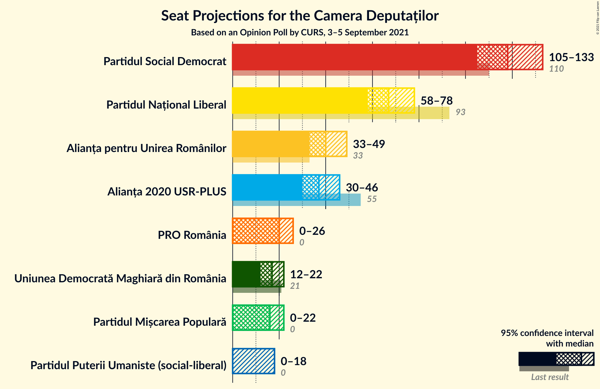
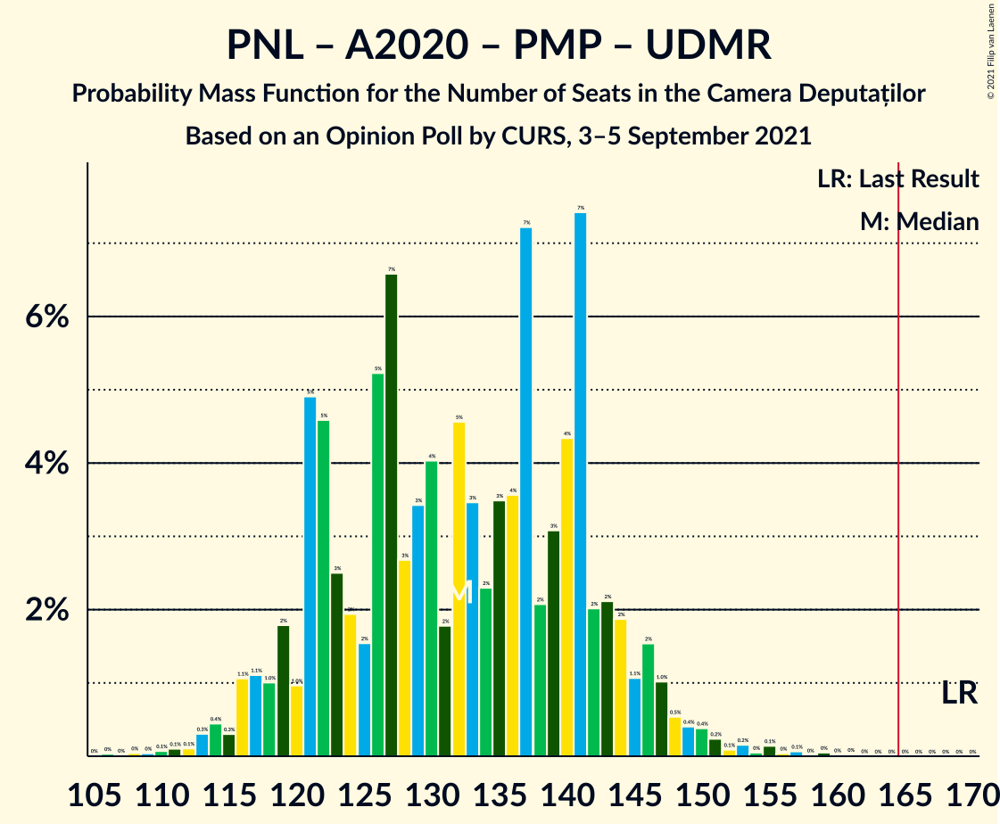
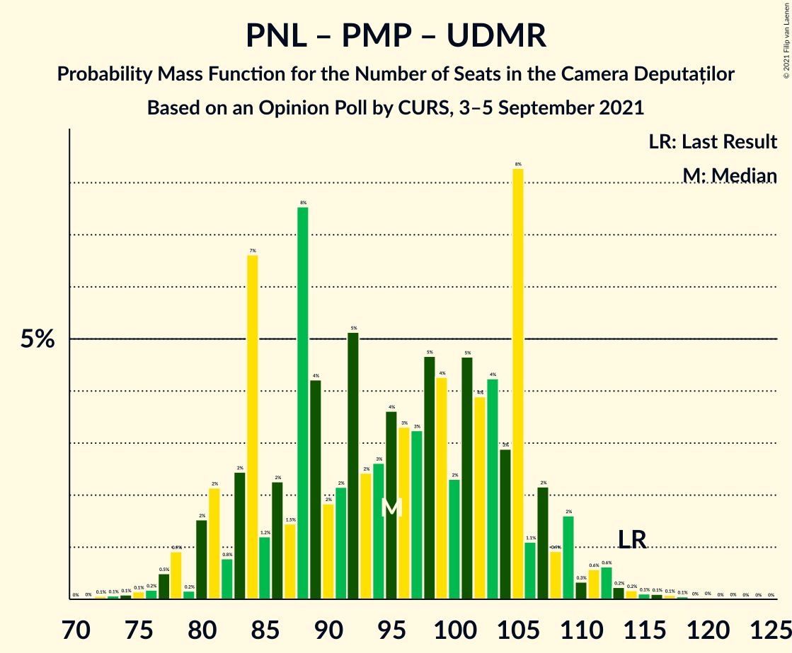

# Opinion Poll by CURS, 3–5 September 2021

<a href="#voting-intentions">Voting Intentions</a> | <a href="#seats">Seats</a> | <a href="#coalitions">Coalitions</a> | <a href="#technical-information">Technical Information</a>

## Voting Intentions

### Confidence Intervals

| Party | Last Result | Poll Result | 80% Confidence Interval | 90% Confidence Interval | 95% Confidence Interval | 99% Confidence Interval |
|:-----:|:-----------:|:-----------:|:-----------------------:|:-----------------------:|:-----------------------:|:-----------------------:|
| Partidul Social Democrat | 28.9% | 35.1% | 33.0–37.2% |32.4–37.8% |31.9–38.3% |31.0–39.4% |
| Partidul Național Liberal | 25.2% | 20.0% | 18.4–21.9% |17.9–22.4% |17.5–22.9% |16.7–23.8% |
| Alianța pentru Unirea Românilor | 9.1% | 12.0% | 10.6–13.5% |10.3–13.9% |9.9–14.3% |9.3–15.1% |
| Alianța 2020 USR-PLUS | 15.4% | 11.0% | 9.8–12.5% |9.4–12.9% |9.1–13.3% |8.5–14.1% |
| PRO România | 4.1% | 6.1% | 5.2–7.3% |4.9–7.6% |4.7–7.9% |4.3–8.5% |
| Uniunea Democrată Maghiară din România | 5.7% | 5.0% | 4.2–6.1% |4.0–6.4% |3.8–6.7% |3.4–7.3% |
| Partidul Mișcarea Populară | 4.8% | 5.0% | 4.2–6.1% |4.0–6.4% |3.8–6.7% |3.4–7.3% |
| Partidul Puterii Umaniste (social-liberal) | 0.0% | 4.0% | 3.2–5.0% |3.0–5.3% |2.9–5.5% |2.5–6.1% |

*Note:* The poll result column reflects the actual value used in the calculations. Published results may vary slightly, and in addition be rounded to fewer digits.

## Seats

### Confidence Intervals

| Party | Last Result | Median | 80% Confidence Interval | 90% Confidence Interval | 95% Confidence Interval | 99% Confidence Interval |
|:-----:|:-----------:|:------:|:-----------------------:|:-----------------------:|:-----------------------:|:-----------------------:|
| <a href="#partidul-social-democrat">Partidul Social Democrat</a> | 110 | 115 | 112–119 |111–125 |107–127 |103–133 |
| <a href="#partidul-național-liberal">Partidul Național Liberal</a> | 93 | 68 | 63–74 |60–76 |59–79 |55–82 |
| <a href="#alianța-pentru-unirea-românilor">Alianța pentru Unirea Românilor</a> | 33 | 38 | 37–42 |35–44 |32–45 |31–50 |
| <a href="#alianța-2020-usr-plus">Alianța 2020 USR-PLUS</a> | 55 | 36 | 35–42 |34–45 |33–46 |29–48 |
| <a href="#pro-românia">PRO România</a> | 0 | 21 | 18–24 |17–26 |0–27 |0–28 |
| <a href="#uniunea-democrată-maghiară-din-românia">Uniunea Democrată Maghiară din România</a> | 21 | 18 | 15–21 |13–21 |12–22 |10–25 |
| <a href="#partidul-mișcarea-populară">Partidul Mișcarea Populară</a> | 0 | 17 | 0–20 |0–21 |0–22 |0–24 |
| <a href="#partidul-puterii-umaniste-(social-liberal)">Partidul Puterii Umaniste (social-liberal)</a> | 0 | 0 | 0 |0 |0–16 |0–19 |

### Partidul Social Democrat

*For a full overview of the results for this party, see the [Partidul Social Democrat](party-partidulsocialdemocrat.html) page.*

| Number of Seats | Probability | Accumulated | Special Marks |
|:---------------:|:-----------:|:-----------:|:-------------:|
| 97 | 0% | 100% |  |
| 98 | 0% | 99.9% |  |
| 99 | 0% | 99.9% |  |
| 100 | 0% | 99.9% |  |
| 101 | 0.2% | 99.8% |  |
| 102 | 0.1% | 99.7% |  |
| 103 | 0.2% | 99.5% |  |
| 104 | 0.3% | 99.3% |  |
| 105 | 0.5% | 99.0% |  |
| 106 | 0.4% | 98% |  |
| 107 | 0.8% | 98% |  |
| 108 | 0.4% | 97% |  |
| 109 | 0.7% | 97% |  |
| 110 | 0.8% | 96% | Last Result |
| 111 | 1.4% | 95% |  |
| 112 | 10% | 94% |  |
| 113 | 22% | 84% |  |
| 114 | 8% | 62% |  |
| 115 | 24% | 54% | Median |
| 116 | 12% | 30% |  |
| 117 | 2% | 18% |  |
| 118 | 2% | 15% |  |
| 119 | 4% | 13% |  |
| 120 | 0.5% | 9% |  |
| 121 | 0.5% | 8% |  |
| 122 | 1.2% | 8% |  |
| 123 | 0.1% | 6% |  |
| 124 | 1.1% | 6% |  |
| 125 | 2% | 5% |  |
| 126 | 0.5% | 3% |  |
| 127 | 0.7% | 3% |  |
| 128 | 0.3% | 2% |  |
| 129 | 0.3% | 2% |  |
| 130 | 0.5% | 2% |  |
| 131 | 0.3% | 1.0% |  |
| 132 | 0.1% | 0.7% |  |
| 133 | 0.1% | 0.6% |  |
| 134 | 0.1% | 0.5% |  |
| 135 | 0.1% | 0.4% |  |
| 136 | 0% | 0.3% |  |
| 137 | 0.2% | 0.3% |  |
| 138 | 0% | 0.1% |  |
| 139 | 0% | 0.1% |  |
| 140 | 0% | 0% |  |

### Partidul Național Liberal

*For a full overview of the results for this party, see the [Partidul Național Liberal](party-partidulnaționalliberal.html) page.*

| Number of Seats | Probability | Accumulated | Special Marks |
|:---------------:|:-----------:|:-----------:|:-------------:|
| 52 | 0% | 100% |  |
| 53 | 0.1% | 99.9% |  |
| 54 | 0% | 99.9% |  |
| 55 | 0.4% | 99.8% |  |
| 56 | 0.3% | 99.4% |  |
| 57 | 0.3% | 99.2% |  |
| 58 | 0.4% | 98.8% |  |
| 59 | 2% | 98% |  |
| 60 | 2% | 97% |  |
| 61 | 1.4% | 95% |  |
| 62 | 2% | 93% |  |
| 63 | 14% | 91% |  |
| 64 | 2% | 77% |  |
| 65 | 2% | 76% |  |
| 66 | 21% | 74% |  |
| 67 | 1.4% | 53% |  |
| 68 | 2% | 51% | Median |
| 69 | 4% | 49% |  |
| 70 | 23% | 45% |  |
| 71 | 0.2% | 22% |  |
| 72 | 10% | 22% |  |
| 73 | 2% | 12% |  |
| 74 | 0.4% | 10% |  |
| 75 | 1.3% | 10% |  |
| 76 | 4% | 9% |  |
| 77 | 0.3% | 5% |  |
| 78 | 0.4% | 5% |  |
| 79 | 3% | 4% |  |
| 80 | 0.2% | 0.8% |  |
| 81 | 0% | 0.6% |  |
| 82 | 0.2% | 0.6% |  |
| 83 | 0.3% | 0.4% |  |
| 84 | 0% | 0.1% |  |
| 85 | 0% | 0.1% |  |
| 86 | 0% | 0% |  |
| 87 | 0% | 0% |  |
| 88 | 0% | 0% |  |
| 89 | 0% | 0% |  |
| 90 | 0% | 0% |  |
| 91 | 0% | 0% |  |
| 92 | 0% | 0% |  |
| 93 | 0% | 0% | Last Result |

### Alianța pentru Unirea Românilor

*For a full overview of the results for this party, see the [Alianța pentru Unirea Românilor](party-alianțapentruunirearomânilor.html) page.*

| Number of Seats | Probability | Accumulated | Special Marks |
|:---------------:|:-----------:|:-----------:|:-------------:|
| 30 | 0.2% | 100% |  |
| 31 | 2% | 99.8% |  |
| 32 | 1.3% | 98% |  |
| 33 | 0.7% | 96% | Last Result |
| 34 | 0.6% | 96% |  |
| 35 | 0.7% | 95% |  |
| 36 | 0.9% | 95% |  |
| 37 | 32% | 94% |  |
| 38 | 40% | 62% | Median |
| 39 | 5% | 22% |  |
| 40 | 2% | 17% |  |
| 41 | 2% | 14% |  |
| 42 | 2% | 12% |  |
| 43 | 3% | 10% |  |
| 44 | 3% | 7% |  |
| 45 | 2% | 4% |  |
| 46 | 0.8% | 2% |  |
| 47 | 0.6% | 2% |  |
| 48 | 0.1% | 1.1% |  |
| 49 | 0.3% | 1.0% |  |
| 50 | 0.3% | 0.7% |  |
| 51 | 0.2% | 0.4% |  |
| 52 | 0.1% | 0.2% |  |
| 53 | 0% | 0.1% |  |
| 54 | 0% | 0% |  |

### Alianța 2020 USR-PLUS

*For a full overview of the results for this party, see the [Alianța 2020 USR-PLUS](party-alianța2020usr-plus.html) page.*

| Number of Seats | Probability | Accumulated | Special Marks |
|:---------------:|:-----------:|:-----------:|:-------------:|
| 26 | 0% | 100% |  |
| 27 | 0.1% | 99.9% |  |
| 28 | 0.3% | 99.9% |  |
| 29 | 0.2% | 99.5% |  |
| 30 | 0.3% | 99.3% |  |
| 31 | 0.7% | 99.0% |  |
| 32 | 0.7% | 98% |  |
| 33 | 1.4% | 98% |  |
| 34 | 4% | 96% |  |
| 35 | 22% | 92% |  |
| 36 | 37% | 70% | Median |
| 37 | 8% | 33% |  |
| 38 | 3% | 25% |  |
| 39 | 4% | 22% |  |
| 40 | 3% | 18% |  |
| 41 | 3% | 15% |  |
| 42 | 3% | 12% |  |
| 43 | 2% | 9% |  |
| 44 | 1.0% | 7% |  |
| 45 | 2% | 6% |  |
| 46 | 2% | 4% |  |
| 47 | 1.1% | 2% |  |
| 48 | 0.6% | 0.8% |  |
| 49 | 0.1% | 0.1% |  |
| 50 | 0% | 0.1% |  |
| 51 | 0% | 0.1% |  |
| 52 | 0% | 0% |  |
| 53 | 0% | 0% |  |
| 54 | 0% | 0% |  |
| 55 | 0% | 0% | Last Result |

### PRO România

*For a full overview of the results for this party, see the [PRO România](party-proromânia.html) page.*

| Number of Seats | Probability | Accumulated | Special Marks |
|:---------------:|:-----------:|:-----------:|:-------------:|
| 0 | 3% | 100% | Last Result |
| 1 | 0% | 97% |  |
| 2 | 0% | 97% |  |
| 3 | 0% | 97% |  |
| 4 | 0% | 97% |  |
| 5 | 0% | 97% |  |
| 6 | 0% | 97% |  |
| 7 | 0% | 97% |  |
| 8 | 0% | 97% |  |
| 9 | 0% | 97% |  |
| 10 | 0% | 97% |  |
| 11 | 0% | 97% |  |
| 12 | 0% | 97% |  |
| 13 | 0% | 97% |  |
| 14 | 0% | 97% |  |
| 15 | 0% | 97% |  |
| 16 | 0.3% | 97% |  |
| 17 | 5% | 97% |  |
| 18 | 3% | 92% |  |
| 19 | 4% | 89% |  |
| 20 | 8% | 85% |  |
| 21 | 35% | 77% | Median |
| 22 | 25% | 42% |  |
| 23 | 7% | 17% |  |
| 24 | 3% | 10% |  |
| 25 | 2% | 8% |  |
| 26 | 0.9% | 5% |  |
| 27 | 3% | 5% |  |
| 28 | 1.4% | 2% |  |
| 29 | 0.3% | 0.4% |  |
| 30 | 0.1% | 0.2% |  |
| 31 | 0% | 0.1% |  |
| 32 | 0% | 0% |  |

### Uniunea Democrată Maghiară din România

*For a full overview of the results for this party, see the [Uniunea Democrată Maghiară din România](party-uniuneademocratămaghiarădinromânia.html) page.*

| Number of Seats | Probability | Accumulated | Special Marks |
|:---------------:|:-----------:|:-----------:|:-------------:|
| 10 | 0.6% | 100% |  |
| 11 | 0.4% | 99.4% |  |
| 12 | 2% | 98.9% |  |
| 13 | 3% | 97% |  |
| 14 | 4% | 95% |  |
| 15 | 11% | 90% |  |
| 16 | 17% | 79% |  |
| 17 | 7% | 62% |  |
| 18 | 28% | 55% | Median |
| 19 | 13% | 27% |  |
| 20 | 3% | 14% |  |
| 21 | 9% | 12% | Last Result |
| 22 | 1.2% | 3% |  |
| 23 | 0.7% | 2% |  |
| 24 | 0.3% | 1.0% |  |
| 25 | 0.5% | 0.7% |  |
| 26 | 0.1% | 0.2% |  |
| 27 | 0% | 0.1% |  |
| 28 | 0% | 0% |  |

### Partidul Mișcarea Populară

*For a full overview of the results for this party, see the [Partidul Mișcarea Populară](party-partidulmișcareapopulară.html) page.*

| Number of Seats | Probability | Accumulated | Special Marks |
|:---------------:|:-----------:|:-----------:|:-------------:|
| 0 | 20% | 100% | Last Result |
| 1 | 0% | 80% |  |
| 2 | 0% | 80% |  |
| 3 | 0% | 80% |  |
| 4 | 0% | 80% |  |
| 5 | 0% | 80% |  |
| 6 | 0% | 80% |  |
| 7 | 0% | 80% |  |
| 8 | 0% | 80% |  |
| 9 | 0% | 80% |  |
| 10 | 0% | 80% |  |
| 11 | 0% | 80% |  |
| 12 | 0% | 80% |  |
| 13 | 0% | 80% |  |
| 14 | 0% | 80% |  |
| 15 | 0% | 80% |  |
| 16 | 1.3% | 80% |  |
| 17 | 30% | 78% | Median |
| 18 | 11% | 48% |  |
| 19 | 14% | 37% |  |
| 20 | 16% | 23% |  |
| 21 | 4% | 7% |  |
| 22 | 0.7% | 3% |  |
| 23 | 0.8% | 2% |  |
| 24 | 0.7% | 1.0% |  |
| 25 | 0.1% | 0.3% |  |
| 26 | 0.1% | 0.1% |  |
| 27 | 0% | 0% |  |

### Partidul Puterii Umaniste (social-liberal)

*For a full overview of the results for this party, see the [Partidul Puterii Umaniste (social-liberal)](party-partidulputeriiumanistesocial-liberal.html) page.*

| Number of Seats | Probability | Accumulated | Special Marks |
|:---------------:|:-----------:|:-----------:|:-------------:|
| 0 | 96% | 100% | Last Result, Median |
| 1 | 0% | 4% |  |
| 2 | 0% | 4% |  |
| 3 | 0% | 4% |  |
| 4 | 0% | 4% |  |
| 5 | 0% | 4% |  |
| 6 | 0% | 4% |  |
| 7 | 0% | 4% |  |
| 8 | 0% | 4% |  |
| 9 | 0% | 4% |  |
| 10 | 0% | 4% |  |
| 11 | 0% | 4% |  |
| 12 | 0% | 4% |  |
| 13 | 0% | 4% |  |
| 14 | 0% | 4% |  |
| 15 | 0% | 4% |  |
| 16 | 2% | 4% |  |
| 17 | 0.5% | 2% |  |
| 18 | 0.5% | 1.2% |  |
| 19 | 0.3% | 0.8% |  |
| 20 | 0.2% | 0.4% |  |
| 21 | 0.2% | 0.3% |  |
| 22 | 0% | 0.1% |  |
| 23 | 0% | 0% |  |

## Coalitions

### Confidence Intervals

| Coalition | Last Result | Median | Majority? | 80% Confidence Interval | 90% Confidence Interval | 95% Confidence Interval | 99% Confidence Interval |
|:---------:|:-----------:|:------:|:---------:|:-----------------------:|:-----------------------:|:-----------------------:|:-----------------------:|
| Partidul Social Democrat – PRO România | 110 | 137 | 0% | 132–142 | 128–145 | 124–148 | 115–154 |
| Partidul Național Liberal – Alianța 2020 USR-PLUS – Partidul Mișcarea Populară – Uniunea Democrată Maghiară din România | 169 | 137 | 0% | 129–141 | 125–143 | 122–147 | 112–156 |
| Partidul Național Liberal – Alianța 2020 USR-PLUS – Uniunea Democrată Maghiară din România | 169 | 122 | 0% | 116–134 | 113–136 | 111–137 | 107–141 |
| Partidul Național Liberal – Alianța 2020 USR-PLUS – Partidul Mișcarea Populară | 148 | 121 | 0% | 112–125 | 106–128 | 103–131 | 96–138 |
| Partidul Național Liberal – Alianța 2020 USR-PLUS | 148 | 106 | 0% | 99–115 | 96–118 | 94–118 | 92–122 |
| Partidul Național Liberal – Partidul Mișcarea Populară – Uniunea Democrată Maghiară din România | 114 | 102 | 0% | 90–105 | 86–105 | 81–109 | 78–113 |
| Partidul Național Liberal – Uniunea Democrată Maghiară din România | 114 | 87 | 0% | 78–92 | 77–97 | 74–97 | 71–98 |
| Partidul Național Liberal – Partidul Mișcarea Populară | 93 | 86 | 0% | 72–90 | 67–90 | 65–91 | 60–96 |
| Partidul Național Liberal | 93 | 68 | 0% | 63–74 | 60–76 | 59–79 | 55–82 |
| Alianța 2020 USR-PLUS – Partidul Mișcarea Populară | 55 | 53 | 0% | 39–58 | 37–62 | 36–63 | 31–66 |

### Partidul Social Democrat – PRO România

| Number of Seats | Probability | Accumulated | Special Marks |
|:---------------:|:-----------:|:-----------:|:-------------:|
| 110 | 0% | 100% | Last Result |
| 111 | 0% | 100% |  |
| 112 | 0% | 99.9% |  |
| 113 | 0% | 99.9% |  |
| 114 | 0% | 99.9% |  |
| 115 | 0.5% | 99.8% |  |
| 116 | 0.1% | 99.3% |  |
| 117 | 0% | 99.2% |  |
| 118 | 0.1% | 99.2% |  |
| 119 | 0.8% | 99.1% |  |
| 120 | 0.1% | 98% |  |
| 121 | 0.2% | 98% |  |
| 122 | 0.2% | 98% |  |
| 123 | 0.2% | 98% |  |
| 124 | 0.1% | 98% |  |
| 125 | 0.4% | 97% |  |
| 126 | 0.6% | 97% |  |
| 127 | 1.1% | 96% |  |
| 128 | 0.5% | 95% |  |
| 129 | 2% | 95% |  |
| 130 | 0.6% | 93% |  |
| 131 | 0.8% | 92% |  |
| 132 | 3% | 91% |  |
| 133 | 0.8% | 88% |  |
| 134 | 35% | 88% |  |
| 135 | 2% | 53% |  |
| 136 | 0.5% | 51% | Median |
| 137 | 27% | 50% |  |
| 138 | 5% | 23% |  |
| 139 | 2% | 18% |  |
| 140 | 1.2% | 15% |  |
| 141 | 3% | 14% |  |
| 142 | 2% | 12% |  |
| 143 | 3% | 10% |  |
| 144 | 2% | 7% |  |
| 145 | 1.1% | 5% |  |
| 146 | 0.8% | 4% |  |
| 147 | 0.7% | 3% |  |
| 148 | 0.7% | 3% |  |
| 149 | 0.5% | 2% |  |
| 150 | 0% | 1.4% |  |
| 151 | 0.1% | 1.4% |  |
| 152 | 0.6% | 1.4% |  |
| 153 | 0.1% | 0.8% |  |
| 154 | 0.2% | 0.7% |  |
| 155 | 0% | 0.5% |  |
| 156 | 0.2% | 0.5% |  |
| 157 | 0% | 0.2% |  |
| 158 | 0.1% | 0.2% |  |
| 159 | 0% | 0.1% |  |
| 160 | 0.1% | 0.1% |  |
| 161 | 0% | 0% |  |

### Partidul Național Liberal – Alianța 2020 USR-PLUS – Partidul Mișcarea Populară – Uniunea Democrată Maghiară din România

| Number of Seats | Probability | Accumulated | Special Marks |
|:---------------:|:-----------:|:-----------:|:-------------:|
| 106 | 0.1% | 100% |  |
| 107 | 0% | 99.9% |  |
| 108 | 0.1% | 99.9% |  |
| 109 | 0% | 99.7% |  |
| 110 | 0% | 99.7% |  |
| 111 | 0.1% | 99.7% |  |
| 112 | 0.1% | 99.6% |  |
| 113 | 0.3% | 99.5% |  |
| 114 | 0% | 99.2% |  |
| 115 | 0% | 99.2% |  |
| 116 | 0.1% | 99.2% |  |
| 117 | 0.2% | 99.0% |  |
| 118 | 0.6% | 98.8% |  |
| 119 | 0.1% | 98% |  |
| 120 | 0.3% | 98% |  |
| 121 | 0.2% | 98% |  |
| 122 | 0.5% | 98% |  |
| 123 | 1.1% | 97% |  |
| 124 | 0.5% | 96% |  |
| 125 | 1.2% | 96% |  |
| 126 | 0.9% | 94% |  |
| 127 | 0.2% | 94% |  |
| 128 | 1.2% | 93% |  |
| 129 | 3% | 92% |  |
| 130 | 1.4% | 89% |  |
| 131 | 1.0% | 88% |  |
| 132 | 5% | 87% |  |
| 133 | 1.2% | 82% |  |
| 134 | 2% | 81% |  |
| 135 | 2% | 78% |  |
| 136 | 5% | 76% |  |
| 137 | 26% | 72% |  |
| 138 | 2% | 46% |  |
| 139 | 2% | 44% | Median |
| 140 | 8% | 43% |  |
| 141 | 27% | 35% |  |
| 142 | 2% | 8% |  |
| 143 | 0.4% | 5% |  |
| 144 | 0.2% | 5% |  |
| 145 | 0.3% | 5% |  |
| 146 | 2% | 5% |  |
| 147 | 0.2% | 3% |  |
| 148 | 0.3% | 2% |  |
| 149 | 0.1% | 2% |  |
| 150 | 0.1% | 2% |  |
| 151 | 0.3% | 2% |  |
| 152 | 0.1% | 2% |  |
| 153 | 0.2% | 1.5% |  |
| 154 | 0% | 1.3% |  |
| 155 | 0.7% | 1.3% |  |
| 156 | 0% | 0.5% |  |
| 157 | 0.1% | 0.5% |  |
| 158 | 0% | 0.4% |  |
| 159 | 0.3% | 0.4% |  |
| 160 | 0% | 0.1% |  |
| 161 | 0% | 0% |  |
| 162 | 0% | 0% |  |
| 163 | 0% | 0% |  |
| 164 | 0% | 0% |  |
| 165 | 0% | 0% | Majority |
| 166 | 0% | 0% |  |
| 167 | 0% | 0% |  |
| 168 | 0% | 0% |  |
| 169 | 0% | 0% | Last Result |

### Partidul Național Liberal – Alianța 2020 USR-PLUS – Uniunea Democrată Maghiară din România

| Number of Seats | Probability | Accumulated | Special Marks |
|:---------------:|:-----------:|:-----------:|:-------------:|
| 98 | 0% | 100% |  |
| 99 | 0% | 99.9% |  |
| 100 | 0% | 99.9% |  |
| 101 | 0% | 99.9% |  |
| 102 | 0% | 99.9% |  |
| 103 | 0% | 99.9% |  |
| 104 | 0.1% | 99.9% |  |
| 105 | 0.1% | 99.8% |  |
| 106 | 0.2% | 99.8% |  |
| 107 | 0.1% | 99.6% |  |
| 108 | 0.2% | 99.5% |  |
| 109 | 0.2% | 99.3% |  |
| 110 | 0.3% | 99.0% |  |
| 111 | 2% | 98.7% |  |
| 112 | 1.4% | 97% |  |
| 113 | 0.8% | 95% |  |
| 114 | 2% | 94% |  |
| 115 | 2% | 92% |  |
| 116 | 2% | 90% |  |
| 117 | 14% | 88% |  |
| 118 | 12% | 74% |  |
| 119 | 0.6% | 62% |  |
| 120 | 0.6% | 62% |  |
| 121 | 3% | 61% |  |
| 122 | 8% | 58% | Median |
| 123 | 1.3% | 50% |  |
| 124 | 27% | 49% |  |
| 125 | 1.5% | 22% |  |
| 126 | 2% | 20% |  |
| 127 | 2% | 18% |  |
| 128 | 1.1% | 16% |  |
| 129 | 2% | 15% |  |
| 130 | 1.3% | 13% |  |
| 131 | 0.3% | 12% |  |
| 132 | 0.3% | 11% |  |
| 133 | 0.7% | 11% |  |
| 134 | 2% | 10% |  |
| 135 | 2% | 9% |  |
| 136 | 3% | 7% |  |
| 137 | 2% | 4% |  |
| 138 | 0.2% | 1.4% |  |
| 139 | 0.5% | 1.3% |  |
| 140 | 0.2% | 0.8% |  |
| 141 | 0.4% | 0.6% |  |
| 142 | 0.1% | 0.2% |  |
| 143 | 0% | 0.1% |  |
| 144 | 0% | 0.1% |  |
| 145 | 0% | 0.1% |  |
| 146 | 0% | 0% |  |
| 147 | 0% | 0% |  |
| 148 | 0% | 0% |  |
| 149 | 0% | 0% |  |
| 150 | 0% | 0% |  |
| 151 | 0% | 0% |  |
| 152 | 0% | 0% |  |
| 153 | 0% | 0% |  |
| 154 | 0% | 0% |  |
| 155 | 0% | 0% |  |
| 156 | 0% | 0% |  |
| 157 | 0% | 0% |  |
| 158 | 0% | 0% |  |
| 159 | 0% | 0% |  |
| 160 | 0% | 0% |  |
| 161 | 0% | 0% |  |
| 162 | 0% | 0% |  |
| 163 | 0% | 0% |  |
| 164 | 0% | 0% |  |
| 165 | 0% | 0% | Majority |
| 166 | 0% | 0% |  |
| 167 | 0% | 0% |  |
| 168 | 0% | 0% |  |
| 169 | 0% | 0% | Last Result |

### Partidul Național Liberal – Alianța 2020 USR-PLUS – Partidul Mișcarea Populară

| Number of Seats | Probability | Accumulated | Special Marks |
|:---------------:|:-----------:|:-----------:|:-------------:|
| 89 | 0% | 100% |  |
| 90 | 0% | 99.9% |  |
| 91 | 0.1% | 99.9% |  |
| 92 | 0.1% | 99.9% |  |
| 93 | 0% | 99.8% |  |
| 94 | 0.1% | 99.7% |  |
| 95 | 0.1% | 99.7% |  |
| 96 | 0.1% | 99.5% |  |
| 97 | 0.1% | 99.4% |  |
| 98 | 0.3% | 99.3% |  |
| 99 | 0.1% | 99.0% |  |
| 100 | 0.1% | 98.9% |  |
| 101 | 0.4% | 98.8% |  |
| 102 | 0.7% | 98% |  |
| 103 | 0.3% | 98% |  |
| 104 | 0.8% | 97% |  |
| 105 | 0.8% | 97% |  |
| 106 | 0.9% | 96% |  |
| 107 | 0.6% | 95% |  |
| 108 | 0.5% | 94% |  |
| 109 | 0.6% | 94% |  |
| 110 | 2% | 93% |  |
| 111 | 0.7% | 92% |  |
| 112 | 2% | 91% |  |
| 113 | 2% | 89% |  |
| 114 | 0.7% | 87% |  |
| 115 | 3% | 87% |  |
| 116 | 2% | 84% |  |
| 117 | 4% | 81% |  |
| 118 | 14% | 77% |  |
| 119 | 1.3% | 63% |  |
| 120 | 6% | 62% |  |
| 121 | 14% | 55% | Median |
| 122 | 2% | 41% |  |
| 123 | 24% | 40% |  |
| 124 | 1.0% | 16% |  |
| 125 | 8% | 15% |  |
| 126 | 0.7% | 6% |  |
| 127 | 0.1% | 6% |  |
| 128 | 0.7% | 5% |  |
| 129 | 0.4% | 5% |  |
| 130 | 2% | 4% |  |
| 131 | 0.4% | 3% |  |
| 132 | 0.1% | 2% |  |
| 133 | 0.1% | 2% |  |
| 134 | 0.4% | 2% |  |
| 135 | 0.7% | 2% |  |
| 136 | 0.4% | 1.0% |  |
| 137 | 0.1% | 0.6% |  |
| 138 | 0.1% | 0.5% |  |
| 139 | 0.1% | 0.4% |  |
| 140 | 0.3% | 0.4% |  |
| 141 | 0% | 0.1% |  |
| 142 | 0% | 0% |  |
| 143 | 0% | 0% |  |
| 144 | 0% | 0% |  |
| 145 | 0% | 0% |  |
| 146 | 0% | 0% |  |
| 147 | 0% | 0% |  |
| 148 | 0% | 0% | Last Result |

### Partidul Național Liberal – Alianța 2020 USR-PLUS

| Number of Seats | Probability | Accumulated | Special Marks |
|:---------------:|:-----------:|:-----------:|:-------------:|
| 83 | 0% | 100% |  |
| 84 | 0% | 99.9% |  |
| 85 | 0% | 99.9% |  |
| 86 | 0% | 99.9% |  |
| 87 | 0% | 99.9% |  |
| 88 | 0.1% | 99.9% |  |
| 89 | 0.1% | 99.8% |  |
| 90 | 0.1% | 99.8% |  |
| 91 | 0.1% | 99.7% |  |
| 92 | 0.4% | 99.5% |  |
| 93 | 0.2% | 99.1% |  |
| 94 | 2% | 98.9% |  |
| 95 | 1.2% | 97% |  |
| 96 | 0.9% | 96% |  |
| 97 | 1.0% | 95% |  |
| 98 | 1.1% | 94% |  |
| 99 | 12% | 93% |  |
| 100 | 1.3% | 81% |  |
| 101 | 14% | 80% |  |
| 102 | 2% | 65% |  |
| 103 | 7% | 63% |  |
| 104 | 2% | 56% | Median |
| 105 | 1.4% | 54% |  |
| 106 | 23% | 52% |  |
| 107 | 9% | 29% |  |
| 108 | 1.1% | 20% |  |
| 109 | 0.7% | 19% |  |
| 110 | 2% | 18% |  |
| 111 | 3% | 17% |  |
| 112 | 1.2% | 14% |  |
| 113 | 1.2% | 13% |  |
| 114 | 0.7% | 11% |  |
| 115 | 1.2% | 11% |  |
| 116 | 2% | 10% |  |
| 117 | 2% | 7% |  |
| 118 | 3% | 5% |  |
| 119 | 0.7% | 2% |  |
| 120 | 0.2% | 1.4% |  |
| 121 | 0.5% | 1.3% |  |
| 122 | 0.4% | 0.8% |  |
| 123 | 0.3% | 0.4% |  |
| 124 | 0% | 0.1% |  |
| 125 | 0% | 0.1% |  |
| 126 | 0% | 0.1% |  |
| 127 | 0% | 0.1% |  |
| 128 | 0% | 0% |  |
| 129 | 0% | 0% |  |
| 130 | 0% | 0% |  |
| 131 | 0% | 0% |  |
| 132 | 0% | 0% |  |
| 133 | 0% | 0% |  |
| 134 | 0% | 0% |  |
| 135 | 0% | 0% |  |
| 136 | 0% | 0% |  |
| 137 | 0% | 0% |  |
| 138 | 0% | 0% |  |
| 139 | 0% | 0% |  |
| 140 | 0% | 0% |  |
| 141 | 0% | 0% |  |
| 142 | 0% | 0% |  |
| 143 | 0% | 0% |  |
| 144 | 0% | 0% |  |
| 145 | 0% | 0% |  |
| 146 | 0% | 0% |  |
| 147 | 0% | 0% |  |
| 148 | 0% | 0% | Last Result |

### Partidul Național Liberal – Partidul Mișcarea Populară – Uniunea Democrată Maghiară din România

| Number of Seats | Probability | Accumulated | Special Marks |
|:---------------:|:-----------:|:-----------:|:-------------:|
| 74 | 0.1% | 100% |  |
| 75 | 0.2% | 99.9% |  |
| 76 | 0.1% | 99.7% |  |
| 77 | 0.1% | 99.6% |  |
| 78 | 0.9% | 99.6% |  |
| 79 | 0.2% | 98.7% |  |
| 80 | 0.4% | 98% |  |
| 81 | 0.9% | 98% |  |
| 82 | 0.1% | 97% |  |
| 83 | 1.2% | 97% |  |
| 84 | 0.1% | 96% |  |
| 85 | 0.2% | 96% |  |
| 86 | 0.9% | 95% |  |
| 87 | 2% | 95% |  |
| 88 | 0.1% | 93% |  |
| 89 | 2% | 93% |  |
| 90 | 0.9% | 90% |  |
| 91 | 0.7% | 89% |  |
| 92 | 3% | 89% |  |
| 93 | 1.3% | 85% |  |
| 94 | 0.8% | 84% |  |
| 95 | 0.8% | 83% |  |
| 96 | 3% | 82% |  |
| 97 | 7% | 80% |  |
| 98 | 2% | 73% |  |
| 99 | 2% | 70% |  |
| 100 | 1.0% | 69% |  |
| 101 | 12% | 68% |  |
| 102 | 14% | 56% |  |
| 103 | 2% | 42% | Median |
| 104 | 5% | 40% |  |
| 105 | 30% | 34% |  |
| 106 | 0.2% | 4% |  |
| 107 | 0.7% | 4% |  |
| 108 | 0.4% | 3% |  |
| 109 | 0.9% | 3% |  |
| 110 | 0.2% | 2% |  |
| 111 | 0.4% | 1.4% |  |
| 112 | 0.4% | 1.1% |  |
| 113 | 0.3% | 0.7% |  |
| 114 | 0.1% | 0.4% | Last Result |
| 115 | 0.1% | 0.3% |  |
| 116 | 0.1% | 0.2% |  |
| 117 | 0% | 0.2% |  |
| 118 | 0% | 0.1% |  |
| 119 | 0% | 0.1% |  |
| 120 | 0% | 0.1% |  |
| 121 | 0% | 0% |  |

### Partidul Național Liberal – Uniunea Democrată Maghiară din România

| Number of Seats | Probability | Accumulated | Special Marks |
|:---------------:|:-----------:|:-----------:|:-------------:|
| 68 | 0.1% | 100% |  |
| 69 | 0.3% | 99.9% |  |
| 70 | 0% | 99.6% |  |
| 71 | 0.1% | 99.6% |  |
| 72 | 0.1% | 99.4% |  |
| 73 | 0.6% | 99.3% |  |
| 74 | 2% | 98.6% |  |
| 75 | 0.3% | 97% |  |
| 76 | 1.2% | 97% |  |
| 77 | 2% | 96% |  |
| 78 | 4% | 93% |  |
| 79 | 1.4% | 90% |  |
| 80 | 2% | 88% |  |
| 81 | 2% | 86% |  |
| 82 | 25% | 84% |  |
| 83 | 3% | 59% |  |
| 84 | 2% | 56% |  |
| 85 | 0.6% | 54% |  |
| 86 | 0.9% | 54% | Median |
| 87 | 14% | 53% |  |
| 88 | 23% | 38% |  |
| 89 | 3% | 16% |  |
| 90 | 0.5% | 13% |  |
| 91 | 0.5% | 12% |  |
| 92 | 3% | 12% |  |
| 93 | 0.4% | 9% |  |
| 94 | 0.8% | 9% |  |
| 95 | 0.6% | 8% |  |
| 96 | 0.3% | 7% |  |
| 97 | 6% | 7% |  |
| 98 | 0.4% | 0.7% |  |
| 99 | 0% | 0.4% |  |
| 100 | 0% | 0.3% |  |
| 101 | 0.1% | 0.3% |  |
| 102 | 0.1% | 0.2% |  |
| 103 | 0% | 0.1% |  |
| 104 | 0% | 0.1% |  |
| 105 | 0% | 0% |  |
| 106 | 0% | 0% |  |
| 107 | 0% | 0% |  |
| 108 | 0% | 0% |  |
| 109 | 0% | 0% |  |
| 110 | 0% | 0% |  |
| 111 | 0% | 0% |  |
| 112 | 0% | 0% |  |
| 113 | 0% | 0% |  |
| 114 | 0% | 0% | Last Result |

### Partidul Național Liberal – Partidul Mișcarea Populară

| Number of Seats | Probability | Accumulated | Special Marks |
|:---------------:|:-----------:|:-----------:|:-------------:|
| 58 | 0.2% | 100% |  |
| 59 | 0.2% | 99.8% |  |
| 60 | 0% | 99.5% |  |
| 61 | 0.4% | 99.5% |  |
| 62 | 0.3% | 99.1% |  |
| 63 | 0.3% | 98.7% |  |
| 64 | 0.8% | 98% |  |
| 65 | 2% | 98% |  |
| 66 | 0.4% | 96% |  |
| 67 | 0.7% | 95% |  |
| 68 | 0.3% | 94% |  |
| 69 | 1.1% | 94% |  |
| 70 | 1.0% | 93% |  |
| 71 | 0.1% | 92% |  |
| 72 | 2% | 92% |  |
| 73 | 2% | 90% |  |
| 74 | 0.3% | 88% |  |
| 75 | 1.0% | 88% |  |
| 76 | 4% | 87% |  |
| 77 | 1.3% | 83% |  |
| 78 | 0.7% | 81% |  |
| 79 | 4% | 81% |  |
| 80 | 2% | 76% |  |
| 81 | 4% | 75% |  |
| 82 | 11% | 71% |  |
| 83 | 7% | 61% |  |
| 84 | 1.1% | 54% |  |
| 85 | 2% | 53% | Median |
| 86 | 13% | 51% |  |
| 87 | 25% | 38% |  |
| 88 | 0.5% | 13% |  |
| 89 | 2% | 13% |  |
| 90 | 8% | 10% |  |
| 91 | 0.3% | 3% |  |
| 92 | 0.9% | 2% |  |
| 93 | 0.5% | 1.4% | Last Result |
| 94 | 0.2% | 0.9% |  |
| 95 | 0.1% | 0.8% |  |
| 96 | 0.4% | 0.7% |  |
| 97 | 0.1% | 0.3% |  |
| 98 | 0.1% | 0.2% |  |
| 99 | 0% | 0.2% |  |
| 100 | 0% | 0.1% |  |
| 101 | 0.1% | 0.1% |  |
| 102 | 0% | 0% |  |

### Partidul Național Liberal

| Number of Seats | Probability | Accumulated | Special Marks |
|:---------------:|:-----------:|:-----------:|:-------------:|
| 52 | 0% | 100% |  |
| 53 | 0.1% | 99.9% |  |
| 54 | 0% | 99.9% |  |
| 55 | 0.4% | 99.8% |  |
| 56 | 0.3% | 99.4% |  |
| 57 | 0.3% | 99.2% |  |
| 58 | 0.4% | 98.8% |  |
| 59 | 2% | 98% |  |
| 60 | 2% | 97% |  |
| 61 | 1.4% | 95% |  |
| 62 | 2% | 93% |  |
| 63 | 14% | 91% |  |
| 64 | 2% | 77% |  |
| 65 | 2% | 76% |  |
| 66 | 21% | 74% |  |
| 67 | 1.4% | 53% |  |
| 68 | 2% | 51% | Median |
| 69 | 4% | 49% |  |
| 70 | 23% | 45% |  |
| 71 | 0.2% | 22% |  |
| 72 | 10% | 22% |  |
| 73 | 2% | 12% |  |
| 74 | 0.4% | 10% |  |
| 75 | 1.3% | 10% |  |
| 76 | 4% | 9% |  |
| 77 | 0.3% | 5% |  |
| 78 | 0.4% | 5% |  |
| 79 | 3% | 4% |  |
| 80 | 0.2% | 0.8% |  |
| 81 | 0% | 0.6% |  |
| 82 | 0.2% | 0.6% |  |
| 83 | 0.3% | 0.4% |  |
| 84 | 0% | 0.1% |  |
| 85 | 0% | 0.1% |  |
| 86 | 0% | 0% |  |
| 87 | 0% | 0% |  |
| 88 | 0% | 0% |  |
| 89 | 0% | 0% |  |
| 90 | 0% | 0% |  |
| 91 | 0% | 0% |  |
| 92 | 0% | 0% |  |
| 93 | 0% | 0% | Last Result |

### Alianța 2020 USR-PLUS – Partidul Mișcarea Populară

| Number of Seats | Probability | Accumulated | Special Marks |
|:---------------:|:-----------:|:-----------:|:-------------:|
| 28 | 0% | 100% |  |
| 29 | 0% | 99.9% |  |
| 30 | 0.2% | 99.9% |  |
| 31 | 0.6% | 99.8% |  |
| 32 | 0.3% | 99.2% |  |
| 33 | 0.4% | 98.9% |  |
| 34 | 0.5% | 98% |  |
| 35 | 0.2% | 98% |  |
| 36 | 0.8% | 98% |  |
| 37 | 3% | 97% |  |
| 38 | 1.4% | 94% |  |
| 39 | 4% | 93% |  |
| 40 | 3% | 88% |  |
| 41 | 1.0% | 86% |  |
| 42 | 0.4% | 85% |  |
| 43 | 0.1% | 84% |  |
| 44 | 0.5% | 84% |  |
| 45 | 2% | 84% |  |
| 46 | 1.2% | 82% |  |
| 47 | 0.9% | 81% |  |
| 48 | 0.6% | 80% |  |
| 49 | 0.1% | 79% |  |
| 50 | 0.1% | 79% |  |
| 51 | 0.1% | 79% |  |
| 52 | 0.4% | 79% |  |
| 53 | 31% | 78% | Median |
| 54 | 10% | 48% |  |
| 55 | 26% | 38% | Last Result |
| 56 | 0.6% | 11% |  |
| 57 | 0.2% | 11% |  |
| 58 | 2% | 10% |  |
| 59 | 1.2% | 9% |  |
| 60 | 0.4% | 8% |  |
| 61 | 1.4% | 7% |  |
| 62 | 3% | 6% |  |
| 63 | 1.2% | 3% |  |
| 64 | 0.3% | 2% |  |
| 65 | 0.5% | 1.4% |  |
| 66 | 0.8% | 1.0% |  |
| 67 | 0% | 0.1% |  |
| 68 | 0.1% | 0.1% |  |
| 69 | 0% | 0% |  |

## Technical Information

### Opinion Poll

+ **Polling firm:** CURS
+ **Commissioner(s):** —
+ **Fieldwork period:** 3–5 September 2021

### Calculations

+ **Sample size:** 853
+ **Simulations done:** 131,072
+ **Error estimate:** 0.85%

