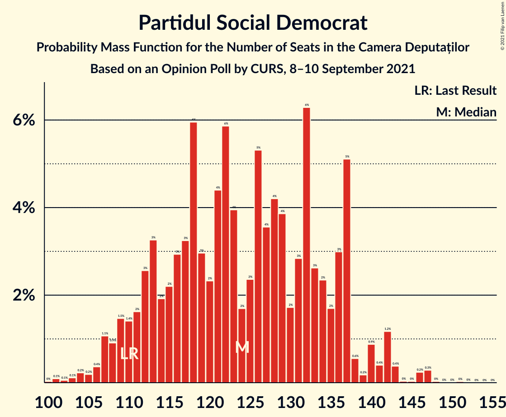
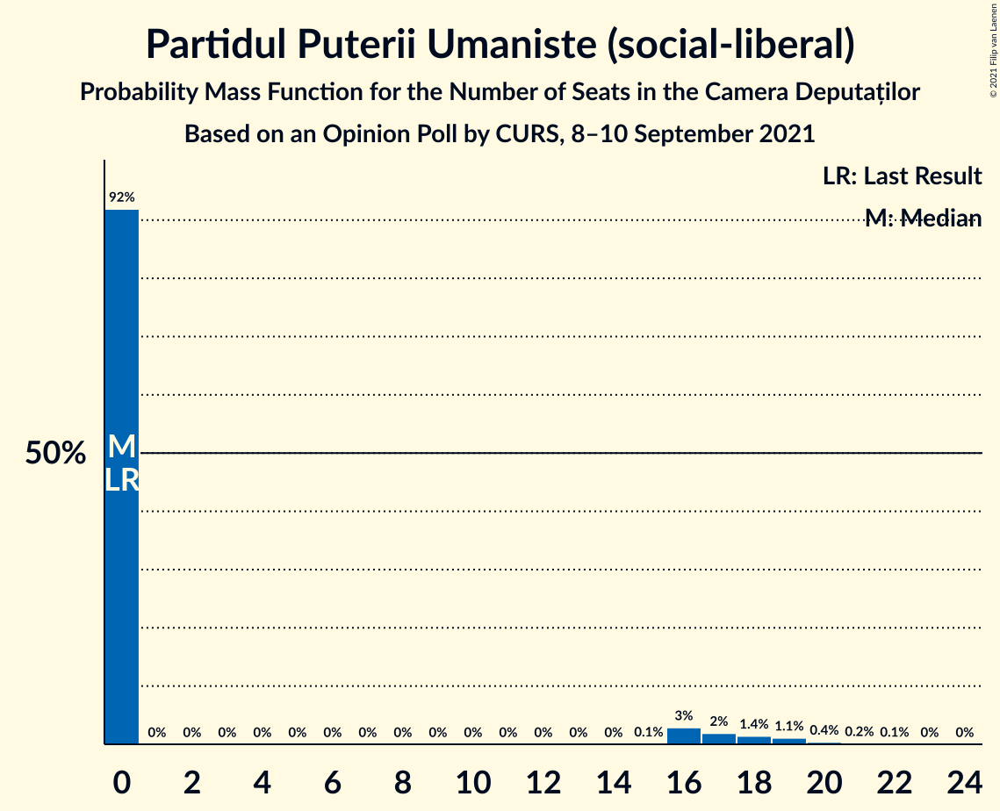
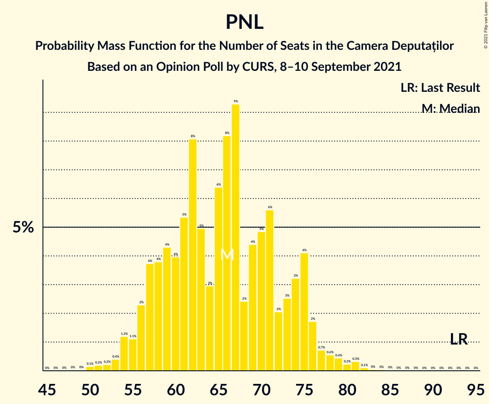

# Opinion Poll by CURS, 8–10 September 2021

<a href="#voting-intentions">Voting Intentions</a> | <a href="#seats">Seats</a> | <a href="#coalitions">Coalitions</a> | <a href="#technical-information">Technical Information</a>

## Voting Intentions

### Confidence Intervals

| Party | Last Result | Poll Result | 80% Confidence Interval | 90% Confidence Interval | 95% Confidence Interval | 99% Confidence Interval |
|:-----:|:-----------:|:-----------:|:-----------------------:|:-----------------------:|:-----------------------:|:-----------------------:|
| Partidul Social Democrat | 28.9% | 36.0% | 33.9–38.1% |33.4–38.7% |32.9–39.3% |31.9–40.3% |
| Partidul Național Liberal | 25.2% | 19.0% | 17.4–20.9% |16.9–21.4% |16.6–21.8% |15.8–22.7% |
| Alianța pentru Unirea Românilor | 9.1% | 14.1% | 12.6–15.7% |12.2–16.1% |11.9–16.5% |11.2–17.3% |
| Alianța 2020 USR-PLUS | 15.4% | 11.0% | 9.8–12.5% |9.4–12.9% |9.1–13.3% |8.5–14.1% |
| Uniunea Democrată Maghiară din România | 5.7% | 5.0% | 4.2–6.1% |3.9–6.4% |3.7–6.7% |3.4–7.2% |
| Partidul Mișcarea Populară | 4.8% | 5.0% | 4.2–6.1% |3.9–6.4% |3.7–6.7% |3.4–7.2% |
| PRO România | 4.1% | 5.0% | 4.2–6.1% |3.9–6.4% |3.7–6.7% |3.4–7.2% |
| Partidul Puterii Umaniste (social-liberal) | 0.0% | 3.9% | 3.2–4.9% |3.0–5.2% |2.8–5.5% |2.5–6.0% |

*Note:* The poll result column reflects the actual value used in the calculations. Published results may vary slightly, and in addition be rounded to fewer digits.

## Seats

### Confidence Intervals

| Party | Last Result | Median | 80% Confidence Interval | 90% Confidence Interval | 95% Confidence Interval | 99% Confidence Interval |
|:-----:|:-----------:|:------:|:-----------------------:|:-----------------------:|:-----------------------:|:-----------------------:|
| <a href="#partidul-social-democrat">Partidul Social Democrat</a> | 110 | 126 | 115–137 |113–140 |112–141 |108–142 |
| <a href="#partidul-național-liberal">Partidul Național Liberal</a> | 93 | 66 | 57–74 |56–75 |54–76 |53–79 |
| <a href="#alianța-pentru-unirea-românilor">Alianța pentru Unirea Românilor</a> | 33 | 48 | 43–54 |42–55 |41–58 |38–62 |
| <a href="#alianța-2020-usr-plus">Alianța 2020 USR-PLUS</a> | 55 | 37 | 33–43 |31–45 |28–45 |28–49 |
| <a href="#uniunea-democrată-maghiară-din-românia">Uniunea Democrată Maghiară din România</a> | 21 | 17 | 14–21 |14–22 |13–22 |11–24 |
| <a href="#partidul-mișcarea-populară">Partidul Mișcarea Populară</a> | 0 | 0 | 0–18 |0–18 |0–19 |0–23 |
| <a href="#pro-românia">PRO România</a> | 0 | 0 | 0–19 |0–20 |0–21 |0–24 |
| <a href="#partidul-puterii-umaniste-(social-liberal)">Partidul Puterii Umaniste (social-liberal)</a> | 0 | 0 | 0 |0–16 |0–18 |0–20 |

### Partidul Social Democrat

*For a full overview of the results for this party, see the [Partidul Social Democrat](party-partidulsocialdemocrat.html) page.*

| Number of Seats | Probability | Accumulated | Special Marks |
|:---------------:|:-----------:|:-----------:|:-------------:|
| 104 | 0% | 100% |  |
| 105 | 0% | 99.9% |  |
| 106 | 0.2% | 99.9% |  |
| 107 | 0% | 99.7% |  |
| 108 | 0.2% | 99.6% |  |
| 109 | 2% | 99.4% |  |
| 110 | 0.1% | 98% | Last Result |
| 111 | 0.2% | 98% |  |
| 112 | 1.4% | 98% |  |
| 113 | 2% | 96% |  |
| 114 | 0.5% | 94% |  |
| 115 | 5% | 94% |  |
| 116 | 2% | 88% |  |
| 117 | 2% | 86% |  |
| 118 | 0.4% | 84% |  |
| 119 | 1.3% | 84% |  |
| 120 | 1.0% | 82% |  |
| 121 | 2% | 81% |  |
| 122 | 6% | 80% |  |
| 123 | 5% | 73% |  |
| 124 | 4% | 69% |  |
| 125 | 2% | 65% |  |
| 126 | 13% | 63% | Median |
| 127 | 2% | 49% |  |
| 128 | 15% | 48% |  |
| 129 | 0.6% | 33% |  |
| 130 | 0.4% | 32% |  |
| 131 | 3% | 32% |  |
| 132 | 1.3% | 29% |  |
| 133 | 5% | 28% |  |
| 134 | 8% | 23% |  |
| 135 | 0.7% | 14% |  |
| 136 | 2% | 14% |  |
| 137 | 6% | 12% |  |
| 138 | 0.4% | 6% |  |
| 139 | 0.2% | 6% |  |
| 140 | 3% | 5% |  |
| 141 | 0.6% | 3% |  |
| 142 | 2% | 2% |  |
| 143 | 0.1% | 0.5% |  |
| 144 | 0% | 0.4% |  |
| 145 | 0% | 0.4% |  |
| 146 | 0.1% | 0.4% |  |
| 147 | 0.2% | 0.3% |  |
| 148 | 0% | 0.1% |  |
| 149 | 0% | 0.1% |  |
| 150 | 0% | 0% |  |

### Partidul Național Liberal

*For a full overview of the results for this party, see the [Partidul Național Liberal](party-partidulnaționalliberal.html) page.*

| Number of Seats | Probability | Accumulated | Special Marks |
|:---------------:|:-----------:|:-----------:|:-------------:|
| 49 | 0% | 100% |  |
| 50 | 0.1% | 99.9% |  |
| 51 | 0% | 99.9% |  |
| 52 | 0.3% | 99.8% |  |
| 53 | 0.1% | 99.6% |  |
| 54 | 3% | 99.5% |  |
| 55 | 0.1% | 96% |  |
| 56 | 6% | 96% |  |
| 57 | 7% | 90% |  |
| 58 | 2% | 83% |  |
| 59 | 2% | 81% |  |
| 60 | 0.7% | 79% |  |
| 61 | 3% | 79% |  |
| 62 | 15% | 75% |  |
| 63 | 5% | 60% |  |
| 64 | 1.4% | 55% |  |
| 65 | 3% | 54% |  |
| 66 | 8% | 51% | Median |
| 67 | 3% | 43% |  |
| 68 | 2% | 40% |  |
| 69 | 5% | 38% |  |
| 70 | 0.4% | 33% |  |
| 71 | 15% | 33% |  |
| 72 | 0.6% | 18% |  |
| 73 | 0.6% | 18% |  |
| 74 | 8% | 17% |  |
| 75 | 6% | 9% |  |
| 76 | 2% | 3% |  |
| 77 | 0% | 0.6% |  |
| 78 | 0% | 0.5% |  |
| 79 | 0.1% | 0.5% |  |
| 80 | 0.3% | 0.4% |  |
| 81 | 0% | 0.2% |  |
| 82 | 0% | 0.1% |  |
| 83 | 0% | 0.1% |  |
| 84 | 0.1% | 0.1% |  |
| 85 | 0% | 0% |  |
| 86 | 0% | 0% |  |
| 87 | 0% | 0% |  |
| 88 | 0% | 0% |  |
| 89 | 0% | 0% |  |
| 90 | 0% | 0% |  |
| 91 | 0% | 0% |  |
| 92 | 0% | 0% |  |
| 93 | 0% | 0% | Last Result |

### Alianța pentru Unirea Românilor

*For a full overview of the results for this party, see the [Alianța pentru Unirea Românilor](party-alianțapentruunirearomânilor.html) page.*

| Number of Seats | Probability | Accumulated | Special Marks |
|:---------------:|:-----------:|:-----------:|:-------------:|
| 33 | 0% | 100% | Last Result |
| 34 | 0% | 100% |  |
| 35 | 0% | 100% |  |
| 36 | 0.2% | 99.9% |  |
| 37 | 0% | 99.7% |  |
| 38 | 0.5% | 99.7% |  |
| 39 | 0.7% | 99.2% |  |
| 40 | 0.5% | 98% |  |
| 41 | 2% | 98% |  |
| 42 | 3% | 96% |  |
| 43 | 7% | 92% |  |
| 44 | 6% | 85% |  |
| 45 | 4% | 80% |  |
| 46 | 5% | 75% |  |
| 47 | 12% | 70% |  |
| 48 | 14% | 59% | Median |
| 49 | 2% | 44% |  |
| 50 | 10% | 43% |  |
| 51 | 2% | 33% |  |
| 52 | 8% | 31% |  |
| 53 | 0.2% | 23% |  |
| 54 | 16% | 22% |  |
| 55 | 2% | 6% |  |
| 56 | 0.1% | 5% |  |
| 57 | 0.6% | 5% |  |
| 58 | 3% | 4% |  |
| 59 | 0.1% | 1.0% |  |
| 60 | 0% | 0.9% |  |
| 61 | 0.2% | 0.9% |  |
| 62 | 0.5% | 0.7% |  |
| 63 | 0% | 0.1% |  |
| 64 | 0% | 0.1% |  |
| 65 | 0% | 0.1% |  |
| 66 | 0% | 0.1% |  |
| 67 | 0% | 0% |  |

### Alianța 2020 USR-PLUS

*For a full overview of the results for this party, see the [Alianța 2020 USR-PLUS](party-alianța2020usr-plus.html) page.*

| Number of Seats | Probability | Accumulated | Special Marks |
|:---------------:|:-----------:|:-----------:|:-------------:|
| 0 | 0.1% | 100% |  |
| 1 | 0% | 99.9% |  |
| 2 | 0% | 99.9% |  |
| 3 | 0% | 99.9% |  |
| 4 | 0% | 99.9% |  |
| 5 | 0% | 99.9% |  |
| 6 | 0% | 99.9% |  |
| 7 | 0% | 99.9% |  |
| 8 | 0% | 99.9% |  |
| 9 | 0% | 99.9% |  |
| 10 | 0% | 99.9% |  |
| 11 | 0% | 99.9% |  |
| 12 | 0% | 99.9% |  |
| 13 | 0% | 99.9% |  |
| 14 | 0% | 99.9% |  |
| 15 | 0% | 99.9% |  |
| 16 | 0% | 99.9% |  |
| 17 | 0% | 99.9% |  |
| 18 | 0% | 99.9% |  |
| 19 | 0% | 99.9% |  |
| 20 | 0% | 99.9% |  |
| 21 | 0% | 99.9% |  |
| 22 | 0% | 99.9% |  |
| 23 | 0% | 99.9% |  |
| 24 | 0% | 99.9% |  |
| 25 | 0% | 99.9% |  |
| 26 | 0.1% | 99.9% |  |
| 27 | 0.1% | 99.8% |  |
| 28 | 2% | 99.7% |  |
| 29 | 0.7% | 97% |  |
| 30 | 1.0% | 97% |  |
| 31 | 2% | 96% |  |
| 32 | 3% | 94% |  |
| 33 | 3% | 91% |  |
| 34 | 8% | 88% |  |
| 35 | 6% | 80% |  |
| 36 | 13% | 74% |  |
| 37 | 14% | 61% | Median |
| 38 | 3% | 47% |  |
| 39 | 4% | 44% |  |
| 40 | 8% | 40% |  |
| 41 | 15% | 32% |  |
| 42 | 6% | 17% |  |
| 43 | 0.9% | 10% |  |
| 44 | 0.2% | 10% |  |
| 45 | 8% | 9% |  |
| 46 | 0.5% | 1.5% |  |
| 47 | 0% | 1.0% |  |
| 48 | 0.1% | 1.0% |  |
| 49 | 0.8% | 0.9% |  |
| 50 | 0% | 0.2% |  |
| 51 | 0% | 0.1% |  |
| 52 | 0.1% | 0.1% |  |
| 53 | 0% | 0% |  |
| 54 | 0% | 0% |  |
| 55 | 0% | 0% | Last Result |

### Uniunea Democrată Maghiară din România

*For a full overview of the results for this party, see the [Uniunea Democrată Maghiară din România](party-uniuneademocratămaghiarădinromânia.html) page.*

| Number of Seats | Probability | Accumulated | Special Marks |
|:---------------:|:-----------:|:-----------:|:-------------:|
| 10 | 0.2% | 100% |  |
| 11 | 0.4% | 99.8% |  |
| 12 | 2% | 99.5% |  |
| 13 | 2% | 98% |  |
| 14 | 22% | 96% |  |
| 15 | 4% | 74% |  |
| 16 | 3% | 70% |  |
| 17 | 26% | 67% | Median |
| 18 | 23% | 41% |  |
| 19 | 3% | 18% |  |
| 20 | 2% | 15% |  |
| 21 | 5% | 13% | Last Result |
| 22 | 6% | 8% |  |
| 23 | 0.5% | 2% |  |
| 24 | 1.2% | 2% |  |
| 25 | 0.3% | 0.4% |  |
| 26 | 0.1% | 0.1% |  |
| 27 | 0% | 0% |  |

### Partidul Mișcarea Populară

*For a full overview of the results for this party, see the [Partidul Mișcarea Populară](party-partidulmișcareapopulară.html) page.*

| Number of Seats | Probability | Accumulated | Special Marks |
|:---------------:|:-----------:|:-----------:|:-------------:|
| 0 | 60% | 100% | Last Result, Median |
| 1 | 0% | 40% |  |
| 2 | 0% | 40% |  |
| 3 | 0% | 40% |  |
| 4 | 0% | 40% |  |
| 5 | 0% | 40% |  |
| 6 | 0% | 40% |  |
| 7 | 0% | 40% |  |
| 8 | 0% | 40% |  |
| 9 | 0% | 40% |  |
| 10 | 0% | 40% |  |
| 11 | 0% | 40% |  |
| 12 | 0% | 40% |  |
| 13 | 0% | 40% |  |
| 14 | 0% | 40% |  |
| 15 | 0% | 40% |  |
| 16 | 11% | 40% |  |
| 17 | 12% | 29% |  |
| 18 | 12% | 16% |  |
| 19 | 2% | 4% |  |
| 20 | 0.4% | 2% |  |
| 21 | 0.1% | 1.3% |  |
| 22 | 0.3% | 1.2% |  |
| 23 | 0.4% | 0.9% |  |
| 24 | 0.2% | 0.5% |  |
| 25 | 0.2% | 0.2% |  |
| 26 | 0% | 0% |  |

### PRO România

*For a full overview of the results for this party, see the [PRO România](party-proromânia.html) page.*

| Number of Seats | Probability | Accumulated | Special Marks |
|:---------------:|:-----------:|:-----------:|:-------------:|
| 0 | 54% | 100% | Last Result, Median |
| 1 | 0% | 46% |  |
| 2 | 0% | 46% |  |
| 3 | 0% | 46% |  |
| 4 | 0% | 46% |  |
| 5 | 0% | 46% |  |
| 6 | 0% | 46% |  |
| 7 | 0% | 46% |  |
| 8 | 0% | 46% |  |
| 9 | 0% | 46% |  |
| 10 | 0% | 46% |  |
| 11 | 0% | 46% |  |
| 12 | 0% | 46% |  |
| 13 | 0% | 46% |  |
| 14 | 0% | 46% |  |
| 15 | 0% | 46% |  |
| 16 | 15% | 46% |  |
| 17 | 14% | 31% |  |
| 18 | 7% | 17% |  |
| 19 | 4% | 10% |  |
| 20 | 3% | 6% |  |
| 21 | 1.3% | 3% |  |
| 22 | 0.4% | 2% |  |
| 23 | 1.0% | 2% |  |
| 24 | 0.5% | 0.7% |  |
| 25 | 0.1% | 0.2% |  |
| 26 | 0% | 0.1% |  |
| 27 | 0% | 0.1% |  |
| 28 | 0% | 0.1% |  |
| 29 | 0% | 0% |  |

### Partidul Puterii Umaniste (social-liberal)

*For a full overview of the results for this party, see the [Partidul Puterii Umaniste (social-liberal)](party-partidulputeriiumanistesocial-liberal.html) page.*

| Number of Seats | Probability | Accumulated | Special Marks |
|:---------------:|:-----------:|:-----------:|:-------------:|
| 0 | 94% | 100% | Last Result, Median |
| 1 | 0% | 6% |  |
| 2 | 0% | 6% |  |
| 3 | 0% | 6% |  |
| 4 | 0% | 6% |  |
| 5 | 0% | 6% |  |
| 6 | 0% | 6% |  |
| 7 | 0% | 6% |  |
| 8 | 0% | 6% |  |
| 9 | 0% | 6% |  |
| 10 | 0% | 6% |  |
| 11 | 0% | 6% |  |
| 12 | 0% | 6% |  |
| 13 | 0% | 6% |  |
| 14 | 0% | 6% |  |
| 15 | 0% | 6% |  |
| 16 | 2% | 6% |  |
| 17 | 1.1% | 4% |  |
| 18 | 2% | 3% |  |
| 19 | 0.8% | 1.5% |  |
| 20 | 0.3% | 0.7% |  |
| 21 | 0.3% | 0.3% |  |
| 22 | 0% | 0% |  |

## Coalitions

### Confidence Intervals

| Coalition | Last Result | Median | Majority? | 80% Confidence Interval | 90% Confidence Interval | 95% Confidence Interval | 99% Confidence Interval |
|:---------:|:-----------:|:------:|:---------:|:-----------------------:|:-----------------------:|:-----------------------:|:-----------------------:|
| Partidul Social Democrat – PRO România | 110 | 133 | 0% | 126–151 | 124–151 | 121–151 | 117–152 |
| Partidul Național Liberal – Alianța 2020 USR-PLUS – Partidul Mișcarea Populară – Uniunea Democrată Maghiară din România | 169 | 129 | 0% | 113–136 | 113–142 | 113–144 | 109–147 |
| Partidul Național Liberal – Alianța 2020 USR-PLUS – Uniunea Democrată Maghiară din România | 169 | 121 | 0% | 109–130 | 107–136 | 103–136 | 99–137 |
| Partidul Național Liberal – Alianța 2020 USR-PLUS – Partidul Mișcarea Populară | 148 | 112 | 0% | 99–120 | 99–120 | 98–124 | 92–127 |
| Partidul Național Liberal – Alianța 2020 USR-PLUS | 148 | 102 | 0% | 92–114 | 91–119 | 88–119 | 84–119 |
| Partidul Național Liberal – Partidul Mișcarea Populară – Uniunea Democrată Maghiară din România | 114 | 89 | 0% | 76–100 | 76–106 | 76–106 | 72–112 |
| Partidul Național Liberal – Uniunea Democrată Maghiară din România | 114 | 82 | 0% | 73–91 | 71–93 | 70–93 | 70–96 |
| Partidul Național Liberal – Partidul Mișcarea Populară | 93 | 73 | 0% | 62–84 | 62–84 | 59–87 | 58–91 |
| Partidul Național Liberal | 93 | 66 | 0% | 57–74 | 56–75 | 54–76 | 53–79 |
| Alianța 2020 USR-PLUS – Partidul Mișcarea Populară | 55 | 43 | 0% | 36–57 | 35–57 | 34–57 | 32–62 |

### Partidul Social Democrat – PRO România

| Number of Seats | Probability | Accumulated | Special Marks |
|:---------------:|:-----------:|:-----------:|:-------------:|
| 108 | 0% | 100% |  |
| 109 | 0% | 99.9% |  |
| 110 | 0% | 99.9% | Last Result |
| 111 | 0% | 99.9% |  |
| 112 | 0.1% | 99.9% |  |
| 113 | 0.1% | 99.8% |  |
| 114 | 0% | 99.7% |  |
| 115 | 0% | 99.7% |  |
| 116 | 0.1% | 99.7% |  |
| 117 | 1.4% | 99.6% |  |
| 118 | 0% | 98% |  |
| 119 | 0.1% | 98% |  |
| 120 | 0.4% | 98% |  |
| 121 | 0.8% | 98% |  |
| 122 | 0.6% | 97% |  |
| 123 | 0.2% | 96% |  |
| 124 | 2% | 96% |  |
| 125 | 0.2% | 94% |  |
| 126 | 13% | 94% | Median |
| 127 | 2% | 81% |  |
| 128 | 14% | 79% |  |
| 129 | 0.7% | 65% |  |
| 130 | 0.4% | 64% |  |
| 131 | 9% | 64% |  |
| 132 | 4% | 55% |  |
| 133 | 2% | 51% |  |
| 134 | 0.2% | 49% |  |
| 135 | 2% | 49% |  |
| 136 | 3% | 47% |  |
| 137 | 6% | 43% |  |
| 138 | 7% | 37% |  |
| 139 | 2% | 30% |  |
| 140 | 7% | 28% |  |
| 141 | 2% | 21% |  |
| 142 | 2% | 19% |  |
| 143 | 0.2% | 17% |  |
| 144 | 0.4% | 17% |  |
| 145 | 2% | 16% |  |
| 146 | 1.3% | 15% |  |
| 147 | 0.7% | 13% |  |
| 148 | 0.2% | 13% |  |
| 149 | 0.6% | 12% |  |
| 150 | 0.1% | 12% |  |
| 151 | 11% | 12% |  |
| 152 | 0.4% | 0.6% |  |
| 153 | 0% | 0.2% |  |
| 154 | 0% | 0.1% |  |
| 155 | 0% | 0.1% |  |
| 156 | 0% | 0.1% |  |
| 157 | 0% | 0.1% |  |
| 158 | 0% | 0% |  |

### Partidul Național Liberal – Alianța 2020 USR-PLUS – Partidul Mișcarea Populară – Uniunea Democrată Maghiară din România

| Number of Seats | Probability | Accumulated | Special Marks |
|:---------------:|:-----------:|:-----------:|:-------------:|
| 103 | 0% | 100% |  |
| 104 | 0% | 99.9% |  |
| 105 | 0% | 99.9% |  |
| 106 | 0% | 99.9% |  |
| 107 | 0% | 99.9% |  |
| 108 | 0% | 99.8% |  |
| 109 | 0.8% | 99.8% |  |
| 110 | 0.2% | 99.0% |  |
| 111 | 0.1% | 98.8% |  |
| 112 | 0.5% | 98.7% |  |
| 113 | 11% | 98% |  |
| 114 | 0.3% | 87% |  |
| 115 | 0.9% | 87% |  |
| 116 | 0.8% | 86% |  |
| 117 | 1.2% | 85% |  |
| 118 | 2% | 84% |  |
| 119 | 0.8% | 82% |  |
| 120 | 0.6% | 81% | Median |
| 121 | 1.0% | 80% |  |
| 122 | 1.2% | 79% |  |
| 123 | 5% | 78% |  |
| 124 | 1.5% | 73% |  |
| 125 | 5% | 72% |  |
| 126 | 5% | 67% |  |
| 127 | 2% | 63% |  |
| 128 | 8% | 60% |  |
| 129 | 8% | 53% |  |
| 130 | 16% | 45% |  |
| 131 | 7% | 28% |  |
| 132 | 2% | 22% |  |
| 133 | 0.9% | 20% |  |
| 134 | 0.7% | 19% |  |
| 135 | 2% | 18% |  |
| 136 | 8% | 16% |  |
| 137 | 0.3% | 9% |  |
| 138 | 0.5% | 9% |  |
| 139 | 0.1% | 8% |  |
| 140 | 0.1% | 8% |  |
| 141 | 0.1% | 8% |  |
| 142 | 5% | 8% |  |
| 143 | 0.1% | 3% |  |
| 144 | 0.8% | 3% |  |
| 145 | 0.2% | 2% |  |
| 146 | 0% | 2% |  |
| 147 | 2% | 2% |  |
| 148 | 0% | 0.4% |  |
| 149 | 0% | 0.4% |  |
| 150 | 0.2% | 0.4% |  |
| 151 | 0.1% | 0.2% |  |
| 152 | 0% | 0.1% |  |
| 153 | 0% | 0.1% |  |
| 154 | 0% | 0.1% |  |
| 155 | 0% | 0% |  |
| 156 | 0% | 0% |  |
| 157 | 0% | 0% |  |
| 158 | 0% | 0% |  |
| 159 | 0% | 0% |  |
| 160 | 0% | 0% |  |
| 161 | 0% | 0% |  |
| 162 | 0% | 0% |  |
| 163 | 0% | 0% |  |
| 164 | 0% | 0% |  |
| 165 | 0% | 0% | Majority |
| 166 | 0% | 0% |  |
| 167 | 0% | 0% |  |
| 168 | 0% | 0% |  |
| 169 | 0% | 0% | Last Result |

### Partidul Național Liberal – Alianța 2020 USR-PLUS – Uniunea Democrată Maghiară din România

| Number of Seats | Probability | Accumulated | Special Marks |
|:---------------:|:-----------:|:-----------:|:-------------:|
| 87 | 0% | 100% |  |
| 88 | 0% | 99.9% |  |
| 89 | 0% | 99.9% |  |
| 90 | 0% | 99.9% |  |
| 91 | 0% | 99.9% |  |
| 92 | 0% | 99.9% |  |
| 93 | 0% | 99.9% |  |
| 94 | 0% | 99.9% |  |
| 95 | 0% | 99.9% |  |
| 96 | 0% | 99.9% |  |
| 97 | 0% | 99.9% |  |
| 98 | 0% | 99.9% |  |
| 99 | 0.5% | 99.9% |  |
| 100 | 0% | 99.3% |  |
| 101 | 0.1% | 99.3% |  |
| 102 | 2% | 99.2% |  |
| 103 | 0.2% | 98% |  |
| 104 | 0.2% | 97% |  |
| 105 | 0.3% | 97% |  |
| 106 | 0.8% | 97% |  |
| 107 | 3% | 96% |  |
| 108 | 0.1% | 93% |  |
| 109 | 4% | 93% |  |
| 110 | 1.3% | 89% |  |
| 111 | 2% | 88% |  |
| 112 | 2% | 85% |  |
| 113 | 18% | 83% |  |
| 114 | 8% | 66% |  |
| 115 | 2% | 58% |  |
| 116 | 0.9% | 56% |  |
| 117 | 3% | 55% |  |
| 118 | 0.7% | 52% |  |
| 119 | 0.7% | 52% |  |
| 120 | 0.6% | 51% | Median |
| 121 | 0.7% | 50% |  |
| 122 | 1.2% | 50% |  |
| 123 | 4% | 48% |  |
| 124 | 5% | 45% |  |
| 125 | 3% | 40% |  |
| 126 | 2% | 37% |  |
| 127 | 2% | 35% |  |
| 128 | 6% | 33% |  |
| 129 | 4% | 27% |  |
| 130 | 14% | 23% |  |
| 131 | 0.2% | 10% |  |
| 132 | 0.8% | 9% |  |
| 133 | 0.2% | 9% |  |
| 134 | 0.4% | 8% |  |
| 135 | 0% | 8% |  |
| 136 | 7% | 8% |  |
| 137 | 0.2% | 0.5% |  |
| 138 | 0.2% | 0.3% |  |
| 139 | 0% | 0.1% |  |
| 140 | 0% | 0.1% |  |
| 141 | 0% | 0.1% |  |
| 142 | 0% | 0.1% |  |
| 143 | 0% | 0.1% |  |
| 144 | 0% | 0% |  |
| 145 | 0% | 0% |  |
| 146 | 0% | 0% |  |
| 147 | 0% | 0% |  |
| 148 | 0% | 0% |  |
| 149 | 0% | 0% |  |
| 150 | 0% | 0% |  |
| 151 | 0% | 0% |  |
| 152 | 0% | 0% |  |
| 153 | 0% | 0% |  |
| 154 | 0% | 0% |  |
| 155 | 0% | 0% |  |
| 156 | 0% | 0% |  |
| 157 | 0% | 0% |  |
| 158 | 0% | 0% |  |
| 159 | 0% | 0% |  |
| 160 | 0% | 0% |  |
| 161 | 0% | 0% |  |
| 162 | 0% | 0% |  |
| 163 | 0% | 0% |  |
| 164 | 0% | 0% |  |
| 165 | 0% | 0% | Majority |
| 166 | 0% | 0% |  |
| 167 | 0% | 0% |  |
| 168 | 0% | 0% |  |
| 169 | 0% | 0% | Last Result |

### Partidul Național Liberal – Alianța 2020 USR-PLUS – Partidul Mișcarea Populară

| Number of Seats | Probability | Accumulated | Special Marks |
|:---------------:|:-----------:|:-----------:|:-------------:|
| 87 | 0% | 100% |  |
| 88 | 0% | 99.9% |  |
| 89 | 0% | 99.9% |  |
| 90 | 0% | 99.9% |  |
| 91 | 0% | 99.9% |  |
| 92 | 0.8% | 99.9% |  |
| 93 | 0% | 99.1% |  |
| 94 | 0% | 99.0% |  |
| 95 | 0.1% | 99.0% |  |
| 96 | 0.3% | 98.9% |  |
| 97 | 0.5% | 98.6% |  |
| 98 | 1.2% | 98% |  |
| 99 | 12% | 97% |  |
| 100 | 0.9% | 85% |  |
| 101 | 2% | 84% |  |
| 102 | 0.5% | 82% |  |
| 103 | 0.7% | 81% | Median |
| 104 | 2% | 81% |  |
| 105 | 2% | 79% |  |
| 106 | 2% | 77% |  |
| 107 | 1.4% | 75% |  |
| 108 | 3% | 74% |  |
| 109 | 7% | 70% |  |
| 110 | 7% | 64% |  |
| 111 | 5% | 57% |  |
| 112 | 20% | 52% |  |
| 113 | 2% | 32% |  |
| 114 | 8% | 29% |  |
| 115 | 1.1% | 21% |  |
| 116 | 1.3% | 20% |  |
| 117 | 0.9% | 19% |  |
| 118 | 0.2% | 18% |  |
| 119 | 7% | 17% |  |
| 120 | 6% | 10% |  |
| 121 | 0.1% | 4% |  |
| 122 | 0.6% | 4% |  |
| 123 | 0.5% | 3% |  |
| 124 | 0.5% | 3% |  |
| 125 | 0.1% | 2% |  |
| 126 | 2% | 2% |  |
| 127 | 0.1% | 0.6% |  |
| 128 | 0% | 0.5% |  |
| 129 | 0% | 0.5% |  |
| 130 | 0.1% | 0.4% |  |
| 131 | 0% | 0.4% |  |
| 132 | 0% | 0.3% |  |
| 133 | 0% | 0.3% |  |
| 134 | 0.2% | 0.3% |  |
| 135 | 0.1% | 0.2% |  |
| 136 | 0% | 0.1% |  |
| 137 | 0% | 0.1% |  |
| 138 | 0% | 0% |  |
| 139 | 0% | 0% |  |
| 140 | 0% | 0% |  |
| 141 | 0% | 0% |  |
| 142 | 0% | 0% |  |
| 143 | 0% | 0% |  |
| 144 | 0% | 0% |  |
| 145 | 0% | 0% |  |
| 146 | 0% | 0% |  |
| 147 | 0% | 0% |  |
| 148 | 0% | 0% | Last Result |

### Partidul Național Liberal – Alianța 2020 USR-PLUS

| Number of Seats | Probability | Accumulated | Special Marks |
|:---------------:|:-----------:|:-----------:|:-------------:|
| 70 | 0% | 100% |  |
| 71 | 0% | 99.9% |  |
| 72 | 0% | 99.9% |  |
| 73 | 0% | 99.9% |  |
| 74 | 0% | 99.9% |  |
| 75 | 0% | 99.9% |  |
| 76 | 0% | 99.9% |  |
| 77 | 0% | 99.9% |  |
| 78 | 0% | 99.9% |  |
| 79 | 0% | 99.9% |  |
| 80 | 0% | 99.9% |  |
| 81 | 0% | 99.9% |  |
| 82 | 0.1% | 99.9% |  |
| 83 | 0.1% | 99.8% |  |
| 84 | 0.4% | 99.7% |  |
| 85 | 0.1% | 99.3% |  |
| 86 | 0.3% | 99.2% |  |
| 87 | 0.2% | 99.0% |  |
| 88 | 2% | 98.7% |  |
| 89 | 0.5% | 97% |  |
| 90 | 0.5% | 97% |  |
| 91 | 4% | 96% |  |
| 92 | 3% | 93% |  |
| 93 | 2% | 90% |  |
| 94 | 2% | 88% |  |
| 95 | 0.7% | 85% |  |
| 96 | 6% | 85% |  |
| 97 | 10% | 79% |  |
| 98 | 1.4% | 69% |  |
| 99 | 12% | 67% |  |
| 100 | 1.2% | 55% |  |
| 101 | 2% | 54% |  |
| 102 | 7% | 52% |  |
| 103 | 0.8% | 45% | Median |
| 104 | 0.9% | 45% |  |
| 105 | 1.3% | 44% |  |
| 106 | 2% | 42% |  |
| 107 | 1.4% | 40% |  |
| 108 | 2% | 39% |  |
| 109 | 4% | 37% |  |
| 110 | 6% | 33% |  |
| 111 | 3% | 28% |  |
| 112 | 14% | 25% |  |
| 113 | 0.5% | 11% |  |
| 114 | 2% | 10% |  |
| 115 | 0.1% | 9% |  |
| 116 | 0.2% | 8% |  |
| 117 | 0.6% | 8% |  |
| 118 | 0.1% | 8% |  |
| 119 | 7% | 8% |  |
| 120 | 0.1% | 0.3% |  |
| 121 | 0% | 0.1% |  |
| 122 | 0.1% | 0.1% |  |
| 123 | 0.1% | 0.1% |  |
| 124 | 0% | 0% |  |
| 125 | 0% | 0% |  |
| 126 | 0% | 0% |  |
| 127 | 0% | 0% |  |
| 128 | 0% | 0% |  |
| 129 | 0% | 0% |  |
| 130 | 0% | 0% |  |
| 131 | 0% | 0% |  |
| 132 | 0% | 0% |  |
| 133 | 0% | 0% |  |
| 134 | 0% | 0% |  |
| 135 | 0% | 0% |  |
| 136 | 0% | 0% |  |
| 137 | 0% | 0% |  |
| 138 | 0% | 0% |  |
| 139 | 0% | 0% |  |
| 140 | 0% | 0% |  |
| 141 | 0% | 0% |  |
| 142 | 0% | 0% |  |
| 143 | 0% | 0% |  |
| 144 | 0% | 0% |  |
| 145 | 0% | 0% |  |
| 146 | 0% | 0% |  |
| 147 | 0% | 0% |  |
| 148 | 0% | 0% | Last Result |

### Partidul Național Liberal – Partidul Mișcarea Populară – Uniunea Democrată Maghiară din România

| Number of Seats | Probability | Accumulated | Special Marks |
|:---------------:|:-----------:|:-----------:|:-------------:|
| 69 | 0% | 100% |  |
| 70 | 0% | 99.9% |  |
| 71 | 0% | 99.9% |  |
| 72 | 0.5% | 99.9% |  |
| 73 | 0.1% | 99.4% |  |
| 74 | 0.1% | 99.4% |  |
| 75 | 0.8% | 99.2% |  |
| 76 | 9% | 98% |  |
| 77 | 4% | 89% |  |
| 78 | 1.4% | 86% |  |
| 79 | 0.9% | 84% |  |
| 80 | 0.4% | 83% |  |
| 81 | 2% | 83% |  |
| 82 | 0.9% | 81% |  |
| 83 | 4% | 80% | Median |
| 84 | 0.3% | 77% |  |
| 85 | 0.4% | 76% |  |
| 86 | 2% | 76% |  |
| 87 | 2% | 74% |  |
| 88 | 2% | 72% |  |
| 89 | 22% | 70% |  |
| 90 | 3% | 48% |  |
| 91 | 15% | 45% |  |
| 92 | 1.3% | 30% |  |
| 93 | 5% | 28% |  |
| 94 | 0.5% | 23% |  |
| 95 | 7% | 23% |  |
| 96 | 0.2% | 16% |  |
| 97 | 0.5% | 16% |  |
| 98 | 1.5% | 16% |  |
| 99 | 2% | 14% |  |
| 100 | 4% | 12% |  |
| 101 | 0.4% | 9% |  |
| 102 | 0.7% | 8% |  |
| 103 | 0.2% | 8% |  |
| 104 | 0.2% | 7% |  |
| 105 | 0.3% | 7% |  |
| 106 | 5% | 7% |  |
| 107 | 0% | 2% |  |
| 108 | 1.5% | 2% |  |
| 109 | 0.1% | 0.9% |  |
| 110 | 0% | 0.8% |  |
| 111 | 0.1% | 0.8% |  |
| 112 | 0.4% | 0.7% |  |
| 113 | 0% | 0.2% |  |
| 114 | 0% | 0.2% | Last Result |
| 115 | 0.1% | 0.2% |  |
| 116 | 0% | 0% |  |

### Partidul Național Liberal – Uniunea Democrată Maghiară din România

| Number of Seats | Probability | Accumulated | Special Marks |
|:---------------:|:-----------:|:-----------:|:-------------:|
| 63 | 0% | 100% |  |
| 64 | 0% | 99.9% |  |
| 65 | 0% | 99.9% |  |
| 66 | 0% | 99.9% |  |
| 67 | 0% | 99.8% |  |
| 68 | 0.1% | 99.8% |  |
| 69 | 0.1% | 99.7% |  |
| 70 | 2% | 99.6% |  |
| 71 | 3% | 97% |  |
| 72 | 4% | 94% |  |
| 73 | 3% | 91% |  |
| 74 | 7% | 88% |  |
| 75 | 1.0% | 81% |  |
| 76 | 10% | 80% |  |
| 77 | 4% | 70% |  |
| 78 | 2% | 66% |  |
| 79 | 6% | 64% |  |
| 80 | 0.9% | 58% |  |
| 81 | 5% | 57% |  |
| 82 | 3% | 53% |  |
| 83 | 5% | 49% | Median |
| 84 | 0.9% | 45% |  |
| 85 | 0.5% | 44% |  |
| 86 | 0.5% | 43% |  |
| 87 | 0.9% | 43% |  |
| 88 | 5% | 42% |  |
| 89 | 17% | 36% |  |
| 90 | 4% | 20% |  |
| 91 | 8% | 15% |  |
| 92 | 0.6% | 7% |  |
| 93 | 4% | 6% |  |
| 94 | 0.1% | 2% |  |
| 95 | 1.4% | 2% |  |
| 96 | 0% | 0.5% |  |
| 97 | 0.1% | 0.5% |  |
| 98 | 0.1% | 0.4% |  |
| 99 | 0% | 0.3% |  |
| 100 | 0% | 0.3% |  |
| 101 | 0.2% | 0.3% |  |
| 102 | 0% | 0.1% |  |
| 103 | 0% | 0% |  |
| 104 | 0% | 0% |  |
| 105 | 0% | 0% |  |
| 106 | 0% | 0% |  |
| 107 | 0% | 0% |  |
| 108 | 0% | 0% |  |
| 109 | 0% | 0% |  |
| 110 | 0% | 0% |  |
| 111 | 0% | 0% |  |
| 112 | 0% | 0% |  |
| 113 | 0% | 0% |  |
| 114 | 0% | 0% | Last Result |

### Partidul Național Liberal – Partidul Mișcarea Populară

| Number of Seats | Probability | Accumulated | Special Marks |
|:---------------:|:-----------:|:-----------:|:-------------:|
| 54 | 0% | 100% |  |
| 55 | 0% | 99.9% |  |
| 56 | 0% | 99.9% |  |
| 57 | 0.2% | 99.9% |  |
| 58 | 1.1% | 99.7% |  |
| 59 | 1.2% | 98.6% |  |
| 60 | 0.5% | 97% |  |
| 61 | 1.5% | 97% |  |
| 62 | 9% | 95% |  |
| 63 | 4% | 86% |  |
| 64 | 0.4% | 82% |  |
| 65 | 1.0% | 82% |  |
| 66 | 1.3% | 81% | Median |
| 67 | 3% | 80% |  |
| 68 | 1.5% | 77% |  |
| 69 | 3% | 76% |  |
| 70 | 0.5% | 72% |  |
| 71 | 17% | 72% |  |
| 72 | 4% | 54% |  |
| 73 | 2% | 50% |  |
| 74 | 16% | 48% |  |
| 75 | 7% | 32% |  |
| 76 | 2% | 26% |  |
| 77 | 0.7% | 23% |  |
| 78 | 5% | 22% |  |
| 79 | 2% | 17% |  |
| 80 | 0.9% | 15% |  |
| 81 | 1.3% | 14% |  |
| 82 | 0.8% | 13% |  |
| 83 | 1.3% | 12% |  |
| 84 | 8% | 11% |  |
| 85 | 0.4% | 3% |  |
| 86 | 0.2% | 3% |  |
| 87 | 2% | 3% |  |
| 88 | 0.2% | 1.1% |  |
| 89 | 0.1% | 1.0% |  |
| 90 | 0.1% | 0.9% |  |
| 91 | 0.4% | 0.8% |  |
| 92 | 0% | 0.4% |  |
| 93 | 0.1% | 0.4% | Last Result |
| 94 | 0% | 0.3% |  |
| 95 | 0% | 0.3% |  |
| 96 | 0% | 0.2% |  |
| 97 | 0% | 0.2% |  |
| 98 | 0% | 0.2% |  |
| 99 | 0.1% | 0.2% |  |
| 100 | 0% | 0% |  |

### Partidul Național Liberal

| Number of Seats | Probability | Accumulated | Special Marks |
|:---------------:|:-----------:|:-----------:|:-------------:|
| 49 | 0% | 100% |  |
| 50 | 0.1% | 99.9% |  |
| 51 | 0% | 99.9% |  |
| 52 | 0.3% | 99.8% |  |
| 53 | 0.1% | 99.6% |  |
| 54 | 3% | 99.5% |  |
| 55 | 0.1% | 96% |  |
| 56 | 6% | 96% |  |
| 57 | 7% | 90% |  |
| 58 | 2% | 83% |  |
| 59 | 2% | 81% |  |
| 60 | 0.7% | 79% |  |
| 61 | 3% | 79% |  |
| 62 | 15% | 75% |  |
| 63 | 5% | 60% |  |
| 64 | 1.4% | 55% |  |
| 65 | 3% | 54% |  |
| 66 | 8% | 51% | Median |
| 67 | 3% | 43% |  |
| 68 | 2% | 40% |  |
| 69 | 5% | 38% |  |
| 70 | 0.4% | 33% |  |
| 71 | 15% | 33% |  |
| 72 | 0.6% | 18% |  |
| 73 | 0.6% | 18% |  |
| 74 | 8% | 17% |  |
| 75 | 6% | 9% |  |
| 76 | 2% | 3% |  |
| 77 | 0% | 0.6% |  |
| 78 | 0% | 0.5% |  |
| 79 | 0.1% | 0.5% |  |
| 80 | 0.3% | 0.4% |  |
| 81 | 0% | 0.2% |  |
| 82 | 0% | 0.1% |  |
| 83 | 0% | 0.1% |  |
| 84 | 0.1% | 0.1% |  |
| 85 | 0% | 0% |  |
| 86 | 0% | 0% |  |
| 87 | 0% | 0% |  |
| 88 | 0% | 0% |  |
| 89 | 0% | 0% |  |
| 90 | 0% | 0% |  |
| 91 | 0% | 0% |  |
| 92 | 0% | 0% |  |
| 93 | 0% | 0% | Last Result |

### Alianța 2020 USR-PLUS – Partidul Mișcarea Populară

| Number of Seats | Probability | Accumulated | Special Marks |
|:---------------:|:-----------:|:-----------:|:-------------:|
| 18 | 0% | 100% |  |
| 19 | 0% | 99.9% |  |
| 20 | 0% | 99.9% |  |
| 21 | 0% | 99.9% |  |
| 22 | 0% | 99.9% |  |
| 23 | 0% | 99.9% |  |
| 24 | 0% | 99.9% |  |
| 25 | 0% | 99.9% |  |
| 26 | 0% | 99.9% |  |
| 27 | 0% | 99.9% |  |
| 28 | 0% | 99.9% |  |
| 29 | 0.1% | 99.9% |  |
| 30 | 0.1% | 99.8% |  |
| 31 | 0.1% | 99.7% |  |
| 32 | 0.7% | 99.5% |  |
| 33 | 0.9% | 98.9% |  |
| 34 | 3% | 98% |  |
| 35 | 5% | 95% |  |
| 36 | 5% | 90% |  |
| 37 | 10% | 85% | Median |
| 38 | 3% | 76% |  |
| 39 | 2% | 73% |  |
| 40 | 0.8% | 71% |  |
| 41 | 14% | 70% |  |
| 42 | 6% | 56% |  |
| 43 | 0.7% | 50% |  |
| 44 | 1.0% | 49% |  |
| 45 | 10% | 48% |  |
| 46 | 0.7% | 39% |  |
| 47 | 1.3% | 38% |  |
| 48 | 2% | 37% |  |
| 49 | 2% | 35% |  |
| 50 | 6% | 33% |  |
| 51 | 3% | 28% |  |
| 52 | 0.5% | 25% |  |
| 53 | 2% | 25% |  |
| 54 | 10% | 23% |  |
| 55 | 0.8% | 13% | Last Result |
| 56 | 0.2% | 12% |  |
| 57 | 10% | 12% |  |
| 58 | 0.4% | 2% |  |
| 59 | 0.1% | 2% |  |
| 60 | 0.7% | 2% |  |
| 61 | 0.2% | 0.9% |  |
| 62 | 0.3% | 0.7% |  |
| 63 | 0.1% | 0.4% |  |
| 64 | 0.1% | 0.3% |  |
| 65 | 0.1% | 0.3% |  |
| 66 | 0.1% | 0.2% |  |
| 67 | 0.1% | 0.1% |  |
| 68 | 0% | 0.1% |  |
| 69 | 0% | 0% |  |

## Technical Information

### Opinion Poll

+ **Polling firm:** CURS
+ **Commissioner(s):** —
+ **Fieldwork period:** 8–10 September 2021

### Calculations

+ **Sample size:** 861
+ **Simulations done:** 131,072
+ **Error estimate:** 2.36%

