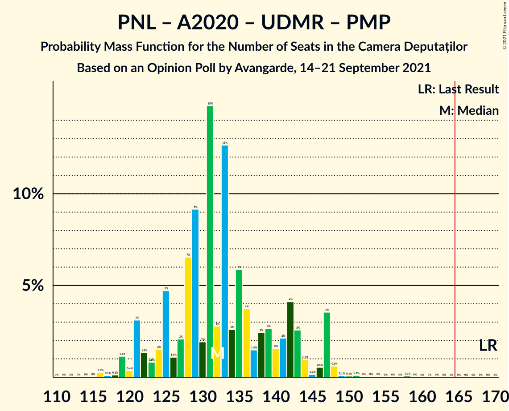

# Opinion Poll by Avangarde, 14–21 September 2021

<a href="#voting-intentions">Voting Intentions</a> | <a href="#seats">Seats</a> | <a href="#coalitions">Coalitions</a> | <a href="#technical-information">Technical Information</a>

## Voting Intentions

### Confidence Intervals

| Party | Last Result | Poll Result | 80% Confidence Interval | 90% Confidence Interval | 95% Confidence Interval | 99% Confidence Interval |
|:-----:|:-----------:|:-----------:|:-----------------------:|:-----------------------:|:-----------------------:|:-----------------------:|
| Partidul Social Democrat | 28.9% | 37.0% | 35.0–39.1% |34.4–39.7% |33.9–40.2% |32.9–41.2% |
| Partidul Național Liberal | 25.2% | 20.0% | 18.4–21.8% |17.9–22.3% |17.5–22.7% |16.8–23.6% |
| Alianța pentru Unirea Românilor | 9.1% | 14.0% | 12.6–15.6% |12.2–16.0% |11.9–16.4% |11.2–17.2% |
| Alianța 2020 USR-PLUS | 15.4% | 13.0% | 11.7–14.5% |11.3–15.0% |11.0–15.4% |10.3–16.1% |
| Uniunea Democrată Maghiară din România | 5.7% | 5.0% | 4.2–6.1% |3.9–6.4% |3.7–6.6% |3.4–7.2% |
| Partidul Mișcarea Populară | 4.8% | 4.0% | 3.3–5.0% |3.1–5.2% |2.9–5.5% |2.6–6.0% |
| Partidul Puterii Umaniste (social-liberal) | 0.0% | 4.0% | 3.3–5.0% |3.1–5.2% |2.9–5.5% |2.6–6.0% |
| PRO România | 4.1% | 2.0% | 1.5–2.7% |1.4–3.0% |1.3–3.1% |1.1–3.5% |

*Note:* The poll result column reflects the actual value used in the calculations. Published results may vary slightly, and in addition be rounded to fewer digits.

## Seats

### Confidence Intervals

| Party | Last Result | Median | 80% Confidence Interval | 90% Confidence Interval | 95% Confidence Interval | 99% Confidence Interval |
|:-----:|:-----------:|:------:|:-----------------------:|:-----------------------:|:-----------------------:|:-----------------------:|
| <a href="#partidul-social-democrat">Partidul Social Democrat</a> | 110 | 128 | 120–137 |120–140 |117–140 |112–142 |
| <a href="#partidul-național-liberal">Partidul Național Liberal</a> | 93 | 68 | 64–75 |62–77 |60–79 |57–82 |
| <a href="#alianța-pentru-unirea-românilor">Alianța pentru Unirea Românilor</a> | 33 | 49 | 43–54 |41–56 |40–57 |38–59 |
| <a href="#alianța-2020-usr-plus">Alianța 2020 USR-PLUS</a> | 55 | 44 | 39–50 |38–53 |37–53 |36–56 |
| <a href="#uniunea-democrată-maghiară-din-românia">Uniunea Democrată Maghiară din România</a> | 21 | 17 | 14–20 |13–21 |12–22 |11–25 |
| <a href="#partidul-mișcarea-populară">Partidul Mișcarea Populară</a> | 0 | 0 | 0 |0–17 |0–18 |0–19 |
| <a href="#partidul-puterii-umaniste-(social-liberal)">Partidul Puterii Umaniste (social-liberal)</a> | 0 | 0 | 0–17 |0–17 |0–18 |0–20 |
| <a href="#pro-românia">PRO România</a> | 0 | 0 | 0 |0 |0 |0 |

### Partidul Social Democrat

*For a full overview of the results for this party, see the [Partidul Social Democrat](party-partidulsocialdemocrat.html) page.*

| Number of Seats | Probability | Accumulated | Special Marks |
|:---------------:|:-----------:|:-----------:|:-------------:|
| 108 | 0.3% | 100% |  |
| 109 | 0% | 99.7% |  |
| 110 | 0.1% | 99.7% | Last Result |
| 111 | 0% | 99.6% |  |
| 112 | 0.1% | 99.5% |  |
| 113 | 0.2% | 99.4% |  |
| 114 | 0.8% | 99.2% |  |
| 115 | 0.3% | 98% |  |
| 116 | 0.2% | 98% |  |
| 117 | 0.6% | 98% |  |
| 118 | 1.1% | 97% |  |
| 119 | 0.5% | 96% |  |
| 120 | 8% | 96% |  |
| 121 | 1.0% | 88% |  |
| 122 | 3% | 87% |  |
| 123 | 3% | 84% |  |
| 124 | 8% | 81% |  |
| 125 | 5% | 73% |  |
| 126 | 13% | 69% |  |
| 127 | 3% | 56% |  |
| 128 | 6% | 53% | Median |
| 129 | 3% | 47% |  |
| 130 | 0.4% | 44% |  |
| 131 | 5% | 43% |  |
| 132 | 10% | 38% |  |
| 133 | 4% | 28% |  |
| 134 | 8% | 24% |  |
| 135 | 0.6% | 16% |  |
| 136 | 1.0% | 16% |  |
| 137 | 8% | 15% |  |
| 138 | 0.8% | 7% |  |
| 139 | 0.3% | 7% |  |
| 140 | 5% | 6% |  |
| 141 | 0.8% | 1.3% |  |
| 142 | 0.1% | 0.5% |  |
| 143 | 0.2% | 0.4% |  |
| 144 | 0% | 0.2% |  |
| 145 | 0.1% | 0.2% |  |
| 146 | 0% | 0.1% |  |
| 147 | 0.1% | 0.1% |  |
| 148 | 0% | 0% |  |

### Partidul Național Liberal

*For a full overview of the results for this party, see the [Partidul Național Liberal](party-partidulnaționalliberal.html) page.*

| Number of Seats | Probability | Accumulated | Special Marks |
|:---------------:|:-----------:|:-----------:|:-------------:|
| 54 | 0.1% | 100% |  |
| 55 | 0% | 99.9% |  |
| 56 | 0.1% | 99.9% |  |
| 57 | 0.3% | 99.8% |  |
| 58 | 0.2% | 99.5% |  |
| 59 | 0.6% | 99.3% |  |
| 60 | 2% | 98.7% |  |
| 61 | 1.2% | 97% |  |
| 62 | 2% | 96% |  |
| 63 | 3% | 94% |  |
| 64 | 3% | 91% |  |
| 65 | 3% | 87% |  |
| 66 | 11% | 84% |  |
| 67 | 13% | 73% |  |
| 68 | 12% | 60% | Median |
| 69 | 3% | 47% |  |
| 70 | 4% | 44% |  |
| 71 | 19% | 40% |  |
| 72 | 3% | 22% |  |
| 73 | 7% | 19% |  |
| 74 | 1.2% | 12% |  |
| 75 | 4% | 11% |  |
| 76 | 1.4% | 7% |  |
| 77 | 1.4% | 6% |  |
| 78 | 2% | 4% |  |
| 79 | 0.4% | 3% |  |
| 80 | 1.4% | 2% |  |
| 81 | 0.2% | 0.8% |  |
| 82 | 0.2% | 0.7% |  |
| 83 | 0.3% | 0.5% |  |
| 84 | 0.2% | 0.2% |  |
| 85 | 0% | 0.1% |  |
| 86 | 0% | 0.1% |  |
| 87 | 0% | 0.1% |  |
| 88 | 0% | 0% |  |
| 89 | 0% | 0% |  |
| 90 | 0% | 0% |  |
| 91 | 0% | 0% |  |
| 92 | 0% | 0% |  |
| 93 | 0% | 0% | Last Result |

### Alianța pentru Unirea Românilor

*For a full overview of the results for this party, see the [Alianța pentru Unirea Românilor](party-alianțapentruunirearomânilor.html) page.*

| Number of Seats | Probability | Accumulated | Special Marks |
|:---------------:|:-----------:|:-----------:|:-------------:|
| 33 | 0% | 100% | Last Result |
| 34 | 0% | 100% |  |
| 35 | 0% | 100% |  |
| 36 | 0.1% | 100% |  |
| 37 | 0.2% | 99.9% |  |
| 38 | 0.3% | 99.7% |  |
| 39 | 0.4% | 99.4% |  |
| 40 | 4% | 99.1% |  |
| 41 | 1.1% | 95% |  |
| 42 | 2% | 94% |  |
| 43 | 4% | 92% |  |
| 44 | 6% | 88% |  |
| 45 | 5% | 82% |  |
| 46 | 14% | 77% |  |
| 47 | 7% | 63% |  |
| 48 | 4% | 56% |  |
| 49 | 13% | 53% | Median |
| 50 | 11% | 40% |  |
| 51 | 3% | 28% |  |
| 52 | 3% | 25% |  |
| 53 | 11% | 22% |  |
| 54 | 4% | 11% |  |
| 55 | 1.0% | 6% |  |
| 56 | 2% | 5% |  |
| 57 | 2% | 3% |  |
| 58 | 0.3% | 1.0% |  |
| 59 | 0.2% | 0.7% |  |
| 60 | 0.1% | 0.5% |  |
| 61 | 0.3% | 0.4% |  |
| 62 | 0.1% | 0.1% |  |
| 63 | 0% | 0.1% |  |
| 64 | 0% | 0% |  |

### Alianța 2020 USR-PLUS

*For a full overview of the results for this party, see the [Alianța 2020 USR-PLUS](party-alianța2020usr-plus.html) page.*

| Number of Seats | Probability | Accumulated | Special Marks |
|:---------------:|:-----------:|:-----------:|:-------------:|
| 33 | 0% | 100% |  |
| 34 | 0.1% | 99.9% |  |
| 35 | 0.2% | 99.9% |  |
| 36 | 1.2% | 99.6% |  |
| 37 | 2% | 98% |  |
| 38 | 5% | 97% |  |
| 39 | 3% | 92% |  |
| 40 | 2% | 89% |  |
| 41 | 5% | 87% |  |
| 42 | 10% | 82% |  |
| 43 | 13% | 73% |  |
| 44 | 11% | 59% | Median |
| 45 | 9% | 48% |  |
| 46 | 6% | 40% |  |
| 47 | 2% | 34% |  |
| 48 | 4% | 32% |  |
| 49 | 6% | 28% |  |
| 50 | 12% | 22% |  |
| 51 | 2% | 10% |  |
| 52 | 1.1% | 8% |  |
| 53 | 5% | 7% |  |
| 54 | 0.3% | 1.3% |  |
| 55 | 0.4% | 1.1% | Last Result |
| 56 | 0.3% | 0.6% |  |
| 57 | 0.2% | 0.3% |  |
| 58 | 0% | 0.1% |  |
| 59 | 0.1% | 0.1% |  |
| 60 | 0% | 0% |  |

### Uniunea Democrată Maghiară din România

*For a full overview of the results for this party, see the [Uniunea Democrată Maghiară din România](party-uniuneademocratămaghiarădinromânia.html) page.*

| Number of Seats | Probability | Accumulated | Special Marks |
|:---------------:|:-----------:|:-----------:|:-------------:|
| 10 | 0.2% | 100% |  |
| 11 | 0.5% | 99.8% |  |
| 12 | 3% | 99.3% |  |
| 13 | 4% | 96% |  |
| 14 | 11% | 92% |  |
| 15 | 3% | 81% |  |
| 16 | 11% | 78% |  |
| 17 | 19% | 67% | Median |
| 18 | 10% | 48% |  |
| 19 | 20% | 38% |  |
| 20 | 11% | 17% |  |
| 21 | 2% | 6% | Last Result |
| 22 | 2% | 4% |  |
| 23 | 0.6% | 2% |  |
| 24 | 0.8% | 1.3% |  |
| 25 | 0.4% | 0.6% |  |
| 26 | 0.2% | 0.2% |  |
| 27 | 0% | 0.1% |  |
| 28 | 0% | 0% |  |

### Partidul Mișcarea Populară

*For a full overview of the results for this party, see the [Partidul Mișcarea Populară](party-partidulmișcareapopulară.html) page.*

| Number of Seats | Probability | Accumulated | Special Marks |
|:---------------:|:-----------:|:-----------:|:-------------:|
| 0 | 93% | 100% | Last Result, Median |
| 1 | 0% | 7% |  |
| 2 | 0% | 7% |  |
| 3 | 0% | 7% |  |
| 4 | 0% | 7% |  |
| 5 | 0% | 7% |  |
| 6 | 0% | 7% |  |
| 7 | 0% | 7% |  |
| 8 | 0% | 7% |  |
| 9 | 0% | 7% |  |
| 10 | 0% | 7% |  |
| 11 | 0% | 7% |  |
| 12 | 0% | 7% |  |
| 13 | 0% | 7% |  |
| 14 | 0% | 7% |  |
| 15 | 0% | 7% |  |
| 16 | 0.6% | 7% |  |
| 17 | 3% | 7% |  |
| 18 | 2% | 3% |  |
| 19 | 0.6% | 1.1% |  |
| 20 | 0.3% | 0.5% |  |
| 21 | 0.1% | 0.2% |  |
| 22 | 0.1% | 0.1% |  |
| 23 | 0% | 0% |  |

### Partidul Puterii Umaniste (social-liberal)

*For a full overview of the results for this party, see the [Partidul Puterii Umaniste (social-liberal)](party-partidulputeriiumanistesocial-liberal.html) page.*

| Number of Seats | Probability | Accumulated | Special Marks |
|:---------------:|:-----------:|:-----------:|:-------------:|
| 0 | 87% | 100% | Last Result, Median |
| 1 | 0% | 13% |  |
| 2 | 0% | 13% |  |
| 3 | 0% | 13% |  |
| 4 | 0% | 13% |  |
| 5 | 0% | 13% |  |
| 6 | 0% | 13% |  |
| 7 | 0% | 13% |  |
| 8 | 0% | 13% |  |
| 9 | 0% | 13% |  |
| 10 | 0% | 13% |  |
| 11 | 0% | 13% |  |
| 12 | 0% | 13% |  |
| 13 | 0% | 13% |  |
| 14 | 0% | 13% |  |
| 15 | 0% | 13% |  |
| 16 | 0.1% | 13% |  |
| 17 | 10% | 13% |  |
| 18 | 2% | 3% |  |
| 19 | 0.5% | 1.3% |  |
| 20 | 0.7% | 0.8% |  |
| 21 | 0% | 0.1% |  |
| 22 | 0% | 0.1% |  |
| 23 | 0% | 0% |  |

### PRO România

*For a full overview of the results for this party, see the [PRO România](party-proromânia.html) page.*

| Number of Seats | Probability | Accumulated | Special Marks |
|:---------------:|:-----------:|:-----------:|:-------------:|
| 0 | 100% | 100% | Last Result, Median |

## Coalitions

### Confidence Intervals

| Coalition | Last Result | Median | Majority? | 80% Confidence Interval | 90% Confidence Interval | 95% Confidence Interval | 99% Confidence Interval |
|:---------:|:-----------:|:------:|:---------:|:-----------------------:|:-----------------------:|:-----------------------:|:-----------------------:|
| Partidul Național Liberal – Alianța 2020 USR-PLUS – Uniunea Democrată Maghiară din România – Partidul Mișcarea Populară | 169 | 132 | 0% | 125–142 | 121–146 | 121–147 | 118–148 |
| Partidul Național Liberal – Alianța 2020 USR-PLUS – Uniunea Democrată Maghiară din România | 169 | 131 | 0% | 124–140 | 121–142 | 120–143 | 116–147 |
| Partidul Social Democrat – PRO România | 110 | 128 | 0% | 120–137 | 120–140 | 117–140 | 112–142 |
| Partidul Național Liberal – Alianța 2020 USR-PLUS – Partidul Mișcarea Populară | 148 | 115 | 0% | 109–124 | 105–128 | 104–129 | 102–134 |
| Partidul Național Liberal – Alianța 2020 USR-PLUS | 148 | 115 | 0% | 107–122 | 104–124 | 103–124 | 99–130 |
| Partidul Național Liberal – Uniunea Democrată Maghiară din România – Partidul Mișcarea Populară | 114 | 86 | 0% | 82–96 | 79–101 | 77–104 | 74–107 |
| Partidul Național Liberal – Uniunea Democrată Maghiară din România | 114 | 86 | 0% | 80–92 | 78–95 | 77–97 | 74–101 |
| Partidul Național Liberal – Partidul Mișcarea Populară | 93 | 70 | 0% | 64–78 | 62–84 | 61–85 | 58–90 |
| Partidul Național Liberal | 93 | 68 | 0% | 64–75 | 62–77 | 60–79 | 57–82 |
| Alianța 2020 USR-PLUS – Partidul Mișcarea Populară | 55 | 45 | 0% | 40–53 | 38–60 | 37–60 | 36–66 |

### Partidul Național Liberal – Alianța 2020 USR-PLUS – Uniunea Democrată Maghiară din România – Partidul Mișcarea Populară

| Number of Seats | Probability | Accumulated | Special Marks |
|:---------------:|:-----------:|:-----------:|:-------------:|
| 114 | 0% | 100% |  |
| 115 | 0% | 99.9% |  |
| 116 | 0.3% | 99.9% |  |
| 117 | 0.1% | 99.7% |  |
| 118 | 0.1% | 99.6% |  |
| 119 | 1.1% | 99.5% |  |
| 120 | 0.4% | 98% |  |
| 121 | 3% | 98% |  |
| 122 | 1.3% | 95% |  |
| 123 | 0.8% | 94% |  |
| 124 | 2% | 93% |  |
| 125 | 5% | 91% |  |
| 126 | 1.1% | 86% |  |
| 127 | 2% | 85% |  |
| 128 | 7% | 83% |  |
| 129 | 9% | 77% | Median |
| 130 | 2% | 68% |  |
| 131 | 15% | 66% |  |
| 132 | 3% | 51% |  |
| 133 | 13% | 48% |  |
| 134 | 3% | 35% |  |
| 135 | 6% | 33% |  |
| 136 | 4% | 27% |  |
| 137 | 1.5% | 23% |  |
| 138 | 2% | 22% |  |
| 139 | 3% | 19% |  |
| 140 | 2% | 17% |  |
| 141 | 2% | 15% |  |
| 142 | 4% | 13% |  |
| 143 | 3% | 9% |  |
| 144 | 1.0% | 6% |  |
| 145 | 0.2% | 5% |  |
| 146 | 0.5% | 5% |  |
| 147 | 4% | 5% |  |
| 148 | 0.6% | 1.1% |  |
| 149 | 0.1% | 0.5% |  |
| 150 | 0.1% | 0.4% |  |
| 151 | 0.1% | 0.3% |  |
| 152 | 0% | 0.2% |  |
| 153 | 0% | 0.2% |  |
| 154 | 0% | 0.1% |  |
| 155 | 0% | 0.1% |  |
| 156 | 0% | 0.1% |  |
| 157 | 0% | 0.1% |  |
| 158 | 0.1% | 0.1% |  |
| 159 | 0% | 0% |  |
| 160 | 0% | 0% |  |
| 161 | 0% | 0% |  |
| 162 | 0% | 0% |  |
| 163 | 0% | 0% |  |
| 164 | 0% | 0% |  |
| 165 | 0% | 0% | Majority |
| 166 | 0% | 0% |  |
| 167 | 0% | 0% |  |
| 168 | 0% | 0% |  |
| 169 | 0% | 0% | Last Result |

### Partidul Național Liberal – Alianța 2020 USR-PLUS – Uniunea Democrată Maghiară din România

| Number of Seats | Probability | Accumulated | Special Marks |
|:---------------:|:-----------:|:-----------:|:-------------:|
| 111 | 0% | 100% |  |
| 112 | 0% | 99.9% |  |
| 113 | 0% | 99.9% |  |
| 114 | 0.1% | 99.9% |  |
| 115 | 0.2% | 99.8% |  |
| 116 | 0.5% | 99.7% |  |
| 117 | 0.1% | 99.1% |  |
| 118 | 0.1% | 99.0% |  |
| 119 | 1.3% | 98.9% |  |
| 120 | 0.9% | 98% |  |
| 121 | 4% | 97% |  |
| 122 | 1.4% | 93% |  |
| 123 | 0.8% | 92% |  |
| 124 | 2% | 91% |  |
| 125 | 6% | 89% |  |
| 126 | 1.3% | 83% |  |
| 127 | 2% | 82% |  |
| 128 | 7% | 80% |  |
| 129 | 9% | 73% | Median |
| 130 | 5% | 63% |  |
| 131 | 15% | 59% |  |
| 132 | 3% | 44% |  |
| 133 | 12% | 41% |  |
| 134 | 3% | 29% |  |
| 135 | 6% | 26% |  |
| 136 | 4% | 20% |  |
| 137 | 1.4% | 17% |  |
| 138 | 2% | 15% |  |
| 139 | 2% | 13% |  |
| 140 | 1.3% | 11% |  |
| 141 | 2% | 10% |  |
| 142 | 4% | 8% |  |
| 143 | 2% | 4% |  |
| 144 | 0.8% | 2% |  |
| 145 | 0.1% | 1.4% |  |
| 146 | 0.1% | 1.3% |  |
| 147 | 0.7% | 1.2% |  |
| 148 | 0.4% | 0.5% |  |
| 149 | 0% | 0.1% |  |
| 150 | 0% | 0.1% |  |
| 151 | 0% | 0% |  |
| 152 | 0% | 0% |  |
| 153 | 0% | 0% |  |
| 154 | 0% | 0% |  |
| 155 | 0% | 0% |  |
| 156 | 0% | 0% |  |
| 157 | 0% | 0% |  |
| 158 | 0% | 0% |  |
| 159 | 0% | 0% |  |
| 160 | 0% | 0% |  |
| 161 | 0% | 0% |  |
| 162 | 0% | 0% |  |
| 163 | 0% | 0% |  |
| 164 | 0% | 0% |  |
| 165 | 0% | 0% | Majority |
| 166 | 0% | 0% |  |
| 167 | 0% | 0% |  |
| 168 | 0% | 0% |  |
| 169 | 0% | 0% | Last Result |

### Partidul Social Democrat – PRO România

| Number of Seats | Probability | Accumulated | Special Marks |
|:---------------:|:-----------:|:-----------:|:-------------:|
| 108 | 0.3% | 100% |  |
| 109 | 0% | 99.7% |  |
| 110 | 0.1% | 99.7% | Last Result |
| 111 | 0% | 99.6% |  |
| 112 | 0.1% | 99.5% |  |
| 113 | 0.2% | 99.4% |  |
| 114 | 0.8% | 99.2% |  |
| 115 | 0.3% | 98% |  |
| 116 | 0.2% | 98% |  |
| 117 | 0.6% | 98% |  |
| 118 | 1.1% | 97% |  |
| 119 | 0.5% | 96% |  |
| 120 | 8% | 96% |  |
| 121 | 1.0% | 88% |  |
| 122 | 3% | 87% |  |
| 123 | 3% | 84% |  |
| 124 | 8% | 81% |  |
| 125 | 5% | 73% |  |
| 126 | 13% | 69% |  |
| 127 | 3% | 56% |  |
| 128 | 6% | 53% | Median |
| 129 | 3% | 47% |  |
| 130 | 0.4% | 44% |  |
| 131 | 5% | 43% |  |
| 132 | 10% | 38% |  |
| 133 | 4% | 28% |  |
| 134 | 8% | 24% |  |
| 135 | 0.6% | 16% |  |
| 136 | 1.0% | 16% |  |
| 137 | 8% | 15% |  |
| 138 | 0.8% | 7% |  |
| 139 | 0.3% | 7% |  |
| 140 | 5% | 6% |  |
| 141 | 0.8% | 1.3% |  |
| 142 | 0.1% | 0.5% |  |
| 143 | 0.2% | 0.4% |  |
| 144 | 0% | 0.2% |  |
| 145 | 0.1% | 0.2% |  |
| 146 | 0% | 0.1% |  |
| 147 | 0.1% | 0.1% |  |
| 148 | 0% | 0% |  |

### Partidul Național Liberal – Alianța 2020 USR-PLUS – Partidul Mișcarea Populară

| Number of Seats | Probability | Accumulated | Special Marks |
|:---------------:|:-----------:|:-----------:|:-------------:|
| 97 | 0% | 100% |  |
| 98 | 0.1% | 99.9% |  |
| 99 | 0.2% | 99.8% |  |
| 100 | 0% | 99.6% |  |
| 101 | 0% | 99.6% |  |
| 102 | 0.3% | 99.5% |  |
| 103 | 2% | 99.2% |  |
| 104 | 2% | 98% |  |
| 105 | 0.5% | 95% |  |
| 106 | 0.6% | 95% |  |
| 107 | 2% | 94% |  |
| 108 | 0.5% | 92% |  |
| 109 | 14% | 92% |  |
| 110 | 0.9% | 78% |  |
| 111 | 9% | 77% |  |
| 112 | 6% | 68% | Median |
| 113 | 2% | 61% |  |
| 114 | 0.6% | 59% |  |
| 115 | 10% | 58% |  |
| 116 | 16% | 48% |  |
| 117 | 2% | 32% |  |
| 118 | 3% | 30% |  |
| 119 | 0.3% | 27% |  |
| 120 | 1.2% | 27% |  |
| 121 | 5% | 26% |  |
| 122 | 5% | 21% |  |
| 123 | 3% | 16% |  |
| 124 | 6% | 13% |  |
| 125 | 0.6% | 7% |  |
| 126 | 0.6% | 6% |  |
| 127 | 0.2% | 6% |  |
| 128 | 3% | 5% |  |
| 129 | 0.8% | 3% |  |
| 130 | 0.5% | 2% |  |
| 131 | 0.3% | 1.3% |  |
| 132 | 0.1% | 0.9% |  |
| 133 | 0.1% | 0.9% |  |
| 134 | 0.4% | 0.7% |  |
| 135 | 0.1% | 0.3% |  |
| 136 | 0% | 0.2% |  |
| 137 | 0% | 0.2% |  |
| 138 | 0.1% | 0.2% |  |
| 139 | 0% | 0.1% |  |
| 140 | 0.1% | 0.1% |  |
| 141 | 0% | 0% |  |
| 142 | 0% | 0% |  |
| 143 | 0% | 0% |  |
| 144 | 0% | 0% |  |
| 145 | 0% | 0% |  |
| 146 | 0% | 0% |  |
| 147 | 0% | 0% |  |
| 148 | 0% | 0% | Last Result |

### Partidul Național Liberal – Alianța 2020 USR-PLUS

| Number of Seats | Probability | Accumulated | Special Marks |
|:---------------:|:-----------:|:-----------:|:-------------:|
| 96 | 0% | 100% |  |
| 97 | 0.3% | 99.9% |  |
| 98 | 0.1% | 99.7% |  |
| 99 | 0.2% | 99.5% |  |
| 100 | 0% | 99.3% |  |
| 101 | 0.2% | 99.3% |  |
| 102 | 0.4% | 99.1% |  |
| 103 | 2% | 98.6% |  |
| 104 | 3% | 97% |  |
| 105 | 1.2% | 94% |  |
| 106 | 0.6% | 93% |  |
| 107 | 2% | 92% |  |
| 108 | 0.7% | 90% |  |
| 109 | 14% | 89% |  |
| 110 | 1.1% | 75% |  |
| 111 | 12% | 74% |  |
| 112 | 7% | 62% | Median |
| 113 | 2% | 55% |  |
| 114 | 0.5% | 53% |  |
| 115 | 11% | 52% |  |
| 116 | 17% | 42% |  |
| 117 | 2% | 25% |  |
| 118 | 3% | 23% |  |
| 119 | 0.3% | 20% |  |
| 120 | 1.0% | 20% |  |
| 121 | 4% | 19% |  |
| 122 | 5% | 15% |  |
| 123 | 2% | 10% |  |
| 124 | 6% | 8% |  |
| 125 | 0.3% | 2% |  |
| 126 | 0% | 1.4% |  |
| 127 | 0.1% | 1.3% |  |
| 128 | 0.2% | 1.2% |  |
| 129 | 0.3% | 1.1% |  |
| 130 | 0.5% | 0.8% |  |
| 131 | 0.2% | 0.3% |  |
| 132 | 0% | 0.1% |  |
| 133 | 0% | 0.1% |  |
| 134 | 0% | 0% |  |
| 135 | 0% | 0% |  |
| 136 | 0% | 0% |  |
| 137 | 0% | 0% |  |
| 138 | 0% | 0% |  |
| 139 | 0% | 0% |  |
| 140 | 0% | 0% |  |
| 141 | 0% | 0% |  |
| 142 | 0% | 0% |  |
| 143 | 0% | 0% |  |
| 144 | 0% | 0% |  |
| 145 | 0% | 0% |  |
| 146 | 0% | 0% |  |
| 147 | 0% | 0% |  |
| 148 | 0% | 0% | Last Result |

### Partidul Național Liberal – Uniunea Democrată Maghiară din România – Partidul Mișcarea Populară

| Number of Seats | Probability | Accumulated | Special Marks |
|:---------------:|:-----------:|:-----------:|:-------------:|
| 70 | 0% | 100% |  |
| 71 | 0.1% | 99.9% |  |
| 72 | 0.1% | 99.9% |  |
| 73 | 0% | 99.8% |  |
| 74 | 0.9% | 99.8% |  |
| 75 | 0.3% | 98.9% |  |
| 76 | 0.7% | 98.6% |  |
| 77 | 0.7% | 98% |  |
| 78 | 2% | 97% |  |
| 79 | 0.9% | 96% |  |
| 80 | 3% | 95% |  |
| 81 | 2% | 92% |  |
| 82 | 2% | 90% |  |
| 83 | 13% | 88% |  |
| 84 | 3% | 75% |  |
| 85 | 8% | 72% | Median |
| 86 | 16% | 64% |  |
| 87 | 6% | 48% |  |
| 88 | 9% | 42% |  |
| 89 | 6% | 33% |  |
| 90 | 4% | 27% |  |
| 91 | 3% | 23% |  |
| 92 | 4% | 21% |  |
| 93 | 3% | 17% |  |
| 94 | 1.2% | 14% |  |
| 95 | 2% | 13% |  |
| 96 | 1.5% | 11% |  |
| 97 | 2% | 9% |  |
| 98 | 1.1% | 8% |  |
| 99 | 0.8% | 7% |  |
| 100 | 0.6% | 6% |  |
| 101 | 1.3% | 5% |  |
| 102 | 0.7% | 4% |  |
| 103 | 0.1% | 3% |  |
| 104 | 3% | 3% |  |
| 105 | 0.1% | 0.8% |  |
| 106 | 0.1% | 0.7% |  |
| 107 | 0.2% | 0.7% |  |
| 108 | 0.2% | 0.5% |  |
| 109 | 0.1% | 0.2% |  |
| 110 | 0% | 0.1% |  |
| 111 | 0% | 0.1% |  |
| 112 | 0% | 0.1% |  |
| 113 | 0% | 0.1% |  |
| 114 | 0% | 0.1% | Last Result |
| 115 | 0.1% | 0.1% |  |
| 116 | 0% | 0% |  |

### Partidul Național Liberal – Uniunea Democrată Maghiară din România

| Number of Seats | Probability | Accumulated | Special Marks |
|:---------------:|:-----------:|:-----------:|:-------------:|
| 69 | 0.1% | 100% |  |
| 70 | 0% | 99.9% |  |
| 71 | 0.1% | 99.9% |  |
| 72 | 0.1% | 99.8% |  |
| 73 | 0.1% | 99.7% |  |
| 74 | 1.0% | 99.6% |  |
| 75 | 0.3% | 98.6% |  |
| 76 | 0.9% | 98% |  |
| 77 | 0.8% | 98% |  |
| 78 | 2% | 97% |  |
| 79 | 2% | 95% |  |
| 80 | 3% | 93% |  |
| 81 | 2% | 90% |  |
| 82 | 3% | 88% |  |
| 83 | 14% | 85% |  |
| 84 | 3% | 72% |  |
| 85 | 8% | 68% | Median |
| 86 | 16% | 60% |  |
| 87 | 9% | 44% |  |
| 88 | 9% | 35% |  |
| 89 | 6% | 26% |  |
| 90 | 4% | 20% |  |
| 91 | 2% | 16% |  |
| 92 | 4% | 14% |  |
| 93 | 3% | 10% |  |
| 94 | 1.2% | 7% |  |
| 95 | 1.2% | 6% |  |
| 96 | 1.3% | 5% |  |
| 97 | 1.4% | 3% |  |
| 98 | 0.6% | 2% |  |
| 99 | 0.2% | 1.3% |  |
| 100 | 0.4% | 1.1% |  |
| 101 | 0.6% | 0.7% |  |
| 102 | 0.1% | 0.1% |  |
| 103 | 0% | 0.1% |  |
| 104 | 0% | 0.1% |  |
| 105 | 0% | 0% |  |
| 106 | 0% | 0% |  |
| 107 | 0% | 0% |  |
| 108 | 0% | 0% |  |
| 109 | 0% | 0% |  |
| 110 | 0% | 0% |  |
| 111 | 0% | 0% |  |
| 112 | 0% | 0% |  |
| 113 | 0% | 0% |  |
| 114 | 0% | 0% | Last Result |

### Partidul Național Liberal – Partidul Mișcarea Populară

| Number of Seats | Probability | Accumulated | Special Marks |
|:---------------:|:-----------:|:-----------:|:-------------:|
| 54 | 0% | 100% |  |
| 55 | 0% | 99.9% |  |
| 56 | 0.1% | 99.9% |  |
| 57 | 0.3% | 99.9% |  |
| 58 | 0.2% | 99.6% |  |
| 59 | 0.4% | 99.4% |  |
| 60 | 1.3% | 99.0% |  |
| 61 | 1.0% | 98% |  |
| 62 | 2% | 97% |  |
| 63 | 2% | 95% |  |
| 64 | 3% | 93% |  |
| 65 | 3% | 89% |  |
| 66 | 11% | 86% |  |
| 67 | 13% | 76% |  |
| 68 | 9% | 63% | Median |
| 69 | 3% | 53% |  |
| 70 | 4% | 51% |  |
| 71 | 19% | 47% |  |
| 72 | 2% | 28% |  |
| 73 | 6% | 26% |  |
| 74 | 1.2% | 20% |  |
| 75 | 4% | 18% |  |
| 76 | 2% | 14% |  |
| 77 | 2% | 13% |  |
| 78 | 2% | 11% |  |
| 79 | 0.8% | 9% |  |
| 80 | 1.5% | 8% |  |
| 81 | 0.9% | 7% |  |
| 82 | 0.3% | 6% |  |
| 83 | 0.6% | 6% |  |
| 84 | 0.2% | 5% |  |
| 85 | 3% | 5% |  |
| 86 | 0.7% | 2% |  |
| 87 | 0.3% | 1.3% |  |
| 88 | 0.3% | 1.0% |  |
| 89 | 0.2% | 0.7% |  |
| 90 | 0.3% | 0.6% |  |
| 91 | 0% | 0.3% |  |
| 92 | 0% | 0.2% |  |
| 93 | 0% | 0.2% | Last Result |
| 94 | 0.1% | 0.2% |  |
| 95 | 0% | 0.1% |  |
| 96 | 0% | 0.1% |  |
| 97 | 0.1% | 0.1% |  |
| 98 | 0% | 0% |  |

### Partidul Național Liberal

| Number of Seats | Probability | Accumulated | Special Marks |
|:---------------:|:-----------:|:-----------:|:-------------:|
| 54 | 0.1% | 100% |  |
| 55 | 0% | 99.9% |  |
| 56 | 0.1% | 99.9% |  |
| 57 | 0.3% | 99.8% |  |
| 58 | 0.2% | 99.5% |  |
| 59 | 0.6% | 99.3% |  |
| 60 | 2% | 98.7% |  |
| 61 | 1.2% | 97% |  |
| 62 | 2% | 96% |  |
| 63 | 3% | 94% |  |
| 64 | 3% | 91% |  |
| 65 | 3% | 87% |  |
| 66 | 11% | 84% |  |
| 67 | 13% | 73% |  |
| 68 | 12% | 60% | Median |
| 69 | 3% | 47% |  |
| 70 | 4% | 44% |  |
| 71 | 19% | 40% |  |
| 72 | 3% | 22% |  |
| 73 | 7% | 19% |  |
| 74 | 1.2% | 12% |  |
| 75 | 4% | 11% |  |
| 76 | 1.4% | 7% |  |
| 77 | 1.4% | 6% |  |
| 78 | 2% | 4% |  |
| 79 | 0.4% | 3% |  |
| 80 | 1.4% | 2% |  |
| 81 | 0.2% | 0.8% |  |
| 82 | 0.2% | 0.7% |  |
| 83 | 0.3% | 0.5% |  |
| 84 | 0.2% | 0.2% |  |
| 85 | 0% | 0.1% |  |
| 86 | 0% | 0.1% |  |
| 87 | 0% | 0.1% |  |
| 88 | 0% | 0% |  |
| 89 | 0% | 0% |  |
| 90 | 0% | 0% |  |
| 91 | 0% | 0% |  |
| 92 | 0% | 0% |  |
| 93 | 0% | 0% | Last Result |

### Alianța 2020 USR-PLUS – Partidul Mișcarea Populară

| Number of Seats | Probability | Accumulated | Special Marks |
|:---------------:|:-----------:|:-----------:|:-------------:|
| 34 | 0% | 100% |  |
| 35 | 0.2% | 99.9% |  |
| 36 | 0.6% | 99.7% |  |
| 37 | 2% | 99.1% |  |
| 38 | 5% | 97% |  |
| 39 | 3% | 93% |  |
| 40 | 1.1% | 90% |  |
| 41 | 5% | 89% |  |
| 42 | 9% | 84% |  |
| 43 | 11% | 76% |  |
| 44 | 11% | 65% | Median |
| 45 | 8% | 54% |  |
| 46 | 5% | 46% |  |
| 47 | 2% | 40% |  |
| 48 | 3% | 39% |  |
| 49 | 6% | 35% |  |
| 50 | 12% | 29% |  |
| 51 | 2% | 17% |  |
| 52 | 1.3% | 15% |  |
| 53 | 5% | 14% |  |
| 54 | 0.7% | 8% |  |
| 55 | 0.6% | 8% | Last Result |
| 56 | 0.4% | 7% |  |
| 57 | 0.9% | 7% |  |
| 58 | 0.4% | 6% |  |
| 59 | 0.4% | 5% |  |
| 60 | 3% | 5% |  |
| 61 | 0.3% | 2% |  |
| 62 | 0.4% | 2% |  |
| 63 | 0.1% | 1.2% |  |
| 64 | 0.2% | 1.1% |  |
| 65 | 0.1% | 0.9% |  |
| 66 | 0.4% | 0.8% |  |
| 67 | 0.2% | 0.4% |  |
| 68 | 0.1% | 0.2% |  |
| 69 | 0% | 0.1% |  |
| 70 | 0.1% | 0.1% |  |
| 71 | 0% | 0% |  |

## Technical Information

### Opinion Poll

+ **Polling firm:** Avangarde
+ **Commissioner(s):** —
+ **Fieldwork period:** 14–21 September 2021

### Calculations

+ **Sample size:** 900
+ **Simulations done:** 131,072
+ **Error estimate:** 1.98%

