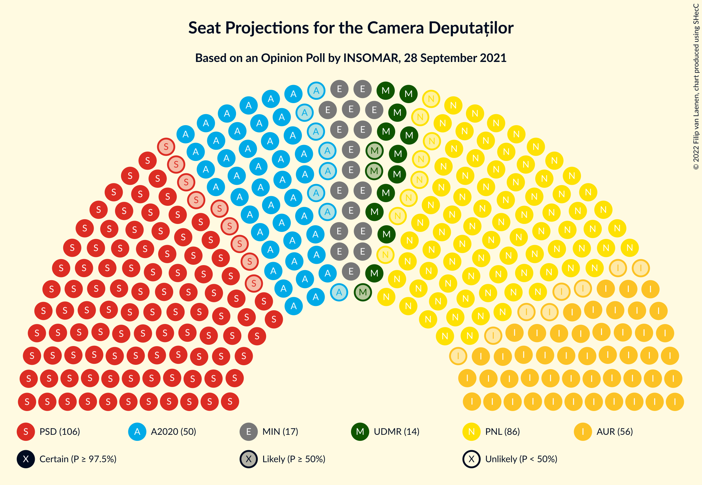
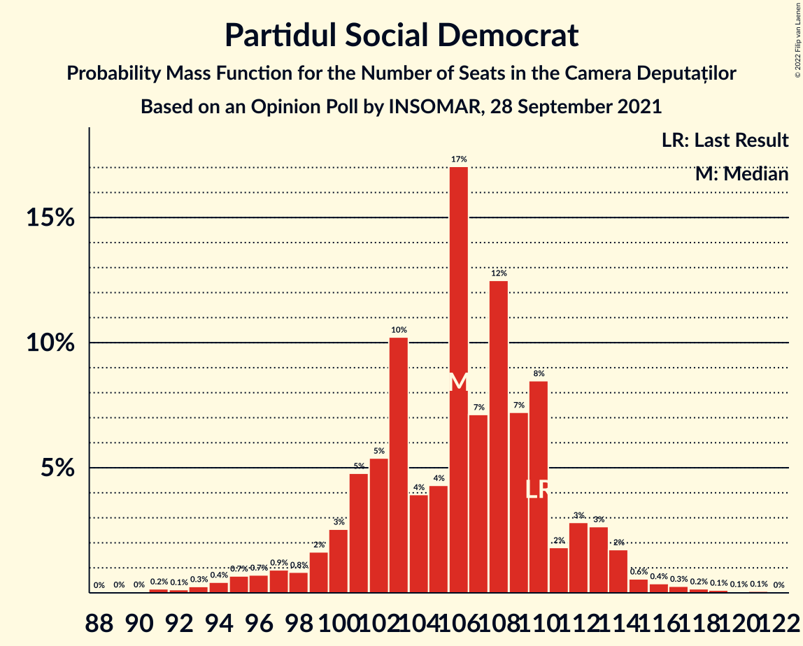
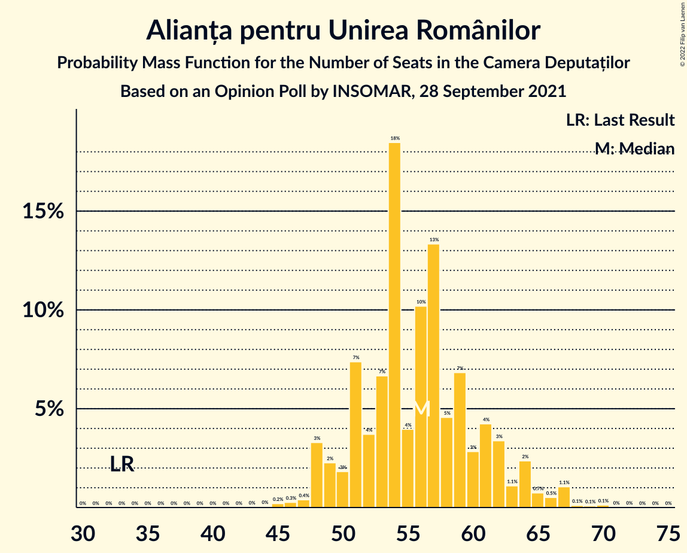

# Opinion Poll by INSOMAR, 28 September 2021

<a href="#voting-intentions">Voting Intentions</a> | <a href="#seats">Seats</a> | <a href="#coalitions">Coalitions</a> | <a href="#technical-information">Technical Information</a>

## Voting Intentions

### Confidence Intervals

| Party | Last Result | Poll Result | 80% Confidence Interval | 90% Confidence Interval | 95% Confidence Interval | 99% Confidence Interval |
|:-----:|:-----------:|:-----------:|:-----------------------:|:-----------------------:|:-----------------------:|:-----------------------:|
| Partidul Social Democrat | 28.9% | 31.6% | 29.7–33.5% |29.2–34.0% |28.8–34.5% |27.9–35.4% |
| Partidul Național Liberal | 25.2% | 25.9% | 24.2–27.7% |23.7–28.2% |23.3–28.7% |22.5–29.6% |
| Alianța pentru Unirea Românilor | 9.1% | 17.0% | 15.6–18.6% |15.2–19.0% |14.8–19.4% |14.2–20.2% |
| Alianța 2020 USR-PLUS | 15.4% | 15.0% | 13.6–16.5% |13.2–16.9% |12.9–17.3% |12.3–18.0% |
| Uniunea Democrată Maghiară din România | 5.7% | 4.6% | 3.8–5.5% |3.6–5.8% |3.4–6.0% |3.1–6.5% |
| Partidul Mișcarea Populară | 4.8% | 2.5% | 2.0–3.3% |1.8–3.5% |1.7–3.7% |1.5–4.1% |
| PRO România | 4.1% | 2.3% | 1.8–3.1% |1.7–3.3% |1.6–3.4% |1.4–3.8% |

*Note:* The poll result column reflects the actual value used in the calculations. Published results may vary slightly, and in addition be rounded to fewer digits.

## Seats

### Confidence Intervals

| Party | Last Result | Median | 80% Confidence Interval | 90% Confidence Interval | 95% Confidence Interval | 99% Confidence Interval |
|:-----:|:-----------:|:------:|:-----------------------:|:-----------------------:|:-----------------------:|:-----------------------:|
| <a href="#partidul-social-democrat">Partidul Social Democrat</a> | 110 | 104 | 99–111 |97–113 |96–114 |93–117 |
| <a href="#partidul-național-liberal">Partidul Național Liberal</a> | 93 | 86 | 81–92 |79–94 |77–95 |75–98 |
| <a href="#alianța-pentru-unirea-românilor">Alianța pentru Unirea Românilor</a> | 33 | 56 | 51–61 |50–63 |49–64 |47–67 |
| <a href="#alianța-2020-usr-plus">Alianța 2020 USR-PLUS</a> | 55 | 50 | 45–54 |44–56 |43–57 |41–60 |
| <a href="#uniunea-democrată-maghiară-din-românia">Uniunea Democrată Maghiară din România</a> | 21 | 15 | 13–18 |12–19 |11–19 |10–21 |
| <a href="#partidul-mișcarea-populară">Partidul Mișcarea Populară</a> | 0 | 0 | 0 |0 |0 |0 |
| <a href="#pro-românia">PRO România</a> | 0 | 0 | 0 |0 |0 |0 |

### Partidul Social Democrat

*For a full overview of the results for this party, see the [Partidul Social Democrat](party-partidulsocialdemocrat.html) page.*

| Number of Seats | Probability | Accumulated | Special Marks |
|:---------------:|:-----------:|:-----------:|:-------------:|
| 89 | 0% | 100% |  |
| 90 | 0.1% | 99.9% |  |
| 91 | 0.1% | 99.9% |  |
| 92 | 0.2% | 99.8% |  |
| 93 | 0.5% | 99.5% |  |
| 94 | 0.4% | 99.1% |  |
| 95 | 0.9% | 98.7% |  |
| 96 | 2% | 98% |  |
| 97 | 2% | 95% |  |
| 98 | 3% | 93% |  |
| 99 | 5% | 91% |  |
| 100 | 6% | 86% |  |
| 101 | 4% | 80% |  |
| 102 | 7% | 76% |  |
| 103 | 12% | 68% |  |
| 104 | 8% | 57% | Median |
| 105 | 7% | 49% |  |
| 106 | 8% | 42% |  |
| 107 | 7% | 34% |  |
| 108 | 6% | 27% |  |
| 109 | 5% | 21% |  |
| 110 | 5% | 15% | Last Result |
| 111 | 3% | 10% |  |
| 112 | 2% | 8% |  |
| 113 | 2% | 5% |  |
| 114 | 1.2% | 3% |  |
| 115 | 0.9% | 2% |  |
| 116 | 0.5% | 1.2% |  |
| 117 | 0.3% | 0.7% |  |
| 118 | 0.1% | 0.4% |  |
| 119 | 0.1% | 0.2% |  |
| 120 | 0.1% | 0.1% |  |
| 121 | 0% | 0.1% |  |
| 122 | 0% | 0% |  |

### Partidul Național Liberal

*For a full overview of the results for this party, see the [Partidul Național Liberal](party-partidulnaționalliberal.html) page.*

| Number of Seats | Probability | Accumulated | Special Marks |
|:---------------:|:-----------:|:-----------:|:-------------:|
| 72 | 0% | 100% |  |
| 73 | 0.1% | 99.9% |  |
| 74 | 0.2% | 99.8% |  |
| 75 | 0.4% | 99.6% |  |
| 76 | 0.7% | 99.2% |  |
| 77 | 1.0% | 98% |  |
| 78 | 2% | 97% |  |
| 79 | 2% | 96% |  |
| 80 | 3% | 93% |  |
| 81 | 6% | 90% |  |
| 82 | 6% | 84% |  |
| 83 | 6% | 78% |  |
| 84 | 9% | 72% |  |
| 85 | 8% | 63% |  |
| 86 | 8% | 55% | Median |
| 87 | 9% | 48% |  |
| 88 | 9% | 39% |  |
| 89 | 7% | 30% |  |
| 90 | 6% | 23% |  |
| 91 | 5% | 16% |  |
| 92 | 3% | 11% |  |
| 93 | 3% | 8% | Last Result |
| 94 | 2% | 5% |  |
| 95 | 2% | 4% |  |
| 96 | 0.7% | 2% |  |
| 97 | 0.7% | 1.4% |  |
| 98 | 0.3% | 0.6% |  |
| 99 | 0.1% | 0.3% |  |
| 100 | 0.1% | 0.2% |  |
| 101 | 0.1% | 0.1% |  |
| 102 | 0% | 0% |  |

### Alianța pentru Unirea Românilor

*For a full overview of the results for this party, see the [Alianța pentru Unirea Românilor](party-alianțapentruunirearomânilor.html) page.*

| Number of Seats | Probability | Accumulated | Special Marks |
|:---------------:|:-----------:|:-----------:|:-------------:|
| 33 | 0% | 100% | Last Result |
| 34 | 0% | 100% |  |
| 35 | 0% | 100% |  |
| 36 | 0% | 100% |  |
| 37 | 0% | 100% |  |
| 38 | 0% | 100% |  |
| 39 | 0% | 100% |  |
| 40 | 0% | 100% |  |
| 41 | 0% | 100% |  |
| 42 | 0% | 100% |  |
| 43 | 0% | 100% |  |
| 44 | 0% | 100% |  |
| 45 | 0.1% | 99.9% |  |
| 46 | 0.2% | 99.8% |  |
| 47 | 0.5% | 99.6% |  |
| 48 | 1.0% | 99.1% |  |
| 49 | 2% | 98% |  |
| 50 | 3% | 96% |  |
| 51 | 4% | 94% |  |
| 52 | 5% | 89% |  |
| 53 | 7% | 84% |  |
| 54 | 9% | 77% |  |
| 55 | 10% | 67% |  |
| 56 | 9% | 57% | Median |
| 57 | 11% | 48% |  |
| 58 | 8% | 36% |  |
| 59 | 8% | 29% |  |
| 60 | 6% | 21% |  |
| 61 | 5% | 14% |  |
| 62 | 3% | 9% |  |
| 63 | 2% | 6% |  |
| 64 | 1.5% | 3% |  |
| 65 | 0.9% | 2% |  |
| 66 | 0.6% | 1.2% |  |
| 67 | 0.3% | 0.6% |  |
| 68 | 0.2% | 0.3% |  |
| 69 | 0.1% | 0.1% |  |
| 70 | 0% | 0.1% |  |
| 71 | 0% | 0% |  |

### Alianța 2020 USR-PLUS

*For a full overview of the results for this party, see the [Alianța 2020 USR-PLUS](party-alianța2020usr-plus.html) page.*

| Number of Seats | Probability | Accumulated | Special Marks |
|:---------------:|:-----------:|:-----------:|:-------------:|
| 38 | 0.1% | 100% |  |
| 39 | 0.1% | 99.9% |  |
| 40 | 0.3% | 99.8% |  |
| 41 | 0.5% | 99.5% |  |
| 42 | 1.1% | 99.0% |  |
| 43 | 2% | 98% |  |
| 44 | 5% | 96% |  |
| 45 | 5% | 91% |  |
| 46 | 7% | 85% |  |
| 47 | 8% | 79% |  |
| 48 | 9% | 71% |  |
| 49 | 10% | 63% |  |
| 50 | 10% | 52% | Median |
| 51 | 14% | 42% |  |
| 52 | 9% | 29% |  |
| 53 | 7% | 20% |  |
| 54 | 4% | 13% |  |
| 55 | 3% | 9% | Last Result |
| 56 | 2% | 6% |  |
| 57 | 1.4% | 4% |  |
| 58 | 1.2% | 2% |  |
| 59 | 0.5% | 1.0% |  |
| 60 | 0.3% | 0.5% |  |
| 61 | 0.1% | 0.2% |  |
| 62 | 0.1% | 0.1% |  |
| 63 | 0% | 0% |  |

### Uniunea Democrată Maghiară din România

*For a full overview of the results for this party, see the [Uniunea Democrată Maghiară din România](party-uniuneademocratămaghiarădinromânia.html) page.*

| Number of Seats | Probability | Accumulated | Special Marks |
|:---------------:|:-----------:|:-----------:|:-------------:|
| 9 | 0.2% | 100% |  |
| 10 | 1.0% | 99.7% |  |
| 11 | 3% | 98.7% |  |
| 12 | 5% | 96% |  |
| 13 | 9% | 91% |  |
| 14 | 14% | 82% |  |
| 15 | 19% | 68% | Median |
| 16 | 18% | 48% |  |
| 17 | 15% | 30% |  |
| 18 | 9% | 15% |  |
| 19 | 4% | 7% |  |
| 20 | 2% | 2% |  |
| 21 | 0.6% | 0.8% | Last Result |
| 22 | 0.1% | 0.2% |  |
| 23 | 0.1% | 0.1% |  |
| 24 | 0% | 0% |  |

### Partidul Mișcarea Populară

*For a full overview of the results for this party, see the [Partidul Mișcarea Populară](party-partidulmișcareapopulară.html) page.*

| Number of Seats | Probability | Accumulated | Special Marks |
|:---------------:|:-----------:|:-----------:|:-------------:|
| 0 | 100% | 100% | Last Result, Median |

### PRO România

*For a full overview of the results for this party, see the [PRO România](party-proromânia.html) page.*

| Number of Seats | Probability | Accumulated | Special Marks |
|:---------------:|:-----------:|:-----------:|:-------------:|
| 0 | 100% | 100% | Last Result, Median |

## Coalitions

### Confidence Intervals

| Coalition | Last Result | Median | Majority? | 80% Confidence Interval | 90% Confidence Interval | 95% Confidence Interval | 99% Confidence Interval |
|:---------:|:-----------:|:------:|:---------:|:-----------------------:|:-----------------------:|:-----------------------:|:-----------------------:|
| Partidul Național Liberal – Alianța 2020 USR-PLUS – Uniunea Democrată Maghiară din România – Partidul Mișcarea Populară | 169 | 151 | 0.4% | 145–157 | 143–159 | 141–161 | 138–164 |
| Partidul Național Liberal – Alianța 2020 USR-PLUS – Uniunea Democrată Maghiară din România | 169 | 151 | 0.4% | 145–157 | 143–159 | 141–161 | 138–164 |
| Partidul Național Liberal – Alianța 2020 USR-PLUS – Partidul Mișcarea Populară | 148 | 136 | 0% | 129–142 | 128–144 | 126–146 | 123–149 |
| Partidul Național Liberal – Alianța 2020 USR-PLUS | 148 | 136 | 0% | 129–142 | 128–144 | 126–146 | 123–149 |
| Partidul Social Democrat – PRO România | 110 | 104 | 0% | 99–111 | 97–113 | 96–114 | 93–117 |
| Partidul Național Liberal – Uniunea Democrată Maghiară din România – Partidul Mișcarea Populară | 114 | 101 | 0% | 95–107 | 94–109 | 92–111 | 90–114 |
| Partidul Național Liberal – Uniunea Democrată Maghiară din România | 114 | 101 | 0% | 95–107 | 94–109 | 92–111 | 90–114 |
| Partidul Național Liberal – Partidul Mișcarea Populară | 93 | 86 | 0% | 81–92 | 79–94 | 77–95 | 75–98 |
| Partidul Național Liberal | 93 | 86 | 0% | 81–92 | 79–94 | 77–95 | 75–98 |
| Alianța 2020 USR-PLUS – Partidul Mișcarea Populară | 55 | 50 | 0% | 45–54 | 44–56 | 43–57 | 41–60 |

### Partidul Național Liberal – Alianța 2020 USR-PLUS – Uniunea Democrată Maghiară din România – Partidul Mișcarea Populară

| Number of Seats | Probability | Accumulated | Special Marks |
|:---------------:|:-----------:|:-----------:|:-------------:|
| 135 | 0% | 100% |  |
| 136 | 0.1% | 99.9% |  |
| 137 | 0.2% | 99.8% |  |
| 138 | 0.3% | 99.6% |  |
| 139 | 0.4% | 99.4% |  |
| 140 | 0.7% | 99.0% |  |
| 141 | 1.0% | 98% |  |
| 142 | 2% | 97% |  |
| 143 | 3% | 96% |  |
| 144 | 2% | 93% |  |
| 145 | 3% | 91% |  |
| 146 | 4% | 87% |  |
| 147 | 6% | 84% |  |
| 148 | 8% | 77% |  |
| 149 | 7% | 69% |  |
| 150 | 7% | 62% |  |
| 151 | 7% | 55% | Median |
| 152 | 9% | 48% |  |
| 153 | 7% | 39% |  |
| 154 | 8% | 32% |  |
| 155 | 6% | 24% |  |
| 156 | 5% | 18% |  |
| 157 | 3% | 13% |  |
| 158 | 3% | 10% |  |
| 159 | 2% | 7% |  |
| 160 | 2% | 5% |  |
| 161 | 1.3% | 3% |  |
| 162 | 0.8% | 2% |  |
| 163 | 0.4% | 1.0% |  |
| 164 | 0.2% | 0.6% |  |
| 165 | 0.2% | 0.4% | Majority |
| 166 | 0.1% | 0.2% |  |
| 167 | 0.1% | 0.1% |  |
| 168 | 0% | 0% |  |
| 169 | 0% | 0% | Last Result |

### Partidul Național Liberal – Alianța 2020 USR-PLUS – Uniunea Democrată Maghiară din România

| Number of Seats | Probability | Accumulated | Special Marks |
|:---------------:|:-----------:|:-----------:|:-------------:|
| 135 | 0% | 100% |  |
| 136 | 0.1% | 99.9% |  |
| 137 | 0.2% | 99.8% |  |
| 138 | 0.3% | 99.6% |  |
| 139 | 0.4% | 99.4% |  |
| 140 | 0.7% | 99.0% |  |
| 141 | 1.0% | 98% |  |
| 142 | 2% | 97% |  |
| 143 | 3% | 96% |  |
| 144 | 2% | 93% |  |
| 145 | 3% | 91% |  |
| 146 | 4% | 87% |  |
| 147 | 6% | 84% |  |
| 148 | 8% | 77% |  |
| 149 | 7% | 69% |  |
| 150 | 7% | 62% |  |
| 151 | 7% | 55% | Median |
| 152 | 9% | 48% |  |
| 153 | 7% | 39% |  |
| 154 | 8% | 32% |  |
| 155 | 6% | 24% |  |
| 156 | 5% | 18% |  |
| 157 | 3% | 13% |  |
| 158 | 3% | 10% |  |
| 159 | 2% | 7% |  |
| 160 | 2% | 5% |  |
| 161 | 1.3% | 3% |  |
| 162 | 0.8% | 2% |  |
| 163 | 0.4% | 1.0% |  |
| 164 | 0.2% | 0.6% |  |
| 165 | 0.2% | 0.4% | Majority |
| 166 | 0.1% | 0.2% |  |
| 167 | 0.1% | 0.1% |  |
| 168 | 0% | 0% |  |
| 169 | 0% | 0% | Last Result |

### Partidul Național Liberal – Alianța 2020 USR-PLUS – Partidul Mișcarea Populară

| Number of Seats | Probability | Accumulated | Special Marks |
|:---------------:|:-----------:|:-----------:|:-------------:|
| 119 | 0% | 100% |  |
| 120 | 0.1% | 99.9% |  |
| 121 | 0.1% | 99.9% |  |
| 122 | 0.2% | 99.8% |  |
| 123 | 0.3% | 99.6% |  |
| 124 | 0.5% | 99.3% |  |
| 125 | 0.8% | 98.8% |  |
| 126 | 1.0% | 98% |  |
| 127 | 2% | 97% |  |
| 128 | 3% | 95% |  |
| 129 | 3% | 92% |  |
| 130 | 3% | 89% |  |
| 131 | 6% | 86% |  |
| 132 | 7% | 80% |  |
| 133 | 6% | 73% |  |
| 134 | 7% | 67% |  |
| 135 | 9% | 60% |  |
| 136 | 8% | 51% | Median |
| 137 | 6% | 43% |  |
| 138 | 8% | 37% |  |
| 139 | 7% | 29% |  |
| 140 | 4% | 22% |  |
| 141 | 5% | 18% |  |
| 142 | 4% | 12% |  |
| 143 | 2% | 8% |  |
| 144 | 2% | 6% |  |
| 145 | 1.4% | 4% |  |
| 146 | 0.9% | 3% |  |
| 147 | 0.8% | 2% |  |
| 148 | 0.4% | 1.0% | Last Result |
| 149 | 0.2% | 0.5% |  |
| 150 | 0.1% | 0.3% |  |
| 151 | 0.1% | 0.2% |  |
| 152 | 0% | 0.1% |  |
| 153 | 0% | 0% |  |

### Partidul Național Liberal – Alianța 2020 USR-PLUS

| Number of Seats | Probability | Accumulated | Special Marks |
|:---------------:|:-----------:|:-----------:|:-------------:|
| 119 | 0% | 100% |  |
| 120 | 0.1% | 99.9% |  |
| 121 | 0.1% | 99.9% |  |
| 122 | 0.2% | 99.8% |  |
| 123 | 0.3% | 99.6% |  |
| 124 | 0.5% | 99.3% |  |
| 125 | 0.8% | 98.8% |  |
| 126 | 1.0% | 98% |  |
| 127 | 2% | 97% |  |
| 128 | 3% | 95% |  |
| 129 | 3% | 92% |  |
| 130 | 3% | 89% |  |
| 131 | 6% | 86% |  |
| 132 | 7% | 80% |  |
| 133 | 6% | 73% |  |
| 134 | 7% | 67% |  |
| 135 | 9% | 60% |  |
| 136 | 8% | 51% | Median |
| 137 | 6% | 43% |  |
| 138 | 8% | 37% |  |
| 139 | 7% | 29% |  |
| 140 | 4% | 22% |  |
| 141 | 5% | 18% |  |
| 142 | 4% | 12% |  |
| 143 | 2% | 8% |  |
| 144 | 2% | 6% |  |
| 145 | 1.4% | 4% |  |
| 146 | 0.9% | 3% |  |
| 147 | 0.8% | 2% |  |
| 148 | 0.4% | 1.0% | Last Result |
| 149 | 0.2% | 0.5% |  |
| 150 | 0.1% | 0.3% |  |
| 151 | 0.1% | 0.2% |  |
| 152 | 0% | 0.1% |  |
| 153 | 0% | 0% |  |

### Partidul Social Democrat – PRO România

| Number of Seats | Probability | Accumulated | Special Marks |
|:---------------:|:-----------:|:-----------:|:-------------:|
| 89 | 0% | 100% |  |
| 90 | 0.1% | 99.9% |  |
| 91 | 0.1% | 99.9% |  |
| 92 | 0.2% | 99.8% |  |
| 93 | 0.5% | 99.5% |  |
| 94 | 0.4% | 99.1% |  |
| 95 | 0.9% | 98.7% |  |
| 96 | 2% | 98% |  |
| 97 | 2% | 95% |  |
| 98 | 3% | 93% |  |
| 99 | 5% | 91% |  |
| 100 | 6% | 86% |  |
| 101 | 4% | 80% |  |
| 102 | 7% | 76% |  |
| 103 | 12% | 68% |  |
| 104 | 8% | 57% | Median |
| 105 | 7% | 49% |  |
| 106 | 8% | 42% |  |
| 107 | 7% | 34% |  |
| 108 | 6% | 27% |  |
| 109 | 5% | 21% |  |
| 110 | 5% | 15% | Last Result |
| 111 | 3% | 10% |  |
| 112 | 2% | 8% |  |
| 113 | 2% | 5% |  |
| 114 | 1.2% | 3% |  |
| 115 | 0.9% | 2% |  |
| 116 | 0.5% | 1.2% |  |
| 117 | 0.3% | 0.7% |  |
| 118 | 0.1% | 0.4% |  |
| 119 | 0.1% | 0.2% |  |
| 120 | 0.1% | 0.1% |  |
| 121 | 0% | 0.1% |  |
| 122 | 0% | 0% |  |

### Partidul Național Liberal – Uniunea Democrată Maghiară din România – Partidul Mișcarea Populară

| Number of Seats | Probability | Accumulated | Special Marks |
|:---------------:|:-----------:|:-----------:|:-------------:|
| 86 | 0% | 100% |  |
| 87 | 0.1% | 99.9% |  |
| 88 | 0.2% | 99.9% |  |
| 89 | 0.2% | 99.7% |  |
| 90 | 0.5% | 99.5% |  |
| 91 | 0.9% | 99.1% |  |
| 92 | 0.7% | 98% |  |
| 93 | 1.2% | 97% |  |
| 94 | 3% | 96% |  |
| 95 | 4% | 93% |  |
| 96 | 4% | 90% |  |
| 97 | 3% | 86% |  |
| 98 | 11% | 82% |  |
| 99 | 6% | 72% |  |
| 100 | 5% | 65% |  |
| 101 | 11% | 61% | Median |
| 102 | 8% | 50% |  |
| 103 | 9% | 42% |  |
| 104 | 6% | 32% |  |
| 105 | 5% | 27% |  |
| 106 | 8% | 21% |  |
| 107 | 4% | 13% |  |
| 108 | 2% | 9% |  |
| 109 | 3% | 7% |  |
| 110 | 2% | 5% |  |
| 111 | 1.2% | 3% |  |
| 112 | 0.6% | 2% |  |
| 113 | 0.4% | 1.0% |  |
| 114 | 0.3% | 0.6% | Last Result |
| 115 | 0.2% | 0.3% |  |
| 116 | 0% | 0.1% |  |
| 117 | 0% | 0.1% |  |
| 118 | 0% | 0% |  |

### Partidul Național Liberal – Uniunea Democrată Maghiară din România

| Number of Seats | Probability | Accumulated | Special Marks |
|:---------------:|:-----------:|:-----------:|:-------------:|
| 86 | 0% | 100% |  |
| 87 | 0.1% | 99.9% |  |
| 88 | 0.2% | 99.9% |  |
| 89 | 0.2% | 99.7% |  |
| 90 | 0.5% | 99.5% |  |
| 91 | 0.9% | 99.1% |  |
| 92 | 0.7% | 98% |  |
| 93 | 1.2% | 97% |  |
| 94 | 3% | 96% |  |
| 95 | 4% | 93% |  |
| 96 | 4% | 90% |  |
| 97 | 3% | 86% |  |
| 98 | 11% | 82% |  |
| 99 | 6% | 72% |  |
| 100 | 5% | 65% |  |
| 101 | 11% | 61% | Median |
| 102 | 8% | 50% |  |
| 103 | 9% | 42% |  |
| 104 | 6% | 32% |  |
| 105 | 5% | 27% |  |
| 106 | 8% | 21% |  |
| 107 | 4% | 13% |  |
| 108 | 2% | 9% |  |
| 109 | 3% | 7% |  |
| 110 | 2% | 5% |  |
| 111 | 1.2% | 3% |  |
| 112 | 0.6% | 2% |  |
| 113 | 0.4% | 1.0% |  |
| 114 | 0.3% | 0.6% | Last Result |
| 115 | 0.2% | 0.3% |  |
| 116 | 0% | 0.1% |  |
| 117 | 0% | 0.1% |  |
| 118 | 0% | 0% |  |

### Partidul Național Liberal – Partidul Mișcarea Populară

| Number of Seats | Probability | Accumulated | Special Marks |
|:---------------:|:-----------:|:-----------:|:-------------:|
| 72 | 0% | 100% |  |
| 73 | 0.1% | 99.9% |  |
| 74 | 0.2% | 99.8% |  |
| 75 | 0.4% | 99.6% |  |
| 76 | 0.7% | 99.2% |  |
| 77 | 1.0% | 98% |  |
| 78 | 2% | 97% |  |
| 79 | 2% | 96% |  |
| 80 | 3% | 93% |  |
| 81 | 6% | 90% |  |
| 82 | 6% | 84% |  |
| 83 | 6% | 78% |  |
| 84 | 9% | 72% |  |
| 85 | 8% | 63% |  |
| 86 | 8% | 55% | Median |
| 87 | 9% | 48% |  |
| 88 | 9% | 39% |  |
| 89 | 7% | 30% |  |
| 90 | 6% | 23% |  |
| 91 | 5% | 16% |  |
| 92 | 3% | 11% |  |
| 93 | 3% | 8% | Last Result |
| 94 | 2% | 5% |  |
| 95 | 2% | 4% |  |
| 96 | 0.7% | 2% |  |
| 97 | 0.7% | 1.4% |  |
| 98 | 0.3% | 0.6% |  |
| 99 | 0.1% | 0.3% |  |
| 100 | 0.1% | 0.2% |  |
| 101 | 0.1% | 0.1% |  |
| 102 | 0% | 0% |  |

### Partidul Național Liberal

| Number of Seats | Probability | Accumulated | Special Marks |
|:---------------:|:-----------:|:-----------:|:-------------:|
| 72 | 0% | 100% |  |
| 73 | 0.1% | 99.9% |  |
| 74 | 0.2% | 99.8% |  |
| 75 | 0.4% | 99.6% |  |
| 76 | 0.7% | 99.2% |  |
| 77 | 1.0% | 98% |  |
| 78 | 2% | 97% |  |
| 79 | 2% | 96% |  |
| 80 | 3% | 93% |  |
| 81 | 6% | 90% |  |
| 82 | 6% | 84% |  |
| 83 | 6% | 78% |  |
| 84 | 9% | 72% |  |
| 85 | 8% | 63% |  |
| 86 | 8% | 55% | Median |
| 87 | 9% | 48% |  |
| 88 | 9% | 39% |  |
| 89 | 7% | 30% |  |
| 90 | 6% | 23% |  |
| 91 | 5% | 16% |  |
| 92 | 3% | 11% |  |
| 93 | 3% | 8% | Last Result |
| 94 | 2% | 5% |  |
| 95 | 2% | 4% |  |
| 96 | 0.7% | 2% |  |
| 97 | 0.7% | 1.4% |  |
| 98 | 0.3% | 0.6% |  |
| 99 | 0.1% | 0.3% |  |
| 100 | 0.1% | 0.2% |  |
| 101 | 0.1% | 0.1% |  |
| 102 | 0% | 0% |  |

### Alianța 2020 USR-PLUS – Partidul Mișcarea Populară

| Number of Seats | Probability | Accumulated | Special Marks |
|:---------------:|:-----------:|:-----------:|:-------------:|
| 38 | 0.1% | 100% |  |
| 39 | 0.1% | 99.9% |  |
| 40 | 0.3% | 99.8% |  |
| 41 | 0.5% | 99.5% |  |
| 42 | 1.1% | 99.0% |  |
| 43 | 2% | 98% |  |
| 44 | 5% | 96% |  |
| 45 | 5% | 91% |  |
| 46 | 7% | 85% |  |
| 47 | 8% | 79% |  |
| 48 | 9% | 71% |  |
| 49 | 10% | 63% |  |
| 50 | 10% | 52% | Median |
| 51 | 14% | 42% |  |
| 52 | 9% | 29% |  |
| 53 | 7% | 20% |  |
| 54 | 4% | 13% |  |
| 55 | 3% | 9% | Last Result |
| 56 | 2% | 6% |  |
| 57 | 1.4% | 4% |  |
| 58 | 1.2% | 2% |  |
| 59 | 0.5% | 1.0% |  |
| 60 | 0.3% | 0.5% |  |
| 61 | 0.1% | 0.2% |  |
| 62 | 0.1% | 0.1% |  |
| 63 | 0% | 0% |  |

## Technical Information

### Opinion Poll

+ **Polling firm:** INSOMAR
+ **Commissioner(s):** —
+ **Fieldwork period:** 28 September 2021

### Calculations

+ **Sample size:** 1030
+ **Simulations done:** 1,048,576
+ **Error estimate:** 1.31%

