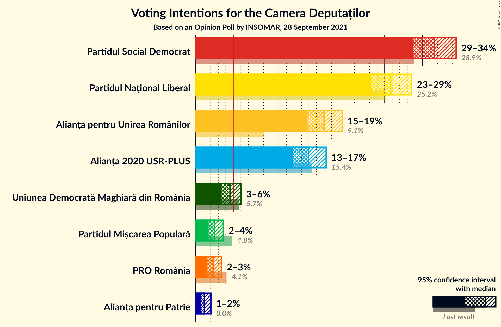
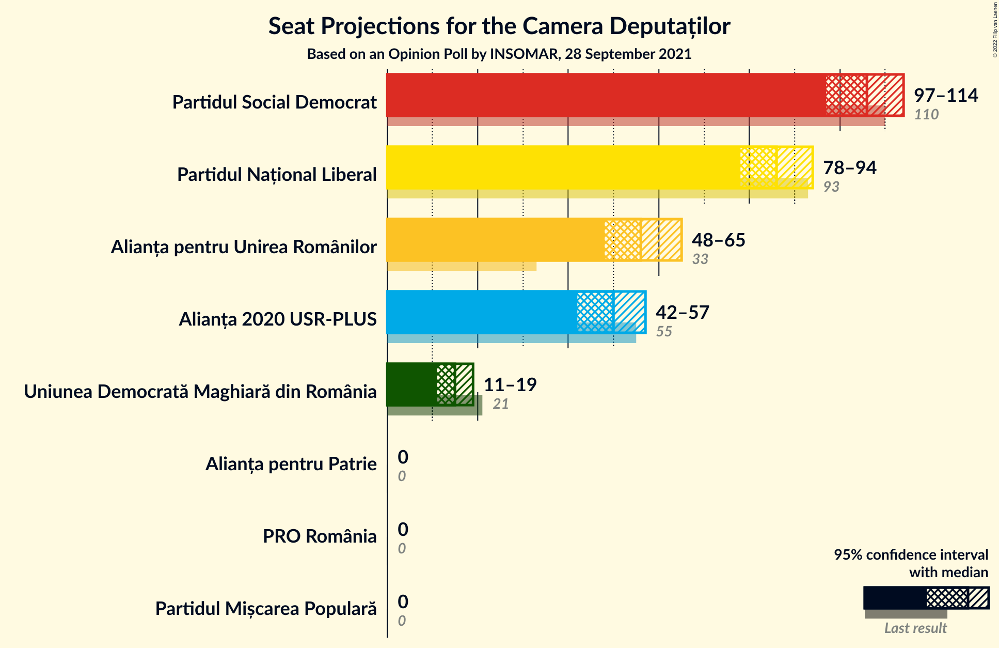
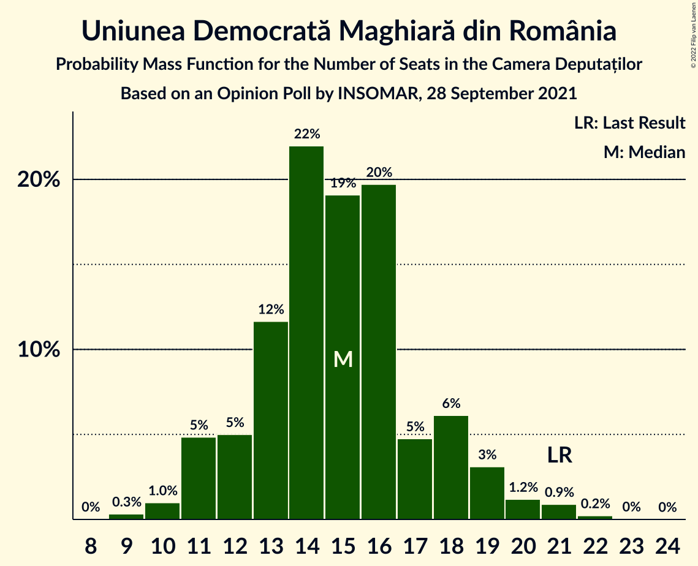

# Opinion Poll by INSOMAR, 28 September 2021

<a href="#voting-intentions">Voting Intentions</a> | <a href="#seats">Seats</a> | <a href="#coalitions">Coalitions</a> | <a href="#technical-information">Technical Information</a>

## Voting Intentions

### Confidence Intervals

| Party | Last Result | Poll Result | 80% Confidence Interval | 90% Confidence Interval | 95% Confidence Interval | 99% Confidence Interval |
|:-----:|:-----------:|:-----------:|:-----------------------:|:-----------------------:|:-----------------------:|:-----------------------:|
| Partidul Social Democrat | 28.9% | 31.6% | 29.7–33.5% |29.2–34.0% |28.8–34.5% |27.9–35.4% |
| Partidul Național Liberal | 25.2% | 25.8% | 24.1–27.6% |23.7–28.2% |23.2–28.6% |22.5–29.5% |
| Alianța pentru Unirea Românilor | 9.1% | 17.0% | 15.6–18.6% |15.2–19.0% |14.8–19.4% |14.2–20.2% |
| Alianța 2020 USR-PLUS | 15.4% | 15.0% | 13.6–16.5% |13.2–16.9% |12.9–17.3% |12.3–18.0% |
| Uniunea Democrată Maghiară din România | 5.7% | 4.6% | 3.8–5.5% |3.6–5.8% |3.4–6.0% |3.1–6.5% |
| Partidul Mișcarea Populară | 4.8% | 2.5% | 2.0–3.3% |1.8–3.5% |1.7–3.7% |1.5–4.1% |
| PRO România | 4.1% | 2.3% | 1.8–3.1% |1.7–3.3% |1.6–3.4% |1.4–3.8% |
| Alianța pentru Patrie | 0.0% | 1.2% | 0.8–1.7% |0.7–1.9% |0.7–2.0% |0.5–2.3% |

*Note:* The poll result column reflects the actual value used in the calculations. Published results may vary slightly, and in addition be rounded to fewer digits.

## Seats

### Confidence Intervals

| Party | Last Result | Median | 80% Confidence Interval | 90% Confidence Interval | 95% Confidence Interval | 99% Confidence Interval |
|:-----:|:-----------:|:------:|:-----------------------:|:-----------------------:|:-----------------------:|:-----------------------:|
| <a href="#partidul-social-democrat">Partidul Social Democrat</a> | 110 | 106 | 101–111 |99–113 |97–114 |93–117 |
| <a href="#partidul-național-liberal">Partidul Național Liberal</a> | 93 | 86 | 81–91 |79–93 |78–94 |75–98 |
| <a href="#alianța-pentru-unirea-românilor">Alianța pentru Unirea Românilor</a> | 33 | 56 | 51–61 |49–64 |48–65 |46–67 |
| <a href="#alianța-2020-usr-plus">Alianța 2020 USR-PLUS</a> | 55 | 50 | 45–54 |44–56 |42–57 |40–60 |
| <a href="#uniunea-democrată-maghiară-din-românia">Uniunea Democrată Maghiară din România</a> | 21 | 15 | 12–18 |11–19 |11–19 |10–21 |
| <a href="#partidul-mișcarea-populară">Partidul Mișcarea Populară</a> | 0 | 0 | 0 |0 |0 |0 |
| <a href="#pro-românia">PRO România</a> | 0 | 0 | 0 |0 |0 |0 |
| <a href="#alianța-pentru-patrie">Alianța pentru Patrie</a> | 0 | 0 | 0 |0 |0 |0 |

### Partidul Social Democrat

*For a full overview of the results for this party, see the [Partidul Social Democrat](party-partidulsocialdemocrat.html) page.*

| Number of Seats | Probability | Accumulated | Special Marks |
|:---------------:|:-----------:|:-----------:|:-------------:|
| 89 | 0% | 100% |  |
| 90 | 0% | 99.9% |  |
| 91 | 0.2% | 99.9% |  |
| 92 | 0.1% | 99.7% |  |
| 93 | 0.3% | 99.6% |  |
| 94 | 0.4% | 99.4% |  |
| 95 | 0.7% | 98.9% |  |
| 96 | 0.7% | 98% |  |
| 97 | 0.9% | 98% |  |
| 98 | 0.8% | 97% |  |
| 99 | 2% | 96% |  |
| 100 | 3% | 94% |  |
| 101 | 5% | 92% |  |
| 102 | 5% | 87% |  |
| 103 | 10% | 81% |  |
| 104 | 4% | 71% |  |
| 105 | 4% | 67% |  |
| 106 | 17% | 63% | Median |
| 107 | 7% | 46% |  |
| 108 | 12% | 39% |  |
| 109 | 7% | 26% |  |
| 110 | 8% | 19% | Last Result |
| 111 | 2% | 11% |  |
| 112 | 3% | 9% |  |
| 113 | 3% | 6% |  |
| 114 | 2% | 3% |  |
| 115 | 0.6% | 2% |  |
| 116 | 0.4% | 1.1% |  |
| 117 | 0.3% | 0.7% |  |
| 118 | 0.2% | 0.4% |  |
| 119 | 0.1% | 0.3% |  |
| 120 | 0.1% | 0.2% |  |
| 121 | 0.1% | 0.1% |  |
| 122 | 0% | 0% |  |

### Partidul Național Liberal

*For a full overview of the results for this party, see the [Partidul Național Liberal](party-partidulnaționalliberal.html) page.*

| Number of Seats | Probability | Accumulated | Special Marks |
|:---------------:|:-----------:|:-----------:|:-------------:|
| 72 | 0% | 100% |  |
| 73 | 0.1% | 99.9% |  |
| 74 | 0.3% | 99.9% |  |
| 75 | 0.3% | 99.6% |  |
| 76 | 0.8% | 99.2% |  |
| 77 | 0.8% | 98% |  |
| 78 | 1.2% | 98% |  |
| 79 | 2% | 96% |  |
| 80 | 3% | 94% |  |
| 81 | 5% | 91% |  |
| 82 | 8% | 86% |  |
| 83 | 6% | 79% |  |
| 84 | 12% | 73% |  |
| 85 | 7% | 61% |  |
| 86 | 14% | 54% | Median |
| 87 | 8% | 40% |  |
| 88 | 6% | 33% |  |
| 89 | 9% | 26% |  |
| 90 | 5% | 17% |  |
| 91 | 3% | 12% |  |
| 92 | 3% | 10% |  |
| 93 | 3% | 6% | Last Result |
| 94 | 1.1% | 4% |  |
| 95 | 0.8% | 2% |  |
| 96 | 0.5% | 2% |  |
| 97 | 0.4% | 1.1% |  |
| 98 | 0.3% | 0.7% |  |
| 99 | 0.3% | 0.4% |  |
| 100 | 0.1% | 0.2% |  |
| 101 | 0.1% | 0.1% |  |
| 102 | 0% | 0% |  |

### Alianța pentru Unirea Românilor

*For a full overview of the results for this party, see the [Alianța pentru Unirea Românilor](party-alianțapentruunirearomânilor.html) page.*

| Number of Seats | Probability | Accumulated | Special Marks |
|:---------------:|:-----------:|:-----------:|:-------------:|
| 33 | 0% | 100% | Last Result |
| 34 | 0% | 100% |  |
| 35 | 0% | 100% |  |
| 36 | 0% | 100% |  |
| 37 | 0% | 100% |  |
| 38 | 0% | 100% |  |
| 39 | 0% | 100% |  |
| 40 | 0% | 100% |  |
| 41 | 0% | 100% |  |
| 42 | 0% | 100% |  |
| 43 | 0% | 100% |  |
| 44 | 0% | 100% |  |
| 45 | 0.2% | 99.9% |  |
| 46 | 0.3% | 99.7% |  |
| 47 | 0.4% | 99.5% |  |
| 48 | 3% | 99.1% |  |
| 49 | 2% | 96% |  |
| 50 | 2% | 94% |  |
| 51 | 7% | 92% |  |
| 52 | 4% | 84% |  |
| 53 | 7% | 81% |  |
| 54 | 18% | 74% |  |
| 55 | 4% | 55% |  |
| 56 | 10% | 51% | Median |
| 57 | 13% | 41% |  |
| 58 | 5% | 28% |  |
| 59 | 7% | 23% |  |
| 60 | 3% | 17% |  |
| 61 | 4% | 14% |  |
| 62 | 3% | 10% |  |
| 63 | 1.1% | 6% |  |
| 64 | 2% | 5% |  |
| 65 | 0.7% | 3% |  |
| 66 | 0.5% | 2% |  |
| 67 | 1.1% | 1.4% |  |
| 68 | 0.1% | 0.3% |  |
| 69 | 0.1% | 0.2% |  |
| 70 | 0.1% | 0.2% |  |
| 71 | 0% | 0% |  |

### Alianța 2020 USR-PLUS

*For a full overview of the results for this party, see the [Alianța 2020 USR-PLUS](party-alianța2020usr-plus.html) page.*

| Number of Seats | Probability | Accumulated | Special Marks |
|:---------------:|:-----------:|:-----------:|:-------------:|
| 38 | 0% | 100% |  |
| 39 | 0.1% | 99.9% |  |
| 40 | 0.4% | 99.8% |  |
| 41 | 0.7% | 99.4% |  |
| 42 | 2% | 98.7% |  |
| 43 | 1.1% | 97% |  |
| 44 | 2% | 96% |  |
| 45 | 9% | 94% |  |
| 46 | 8% | 85% |  |
| 47 | 7% | 77% |  |
| 48 | 6% | 70% |  |
| 49 | 10% | 64% |  |
| 50 | 19% | 54% | Median |
| 51 | 10% | 35% |  |
| 52 | 5% | 25% |  |
| 53 | 4% | 19% |  |
| 54 | 7% | 16% |  |
| 55 | 3% | 8% | Last Result |
| 56 | 3% | 6% |  |
| 57 | 0.6% | 3% |  |
| 58 | 1.0% | 2% |  |
| 59 | 0.4% | 0.9% |  |
| 60 | 0.3% | 0.5% |  |
| 61 | 0.1% | 0.2% |  |
| 62 | 0% | 0.1% |  |
| 63 | 0% | 0.1% |  |
| 64 | 0% | 0% |  |

### Uniunea Democrată Maghiară din România

*For a full overview of the results for this party, see the [Uniunea Democrată Maghiară din România](party-uniuneademocratămaghiarădinromânia.html) page.*

| Number of Seats | Probability | Accumulated | Special Marks |
|:---------------:|:-----------:|:-----------:|:-------------:|
| 9 | 0.3% | 100% |  |
| 10 | 1.0% | 99.6% |  |
| 11 | 5% | 98.6% |  |
| 12 | 5% | 94% |  |
| 13 | 12% | 89% |  |
| 14 | 22% | 77% |  |
| 15 | 19% | 55% | Median |
| 16 | 20% | 36% |  |
| 17 | 5% | 16% |  |
| 18 | 6% | 12% |  |
| 19 | 3% | 5% |  |
| 20 | 1.2% | 2% |  |
| 21 | 0.9% | 1.2% | Last Result |
| 22 | 0.2% | 0.3% |  |
| 23 | 0% | 0.1% |  |
| 24 | 0% | 0% |  |

### Partidul Mișcarea Populară

*For a full overview of the results for this party, see the [Partidul Mișcarea Populară](party-partidulmișcareapopulară.html) page.*

| Number of Seats | Probability | Accumulated | Special Marks |
|:---------------:|:-----------:|:-----------:|:-------------:|
| 0 | 100% | 100% | Last Result, Median |

### PRO România

*For a full overview of the results for this party, see the [PRO România](party-proromânia.html) page.*

| Number of Seats | Probability | Accumulated | Special Marks |
|:---------------:|:-----------:|:-----------:|:-------------:|
| 0 | 100% | 100% | Last Result, Median |

### Alianța pentru Patrie

*For a full overview of the results for this party, see the [Alianța pentru Patrie](party-alianțapentrupatrie.html) page.*

| Number of Seats | Probability | Accumulated | Special Marks |
|:---------------:|:-----------:|:-----------:|:-------------:|
| 0 | 100% | 100% | Last Result, Median |

## Coalitions

### Confidence Intervals

| Coalition | Last Result | Median | Majority? | 80% Confidence Interval | 90% Confidence Interval | 95% Confidence Interval | 99% Confidence Interval |
|:---------:|:-----------:|:------:|:---------:|:-----------------------:|:-----------------------:|:-----------------------:|:-----------------------:|
| Partidul Național Liberal – Alianța 2020 USR-PLUS – Uniunea Democrată Maghiară din România – Partidul Mișcarea Populară | 169 | 150 | 0.2% | 145–156 | 143–158 | 141–160 | 138–163 |
| Partidul Național Liberal – Alianța 2020 USR-PLUS – Uniunea Democrată Maghiară din România | 169 | 150 | 0.2% | 145–156 | 143–158 | 141–160 | 138–163 |
| Partidul Național Liberal – Alianța 2020 USR-PLUS – Partidul Mișcarea Populară | 148 | 135 | 0% | 130–141 | 128–144 | 126–144 | 124–148 |
| Partidul Național Liberal – Alianța 2020 USR-PLUS | 148 | 135 | 0% | 130–141 | 128–144 | 126–144 | 124–148 |
| Partidul Social Democrat – PRO România | 110 | 106 | 0% | 101–111 | 99–113 | 97–114 | 93–117 |
| Partidul Național Liberal – Uniunea Democrată Maghiară din România – Partidul Mișcarea Populară | 114 | 101 | 0% | 96–106 | 94–108 | 92–110 | 89–113 |
| Partidul Național Liberal – Uniunea Democrată Maghiară din România | 114 | 101 | 0% | 96–106 | 94–108 | 92–110 | 89–113 |
| Partidul Național Liberal – Partidul Mișcarea Populară | 93 | 86 | 0% | 81–91 | 79–93 | 78–94 | 75–98 |
| Partidul Național Liberal | 93 | 86 | 0% | 81–91 | 79–93 | 78–94 | 75–98 |
| Alianța 2020 USR-PLUS – Partidul Mișcarea Populară | 55 | 50 | 0% | 45–54 | 44–56 | 42–57 | 40–60 |

### Partidul Național Liberal – Alianța 2020 USR-PLUS – Uniunea Democrată Maghiară din România – Partidul Mișcarea Populară

| Number of Seats | Probability | Accumulated | Special Marks |
|:---------------:|:-----------:|:-----------:|:-------------:|
| 134 | 0% | 100% |  |
| 135 | 0% | 99.9% |  |
| 136 | 0.1% | 99.9% |  |
| 137 | 0.1% | 99.8% |  |
| 138 | 0.2% | 99.7% |  |
| 139 | 0.4% | 99.5% |  |
| 140 | 0.7% | 99.1% |  |
| 141 | 1.1% | 98% |  |
| 142 | 2% | 97% |  |
| 143 | 1.1% | 96% |  |
| 144 | 3% | 95% |  |
| 145 | 8% | 92% |  |
| 146 | 3% | 84% |  |
| 147 | 8% | 81% |  |
| 148 | 9% | 74% |  |
| 149 | 10% | 65% |  |
| 150 | 7% | 55% |  |
| 151 | 5% | 48% | Median |
| 152 | 19% | 43% |  |
| 153 | 6% | 24% |  |
| 154 | 3% | 18% |  |
| 155 | 5% | 16% |  |
| 156 | 2% | 10% |  |
| 157 | 3% | 8% |  |
| 158 | 0.9% | 5% |  |
| 159 | 1.2% | 4% |  |
| 160 | 2% | 3% |  |
| 161 | 0.2% | 1.4% |  |
| 162 | 0.5% | 1.2% |  |
| 163 | 0.3% | 0.7% |  |
| 164 | 0.1% | 0.3% |  |
| 165 | 0.1% | 0.2% | Majority |
| 166 | 0.1% | 0.2% |  |
| 167 | 0.1% | 0.1% |  |
| 168 | 0% | 0% |  |
| 169 | 0% | 0% | Last Result |

### Partidul Național Liberal – Alianța 2020 USR-PLUS – Uniunea Democrată Maghiară din România

| Number of Seats | Probability | Accumulated | Special Marks |
|:---------------:|:-----------:|:-----------:|:-------------:|
| 134 | 0% | 100% |  |
| 135 | 0% | 99.9% |  |
| 136 | 0.1% | 99.9% |  |
| 137 | 0.1% | 99.8% |  |
| 138 | 0.2% | 99.7% |  |
| 139 | 0.4% | 99.5% |  |
| 140 | 0.7% | 99.1% |  |
| 141 | 1.1% | 98% |  |
| 142 | 2% | 97% |  |
| 143 | 1.1% | 96% |  |
| 144 | 3% | 95% |  |
| 145 | 8% | 92% |  |
| 146 | 3% | 84% |  |
| 147 | 8% | 81% |  |
| 148 | 9% | 74% |  |
| 149 | 10% | 65% |  |
| 150 | 7% | 55% |  |
| 151 | 5% | 48% | Median |
| 152 | 19% | 43% |  |
| 153 | 6% | 24% |  |
| 154 | 3% | 18% |  |
| 155 | 5% | 16% |  |
| 156 | 2% | 10% |  |
| 157 | 3% | 8% |  |
| 158 | 0.9% | 5% |  |
| 159 | 1.2% | 4% |  |
| 160 | 2% | 3% |  |
| 161 | 0.2% | 1.4% |  |
| 162 | 0.5% | 1.2% |  |
| 163 | 0.3% | 0.7% |  |
| 164 | 0.1% | 0.3% |  |
| 165 | 0.1% | 0.2% | Majority |
| 166 | 0.1% | 0.2% |  |
| 167 | 0.1% | 0.1% |  |
| 168 | 0% | 0% |  |
| 169 | 0% | 0% | Last Result |

### Partidul Național Liberal – Alianța 2020 USR-PLUS – Partidul Mișcarea Populară

| Number of Seats | Probability | Accumulated | Special Marks |
|:---------------:|:-----------:|:-----------:|:-------------:|
| 120 | 0% | 100% |  |
| 121 | 0.1% | 99.9% |  |
| 122 | 0.1% | 99.8% |  |
| 123 | 0.3% | 99.8% |  |
| 124 | 0.4% | 99.5% |  |
| 125 | 0.7% | 99.1% |  |
| 126 | 1.2% | 98% |  |
| 127 | 2% | 97% |  |
| 128 | 1.2% | 95% |  |
| 129 | 2% | 94% |  |
| 130 | 6% | 92% |  |
| 131 | 3% | 86% |  |
| 132 | 9% | 82% |  |
| 133 | 10% | 73% |  |
| 134 | 6% | 63% |  |
| 135 | 7% | 57% |  |
| 136 | 13% | 50% | Median |
| 137 | 3% | 37% |  |
| 138 | 13% | 34% |  |
| 139 | 7% | 21% |  |
| 140 | 3% | 15% |  |
| 141 | 2% | 12% |  |
| 142 | 3% | 10% |  |
| 143 | 1.2% | 7% |  |
| 144 | 3% | 5% |  |
| 145 | 0.9% | 2% |  |
| 146 | 0.5% | 2% |  |
| 147 | 0.4% | 1.1% |  |
| 148 | 0.3% | 0.7% | Last Result |
| 149 | 0.1% | 0.4% |  |
| 150 | 0.1% | 0.3% |  |
| 151 | 0.1% | 0.2% |  |
| 152 | 0% | 0.1% |  |
| 153 | 0% | 0.1% |  |
| 154 | 0% | 0% |  |

### Partidul Național Liberal – Alianța 2020 USR-PLUS

| Number of Seats | Probability | Accumulated | Special Marks |
|:---------------:|:-----------:|:-----------:|:-------------:|
| 120 | 0% | 100% |  |
| 121 | 0.1% | 99.9% |  |
| 122 | 0.1% | 99.8% |  |
| 123 | 0.3% | 99.8% |  |
| 124 | 0.4% | 99.5% |  |
| 125 | 0.7% | 99.1% |  |
| 126 | 1.2% | 98% |  |
| 127 | 2% | 97% |  |
| 128 | 1.2% | 95% |  |
| 129 | 2% | 94% |  |
| 130 | 6% | 92% |  |
| 131 | 3% | 86% |  |
| 132 | 9% | 82% |  |
| 133 | 10% | 73% |  |
| 134 | 6% | 63% |  |
| 135 | 7% | 57% |  |
| 136 | 13% | 50% | Median |
| 137 | 3% | 37% |  |
| 138 | 13% | 34% |  |
| 139 | 7% | 21% |  |
| 140 | 3% | 15% |  |
| 141 | 2% | 12% |  |
| 142 | 3% | 10% |  |
| 143 | 1.2% | 7% |  |
| 144 | 3% | 5% |  |
| 145 | 0.9% | 2% |  |
| 146 | 0.5% | 2% |  |
| 147 | 0.4% | 1.1% |  |
| 148 | 0.3% | 0.7% | Last Result |
| 149 | 0.1% | 0.4% |  |
| 150 | 0.1% | 0.3% |  |
| 151 | 0.1% | 0.2% |  |
| 152 | 0% | 0.1% |  |
| 153 | 0% | 0.1% |  |
| 154 | 0% | 0% |  |

### Partidul Social Democrat – PRO România

| Number of Seats | Probability | Accumulated | Special Marks |
|:---------------:|:-----------:|:-----------:|:-------------:|
| 89 | 0% | 100% |  |
| 90 | 0% | 99.9% |  |
| 91 | 0.2% | 99.9% |  |
| 92 | 0.1% | 99.7% |  |
| 93 | 0.3% | 99.6% |  |
| 94 | 0.4% | 99.4% |  |
| 95 | 0.7% | 98.9% |  |
| 96 | 0.7% | 98% |  |
| 97 | 0.9% | 98% |  |
| 98 | 0.8% | 97% |  |
| 99 | 2% | 96% |  |
| 100 | 3% | 94% |  |
| 101 | 5% | 92% |  |
| 102 | 5% | 87% |  |
| 103 | 10% | 81% |  |
| 104 | 4% | 71% |  |
| 105 | 4% | 67% |  |
| 106 | 17% | 63% | Median |
| 107 | 7% | 46% |  |
| 108 | 12% | 39% |  |
| 109 | 7% | 26% |  |
| 110 | 8% | 19% | Last Result |
| 111 | 2% | 11% |  |
| 112 | 3% | 9% |  |
| 113 | 3% | 6% |  |
| 114 | 2% | 3% |  |
| 115 | 0.6% | 2% |  |
| 116 | 0.4% | 1.1% |  |
| 117 | 0.3% | 0.7% |  |
| 118 | 0.2% | 0.4% |  |
| 119 | 0.1% | 0.3% |  |
| 120 | 0.1% | 0.2% |  |
| 121 | 0.1% | 0.1% |  |
| 122 | 0% | 0% |  |

### Partidul Național Liberal – Uniunea Democrată Maghiară din România – Partidul Mișcarea Populară

| Number of Seats | Probability | Accumulated | Special Marks |
|:---------------:|:-----------:|:-----------:|:-------------:|
| 87 | 0.1% | 100% |  |
| 88 | 0.1% | 99.9% |  |
| 89 | 0.4% | 99.8% |  |
| 90 | 0.3% | 99.4% |  |
| 91 | 1.2% | 99.2% |  |
| 92 | 0.6% | 98% |  |
| 93 | 2% | 97% |  |
| 94 | 2% | 95% |  |
| 95 | 3% | 93% |  |
| 96 | 7% | 90% |  |
| 97 | 4% | 83% |  |
| 98 | 13% | 78% |  |
| 99 | 3% | 65% |  |
| 100 | 11% | 62% |  |
| 101 | 4% | 51% | Median |
| 102 | 13% | 46% |  |
| 103 | 10% | 33% |  |
| 104 | 5% | 23% |  |
| 105 | 6% | 18% |  |
| 106 | 2% | 12% |  |
| 107 | 2% | 9% |  |
| 108 | 3% | 7% |  |
| 109 | 1.3% | 4% |  |
| 110 | 0.7% | 3% |  |
| 111 | 0.8% | 2% |  |
| 112 | 0.4% | 1.2% |  |
| 113 | 0.4% | 0.8% |  |
| 114 | 0.1% | 0.3% | Last Result |
| 115 | 0.1% | 0.2% |  |
| 116 | 0% | 0.1% |  |
| 117 | 0% | 0.1% |  |
| 118 | 0% | 0% |  |

### Partidul Național Liberal – Uniunea Democrată Maghiară din România

| Number of Seats | Probability | Accumulated | Special Marks |
|:---------------:|:-----------:|:-----------:|:-------------:|
| 87 | 0.1% | 100% |  |
| 88 | 0.1% | 99.9% |  |
| 89 | 0.4% | 99.8% |  |
| 90 | 0.3% | 99.4% |  |
| 91 | 1.2% | 99.2% |  |
| 92 | 0.6% | 98% |  |
| 93 | 2% | 97% |  |
| 94 | 2% | 95% |  |
| 95 | 3% | 93% |  |
| 96 | 7% | 90% |  |
| 97 | 4% | 83% |  |
| 98 | 13% | 78% |  |
| 99 | 3% | 65% |  |
| 100 | 11% | 62% |  |
| 101 | 4% | 51% | Median |
| 102 | 13% | 46% |  |
| 103 | 10% | 33% |  |
| 104 | 5% | 23% |  |
| 105 | 6% | 18% |  |
| 106 | 2% | 12% |  |
| 107 | 2% | 9% |  |
| 108 | 3% | 7% |  |
| 109 | 1.3% | 4% |  |
| 110 | 0.7% | 3% |  |
| 111 | 0.8% | 2% |  |
| 112 | 0.4% | 1.2% |  |
| 113 | 0.4% | 0.8% |  |
| 114 | 0.1% | 0.3% | Last Result |
| 115 | 0.1% | 0.2% |  |
| 116 | 0% | 0.1% |  |
| 117 | 0% | 0.1% |  |
| 118 | 0% | 0% |  |

### Partidul Național Liberal – Partidul Mișcarea Populară

| Number of Seats | Probability | Accumulated | Special Marks |
|:---------------:|:-----------:|:-----------:|:-------------:|
| 72 | 0% | 100% |  |
| 73 | 0.1% | 99.9% |  |
| 74 | 0.3% | 99.9% |  |
| 75 | 0.3% | 99.6% |  |
| 76 | 0.8% | 99.2% |  |
| 77 | 0.8% | 98% |  |
| 78 | 1.2% | 98% |  |
| 79 | 2% | 96% |  |
| 80 | 3% | 94% |  |
| 81 | 5% | 91% |  |
| 82 | 8% | 86% |  |
| 83 | 6% | 79% |  |
| 84 | 12% | 73% |  |
| 85 | 7% | 61% |  |
| 86 | 14% | 54% | Median |
| 87 | 8% | 40% |  |
| 88 | 6% | 33% |  |
| 89 | 9% | 26% |  |
| 90 | 5% | 17% |  |
| 91 | 3% | 12% |  |
| 92 | 3% | 10% |  |
| 93 | 3% | 6% | Last Result |
| 94 | 1.1% | 4% |  |
| 95 | 0.8% | 2% |  |
| 96 | 0.5% | 2% |  |
| 97 | 0.4% | 1.1% |  |
| 98 | 0.3% | 0.7% |  |
| 99 | 0.3% | 0.4% |  |
| 100 | 0.1% | 0.2% |  |
| 101 | 0.1% | 0.1% |  |
| 102 | 0% | 0% |  |

### Partidul Național Liberal

| Number of Seats | Probability | Accumulated | Special Marks |
|:---------------:|:-----------:|:-----------:|:-------------:|
| 72 | 0% | 100% |  |
| 73 | 0.1% | 99.9% |  |
| 74 | 0.3% | 99.9% |  |
| 75 | 0.3% | 99.6% |  |
| 76 | 0.8% | 99.2% |  |
| 77 | 0.8% | 98% |  |
| 78 | 1.2% | 98% |  |
| 79 | 2% | 96% |  |
| 80 | 3% | 94% |  |
| 81 | 5% | 91% |  |
| 82 | 8% | 86% |  |
| 83 | 6% | 79% |  |
| 84 | 12% | 73% |  |
| 85 | 7% | 61% |  |
| 86 | 14% | 54% | Median |
| 87 | 8% | 40% |  |
| 88 | 6% | 33% |  |
| 89 | 9% | 26% |  |
| 90 | 5% | 17% |  |
| 91 | 3% | 12% |  |
| 92 | 3% | 10% |  |
| 93 | 3% | 6% | Last Result |
| 94 | 1.1% | 4% |  |
| 95 | 0.8% | 2% |  |
| 96 | 0.5% | 2% |  |
| 97 | 0.4% | 1.1% |  |
| 98 | 0.3% | 0.7% |  |
| 99 | 0.3% | 0.4% |  |
| 100 | 0.1% | 0.2% |  |
| 101 | 0.1% | 0.1% |  |
| 102 | 0% | 0% |  |

### Alianța 2020 USR-PLUS – Partidul Mișcarea Populară

| Number of Seats | Probability | Accumulated | Special Marks |
|:---------------:|:-----------:|:-----------:|:-------------:|
| 38 | 0% | 100% |  |
| 39 | 0.1% | 99.9% |  |
| 40 | 0.4% | 99.8% |  |
| 41 | 0.7% | 99.4% |  |
| 42 | 2% | 98.7% |  |
| 43 | 1.1% | 97% |  |
| 44 | 2% | 96% |  |
| 45 | 9% | 94% |  |
| 46 | 8% | 85% |  |
| 47 | 7% | 77% |  |
| 48 | 6% | 70% |  |
| 49 | 10% | 64% |  |
| 50 | 19% | 54% | Median |
| 51 | 10% | 35% |  |
| 52 | 5% | 25% |  |
| 53 | 4% | 19% |  |
| 54 | 7% | 16% |  |
| 55 | 3% | 8% | Last Result |
| 56 | 3% | 6% |  |
| 57 | 0.6% | 3% |  |
| 58 | 1.0% | 2% |  |
| 59 | 0.4% | 0.9% |  |
| 60 | 0.3% | 0.5% |  |
| 61 | 0.1% | 0.2% |  |
| 62 | 0% | 0.1% |  |
| 63 | 0% | 0.1% |  |
| 64 | 0% | 0% |  |

## Technical Information

### Opinion Poll

+ **Polling firm:** INSOMAR
+ **Commissioner(s):** —
+ **Fieldwork period:** 28 September 2021

### Calculations

+ **Sample size:** 1030
+ **Simulations done:** 1,048,576
+ **Error estimate:** 1.13%

