# Opinion Poll by Gazeta Civică, 26–29 September 2021

<a href="#voting-intentions">Voting Intentions</a> | <a href="#seats">Seats</a> | <a href="#coalitions">Coalitions</a> | <a href="#technical-information">Technical Information</a>

## Voting Intentions

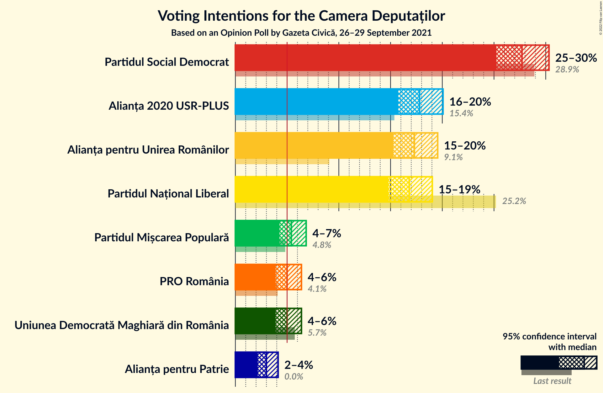

### Confidence Intervals

| Party | Last Result | Poll Result | 80% Confidence Interval | 90% Confidence Interval | 95% Confidence Interval | 99% Confidence Interval |
|:-----:|:-----------:|:-----------:|:-----------------------:|:-----------------------:|:-----------------------:|:-----------------------:|
| Partidul Social Democrat | 28.9% | 27.7% | 26.1–29.4% |25.6–29.9% |25.2–30.3% |24.5–31.1% |
| Alianța 2020 USR-PLUS | 15.4% | 17.8% | 16.4–19.3% |16.1–19.7% |15.7–20.1% |15.1–20.8% |
| Alianța pentru Unirea Românilor | 9.1% | 17.3% | 16.0–18.8% |15.6–19.2% |15.3–19.6% |14.6–20.3% |
| Partidul Național Liberal | 25.2% | 16.8% | 15.5–18.3% |15.1–18.7% |14.8–19.0% |14.2–19.8% |
| Partidul Mișcarea Populară | 4.8% | 5.4% | 4.6–6.3% |4.4–6.6% |4.3–6.8% |3.9–7.3% |
| Uniunea Democrată Maghiară din România | 5.7% | 5.0% | 4.3–5.9% |4.1–6.2% |3.9–6.4% |3.6–6.8% |
| PRO România | 4.1% | 5.0% | 4.3–5.9% |4.1–6.2% |3.9–6.4% |3.6–6.8% |
| Alianța pentru Patrie | 0.0% | 3.0% | 2.5–3.7% |2.3–3.9% |2.2–4.1% |1.9–4.5% |

*Note:* The poll result column reflects the actual value used in the calculations. Published results may vary slightly, and in addition be rounded to fewer digits.

## Seats

### Confidence Intervals

| Party | Last Result | Median | 80% Confidence Interval | 90% Confidence Interval | 95% Confidence Interval | 99% Confidence Interval |
|:-----:|:-----------:|:------:|:-----------------------:|:-----------------------:|:-----------------------:|:-----------------------:|
| <a href="#partidul-social-democrat">Partidul Social Democrat</a> | 110 | 95 | 88–102 |86–104 |84–106 |81–110 |
| <a href="#alianța-2020-usr-plus">Alianța 2020 USR-PLUS</a> | 55 | 61 | 55–67 |53–68 |53–70 |50–72 |
| <a href="#alianța-pentru-unirea-românilor">Alianța pentru Unirea Românilor</a> | 33 | 59 | 54–65 |52–67 |51–68 |48–71 |
| <a href="#partidul-național-liberal">Partidul Național Liberal</a> | 93 | 57 | 52–63 |51–65 |49–66 |47–69 |
| <a href="#partidul-mișcarea-populară">Partidul Mișcarea Populară</a> | 0 | 18 | 0–21 |0–22 |0–23 |0–24 |
| <a href="#uniunea-democrată-maghiară-din-românia">Uniunea Democrată Maghiară din România</a> | 21 | 17 | 14–20 |13–21 |12–22 |12–23 |
| <a href="#pro-românia">PRO România</a> | 0 | 16 | 0–19 |0–20 |0–21 |0–22 |
| <a href="#alianța-pentru-patrie">Alianța pentru Patrie</a> | 0 | 0 | 0 |0 |0 |0 |

### Partidul Social Democrat

*For a full overview of the results for this party, see the [Partidul Social Democrat](party-partidulsocialdemocrat.html) page.*

| Number of Seats | Probability | Accumulated | Special Marks |
|:---------------:|:-----------:|:-----------:|:-------------:|
| 78 | 0% | 100% |  |
| 79 | 0.1% | 99.9% |  |
| 80 | 0.1% | 99.9% |  |
| 81 | 0.3% | 99.8% |  |
| 82 | 0.3% | 99.5% |  |
| 83 | 0.8% | 99.2% |  |
| 84 | 0.9% | 98% |  |
| 85 | 2% | 97% |  |
| 86 | 2% | 95% |  |
| 87 | 2% | 94% |  |
| 88 | 5% | 91% |  |
| 89 | 5% | 86% |  |
| 90 | 6% | 81% |  |
| 91 | 7% | 75% |  |
| 92 | 7% | 68% |  |
| 93 | 5% | 61% |  |
| 94 | 4% | 56% |  |
| 95 | 6% | 51% | Median |
| 96 | 8% | 45% |  |
| 97 | 5% | 37% |  |
| 98 | 6% | 32% |  |
| 99 | 7% | 27% |  |
| 100 | 3% | 20% |  |
| 101 | 2% | 17% |  |
| 102 | 4% | 14% |  |
| 103 | 3% | 10% |  |
| 104 | 3% | 7% |  |
| 105 | 1.2% | 5% |  |
| 106 | 1.4% | 4% |  |
| 107 | 0.7% | 2% |  |
| 108 | 0.6% | 1.5% |  |
| 109 | 0.3% | 0.9% |  |
| 110 | 0.3% | 0.7% | Last Result |
| 111 | 0.1% | 0.4% |  |
| 112 | 0.2% | 0.3% |  |
| 113 | 0% | 0.2% |  |
| 114 | 0% | 0.1% |  |
| 115 | 0.1% | 0.1% |  |
| 116 | 0% | 0% |  |

### Alianța 2020 USR-PLUS

*For a full overview of the results for this party, see the [Alianța 2020 USR-PLUS](party-alianța2020usr-plus.html) page.*

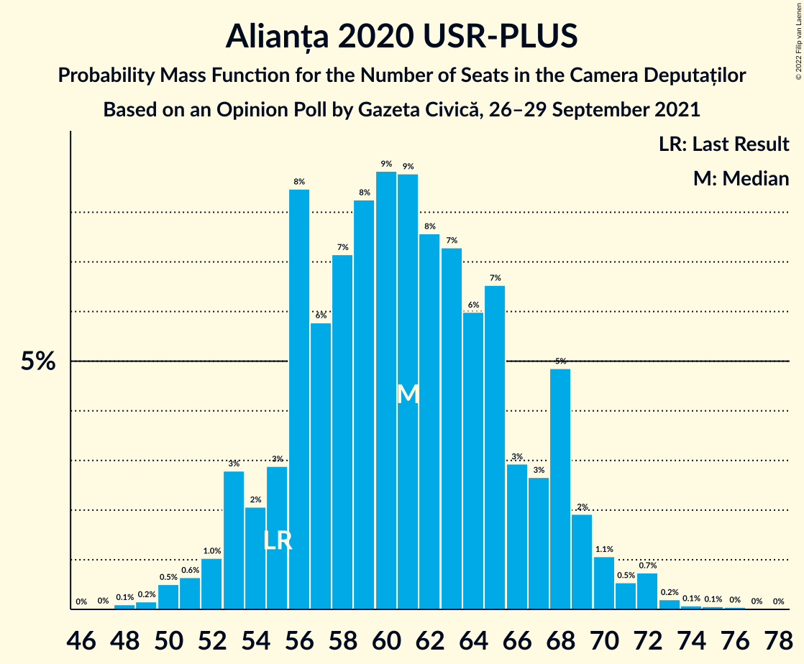

| Number of Seats | Probability | Accumulated | Special Marks |
|:---------------:|:-----------:|:-----------:|:-------------:|
| 48 | 0.1% | 100% |  |
| 49 | 0.2% | 99.9% |  |
| 50 | 0.5% | 99.7% |  |
| 51 | 0.6% | 99.2% |  |
| 52 | 1.0% | 98.6% |  |
| 53 | 3% | 98% |  |
| 54 | 2% | 95% |  |
| 55 | 3% | 93% | Last Result |
| 56 | 8% | 90% |  |
| 57 | 6% | 81% |  |
| 58 | 7% | 76% |  |
| 59 | 8% | 68% |  |
| 60 | 9% | 60% |  |
| 61 | 9% | 51% | Median |
| 62 | 8% | 43% |  |
| 63 | 7% | 35% |  |
| 64 | 6% | 28% |  |
| 65 | 7% | 22% |  |
| 66 | 3% | 15% |  |
| 67 | 3% | 12% |  |
| 68 | 5% | 10% |  |
| 69 | 2% | 5% |  |
| 70 | 1.1% | 3% |  |
| 71 | 0.5% | 2% |  |
| 72 | 0.7% | 1.2% |  |
| 73 | 0.2% | 0.4% |  |
| 74 | 0.1% | 0.2% |  |
| 75 | 0.1% | 0.2% |  |
| 76 | 0% | 0.1% |  |
| 77 | 0% | 0% |  |

### Alianța pentru Unirea Românilor

*For a full overview of the results for this party, see the [Alianța pentru Unirea Românilor](party-alianțapentruunirearomânilor.html) page.*

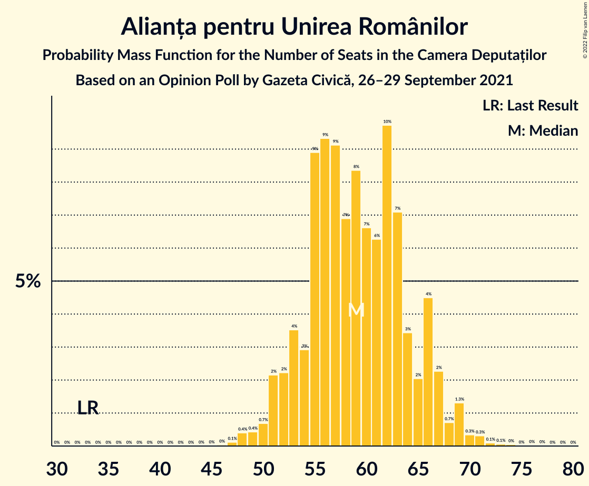

| Number of Seats | Probability | Accumulated | Special Marks |
|:---------------:|:-----------:|:-----------:|:-------------:|
| 33 | 0% | 100% | Last Result |
| 34 | 0% | 100% |  |
| 35 | 0% | 100% |  |
| 36 | 0% | 100% |  |
| 37 | 0% | 100% |  |
| 38 | 0% | 100% |  |
| 39 | 0% | 100% |  |
| 40 | 0% | 100% |  |
| 41 | 0% | 100% |  |
| 42 | 0% | 100% |  |
| 43 | 0% | 100% |  |
| 44 | 0% | 100% |  |
| 45 | 0% | 100% |  |
| 46 | 0% | 100% |  |
| 47 | 0.1% | 99.9% |  |
| 48 | 0.4% | 99.8% |  |
| 49 | 0.4% | 99.4% |  |
| 50 | 0.7% | 99.0% |  |
| 51 | 2% | 98% |  |
| 52 | 2% | 96% |  |
| 53 | 4% | 94% |  |
| 54 | 3% | 90% |  |
| 55 | 9% | 87% |  |
| 56 | 9% | 79% |  |
| 57 | 9% | 69% |  |
| 58 | 7% | 60% |  |
| 59 | 8% | 53% | Median |
| 60 | 7% | 45% |  |
| 61 | 6% | 38% |  |
| 62 | 10% | 32% |  |
| 63 | 7% | 22% |  |
| 64 | 3% | 15% |  |
| 65 | 2% | 12% |  |
| 66 | 4% | 10% |  |
| 67 | 2% | 5% |  |
| 68 | 0.7% | 3% |  |
| 69 | 1.3% | 2% |  |
| 70 | 0.3% | 0.9% |  |
| 71 | 0.3% | 0.6% |  |
| 72 | 0.1% | 0.3% |  |
| 73 | 0.1% | 0.2% |  |
| 74 | 0% | 0.1% |  |
| 75 | 0% | 0.1% |  |
| 76 | 0% | 0% |  |

### Partidul Național Liberal

*For a full overview of the results for this party, see the [Partidul Național Liberal](party-partidulnaționalliberal.html) page.*

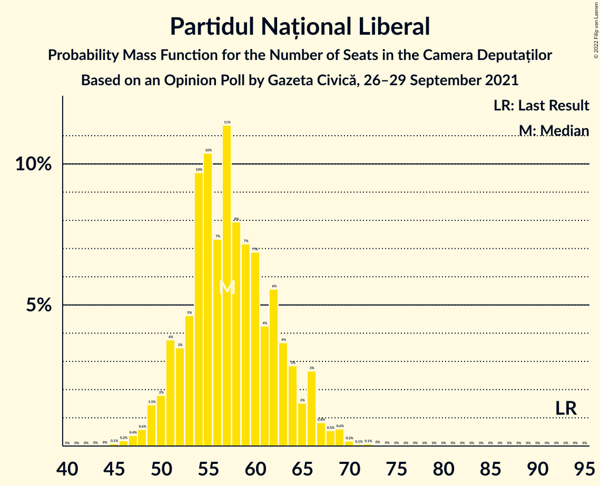

| Number of Seats | Probability | Accumulated | Special Marks |
|:---------------:|:-----------:|:-----------:|:-------------:|
| 45 | 0.1% | 100% |  |
| 46 | 0.2% | 99.9% |  |
| 47 | 0.4% | 99.7% |  |
| 48 | 0.6% | 99.3% |  |
| 49 | 1.5% | 98.7% |  |
| 50 | 2% | 97% |  |
| 51 | 4% | 95% |  |
| 52 | 3% | 92% |  |
| 53 | 5% | 88% |  |
| 54 | 10% | 84% |  |
| 55 | 10% | 74% |  |
| 56 | 7% | 64% |  |
| 57 | 11% | 56% | Median |
| 58 | 8% | 45% |  |
| 59 | 7% | 37% |  |
| 60 | 7% | 30% |  |
| 61 | 4% | 23% |  |
| 62 | 6% | 19% |  |
| 63 | 4% | 13% |  |
| 64 | 3% | 9% |  |
| 65 | 2% | 7% |  |
| 66 | 3% | 5% |  |
| 67 | 0.8% | 2% |  |
| 68 | 0.5% | 2% |  |
| 69 | 0.6% | 1.0% |  |
| 70 | 0.2% | 0.4% |  |
| 71 | 0.1% | 0.2% |  |
| 72 | 0.1% | 0.1% |  |
| 73 | 0% | 0.1% |  |
| 74 | 0% | 0% |  |
| 75 | 0% | 0% |  |
| 76 | 0% | 0% |  |
| 77 | 0% | 0% |  |
| 78 | 0% | 0% |  |
| 79 | 0% | 0% |  |
| 80 | 0% | 0% |  |
| 81 | 0% | 0% |  |
| 82 | 0% | 0% |  |
| 83 | 0% | 0% |  |
| 84 | 0% | 0% |  |
| 85 | 0% | 0% |  |
| 86 | 0% | 0% |  |
| 87 | 0% | 0% |  |
| 88 | 0% | 0% |  |
| 89 | 0% | 0% |  |
| 90 | 0% | 0% |  |
| 91 | 0% | 0% |  |
| 92 | 0% | 0% |  |
| 93 | 0% | 0% | Last Result |

### Partidul Mișcarea Populară

*For a full overview of the results for this party, see the [Partidul Mișcarea Populară](party-partidulmișcareapopulară.html) page.*

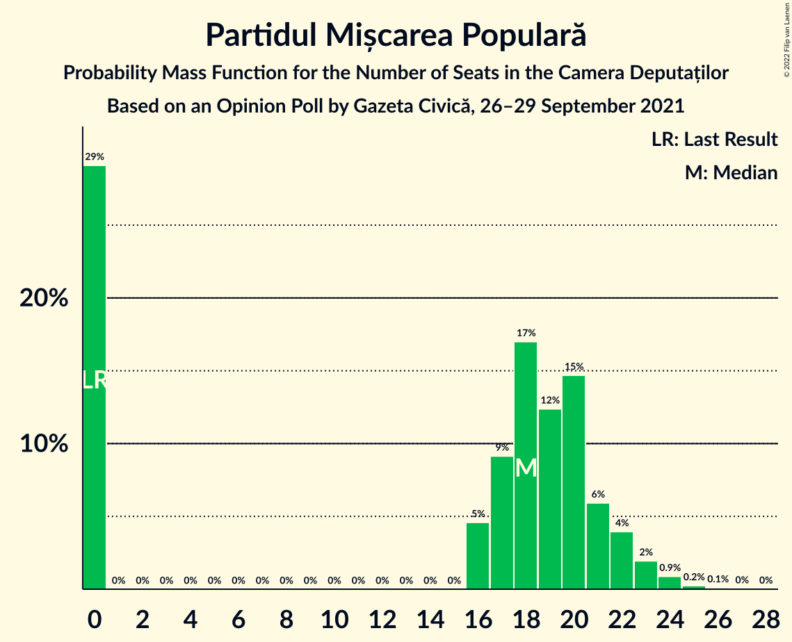

| Number of Seats | Probability | Accumulated | Special Marks |
|:---------------:|:-----------:|:-----------:|:-------------:|
| 0 | 29% | 100% | Last Result |
| 1 | 0% | 71% |  |
| 2 | 0% | 71% |  |
| 3 | 0% | 71% |  |
| 4 | 0% | 71% |  |
| 5 | 0% | 71% |  |
| 6 | 0% | 71% |  |
| 7 | 0% | 71% |  |
| 8 | 0% | 71% |  |
| 9 | 0% | 71% |  |
| 10 | 0% | 71% |  |
| 11 | 0% | 71% |  |
| 12 | 0% | 71% |  |
| 13 | 0% | 71% |  |
| 14 | 0% | 71% |  |
| 15 | 0% | 71% |  |
| 16 | 5% | 71% |  |
| 17 | 9% | 66% |  |
| 18 | 17% | 57% | Median |
| 19 | 12% | 40% |  |
| 20 | 15% | 28% |  |
| 21 | 6% | 13% |  |
| 22 | 4% | 7% |  |
| 23 | 2% | 3% |  |
| 24 | 0.9% | 1.3% |  |
| 25 | 0.2% | 0.4% |  |
| 26 | 0.1% | 0.2% |  |
| 27 | 0% | 0.1% |  |
| 28 | 0% | 0% |  |

### Uniunea Democrată Maghiară din România

*For a full overview of the results for this party, see the [Uniunea Democrată Maghiară din România](party-uniuneademocratămaghiarădinromânia.html) page.*

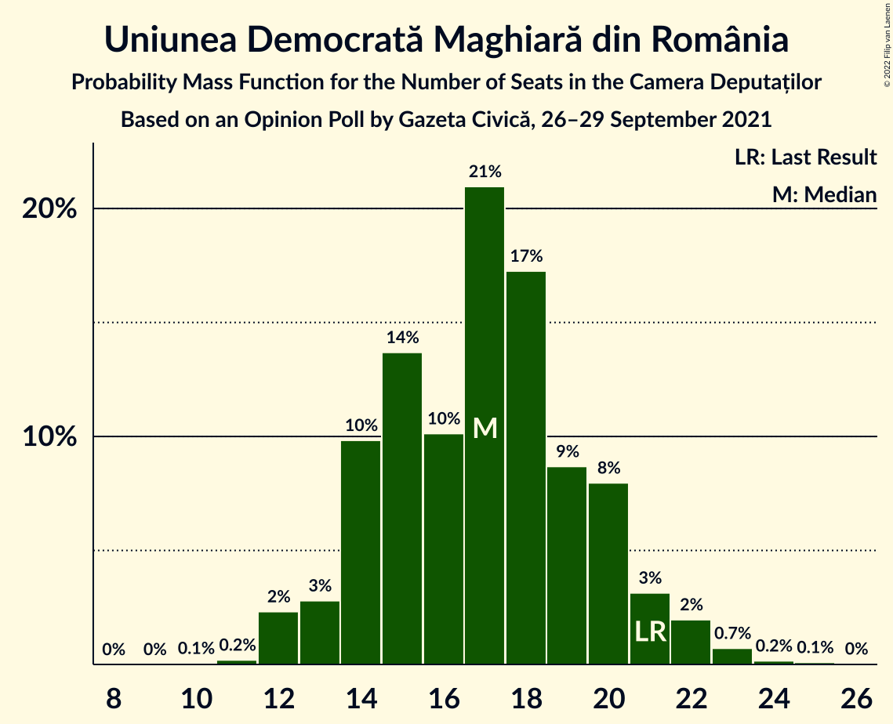

| Number of Seats | Probability | Accumulated | Special Marks |
|:---------------:|:-----------:|:-----------:|:-------------:|
| 10 | 0.1% | 100% |  |
| 11 | 0.2% | 99.9% |  |
| 12 | 2% | 99.7% |  |
| 13 | 3% | 97% |  |
| 14 | 10% | 95% |  |
| 15 | 14% | 85% |  |
| 16 | 10% | 71% |  |
| 17 | 21% | 61% | Median |
| 18 | 17% | 40% |  |
| 19 | 9% | 23% |  |
| 20 | 8% | 14% |  |
| 21 | 3% | 6% | Last Result |
| 22 | 2% | 3% |  |
| 23 | 0.7% | 1.0% |  |
| 24 | 0.2% | 0.3% |  |
| 25 | 0.1% | 0.1% |  |
| 26 | 0% | 0% |  |

### PRO România

*For a full overview of the results for this party, see the [PRO România](party-proromânia.html) page.*

| Number of Seats | Probability | Accumulated | Special Marks |
|:---------------:|:-----------:|:-----------:|:-------------:|
| 0 | 48% | 100% | Last Result |
| 1 | 0% | 52% |  |
| 2 | 0% | 52% |  |
| 3 | 0% | 52% |  |
| 4 | 0% | 52% |  |
| 5 | 0% | 52% |  |
| 6 | 0% | 52% |  |
| 7 | 0% | 52% |  |
| 8 | 0% | 52% |  |
| 9 | 0% | 52% |  |
| 10 | 0% | 52% |  |
| 11 | 0% | 52% |  |
| 12 | 0% | 52% |  |
| 13 | 0% | 52% |  |
| 14 | 0% | 52% |  |
| 15 | 0% | 52% |  |
| 16 | 5% | 52% | Median |
| 17 | 16% | 47% |  |
| 18 | 14% | 31% |  |
| 19 | 8% | 16% |  |
| 20 | 5% | 9% |  |
| 21 | 2% | 4% |  |
| 22 | 0.9% | 1.3% |  |
| 23 | 0.2% | 0.5% |  |
| 24 | 0.1% | 0.2% |  |
| 25 | 0.1% | 0.1% |  |
| 26 | 0% | 0% |  |

### Alianța pentru Patrie

*For a full overview of the results for this party, see the [Alianța pentru Patrie](party-alianțapentrupatrie.html) page.*

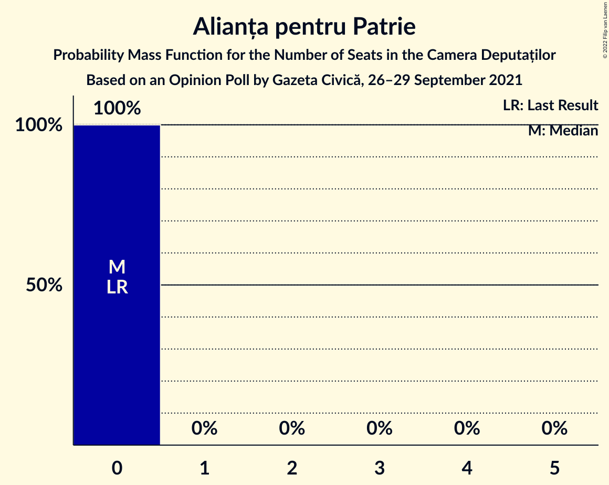

| Number of Seats | Probability | Accumulated | Special Marks |
|:---------------:|:-----------:|:-----------:|:-------------:|
| 0 | 100% | 100% | Last Result, Median |

## Coalitions

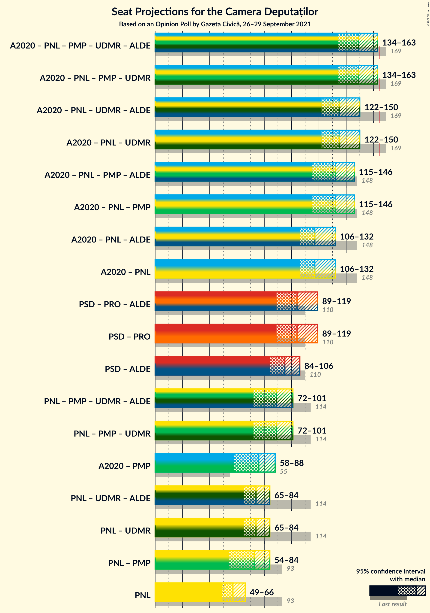

### Confidence Intervals

| Coalition | Last Result | Median | Majority? | 80% Confidence Interval | 90% Confidence Interval | 95% Confidence Interval | 99% Confidence Interval |
|:---------:|:-----------:|:------:|:---------:|:-----------------------:|:-----------------------:|:-----------------------:|:-----------------------:|
| Alianța 2020 USR-PLUS – Partidul Național Liberal – Partidul Mișcarea Populară – Uniunea Democrată Maghiară din România | 169 | 149 | 1.4% | 137–159 | 135–162 | 134–163 | 129–167 |
| Alianța 2020 USR-PLUS – Partidul Național Liberal – Uniunea Democrată Maghiară din România | 169 | 135 | 0% | 125–146 | 124–148 | 122–150 | 119–154 |
| Alianța 2020 USR-PLUS – Partidul Național Liberal – Partidul Mișcarea Populară | 148 | 132 | 0% | 120–142 | 117–144 | 115–146 | 113–150 |
| Alianța 2020 USR-PLUS – Partidul Național Liberal | 148 | 117 | 0% | 110–128 | 108–131 | 106–132 | 103–137 |
| Partidul Social Democrat – PRO România | 110 | 104 | 0% | 93–114 | 91–117 | 89–119 | 86–123 |
| Partidul Național Liberal – Partidul Mișcarea Populară – Uniunea Democrată Maghiară din România | 114 | 89 | 0% | 75–98 | 73–100 | 72–101 | 68–104 |
| Alianța 2020 USR-PLUS – Partidul Mișcarea Populară | 55 | 76 | 0% | 62–83 | 60–86 | 58–88 | 56–90 |
| Partidul Național Liberal – Uniunea Democrată Maghiară din România | 114 | 74 | 0% | 68–81 | 66–83 | 65–84 | 62–88 |
| Partidul Național Liberal – Partidul Mișcarea Populară | 93 | 73 | 0% | 57–80 | 56–82 | 54–84 | 52–87 |
| Partidul Național Liberal | 93 | 57 | 0% | 52–63 | 51–65 | 49–66 | 47–69 |

### Alianța 2020 USR-PLUS – Partidul Național Liberal – Partidul Mișcarea Populară – Uniunea Democrată Maghiară din România

| Number of Seats | Probability | Accumulated | Special Marks |
|:---------------:|:-----------:|:-----------:|:-------------:|
| 124 | 0% | 100% |  |
| 125 | 0.1% | 99.9% |  |
| 126 | 0% | 99.9% |  |
| 127 | 0.1% | 99.8% |  |
| 128 | 0.1% | 99.7% |  |
| 129 | 0.5% | 99.6% |  |
| 130 | 0.4% | 99.2% |  |
| 131 | 0.6% | 98.8% |  |
| 132 | 0.3% | 98% |  |
| 133 | 0.2% | 98% |  |
| 134 | 1.1% | 98% |  |
| 135 | 4% | 97% |  |
| 136 | 3% | 93% |  |
| 137 | 2% | 90% |  |
| 138 | 1.0% | 88% |  |
| 139 | 1.1% | 87% |  |
| 140 | 2% | 86% |  |
| 141 | 2% | 84% |  |
| 142 | 3% | 82% |  |
| 143 | 3% | 78% |  |
| 144 | 4% | 75% |  |
| 145 | 3% | 71% |  |
| 146 | 5% | 68% |  |
| 147 | 4% | 63% |  |
| 148 | 6% | 58% |  |
| 149 | 6% | 53% |  |
| 150 | 5% | 47% |  |
| 151 | 7% | 42% |  |
| 152 | 3% | 35% |  |
| 153 | 4% | 32% | Median |
| 154 | 2% | 28% |  |
| 155 | 4% | 25% |  |
| 156 | 2% | 21% |  |
| 157 | 5% | 19% |  |
| 158 | 3% | 15% |  |
| 159 | 3% | 12% |  |
| 160 | 2% | 9% |  |
| 161 | 2% | 7% |  |
| 162 | 2% | 5% |  |
| 163 | 0.9% | 3% |  |
| 164 | 0.7% | 2% |  |
| 165 | 0.5% | 1.4% | Majority |
| 166 | 0.3% | 0.9% |  |
| 167 | 0.3% | 0.6% |  |
| 168 | 0.1% | 0.3% |  |
| 169 | 0.1% | 0.2% | Last Result |
| 170 | 0% | 0.1% |  |
| 171 | 0% | 0.1% |  |
| 172 | 0% | 0% |  |

### Alianța 2020 USR-PLUS – Partidul Național Liberal – Uniunea Democrată Maghiară din România

| Number of Seats | Probability | Accumulated | Special Marks |
|:---------------:|:-----------:|:-----------:|:-------------:|
| 116 | 0% | 100% |  |
| 117 | 0.1% | 99.9% |  |
| 118 | 0.2% | 99.8% |  |
| 119 | 0.2% | 99.6% |  |
| 120 | 0.6% | 99.4% |  |
| 121 | 0.6% | 98.8% |  |
| 122 | 0.8% | 98% |  |
| 123 | 1.3% | 97% |  |
| 124 | 1.5% | 96% |  |
| 125 | 5% | 95% |  |
| 126 | 2% | 89% |  |
| 127 | 4% | 87% |  |
| 128 | 1.4% | 83% |  |
| 129 | 4% | 82% |  |
| 130 | 4% | 78% |  |
| 131 | 9% | 74% |  |
| 132 | 6% | 65% |  |
| 133 | 3% | 59% |  |
| 134 | 4% | 56% |  |
| 135 | 6% | 52% | Median |
| 136 | 5% | 46% |  |
| 137 | 5% | 41% |  |
| 138 | 4% | 35% |  |
| 139 | 4% | 32% |  |
| 140 | 4% | 28% |  |
| 141 | 4% | 23% |  |
| 142 | 3% | 20% |  |
| 143 | 2% | 16% |  |
| 144 | 1.2% | 14% |  |
| 145 | 1.1% | 13% |  |
| 146 | 3% | 12% |  |
| 147 | 2% | 9% |  |
| 148 | 4% | 8% |  |
| 149 | 0.5% | 3% |  |
| 150 | 0.4% | 3% |  |
| 151 | 1.1% | 2% |  |
| 152 | 0.4% | 1.4% |  |
| 153 | 0.3% | 1.0% |  |
| 154 | 0.2% | 0.6% |  |
| 155 | 0.1% | 0.5% |  |
| 156 | 0% | 0.3% |  |
| 157 | 0.2% | 0.3% |  |
| 158 | 0% | 0.1% |  |
| 159 | 0.1% | 0.1% |  |
| 160 | 0% | 0% |  |
| 161 | 0% | 0% |  |
| 162 | 0% | 0% |  |
| 163 | 0% | 0% |  |
| 164 | 0% | 0% |  |
| 165 | 0% | 0% | Majority |
| 166 | 0% | 0% |  |
| 167 | 0% | 0% |  |
| 168 | 0% | 0% |  |
| 169 | 0% | 0% | Last Result |

### Alianța 2020 USR-PLUS – Partidul Național Liberal – Partidul Mișcarea Populară

| Number of Seats | Probability | Accumulated | Special Marks |
|:---------------:|:-----------:|:-----------:|:-------------:|
| 107 | 0% | 100% |  |
| 108 | 0% | 99.9% |  |
| 109 | 0.1% | 99.9% |  |
| 110 | 0% | 99.8% |  |
| 111 | 0.1% | 99.8% |  |
| 112 | 0.1% | 99.7% |  |
| 113 | 0.3% | 99.5% |  |
| 114 | 0.6% | 99.2% |  |
| 115 | 1.4% | 98.6% |  |
| 116 | 0.5% | 97% |  |
| 117 | 4% | 97% |  |
| 118 | 0.6% | 93% |  |
| 119 | 2% | 92% |  |
| 120 | 2% | 91% |  |
| 121 | 0.9% | 88% |  |
| 122 | 1.3% | 88% |  |
| 123 | 2% | 86% |  |
| 124 | 2% | 84% |  |
| 125 | 2% | 82% |  |
| 126 | 2% | 80% |  |
| 127 | 4% | 78% |  |
| 128 | 5% | 73% |  |
| 129 | 5% | 69% |  |
| 130 | 5% | 64% |  |
| 131 | 6% | 59% |  |
| 132 | 5% | 53% |  |
| 133 | 4% | 48% |  |
| 134 | 8% | 44% |  |
| 135 | 3% | 37% |  |
| 136 | 6% | 34% | Median |
| 137 | 4% | 28% |  |
| 138 | 6% | 25% |  |
| 139 | 4% | 19% |  |
| 140 | 2% | 16% |  |
| 141 | 2% | 13% |  |
| 142 | 4% | 12% |  |
| 143 | 0.8% | 8% |  |
| 144 | 3% | 7% |  |
| 145 | 0.8% | 4% |  |
| 146 | 1.3% | 3% |  |
| 147 | 0.4% | 2% |  |
| 148 | 0.9% | 2% | Last Result |
| 149 | 0.3% | 0.9% |  |
| 150 | 0.2% | 0.6% |  |
| 151 | 0.2% | 0.4% |  |
| 152 | 0.1% | 0.2% |  |
| 153 | 0% | 0.1% |  |
| 154 | 0% | 0% |  |

### Alianța 2020 USR-PLUS – Partidul Național Liberal

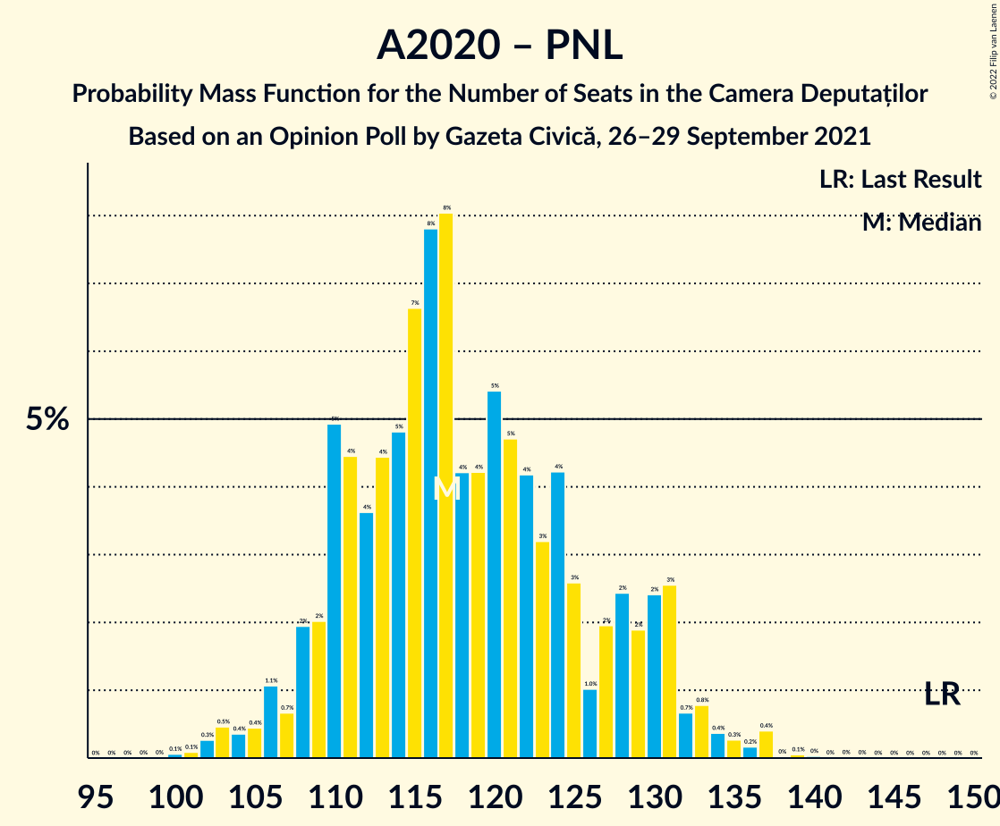

| Number of Seats | Probability | Accumulated | Special Marks |
|:---------------:|:-----------:|:-----------:|:-------------:|
| 100 | 0.1% | 100% |  |
| 101 | 0.1% | 99.9% |  |
| 102 | 0.3% | 99.8% |  |
| 103 | 0.5% | 99.6% |  |
| 104 | 0.4% | 99.1% |  |
| 105 | 0.4% | 98.7% |  |
| 106 | 1.1% | 98% |  |
| 107 | 0.7% | 97% |  |
| 108 | 2% | 97% |  |
| 109 | 2% | 95% |  |
| 110 | 5% | 93% |  |
| 111 | 4% | 88% |  |
| 112 | 4% | 83% |  |
| 113 | 4% | 80% |  |
| 114 | 5% | 75% |  |
| 115 | 7% | 70% |  |
| 116 | 8% | 64% |  |
| 117 | 8% | 56% |  |
| 118 | 4% | 48% | Median |
| 119 | 4% | 44% |  |
| 120 | 5% | 39% |  |
| 121 | 5% | 34% |  |
| 122 | 4% | 29% |  |
| 123 | 3% | 25% |  |
| 124 | 4% | 22% |  |
| 125 | 3% | 18% |  |
| 126 | 1.0% | 15% |  |
| 127 | 2% | 14% |  |
| 128 | 2% | 12% |  |
| 129 | 2% | 10% |  |
| 130 | 2% | 8% |  |
| 131 | 3% | 5% |  |
| 132 | 0.7% | 3% |  |
| 133 | 0.8% | 2% |  |
| 134 | 0.4% | 1.4% |  |
| 135 | 0.3% | 1.0% |  |
| 136 | 0.2% | 0.7% |  |
| 137 | 0.4% | 0.5% |  |
| 138 | 0% | 0.1% |  |
| 139 | 0.1% | 0.1% |  |
| 140 | 0% | 0.1% |  |
| 141 | 0% | 0% |  |
| 142 | 0% | 0% |  |
| 143 | 0% | 0% |  |
| 144 | 0% | 0% |  |
| 145 | 0% | 0% |  |
| 146 | 0% | 0% |  |
| 147 | 0% | 0% |  |
| 148 | 0% | 0% | Last Result |

### Partidul Social Democrat – PRO România

| Number of Seats | Probability | Accumulated | Special Marks |
|:---------------:|:-----------:|:-----------:|:-------------:|
| 83 | 0% | 100% |  |
| 84 | 0.1% | 99.9% |  |
| 85 | 0.2% | 99.8% |  |
| 86 | 0.2% | 99.6% |  |
| 87 | 0.3% | 99.4% |  |
| 88 | 0.4% | 99.1% |  |
| 89 | 1.5% | 98.6% |  |
| 90 | 0.8% | 97% |  |
| 91 | 3% | 96% |  |
| 92 | 2% | 93% |  |
| 93 | 3% | 91% |  |
| 94 | 1.4% | 89% |  |
| 95 | 4% | 87% |  |
| 96 | 3% | 84% |  |
| 97 | 4% | 81% |  |
| 98 | 4% | 77% |  |
| 99 | 6% | 73% |  |
| 100 | 2% | 67% |  |
| 101 | 2% | 65% |  |
| 102 | 5% | 63% |  |
| 103 | 3% | 58% |  |
| 104 | 6% | 54% |  |
| 105 | 3% | 48% |  |
| 106 | 5% | 46% |  |
| 107 | 7% | 41% |  |
| 108 | 3% | 34% |  |
| 109 | 2% | 31% |  |
| 110 | 4% | 29% | Last Result |
| 111 | 5% | 25% | Median |
| 112 | 2% | 20% |  |
| 113 | 3% | 18% |  |
| 114 | 5% | 14% |  |
| 115 | 1.5% | 9% |  |
| 116 | 2% | 8% |  |
| 117 | 1.0% | 6% |  |
| 118 | 0.8% | 5% |  |
| 119 | 2% | 4% |  |
| 120 | 0.4% | 2% |  |
| 121 | 0.3% | 2% |  |
| 122 | 0.7% | 1.5% |  |
| 123 | 0.3% | 0.8% |  |
| 124 | 0.1% | 0.5% |  |
| 125 | 0.3% | 0.4% |  |
| 126 | 0.1% | 0.2% |  |
| 127 | 0% | 0.1% |  |
| 128 | 0% | 0% |  |

### Partidul Național Liberal – Partidul Mișcarea Populară – Uniunea Democrată Maghiară din România

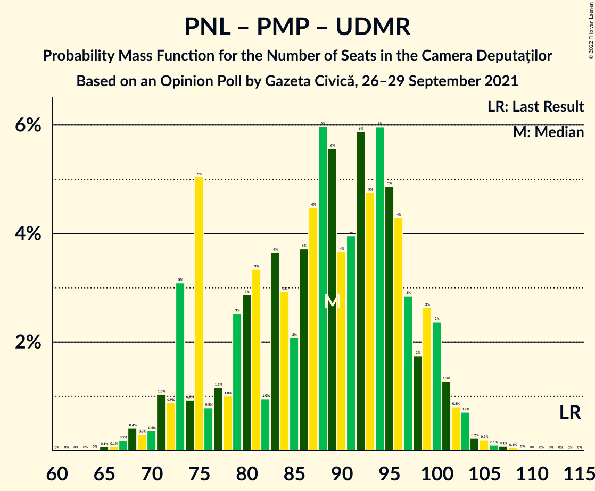

| Number of Seats | Probability | Accumulated | Special Marks |
|:---------------:|:-----------:|:-----------:|:-------------:|
| 65 | 0.1% | 100% |  |
| 66 | 0.1% | 99.9% |  |
| 67 | 0.2% | 99.8% |  |
| 68 | 0.4% | 99.6% |  |
| 69 | 0.3% | 99.2% |  |
| 70 | 0.4% | 98.9% |  |
| 71 | 1.0% | 98.5% |  |
| 72 | 0.9% | 98% |  |
| 73 | 3% | 97% |  |
| 74 | 0.9% | 94% |  |
| 75 | 5% | 93% |  |
| 76 | 0.8% | 88% |  |
| 77 | 1.2% | 87% |  |
| 78 | 1.0% | 86% |  |
| 79 | 3% | 85% |  |
| 80 | 3% | 82% |  |
| 81 | 3% | 79% |  |
| 82 | 1.0% | 76% |  |
| 83 | 4% | 75% |  |
| 84 | 3% | 71% |  |
| 85 | 2% | 68% |  |
| 86 | 4% | 66% |  |
| 87 | 4% | 63% |  |
| 88 | 6% | 58% |  |
| 89 | 6% | 52% |  |
| 90 | 4% | 47% |  |
| 91 | 4% | 43% |  |
| 92 | 6% | 39% | Median |
| 93 | 5% | 33% |  |
| 94 | 6% | 28% |  |
| 95 | 5% | 22% |  |
| 96 | 4% | 17% |  |
| 97 | 3% | 13% |  |
| 98 | 2% | 10% |  |
| 99 | 3% | 9% |  |
| 100 | 2% | 6% |  |
| 101 | 1.3% | 3% |  |
| 102 | 0.8% | 2% |  |
| 103 | 0.7% | 1.4% |  |
| 104 | 0.2% | 0.7% |  |
| 105 | 0.2% | 0.5% |  |
| 106 | 0.1% | 0.3% |  |
| 107 | 0.1% | 0.2% |  |
| 108 | 0.1% | 0.1% |  |
| 109 | 0% | 0% |  |
| 110 | 0% | 0% |  |
| 111 | 0% | 0% |  |
| 112 | 0% | 0% |  |
| 113 | 0% | 0% |  |
| 114 | 0% | 0% | Last Result |

### Alianța 2020 USR-PLUS – Partidul Mișcarea Populară

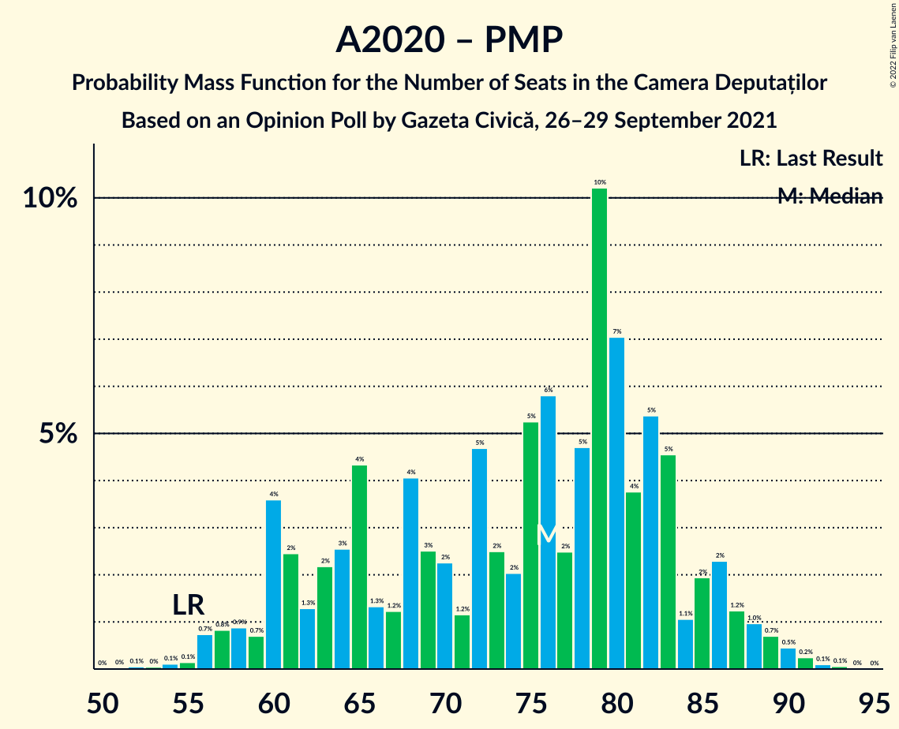

| Number of Seats | Probability | Accumulated | Special Marks |
|:---------------:|:-----------:|:-----------:|:-------------:|
| 52 | 0.1% | 100% |  |
| 53 | 0% | 99.9% |  |
| 54 | 0.1% | 99.9% |  |
| 55 | 0.1% | 99.8% | Last Result |
| 56 | 0.7% | 99.6% |  |
| 57 | 0.8% | 98.9% |  |
| 58 | 0.9% | 98% |  |
| 59 | 0.7% | 97% |  |
| 60 | 4% | 96% |  |
| 61 | 2% | 93% |  |
| 62 | 1.3% | 90% |  |
| 63 | 2% | 89% |  |
| 64 | 3% | 87% |  |
| 65 | 4% | 84% |  |
| 66 | 1.3% | 80% |  |
| 67 | 1.2% | 79% |  |
| 68 | 4% | 78% |  |
| 69 | 3% | 73% |  |
| 70 | 2% | 71% |  |
| 71 | 1.2% | 69% |  |
| 72 | 5% | 68% |  |
| 73 | 2% | 63% |  |
| 74 | 2% | 60% |  |
| 75 | 5% | 58% |  |
| 76 | 6% | 53% |  |
| 77 | 2% | 47% |  |
| 78 | 5% | 45% |  |
| 79 | 10% | 40% | Median |
| 80 | 7% | 30% |  |
| 81 | 4% | 23% |  |
| 82 | 5% | 19% |  |
| 83 | 5% | 14% |  |
| 84 | 1.1% | 9% |  |
| 85 | 2% | 8% |  |
| 86 | 2% | 6% |  |
| 87 | 1.2% | 4% |  |
| 88 | 1.0% | 3% |  |
| 89 | 0.7% | 2% |  |
| 90 | 0.5% | 0.9% |  |
| 91 | 0.2% | 0.4% |  |
| 92 | 0.1% | 0.2% |  |
| 93 | 0.1% | 0.1% |  |
| 94 | 0% | 0% |  |

### Partidul Național Liberal – Uniunea Democrată Maghiară din România

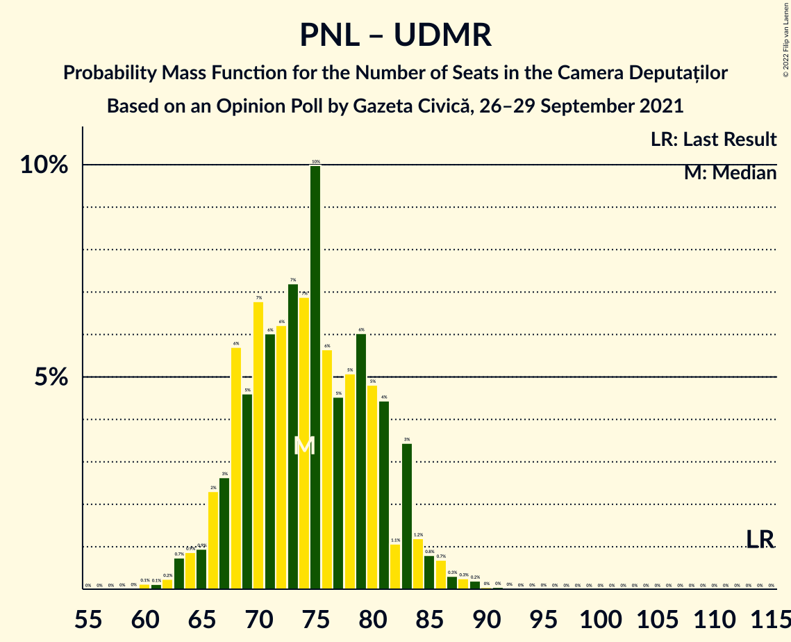

| Number of Seats | Probability | Accumulated | Special Marks |
|:---------------:|:-----------:|:-----------:|:-------------:|
| 60 | 0.1% | 100% |  |
| 61 | 0.1% | 99.8% |  |
| 62 | 0.2% | 99.7% |  |
| 63 | 0.7% | 99.5% |  |
| 64 | 0.9% | 98.7% |  |
| 65 | 0.9% | 98% |  |
| 66 | 2% | 97% |  |
| 67 | 3% | 95% |  |
| 68 | 6% | 92% |  |
| 69 | 5% | 86% |  |
| 70 | 7% | 82% |  |
| 71 | 6% | 75% |  |
| 72 | 6% | 69% |  |
| 73 | 7% | 63% |  |
| 74 | 7% | 55% | Median |
| 75 | 10% | 49% |  |
| 76 | 6% | 39% |  |
| 77 | 5% | 33% |  |
| 78 | 5% | 28% |  |
| 79 | 6% | 23% |  |
| 80 | 5% | 17% |  |
| 81 | 4% | 13% |  |
| 82 | 1.1% | 8% |  |
| 83 | 3% | 7% |  |
| 84 | 1.2% | 4% |  |
| 85 | 0.8% | 2% |  |
| 86 | 0.7% | 2% |  |
| 87 | 0.3% | 0.9% |  |
| 88 | 0.3% | 0.6% |  |
| 89 | 0.2% | 0.3% |  |
| 90 | 0% | 0.1% |  |
| 91 | 0% | 0.1% |  |
| 92 | 0% | 0.1% |  |
| 93 | 0% | 0% |  |
| 94 | 0% | 0% |  |
| 95 | 0% | 0% |  |
| 96 | 0% | 0% |  |
| 97 | 0% | 0% |  |
| 98 | 0% | 0% |  |
| 99 | 0% | 0% |  |
| 100 | 0% | 0% |  |
| 101 | 0% | 0% |  |
| 102 | 0% | 0% |  |
| 103 | 0% | 0% |  |
| 104 | 0% | 0% |  |
| 105 | 0% | 0% |  |
| 106 | 0% | 0% |  |
| 107 | 0% | 0% |  |
| 108 | 0% | 0% |  |
| 109 | 0% | 0% |  |
| 110 | 0% | 0% |  |
| 111 | 0% | 0% |  |
| 112 | 0% | 0% |  |
| 113 | 0% | 0% |  |
| 114 | 0% | 0% | Last Result |

### Partidul Național Liberal – Partidul Mișcarea Populară

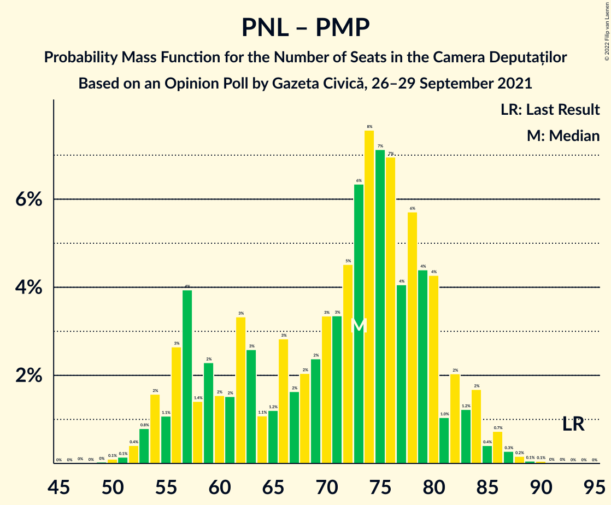

| Number of Seats | Probability | Accumulated | Special Marks |
|:---------------:|:-----------:|:-----------:|:-------------:|
| 49 | 0% | 100% |  |
| 50 | 0.1% | 99.9% |  |
| 51 | 0.1% | 99.8% |  |
| 52 | 0.4% | 99.7% |  |
| 53 | 0.8% | 99.3% |  |
| 54 | 2% | 98% |  |
| 55 | 1.1% | 97% |  |
| 56 | 3% | 96% |  |
| 57 | 4% | 93% |  |
| 58 | 1.4% | 89% |  |
| 59 | 2% | 88% |  |
| 60 | 2% | 86% |  |
| 61 | 2% | 84% |  |
| 62 | 3% | 82% |  |
| 63 | 3% | 79% |  |
| 64 | 1.1% | 77% |  |
| 65 | 1.2% | 75% |  |
| 66 | 3% | 74% |  |
| 67 | 2% | 71% |  |
| 68 | 2% | 70% |  |
| 69 | 2% | 68% |  |
| 70 | 3% | 65% |  |
| 71 | 3% | 62% |  |
| 72 | 5% | 59% |  |
| 73 | 6% | 54% |  |
| 74 | 8% | 48% |  |
| 75 | 7% | 40% | Median |
| 76 | 7% | 33% |  |
| 77 | 4% | 26% |  |
| 78 | 6% | 22% |  |
| 79 | 4% | 16% |  |
| 80 | 4% | 12% |  |
| 81 | 1.0% | 8% |  |
| 82 | 2% | 7% |  |
| 83 | 1.2% | 5% |  |
| 84 | 2% | 3% |  |
| 85 | 0.4% | 2% |  |
| 86 | 0.7% | 1.3% |  |
| 87 | 0.3% | 0.6% |  |
| 88 | 0.2% | 0.3% |  |
| 89 | 0.1% | 0.1% |  |
| 90 | 0.1% | 0.1% |  |
| 91 | 0% | 0% |  |
| 92 | 0% | 0% |  |
| 93 | 0% | 0% | Last Result |

### Partidul Național Liberal

| Number of Seats | Probability | Accumulated | Special Marks |
|:---------------:|:-----------:|:-----------:|:-------------:|
| 45 | 0.1% | 100% |  |
| 46 | 0.2% | 99.9% |  |
| 47 | 0.4% | 99.7% |  |
| 48 | 0.6% | 99.3% |  |
| 49 | 1.5% | 98.7% |  |
| 50 | 2% | 97% |  |
| 51 | 4% | 95% |  |
| 52 | 3% | 92% |  |
| 53 | 5% | 88% |  |
| 54 | 10% | 84% |  |
| 55 | 10% | 74% |  |
| 56 | 7% | 64% |  |
| 57 | 11% | 56% | Median |
| 58 | 8% | 45% |  |
| 59 | 7% | 37% |  |
| 60 | 7% | 30% |  |
| 61 | 4% | 23% |  |
| 62 | 6% | 19% |  |
| 63 | 4% | 13% |  |
| 64 | 3% | 9% |  |
| 65 | 2% | 7% |  |
| 66 | 3% | 5% |  |
| 67 | 0.8% | 2% |  |
| 68 | 0.5% | 2% |  |
| 69 | 0.6% | 1.0% |  |
| 70 | 0.2% | 0.4% |  |
| 71 | 0.1% | 0.2% |  |
| 72 | 0.1% | 0.1% |  |
| 73 | 0% | 0.1% |  |
| 74 | 0% | 0% |  |
| 75 | 0% | 0% |  |
| 76 | 0% | 0% |  |
| 77 | 0% | 0% |  |
| 78 | 0% | 0% |  |
| 79 | 0% | 0% |  |
| 80 | 0% | 0% |  |
| 81 | 0% | 0% |  |
| 82 | 0% | 0% |  |
| 83 | 0% | 0% |  |
| 84 | 0% | 0% |  |
| 85 | 0% | 0% |  |
| 86 | 0% | 0% |  |
| 87 | 0% | 0% |  |
| 88 | 0% | 0% |  |
| 89 | 0% | 0% |  |
| 90 | 0% | 0% |  |
| 91 | 0% | 0% |  |
| 92 | 0% | 0% |  |
| 93 | 0% | 0% | Last Result |

## Technical Information

### Opinion Poll

+ **Polling firm:** Gazeta Civică
+ **Commissioner(s):** —
+ **Fieldwork period:** 26–29 September 2021

### Calculations

+ **Sample size:** 1202
+ **Simulations done:** 1,048,576
+ **Error estimate:** 1.07%

