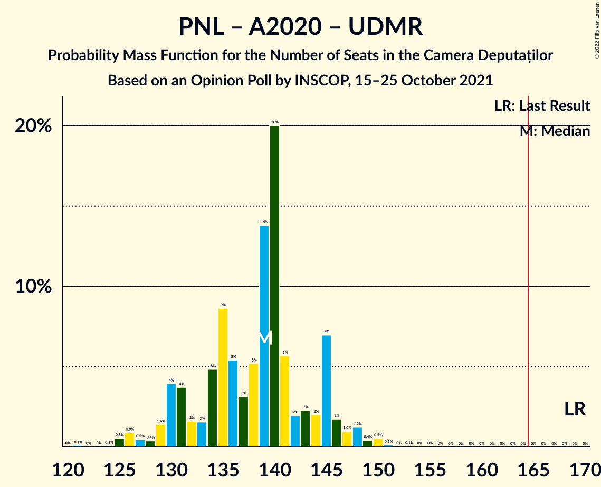

# Opinion Poll by INSCOP, 15–25 October 2021

<a href="#voting-intentions">Voting Intentions</a> | <a href="#seats">Seats</a> | <a href="#coalitions">Coalitions</a> | <a href="#technical-information">Technical Information</a>

## Voting Intentions

### Confidence Intervals

| Party | Last Result | Poll Result | 80% Confidence Interval | 90% Confidence Interval | 95% Confidence Interval | 99% Confidence Interval |
|:-----:|:-----------:|:-----------:|:-----------------------:|:-----------------------:|:-----------------------:|:-----------------------:|
| Partidul Social Democrat | 28.9% | 35.5% | 33.6–37.3% |33.1–37.9% |32.7–38.3% |31.8–39.2% |
| Partidul Național Liberal | 25.2% | 21.9% | 20.4–23.6% |19.9–24.1% |19.6–24.5% |18.8–25.3% |
| Alianța pentru Unirea Românilor | 9.1% | 14.2% | 12.9–15.6% |12.5–16.0% |12.2–16.4% |11.7–17.1% |
| Alianța 2020 USR-PLUS | 15.4% | 12.4% | 11.2–13.7% |10.8–14.1% |10.5–14.4% |10.0–15.1% |
| Uniunea Democrată Maghiară din România | 5.7% | 5.0% | 4.3–6.0% |4.0–6.2% |3.9–6.5% |3.5–7.0% |
| PRO România | 4.1% | 3.2% | 2.6–4.0% |2.4–4.2% |2.3–4.4% |2.0–4.8% |
| Partidul Mișcarea Populară | 4.8% | 2.9% | 2.3–3.7% |2.2–3.9% |2.1–4.1% |1.8–4.5% |
| Partidul Puterii Umaniste (social-liberal) | 0.0% | 0.5% | 0.3–0.9% |0.2–1.0% |0.2–1.1% |0.1–1.3% |

*Note:* The poll result column reflects the actual value used in the calculations. Published results may vary slightly, and in addition be rounded to fewer digits.

## Seats

### Confidence Intervals

| Party | Last Result | Median | 80% Confidence Interval | 90% Confidence Interval | 95% Confidence Interval | 99% Confidence Interval |
|:-----:|:-----------:|:------:|:-----------------------:|:-----------------------:|:-----------------------:|:-----------------------:|
| <a href="#partidul-social-democrat">Partidul Social Democrat</a> | 110 | 125 | 119–131 |117–133 |115–134 |112–137 |
| <a href="#partidul-național-liberal">Partidul Național Liberal</a> | 93 | 77 | 71–82 |70–84 |68–85 |66–88 |
| <a href="#alianța-pentru-unirea-românilor">Alianța pentru Unirea Românilor</a> | 33 | 50 | 45–55 |44–56 |43–58 |41–60 |
| <a href="#alianța-2020-usr-plus">Alianța 2020 USR-PLUS</a> | 55 | 43 | 39–48 |38–49 |37–51 |35–53 |
| <a href="#uniunea-democrată-maghiară-din-românia">Uniunea Democrată Maghiară din România</a> | 21 | 17 | 14–20 |14–21 |13–22 |12–24 |
| <a href="#pro-românia">PRO România</a> | 0 | 0 | 0 |0 |0 |0 |
| <a href="#partidul-mișcarea-populară">Partidul Mișcarea Populară</a> | 0 | 0 | 0 |0 |0 |0 |
| <a href="#partidul-puterii-umaniste-(social-liberal)">Partidul Puterii Umaniste (social-liberal)</a> | 0 | 0 | 0 |0 |0 |0 |

### Partidul Social Democrat

*For a full overview of the results for this party, see the [Partidul Social Democrat](party-partidulsocialdemocrat.html) page.*

| Number of Seats | Probability | Accumulated | Special Marks |
|:---------------:|:-----------:|:-----------:|:-------------:|
| 108 | 0% | 100% |  |
| 109 | 0.1% | 99.9% |  |
| 110 | 0.1% | 99.9% | Last Result |
| 111 | 0.2% | 99.8% |  |
| 112 | 0.2% | 99.6% |  |
| 113 | 0.6% | 99.4% |  |
| 114 | 0.6% | 98.8% |  |
| 115 | 1.1% | 98% |  |
| 116 | 1.2% | 97% |  |
| 117 | 3% | 96% |  |
| 118 | 3% | 93% |  |
| 119 | 5% | 90% |  |
| 120 | 4% | 85% |  |
| 121 | 6% | 82% |  |
| 122 | 7% | 76% |  |
| 123 | 6% | 68% |  |
| 124 | 11% | 62% |  |
| 125 | 5% | 51% | Median |
| 126 | 6% | 46% |  |
| 127 | 9% | 40% |  |
| 128 | 8% | 31% |  |
| 129 | 5% | 24% |  |
| 130 | 7% | 19% |  |
| 131 | 3% | 12% |  |
| 132 | 2% | 9% |  |
| 133 | 3% | 7% |  |
| 134 | 1.4% | 4% |  |
| 135 | 0.6% | 2% |  |
| 136 | 1.0% | 2% |  |
| 137 | 0.3% | 0.8% |  |
| 138 | 0.3% | 0.5% |  |
| 139 | 0.1% | 0.2% |  |
| 140 | 0.1% | 0.1% |  |
| 141 | 0% | 0.1% |  |
| 142 | 0% | 0% |  |

### Partidul Național Liberal

*For a full overview of the results for this party, see the [Partidul Național Liberal](party-partidulnaționalliberal.html) page.*

| Number of Seats | Probability | Accumulated | Special Marks |
|:---------------:|:-----------:|:-----------:|:-------------:|
| 63 | 0% | 100% |  |
| 64 | 0.1% | 99.9% |  |
| 65 | 0.2% | 99.8% |  |
| 66 | 0.3% | 99.6% |  |
| 67 | 0.8% | 99.3% |  |
| 68 | 1.2% | 98.5% |  |
| 69 | 2% | 97% |  |
| 70 | 3% | 96% |  |
| 71 | 4% | 93% |  |
| 72 | 8% | 88% |  |
| 73 | 5% | 81% |  |
| 74 | 7% | 75% |  |
| 75 | 10% | 68% |  |
| 76 | 8% | 58% |  |
| 77 | 8% | 50% | Median |
| 78 | 8% | 42% |  |
| 79 | 7% | 34% |  |
| 80 | 7% | 26% |  |
| 81 | 6% | 19% |  |
| 82 | 4% | 13% |  |
| 83 | 3% | 9% |  |
| 84 | 3% | 6% |  |
| 85 | 1.4% | 4% |  |
| 86 | 0.9% | 2% |  |
| 87 | 0.5% | 1.2% |  |
| 88 | 0.4% | 0.8% |  |
| 89 | 0.2% | 0.4% |  |
| 90 | 0.1% | 0.2% |  |
| 91 | 0.1% | 0.1% |  |
| 92 | 0% | 0.1% |  |
| 93 | 0% | 0% | Last Result |

### Alianța pentru Unirea Românilor

*For a full overview of the results for this party, see the [Alianța pentru Unirea Românilor](party-alianțapentruunirearomânilor.html) page.*

| Number of Seats | Probability | Accumulated | Special Marks |
|:---------------:|:-----------:|:-----------:|:-------------:|
| 33 | 0% | 100% | Last Result |
| 34 | 0% | 100% |  |
| 35 | 0% | 100% |  |
| 36 | 0% | 100% |  |
| 37 | 0% | 100% |  |
| 38 | 0% | 100% |  |
| 39 | 0.1% | 99.9% |  |
| 40 | 0.3% | 99.8% |  |
| 41 | 0.6% | 99.6% |  |
| 42 | 1.0% | 98.9% |  |
| 43 | 2% | 98% |  |
| 44 | 3% | 96% |  |
| 45 | 5% | 93% |  |
| 46 | 7% | 88% |  |
| 47 | 8% | 81% |  |
| 48 | 9% | 73% |  |
| 49 | 12% | 64% |  |
| 50 | 11% | 52% | Median |
| 51 | 9% | 41% |  |
| 52 | 9% | 32% |  |
| 53 | 8% | 24% |  |
| 54 | 4% | 15% |  |
| 55 | 6% | 11% |  |
| 56 | 2% | 6% |  |
| 57 | 1.4% | 4% |  |
| 58 | 1.5% | 3% |  |
| 59 | 0.4% | 1.1% |  |
| 60 | 0.4% | 0.7% |  |
| 61 | 0.1% | 0.3% |  |
| 62 | 0.1% | 0.1% |  |
| 63 | 0% | 0.1% |  |
| 64 | 0% | 0% |  |

### Alianța 2020 USR-PLUS

*For a full overview of the results for this party, see the [Alianța 2020 USR-PLUS](party-alianța2020usr-plus.html) page.*

| Number of Seats | Probability | Accumulated | Special Marks |
|:---------------:|:-----------:|:-----------:|:-------------:|
| 33 | 0.1% | 100% |  |
| 34 | 0.2% | 99.8% |  |
| 35 | 0.7% | 99.7% |  |
| 36 | 0.8% | 98.9% |  |
| 37 | 3% | 98% |  |
| 38 | 2% | 95% |  |
| 39 | 7% | 93% |  |
| 40 | 5% | 86% |  |
| 41 | 15% | 81% |  |
| 42 | 6% | 66% |  |
| 43 | 15% | 60% | Median |
| 44 | 8% | 45% |  |
| 45 | 12% | 37% |  |
| 46 | 6% | 25% |  |
| 47 | 7% | 19% |  |
| 48 | 3% | 12% |  |
| 49 | 4% | 8% |  |
| 50 | 2% | 5% |  |
| 51 | 1.5% | 3% |  |
| 52 | 0.5% | 1.1% |  |
| 53 | 0.3% | 0.6% |  |
| 54 | 0.2% | 0.3% |  |
| 55 | 0.1% | 0.1% | Last Result |
| 56 | 0% | 0% |  |

### Uniunea Democrată Maghiară din România

*For a full overview of the results for this party, see the [Uniunea Democrată Maghiară din România](party-uniuneademocratămaghiarădinromânia.html) page.*

| Number of Seats | Probability | Accumulated | Special Marks |
|:---------------:|:-----------:|:-----------:|:-------------:|
| 11 | 0.2% | 100% |  |
| 12 | 1.1% | 99.8% |  |
| 13 | 3% | 98.7% |  |
| 14 | 7% | 96% |  |
| 15 | 12% | 90% |  |
| 16 | 17% | 77% |  |
| 17 | 19% | 60% | Median |
| 18 | 15% | 41% |  |
| 19 | 11% | 26% |  |
| 20 | 7% | 15% |  |
| 21 | 4% | 8% | Last Result |
| 22 | 2% | 4% |  |
| 23 | 1.2% | 2% |  |
| 24 | 0.5% | 0.8% |  |
| 25 | 0.2% | 0.3% |  |
| 26 | 0.1% | 0.1% |  |
| 27 | 0% | 0% |  |

### PRO România

*For a full overview of the results for this party, see the [PRO România](party-proromânia.html) page.*

| Number of Seats | Probability | Accumulated | Special Marks |
|:---------------:|:-----------:|:-----------:|:-------------:|
| 0 | 99.8% | 100% | Last Result, Median |
| 1 | 0% | 0.2% |  |
| 2 | 0% | 0.2% |  |
| 3 | 0% | 0.2% |  |
| 4 | 0% | 0.2% |  |
| 5 | 0% | 0.2% |  |
| 6 | 0% | 0.2% |  |
| 7 | 0% | 0.2% |  |
| 8 | 0% | 0.2% |  |
| 9 | 0% | 0.2% |  |
| 10 | 0% | 0.2% |  |
| 11 | 0% | 0.2% |  |
| 12 | 0% | 0.2% |  |
| 13 | 0% | 0.2% |  |
| 14 | 0% | 0.2% |  |
| 15 | 0% | 0.2% |  |
| 16 | 0% | 0.2% |  |
| 17 | 0.2% | 0.2% |  |
| 18 | 0% | 0.1% |  |
| 19 | 0% | 0% |  |

### Partidul Mișcarea Populară

*For a full overview of the results for this party, see the [Partidul Mișcarea Populară](party-partidulmișcareapopulară.html) page.*

| Number of Seats | Probability | Accumulated | Special Marks |
|:---------------:|:-----------:|:-----------:|:-------------:|
| 0 | 100% | 100% | Last Result, Median |

### Partidul Puterii Umaniste (social-liberal)

*For a full overview of the results for this party, see the [Partidul Puterii Umaniste (social-liberal)](party-partidulputeriiumanistesocial-liberal.html) page.*

| Number of Seats | Probability | Accumulated | Special Marks |
|:---------------:|:-----------:|:-----------:|:-------------:|
| 0 | 100% | 100% | Last Result, Median |

## Coalitions

### Confidence Intervals

| Coalition | Last Result | Median | Majority? | 80% Confidence Interval | 90% Confidence Interval | 95% Confidence Interval | 99% Confidence Interval |
|:---------:|:-----------:|:------:|:---------:|:-----------------------:|:-----------------------:|:-----------------------:|:-----------------------:|
| Partidul Național Liberal – Alianța 2020 USR-PLUS – Uniunea Democrată Maghiară din România – Partidul Mișcarea Populară | 169 | 137 | 0% | 131–143 | 129–145 | 128–147 | 125–150 |
| Partidul Național Liberal – Alianța 2020 USR-PLUS – Uniunea Democrată Maghiară din România | 169 | 137 | 0% | 131–143 | 129–145 | 128–147 | 125–150 |
| Partidul Social Democrat – PRO România | 110 | 125 | 0% | 119–131 | 117–133 | 115–134 | 112–138 |
| Partidul Național Liberal – Alianța 2020 USR-PLUS – Partidul Mișcarea Populară | 148 | 120 | 0% | 114–126 | 112–128 | 111–129 | 108–133 |
| Partidul Național Liberal – Alianța 2020 USR-PLUS | 148 | 120 | 0% | 114–126 | 112–128 | 111–129 | 108–133 |
| Partidul Național Liberal – Uniunea Democrată Maghiară din România – Partidul Mișcarea Populară | 114 | 94 | 0% | 88–100 | 87–102 | 85–103 | 83–107 |
| Partidul Național Liberal – Uniunea Democrată Maghiară din România | 114 | 94 | 0% | 88–100 | 87–102 | 85–103 | 83–107 |
| Partidul Național Liberal – Partidul Mișcarea Populară | 93 | 77 | 0% | 71–82 | 70–84 | 68–85 | 66–88 |
| Partidul Național Liberal | 93 | 77 | 0% | 71–82 | 70–84 | 68–85 | 66–88 |
| Alianța 2020 USR-PLUS – Partidul Mișcarea Populară | 55 | 43 | 0% | 39–48 | 38–49 | 37–51 | 35–53 |

### Partidul Național Liberal – Alianța 2020 USR-PLUS – Uniunea Democrată Maghiară din România – Partidul Mișcarea Populară

| Number of Seats | Probability | Accumulated | Special Marks |
|:---------------:|:-----------:|:-----------:|:-------------:|
| 121 | 0% | 100% |  |
| 122 | 0% | 99.9% |  |
| 123 | 0.1% | 99.9% |  |
| 124 | 0.2% | 99.8% |  |
| 125 | 0.3% | 99.6% |  |
| 126 | 0.4% | 99.3% |  |
| 127 | 1.2% | 98.9% |  |
| 128 | 1.5% | 98% |  |
| 129 | 2% | 96% |  |
| 130 | 2% | 94% |  |
| 131 | 2% | 92% |  |
| 132 | 10% | 90% |  |
| 133 | 4% | 80% |  |
| 134 | 7% | 76% |  |
| 135 | 10% | 69% |  |
| 136 | 5% | 59% |  |
| 137 | 7% | 54% | Median |
| 138 | 8% | 47% |  |
| 139 | 5% | 39% |  |
| 140 | 8% | 34% |  |
| 141 | 5% | 26% |  |
| 142 | 5% | 21% |  |
| 143 | 6% | 16% |  |
| 144 | 3% | 10% |  |
| 145 | 2% | 7% |  |
| 146 | 1.4% | 5% |  |
| 147 | 1.3% | 4% |  |
| 148 | 0.9% | 2% |  |
| 149 | 0.4% | 1.3% |  |
| 150 | 0.4% | 0.9% |  |
| 151 | 0.2% | 0.5% |  |
| 152 | 0.1% | 0.3% |  |
| 153 | 0.1% | 0.2% |  |
| 154 | 0% | 0.1% |  |
| 155 | 0% | 0% |  |
| 156 | 0% | 0% |  |
| 157 | 0% | 0% |  |
| 158 | 0% | 0% |  |
| 159 | 0% | 0% |  |
| 160 | 0% | 0% |  |
| 161 | 0% | 0% |  |
| 162 | 0% | 0% |  |
| 163 | 0% | 0% |  |
| 164 | 0% | 0% |  |
| 165 | 0% | 0% | Majority |
| 166 | 0% | 0% |  |
| 167 | 0% | 0% |  |
| 168 | 0% | 0% |  |
| 169 | 0% | 0% | Last Result |

### Partidul Național Liberal – Alianța 2020 USR-PLUS – Uniunea Democrată Maghiară din România

| Number of Seats | Probability | Accumulated | Special Marks |
|:---------------:|:-----------:|:-----------:|:-------------:|
| 121 | 0% | 100% |  |
| 122 | 0% | 99.9% |  |
| 123 | 0.1% | 99.9% |  |
| 124 | 0.2% | 99.8% |  |
| 125 | 0.3% | 99.6% |  |
| 126 | 0.4% | 99.3% |  |
| 127 | 1.2% | 98.9% |  |
| 128 | 1.5% | 98% |  |
| 129 | 2% | 96% |  |
| 130 | 2% | 94% |  |
| 131 | 2% | 92% |  |
| 132 | 10% | 90% |  |
| 133 | 4% | 80% |  |
| 134 | 7% | 76% |  |
| 135 | 10% | 69% |  |
| 136 | 5% | 59% |  |
| 137 | 7% | 54% | Median |
| 138 | 8% | 47% |  |
| 139 | 5% | 39% |  |
| 140 | 8% | 34% |  |
| 141 | 5% | 26% |  |
| 142 | 5% | 21% |  |
| 143 | 6% | 15% |  |
| 144 | 3% | 10% |  |
| 145 | 2% | 7% |  |
| 146 | 1.4% | 5% |  |
| 147 | 1.3% | 4% |  |
| 148 | 0.9% | 2% |  |
| 149 | 0.4% | 1.3% |  |
| 150 | 0.4% | 0.9% |  |
| 151 | 0.2% | 0.5% |  |
| 152 | 0.1% | 0.3% |  |
| 153 | 0.1% | 0.2% |  |
| 154 | 0% | 0.1% |  |
| 155 | 0% | 0% |  |
| 156 | 0% | 0% |  |
| 157 | 0% | 0% |  |
| 158 | 0% | 0% |  |
| 159 | 0% | 0% |  |
| 160 | 0% | 0% |  |
| 161 | 0% | 0% |  |
| 162 | 0% | 0% |  |
| 163 | 0% | 0% |  |
| 164 | 0% | 0% |  |
| 165 | 0% | 0% | Majority |
| 166 | 0% | 0% |  |
| 167 | 0% | 0% |  |
| 168 | 0% | 0% |  |
| 169 | 0% | 0% | Last Result |

### Partidul Social Democrat – PRO România

| Number of Seats | Probability | Accumulated | Special Marks |
|:---------------:|:-----------:|:-----------:|:-------------:|
| 109 | 0.1% | 100% |  |
| 110 | 0.1% | 99.9% | Last Result |
| 111 | 0.2% | 99.8% |  |
| 112 | 0.2% | 99.6% |  |
| 113 | 0.5% | 99.4% |  |
| 114 | 0.5% | 98.8% |  |
| 115 | 1.1% | 98% |  |
| 116 | 1.2% | 97% |  |
| 117 | 3% | 96% |  |
| 118 | 3% | 93% |  |
| 119 | 5% | 90% |  |
| 120 | 4% | 86% |  |
| 121 | 6% | 82% |  |
| 122 | 7% | 76% |  |
| 123 | 6% | 69% |  |
| 124 | 11% | 63% |  |
| 125 | 5% | 51% | Median |
| 126 | 6% | 46% |  |
| 127 | 9% | 40% |  |
| 128 | 8% | 32% |  |
| 129 | 5% | 24% |  |
| 130 | 7% | 19% |  |
| 131 | 3% | 12% |  |
| 132 | 3% | 10% |  |
| 133 | 3% | 7% |  |
| 134 | 1.5% | 4% |  |
| 135 | 0.6% | 2% |  |
| 136 | 1.1% | 2% |  |
| 137 | 0.3% | 0.9% |  |
| 138 | 0.3% | 0.5% |  |
| 139 | 0.1% | 0.3% |  |
| 140 | 0.1% | 0.1% |  |
| 141 | 0% | 0.1% |  |
| 142 | 0% | 0.1% |  |
| 143 | 0% | 0% |  |

### Partidul Național Liberal – Alianța 2020 USR-PLUS – Partidul Mișcarea Populară

| Number of Seats | Probability | Accumulated | Special Marks |
|:---------------:|:-----------:|:-----------:|:-------------:|
| 104 | 0% | 100% |  |
| 105 | 0.1% | 99.9% |  |
| 106 | 0.1% | 99.9% |  |
| 107 | 0.2% | 99.7% |  |
| 108 | 0.3% | 99.5% |  |
| 109 | 0.7% | 99.3% |  |
| 110 | 0.9% | 98.6% |  |
| 111 | 1.5% | 98% |  |
| 112 | 2% | 96% |  |
| 113 | 3% | 94% |  |
| 114 | 3% | 91% |  |
| 115 | 7% | 88% |  |
| 116 | 7% | 81% |  |
| 117 | 6% | 73% |  |
| 118 | 7% | 68% |  |
| 119 | 8% | 60% |  |
| 120 | 7% | 52% | Median |
| 121 | 5% | 45% |  |
| 122 | 8% | 39% |  |
| 123 | 8% | 32% |  |
| 124 | 5% | 24% |  |
| 125 | 6% | 19% |  |
| 126 | 5% | 14% |  |
| 127 | 2% | 9% |  |
| 128 | 2% | 7% |  |
| 129 | 3% | 5% |  |
| 130 | 0.8% | 2% |  |
| 131 | 0.6% | 2% |  |
| 132 | 0.4% | 1.0% |  |
| 133 | 0.3% | 0.6% |  |
| 134 | 0.1% | 0.3% |  |
| 135 | 0.1% | 0.2% |  |
| 136 | 0% | 0.1% |  |
| 137 | 0% | 0% |  |
| 138 | 0% | 0% |  |
| 139 | 0% | 0% |  |
| 140 | 0% | 0% |  |
| 141 | 0% | 0% |  |
| 142 | 0% | 0% |  |
| 143 | 0% | 0% |  |
| 144 | 0% | 0% |  |
| 145 | 0% | 0% |  |
| 146 | 0% | 0% |  |
| 147 | 0% | 0% |  |
| 148 | 0% | 0% | Last Result |

### Partidul Național Liberal – Alianța 2020 USR-PLUS

| Number of Seats | Probability | Accumulated | Special Marks |
|:---------------:|:-----------:|:-----------:|:-------------:|
| 104 | 0% | 100% |  |
| 105 | 0.1% | 99.9% |  |
| 106 | 0.1% | 99.9% |  |
| 107 | 0.2% | 99.7% |  |
| 108 | 0.3% | 99.5% |  |
| 109 | 0.7% | 99.3% |  |
| 110 | 0.9% | 98.6% |  |
| 111 | 1.5% | 98% |  |
| 112 | 2% | 96% |  |
| 113 | 3% | 94% |  |
| 114 | 3% | 91% |  |
| 115 | 7% | 88% |  |
| 116 | 7% | 81% |  |
| 117 | 6% | 73% |  |
| 118 | 7% | 68% |  |
| 119 | 8% | 60% |  |
| 120 | 7% | 52% | Median |
| 121 | 5% | 45% |  |
| 122 | 8% | 39% |  |
| 123 | 8% | 32% |  |
| 124 | 5% | 24% |  |
| 125 | 6% | 19% |  |
| 126 | 5% | 14% |  |
| 127 | 2% | 9% |  |
| 128 | 2% | 7% |  |
| 129 | 3% | 5% |  |
| 130 | 0.8% | 2% |  |
| 131 | 0.6% | 2% |  |
| 132 | 0.4% | 1.0% |  |
| 133 | 0.3% | 0.6% |  |
| 134 | 0.1% | 0.3% |  |
| 135 | 0.1% | 0.2% |  |
| 136 | 0% | 0.1% |  |
| 137 | 0% | 0% |  |
| 138 | 0% | 0% |  |
| 139 | 0% | 0% |  |
| 140 | 0% | 0% |  |
| 141 | 0% | 0% |  |
| 142 | 0% | 0% |  |
| 143 | 0% | 0% |  |
| 144 | 0% | 0% |  |
| 145 | 0% | 0% |  |
| 146 | 0% | 0% |  |
| 147 | 0% | 0% |  |
| 148 | 0% | 0% | Last Result |

### Partidul Național Liberal – Uniunea Democrată Maghiară din România – Partidul Mișcarea Populară

| Number of Seats | Probability | Accumulated | Special Marks |
|:---------------:|:-----------:|:-----------:|:-------------:|
| 80 | 0.1% | 100% |  |
| 81 | 0.1% | 99.9% |  |
| 82 | 0.1% | 99.8% |  |
| 83 | 0.4% | 99.7% |  |
| 84 | 1.1% | 99.3% |  |
| 85 | 1.1% | 98% |  |
| 86 | 0.9% | 97% |  |
| 87 | 4% | 96% |  |
| 88 | 6% | 92% |  |
| 89 | 6% | 86% |  |
| 90 | 3% | 80% |  |
| 91 | 8% | 77% |  |
| 92 | 9% | 69% |  |
| 93 | 9% | 59% |  |
| 94 | 5% | 50% | Median |
| 95 | 8% | 45% |  |
| 96 | 10% | 37% |  |
| 97 | 8% | 27% |  |
| 98 | 3% | 18% |  |
| 99 | 3% | 15% |  |
| 100 | 3% | 13% |  |
| 101 | 5% | 10% |  |
| 102 | 2% | 5% |  |
| 103 | 0.8% | 3% |  |
| 104 | 0.8% | 2% |  |
| 105 | 0.8% | 2% |  |
| 106 | 0.3% | 0.8% |  |
| 107 | 0.2% | 0.5% |  |
| 108 | 0.1% | 0.3% |  |
| 109 | 0.1% | 0.2% |  |
| 110 | 0% | 0.1% |  |
| 111 | 0% | 0% |  |
| 112 | 0% | 0% |  |
| 113 | 0% | 0% |  |
| 114 | 0% | 0% | Last Result |

### Partidul Național Liberal – Uniunea Democrată Maghiară din România

| Number of Seats | Probability | Accumulated | Special Marks |
|:---------------:|:-----------:|:-----------:|:-------------:|
| 80 | 0.1% | 100% |  |
| 81 | 0.1% | 99.9% |  |
| 82 | 0.1% | 99.8% |  |
| 83 | 0.4% | 99.7% |  |
| 84 | 1.1% | 99.3% |  |
| 85 | 1.1% | 98% |  |
| 86 | 0.9% | 97% |  |
| 87 | 4% | 96% |  |
| 88 | 6% | 92% |  |
| 89 | 6% | 86% |  |
| 90 | 3% | 80% |  |
| 91 | 8% | 77% |  |
| 92 | 9% | 68% |  |
| 93 | 9% | 59% |  |
| 94 | 5% | 50% | Median |
| 95 | 8% | 45% |  |
| 96 | 10% | 37% |  |
| 97 | 8% | 27% |  |
| 98 | 3% | 18% |  |
| 99 | 3% | 15% |  |
| 100 | 3% | 13% |  |
| 101 | 5% | 10% |  |
| 102 | 2% | 5% |  |
| 103 | 0.8% | 3% |  |
| 104 | 0.8% | 2% |  |
| 105 | 0.7% | 2% |  |
| 106 | 0.3% | 0.8% |  |
| 107 | 0.2% | 0.5% |  |
| 108 | 0.1% | 0.3% |  |
| 109 | 0.1% | 0.2% |  |
| 110 | 0% | 0.1% |  |
| 111 | 0% | 0% |  |
| 112 | 0% | 0% |  |
| 113 | 0% | 0% |  |
| 114 | 0% | 0% | Last Result |

### Partidul Național Liberal – Partidul Mișcarea Populară

| Number of Seats | Probability | Accumulated | Special Marks |
|:---------------:|:-----------:|:-----------:|:-------------:|
| 63 | 0% | 100% |  |
| 64 | 0.1% | 99.9% |  |
| 65 | 0.2% | 99.8% |  |
| 66 | 0.3% | 99.6% |  |
| 67 | 0.8% | 99.3% |  |
| 68 | 1.2% | 98.5% |  |
| 69 | 2% | 97% |  |
| 70 | 3% | 96% |  |
| 71 | 4% | 93% |  |
| 72 | 8% | 89% |  |
| 73 | 5% | 81% |  |
| 74 | 7% | 75% |  |
| 75 | 10% | 68% |  |
| 76 | 8% | 58% |  |
| 77 | 8% | 50% | Median |
| 78 | 8% | 42% |  |
| 79 | 7% | 34% |  |
| 80 | 7% | 27% |  |
| 81 | 6% | 19% |  |
| 82 | 4% | 13% |  |
| 83 | 3% | 9% |  |
| 84 | 3% | 6% |  |
| 85 | 1.4% | 4% |  |
| 86 | 0.9% | 2% |  |
| 87 | 0.5% | 1.2% |  |
| 88 | 0.4% | 0.8% |  |
| 89 | 0.2% | 0.4% |  |
| 90 | 0.1% | 0.2% |  |
| 91 | 0.1% | 0.1% |  |
| 92 | 0% | 0.1% |  |
| 93 | 0% | 0% | Last Result |

### Partidul Național Liberal

| Number of Seats | Probability | Accumulated | Special Marks |
|:---------------:|:-----------:|:-----------:|:-------------:|
| 63 | 0% | 100% |  |
| 64 | 0.1% | 99.9% |  |
| 65 | 0.2% | 99.8% |  |
| 66 | 0.3% | 99.6% |  |
| 67 | 0.8% | 99.3% |  |
| 68 | 1.2% | 98.5% |  |
| 69 | 2% | 97% |  |
| 70 | 3% | 96% |  |
| 71 | 4% | 93% |  |
| 72 | 8% | 88% |  |
| 73 | 5% | 81% |  |
| 74 | 7% | 75% |  |
| 75 | 10% | 68% |  |
| 76 | 8% | 58% |  |
| 77 | 8% | 50% | Median |
| 78 | 8% | 42% |  |
| 79 | 7% | 34% |  |
| 80 | 7% | 26% |  |
| 81 | 6% | 19% |  |
| 82 | 4% | 13% |  |
| 83 | 3% | 9% |  |
| 84 | 3% | 6% |  |
| 85 | 1.4% | 4% |  |
| 86 | 0.9% | 2% |  |
| 87 | 0.5% | 1.2% |  |
| 88 | 0.4% | 0.8% |  |
| 89 | 0.2% | 0.4% |  |
| 90 | 0.1% | 0.2% |  |
| 91 | 0.1% | 0.1% |  |
| 92 | 0% | 0.1% |  |
| 93 | 0% | 0% | Last Result |

### Alianța 2020 USR-PLUS – Partidul Mișcarea Populară

| Number of Seats | Probability | Accumulated | Special Marks |
|:---------------:|:-----------:|:-----------:|:-------------:|
| 33 | 0.1% | 100% |  |
| 34 | 0.2% | 99.8% |  |
| 35 | 0.7% | 99.7% |  |
| 36 | 0.8% | 98.9% |  |
| 37 | 3% | 98% |  |
| 38 | 2% | 95% |  |
| 39 | 7% | 93% |  |
| 40 | 5% | 86% |  |
| 41 | 15% | 81% |  |
| 42 | 6% | 66% |  |
| 43 | 15% | 60% | Median |
| 44 | 8% | 45% |  |
| 45 | 12% | 37% |  |
| 46 | 6% | 25% |  |
| 47 | 7% | 19% |  |
| 48 | 3% | 12% |  |
| 49 | 4% | 8% |  |
| 50 | 2% | 5% |  |
| 51 | 1.5% | 3% |  |
| 52 | 0.5% | 1.1% |  |
| 53 | 0.3% | 0.6% |  |
| 54 | 0.2% | 0.3% |  |
| 55 | 0.1% | 0.2% | Last Result |
| 56 | 0% | 0.1% |  |
| 57 | 0% | 0% |  |

## Technical Information

### Opinion Poll

+ **Polling firm:** INSCOP
+ **Commissioner(s):** —
+ **Fieldwork period:** 15–25 October 2021

### Calculations

+ **Sample size:** 1100
+ **Simulations done:** 1,048,576
+ **Error estimate:** 0.81%

