# Opinion Poll by CURS, 13–17 December 2021

<a href="#voting-intentions">Voting Intentions</a> | <a href="#seats">Seats</a> | <a href="#coalitions">Coalitions</a> | <a href="#technical-information">Technical Information</a>

## Voting Intentions

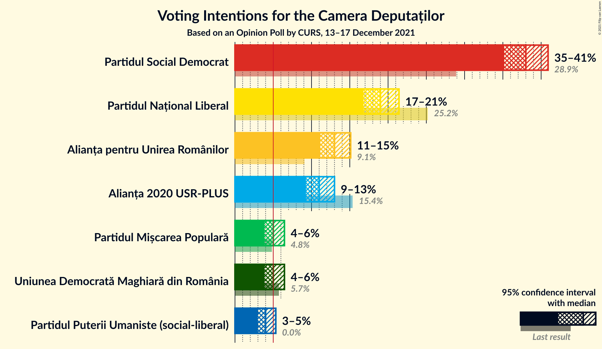

### Confidence Intervals

| Party | Last Result | Poll Result | 80% Confidence Interval | 90% Confidence Interval | 95% Confidence Interval | 99% Confidence Interval |
|:-----:|:-----------:|:-----------:|:-----------------------:|:-----------------------:|:-----------------------:|:-----------------------:|
| Partidul Social Democrat | 28.9% | 38.0% | 36.1–39.9% |35.6–40.5% |35.2–40.9% |34.3–41.8% |
| Partidul Național Liberal | 25.2% | 19.0% | 17.5–20.6% |17.1–21.0% |16.8–21.4% |16.1–22.2% |
| Alianța pentru Unirea Românilor | 9.1% | 13.0% | 11.8–14.4% |11.4–14.8% |11.1–15.1% |10.6–15.8% |
| Alianța 2020 USR-PLUS | 15.4% | 11.0% | 9.9–12.3% |9.6–12.7% |9.3–13.0% |8.8–13.6% |
| Uniunea Democrată Maghiară din România | 5.7% | 5.0% | 4.3–6.0% |4.0–6.2% |3.9–6.5% |3.5–7.0% |
| Partidul Mișcarea Populară | 4.8% | 5.0% | 4.3–6.0% |4.0–6.2% |3.9–6.5% |3.5–7.0% |
| Partidul Puterii Umaniste (social-liberal) | 0.0% | 4.0% | 3.3–4.9% |3.1–5.1% |3.0–5.3% |2.7–5.8% |

*Note:* The poll result column reflects the actual value used in the calculations. Published results may vary slightly, and in addition be rounded to fewer digits.

## Seats

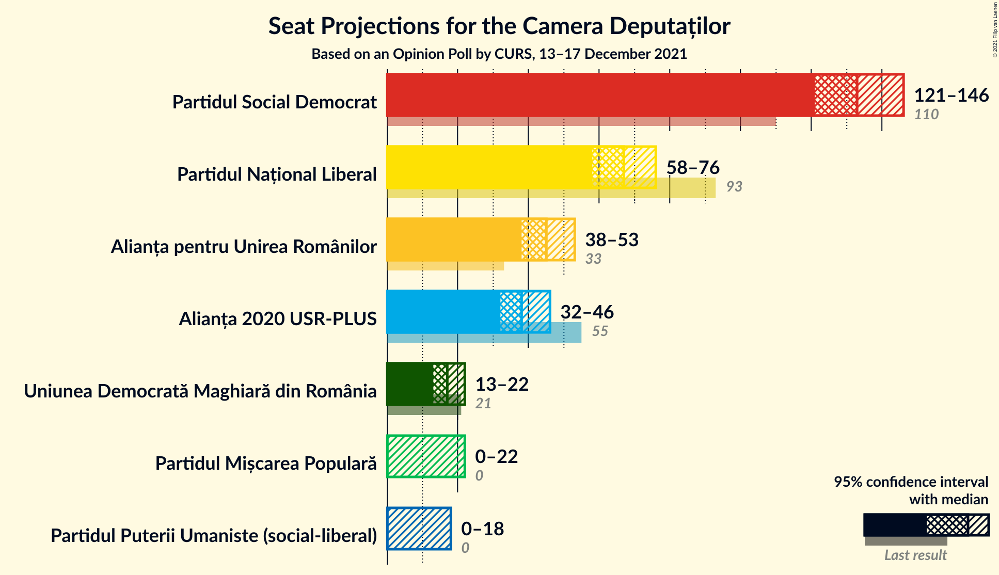

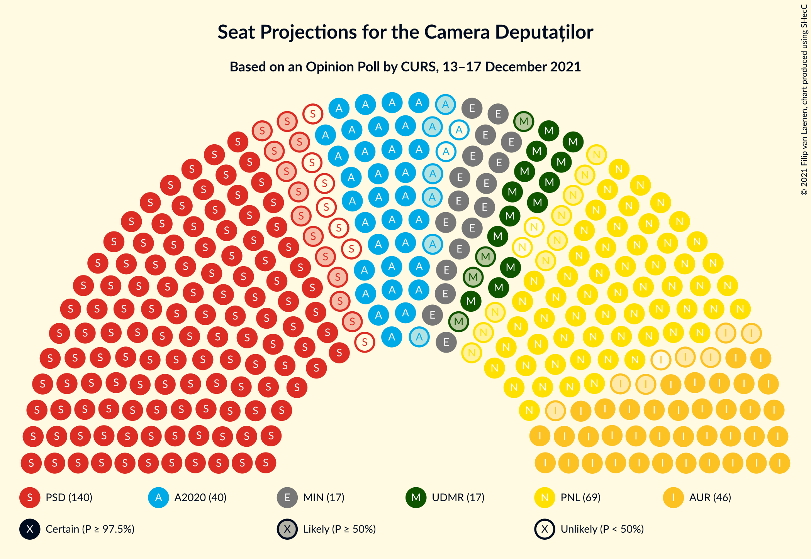

### Confidence Intervals

| Party | Last Result | Median | 80% Confidence Interval | 90% Confidence Interval | 95% Confidence Interval | 99% Confidence Interval |
|:-----:|:-----------:|:------:|:-----------------------:|:-----------------------:|:-----------------------:|:-----------------------:|
| <a href="#partidul-social-democrat">Partidul Social Democrat</a> | 110 | 133 | 125–142 |123–145 |121–146 |117–150 |
| <a href="#partidul-național-liberal">Partidul Național Liberal</a> | 93 | 67 | 60–73 |59–74 |58–76 |55–79 |
| <a href="#alianța-pentru-unirea-românilor">Alianța pentru Unirea Românilor</a> | 33 | 45 | 41–51 |39–52 |38–53 |36–56 |
| <a href="#alianța-2020-usr-plus">Alianța 2020 USR-PLUS</a> | 55 | 38 | 34–43 |33–45 |32–46 |30–48 |
| <a href="#uniunea-democrată-maghiară-din-românia">Uniunea Democrată Maghiară din România</a> | 21 | 17 | 14–21 |14–21 |13–22 |12–24 |
| <a href="#partidul-mișcarea-populară">Partidul Mișcarea Populară</a> | 0 | 0 | 0–20 |0–21 |0–22 |0–23 |
| <a href="#partidul-puterii-umaniste-(social-liberal)">Partidul Puterii Umaniste (social-liberal)</a> | 0 | 0 | 0 |0–17 |0–18 |0–19 |

### Partidul Social Democrat

*For a full overview of the results for this party, see the [Partidul Social Democrat](party-partidulsocialdemocrat.html) page.*

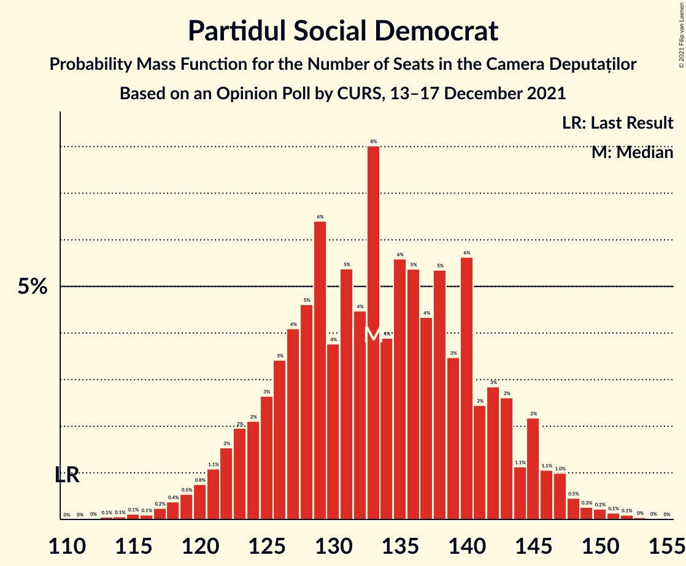

| Number of Seats | Probability | Accumulated | Special Marks |
|:---------------:|:-----------:|:-----------:|:-------------:|
| 110 | 0% | 100% | Last Result |
| 111 | 0% | 100% |  |
| 112 | 0% | 100% |  |
| 113 | 0.1% | 100% |  |
| 114 | 0.1% | 99.9% |  |
| 115 | 0.1% | 99.8% |  |
| 116 | 0.1% | 99.7% |  |
| 117 | 0.2% | 99.6% |  |
| 118 | 0.4% | 99.4% |  |
| 119 | 0.5% | 99.0% |  |
| 120 | 0.8% | 98% |  |
| 121 | 1.1% | 98% |  |
| 122 | 2% | 97% |  |
| 123 | 2% | 95% |  |
| 124 | 2% | 93% |  |
| 125 | 3% | 91% |  |
| 126 | 3% | 88% |  |
| 127 | 4% | 85% |  |
| 128 | 5% | 81% |  |
| 129 | 6% | 76% |  |
| 130 | 4% | 70% |  |
| 131 | 5% | 66% |  |
| 132 | 4% | 61% |  |
| 133 | 8% | 56% | Median |
| 134 | 4% | 48% |  |
| 135 | 6% | 44% |  |
| 136 | 5% | 39% |  |
| 137 | 4% | 33% |  |
| 138 | 5% | 29% |  |
| 139 | 3% | 24% |  |
| 140 | 6% | 20% |  |
| 141 | 2% | 15% |  |
| 142 | 3% | 12% |  |
| 143 | 3% | 9% |  |
| 144 | 1.1% | 7% |  |
| 145 | 2% | 6% |  |
| 146 | 1.1% | 3% |  |
| 147 | 1.0% | 2% |  |
| 148 | 0.5% | 1.3% |  |
| 149 | 0.3% | 0.8% |  |
| 150 | 0.2% | 0.6% |  |
| 151 | 0.1% | 0.3% |  |
| 152 | 0.1% | 0.2% |  |
| 153 | 0% | 0.1% |  |
| 154 | 0% | 0.1% |  |
| 155 | 0% | 0% |  |

### Partidul Național Liberal

*For a full overview of the results for this party, see the [Partidul Național Liberal](party-partidulnaționalliberal.html) page.*

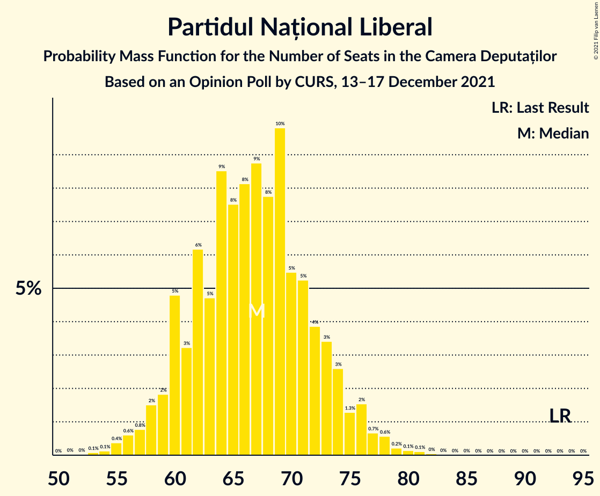

| Number of Seats | Probability | Accumulated | Special Marks |
|:---------------:|:-----------:|:-----------:|:-------------:|
| 52 | 0% | 100% |  |
| 53 | 0.1% | 99.9% |  |
| 54 | 0.1% | 99.9% |  |
| 55 | 0.4% | 99.7% |  |
| 56 | 0.6% | 99.4% |  |
| 57 | 0.8% | 98.7% |  |
| 58 | 2% | 98% |  |
| 59 | 2% | 96% |  |
| 60 | 5% | 95% |  |
| 61 | 3% | 90% |  |
| 62 | 6% | 87% |  |
| 63 | 5% | 80% |  |
| 64 | 9% | 76% |  |
| 65 | 8% | 67% |  |
| 66 | 8% | 60% |  |
| 67 | 9% | 52% | Median |
| 68 | 8% | 43% |  |
| 69 | 10% | 35% |  |
| 70 | 5% | 25% |  |
| 71 | 5% | 20% |  |
| 72 | 4% | 15% |  |
| 73 | 3% | 11% |  |
| 74 | 3% | 7% |  |
| 75 | 1.3% | 5% |  |
| 76 | 2% | 3% |  |
| 77 | 0.7% | 2% |  |
| 78 | 0.6% | 1.1% |  |
| 79 | 0.2% | 0.6% |  |
| 80 | 0.1% | 0.3% |  |
| 81 | 0.1% | 0.2% |  |
| 82 | 0% | 0.1% |  |
| 83 | 0% | 0% |  |
| 84 | 0% | 0% |  |
| 85 | 0% | 0% |  |
| 86 | 0% | 0% |  |
| 87 | 0% | 0% |  |
| 88 | 0% | 0% |  |
| 89 | 0% | 0% |  |
| 90 | 0% | 0% |  |
| 91 | 0% | 0% |  |
| 92 | 0% | 0% |  |
| 93 | 0% | 0% | Last Result |

### Alianța pentru Unirea Românilor

*For a full overview of the results for this party, see the [Alianța pentru Unirea Românilor](party-alianțapentruunirearomânilor.html) page.*

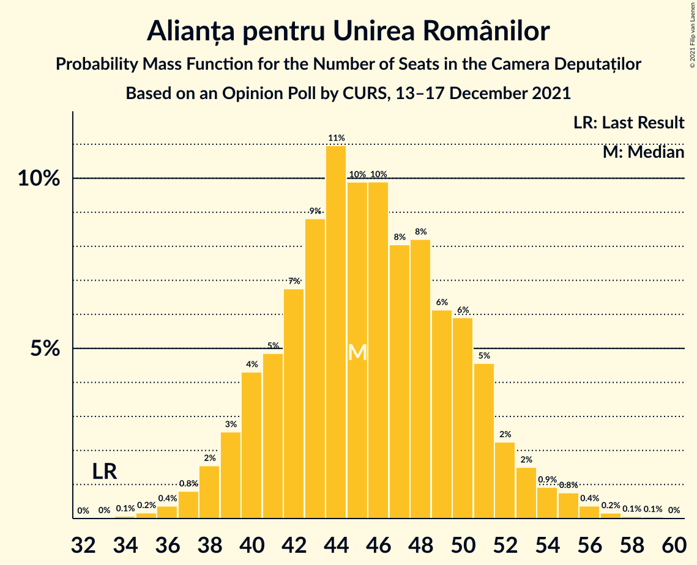

| Number of Seats | Probability | Accumulated | Special Marks |
|:---------------:|:-----------:|:-----------:|:-------------:|
| 33 | 0% | 100% | Last Result |
| 34 | 0.1% | 100% |  |
| 35 | 0.2% | 99.9% |  |
| 36 | 0.4% | 99.7% |  |
| 37 | 0.8% | 99.4% |  |
| 38 | 2% | 98.6% |  |
| 39 | 3% | 97% |  |
| 40 | 4% | 94% |  |
| 41 | 5% | 90% |  |
| 42 | 7% | 85% |  |
| 43 | 9% | 79% |  |
| 44 | 11% | 70% |  |
| 45 | 10% | 59% | Median |
| 46 | 10% | 49% |  |
| 47 | 8% | 39% |  |
| 48 | 8% | 31% |  |
| 49 | 6% | 23% |  |
| 50 | 6% | 17% |  |
| 51 | 5% | 11% |  |
| 52 | 2% | 6% |  |
| 53 | 2% | 4% |  |
| 54 | 0.9% | 2% |  |
| 55 | 0.8% | 1.4% |  |
| 56 | 0.4% | 0.7% |  |
| 57 | 0.2% | 0.3% |  |
| 58 | 0.1% | 0.1% |  |
| 59 | 0.1% | 0.1% |  |
| 60 | 0% | 0% |  |

### Alianța 2020 USR-PLUS

*For a full overview of the results for this party, see the [Alianța 2020 USR-PLUS](party-alianța2020usr-plus.html) page.*

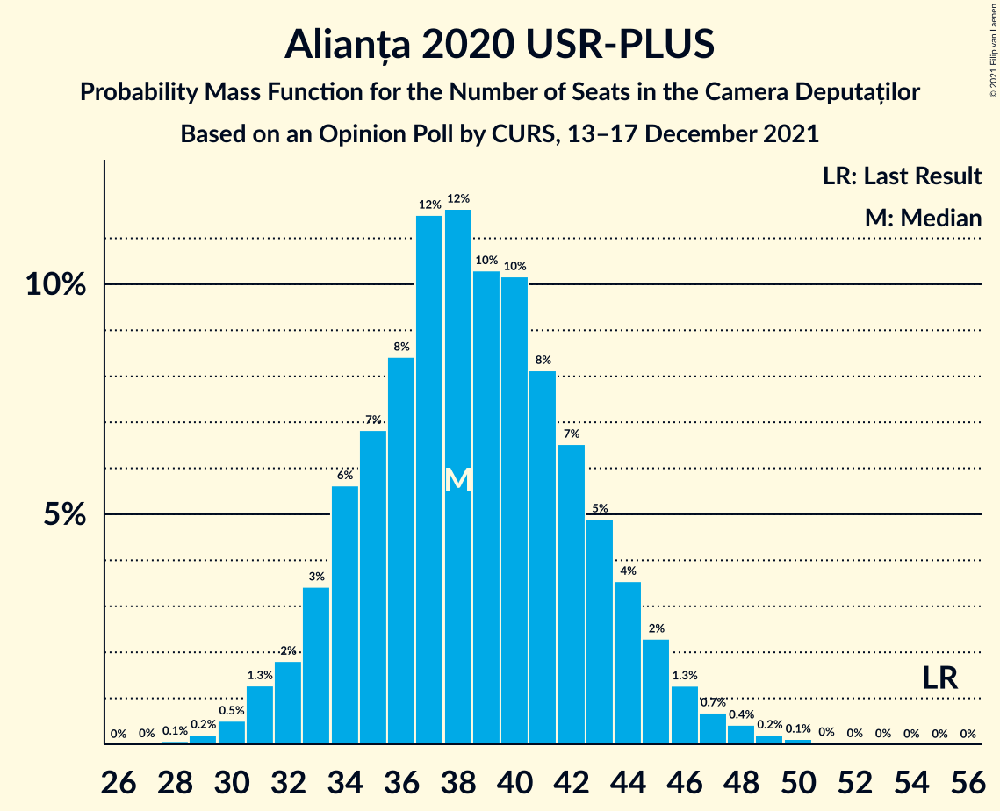

| Number of Seats | Probability | Accumulated | Special Marks |
|:---------------:|:-----------:|:-----------:|:-------------:|
| 28 | 0.1% | 100% |  |
| 29 | 0.2% | 99.9% |  |
| 30 | 0.5% | 99.7% |  |
| 31 | 1.3% | 99.2% |  |
| 32 | 2% | 98% |  |
| 33 | 3% | 96% |  |
| 34 | 6% | 93% |  |
| 35 | 7% | 87% |  |
| 36 | 8% | 80% |  |
| 37 | 12% | 72% |  |
| 38 | 12% | 60% | Median |
| 39 | 10% | 49% |  |
| 40 | 10% | 38% |  |
| 41 | 8% | 28% |  |
| 42 | 7% | 20% |  |
| 43 | 5% | 14% |  |
| 44 | 4% | 9% |  |
| 45 | 2% | 5% |  |
| 46 | 1.3% | 3% |  |
| 47 | 0.7% | 2% |  |
| 48 | 0.4% | 0.8% |  |
| 49 | 0.2% | 0.4% |  |
| 50 | 0.1% | 0.2% |  |
| 51 | 0% | 0.1% |  |
| 52 | 0% | 0% |  |
| 53 | 0% | 0% |  |
| 54 | 0% | 0% |  |
| 55 | 0% | 0% | Last Result |

### Uniunea Democrată Maghiară din România

*For a full overview of the results for this party, see the [Uniunea Democrată Maghiară din România](party-uniuneademocratămaghiarădinromânia.html) page.*

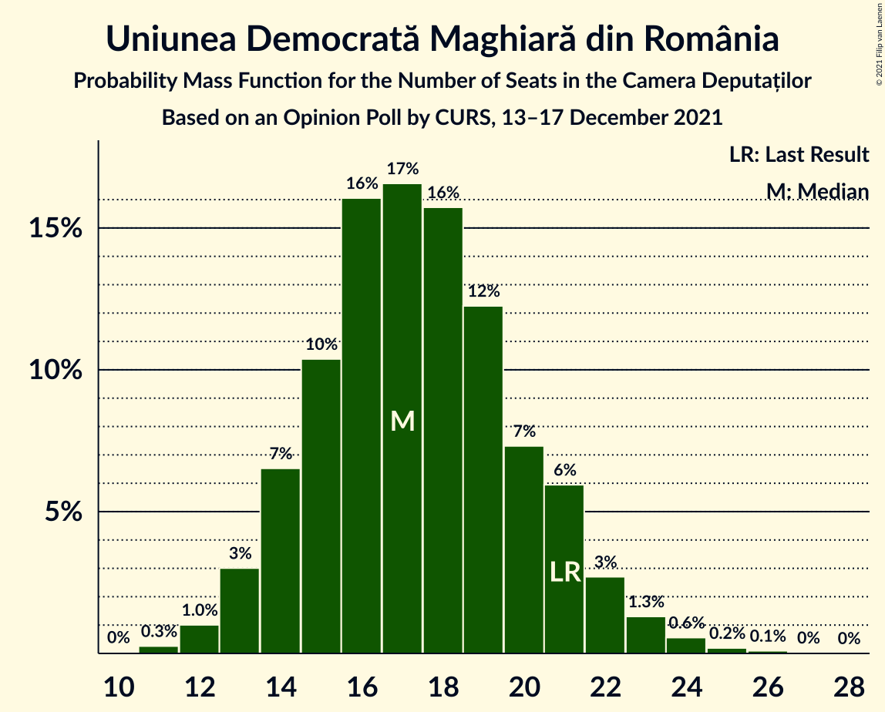

| Number of Seats | Probability | Accumulated | Special Marks |
|:---------------:|:-----------:|:-----------:|:-------------:|
| 10 | 0% | 100% |  |
| 11 | 0.3% | 99.9% |  |
| 12 | 1.0% | 99.7% |  |
| 13 | 3% | 98.7% |  |
| 14 | 7% | 96% |  |
| 15 | 10% | 89% |  |
| 16 | 16% | 79% |  |
| 17 | 17% | 63% | Median |
| 18 | 16% | 46% |  |
| 19 | 12% | 30% |  |
| 20 | 7% | 18% |  |
| 21 | 6% | 11% | Last Result |
| 22 | 3% | 5% |  |
| 23 | 1.3% | 2% |  |
| 24 | 0.6% | 0.9% |  |
| 25 | 0.2% | 0.3% |  |
| 26 | 0.1% | 0.1% |  |
| 27 | 0% | 0% |  |

### Partidul Mișcarea Populară

*For a full overview of the results for this party, see the [Partidul Mișcarea Populară](party-partidulmișcareapopulară.html) page.*

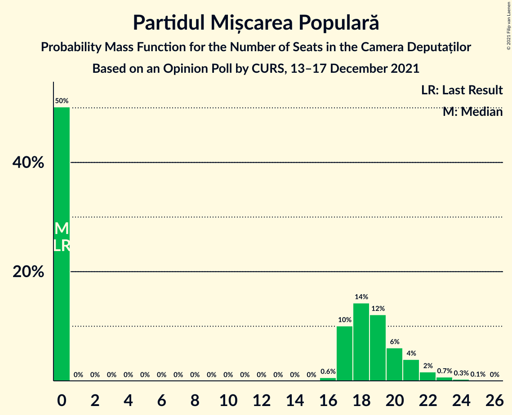

| Number of Seats | Probability | Accumulated | Special Marks |
|:---------------:|:-----------:|:-----------:|:-------------:|
| 0 | 50% | 100% | Last Result, Median |
| 1 | 0% | 50% |  |
| 2 | 0% | 50% |  |
| 3 | 0% | 50% |  |
| 4 | 0% | 50% |  |
| 5 | 0% | 50% |  |
| 6 | 0% | 50% |  |
| 7 | 0% | 50% |  |
| 8 | 0% | 50% |  |
| 9 | 0% | 50% |  |
| 10 | 0% | 50% |  |
| 11 | 0% | 50% |  |
| 12 | 0% | 50% |  |
| 13 | 0% | 50% |  |
| 14 | 0% | 50% |  |
| 15 | 0% | 50% |  |
| 16 | 0.6% | 50% |  |
| 17 | 10% | 49% |  |
| 18 | 14% | 39% |  |
| 19 | 12% | 25% |  |
| 20 | 6% | 13% |  |
| 21 | 4% | 7% |  |
| 22 | 2% | 3% |  |
| 23 | 0.7% | 1.1% |  |
| 24 | 0.3% | 0.4% |  |
| 25 | 0.1% | 0.1% |  |
| 26 | 0% | 0% |  |

### Partidul Puterii Umaniste (social-liberal)

*For a full overview of the results for this party, see the [Partidul Puterii Umaniste (social-liberal)](party-partidulputeriiumanistesocial-liberal.html) page.*

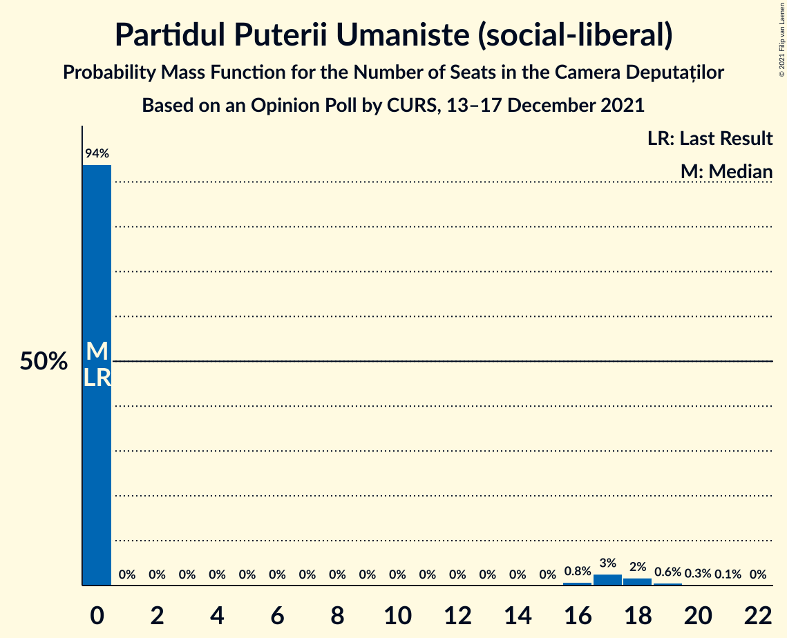

| Number of Seats | Probability | Accumulated | Special Marks |
|:---------------:|:-----------:|:-----------:|:-------------:|
| 0 | 94% | 100% | Last Result, Median |
| 1 | 0% | 6% |  |
| 2 | 0% | 6% |  |
| 3 | 0% | 6% |  |
| 4 | 0% | 6% |  |
| 5 | 0% | 6% |  |
| 6 | 0% | 6% |  |
| 7 | 0% | 6% |  |
| 8 | 0% | 6% |  |
| 9 | 0% | 6% |  |
| 10 | 0% | 6% |  |
| 11 | 0% | 6% |  |
| 12 | 0% | 6% |  |
| 13 | 0% | 6% |  |
| 14 | 0% | 6% |  |
| 15 | 0% | 6% |  |
| 16 | 0.8% | 6% |  |
| 17 | 3% | 5% |  |
| 18 | 2% | 3% |  |
| 19 | 0.6% | 1.0% |  |
| 20 | 0.3% | 0.4% |  |
| 21 | 0.1% | 0.1% |  |
| 22 | 0% | 0% |  |

## Coalitions

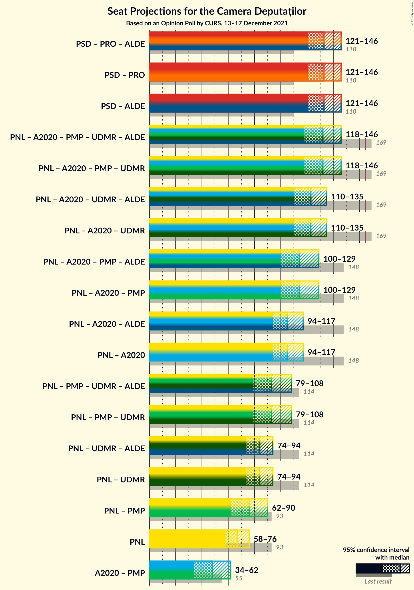

### Confidence Intervals

| Coalition | Last Result | Median | Majority? | 80% Confidence Interval | 90% Confidence Interval | 95% Confidence Interval | 99% Confidence Interval |
|:---------:|:-----------:|:------:|:---------:|:-----------------------:|:-----------------------:|:-----------------------:|:-----------------------:|
| Partidul Național Liberal – Alianța 2020 USR-PLUS – Partidul Mișcarea Populară – Uniunea Democrată Maghiară din România | 169 | 132 | 0% | 122–142 | 119–144 | 118–146 | 114–149 |
| Partidul Național Liberal – Alianța 2020 USR-PLUS – Uniunea Democrată Maghiară din România | 169 | 123 | 0% | 114–131 | 112–133 | 110–135 | 107–138 |
| Partidul Național Liberal – Alianța 2020 USR-PLUS – Partidul Mișcarea Populară | 148 | 114 | 0% | 104–125 | 102–127 | 100–129 | 97–132 |
| Partidul Național Liberal – Alianța 2020 USR-PLUS | 148 | 105 | 0% | 98–113 | 96–115 | 94–117 | 91–120 |
| Partidul Național Liberal – Partidul Mișcarea Populară – Uniunea Democrată Maghiară din România | 114 | 93 | 0% | 82–104 | 81–106 | 79–108 | 76–111 |
| Partidul Național Liberal – Uniunea Democrată Maghiară din România | 114 | 84 | 0% | 77–91 | 76–93 | 74–94 | 71–98 |
| Partidul Național Liberal – Partidul Mișcarea Populară | 93 | 76 | 0% | 65–87 | 63–89 | 62–90 | 59–94 |
| Partidul Național Liberal | 93 | 67 | 0% | 60–73 | 59–74 | 58–76 | 55–79 |
| Alianța 2020 USR-PLUS – Partidul Mișcarea Populară | 55 | 48 | 0% | 37–59 | 35–61 | 34–62 | 32–65 |

### Partidul Național Liberal – Alianța 2020 USR-PLUS – Partidul Mișcarea Populară – Uniunea Democrată Maghiară din România

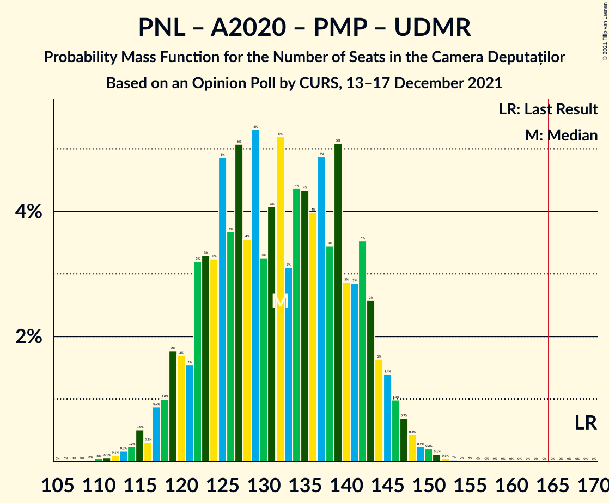

| Number of Seats | Probability | Accumulated | Special Marks |
|:---------------:|:-----------:|:-----------:|:-------------:|
| 109 | 0% | 100% |  |
| 110 | 0% | 99.9% |  |
| 111 | 0.1% | 99.9% |  |
| 112 | 0.1% | 99.8% |  |
| 113 | 0.2% | 99.7% |  |
| 114 | 0.2% | 99.6% |  |
| 115 | 0.5% | 99.3% |  |
| 116 | 0.3% | 98.8% |  |
| 117 | 0.9% | 98% |  |
| 118 | 1.0% | 98% |  |
| 119 | 2% | 97% |  |
| 120 | 2% | 95% |  |
| 121 | 2% | 93% |  |
| 122 | 3% | 92% | Median |
| 123 | 3% | 88% |  |
| 124 | 3% | 85% |  |
| 125 | 5% | 82% |  |
| 126 | 4% | 77% |  |
| 127 | 5% | 73% |  |
| 128 | 4% | 68% |  |
| 129 | 5% | 65% |  |
| 130 | 3% | 59% |  |
| 131 | 4% | 56% |  |
| 132 | 5% | 52% |  |
| 133 | 3% | 47% |  |
| 134 | 4% | 44% |  |
| 135 | 4% | 39% |  |
| 136 | 4% | 35% |  |
| 137 | 5% | 31% |  |
| 138 | 3% | 26% |  |
| 139 | 5% | 23% |  |
| 140 | 3% | 18% |  |
| 141 | 3% | 15% |  |
| 142 | 4% | 12% |  |
| 143 | 3% | 8% |  |
| 144 | 2% | 6% |  |
| 145 | 1.4% | 4% |  |
| 146 | 1.0% | 3% |  |
| 147 | 0.7% | 2% |  |
| 148 | 0.4% | 1.1% |  |
| 149 | 0.2% | 0.7% |  |
| 150 | 0.2% | 0.4% |  |
| 151 | 0.1% | 0.2% |  |
| 152 | 0.1% | 0.1% |  |
| 153 | 0% | 0.1% |  |
| 154 | 0% | 0% |  |
| 155 | 0% | 0% |  |
| 156 | 0% | 0% |  |
| 157 | 0% | 0% |  |
| 158 | 0% | 0% |  |
| 159 | 0% | 0% |  |
| 160 | 0% | 0% |  |
| 161 | 0% | 0% |  |
| 162 | 0% | 0% |  |
| 163 | 0% | 0% |  |
| 164 | 0% | 0% |  |
| 165 | 0% | 0% | Majority |
| 166 | 0% | 0% |  |
| 167 | 0% | 0% |  |
| 168 | 0% | 0% |  |
| 169 | 0% | 0% | Last Result |

### Partidul Național Liberal – Alianța 2020 USR-PLUS – Uniunea Democrată Maghiară din România

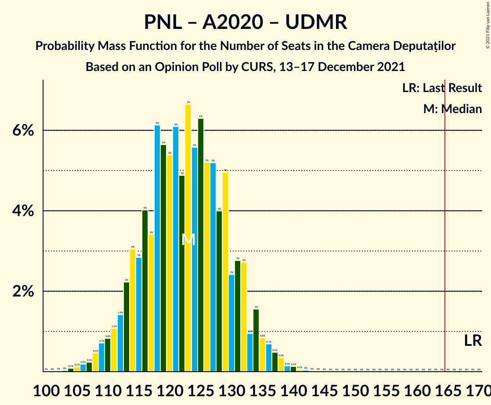

| Number of Seats | Probability | Accumulated | Special Marks |
|:---------------:|:-----------:|:-----------:|:-------------:|
| 102 | 0% | 100% |  |
| 103 | 0% | 99.9% |  |
| 104 | 0.1% | 99.9% |  |
| 105 | 0.1% | 99.8% |  |
| 106 | 0.2% | 99.7% |  |
| 107 | 0.2% | 99.5% |  |
| 108 | 0.5% | 99.3% |  |
| 109 | 0.7% | 98.8% |  |
| 110 | 0.8% | 98% |  |
| 111 | 1.1% | 97% |  |
| 112 | 1.4% | 96% |  |
| 113 | 2% | 95% |  |
| 114 | 3% | 93% |  |
| 115 | 3% | 89% |  |
| 116 | 4% | 87% |  |
| 117 | 3% | 83% |  |
| 118 | 6% | 79% |  |
| 119 | 6% | 73% |  |
| 120 | 5% | 67% |  |
| 121 | 6% | 62% |  |
| 122 | 5% | 56% | Median |
| 123 | 7% | 51% |  |
| 124 | 6% | 44% |  |
| 125 | 6% | 39% |  |
| 126 | 5% | 33% |  |
| 127 | 5% | 27% |  |
| 128 | 4% | 22% |  |
| 129 | 5% | 18% |  |
| 130 | 2% | 13% |  |
| 131 | 3% | 11% |  |
| 132 | 3% | 8% |  |
| 133 | 1.0% | 5% |  |
| 134 | 2% | 4% |  |
| 135 | 0.8% | 3% |  |
| 136 | 0.7% | 2% |  |
| 137 | 0.5% | 1.3% |  |
| 138 | 0.4% | 0.8% |  |
| 139 | 0.1% | 0.4% |  |
| 140 | 0.1% | 0.3% |  |
| 141 | 0.1% | 0.1% |  |
| 142 | 0% | 0.1% |  |
| 143 | 0% | 0% |  |
| 144 | 0% | 0% |  |
| 145 | 0% | 0% |  |
| 146 | 0% | 0% |  |
| 147 | 0% | 0% |  |
| 148 | 0% | 0% |  |
| 149 | 0% | 0% |  |
| 150 | 0% | 0% |  |
| 151 | 0% | 0% |  |
| 152 | 0% | 0% |  |
| 153 | 0% | 0% |  |
| 154 | 0% | 0% |  |
| 155 | 0% | 0% |  |
| 156 | 0% | 0% |  |
| 157 | 0% | 0% |  |
| 158 | 0% | 0% |  |
| 159 | 0% | 0% |  |
| 160 | 0% | 0% |  |
| 161 | 0% | 0% |  |
| 162 | 0% | 0% |  |
| 163 | 0% | 0% |  |
| 164 | 0% | 0% |  |
| 165 | 0% | 0% | Majority |
| 166 | 0% | 0% |  |
| 167 | 0% | 0% |  |
| 168 | 0% | 0% |  |
| 169 | 0% | 0% | Last Result |

### Partidul Național Liberal – Alianța 2020 USR-PLUS – Partidul Mișcarea Populară

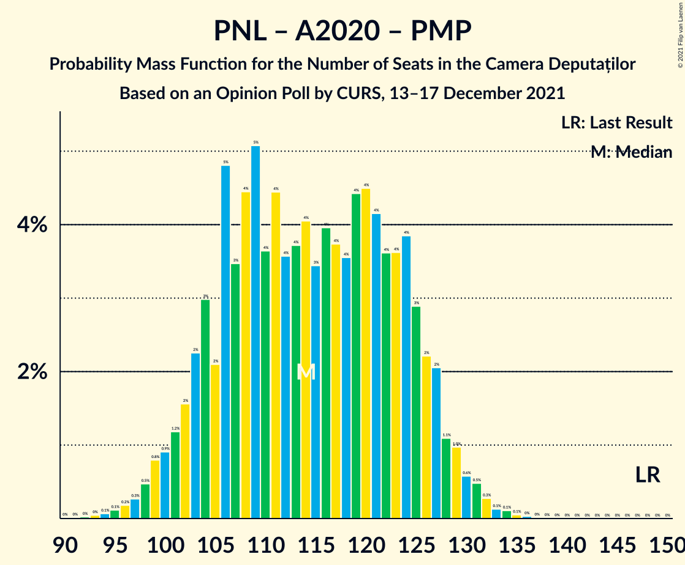

| Number of Seats | Probability | Accumulated | Special Marks |
|:---------------:|:-----------:|:-----------:|:-------------:|
| 92 | 0% | 100% |  |
| 93 | 0% | 99.9% |  |
| 94 | 0.1% | 99.9% |  |
| 95 | 0.1% | 99.8% |  |
| 96 | 0.2% | 99.7% |  |
| 97 | 0.3% | 99.5% |  |
| 98 | 0.5% | 99.3% |  |
| 99 | 0.8% | 98.8% |  |
| 100 | 0.9% | 98% |  |
| 101 | 1.2% | 97% |  |
| 102 | 2% | 96% |  |
| 103 | 2% | 94% |  |
| 104 | 3% | 92% |  |
| 105 | 2% | 89% | Median |
| 106 | 5% | 87% |  |
| 107 | 3% | 82% |  |
| 108 | 4% | 79% |  |
| 109 | 5% | 74% |  |
| 110 | 4% | 69% |  |
| 111 | 4% | 66% |  |
| 112 | 4% | 61% |  |
| 113 | 4% | 58% |  |
| 114 | 4% | 54% |  |
| 115 | 3% | 50% |  |
| 116 | 4% | 46% |  |
| 117 | 4% | 42% |  |
| 118 | 4% | 39% |  |
| 119 | 4% | 35% |  |
| 120 | 4% | 31% |  |
| 121 | 4% | 26% |  |
| 122 | 4% | 22% |  |
| 123 | 4% | 18% |  |
| 124 | 4% | 15% |  |
| 125 | 3% | 11% |  |
| 126 | 2% | 8% |  |
| 127 | 2% | 6% |  |
| 128 | 1.1% | 4% |  |
| 129 | 1.0% | 3% |  |
| 130 | 0.6% | 2% |  |
| 131 | 0.5% | 1.1% |  |
| 132 | 0.3% | 0.6% |  |
| 133 | 0.1% | 0.3% |  |
| 134 | 0.1% | 0.2% |  |
| 135 | 0.1% | 0.1% |  |
| 136 | 0% | 0.1% |  |
| 137 | 0% | 0% |  |
| 138 | 0% | 0% |  |
| 139 | 0% | 0% |  |
| 140 | 0% | 0% |  |
| 141 | 0% | 0% |  |
| 142 | 0% | 0% |  |
| 143 | 0% | 0% |  |
| 144 | 0% | 0% |  |
| 145 | 0% | 0% |  |
| 146 | 0% | 0% |  |
| 147 | 0% | 0% |  |
| 148 | 0% | 0% | Last Result |

### Partidul Național Liberal – Alianța 2020 USR-PLUS

| Number of Seats | Probability | Accumulated | Special Marks |
|:---------------:|:-----------:|:-----------:|:-------------:|
| 86 | 0% | 100% |  |
| 87 | 0% | 99.9% |  |
| 88 | 0.1% | 99.9% |  |
| 89 | 0.1% | 99.8% |  |
| 90 | 0.2% | 99.7% |  |
| 91 | 0.3% | 99.5% |  |
| 92 | 0.6% | 99.2% |  |
| 93 | 0.7% | 98.6% |  |
| 94 | 1.1% | 98% |  |
| 95 | 2% | 97% |  |
| 96 | 2% | 95% |  |
| 97 | 3% | 94% |  |
| 98 | 4% | 90% |  |
| 99 | 4% | 87% |  |
| 100 | 4% | 83% |  |
| 101 | 5% | 78% |  |
| 102 | 6% | 73% |  |
| 103 | 6% | 67% |  |
| 104 | 8% | 61% |  |
| 105 | 5% | 54% | Median |
| 106 | 7% | 48% |  |
| 107 | 6% | 41% |  |
| 108 | 6% | 35% |  |
| 109 | 7% | 29% |  |
| 110 | 4% | 22% |  |
| 111 | 5% | 18% |  |
| 112 | 3% | 14% |  |
| 113 | 3% | 11% |  |
| 114 | 2% | 8% |  |
| 115 | 2% | 6% |  |
| 116 | 1.4% | 4% |  |
| 117 | 0.7% | 3% |  |
| 118 | 0.7% | 2% |  |
| 119 | 0.5% | 1.2% |  |
| 120 | 0.3% | 0.7% |  |
| 121 | 0.2% | 0.4% |  |
| 122 | 0.1% | 0.2% |  |
| 123 | 0.1% | 0.1% |  |
| 124 | 0% | 0.1% |  |
| 125 | 0% | 0% |  |
| 126 | 0% | 0% |  |
| 127 | 0% | 0% |  |
| 128 | 0% | 0% |  |
| 129 | 0% | 0% |  |
| 130 | 0% | 0% |  |
| 131 | 0% | 0% |  |
| 132 | 0% | 0% |  |
| 133 | 0% | 0% |  |
| 134 | 0% | 0% |  |
| 135 | 0% | 0% |  |
| 136 | 0% | 0% |  |
| 137 | 0% | 0% |  |
| 138 | 0% | 0% |  |
| 139 | 0% | 0% |  |
| 140 | 0% | 0% |  |
| 141 | 0% | 0% |  |
| 142 | 0% | 0% |  |
| 143 | 0% | 0% |  |
| 144 | 0% | 0% |  |
| 145 | 0% | 0% |  |
| 146 | 0% | 0% |  |
| 147 | 0% | 0% |  |
| 148 | 0% | 0% | Last Result |

### Partidul Național Liberal – Partidul Mișcarea Populară – Uniunea Democrată Maghiară din România

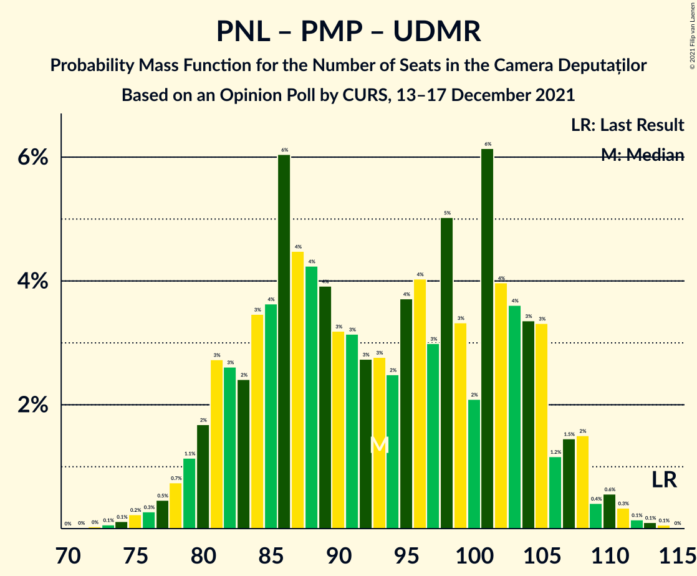

| Number of Seats | Probability | Accumulated | Special Marks |
|:---------------:|:-----------:|:-----------:|:-------------:|
| 72 | 0% | 100% |  |
| 73 | 0.1% | 99.9% |  |
| 74 | 0.1% | 99.9% |  |
| 75 | 0.2% | 99.8% |  |
| 76 | 0.3% | 99.5% |  |
| 77 | 0.5% | 99.3% |  |
| 78 | 0.7% | 98.8% |  |
| 79 | 1.1% | 98% |  |
| 80 | 2% | 97% |  |
| 81 | 3% | 95% |  |
| 82 | 3% | 92% |  |
| 83 | 2% | 90% |  |
| 84 | 3% | 87% | Median |
| 85 | 4% | 84% |  |
| 86 | 6% | 80% |  |
| 87 | 4% | 74% |  |
| 88 | 4% | 70% |  |
| 89 | 4% | 66% |  |
| 90 | 3% | 62% |  |
| 91 | 3% | 58% |  |
| 92 | 3% | 55% |  |
| 93 | 3% | 53% |  |
| 94 | 2% | 50% |  |
| 95 | 4% | 47% |  |
| 96 | 4% | 44% |  |
| 97 | 3% | 40% |  |
| 98 | 5% | 37% |  |
| 99 | 3% | 32% |  |
| 100 | 2% | 28% |  |
| 101 | 6% | 26% |  |
| 102 | 4% | 20% |  |
| 103 | 4% | 16% |  |
| 104 | 3% | 12% |  |
| 105 | 3% | 9% |  |
| 106 | 1.2% | 6% |  |
| 107 | 1.5% | 5% |  |
| 108 | 2% | 3% |  |
| 109 | 0.4% | 2% |  |
| 110 | 0.6% | 1.2% |  |
| 111 | 0.3% | 0.7% |  |
| 112 | 0.1% | 0.4% |  |
| 113 | 0.1% | 0.2% |  |
| 114 | 0.1% | 0.1% | Last Result |
| 115 | 0% | 0% |  |

### Partidul Național Liberal – Uniunea Democrată Maghiară din România

| Number of Seats | Probability | Accumulated | Special Marks |
|:---------------:|:-----------:|:-----------:|:-------------:|
| 68 | 0% | 100% |  |
| 69 | 0.1% | 99.9% |  |
| 70 | 0.2% | 99.8% |  |
| 71 | 0.3% | 99.7% |  |
| 72 | 0.5% | 99.4% |  |
| 73 | 0.9% | 98.8% |  |
| 74 | 1.0% | 98% |  |
| 75 | 2% | 97% |  |
| 76 | 2% | 95% |  |
| 77 | 4% | 93% |  |
| 78 | 4% | 89% |  |
| 79 | 5% | 85% |  |
| 80 | 6% | 80% |  |
| 81 | 7% | 74% |  |
| 82 | 7% | 68% |  |
| 83 | 6% | 61% |  |
| 84 | 7% | 55% | Median |
| 85 | 7% | 47% |  |
| 86 | 8% | 40% |  |
| 87 | 7% | 31% |  |
| 88 | 5% | 24% |  |
| 89 | 5% | 19% |  |
| 90 | 4% | 14% |  |
| 91 | 3% | 11% |  |
| 92 | 2% | 8% |  |
| 93 | 2% | 6% |  |
| 94 | 2% | 4% |  |
| 95 | 0.9% | 2% |  |
| 96 | 0.4% | 1.3% |  |
| 97 | 0.4% | 0.9% |  |
| 98 | 0.2% | 0.5% |  |
| 99 | 0.2% | 0.3% |  |
| 100 | 0.1% | 0.2% |  |
| 101 | 0% | 0.1% |  |
| 102 | 0% | 0% |  |
| 103 | 0% | 0% |  |
| 104 | 0% | 0% |  |
| 105 | 0% | 0% |  |
| 106 | 0% | 0% |  |
| 107 | 0% | 0% |  |
| 108 | 0% | 0% |  |
| 109 | 0% | 0% |  |
| 110 | 0% | 0% |  |
| 111 | 0% | 0% |  |
| 112 | 0% | 0% |  |
| 113 | 0% | 0% |  |
| 114 | 0% | 0% | Last Result |

### Partidul Național Liberal – Partidul Mișcarea Populară

| Number of Seats | Probability | Accumulated | Special Marks |
|:---------------:|:-----------:|:-----------:|:-------------:|
| 56 | 0.1% | 100% |  |
| 57 | 0.1% | 99.9% |  |
| 58 | 0.2% | 99.8% |  |
| 59 | 0.4% | 99.6% |  |
| 60 | 0.7% | 99.2% |  |
| 61 | 0.7% | 98.5% |  |
| 62 | 1.0% | 98% |  |
| 63 | 2% | 97% |  |
| 64 | 2% | 95% |  |
| 65 | 4% | 92% |  |
| 66 | 2% | 88% |  |
| 67 | 5% | 86% | Median |
| 68 | 4% | 80% |  |
| 69 | 7% | 76% |  |
| 70 | 4% | 69% |  |
| 71 | 3% | 66% |  |
| 72 | 3% | 62% |  |
| 73 | 3% | 59% |  |
| 74 | 3% | 56% |  |
| 75 | 2% | 53% |  |
| 76 | 2% | 51% |  |
| 77 | 3% | 49% |  |
| 78 | 3% | 46% |  |
| 79 | 3% | 44% |  |
| 80 | 3% | 40% |  |
| 81 | 3% | 37% |  |
| 82 | 6% | 35% |  |
| 83 | 3% | 28% |  |
| 84 | 4% | 25% |  |
| 85 | 6% | 21% |  |
| 86 | 4% | 15% |  |
| 87 | 3% | 11% |  |
| 88 | 2% | 8% |  |
| 89 | 2% | 6% |  |
| 90 | 1.4% | 4% |  |
| 91 | 1.0% | 2% |  |
| 92 | 0.5% | 1.4% |  |
| 93 | 0.3% | 0.9% | Last Result |
| 94 | 0.3% | 0.6% |  |
| 95 | 0.1% | 0.3% |  |
| 96 | 0.1% | 0.1% |  |
| 97 | 0% | 0.1% |  |
| 98 | 0% | 0% |  |

### Partidul Național Liberal

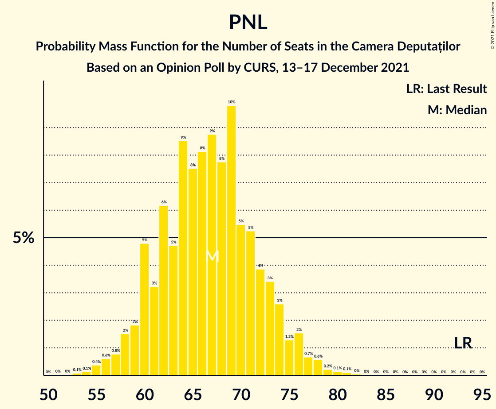

| Number of Seats | Probability | Accumulated | Special Marks |
|:---------------:|:-----------:|:-----------:|:-------------:|
| 52 | 0% | 100% |  |
| 53 | 0.1% | 99.9% |  |
| 54 | 0.1% | 99.9% |  |
| 55 | 0.4% | 99.7% |  |
| 56 | 0.6% | 99.4% |  |
| 57 | 0.8% | 98.7% |  |
| 58 | 2% | 98% |  |
| 59 | 2% | 96% |  |
| 60 | 5% | 95% |  |
| 61 | 3% | 90% |  |
| 62 | 6% | 87% |  |
| 63 | 5% | 80% |  |
| 64 | 9% | 76% |  |
| 65 | 8% | 67% |  |
| 66 | 8% | 60% |  |
| 67 | 9% | 52% | Median |
| 68 | 8% | 43% |  |
| 69 | 10% | 35% |  |
| 70 | 5% | 25% |  |
| 71 | 5% | 20% |  |
| 72 | 4% | 15% |  |
| 73 | 3% | 11% |  |
| 74 | 3% | 7% |  |
| 75 | 1.3% | 5% |  |
| 76 | 2% | 3% |  |
| 77 | 0.7% | 2% |  |
| 78 | 0.6% | 1.1% |  |
| 79 | 0.2% | 0.6% |  |
| 80 | 0.1% | 0.3% |  |
| 81 | 0.1% | 0.2% |  |
| 82 | 0% | 0.1% |  |
| 83 | 0% | 0% |  |
| 84 | 0% | 0% |  |
| 85 | 0% | 0% |  |
| 86 | 0% | 0% |  |
| 87 | 0% | 0% |  |
| 88 | 0% | 0% |  |
| 89 | 0% | 0% |  |
| 90 | 0% | 0% |  |
| 91 | 0% | 0% |  |
| 92 | 0% | 0% |  |
| 93 | 0% | 0% | Last Result |

### Alianța 2020 USR-PLUS – Partidul Mișcarea Populară

| Number of Seats | Probability | Accumulated | Special Marks |
|:---------------:|:-----------:|:-----------:|:-------------:|
| 29 | 0% | 100% |  |
| 30 | 0.1% | 99.9% |  |
| 31 | 0.3% | 99.9% |  |
| 32 | 0.4% | 99.6% |  |
| 33 | 0.7% | 99.2% |  |
| 34 | 2% | 98.5% |  |
| 35 | 2% | 97% |  |
| 36 | 3% | 95% |  |
| 37 | 5% | 91% |  |
| 38 | 5% | 87% | Median |
| 39 | 6% | 82% |  |
| 40 | 6% | 76% |  |
| 41 | 5% | 70% |  |
| 42 | 4% | 65% |  |
| 43 | 4% | 61% |  |
| 44 | 3% | 57% |  |
| 45 | 2% | 54% |  |
| 46 | 1.1% | 52% |  |
| 47 | 0.8% | 51% |  |
| 48 | 0.7% | 50% |  |
| 49 | 1.0% | 50% |  |
| 50 | 1.3% | 49% |  |
| 51 | 2% | 47% |  |
| 52 | 3% | 45% |  |
| 53 | 4% | 42% |  |
| 54 | 5% | 38% |  |
| 55 | 5% | 33% | Last Result |
| 56 | 6% | 28% |  |
| 57 | 6% | 22% |  |
| 58 | 4% | 16% |  |
| 59 | 4% | 12% |  |
| 60 | 3% | 8% |  |
| 61 | 3% | 6% |  |
| 62 | 1.1% | 3% |  |
| 63 | 0.9% | 2% |  |
| 64 | 0.4% | 1.0% |  |
| 65 | 0.3% | 0.6% |  |
| 66 | 0.1% | 0.3% |  |
| 67 | 0.1% | 0.1% |  |
| 68 | 0% | 0.1% |  |
| 69 | 0% | 0% |  |

## Technical Information

### Opinion Poll

+ **Polling firm:** CURS
+ **Commissioner(s):** —
+ **Fieldwork period:** 13–17 December 2021

### Calculations

+ **Sample size:** 1100
+ **Simulations done:** 1,048,576
+ **Error estimate:** 0.90%

