# Opinion Poll by INSCOP, 10–18 January 2022

<a href="#voting-intentions">Voting Intentions</a> | <a href="#seats">Seats</a> | <a href="#coalitions">Coalitions</a> | <a href="#technical-information">Technical Information</a>

## Voting Intentions

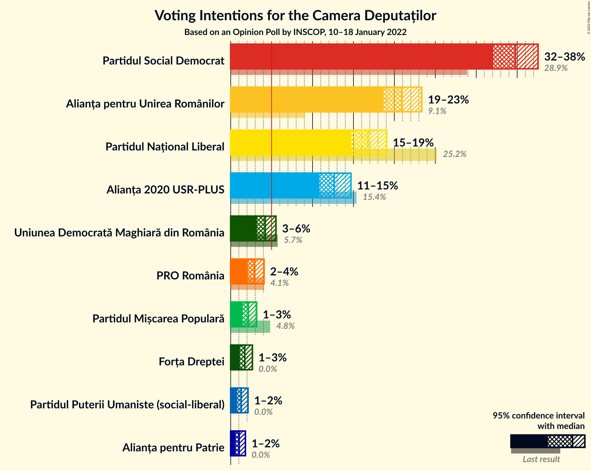

### Confidence Intervals

| Party | Last Result | Poll Result | 80% Confidence Interval | 90% Confidence Interval | 95% Confidence Interval | 99% Confidence Interval |
|:-----:|:-----------:|:-----------:|:-----------------------:|:-----------------------:|:-----------------------:|:-----------------------:|
| Partidul Social Democrat | 28.9% | 34.8% | 33.0–36.6% |32.5–37.1% |32.1–37.6% |31.2–38.4% |
| Alianța pentru Unirea Românilor | 9.1% | 20.9% | 19.4–22.5% |19.0–23.0% |18.7–23.4% |18.0–24.1% |
| Partidul Național Liberal | 25.2% | 16.8% | 15.4–18.3% |15.1–18.7% |14.7–19.1% |14.1–19.8% |
| Alianța 2020 USR-PLUS | 15.4% | 12.7% | 11.5–14.0% |11.1–14.4% |10.9–14.7% |10.3–15.3% |
| Uniunea Democrată Maghiară din România | 5.7% | 4.2% | 3.6–5.1% |3.4–5.3% |3.2–5.5% |2.9–6.0% |
| PRO România | 4.1% | 2.9% | 2.4–3.7% |2.2–3.9% |2.1–4.1% |1.9–4.5% |
| Partidul Mișcarea Populară | 4.8% | 2.2% | 1.7–2.8% |1.6–3.0% |1.5–3.2% |1.3–3.5% |
| Forța Dreptei | 0.0% | 1.7% | 1.3–2.3% |1.2–2.5% |1.1–2.7% |0.9–3.0% |
| Partidul Puterii Umaniste (social-liberal) | 0.0% | 1.3% | 0.9–1.8% |0.9–2.0% |0.8–2.1% |0.6–2.4% |
| Alianța pentru Patrie | 0.0% | 1.0% | 0.7–1.5% |0.7–1.7% |0.6–1.8% |0.5–2.1% |

*Note:* The poll result column reflects the actual value used in the calculations. Published results may vary slightly, and in addition be rounded to fewer digits.

## Seats

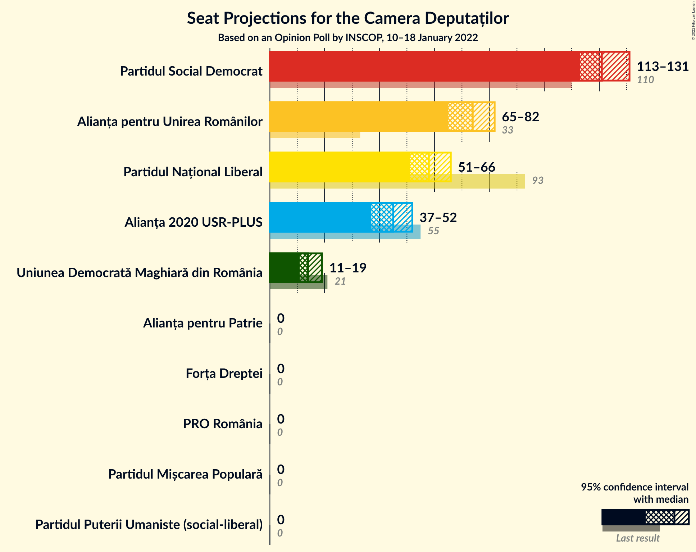

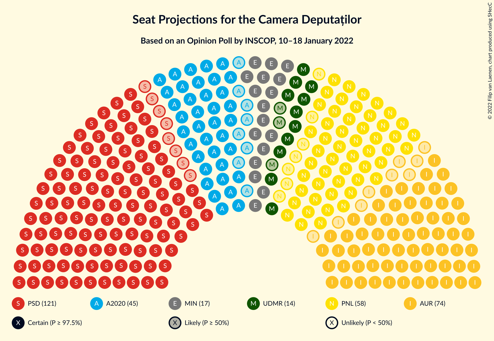

### Confidence Intervals

| Party | Last Result | Median | 80% Confidence Interval | 90% Confidence Interval | 95% Confidence Interval | 99% Confidence Interval |
|:-----:|:-----------:|:------:|:-----------------------:|:-----------------------:|:-----------------------:|:-----------------------:|
| <a href="#partidul-social-democrat">Partidul Social Democrat</a> | 110 | 121 | 116–127 |114–129 |113–131 |109–133 |
| <a href="#alianța-pentru-unirea-românilor">Alianța pentru Unirea Românilor</a> | 33 | 74 | 68–77 |65–80 |65–82 |62–84 |
| <a href="#partidul-național-liberal">Partidul Național Liberal</a> | 93 | 58 | 54–63 |53–64 |51–66 |49–69 |
| <a href="#alianța-2020-usr-plus">Alianța 2020 USR-PLUS</a> | 55 | 45 | 40–50 |38–51 |37–52 |35–55 |
| <a href="#uniunea-democrată-maghiară-din-românia">Uniunea Democrată Maghiară din România</a> | 21 | 14 | 12–17 |11–19 |11–19 |10–21 |
| <a href="#pro-românia">PRO România</a> | 0 | 0 | 0 |0 |0 |0 |
| <a href="#partidul-mișcarea-populară">Partidul Mișcarea Populară</a> | 0 | 0 | 0 |0 |0 |0 |
| <a href="#forța-dreptei">Forța Dreptei</a> | 0 | 0 | 0 |0 |0 |0 |
| <a href="#partidul-puterii-umaniste-(social-liberal)">Partidul Puterii Umaniste (social-liberal)</a> | 0 | 0 | 0 |0 |0 |0 |
| <a href="#alianța-pentru-patrie">Alianța pentru Patrie</a> | 0 | 0 | 0 |0 |0 |0 |

### Partidul Social Democrat

*For a full overview of the results for this party, see the [Partidul Social Democrat](party-partidulsocialdemocrat.html) page.*

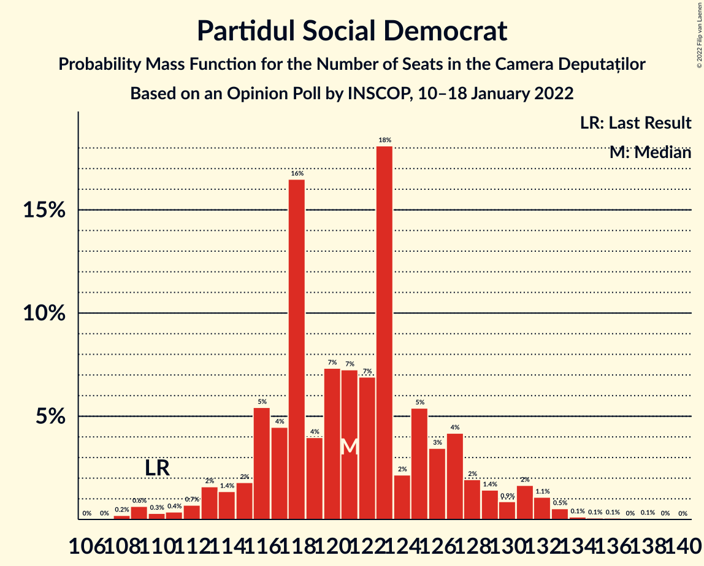

| Number of Seats | Probability | Accumulated | Special Marks |
|:---------------:|:-----------:|:-----------:|:-------------:|
| 107 | 0% | 100% |  |
| 108 | 0.2% | 99.9% |  |
| 109 | 0.6% | 99.7% |  |
| 110 | 0.3% | 99.1% | Last Result |
| 111 | 0.4% | 98.8% |  |
| 112 | 0.7% | 98% |  |
| 113 | 2% | 98% |  |
| 114 | 1.4% | 96% |  |
| 115 | 2% | 95% |  |
| 116 | 5% | 93% |  |
| 117 | 4% | 88% |  |
| 118 | 16% | 83% |  |
| 119 | 4% | 67% |  |
| 120 | 7% | 63% |  |
| 121 | 7% | 55% | Median |
| 122 | 7% | 48% |  |
| 123 | 18% | 41% |  |
| 124 | 2% | 23% |  |
| 125 | 5% | 21% |  |
| 126 | 3% | 15% |  |
| 127 | 4% | 12% |  |
| 128 | 2% | 8% |  |
| 129 | 1.4% | 6% |  |
| 130 | 0.9% | 5% |  |
| 131 | 2% | 4% |  |
| 132 | 1.1% | 2% |  |
| 133 | 0.5% | 0.9% |  |
| 134 | 0.1% | 0.4% |  |
| 135 | 0.1% | 0.3% |  |
| 136 | 0.1% | 0.2% |  |
| 137 | 0% | 0.1% |  |
| 138 | 0.1% | 0.1% |  |
| 139 | 0% | 0% |  |

### Alianța pentru Unirea Românilor

*For a full overview of the results for this party, see the [Alianța pentru Unirea Românilor](party-alianțapentruunirearomânilor.html) page.*

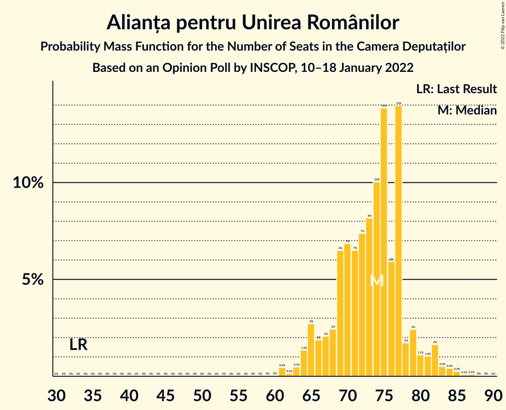

| Number of Seats | Probability | Accumulated | Special Marks |
|:---------------:|:-----------:|:-----------:|:-------------:|
| 33 | 0% | 100% | Last Result |
| 34 | 0% | 100% |  |
| 35 | 0% | 100% |  |
| 36 | 0% | 100% |  |
| 37 | 0% | 100% |  |
| 38 | 0% | 100% |  |
| 39 | 0% | 100% |  |
| 40 | 0% | 100% |  |
| 41 | 0% | 100% |  |
| 42 | 0% | 100% |  |
| 43 | 0% | 100% |  |
| 44 | 0% | 100% |  |
| 45 | 0% | 100% |  |
| 46 | 0% | 100% |  |
| 47 | 0% | 100% |  |
| 48 | 0% | 100% |  |
| 49 | 0% | 100% |  |
| 50 | 0% | 100% |  |
| 51 | 0% | 100% |  |
| 52 | 0% | 100% |  |
| 53 | 0% | 100% |  |
| 54 | 0% | 100% |  |
| 55 | 0% | 100% |  |
| 56 | 0% | 100% |  |
| 57 | 0% | 100% |  |
| 58 | 0% | 100% |  |
| 59 | 0% | 100% |  |
| 60 | 0% | 100% |  |
| 61 | 0.4% | 99.9% |  |
| 62 | 0.1% | 99.5% |  |
| 63 | 0.5% | 99.4% |  |
| 64 | 1.3% | 98.9% |  |
| 65 | 3% | 98% |  |
| 66 | 2% | 95% |  |
| 67 | 2% | 93% |  |
| 68 | 2% | 91% |  |
| 69 | 6% | 88% |  |
| 70 | 7% | 82% |  |
| 71 | 7% | 75% |  |
| 72 | 7% | 69% |  |
| 73 | 8% | 61% |  |
| 74 | 10% | 53% | Median |
| 75 | 14% | 43% |  |
| 76 | 6% | 29% |  |
| 77 | 14% | 23% |  |
| 78 | 2% | 9% |  |
| 79 | 2% | 8% |  |
| 80 | 1.1% | 5% |  |
| 81 | 1.0% | 4% |  |
| 82 | 2% | 3% |  |
| 83 | 0.5% | 1.4% |  |
| 84 | 0.4% | 0.9% |  |
| 85 | 0.3% | 0.5% |  |
| 86 | 0.1% | 0.2% |  |
| 87 | 0.1% | 0.1% |  |
| 88 | 0% | 0% |  |

### Partidul Național Liberal

*For a full overview of the results for this party, see the [Partidul Național Liberal](party-partidulnaționalliberal.html) page.*

| Number of Seats | Probability | Accumulated | Special Marks |
|:---------------:|:-----------:|:-----------:|:-------------:|
| 47 | 0% | 100% |  |
| 48 | 0.1% | 99.9% |  |
| 49 | 0.5% | 99.8% |  |
| 50 | 0.6% | 99.3% |  |
| 51 | 2% | 98.8% |  |
| 52 | 1.0% | 97% |  |
| 53 | 4% | 96% |  |
| 54 | 3% | 92% |  |
| 55 | 10% | 89% |  |
| 56 | 12% | 78% |  |
| 57 | 11% | 66% |  |
| 58 | 17% | 55% | Median |
| 59 | 4% | 38% |  |
| 60 | 10% | 34% |  |
| 61 | 8% | 23% |  |
| 62 | 3% | 15% |  |
| 63 | 7% | 12% |  |
| 64 | 1.5% | 5% |  |
| 65 | 0.9% | 4% |  |
| 66 | 0.7% | 3% |  |
| 67 | 0.6% | 2% |  |
| 68 | 0.4% | 1.3% |  |
| 69 | 0.4% | 0.9% |  |
| 70 | 0.1% | 0.4% |  |
| 71 | 0.3% | 0.3% |  |
| 72 | 0% | 0% |  |
| 73 | 0% | 0% |  |
| 74 | 0% | 0% |  |
| 75 | 0% | 0% |  |
| 76 | 0% | 0% |  |
| 77 | 0% | 0% |  |
| 78 | 0% | 0% |  |
| 79 | 0% | 0% |  |
| 80 | 0% | 0% |  |
| 81 | 0% | 0% |  |
| 82 | 0% | 0% |  |
| 83 | 0% | 0% |  |
| 84 | 0% | 0% |  |
| 85 | 0% | 0% |  |
| 86 | 0% | 0% |  |
| 87 | 0% | 0% |  |
| 88 | 0% | 0% |  |
| 89 | 0% | 0% |  |
| 90 | 0% | 0% |  |
| 91 | 0% | 0% |  |
| 92 | 0% | 0% |  |
| 93 | 0% | 0% | Last Result |

### Alianța 2020 USR-PLUS

*For a full overview of the results for this party, see the [Alianța 2020 USR-PLUS](party-alianța2020usr-plus.html) page.*

| Number of Seats | Probability | Accumulated | Special Marks |
|:---------------:|:-----------:|:-----------:|:-------------:|
| 33 | 0.1% | 100% |  |
| 34 | 0.3% | 99.9% |  |
| 35 | 0.4% | 99.6% |  |
| 36 | 1.2% | 99.2% |  |
| 37 | 2% | 98% |  |
| 38 | 3% | 96% |  |
| 39 | 3% | 93% |  |
| 40 | 6% | 90% |  |
| 41 | 6% | 85% |  |
| 42 | 6% | 79% |  |
| 43 | 6% | 73% |  |
| 44 | 6% | 67% |  |
| 45 | 17% | 62% | Median |
| 46 | 10% | 45% |  |
| 47 | 6% | 35% |  |
| 48 | 9% | 29% |  |
| 49 | 7% | 20% |  |
| 50 | 4% | 13% |  |
| 51 | 5% | 9% |  |
| 52 | 2% | 4% |  |
| 53 | 1.2% | 2% |  |
| 54 | 0.7% | 1.2% |  |
| 55 | 0.3% | 0.6% | Last Result |
| 56 | 0.2% | 0.3% |  |
| 57 | 0% | 0.1% |  |
| 58 | 0% | 0% |  |

### Uniunea Democrată Maghiară din România

*For a full overview of the results for this party, see the [Uniunea Democrată Maghiară din România](party-uniuneademocratămaghiarădinromânia.html) page.*

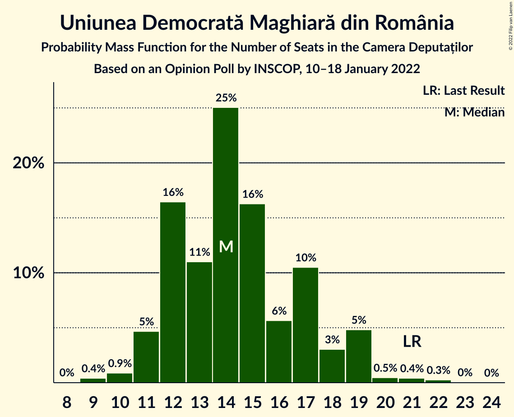

| Number of Seats | Probability | Accumulated | Special Marks |
|:---------------:|:-----------:|:-----------:|:-------------:|
| 9 | 0.4% | 100% |  |
| 10 | 0.9% | 99.5% |  |
| 11 | 5% | 98.7% |  |
| 12 | 16% | 94% |  |
| 13 | 11% | 78% |  |
| 14 | 25% | 67% | Median |
| 15 | 16% | 41% |  |
| 16 | 6% | 25% |  |
| 17 | 10% | 20% |  |
| 18 | 3% | 9% |  |
| 19 | 5% | 6% |  |
| 20 | 0.5% | 1.2% |  |
| 21 | 0.4% | 0.7% | Last Result |
| 22 | 0.3% | 0.3% |  |
| 23 | 0% | 0.1% |  |
| 24 | 0% | 0% |  |

### PRO România

*For a full overview of the results for this party, see the [PRO România](party-proromânia.html) page.*

| Number of Seats | Probability | Accumulated | Special Marks |
|:---------------:|:-----------:|:-----------:|:-------------:|
| 0 | 100% | 100% | Last Result, Median |

### Partidul Mișcarea Populară

*For a full overview of the results for this party, see the [Partidul Mișcarea Populară](party-partidulmișcareapopulară.html) page.*

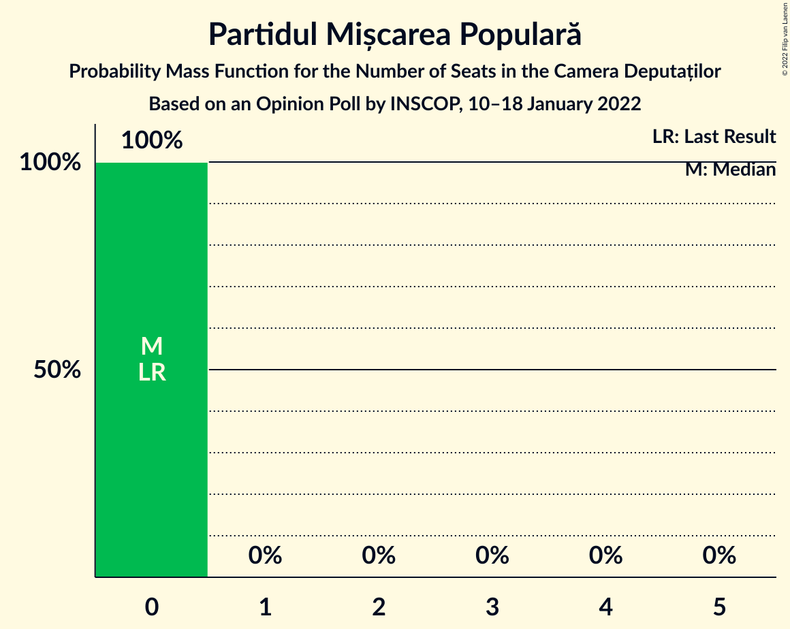

| Number of Seats | Probability | Accumulated | Special Marks |
|:---------------:|:-----------:|:-----------:|:-------------:|
| 0 | 100% | 100% | Last Result, Median |

### Forța Dreptei

*For a full overview of the results for this party, see the [Forța Dreptei](party-forțadreptei.html) page.*

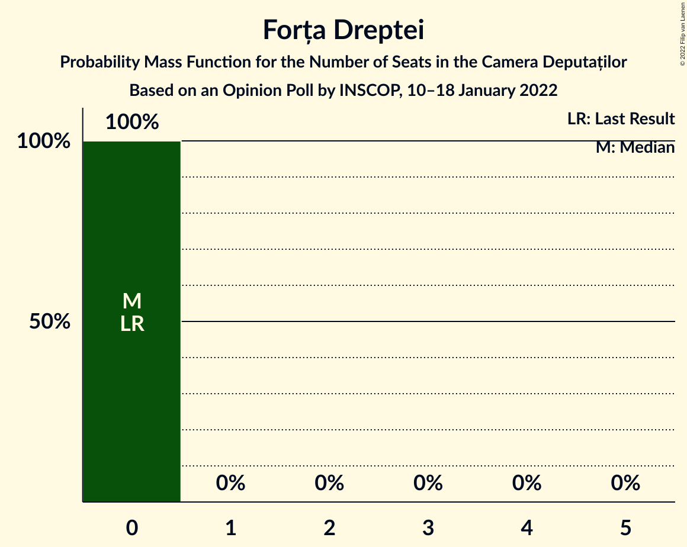

| Number of Seats | Probability | Accumulated | Special Marks |
|:---------------:|:-----------:|:-----------:|:-------------:|
| 0 | 100% | 100% | Last Result, Median |

### Partidul Puterii Umaniste (social-liberal)

*For a full overview of the results for this party, see the [Partidul Puterii Umaniste (social-liberal)](party-partidulputeriiumanistesocial-liberal.html) page.*

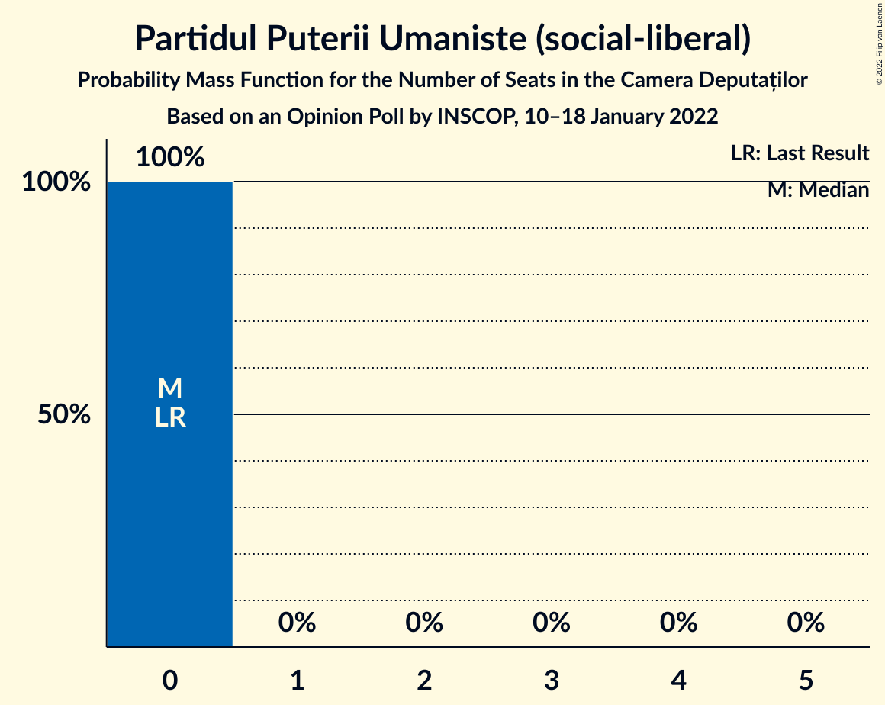

| Number of Seats | Probability | Accumulated | Special Marks |
|:---------------:|:-----------:|:-----------:|:-------------:|
| 0 | 100% | 100% | Last Result, Median |

### Alianța pentru Patrie

*For a full overview of the results for this party, see the [Alianța pentru Patrie](party-alianțapentrupatrie.html) page.*

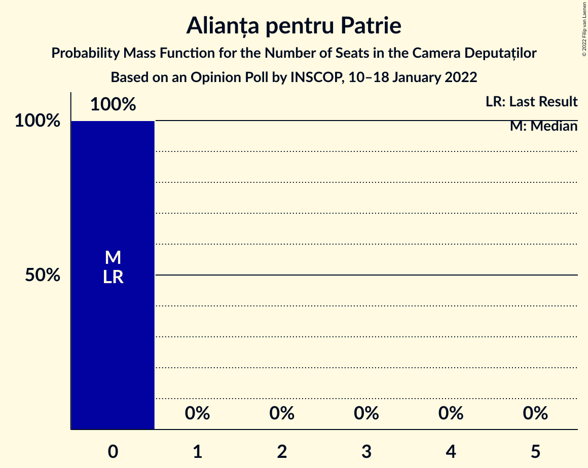

| Number of Seats | Probability | Accumulated | Special Marks |
|:---------------:|:-----------:|:-----------:|:-------------:|
| 0 | 100% | 100% | Last Result, Median |

## Coalitions

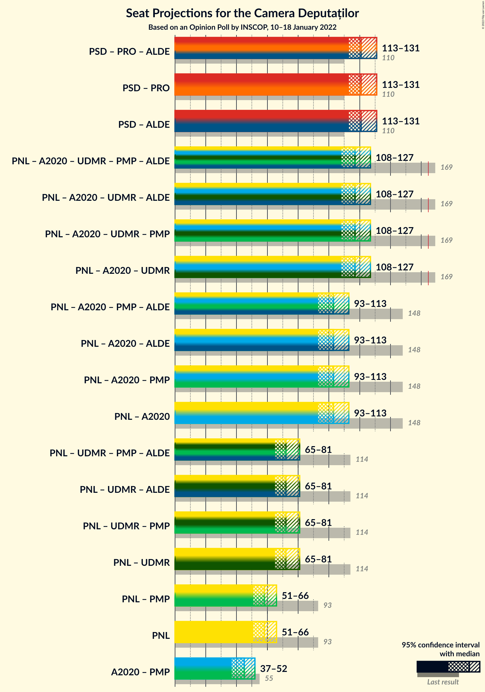

### Confidence Intervals

| Coalition | Last Result | Median | Majority? | 80% Confidence Interval | 90% Confidence Interval | 95% Confidence Interval | 99% Confidence Interval |
|:---------:|:-----------:|:------:|:---------:|:-----------------------:|:-----------------------:|:-----------------------:|:-----------------------:|
| Partidul Social Democrat – PRO România | 110 | 121 | 0% | 116–127 | 114–129 | 113–131 | 109–133 |
| Partidul Național Liberal – Alianța 2020 USR-PLUS – Uniunea Democrată Maghiară din România – Partidul Mișcarea Populară | 169 | 117 | 0% | 112–123 | 110–125 | 108–127 | 105–130 |
| Partidul Național Liberal – Alianța 2020 USR-PLUS – Uniunea Democrată Maghiară din România | 169 | 117 | 0% | 112–123 | 110–125 | 108–127 | 105–130 |
| Partidul Național Liberal – Alianța 2020 USR-PLUS – Partidul Mișcarea Populară | 148 | 103 | 0% | 97–109 | 95–112 | 93–113 | 91–116 |
| Partidul Național Liberal – Alianța 2020 USR-PLUS | 148 | 103 | 0% | 97–109 | 95–112 | 93–113 | 91–116 |
| Partidul Național Liberal – Uniunea Democrată Maghiară din România – Partidul Mișcarea Populară | 114 | 72 | 0% | 67–78 | 66–80 | 65–81 | 62–85 |
| Partidul Național Liberal – Uniunea Democrată Maghiară din România | 114 | 72 | 0% | 67–78 | 66–80 | 65–81 | 62–85 |
| Partidul Național Liberal – Partidul Mișcarea Populară | 93 | 58 | 0% | 54–63 | 53–64 | 51–66 | 49–69 |
| Partidul Național Liberal | 93 | 58 | 0% | 54–63 | 53–64 | 51–66 | 49–69 |
| Alianța 2020 USR-PLUS – Partidul Mișcarea Populară | 55 | 45 | 0% | 40–50 | 38–51 | 37–52 | 35–55 |

### Partidul Social Democrat – PRO România

| Number of Seats | Probability | Accumulated | Special Marks |
|:---------------:|:-----------:|:-----------:|:-------------:|
| 107 | 0% | 100% |  |
| 108 | 0.2% | 99.9% |  |
| 109 | 0.6% | 99.7% |  |
| 110 | 0.3% | 99.1% | Last Result |
| 111 | 0.4% | 98.8% |  |
| 112 | 0.7% | 98% |  |
| 113 | 2% | 98% |  |
| 114 | 1.4% | 96% |  |
| 115 | 2% | 95% |  |
| 116 | 5% | 93% |  |
| 117 | 4% | 88% |  |
| 118 | 16% | 83% |  |
| 119 | 4% | 67% |  |
| 120 | 7% | 63% |  |
| 121 | 7% | 55% | Median |
| 122 | 7% | 48% |  |
| 123 | 18% | 41% |  |
| 124 | 2% | 23% |  |
| 125 | 5% | 21% |  |
| 126 | 3% | 16% |  |
| 127 | 4% | 12% |  |
| 128 | 2% | 8% |  |
| 129 | 1.4% | 6% |  |
| 130 | 0.9% | 5% |  |
| 131 | 2% | 4% |  |
| 132 | 1.1% | 2% |  |
| 133 | 0.5% | 0.9% |  |
| 134 | 0.1% | 0.4% |  |
| 135 | 0.1% | 0.3% |  |
| 136 | 0.1% | 0.2% |  |
| 137 | 0% | 0.1% |  |
| 138 | 0.1% | 0.1% |  |
| 139 | 0% | 0% |  |

### Partidul Național Liberal – Alianța 2020 USR-PLUS – Uniunea Democrată Maghiară din România – Partidul Mișcarea Populară

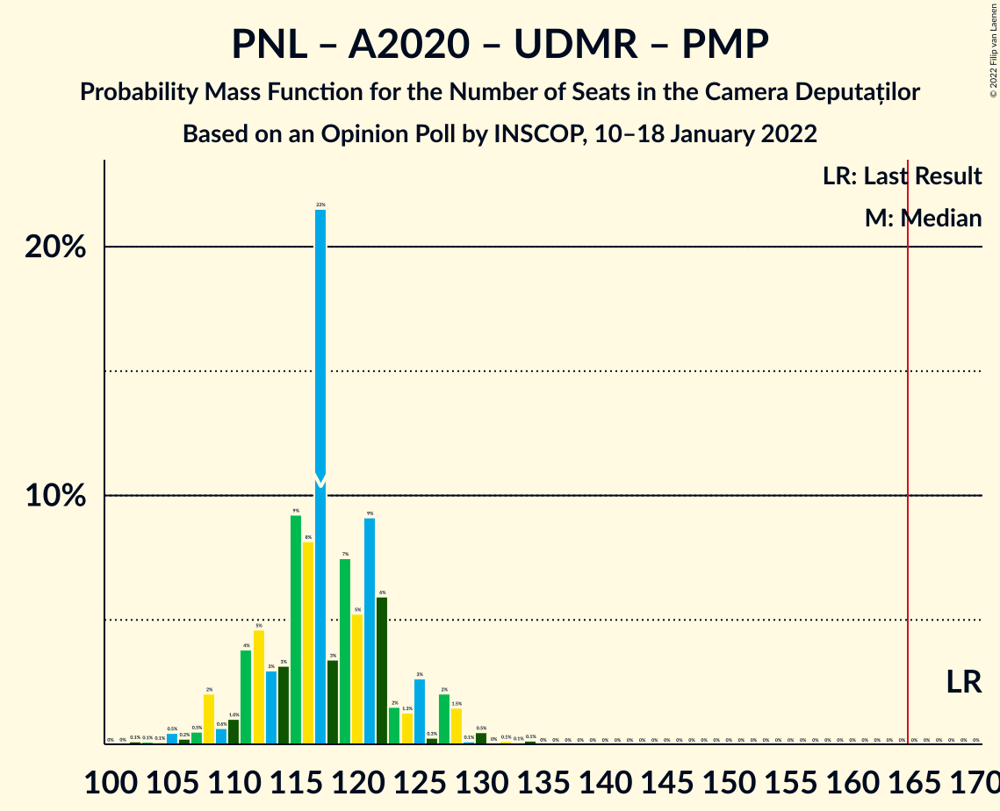

| Number of Seats | Probability | Accumulated | Special Marks |
|:---------------:|:-----------:|:-----------:|:-------------:|
| 102 | 0.1% | 100% |  |
| 103 | 0.1% | 99.8% |  |
| 104 | 0.1% | 99.7% |  |
| 105 | 0.5% | 99.7% |  |
| 106 | 0.2% | 99.2% |  |
| 107 | 0.5% | 99.0% |  |
| 108 | 2% | 98% |  |
| 109 | 0.6% | 96% |  |
| 110 | 1.0% | 96% |  |
| 111 | 4% | 95% |  |
| 112 | 5% | 91% |  |
| 113 | 3% | 86% |  |
| 114 | 3% | 83% |  |
| 115 | 9% | 80% |  |
| 116 | 8% | 71% |  |
| 117 | 22% | 63% | Median |
| 118 | 3% | 41% |  |
| 119 | 7% | 38% |  |
| 120 | 5% | 30% |  |
| 121 | 9% | 25% |  |
| 122 | 6% | 16% |  |
| 123 | 2% | 10% |  |
| 124 | 1.3% | 9% |  |
| 125 | 3% | 7% |  |
| 126 | 0.3% | 5% |  |
| 127 | 2% | 4% |  |
| 128 | 1.5% | 2% |  |
| 129 | 0.1% | 1.0% |  |
| 130 | 0.5% | 0.9% |  |
| 131 | 0% | 0.4% |  |
| 132 | 0.1% | 0.4% |  |
| 133 | 0.1% | 0.2% |  |
| 134 | 0.1% | 0.2% |  |
| 135 | 0% | 0% |  |
| 136 | 0% | 0% |  |
| 137 | 0% | 0% |  |
| 138 | 0% | 0% |  |
| 139 | 0% | 0% |  |
| 140 | 0% | 0% |  |
| 141 | 0% | 0% |  |
| 142 | 0% | 0% |  |
| 143 | 0% | 0% |  |
| 144 | 0% | 0% |  |
| 145 | 0% | 0% |  |
| 146 | 0% | 0% |  |
| 147 | 0% | 0% |  |
| 148 | 0% | 0% |  |
| 149 | 0% | 0% |  |
| 150 | 0% | 0% |  |
| 151 | 0% | 0% |  |
| 152 | 0% | 0% |  |
| 153 | 0% | 0% |  |
| 154 | 0% | 0% |  |
| 155 | 0% | 0% |  |
| 156 | 0% | 0% |  |
| 157 | 0% | 0% |  |
| 158 | 0% | 0% |  |
| 159 | 0% | 0% |  |
| 160 | 0% | 0% |  |
| 161 | 0% | 0% |  |
| 162 | 0% | 0% |  |
| 163 | 0% | 0% |  |
| 164 | 0% | 0% |  |
| 165 | 0% | 0% | Majority |
| 166 | 0% | 0% |  |
| 167 | 0% | 0% |  |
| 168 | 0% | 0% |  |
| 169 | 0% | 0% | Last Result |

### Partidul Național Liberal – Alianța 2020 USR-PLUS – Uniunea Democrată Maghiară din România

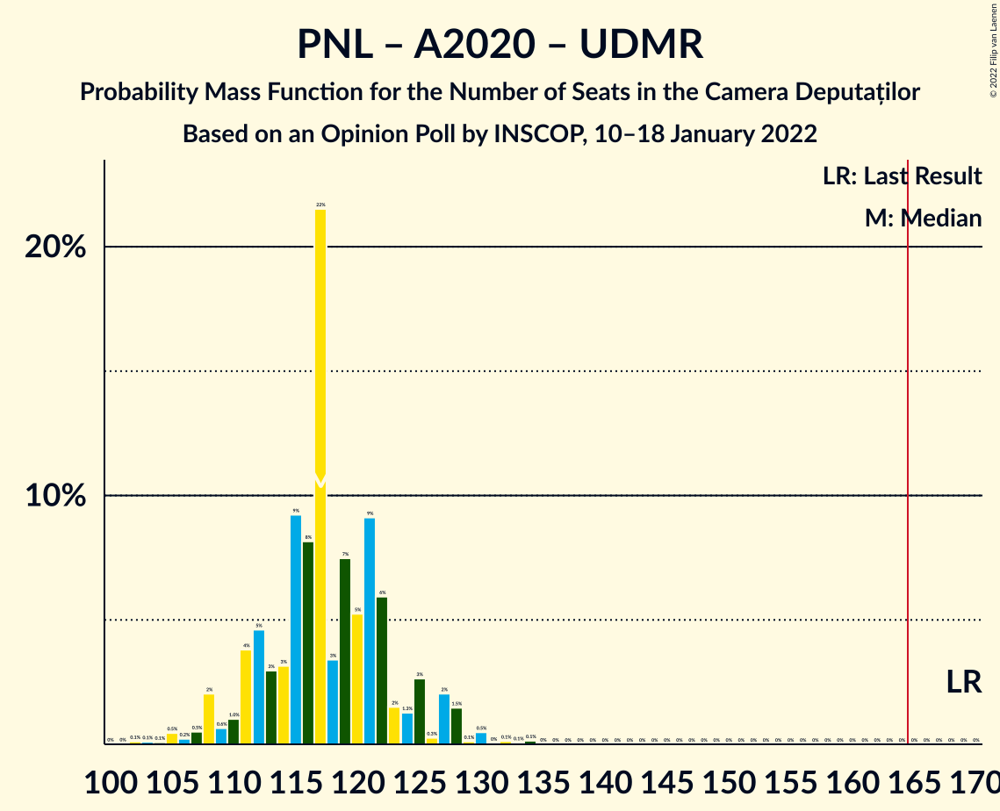

| Number of Seats | Probability | Accumulated | Special Marks |
|:---------------:|:-----------:|:-----------:|:-------------:|
| 102 | 0.1% | 100% |  |
| 103 | 0.1% | 99.8% |  |
| 104 | 0.1% | 99.7% |  |
| 105 | 0.5% | 99.7% |  |
| 106 | 0.2% | 99.2% |  |
| 107 | 0.5% | 99.0% |  |
| 108 | 2% | 98% |  |
| 109 | 0.6% | 96% |  |
| 110 | 1.0% | 96% |  |
| 111 | 4% | 95% |  |
| 112 | 5% | 91% |  |
| 113 | 3% | 86% |  |
| 114 | 3% | 83% |  |
| 115 | 9% | 80% |  |
| 116 | 8% | 71% |  |
| 117 | 22% | 63% | Median |
| 118 | 3% | 41% |  |
| 119 | 7% | 38% |  |
| 120 | 5% | 30% |  |
| 121 | 9% | 25% |  |
| 122 | 6% | 16% |  |
| 123 | 2% | 10% |  |
| 124 | 1.3% | 9% |  |
| 125 | 3% | 7% |  |
| 126 | 0.3% | 5% |  |
| 127 | 2% | 4% |  |
| 128 | 1.5% | 2% |  |
| 129 | 0.1% | 1.0% |  |
| 130 | 0.5% | 0.9% |  |
| 131 | 0% | 0.4% |  |
| 132 | 0.1% | 0.4% |  |
| 133 | 0.1% | 0.2% |  |
| 134 | 0.1% | 0.2% |  |
| 135 | 0% | 0% |  |
| 136 | 0% | 0% |  |
| 137 | 0% | 0% |  |
| 138 | 0% | 0% |  |
| 139 | 0% | 0% |  |
| 140 | 0% | 0% |  |
| 141 | 0% | 0% |  |
| 142 | 0% | 0% |  |
| 143 | 0% | 0% |  |
| 144 | 0% | 0% |  |
| 145 | 0% | 0% |  |
| 146 | 0% | 0% |  |
| 147 | 0% | 0% |  |
| 148 | 0% | 0% |  |
| 149 | 0% | 0% |  |
| 150 | 0% | 0% |  |
| 151 | 0% | 0% |  |
| 152 | 0% | 0% |  |
| 153 | 0% | 0% |  |
| 154 | 0% | 0% |  |
| 155 | 0% | 0% |  |
| 156 | 0% | 0% |  |
| 157 | 0% | 0% |  |
| 158 | 0% | 0% |  |
| 159 | 0% | 0% |  |
| 160 | 0% | 0% |  |
| 161 | 0% | 0% |  |
| 162 | 0% | 0% |  |
| 163 | 0% | 0% |  |
| 164 | 0% | 0% |  |
| 165 | 0% | 0% | Majority |
| 166 | 0% | 0% |  |
| 167 | 0% | 0% |  |
| 168 | 0% | 0% |  |
| 169 | 0% | 0% | Last Result |

### Partidul Național Liberal – Alianța 2020 USR-PLUS – Partidul Mișcarea Populară

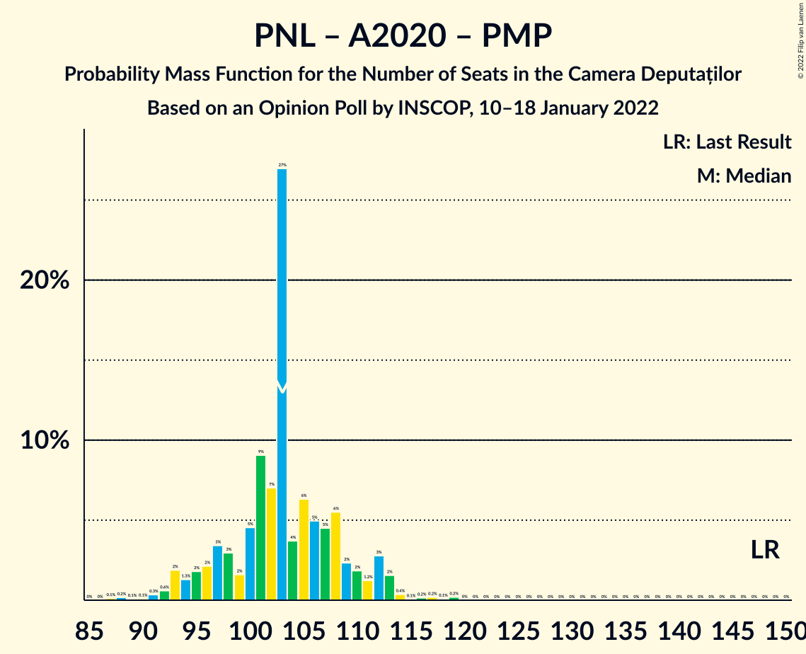

| Number of Seats | Probability | Accumulated | Special Marks |
|:---------------:|:-----------:|:-----------:|:-------------:|
| 87 | 0.1% | 100% |  |
| 88 | 0.2% | 99.9% |  |
| 89 | 0.1% | 99.7% |  |
| 90 | 0.1% | 99.6% |  |
| 91 | 0.3% | 99.5% |  |
| 92 | 0.6% | 99.2% |  |
| 93 | 2% | 98.6% |  |
| 94 | 1.3% | 97% |  |
| 95 | 2% | 95% |  |
| 96 | 2% | 94% |  |
| 97 | 3% | 91% |  |
| 98 | 3% | 88% |  |
| 99 | 2% | 85% |  |
| 100 | 5% | 83% |  |
| 101 | 9% | 79% |  |
| 102 | 7% | 70% |  |
| 103 | 27% | 63% | Median |
| 104 | 4% | 36% |  |
| 105 | 6% | 32% |  |
| 106 | 5% | 26% |  |
| 107 | 5% | 21% |  |
| 108 | 6% | 16% |  |
| 109 | 2% | 11% |  |
| 110 | 2% | 9% |  |
| 111 | 1.2% | 7% |  |
| 112 | 3% | 5% |  |
| 113 | 2% | 3% |  |
| 114 | 0.4% | 1.1% |  |
| 115 | 0.1% | 0.7% |  |
| 116 | 0.2% | 0.6% |  |
| 117 | 0.2% | 0.5% |  |
| 118 | 0.1% | 0.3% |  |
| 119 | 0.2% | 0.2% |  |
| 120 | 0% | 0% |  |
| 121 | 0% | 0% |  |
| 122 | 0% | 0% |  |
| 123 | 0% | 0% |  |
| 124 | 0% | 0% |  |
| 125 | 0% | 0% |  |
| 126 | 0% | 0% |  |
| 127 | 0% | 0% |  |
| 128 | 0% | 0% |  |
| 129 | 0% | 0% |  |
| 130 | 0% | 0% |  |
| 131 | 0% | 0% |  |
| 132 | 0% | 0% |  |
| 133 | 0% | 0% |  |
| 134 | 0% | 0% |  |
| 135 | 0% | 0% |  |
| 136 | 0% | 0% |  |
| 137 | 0% | 0% |  |
| 138 | 0% | 0% |  |
| 139 | 0% | 0% |  |
| 140 | 0% | 0% |  |
| 141 | 0% | 0% |  |
| 142 | 0% | 0% |  |
| 143 | 0% | 0% |  |
| 144 | 0% | 0% |  |
| 145 | 0% | 0% |  |
| 146 | 0% | 0% |  |
| 147 | 0% | 0% |  |
| 148 | 0% | 0% | Last Result |

### Partidul Național Liberal – Alianța 2020 USR-PLUS

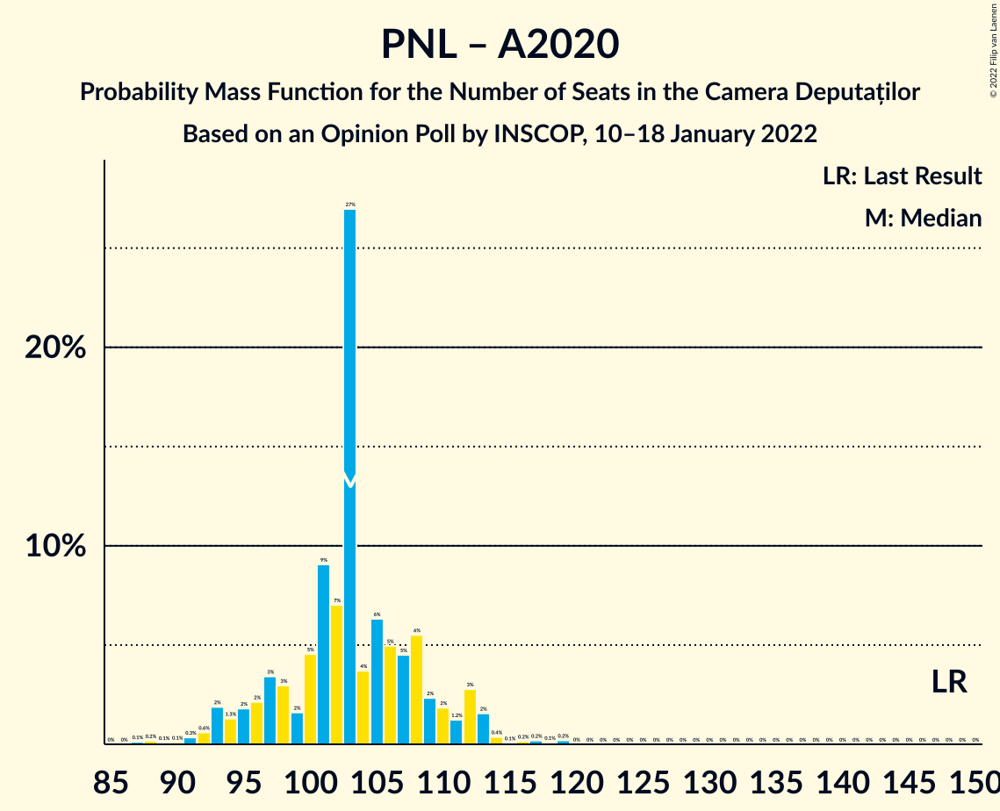

| Number of Seats | Probability | Accumulated | Special Marks |
|:---------------:|:-----------:|:-----------:|:-------------:|
| 87 | 0.1% | 100% |  |
| 88 | 0.2% | 99.9% |  |
| 89 | 0.1% | 99.7% |  |
| 90 | 0.1% | 99.6% |  |
| 91 | 0.3% | 99.5% |  |
| 92 | 0.6% | 99.2% |  |
| 93 | 2% | 98.6% |  |
| 94 | 1.3% | 97% |  |
| 95 | 2% | 95% |  |
| 96 | 2% | 94% |  |
| 97 | 3% | 91% |  |
| 98 | 3% | 88% |  |
| 99 | 2% | 85% |  |
| 100 | 5% | 83% |  |
| 101 | 9% | 79% |  |
| 102 | 7% | 70% |  |
| 103 | 27% | 63% | Median |
| 104 | 4% | 36% |  |
| 105 | 6% | 32% |  |
| 106 | 5% | 26% |  |
| 107 | 5% | 21% |  |
| 108 | 6% | 16% |  |
| 109 | 2% | 11% |  |
| 110 | 2% | 9% |  |
| 111 | 1.2% | 7% |  |
| 112 | 3% | 5% |  |
| 113 | 2% | 3% |  |
| 114 | 0.4% | 1.1% |  |
| 115 | 0.1% | 0.7% |  |
| 116 | 0.2% | 0.6% |  |
| 117 | 0.2% | 0.5% |  |
| 118 | 0.1% | 0.3% |  |
| 119 | 0.2% | 0.2% |  |
| 120 | 0% | 0% |  |
| 121 | 0% | 0% |  |
| 122 | 0% | 0% |  |
| 123 | 0% | 0% |  |
| 124 | 0% | 0% |  |
| 125 | 0% | 0% |  |
| 126 | 0% | 0% |  |
| 127 | 0% | 0% |  |
| 128 | 0% | 0% |  |
| 129 | 0% | 0% |  |
| 130 | 0% | 0% |  |
| 131 | 0% | 0% |  |
| 132 | 0% | 0% |  |
| 133 | 0% | 0% |  |
| 134 | 0% | 0% |  |
| 135 | 0% | 0% |  |
| 136 | 0% | 0% |  |
| 137 | 0% | 0% |  |
| 138 | 0% | 0% |  |
| 139 | 0% | 0% |  |
| 140 | 0% | 0% |  |
| 141 | 0% | 0% |  |
| 142 | 0% | 0% |  |
| 143 | 0% | 0% |  |
| 144 | 0% | 0% |  |
| 145 | 0% | 0% |  |
| 146 | 0% | 0% |  |
| 147 | 0% | 0% |  |
| 148 | 0% | 0% | Last Result |

### Partidul Național Liberal – Uniunea Democrată Maghiară din România – Partidul Mișcarea Populară

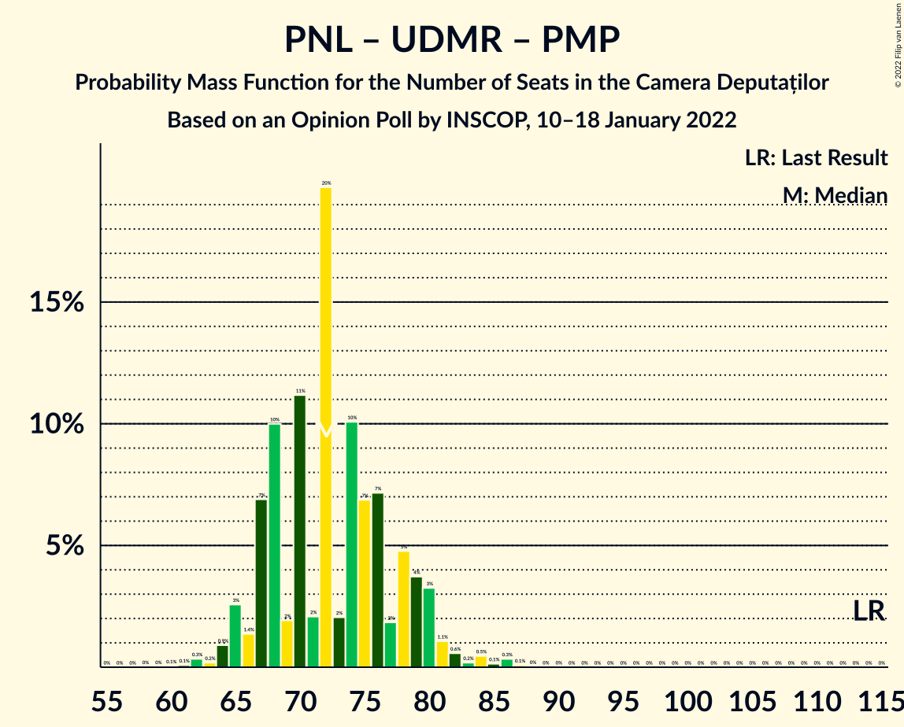

| Number of Seats | Probability | Accumulated | Special Marks |
|:---------------:|:-----------:|:-----------:|:-------------:|
| 60 | 0.1% | 100% |  |
| 61 | 0.1% | 99.9% |  |
| 62 | 0.3% | 99.8% |  |
| 63 | 0.2% | 99.5% |  |
| 64 | 0.9% | 99.3% |  |
| 65 | 3% | 98% |  |
| 66 | 1.4% | 96% |  |
| 67 | 7% | 94% |  |
| 68 | 10% | 88% |  |
| 69 | 2% | 78% |  |
| 70 | 11% | 76% |  |
| 71 | 2% | 64% |  |
| 72 | 20% | 62% | Median |
| 73 | 2% | 43% |  |
| 74 | 10% | 41% |  |
| 75 | 7% | 31% |  |
| 76 | 7% | 24% |  |
| 77 | 2% | 16% |  |
| 78 | 5% | 15% |  |
| 79 | 4% | 10% |  |
| 80 | 3% | 6% |  |
| 81 | 1.1% | 3% |  |
| 82 | 0.6% | 2% |  |
| 83 | 0.2% | 1.3% |  |
| 84 | 0.5% | 1.1% |  |
| 85 | 0.1% | 0.6% |  |
| 86 | 0.3% | 0.5% |  |
| 87 | 0.1% | 0.1% |  |
| 88 | 0% | 0% |  |
| 89 | 0% | 0% |  |
| 90 | 0% | 0% |  |
| 91 | 0% | 0% |  |
| 92 | 0% | 0% |  |
| 93 | 0% | 0% |  |
| 94 | 0% | 0% |  |
| 95 | 0% | 0% |  |
| 96 | 0% | 0% |  |
| 97 | 0% | 0% |  |
| 98 | 0% | 0% |  |
| 99 | 0% | 0% |  |
| 100 | 0% | 0% |  |
| 101 | 0% | 0% |  |
| 102 | 0% | 0% |  |
| 103 | 0% | 0% |  |
| 104 | 0% | 0% |  |
| 105 | 0% | 0% |  |
| 106 | 0% | 0% |  |
| 107 | 0% | 0% |  |
| 108 | 0% | 0% |  |
| 109 | 0% | 0% |  |
| 110 | 0% | 0% |  |
| 111 | 0% | 0% |  |
| 112 | 0% | 0% |  |
| 113 | 0% | 0% |  |
| 114 | 0% | 0% | Last Result |

### Partidul Național Liberal – Uniunea Democrată Maghiară din România

| Number of Seats | Probability | Accumulated | Special Marks |
|:---------------:|:-----------:|:-----------:|:-------------:|
| 60 | 0.1% | 100% |  |
| 61 | 0.1% | 99.9% |  |
| 62 | 0.3% | 99.8% |  |
| 63 | 0.2% | 99.5% |  |
| 64 | 0.9% | 99.3% |  |
| 65 | 3% | 98% |  |
| 66 | 1.4% | 96% |  |
| 67 | 7% | 94% |  |
| 68 | 10% | 88% |  |
| 69 | 2% | 78% |  |
| 70 | 11% | 76% |  |
| 71 | 2% | 64% |  |
| 72 | 20% | 62% | Median |
| 73 | 2% | 43% |  |
| 74 | 10% | 41% |  |
| 75 | 7% | 31% |  |
| 76 | 7% | 24% |  |
| 77 | 2% | 16% |  |
| 78 | 5% | 15% |  |
| 79 | 4% | 10% |  |
| 80 | 3% | 6% |  |
| 81 | 1.1% | 3% |  |
| 82 | 0.6% | 2% |  |
| 83 | 0.2% | 1.3% |  |
| 84 | 0.5% | 1.1% |  |
| 85 | 0.1% | 0.6% |  |
| 86 | 0.3% | 0.5% |  |
| 87 | 0.1% | 0.1% |  |
| 88 | 0% | 0% |  |
| 89 | 0% | 0% |  |
| 90 | 0% | 0% |  |
| 91 | 0% | 0% |  |
| 92 | 0% | 0% |  |
| 93 | 0% | 0% |  |
| 94 | 0% | 0% |  |
| 95 | 0% | 0% |  |
| 96 | 0% | 0% |  |
| 97 | 0% | 0% |  |
| 98 | 0% | 0% |  |
| 99 | 0% | 0% |  |
| 100 | 0% | 0% |  |
| 101 | 0% | 0% |  |
| 102 | 0% | 0% |  |
| 103 | 0% | 0% |  |
| 104 | 0% | 0% |  |
| 105 | 0% | 0% |  |
| 106 | 0% | 0% |  |
| 107 | 0% | 0% |  |
| 108 | 0% | 0% |  |
| 109 | 0% | 0% |  |
| 110 | 0% | 0% |  |
| 111 | 0% | 0% |  |
| 112 | 0% | 0% |  |
| 113 | 0% | 0% |  |
| 114 | 0% | 0% | Last Result |

### Partidul Național Liberal – Partidul Mișcarea Populară

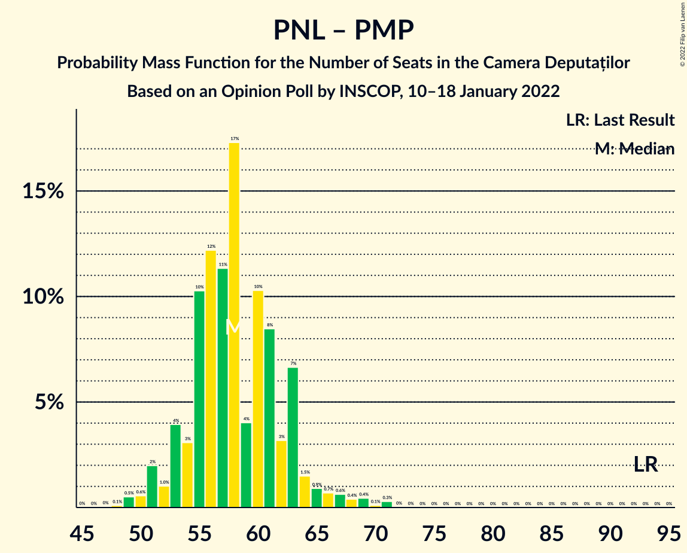

| Number of Seats | Probability | Accumulated | Special Marks |
|:---------------:|:-----------:|:-----------:|:-------------:|
| 47 | 0% | 100% |  |
| 48 | 0.1% | 99.9% |  |
| 49 | 0.5% | 99.8% |  |
| 50 | 0.6% | 99.3% |  |
| 51 | 2% | 98.8% |  |
| 52 | 1.0% | 97% |  |
| 53 | 4% | 96% |  |
| 54 | 3% | 92% |  |
| 55 | 10% | 89% |  |
| 56 | 12% | 78% |  |
| 57 | 11% | 66% |  |
| 58 | 17% | 55% | Median |
| 59 | 4% | 38% |  |
| 60 | 10% | 34% |  |
| 61 | 8% | 23% |  |
| 62 | 3% | 15% |  |
| 63 | 7% | 12% |  |
| 64 | 1.5% | 5% |  |
| 65 | 0.9% | 4% |  |
| 66 | 0.7% | 3% |  |
| 67 | 0.6% | 2% |  |
| 68 | 0.4% | 1.3% |  |
| 69 | 0.4% | 0.9% |  |
| 70 | 0.1% | 0.4% |  |
| 71 | 0.3% | 0.3% |  |
| 72 | 0% | 0% |  |
| 73 | 0% | 0% |  |
| 74 | 0% | 0% |  |
| 75 | 0% | 0% |  |
| 76 | 0% | 0% |  |
| 77 | 0% | 0% |  |
| 78 | 0% | 0% |  |
| 79 | 0% | 0% |  |
| 80 | 0% | 0% |  |
| 81 | 0% | 0% |  |
| 82 | 0% | 0% |  |
| 83 | 0% | 0% |  |
| 84 | 0% | 0% |  |
| 85 | 0% | 0% |  |
| 86 | 0% | 0% |  |
| 87 | 0% | 0% |  |
| 88 | 0% | 0% |  |
| 89 | 0% | 0% |  |
| 90 | 0% | 0% |  |
| 91 | 0% | 0% |  |
| 92 | 0% | 0% |  |
| 93 | 0% | 0% | Last Result |

### Partidul Național Liberal

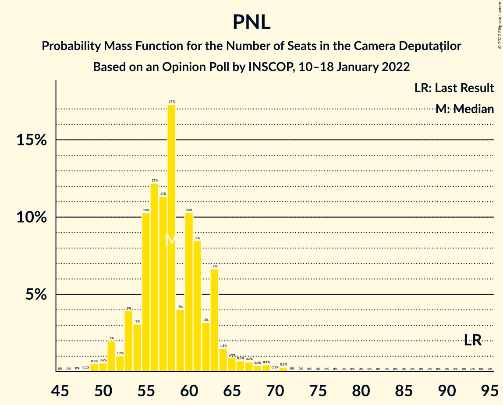

| Number of Seats | Probability | Accumulated | Special Marks |
|:---------------:|:-----------:|:-----------:|:-------------:|
| 47 | 0% | 100% |  |
| 48 | 0.1% | 99.9% |  |
| 49 | 0.5% | 99.8% |  |
| 50 | 0.6% | 99.3% |  |
| 51 | 2% | 98.8% |  |
| 52 | 1.0% | 97% |  |
| 53 | 4% | 96% |  |
| 54 | 3% | 92% |  |
| 55 | 10% | 89% |  |
| 56 | 12% | 78% |  |
| 57 | 11% | 66% |  |
| 58 | 17% | 55% | Median |
| 59 | 4% | 38% |  |
| 60 | 10% | 34% |  |
| 61 | 8% | 23% |  |
| 62 | 3% | 15% |  |
| 63 | 7% | 12% |  |
| 64 | 1.5% | 5% |  |
| 65 | 0.9% | 4% |  |
| 66 | 0.7% | 3% |  |
| 67 | 0.6% | 2% |  |
| 68 | 0.4% | 1.3% |  |
| 69 | 0.4% | 0.9% |  |
| 70 | 0.1% | 0.4% |  |
| 71 | 0.3% | 0.3% |  |
| 72 | 0% | 0% |  |
| 73 | 0% | 0% |  |
| 74 | 0% | 0% |  |
| 75 | 0% | 0% |  |
| 76 | 0% | 0% |  |
| 77 | 0% | 0% |  |
| 78 | 0% | 0% |  |
| 79 | 0% | 0% |  |
| 80 | 0% | 0% |  |
| 81 | 0% | 0% |  |
| 82 | 0% | 0% |  |
| 83 | 0% | 0% |  |
| 84 | 0% | 0% |  |
| 85 | 0% | 0% |  |
| 86 | 0% | 0% |  |
| 87 | 0% | 0% |  |
| 88 | 0% | 0% |  |
| 89 | 0% | 0% |  |
| 90 | 0% | 0% |  |
| 91 | 0% | 0% |  |
| 92 | 0% | 0% |  |
| 93 | 0% | 0% | Last Result |

### Alianța 2020 USR-PLUS – Partidul Mișcarea Populară

| Number of Seats | Probability | Accumulated | Special Marks |
|:---------------:|:-----------:|:-----------:|:-------------:|
| 33 | 0.1% | 100% |  |
| 34 | 0.3% | 99.9% |  |
| 35 | 0.4% | 99.6% |  |
| 36 | 1.2% | 99.2% |  |
| 37 | 2% | 98% |  |
| 38 | 3% | 96% |  |
| 39 | 3% | 93% |  |
| 40 | 6% | 90% |  |
| 41 | 6% | 85% |  |
| 42 | 6% | 79% |  |
| 43 | 6% | 73% |  |
| 44 | 6% | 67% |  |
| 45 | 17% | 62% | Median |
| 46 | 10% | 45% |  |
| 47 | 6% | 35% |  |
| 48 | 9% | 29% |  |
| 49 | 7% | 20% |  |
| 50 | 4% | 13% |  |
| 51 | 5% | 9% |  |
| 52 | 2% | 4% |  |
| 53 | 1.2% | 2% |  |
| 54 | 0.7% | 1.2% |  |
| 55 | 0.3% | 0.6% | Last Result |
| 56 | 0.2% | 0.3% |  |
| 57 | 0% | 0.1% |  |
| 58 | 0% | 0% |  |

## Technical Information

### Opinion Poll

+ **Polling firm:** INSCOP
+ **Commissioner(s):** —
+ **Fieldwork period:** 10–18 January 2022

### Calculations

+ **Sample size:** 1162
+ **Simulations done:** 1,048,576
+ **Error estimate:** 2.33%

