# Opinion Poll by CURS, 22–29 January 2022

<a href="#voting-intentions">Voting Intentions</a> | <a href="#seats">Seats</a> | <a href="#coalitions">Coalitions</a> | <a href="#technical-information">Technical Information</a>

## Voting Intentions

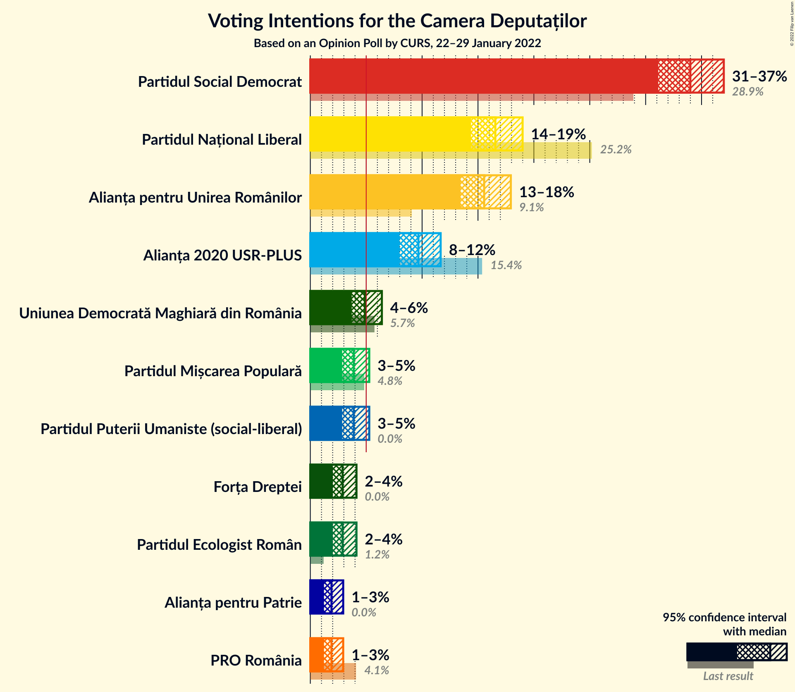

### Confidence Intervals

| Party | Last Result | Poll Result | 80% Confidence Interval | 90% Confidence Interval | 95% Confidence Interval | 99% Confidence Interval |
|:-----:|:-----------:|:-----------:|:-----------------------:|:-----------------------:|:-----------------------:|:-----------------------:|
| Partidul Social Democrat | 28.9% | 34.0% | 32.1–36.0% |31.6–36.5% |31.1–37.0% |30.2–37.9% |
| Partidul Național Liberal | 25.2% | 16.6% | 15.1–18.1% |14.7–18.6% |14.4–19.0% |13.7–19.8% |
| Alianța pentru Unirea Românilor | 9.1% | 15.6% | 14.2–17.1% |13.8–17.5% |13.4–17.9% |12.8–18.7% |
| Alianța 2020 USR-PLUS | 15.4% | 9.7% | 8.6–11.0% |8.2–11.3% |8.0–11.7% |7.5–12.3% |
| Uniunea Democrată Maghiară din România | 5.7% | 4.9% | 4.1–5.9% |3.9–6.2% |3.7–6.4% |3.4–6.9% |
| Partidul Mișcarea Populară | 4.8% | 3.9% | 3.2–4.8% |3.0–5.0% |2.9–5.3% |2.6–5.7% |
| Partidul Puterii Umaniste (social-liberal) | 0.0% | 3.9% | 3.2–4.8% |3.0–5.0% |2.9–5.3% |2.6–5.7% |
| Partidul Ecologist Român | 1.2% | 2.9% | 2.3–3.7% |2.1–3.9% |2.0–4.1% |1.8–4.5% |
| Forța Dreptei | 0.0% | 2.9% | 2.3–3.7% |2.1–3.9% |2.0–4.1% |1.8–4.5% |
| PRO România | 4.1% | 1.9% | 1.4–2.6% |1.3–2.8% |1.2–2.9% |1.0–3.3% |
| Alianța pentru Patrie | 0.0% | 1.9% | 1.4–2.6% |1.3–2.8% |1.2–2.9% |1.0–3.3% |

*Note:* The poll result column reflects the actual value used in the calculations. Published results may vary slightly, and in addition be rounded to fewer digits.

## Seats

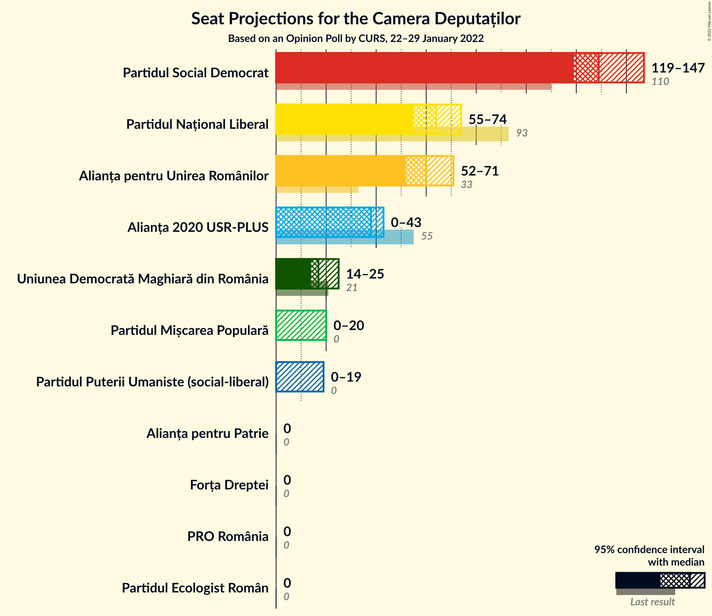

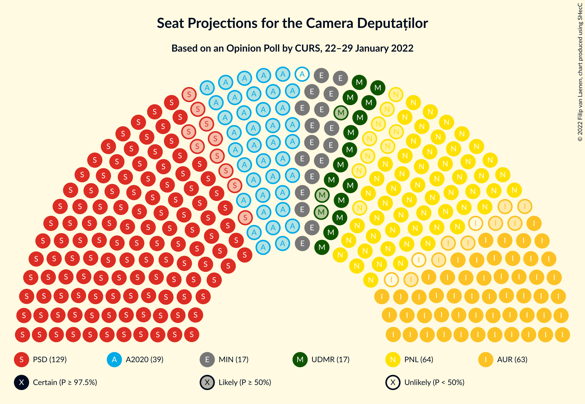

### Confidence Intervals

| Party | Last Result | Median | 80% Confidence Interval | 90% Confidence Interval | 95% Confidence Interval | 99% Confidence Interval |
|:-----:|:-----------:|:------:|:-----------------------:|:-----------------------:|:-----------------------:|:-----------------------:|
| <a href="#partidul-social-democrat">Partidul Social Democrat</a> | 110 | 129 | 123–140 |121–144 |119–147 |114–157 |
| <a href="#partidul-național-liberal">Partidul Național Liberal</a> | 93 | 64 | 57–73 |56–74 |55–74 |53–78 |
| <a href="#alianța-pentru-unirea-românilor">Alianța pentru Unirea Românilor</a> | 33 | 60 | 53–68 |52–69 |52–71 |49–75 |
| <a href="#alianța-2020-usr-plus">Alianța 2020 USR-PLUS</a> | 55 | 38 | 34–41 |31–41 |0–43 |0–48 |
| <a href="#uniunea-democrată-maghiară-din-românia">Uniunea Democrată Maghiară din România</a> | 21 | 17 | 15–23 |15–25 |14–25 |12–26 |
| <a href="#partidul-mișcarea-populară">Partidul Mișcarea Populară</a> | 0 | 0 | 0 |0 |0–20 |0–21 |
| <a href="#partidul-puterii-umaniste-(social-liberal)">Partidul Puterii Umaniste (social-liberal)</a> | 0 | 0 | 0 |0 |0–19 |0–20 |
| <a href="#partidul-ecologist-român">Partidul Ecologist Român</a> | 0 | 0 | 0 |0 |0 |0 |
| <a href="#forța-dreptei">Forța Dreptei</a> | 0 | 0 | 0 |0 |0 |0 |
| <a href="#pro-românia">PRO România</a> | 0 | 0 | 0 |0 |0 |0 |
| <a href="#alianța-pentru-patrie">Alianța pentru Patrie</a> | 0 | 0 | 0 |0 |0 |0 |

### Partidul Social Democrat

*For a full overview of the results for this party, see the [Partidul Social Democrat](party-partidulsocialdemocrat.html) page.*

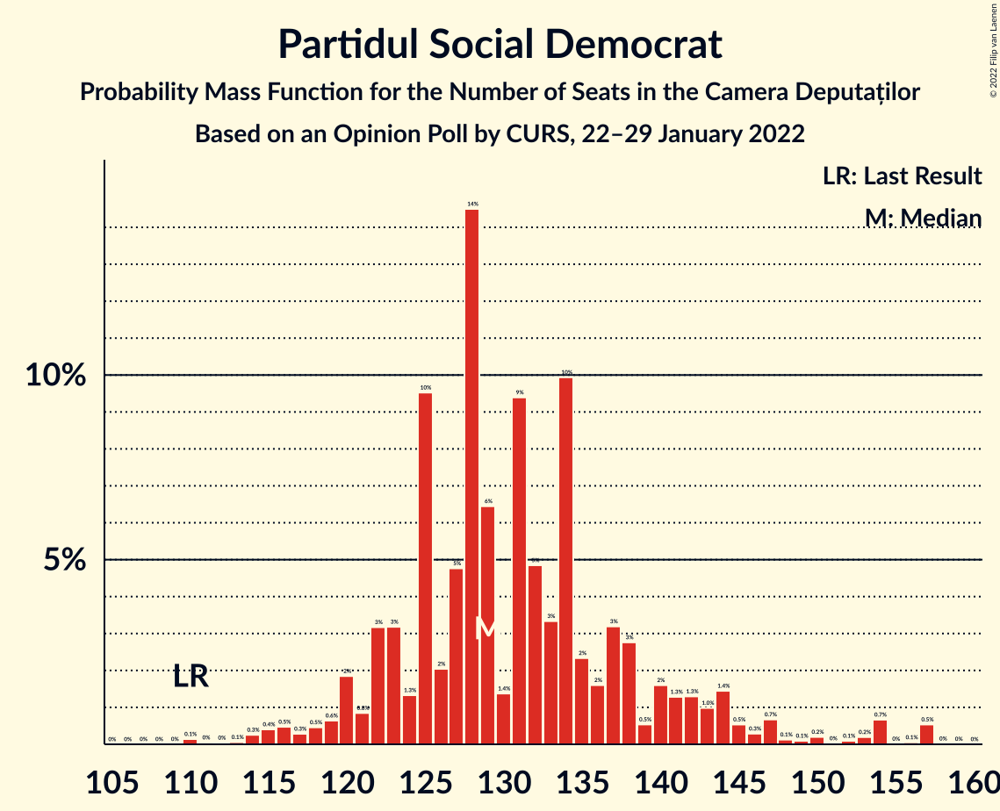

| Number of Seats | Probability | Accumulated | Special Marks |
|:---------------:|:-----------:|:-----------:|:-------------:|
| 110 | 0.1% | 100% | Last Result |
| 111 | 0% | 99.8% |  |
| 112 | 0% | 99.8% |  |
| 113 | 0.1% | 99.7% |  |
| 114 | 0.3% | 99.7% |  |
| 115 | 0.4% | 99.4% |  |
| 116 | 0.5% | 99.0% |  |
| 117 | 0.3% | 98.6% |  |
| 118 | 0.5% | 98% |  |
| 119 | 0.6% | 98% |  |
| 120 | 2% | 97% |  |
| 121 | 0.8% | 95% |  |
| 122 | 3% | 94% |  |
| 123 | 3% | 91% |  |
| 124 | 1.3% | 88% |  |
| 125 | 10% | 87% |  |
| 126 | 2% | 77% |  |
| 127 | 5% | 75% |  |
| 128 | 14% | 70% |  |
| 129 | 6% | 56% | Median |
| 130 | 1.4% | 50% |  |
| 131 | 9% | 48% |  |
| 132 | 5% | 39% |  |
| 133 | 3% | 34% |  |
| 134 | 10% | 31% |  |
| 135 | 2% | 21% |  |
| 136 | 2% | 18% |  |
| 137 | 3% | 17% |  |
| 138 | 3% | 13% |  |
| 139 | 0.5% | 11% |  |
| 140 | 2% | 10% |  |
| 141 | 1.3% | 9% |  |
| 142 | 1.3% | 7% |  |
| 143 | 1.0% | 6% |  |
| 144 | 1.4% | 5% |  |
| 145 | 0.5% | 4% |  |
| 146 | 0.3% | 3% |  |
| 147 | 0.7% | 3% |  |
| 148 | 0.1% | 2% |  |
| 149 | 0.1% | 2% |  |
| 150 | 0.2% | 2% |  |
| 151 | 0% | 2% |  |
| 152 | 0.1% | 2% |  |
| 153 | 0.2% | 2% |  |
| 154 | 0.7% | 1.3% |  |
| 155 | 0% | 0.7% |  |
| 156 | 0.1% | 0.6% |  |
| 157 | 0.5% | 0.6% |  |
| 158 | 0% | 0.1% |  |
| 159 | 0% | 0% |  |

### Partidul Național Liberal

*For a full overview of the results for this party, see the [Partidul Național Liberal](party-partidulnaționalliberal.html) page.*

| Number of Seats | Probability | Accumulated | Special Marks |
|:---------------:|:-----------:|:-----------:|:-------------:|
| 48 | 0% | 100% |  |
| 49 | 0% | 99.9% |  |
| 50 | 0.1% | 99.9% |  |
| 51 | 0.1% | 99.8% |  |
| 52 | 0.2% | 99.7% |  |
| 53 | 0.8% | 99.5% |  |
| 54 | 0.7% | 98.7% |  |
| 55 | 1.1% | 98% |  |
| 56 | 3% | 97% |  |
| 57 | 5% | 94% |  |
| 58 | 4% | 89% |  |
| 59 | 4% | 85% |  |
| 60 | 4% | 81% |  |
| 61 | 11% | 77% |  |
| 62 | 3% | 66% |  |
| 63 | 5% | 63% |  |
| 64 | 8% | 58% | Median |
| 65 | 6% | 49% |  |
| 66 | 7% | 44% |  |
| 67 | 5% | 37% |  |
| 68 | 6% | 31% |  |
| 69 | 5% | 25% |  |
| 70 | 1.4% | 21% |  |
| 71 | 8% | 19% |  |
| 72 | 0.6% | 12% |  |
| 73 | 2% | 11% |  |
| 74 | 7% | 9% |  |
| 75 | 0.9% | 2% |  |
| 76 | 0.3% | 1.1% |  |
| 77 | 0.2% | 0.8% |  |
| 78 | 0.2% | 0.6% |  |
| 79 | 0% | 0.4% |  |
| 80 | 0.2% | 0.4% |  |
| 81 | 0.1% | 0.2% |  |
| 82 | 0.1% | 0.2% |  |
| 83 | 0% | 0.1% |  |
| 84 | 0% | 0% |  |
| 85 | 0% | 0% |  |
| 86 | 0% | 0% |  |
| 87 | 0% | 0% |  |
| 88 | 0% | 0% |  |
| 89 | 0% | 0% |  |
| 90 | 0% | 0% |  |
| 91 | 0% | 0% |  |
| 92 | 0% | 0% |  |
| 93 | 0% | 0% | Last Result |

### Alianța pentru Unirea Românilor

*For a full overview of the results for this party, see the [Alianța pentru Unirea Românilor](party-alianțapentruunirearomânilor.html) page.*

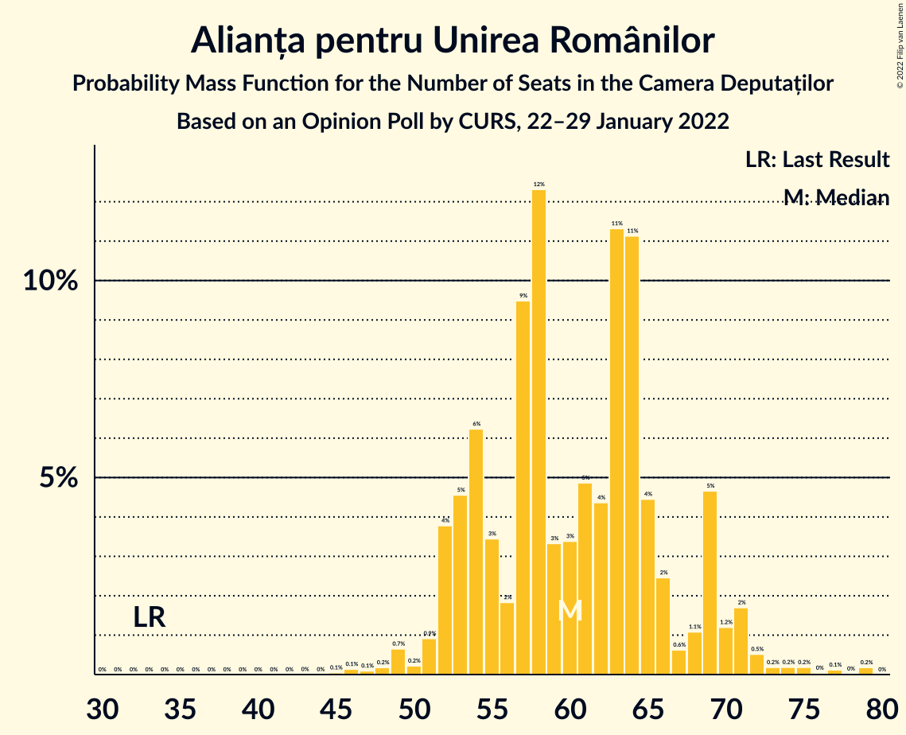

| Number of Seats | Probability | Accumulated | Special Marks |
|:---------------:|:-----------:|:-----------:|:-------------:|
| 33 | 0% | 100% | Last Result |
| 34 | 0% | 100% |  |
| 35 | 0% | 100% |  |
| 36 | 0% | 100% |  |
| 37 | 0% | 100% |  |
| 38 | 0% | 100% |  |
| 39 | 0% | 100% |  |
| 40 | 0% | 100% |  |
| 41 | 0% | 100% |  |
| 42 | 0% | 100% |  |
| 43 | 0% | 100% |  |
| 44 | 0% | 100% |  |
| 45 | 0.1% | 100% |  |
| 46 | 0.1% | 99.9% |  |
| 47 | 0.1% | 99.8% |  |
| 48 | 0.2% | 99.7% |  |
| 49 | 0.7% | 99.5% |  |
| 50 | 0.2% | 98.9% |  |
| 51 | 0.9% | 98.6% |  |
| 52 | 4% | 98% |  |
| 53 | 5% | 94% |  |
| 54 | 6% | 89% |  |
| 55 | 3% | 83% |  |
| 56 | 2% | 80% |  |
| 57 | 9% | 78% |  |
| 58 | 12% | 68% |  |
| 59 | 3% | 56% |  |
| 60 | 3% | 53% | Median |
| 61 | 5% | 49% |  |
| 62 | 4% | 44% |  |
| 63 | 11% | 40% |  |
| 64 | 11% | 29% |  |
| 65 | 4% | 18% |  |
| 66 | 2% | 13% |  |
| 67 | 0.6% | 11% |  |
| 68 | 1.1% | 10% |  |
| 69 | 5% | 9% |  |
| 70 | 1.2% | 4% |  |
| 71 | 2% | 3% |  |
| 72 | 0.5% | 1.5% |  |
| 73 | 0.2% | 0.9% |  |
| 74 | 0.2% | 0.8% |  |
| 75 | 0.2% | 0.6% |  |
| 76 | 0% | 0.4% |  |
| 77 | 0.1% | 0.3% |  |
| 78 | 0% | 0.2% |  |
| 79 | 0.2% | 0.2% |  |
| 80 | 0% | 0% |  |

### Alianța 2020 USR-PLUS

*For a full overview of the results for this party, see the [Alianța 2020 USR-PLUS](party-alianța2020usr-plus.html) page.*

| Number of Seats | Probability | Accumulated | Special Marks |
|:---------------:|:-----------:|:-----------:|:-------------:|
| 0 | 4% | 100% |  |
| 1 | 0% | 96% |  |
| 2 | 0% | 96% |  |
| 3 | 0% | 96% |  |
| 4 | 0% | 96% |  |
| 5 | 0% | 96% |  |
| 6 | 0% | 96% |  |
| 7 | 0% | 96% |  |
| 8 | 0% | 96% |  |
| 9 | 0% | 96% |  |
| 10 | 0% | 96% |  |
| 11 | 0% | 96% |  |
| 12 | 0% | 96% |  |
| 13 | 0% | 96% |  |
| 14 | 0% | 96% |  |
| 15 | 0% | 96% |  |
| 16 | 0% | 96% |  |
| 17 | 0% | 96% |  |
| 18 | 0% | 96% |  |
| 19 | 0% | 96% |  |
| 20 | 0% | 96% |  |
| 21 | 0% | 96% |  |
| 22 | 0% | 96% |  |
| 23 | 0% | 96% |  |
| 24 | 0% | 96% |  |
| 25 | 0% | 96% |  |
| 26 | 0% | 96% |  |
| 27 | 0% | 96% |  |
| 28 | 0% | 96% |  |
| 29 | 0% | 96% |  |
| 30 | 0.2% | 96% |  |
| 31 | 1.1% | 96% |  |
| 32 | 2% | 95% |  |
| 33 | 3% | 93% |  |
| 34 | 5% | 90% |  |
| 35 | 8% | 85% |  |
| 36 | 7% | 76% |  |
| 37 | 10% | 69% |  |
| 38 | 17% | 59% | Median |
| 39 | 23% | 42% |  |
| 40 | 6% | 19% |  |
| 41 | 10% | 14% |  |
| 42 | 2% | 4% |  |
| 43 | 0.4% | 3% |  |
| 44 | 0.3% | 2% |  |
| 45 | 0.9% | 2% |  |
| 46 | 0.2% | 1.1% |  |
| 47 | 0.2% | 0.9% |  |
| 48 | 0.3% | 0.7% |  |
| 49 | 0.4% | 0.5% |  |
| 50 | 0.1% | 0.1% |  |
| 51 | 0% | 0% |  |
| 52 | 0% | 0% |  |
| 53 | 0% | 0% |  |
| 54 | 0% | 0% |  |
| 55 | 0% | 0% | Last Result |

### Uniunea Democrată Maghiară din România

*For a full overview of the results for this party, see the [Uniunea Democrată Maghiară din România](party-uniuneademocratămaghiarădinromânia.html) page.*

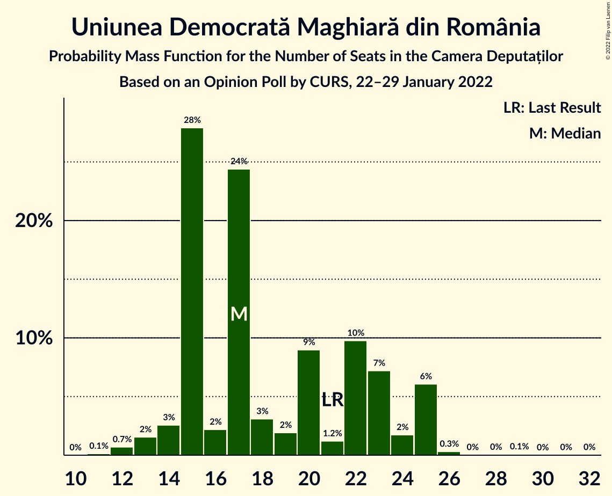

| Number of Seats | Probability | Accumulated | Special Marks |
|:---------------:|:-----------:|:-----------:|:-------------:|
| 11 | 0.1% | 100% |  |
| 12 | 0.7% | 99.9% |  |
| 13 | 2% | 99.2% |  |
| 14 | 3% | 98% |  |
| 15 | 28% | 95% |  |
| 16 | 2% | 67% |  |
| 17 | 24% | 65% | Median |
| 18 | 3% | 41% |  |
| 19 | 2% | 37% |  |
| 20 | 9% | 36% |  |
| 21 | 1.2% | 27% | Last Result |
| 22 | 10% | 25% |  |
| 23 | 7% | 16% |  |
| 24 | 2% | 8% |  |
| 25 | 6% | 7% |  |
| 26 | 0.3% | 0.6% |  |
| 27 | 0% | 0.2% |  |
| 28 | 0% | 0.2% |  |
| 29 | 0.1% | 0.2% |  |
| 30 | 0% | 0.1% |  |
| 31 | 0% | 0.1% |  |
| 32 | 0% | 0% |  |

### Partidul Mișcarea Populară

*For a full overview of the results for this party, see the [Partidul Mișcarea Populară](party-partidulmișcareapopulară.html) page.*

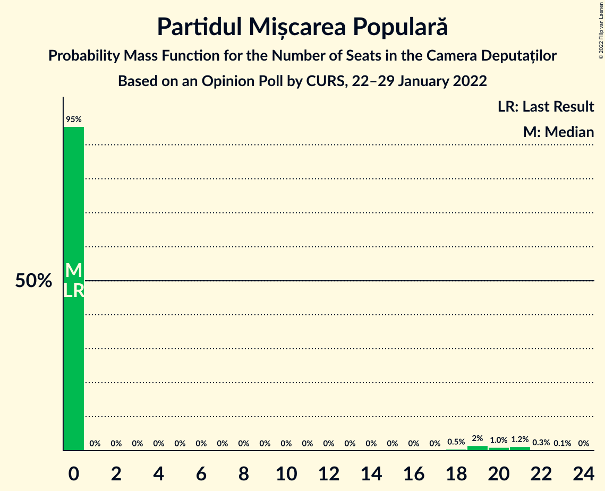

| Number of Seats | Probability | Accumulated | Special Marks |
|:---------------:|:-----------:|:-----------:|:-------------:|
| 0 | 95% | 100% | Last Result, Median |
| 1 | 0% | 5% |  |
| 2 | 0% | 5% |  |
| 3 | 0% | 5% |  |
| 4 | 0% | 5% |  |
| 5 | 0% | 5% |  |
| 6 | 0% | 5% |  |
| 7 | 0% | 5% |  |
| 8 | 0% | 5% |  |
| 9 | 0% | 5% |  |
| 10 | 0% | 5% |  |
| 11 | 0% | 5% |  |
| 12 | 0% | 5% |  |
| 13 | 0% | 5% |  |
| 14 | 0% | 5% |  |
| 15 | 0% | 5% |  |
| 16 | 0% | 5% |  |
| 17 | 0% | 5% |  |
| 18 | 0.5% | 5% |  |
| 19 | 2% | 4% |  |
| 20 | 1.0% | 3% |  |
| 21 | 1.2% | 2% |  |
| 22 | 0.3% | 0.4% |  |
| 23 | 0.1% | 0.1% |  |
| 24 | 0% | 0% |  |

### Partidul Puterii Umaniste (social-liberal)

*For a full overview of the results for this party, see the [Partidul Puterii Umaniste (social-liberal)](party-partidulputeriiumanistesocial-liberal.html) page.*

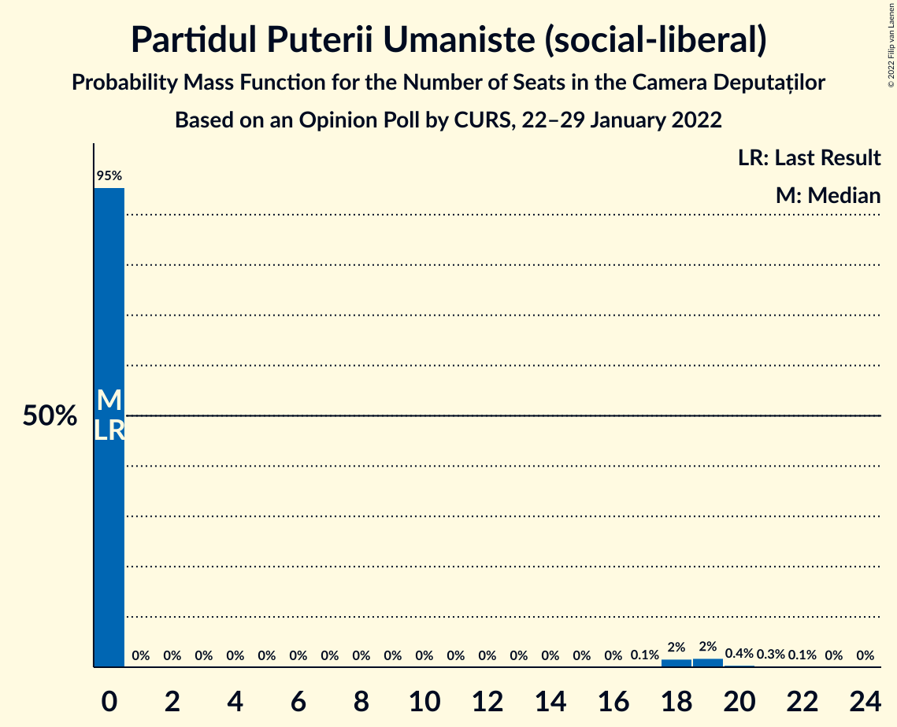

| Number of Seats | Probability | Accumulated | Special Marks |
|:---------------:|:-----------:|:-----------:|:-------------:|
| 0 | 95% | 100% | Last Result, Median |
| 1 | 0% | 5% |  |
| 2 | 0% | 5% |  |
| 3 | 0% | 5% |  |
| 4 | 0% | 5% |  |
| 5 | 0% | 5% |  |
| 6 | 0% | 5% |  |
| 7 | 0% | 5% |  |
| 8 | 0% | 5% |  |
| 9 | 0% | 5% |  |
| 10 | 0% | 5% |  |
| 11 | 0% | 5% |  |
| 12 | 0% | 5% |  |
| 13 | 0% | 5% |  |
| 14 | 0% | 5% |  |
| 15 | 0% | 5% |  |
| 16 | 0% | 5% |  |
| 17 | 0.1% | 5% |  |
| 18 | 2% | 4% |  |
| 19 | 2% | 3% |  |
| 20 | 0.4% | 0.9% |  |
| 21 | 0.3% | 0.5% |  |
| 22 | 0.1% | 0.2% |  |
| 23 | 0% | 0.1% |  |
| 24 | 0% | 0% |  |

### Partidul Ecologist Român

*For a full overview of the results for this party, see the [Partidul Ecologist Român](party-partidulecologistromân.html) page.*

| Number of Seats | Probability | Accumulated | Special Marks |
|:---------------:|:-----------:|:-----------:|:-------------:|
| 0 | 100% | 100% | Last Result, Median |

### Forța Dreptei

*For a full overview of the results for this party, see the [Forța Dreptei](party-forțadreptei.html) page.*

| Number of Seats | Probability | Accumulated | Special Marks |
|:---------------:|:-----------:|:-----------:|:-------------:|
| 0 | 100% | 100% | Last Result, Median |

### PRO România

*For a full overview of the results for this party, see the [PRO România](party-proromânia.html) page.*

| Number of Seats | Probability | Accumulated | Special Marks |
|:---------------:|:-----------:|:-----------:|:-------------:|
| 0 | 100% | 100% | Last Result, Median |

### Alianța pentru Patrie

*For a full overview of the results for this party, see the [Alianța pentru Patrie](party-alianțapentrupatrie.html) page.*

| Number of Seats | Probability | Accumulated | Special Marks |
|:---------------:|:-----------:|:-----------:|:-------------:|
| 0 | 100% | 100% | Last Result, Median |

## Coalitions

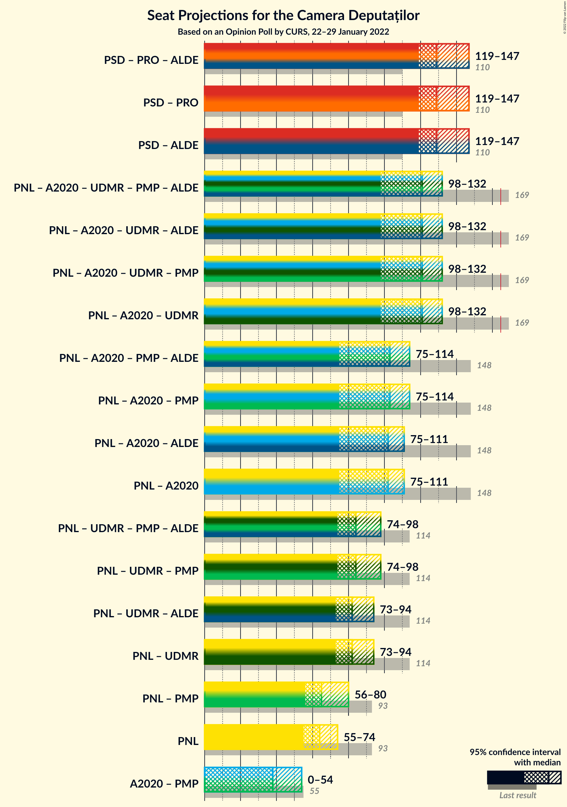

### Confidence Intervals

| Coalition | Last Result | Median | Majority? | 80% Confidence Interval | 90% Confidence Interval | 95% Confidence Interval | 99% Confidence Interval |
|:---------:|:-----------:|:------:|:---------:|:-----------------------:|:-----------------------:|:-----------------------:|:-----------------------:|
| Partidul Social Democrat – PRO România | 110 | 129 | 0% | 123–140 | 121–144 | 119–147 | 114–157 |
| Partidul Național Liberal – Alianța 2020 USR-PLUS – Uniunea Democrată Maghiară din România – Partidul Mișcarea Populară | 169 | 121 | 0% | 112–128 | 108–132 | 98–132 | 87–139 |
| Partidul Național Liberal – Alianța 2020 USR-PLUS – Uniunea Democrată Maghiară din România | 169 | 121 | 0% | 110–126 | 105–130 | 98–132 | 87–133 |
| Partidul Național Liberal – Alianța 2020 USR-PLUS – Partidul Mișcarea Populară | 148 | 103 | 0% | 95–109 | 90–111 | 75–114 | 67–124 |
| Partidul Național Liberal – Alianța 2020 USR-PLUS | 148 | 102 | 0% | 94–109 | 88–109 | 75–111 | 67–114 |
| Partidul Național Liberal – Uniunea Democrată Maghiară din România – Partidul Mișcarea Populară | 114 | 84 | 0% | 77–92 | 74–94 | 74–98 | 70–105 |
| Partidul Național Liberal – Uniunea Democrată Maghiară din România | 114 | 82 | 0% | 75–89 | 74–92 | 73–94 | 69–100 |
| Partidul Național Liberal – Partidul Mișcarea Populară | 93 | 65 | 0% | 58–74 | 56–76 | 56–80 | 53–90 |
| Partidul Național Liberal | 93 | 64 | 0% | 57–73 | 56–74 | 55–74 | 53–78 |
| Alianța 2020 USR-PLUS – Partidul Mișcarea Populară | 55 | 38 | 0% | 34–41 | 32–48 | 0–54 | 0–57 |

### Partidul Social Democrat – PRO România

| Number of Seats | Probability | Accumulated | Special Marks |
|:---------------:|:-----------:|:-----------:|:-------------:|
| 110 | 0.1% | 100% | Last Result |
| 111 | 0% | 99.8% |  |
| 112 | 0% | 99.8% |  |
| 113 | 0.1% | 99.7% |  |
| 114 | 0.3% | 99.7% |  |
| 115 | 0.4% | 99.4% |  |
| 116 | 0.5% | 99.0% |  |
| 117 | 0.3% | 98.6% |  |
| 118 | 0.5% | 98% |  |
| 119 | 0.6% | 98% |  |
| 120 | 2% | 97% |  |
| 121 | 0.8% | 95% |  |
| 122 | 3% | 94% |  |
| 123 | 3% | 91% |  |
| 124 | 1.3% | 88% |  |
| 125 | 10% | 87% |  |
| 126 | 2% | 77% |  |
| 127 | 5% | 75% |  |
| 128 | 14% | 70% |  |
| 129 | 6% | 56% | Median |
| 130 | 1.4% | 50% |  |
| 131 | 9% | 48% |  |
| 132 | 5% | 39% |  |
| 133 | 3% | 34% |  |
| 134 | 10% | 31% |  |
| 135 | 2% | 21% |  |
| 136 | 2% | 18% |  |
| 137 | 3% | 17% |  |
| 138 | 3% | 13% |  |
| 139 | 0.5% | 11% |  |
| 140 | 2% | 10% |  |
| 141 | 1.3% | 9% |  |
| 142 | 1.3% | 7% |  |
| 143 | 1.0% | 6% |  |
| 144 | 1.4% | 5% |  |
| 145 | 0.5% | 4% |  |
| 146 | 0.3% | 3% |  |
| 147 | 0.7% | 3% |  |
| 148 | 0.1% | 2% |  |
| 149 | 0.1% | 2% |  |
| 150 | 0.2% | 2% |  |
| 151 | 0% | 2% |  |
| 152 | 0.1% | 2% |  |
| 153 | 0.2% | 2% |  |
| 154 | 0.7% | 1.3% |  |
| 155 | 0% | 0.7% |  |
| 156 | 0.1% | 0.6% |  |
| 157 | 0.5% | 0.6% |  |
| 158 | 0% | 0.1% |  |
| 159 | 0% | 0% |  |

### Partidul Național Liberal – Alianța 2020 USR-PLUS – Uniunea Democrată Maghiară din România – Partidul Mișcarea Populară

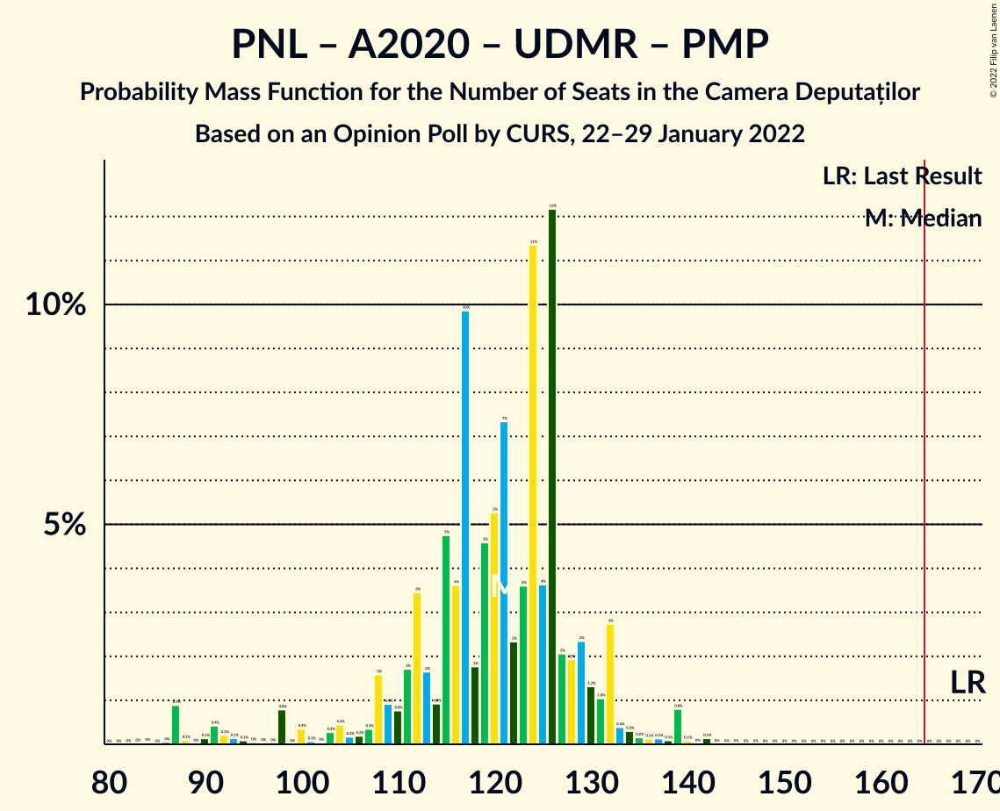

| Number of Seats | Probability | Accumulated | Special Marks |
|:---------------:|:-----------:|:-----------:|:-------------:|
| 83 | 0% | 100% |  |
| 84 | 0% | 99.9% |  |
| 85 | 0% | 99.9% |  |
| 86 | 0% | 99.9% |  |
| 87 | 0.9% | 99.9% |  |
| 88 | 0.1% | 99.0% |  |
| 89 | 0% | 98.9% |  |
| 90 | 0.1% | 98.8% |  |
| 91 | 0.4% | 98.7% |  |
| 92 | 0.2% | 98% |  |
| 93 | 0.1% | 98% |  |
| 94 | 0.1% | 98% |  |
| 95 | 0% | 98% |  |
| 96 | 0% | 98% |  |
| 97 | 0% | 98% |  |
| 98 | 0.8% | 98% |  |
| 99 | 0% | 97% |  |
| 100 | 0.4% | 97% |  |
| 101 | 0.1% | 97% |  |
| 102 | 0% | 97% |  |
| 103 | 0.3% | 96% |  |
| 104 | 0.4% | 96% |  |
| 105 | 0.2% | 96% |  |
| 106 | 0.2% | 96% |  |
| 107 | 0.3% | 95% |  |
| 108 | 2% | 95% |  |
| 109 | 0.9% | 93% |  |
| 110 | 0.8% | 93% |  |
| 111 | 2% | 92% |  |
| 112 | 3% | 90% |  |
| 113 | 2% | 87% |  |
| 114 | 0.9% | 85% |  |
| 115 | 5% | 84% |  |
| 116 | 4% | 79% |  |
| 117 | 10% | 76% |  |
| 118 | 2% | 66% |  |
| 119 | 5% | 64% | Median |
| 120 | 5% | 59% |  |
| 121 | 7% | 54% |  |
| 122 | 2% | 47% |  |
| 123 | 4% | 44% |  |
| 124 | 11% | 41% |  |
| 125 | 4% | 30% |  |
| 126 | 12% | 26% |  |
| 127 | 2% | 14% |  |
| 128 | 2% | 12% |  |
| 129 | 2% | 10% |  |
| 130 | 1.3% | 7% |  |
| 131 | 1.0% | 6% |  |
| 132 | 3% | 5% |  |
| 133 | 0.4% | 2% |  |
| 134 | 0.3% | 2% |  |
| 135 | 0.2% | 2% |  |
| 136 | 0.1% | 1.4% |  |
| 137 | 0.1% | 1.3% |  |
| 138 | 0.1% | 1.2% |  |
| 139 | 0.8% | 1.1% |  |
| 140 | 0.1% | 0.3% |  |
| 141 | 0% | 0.2% |  |
| 142 | 0.1% | 0.2% |  |
| 143 | 0% | 0% |  |
| 144 | 0% | 0% |  |
| 145 | 0% | 0% |  |
| 146 | 0% | 0% |  |
| 147 | 0% | 0% |  |
| 148 | 0% | 0% |  |
| 149 | 0% | 0% |  |
| 150 | 0% | 0% |  |
| 151 | 0% | 0% |  |
| 152 | 0% | 0% |  |
| 153 | 0% | 0% |  |
| 154 | 0% | 0% |  |
| 155 | 0% | 0% |  |
| 156 | 0% | 0% |  |
| 157 | 0% | 0% |  |
| 158 | 0% | 0% |  |
| 159 | 0% | 0% |  |
| 160 | 0% | 0% |  |
| 161 | 0% | 0% |  |
| 162 | 0% | 0% |  |
| 163 | 0% | 0% |  |
| 164 | 0% | 0% |  |
| 165 | 0% | 0% | Majority |
| 166 | 0% | 0% |  |
| 167 | 0% | 0% |  |
| 168 | 0% | 0% |  |
| 169 | 0% | 0% | Last Result |

### Partidul Național Liberal – Alianța 2020 USR-PLUS – Uniunea Democrată Maghiară din România

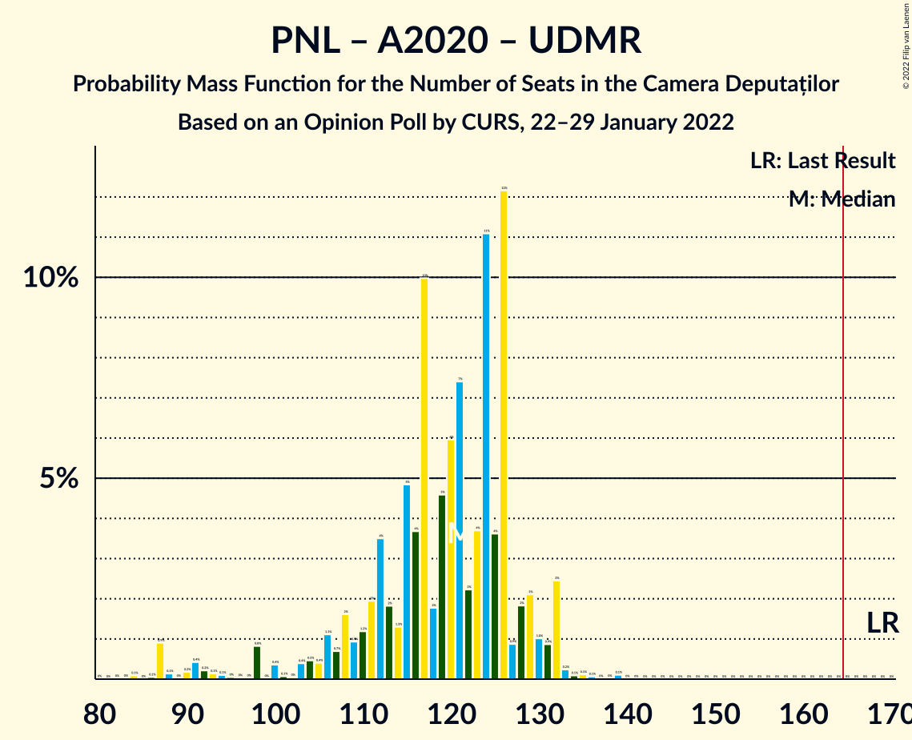

| Number of Seats | Probability | Accumulated | Special Marks |
|:---------------:|:-----------:|:-----------:|:-------------:|
| 82 | 0% | 100% |  |
| 83 | 0% | 99.9% |  |
| 84 | 0.1% | 99.9% |  |
| 85 | 0% | 99.8% |  |
| 86 | 0.1% | 99.8% |  |
| 87 | 0.9% | 99.8% |  |
| 88 | 0.1% | 98.9% |  |
| 89 | 0% | 98.7% |  |
| 90 | 0.2% | 98.7% |  |
| 91 | 0.4% | 98.5% |  |
| 92 | 0.2% | 98% |  |
| 93 | 0.1% | 98% |  |
| 94 | 0.1% | 98% |  |
| 95 | 0% | 98% |  |
| 96 | 0% | 98% |  |
| 97 | 0% | 98% |  |
| 98 | 0.8% | 98% |  |
| 99 | 0% | 97% |  |
| 100 | 0.4% | 97% |  |
| 101 | 0.1% | 96% |  |
| 102 | 0% | 96% |  |
| 103 | 0.4% | 96% |  |
| 104 | 0.5% | 96% |  |
| 105 | 0.4% | 95% |  |
| 106 | 1.1% | 95% |  |
| 107 | 0.7% | 94% |  |
| 108 | 2% | 93% |  |
| 109 | 0.9% | 92% |  |
| 110 | 1.2% | 91% |  |
| 111 | 2% | 89% |  |
| 112 | 4% | 87% |  |
| 113 | 2% | 84% |  |
| 114 | 1.3% | 82% |  |
| 115 | 5% | 81% |  |
| 116 | 4% | 76% |  |
| 117 | 10% | 72% |  |
| 118 | 2% | 62% |  |
| 119 | 5% | 61% | Median |
| 120 | 6% | 56% |  |
| 121 | 7% | 50% |  |
| 122 | 2% | 43% |  |
| 123 | 4% | 40% |  |
| 124 | 11% | 37% |  |
| 125 | 4% | 26% |  |
| 126 | 12% | 22% |  |
| 127 | 0.9% | 10% |  |
| 128 | 2% | 9% |  |
| 129 | 2% | 7% |  |
| 130 | 1.0% | 5% |  |
| 131 | 0.9% | 4% |  |
| 132 | 2% | 3% |  |
| 133 | 0.2% | 0.7% |  |
| 134 | 0.1% | 0.4% |  |
| 135 | 0.1% | 0.3% |  |
| 136 | 0.1% | 0.2% |  |
| 137 | 0% | 0.2% |  |
| 138 | 0% | 0.1% |  |
| 139 | 0.1% | 0.1% |  |
| 140 | 0% | 0% |  |
| 141 | 0% | 0% |  |
| 142 | 0% | 0% |  |
| 143 | 0% | 0% |  |
| 144 | 0% | 0% |  |
| 145 | 0% | 0% |  |
| 146 | 0% | 0% |  |
| 147 | 0% | 0% |  |
| 148 | 0% | 0% |  |
| 149 | 0% | 0% |  |
| 150 | 0% | 0% |  |
| 151 | 0% | 0% |  |
| 152 | 0% | 0% |  |
| 153 | 0% | 0% |  |
| 154 | 0% | 0% |  |
| 155 | 0% | 0% |  |
| 156 | 0% | 0% |  |
| 157 | 0% | 0% |  |
| 158 | 0% | 0% |  |
| 159 | 0% | 0% |  |
| 160 | 0% | 0% |  |
| 161 | 0% | 0% |  |
| 162 | 0% | 0% |  |
| 163 | 0% | 0% |  |
| 164 | 0% | 0% |  |
| 165 | 0% | 0% | Majority |
| 166 | 0% | 0% |  |
| 167 | 0% | 0% |  |
| 168 | 0% | 0% |  |
| 169 | 0% | 0% | Last Result |

### Partidul Național Liberal – Alianța 2020 USR-PLUS – Partidul Mișcarea Populară

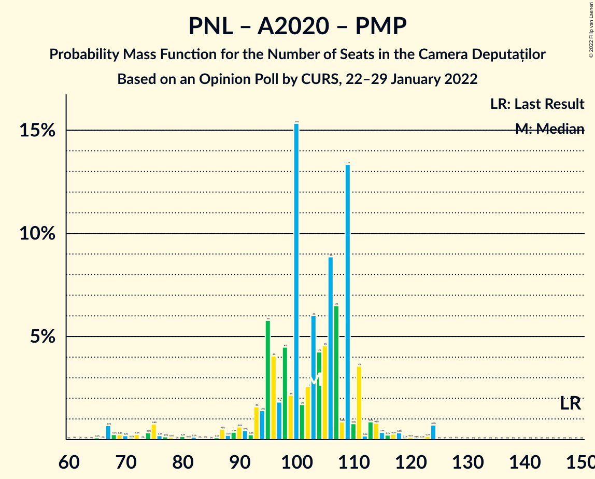

| Number of Seats | Probability | Accumulated | Special Marks |
|:---------------:|:-----------:|:-----------:|:-------------:|
| 62 | 0% | 100% |  |
| 63 | 0% | 99.9% |  |
| 64 | 0% | 99.9% |  |
| 65 | 0.1% | 99.9% |  |
| 66 | 0% | 99.8% |  |
| 67 | 0.7% | 99.8% |  |
| 68 | 0.2% | 99.1% |  |
| 69 | 0.2% | 98.9% |  |
| 70 | 0.2% | 98.7% |  |
| 71 | 0.1% | 98% |  |
| 72 | 0.2% | 98% |  |
| 73 | 0% | 98% |  |
| 74 | 0.3% | 98% |  |
| 75 | 0.8% | 98% |  |
| 76 | 0.2% | 97% |  |
| 77 | 0.1% | 97% |  |
| 78 | 0.1% | 97% |  |
| 79 | 0% | 97% |  |
| 80 | 0.2% | 97% |  |
| 81 | 0.1% | 96% |  |
| 82 | 0.1% | 96% |  |
| 83 | 0% | 96% |  |
| 84 | 0% | 96% |  |
| 85 | 0% | 96% |  |
| 86 | 0.1% | 96% |  |
| 87 | 0.5% | 96% |  |
| 88 | 0.2% | 96% |  |
| 89 | 0.4% | 95% |  |
| 90 | 0.6% | 95% |  |
| 91 | 0.4% | 94% |  |
| 92 | 0.2% | 94% |  |
| 93 | 2% | 94% |  |
| 94 | 1.4% | 92% |  |
| 95 | 6% | 91% |  |
| 96 | 4% | 85% |  |
| 97 | 2% | 81% |  |
| 98 | 4% | 79% |  |
| 99 | 2% | 75% |  |
| 100 | 15% | 72% |  |
| 101 | 2% | 57% |  |
| 102 | 3% | 55% | Median |
| 103 | 6% | 53% |  |
| 104 | 4% | 47% |  |
| 105 | 5% | 43% |  |
| 106 | 9% | 38% |  |
| 107 | 6% | 29% |  |
| 108 | 0.9% | 23% |  |
| 109 | 13% | 22% |  |
| 110 | 0.8% | 8% |  |
| 111 | 4% | 8% |  |
| 112 | 0.2% | 4% |  |
| 113 | 0.9% | 4% |  |
| 114 | 0.8% | 3% |  |
| 115 | 0.4% | 2% |  |
| 116 | 0.2% | 2% |  |
| 117 | 0.3% | 2% |  |
| 118 | 0.3% | 2% |  |
| 119 | 0.1% | 1.2% |  |
| 120 | 0.1% | 1.1% |  |
| 121 | 0.1% | 1.0% |  |
| 122 | 0.1% | 1.0% |  |
| 123 | 0.2% | 0.9% |  |
| 124 | 0.7% | 0.7% |  |
| 125 | 0% | 0% |  |
| 126 | 0% | 0% |  |
| 127 | 0% | 0% |  |
| 128 | 0% | 0% |  |
| 129 | 0% | 0% |  |
| 130 | 0% | 0% |  |
| 131 | 0% | 0% |  |
| 132 | 0% | 0% |  |
| 133 | 0% | 0% |  |
| 134 | 0% | 0% |  |
| 135 | 0% | 0% |  |
| 136 | 0% | 0% |  |
| 137 | 0% | 0% |  |
| 138 | 0% | 0% |  |
| 139 | 0% | 0% |  |
| 140 | 0% | 0% |  |
| 141 | 0% | 0% |  |
| 142 | 0% | 0% |  |
| 143 | 0% | 0% |  |
| 144 | 0% | 0% |  |
| 145 | 0% | 0% |  |
| 146 | 0% | 0% |  |
| 147 | 0% | 0% |  |
| 148 | 0% | 0% | Last Result |

### Partidul Național Liberal – Alianța 2020 USR-PLUS

| Number of Seats | Probability | Accumulated | Special Marks |
|:---------------:|:-----------:|:-----------:|:-------------:|
| 61 | 0% | 100% |  |
| 62 | 0% | 99.9% |  |
| 63 | 0% | 99.9% |  |
| 64 | 0% | 99.9% |  |
| 65 | 0.1% | 99.9% |  |
| 66 | 0.1% | 99.8% |  |
| 67 | 0.7% | 99.7% |  |
| 68 | 0.3% | 99.0% |  |
| 69 | 0.3% | 98.8% |  |
| 70 | 0.2% | 98.5% |  |
| 71 | 0.1% | 98% |  |
| 72 | 0.2% | 98% |  |
| 73 | 0% | 98% |  |
| 74 | 0.3% | 98% |  |
| 75 | 0.8% | 98% |  |
| 76 | 0.2% | 97% |  |
| 77 | 0.1% | 97% |  |
| 78 | 0.1% | 97% |  |
| 79 | 0% | 96% |  |
| 80 | 0.2% | 96% |  |
| 81 | 0.1% | 96% |  |
| 82 | 0.1% | 96% |  |
| 83 | 0.1% | 96% |  |
| 84 | 0% | 96% |  |
| 85 | 0% | 96% |  |
| 86 | 0.2% | 96% |  |
| 87 | 0.5% | 96% |  |
| 88 | 0.3% | 95% |  |
| 89 | 0.3% | 95% |  |
| 90 | 2% | 95% |  |
| 91 | 0.7% | 93% |  |
| 92 | 0.3% | 92% |  |
| 93 | 2% | 92% |  |
| 94 | 2% | 90% |  |
| 95 | 6% | 89% |  |
| 96 | 4% | 82% |  |
| 97 | 2% | 78% |  |
| 98 | 5% | 76% |  |
| 99 | 2% | 71% |  |
| 100 | 15% | 69% |  |
| 101 | 2% | 54% |  |
| 102 | 3% | 52% | Median |
| 103 | 6% | 49% |  |
| 104 | 4% | 43% |  |
| 105 | 5% | 39% |  |
| 106 | 9% | 34% |  |
| 107 | 6% | 25% |  |
| 108 | 0.8% | 19% |  |
| 109 | 13% | 18% |  |
| 110 | 0.5% | 4% |  |
| 111 | 3% | 4% |  |
| 112 | 0.1% | 1.3% |  |
| 113 | 0.5% | 1.2% |  |
| 114 | 0.2% | 0.6% |  |
| 115 | 0.1% | 0.4% |  |
| 116 | 0.1% | 0.3% |  |
| 117 | 0.1% | 0.2% |  |
| 118 | 0% | 0% |  |
| 119 | 0% | 0% |  |
| 120 | 0% | 0% |  |
| 121 | 0% | 0% |  |
| 122 | 0% | 0% |  |
| 123 | 0% | 0% |  |
| 124 | 0% | 0% |  |
| 125 | 0% | 0% |  |
| 126 | 0% | 0% |  |
| 127 | 0% | 0% |  |
| 128 | 0% | 0% |  |
| 129 | 0% | 0% |  |
| 130 | 0% | 0% |  |
| 131 | 0% | 0% |  |
| 132 | 0% | 0% |  |
| 133 | 0% | 0% |  |
| 134 | 0% | 0% |  |
| 135 | 0% | 0% |  |
| 136 | 0% | 0% |  |
| 137 | 0% | 0% |  |
| 138 | 0% | 0% |  |
| 139 | 0% | 0% |  |
| 140 | 0% | 0% |  |
| 141 | 0% | 0% |  |
| 142 | 0% | 0% |  |
| 143 | 0% | 0% |  |
| 144 | 0% | 0% |  |
| 145 | 0% | 0% |  |
| 146 | 0% | 0% |  |
| 147 | 0% | 0% |  |
| 148 | 0% | 0% | Last Result |

### Partidul Național Liberal – Uniunea Democrată Maghiară din România – Partidul Mișcarea Populară

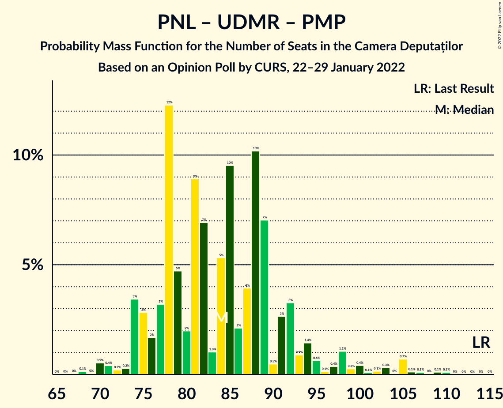

| Number of Seats | Probability | Accumulated | Special Marks |
|:---------------:|:-----------:|:-----------:|:-------------:|
| 67 | 0% | 100% |  |
| 68 | 0.1% | 99.9% |  |
| 69 | 0% | 99.8% |  |
| 70 | 0.5% | 99.8% |  |
| 71 | 0.4% | 99.2% |  |
| 72 | 0.2% | 98.8% |  |
| 73 | 0.3% | 98.6% |  |
| 74 | 3% | 98% |  |
| 75 | 3% | 95% |  |
| 76 | 2% | 92% |  |
| 77 | 3% | 90% |  |
| 78 | 12% | 87% |  |
| 79 | 5% | 75% |  |
| 80 | 2% | 70% |  |
| 81 | 9% | 68% | Median |
| 82 | 7% | 59% |  |
| 83 | 1.0% | 52% |  |
| 84 | 5% | 51% |  |
| 85 | 10% | 46% |  |
| 86 | 2% | 37% |  |
| 87 | 4% | 34% |  |
| 88 | 10% | 30% |  |
| 89 | 7% | 20% |  |
| 90 | 0.5% | 13% |  |
| 91 | 3% | 13% |  |
| 92 | 3% | 10% |  |
| 93 | 0.9% | 7% |  |
| 94 | 1.4% | 6% |  |
| 95 | 0.6% | 5% |  |
| 96 | 0.1% | 4% |  |
| 97 | 0.4% | 4% |  |
| 98 | 1.1% | 3% |  |
| 99 | 0.3% | 2% |  |
| 100 | 0.4% | 2% |  |
| 101 | 0.1% | 2% |  |
| 102 | 0.1% | 2% |  |
| 103 | 0.3% | 1.5% |  |
| 104 | 0% | 1.2% |  |
| 105 | 0.7% | 1.2% |  |
| 106 | 0.1% | 0.5% |  |
| 107 | 0.1% | 0.4% |  |
| 108 | 0% | 0.3% |  |
| 109 | 0.1% | 0.2% |  |
| 110 | 0.1% | 0.1% |  |
| 111 | 0% | 0% |  |
| 112 | 0% | 0% |  |
| 113 | 0% | 0% |  |
| 114 | 0% | 0% | Last Result |

### Partidul Național Liberal – Uniunea Democrată Maghiară din România

| Number of Seats | Probability | Accumulated | Special Marks |
|:---------------:|:-----------:|:-----------:|:-------------:|
| 66 | 0% | 100% |  |
| 67 | 0% | 99.9% |  |
| 68 | 0.2% | 99.9% |  |
| 69 | 0.3% | 99.7% |  |
| 70 | 0.6% | 99.4% |  |
| 71 | 0.4% | 98.8% |  |
| 72 | 0.6% | 98% |  |
| 73 | 1.5% | 98% |  |
| 74 | 3% | 96% |  |
| 75 | 3% | 93% |  |
| 76 | 2% | 90% |  |
| 77 | 3% | 88% |  |
| 78 | 12% | 84% |  |
| 79 | 5% | 72% |  |
| 80 | 2% | 67% |  |
| 81 | 9% | 65% | Median |
| 82 | 7% | 56% |  |
| 83 | 1.1% | 49% |  |
| 84 | 5% | 48% |  |
| 85 | 10% | 42% |  |
| 86 | 3% | 33% |  |
| 87 | 4% | 30% |  |
| 88 | 10% | 26% |  |
| 89 | 7% | 16% |  |
| 90 | 0.6% | 9% |  |
| 91 | 3% | 9% |  |
| 92 | 3% | 6% |  |
| 93 | 0.5% | 3% |  |
| 94 | 0.5% | 3% |  |
| 95 | 0.3% | 2% |  |
| 96 | 0.1% | 2% |  |
| 97 | 0% | 2% |  |
| 98 | 0.8% | 2% |  |
| 99 | 0% | 0.8% |  |
| 100 | 0.4% | 0.7% |  |
| 101 | 0% | 0.4% |  |
| 102 | 0% | 0.3% |  |
| 103 | 0.2% | 0.3% |  |
| 104 | 0% | 0.1% |  |
| 105 | 0% | 0.1% |  |
| 106 | 0% | 0.1% |  |
| 107 | 0.1% | 0.1% |  |
| 108 | 0% | 0% |  |
| 109 | 0% | 0% |  |
| 110 | 0% | 0% |  |
| 111 | 0% | 0% |  |
| 112 | 0% | 0% |  |
| 113 | 0% | 0% |  |
| 114 | 0% | 0% | Last Result |

### Partidul Național Liberal – Partidul Mișcarea Populară

| Number of Seats | Probability | Accumulated | Special Marks |
|:---------------:|:-----------:|:-----------:|:-------------:|
| 49 | 0% | 100% |  |
| 50 | 0.1% | 99.9% |  |
| 51 | 0.1% | 99.8% |  |
| 52 | 0.1% | 99.8% |  |
| 53 | 0.7% | 99.7% |  |
| 54 | 0.6% | 99.0% |  |
| 55 | 0.8% | 98% |  |
| 56 | 3% | 98% |  |
| 57 | 4% | 95% |  |
| 58 | 4% | 91% |  |
| 59 | 3% | 87% |  |
| 60 | 4% | 83% |  |
| 61 | 11% | 80% |  |
| 62 | 3% | 69% |  |
| 63 | 5% | 66% |  |
| 64 | 8% | 61% | Median |
| 65 | 6% | 53% |  |
| 66 | 7% | 47% |  |
| 67 | 5% | 40% |  |
| 68 | 6% | 35% |  |
| 69 | 4% | 29% |  |
| 70 | 1.4% | 24% |  |
| 71 | 7% | 23% |  |
| 72 | 0.7% | 16% |  |
| 73 | 3% | 16% |  |
| 74 | 7% | 13% |  |
| 75 | 0.9% | 6% |  |
| 76 | 0.6% | 5% |  |
| 77 | 0.3% | 5% |  |
| 78 | 1.4% | 4% |  |
| 79 | 0.3% | 3% |  |
| 80 | 0.4% | 3% |  |
| 81 | 0.1% | 2% |  |
| 82 | 0.3% | 2% |  |
| 83 | 0.4% | 2% |  |
| 84 | 0.1% | 1.3% |  |
| 85 | 0.1% | 1.3% |  |
| 86 | 0.1% | 1.1% |  |
| 87 | 0.1% | 1.1% |  |
| 88 | 0.1% | 1.0% |  |
| 89 | 0.1% | 0.9% |  |
| 90 | 0.8% | 0.8% |  |
| 91 | 0% | 0.1% |  |
| 92 | 0% | 0.1% |  |
| 93 | 0% | 0% | Last Result |

### Partidul Național Liberal

| Number of Seats | Probability | Accumulated | Special Marks |
|:---------------:|:-----------:|:-----------:|:-------------:|
| 48 | 0% | 100% |  |
| 49 | 0% | 99.9% |  |
| 50 | 0.1% | 99.9% |  |
| 51 | 0.1% | 99.8% |  |
| 52 | 0.2% | 99.7% |  |
| 53 | 0.8% | 99.5% |  |
| 54 | 0.7% | 98.7% |  |
| 55 | 1.1% | 98% |  |
| 56 | 3% | 97% |  |
| 57 | 5% | 94% |  |
| 58 | 4% | 89% |  |
| 59 | 4% | 85% |  |
| 60 | 4% | 81% |  |
| 61 | 11% | 77% |  |
| 62 | 3% | 66% |  |
| 63 | 5% | 63% |  |
| 64 | 8% | 58% | Median |
| 65 | 6% | 49% |  |
| 66 | 7% | 44% |  |
| 67 | 5% | 37% |  |
| 68 | 6% | 31% |  |
| 69 | 5% | 25% |  |
| 70 | 1.4% | 21% |  |
| 71 | 8% | 19% |  |
| 72 | 0.6% | 12% |  |
| 73 | 2% | 11% |  |
| 74 | 7% | 9% |  |
| 75 | 0.9% | 2% |  |
| 76 | 0.3% | 1.1% |  |
| 77 | 0.2% | 0.8% |  |
| 78 | 0.2% | 0.6% |  |
| 79 | 0% | 0.4% |  |
| 80 | 0.2% | 0.4% |  |
| 81 | 0.1% | 0.2% |  |
| 82 | 0.1% | 0.2% |  |
| 83 | 0% | 0.1% |  |
| 84 | 0% | 0% |  |
| 85 | 0% | 0% |  |
| 86 | 0% | 0% |  |
| 87 | 0% | 0% |  |
| 88 | 0% | 0% |  |
| 89 | 0% | 0% |  |
| 90 | 0% | 0% |  |
| 91 | 0% | 0% |  |
| 92 | 0% | 0% |  |
| 93 | 0% | 0% | Last Result |

### Alianța 2020 USR-PLUS – Partidul Mișcarea Populară

| Number of Seats | Probability | Accumulated | Special Marks |
|:---------------:|:-----------:|:-----------:|:-------------:|
| 0 | 4% | 100% |  |
| 1 | 0% | 96% |  |
| 2 | 0% | 96% |  |
| 3 | 0% | 96% |  |
| 4 | 0% | 96% |  |
| 5 | 0% | 96% |  |
| 6 | 0% | 96% |  |
| 7 | 0% | 96% |  |
| 8 | 0% | 96% |  |
| 9 | 0% | 96% |  |
| 10 | 0% | 96% |  |
| 11 | 0% | 96% |  |
| 12 | 0% | 96% |  |
| 13 | 0% | 96% |  |
| 14 | 0% | 96% |  |
| 15 | 0% | 96% |  |
| 16 | 0% | 96% |  |
| 17 | 0% | 96% |  |
| 18 | 0% | 96% |  |
| 19 | 0% | 96% |  |
| 20 | 0.1% | 96% |  |
| 21 | 0% | 96% |  |
| 22 | 0.1% | 96% |  |
| 23 | 0% | 96% |  |
| 24 | 0% | 96% |  |
| 25 | 0% | 96% |  |
| 26 | 0% | 96% |  |
| 27 | 0% | 96% |  |
| 28 | 0% | 96% |  |
| 29 | 0% | 96% |  |
| 30 | 0.1% | 96% |  |
| 31 | 0.8% | 96% |  |
| 32 | 2% | 95% |  |
| 33 | 2% | 94% |  |
| 34 | 4% | 92% |  |
| 35 | 8% | 87% |  |
| 36 | 7% | 80% |  |
| 37 | 10% | 73% |  |
| 38 | 16% | 63% | Median |
| 39 | 23% | 47% |  |
| 40 | 6% | 24% |  |
| 41 | 9% | 18% |  |
| 42 | 2% | 9% |  |
| 43 | 0.4% | 7% |  |
| 44 | 0.3% | 7% |  |
| 45 | 0.9% | 6% |  |
| 46 | 0.2% | 6% |  |
| 47 | 0.2% | 5% |  |
| 48 | 0.3% | 5% |  |
| 49 | 0.4% | 5% |  |
| 50 | 0.2% | 4% |  |
| 51 | 0.1% | 4% |  |
| 52 | 0.5% | 4% |  |
| 53 | 0.8% | 4% |  |
| 54 | 1.3% | 3% |  |
| 55 | 0.7% | 2% | Last Result |
| 56 | 0.2% | 0.9% |  |
| 57 | 0.2% | 0.7% |  |
| 58 | 0.3% | 0.5% |  |
| 59 | 0% | 0.1% |  |
| 60 | 0% | 0.1% |  |
| 61 | 0% | 0.1% |  |
| 62 | 0% | 0.1% |  |
| 63 | 0% | 0% |  |

## Technical Information

### Opinion Poll

+ **Polling firm:** CURS
+ **Commissioner(s):** —
+ **Fieldwork period:** 22–29 January 2022

### Calculations

+ **Sample size:** 1003
+ **Simulations done:** 1,048,576
+ **Error estimate:** 1.48%

