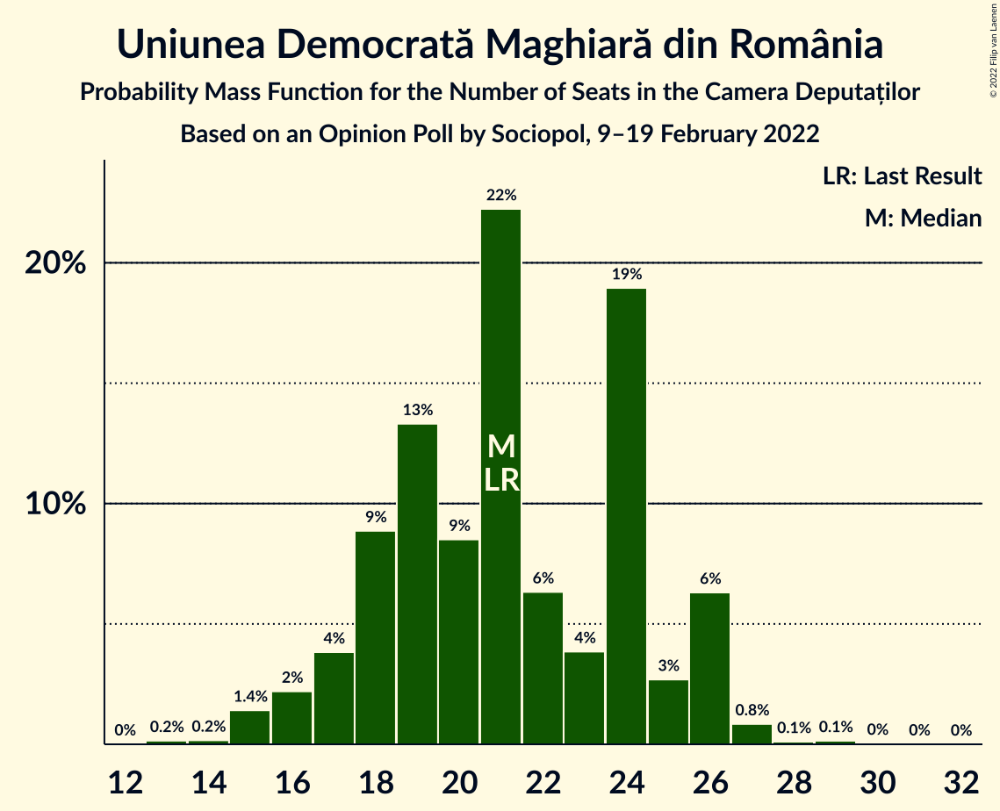

# Opinion Poll by Sociopol, 9–19 February 2022

<a href="#voting-intentions">Voting Intentions</a> | <a href="#seats">Seats</a> | <a href="#coalitions">Coalitions</a> | <a href="#technical-information">Technical Information</a>

## Voting Intentions

### Confidence Intervals

| Party | Last Result | Poll Result | 80% Confidence Interval | 90% Confidence Interval | 95% Confidence Interval | 99% Confidence Interval |
|:-----:|:-----------:|:-----------:|:-----------------------:|:-----------------------:|:-----------------------:|:-----------------------:|
| Partidul Social Democrat | 28.9% | 35.5% | 33.6–37.4% |33.0–38.0% |32.6–38.5% |31.7–39.4% |
| Alianța pentru Unirea Românilor | 9.1% | 22.3% | 20.7–24.0% |20.2–24.5% |19.8–25.0% |19.1–25.8% |
| Partidul Național Liberal | 25.2% | 16.2% | 14.8–17.8% |14.4–18.2% |14.0–18.6% |13.4–19.4% |
| Alianța 2020 USR-PLUS | 15.4% | 13.2% | 11.9–14.6% |11.5–15.1% |11.2–15.4% |10.6–16.2% |
| Uniunea Democrată Maghiară din România | 5.7% | 6.1% | 5.2–7.2% |5.0–7.5% |4.8–7.8% |4.4–8.3% |
| PRO România | 4.1% | 2.0% | 1.5–2.7% |1.4–2.9% |1.3–3.1% |1.1–3.4% |
| Alianța pentru Patrie | 0.0% | 2.0% | 1.5–2.7% |1.4–2.9% |1.3–3.1% |1.1–3.4% |
| Partidul Mișcarea Populară | 4.8% | 1.0% | 0.7–1.5% |0.6–1.7% |0.5–1.8% |0.4–2.1% |
| Forța Dreptei | 0.0% | 1.0% | 0.7–1.5% |0.6–1.7% |0.5–1.8% |0.4–2.1% |
| Partidul Puterii Umaniste (social-liberal) | 0.0% | 0.3% | 0.2–0.7% |0.1–0.8% |0.1–0.9% |0.1–1.1% |
| Partidul Ecologist Român | 1.2% | 0.3% | 0.2–0.7% |0.1–0.8% |0.1–0.9% |0.1–1.1% |

*Note:* The poll result column reflects the actual value used in the calculations. Published results may vary slightly, and in addition be rounded to fewer digits.

## Seats

### Confidence Intervals

| Party | Last Result | Median | 80% Confidence Interval | 90% Confidence Interval | 95% Confidence Interval | 99% Confidence Interval |
|:-----:|:-----------:|:------:|:-----------------------:|:-----------------------:|:-----------------------:|:-----------------------:|
| <a href="#partidul-social-democrat">Partidul Social Democrat</a> | 110 | 119 | 114–127 |111–128 |107–130 |104–133 |
| <a href="#alianța-pentru-unirea-românilor">Alianța pentru Unirea Românilor</a> | 33 | 73 | 65–78 |65–80 |64–83 |59–86 |
| <a href="#partidul-național-liberal">Partidul Național Liberal</a> | 93 | 53 | 48–58 |48–61 |46–62 |45–66 |
| <a href="#alianța-2020-usr-plus">Alianța 2020 USR-PLUS</a> | 55 | 45 | 41–50 |39–50 |38–51 |36–53 |
| <a href="#uniunea-democrată-maghiară-din-românia">Uniunea Democrată Maghiară din România</a> | 21 | 21 | 18–25 |17–26 |16–26 |15–27 |
| <a href="#pro-românia">PRO România</a> | 0 | 0 | 0 |0 |0 |0 |
| <a href="#alianța-pentru-patrie">Alianța pentru Patrie</a> | 0 | 0 | 0 |0 |0 |0 |
| <a href="#partidul-mișcarea-populară">Partidul Mișcarea Populară</a> | 0 | 0 | 0 |0 |0 |0 |
| <a href="#forța-dreptei">Forța Dreptei</a> | 0 | 0 | 0 |0 |0 |0 |
| <a href="#partidul-puterii-umaniste-(social-liberal)">Partidul Puterii Umaniste (social-liberal)</a> | 0 | 0 | 0 |0 |0 |0 |
| <a href="#partidul-ecologist-român">Partidul Ecologist Român</a> | 0 | 0 | 0 |0 |0 |0 |

### Partidul Social Democrat

*For a full overview of the results for this party, see the [Partidul Social Democrat](party-partidulsocialdemocrat.html) page.*

| Number of Seats | Probability | Accumulated | Special Marks |
|:---------------:|:-----------:|:-----------:|:-------------:|
| 103 | 0.2% | 100% |  |
| 104 | 1.0% | 99.8% |  |
| 105 | 0.5% | 98.7% |  |
| 106 | 0.1% | 98% |  |
| 107 | 0.8% | 98% |  |
| 108 | 0.8% | 97% |  |
| 109 | 1.0% | 97% |  |
| 110 | 0.4% | 96% | Last Result |
| 111 | 0.3% | 95% |  |
| 112 | 3% | 95% |  |
| 113 | 0.6% | 92% |  |
| 114 | 2% | 91% |  |
| 115 | 2% | 89% |  |
| 116 | 18% | 87% |  |
| 117 | 4% | 69% |  |
| 118 | 13% | 65% |  |
| 119 | 9% | 52% | Median |
| 120 | 1.5% | 43% |  |
| 121 | 1.3% | 41% |  |
| 122 | 2% | 40% |  |
| 123 | 3% | 38% |  |
| 124 | 1.2% | 35% |  |
| 125 | 10% | 34% |  |
| 126 | 12% | 24% |  |
| 127 | 6% | 12% |  |
| 128 | 2% | 7% |  |
| 129 | 0.9% | 5% |  |
| 130 | 2% | 4% |  |
| 131 | 0.2% | 2% |  |
| 132 | 1.3% | 2% |  |
| 133 | 0.4% | 0.8% |  |
| 134 | 0.1% | 0.4% |  |
| 135 | 0.2% | 0.3% |  |
| 136 | 0.1% | 0.1% |  |
| 137 | 0% | 0% |  |

### Alianța pentru Unirea Românilor

*For a full overview of the results for this party, see the [Alianța pentru Unirea Românilor](party-alianțapentruunirearomânilor.html) page.*

| Number of Seats | Probability | Accumulated | Special Marks |
|:---------------:|:-----------:|:-----------:|:-------------:|
| 33 | 0% | 100% | Last Result |
| 34 | 0% | 100% |  |
| 35 | 0% | 100% |  |
| 36 | 0% | 100% |  |
| 37 | 0% | 100% |  |
| 38 | 0% | 100% |  |
| 39 | 0% | 100% |  |
| 40 | 0% | 100% |  |
| 41 | 0% | 100% |  |
| 42 | 0% | 100% |  |
| 43 | 0% | 100% |  |
| 44 | 0% | 100% |  |
| 45 | 0% | 100% |  |
| 46 | 0% | 100% |  |
| 47 | 0% | 100% |  |
| 48 | 0% | 100% |  |
| 49 | 0% | 100% |  |
| 50 | 0% | 100% |  |
| 51 | 0% | 100% |  |
| 52 | 0% | 100% |  |
| 53 | 0% | 100% |  |
| 54 | 0% | 100% |  |
| 55 | 0% | 100% |  |
| 56 | 0% | 100% |  |
| 57 | 0% | 100% |  |
| 58 | 0% | 100% |  |
| 59 | 0.5% | 100% |  |
| 60 | 0.8% | 99.4% |  |
| 61 | 0.1% | 98.6% |  |
| 62 | 0.3% | 98.6% |  |
| 63 | 0.2% | 98% |  |
| 64 | 0.7% | 98% |  |
| 65 | 11% | 97% |  |
| 66 | 1.5% | 86% |  |
| 67 | 1.2% | 85% |  |
| 68 | 2% | 84% |  |
| 69 | 2% | 82% |  |
| 70 | 14% | 80% |  |
| 71 | 4% | 67% |  |
| 72 | 1.4% | 62% |  |
| 73 | 26% | 61% | Median |
| 74 | 13% | 35% |  |
| 75 | 3% | 22% |  |
| 76 | 4% | 19% |  |
| 77 | 0.9% | 15% |  |
| 78 | 7% | 14% |  |
| 79 | 1.2% | 7% |  |
| 80 | 1.4% | 6% |  |
| 81 | 0.6% | 4% |  |
| 82 | 0.7% | 4% |  |
| 83 | 0.8% | 3% |  |
| 84 | 1.0% | 2% |  |
| 85 | 0.5% | 1.2% |  |
| 86 | 0.3% | 0.7% |  |
| 87 | 0.1% | 0.4% |  |
| 88 | 0.1% | 0.3% |  |
| 89 | 0% | 0.2% |  |
| 90 | 0% | 0.2% |  |
| 91 | 0.1% | 0.1% |  |
| 92 | 0.1% | 0.1% |  |
| 93 | 0% | 0% |  |

### Partidul Național Liberal

*For a full overview of the results for this party, see the [Partidul Național Liberal](party-partidulnaționalliberal.html) page.*

| Number of Seats | Probability | Accumulated | Special Marks |
|:---------------:|:-----------:|:-----------:|:-------------:|
| 41 | 0% | 100% |  |
| 42 | 0.1% | 99.9% |  |
| 43 | 0.1% | 99.9% |  |
| 44 | 0.1% | 99.7% |  |
| 45 | 0.3% | 99.6% |  |
| 46 | 3% | 99.3% |  |
| 47 | 0.4% | 97% |  |
| 48 | 7% | 96% |  |
| 49 | 18% | 89% |  |
| 50 | 12% | 71% |  |
| 51 | 3% | 59% |  |
| 52 | 5% | 56% |  |
| 53 | 12% | 52% | Median |
| 54 | 3% | 39% |  |
| 55 | 2% | 36% |  |
| 56 | 3% | 34% |  |
| 57 | 18% | 31% |  |
| 58 | 3% | 13% |  |
| 59 | 2% | 10% |  |
| 60 | 3% | 8% |  |
| 61 | 1.3% | 5% |  |
| 62 | 2% | 4% |  |
| 63 | 0.1% | 2% |  |
| 64 | 1.4% | 2% |  |
| 65 | 0.1% | 0.7% |  |
| 66 | 0.1% | 0.5% |  |
| 67 | 0.3% | 0.5% |  |
| 68 | 0.1% | 0.1% |  |
| 69 | 0% | 0.1% |  |
| 70 | 0% | 0% |  |
| 71 | 0% | 0% |  |
| 72 | 0% | 0% |  |
| 73 | 0% | 0% |  |
| 74 | 0% | 0% |  |
| 75 | 0% | 0% |  |
| 76 | 0% | 0% |  |
| 77 | 0% | 0% |  |
| 78 | 0% | 0% |  |
| 79 | 0% | 0% |  |
| 80 | 0% | 0% |  |
| 81 | 0% | 0% |  |
| 82 | 0% | 0% |  |
| 83 | 0% | 0% |  |
| 84 | 0% | 0% |  |
| 85 | 0% | 0% |  |
| 86 | 0% | 0% |  |
| 87 | 0% | 0% |  |
| 88 | 0% | 0% |  |
| 89 | 0% | 0% |  |
| 90 | 0% | 0% |  |
| 91 | 0% | 0% |  |
| 92 | 0% | 0% |  |
| 93 | 0% | 0% | Last Result |

### Alianța 2020 USR-PLUS

*For a full overview of the results for this party, see the [Alianța 2020 USR-PLUS](party-alianța2020usr-plus.html) page.*

| Number of Seats | Probability | Accumulated | Special Marks |
|:---------------:|:-----------:|:-----------:|:-------------:|
| 34 | 0.3% | 100% |  |
| 35 | 0.1% | 99.7% |  |
| 36 | 0.6% | 99.5% |  |
| 37 | 0.9% | 98.9% |  |
| 38 | 0.7% | 98% |  |
| 39 | 3% | 97% |  |
| 40 | 3% | 95% |  |
| 41 | 11% | 92% |  |
| 42 | 5% | 82% |  |
| 43 | 15% | 77% |  |
| 44 | 3% | 62% |  |
| 45 | 18% | 59% | Median |
| 46 | 2% | 41% |  |
| 47 | 3% | 39% |  |
| 48 | 1.5% | 35% |  |
| 49 | 12% | 34% |  |
| 50 | 18% | 22% |  |
| 51 | 2% | 4% |  |
| 52 | 1.5% | 2% |  |
| 53 | 0.2% | 0.6% |  |
| 54 | 0.2% | 0.4% |  |
| 55 | 0% | 0.2% | Last Result |
| 56 | 0.1% | 0.2% |  |
| 57 | 0% | 0.1% |  |
| 58 | 0.1% | 0.1% |  |
| 59 | 0% | 0% |  |

### Uniunea Democrată Maghiară din România

*For a full overview of the results for this party, see the [Uniunea Democrată Maghiară din România](party-uniuneademocratămaghiarădinromânia.html) page.*

| Number of Seats | Probability | Accumulated | Special Marks |
|:---------------:|:-----------:|:-----------:|:-------------:|
| 13 | 0.2% | 100% |  |
| 14 | 0.2% | 99.8% |  |
| 15 | 1.4% | 99.7% |  |
| 16 | 2% | 98% |  |
| 17 | 4% | 96% |  |
| 18 | 9% | 92% |  |
| 19 | 13% | 83% |  |
| 20 | 9% | 70% |  |
| 21 | 22% | 62% | Last Result, Median |
| 22 | 6% | 39% |  |
| 23 | 4% | 33% |  |
| 24 | 19% | 29% |  |
| 25 | 3% | 10% |  |
| 26 | 6% | 7% |  |
| 27 | 0.8% | 1.2% |  |
| 28 | 0.1% | 0.3% |  |
| 29 | 0.1% | 0.2% |  |
| 30 | 0% | 0.1% |  |
| 31 | 0% | 0% |  |

### PRO România

*For a full overview of the results for this party, see the [PRO România](party-proromânia.html) page.*

| Number of Seats | Probability | Accumulated | Special Marks |
|:---------------:|:-----------:|:-----------:|:-------------:|
| 0 | 100% | 100% | Last Result, Median |

### Alianța pentru Patrie

*For a full overview of the results for this party, see the [Alianța pentru Patrie](party-alianțapentrupatrie.html) page.*

| Number of Seats | Probability | Accumulated | Special Marks |
|:---------------:|:-----------:|:-----------:|:-------------:|
| 0 | 100% | 100% | Last Result, Median |

### Partidul Mișcarea Populară

*For a full overview of the results for this party, see the [Partidul Mișcarea Populară](party-partidulmișcareapopulară.html) page.*

| Number of Seats | Probability | Accumulated | Special Marks |
|:---------------:|:-----------:|:-----------:|:-------------:|
| 0 | 100% | 100% | Last Result, Median |

### Forța Dreptei

*For a full overview of the results for this party, see the [Forța Dreptei](party-forțadreptei.html) page.*

| Number of Seats | Probability | Accumulated | Special Marks |
|:---------------:|:-----------:|:-----------:|:-------------:|
| 0 | 100% | 100% | Last Result, Median |

### Partidul Puterii Umaniste (social-liberal)

*For a full overview of the results for this party, see the [Partidul Puterii Umaniste (social-liberal)](party-partidulputeriiumanistesocial-liberal.html) page.*

| Number of Seats | Probability | Accumulated | Special Marks |
|:---------------:|:-----------:|:-----------:|:-------------:|
| 0 | 100% | 100% | Last Result, Median |

### Partidul Ecologist Român

*For a full overview of the results for this party, see the [Partidul Ecologist Român](party-partidulecologistromân.html) page.*

| Number of Seats | Probability | Accumulated | Special Marks |
|:---------------:|:-----------:|:-----------:|:-------------:|
| 0 | 100% | 100% | Last Result, Median |

## Coalitions

### Confidence Intervals

| Coalition | Last Result | Median | Majority? | 80% Confidence Interval | 90% Confidence Interval | 95% Confidence Interval | 99% Confidence Interval |
|:---------:|:-----------:|:------:|:---------:|:-----------------------:|:-----------------------:|:-----------------------:|:-----------------------:|
| Partidul Social Democrat – PRO România | 110 | 119 | 0% | 114–127 | 111–128 | 107–130 | 104–133 |
| Partidul Național Liberal – Alianța 2020 USR-PLUS – Uniunea Democrată Maghiară din România – Partidul Mișcarea Populară | 169 | 120 | 0% | 114–123 | 111–127 | 111–129 | 105–130 |
| Partidul Național Liberal – Alianța 2020 USR-PLUS – Uniunea Democrată Maghiară din România | 169 | 120 | 0% | 114–123 | 111–127 | 111–129 | 105–130 |
| Partidul Național Liberal – Alianța 2020 USR-PLUS – Partidul Mișcarea Populară | 148 | 99 | 0% | 92–103 | 89–105 | 89–107 | 86–109 |
| Partidul Național Liberal – Alianța 2020 USR-PLUS | 148 | 99 | 0% | 92–103 | 89–105 | 89–107 | 86–109 |
| Partidul Național Liberal – Uniunea Democrată Maghiară din România – Partidul Mișcarea Populară | 114 | 74 | 0% | 70–80 | 68–82 | 67–84 | 63–87 |
| Partidul Național Liberal – Uniunea Democrată Maghiară din România | 114 | 74 | 0% | 70–80 | 68–82 | 67–84 | 63–87 |
| Partidul Național Liberal – Partidul Mișcarea Populară | 93 | 53 | 0% | 48–58 | 48–61 | 46–62 | 45–66 |
| Partidul Național Liberal | 93 | 53 | 0% | 48–58 | 48–61 | 46–62 | 45–66 |
| Alianța 2020 USR-PLUS – Partidul Mișcarea Populară | 55 | 45 | 0% | 41–50 | 39–50 | 38–51 | 36–53 |

### Partidul Social Democrat – PRO România

| Number of Seats | Probability | Accumulated | Special Marks |
|:---------------:|:-----------:|:-----------:|:-------------:|
| 103 | 0.2% | 100% |  |
| 104 | 1.0% | 99.8% |  |
| 105 | 0.5% | 98.7% |  |
| 106 | 0.1% | 98% |  |
| 107 | 0.8% | 98% |  |
| 108 | 0.8% | 97% |  |
| 109 | 1.0% | 97% |  |
| 110 | 0.4% | 96% | Last Result |
| 111 | 0.3% | 95% |  |
| 112 | 3% | 95% |  |
| 113 | 0.6% | 92% |  |
| 114 | 2% | 91% |  |
| 115 | 2% | 89% |  |
| 116 | 18% | 87% |  |
| 117 | 4% | 69% |  |
| 118 | 13% | 65% |  |
| 119 | 9% | 52% | Median |
| 120 | 1.5% | 43% |  |
| 121 | 1.3% | 41% |  |
| 122 | 2% | 40% |  |
| 123 | 3% | 38% |  |
| 124 | 1.2% | 35% |  |
| 125 | 10% | 34% |  |
| 126 | 12% | 24% |  |
| 127 | 6% | 12% |  |
| 128 | 2% | 7% |  |
| 129 | 0.9% | 5% |  |
| 130 | 2% | 4% |  |
| 131 | 0.2% | 2% |  |
| 132 | 1.3% | 2% |  |
| 133 | 0.4% | 0.8% |  |
| 134 | 0.1% | 0.4% |  |
| 135 | 0.2% | 0.3% |  |
| 136 | 0.1% | 0.1% |  |
| 137 | 0% | 0% |  |

### Partidul Național Liberal – Alianța 2020 USR-PLUS – Uniunea Democrată Maghiară din România – Partidul Mișcarea Populară

| Number of Seats | Probability | Accumulated | Special Marks |
|:---------------:|:-----------:|:-----------:|:-------------:|
| 100 | 0.1% | 100% |  |
| 101 | 0.1% | 99.9% |  |
| 102 | 0% | 99.8% |  |
| 103 | 0.2% | 99.8% |  |
| 104 | 0% | 99.6% |  |
| 105 | 0.3% | 99.6% |  |
| 106 | 0.1% | 99.3% |  |
| 107 | 0.1% | 99.2% |  |
| 108 | 0.3% | 99.1% |  |
| 109 | 0.4% | 98.7% |  |
| 110 | 0.8% | 98% |  |
| 111 | 3% | 98% |  |
| 112 | 2% | 95% |  |
| 113 | 1.3% | 93% |  |
| 114 | 3% | 92% |  |
| 115 | 9% | 89% |  |
| 116 | 2% | 80% |  |
| 117 | 9% | 79% |  |
| 118 | 4% | 70% |  |
| 119 | 3% | 66% | Median |
| 120 | 18% | 64% |  |
| 121 | 14% | 46% |  |
| 122 | 5% | 32% |  |
| 123 | 18% | 27% |  |
| 124 | 1.5% | 9% |  |
| 125 | 1.0% | 8% |  |
| 126 | 2% | 7% |  |
| 127 | 0.3% | 5% |  |
| 128 | 1.3% | 5% |  |
| 129 | 1.2% | 3% |  |
| 130 | 2% | 2% |  |
| 131 | 0.2% | 0.4% |  |
| 132 | 0.1% | 0.2% |  |
| 133 | 0% | 0.1% |  |
| 134 | 0% | 0.1% |  |
| 135 | 0% | 0% |  |
| 136 | 0% | 0% |  |
| 137 | 0% | 0% |  |
| 138 | 0% | 0% |  |
| 139 | 0% | 0% |  |
| 140 | 0% | 0% |  |
| 141 | 0% | 0% |  |
| 142 | 0% | 0% |  |
| 143 | 0% | 0% |  |
| 144 | 0% | 0% |  |
| 145 | 0% | 0% |  |
| 146 | 0% | 0% |  |
| 147 | 0% | 0% |  |
| 148 | 0% | 0% |  |
| 149 | 0% | 0% |  |
| 150 | 0% | 0% |  |
| 151 | 0% | 0% |  |
| 152 | 0% | 0% |  |
| 153 | 0% | 0% |  |
| 154 | 0% | 0% |  |
| 155 | 0% | 0% |  |
| 156 | 0% | 0% |  |
| 157 | 0% | 0% |  |
| 158 | 0% | 0% |  |
| 159 | 0% | 0% |  |
| 160 | 0% | 0% |  |
| 161 | 0% | 0% |  |
| 162 | 0% | 0% |  |
| 163 | 0% | 0% |  |
| 164 | 0% | 0% |  |
| 165 | 0% | 0% | Majority |
| 166 | 0% | 0% |  |
| 167 | 0% | 0% |  |
| 168 | 0% | 0% |  |
| 169 | 0% | 0% | Last Result |

### Partidul Național Liberal – Alianța 2020 USR-PLUS – Uniunea Democrată Maghiară din România

| Number of Seats | Probability | Accumulated | Special Marks |
|:---------------:|:-----------:|:-----------:|:-------------:|
| 100 | 0.1% | 100% |  |
| 101 | 0.1% | 99.9% |  |
| 102 | 0% | 99.8% |  |
| 103 | 0.2% | 99.8% |  |
| 104 | 0% | 99.6% |  |
| 105 | 0.3% | 99.6% |  |
| 106 | 0.1% | 99.3% |  |
| 107 | 0.1% | 99.2% |  |
| 108 | 0.3% | 99.1% |  |
| 109 | 0.4% | 98.7% |  |
| 110 | 0.8% | 98% |  |
| 111 | 3% | 98% |  |
| 112 | 2% | 95% |  |
| 113 | 1.3% | 93% |  |
| 114 | 3% | 92% |  |
| 115 | 9% | 89% |  |
| 116 | 2% | 80% |  |
| 117 | 9% | 79% |  |
| 118 | 4% | 70% |  |
| 119 | 3% | 66% | Median |
| 120 | 18% | 64% |  |
| 121 | 14% | 46% |  |
| 122 | 5% | 32% |  |
| 123 | 18% | 27% |  |
| 124 | 1.5% | 9% |  |
| 125 | 1.0% | 8% |  |
| 126 | 2% | 7% |  |
| 127 | 0.3% | 5% |  |
| 128 | 1.3% | 5% |  |
| 129 | 1.2% | 3% |  |
| 130 | 2% | 2% |  |
| 131 | 0.2% | 0.4% |  |
| 132 | 0.1% | 0.2% |  |
| 133 | 0% | 0.1% |  |
| 134 | 0% | 0.1% |  |
| 135 | 0% | 0% |  |
| 136 | 0% | 0% |  |
| 137 | 0% | 0% |  |
| 138 | 0% | 0% |  |
| 139 | 0% | 0% |  |
| 140 | 0% | 0% |  |
| 141 | 0% | 0% |  |
| 142 | 0% | 0% |  |
| 143 | 0% | 0% |  |
| 144 | 0% | 0% |  |
| 145 | 0% | 0% |  |
| 146 | 0% | 0% |  |
| 147 | 0% | 0% |  |
| 148 | 0% | 0% |  |
| 149 | 0% | 0% |  |
| 150 | 0% | 0% |  |
| 151 | 0% | 0% |  |
| 152 | 0% | 0% |  |
| 153 | 0% | 0% |  |
| 154 | 0% | 0% |  |
| 155 | 0% | 0% |  |
| 156 | 0% | 0% |  |
| 157 | 0% | 0% |  |
| 158 | 0% | 0% |  |
| 159 | 0% | 0% |  |
| 160 | 0% | 0% |  |
| 161 | 0% | 0% |  |
| 162 | 0% | 0% |  |
| 163 | 0% | 0% |  |
| 164 | 0% | 0% |  |
| 165 | 0% | 0% | Majority |
| 166 | 0% | 0% |  |
| 167 | 0% | 0% |  |
| 168 | 0% | 0% |  |
| 169 | 0% | 0% | Last Result |

### Partidul Național Liberal – Alianța 2020 USR-PLUS – Partidul Mișcarea Populară

| Number of Seats | Probability | Accumulated | Special Marks |
|:---------------:|:-----------:|:-----------:|:-------------:|
| 83 | 0.3% | 100% |  |
| 84 | 0.1% | 99.7% |  |
| 85 | 0% | 99.6% |  |
| 86 | 0.4% | 99.6% |  |
| 87 | 0.3% | 99.2% |  |
| 88 | 0.7% | 98.9% |  |
| 89 | 6% | 98% |  |
| 90 | 0.5% | 92% |  |
| 91 | 1.4% | 92% |  |
| 92 | 0.9% | 90% |  |
| 93 | 4% | 90% |  |
| 94 | 5% | 85% |  |
| 95 | 3% | 81% |  |
| 96 | 8% | 77% |  |
| 97 | 0.8% | 69% |  |
| 98 | 4% | 68% | Median |
| 99 | 29% | 64% |  |
| 100 | 2% | 35% |  |
| 101 | 3% | 33% |  |
| 102 | 18% | 30% |  |
| 103 | 2% | 12% |  |
| 104 | 3% | 10% |  |
| 105 | 3% | 7% |  |
| 106 | 1.0% | 4% |  |
| 107 | 0.2% | 3% |  |
| 108 | 0.7% | 2% |  |
| 109 | 1.4% | 2% |  |
| 110 | 0.1% | 0.3% |  |
| 111 | 0% | 0.2% |  |
| 112 | 0% | 0.1% |  |
| 113 | 0% | 0.1% |  |
| 114 | 0% | 0.1% |  |
| 115 | 0% | 0% |  |
| 116 | 0% | 0% |  |
| 117 | 0% | 0% |  |
| 118 | 0% | 0% |  |
| 119 | 0% | 0% |  |
| 120 | 0% | 0% |  |
| 121 | 0% | 0% |  |
| 122 | 0% | 0% |  |
| 123 | 0% | 0% |  |
| 124 | 0% | 0% |  |
| 125 | 0% | 0% |  |
| 126 | 0% | 0% |  |
| 127 | 0% | 0% |  |
| 128 | 0% | 0% |  |
| 129 | 0% | 0% |  |
| 130 | 0% | 0% |  |
| 131 | 0% | 0% |  |
| 132 | 0% | 0% |  |
| 133 | 0% | 0% |  |
| 134 | 0% | 0% |  |
| 135 | 0% | 0% |  |
| 136 | 0% | 0% |  |
| 137 | 0% | 0% |  |
| 138 | 0% | 0% |  |
| 139 | 0% | 0% |  |
| 140 | 0% | 0% |  |
| 141 | 0% | 0% |  |
| 142 | 0% | 0% |  |
| 143 | 0% | 0% |  |
| 144 | 0% | 0% |  |
| 145 | 0% | 0% |  |
| 146 | 0% | 0% |  |
| 147 | 0% | 0% |  |
| 148 | 0% | 0% | Last Result |

### Partidul Național Liberal – Alianța 2020 USR-PLUS

| Number of Seats | Probability | Accumulated | Special Marks |
|:---------------:|:-----------:|:-----------:|:-------------:|
| 83 | 0.3% | 100% |  |
| 84 | 0.1% | 99.7% |  |
| 85 | 0% | 99.6% |  |
| 86 | 0.4% | 99.6% |  |
| 87 | 0.3% | 99.2% |  |
| 88 | 0.7% | 98.9% |  |
| 89 | 6% | 98% |  |
| 90 | 0.5% | 92% |  |
| 91 | 1.4% | 92% |  |
| 92 | 0.9% | 90% |  |
| 93 | 4% | 90% |  |
| 94 | 5% | 85% |  |
| 95 | 3% | 81% |  |
| 96 | 8% | 77% |  |
| 97 | 0.8% | 69% |  |
| 98 | 4% | 68% | Median |
| 99 | 29% | 64% |  |
| 100 | 2% | 35% |  |
| 101 | 3% | 33% |  |
| 102 | 18% | 30% |  |
| 103 | 2% | 12% |  |
| 104 | 3% | 10% |  |
| 105 | 3% | 7% |  |
| 106 | 1.0% | 4% |  |
| 107 | 0.2% | 3% |  |
| 108 | 0.7% | 2% |  |
| 109 | 1.4% | 2% |  |
| 110 | 0.1% | 0.3% |  |
| 111 | 0% | 0.2% |  |
| 112 | 0% | 0.1% |  |
| 113 | 0% | 0.1% |  |
| 114 | 0% | 0.1% |  |
| 115 | 0% | 0% |  |
| 116 | 0% | 0% |  |
| 117 | 0% | 0% |  |
| 118 | 0% | 0% |  |
| 119 | 0% | 0% |  |
| 120 | 0% | 0% |  |
| 121 | 0% | 0% |  |
| 122 | 0% | 0% |  |
| 123 | 0% | 0% |  |
| 124 | 0% | 0% |  |
| 125 | 0% | 0% |  |
| 126 | 0% | 0% |  |
| 127 | 0% | 0% |  |
| 128 | 0% | 0% |  |
| 129 | 0% | 0% |  |
| 130 | 0% | 0% |  |
| 131 | 0% | 0% |  |
| 132 | 0% | 0% |  |
| 133 | 0% | 0% |  |
| 134 | 0% | 0% |  |
| 135 | 0% | 0% |  |
| 136 | 0% | 0% |  |
| 137 | 0% | 0% |  |
| 138 | 0% | 0% |  |
| 139 | 0% | 0% |  |
| 140 | 0% | 0% |  |
| 141 | 0% | 0% |  |
| 142 | 0% | 0% |  |
| 143 | 0% | 0% |  |
| 144 | 0% | 0% |  |
| 145 | 0% | 0% |  |
| 146 | 0% | 0% |  |
| 147 | 0% | 0% |  |
| 148 | 0% | 0% | Last Result |

### Partidul Național Liberal – Uniunea Democrată Maghiară din România – Partidul Mișcarea Populară

| Number of Seats | Probability | Accumulated | Special Marks |
|:---------------:|:-----------:|:-----------:|:-------------:|
| 60 | 0.1% | 100% |  |
| 61 | 0.1% | 99.9% |  |
| 62 | 0.2% | 99.8% |  |
| 63 | 0.1% | 99.6% |  |
| 64 | 0.3% | 99.5% |  |
| 65 | 0.3% | 99.1% |  |
| 66 | 0.6% | 98.8% |  |
| 67 | 1.1% | 98% |  |
| 68 | 4% | 97% |  |
| 69 | 2% | 93% |  |
| 70 | 3% | 91% |  |
| 71 | 12% | 88% |  |
| 72 | 2% | 75% |  |
| 73 | 18% | 74% |  |
| 74 | 14% | 55% | Median |
| 75 | 9% | 41% |  |
| 76 | 14% | 32% |  |
| 77 | 1.0% | 17% |  |
| 78 | 2% | 16% |  |
| 79 | 4% | 15% |  |
| 80 | 3% | 10% |  |
| 81 | 2% | 7% |  |
| 82 | 2% | 5% |  |
| 83 | 0.6% | 4% |  |
| 84 | 1.0% | 3% |  |
| 85 | 0.5% | 2% |  |
| 86 | 1.1% | 2% |  |
| 87 | 0.4% | 0.5% |  |
| 88 | 0.1% | 0.2% |  |
| 89 | 0% | 0.1% |  |
| 90 | 0% | 0.1% |  |
| 91 | 0% | 0% |  |
| 92 | 0% | 0% |  |
| 93 | 0% | 0% |  |
| 94 | 0% | 0% |  |
| 95 | 0% | 0% |  |
| 96 | 0% | 0% |  |
| 97 | 0% | 0% |  |
| 98 | 0% | 0% |  |
| 99 | 0% | 0% |  |
| 100 | 0% | 0% |  |
| 101 | 0% | 0% |  |
| 102 | 0% | 0% |  |
| 103 | 0% | 0% |  |
| 104 | 0% | 0% |  |
| 105 | 0% | 0% |  |
| 106 | 0% | 0% |  |
| 107 | 0% | 0% |  |
| 108 | 0% | 0% |  |
| 109 | 0% | 0% |  |
| 110 | 0% | 0% |  |
| 111 | 0% | 0% |  |
| 112 | 0% | 0% |  |
| 113 | 0% | 0% |  |
| 114 | 0% | 0% | Last Result |

### Partidul Național Liberal – Uniunea Democrată Maghiară din România

| Number of Seats | Probability | Accumulated | Special Marks |
|:---------------:|:-----------:|:-----------:|:-------------:|
| 60 | 0.1% | 100% |  |
| 61 | 0.1% | 99.9% |  |
| 62 | 0.2% | 99.8% |  |
| 63 | 0.1% | 99.6% |  |
| 64 | 0.3% | 99.5% |  |
| 65 | 0.3% | 99.1% |  |
| 66 | 0.6% | 98.8% |  |
| 67 | 1.1% | 98% |  |
| 68 | 4% | 97% |  |
| 69 | 2% | 93% |  |
| 70 | 3% | 91% |  |
| 71 | 12% | 88% |  |
| 72 | 2% | 75% |  |
| 73 | 18% | 74% |  |
| 74 | 14% | 55% | Median |
| 75 | 9% | 41% |  |
| 76 | 14% | 32% |  |
| 77 | 1.0% | 17% |  |
| 78 | 2% | 16% |  |
| 79 | 4% | 15% |  |
| 80 | 3% | 10% |  |
| 81 | 2% | 7% |  |
| 82 | 2% | 5% |  |
| 83 | 0.6% | 4% |  |
| 84 | 1.0% | 3% |  |
| 85 | 0.5% | 2% |  |
| 86 | 1.1% | 2% |  |
| 87 | 0.4% | 0.5% |  |
| 88 | 0.1% | 0.2% |  |
| 89 | 0% | 0.1% |  |
| 90 | 0% | 0.1% |  |
| 91 | 0% | 0% |  |
| 92 | 0% | 0% |  |
| 93 | 0% | 0% |  |
| 94 | 0% | 0% |  |
| 95 | 0% | 0% |  |
| 96 | 0% | 0% |  |
| 97 | 0% | 0% |  |
| 98 | 0% | 0% |  |
| 99 | 0% | 0% |  |
| 100 | 0% | 0% |  |
| 101 | 0% | 0% |  |
| 102 | 0% | 0% |  |
| 103 | 0% | 0% |  |
| 104 | 0% | 0% |  |
| 105 | 0% | 0% |  |
| 106 | 0% | 0% |  |
| 107 | 0% | 0% |  |
| 108 | 0% | 0% |  |
| 109 | 0% | 0% |  |
| 110 | 0% | 0% |  |
| 111 | 0% | 0% |  |
| 112 | 0% | 0% |  |
| 113 | 0% | 0% |  |
| 114 | 0% | 0% | Last Result |

### Partidul Național Liberal – Partidul Mișcarea Populară

| Number of Seats | Probability | Accumulated | Special Marks |
|:---------------:|:-----------:|:-----------:|:-------------:|
| 41 | 0% | 100% |  |
| 42 | 0.1% | 99.9% |  |
| 43 | 0.1% | 99.9% |  |
| 44 | 0.1% | 99.7% |  |
| 45 | 0.3% | 99.6% |  |
| 46 | 3% | 99.3% |  |
| 47 | 0.4% | 97% |  |
| 48 | 7% | 96% |  |
| 49 | 18% | 89% |  |
| 50 | 12% | 71% |  |
| 51 | 3% | 59% |  |
| 52 | 5% | 56% |  |
| 53 | 12% | 52% | Median |
| 54 | 3% | 39% |  |
| 55 | 2% | 36% |  |
| 56 | 3% | 34% |  |
| 57 | 18% | 31% |  |
| 58 | 3% | 13% |  |
| 59 | 2% | 10% |  |
| 60 | 3% | 8% |  |
| 61 | 1.3% | 5% |  |
| 62 | 2% | 4% |  |
| 63 | 0.1% | 2% |  |
| 64 | 1.4% | 2% |  |
| 65 | 0.1% | 0.7% |  |
| 66 | 0.1% | 0.5% |  |
| 67 | 0.3% | 0.5% |  |
| 68 | 0.1% | 0.1% |  |
| 69 | 0% | 0.1% |  |
| 70 | 0% | 0% |  |
| 71 | 0% | 0% |  |
| 72 | 0% | 0% |  |
| 73 | 0% | 0% |  |
| 74 | 0% | 0% |  |
| 75 | 0% | 0% |  |
| 76 | 0% | 0% |  |
| 77 | 0% | 0% |  |
| 78 | 0% | 0% |  |
| 79 | 0% | 0% |  |
| 80 | 0% | 0% |  |
| 81 | 0% | 0% |  |
| 82 | 0% | 0% |  |
| 83 | 0% | 0% |  |
| 84 | 0% | 0% |  |
| 85 | 0% | 0% |  |
| 86 | 0% | 0% |  |
| 87 | 0% | 0% |  |
| 88 | 0% | 0% |  |
| 89 | 0% | 0% |  |
| 90 | 0% | 0% |  |
| 91 | 0% | 0% |  |
| 92 | 0% | 0% |  |
| 93 | 0% | 0% | Last Result |

### Partidul Național Liberal

| Number of Seats | Probability | Accumulated | Special Marks |
|:---------------:|:-----------:|:-----------:|:-------------:|
| 41 | 0% | 100% |  |
| 42 | 0.1% | 99.9% |  |
| 43 | 0.1% | 99.9% |  |
| 44 | 0.1% | 99.7% |  |
| 45 | 0.3% | 99.6% |  |
| 46 | 3% | 99.3% |  |
| 47 | 0.4% | 97% |  |
| 48 | 7% | 96% |  |
| 49 | 18% | 89% |  |
| 50 | 12% | 71% |  |
| 51 | 3% | 59% |  |
| 52 | 5% | 56% |  |
| 53 | 12% | 52% | Median |
| 54 | 3% | 39% |  |
| 55 | 2% | 36% |  |
| 56 | 3% | 34% |  |
| 57 | 18% | 31% |  |
| 58 | 3% | 13% |  |
| 59 | 2% | 10% |  |
| 60 | 3% | 8% |  |
| 61 | 1.3% | 5% |  |
| 62 | 2% | 4% |  |
| 63 | 0.1% | 2% |  |
| 64 | 1.4% | 2% |  |
| 65 | 0.1% | 0.7% |  |
| 66 | 0.1% | 0.5% |  |
| 67 | 0.3% | 0.5% |  |
| 68 | 0.1% | 0.1% |  |
| 69 | 0% | 0.1% |  |
| 70 | 0% | 0% |  |
| 71 | 0% | 0% |  |
| 72 | 0% | 0% |  |
| 73 | 0% | 0% |  |
| 74 | 0% | 0% |  |
| 75 | 0% | 0% |  |
| 76 | 0% | 0% |  |
| 77 | 0% | 0% |  |
| 78 | 0% | 0% |  |
| 79 | 0% | 0% |  |
| 80 | 0% | 0% |  |
| 81 | 0% | 0% |  |
| 82 | 0% | 0% |  |
| 83 | 0% | 0% |  |
| 84 | 0% | 0% |  |
| 85 | 0% | 0% |  |
| 86 | 0% | 0% |  |
| 87 | 0% | 0% |  |
| 88 | 0% | 0% |  |
| 89 | 0% | 0% |  |
| 90 | 0% | 0% |  |
| 91 | 0% | 0% |  |
| 92 | 0% | 0% |  |
| 93 | 0% | 0% | Last Result |

### Alianța 2020 USR-PLUS – Partidul Mișcarea Populară

| Number of Seats | Probability | Accumulated | Special Marks |
|:---------------:|:-----------:|:-----------:|:-------------:|
| 34 | 0.3% | 100% |  |
| 35 | 0.1% | 99.7% |  |
| 36 | 0.6% | 99.5% |  |
| 37 | 0.9% | 98.9% |  |
| 38 | 0.7% | 98% |  |
| 39 | 3% | 97% |  |
| 40 | 3% | 95% |  |
| 41 | 11% | 92% |  |
| 42 | 5% | 82% |  |
| 43 | 15% | 77% |  |
| 44 | 3% | 62% |  |
| 45 | 18% | 59% | Median |
| 46 | 2% | 41% |  |
| 47 | 3% | 39% |  |
| 48 | 1.5% | 35% |  |
| 49 | 12% | 34% |  |
| 50 | 18% | 22% |  |
| 51 | 2% | 4% |  |
| 52 | 1.5% | 2% |  |
| 53 | 0.2% | 0.6% |  |
| 54 | 0.2% | 0.4% |  |
| 55 | 0% | 0.2% | Last Result |
| 56 | 0.1% | 0.2% |  |
| 57 | 0% | 0.1% |  |
| 58 | 0.1% | 0.1% |  |
| 59 | 0% | 0% |  |

## Technical Information

### Opinion Poll

+ **Polling firm:** Sociopol
+ **Commissioner(s):** —
+ **Fieldwork period:** 9–19 February 2022

### Calculations

+ **Sample size:** 1001
+ **Simulations done:** 1,048,576
+ **Error estimate:** 3.03%

