# Opinion Poll by CURS, 28 March–11 April 2022

<a href="#voting-intentions">Voting Intentions</a> | <a href="#seats">Seats</a> | <a href="#coalitions">Coalitions</a> | <a href="#technical-information">Technical Information</a>

## Voting Intentions

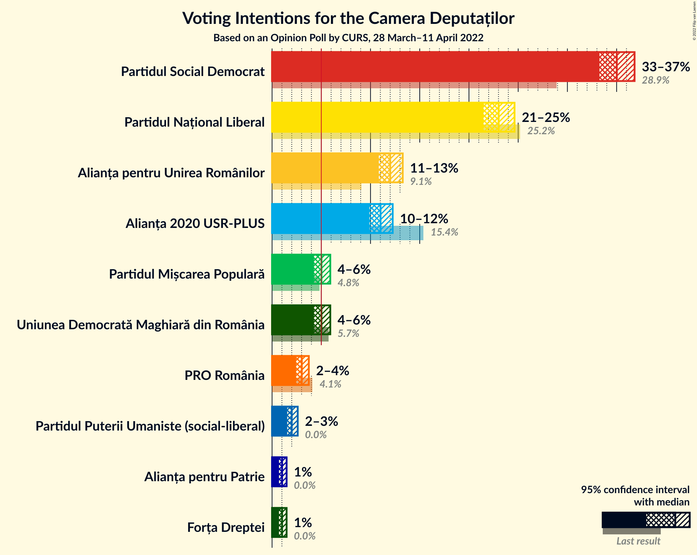

### Confidence Intervals

| Party | Last Result | Poll Result | 80% Confidence Interval | 90% Confidence Interval | 95% Confidence Interval | 99% Confidence Interval |
|:-----:|:-----------:|:-----------:|:-----------------------:|:-----------------------:|:-----------------------:|:-----------------------:|
| Partidul Social Democrat | 28.9% | 35.0% | 33.9–36.2% |33.5–36.5% |33.3–36.8% |32.7–37.4% |
| Partidul Național Liberal | 25.2% | 23.0% | 22.0–24.1% |21.7–24.4% |21.5–24.6% |21.0–25.1% |
| Alianța pentru Unirea Românilor | 9.1% | 12.0% | 11.2–12.8% |11.0–13.1% |10.8–13.3% |10.5–13.7% |
| Alianța 2020 USR-PLUS | 15.4% | 11.0% | 10.3–11.8% |10.1–12.1% |9.9–12.3% |9.6–12.7% |
| Uniunea Democrată Maghiară din România | 5.7% | 5.0% | 4.5–5.6% |4.4–5.8% |4.3–5.9% |4.0–6.2% |
| Partidul Mișcarea Populară | 4.8% | 5.0% | 4.5–5.6% |4.4–5.8% |4.3–5.9% |4.0–6.2% |
| PRO România | 4.1% | 3.0% | 2.6–3.5% |2.5–3.6% |2.4–3.7% |2.3–4.0% |
| Partidul Puterii Umaniste (social-liberal) | 0.0% | 2.0% | 1.7–2.4% |1.6–2.5% |1.5–2.6% |1.4–2.8% |
| Alianța pentru Patrie | 0.0% | 1.0% | 0.8–1.3% |0.7–1.4% |0.7–1.5% |0.6–1.6% |
| Forța Dreptei | 0.0% | 1.0% | 0.8–1.3% |0.7–1.4% |0.7–1.5% |0.6–1.6% |

*Note:* The poll result column reflects the actual value used in the calculations. Published results may vary slightly, and in addition be rounded to fewer digits.

## Seats

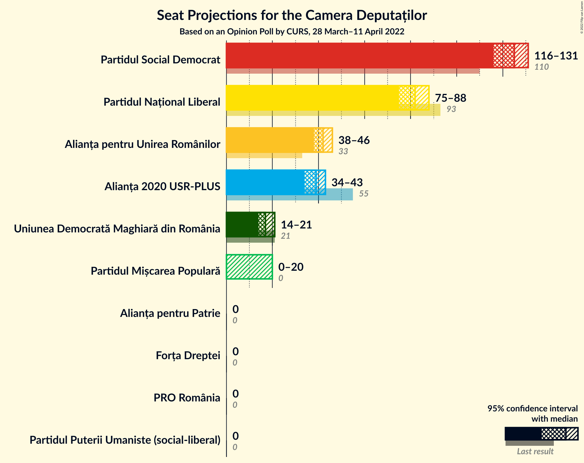

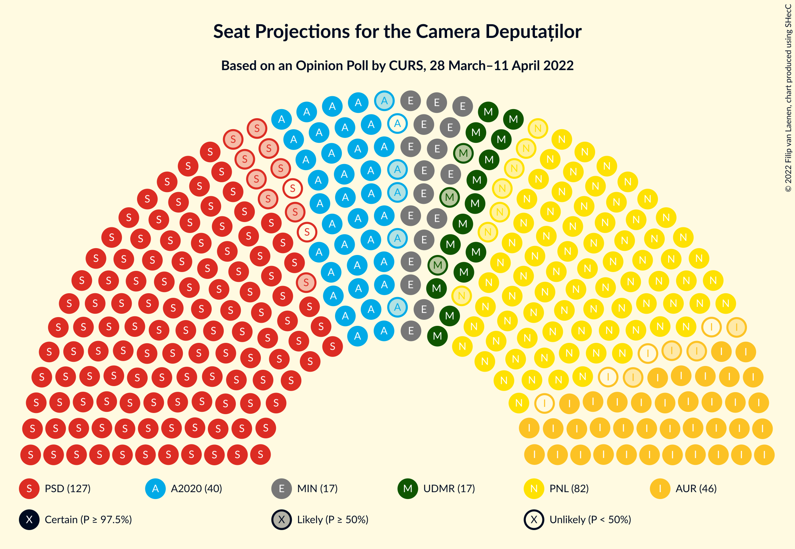

### Confidence Intervals

| Party | Last Result | Median | 80% Confidence Interval | 90% Confidence Interval | 95% Confidence Interval | 99% Confidence Interval |
|:-----:|:-----------:|:------:|:-----------------------:|:-----------------------:|:-----------------------:|:-----------------------:|
| <a href="#partidul-social-democrat">Partidul Social Democrat</a> | 110 | 125 | 118–130 |117–131 |116–131 |113–133 |
| <a href="#partidul-național-liberal">Partidul Național Liberal</a> | 93 | 82 | 76–86 |75–87 |75–88 |72–90 |
| <a href="#alianța-pentru-unirea-românilor">Alianța pentru Unirea Românilor</a> | 33 | 42 | 39–46 |39–46 |38–46 |37–49 |
| <a href="#alianța-2020-usr-plus">Alianța 2020 USR-PLUS</a> | 55 | 39 | 35–41 |34–43 |34–43 |33–45 |
| <a href="#uniunea-democrată-maghiară-din-românia">Uniunea Democrată Maghiară din România</a> | 21 | 17 | 16–19 |15–20 |14–21 |14–22 |
| <a href="#partidul-mișcarea-populară">Partidul Mișcarea Populară</a> | 0 | 0 | 0–18 |0–19 |0–20 |0–21 |
| <a href="#pro-românia">PRO România</a> | 0 | 0 | 0 |0 |0 |0 |
| <a href="#partidul-puterii-umaniste-(social-liberal)">Partidul Puterii Umaniste (social-liberal)</a> | 0 | 0 | 0 |0 |0 |0 |
| <a href="#alianța-pentru-patrie">Alianța pentru Patrie</a> | 0 | 0 | 0 |0 |0 |0 |
| <a href="#forța-dreptei">Forța Dreptei</a> | 0 | 0 | 0 |0 |0 |0 |

### Partidul Social Democrat

*For a full overview of the results for this party, see the [Partidul Social Democrat](party-partidulsocialdemocrat.html) page.*

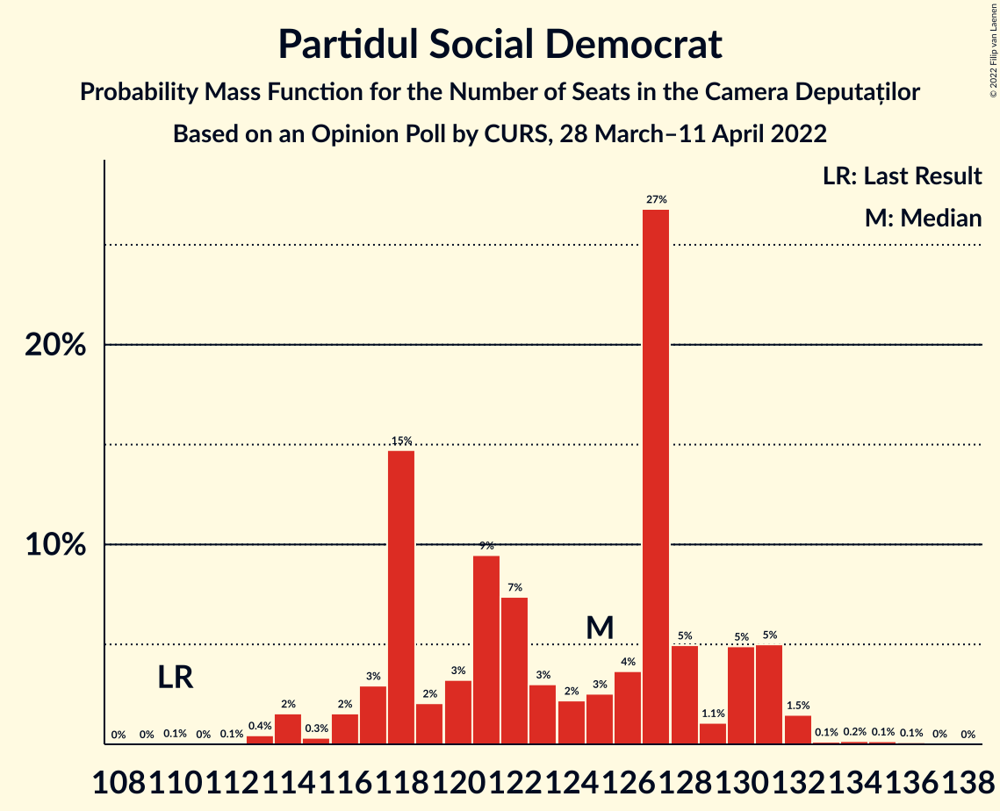

| Number of Seats | Probability | Accumulated | Special Marks |
|:---------------:|:-----------:|:-----------:|:-------------:|
| 110 | 0.1% | 100% | Last Result |
| 111 | 0% | 99.9% |  |
| 112 | 0.1% | 99.9% |  |
| 113 | 0.4% | 99.8% |  |
| 114 | 2% | 99.4% |  |
| 115 | 0.3% | 98% |  |
| 116 | 2% | 98% |  |
| 117 | 3% | 96% |  |
| 118 | 15% | 93% |  |
| 119 | 2% | 78% |  |
| 120 | 3% | 76% |  |
| 121 | 9% | 73% |  |
| 122 | 7% | 64% |  |
| 123 | 3% | 56% |  |
| 124 | 2% | 53% |  |
| 125 | 3% | 51% | Median |
| 126 | 4% | 48% |  |
| 127 | 27% | 45% |  |
| 128 | 5% | 18% |  |
| 129 | 1.1% | 13% |  |
| 130 | 5% | 12% |  |
| 131 | 5% | 7% |  |
| 132 | 1.5% | 2% |  |
| 133 | 0.1% | 0.6% |  |
| 134 | 0.2% | 0.5% |  |
| 135 | 0.1% | 0.3% |  |
| 136 | 0.1% | 0.2% |  |
| 137 | 0% | 0.1% |  |
| 138 | 0% | 0% |  |

### Partidul Național Liberal

*For a full overview of the results for this party, see the [Partidul Național Liberal](party-partidulnaționalliberal.html) page.*

| Number of Seats | Probability | Accumulated | Special Marks |
|:---------------:|:-----------:|:-----------:|:-------------:|
| 71 | 0.2% | 100% |  |
| 72 | 0.3% | 99.7% |  |
| 73 | 0.5% | 99.5% |  |
| 74 | 0.5% | 99.0% |  |
| 75 | 8% | 98% |  |
| 76 | 3% | 91% |  |
| 77 | 2% | 87% |  |
| 78 | 2% | 85% |  |
| 79 | 5% | 83% |  |
| 80 | 16% | 78% |  |
| 81 | 7% | 62% |  |
| 82 | 23% | 55% | Median |
| 83 | 7% | 31% |  |
| 84 | 9% | 24% |  |
| 85 | 4% | 15% |  |
| 86 | 3% | 11% |  |
| 87 | 4% | 8% |  |
| 88 | 3% | 4% |  |
| 89 | 0.7% | 1.5% |  |
| 90 | 0.5% | 0.8% |  |
| 91 | 0.2% | 0.4% |  |
| 92 | 0% | 0.2% |  |
| 93 | 0.1% | 0.1% | Last Result |
| 94 | 0.1% | 0.1% |  |
| 95 | 0% | 0% |  |

### Alianța pentru Unirea Românilor

*For a full overview of the results for this party, see the [Alianța pentru Unirea Românilor](party-alianțapentruunirearomânilor.html) page.*

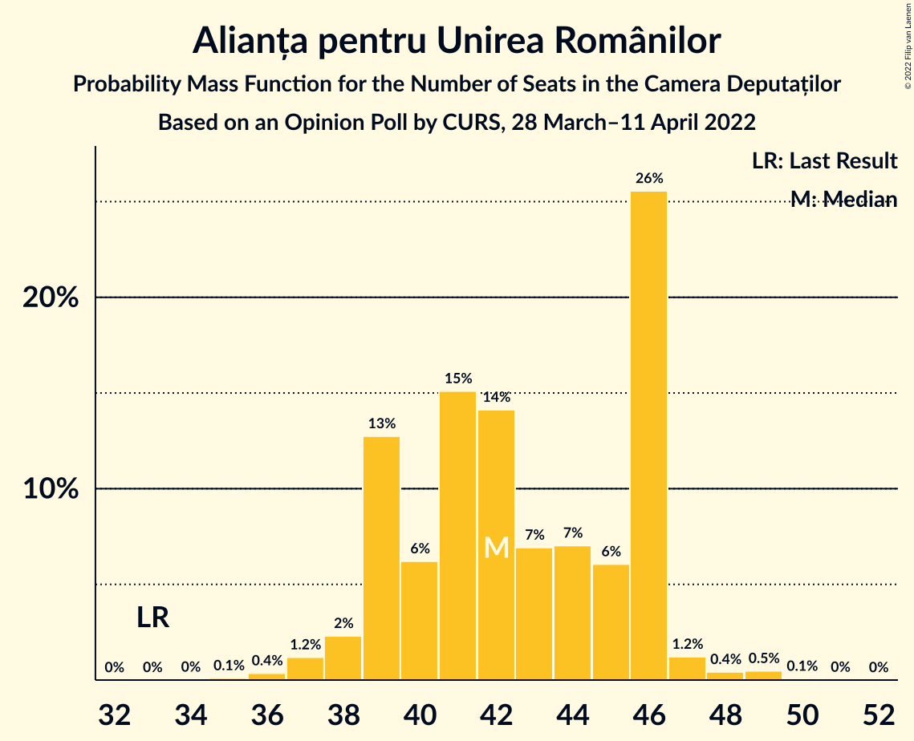

| Number of Seats | Probability | Accumulated | Special Marks |
|:---------------:|:-----------:|:-----------:|:-------------:|
| 33 | 0% | 100% | Last Result |
| 34 | 0% | 100% |  |
| 35 | 0.1% | 100% |  |
| 36 | 0.4% | 99.9% |  |
| 37 | 1.2% | 99.5% |  |
| 38 | 2% | 98% |  |
| 39 | 13% | 96% |  |
| 40 | 6% | 83% |  |
| 41 | 15% | 77% |  |
| 42 | 14% | 62% | Median |
| 43 | 7% | 48% |  |
| 44 | 7% | 41% |  |
| 45 | 6% | 34% |  |
| 46 | 26% | 28% |  |
| 47 | 1.2% | 2% |  |
| 48 | 0.4% | 1.0% |  |
| 49 | 0.5% | 0.6% |  |
| 50 | 0.1% | 0.1% |  |
| 51 | 0% | 0% |  |

### Alianța 2020 USR-PLUS

*For a full overview of the results for this party, see the [Alianța 2020 USR-PLUS](party-alianța2020usr-plus.html) page.*

| Number of Seats | Probability | Accumulated | Special Marks |
|:---------------:|:-----------:|:-----------:|:-------------:|
| 32 | 0.2% | 100% |  |
| 33 | 0.5% | 99.8% |  |
| 34 | 5% | 99.3% |  |
| 35 | 5% | 95% |  |
| 36 | 5% | 89% |  |
| 37 | 5% | 84% |  |
| 38 | 5% | 79% |  |
| 39 | 29% | 74% | Median |
| 40 | 34% | 44% |  |
| 41 | 4% | 11% |  |
| 42 | 2% | 7% |  |
| 43 | 3% | 5% |  |
| 44 | 0.9% | 2% |  |
| 45 | 0.6% | 0.8% |  |
| 46 | 0.1% | 0.2% |  |
| 47 | 0% | 0% |  |
| 48 | 0% | 0% |  |
| 49 | 0% | 0% |  |
| 50 | 0% | 0% |  |
| 51 | 0% | 0% |  |
| 52 | 0% | 0% |  |
| 53 | 0% | 0% |  |
| 54 | 0% | 0% |  |
| 55 | 0% | 0% | Last Result |

### Uniunea Democrată Maghiară din România

*For a full overview of the results for this party, see the [Uniunea Democrată Maghiară din România](party-uniuneademocratămaghiarădinromânia.html) page.*

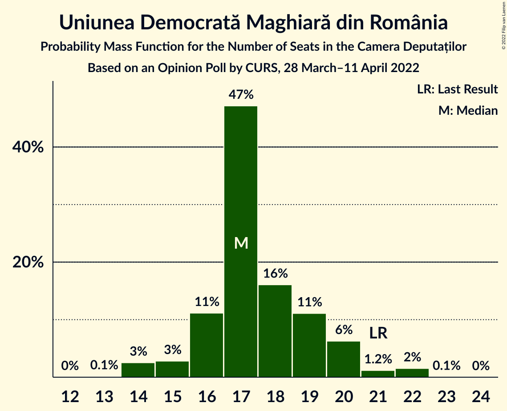

| Number of Seats | Probability | Accumulated | Special Marks |
|:---------------:|:-----------:|:-----------:|:-------------:|
| 13 | 0.1% | 100% |  |
| 14 | 3% | 99.8% |  |
| 15 | 3% | 97% |  |
| 16 | 11% | 94% |  |
| 17 | 47% | 83% | Median |
| 18 | 16% | 36% |  |
| 19 | 11% | 20% |  |
| 20 | 6% | 9% |  |
| 21 | 1.2% | 3% | Last Result |
| 22 | 2% | 2% |  |
| 23 | 0.1% | 0.1% |  |
| 24 | 0% | 0% |  |

### Partidul Mișcarea Populară

*For a full overview of the results for this party, see the [Partidul Mișcarea Populară](party-partidulmișcareapopulară.html) page.*

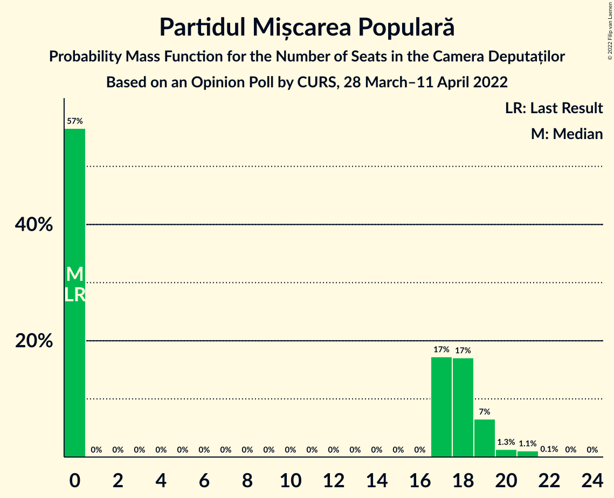

| Number of Seats | Probability | Accumulated | Special Marks |
|:---------------:|:-----------:|:-----------:|:-------------:|
| 0 | 57% | 100% | Last Result, Median |
| 1 | 0% | 43% |  |
| 2 | 0% | 43% |  |
| 3 | 0% | 43% |  |
| 4 | 0% | 43% |  |
| 5 | 0% | 43% |  |
| 6 | 0% | 43% |  |
| 7 | 0% | 43% |  |
| 8 | 0% | 43% |  |
| 9 | 0% | 43% |  |
| 10 | 0% | 43% |  |
| 11 | 0% | 43% |  |
| 12 | 0% | 43% |  |
| 13 | 0% | 43% |  |
| 14 | 0% | 43% |  |
| 15 | 0% | 43% |  |
| 16 | 0% | 43% |  |
| 17 | 17% | 43% |  |
| 18 | 17% | 26% |  |
| 19 | 7% | 9% |  |
| 20 | 1.3% | 3% |  |
| 21 | 1.1% | 1.2% |  |
| 22 | 0.1% | 0.2% |  |
| 23 | 0% | 0% |  |

### PRO România

*For a full overview of the results for this party, see the [PRO România](party-proromânia.html) page.*

| Number of Seats | Probability | Accumulated | Special Marks |
|:---------------:|:-----------:|:-----------:|:-------------:|
| 0 | 100% | 100% | Last Result, Median |

### Partidul Puterii Umaniste (social-liberal)

*For a full overview of the results for this party, see the [Partidul Puterii Umaniste (social-liberal)](party-partidulputeriiumanistesocial-liberal.html) page.*

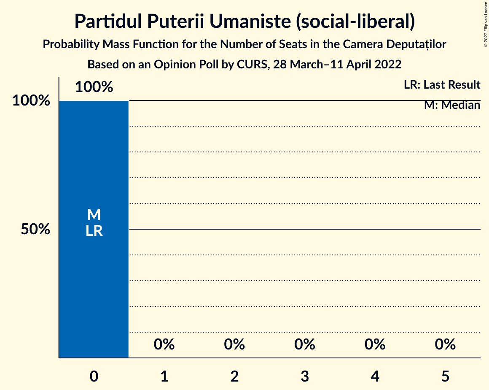

| Number of Seats | Probability | Accumulated | Special Marks |
|:---------------:|:-----------:|:-----------:|:-------------:|
| 0 | 100% | 100% | Last Result, Median |

### Alianța pentru Patrie

*For a full overview of the results for this party, see the [Alianța pentru Patrie](party-alianțapentrupatrie.html) page.*

| Number of Seats | Probability | Accumulated | Special Marks |
|:---------------:|:-----------:|:-----------:|:-------------:|
| 0 | 100% | 100% | Last Result, Median |

### Forța Dreptei

*For a full overview of the results for this party, see the [Forța Dreptei](party-forțadreptei.html) page.*

| Number of Seats | Probability | Accumulated | Special Marks |
|:---------------:|:-----------:|:-----------:|:-------------:|
| 0 | 100% | 100% | Last Result, Median |

## Coalitions

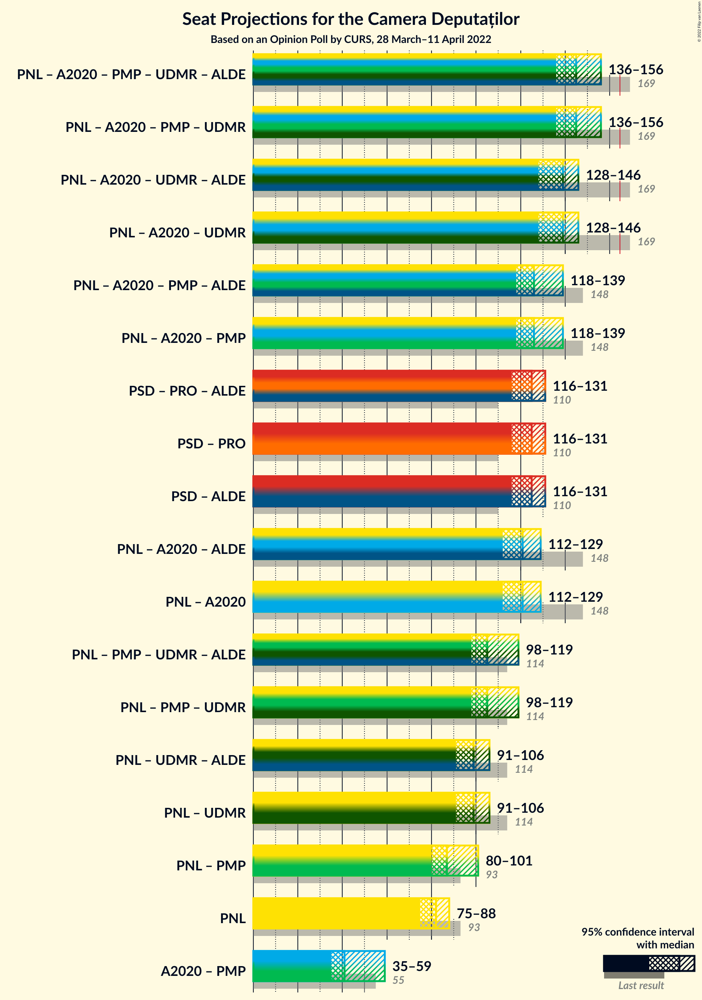

### Confidence Intervals

| Coalition | Last Result | Median | Majority? | 80% Confidence Interval | 90% Confidence Interval | 95% Confidence Interval | 99% Confidence Interval |
|:---------:|:-----------:|:------:|:---------:|:-----------------------:|:-----------------------:|:-----------------------:|:-----------------------:|
| Partidul Național Liberal – Alianța 2020 USR-PLUS – Partidul Mișcarea Populară – Uniunea Democrată Maghiară din România | 169 | 145 | 0% | 139–153 | 137–155 | 136–156 | 135–159 |
| Partidul Național Liberal – Alianța 2020 USR-PLUS – Uniunea Democrată Maghiară din România | 169 | 139 | 0% | 131–144 | 130–145 | 128–146 | 126–149 |
| Partidul Național Liberal – Alianța 2020 USR-PLUS – Partidul Mișcarea Populară | 148 | 126 | 0% | 121–137 | 119–137 | 118–139 | 117–141 |
| Partidul Social Democrat – PRO România | 110 | 125 | 0% | 118–130 | 117–131 | 116–131 | 113–133 |
| Partidul Național Liberal – Alianța 2020 USR-PLUS | 148 | 121 | 0% | 114–125 | 113–128 | 112–129 | 109–130 |
| Partidul Național Liberal – Partidul Mișcarea Populară – Uniunea Democrată Maghiară din România | 114 | 105 | 0% | 99–116 | 99–117 | 98–119 | 96–121 |
| Partidul Național Liberal – Uniunea Democrată Maghiară din România | 114 | 99 | 0% | 93–104 | 92–105 | 91–106 | 89–109 |
| Partidul Național Liberal – Partidul Mișcarea Populară | 93 | 87 | 0% | 82–98 | 81–100 | 80–101 | 78–103 |
| Partidul Național Liberal | 93 | 82 | 0% | 76–86 | 75–87 | 75–88 | 72–90 |
| Alianța 2020 USR-PLUS – Partidul Mișcarea Populară | 55 | 41 | 0% | 39–57 | 36–58 | 35–59 | 35–61 |

### Partidul Național Liberal – Alianța 2020 USR-PLUS – Partidul Mișcarea Populară – Uniunea Democrată Maghiară din România

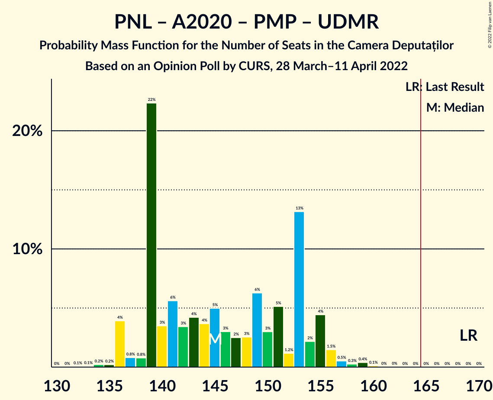

| Number of Seats | Probability | Accumulated | Special Marks |
|:---------------:|:-----------:|:-----------:|:-------------:|
| 132 | 0.1% | 100% |  |
| 133 | 0.1% | 99.9% |  |
| 134 | 0.2% | 99.9% |  |
| 135 | 0.2% | 99.6% |  |
| 136 | 4% | 99.4% |  |
| 137 | 0.8% | 96% |  |
| 138 | 0.8% | 95% | Median |
| 139 | 22% | 94% |  |
| 140 | 3% | 72% |  |
| 141 | 6% | 68% |  |
| 142 | 3% | 62% |  |
| 143 | 4% | 59% |  |
| 144 | 4% | 55% |  |
| 145 | 5% | 51% |  |
| 146 | 3% | 46% |  |
| 147 | 2% | 43% |  |
| 148 | 3% | 41% |  |
| 149 | 6% | 38% |  |
| 150 | 3% | 32% |  |
| 151 | 5% | 29% |  |
| 152 | 1.2% | 24% |  |
| 153 | 13% | 23% |  |
| 154 | 2% | 9% |  |
| 155 | 4% | 7% |  |
| 156 | 1.5% | 3% |  |
| 157 | 0.5% | 1.3% |  |
| 158 | 0.3% | 0.8% |  |
| 159 | 0.4% | 0.5% |  |
| 160 | 0.1% | 0.1% |  |
| 161 | 0% | 0% |  |
| 162 | 0% | 0% |  |
| 163 | 0% | 0% |  |
| 164 | 0% | 0% |  |
| 165 | 0% | 0% | Majority |
| 166 | 0% | 0% |  |
| 167 | 0% | 0% |  |
| 168 | 0% | 0% |  |
| 169 | 0% | 0% | Last Result |

### Partidul Național Liberal – Alianța 2020 USR-PLUS – Uniunea Democrată Maghiară din România

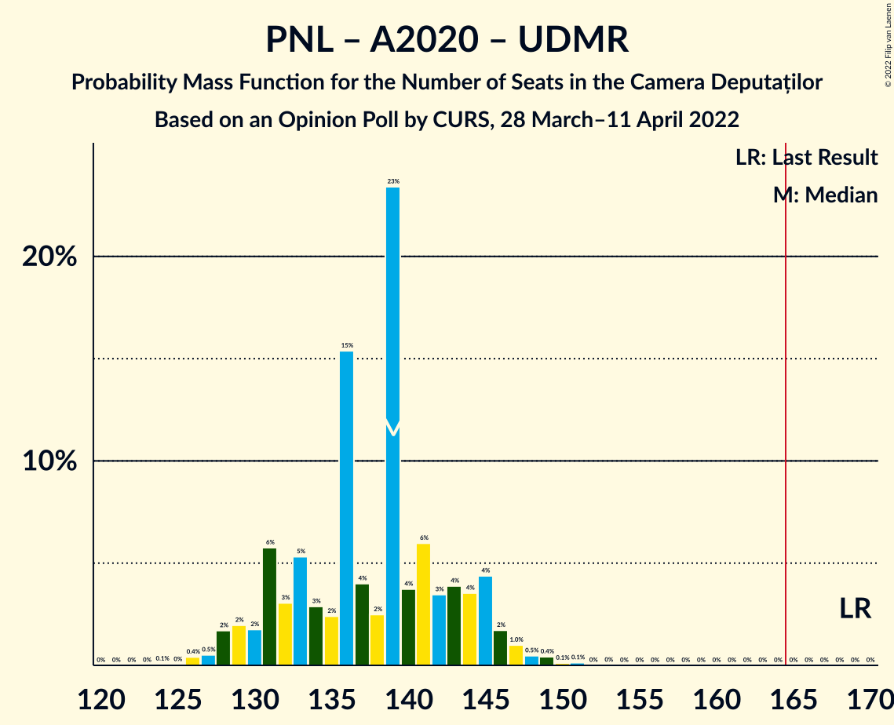

| Number of Seats | Probability | Accumulated | Special Marks |
|:---------------:|:-----------:|:-----------:|:-------------:|
| 124 | 0.1% | 100% |  |
| 125 | 0% | 99.9% |  |
| 126 | 0.4% | 99.9% |  |
| 127 | 0.5% | 99.5% |  |
| 128 | 2% | 98.9% |  |
| 129 | 2% | 97% |  |
| 130 | 2% | 95% |  |
| 131 | 6% | 94% |  |
| 132 | 3% | 88% |  |
| 133 | 5% | 85% |  |
| 134 | 3% | 79% |  |
| 135 | 2% | 77% |  |
| 136 | 15% | 74% |  |
| 137 | 4% | 59% |  |
| 138 | 2% | 55% | Median |
| 139 | 23% | 52% |  |
| 140 | 4% | 29% |  |
| 141 | 6% | 25% |  |
| 142 | 3% | 19% |  |
| 143 | 4% | 16% |  |
| 144 | 4% | 12% |  |
| 145 | 4% | 8% |  |
| 146 | 2% | 4% |  |
| 147 | 1.0% | 2% |  |
| 148 | 0.5% | 1.2% |  |
| 149 | 0.4% | 0.7% |  |
| 150 | 0.1% | 0.3% |  |
| 151 | 0.1% | 0.2% |  |
| 152 | 0% | 0% |  |
| 153 | 0% | 0% |  |
| 154 | 0% | 0% |  |
| 155 | 0% | 0% |  |
| 156 | 0% | 0% |  |
| 157 | 0% | 0% |  |
| 158 | 0% | 0% |  |
| 159 | 0% | 0% |  |
| 160 | 0% | 0% |  |
| 161 | 0% | 0% |  |
| 162 | 0% | 0% |  |
| 163 | 0% | 0% |  |
| 164 | 0% | 0% |  |
| 165 | 0% | 0% | Majority |
| 166 | 0% | 0% |  |
| 167 | 0% | 0% |  |
| 168 | 0% | 0% |  |
| 169 | 0% | 0% | Last Result |

### Partidul Național Liberal – Alianța 2020 USR-PLUS – Partidul Mișcarea Populară

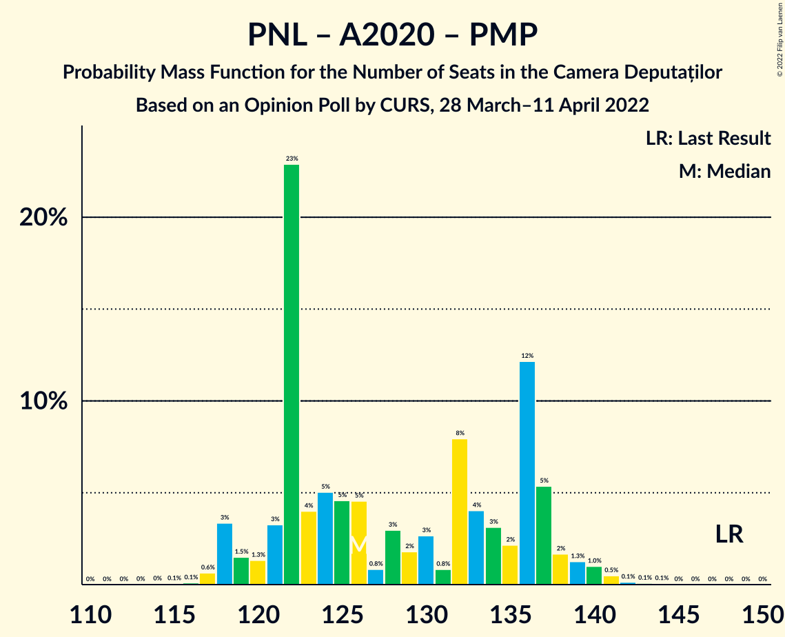

| Number of Seats | Probability | Accumulated | Special Marks |
|:---------------:|:-----------:|:-----------:|:-------------:|
| 114 | 0% | 100% |  |
| 115 | 0.1% | 99.9% |  |
| 116 | 0.1% | 99.9% |  |
| 117 | 0.6% | 99.8% |  |
| 118 | 3% | 99.1% |  |
| 119 | 1.5% | 96% |  |
| 120 | 1.3% | 94% |  |
| 121 | 3% | 93% | Median |
| 122 | 23% | 90% |  |
| 123 | 4% | 67% |  |
| 124 | 5% | 63% |  |
| 125 | 5% | 58% |  |
| 126 | 5% | 53% |  |
| 127 | 0.8% | 49% |  |
| 128 | 3% | 48% |  |
| 129 | 2% | 45% |  |
| 130 | 3% | 43% |  |
| 131 | 0.8% | 40% |  |
| 132 | 8% | 40% |  |
| 133 | 4% | 32% |  |
| 134 | 3% | 28% |  |
| 135 | 2% | 24% |  |
| 136 | 12% | 22% |  |
| 137 | 5% | 10% |  |
| 138 | 2% | 5% |  |
| 139 | 1.3% | 3% |  |
| 140 | 1.0% | 2% |  |
| 141 | 0.5% | 0.8% |  |
| 142 | 0.1% | 0.3% |  |
| 143 | 0.1% | 0.2% |  |
| 144 | 0.1% | 0.1% |  |
| 145 | 0% | 0% |  |
| 146 | 0% | 0% |  |
| 147 | 0% | 0% |  |
| 148 | 0% | 0% | Last Result |

### Partidul Social Democrat – PRO România

| Number of Seats | Probability | Accumulated | Special Marks |
|:---------------:|:-----------:|:-----------:|:-------------:|
| 110 | 0.1% | 100% | Last Result |
| 111 | 0% | 99.9% |  |
| 112 | 0.1% | 99.9% |  |
| 113 | 0.4% | 99.8% |  |
| 114 | 2% | 99.4% |  |
| 115 | 0.3% | 98% |  |
| 116 | 2% | 98% |  |
| 117 | 3% | 96% |  |
| 118 | 15% | 93% |  |
| 119 | 2% | 78% |  |
| 120 | 3% | 76% |  |
| 121 | 9% | 73% |  |
| 122 | 7% | 64% |  |
| 123 | 3% | 56% |  |
| 124 | 2% | 53% |  |
| 125 | 3% | 51% | Median |
| 126 | 4% | 48% |  |
| 127 | 27% | 45% |  |
| 128 | 5% | 18% |  |
| 129 | 1.1% | 13% |  |
| 130 | 5% | 12% |  |
| 131 | 5% | 7% |  |
| 132 | 1.5% | 2% |  |
| 133 | 0.1% | 0.6% |  |
| 134 | 0.2% | 0.5% |  |
| 135 | 0.1% | 0.3% |  |
| 136 | 0.1% | 0.2% |  |
| 137 | 0% | 0.1% |  |
| 138 | 0% | 0% |  |

### Partidul Național Liberal – Alianța 2020 USR-PLUS

| Number of Seats | Probability | Accumulated | Special Marks |
|:---------------:|:-----------:|:-----------:|:-------------:|
| 107 | 0% | 100% |  |
| 108 | 0.1% | 99.9% |  |
| 109 | 0.8% | 99.9% |  |
| 110 | 0.3% | 99.1% |  |
| 111 | 1.1% | 98.8% |  |
| 112 | 1.4% | 98% |  |
| 113 | 3% | 96% |  |
| 114 | 6% | 93% |  |
| 115 | 5% | 88% |  |
| 116 | 3% | 83% |  |
| 117 | 3% | 80% |  |
| 118 | 6% | 77% |  |
| 119 | 16% | 71% |  |
| 120 | 4% | 56% |  |
| 121 | 4% | 52% | Median |
| 122 | 24% | 48% |  |
| 123 | 5% | 24% |  |
| 124 | 5% | 20% |  |
| 125 | 5% | 14% |  |
| 126 | 4% | 10% |  |
| 127 | 0.6% | 6% |  |
| 128 | 2% | 5% |  |
| 129 | 1.2% | 3% |  |
| 130 | 1.2% | 2% |  |
| 131 | 0.2% | 0.4% |  |
| 132 | 0.1% | 0.2% |  |
| 133 | 0.1% | 0.1% |  |
| 134 | 0% | 0% |  |
| 135 | 0% | 0% |  |
| 136 | 0% | 0% |  |
| 137 | 0% | 0% |  |
| 138 | 0% | 0% |  |
| 139 | 0% | 0% |  |
| 140 | 0% | 0% |  |
| 141 | 0% | 0% |  |
| 142 | 0% | 0% |  |
| 143 | 0% | 0% |  |
| 144 | 0% | 0% |  |
| 145 | 0% | 0% |  |
| 146 | 0% | 0% |  |
| 147 | 0% | 0% |  |
| 148 | 0% | 0% | Last Result |

### Partidul Național Liberal – Partidul Mișcarea Populară – Uniunea Democrată Maghiară din România

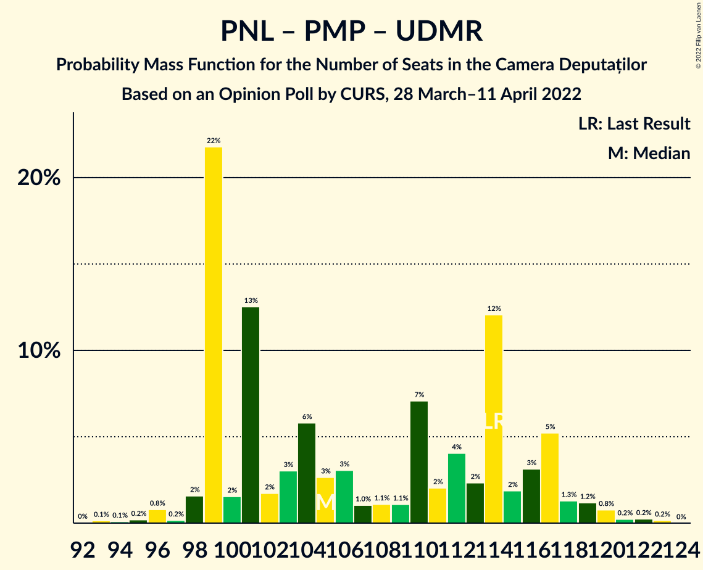

| Number of Seats | Probability | Accumulated | Special Marks |
|:---------------:|:-----------:|:-----------:|:-------------:|
| 93 | 0.1% | 100% |  |
| 94 | 0.1% | 99.8% |  |
| 95 | 0.2% | 99.7% |  |
| 96 | 0.8% | 99.5% |  |
| 97 | 0.2% | 98.7% |  |
| 98 | 2% | 98.6% |  |
| 99 | 22% | 97% | Median |
| 100 | 2% | 75% |  |
| 101 | 13% | 74% |  |
| 102 | 2% | 61% |  |
| 103 | 3% | 59% |  |
| 104 | 6% | 56% |  |
| 105 | 3% | 51% |  |
| 106 | 3% | 48% |  |
| 107 | 1.0% | 45% |  |
| 108 | 1.1% | 44% |  |
| 109 | 1.1% | 43% |  |
| 110 | 7% | 42% |  |
| 111 | 2% | 35% |  |
| 112 | 4% | 33% |  |
| 113 | 2% | 29% |  |
| 114 | 12% | 26% | Last Result |
| 115 | 2% | 14% |  |
| 116 | 3% | 12% |  |
| 117 | 5% | 9% |  |
| 118 | 1.3% | 4% |  |
| 119 | 1.2% | 3% |  |
| 120 | 0.8% | 1.4% |  |
| 121 | 0.2% | 0.6% |  |
| 122 | 0.2% | 0.4% |  |
| 123 | 0.2% | 0.2% |  |
| 124 | 0% | 0% |  |

### Partidul Național Liberal – Uniunea Democrată Maghiară din România

| Number of Seats | Probability | Accumulated | Special Marks |
|:---------------:|:-----------:|:-----------:|:-------------:|
| 86 | 0.1% | 100% |  |
| 87 | 0% | 99.9% |  |
| 88 | 0.1% | 99.9% |  |
| 89 | 0.6% | 99.9% |  |
| 90 | 0.6% | 99.3% |  |
| 91 | 2% | 98.7% |  |
| 92 | 6% | 97% |  |
| 93 | 3% | 91% |  |
| 94 | 3% | 88% |  |
| 95 | 4% | 85% |  |
| 96 | 2% | 81% |  |
| 97 | 12% | 79% |  |
| 98 | 5% | 67% |  |
| 99 | 25% | 61% | Median |
| 100 | 5% | 36% |  |
| 101 | 13% | 32% |  |
| 102 | 2% | 19% |  |
| 103 | 3% | 17% |  |
| 104 | 6% | 13% |  |
| 105 | 3% | 7% |  |
| 106 | 3% | 5% |  |
| 107 | 0.6% | 2% |  |
| 108 | 0.4% | 1.1% |  |
| 109 | 0.5% | 0.7% |  |
| 110 | 0% | 0.2% |  |
| 111 | 0.1% | 0.1% |  |
| 112 | 0.1% | 0.1% |  |
| 113 | 0% | 0% |  |
| 114 | 0% | 0% | Last Result |

### Partidul Național Liberal – Partidul Mișcarea Populară

| Number of Seats | Probability | Accumulated | Special Marks |
|:---------------:|:-----------:|:-----------:|:-------------:|
| 75 | 0% | 100% |  |
| 76 | 0.1% | 99.9% |  |
| 77 | 0.2% | 99.8% |  |
| 78 | 0.5% | 99.7% |  |
| 79 | 1.3% | 99.1% |  |
| 80 | 2% | 98% |  |
| 81 | 3% | 96% |  |
| 82 | 22% | 93% | Median |
| 83 | 7% | 71% |  |
| 84 | 7% | 64% |  |
| 85 | 4% | 57% |  |
| 86 | 2% | 54% |  |
| 87 | 4% | 51% |  |
| 88 | 3% | 47% |  |
| 89 | 0.9% | 45% |  |
| 90 | 0.9% | 44% |  |
| 91 | 0.5% | 43% |  |
| 92 | 1.3% | 43% |  |
| 93 | 6% | 41% | Last Result |
| 94 | 2% | 35% |  |
| 95 | 3% | 33% |  |
| 96 | 4% | 30% |  |
| 97 | 12% | 27% |  |
| 98 | 5% | 14% |  |
| 99 | 4% | 10% |  |
| 100 | 1.3% | 6% |  |
| 101 | 2% | 5% |  |
| 102 | 1.0% | 2% |  |
| 103 | 1.0% | 2% |  |
| 104 | 0.3% | 0.5% |  |
| 105 | 0.1% | 0.2% |  |
| 106 | 0% | 0.1% |  |
| 107 | 0.1% | 0.1% |  |
| 108 | 0% | 0% |  |

### Partidul Național Liberal

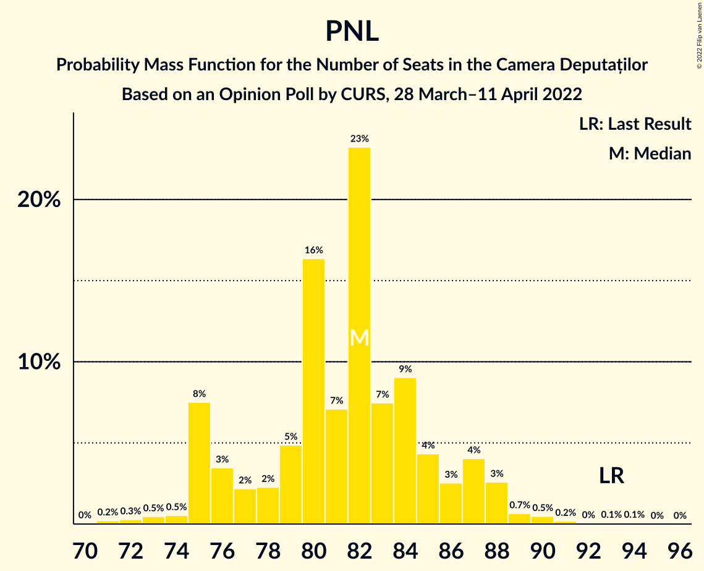

| Number of Seats | Probability | Accumulated | Special Marks |
|:---------------:|:-----------:|:-----------:|:-------------:|
| 71 | 0.2% | 100% |  |
| 72 | 0.3% | 99.7% |  |
| 73 | 0.5% | 99.5% |  |
| 74 | 0.5% | 99.0% |  |
| 75 | 8% | 98% |  |
| 76 | 3% | 91% |  |
| 77 | 2% | 87% |  |
| 78 | 2% | 85% |  |
| 79 | 5% | 83% |  |
| 80 | 16% | 78% |  |
| 81 | 7% | 62% |  |
| 82 | 23% | 55% | Median |
| 83 | 7% | 31% |  |
| 84 | 9% | 24% |  |
| 85 | 4% | 15% |  |
| 86 | 3% | 11% |  |
| 87 | 4% | 8% |  |
| 88 | 3% | 4% |  |
| 89 | 0.7% | 1.5% |  |
| 90 | 0.5% | 0.8% |  |
| 91 | 0.2% | 0.4% |  |
| 92 | 0% | 0.2% |  |
| 93 | 0.1% | 0.1% | Last Result |
| 94 | 0.1% | 0.1% |  |
| 95 | 0% | 0% |  |

### Alianța 2020 USR-PLUS – Partidul Mișcarea Populară

| Number of Seats | Probability | Accumulated | Special Marks |
|:---------------:|:-----------:|:-----------:|:-------------:|
| 34 | 0.2% | 100% |  |
| 35 | 3% | 99.8% |  |
| 36 | 2% | 96% |  |
| 37 | 0.8% | 95% |  |
| 38 | 2% | 94% |  |
| 39 | 8% | 92% | Median |
| 40 | 33% | 84% |  |
| 41 | 3% | 52% |  |
| 42 | 1.2% | 49% |  |
| 43 | 3% | 48% |  |
| 44 | 0.8% | 45% |  |
| 45 | 0.6% | 44% |  |
| 46 | 0.1% | 44% |  |
| 47 | 0% | 43% |  |
| 48 | 0% | 43% |  |
| 49 | 0.1% | 43% |  |
| 50 | 0.1% | 43% |  |
| 51 | 1.1% | 43% |  |
| 52 | 4% | 42% |  |
| 53 | 2% | 38% |  |
| 54 | 3% | 36% |  |
| 55 | 3% | 33% | Last Result |
| 56 | 13% | 30% |  |
| 57 | 11% | 17% |  |
| 58 | 3% | 6% |  |
| 59 | 1.0% | 3% |  |
| 60 | 1.3% | 2% |  |
| 61 | 0.5% | 0.7% |  |
| 62 | 0.1% | 0.1% |  |
| 63 | 0% | 0% |  |

## Technical Information

### Opinion Poll

+ **Polling firm:** CURS
+ **Commissioner(s):** —
+ **Fieldwork period:** 28 March–11 April 2022

### Calculations

+ **Sample size:** 2750
+ **Simulations done:** 1,048,576
+ **Error estimate:** 0.85%

