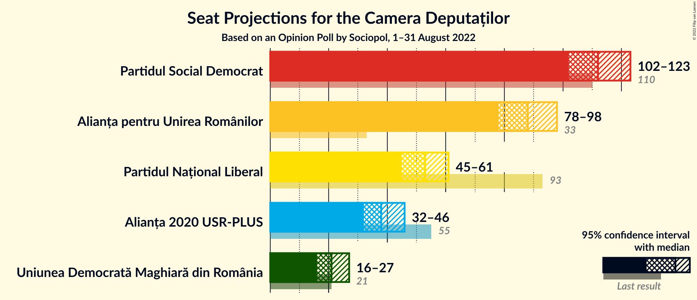
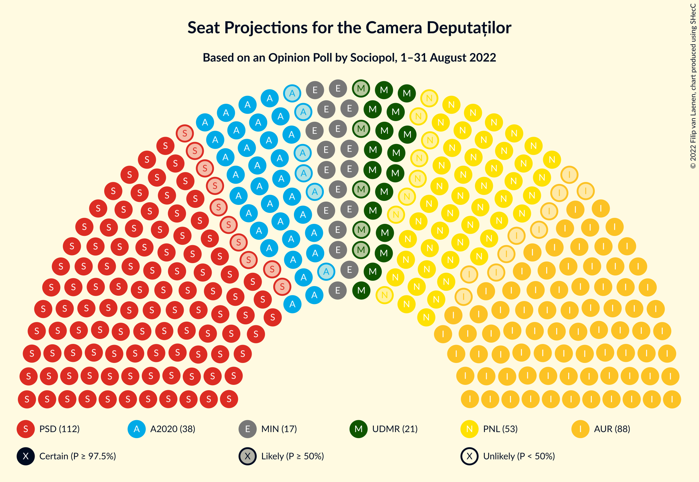
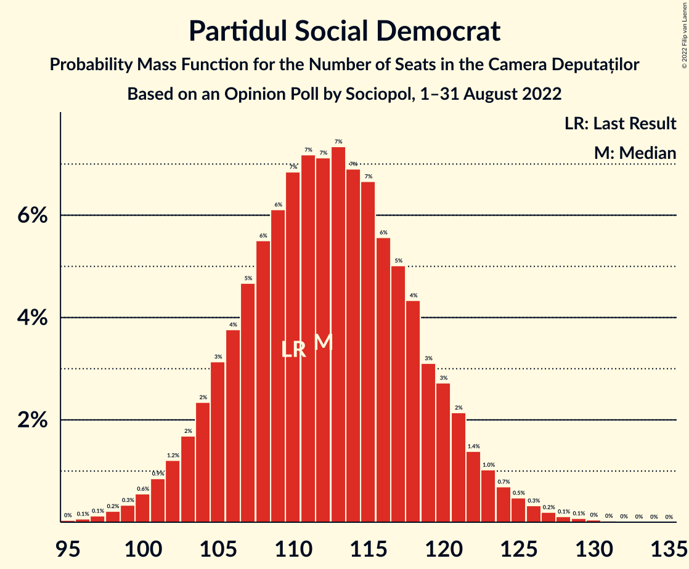
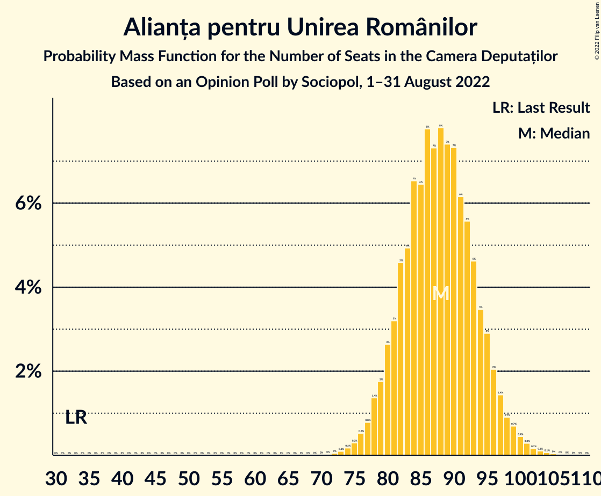
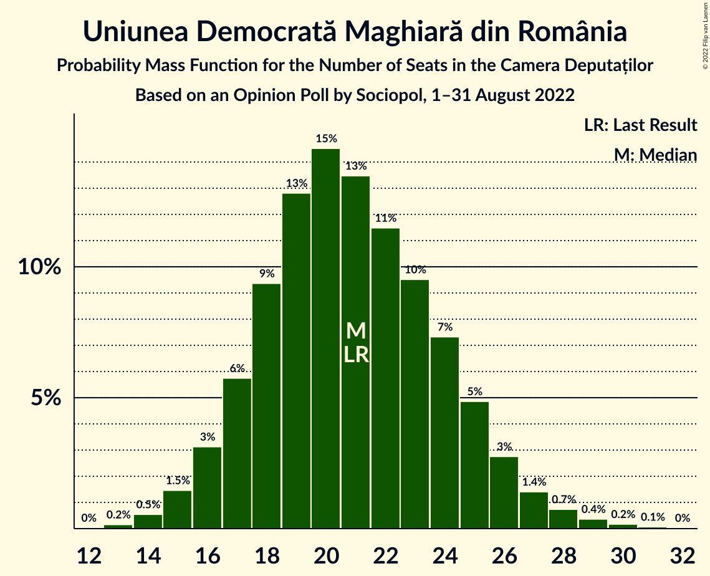
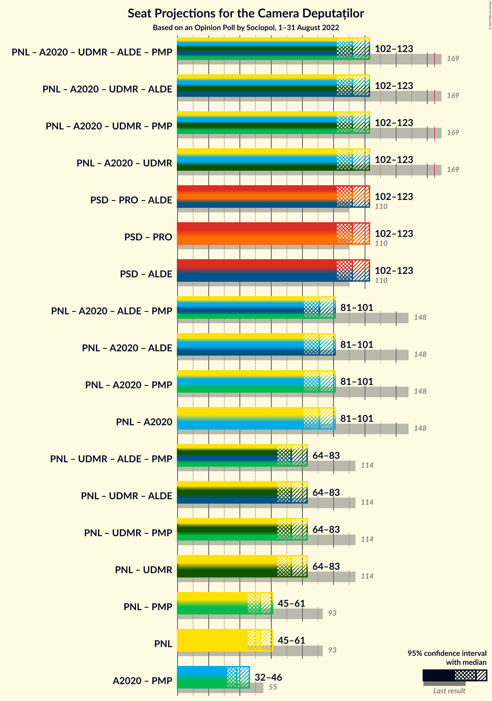
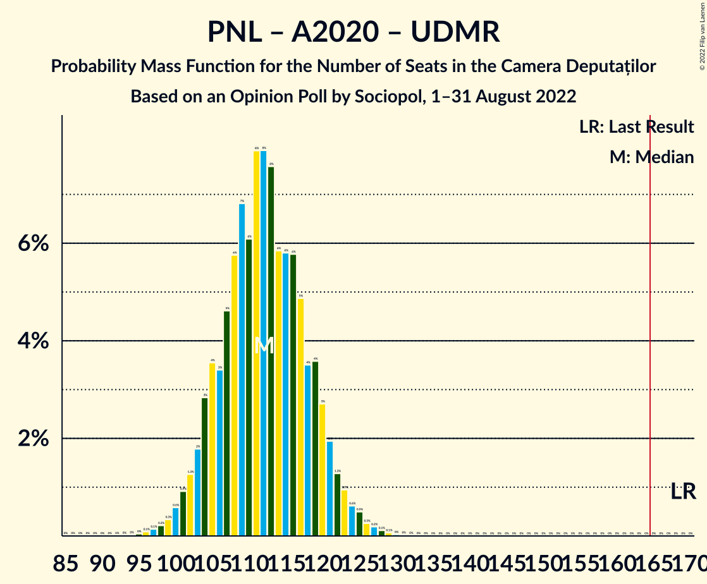
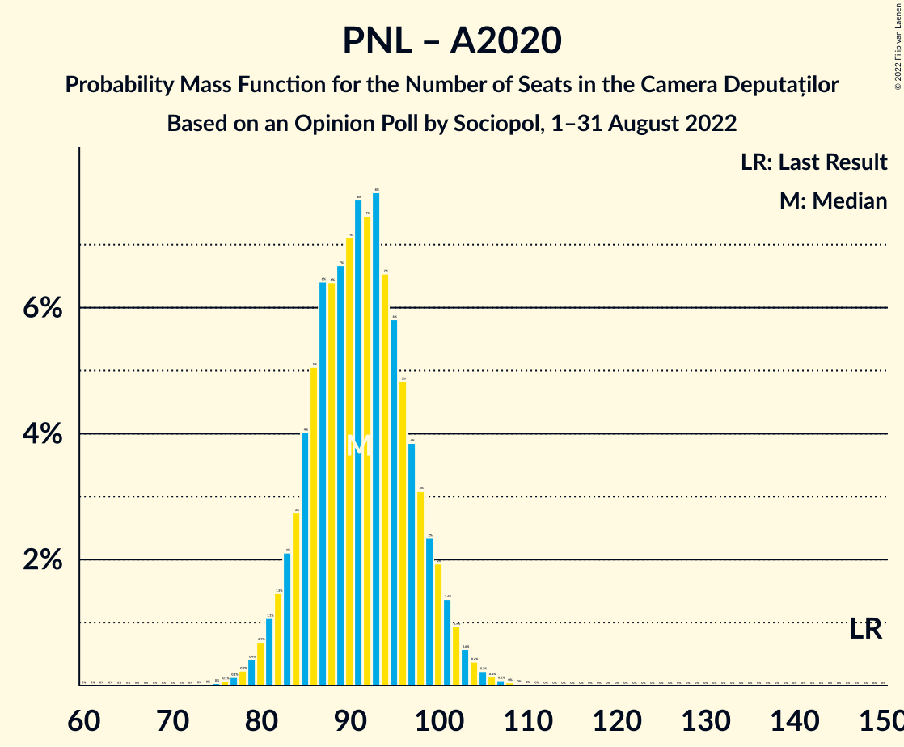
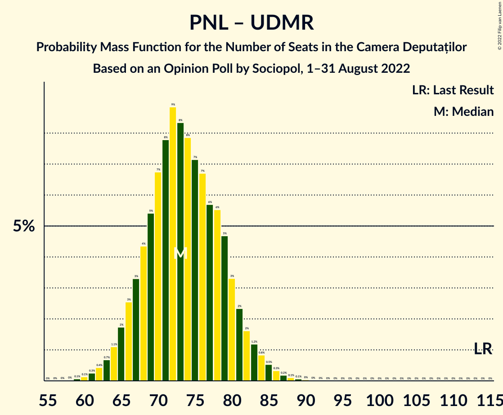
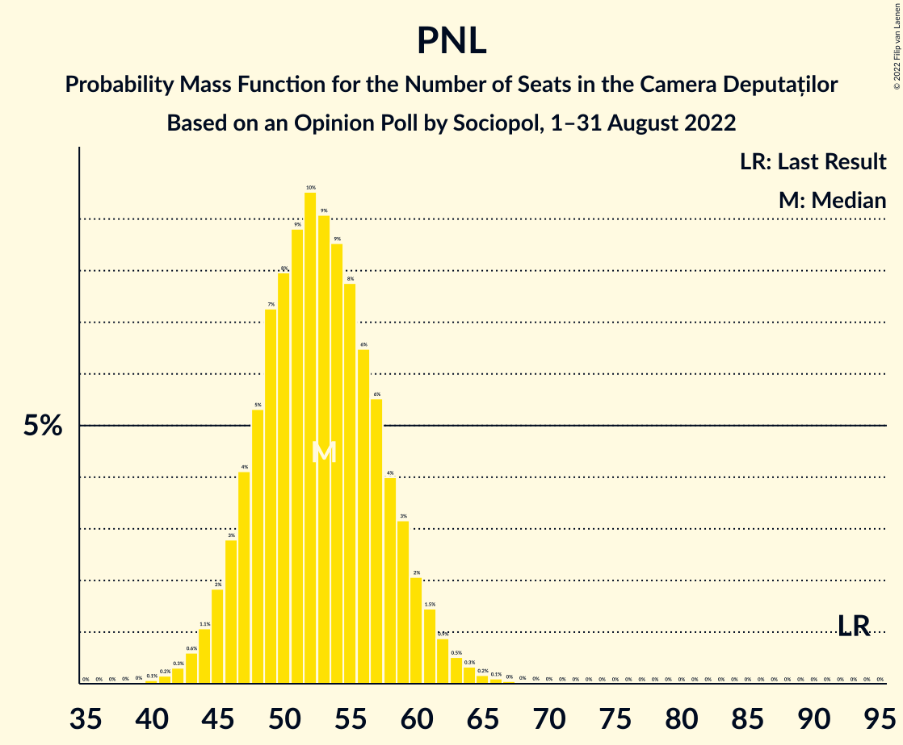

# Opinion Poll by Sociopol, 1–31 August 2022

<a href="#voting-intentions">Voting Intentions</a> | <a href="#seats">Seats</a> | <a href="#coalitions">Coalitions</a> | <a href="#technical-information">Technical Information</a>

## Voting Intentions

### Confidence Intervals

| Party | Last Result | Poll Result | 80% Confidence Interval | 90% Confidence Interval | 95% Confidence Interval | 99% Confidence Interval |
|:-----:|:-----------:|:-----------:|:-----------------------:|:-----------------------:|:-----------------------:|:-----------------------:|
| Partidul Social Democrat | 28.9% | 32.0% | 30.0–34.0% |29.4–34.6% |28.9–35.1% |28.0–36.1% |
| Alianța pentru Unirea Românilor | 9.1% | 25.0% | 23.2–26.9% |22.6–27.5% |22.2–28.0% |21.4–28.9% |
| Partidul Național Liberal | 25.2% | 15.0% | 13.5–16.7% |13.1–17.1% |12.8–17.5% |12.1–18.4% |
| Alianța 2020 USR-PLUS | 15.4% | 11.0% | 9.7–12.5% |9.4–12.9% |9.1–13.3% |8.5–14.0% |
| Uniunea Democrată Maghiară din România | 5.7% | 6.0% | 5.0–7.1% |4.8–7.4% |4.6–7.7% |4.2–8.3% |

*Note:* The poll result column reflects the actual value used in the calculations. Published results may vary slightly, and in addition be rounded to fewer digits.

## Seats

### Confidence Intervals

| Party | Last Result | Median | 80% Confidence Interval | 90% Confidence Interval | 95% Confidence Interval | 99% Confidence Interval |
|:-----:|:-----------:|:------:|:-----------------------:|:-----------------------:|:-----------------------:|:-----------------------:|
| <a href="#partidul-social-democrat">Partidul Social Democrat</a> | 110 | 112 | 105–119 |103–121 |102–123 |99–127 |
| <a href="#alianța-pentru-unirea-românilor">Alianța pentru Unirea Românilor</a> | 33 | 88 | 81–94 |79–96 |78–98 |75–101 |
| <a href="#partidul-național-liberal">Partidul Național Liberal</a> | 93 | 53 | 47–58 |46–60 |45–61 |42–64 |
| <a href="#alianța-2020-usr-plus">Alianța 2020 USR-PLUS</a> | 55 | 38 | 34–43 |33–45 |32–46 |30–49 |
| <a href="#uniunea-democrată-maghiară-din-românia">Uniunea Democrată Maghiară din România</a> | 21 | 21 | 17–25 |16–26 |16–27 |14–29 |

### Partidul Social Democrat

*For a full overview of the results for this party, see the [Partidul Social Democrat](party-partidulsocialdemocrat.html) page.*

| Number of Seats | Probability | Accumulated | Special Marks |
|:---------------:|:-----------:|:-----------:|:-------------:|
| 95 | 0% | 100% |  |
| 96 | 0.1% | 99.9% |  |
| 97 | 0.1% | 99.9% |  |
| 98 | 0.2% | 99.7% |  |
| 99 | 0.3% | 99.5% |  |
| 100 | 0.6% | 99.2% |  |
| 101 | 0.9% | 98.6% |  |
| 102 | 1.2% | 98% |  |
| 103 | 2% | 97% |  |
| 104 | 2% | 95% |  |
| 105 | 3% | 93% |  |
| 106 | 4% | 89% |  |
| 107 | 5% | 86% |  |
| 108 | 6% | 81% |  |
| 109 | 6% | 75% |  |
| 110 | 7% | 69% | Last Result |
| 111 | 7% | 63% |  |
| 112 | 7% | 55% | Median |
| 113 | 7% | 48% |  |
| 114 | 7% | 41% |  |
| 115 | 7% | 34% |  |
| 116 | 6% | 27% |  |
| 117 | 5% | 22% |  |
| 118 | 4% | 17% |  |
| 119 | 3% | 12% |  |
| 120 | 3% | 9% |  |
| 121 | 2% | 7% |  |
| 122 | 1.4% | 4% |  |
| 123 | 1.0% | 3% |  |
| 124 | 0.7% | 2% |  |
| 125 | 0.5% | 1.3% |  |
| 126 | 0.3% | 0.8% |  |
| 127 | 0.2% | 0.5% |  |
| 128 | 0.1% | 0.3% |  |
| 129 | 0.1% | 0.2% |  |
| 130 | 0% | 0.1% |  |
| 131 | 0% | 0.1% |  |
| 132 | 0% | 0% |  |

### Alianța pentru Unirea Românilor

*For a full overview of the results for this party, see the [Alianța pentru Unirea Românilor](party-alianțapentruunirearomânilor.html) page.*

| Number of Seats | Probability | Accumulated | Special Marks |
|:---------------:|:-----------:|:-----------:|:-------------:|
| 33 | 0% | 100% | Last Result |
| 34 | 0% | 100% |  |
| 35 | 0% | 100% |  |
| 36 | 0% | 100% |  |
| 37 | 0% | 100% |  |
| 38 | 0% | 100% |  |
| 39 | 0% | 100% |  |
| 40 | 0% | 100% |  |
| 41 | 0% | 100% |  |
| 42 | 0% | 100% |  |
| 43 | 0% | 100% |  |
| 44 | 0% | 100% |  |
| 45 | 0% | 100% |  |
| 46 | 0% | 100% |  |
| 47 | 0% | 100% |  |
| 48 | 0% | 100% |  |
| 49 | 0% | 100% |  |
| 50 | 0% | 100% |  |
| 51 | 0% | 100% |  |
| 52 | 0% | 100% |  |
| 53 | 0% | 100% |  |
| 54 | 0% | 100% |  |
| 55 | 0% | 100% |  |
| 56 | 0% | 100% |  |
| 57 | 0% | 100% |  |
| 58 | 0% | 100% |  |
| 59 | 0% | 100% |  |
| 60 | 0% | 100% |  |
| 61 | 0% | 100% |  |
| 62 | 0% | 100% |  |
| 63 | 0% | 100% |  |
| 64 | 0% | 100% |  |
| 65 | 0% | 100% |  |
| 66 | 0% | 100% |  |
| 67 | 0% | 100% |  |
| 68 | 0% | 100% |  |
| 69 | 0% | 100% |  |
| 70 | 0% | 100% |  |
| 71 | 0% | 100% |  |
| 72 | 0% | 100% |  |
| 73 | 0.1% | 99.9% |  |
| 74 | 0.2% | 99.8% |  |
| 75 | 0.3% | 99.6% |  |
| 76 | 0.5% | 99.3% |  |
| 77 | 0.8% | 98.8% |  |
| 78 | 1.4% | 98% |  |
| 79 | 2% | 97% |  |
| 80 | 3% | 95% |  |
| 81 | 3% | 92% |  |
| 82 | 5% | 89% |  |
| 83 | 5% | 84% |  |
| 84 | 7% | 80% |  |
| 85 | 6% | 73% |  |
| 86 | 8% | 67% |  |
| 87 | 7% | 59% |  |
| 88 | 8% | 51% | Median |
| 89 | 7% | 44% |  |
| 90 | 7% | 36% |  |
| 91 | 6% | 29% |  |
| 92 | 6% | 23% |  |
| 93 | 5% | 17% |  |
| 94 | 3% | 13% |  |
| 95 | 3% | 9% |  |
| 96 | 2% | 6% |  |
| 97 | 1.4% | 4% |  |
| 98 | 0.9% | 3% |  |
| 99 | 0.7% | 2% |  |
| 100 | 0.4% | 1.1% |  |
| 101 | 0.3% | 0.7% |  |
| 102 | 0.2% | 0.4% |  |
| 103 | 0.1% | 0.2% |  |
| 104 | 0.1% | 0.1% |  |
| 105 | 0% | 0.1% |  |
| 106 | 0% | 0% |  |

### Partidul Național Liberal

*For a full overview of the results for this party, see the [Partidul Național Liberal](party-partidulnaționalliberal.html) page.*

| Number of Seats | Probability | Accumulated | Special Marks |
|:---------------:|:-----------:|:-----------:|:-------------:|
| 40 | 0.1% | 100% |  |
| 41 | 0.2% | 99.9% |  |
| 42 | 0.3% | 99.7% |  |
| 43 | 0.6% | 99.4% |  |
| 44 | 1.1% | 98.8% |  |
| 45 | 2% | 98% |  |
| 46 | 3% | 96% |  |
| 47 | 4% | 93% |  |
| 48 | 5% | 89% |  |
| 49 | 7% | 84% |  |
| 50 | 8% | 76% |  |
| 51 | 9% | 68% |  |
| 52 | 10% | 60% |  |
| 53 | 9% | 50% | Median |
| 54 | 9% | 41% |  |
| 55 | 8% | 33% |  |
| 56 | 6% | 25% |  |
| 57 | 6% | 18% |  |
| 58 | 4% | 13% |  |
| 59 | 3% | 9% |  |
| 60 | 2% | 6% |  |
| 61 | 1.5% | 4% |  |
| 62 | 0.9% | 2% |  |
| 63 | 0.5% | 1.2% |  |
| 64 | 0.3% | 0.7% |  |
| 65 | 0.2% | 0.4% |  |
| 66 | 0.1% | 0.2% |  |
| 67 | 0% | 0.1% |  |
| 68 | 0% | 0.1% |  |
| 69 | 0% | 0% |  |
| 70 | 0% | 0% |  |
| 71 | 0% | 0% |  |
| 72 | 0% | 0% |  |
| 73 | 0% | 0% |  |
| 74 | 0% | 0% |  |
| 75 | 0% | 0% |  |
| 76 | 0% | 0% |  |
| 77 | 0% | 0% |  |
| 78 | 0% | 0% |  |
| 79 | 0% | 0% |  |
| 80 | 0% | 0% |  |
| 81 | 0% | 0% |  |
| 82 | 0% | 0% |  |
| 83 | 0% | 0% |  |
| 84 | 0% | 0% |  |
| 85 | 0% | 0% |  |
| 86 | 0% | 0% |  |
| 87 | 0% | 0% |  |
| 88 | 0% | 0% |  |
| 89 | 0% | 0% |  |
| 90 | 0% | 0% |  |
| 91 | 0% | 0% |  |
| 92 | 0% | 0% |  |
| 93 | 0% | 0% | Last Result |

### Alianța 2020 USR-PLUS

*For a full overview of the results for this party, see the [Alianța 2020 USR-PLUS](party-alianța2020usr-plus.html) page.*

| Number of Seats | Probability | Accumulated | Special Marks |
|:---------------:|:-----------:|:-----------:|:-------------:|
| 0 | 0.1% | 100% |  |
| 1 | 0% | 99.9% |  |
| 2 | 0% | 99.9% |  |
| 3 | 0% | 99.9% |  |
| 4 | 0% | 99.9% |  |
| 5 | 0% | 99.9% |  |
| 6 | 0% | 99.9% |  |
| 7 | 0% | 99.9% |  |
| 8 | 0% | 99.9% |  |
| 9 | 0% | 99.9% |  |
| 10 | 0% | 99.9% |  |
| 11 | 0% | 99.9% |  |
| 12 | 0% | 99.9% |  |
| 13 | 0% | 99.9% |  |
| 14 | 0% | 99.9% |  |
| 15 | 0% | 99.9% |  |
| 16 | 0% | 99.9% |  |
| 17 | 0% | 99.9% |  |
| 18 | 0% | 99.9% |  |
| 19 | 0% | 99.9% |  |
| 20 | 0% | 99.9% |  |
| 21 | 0% | 99.9% |  |
| 22 | 0% | 99.9% |  |
| 23 | 0% | 99.9% |  |
| 24 | 0% | 99.9% |  |
| 25 | 0% | 99.9% |  |
| 26 | 0% | 99.9% |  |
| 27 | 0% | 99.9% |  |
| 28 | 0.1% | 99.9% |  |
| 29 | 0.3% | 99.8% |  |
| 30 | 0.6% | 99.6% |  |
| 31 | 1.3% | 98.9% |  |
| 32 | 2% | 98% |  |
| 33 | 4% | 96% |  |
| 34 | 5% | 92% |  |
| 35 | 8% | 87% |  |
| 36 | 8% | 79% |  |
| 37 | 10% | 71% |  |
| 38 | 11% | 60% | Median |
| 39 | 10% | 49% |  |
| 40 | 10% | 39% |  |
| 41 | 8% | 29% |  |
| 42 | 7% | 21% |  |
| 43 | 5% | 14% |  |
| 44 | 4% | 10% |  |
| 45 | 2% | 6% |  |
| 46 | 2% | 4% |  |
| 47 | 0.9% | 2% |  |
| 48 | 0.5% | 1.1% |  |
| 49 | 0.3% | 0.6% |  |
| 50 | 0.1% | 0.3% |  |
| 51 | 0.1% | 0.1% |  |
| 52 | 0% | 0.1% |  |
| 53 | 0% | 0% |  |
| 54 | 0% | 0% |  |
| 55 | 0% | 0% | Last Result |

### Uniunea Democrată Maghiară din România

*For a full overview of the results for this party, see the [Uniunea Democrată Maghiară din România](party-uniuneademocratămaghiarădinromânia.html) page.*

| Number of Seats | Probability | Accumulated | Special Marks |
|:---------------:|:-----------:|:-----------:|:-------------:|
| 13 | 0.2% | 100% |  |
| 14 | 0.5% | 99.8% |  |
| 15 | 1.5% | 99.3% |  |
| 16 | 3% | 98% |  |
| 17 | 6% | 95% |  |
| 18 | 9% | 89% |  |
| 19 | 13% | 80% |  |
| 20 | 15% | 67% |  |
| 21 | 13% | 52% | Last Result, Median |
| 22 | 11% | 39% |  |
| 23 | 10% | 27% |  |
| 24 | 7% | 18% |  |
| 25 | 5% | 10% |  |
| 26 | 3% | 6% |  |
| 27 | 1.4% | 3% |  |
| 28 | 0.7% | 1.4% |  |
| 29 | 0.4% | 0.6% |  |
| 30 | 0.2% | 0.3% |  |
| 31 | 0.1% | 0.1% |  |
| 32 | 0% | 0% |  |

## Coalitions

### Confidence Intervals

| Coalition | Last Result | Median | Majority? | 80% Confidence Interval | 90% Confidence Interval | 95% Confidence Interval | 99% Confidence Interval |
|:---------:|:-----------:|:------:|:---------:|:-----------------------:|:-----------------------:|:-----------------------:|:-----------------------:|
| Partidul Național Liberal – Alianța 2020 USR-PLUS – Uniunea Democrată Maghiară din România | 169 | 112 | 0% | 105–119 | 103–121 | 102–123 | 98–126 |
| Partidul Național Liberal – Alianța 2020 USR-PLUS | 148 | 91 | 0% | 85–98 | 83–100 | 81–101 | 78–105 |
| Partidul Național Liberal – Uniunea Democrată Maghiară din România | 114 | 73 | 0% | 67–80 | 66–81 | 64–83 | 61–86 |
| Partidul Național Liberal | 93 | 53 | 0% | 47–58 | 46–60 | 45–61 | 42–64 |

### Partidul Național Liberal – Alianța 2020 USR-PLUS – Uniunea Democrată Maghiară din România

| Number of Seats | Probability | Accumulated | Special Marks |
|:---------------:|:-----------:|:-----------:|:-------------:|
| 85 | 0% | 100% |  |
| 86 | 0% | 99.9% |  |
| 87 | 0% | 99.9% |  |
| 88 | 0% | 99.9% |  |
| 89 | 0% | 99.9% |  |
| 90 | 0% | 99.9% |  |
| 91 | 0% | 99.9% |  |
| 92 | 0% | 99.9% |  |
| 93 | 0% | 99.9% |  |
| 94 | 0% | 99.9% |  |
| 95 | 0% | 99.9% |  |
| 96 | 0.1% | 99.8% |  |
| 97 | 0.1% | 99.7% |  |
| 98 | 0.2% | 99.6% |  |
| 99 | 0.3% | 99.4% |  |
| 100 | 0.6% | 99.0% |  |
| 101 | 0.9% | 98% |  |
| 102 | 1.3% | 98% |  |
| 103 | 2% | 96% |  |
| 104 | 3% | 95% |  |
| 105 | 4% | 92% |  |
| 106 | 3% | 88% |  |
| 107 | 5% | 85% |  |
| 108 | 6% | 80% |  |
| 109 | 7% | 74% |  |
| 110 | 6% | 68% |  |
| 111 | 8% | 61% |  |
| 112 | 8% | 54% | Median |
| 113 | 8% | 46% |  |
| 114 | 6% | 38% |  |
| 115 | 6% | 32% |  |
| 116 | 6% | 26% |  |
| 117 | 5% | 21% |  |
| 118 | 4% | 16% |  |
| 119 | 4% | 12% |  |
| 120 | 3% | 9% |  |
| 121 | 2% | 6% |  |
| 122 | 1.3% | 4% |  |
| 123 | 0.9% | 3% |  |
| 124 | 0.6% | 2% |  |
| 125 | 0.5% | 1.2% |  |
| 126 | 0.3% | 0.7% |  |
| 127 | 0.2% | 0.4% |  |
| 128 | 0.1% | 0.2% |  |
| 129 | 0.1% | 0.1% |  |
| 130 | 0% | 0.1% |  |
| 131 | 0% | 0% |  |
| 132 | 0% | 0% |  |
| 133 | 0% | 0% |  |
| 134 | 0% | 0% |  |
| 135 | 0% | 0% |  |
| 136 | 0% | 0% |  |
| 137 | 0% | 0% |  |
| 138 | 0% | 0% |  |
| 139 | 0% | 0% |  |
| 140 | 0% | 0% |  |
| 141 | 0% | 0% |  |
| 142 | 0% | 0% |  |
| 143 | 0% | 0% |  |
| 144 | 0% | 0% |  |
| 145 | 0% | 0% |  |
| 146 | 0% | 0% |  |
| 147 | 0% | 0% |  |
| 148 | 0% | 0% |  |
| 149 | 0% | 0% |  |
| 150 | 0% | 0% |  |
| 151 | 0% | 0% |  |
| 152 | 0% | 0% |  |
| 153 | 0% | 0% |  |
| 154 | 0% | 0% |  |
| 155 | 0% | 0% |  |
| 156 | 0% | 0% |  |
| 157 | 0% | 0% |  |
| 158 | 0% | 0% |  |
| 159 | 0% | 0% |  |
| 160 | 0% | 0% |  |
| 161 | 0% | 0% |  |
| 162 | 0% | 0% |  |
| 163 | 0% | 0% |  |
| 164 | 0% | 0% |  |
| 165 | 0% | 0% | Majority |
| 166 | 0% | 0% |  |
| 167 | 0% | 0% |  |
| 168 | 0% | 0% |  |
| 169 | 0% | 0% | Last Result |

### Partidul Național Liberal – Alianța 2020 USR-PLUS

| Number of Seats | Probability | Accumulated | Special Marks |
|:---------------:|:-----------:|:-----------:|:-------------:|
| 61 | 0% | 100% |  |
| 62 | 0% | 99.9% |  |
| 63 | 0% | 99.9% |  |
| 64 | 0% | 99.9% |  |
| 65 | 0% | 99.9% |  |
| 66 | 0% | 99.9% |  |
| 67 | 0% | 99.9% |  |
| 68 | 0% | 99.9% |  |
| 69 | 0% | 99.9% |  |
| 70 | 0% | 99.9% |  |
| 71 | 0% | 99.9% |  |
| 72 | 0% | 99.9% |  |
| 73 | 0% | 99.9% |  |
| 74 | 0% | 99.9% |  |
| 75 | 0% | 99.9% |  |
| 76 | 0.1% | 99.8% |  |
| 77 | 0.1% | 99.8% |  |
| 78 | 0.2% | 99.6% |  |
| 79 | 0.4% | 99.4% |  |
| 80 | 0.7% | 99.0% |  |
| 81 | 1.1% | 98% |  |
| 82 | 1.5% | 97% |  |
| 83 | 2% | 96% |  |
| 84 | 3% | 94% |  |
| 85 | 4% | 91% |  |
| 86 | 5% | 87% |  |
| 87 | 6% | 82% |  |
| 88 | 6% | 75% |  |
| 89 | 7% | 69% |  |
| 90 | 7% | 62% |  |
| 91 | 8% | 55% | Median |
| 92 | 7% | 48% |  |
| 93 | 8% | 40% |  |
| 94 | 7% | 32% |  |
| 95 | 6% | 26% |  |
| 96 | 5% | 20% |  |
| 97 | 4% | 15% |  |
| 98 | 3% | 11% |  |
| 99 | 2% | 8% |  |
| 100 | 2% | 6% |  |
| 101 | 1.4% | 4% |  |
| 102 | 0.9% | 2% |  |
| 103 | 0.6% | 2% |  |
| 104 | 0.4% | 0.9% |  |
| 105 | 0.2% | 0.5% |  |
| 106 | 0.1% | 0.3% |  |
| 107 | 0.1% | 0.2% |  |
| 108 | 0% | 0.1% |  |
| 109 | 0% | 0.1% |  |
| 110 | 0% | 0% |  |
| 111 | 0% | 0% |  |
| 112 | 0% | 0% |  |
| 113 | 0% | 0% |  |
| 114 | 0% | 0% |  |
| 115 | 0% | 0% |  |
| 116 | 0% | 0% |  |
| 117 | 0% | 0% |  |
| 118 | 0% | 0% |  |
| 119 | 0% | 0% |  |
| 120 | 0% | 0% |  |
| 121 | 0% | 0% |  |
| 122 | 0% | 0% |  |
| 123 | 0% | 0% |  |
| 124 | 0% | 0% |  |
| 125 | 0% | 0% |  |
| 126 | 0% | 0% |  |
| 127 | 0% | 0% |  |
| 128 | 0% | 0% |  |
| 129 | 0% | 0% |  |
| 130 | 0% | 0% |  |
| 131 | 0% | 0% |  |
| 132 | 0% | 0% |  |
| 133 | 0% | 0% |  |
| 134 | 0% | 0% |  |
| 135 | 0% | 0% |  |
| 136 | 0% | 0% |  |
| 137 | 0% | 0% |  |
| 138 | 0% | 0% |  |
| 139 | 0% | 0% |  |
| 140 | 0% | 0% |  |
| 141 | 0% | 0% |  |
| 142 | 0% | 0% |  |
| 143 | 0% | 0% |  |
| 144 | 0% | 0% |  |
| 145 | 0% | 0% |  |
| 146 | 0% | 0% |  |
| 147 | 0% | 0% |  |
| 148 | 0% | 0% | Last Result |

### Partidul Național Liberal – Uniunea Democrată Maghiară din România

| Number of Seats | Probability | Accumulated | Special Marks |
|:---------------:|:-----------:|:-----------:|:-------------:|
| 59 | 0.1% | 100% |  |
| 60 | 0.1% | 99.9% |  |
| 61 | 0.3% | 99.8% |  |
| 62 | 0.4% | 99.5% |  |
| 63 | 0.7% | 99.1% |  |
| 64 | 1.1% | 98% |  |
| 65 | 2% | 97% |  |
| 66 | 3% | 96% |  |
| 67 | 3% | 93% |  |
| 68 | 4% | 90% |  |
| 69 | 5% | 85% |  |
| 70 | 7% | 80% |  |
| 71 | 8% | 73% |  |
| 72 | 9% | 65% |  |
| 73 | 8% | 57% |  |
| 74 | 8% | 48% | Median |
| 75 | 7% | 40% |  |
| 76 | 7% | 33% |  |
| 77 | 6% | 26% |  |
| 78 | 6% | 21% |  |
| 79 | 5% | 15% |  |
| 80 | 3% | 11% |  |
| 81 | 2% | 7% |  |
| 82 | 2% | 5% |  |
| 83 | 1.2% | 3% |  |
| 84 | 0.8% | 2% |  |
| 85 | 0.5% | 1.3% |  |
| 86 | 0.3% | 0.8% |  |
| 87 | 0.2% | 0.4% |  |
| 88 | 0.1% | 0.3% |  |
| 89 | 0.1% | 0.1% |  |
| 90 | 0% | 0.1% |  |
| 91 | 0% | 0% |  |
| 92 | 0% | 0% |  |
| 93 | 0% | 0% |  |
| 94 | 0% | 0% |  |
| 95 | 0% | 0% |  |
| 96 | 0% | 0% |  |
| 97 | 0% | 0% |  |
| 98 | 0% | 0% |  |
| 99 | 0% | 0% |  |
| 100 | 0% | 0% |  |
| 101 | 0% | 0% |  |
| 102 | 0% | 0% |  |
| 103 | 0% | 0% |  |
| 104 | 0% | 0% |  |
| 105 | 0% | 0% |  |
| 106 | 0% | 0% |  |
| 107 | 0% | 0% |  |
| 108 | 0% | 0% |  |
| 109 | 0% | 0% |  |
| 110 | 0% | 0% |  |
| 111 | 0% | 0% |  |
| 112 | 0% | 0% |  |
| 113 | 0% | 0% |  |
| 114 | 0% | 0% | Last Result |

### Partidul Național Liberal

| Number of Seats | Probability | Accumulated | Special Marks |
|:---------------:|:-----------:|:-----------:|:-------------:|
| 40 | 0.1% | 100% |  |
| 41 | 0.2% | 99.9% |  |
| 42 | 0.3% | 99.7% |  |
| 43 | 0.6% | 99.4% |  |
| 44 | 1.1% | 98.8% |  |
| 45 | 2% | 98% |  |
| 46 | 3% | 96% |  |
| 47 | 4% | 93% |  |
| 48 | 5% | 89% |  |
| 49 | 7% | 84% |  |
| 50 | 8% | 76% |  |
| 51 | 9% | 68% |  |
| 52 | 10% | 60% |  |
| 53 | 9% | 50% | Median |
| 54 | 9% | 41% |  |
| 55 | 8% | 33% |  |
| 56 | 6% | 25% |  |
| 57 | 6% | 18% |  |
| 58 | 4% | 13% |  |
| 59 | 3% | 9% |  |
| 60 | 2% | 6% |  |
| 61 | 1.5% | 4% |  |
| 62 | 0.9% | 2% |  |
| 63 | 0.5% | 1.2% |  |
| 64 | 0.3% | 0.7% |  |
| 65 | 0.2% | 0.4% |  |
| 66 | 0.1% | 0.2% |  |
| 67 | 0% | 0.1% |  |
| 68 | 0% | 0.1% |  |
| 69 | 0% | 0% |  |
| 70 | 0% | 0% |  |
| 71 | 0% | 0% |  |
| 72 | 0% | 0% |  |
| 73 | 0% | 0% |  |
| 74 | 0% | 0% |  |
| 75 | 0% | 0% |  |
| 76 | 0% | 0% |  |
| 77 | 0% | 0% |  |
| 78 | 0% | 0% |  |
| 79 | 0% | 0% |  |
| 80 | 0% | 0% |  |
| 81 | 0% | 0% |  |
| 82 | 0% | 0% |  |
| 83 | 0% | 0% |  |
| 84 | 0% | 0% |  |
| 85 | 0% | 0% |  |
| 86 | 0% | 0% |  |
| 87 | 0% | 0% |  |
| 88 | 0% | 0% |  |
| 89 | 0% | 0% |  |
| 90 | 0% | 0% |  |
| 91 | 0% | 0% |  |
| 92 | 0% | 0% |  |
| 93 | 0% | 0% | Last Result |

## Technical Information

### Opinion Poll

+ **Polling firm:** Sociopol
+ **Commissioner(s):** —
+ **Fieldwork period:** 1–31 August 2022

### Calculations

+ **Sample size:** 873
+ **Simulations done:** 1,048,576
+ **Error estimate:** 0.88%

