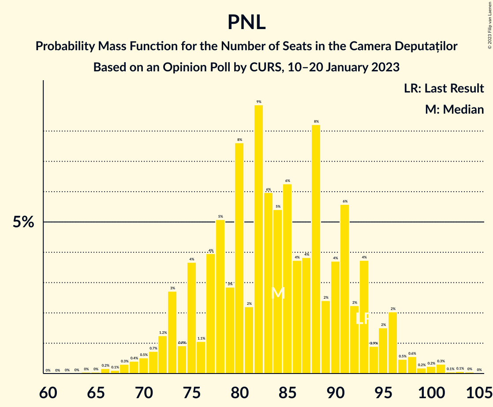

# Opinion Poll by CURS, 10–20 January 2023

<a href="#voting-intentions">Voting Intentions</a> | <a href="#seats">Seats</a> | <a href="#coalitions">Coalitions</a> | <a href="#technical-information">Technical Information</a>

## Voting Intentions

### Confidence Intervals

| Party | Last Result | Poll Result | 80% Confidence Interval | 90% Confidence Interval | 95% Confidence Interval | 99% Confidence Interval |
|:-----:|:-----------:|:-----------:|:-----------------------:|:-----------------------:|:-----------------------:|:-----------------------:|
| Partidul Social Democrat | 28.9% | 36.0% | 34.1–37.9% |33.6–38.5% |33.2–38.9% |32.3–39.8% |
| Partidul Național Liberal | 25.2% | 22.0% | 20.5–23.7% |20.0–24.2% |19.6–24.6% |18.9–25.4% |
| Alianța pentru Unirea Românilor | 9.1% | 14.0% | 12.7–15.4% |12.3–15.8% |12.0–16.2% |11.4–16.9% |
| Alianța 2020 USR-PLUS | 15.4% | 8.0% | 7.0–9.1% |6.7–9.5% |6.5–9.8% |6.1–10.3% |
| Uniunea Democrată Maghiară din România | 5.7% | 5.0% | 4.2–5.9% |4.0–6.2% |3.8–6.4% |3.5–6.9% |
| Partidul Mișcarea Populară | 4.8% | 4.0% | 3.4–4.9% |3.2–5.2% |3.0–5.4% |2.7–5.9% |
| PRO România | 4.1% | 4.0% | 3.4–4.9% |3.2–5.2% |3.0–5.4% |2.7–5.9% |
| Partidul Puterii Umaniste (social-liberal) | 0.0% | 4.0% | 3.4–4.9% |3.2–5.2% |3.0–5.4% |2.7–5.9% |

*Note:* The poll result column reflects the actual value used in the calculations. Published results may vary slightly, and in addition be rounded to fewer digits.

## Seats

### Confidence Intervals

| Party | Last Result | Median | 80% Confidence Interval | 90% Confidence Interval | 95% Confidence Interval | 99% Confidence Interval |
|:-----:|:-----------:|:------:|:-----------------------:|:-----------------------:|:-----------------------:|:-----------------------:|
| <a href="#partidul-social-democrat">Partidul Social Democrat</a> | 110 | 136 | 125–150 |122–152 |119–155 |115–158 |
| <a href="#partidul-național-liberal">Partidul Național Liberal</a> | 93 | 84 | 75–93 |73–95 |72–96 |68–101 |
| <a href="#alianța-pentru-unirea-românilor">Alianța pentru Unirea Românilor</a> | 33 | 53 | 47–60 |45–61 |44–63 |41–66 |
| <a href="#alianța-2020-usr-plus">Alianța 2020 USR-PLUS</a> | 55 | 0 | 0–33 |0–34 |0–35 |0–37 |
| <a href="#uniunea-democrată-maghiară-din-românia">Uniunea Democrată Maghiară din România</a> | 21 | 19 | 15–22 |14–24 |14–25 |12–27 |
| <a href="#partidul-mișcarea-populară">Partidul Mișcarea Populară</a> | 0 | 0 | 0–18 |0–19 |0–19 |0–20 |
| <a href="#pro-românia">PRO România</a> | 0 | 0 | 0 |0–19 |0–20 |0–22 |
| <a href="#partidul-puterii-umaniste-(social-liberal)">Partidul Puterii Umaniste (social-liberal)</a> | 0 | 0 | 0 |0 |0 |0–19 |

### Partidul Social Democrat

*For a full overview of the results for this party, see the [Partidul Social Democrat](party-partidulsocialdemocrat.html) page.*

| Number of Seats | Probability | Accumulated | Special Marks |
|:---------------:|:-----------:|:-----------:|:-------------:|
| 110 | 0% | 100% | Last Result |
| 111 | 0.1% | 99.9% |  |
| 112 | 0% | 99.9% |  |
| 113 | 0.1% | 99.8% |  |
| 114 | 0.2% | 99.7% |  |
| 115 | 0.1% | 99.5% |  |
| 116 | 0.3% | 99.4% |  |
| 117 | 0.4% | 99.1% |  |
| 118 | 0.3% | 98.7% |  |
| 119 | 0.9% | 98% |  |
| 120 | 1.2% | 97% |  |
| 121 | 0.9% | 96% |  |
| 122 | 1.4% | 95% |  |
| 123 | 0.9% | 94% |  |
| 124 | 2% | 93% |  |
| 125 | 2% | 91% |  |
| 126 | 2% | 89% |  |
| 127 | 2% | 86% |  |
| 128 | 2% | 84% |  |
| 129 | 5% | 82% |  |
| 130 | 3% | 76% |  |
| 131 | 7% | 73% |  |
| 132 | 3% | 66% |  |
| 133 | 3% | 63% |  |
| 134 | 4% | 61% |  |
| 135 | 3% | 57% |  |
| 136 | 4% | 54% | Median |
| 137 | 2% | 50% |  |
| 138 | 3% | 48% |  |
| 139 | 4% | 45% |  |
| 140 | 3% | 41% |  |
| 141 | 2% | 38% |  |
| 142 | 2% | 36% |  |
| 143 | 2% | 34% |  |
| 144 | 4% | 32% |  |
| 145 | 4% | 29% |  |
| 146 | 4% | 25% |  |
| 147 | 4% | 21% |  |
| 148 | 2% | 17% |  |
| 149 | 2% | 14% |  |
| 150 | 2% | 12% |  |
| 151 | 4% | 10% |  |
| 152 | 1.2% | 6% |  |
| 153 | 0.8% | 4% |  |
| 154 | 0.9% | 4% |  |
| 155 | 0.6% | 3% |  |
| 156 | 0.6% | 2% |  |
| 157 | 0.9% | 2% |  |
| 158 | 0.2% | 0.6% |  |
| 159 | 0.1% | 0.4% |  |
| 160 | 0.1% | 0.3% |  |
| 161 | 0.1% | 0.2% |  |
| 162 | 0.1% | 0.1% |  |
| 163 | 0% | 0% |  |

### Partidul Național Liberal

*For a full overview of the results for this party, see the [Partidul Național Liberal](party-partidulnaționalliberal.html) page.*

| Number of Seats | Probability | Accumulated | Special Marks |
|:---------------:|:-----------:|:-----------:|:-------------:|
| 64 | 0% | 100% |  |
| 65 | 0% | 99.9% |  |
| 66 | 0.2% | 99.9% |  |
| 67 | 0.1% | 99.7% |  |
| 68 | 0.3% | 99.6% |  |
| 69 | 0.4% | 99.3% |  |
| 70 | 0.5% | 98.9% |  |
| 71 | 0.7% | 98% |  |
| 72 | 1.2% | 98% |  |
| 73 | 3% | 96% |  |
| 74 | 0.9% | 94% |  |
| 75 | 4% | 93% |  |
| 76 | 1.1% | 89% |  |
| 77 | 4% | 88% |  |
| 78 | 5% | 84% |  |
| 79 | 3% | 79% |  |
| 80 | 8% | 76% |  |
| 81 | 2% | 69% |  |
| 82 | 9% | 66% |  |
| 83 | 6% | 57% |  |
| 84 | 5% | 52% | Median |
| 85 | 6% | 46% |  |
| 86 | 4% | 40% |  |
| 87 | 4% | 36% |  |
| 88 | 8% | 32% |  |
| 89 | 2% | 24% |  |
| 90 | 4% | 22% |  |
| 91 | 6% | 18% |  |
| 92 | 2% | 12% |  |
| 93 | 4% | 10% | Last Result |
| 94 | 0.9% | 6% |  |
| 95 | 2% | 6% |  |
| 96 | 2% | 4% |  |
| 97 | 0.5% | 2% |  |
| 98 | 0.6% | 1.5% |  |
| 99 | 0.2% | 0.9% |  |
| 100 | 0.2% | 0.8% |  |
| 101 | 0.3% | 0.5% |  |
| 102 | 0.1% | 0.2% |  |
| 103 | 0.1% | 0.2% |  |
| 104 | 0% | 0.1% |  |
| 105 | 0% | 0% |  |

### Alianța pentru Unirea Românilor

*For a full overview of the results for this party, see the [Alianța pentru Unirea Românilor](party-alianțapentruunirearomânilor.html) page.*

| Number of Seats | Probability | Accumulated | Special Marks |
|:---------------:|:-----------:|:-----------:|:-------------:|
| 33 | 0% | 100% | Last Result |
| 34 | 0% | 100% |  |
| 35 | 0% | 100% |  |
| 36 | 0% | 100% |  |
| 37 | 0% | 100% |  |
| 38 | 0% | 100% |  |
| 39 | 0.1% | 99.9% |  |
| 40 | 0.2% | 99.9% |  |
| 41 | 0.4% | 99.7% |  |
| 42 | 0.5% | 99.3% |  |
| 43 | 0.8% | 98.8% |  |
| 44 | 1.4% | 98% |  |
| 45 | 2% | 97% |  |
| 46 | 3% | 94% |  |
| 47 | 4% | 92% |  |
| 48 | 5% | 88% |  |
| 49 | 7% | 82% |  |
| 50 | 6% | 76% |  |
| 51 | 8% | 70% |  |
| 52 | 6% | 62% |  |
| 53 | 11% | 56% | Median |
| 54 | 7% | 45% |  |
| 55 | 7% | 39% |  |
| 56 | 6% | 32% |  |
| 57 | 6% | 26% |  |
| 58 | 6% | 20% |  |
| 59 | 3% | 14% |  |
| 60 | 3% | 11% |  |
| 61 | 3% | 7% |  |
| 62 | 1.2% | 5% |  |
| 63 | 1.3% | 4% |  |
| 64 | 0.9% | 2% |  |
| 65 | 0.6% | 1.4% |  |
| 66 | 0.2% | 0.7% |  |
| 67 | 0.3% | 0.5% |  |
| 68 | 0.1% | 0.2% |  |
| 69 | 0.1% | 0.1% |  |
| 70 | 0% | 0.1% |  |
| 71 | 0% | 0% |  |

### Alianța 2020 USR-PLUS

*For a full overview of the results for this party, see the [Alianța 2020 USR-PLUS](party-alianța2020usr-plus.html) page.*

| Number of Seats | Probability | Accumulated | Special Marks |
|:---------------:|:-----------:|:-----------:|:-------------:|
| 0 | 53% | 100% | Median |
| 1 | 0% | 47% |  |
| 2 | 0% | 47% |  |
| 3 | 0% | 47% |  |
| 4 | 0% | 47% |  |
| 5 | 0% | 47% |  |
| 6 | 0% | 47% |  |
| 7 | 0% | 47% |  |
| 8 | 0% | 47% |  |
| 9 | 0% | 47% |  |
| 10 | 0% | 47% |  |
| 11 | 0% | 47% |  |
| 12 | 0% | 47% |  |
| 13 | 0% | 47% |  |
| 14 | 0% | 47% |  |
| 15 | 0% | 47% |  |
| 16 | 0% | 47% |  |
| 17 | 0% | 47% |  |
| 18 | 0% | 47% |  |
| 19 | 0% | 47% |  |
| 20 | 0% | 47% |  |
| 21 | 0% | 47% |  |
| 22 | 0% | 47% |  |
| 23 | 0% | 47% |  |
| 24 | 0% | 47% |  |
| 25 | 0% | 47% |  |
| 26 | 0% | 47% |  |
| 27 | 0.1% | 47% |  |
| 28 | 1.4% | 47% |  |
| 29 | 8% | 45% |  |
| 30 | 10% | 37% |  |
| 31 | 10% | 27% |  |
| 32 | 6% | 18% |  |
| 33 | 6% | 12% |  |
| 34 | 3% | 7% |  |
| 35 | 2% | 4% |  |
| 36 | 1.1% | 2% |  |
| 37 | 0.5% | 0.9% |  |
| 38 | 0.2% | 0.4% |  |
| 39 | 0.1% | 0.2% |  |
| 40 | 0% | 0.1% |  |
| 41 | 0% | 0% |  |
| 42 | 0% | 0% |  |
| 43 | 0% | 0% |  |
| 44 | 0% | 0% |  |
| 45 | 0% | 0% |  |
| 46 | 0% | 0% |  |
| 47 | 0% | 0% |  |
| 48 | 0% | 0% |  |
| 49 | 0% | 0% |  |
| 50 | 0% | 0% |  |
| 51 | 0% | 0% |  |
| 52 | 0% | 0% |  |
| 53 | 0% | 0% |  |
| 54 | 0% | 0% |  |
| 55 | 0% | 0% | Last Result |

### Uniunea Democrată Maghiară din România

*For a full overview of the results for this party, see the [Uniunea Democrată Maghiară din România](party-uniuneademocratămaghiarădinromânia.html) page.*

| Number of Seats | Probability | Accumulated | Special Marks |
|:---------------:|:-----------:|:-----------:|:-------------:|
| 11 | 0.1% | 100% |  |
| 12 | 0.5% | 99.8% |  |
| 13 | 1.2% | 99.4% |  |
| 14 | 4% | 98% |  |
| 15 | 7% | 95% |  |
| 16 | 8% | 88% |  |
| 17 | 15% | 80% |  |
| 18 | 14% | 65% |  |
| 19 | 16% | 51% | Median |
| 20 | 10% | 35% |  |
| 21 | 9% | 25% | Last Result |
| 22 | 7% | 17% |  |
| 23 | 4% | 9% |  |
| 24 | 2% | 5% |  |
| 25 | 2% | 3% |  |
| 26 | 0.6% | 1.2% |  |
| 27 | 0.3% | 0.5% |  |
| 28 | 0.1% | 0.2% |  |
| 29 | 0% | 0.1% |  |
| 30 | 0% | 0% |  |

### Partidul Mișcarea Populară

*For a full overview of the results for this party, see the [Partidul Mișcarea Populară](party-partidulmișcareapopulară.html) page.*

| Number of Seats | Probability | Accumulated | Special Marks |
|:---------------:|:-----------:|:-----------:|:-------------:|
| 0 | 89% | 100% | Last Result, Median |
| 1 | 0% | 11% |  |
| 2 | 0% | 11% |  |
| 3 | 0% | 11% |  |
| 4 | 0% | 11% |  |
| 5 | 0% | 11% |  |
| 6 | 0% | 11% |  |
| 7 | 0% | 11% |  |
| 8 | 0% | 11% |  |
| 9 | 0% | 11% |  |
| 10 | 0% | 11% |  |
| 11 | 0% | 11% |  |
| 12 | 0% | 11% |  |
| 13 | 0% | 11% |  |
| 14 | 0% | 11% |  |
| 15 | 0% | 11% |  |
| 16 | 0% | 11% |  |
| 17 | 0.6% | 11% |  |
| 18 | 4% | 11% |  |
| 19 | 4% | 6% |  |
| 20 | 2% | 2% |  |
| 21 | 0.1% | 0.1% |  |
| 22 | 0% | 0% |  |

### PRO România

*For a full overview of the results for this party, see the [PRO România](party-proromânia.html) page.*

| Number of Seats | Probability | Accumulated | Special Marks |
|:---------------:|:-----------:|:-----------:|:-------------:|
| 0 | 92% | 100% | Last Result, Median |
| 1 | 0% | 8% |  |
| 2 | 0% | 8% |  |
| 3 | 0% | 8% |  |
| 4 | 0% | 8% |  |
| 5 | 0% | 8% |  |
| 6 | 0% | 8% |  |
| 7 | 0% | 8% |  |
| 8 | 0% | 8% |  |
| 9 | 0% | 8% |  |
| 10 | 0% | 8% |  |
| 11 | 0% | 8% |  |
| 12 | 0% | 8% |  |
| 13 | 0% | 8% |  |
| 14 | 0% | 8% |  |
| 15 | 0% | 8% |  |
| 16 | 0% | 8% |  |
| 17 | 0.5% | 8% |  |
| 18 | 1.3% | 8% |  |
| 19 | 4% | 7% |  |
| 20 | 2% | 3% |  |
| 21 | 0.2% | 1.2% |  |
| 22 | 0.8% | 1.1% |  |
| 23 | 0.2% | 0.3% |  |
| 24 | 0% | 0% |  |

### Partidul Puterii Umaniste (social-liberal)

*For a full overview of the results for this party, see the [Partidul Puterii Umaniste (social-liberal)](party-partidulputeriiumanistesocial-liberal.html) page.*

| Number of Seats | Probability | Accumulated | Special Marks |
|:---------------:|:-----------:|:-----------:|:-------------:|
| 0 | 98% | 100% | Last Result, Median |
| 1 | 0% | 2% |  |
| 2 | 0% | 2% |  |
| 3 | 0% | 2% |  |
| 4 | 0% | 2% |  |
| 5 | 0% | 2% |  |
| 6 | 0% | 2% |  |
| 7 | 0% | 2% |  |
| 8 | 0% | 2% |  |
| 9 | 0% | 2% |  |
| 10 | 0% | 2% |  |
| 11 | 0% | 2% |  |
| 12 | 0% | 2% |  |
| 13 | 0% | 2% |  |
| 14 | 0% | 2% |  |
| 15 | 0% | 2% |  |
| 16 | 0% | 2% |  |
| 17 | 0.5% | 2% |  |
| 18 | 1.2% | 2% |  |
| 19 | 0.2% | 0.7% |  |
| 20 | 0.3% | 0.5% |  |
| 21 | 0.1% | 0.2% |  |
| 22 | 0.1% | 0.1% |  |
| 23 | 0.1% | 0.1% |  |
| 24 | 0% | 0% |  |

## Coalitions

### Confidence Intervals

| Coalition | Last Result | Median | Majority? | 80% Confidence Interval | 90% Confidence Interval | 95% Confidence Interval | 99% Confidence Interval |
|:---------:|:-----------:|:------:|:---------:|:-----------------------:|:-----------------------:|:-----------------------:|:-----------------------:|
| Partidul Social Democrat – PRO România | 110 | 139 | 0.4% | 126–151 | 123–155 | 121–158 | 116–164 |
| Partidul Național Liberal – Alianța 2020 USR-PLUS – Uniunea Democrată Maghiară din România – Partidul Mișcarea Populară | 169 | 120 | 0% | 104–135 | 102–138 | 99–142 | 94–146 |
| Partidul Național Liberal – Alianța 2020 USR-PLUS – Uniunea Democrată Maghiară din România | 169 | 116 | 0% | 103–133 | 99–135 | 97–137 | 93–140 |
| Partidul Național Liberal – Uniunea Democrată Maghiară din România – Partidul Mișcarea Populară | 114 | 105 | 0% | 94–116 | 92–120 | 90–124 | 86–128 |
| Partidul Național Liberal – Alianța 2020 USR-PLUS – Partidul Mișcarea Populară | 148 | 101 | 0% | 85–117 | 83–120 | 80–124 | 76–129 |
| Partidul Național Liberal – Alianța 2020 USR-PLUS | 148 | 96 | 0% | 83–115 | 80–117 | 78–119 | 75–123 |
| Partidul Național Liberal – Uniunea Democrată Maghiară din România | 114 | 103 | 0% | 93–113 | 90–114 | 88–117 | 84–121 |
| Partidul Național Liberal – Partidul Mișcarea Populară | 93 | 85 | 0% | 77–96 | 75–101 | 73–104 | 69–109 |
| Partidul Național Liberal | 93 | 84 | 0% | 75–93 | 73–95 | 72–96 | 68–101 |
| Alianța 2020 USR-PLUS – Partidul Mișcarea Populară | 55 | 19 | 0% | 0–34 | 0–45 | 0–48 | 0–50 |

### Partidul Social Democrat – PRO România

| Number of Seats | Probability | Accumulated | Special Marks |
|:---------------:|:-----------:|:-----------:|:-------------:|
| 110 | 0% | 100% | Last Result |
| 111 | 0% | 100% |  |
| 112 | 0% | 99.9% |  |
| 113 | 0% | 99.9% |  |
| 114 | 0.1% | 99.9% |  |
| 115 | 0.1% | 99.7% |  |
| 116 | 0.2% | 99.7% |  |
| 117 | 0.3% | 99.5% |  |
| 118 | 0.2% | 99.1% |  |
| 119 | 0.7% | 98.9% |  |
| 120 | 0.6% | 98% |  |
| 121 | 0.8% | 98% |  |
| 122 | 1.2% | 97% |  |
| 123 | 0.8% | 96% |  |
| 124 | 2% | 95% |  |
| 125 | 2% | 93% |  |
| 126 | 2% | 91% |  |
| 127 | 2% | 89% |  |
| 128 | 2% | 87% |  |
| 129 | 5% | 85% |  |
| 130 | 3% | 80% |  |
| 131 | 7% | 77% |  |
| 132 | 2% | 70% |  |
| 133 | 2% | 68% |  |
| 134 | 3% | 65% |  |
| 135 | 3% | 62% |  |
| 136 | 4% | 59% | Median |
| 137 | 2% | 55% |  |
| 138 | 3% | 54% |  |
| 139 | 4% | 51% |  |
| 140 | 3% | 47% |  |
| 141 | 3% | 44% |  |
| 142 | 2% | 42% |  |
| 143 | 2% | 40% |  |
| 144 | 4% | 38% |  |
| 145 | 4% | 34% |  |
| 146 | 4% | 30% |  |
| 147 | 4% | 26% |  |
| 148 | 3% | 22% |  |
| 149 | 3% | 19% |  |
| 150 | 3% | 17% |  |
| 151 | 4% | 14% |  |
| 152 | 1.4% | 10% |  |
| 153 | 1.1% | 8% |  |
| 154 | 1.3% | 7% |  |
| 155 | 1.1% | 6% |  |
| 156 | 1.0% | 5% |  |
| 157 | 1.2% | 4% |  |
| 158 | 0.6% | 3% |  |
| 159 | 0.5% | 2% |  |
| 160 | 0.2% | 2% |  |
| 161 | 0.3% | 1.3% |  |
| 162 | 0.3% | 1.1% |  |
| 163 | 0.1% | 0.7% |  |
| 164 | 0.2% | 0.6% |  |
| 165 | 0.2% | 0.4% | Majority |
| 166 | 0.1% | 0.2% |  |
| 167 | 0.1% | 0.1% |  |
| 168 | 0% | 0.1% |  |
| 169 | 0% | 0% |  |

### Partidul Național Liberal – Alianța 2020 USR-PLUS – Uniunea Democrată Maghiară din România – Partidul Mișcarea Populară

| Number of Seats | Probability | Accumulated | Special Marks |
|:---------------:|:-----------:|:-----------:|:-------------:|
| 89 | 0% | 100% |  |
| 90 | 0% | 99.9% |  |
| 91 | 0% | 99.9% |  |
| 92 | 0% | 99.9% |  |
| 93 | 0.2% | 99.8% |  |
| 94 | 0.3% | 99.6% |  |
| 95 | 0.2% | 99.3% |  |
| 96 | 0.6% | 99.2% |  |
| 97 | 0.2% | 98.6% |  |
| 98 | 0.5% | 98% |  |
| 99 | 1.1% | 98% |  |
| 100 | 0.8% | 97% |  |
| 101 | 0.5% | 96% |  |
| 102 | 0.9% | 95% |  |
| 103 | 4% | 94% | Median |
| 104 | 0.8% | 91% |  |
| 105 | 1.3% | 90% |  |
| 106 | 8% | 89% |  |
| 107 | 3% | 80% |  |
| 108 | 0.7% | 78% |  |
| 109 | 2% | 77% |  |
| 110 | 10% | 75% |  |
| 111 | 0.6% | 65% |  |
| 112 | 2% | 65% |  |
| 113 | 3% | 63% |  |
| 114 | 3% | 60% |  |
| 115 | 0.3% | 57% |  |
| 116 | 1.1% | 56% |  |
| 117 | 3% | 55% |  |
| 118 | 1.0% | 52% |  |
| 119 | 0.9% | 51% |  |
| 120 | 0.8% | 50% |  |
| 121 | 2% | 49% |  |
| 122 | 1.4% | 47% |  |
| 123 | 1.4% | 46% |  |
| 124 | 2% | 44% |  |
| 125 | 2% | 42% |  |
| 126 | 3% | 40% |  |
| 127 | 2% | 37% |  |
| 128 | 5% | 35% |  |
| 129 | 4% | 30% |  |
| 130 | 3% | 26% |  |
| 131 | 4% | 23% |  |
| 132 | 2% | 19% |  |
| 133 | 4% | 17% |  |
| 134 | 2% | 13% |  |
| 135 | 2% | 11% |  |
| 136 | 2% | 9% |  |
| 137 | 0.7% | 7% |  |
| 138 | 1.0% | 6% |  |
| 139 | 1.2% | 5% |  |
| 140 | 0.7% | 4% |  |
| 141 | 0.4% | 3% |  |
| 142 | 0.9% | 3% |  |
| 143 | 0.5% | 2% |  |
| 144 | 0.4% | 1.3% |  |
| 145 | 0.3% | 1.0% |  |
| 146 | 0.1% | 0.6% |  |
| 147 | 0.1% | 0.5% |  |
| 148 | 0.2% | 0.4% |  |
| 149 | 0.1% | 0.2% |  |
| 150 | 0.1% | 0.1% |  |
| 151 | 0% | 0.1% |  |
| 152 | 0% | 0% |  |
| 153 | 0% | 0% |  |
| 154 | 0% | 0% |  |
| 155 | 0% | 0% |  |
| 156 | 0% | 0% |  |
| 157 | 0% | 0% |  |
| 158 | 0% | 0% |  |
| 159 | 0% | 0% |  |
| 160 | 0% | 0% |  |
| 161 | 0% | 0% |  |
| 162 | 0% | 0% |  |
| 163 | 0% | 0% |  |
| 164 | 0% | 0% |  |
| 165 | 0% | 0% | Majority |
| 166 | 0% | 0% |  |
| 167 | 0% | 0% |  |
| 168 | 0% | 0% |  |
| 169 | 0% | 0% | Last Result |

### Partidul Național Liberal – Alianța 2020 USR-PLUS – Uniunea Democrată Maghiară din România

| Number of Seats | Probability | Accumulated | Special Marks |
|:---------------:|:-----------:|:-----------:|:-------------:|
| 88 | 0% | 100% |  |
| 89 | 0.1% | 99.9% |  |
| 90 | 0.1% | 99.8% |  |
| 91 | 0.1% | 99.8% |  |
| 92 | 0.1% | 99.7% |  |
| 93 | 0.2% | 99.5% |  |
| 94 | 0.5% | 99.3% |  |
| 95 | 0.4% | 98.8% |  |
| 96 | 0.7% | 98% |  |
| 97 | 0.4% | 98% |  |
| 98 | 1.3% | 97% |  |
| 99 | 1.3% | 96% |  |
| 100 | 0.9% | 95% |  |
| 101 | 1.4% | 94% |  |
| 102 | 2% | 92% |  |
| 103 | 4% | 91% | Median |
| 104 | 1.2% | 87% |  |
| 105 | 2% | 86% |  |
| 106 | 8% | 84% |  |
| 107 | 3% | 75% |  |
| 108 | 1.2% | 73% |  |
| 109 | 3% | 71% |  |
| 110 | 10% | 69% |  |
| 111 | 0.6% | 59% |  |
| 112 | 2% | 59% |  |
| 113 | 3% | 57% |  |
| 114 | 3% | 54% |  |
| 115 | 0.5% | 51% |  |
| 116 | 1.1% | 51% |  |
| 117 | 3% | 49% |  |
| 118 | 1.1% | 47% |  |
| 119 | 1.0% | 46% |  |
| 120 | 1.0% | 45% |  |
| 121 | 2% | 44% |  |
| 122 | 1.4% | 42% |  |
| 123 | 2% | 41% |  |
| 124 | 2% | 39% |  |
| 125 | 2% | 37% |  |
| 126 | 3% | 34% |  |
| 127 | 2% | 31% |  |
| 128 | 4% | 29% |  |
| 129 | 4% | 25% |  |
| 130 | 3% | 21% |  |
| 131 | 4% | 18% |  |
| 132 | 2% | 14% |  |
| 133 | 4% | 12% |  |
| 134 | 2% | 8% |  |
| 135 | 2% | 6% |  |
| 136 | 2% | 4% |  |
| 137 | 0.6% | 3% |  |
| 138 | 0.6% | 2% |  |
| 139 | 0.4% | 1.4% |  |
| 140 | 0.6% | 1.1% |  |
| 141 | 0.1% | 0.5% |  |
| 142 | 0.1% | 0.3% |  |
| 143 | 0.1% | 0.2% |  |
| 144 | 0.1% | 0.1% |  |
| 145 | 0% | 0.1% |  |
| 146 | 0% | 0% |  |
| 147 | 0% | 0% |  |
| 148 | 0% | 0% |  |
| 149 | 0% | 0% |  |
| 150 | 0% | 0% |  |
| 151 | 0% | 0% |  |
| 152 | 0% | 0% |  |
| 153 | 0% | 0% |  |
| 154 | 0% | 0% |  |
| 155 | 0% | 0% |  |
| 156 | 0% | 0% |  |
| 157 | 0% | 0% |  |
| 158 | 0% | 0% |  |
| 159 | 0% | 0% |  |
| 160 | 0% | 0% |  |
| 161 | 0% | 0% |  |
| 162 | 0% | 0% |  |
| 163 | 0% | 0% |  |
| 164 | 0% | 0% |  |
| 165 | 0% | 0% | Majority |
| 166 | 0% | 0% |  |
| 167 | 0% | 0% |  |
| 168 | 0% | 0% |  |
| 169 | 0% | 0% | Last Result |

### Partidul Național Liberal – Uniunea Democrată Maghiară din România – Partidul Mișcarea Populară

| Number of Seats | Probability | Accumulated | Special Marks |
|:---------------:|:-----------:|:-----------:|:-------------:|
| 81 | 0% | 100% |  |
| 82 | 0.1% | 99.9% |  |
| 83 | 0.1% | 99.9% |  |
| 84 | 0.1% | 99.8% |  |
| 85 | 0.2% | 99.7% |  |
| 86 | 0.3% | 99.5% |  |
| 87 | 0.2% | 99.3% |  |
| 88 | 0.7% | 99.1% |  |
| 89 | 0.8% | 98% |  |
| 90 | 1.0% | 98% |  |
| 91 | 0.8% | 97% |  |
| 92 | 2% | 96% |  |
| 93 | 2% | 93% |  |
| 94 | 2% | 91% |  |
| 95 | 2% | 89% |  |
| 96 | 3% | 87% |  |
| 97 | 2% | 84% |  |
| 98 | 3% | 82% |  |
| 99 | 10% | 79% |  |
| 100 | 4% | 69% |  |
| 101 | 3% | 66% |  |
| 102 | 4% | 63% |  |
| 103 | 6% | 59% | Median |
| 104 | 2% | 53% |  |
| 105 | 2% | 51% |  |
| 106 | 10% | 48% |  |
| 107 | 3% | 39% |  |
| 108 | 1.3% | 36% |  |
| 109 | 3% | 34% |  |
| 110 | 10% | 32% |  |
| 111 | 0.9% | 21% |  |
| 112 | 2% | 20% |  |
| 113 | 3% | 18% |  |
| 114 | 3% | 15% | Last Result |
| 115 | 0.3% | 11% |  |
| 116 | 1.3% | 11% |  |
| 117 | 3% | 10% |  |
| 118 | 0.8% | 6% |  |
| 119 | 0.4% | 6% |  |
| 120 | 0.4% | 5% |  |
| 121 | 2% | 5% |  |
| 122 | 0.1% | 3% |  |
| 123 | 0.2% | 3% |  |
| 124 | 0.8% | 3% |  |
| 125 | 0.4% | 2% |  |
| 126 | 0% | 2% |  |
| 127 | 0.5% | 2% |  |
| 128 | 0.6% | 1.0% |  |
| 129 | 0% | 0.4% |  |
| 130 | 0% | 0.3% |  |
| 131 | 0.2% | 0.3% |  |
| 132 | 0.1% | 0.1% |  |
| 133 | 0% | 0.1% |  |
| 134 | 0% | 0.1% |  |
| 135 | 0% | 0% |  |

### Partidul Național Liberal – Alianța 2020 USR-PLUS – Partidul Mișcarea Populară

| Number of Seats | Probability | Accumulated | Special Marks |
|:---------------:|:-----------:|:-----------:|:-------------:|
| 72 | 0% | 100% |  |
| 73 | 0.1% | 99.9% |  |
| 74 | 0.1% | 99.9% |  |
| 75 | 0.2% | 99.8% |  |
| 76 | 0.2% | 99.6% |  |
| 77 | 0.3% | 99.4% |  |
| 78 | 0.8% | 99.1% |  |
| 79 | 0.2% | 98% |  |
| 80 | 1.4% | 98% |  |
| 81 | 0.5% | 97% |  |
| 82 | 0.8% | 96% |  |
| 83 | 4% | 95% |  |
| 84 | 1.4% | 92% | Median |
| 85 | 4% | 90% |  |
| 86 | 3% | 87% |  |
| 87 | 2% | 84% |  |
| 88 | 8% | 82% |  |
| 89 | 1.3% | 74% |  |
| 90 | 3% | 73% |  |
| 91 | 5% | 70% |  |
| 92 | 2% | 65% |  |
| 93 | 4% | 63% |  |
| 94 | 0.9% | 59% |  |
| 95 | 2% | 58% |  |
| 96 | 2% | 56% |  |
| 97 | 1.1% | 54% |  |
| 98 | 0.9% | 53% |  |
| 99 | 0.8% | 52% |  |
| 100 | 0.6% | 51% |  |
| 101 | 1.0% | 51% |  |
| 102 | 1.3% | 50% |  |
| 103 | 1.4% | 49% |  |
| 104 | 2% | 47% |  |
| 105 | 1.2% | 46% |  |
| 106 | 1.4% | 44% |  |
| 107 | 2% | 43% |  |
| 108 | 4% | 41% |  |
| 109 | 2% | 37% |  |
| 110 | 2% | 34% |  |
| 111 | 6% | 33% |  |
| 112 | 6% | 27% |  |
| 113 | 2% | 21% |  |
| 114 | 2% | 19% |  |
| 115 | 5% | 17% |  |
| 116 | 3% | 13% |  |
| 117 | 1.0% | 10% |  |
| 118 | 1.5% | 9% |  |
| 119 | 2% | 8% |  |
| 120 | 1.3% | 6% |  |
| 121 | 0.5% | 5% |  |
| 122 | 0.3% | 4% |  |
| 123 | 0.7% | 4% |  |
| 124 | 0.7% | 3% |  |
| 125 | 0.7% | 2% |  |
| 126 | 0.2% | 2% |  |
| 127 | 0.4% | 1.4% |  |
| 128 | 0.5% | 1.0% |  |
| 129 | 0% | 0.5% |  |
| 130 | 0.1% | 0.5% |  |
| 131 | 0.1% | 0.4% |  |
| 132 | 0.2% | 0.3% |  |
| 133 | 0% | 0.1% |  |
| 134 | 0% | 0.1% |  |
| 135 | 0% | 0% |  |
| 136 | 0% | 0% |  |
| 137 | 0% | 0% |  |
| 138 | 0% | 0% |  |
| 139 | 0% | 0% |  |
| 140 | 0% | 0% |  |
| 141 | 0% | 0% |  |
| 142 | 0% | 0% |  |
| 143 | 0% | 0% |  |
| 144 | 0% | 0% |  |
| 145 | 0% | 0% |  |
| 146 | 0% | 0% |  |
| 147 | 0% | 0% |  |
| 148 | 0% | 0% | Last Result |

### Partidul Național Liberal – Alianța 2020 USR-PLUS

| Number of Seats | Probability | Accumulated | Special Marks |
|:---------------:|:-----------:|:-----------:|:-------------:|
| 71 | 0.1% | 100% |  |
| 72 | 0% | 99.9% |  |
| 73 | 0.2% | 99.9% |  |
| 74 | 0.1% | 99.6% |  |
| 75 | 0.4% | 99.6% |  |
| 76 | 0.4% | 99.2% |  |
| 77 | 0.4% | 98.8% |  |
| 78 | 1.5% | 98% |  |
| 79 | 0.3% | 97% |  |
| 80 | 2% | 97% |  |
| 81 | 0.7% | 95% |  |
| 82 | 0.9% | 94% |  |
| 83 | 5% | 93% |  |
| 84 | 1.4% | 88% | Median |
| 85 | 4% | 87% |  |
| 86 | 3% | 82% |  |
| 87 | 2% | 79% |  |
| 88 | 8% | 77% |  |
| 89 | 1.3% | 69% |  |
| 90 | 3% | 68% |  |
| 91 | 5% | 64% |  |
| 92 | 2% | 59% |  |
| 93 | 4% | 57% |  |
| 94 | 0.9% | 53% |  |
| 95 | 2% | 52% |  |
| 96 | 2% | 51% |  |
| 97 | 0.6% | 48% |  |
| 98 | 0.8% | 48% |  |
| 99 | 0.5% | 47% |  |
| 100 | 0.5% | 47% |  |
| 101 | 1.1% | 46% |  |
| 102 | 1.1% | 45% |  |
| 103 | 1.0% | 44% |  |
| 104 | 1.3% | 43% |  |
| 105 | 1.1% | 42% |  |
| 106 | 2% | 40% |  |
| 107 | 2% | 39% |  |
| 108 | 4% | 36% |  |
| 109 | 2% | 32% |  |
| 110 | 2% | 30% |  |
| 111 | 6% | 28% |  |
| 112 | 6% | 22% |  |
| 113 | 2% | 16% |  |
| 114 | 2% | 14% |  |
| 115 | 5% | 13% |  |
| 116 | 3% | 8% |  |
| 117 | 0.8% | 5% |  |
| 118 | 1.3% | 4% |  |
| 119 | 1.3% | 3% |  |
| 120 | 0.9% | 2% |  |
| 121 | 0.2% | 1.0% |  |
| 122 | 0.2% | 0.8% |  |
| 123 | 0.3% | 0.6% |  |
| 124 | 0.1% | 0.3% |  |
| 125 | 0.1% | 0.1% |  |
| 126 | 0% | 0.1% |  |
| 127 | 0% | 0.1% |  |
| 128 | 0% | 0% |  |
| 129 | 0% | 0% |  |
| 130 | 0% | 0% |  |
| 131 | 0% | 0% |  |
| 132 | 0% | 0% |  |
| 133 | 0% | 0% |  |
| 134 | 0% | 0% |  |
| 135 | 0% | 0% |  |
| 136 | 0% | 0% |  |
| 137 | 0% | 0% |  |
| 138 | 0% | 0% |  |
| 139 | 0% | 0% |  |
| 140 | 0% | 0% |  |
| 141 | 0% | 0% |  |
| 142 | 0% | 0% |  |
| 143 | 0% | 0% |  |
| 144 | 0% | 0% |  |
| 145 | 0% | 0% |  |
| 146 | 0% | 0% |  |
| 147 | 0% | 0% |  |
| 148 | 0% | 0% | Last Result |

### Partidul Național Liberal – Uniunea Democrată Maghiară din România

| Number of Seats | Probability | Accumulated | Special Marks |
|:---------------:|:-----------:|:-----------:|:-------------:|
| 79 | 0% | 100% |  |
| 80 | 0% | 99.9% |  |
| 81 | 0% | 99.9% |  |
| 82 | 0.1% | 99.9% |  |
| 83 | 0.2% | 99.8% |  |
| 84 | 0.2% | 99.6% |  |
| 85 | 0.4% | 99.4% |  |
| 86 | 0.4% | 99.0% |  |
| 87 | 0.3% | 98.6% |  |
| 88 | 1.0% | 98% |  |
| 89 | 1.0% | 97% |  |
| 90 | 1.3% | 96% |  |
| 91 | 1.3% | 95% |  |
| 92 | 3% | 94% |  |
| 93 | 3% | 90% |  |
| 94 | 3% | 88% |  |
| 95 | 3% | 85% |  |
| 96 | 3% | 82% |  |
| 97 | 2% | 79% |  |
| 98 | 4% | 77% |  |
| 99 | 10% | 73% |  |
| 100 | 4% | 63% |  |
| 101 | 4% | 59% |  |
| 102 | 5% | 55% |  |
| 103 | 6% | 51% | Median |
| 104 | 2% | 45% |  |
| 105 | 3% | 42% |  |
| 106 | 9% | 39% |  |
| 107 | 3% | 30% |  |
| 108 | 2% | 27% |  |
| 109 | 3% | 26% |  |
| 110 | 10% | 23% |  |
| 111 | 0.7% | 13% |  |
| 112 | 2% | 12% |  |
| 113 | 3% | 10% |  |
| 114 | 3% | 8% | Last Result |
| 115 | 0.2% | 5% |  |
| 116 | 0.9% | 5% |  |
| 117 | 2% | 4% |  |
| 118 | 0.5% | 2% |  |
| 119 | 0.2% | 1.1% |  |
| 120 | 0.3% | 0.9% |  |
| 121 | 0.3% | 0.6% |  |
| 122 | 0.1% | 0.3% |  |
| 123 | 0% | 0.2% |  |
| 124 | 0.1% | 0.2% |  |
| 125 | 0% | 0.1% |  |
| 126 | 0% | 0% |  |

### Partidul Național Liberal – Partidul Mișcarea Populară

| Number of Seats | Probability | Accumulated | Special Marks |
|:---------------:|:-----------:|:-----------:|:-------------:|
| 65 | 0% | 100% |  |
| 66 | 0.1% | 99.9% |  |
| 67 | 0.1% | 99.9% |  |
| 68 | 0.2% | 99.8% |  |
| 69 | 0.2% | 99.6% |  |
| 70 | 0.4% | 99.4% |  |
| 71 | 0.4% | 99.1% |  |
| 72 | 1.2% | 98.7% |  |
| 73 | 2% | 98% |  |
| 74 | 0.9% | 96% |  |
| 75 | 3% | 95% |  |
| 76 | 0.8% | 92% |  |
| 77 | 4% | 91% |  |
| 78 | 4% | 88% |  |
| 79 | 3% | 84% |  |
| 80 | 6% | 82% |  |
| 81 | 2% | 75% |  |
| 82 | 9% | 73% |  |
| 83 | 5% | 65% |  |
| 84 | 5% | 60% | Median |
| 85 | 6% | 55% |  |
| 86 | 4% | 49% |  |
| 87 | 4% | 45% |  |
| 88 | 8% | 42% |  |
| 89 | 3% | 34% |  |
| 90 | 3% | 31% |  |
| 91 | 6% | 28% |  |
| 92 | 2% | 21% |  |
| 93 | 4% | 19% | Last Result |
| 94 | 1.1% | 15% |  |
| 95 | 2% | 14% |  |
| 96 | 3% | 12% |  |
| 97 | 1.1% | 9% |  |
| 98 | 1.4% | 8% |  |
| 99 | 0.8% | 6% |  |
| 100 | 0.5% | 6% |  |
| 101 | 0.6% | 5% |  |
| 102 | 0.9% | 4% |  |
| 103 | 0.9% | 4% |  |
| 104 | 0.4% | 3% |  |
| 105 | 0.4% | 2% |  |
| 106 | 0.3% | 2% |  |
| 107 | 0.5% | 2% |  |
| 108 | 0.1% | 1.0% |  |
| 109 | 0.5% | 0.9% |  |
| 110 | 0.2% | 0.4% |  |
| 111 | 0.1% | 0.2% |  |
| 112 | 0% | 0.1% |  |
| 113 | 0% | 0.1% |  |
| 114 | 0% | 0.1% |  |
| 115 | 0% | 0% |  |

### Partidul Național Liberal

| Number of Seats | Probability | Accumulated | Special Marks |
|:---------------:|:-----------:|:-----------:|:-------------:|
| 64 | 0% | 100% |  |
| 65 | 0% | 99.9% |  |
| 66 | 0.2% | 99.9% |  |
| 67 | 0.1% | 99.7% |  |
| 68 | 0.3% | 99.6% |  |
| 69 | 0.4% | 99.3% |  |
| 70 | 0.5% | 98.9% |  |
| 71 | 0.7% | 98% |  |
| 72 | 1.2% | 98% |  |
| 73 | 3% | 96% |  |
| 74 | 0.9% | 94% |  |
| 75 | 4% | 93% |  |
| 76 | 1.1% | 89% |  |
| 77 | 4% | 88% |  |
| 78 | 5% | 84% |  |
| 79 | 3% | 79% |  |
| 80 | 8% | 76% |  |
| 81 | 2% | 69% |  |
| 82 | 9% | 66% |  |
| 83 | 6% | 57% |  |
| 84 | 5% | 52% | Median |
| 85 | 6% | 46% |  |
| 86 | 4% | 40% |  |
| 87 | 4% | 36% |  |
| 88 | 8% | 32% |  |
| 89 | 2% | 24% |  |
| 90 | 4% | 22% |  |
| 91 | 6% | 18% |  |
| 92 | 2% | 12% |  |
| 93 | 4% | 10% | Last Result |
| 94 | 0.9% | 6% |  |
| 95 | 2% | 6% |  |
| 96 | 2% | 4% |  |
| 97 | 0.5% | 2% |  |
| 98 | 0.6% | 1.5% |  |
| 99 | 0.2% | 0.9% |  |
| 100 | 0.2% | 0.8% |  |
| 101 | 0.3% | 0.5% |  |
| 102 | 0.1% | 0.2% |  |
| 103 | 0.1% | 0.2% |  |
| 104 | 0% | 0.1% |  |
| 105 | 0% | 0% |  |

### Alianța 2020 USR-PLUS – Partidul Mișcarea Populară

| Number of Seats | Probability | Accumulated | Special Marks |
|:---------------:|:-----------:|:-----------:|:-------------:|
| 0 | 47% | 100% | Median |
| 1 | 0% | 53% |  |
| 2 | 0% | 53% |  |
| 3 | 0% | 53% |  |
| 4 | 0% | 53% |  |
| 5 | 0% | 53% |  |
| 6 | 0% | 53% |  |
| 7 | 0% | 53% |  |
| 8 | 0% | 53% |  |
| 9 | 0% | 53% |  |
| 10 | 0% | 53% |  |
| 11 | 0% | 53% |  |
| 12 | 0% | 53% |  |
| 13 | 0% | 53% |  |
| 14 | 0% | 53% |  |
| 15 | 0% | 53% |  |
| 16 | 0% | 53% |  |
| 17 | 0% | 53% |  |
| 18 | 0% | 53% |  |
| 19 | 4% | 53% |  |
| 20 | 2% | 49% |  |
| 21 | 0.1% | 47% |  |
| 22 | 0% | 47% |  |
| 23 | 0% | 47% |  |
| 24 | 0% | 47% |  |
| 25 | 0% | 47% |  |
| 26 | 0% | 47% |  |
| 27 | 0.1% | 47% |  |
| 28 | 0.7% | 47% |  |
| 29 | 6% | 46% |  |
| 30 | 9% | 40% |  |
| 31 | 9% | 31% |  |
| 32 | 5% | 22% |  |
| 33 | 5% | 17% |  |
| 34 | 3% | 11% |  |
| 35 | 2% | 8% |  |
| 36 | 1.1% | 7% |  |
| 37 | 0.5% | 6% |  |
| 38 | 0.2% | 5% |  |
| 39 | 0.1% | 5% |  |
| 40 | 0% | 5% |  |
| 41 | 0% | 5% |  |
| 42 | 0% | 5% |  |
| 43 | 0% | 5% |  |
| 44 | 0% | 5% |  |
| 45 | 0.1% | 5% |  |
| 46 | 0.8% | 5% |  |
| 47 | 1.3% | 4% |  |
| 48 | 1.2% | 3% |  |
| 49 | 0.7% | 2% |  |
| 50 | 0.4% | 0.8% |  |
| 51 | 0.2% | 0.4% |  |
| 52 | 0.1% | 0.2% |  |
| 53 | 0.1% | 0.1% |  |
| 54 | 0% | 0.1% |  |
| 55 | 0% | 0% | Last Result |

## Technical Information

### Opinion Poll

+ **Polling firm:** CURS
+ **Commissioner(s):** —
+ **Fieldwork period:** 10–20 January 2023

### Calculations

+ **Sample size:** 1067
+ **Simulations done:** 1,048,576
+ **Error estimate:** 1.04%

