# Opinion Poll by Atlas Intel, 27–30 January 2023

<a href="#voting-intentions">Voting Intentions</a> | <a href="#seats">Seats</a> | <a href="#coalitions">Coalitions</a> | <a href="#technical-information">Technical Information</a>

## Voting Intentions

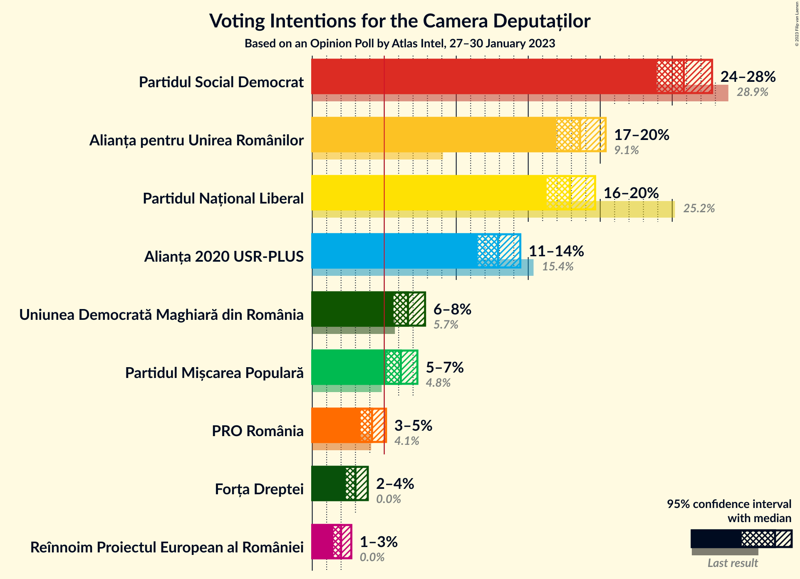

### Confidence Intervals

| Party | Last Result | Poll Result | 80% Confidence Interval | 90% Confidence Interval | 95% Confidence Interval | 99% Confidence Interval |
|:-----:|:-----------:|:-----------:|:-----------------------:|:-----------------------:|:-----------------------:|:-----------------------:|
| Partidul Social Democrat | 28.9% | 25.8% | 24.6–27.1% |24.2–27.5% |23.9–27.8% |23.4–28.4% |
| Alianța pentru Unirea Românilor | 9.1% | 18.6% | 17.5–19.8% |17.2–20.1% |16.9–20.4% |16.4–20.9% |
| Partidul Național Liberal | 25.2% | 17.9% | 16.8–19.1% |16.5–19.4% |16.3–19.6% |15.8–20.2% |
| Alianța 2020 USR-PLUS | 15.4% | 12.9% | 12.0–13.9% |11.7–14.2% |11.5–14.4% |11.1–15.0% |
| Uniunea Democrată Maghiară din România | 5.7% | 6.6% | 6.0–7.4% |5.8–7.6% |5.6–7.8% |5.3–8.2% |
| Partidul Mișcarea Populară | 4.8% | 6.2% | 5.5–6.9% |5.3–7.1% |5.2–7.3% |4.9–7.7% |
| PRO România | 4.1% | 4.2% | 3.6–4.8% |3.5–5.0% |3.4–5.1% |3.1–5.4% |
| Forța Dreptei | 0.0% | 3.0% | 2.6–3.6% |2.4–3.7% |2.3–3.9% |2.1–4.1% |
| Reînnoim Proiectul European al României | 0.0% | 2.0% | 1.6–2.5% |1.6–2.6% |1.5–2.7% |1.3–3.0% |

*Note:* The poll result column reflects the actual value used in the calculations. Published results may vary slightly, and in addition be rounded to fewer digits.

## Seats

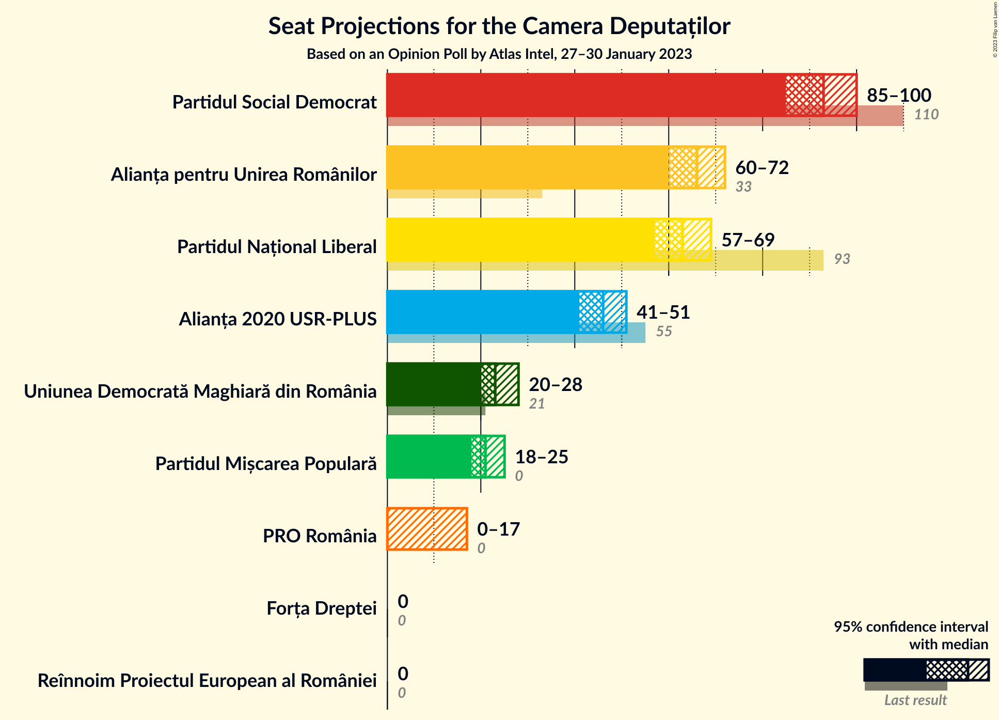

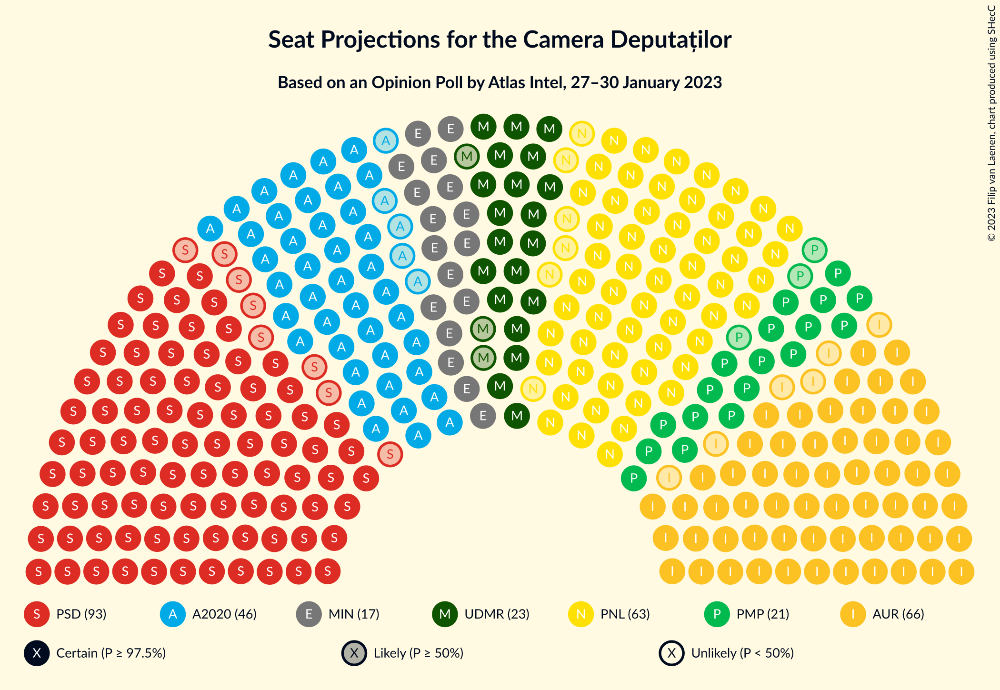

### Confidence Intervals

| Party | Last Result | Median | 80% Confidence Interval | 90% Confidence Interval | 95% Confidence Interval | 99% Confidence Interval |
|:-----:|:-----------:|:------:|:-----------------------:|:-----------------------:|:-----------------------:|:-----------------------:|
| <a href="#partidul-social-democrat">Partidul Social Democrat</a> | 110 | 93 | 88–97 |86–98 |85–100 |82–101 |
| <a href="#alianța-pentru-unirea-românilor">Alianța pentru Unirea Românilor</a> | 33 | 66 | 62–70 |60–71 |60–72 |58–75 |
| <a href="#partidul-național-liberal">Partidul Național Liberal</a> | 93 | 63 | 59–67 |58–69 |57–69 |55–71 |
| <a href="#alianța-2020-usr-plus">Alianța 2020 USR-PLUS</a> | 55 | 46 | 42–49 |42–50 |41–51 |39–53 |
| <a href="#uniunea-democrată-maghiară-din-românia">Uniunea Democrată Maghiară din România</a> | 21 | 23 | 21–26 |20–27 |20–28 |19–29 |
| <a href="#partidul-mișcarea-populară">Partidul Mișcarea Populară</a> | 0 | 21 | 19–24 |18–25 |18–25 |0–27 |
| <a href="#pro-românia">PRO România</a> | 0 | 0 | 0 |0 |0–17 |0–18 |
| <a href="#forța-dreptei">Forța Dreptei</a> | 0 | 0 | 0 |0 |0 |0 |
| <a href="#reînnoim-proiectul-european-al-româniei">Reînnoim Proiectul European al României</a> | 0 | 0 | 0 |0 |0 |0 |

### Partidul Social Democrat

*For a full overview of the results for this party, see the [Partidul Social Democrat](party-partidulsocialdemocrat.html) page.*

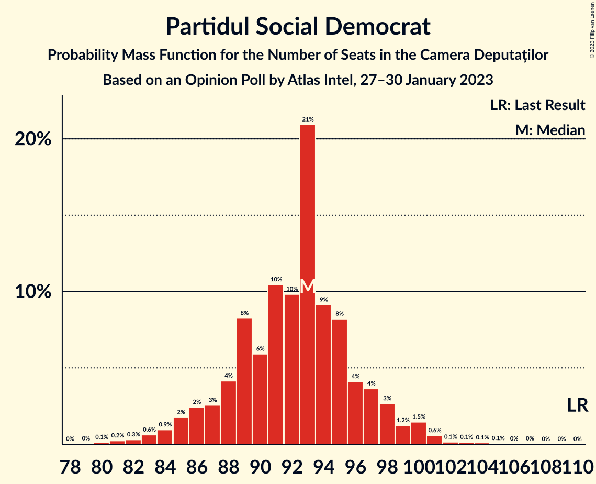

| Number of Seats | Probability | Accumulated | Special Marks |
|:---------------:|:-----------:|:-----------:|:-------------:|
| 79 | 0% | 100% |  |
| 80 | 0.1% | 99.9% |  |
| 81 | 0.2% | 99.8% |  |
| 82 | 0.3% | 99.6% |  |
| 83 | 0.6% | 99.3% |  |
| 84 | 0.9% | 98.7% |  |
| 85 | 2% | 98% |  |
| 86 | 2% | 96% |  |
| 87 | 3% | 94% |  |
| 88 | 4% | 91% |  |
| 89 | 8% | 87% |  |
| 90 | 6% | 79% |  |
| 91 | 10% | 73% |  |
| 92 | 10% | 62% |  |
| 93 | 21% | 52% | Median |
| 94 | 9% | 31% |  |
| 95 | 8% | 22% |  |
| 96 | 4% | 14% |  |
| 97 | 4% | 10% |  |
| 98 | 3% | 6% |  |
| 99 | 1.2% | 4% |  |
| 100 | 1.5% | 3% |  |
| 101 | 0.6% | 1.1% |  |
| 102 | 0.1% | 0.5% |  |
| 103 | 0.1% | 0.3% |  |
| 104 | 0.1% | 0.2% |  |
| 105 | 0.1% | 0.1% |  |
| 106 | 0% | 0.1% |  |
| 107 | 0% | 0% |  |
| 108 | 0% | 0% |  |
| 109 | 0% | 0% |  |
| 110 | 0% | 0% | Last Result |

### Alianța pentru Unirea Românilor

*For a full overview of the results for this party, see the [Alianța pentru Unirea Românilor](party-alianțapentruunirearomânilor.html) page.*

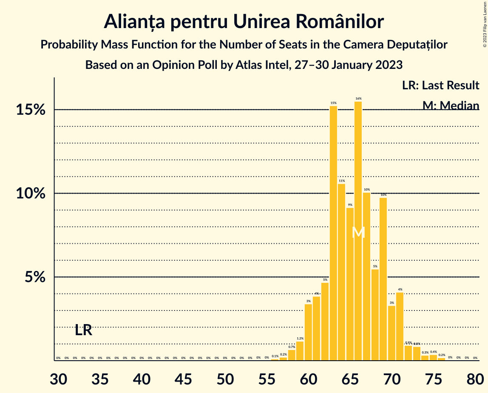

| Number of Seats | Probability | Accumulated | Special Marks |
|:---------------:|:-----------:|:-----------:|:-------------:|
| 33 | 0% | 100% | Last Result |
| 34 | 0% | 100% |  |
| 35 | 0% | 100% |  |
| 36 | 0% | 100% |  |
| 37 | 0% | 100% |  |
| 38 | 0% | 100% |  |
| 39 | 0% | 100% |  |
| 40 | 0% | 100% |  |
| 41 | 0% | 100% |  |
| 42 | 0% | 100% |  |
| 43 | 0% | 100% |  |
| 44 | 0% | 100% |  |
| 45 | 0% | 100% |  |
| 46 | 0% | 100% |  |
| 47 | 0% | 100% |  |
| 48 | 0% | 100% |  |
| 49 | 0% | 100% |  |
| 50 | 0% | 100% |  |
| 51 | 0% | 100% |  |
| 52 | 0% | 100% |  |
| 53 | 0% | 100% |  |
| 54 | 0% | 100% |  |
| 55 | 0% | 100% |  |
| 56 | 0.1% | 99.9% |  |
| 57 | 0.2% | 99.8% |  |
| 58 | 0.7% | 99.6% |  |
| 59 | 1.2% | 99.0% |  |
| 60 | 3% | 98% |  |
| 61 | 4% | 94% |  |
| 62 | 5% | 91% |  |
| 63 | 15% | 86% |  |
| 64 | 11% | 71% |  |
| 65 | 9% | 60% |  |
| 66 | 16% | 51% | Median |
| 67 | 10% | 35% |  |
| 68 | 5% | 25% |  |
| 69 | 10% | 20% |  |
| 70 | 3% | 10% |  |
| 71 | 4% | 7% |  |
| 72 | 0.9% | 3% |  |
| 73 | 0.8% | 2% |  |
| 74 | 0.3% | 0.9% |  |
| 75 | 0.4% | 0.6% |  |
| 76 | 0.2% | 0.3% |  |
| 77 | 0% | 0.1% |  |
| 78 | 0% | 0% |  |

### Partidul Național Liberal

*For a full overview of the results for this party, see the [Partidul Național Liberal](party-partidulnaționalliberal.html) page.*

| Number of Seats | Probability | Accumulated | Special Marks |
|:---------------:|:-----------:|:-----------:|:-------------:|
| 54 | 0.2% | 100% |  |
| 55 | 0.5% | 99.8% |  |
| 56 | 0.6% | 99.3% |  |
| 57 | 2% | 98.7% |  |
| 58 | 3% | 96% |  |
| 59 | 6% | 93% |  |
| 60 | 9% | 87% |  |
| 61 | 9% | 78% |  |
| 62 | 12% | 69% |  |
| 63 | 9% | 57% | Median |
| 64 | 16% | 48% |  |
| 65 | 7% | 31% |  |
| 66 | 11% | 24% |  |
| 67 | 4% | 13% |  |
| 68 | 4% | 9% |  |
| 69 | 3% | 5% |  |
| 70 | 1.3% | 2% |  |
| 71 | 0.7% | 1.1% |  |
| 72 | 0.2% | 0.4% |  |
| 73 | 0.1% | 0.2% |  |
| 74 | 0% | 0.1% |  |
| 75 | 0% | 0.1% |  |
| 76 | 0% | 0% |  |
| 77 | 0% | 0% |  |
| 78 | 0% | 0% |  |
| 79 | 0% | 0% |  |
| 80 | 0% | 0% |  |
| 81 | 0% | 0% |  |
| 82 | 0% | 0% |  |
| 83 | 0% | 0% |  |
| 84 | 0% | 0% |  |
| 85 | 0% | 0% |  |
| 86 | 0% | 0% |  |
| 87 | 0% | 0% |  |
| 88 | 0% | 0% |  |
| 89 | 0% | 0% |  |
| 90 | 0% | 0% |  |
| 91 | 0% | 0% |  |
| 92 | 0% | 0% |  |
| 93 | 0% | 0% | Last Result |

### Alianța 2020 USR-PLUS

*For a full overview of the results for this party, see the [Alianța 2020 USR-PLUS](party-alianța2020usr-plus.html) page.*

| Number of Seats | Probability | Accumulated | Special Marks |
|:---------------:|:-----------:|:-----------:|:-------------:|
| 37 | 0.1% | 100% |  |
| 38 | 0.2% | 99.9% |  |
| 39 | 0.5% | 99.7% |  |
| 40 | 1.1% | 99.2% |  |
| 41 | 3% | 98% |  |
| 42 | 7% | 95% |  |
| 43 | 10% | 89% |  |
| 44 | 13% | 78% |  |
| 45 | 10% | 65% |  |
| 46 | 15% | 55% | Median |
| 47 | 9% | 40% |  |
| 48 | 15% | 32% |  |
| 49 | 7% | 17% |  |
| 50 | 6% | 10% |  |
| 51 | 2% | 4% |  |
| 52 | 1.0% | 2% |  |
| 53 | 0.8% | 1.1% |  |
| 54 | 0.2% | 0.3% |  |
| 55 | 0.1% | 0.1% | Last Result |
| 56 | 0% | 0% |  |

### Uniunea Democrată Maghiară din România

*For a full overview of the results for this party, see the [Uniunea Democrată Maghiară din România](party-uniuneademocratămaghiarădinromânia.html) page.*

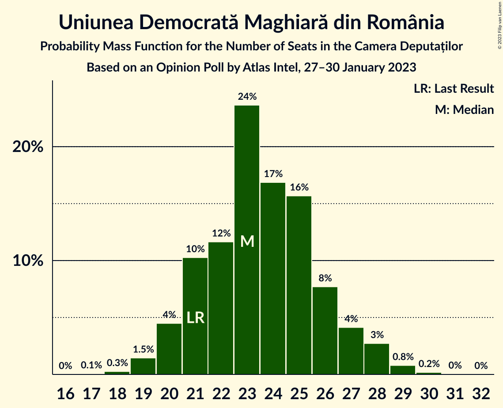

| Number of Seats | Probability | Accumulated | Special Marks |
|:---------------:|:-----------:|:-----------:|:-------------:|
| 17 | 0.1% | 100% |  |
| 18 | 0.3% | 99.9% |  |
| 19 | 1.5% | 99.7% |  |
| 20 | 4% | 98% |  |
| 21 | 10% | 94% | Last Result |
| 22 | 12% | 83% |  |
| 23 | 24% | 72% | Median |
| 24 | 17% | 48% |  |
| 25 | 16% | 31% |  |
| 26 | 8% | 16% |  |
| 27 | 4% | 8% |  |
| 28 | 3% | 4% |  |
| 29 | 0.8% | 1.0% |  |
| 30 | 0.2% | 0.2% |  |
| 31 | 0% | 0.1% |  |
| 32 | 0% | 0% |  |

### Partidul Mișcarea Populară

*For a full overview of the results for this party, see the [Partidul Mișcarea Populară](party-partidulmișcareapopulară.html) page.*

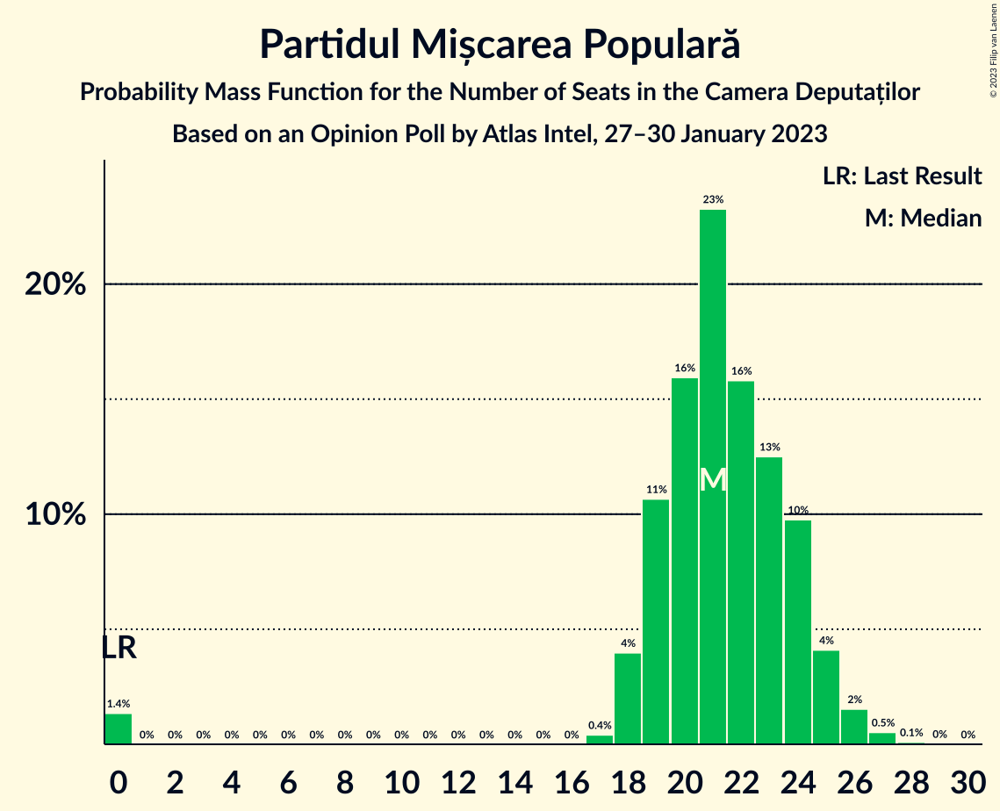

| Number of Seats | Probability | Accumulated | Special Marks |
|:---------------:|:-----------:|:-----------:|:-------------:|
| 0 | 1.4% | 100% | Last Result |
| 1 | 0% | 98.6% |  |
| 2 | 0% | 98.6% |  |
| 3 | 0% | 98.6% |  |
| 4 | 0% | 98.6% |  |
| 5 | 0% | 98.6% |  |
| 6 | 0% | 98.6% |  |
| 7 | 0% | 98.6% |  |
| 8 | 0% | 98.6% |  |
| 9 | 0% | 98.6% |  |
| 10 | 0% | 98.6% |  |
| 11 | 0% | 98.6% |  |
| 12 | 0% | 98.6% |  |
| 13 | 0% | 98.6% |  |
| 14 | 0% | 98.6% |  |
| 15 | 0% | 98.6% |  |
| 16 | 0% | 98.6% |  |
| 17 | 0.4% | 98.6% |  |
| 18 | 4% | 98% |  |
| 19 | 11% | 94% |  |
| 20 | 16% | 84% |  |
| 21 | 23% | 68% | Median |
| 22 | 16% | 44% |  |
| 23 | 13% | 29% |  |
| 24 | 10% | 16% |  |
| 25 | 4% | 6% |  |
| 26 | 2% | 2% |  |
| 27 | 0.5% | 0.7% |  |
| 28 | 0.1% | 0.1% |  |
| 29 | 0% | 0% |  |

### PRO România

*For a full overview of the results for this party, see the [PRO România](party-proromânia.html) page.*

| Number of Seats | Probability | Accumulated | Special Marks |
|:---------------:|:-----------:|:-----------:|:-------------:|
| 0 | 97% | 100% | Last Result, Median |
| 1 | 0% | 3% |  |
| 2 | 0% | 3% |  |
| 3 | 0% | 3% |  |
| 4 | 0% | 3% |  |
| 5 | 0% | 3% |  |
| 6 | 0% | 3% |  |
| 7 | 0% | 3% |  |
| 8 | 0% | 3% |  |
| 9 | 0% | 3% |  |
| 10 | 0% | 3% |  |
| 11 | 0% | 3% |  |
| 12 | 0% | 3% |  |
| 13 | 0% | 3% |  |
| 14 | 0% | 3% |  |
| 15 | 0% | 3% |  |
| 16 | 0% | 3% |  |
| 17 | 2% | 3% |  |
| 18 | 1.0% | 1.3% |  |
| 19 | 0.2% | 0.3% |  |
| 20 | 0% | 0% |  |

### Forța Dreptei

*For a full overview of the results for this party, see the [Forța Dreptei](party-forțadreptei.html) page.*

| Number of Seats | Probability | Accumulated | Special Marks |
|:---------------:|:-----------:|:-----------:|:-------------:|
| 0 | 100% | 100% | Last Result, Median |

### Reînnoim Proiectul European al României

*For a full overview of the results for this party, see the [Reînnoim Proiectul European al României](party-reînnoimproiectuleuropeanalromâniei.html) page.*

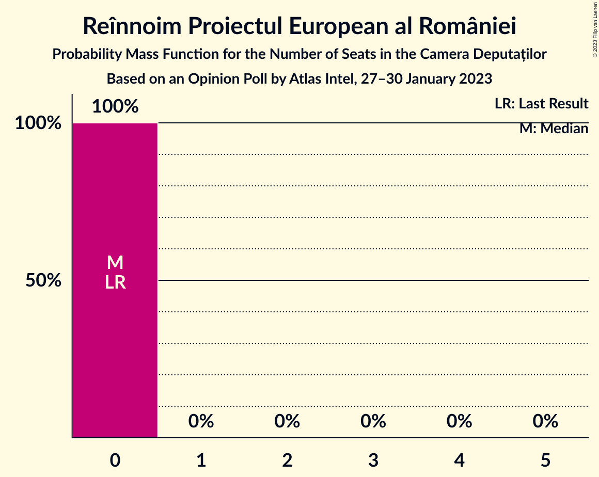

| Number of Seats | Probability | Accumulated | Special Marks |
|:---------------:|:-----------:|:-----------:|:-------------:|
| 0 | 100% | 100% | Last Result, Median |

## Coalitions

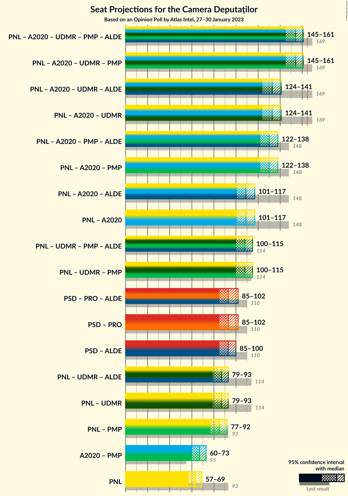

### Confidence Intervals

| Coalition | Last Result | Median | Majority? | 80% Confidence Interval | 90% Confidence Interval | 95% Confidence Interval | 99% Confidence Interval |
|:---------:|:-----------:|:------:|:---------:|:-----------------------:|:-----------------------:|:-----------------------:|:-----------------------:|
| Partidul Național Liberal – Alianța 2020 USR-PLUS – Uniunea Democrată Maghiară din România – Partidul Mișcarea Populară | 169 | 154 | 0.2% | 148–158 | 147–160 | 145–161 | 140–163 |
| Partidul Național Liberal – Alianța 2020 USR-PLUS – Uniunea Democrată Maghiară din România | 169 | 133 | 0% | 127–137 | 125–139 | 124–141 | 122–145 |
| Partidul Național Liberal – Alianța 2020 USR-PLUS – Partidul Mișcarea Populară | 148 | 130 | 0% | 126–135 | 123–136 | 122–138 | 117–140 |
| Partidul Național Liberal – Alianța 2020 USR-PLUS | 148 | 109 | 0% | 104–113 | 102–115 | 101–117 | 99–121 |
| Partidul Național Liberal – Uniunea Democrată Maghiară din România – Partidul Mișcarea Populară | 114 | 108 | 0% | 103–113 | 101–114 | 100–115 | 91–118 |
| Partidul Social Democrat – PRO România | 110 | 93 | 0% | 88–97 | 87–100 | 85–102 | 83–106 |
| Partidul Național Liberal – Uniunea Democrată Maghiară din România | 114 | 87 | 0% | 82–91 | 81–92 | 79–93 | 78–96 |
| Partidul Național Liberal – Partidul Mișcarea Populară | 93 | 85 | 0% | 80–89 | 79–91 | 77–92 | 67–94 |
| Alianța 2020 USR-PLUS – Partidul Mișcarea Populară | 55 | 67 | 0% | 63–71 | 62–73 | 60–73 | 50–76 |
| Partidul Național Liberal | 93 | 63 | 0% | 59–67 | 58–69 | 57–69 | 55–71 |

### Partidul Național Liberal – Alianța 2020 USR-PLUS – Uniunea Democrată Maghiară din România – Partidul Mișcarea Populară

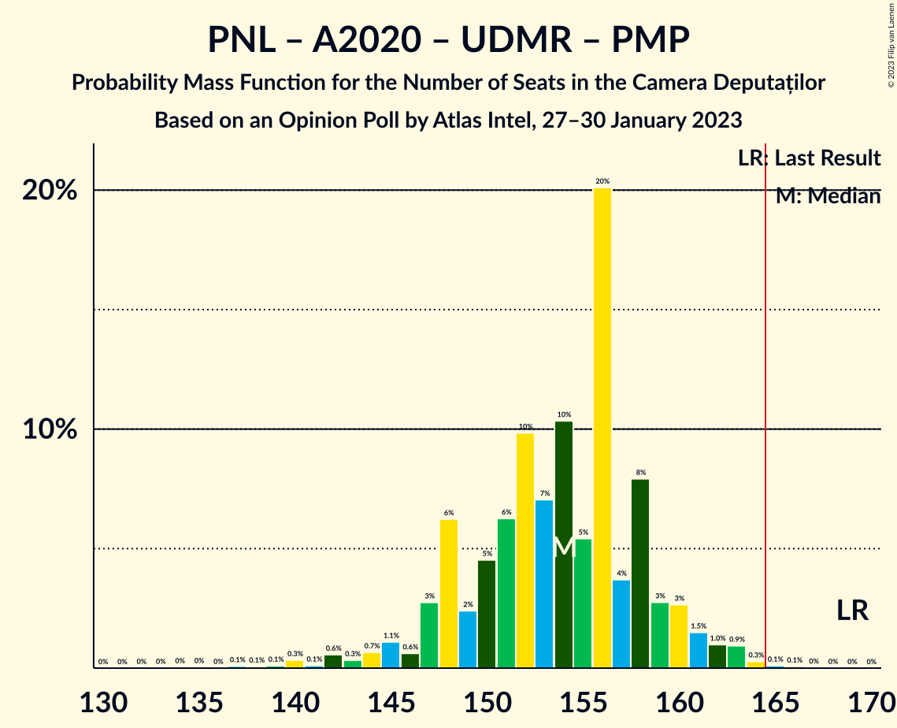

| Number of Seats | Probability | Accumulated | Special Marks |
|:---------------:|:-----------:|:-----------:|:-------------:|
| 134 | 0% | 100% |  |
| 135 | 0% | 99.9% |  |
| 136 | 0% | 99.9% |  |
| 137 | 0.1% | 99.9% |  |
| 138 | 0.1% | 99.8% |  |
| 139 | 0.1% | 99.7% |  |
| 140 | 0.3% | 99.6% |  |
| 141 | 0.1% | 99.3% |  |
| 142 | 0.6% | 99.2% |  |
| 143 | 0.3% | 98.6% |  |
| 144 | 0.7% | 98% |  |
| 145 | 1.1% | 98% |  |
| 146 | 0.6% | 97% |  |
| 147 | 3% | 96% |  |
| 148 | 6% | 93% |  |
| 149 | 2% | 87% |  |
| 150 | 5% | 85% |  |
| 151 | 6% | 80% |  |
| 152 | 10% | 74% |  |
| 153 | 7% | 64% | Median |
| 154 | 10% | 57% |  |
| 155 | 5% | 46% |  |
| 156 | 20% | 41% |  |
| 157 | 4% | 21% |  |
| 158 | 8% | 17% |  |
| 159 | 3% | 9% |  |
| 160 | 3% | 7% |  |
| 161 | 1.5% | 4% |  |
| 162 | 1.0% | 2% |  |
| 163 | 0.9% | 1.4% |  |
| 164 | 0.3% | 0.5% |  |
| 165 | 0.1% | 0.2% | Majority |
| 166 | 0.1% | 0.1% |  |
| 167 | 0% | 0% |  |
| 168 | 0% | 0% |  |
| 169 | 0% | 0% | Last Result |

### Partidul Național Liberal – Alianța 2020 USR-PLUS – Uniunea Democrată Maghiară din România

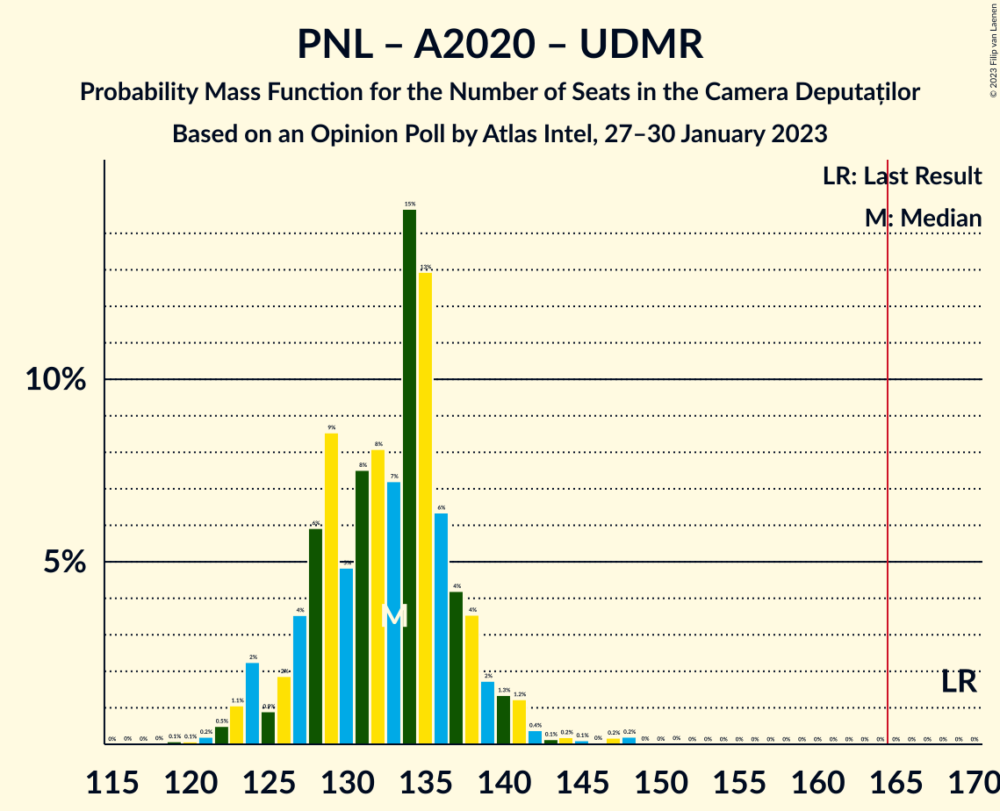

| Number of Seats | Probability | Accumulated | Special Marks |
|:---------------:|:-----------:|:-----------:|:-------------:|
| 118 | 0% | 100% |  |
| 119 | 0.1% | 99.9% |  |
| 120 | 0.1% | 99.8% |  |
| 121 | 0.2% | 99.8% |  |
| 122 | 0.5% | 99.6% |  |
| 123 | 1.1% | 99.1% |  |
| 124 | 2% | 98% |  |
| 125 | 0.9% | 96% |  |
| 126 | 2% | 95% |  |
| 127 | 4% | 93% |  |
| 128 | 6% | 89% |  |
| 129 | 9% | 84% |  |
| 130 | 5% | 75% |  |
| 131 | 8% | 70% |  |
| 132 | 8% | 63% | Median |
| 133 | 7% | 55% |  |
| 134 | 15% | 47% |  |
| 135 | 13% | 33% |  |
| 136 | 6% | 20% |  |
| 137 | 4% | 13% |  |
| 138 | 4% | 9% |  |
| 139 | 2% | 6% |  |
| 140 | 1.3% | 4% |  |
| 141 | 1.2% | 3% |  |
| 142 | 0.4% | 1.3% |  |
| 143 | 0.1% | 0.9% |  |
| 144 | 0.2% | 0.8% |  |
| 145 | 0.1% | 0.6% |  |
| 146 | 0% | 0.5% |  |
| 147 | 0.2% | 0.5% |  |
| 148 | 0.2% | 0.3% |  |
| 149 | 0% | 0.1% |  |
| 150 | 0% | 0.1% |  |
| 151 | 0% | 0% |  |
| 152 | 0% | 0% |  |
| 153 | 0% | 0% |  |
| 154 | 0% | 0% |  |
| 155 | 0% | 0% |  |
| 156 | 0% | 0% |  |
| 157 | 0% | 0% |  |
| 158 | 0% | 0% |  |
| 159 | 0% | 0% |  |
| 160 | 0% | 0% |  |
| 161 | 0% | 0% |  |
| 162 | 0% | 0% |  |
| 163 | 0% | 0% |  |
| 164 | 0% | 0% |  |
| 165 | 0% | 0% | Majority |
| 166 | 0% | 0% |  |
| 167 | 0% | 0% |  |
| 168 | 0% | 0% |  |
| 169 | 0% | 0% | Last Result |

### Partidul Național Liberal – Alianța 2020 USR-PLUS – Partidul Mișcarea Populară

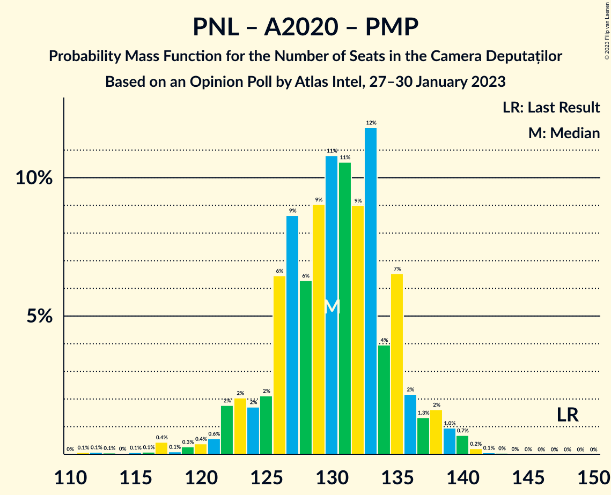

| Number of Seats | Probability | Accumulated | Special Marks |
|:---------------:|:-----------:|:-----------:|:-------------:|
| 110 | 0% | 100% |  |
| 111 | 0.1% | 99.9% |  |
| 112 | 0.1% | 99.9% |  |
| 113 | 0.1% | 99.8% |  |
| 114 | 0% | 99.8% |  |
| 115 | 0.1% | 99.7% |  |
| 116 | 0.1% | 99.7% |  |
| 117 | 0.4% | 99.6% |  |
| 118 | 0.1% | 99.1% |  |
| 119 | 0.3% | 99.0% |  |
| 120 | 0.4% | 98.8% |  |
| 121 | 0.6% | 98% |  |
| 122 | 2% | 98% |  |
| 123 | 2% | 96% |  |
| 124 | 2% | 94% |  |
| 125 | 2% | 92% |  |
| 126 | 6% | 90% |  |
| 127 | 9% | 84% |  |
| 128 | 6% | 75% |  |
| 129 | 9% | 69% |  |
| 130 | 11% | 60% | Median |
| 131 | 11% | 49% |  |
| 132 | 9% | 38% |  |
| 133 | 12% | 29% |  |
| 134 | 4% | 18% |  |
| 135 | 7% | 14% |  |
| 136 | 2% | 7% |  |
| 137 | 1.3% | 5% |  |
| 138 | 2% | 4% |  |
| 139 | 1.0% | 2% |  |
| 140 | 0.7% | 1.0% |  |
| 141 | 0.2% | 0.3% |  |
| 142 | 0.1% | 0.1% |  |
| 143 | 0% | 0.1% |  |
| 144 | 0% | 0% |  |
| 145 | 0% | 0% |  |
| 146 | 0% | 0% |  |
| 147 | 0% | 0% |  |
| 148 | 0% | 0% | Last Result |

### Partidul Național Liberal – Alianța 2020 USR-PLUS

| Number of Seats | Probability | Accumulated | Special Marks |
|:---------------:|:-----------:|:-----------:|:-------------:|
| 95 | 0% | 100% |  |
| 96 | 0.1% | 99.9% |  |
| 97 | 0.1% | 99.9% |  |
| 98 | 0.2% | 99.8% |  |
| 99 | 0.3% | 99.6% |  |
| 100 | 1.1% | 99.3% |  |
| 101 | 0.8% | 98% |  |
| 102 | 3% | 97% |  |
| 103 | 2% | 95% |  |
| 104 | 5% | 93% |  |
| 105 | 5% | 88% |  |
| 106 | 8% | 83% |  |
| 107 | 10% | 75% |  |
| 108 | 10% | 65% |  |
| 109 | 5% | 55% | Median |
| 110 | 14% | 50% |  |
| 111 | 9% | 35% |  |
| 112 | 13% | 26% |  |
| 113 | 4% | 13% |  |
| 114 | 2% | 9% |  |
| 115 | 2% | 7% |  |
| 116 | 1.3% | 5% |  |
| 117 | 2% | 3% |  |
| 118 | 0.6% | 2% |  |
| 119 | 0.4% | 1.1% |  |
| 120 | 0.1% | 0.7% |  |
| 121 | 0.4% | 0.6% |  |
| 122 | 0.1% | 0.2% |  |
| 123 | 0% | 0.1% |  |
| 124 | 0% | 0% |  |
| 125 | 0% | 0% |  |
| 126 | 0% | 0% |  |
| 127 | 0% | 0% |  |
| 128 | 0% | 0% |  |
| 129 | 0% | 0% |  |
| 130 | 0% | 0% |  |
| 131 | 0% | 0% |  |
| 132 | 0% | 0% |  |
| 133 | 0% | 0% |  |
| 134 | 0% | 0% |  |
| 135 | 0% | 0% |  |
| 136 | 0% | 0% |  |
| 137 | 0% | 0% |  |
| 138 | 0% | 0% |  |
| 139 | 0% | 0% |  |
| 140 | 0% | 0% |  |
| 141 | 0% | 0% |  |
| 142 | 0% | 0% |  |
| 143 | 0% | 0% |  |
| 144 | 0% | 0% |  |
| 145 | 0% | 0% |  |
| 146 | 0% | 0% |  |
| 147 | 0% | 0% |  |
| 148 | 0% | 0% | Last Result |

### Partidul Național Liberal – Uniunea Democrată Maghiară din România – Partidul Mișcarea Populară

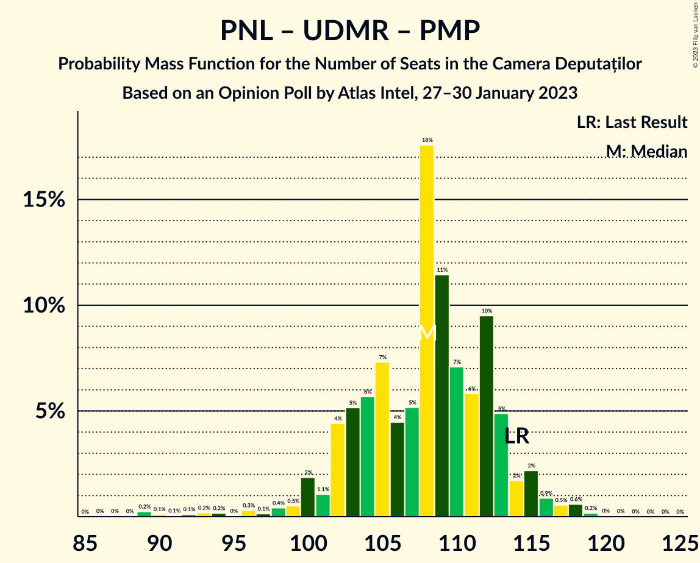

| Number of Seats | Probability | Accumulated | Special Marks |
|:---------------:|:-----------:|:-----------:|:-------------:|
| 86 | 0% | 100% |  |
| 87 | 0% | 99.9% |  |
| 88 | 0% | 99.9% |  |
| 89 | 0.2% | 99.9% |  |
| 90 | 0.1% | 99.6% |  |
| 91 | 0.1% | 99.5% |  |
| 92 | 0.1% | 99.5% |  |
| 93 | 0.2% | 99.4% |  |
| 94 | 0.2% | 99.2% |  |
| 95 | 0% | 99.0% |  |
| 96 | 0.3% | 99.0% |  |
| 97 | 0.1% | 98.7% |  |
| 98 | 0.4% | 98.5% |  |
| 99 | 0.5% | 98% |  |
| 100 | 2% | 98% |  |
| 101 | 1.1% | 96% |  |
| 102 | 4% | 95% |  |
| 103 | 5% | 90% |  |
| 104 | 6% | 85% |  |
| 105 | 7% | 79% |  |
| 106 | 4% | 72% |  |
| 107 | 5% | 68% | Median |
| 108 | 18% | 62% |  |
| 109 | 11% | 45% |  |
| 110 | 7% | 33% |  |
| 111 | 6% | 26% |  |
| 112 | 10% | 21% |  |
| 113 | 5% | 11% |  |
| 114 | 2% | 6% | Last Result |
| 115 | 2% | 4% |  |
| 116 | 0.9% | 2% |  |
| 117 | 0.5% | 1.4% |  |
| 118 | 0.6% | 0.9% |  |
| 119 | 0.2% | 0.3% |  |
| 120 | 0% | 0.1% |  |
| 121 | 0% | 0% |  |

### Partidul Social Democrat – PRO România

| Number of Seats | Probability | Accumulated | Special Marks |
|:---------------:|:-----------:|:-----------:|:-------------:|
| 80 | 0% | 100% |  |
| 81 | 0.1% | 99.9% |  |
| 82 | 0.1% | 99.9% |  |
| 83 | 0.4% | 99.8% |  |
| 84 | 0.5% | 99.4% |  |
| 85 | 1.4% | 98.8% |  |
| 86 | 2% | 97% |  |
| 87 | 2% | 95% |  |
| 88 | 4% | 93% |  |
| 89 | 8% | 89% |  |
| 90 | 6% | 81% |  |
| 91 | 10% | 75% |  |
| 92 | 10% | 65% |  |
| 93 | 21% | 55% | Median |
| 94 | 9% | 34% |  |
| 95 | 8% | 25% |  |
| 96 | 4% | 17% |  |
| 97 | 4% | 13% |  |
| 98 | 3% | 9% |  |
| 99 | 2% | 7% |  |
| 100 | 2% | 5% |  |
| 101 | 0.7% | 3% |  |
| 102 | 0.7% | 3% |  |
| 103 | 0.4% | 2% |  |
| 104 | 0.2% | 2% |  |
| 105 | 0.4% | 1.4% |  |
| 106 | 0.6% | 1.0% |  |
| 107 | 0.1% | 0.5% |  |
| 108 | 0% | 0.3% |  |
| 109 | 0.2% | 0.3% |  |
| 110 | 0% | 0.1% | Last Result |
| 111 | 0% | 0.1% |  |
| 112 | 0% | 0.1% |  |
| 113 | 0% | 0% |  |

### Partidul Național Liberal – Uniunea Democrată Maghiară din România

| Number of Seats | Probability | Accumulated | Special Marks |
|:---------------:|:-----------:|:-----------:|:-------------:|
| 75 | 0.1% | 100% |  |
| 76 | 0.1% | 99.9% |  |
| 77 | 0.2% | 99.8% |  |
| 78 | 0.7% | 99.6% |  |
| 79 | 2% | 98.9% |  |
| 80 | 2% | 97% |  |
| 81 | 4% | 95% |  |
| 82 | 6% | 92% |  |
| 83 | 5% | 85% |  |
| 84 | 9% | 80% |  |
| 85 | 9% | 71% |  |
| 86 | 9% | 63% | Median |
| 87 | 15% | 54% |  |
| 88 | 5% | 39% |  |
| 89 | 8% | 34% |  |
| 90 | 13% | 26% |  |
| 91 | 3% | 13% |  |
| 92 | 5% | 9% |  |
| 93 | 2% | 4% |  |
| 94 | 0.9% | 2% |  |
| 95 | 0.7% | 2% |  |
| 96 | 0.5% | 0.8% |  |
| 97 | 0.2% | 0.3% |  |
| 98 | 0% | 0.2% |  |
| 99 | 0.1% | 0.1% |  |
| 100 | 0% | 0% |  |
| 101 | 0% | 0% |  |
| 102 | 0% | 0% |  |
| 103 | 0% | 0% |  |
| 104 | 0% | 0% |  |
| 105 | 0% | 0% |  |
| 106 | 0% | 0% |  |
| 107 | 0% | 0% |  |
| 108 | 0% | 0% |  |
| 109 | 0% | 0% |  |
| 110 | 0% | 0% |  |
| 111 | 0% | 0% |  |
| 112 | 0% | 0% |  |
| 113 | 0% | 0% |  |
| 114 | 0% | 0% | Last Result |

### Partidul Național Liberal – Partidul Mișcarea Populară

| Number of Seats | Probability | Accumulated | Special Marks |
|:---------------:|:-----------:|:-----------:|:-------------:|
| 62 | 0% | 100% |  |
| 63 | 0% | 99.9% |  |
| 64 | 0% | 99.9% |  |
| 65 | 0.1% | 99.9% |  |
| 66 | 0.3% | 99.8% |  |
| 67 | 0.1% | 99.5% |  |
| 68 | 0.4% | 99.4% |  |
| 69 | 0.3% | 99.1% |  |
| 70 | 0% | 98.8% |  |
| 71 | 0.1% | 98.8% |  |
| 72 | 0% | 98.7% |  |
| 73 | 0% | 98.7% |  |
| 74 | 0.1% | 98.6% |  |
| 75 | 0.2% | 98.6% |  |
| 76 | 0.6% | 98% |  |
| 77 | 0.6% | 98% |  |
| 78 | 2% | 97% |  |
| 79 | 4% | 95% |  |
| 80 | 6% | 91% |  |
| 81 | 9% | 85% |  |
| 82 | 4% | 76% |  |
| 83 | 9% | 72% |  |
| 84 | 10% | 63% | Median |
| 85 | 16% | 53% |  |
| 86 | 9% | 36% |  |
| 87 | 7% | 27% |  |
| 88 | 11% | 21% |  |
| 89 | 2% | 10% |  |
| 90 | 3% | 8% |  |
| 91 | 2% | 5% |  |
| 92 | 1.1% | 3% |  |
| 93 | 0.8% | 2% | Last Result |
| 94 | 0.6% | 0.9% |  |
| 95 | 0.1% | 0.3% |  |
| 96 | 0.1% | 0.2% |  |
| 97 | 0% | 0.1% |  |
| 98 | 0% | 0% |  |

### Alianța 2020 USR-PLUS – Partidul Mișcarea Populară

| Number of Seats | Probability | Accumulated | Special Marks |
|:---------------:|:-----------:|:-----------:|:-------------:|
| 44 | 0% | 100% |  |
| 45 | 0.1% | 99.9% |  |
| 46 | 0.1% | 99.9% |  |
| 47 | 0.1% | 99.8% |  |
| 48 | 0.1% | 99.7% |  |
| 49 | 0.2% | 99.7% |  |
| 50 | 0.1% | 99.5% |  |
| 51 | 0.2% | 99.4% |  |
| 52 | 0.2% | 99.2% |  |
| 53 | 0.2% | 99.0% |  |
| 54 | 0.1% | 98.7% |  |
| 55 | 0% | 98.7% | Last Result |
| 56 | 0% | 98.7% |  |
| 57 | 0.1% | 98.6% |  |
| 58 | 0.2% | 98.6% |  |
| 59 | 0.2% | 98% |  |
| 60 | 0.8% | 98% |  |
| 61 | 2% | 97% |  |
| 62 | 3% | 96% |  |
| 63 | 3% | 92% |  |
| 64 | 10% | 89% |  |
| 65 | 6% | 79% |  |
| 66 | 16% | 73% |  |
| 67 | 12% | 57% | Median |
| 68 | 10% | 46% |  |
| 69 | 15% | 36% |  |
| 70 | 6% | 21% |  |
| 71 | 5% | 14% |  |
| 72 | 3% | 9% |  |
| 73 | 4% | 6% |  |
| 74 | 0.9% | 2% |  |
| 75 | 0.7% | 1.3% |  |
| 76 | 0.4% | 0.6% |  |
| 77 | 0.1% | 0.2% |  |
| 78 | 0% | 0.1% |  |
| 79 | 0% | 0% |  |

### Partidul Național Liberal

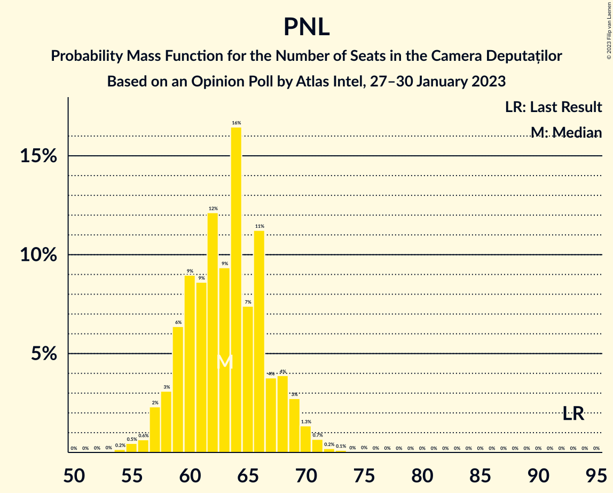

| Number of Seats | Probability | Accumulated | Special Marks |
|:---------------:|:-----------:|:-----------:|:-------------:|
| 54 | 0.2% | 100% |  |
| 55 | 0.5% | 99.8% |  |
| 56 | 0.6% | 99.3% |  |
| 57 | 2% | 98.7% |  |
| 58 | 3% | 96% |  |
| 59 | 6% | 93% |  |
| 60 | 9% | 87% |  |
| 61 | 9% | 78% |  |
| 62 | 12% | 69% |  |
| 63 | 9% | 57% | Median |
| 64 | 16% | 48% |  |
| 65 | 7% | 31% |  |
| 66 | 11% | 24% |  |
| 67 | 4% | 13% |  |
| 68 | 4% | 9% |  |
| 69 | 3% | 5% |  |
| 70 | 1.3% | 2% |  |
| 71 | 0.7% | 1.1% |  |
| 72 | 0.2% | 0.4% |  |
| 73 | 0.1% | 0.2% |  |
| 74 | 0% | 0.1% |  |
| 75 | 0% | 0.1% |  |
| 76 | 0% | 0% |  |
| 77 | 0% | 0% |  |
| 78 | 0% | 0% |  |
| 79 | 0% | 0% |  |
| 80 | 0% | 0% |  |
| 81 | 0% | 0% |  |
| 82 | 0% | 0% |  |
| 83 | 0% | 0% |  |
| 84 | 0% | 0% |  |
| 85 | 0% | 0% |  |
| 86 | 0% | 0% |  |
| 87 | 0% | 0% |  |
| 88 | 0% | 0% |  |
| 89 | 0% | 0% |  |
| 90 | 0% | 0% |  |
| 91 | 0% | 0% |  |
| 92 | 0% | 0% |  |
| 93 | 0% | 0% | Last Result |

## Technical Information

### Opinion Poll

+ **Polling firm:** Atlas Intel
+ **Commissioner(s):** —
+ **Fieldwork period:** 27–30 January 2023

### Calculations

+ **Sample size:** 2000
+ **Simulations done:** 1,048,576
+ **Error estimate:** 1.49%

