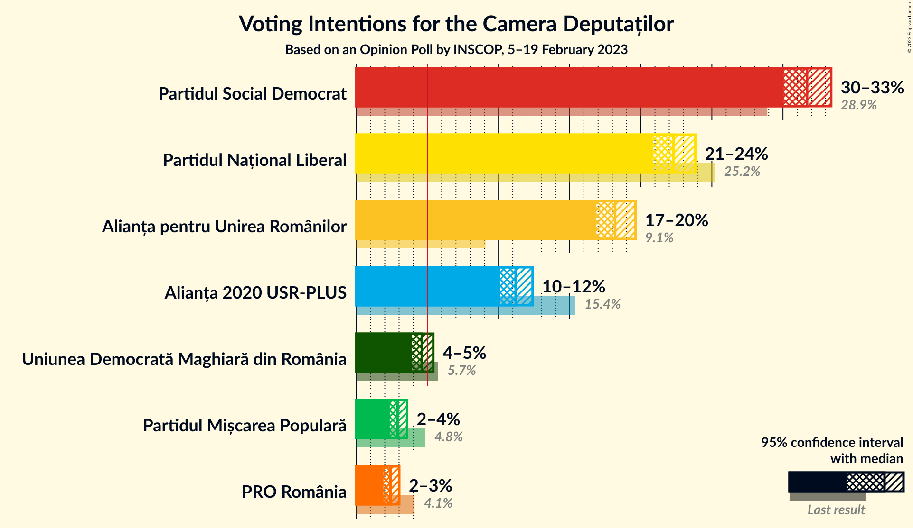

# Opinion Poll by INSCOP, 5–19 February 2023

<a href="#voting-intentions">Voting Intentions</a> | <a href="#seats">Seats</a> | <a href="#coalitions">Coalitions</a> | <a href="#technical-information">Technical Information</a>

## Voting Intentions

### Confidence Intervals

| Party | Last Result | Poll Result | 80% Confidence Interval | 90% Confidence Interval | 95% Confidence Interval | 99% Confidence Interval |
|:-----:|:-----------:|:-----------:|:-----------------------:|:-----------------------:|:-----------------------:|:-----------------------:|
| Partidul Social Democrat | 28.9% | 31.7% | 30.6–32.8% |30.3–33.1% |30.1–33.4% |29.5–33.9% |
| Partidul Național Liberal | 25.2% | 22.3% | 21.3–23.3% |21.1–23.6% |20.8–23.8% |20.4–24.3% |
| Alianța pentru Unirea Românilor | 9.1% | 18.2% | 17.3–19.1% |17.1–19.4% |16.9–19.6% |16.4–20.1% |
| Alianța 2020 USR-PLUS | 15.4% | 11.2% | 10.5–12.0% |10.3–12.2% |10.1–12.4% |9.8–12.8% |
| Uniunea Democrată Maghiară din România | 5.7% | 4.6% | 4.1–5.1% |4.0–5.3% |3.9–5.4% |3.7–5.7% |
| Partidul Mișcarea Populară | 4.8% | 2.9% | 2.5–3.3% |2.4–3.5% |2.3–3.6% |2.2–3.8% |
| PRO România | 4.1% | 2.4% | 2.1–2.8% |2.0–2.9% |1.9–3.0% |1.8–3.2% |

*Note:* The poll result column reflects the actual value used in the calculations. Published results may vary slightly, and in addition be rounded to fewer digits.

## Seats

### Confidence Intervals

| Party | Last Result | Median | 80% Confidence Interval | 90% Confidence Interval | 95% Confidence Interval | 99% Confidence Interval |
|:-----:|:-----------:|:------:|:-----------------------:|:-----------------------:|:-----------------------:|:-----------------------:|
| <a href="#partidul-social-democrat">Partidul Social Democrat</a> | 110 | 113 | 109–117 |108–118 |107–118 |105–120 |
| <a href="#partidul-național-liberal">Partidul Național Liberal</a> | 93 | 79 | 76–83 |75–84 |74–84 |72–86 |
| <a href="#alianța-pentru-unirea-românilor">Alianța pentru Unirea Românilor</a> | 33 | 65 | 61–68 |61–69 |60–69 |58–71 |
| <a href="#alianța-2020-usr-plus">Alianța 2020 USR-PLUS</a> | 55 | 40 | 37–42 |36–43 |36–44 |34–45 |
| <a href="#uniunea-democrată-maghiară-din-românia">Uniunea Democrată Maghiară din România</a> | 21 | 16 | 14–18 |14–18 |13–19 |13–20 |
| <a href="#partidul-mișcarea-populară">Partidul Mișcarea Populară</a> | 0 | 0 | 0 |0 |0 |0 |
| <a href="#pro-românia">PRO România</a> | 0 | 0 | 0 |0 |0 |0 |

### Partidul Social Democrat

*For a full overview of the results for this party, see the [Partidul Social Democrat](party-partidulsocialdemocrat.html) page.*

| Number of Seats | Probability | Accumulated | Special Marks |
|:---------------:|:-----------:|:-----------:|:-------------:|
| 103 | 0% | 100% |  |
| 104 | 0.2% | 99.9% |  |
| 105 | 0.5% | 99.8% |  |
| 106 | 0.8% | 99.3% |  |
| 107 | 2% | 98% |  |
| 108 | 4% | 96% |  |
| 109 | 6% | 92% |  |
| 110 | 10% | 86% | Last Result |
| 111 | 10% | 76% |  |
| 112 | 12% | 66% |  |
| 113 | 16% | 54% | Median |
| 114 | 12% | 38% |  |
| 115 | 10% | 26% |  |
| 116 | 6% | 17% |  |
| 117 | 5% | 11% |  |
| 118 | 3% | 5% |  |
| 119 | 1.1% | 2% |  |
| 120 | 0.6% | 1.0% |  |
| 121 | 0.2% | 0.4% |  |
| 122 | 0.1% | 0.2% |  |
| 123 | 0% | 0.1% |  |
| 124 | 0% | 0% |  |

### Partidul Național Liberal

*For a full overview of the results for this party, see the [Partidul Național Liberal](party-partidulnaționalliberal.html) page.*

| Number of Seats | Probability | Accumulated | Special Marks |
|:---------------:|:-----------:|:-----------:|:-------------:|
| 71 | 0.1% | 100% |  |
| 72 | 0.4% | 99.8% |  |
| 73 | 0.9% | 99.4% |  |
| 74 | 2% | 98.6% |  |
| 75 | 6% | 96% |  |
| 76 | 6% | 90% |  |
| 77 | 11% | 84% |  |
| 78 | 11% | 72% |  |
| 79 | 17% | 62% | Median |
| 80 | 12% | 45% |  |
| 81 | 15% | 33% |  |
| 82 | 7% | 18% |  |
| 83 | 6% | 11% |  |
| 84 | 3% | 5% |  |
| 85 | 2% | 2% |  |
| 86 | 0.5% | 0.9% |  |
| 87 | 0.2% | 0.3% |  |
| 88 | 0.1% | 0.1% |  |
| 89 | 0% | 0% |  |
| 90 | 0% | 0% |  |
| 91 | 0% | 0% |  |
| 92 | 0% | 0% |  |
| 93 | 0% | 0% | Last Result |

### Alianța pentru Unirea Românilor

*For a full overview of the results for this party, see the [Alianța pentru Unirea Românilor](party-alianțapentruunirearomânilor.html) page.*

| Number of Seats | Probability | Accumulated | Special Marks |
|:---------------:|:-----------:|:-----------:|:-------------:|
| 33 | 0% | 100% | Last Result |
| 34 | 0% | 100% |  |
| 35 | 0% | 100% |  |
| 36 | 0% | 100% |  |
| 37 | 0% | 100% |  |
| 38 | 0% | 100% |  |
| 39 | 0% | 100% |  |
| 40 | 0% | 100% |  |
| 41 | 0% | 100% |  |
| 42 | 0% | 100% |  |
| 43 | 0% | 100% |  |
| 44 | 0% | 100% |  |
| 45 | 0% | 100% |  |
| 46 | 0% | 100% |  |
| 47 | 0% | 100% |  |
| 48 | 0% | 100% |  |
| 49 | 0% | 100% |  |
| 50 | 0% | 100% |  |
| 51 | 0% | 100% |  |
| 52 | 0% | 100% |  |
| 53 | 0% | 100% |  |
| 54 | 0% | 100% |  |
| 55 | 0% | 100% |  |
| 56 | 0% | 100% |  |
| 57 | 0.1% | 100% |  |
| 58 | 0.4% | 99.8% |  |
| 59 | 1.4% | 99.4% |  |
| 60 | 3% | 98% |  |
| 61 | 6% | 95% |  |
| 62 | 10% | 89% |  |
| 63 | 13% | 79% |  |
| 64 | 16% | 66% |  |
| 65 | 18% | 51% | Median |
| 66 | 12% | 33% |  |
| 67 | 9% | 21% |  |
| 68 | 6% | 12% |  |
| 69 | 3% | 6% |  |
| 70 | 1.4% | 2% |  |
| 71 | 0.6% | 0.9% |  |
| 72 | 0.2% | 0.3% |  |
| 73 | 0.1% | 0.1% |  |
| 74 | 0% | 0% |  |

### Alianța 2020 USR-PLUS

*For a full overview of the results for this party, see the [Alianța 2020 USR-PLUS](party-alianța2020usr-plus.html) page.*

| Number of Seats | Probability | Accumulated | Special Marks |
|:---------------:|:-----------:|:-----------:|:-------------:|
| 33 | 0.1% | 100% |  |
| 34 | 0.5% | 99.9% |  |
| 35 | 2% | 99.4% |  |
| 36 | 4% | 98% |  |
| 37 | 8% | 94% |  |
| 38 | 16% | 86% |  |
| 39 | 17% | 70% |  |
| 40 | 21% | 52% | Median |
| 41 | 16% | 32% |  |
| 42 | 9% | 16% |  |
| 43 | 4% | 7% |  |
| 44 | 2% | 3% |  |
| 45 | 0.7% | 1.0% |  |
| 46 | 0.2% | 0.3% |  |
| 47 | 0% | 0% |  |
| 48 | 0% | 0% |  |
| 49 | 0% | 0% |  |
| 50 | 0% | 0% |  |
| 51 | 0% | 0% |  |
| 52 | 0% | 0% |  |
| 53 | 0% | 0% |  |
| 54 | 0% | 0% |  |
| 55 | 0% | 0% | Last Result |

### Uniunea Democrată Maghiară din România

*For a full overview of the results for this party, see the [Uniunea Democrată Maghiară din România](party-uniuneademocratămaghiarădinromânia.html) page.*

| Number of Seats | Probability | Accumulated | Special Marks |
|:---------------:|:-----------:|:-----------:|:-------------:|
| 12 | 0.3% | 100% |  |
| 13 | 2% | 99.7% |  |
| 14 | 10% | 97% |  |
| 15 | 21% | 87% |  |
| 16 | 31% | 66% | Median |
| 17 | 20% | 34% |  |
| 18 | 10% | 14% |  |
| 19 | 3% | 4% |  |
| 20 | 0.7% | 0.8% |  |
| 21 | 0.1% | 0.1% | Last Result |
| 22 | 0% | 0% |  |

### Partidul Mișcarea Populară

*For a full overview of the results for this party, see the [Partidul Mișcarea Populară](party-partidulmișcareapopulară.html) page.*

| Number of Seats | Probability | Accumulated | Special Marks |
|:---------------:|:-----------:|:-----------:|:-------------:|
| 0 | 100% | 100% | Last Result, Median |

### PRO România

*For a full overview of the results for this party, see the [PRO România](party-proromânia.html) page.*

| Number of Seats | Probability | Accumulated | Special Marks |
|:---------------:|:-----------:|:-----------:|:-------------:|
| 0 | 100% | 100% | Last Result, Median |

## Coalitions

### Confidence Intervals

| Coalition | Last Result | Median | Majority? | 80% Confidence Interval | 90% Confidence Interval | 95% Confidence Interval | 99% Confidence Interval |
|:---------:|:-----------:|:------:|:---------:|:-----------------------:|:-----------------------:|:-----------------------:|:-----------------------:|
| Partidul Național Liberal – Alianța 2020 USR-PLUS – Uniunea Democrată Maghiară din România – Partidul Mișcarea Populară | 169 | 135 | 0% | 131–139 | 130–140 | 129–141 | 127–143 |
| Partidul Național Liberal – Alianța 2020 USR-PLUS – Uniunea Democrată Maghiară din România | 169 | 135 | 0% | 131–139 | 130–140 | 129–141 | 127–143 |
| Partidul Național Liberal – Alianța 2020 USR-PLUS – Partidul Mișcarea Populară | 148 | 119 | 0% | 115–123 | 114–124 | 113–125 | 111–126 |
| Partidul Național Liberal – Alianța 2020 USR-PLUS | 148 | 119 | 0% | 115–123 | 114–124 | 113–125 | 111–126 |
| Partidul Social Democrat – PRO România | 110 | 113 | 0% | 109–117 | 108–118 | 107–118 | 105–120 |
| Partidul Național Liberal – Uniunea Democrată Maghiară din România – Partidul Mișcarea Populară | 114 | 95 | 0% | 91–99 | 91–100 | 90–101 | 88–102 |
| Partidul Național Liberal – Uniunea Democrată Maghiară din România | 114 | 95 | 0% | 91–99 | 91–100 | 90–101 | 88–102 |
| Partidul Național Liberal – Partidul Mișcarea Populară | 93 | 79 | 0% | 76–83 | 75–84 | 74–84 | 72–86 |
| Partidul Național Liberal | 93 | 79 | 0% | 76–83 | 75–84 | 74–84 | 72–86 |
| Alianța 2020 USR-PLUS – Partidul Mișcarea Populară | 55 | 40 | 0% | 37–42 | 36–43 | 36–44 | 34–45 |

### Partidul Național Liberal – Alianța 2020 USR-PLUS – Uniunea Democrată Maghiară din România – Partidul Mișcarea Populară

| Number of Seats | Probability | Accumulated | Special Marks |
|:---------------:|:-----------:|:-----------:|:-------------:|
| 125 | 0.1% | 100% |  |
| 126 | 0.2% | 99.9% |  |
| 127 | 0.4% | 99.7% |  |
| 128 | 1.3% | 99.2% |  |
| 129 | 2% | 98% |  |
| 130 | 4% | 96% |  |
| 131 | 5% | 92% |  |
| 132 | 9% | 87% |  |
| 133 | 12% | 78% |  |
| 134 | 13% | 66% |  |
| 135 | 14% | 53% | Median |
| 136 | 10% | 39% |  |
| 137 | 11% | 29% |  |
| 138 | 8% | 19% |  |
| 139 | 5% | 11% |  |
| 140 | 2% | 5% |  |
| 141 | 2% | 3% |  |
| 142 | 0.8% | 1.4% |  |
| 143 | 0.3% | 0.6% |  |
| 144 | 0.2% | 0.2% |  |
| 145 | 0% | 0.1% |  |
| 146 | 0% | 0% |  |
| 147 | 0% | 0% |  |
| 148 | 0% | 0% |  |
| 149 | 0% | 0% |  |
| 150 | 0% | 0% |  |
| 151 | 0% | 0% |  |
| 152 | 0% | 0% |  |
| 153 | 0% | 0% |  |
| 154 | 0% | 0% |  |
| 155 | 0% | 0% |  |
| 156 | 0% | 0% |  |
| 157 | 0% | 0% |  |
| 158 | 0% | 0% |  |
| 159 | 0% | 0% |  |
| 160 | 0% | 0% |  |
| 161 | 0% | 0% |  |
| 162 | 0% | 0% |  |
| 163 | 0% | 0% |  |
| 164 | 0% | 0% |  |
| 165 | 0% | 0% | Majority |
| 166 | 0% | 0% |  |
| 167 | 0% | 0% |  |
| 168 | 0% | 0% |  |
| 169 | 0% | 0% | Last Result |

### Partidul Național Liberal – Alianța 2020 USR-PLUS – Uniunea Democrată Maghiară din România

| Number of Seats | Probability | Accumulated | Special Marks |
|:---------------:|:-----------:|:-----------:|:-------------:|
| 125 | 0.1% | 100% |  |
| 126 | 0.2% | 99.9% |  |
| 127 | 0.4% | 99.7% |  |
| 128 | 1.3% | 99.2% |  |
| 129 | 2% | 98% |  |
| 130 | 4% | 96% |  |
| 131 | 5% | 92% |  |
| 132 | 9% | 87% |  |
| 133 | 12% | 78% |  |
| 134 | 13% | 66% |  |
| 135 | 14% | 53% | Median |
| 136 | 10% | 39% |  |
| 137 | 11% | 29% |  |
| 138 | 8% | 19% |  |
| 139 | 5% | 11% |  |
| 140 | 2% | 5% |  |
| 141 | 2% | 3% |  |
| 142 | 0.8% | 1.4% |  |
| 143 | 0.3% | 0.6% |  |
| 144 | 0.2% | 0.2% |  |
| 145 | 0% | 0.1% |  |
| 146 | 0% | 0% |  |
| 147 | 0% | 0% |  |
| 148 | 0% | 0% |  |
| 149 | 0% | 0% |  |
| 150 | 0% | 0% |  |
| 151 | 0% | 0% |  |
| 152 | 0% | 0% |  |
| 153 | 0% | 0% |  |
| 154 | 0% | 0% |  |
| 155 | 0% | 0% |  |
| 156 | 0% | 0% |  |
| 157 | 0% | 0% |  |
| 158 | 0% | 0% |  |
| 159 | 0% | 0% |  |
| 160 | 0% | 0% |  |
| 161 | 0% | 0% |  |
| 162 | 0% | 0% |  |
| 163 | 0% | 0% |  |
| 164 | 0% | 0% |  |
| 165 | 0% | 0% | Majority |
| 166 | 0% | 0% |  |
| 167 | 0% | 0% |  |
| 168 | 0% | 0% |  |
| 169 | 0% | 0% | Last Result |

### Partidul Național Liberal – Alianța 2020 USR-PLUS – Partidul Mișcarea Populară

| Number of Seats | Probability | Accumulated | Special Marks |
|:---------------:|:-----------:|:-----------:|:-------------:|
| 109 | 0.1% | 100% |  |
| 110 | 0.2% | 99.9% |  |
| 111 | 0.4% | 99.7% |  |
| 112 | 1.1% | 99.3% |  |
| 113 | 2% | 98% |  |
| 114 | 4% | 96% |  |
| 115 | 5% | 92% |  |
| 116 | 9% | 87% |  |
| 117 | 12% | 78% |  |
| 118 | 11% | 65% |  |
| 119 | 14% | 54% | Median |
| 120 | 13% | 40% |  |
| 121 | 10% | 28% |  |
| 122 | 7% | 17% |  |
| 123 | 5% | 10% |  |
| 124 | 3% | 5% |  |
| 125 | 1.3% | 3% |  |
| 126 | 0.8% | 1.3% |  |
| 127 | 0.3% | 0.5% |  |
| 128 | 0.1% | 0.2% |  |
| 129 | 0% | 0.1% |  |
| 130 | 0% | 0% |  |
| 131 | 0% | 0% |  |
| 132 | 0% | 0% |  |
| 133 | 0% | 0% |  |
| 134 | 0% | 0% |  |
| 135 | 0% | 0% |  |
| 136 | 0% | 0% |  |
| 137 | 0% | 0% |  |
| 138 | 0% | 0% |  |
| 139 | 0% | 0% |  |
| 140 | 0% | 0% |  |
| 141 | 0% | 0% |  |
| 142 | 0% | 0% |  |
| 143 | 0% | 0% |  |
| 144 | 0% | 0% |  |
| 145 | 0% | 0% |  |
| 146 | 0% | 0% |  |
| 147 | 0% | 0% |  |
| 148 | 0% | 0% | Last Result |

### Partidul Național Liberal – Alianța 2020 USR-PLUS

| Number of Seats | Probability | Accumulated | Special Marks |
|:---------------:|:-----------:|:-----------:|:-------------:|
| 109 | 0.1% | 100% |  |
| 110 | 0.2% | 99.9% |  |
| 111 | 0.4% | 99.7% |  |
| 112 | 1.1% | 99.3% |  |
| 113 | 2% | 98% |  |
| 114 | 4% | 96% |  |
| 115 | 5% | 92% |  |
| 116 | 9% | 87% |  |
| 117 | 12% | 78% |  |
| 118 | 11% | 65% |  |
| 119 | 14% | 54% | Median |
| 120 | 13% | 40% |  |
| 121 | 10% | 28% |  |
| 122 | 7% | 17% |  |
| 123 | 5% | 10% |  |
| 124 | 3% | 5% |  |
| 125 | 1.3% | 3% |  |
| 126 | 0.8% | 1.3% |  |
| 127 | 0.3% | 0.5% |  |
| 128 | 0.1% | 0.2% |  |
| 129 | 0% | 0.1% |  |
| 130 | 0% | 0% |  |
| 131 | 0% | 0% |  |
| 132 | 0% | 0% |  |
| 133 | 0% | 0% |  |
| 134 | 0% | 0% |  |
| 135 | 0% | 0% |  |
| 136 | 0% | 0% |  |
| 137 | 0% | 0% |  |
| 138 | 0% | 0% |  |
| 139 | 0% | 0% |  |
| 140 | 0% | 0% |  |
| 141 | 0% | 0% |  |
| 142 | 0% | 0% |  |
| 143 | 0% | 0% |  |
| 144 | 0% | 0% |  |
| 145 | 0% | 0% |  |
| 146 | 0% | 0% |  |
| 147 | 0% | 0% |  |
| 148 | 0% | 0% | Last Result |

### Partidul Social Democrat – PRO România

| Number of Seats | Probability | Accumulated | Special Marks |
|:---------------:|:-----------:|:-----------:|:-------------:|
| 103 | 0% | 100% |  |
| 104 | 0.2% | 99.9% |  |
| 105 | 0.5% | 99.8% |  |
| 106 | 0.8% | 99.3% |  |
| 107 | 2% | 98% |  |
| 108 | 4% | 96% |  |
| 109 | 6% | 92% |  |
| 110 | 10% | 86% | Last Result |
| 111 | 10% | 76% |  |
| 112 | 12% | 66% |  |
| 113 | 16% | 54% | Median |
| 114 | 12% | 38% |  |
| 115 | 10% | 26% |  |
| 116 | 6% | 17% |  |
| 117 | 5% | 11% |  |
| 118 | 3% | 5% |  |
| 119 | 1.1% | 2% |  |
| 120 | 0.6% | 1.0% |  |
| 121 | 0.2% | 0.4% |  |
| 122 | 0.1% | 0.2% |  |
| 123 | 0% | 0.1% |  |
| 124 | 0% | 0% |  |

### Partidul Național Liberal – Uniunea Democrată Maghiară din România – Partidul Mișcarea Populară

| Number of Seats | Probability | Accumulated | Special Marks |
|:---------------:|:-----------:|:-----------:|:-------------:|
| 86 | 0.1% | 100% |  |
| 87 | 0.2% | 99.9% |  |
| 88 | 0.3% | 99.7% |  |
| 89 | 0.8% | 99.3% |  |
| 90 | 3% | 98.5% |  |
| 91 | 7% | 96% |  |
| 92 | 8% | 88% |  |
| 93 | 7% | 80% |  |
| 94 | 8% | 73% |  |
| 95 | 16% | 65% | Median |
| 96 | 17% | 49% |  |
| 97 | 15% | 32% |  |
| 98 | 6% | 17% |  |
| 99 | 3% | 11% |  |
| 100 | 3% | 7% |  |
| 101 | 2% | 4% |  |
| 102 | 1.0% | 1.4% |  |
| 103 | 0.2% | 0.4% |  |
| 104 | 0.1% | 0.1% |  |
| 105 | 0% | 0.1% |  |
| 106 | 0% | 0% |  |
| 107 | 0% | 0% |  |
| 108 | 0% | 0% |  |
| 109 | 0% | 0% |  |
| 110 | 0% | 0% |  |
| 111 | 0% | 0% |  |
| 112 | 0% | 0% |  |
| 113 | 0% | 0% |  |
| 114 | 0% | 0% | Last Result |

### Partidul Național Liberal – Uniunea Democrată Maghiară din România

| Number of Seats | Probability | Accumulated | Special Marks |
|:---------------:|:-----------:|:-----------:|:-------------:|
| 86 | 0.1% | 100% |  |
| 87 | 0.2% | 99.9% |  |
| 88 | 0.3% | 99.7% |  |
| 89 | 0.8% | 99.3% |  |
| 90 | 3% | 98.5% |  |
| 91 | 7% | 96% |  |
| 92 | 8% | 88% |  |
| 93 | 7% | 80% |  |
| 94 | 8% | 73% |  |
| 95 | 16% | 65% | Median |
| 96 | 17% | 49% |  |
| 97 | 15% | 32% |  |
| 98 | 6% | 17% |  |
| 99 | 3% | 11% |  |
| 100 | 3% | 7% |  |
| 101 | 2% | 4% |  |
| 102 | 1.0% | 1.4% |  |
| 103 | 0.2% | 0.4% |  |
| 104 | 0.1% | 0.1% |  |
| 105 | 0% | 0.1% |  |
| 106 | 0% | 0% |  |
| 107 | 0% | 0% |  |
| 108 | 0% | 0% |  |
| 109 | 0% | 0% |  |
| 110 | 0% | 0% |  |
| 111 | 0% | 0% |  |
| 112 | 0% | 0% |  |
| 113 | 0% | 0% |  |
| 114 | 0% | 0% | Last Result |

### Partidul Național Liberal – Partidul Mișcarea Populară

| Number of Seats | Probability | Accumulated | Special Marks |
|:---------------:|:-----------:|:-----------:|:-------------:|
| 71 | 0.1% | 100% |  |
| 72 | 0.4% | 99.8% |  |
| 73 | 0.9% | 99.4% |  |
| 74 | 2% | 98.6% |  |
| 75 | 6% | 96% |  |
| 76 | 6% | 90% |  |
| 77 | 11% | 84% |  |
| 78 | 11% | 72% |  |
| 79 | 17% | 62% | Median |
| 80 | 12% | 45% |  |
| 81 | 15% | 33% |  |
| 82 | 7% | 18% |  |
| 83 | 6% | 11% |  |
| 84 | 3% | 5% |  |
| 85 | 2% | 2% |  |
| 86 | 0.5% | 0.9% |  |
| 87 | 0.2% | 0.3% |  |
| 88 | 0.1% | 0.1% |  |
| 89 | 0% | 0% |  |
| 90 | 0% | 0% |  |
| 91 | 0% | 0% |  |
| 92 | 0% | 0% |  |
| 93 | 0% | 0% | Last Result |

### Partidul Național Liberal

| Number of Seats | Probability | Accumulated | Special Marks |
|:---------------:|:-----------:|:-----------:|:-------------:|
| 71 | 0.1% | 100% |  |
| 72 | 0.4% | 99.8% |  |
| 73 | 0.9% | 99.4% |  |
| 74 | 2% | 98.6% |  |
| 75 | 6% | 96% |  |
| 76 | 6% | 90% |  |
| 77 | 11% | 84% |  |
| 78 | 11% | 72% |  |
| 79 | 17% | 62% | Median |
| 80 | 12% | 45% |  |
| 81 | 15% | 33% |  |
| 82 | 7% | 18% |  |
| 83 | 6% | 11% |  |
| 84 | 3% | 5% |  |
| 85 | 2% | 2% |  |
| 86 | 0.5% | 0.9% |  |
| 87 | 0.2% | 0.3% |  |
| 88 | 0.1% | 0.1% |  |
| 89 | 0% | 0% |  |
| 90 | 0% | 0% |  |
| 91 | 0% | 0% |  |
| 92 | 0% | 0% |  |
| 93 | 0% | 0% | Last Result |

### Alianța 2020 USR-PLUS – Partidul Mișcarea Populară

| Number of Seats | Probability | Accumulated | Special Marks |
|:---------------:|:-----------:|:-----------:|:-------------:|
| 33 | 0.1% | 100% |  |
| 34 | 0.5% | 99.9% |  |
| 35 | 2% | 99.4% |  |
| 36 | 4% | 98% |  |
| 37 | 8% | 94% |  |
| 38 | 16% | 86% |  |
| 39 | 17% | 70% |  |
| 40 | 21% | 52% | Median |
| 41 | 16% | 32% |  |
| 42 | 9% | 16% |  |
| 43 | 4% | 7% |  |
| 44 | 2% | 3% |  |
| 45 | 0.7% | 1.0% |  |
| 46 | 0.2% | 0.3% |  |
| 47 | 0% | 0% |  |
| 48 | 0% | 0% |  |
| 49 | 0% | 0% |  |
| 50 | 0% | 0% |  |
| 51 | 0% | 0% |  |
| 52 | 0% | 0% |  |
| 53 | 0% | 0% |  |
| 54 | 0% | 0% |  |
| 55 | 0% | 0% | Last Result |

## Technical Information

### Opinion Poll

+ **Polling firm:** INSCOP
+ **Commissioner(s):** —
+ **Fieldwork period:** 5–19 February 2023

### Calculations

+ **Sample size:** 3000
+ **Simulations done:** 1,048,576
+ **Error estimate:** 0.47%

