# Opinion Poll by CURS, 12–22 September 2023

<a href="#voting-intentions">Voting Intentions</a> | <a href="#seats">Seats</a> | <a href="#coalitions">Coalitions</a> | <a href="#technical-information">Technical Information</a>

## Voting Intentions

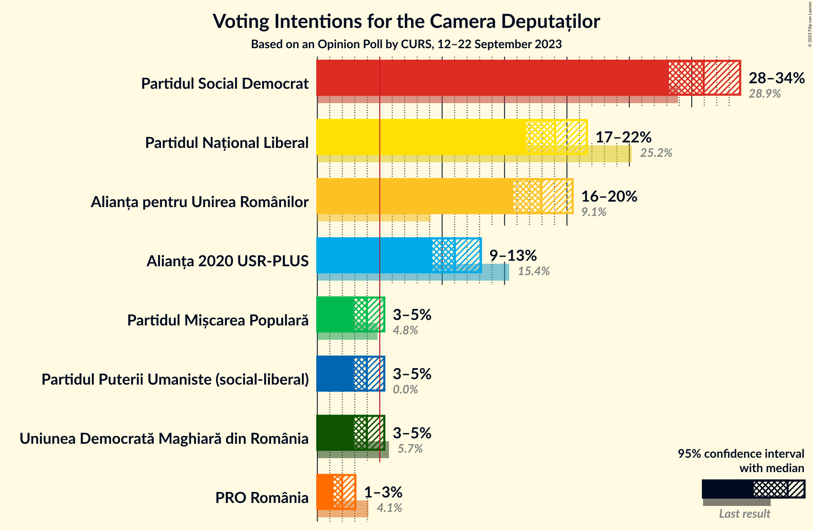

### Confidence Intervals

| Party | Last Result | Poll Result | 80% Confidence Interval | 90% Confidence Interval | 95% Confidence Interval | 99% Confidence Interval |
|:-----:|:-----------:|:-----------:|:-----------------------:|:-----------------------:|:-----------------------:|:-----------------------:|
| Partidul Social Democrat | 28.9% | 31.0% | 29.1–32.9% |28.6–33.4% |28.2–33.9% |27.3–34.8% |
| Partidul Național Liberal | 25.2% | 19.0% | 17.5–20.7% |17.1–21.2% |16.7–21.6% |16.0–22.4% |
| Alianța pentru Unirea Românilor | 9.1% | 18.0% | 16.5–19.6% |16.1–20.1% |15.7–20.5% |15.0–21.3% |
| Alianța 2020 USR-PLUS | 15.4% | 11.0% | 9.8–12.4% |9.5–12.8% |9.2–13.1% |8.7–13.8% |
| Partidul Puterii Umaniste (social-liberal) | 0.0% | 4.0% | 3.3–4.9% |3.1–5.1% |2.9–5.4% |2.6–5.8% |
| Uniunea Democrată Maghiară din România | 5.7% | 4.0% | 3.3–4.9% |3.1–5.1% |2.9–5.4% |2.6–5.8% |
| Partidul Mișcarea Populară | 4.8% | 4.0% | 3.3–4.9% |3.1–5.1% |2.9–5.4% |2.6–5.8% |
| PRO România | 4.1% | 2.0% | 1.5–2.7% |1.4–2.9% |1.3–3.0% |1.1–3.4% |

*Note:* The poll result column reflects the actual value used in the calculations. Published results may vary slightly, and in addition be rounded to fewer digits.

## Seats

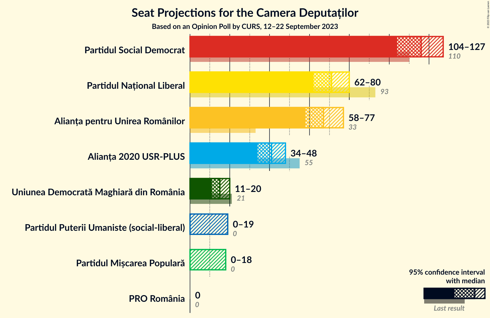

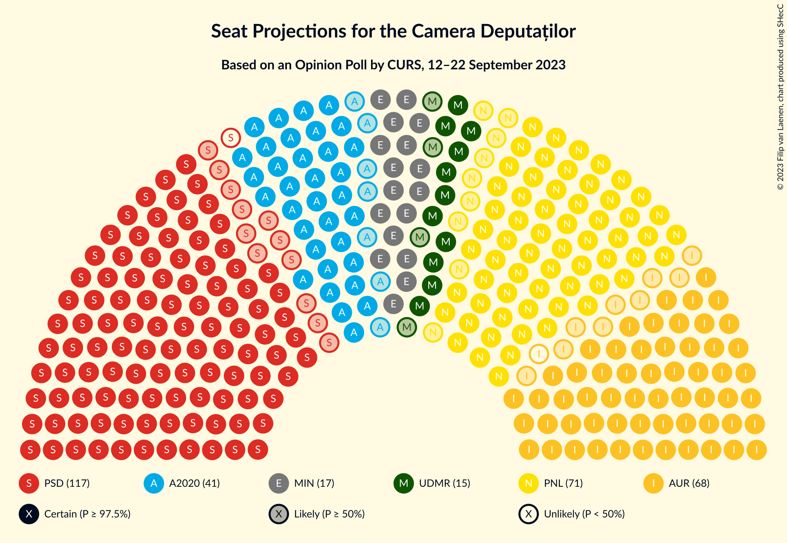

### Confidence Intervals

| Party | Last Result | Median | 80% Confidence Interval | 90% Confidence Interval | 95% Confidence Interval | 99% Confidence Interval |
|:-----:|:-----------:|:------:|:-----------------------:|:-----------------------:|:-----------------------:|:-----------------------:|
| <a href="#partidul-social-democrat">Partidul Social Democrat</a> | 110 | 116 | 108–123 |106–125 |104–127 |100–130 |
| <a href="#partidul-național-liberal">Partidul Național Liberal</a> | 93 | 71 | 65–77 |64–79 |62–80 |59–84 |
| <a href="#alianța-pentru-unirea-românilor">Alianța pentru Unirea Românilor</a> | 33 | 67 | 61–73 |60–75 |58–77 |55–80 |
| <a href="#alianța-2020-usr-plus">Alianța 2020 USR-PLUS</a> | 55 | 41 | 36–46 |35–47 |34–48 |32–51 |
| <a href="#partidul-puterii-umaniste-(social-liberal)">Partidul Puterii Umaniste (social-liberal)</a> | 0 | 0 | 0 |0–18 |0–19 |0–20 |
| <a href="#uniunea-democrată-maghiară-din-românia">Uniunea Democrată Maghiară din România</a> | 21 | 15 | 13–17 |12–18 |11–20 |9–22 |
| <a href="#partidul-mișcarea-populară">Partidul Mișcarea Populară</a> | 0 | 0 | 0 |0 |0–18 |0–20 |
| <a href="#pro-românia">PRO România</a> | 0 | 0 | 0 |0 |0 |0 |

### Partidul Social Democrat

*For a full overview of the results for this party, see the [Partidul Social Democrat](party-partidulsocialdemocrat.html) page.*

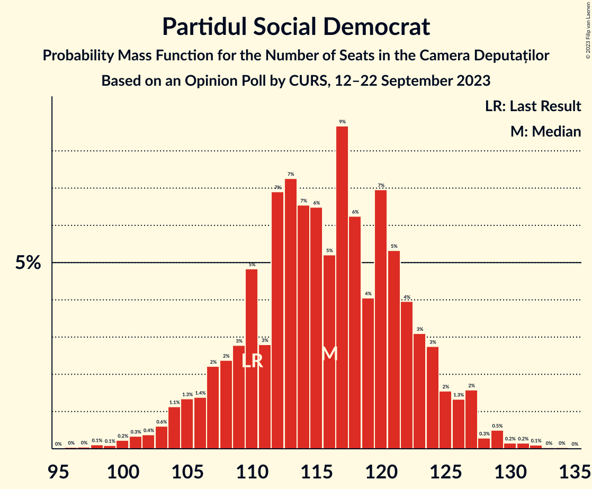

| Number of Seats | Probability | Accumulated | Special Marks |
|:---------------:|:-----------:|:-----------:|:-------------:|
| 96 | 0% | 100% |  |
| 97 | 0% | 99.9% |  |
| 98 | 0.1% | 99.9% |  |
| 99 | 0.1% | 99.8% |  |
| 100 | 0.2% | 99.7% |  |
| 101 | 0.3% | 99.4% |  |
| 102 | 0.4% | 99.1% |  |
| 103 | 0.6% | 98.7% |  |
| 104 | 1.1% | 98% |  |
| 105 | 1.3% | 97% |  |
| 106 | 1.4% | 96% |  |
| 107 | 2% | 94% |  |
| 108 | 2% | 92% |  |
| 109 | 3% | 90% |  |
| 110 | 5% | 87% | Last Result |
| 111 | 3% | 82% |  |
| 112 | 7% | 79% |  |
| 113 | 7% | 72% |  |
| 114 | 7% | 65% |  |
| 115 | 6% | 59% |  |
| 116 | 5% | 52% | Median |
| 117 | 9% | 47% |  |
| 118 | 6% | 38% |  |
| 119 | 4% | 32% |  |
| 120 | 7% | 28% |  |
| 121 | 5% | 21% |  |
| 122 | 4% | 16% |  |
| 123 | 3% | 12% |  |
| 124 | 3% | 9% |  |
| 125 | 2% | 6% |  |
| 126 | 1.3% | 4% |  |
| 127 | 2% | 3% |  |
| 128 | 0.3% | 1.3% |  |
| 129 | 0.5% | 1.0% |  |
| 130 | 0.2% | 0.5% |  |
| 131 | 0.2% | 0.4% |  |
| 132 | 0.1% | 0.2% |  |
| 133 | 0% | 0.1% |  |
| 134 | 0% | 0.1% |  |
| 135 | 0% | 0% |  |

### Partidul Național Liberal

*For a full overview of the results for this party, see the [Partidul Național Liberal](party-partidulnaționalliberal.html) page.*

| Number of Seats | Probability | Accumulated | Special Marks |
|:---------------:|:-----------:|:-----------:|:-------------:|
| 56 | 0.1% | 100% |  |
| 57 | 0.1% | 99.9% |  |
| 58 | 0.2% | 99.8% |  |
| 59 | 0.2% | 99.7% |  |
| 60 | 0.5% | 99.4% |  |
| 61 | 1.1% | 98.9% |  |
| 62 | 1.3% | 98% |  |
| 63 | 1.5% | 97% |  |
| 64 | 3% | 95% |  |
| 65 | 5% | 93% |  |
| 66 | 4% | 88% |  |
| 67 | 5% | 84% |  |
| 68 | 7% | 78% |  |
| 69 | 7% | 71% |  |
| 70 | 7% | 64% |  |
| 71 | 10% | 56% | Median |
| 72 | 9% | 46% |  |
| 73 | 5% | 36% |  |
| 74 | 8% | 31% |  |
| 75 | 8% | 23% |  |
| 76 | 3% | 16% |  |
| 77 | 4% | 13% |  |
| 78 | 3% | 10% |  |
| 79 | 2% | 6% |  |
| 80 | 2% | 4% |  |
| 81 | 0.8% | 2% |  |
| 82 | 0.6% | 1.4% |  |
| 83 | 0.3% | 0.8% |  |
| 84 | 0.2% | 0.5% |  |
| 85 | 0.1% | 0.3% |  |
| 86 | 0.1% | 0.2% |  |
| 87 | 0% | 0.1% |  |
| 88 | 0% | 0% |  |
| 89 | 0% | 0% |  |
| 90 | 0% | 0% |  |
| 91 | 0% | 0% |  |
| 92 | 0% | 0% |  |
| 93 | 0% | 0% | Last Result |

### Alianța pentru Unirea Românilor

*For a full overview of the results for this party, see the [Alianța pentru Unirea Românilor](party-alianțapentruunirearomânilor.html) page.*

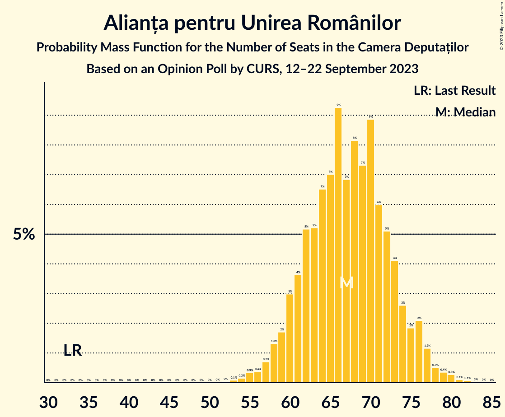

| Number of Seats | Probability | Accumulated | Special Marks |
|:---------------:|:-----------:|:-----------:|:-------------:|
| 33 | 0% | 100% | Last Result |
| 34 | 0% | 100% |  |
| 35 | 0% | 100% |  |
| 36 | 0% | 100% |  |
| 37 | 0% | 100% |  |
| 38 | 0% | 100% |  |
| 39 | 0% | 100% |  |
| 40 | 0% | 100% |  |
| 41 | 0% | 100% |  |
| 42 | 0% | 100% |  |
| 43 | 0% | 100% |  |
| 44 | 0% | 100% |  |
| 45 | 0% | 100% |  |
| 46 | 0% | 100% |  |
| 47 | 0% | 100% |  |
| 48 | 0% | 100% |  |
| 49 | 0% | 100% |  |
| 50 | 0% | 100% |  |
| 51 | 0% | 100% |  |
| 52 | 0% | 100% |  |
| 53 | 0.1% | 99.9% |  |
| 54 | 0.2% | 99.8% |  |
| 55 | 0.3% | 99.7% |  |
| 56 | 0.4% | 99.4% |  |
| 57 | 0.7% | 99.0% |  |
| 58 | 1.3% | 98% |  |
| 59 | 2% | 97% |  |
| 60 | 3% | 95% |  |
| 61 | 4% | 92% |  |
| 62 | 5% | 89% |  |
| 63 | 5% | 83% |  |
| 64 | 7% | 78% |  |
| 65 | 7% | 72% |  |
| 66 | 9% | 65% |  |
| 67 | 7% | 55% | Median |
| 68 | 8% | 49% |  |
| 69 | 7% | 40% |  |
| 70 | 9% | 33% |  |
| 71 | 6% | 24% |  |
| 72 | 5% | 18% |  |
| 73 | 4% | 13% |  |
| 74 | 3% | 9% |  |
| 75 | 2% | 6% |  |
| 76 | 2% | 5% |  |
| 77 | 1.2% | 3% |  |
| 78 | 0.5% | 1.4% |  |
| 79 | 0.4% | 0.9% |  |
| 80 | 0.3% | 0.5% |  |
| 81 | 0.1% | 0.2% |  |
| 82 | 0.1% | 0.1% |  |
| 83 | 0% | 0.1% |  |
| 84 | 0% | 0% |  |

### Alianța 2020 USR-PLUS

*For a full overview of the results for this party, see the [Alianța 2020 USR-PLUS](party-alianța2020usr-plus.html) page.*

| Number of Seats | Probability | Accumulated | Special Marks |
|:---------------:|:-----------:|:-----------:|:-------------:|
| 29 | 0% | 100% |  |
| 30 | 0.1% | 99.9% |  |
| 31 | 0.2% | 99.9% |  |
| 32 | 0.6% | 99.7% |  |
| 33 | 0.8% | 99.1% |  |
| 34 | 3% | 98% |  |
| 35 | 3% | 96% |  |
| 36 | 5% | 93% |  |
| 37 | 8% | 88% |  |
| 38 | 8% | 80% |  |
| 39 | 7% | 72% |  |
| 40 | 12% | 65% |  |
| 41 | 11% | 53% | Median |
| 42 | 11% | 42% |  |
| 43 | 7% | 31% |  |
| 44 | 7% | 24% |  |
| 45 | 5% | 16% |  |
| 46 | 4% | 11% |  |
| 47 | 3% | 7% |  |
| 48 | 2% | 4% |  |
| 49 | 0.9% | 2% |  |
| 50 | 0.5% | 1.5% |  |
| 51 | 0.5% | 1.0% |  |
| 52 | 0.3% | 0.5% |  |
| 53 | 0.1% | 0.2% |  |
| 54 | 0.1% | 0.1% |  |
| 55 | 0% | 0% | Last Result |

### Partidul Puterii Umaniste (social-liberal)

*For a full overview of the results for this party, see the [Partidul Puterii Umaniste (social-liberal)](party-partidulputeriiumanistesocial-liberal.html) page.*

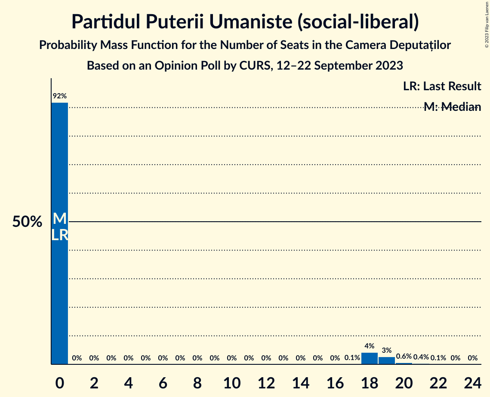

| Number of Seats | Probability | Accumulated | Special Marks |
|:---------------:|:-----------:|:-----------:|:-------------:|
| 0 | 92% | 100% | Last Result, Median |
| 1 | 0% | 8% |  |
| 2 | 0% | 8% |  |
| 3 | 0% | 8% |  |
| 4 | 0% | 8% |  |
| 5 | 0% | 8% |  |
| 6 | 0% | 8% |  |
| 7 | 0% | 8% |  |
| 8 | 0% | 8% |  |
| 9 | 0% | 8% |  |
| 10 | 0% | 8% |  |
| 11 | 0% | 8% |  |
| 12 | 0% | 8% |  |
| 13 | 0% | 8% |  |
| 14 | 0% | 8% |  |
| 15 | 0% | 8% |  |
| 16 | 0% | 8% |  |
| 17 | 0.1% | 8% |  |
| 18 | 4% | 8% |  |
| 19 | 3% | 4% |  |
| 20 | 0.6% | 1.1% |  |
| 21 | 0.4% | 0.5% |  |
| 22 | 0.1% | 0.1% |  |
| 23 | 0% | 0% |  |

### Uniunea Democrată Maghiară din România

*For a full overview of the results for this party, see the [Uniunea Democrată Maghiară din România](party-uniuneademocratămaghiarădinromânia.html) page.*

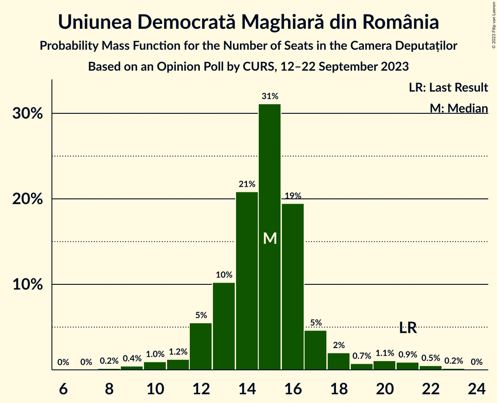

| Number of Seats | Probability | Accumulated | Special Marks |
|:---------------:|:-----------:|:-----------:|:-------------:|
| 8 | 0.2% | 100% |  |
| 9 | 0.4% | 99.8% |  |
| 10 | 1.0% | 99.4% |  |
| 11 | 1.2% | 98% |  |
| 12 | 5% | 97% |  |
| 13 | 10% | 92% |  |
| 14 | 21% | 81% |  |
| 15 | 31% | 61% | Median |
| 16 | 19% | 30% |  |
| 17 | 5% | 10% |  |
| 18 | 2% | 5% |  |
| 19 | 0.7% | 3% |  |
| 20 | 1.1% | 3% |  |
| 21 | 0.9% | 2% | Last Result |
| 22 | 0.5% | 0.7% |  |
| 23 | 0.2% | 0.2% |  |
| 24 | 0% | 0% |  |

### Partidul Mișcarea Populară

*For a full overview of the results for this party, see the [Partidul Mișcarea Populară](party-partidulmișcareapopulară.html) page.*

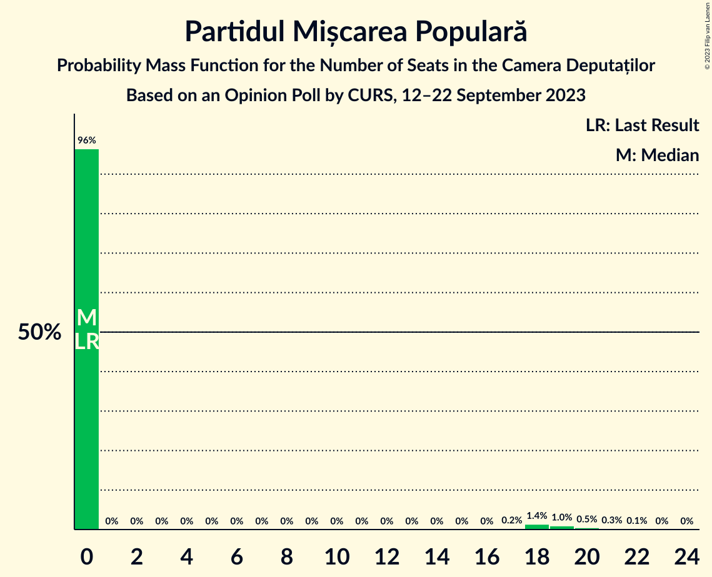

| Number of Seats | Probability | Accumulated | Special Marks |
|:---------------:|:-----------:|:-----------:|:-------------:|
| 0 | 96% | 100% | Last Result, Median |
| 1 | 0% | 4% |  |
| 2 | 0% | 4% |  |
| 3 | 0% | 4% |  |
| 4 | 0% | 4% |  |
| 5 | 0% | 4% |  |
| 6 | 0% | 4% |  |
| 7 | 0% | 4% |  |
| 8 | 0% | 4% |  |
| 9 | 0% | 4% |  |
| 10 | 0% | 4% |  |
| 11 | 0% | 4% |  |
| 12 | 0% | 4% |  |
| 13 | 0% | 4% |  |
| 14 | 0% | 4% |  |
| 15 | 0% | 4% |  |
| 16 | 0% | 4% |  |
| 17 | 0.2% | 4% |  |
| 18 | 1.4% | 3% |  |
| 19 | 1.0% | 2% |  |
| 20 | 0.5% | 0.9% |  |
| 21 | 0.3% | 0.4% |  |
| 22 | 0.1% | 0.2% |  |
| 23 | 0% | 0.1% |  |
| 24 | 0% | 0% |  |

### PRO România

*For a full overview of the results for this party, see the [PRO România](party-proromânia.html) page.*

| Number of Seats | Probability | Accumulated | Special Marks |
|:---------------:|:-----------:|:-----------:|:-------------:|
| 0 | 100% | 100% | Last Result, Median |

## Coalitions

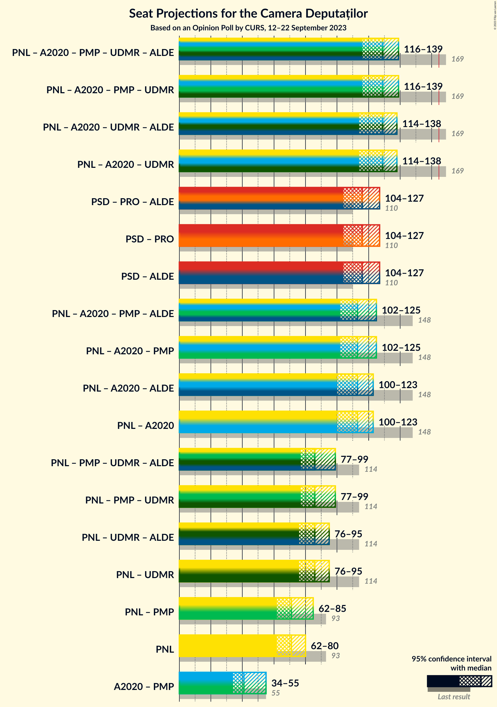

### Confidence Intervals

| Coalition | Last Result | Median | Majority? | 80% Confidence Interval | 90% Confidence Interval | 95% Confidence Interval | 99% Confidence Interval |
|:---------:|:-----------:|:------:|:---------:|:-----------------------:|:-----------------------:|:-----------------------:|:-----------------------:|
| Partidul Național Liberal – Alianța 2020 USR-PLUS – Partidul Mișcarea Populară – Uniunea Democrată Maghiară din România | 169 | 129 | 0% | 121–137 | 120–138 | 116–139 | 112–146 |
| Partidul Național Liberal – Alianța 2020 USR-PLUS – Uniunea Democrată Maghiară din România | 169 | 129 | 0% | 120–132 | 119–137 | 114–138 | 112–140 |
| Partidul Social Democrat – PRO România | 110 | 116 | 0% | 108–123 | 106–125 | 104–127 | 100–130 |
| Partidul Național Liberal – Alianța 2020 USR-PLUS – Partidul Mișcarea Populară | 148 | 113 | 0% | 105–121 | 104–123 | 102–125 | 97–131 |
| Partidul Național Liberal – Alianța 2020 USR-PLUS | 148 | 113 | 0% | 105–118 | 104–122 | 100–123 | 97–125 |
| Partidul Național Liberal – Partidul Mișcarea Populară – Uniunea Democrată Maghiară din România | 114 | 86 | 0% | 80–93 | 78–96 | 77–99 | 74–106 |
| Partidul Național Liberal – Uniunea Democrată Maghiară din România | 114 | 86 | 0% | 80–92 | 78–94 | 76–95 | 73–99 |
| Partidul Național Liberal – Partidul Mișcarea Populară | 93 | 71 | 0% | 65–78 | 64–81 | 62–85 | 60–91 |
| Partidul Național Liberal | 93 | 71 | 0% | 65–77 | 64–79 | 62–80 | 59–84 |
| Alianța 2020 USR-PLUS – Partidul Mișcarea Populară | 55 | 41 | 0% | 36–47 | 35–49 | 34–55 | 32–61 |

### Partidul Național Liberal – Alianța 2020 USR-PLUS – Partidul Mișcarea Populară – Uniunea Democrată Maghiară din România

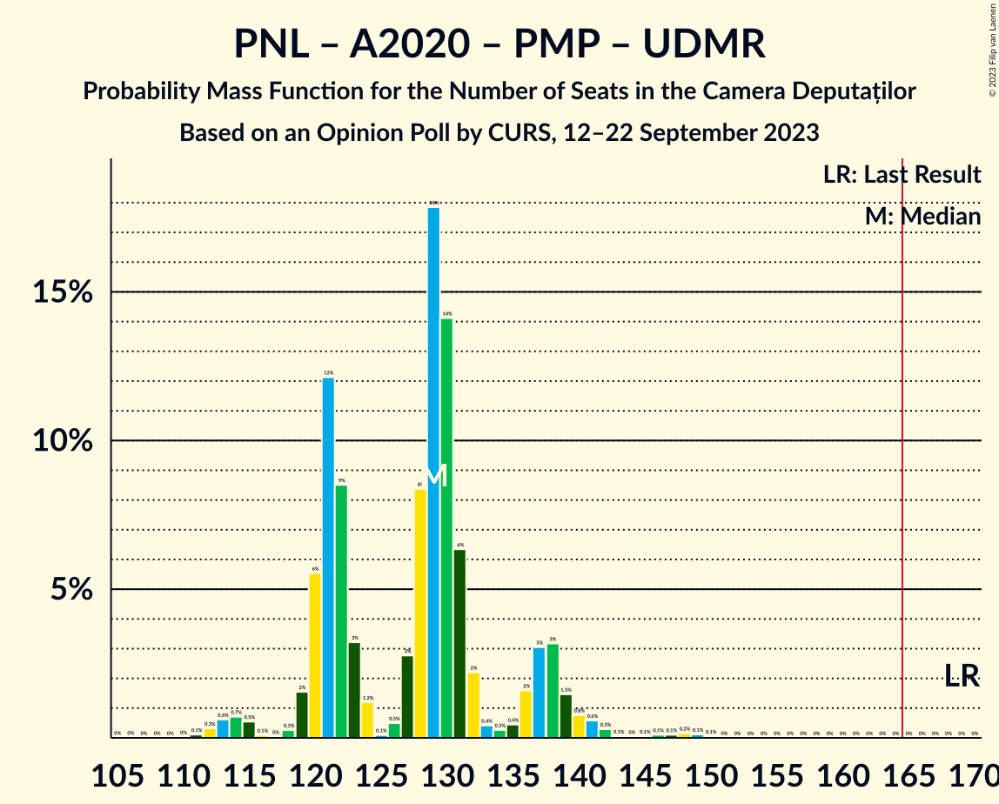

| Number of Seats | Probability | Accumulated | Special Marks |
|:---------------:|:-----------:|:-----------:|:-------------:|
| 105 | 0% | 100% |  |
| 106 | 0% | 99.9% |  |
| 107 | 0% | 99.9% |  |
| 108 | 0% | 99.9% |  |
| 109 | 0% | 99.9% |  |
| 110 | 0% | 99.9% |  |
| 111 | 0.1% | 99.9% |  |
| 112 | 0.3% | 99.8% |  |
| 113 | 0.6% | 99.4% |  |
| 114 | 0.7% | 98.8% |  |
| 115 | 0.5% | 98% |  |
| 116 | 0.1% | 98% |  |
| 117 | 0% | 97% |  |
| 118 | 0.3% | 97% |  |
| 119 | 2% | 97% |  |
| 120 | 6% | 96% |  |
| 121 | 12% | 90% |  |
| 122 | 9% | 78% |  |
| 123 | 3% | 69% |  |
| 124 | 1.2% | 66% |  |
| 125 | 0.1% | 65% |  |
| 126 | 0.5% | 65% |  |
| 127 | 3% | 64% | Median |
| 128 | 8% | 62% |  |
| 129 | 18% | 53% |  |
| 130 | 14% | 35% |  |
| 131 | 6% | 21% |  |
| 132 | 2% | 15% |  |
| 133 | 0.4% | 13% |  |
| 134 | 0.3% | 12% |  |
| 135 | 0.4% | 12% |  |
| 136 | 2% | 12% |  |
| 137 | 3% | 10% |  |
| 138 | 3% | 7% |  |
| 139 | 1.5% | 4% |  |
| 140 | 0.8% | 2% |  |
| 141 | 0.6% | 2% |  |
| 142 | 0.3% | 1.0% |  |
| 143 | 0.1% | 0.7% |  |
| 144 | 0% | 0.6% |  |
| 145 | 0.1% | 0.6% |  |
| 146 | 0.1% | 0.5% |  |
| 147 | 0.1% | 0.4% |  |
| 148 | 0.2% | 0.3% |  |
| 149 | 0.1% | 0.2% |  |
| 150 | 0.1% | 0.1% |  |
| 151 | 0% | 0% |  |
| 152 | 0% | 0% |  |
| 153 | 0% | 0% |  |
| 154 | 0% | 0% |  |
| 155 | 0% | 0% |  |
| 156 | 0% | 0% |  |
| 157 | 0% | 0% |  |
| 158 | 0% | 0% |  |
| 159 | 0% | 0% |  |
| 160 | 0% | 0% |  |
| 161 | 0% | 0% |  |
| 162 | 0% | 0% |  |
| 163 | 0% | 0% |  |
| 164 | 0% | 0% |  |
| 165 | 0% | 0% | Majority |
| 166 | 0% | 0% |  |
| 167 | 0% | 0% |  |
| 168 | 0% | 0% |  |
| 169 | 0% | 0% | Last Result |

### Partidul Național Liberal – Alianța 2020 USR-PLUS – Uniunea Democrată Maghiară din România

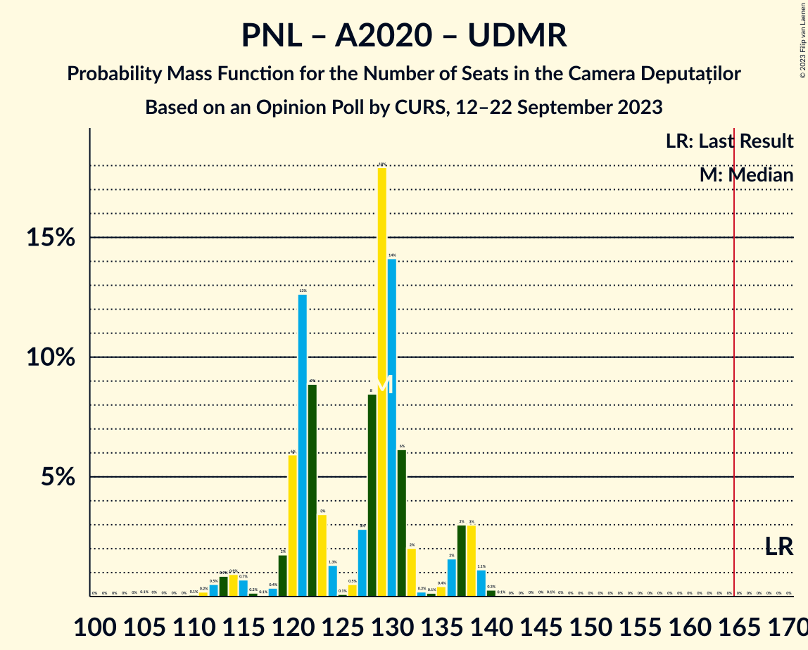

| Number of Seats | Probability | Accumulated | Special Marks |
|:---------------:|:-----------:|:-----------:|:-------------:|
| 104 | 0% | 100% |  |
| 105 | 0.1% | 99.9% |  |
| 106 | 0% | 99.9% |  |
| 107 | 0% | 99.8% |  |
| 108 | 0% | 99.8% |  |
| 109 | 0% | 99.8% |  |
| 110 | 0.1% | 99.8% |  |
| 111 | 0.2% | 99.7% |  |
| 112 | 0.5% | 99.5% |  |
| 113 | 0.9% | 99.0% |  |
| 114 | 0.9% | 98% |  |
| 115 | 0.7% | 97% |  |
| 116 | 0.2% | 97% |  |
| 117 | 0.1% | 96% |  |
| 118 | 0.4% | 96% |  |
| 119 | 2% | 96% |  |
| 120 | 6% | 94% |  |
| 121 | 13% | 88% |  |
| 122 | 9% | 76% |  |
| 123 | 3% | 67% |  |
| 124 | 1.3% | 63% |  |
| 125 | 0.1% | 62% |  |
| 126 | 0.5% | 62% |  |
| 127 | 3% | 61% | Median |
| 128 | 8% | 59% |  |
| 129 | 18% | 50% |  |
| 130 | 14% | 32% |  |
| 131 | 6% | 18% |  |
| 132 | 2% | 12% |  |
| 133 | 0.2% | 10% |  |
| 134 | 0.1% | 10% |  |
| 135 | 0.4% | 10% |  |
| 136 | 2% | 9% |  |
| 137 | 3% | 8% |  |
| 138 | 3% | 5% |  |
| 139 | 1.1% | 2% |  |
| 140 | 0.3% | 0.5% |  |
| 141 | 0.1% | 0.2% |  |
| 142 | 0% | 0.2% |  |
| 143 | 0% | 0.2% |  |
| 144 | 0% | 0.2% |  |
| 145 | 0% | 0.1% |  |
| 146 | 0.1% | 0.1% |  |
| 147 | 0% | 0% |  |
| 148 | 0% | 0% |  |
| 149 | 0% | 0% |  |
| 150 | 0% | 0% |  |
| 151 | 0% | 0% |  |
| 152 | 0% | 0% |  |
| 153 | 0% | 0% |  |
| 154 | 0% | 0% |  |
| 155 | 0% | 0% |  |
| 156 | 0% | 0% |  |
| 157 | 0% | 0% |  |
| 158 | 0% | 0% |  |
| 159 | 0% | 0% |  |
| 160 | 0% | 0% |  |
| 161 | 0% | 0% |  |
| 162 | 0% | 0% |  |
| 163 | 0% | 0% |  |
| 164 | 0% | 0% |  |
| 165 | 0% | 0% | Majority |
| 166 | 0% | 0% |  |
| 167 | 0% | 0% |  |
| 168 | 0% | 0% |  |
| 169 | 0% | 0% | Last Result |

### Partidul Social Democrat – PRO România

| Number of Seats | Probability | Accumulated | Special Marks |
|:---------------:|:-----------:|:-----------:|:-------------:|
| 96 | 0% | 100% |  |
| 97 | 0% | 99.9% |  |
| 98 | 0.1% | 99.9% |  |
| 99 | 0.1% | 99.8% |  |
| 100 | 0.2% | 99.7% |  |
| 101 | 0.3% | 99.4% |  |
| 102 | 0.4% | 99.1% |  |
| 103 | 0.6% | 98.7% |  |
| 104 | 1.1% | 98% |  |
| 105 | 1.3% | 97% |  |
| 106 | 1.4% | 96% |  |
| 107 | 2% | 94% |  |
| 108 | 2% | 92% |  |
| 109 | 3% | 90% |  |
| 110 | 5% | 87% | Last Result |
| 111 | 3% | 82% |  |
| 112 | 7% | 79% |  |
| 113 | 7% | 72% |  |
| 114 | 7% | 65% |  |
| 115 | 6% | 59% |  |
| 116 | 5% | 52% | Median |
| 117 | 9% | 47% |  |
| 118 | 6% | 38% |  |
| 119 | 4% | 32% |  |
| 120 | 7% | 28% |  |
| 121 | 5% | 21% |  |
| 122 | 4% | 16% |  |
| 123 | 3% | 12% |  |
| 124 | 3% | 9% |  |
| 125 | 2% | 6% |  |
| 126 | 1.3% | 4% |  |
| 127 | 2% | 3% |  |
| 128 | 0.3% | 1.3% |  |
| 129 | 0.5% | 1.0% |  |
| 130 | 0.2% | 0.5% |  |
| 131 | 0.2% | 0.4% |  |
| 132 | 0.1% | 0.2% |  |
| 133 | 0% | 0.1% |  |
| 134 | 0% | 0.1% |  |
| 135 | 0% | 0% |  |

### Partidul Național Liberal – Alianța 2020 USR-PLUS – Partidul Mișcarea Populară

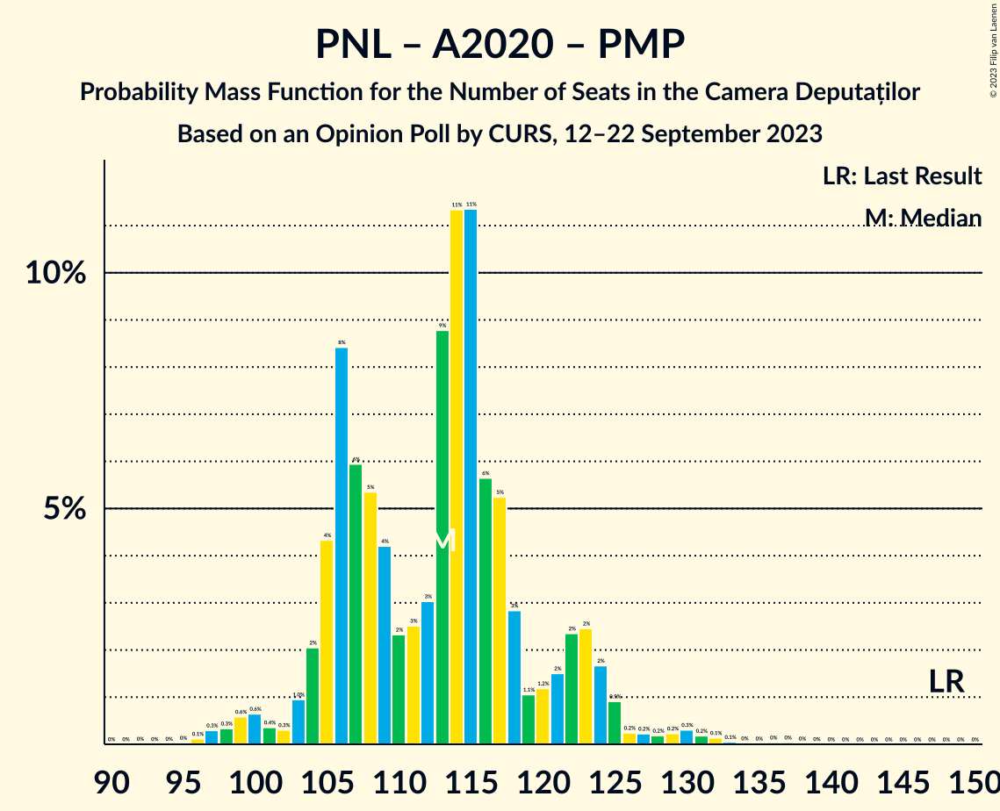

| Number of Seats | Probability | Accumulated | Special Marks |
|:---------------:|:-----------:|:-----------:|:-------------:|
| 91 | 0% | 100% |  |
| 92 | 0% | 99.9% |  |
| 93 | 0% | 99.9% |  |
| 94 | 0% | 99.9% |  |
| 95 | 0% | 99.9% |  |
| 96 | 0.1% | 99.9% |  |
| 97 | 0.3% | 99.8% |  |
| 98 | 0.3% | 99.5% |  |
| 99 | 0.6% | 99.1% |  |
| 100 | 0.6% | 98.5% |  |
| 101 | 0.4% | 98% |  |
| 102 | 0.3% | 98% |  |
| 103 | 1.0% | 97% |  |
| 104 | 2% | 96% |  |
| 105 | 4% | 94% |  |
| 106 | 8% | 90% |  |
| 107 | 6% | 81% |  |
| 108 | 5% | 76% |  |
| 109 | 4% | 70% |  |
| 110 | 2% | 66% |  |
| 111 | 3% | 64% |  |
| 112 | 3% | 61% | Median |
| 113 | 9% | 58% |  |
| 114 | 11% | 49% |  |
| 115 | 11% | 38% |  |
| 116 | 6% | 27% |  |
| 117 | 5% | 21% |  |
| 118 | 3% | 16% |  |
| 119 | 1.1% | 13% |  |
| 120 | 1.2% | 12% |  |
| 121 | 2% | 11% |  |
| 122 | 2% | 9% |  |
| 123 | 2% | 7% |  |
| 124 | 2% | 4% |  |
| 125 | 0.9% | 3% |  |
| 126 | 0.2% | 2% |  |
| 127 | 0.2% | 1.5% |  |
| 128 | 0.2% | 1.2% |  |
| 129 | 0.2% | 1.1% |  |
| 130 | 0.3% | 0.8% |  |
| 131 | 0.2% | 0.5% |  |
| 132 | 0.1% | 0.3% |  |
| 133 | 0.1% | 0.2% |  |
| 134 | 0% | 0.2% |  |
| 135 | 0% | 0.1% |  |
| 136 | 0% | 0.1% |  |
| 137 | 0% | 0.1% |  |
| 138 | 0% | 0% |  |
| 139 | 0% | 0% |  |
| 140 | 0% | 0% |  |
| 141 | 0% | 0% |  |
| 142 | 0% | 0% |  |
| 143 | 0% | 0% |  |
| 144 | 0% | 0% |  |
| 145 | 0% | 0% |  |
| 146 | 0% | 0% |  |
| 147 | 0% | 0% |  |
| 148 | 0% | 0% | Last Result |

### Partidul Național Liberal – Alianța 2020 USR-PLUS

| Number of Seats | Probability | Accumulated | Special Marks |
|:---------------:|:-----------:|:-----------:|:-------------:|
| 90 | 0% | 100% |  |
| 91 | 0% | 99.9% |  |
| 92 | 0% | 99.9% |  |
| 93 | 0% | 99.9% |  |
| 94 | 0% | 99.9% |  |
| 95 | 0.1% | 99.8% |  |
| 96 | 0.2% | 99.8% |  |
| 97 | 0.4% | 99.6% |  |
| 98 | 0.5% | 99.2% |  |
| 99 | 0.7% | 98.7% |  |
| 100 | 0.7% | 98% |  |
| 101 | 0.5% | 97% |  |
| 102 | 0.5% | 97% |  |
| 103 | 1.2% | 96% |  |
| 104 | 2% | 95% |  |
| 105 | 5% | 93% |  |
| 106 | 9% | 88% |  |
| 107 | 6% | 79% |  |
| 108 | 6% | 73% |  |
| 109 | 4% | 68% |  |
| 110 | 2% | 63% |  |
| 111 | 3% | 61% |  |
| 112 | 3% | 58% | Median |
| 113 | 9% | 55% |  |
| 114 | 11% | 46% |  |
| 115 | 11% | 35% |  |
| 116 | 6% | 23% |  |
| 117 | 5% | 18% |  |
| 118 | 3% | 13% |  |
| 119 | 1.0% | 10% |  |
| 120 | 1.1% | 9% |  |
| 121 | 1.3% | 8% |  |
| 122 | 2% | 7% |  |
| 123 | 2% | 4% |  |
| 124 | 1.3% | 2% |  |
| 125 | 0.7% | 1.1% |  |
| 126 | 0.2% | 0.4% |  |
| 127 | 0.1% | 0.2% |  |
| 128 | 0% | 0.2% |  |
| 129 | 0% | 0.1% |  |
| 130 | 0% | 0.1% |  |
| 131 | 0% | 0.1% |  |
| 132 | 0% | 0% |  |
| 133 | 0% | 0% |  |
| 134 | 0% | 0% |  |
| 135 | 0% | 0% |  |
| 136 | 0% | 0% |  |
| 137 | 0% | 0% |  |
| 138 | 0% | 0% |  |
| 139 | 0% | 0% |  |
| 140 | 0% | 0% |  |
| 141 | 0% | 0% |  |
| 142 | 0% | 0% |  |
| 143 | 0% | 0% |  |
| 144 | 0% | 0% |  |
| 145 | 0% | 0% |  |
| 146 | 0% | 0% |  |
| 147 | 0% | 0% |  |
| 148 | 0% | 0% | Last Result |

### Partidul Național Liberal – Partidul Mișcarea Populară – Uniunea Democrată Maghiară din România

| Number of Seats | Probability | Accumulated | Special Marks |
|:---------------:|:-----------:|:-----------:|:-------------:|
| 70 | 0.1% | 100% |  |
| 71 | 0% | 99.9% |  |
| 72 | 0.1% | 99.9% |  |
| 73 | 0.1% | 99.8% |  |
| 74 | 0.2% | 99.7% |  |
| 75 | 0.4% | 99.4% |  |
| 76 | 1.1% | 99.0% |  |
| 77 | 1.2% | 98% |  |
| 78 | 2% | 97% |  |
| 79 | 3% | 95% |  |
| 80 | 4% | 92% |  |
| 81 | 4% | 88% |  |
| 82 | 5% | 84% |  |
| 83 | 7% | 79% |  |
| 84 | 7% | 72% |  |
| 85 | 9% | 65% |  |
| 86 | 7% | 56% | Median |
| 87 | 8% | 50% |  |
| 88 | 7% | 41% |  |
| 89 | 8% | 34% |  |
| 90 | 7% | 26% |  |
| 91 | 3% | 19% |  |
| 92 | 4% | 16% |  |
| 93 | 3% | 12% |  |
| 94 | 3% | 9% |  |
| 95 | 1.2% | 6% |  |
| 96 | 0.9% | 5% |  |
| 97 | 0.8% | 4% |  |
| 98 | 0.6% | 3% |  |
| 99 | 0.4% | 3% |  |
| 100 | 0.3% | 2% |  |
| 101 | 0.3% | 2% |  |
| 102 | 0.2% | 2% |  |
| 103 | 0.3% | 2% |  |
| 104 | 0.4% | 1.2% |  |
| 105 | 0.2% | 0.8% |  |
| 106 | 0.2% | 0.6% |  |
| 107 | 0.1% | 0.4% |  |
| 108 | 0.1% | 0.3% |  |
| 109 | 0.1% | 0.2% |  |
| 110 | 0.1% | 0.1% |  |
| 111 | 0% | 0.1% |  |
| 112 | 0% | 0% |  |
| 113 | 0% | 0% |  |
| 114 | 0% | 0% | Last Result |

### Partidul Național Liberal – Uniunea Democrată Maghiară din România

| Number of Seats | Probability | Accumulated | Special Marks |
|:---------------:|:-----------:|:-----------:|:-------------:|
| 69 | 0% | 100% |  |
| 70 | 0.1% | 99.9% |  |
| 71 | 0.1% | 99.8% |  |
| 72 | 0.2% | 99.7% |  |
| 73 | 0.2% | 99.6% |  |
| 74 | 0.3% | 99.4% |  |
| 75 | 0.6% | 99.0% |  |
| 76 | 1.3% | 98% |  |
| 77 | 1.4% | 97% |  |
| 78 | 2% | 96% |  |
| 79 | 3% | 94% |  |
| 80 | 4% | 90% |  |
| 81 | 5% | 86% |  |
| 82 | 5% | 82% |  |
| 83 | 7% | 77% |  |
| 84 | 7% | 70% |  |
| 85 | 10% | 63% |  |
| 86 | 7% | 53% | Median |
| 87 | 8% | 47% |  |
| 88 | 7% | 38% |  |
| 89 | 8% | 31% |  |
| 90 | 7% | 22% |  |
| 91 | 3% | 16% |  |
| 92 | 4% | 13% |  |
| 93 | 3% | 9% |  |
| 94 | 2% | 6% |  |
| 95 | 1.1% | 3% |  |
| 96 | 0.8% | 2% |  |
| 97 | 0.6% | 2% |  |
| 98 | 0.4% | 0.9% |  |
| 99 | 0.2% | 0.6% |  |
| 100 | 0.1% | 0.4% |  |
| 101 | 0.1% | 0.2% |  |
| 102 | 0% | 0.1% |  |
| 103 | 0% | 0.1% |  |
| 104 | 0% | 0% |  |
| 105 | 0% | 0% |  |
| 106 | 0% | 0% |  |
| 107 | 0% | 0% |  |
| 108 | 0% | 0% |  |
| 109 | 0% | 0% |  |
| 110 | 0% | 0% |  |
| 111 | 0% | 0% |  |
| 112 | 0% | 0% |  |
| 113 | 0% | 0% |  |
| 114 | 0% | 0% | Last Result |

### Partidul Național Liberal – Partidul Mișcarea Populară

| Number of Seats | Probability | Accumulated | Special Marks |
|:---------------:|:-----------:|:-----------:|:-------------:|
| 56 | 0.1% | 100% |  |
| 57 | 0% | 99.9% |  |
| 58 | 0.1% | 99.9% |  |
| 59 | 0.2% | 99.8% |  |
| 60 | 0.4% | 99.6% |  |
| 61 | 0.9% | 99.2% |  |
| 62 | 1.1% | 98% |  |
| 63 | 1.3% | 97% |  |
| 64 | 2% | 96% |  |
| 65 | 4% | 94% |  |
| 66 | 4% | 89% |  |
| 67 | 5% | 85% |  |
| 68 | 7% | 80% |  |
| 69 | 7% | 73% |  |
| 70 | 7% | 66% |  |
| 71 | 10% | 59% | Median |
| 72 | 9% | 49% |  |
| 73 | 5% | 40% |  |
| 74 | 8% | 35% |  |
| 75 | 8% | 27% |  |
| 76 | 3% | 19% |  |
| 77 | 4% | 16% |  |
| 78 | 3% | 13% |  |
| 79 | 2% | 9% |  |
| 80 | 2% | 7% |  |
| 81 | 1.0% | 5% |  |
| 82 | 0.8% | 4% |  |
| 83 | 0.5% | 3% |  |
| 84 | 0.4% | 3% |  |
| 85 | 0.4% | 3% |  |
| 86 | 0.4% | 2% |  |
| 87 | 0.3% | 2% |  |
| 88 | 0.4% | 1.4% |  |
| 89 | 0.3% | 1.1% |  |
| 90 | 0.2% | 0.8% |  |
| 91 | 0.2% | 0.7% |  |
| 92 | 0.1% | 0.5% |  |
| 93 | 0.1% | 0.3% | Last Result |
| 94 | 0.1% | 0.2% |  |
| 95 | 0.1% | 0.1% |  |
| 96 | 0% | 0.1% |  |
| 97 | 0% | 0.1% |  |
| 98 | 0% | 0% |  |

### Partidul Național Liberal

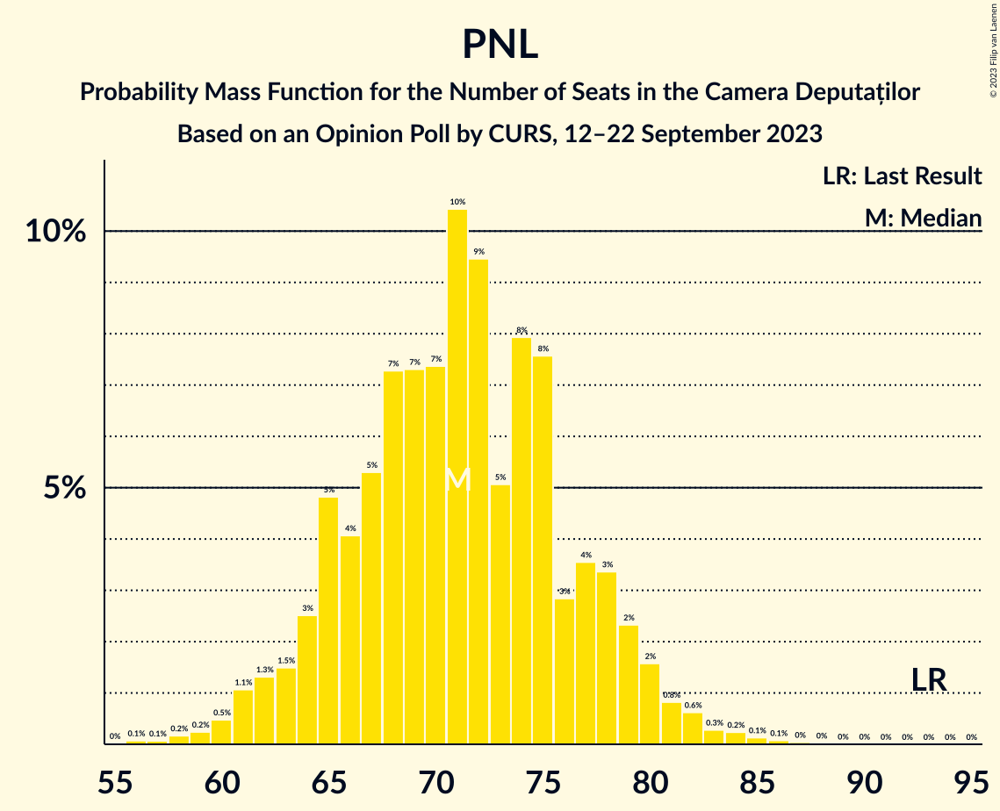

| Number of Seats | Probability | Accumulated | Special Marks |
|:---------------:|:-----------:|:-----------:|:-------------:|
| 56 | 0.1% | 100% |  |
| 57 | 0.1% | 99.9% |  |
| 58 | 0.2% | 99.8% |  |
| 59 | 0.2% | 99.7% |  |
| 60 | 0.5% | 99.4% |  |
| 61 | 1.1% | 98.9% |  |
| 62 | 1.3% | 98% |  |
| 63 | 1.5% | 97% |  |
| 64 | 3% | 95% |  |
| 65 | 5% | 93% |  |
| 66 | 4% | 88% |  |
| 67 | 5% | 84% |  |
| 68 | 7% | 78% |  |
| 69 | 7% | 71% |  |
| 70 | 7% | 64% |  |
| 71 | 10% | 56% | Median |
| 72 | 9% | 46% |  |
| 73 | 5% | 36% |  |
| 74 | 8% | 31% |  |
| 75 | 8% | 23% |  |
| 76 | 3% | 16% |  |
| 77 | 4% | 13% |  |
| 78 | 3% | 10% |  |
| 79 | 2% | 6% |  |
| 80 | 2% | 4% |  |
| 81 | 0.8% | 2% |  |
| 82 | 0.6% | 1.4% |  |
| 83 | 0.3% | 0.8% |  |
| 84 | 0.2% | 0.5% |  |
| 85 | 0.1% | 0.3% |  |
| 86 | 0.1% | 0.2% |  |
| 87 | 0% | 0.1% |  |
| 88 | 0% | 0% |  |
| 89 | 0% | 0% |  |
| 90 | 0% | 0% |  |
| 91 | 0% | 0% |  |
| 92 | 0% | 0% |  |
| 93 | 0% | 0% | Last Result |

### Alianța 2020 USR-PLUS – Partidul Mișcarea Populară

| Number of Seats | Probability | Accumulated | Special Marks |
|:---------------:|:-----------:|:-----------:|:-------------:|
| 29 | 0% | 100% |  |
| 30 | 0% | 99.9% |  |
| 31 | 0.1% | 99.9% |  |
| 32 | 0.5% | 99.8% |  |
| 33 | 0.7% | 99.3% |  |
| 34 | 2% | 98.6% |  |
| 35 | 3% | 96% |  |
| 36 | 4% | 93% |  |
| 37 | 8% | 89% |  |
| 38 | 7% | 81% |  |
| 39 | 7% | 74% |  |
| 40 | 11% | 67% |  |
| 41 | 11% | 56% | Median |
| 42 | 10% | 44% |  |
| 43 | 7% | 34% |  |
| 44 | 7% | 27% |  |
| 45 | 5% | 20% |  |
| 46 | 4% | 14% |  |
| 47 | 3% | 11% |  |
| 48 | 2% | 8% |  |
| 49 | 1.0% | 6% |  |
| 50 | 0.5% | 5% |  |
| 51 | 0.6% | 4% |  |
| 52 | 0.4% | 4% |  |
| 53 | 0.3% | 3% |  |
| 54 | 0.5% | 3% |  |
| 55 | 0.3% | 3% | Last Result |
| 56 | 0.4% | 2% |  |
| 57 | 0.3% | 2% |  |
| 58 | 0.3% | 2% |  |
| 59 | 0.3% | 1.4% |  |
| 60 | 0.3% | 1.1% |  |
| 61 | 0.2% | 0.7% |  |
| 62 | 0.2% | 0.5% |  |
| 63 | 0.1% | 0.3% |  |
| 64 | 0.1% | 0.2% |  |
| 65 | 0.1% | 0.1% |  |
| 66 | 0% | 0.1% |  |
| 67 | 0% | 0% |  |

## Technical Information

### Opinion Poll

+ **Polling firm:** CURS
+ **Commissioner(s):** —
+ **Fieldwork period:** 12–22 September 2023

### Calculations

+ **Sample size:** 1008
+ **Simulations done:** 1,048,576
+ **Error estimate:** 1.17%

