# Opinion Poll by INSCOP for News.ro, 15–22 September 2023

<a href="#voting-intentions">Voting Intentions</a> | <a href="#seats">Seats</a> | <a href="#coalitions">Coalitions</a> | <a href="#technical-information">Technical Information</a>

## Voting Intentions

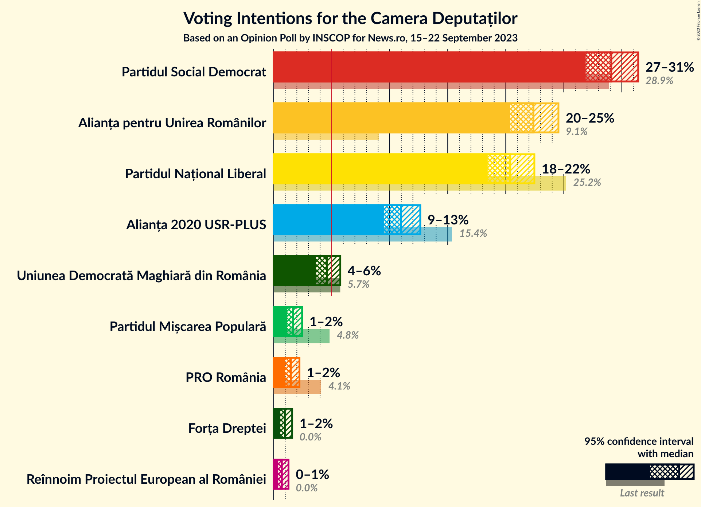

### Confidence Intervals

| Party | Last Result | Poll Result | 80% Confidence Interval | 90% Confidence Interval | 95% Confidence Interval | 99% Confidence Interval |
|:-----:|:-----------:|:-----------:|:-----------------------:|:-----------------------:|:-----------------------:|:-----------------------:|
| Partidul Social Democrat | 28.9% | 29.1% | 27.6–30.6% |27.2–31.0% |26.9–31.4% |26.2–32.1% |
| Alianța pentru Unirea Românilor | 9.1% | 22.4% | 21.1–23.8% |20.7–24.2% |20.4–24.5% |19.8–25.2% |
| Partidul Național Liberal | 25.2% | 20.4% | 19.1–21.7% |18.8–22.1% |18.4–22.5% |17.9–23.1% |
| Alianța 2020 USR-PLUS | 15.4% | 11.0% | 10.0–12.1% |9.7–12.4% |9.5–12.6% |9.1–13.2% |
| Uniunea Democrată Maghiară din România | 5.7% | 4.6% | 4.0–5.3% |3.8–5.6% |3.6–5.7% |3.4–6.1% |
| Partidul Mișcarea Populară | 4.8% | 1.7% | 1.3–2.2% |1.2–2.3% |1.1–2.5% |1.0–2.7% |
| PRO România | 4.1% | 1.5% | 1.2–2.0% |1.1–2.1% |1.0–2.2% |0.9–2.5% |
| Forța Dreptei | 0.0% | 1.0% | 0.7–1.4% |0.6–1.5% |0.6–1.6% |0.5–1.8% |
| Reînnoim Proiectul European al României | 0.0% | 0.7% | 0.5–1.1% |0.4–1.2% |0.4–1.3% |0.3–1.5% |

*Note:* The poll result column reflects the actual value used in the calculations. Published results may vary slightly, and in addition be rounded to fewer digits.

## Seats

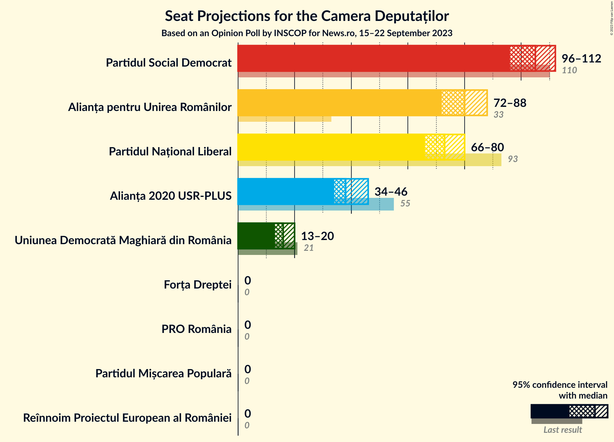

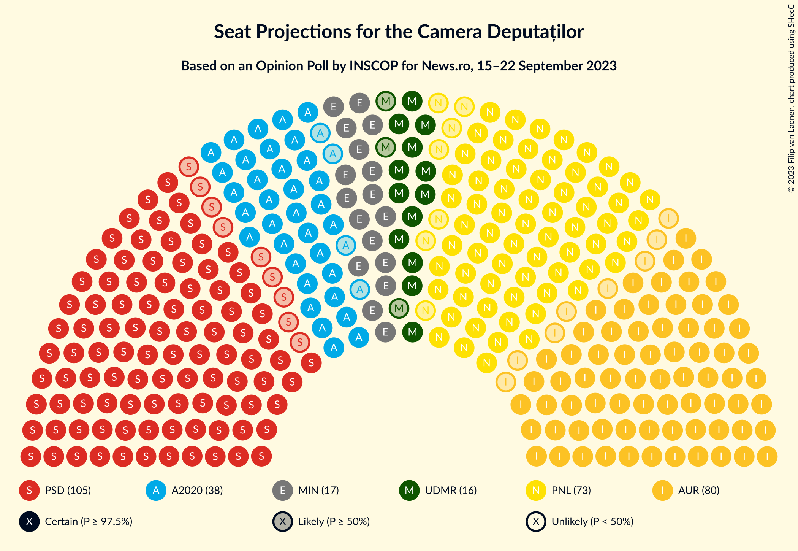

### Confidence Intervals

| Party | Last Result | Median | 80% Confidence Interval | 90% Confidence Interval | 95% Confidence Interval | 99% Confidence Interval |
|:-----:|:-----------:|:------:|:-----------------------:|:-----------------------:|:-----------------------:|:-----------------------:|
| <a href="#partidul-social-democrat">Partidul Social Democrat</a> | 110 | 105 | 98–109 |97–110 |96–112 |93–115 |
| <a href="#alianța-pentru-unirea-românilor">Alianța pentru Unirea Românilor</a> | 33 | 80 | 75–85 |74–86 |72–88 |71–89 |
| <a href="#partidul-național-liberal">Partidul Național Liberal</a> | 93 | 73 | 68–78 |67–79 |66–80 |64–83 |
| <a href="#alianța-2020-usr-plus">Alianța 2020 USR-PLUS</a> | 55 | 38 | 35–43 |34–45 |34–46 |33–47 |
| <a href="#uniunea-democrată-maghiară-din-românia">Uniunea Democrată Maghiară din România</a> | 21 | 16 | 14–19 |13–20 |13–20 |11–22 |
| <a href="#partidul-mișcarea-populară">Partidul Mișcarea Populară</a> | 0 | 0 | 0 |0 |0 |0 |
| <a href="#pro-românia">PRO România</a> | 0 | 0 | 0 |0 |0 |0 |
| <a href="#forța-dreptei">Forța Dreptei</a> | 0 | 0 | 0 |0 |0 |0 |
| <a href="#reînnoim-proiectul-european-al-româniei">Reînnoim Proiectul European al României</a> | 0 | 0 | 0 |0 |0 |0 |

### Partidul Social Democrat

*For a full overview of the results for this party, see the [Partidul Social Democrat](party-partidulsocialdemocrat.html) page.*

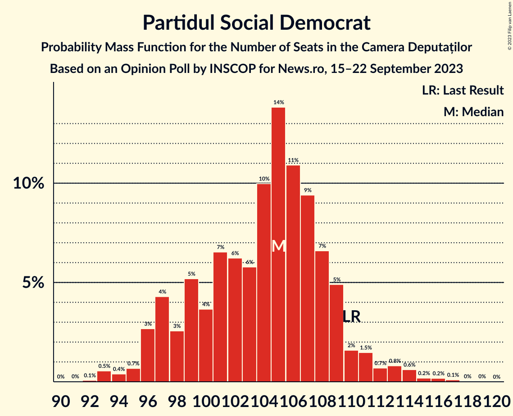

| Number of Seats | Probability | Accumulated | Special Marks |
|:---------------:|:-----------:|:-----------:|:-------------:|
| 92 | 0.1% | 100% |  |
| 93 | 0.5% | 99.9% |  |
| 94 | 0.4% | 99.3% |  |
| 95 | 0.7% | 98.9% |  |
| 96 | 3% | 98% |  |
| 97 | 4% | 96% |  |
| 98 | 3% | 91% |  |
| 99 | 5% | 89% |  |
| 100 | 4% | 84% |  |
| 101 | 7% | 80% |  |
| 102 | 6% | 73% |  |
| 103 | 6% | 67% |  |
| 104 | 10% | 61% |  |
| 105 | 14% | 51% | Median |
| 106 | 11% | 38% |  |
| 107 | 9% | 27% |  |
| 108 | 7% | 17% |  |
| 109 | 5% | 11% |  |
| 110 | 2% | 6% | Last Result |
| 111 | 1.5% | 4% |  |
| 112 | 0.7% | 3% |  |
| 113 | 0.8% | 2% |  |
| 114 | 0.6% | 1.1% |  |
| 115 | 0.2% | 0.5% |  |
| 116 | 0.2% | 0.3% |  |
| 117 | 0.1% | 0.2% |  |
| 118 | 0% | 0.1% |  |
| 119 | 0% | 0% |  |

### Alianța pentru Unirea Românilor

*For a full overview of the results for this party, see the [Alianța pentru Unirea Românilor](party-alianțapentruunirearomânilor.html) page.*

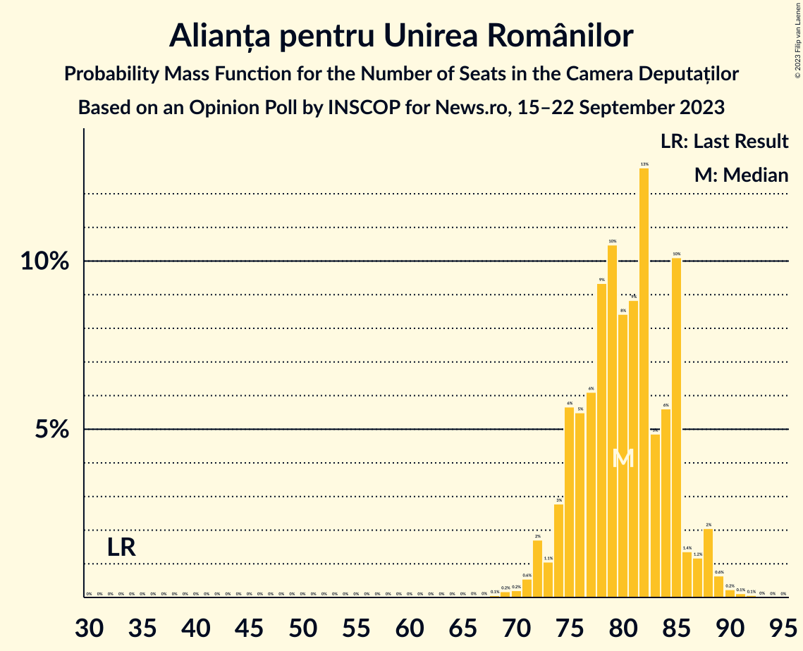

| Number of Seats | Probability | Accumulated | Special Marks |
|:---------------:|:-----------:|:-----------:|:-------------:|
| 33 | 0% | 100% | Last Result |
| 34 | 0% | 100% |  |
| 35 | 0% | 100% |  |
| 36 | 0% | 100% |  |
| 37 | 0% | 100% |  |
| 38 | 0% | 100% |  |
| 39 | 0% | 100% |  |
| 40 | 0% | 100% |  |
| 41 | 0% | 100% |  |
| 42 | 0% | 100% |  |
| 43 | 0% | 100% |  |
| 44 | 0% | 100% |  |
| 45 | 0% | 100% |  |
| 46 | 0% | 100% |  |
| 47 | 0% | 100% |  |
| 48 | 0% | 100% |  |
| 49 | 0% | 100% |  |
| 50 | 0% | 100% |  |
| 51 | 0% | 100% |  |
| 52 | 0% | 100% |  |
| 53 | 0% | 100% |  |
| 54 | 0% | 100% |  |
| 55 | 0% | 100% |  |
| 56 | 0% | 100% |  |
| 57 | 0% | 100% |  |
| 58 | 0% | 100% |  |
| 59 | 0% | 100% |  |
| 60 | 0% | 100% |  |
| 61 | 0% | 100% |  |
| 62 | 0% | 100% |  |
| 63 | 0% | 100% |  |
| 64 | 0% | 100% |  |
| 65 | 0% | 100% |  |
| 66 | 0% | 100% |  |
| 67 | 0% | 100% |  |
| 68 | 0.1% | 100% |  |
| 69 | 0.2% | 99.9% |  |
| 70 | 0.2% | 99.7% |  |
| 71 | 0.6% | 99.5% |  |
| 72 | 2% | 99.0% |  |
| 73 | 1.1% | 97% |  |
| 74 | 3% | 96% |  |
| 75 | 6% | 93% |  |
| 76 | 5% | 88% |  |
| 77 | 6% | 82% |  |
| 78 | 9% | 76% |  |
| 79 | 10% | 67% |  |
| 80 | 8% | 56% | Median |
| 81 | 9% | 48% |  |
| 82 | 13% | 39% |  |
| 83 | 5% | 26% |  |
| 84 | 6% | 21% |  |
| 85 | 10% | 16% |  |
| 86 | 1.4% | 6% |  |
| 87 | 1.2% | 4% |  |
| 88 | 2% | 3% |  |
| 89 | 0.6% | 1.1% |  |
| 90 | 0.2% | 0.5% |  |
| 91 | 0.1% | 0.2% |  |
| 92 | 0.1% | 0.1% |  |
| 93 | 0% | 0% |  |

### Partidul Național Liberal

*For a full overview of the results for this party, see the [Partidul Național Liberal](party-partidulnaționalliberal.html) page.*

| Number of Seats | Probability | Accumulated | Special Marks |
|:---------------:|:-----------:|:-----------:|:-------------:|
| 61 | 0% | 100% |  |
| 62 | 0.2% | 99.9% |  |
| 63 | 0.1% | 99.7% |  |
| 64 | 0.5% | 99.6% |  |
| 65 | 0.7% | 99.2% |  |
| 66 | 2% | 98% |  |
| 67 | 4% | 97% |  |
| 68 | 5% | 92% |  |
| 69 | 6% | 88% |  |
| 70 | 6% | 81% |  |
| 71 | 8% | 75% |  |
| 72 | 12% | 67% |  |
| 73 | 10% | 55% | Median |
| 74 | 12% | 45% |  |
| 75 | 9% | 33% |  |
| 76 | 6% | 24% |  |
| 77 | 6% | 18% |  |
| 78 | 4% | 12% |  |
| 79 | 4% | 8% |  |
| 80 | 3% | 4% |  |
| 81 | 0.5% | 1.4% |  |
| 82 | 0.4% | 0.9% |  |
| 83 | 0.2% | 0.5% |  |
| 84 | 0.2% | 0.3% |  |
| 85 | 0.1% | 0.1% |  |
| 86 | 0% | 0% |  |
| 87 | 0% | 0% |  |
| 88 | 0% | 0% |  |
| 89 | 0% | 0% |  |
| 90 | 0% | 0% |  |
| 91 | 0% | 0% |  |
| 92 | 0% | 0% |  |
| 93 | 0% | 0% | Last Result |

### Alianța 2020 USR-PLUS

*For a full overview of the results for this party, see the [Alianța 2020 USR-PLUS](party-alianța2020usr-plus.html) page.*

| Number of Seats | Probability | Accumulated | Special Marks |
|:---------------:|:-----------:|:-----------:|:-------------:|
| 30 | 0% | 100% |  |
| 31 | 0.1% | 99.9% |  |
| 32 | 0.3% | 99.8% |  |
| 33 | 1.0% | 99.5% |  |
| 34 | 5% | 98% |  |
| 35 | 6% | 93% |  |
| 36 | 13% | 87% |  |
| 37 | 15% | 75% |  |
| 38 | 16% | 60% | Median |
| 39 | 13% | 43% |  |
| 40 | 9% | 31% |  |
| 41 | 5% | 22% |  |
| 42 | 5% | 17% |  |
| 43 | 4% | 12% |  |
| 44 | 2% | 8% |  |
| 45 | 3% | 6% |  |
| 46 | 2% | 3% |  |
| 47 | 0.6% | 0.8% |  |
| 48 | 0.2% | 0.2% |  |
| 49 | 0% | 0.1% |  |
| 50 | 0% | 0% |  |
| 51 | 0% | 0% |  |
| 52 | 0% | 0% |  |
| 53 | 0% | 0% |  |
| 54 | 0% | 0% |  |
| 55 | 0% | 0% | Last Result |

### Uniunea Democrată Maghiară din România

*For a full overview of the results for this party, see the [Uniunea Democrată Maghiară din România](party-uniuneademocratămaghiarădinromânia.html) page.*

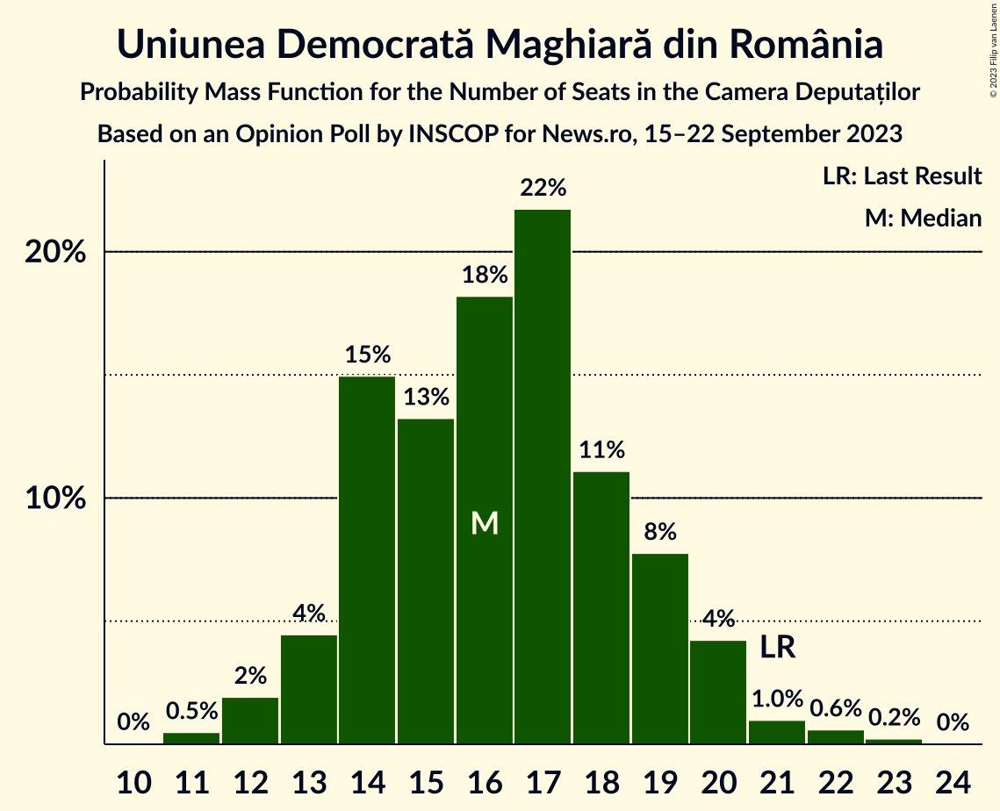

| Number of Seats | Probability | Accumulated | Special Marks |
|:---------------:|:-----------:|:-----------:|:-------------:|
| 11 | 0.5% | 100% |  |
| 12 | 2% | 99.5% |  |
| 13 | 4% | 98% |  |
| 14 | 15% | 93% |  |
| 15 | 13% | 78% |  |
| 16 | 18% | 65% | Median |
| 17 | 22% | 47% |  |
| 18 | 11% | 25% |  |
| 19 | 8% | 14% |  |
| 20 | 4% | 6% |  |
| 21 | 1.0% | 2% | Last Result |
| 22 | 0.6% | 0.9% |  |
| 23 | 0.2% | 0.3% |  |
| 24 | 0% | 0% |  |

### Partidul Mișcarea Populară

*For a full overview of the results for this party, see the [Partidul Mișcarea Populară](party-partidulmișcareapopulară.html) page.*

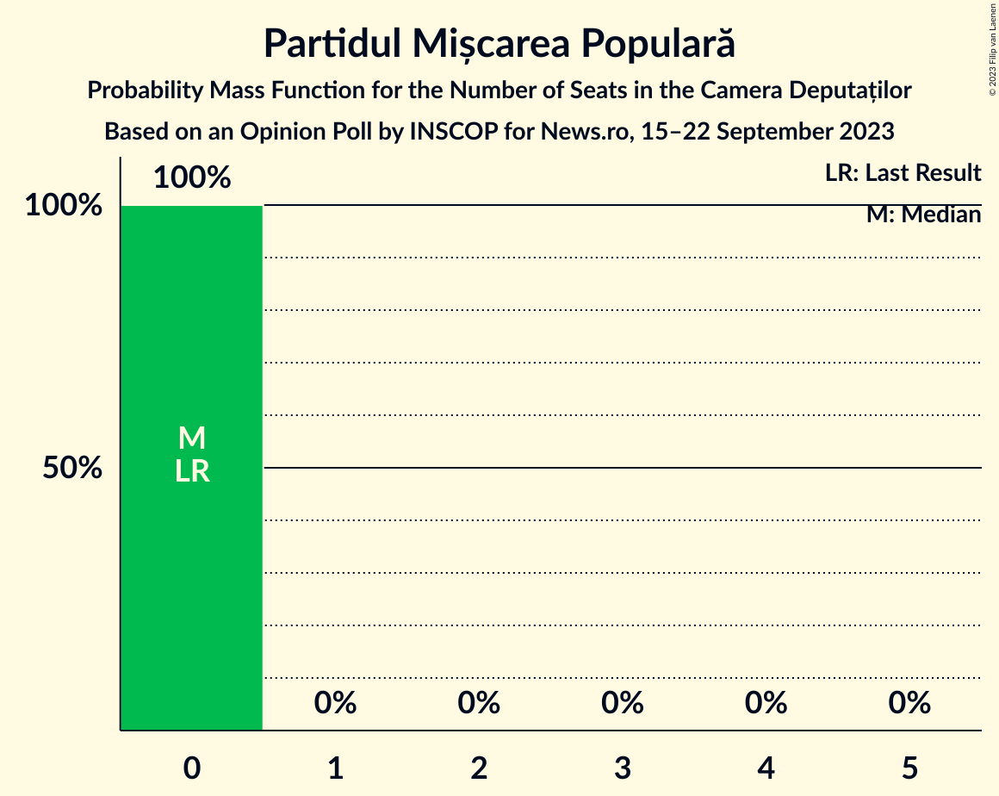

| Number of Seats | Probability | Accumulated | Special Marks |
|:---------------:|:-----------:|:-----------:|:-------------:|
| 0 | 100% | 100% | Last Result, Median |

### PRO România

*For a full overview of the results for this party, see the [PRO România](party-proromânia.html) page.*

| Number of Seats | Probability | Accumulated | Special Marks |
|:---------------:|:-----------:|:-----------:|:-------------:|
| 0 | 100% | 100% | Last Result, Median |

### Forța Dreptei

*For a full overview of the results for this party, see the [Forța Dreptei](party-forțadreptei.html) page.*

| Number of Seats | Probability | Accumulated | Special Marks |
|:---------------:|:-----------:|:-----------:|:-------------:|
| 0 | 100% | 100% | Last Result, Median |

### Reînnoim Proiectul European al României

*For a full overview of the results for this party, see the [Reînnoim Proiectul European al României](party-reînnoimproiectuleuropeanalromâniei.html) page.*

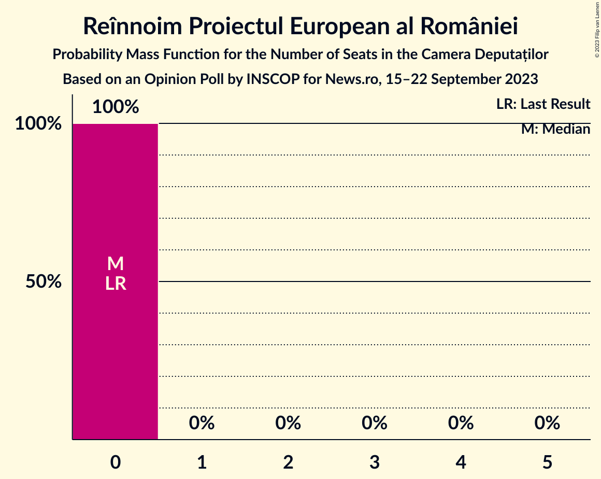

| Number of Seats | Probability | Accumulated | Special Marks |
|:---------------:|:-----------:|:-----------:|:-------------:|
| 0 | 100% | 100% | Last Result, Median |

## Coalitions

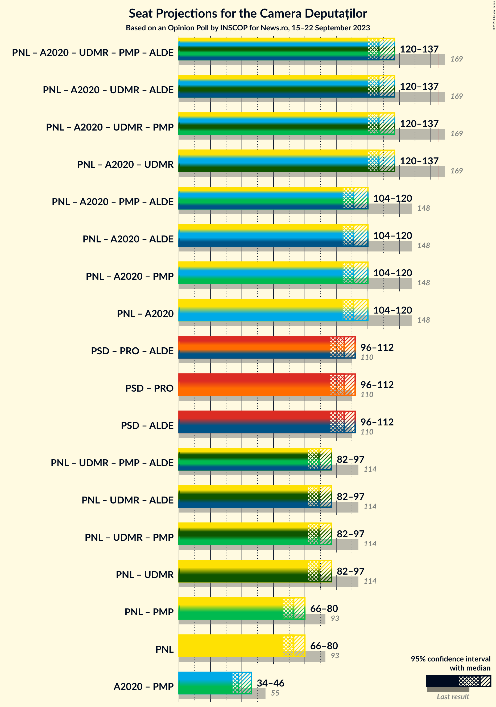

### Confidence Intervals

| Coalition | Last Result | Median | Majority? | 80% Confidence Interval | 90% Confidence Interval | 95% Confidence Interval | 99% Confidence Interval |
|:---------:|:-----------:|:------:|:---------:|:-----------------------:|:-----------------------:|:-----------------------:|:-----------------------:|
| Partidul Național Liberal – Alianța 2020 USR-PLUS – Uniunea Democrată Maghiară din România – Partidul Mișcarea Populară | 169 | 127 | 0% | 122–134 | 121–135 | 120–137 | 117–139 |
| Partidul Național Liberal – Alianța 2020 USR-PLUS – Uniunea Democrată Maghiară din România | 169 | 127 | 0% | 122–134 | 121–135 | 120–137 | 117–139 |
| Partidul Național Liberal – Alianța 2020 USR-PLUS – Partidul Mișcarea Populară | 148 | 111 | 0% | 106–118 | 105–119 | 104–120 | 101–123 |
| Partidul Național Liberal – Alianța 2020 USR-PLUS | 148 | 111 | 0% | 106–118 | 105–119 | 104–120 | 101–123 |
| Partidul Social Democrat – PRO România | 110 | 105 | 0% | 98–109 | 97–110 | 96–112 | 93–115 |
| Partidul Național Liberal – Uniunea Democrată Maghiară din România – Partidul Mișcarea Populară | 114 | 89 | 0% | 84–94 | 83–96 | 82–97 | 79–99 |
| Partidul Național Liberal – Uniunea Democrată Maghiară din România | 114 | 89 | 0% | 84–94 | 83–96 | 82–97 | 79–99 |
| Partidul Național Liberal – Partidul Mișcarea Populară | 93 | 73 | 0% | 68–78 | 67–79 | 66–80 | 64–83 |
| Partidul Național Liberal | 93 | 73 | 0% | 68–78 | 67–79 | 66–80 | 64–83 |
| Alianța 2020 USR-PLUS – Partidul Mișcarea Populară | 55 | 38 | 0% | 35–43 | 34–45 | 34–46 | 33–47 |

### Partidul Național Liberal – Alianța 2020 USR-PLUS – Uniunea Democrată Maghiară din România – Partidul Mișcarea Populară

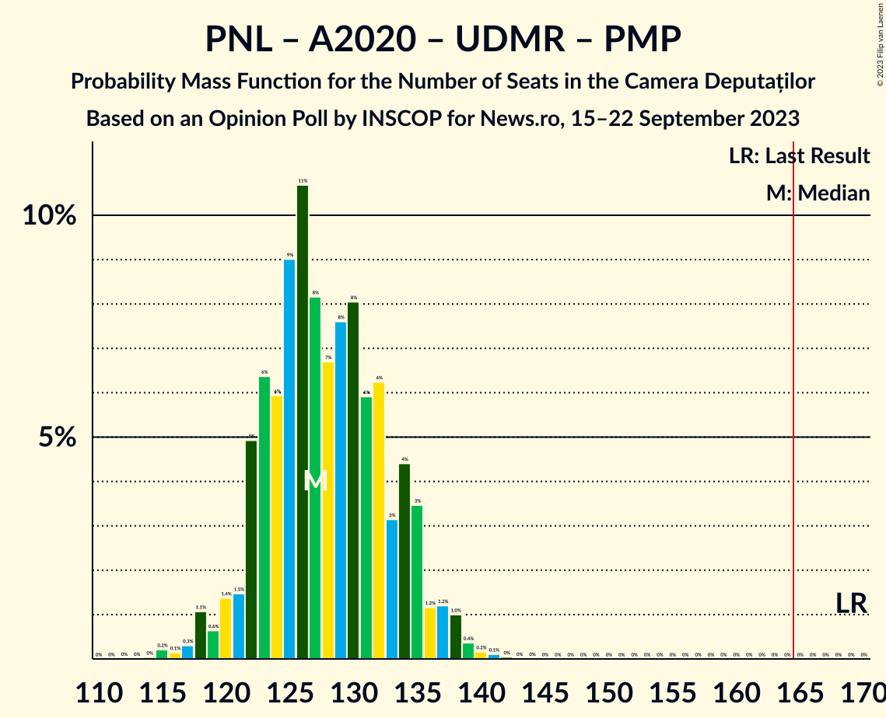

| Number of Seats | Probability | Accumulated | Special Marks |
|:---------------:|:-----------:|:-----------:|:-------------:|
| 114 | 0% | 100% |  |
| 115 | 0.2% | 99.9% |  |
| 116 | 0.1% | 99.7% |  |
| 117 | 0.3% | 99.6% |  |
| 118 | 1.1% | 99.3% |  |
| 119 | 0.6% | 98% |  |
| 120 | 1.4% | 98% |  |
| 121 | 1.5% | 96% |  |
| 122 | 5% | 95% |  |
| 123 | 6% | 90% |  |
| 124 | 6% | 83% |  |
| 125 | 9% | 77% |  |
| 126 | 11% | 68% |  |
| 127 | 8% | 58% | Median |
| 128 | 7% | 50% |  |
| 129 | 8% | 43% |  |
| 130 | 8% | 35% |  |
| 131 | 6% | 27% |  |
| 132 | 6% | 21% |  |
| 133 | 3% | 15% |  |
| 134 | 4% | 12% |  |
| 135 | 3% | 8% |  |
| 136 | 1.2% | 4% |  |
| 137 | 1.2% | 3% |  |
| 138 | 1.0% | 2% |  |
| 139 | 0.4% | 0.7% |  |
| 140 | 0.2% | 0.3% |  |
| 141 | 0.1% | 0.2% |  |
| 142 | 0% | 0.1% |  |
| 143 | 0% | 0% |  |
| 144 | 0% | 0% |  |
| 145 | 0% | 0% |  |
| 146 | 0% | 0% |  |
| 147 | 0% | 0% |  |
| 148 | 0% | 0% |  |
| 149 | 0% | 0% |  |
| 150 | 0% | 0% |  |
| 151 | 0% | 0% |  |
| 152 | 0% | 0% |  |
| 153 | 0% | 0% |  |
| 154 | 0% | 0% |  |
| 155 | 0% | 0% |  |
| 156 | 0% | 0% |  |
| 157 | 0% | 0% |  |
| 158 | 0% | 0% |  |
| 159 | 0% | 0% |  |
| 160 | 0% | 0% |  |
| 161 | 0% | 0% |  |
| 162 | 0% | 0% |  |
| 163 | 0% | 0% |  |
| 164 | 0% | 0% |  |
| 165 | 0% | 0% | Majority |
| 166 | 0% | 0% |  |
| 167 | 0% | 0% |  |
| 168 | 0% | 0% |  |
| 169 | 0% | 0% | Last Result |

### Partidul Național Liberal – Alianța 2020 USR-PLUS – Uniunea Democrată Maghiară din România

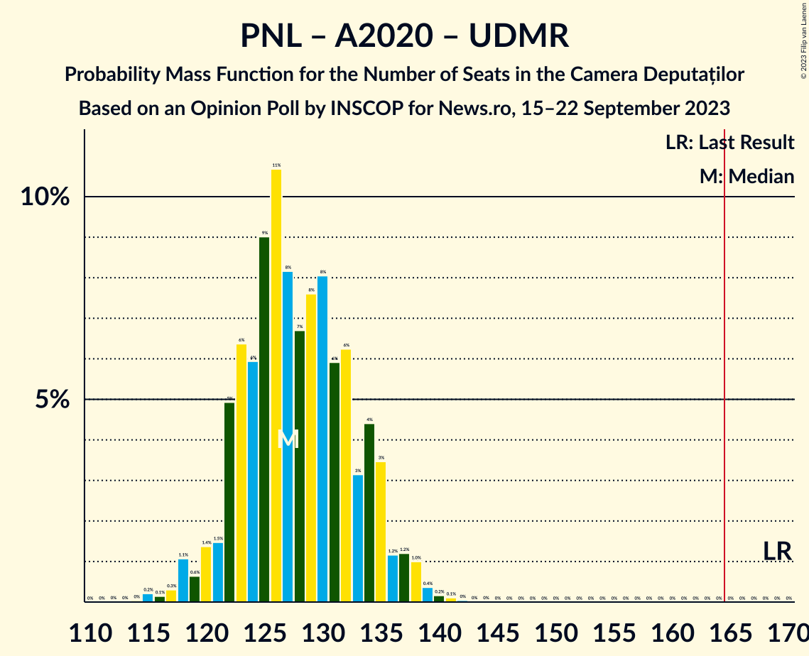

| Number of Seats | Probability | Accumulated | Special Marks |
|:---------------:|:-----------:|:-----------:|:-------------:|
| 114 | 0% | 100% |  |
| 115 | 0.2% | 99.9% |  |
| 116 | 0.1% | 99.7% |  |
| 117 | 0.3% | 99.6% |  |
| 118 | 1.1% | 99.3% |  |
| 119 | 0.6% | 98% |  |
| 120 | 1.4% | 98% |  |
| 121 | 1.5% | 96% |  |
| 122 | 5% | 95% |  |
| 123 | 6% | 90% |  |
| 124 | 6% | 83% |  |
| 125 | 9% | 77% |  |
| 126 | 11% | 68% |  |
| 127 | 8% | 58% | Median |
| 128 | 7% | 50% |  |
| 129 | 8% | 43% |  |
| 130 | 8% | 35% |  |
| 131 | 6% | 27% |  |
| 132 | 6% | 21% |  |
| 133 | 3% | 15% |  |
| 134 | 4% | 12% |  |
| 135 | 3% | 8% |  |
| 136 | 1.2% | 4% |  |
| 137 | 1.2% | 3% |  |
| 138 | 1.0% | 2% |  |
| 139 | 0.4% | 0.7% |  |
| 140 | 0.2% | 0.3% |  |
| 141 | 0.1% | 0.2% |  |
| 142 | 0% | 0.1% |  |
| 143 | 0% | 0% |  |
| 144 | 0% | 0% |  |
| 145 | 0% | 0% |  |
| 146 | 0% | 0% |  |
| 147 | 0% | 0% |  |
| 148 | 0% | 0% |  |
| 149 | 0% | 0% |  |
| 150 | 0% | 0% |  |
| 151 | 0% | 0% |  |
| 152 | 0% | 0% |  |
| 153 | 0% | 0% |  |
| 154 | 0% | 0% |  |
| 155 | 0% | 0% |  |
| 156 | 0% | 0% |  |
| 157 | 0% | 0% |  |
| 158 | 0% | 0% |  |
| 159 | 0% | 0% |  |
| 160 | 0% | 0% |  |
| 161 | 0% | 0% |  |
| 162 | 0% | 0% |  |
| 163 | 0% | 0% |  |
| 164 | 0% | 0% |  |
| 165 | 0% | 0% | Majority |
| 166 | 0% | 0% |  |
| 167 | 0% | 0% |  |
| 168 | 0% | 0% |  |
| 169 | 0% | 0% | Last Result |

### Partidul Național Liberal – Alianța 2020 USR-PLUS – Partidul Mișcarea Populară

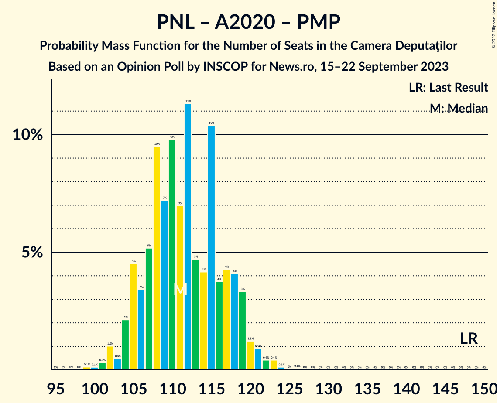

| Number of Seats | Probability | Accumulated | Special Marks |
|:---------------:|:-----------:|:-----------:|:-------------:|
| 99 | 0.1% | 100% |  |
| 100 | 0.1% | 99.8% |  |
| 101 | 0.3% | 99.7% |  |
| 102 | 1.0% | 99.4% |  |
| 103 | 0.5% | 98% |  |
| 104 | 2% | 98% |  |
| 105 | 5% | 96% |  |
| 106 | 3% | 91% |  |
| 107 | 5% | 88% |  |
| 108 | 10% | 83% |  |
| 109 | 7% | 73% |  |
| 110 | 10% | 66% |  |
| 111 | 7% | 56% | Median |
| 112 | 11% | 49% |  |
| 113 | 5% | 38% |  |
| 114 | 4% | 33% |  |
| 115 | 10% | 29% |  |
| 116 | 4% | 19% |  |
| 117 | 4% | 15% |  |
| 118 | 4% | 11% |  |
| 119 | 3% | 7% |  |
| 120 | 1.2% | 3% |  |
| 121 | 0.9% | 2% |  |
| 122 | 0.4% | 1.0% |  |
| 123 | 0.4% | 0.6% |  |
| 124 | 0.1% | 0.2% |  |
| 125 | 0% | 0.1% |  |
| 126 | 0.1% | 0.1% |  |
| 127 | 0% | 0% |  |
| 128 | 0% | 0% |  |
| 129 | 0% | 0% |  |
| 130 | 0% | 0% |  |
| 131 | 0% | 0% |  |
| 132 | 0% | 0% |  |
| 133 | 0% | 0% |  |
| 134 | 0% | 0% |  |
| 135 | 0% | 0% |  |
| 136 | 0% | 0% |  |
| 137 | 0% | 0% |  |
| 138 | 0% | 0% |  |
| 139 | 0% | 0% |  |
| 140 | 0% | 0% |  |
| 141 | 0% | 0% |  |
| 142 | 0% | 0% |  |
| 143 | 0% | 0% |  |
| 144 | 0% | 0% |  |
| 145 | 0% | 0% |  |
| 146 | 0% | 0% |  |
| 147 | 0% | 0% |  |
| 148 | 0% | 0% | Last Result |

### Partidul Național Liberal – Alianța 2020 USR-PLUS

| Number of Seats | Probability | Accumulated | Special Marks |
|:---------------:|:-----------:|:-----------:|:-------------:|
| 99 | 0.1% | 100% |  |
| 100 | 0.1% | 99.8% |  |
| 101 | 0.3% | 99.7% |  |
| 102 | 1.0% | 99.4% |  |
| 103 | 0.5% | 98% |  |
| 104 | 2% | 98% |  |
| 105 | 5% | 96% |  |
| 106 | 3% | 91% |  |
| 107 | 5% | 88% |  |
| 108 | 10% | 83% |  |
| 109 | 7% | 73% |  |
| 110 | 10% | 66% |  |
| 111 | 7% | 56% | Median |
| 112 | 11% | 49% |  |
| 113 | 5% | 38% |  |
| 114 | 4% | 33% |  |
| 115 | 10% | 29% |  |
| 116 | 4% | 19% |  |
| 117 | 4% | 15% |  |
| 118 | 4% | 11% |  |
| 119 | 3% | 7% |  |
| 120 | 1.2% | 3% |  |
| 121 | 0.9% | 2% |  |
| 122 | 0.4% | 1.0% |  |
| 123 | 0.4% | 0.6% |  |
| 124 | 0.1% | 0.2% |  |
| 125 | 0% | 0.1% |  |
| 126 | 0.1% | 0.1% |  |
| 127 | 0% | 0% |  |
| 128 | 0% | 0% |  |
| 129 | 0% | 0% |  |
| 130 | 0% | 0% |  |
| 131 | 0% | 0% |  |
| 132 | 0% | 0% |  |
| 133 | 0% | 0% |  |
| 134 | 0% | 0% |  |
| 135 | 0% | 0% |  |
| 136 | 0% | 0% |  |
| 137 | 0% | 0% |  |
| 138 | 0% | 0% |  |
| 139 | 0% | 0% |  |
| 140 | 0% | 0% |  |
| 141 | 0% | 0% |  |
| 142 | 0% | 0% |  |
| 143 | 0% | 0% |  |
| 144 | 0% | 0% |  |
| 145 | 0% | 0% |  |
| 146 | 0% | 0% |  |
| 147 | 0% | 0% |  |
| 148 | 0% | 0% | Last Result |

### Partidul Social Democrat – PRO România

| Number of Seats | Probability | Accumulated | Special Marks |
|:---------------:|:-----------:|:-----------:|:-------------:|
| 92 | 0.1% | 100% |  |
| 93 | 0.5% | 99.9% |  |
| 94 | 0.4% | 99.3% |  |
| 95 | 0.7% | 98.9% |  |
| 96 | 3% | 98% |  |
| 97 | 4% | 96% |  |
| 98 | 3% | 91% |  |
| 99 | 5% | 89% |  |
| 100 | 4% | 84% |  |
| 101 | 7% | 80% |  |
| 102 | 6% | 73% |  |
| 103 | 6% | 67% |  |
| 104 | 10% | 61% |  |
| 105 | 14% | 51% | Median |
| 106 | 11% | 38% |  |
| 107 | 9% | 27% |  |
| 108 | 7% | 17% |  |
| 109 | 5% | 11% |  |
| 110 | 2% | 6% | Last Result |
| 111 | 1.5% | 4% |  |
| 112 | 0.7% | 3% |  |
| 113 | 0.8% | 2% |  |
| 114 | 0.6% | 1.1% |  |
| 115 | 0.2% | 0.5% |  |
| 116 | 0.2% | 0.3% |  |
| 117 | 0.1% | 0.2% |  |
| 118 | 0% | 0.1% |  |
| 119 | 0% | 0% |  |

### Partidul Național Liberal – Uniunea Democrată Maghiară din România – Partidul Mișcarea Populară

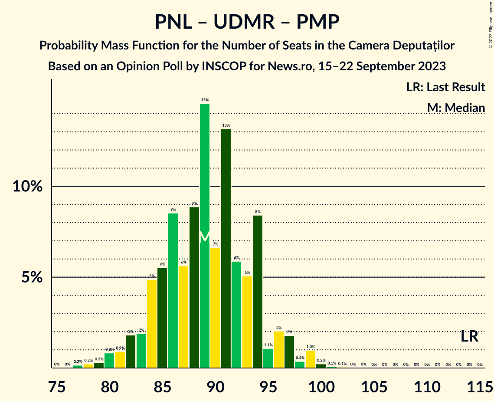

| Number of Seats | Probability | Accumulated | Special Marks |
|:---------------:|:-----------:|:-----------:|:-------------:|
| 77 | 0.2% | 100% |  |
| 78 | 0.2% | 99.8% |  |
| 79 | 0.3% | 99.6% |  |
| 80 | 0.8% | 99.3% |  |
| 81 | 0.9% | 98% |  |
| 82 | 2% | 98% |  |
| 83 | 2% | 96% |  |
| 84 | 5% | 94% |  |
| 85 | 6% | 89% |  |
| 86 | 9% | 83% |  |
| 87 | 6% | 75% |  |
| 88 | 9% | 69% |  |
| 89 | 15% | 60% | Median |
| 90 | 7% | 46% |  |
| 91 | 13% | 39% |  |
| 92 | 6% | 26% |  |
| 93 | 5% | 20% |  |
| 94 | 8% | 15% |  |
| 95 | 1.1% | 7% |  |
| 96 | 2% | 6% |  |
| 97 | 2% | 4% |  |
| 98 | 0.4% | 2% |  |
| 99 | 1.0% | 1.4% |  |
| 100 | 0.2% | 0.4% |  |
| 101 | 0.1% | 0.2% |  |
| 102 | 0.1% | 0.1% |  |
| 103 | 0% | 0% |  |
| 104 | 0% | 0% |  |
| 105 | 0% | 0% |  |
| 106 | 0% | 0% |  |
| 107 | 0% | 0% |  |
| 108 | 0% | 0% |  |
| 109 | 0% | 0% |  |
| 110 | 0% | 0% |  |
| 111 | 0% | 0% |  |
| 112 | 0% | 0% |  |
| 113 | 0% | 0% |  |
| 114 | 0% | 0% | Last Result |

### Partidul Național Liberal – Uniunea Democrată Maghiară din România

| Number of Seats | Probability | Accumulated | Special Marks |
|:---------------:|:-----------:|:-----------:|:-------------:|
| 77 | 0.2% | 100% |  |
| 78 | 0.2% | 99.8% |  |
| 79 | 0.3% | 99.6% |  |
| 80 | 0.8% | 99.3% |  |
| 81 | 0.9% | 98% |  |
| 82 | 2% | 98% |  |
| 83 | 2% | 96% |  |
| 84 | 5% | 94% |  |
| 85 | 6% | 89% |  |
| 86 | 9% | 83% |  |
| 87 | 6% | 75% |  |
| 88 | 9% | 69% |  |
| 89 | 15% | 60% | Median |
| 90 | 7% | 46% |  |
| 91 | 13% | 39% |  |
| 92 | 6% | 26% |  |
| 93 | 5% | 20% |  |
| 94 | 8% | 15% |  |
| 95 | 1.1% | 7% |  |
| 96 | 2% | 6% |  |
| 97 | 2% | 4% |  |
| 98 | 0.4% | 2% |  |
| 99 | 1.0% | 1.4% |  |
| 100 | 0.2% | 0.4% |  |
| 101 | 0.1% | 0.2% |  |
| 102 | 0.1% | 0.1% |  |
| 103 | 0% | 0% |  |
| 104 | 0% | 0% |  |
| 105 | 0% | 0% |  |
| 106 | 0% | 0% |  |
| 107 | 0% | 0% |  |
| 108 | 0% | 0% |  |
| 109 | 0% | 0% |  |
| 110 | 0% | 0% |  |
| 111 | 0% | 0% |  |
| 112 | 0% | 0% |  |
| 113 | 0% | 0% |  |
| 114 | 0% | 0% | Last Result |

### Partidul Național Liberal – Partidul Mișcarea Populară

| Number of Seats | Probability | Accumulated | Special Marks |
|:---------------:|:-----------:|:-----------:|:-------------:|
| 61 | 0% | 100% |  |
| 62 | 0.2% | 99.9% |  |
| 63 | 0.1% | 99.7% |  |
| 64 | 0.5% | 99.6% |  |
| 65 | 0.7% | 99.2% |  |
| 66 | 2% | 98% |  |
| 67 | 4% | 97% |  |
| 68 | 5% | 92% |  |
| 69 | 6% | 88% |  |
| 70 | 6% | 81% |  |
| 71 | 8% | 75% |  |
| 72 | 12% | 67% |  |
| 73 | 10% | 55% | Median |
| 74 | 12% | 45% |  |
| 75 | 9% | 33% |  |
| 76 | 6% | 24% |  |
| 77 | 6% | 18% |  |
| 78 | 4% | 12% |  |
| 79 | 4% | 8% |  |
| 80 | 3% | 4% |  |
| 81 | 0.5% | 1.4% |  |
| 82 | 0.4% | 0.9% |  |
| 83 | 0.2% | 0.5% |  |
| 84 | 0.2% | 0.3% |  |
| 85 | 0.1% | 0.1% |  |
| 86 | 0% | 0% |  |
| 87 | 0% | 0% |  |
| 88 | 0% | 0% |  |
| 89 | 0% | 0% |  |
| 90 | 0% | 0% |  |
| 91 | 0% | 0% |  |
| 92 | 0% | 0% |  |
| 93 | 0% | 0% | Last Result |

### Partidul Național Liberal

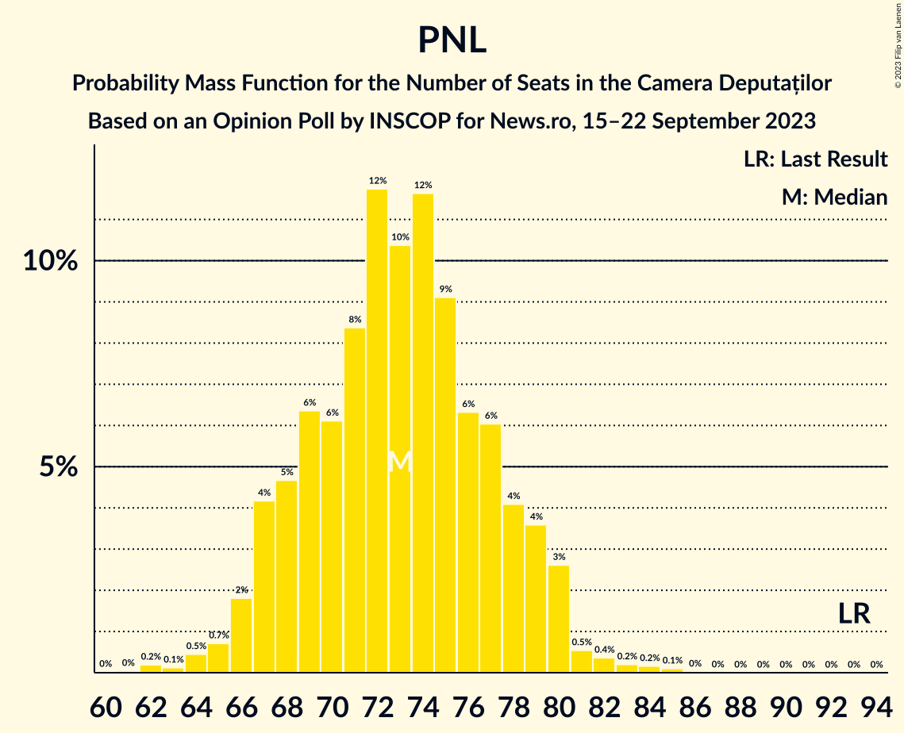

| Number of Seats | Probability | Accumulated | Special Marks |
|:---------------:|:-----------:|:-----------:|:-------------:|
| 61 | 0% | 100% |  |
| 62 | 0.2% | 99.9% |  |
| 63 | 0.1% | 99.7% |  |
| 64 | 0.5% | 99.6% |  |
| 65 | 0.7% | 99.2% |  |
| 66 | 2% | 98% |  |
| 67 | 4% | 97% |  |
| 68 | 5% | 92% |  |
| 69 | 6% | 88% |  |
| 70 | 6% | 81% |  |
| 71 | 8% | 75% |  |
| 72 | 12% | 67% |  |
| 73 | 10% | 55% | Median |
| 74 | 12% | 45% |  |
| 75 | 9% | 33% |  |
| 76 | 6% | 24% |  |
| 77 | 6% | 18% |  |
| 78 | 4% | 12% |  |
| 79 | 4% | 8% |  |
| 80 | 3% | 4% |  |
| 81 | 0.5% | 1.4% |  |
| 82 | 0.4% | 0.9% |  |
| 83 | 0.2% | 0.5% |  |
| 84 | 0.2% | 0.3% |  |
| 85 | 0.1% | 0.1% |  |
| 86 | 0% | 0% |  |
| 87 | 0% | 0% |  |
| 88 | 0% | 0% |  |
| 89 | 0% | 0% |  |
| 90 | 0% | 0% |  |
| 91 | 0% | 0% |  |
| 92 | 0% | 0% |  |
| 93 | 0% | 0% | Last Result |

### Alianța 2020 USR-PLUS – Partidul Mișcarea Populară

| Number of Seats | Probability | Accumulated | Special Marks |
|:---------------:|:-----------:|:-----------:|:-------------:|
| 30 | 0% | 100% |  |
| 31 | 0.1% | 99.9% |  |
| 32 | 0.3% | 99.8% |  |
| 33 | 1.0% | 99.5% |  |
| 34 | 5% | 98% |  |
| 35 | 6% | 93% |  |
| 36 | 13% | 87% |  |
| 37 | 15% | 75% |  |
| 38 | 16% | 60% | Median |
| 39 | 13% | 43% |  |
| 40 | 9% | 31% |  |
| 41 | 5% | 22% |  |
| 42 | 5% | 17% |  |
| 43 | 4% | 12% |  |
| 44 | 2% | 8% |  |
| 45 | 3% | 6% |  |
| 46 | 2% | 3% |  |
| 47 | 0.6% | 0.8% |  |
| 48 | 0.2% | 0.2% |  |
| 49 | 0% | 0.1% |  |
| 50 | 0% | 0% |  |
| 51 | 0% | 0% |  |
| 52 | 0% | 0% |  |
| 53 | 0% | 0% |  |
| 54 | 0% | 0% |  |
| 55 | 0% | 0% | Last Result |

## Technical Information

### Opinion Poll

+ **Polling firm:** INSCOP
+ **Commissioner(s):** News.ro
+ **Fieldwork period:** 15–22 September 2023

### Calculations

+ **Sample size:** 1550
+ **Simulations done:** 1,048,576
+ **Error estimate:** 1.22%

