# Opinion Poll by INSCOP for News.ro, 20–27 November 2023

<a href="#voting-intentions">Voting Intentions</a> | <a href="#seats">Seats</a> | <a href="#coalitions">Coalitions</a> | <a href="#technical-information">Technical Information</a>

## Voting Intentions

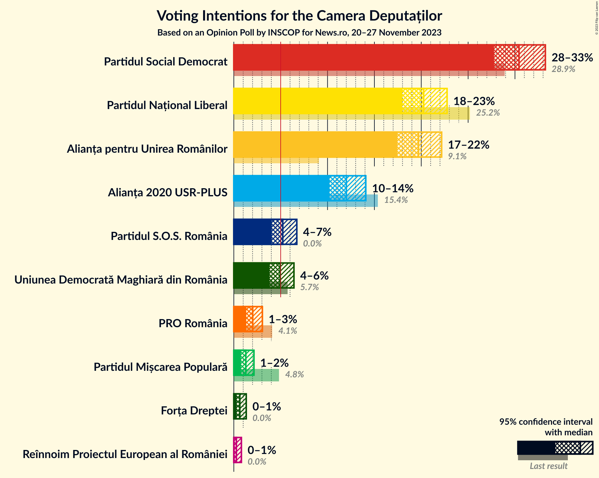

### Confidence Intervals

| Party | Last Result | Poll Result | 80% Confidence Interval | 90% Confidence Interval | 95% Confidence Interval | 99% Confidence Interval |
|:-----:|:-----------:|:-----------:|:-----------------------:|:-----------------------:|:-----------------------:|:-----------------------:|
| Partidul Social Democrat | 28.9% | 30.4% | 28.7–32.3% |28.2–32.8% |27.8–33.2% |26.9–34.1% |
| Partidul Național Liberal | 25.2% | 20.3% | 18.8–21.9% |18.3–22.3% |18.0–22.8% |17.3–23.5% |
| Alianța pentru Unirea Românilor | 9.1% | 19.7% | 18.2–21.3% |17.8–21.8% |17.5–22.2% |16.8–23.0% |
| Alianța 2020 USR-PLUS | 15.4% | 12.0% | 10.8–13.4% |10.5–13.7% |10.2–14.1% |9.7–14.8% |
| Partidul S.O.S. România | 0.0% | 5.2% | 4.5–6.2% |4.2–6.5% |4.1–6.7% |3.7–7.2% |
| Uniunea Democrată Maghiară din România | 5.7% | 4.9% | 4.2–5.9% |4.0–6.2% |3.8–6.4% |3.5–6.9% |
| PRO România | 4.1% | 2.0% | 1.6–2.7% |1.4–2.9% |1.3–3.0% |1.1–3.4% |
| Partidul Mișcarea Populară | 4.8% | 1.3% | 0.9–1.8% |0.8–2.0% |0.8–2.1% |0.6–2.5% |
| Forța Dreptei | 0.0% | 0.6% | 0.4–1.1% |0.4–1.2% |0.3–1.3% |0.2–1.6% |
| Reînnoim Proiectul European al României | 0.0% | 0.3% | 0.2–0.6% |0.1–0.7% |0.1–0.8% |0.1–1.0% |

*Note:* The poll result column reflects the actual value used in the calculations. Published results may vary slightly, and in addition be rounded to fewer digits.

## Seats

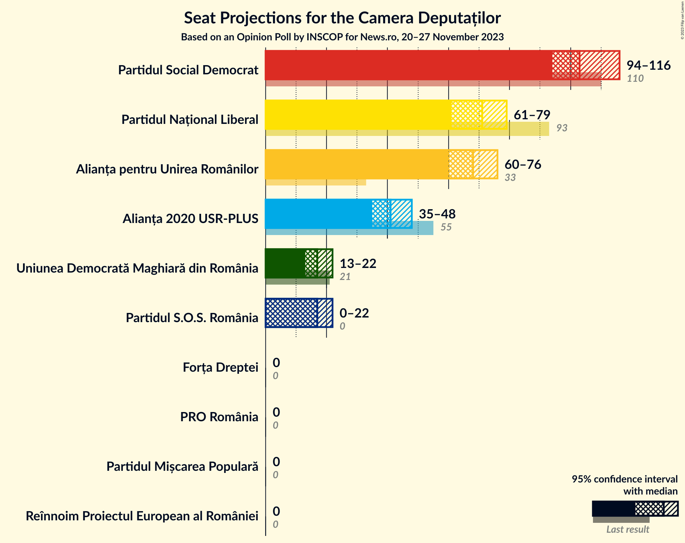

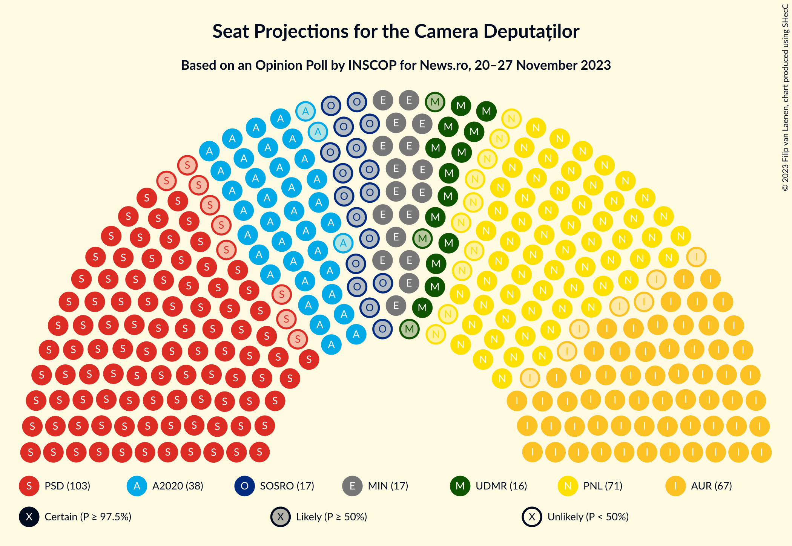

### Confidence Intervals

| Party | Last Result | Median | 80% Confidence Interval | 90% Confidence Interval | 95% Confidence Interval | 99% Confidence Interval |
|:-----:|:-----------:|:------:|:-----------------------:|:-----------------------:|:-----------------------:|:-----------------------:|
| <a href="#partidul-social-democrat">Partidul Social Democrat</a> | 110 | 103 | 96–111 |94–113 |94–116 |92–118 |
| <a href="#partidul-național-liberal">Partidul Național Liberal</a> | 93 | 71 | 65–76 |62–78 |61–79 |58–82 |
| <a href="#alianța-pentru-unirea-românilor">Alianța pentru Unirea Românilor</a> | 33 | 68 | 62–74 |60–75 |60–76 |57–80 |
| <a href="#alianța-2020-usr-plus">Alianța 2020 USR-PLUS</a> | 55 | 41 | 35–45 |35–47 |35–48 |33–50 |
| <a href="#partidul-s.o.s.-românia">Partidul S.O.S. România</a> | 0 | 17 | 0–20 |0–22 |0–22 |0–24 |
| <a href="#uniunea-democrată-maghiară-din-românia">Uniunea Democrată Maghiară din România</a> | 21 | 17 | 14–20 |13–20 |13–22 |12–23 |
| <a href="#pro-românia">PRO România</a> | 0 | 0 | 0 |0 |0 |0 |
| <a href="#partidul-mișcarea-populară">Partidul Mișcarea Populară</a> | 0 | 0 | 0 |0 |0 |0 |
| <a href="#forța-dreptei">Forța Dreptei</a> | 0 | 0 | 0 |0 |0 |0 |
| <a href="#reînnoim-proiectul-european-al-româniei">Reînnoim Proiectul European al României</a> | 0 | 0 | 0 |0 |0 |0 |

### Partidul Social Democrat

*For a full overview of the results for this party, see the [Partidul Social Democrat](party-partidulsocialdemocrat.html) page.*

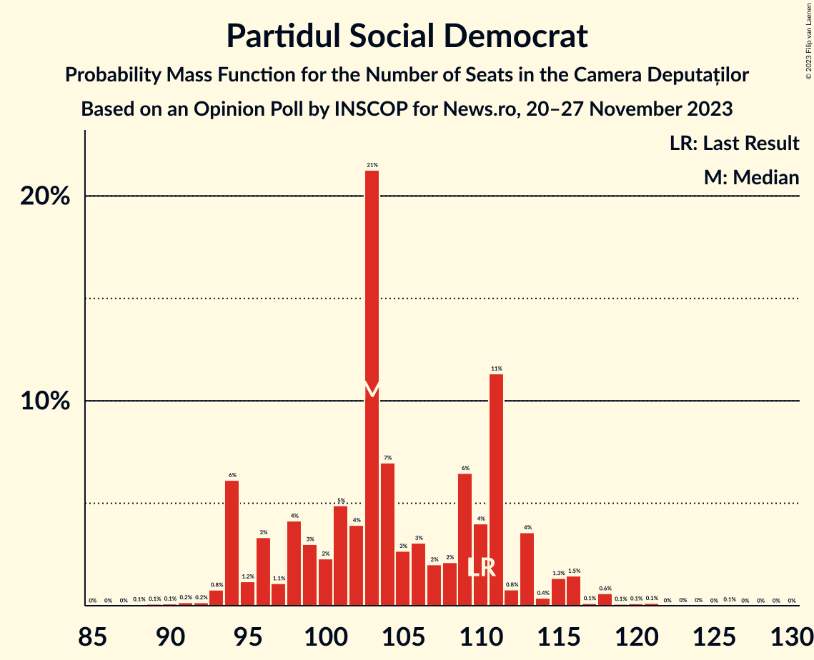

| Number of Seats | Probability | Accumulated | Special Marks |
|:---------------:|:-----------:|:-----------:|:-------------:|
| 88 | 0.1% | 100% |  |
| 89 | 0.1% | 99.9% |  |
| 90 | 0.1% | 99.8% |  |
| 91 | 0.2% | 99.7% |  |
| 92 | 0.2% | 99.6% |  |
| 93 | 0.8% | 99.4% |  |
| 94 | 6% | 98.6% |  |
| 95 | 1.2% | 92% |  |
| 96 | 3% | 91% |  |
| 97 | 1.1% | 88% |  |
| 98 | 4% | 87% |  |
| 99 | 3% | 83% |  |
| 100 | 2% | 80% |  |
| 101 | 5% | 77% |  |
| 102 | 4% | 73% |  |
| 103 | 21% | 69% | Median |
| 104 | 7% | 47% |  |
| 105 | 3% | 40% |  |
| 106 | 3% | 38% |  |
| 107 | 2% | 35% |  |
| 108 | 2% | 33% |  |
| 109 | 6% | 31% |  |
| 110 | 4% | 24% | Last Result |
| 111 | 11% | 20% |  |
| 112 | 0.8% | 9% |  |
| 113 | 4% | 8% |  |
| 114 | 0.4% | 4% |  |
| 115 | 1.3% | 4% |  |
| 116 | 1.5% | 3% |  |
| 117 | 0.1% | 1.2% |  |
| 118 | 0.6% | 1.0% |  |
| 119 | 0.1% | 0.4% |  |
| 120 | 0.1% | 0.4% |  |
| 121 | 0.1% | 0.3% |  |
| 122 | 0% | 0.1% |  |
| 123 | 0% | 0.1% |  |
| 124 | 0% | 0.1% |  |
| 125 | 0% | 0.1% |  |
| 126 | 0.1% | 0.1% |  |
| 127 | 0% | 0% |  |

### Partidul Național Liberal

*For a full overview of the results for this party, see the [Partidul Național Liberal](party-partidulnaționalliberal.html) page.*

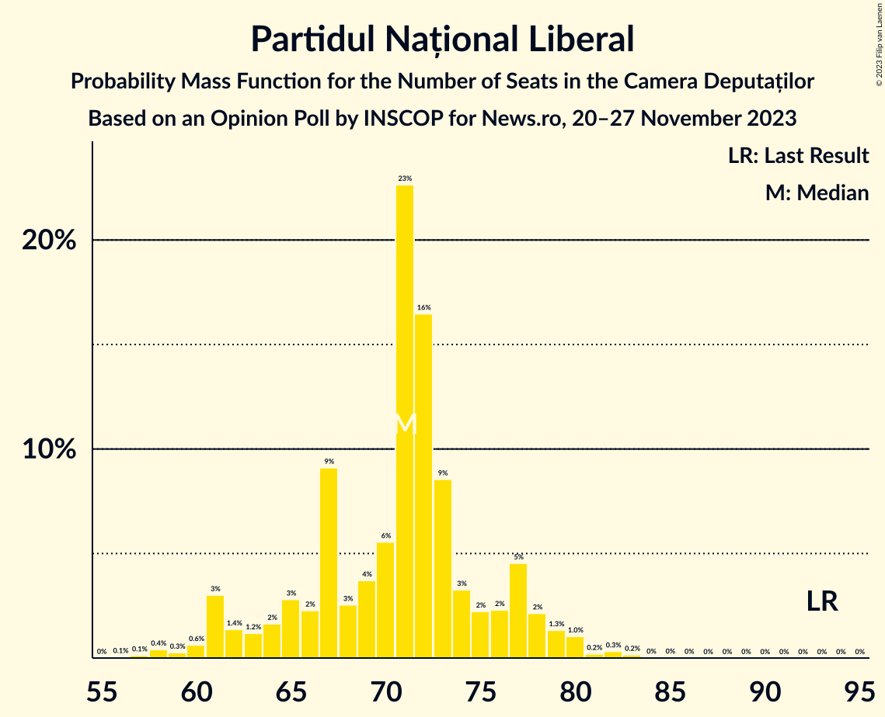

| Number of Seats | Probability | Accumulated | Special Marks |
|:---------------:|:-----------:|:-----------:|:-------------:|
| 56 | 0.1% | 100% |  |
| 57 | 0.1% | 99.9% |  |
| 58 | 0.4% | 99.8% |  |
| 59 | 0.3% | 99.4% |  |
| 60 | 0.6% | 99.1% |  |
| 61 | 3% | 98% |  |
| 62 | 1.4% | 95% |  |
| 63 | 1.2% | 94% |  |
| 64 | 2% | 93% |  |
| 65 | 3% | 91% |  |
| 66 | 2% | 88% |  |
| 67 | 9% | 86% |  |
| 68 | 3% | 77% |  |
| 69 | 4% | 75% |  |
| 70 | 6% | 71% |  |
| 71 | 23% | 65% | Median |
| 72 | 16% | 43% |  |
| 73 | 9% | 26% |  |
| 74 | 3% | 18% |  |
| 75 | 2% | 14% |  |
| 76 | 2% | 12% |  |
| 77 | 5% | 10% |  |
| 78 | 2% | 5% |  |
| 79 | 1.3% | 3% |  |
| 80 | 1.0% | 2% |  |
| 81 | 0.2% | 0.8% |  |
| 82 | 0.3% | 0.6% |  |
| 83 | 0.2% | 0.2% |  |
| 84 | 0% | 0.1% |  |
| 85 | 0% | 0.1% |  |
| 86 | 0% | 0% |  |
| 87 | 0% | 0% |  |
| 88 | 0% | 0% |  |
| 89 | 0% | 0% |  |
| 90 | 0% | 0% |  |
| 91 | 0% | 0% |  |
| 92 | 0% | 0% |  |
| 93 | 0% | 0% | Last Result |

### Alianța pentru Unirea Românilor

*For a full overview of the results for this party, see the [Alianța pentru Unirea Românilor](party-alianțapentruunirearomânilor.html) page.*

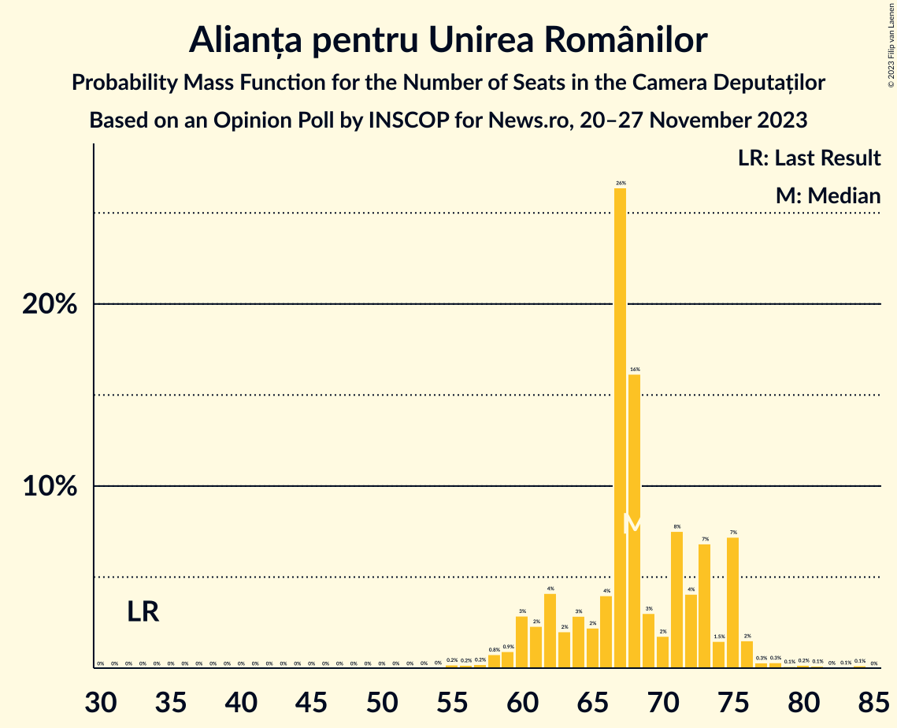

| Number of Seats | Probability | Accumulated | Special Marks |
|:---------------:|:-----------:|:-----------:|:-------------:|
| 33 | 0% | 100% | Last Result |
| 34 | 0% | 100% |  |
| 35 | 0% | 100% |  |
| 36 | 0% | 100% |  |
| 37 | 0% | 100% |  |
| 38 | 0% | 100% |  |
| 39 | 0% | 100% |  |
| 40 | 0% | 100% |  |
| 41 | 0% | 100% |  |
| 42 | 0% | 100% |  |
| 43 | 0% | 100% |  |
| 44 | 0% | 100% |  |
| 45 | 0% | 100% |  |
| 46 | 0% | 100% |  |
| 47 | 0% | 100% |  |
| 48 | 0% | 100% |  |
| 49 | 0% | 100% |  |
| 50 | 0% | 100% |  |
| 51 | 0% | 100% |  |
| 52 | 0% | 100% |  |
| 53 | 0% | 100% |  |
| 54 | 0% | 100% |  |
| 55 | 0.2% | 99.9% |  |
| 56 | 0.2% | 99.7% |  |
| 57 | 0.2% | 99.6% |  |
| 58 | 0.8% | 99.3% |  |
| 59 | 0.9% | 98.6% |  |
| 60 | 3% | 98% |  |
| 61 | 2% | 95% |  |
| 62 | 4% | 92% |  |
| 63 | 2% | 88% |  |
| 64 | 3% | 86% |  |
| 65 | 2% | 83% |  |
| 66 | 4% | 81% |  |
| 67 | 26% | 77% |  |
| 68 | 16% | 51% | Median |
| 69 | 3% | 35% |  |
| 70 | 2% | 32% |  |
| 71 | 8% | 30% |  |
| 72 | 4% | 22% |  |
| 73 | 7% | 18% |  |
| 74 | 1.5% | 11% |  |
| 75 | 7% | 10% |  |
| 76 | 2% | 3% |  |
| 77 | 0.3% | 1.3% |  |
| 78 | 0.3% | 1.0% |  |
| 79 | 0.1% | 0.6% |  |
| 80 | 0.2% | 0.5% |  |
| 81 | 0.1% | 0.4% |  |
| 82 | 0% | 0.2% |  |
| 83 | 0.1% | 0.2% |  |
| 84 | 0.1% | 0.2% |  |
| 85 | 0% | 0% |  |

### Alianța 2020 USR-PLUS

*For a full overview of the results for this party, see the [Alianța 2020 USR-PLUS](party-alianța2020usr-plus.html) page.*

| Number of Seats | Probability | Accumulated | Special Marks |
|:---------------:|:-----------:|:-----------:|:-------------:|
| 31 | 0.1% | 100% |  |
| 32 | 0.3% | 99.9% |  |
| 33 | 0.8% | 99.6% |  |
| 34 | 0.6% | 98.8% |  |
| 35 | 20% | 98% |  |
| 36 | 4% | 79% |  |
| 37 | 5% | 75% |  |
| 38 | 5% | 70% |  |
| 39 | 4% | 65% |  |
| 40 | 9% | 61% |  |
| 41 | 12% | 52% | Median |
| 42 | 6% | 41% |  |
| 43 | 8% | 35% |  |
| 44 | 5% | 27% |  |
| 45 | 13% | 22% |  |
| 46 | 1.1% | 9% |  |
| 47 | 5% | 8% |  |
| 48 | 1.1% | 3% |  |
| 49 | 0.6% | 1.5% |  |
| 50 | 0.5% | 0.9% |  |
| 51 | 0.1% | 0.3% |  |
| 52 | 0.1% | 0.2% |  |
| 53 | 0% | 0.1% |  |
| 54 | 0% | 0.1% |  |
| 55 | 0% | 0% | Last Result |

### Partidul S.O.S. România

*For a full overview of the results for this party, see the [Partidul S.O.S. România](party-partidulsosromânia.html) page.*

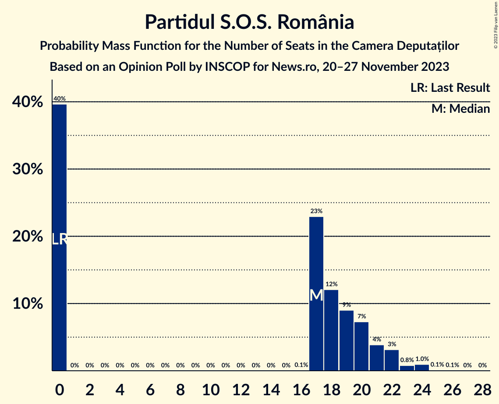

| Number of Seats | Probability | Accumulated | Special Marks |
|:---------------:|:-----------:|:-----------:|:-------------:|
| 0 | 40% | 100% | Last Result |
| 1 | 0% | 60% |  |
| 2 | 0% | 60% |  |
| 3 | 0% | 60% |  |
| 4 | 0% | 60% |  |
| 5 | 0% | 60% |  |
| 6 | 0% | 60% |  |
| 7 | 0% | 60% |  |
| 8 | 0% | 60% |  |
| 9 | 0% | 60% |  |
| 10 | 0% | 60% |  |
| 11 | 0% | 60% |  |
| 12 | 0% | 60% |  |
| 13 | 0% | 60% |  |
| 14 | 0% | 60% |  |
| 15 | 0% | 60% |  |
| 16 | 0.1% | 60% |  |
| 17 | 23% | 60% | Median |
| 18 | 12% | 37% |  |
| 19 | 9% | 25% |  |
| 20 | 7% | 16% |  |
| 21 | 4% | 9% |  |
| 22 | 3% | 5% |  |
| 23 | 0.8% | 2% |  |
| 24 | 1.0% | 1.1% |  |
| 25 | 0.1% | 0.2% |  |
| 26 | 0.1% | 0.1% |  |
| 27 | 0% | 0% |  |

### Uniunea Democrată Maghiară din România

*For a full overview of the results for this party, see the [Uniunea Democrată Maghiară din România](party-uniuneademocratămaghiarădinromânia.html) page.*

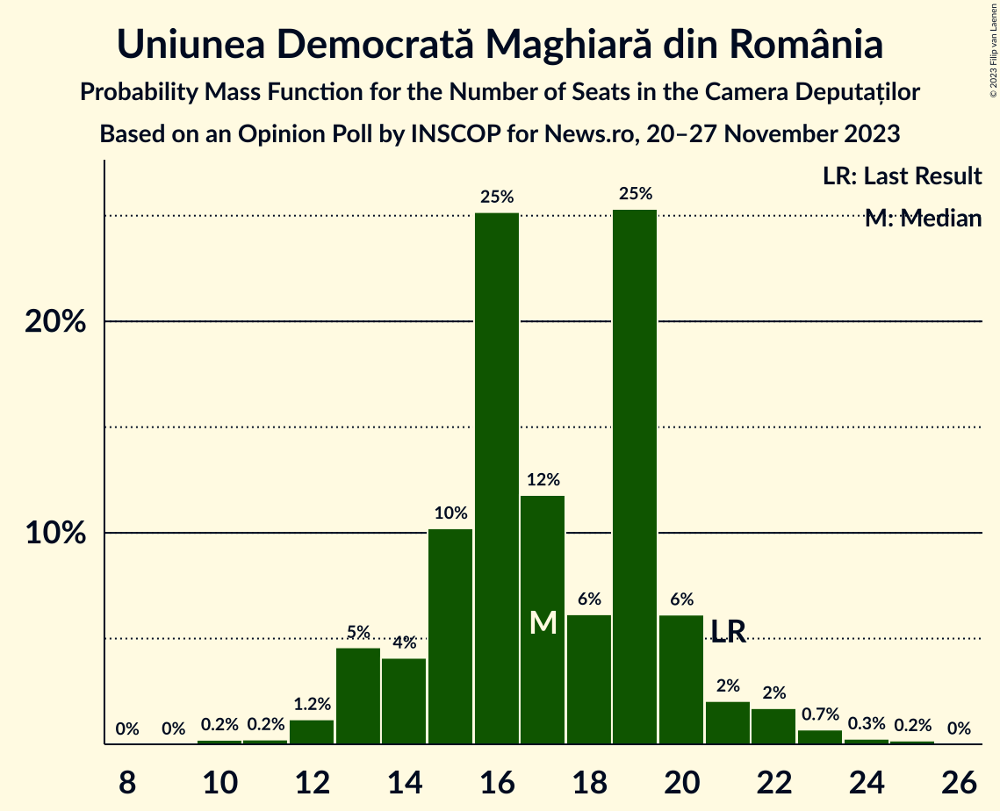

| Number of Seats | Probability | Accumulated | Special Marks |
|:---------------:|:-----------:|:-----------:|:-------------:|
| 10 | 0.2% | 100% |  |
| 11 | 0.2% | 99.8% |  |
| 12 | 1.2% | 99.6% |  |
| 13 | 5% | 98% |  |
| 14 | 4% | 94% |  |
| 15 | 10% | 90% |  |
| 16 | 25% | 79% |  |
| 17 | 12% | 54% | Median |
| 18 | 6% | 43% |  |
| 19 | 25% | 36% |  |
| 20 | 6% | 11% |  |
| 21 | 2% | 5% | Last Result |
| 22 | 2% | 3% |  |
| 23 | 0.7% | 1.2% |  |
| 24 | 0.3% | 0.5% |  |
| 25 | 0.2% | 0.2% |  |
| 26 | 0% | 0% |  |

### PRO România

*For a full overview of the results for this party, see the [PRO România](party-proromânia.html) page.*

| Number of Seats | Probability | Accumulated | Special Marks |
|:---------------:|:-----------:|:-----------:|:-------------:|
| 0 | 100% | 100% | Last Result, Median |

### Partidul Mișcarea Populară

*For a full overview of the results for this party, see the [Partidul Mișcarea Populară](party-partidulmișcareapopulară.html) page.*

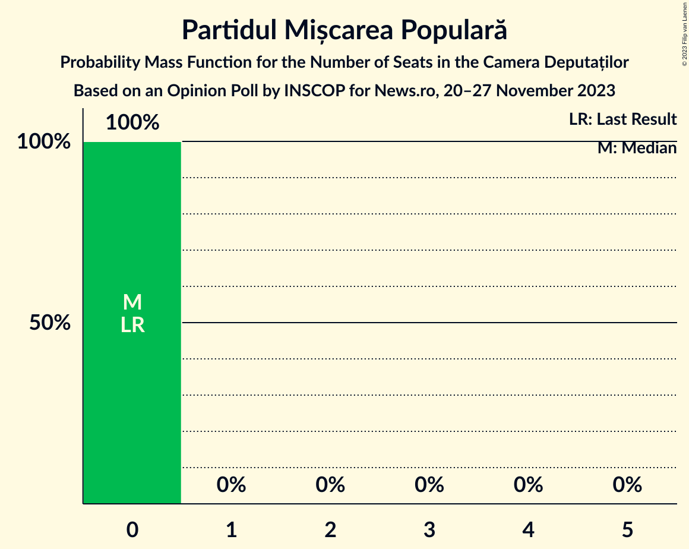

| Number of Seats | Probability | Accumulated | Special Marks |
|:---------------:|:-----------:|:-----------:|:-------------:|
| 0 | 100% | 100% | Last Result, Median |

### Forța Dreptei

*For a full overview of the results for this party, see the [Forța Dreptei](party-forțadreptei.html) page.*

| Number of Seats | Probability | Accumulated | Special Marks |
|:---------------:|:-----------:|:-----------:|:-------------:|
| 0 | 100% | 100% | Last Result, Median |

### Reînnoim Proiectul European al României

*For a full overview of the results for this party, see the [Reînnoim Proiectul European al României](party-reînnoimproiectuleuropeanalromâniei.html) page.*

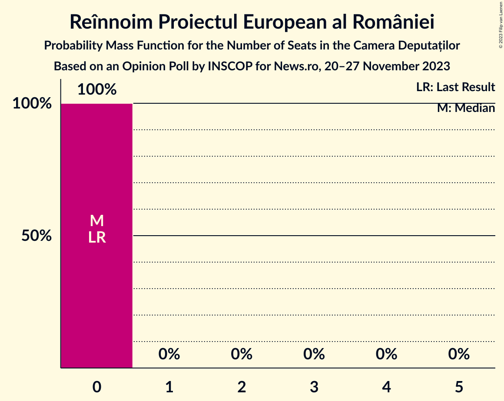

| Number of Seats | Probability | Accumulated | Special Marks |
|:---------------:|:-----------:|:-----------:|:-------------:|
| 0 | 100% | 100% | Last Result, Median |

## Coalitions

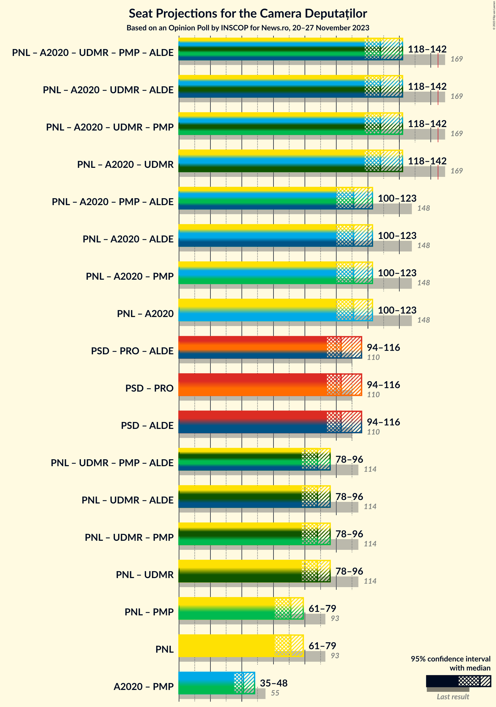

### Confidence Intervals

| Coalition | Last Result | Median | Majority? | 80% Confidence Interval | 90% Confidence Interval | 95% Confidence Interval | 99% Confidence Interval |
|:---------:|:-----------:|:------:|:---------:|:-----------------------:|:-----------------------:|:-----------------------:|:-----------------------:|
| Partidul Național Liberal – Alianța 2020 USR-PLUS – Uniunea Democrată Maghiară din România – Partidul Mișcarea Populară | 169 | 128 | 0% | 122–137 | 118–139 | 118–142 | 114–144 |
| Partidul Național Liberal – Alianța 2020 USR-PLUS – Uniunea Democrată Maghiară din România | 169 | 128 | 0% | 122–137 | 118–139 | 118–142 | 114–144 |
| Partidul Național Liberal – Alianța 2020 USR-PLUS – Partidul Mișcarea Populară | 148 | 111 | 0% | 105–118 | 102–122 | 100–123 | 97–125 |
| Partidul Național Liberal – Alianța 2020 USR-PLUS | 148 | 111 | 0% | 105–118 | 102–122 | 100–123 | 97–125 |
| Partidul Social Democrat – PRO România | 110 | 103 | 0% | 96–111 | 94–113 | 94–116 | 92–118 |
| Partidul Național Liberal – Uniunea Democrată Maghiară din România – Partidul Mișcarea Populară | 114 | 88 | 0% | 82–94 | 79–96 | 78–96 | 74–100 |
| Partidul Național Liberal – Uniunea Democrată Maghiară din România | 114 | 88 | 0% | 82–94 | 79–96 | 78–96 | 74–100 |
| Partidul Național Liberal – Partidul Mișcarea Populară | 93 | 71 | 0% | 65–76 | 62–78 | 61–79 | 58–82 |
| Partidul Național Liberal | 93 | 71 | 0% | 65–76 | 62–78 | 61–79 | 58–82 |
| Alianța 2020 USR-PLUS – Partidul Mișcarea Populară | 55 | 41 | 0% | 35–45 | 35–47 | 35–48 | 33–50 |

### Partidul Național Liberal – Alianța 2020 USR-PLUS – Uniunea Democrată Maghiară din România – Partidul Mișcarea Populară

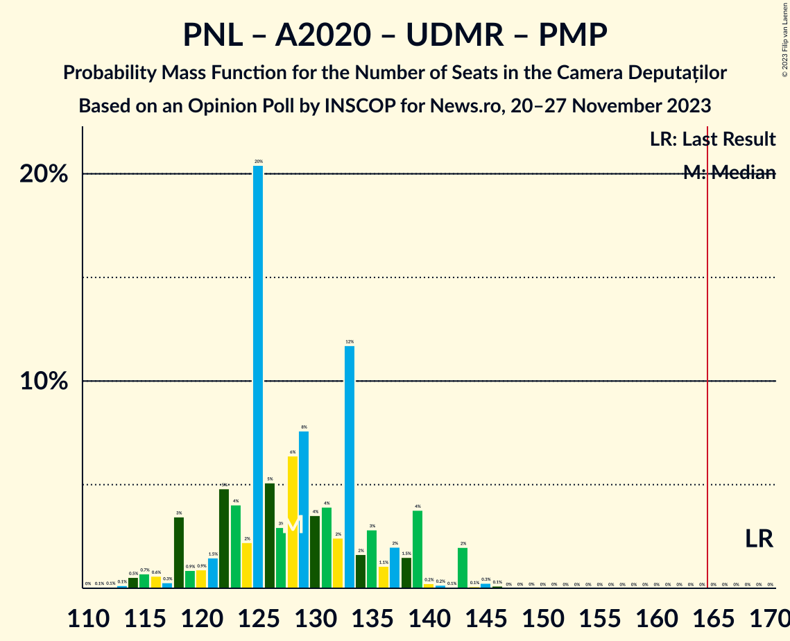

| Number of Seats | Probability | Accumulated | Special Marks |
|:---------------:|:-----------:|:-----------:|:-------------:|
| 110 | 0% | 100% |  |
| 111 | 0.1% | 99.9% |  |
| 112 | 0.1% | 99.9% |  |
| 113 | 0.1% | 99.8% |  |
| 114 | 0.5% | 99.7% |  |
| 115 | 0.7% | 99.1% |  |
| 116 | 0.6% | 98% |  |
| 117 | 0.3% | 98% |  |
| 118 | 3% | 98% |  |
| 119 | 0.9% | 94% |  |
| 120 | 0.9% | 93% |  |
| 121 | 1.5% | 92% |  |
| 122 | 5% | 91% |  |
| 123 | 4% | 86% |  |
| 124 | 2% | 82% |  |
| 125 | 20% | 80% |  |
| 126 | 5% | 59% |  |
| 127 | 3% | 54% |  |
| 128 | 6% | 51% |  |
| 129 | 8% | 45% | Median |
| 130 | 4% | 37% |  |
| 131 | 4% | 34% |  |
| 132 | 2% | 30% |  |
| 133 | 12% | 27% |  |
| 134 | 2% | 16% |  |
| 135 | 3% | 14% |  |
| 136 | 1.1% | 11% |  |
| 137 | 2% | 10% |  |
| 138 | 1.5% | 8% |  |
| 139 | 4% | 7% |  |
| 140 | 0.2% | 3% |  |
| 141 | 0.2% | 3% |  |
| 142 | 0.1% | 3% |  |
| 143 | 2% | 2% |  |
| 144 | 0.1% | 0.5% |  |
| 145 | 0.3% | 0.4% |  |
| 146 | 0.1% | 0.2% |  |
| 147 | 0% | 0.1% |  |
| 148 | 0% | 0% |  |
| 149 | 0% | 0% |  |
| 150 | 0% | 0% |  |
| 151 | 0% | 0% |  |
| 152 | 0% | 0% |  |
| 153 | 0% | 0% |  |
| 154 | 0% | 0% |  |
| 155 | 0% | 0% |  |
| 156 | 0% | 0% |  |
| 157 | 0% | 0% |  |
| 158 | 0% | 0% |  |
| 159 | 0% | 0% |  |
| 160 | 0% | 0% |  |
| 161 | 0% | 0% |  |
| 162 | 0% | 0% |  |
| 163 | 0% | 0% |  |
| 164 | 0% | 0% |  |
| 165 | 0% | 0% | Majority |
| 166 | 0% | 0% |  |
| 167 | 0% | 0% |  |
| 168 | 0% | 0% |  |
| 169 | 0% | 0% | Last Result |

### Partidul Național Liberal – Alianța 2020 USR-PLUS – Uniunea Democrată Maghiară din România

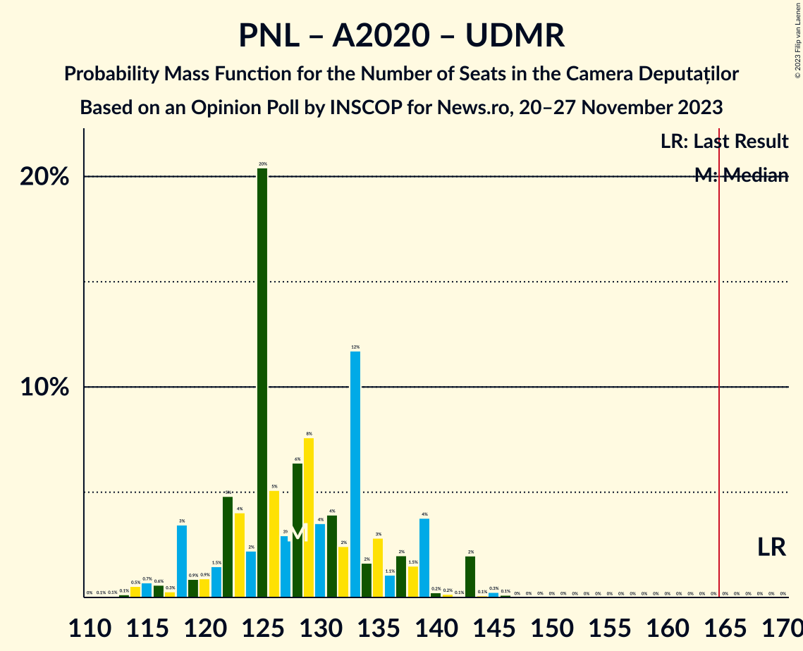

| Number of Seats | Probability | Accumulated | Special Marks |
|:---------------:|:-----------:|:-----------:|:-------------:|
| 110 | 0% | 100% |  |
| 111 | 0.1% | 99.9% |  |
| 112 | 0.1% | 99.9% |  |
| 113 | 0.1% | 99.8% |  |
| 114 | 0.5% | 99.7% |  |
| 115 | 0.7% | 99.1% |  |
| 116 | 0.6% | 98% |  |
| 117 | 0.3% | 98% |  |
| 118 | 3% | 98% |  |
| 119 | 0.9% | 94% |  |
| 120 | 0.9% | 93% |  |
| 121 | 1.5% | 92% |  |
| 122 | 5% | 91% |  |
| 123 | 4% | 86% |  |
| 124 | 2% | 82% |  |
| 125 | 20% | 80% |  |
| 126 | 5% | 59% |  |
| 127 | 3% | 54% |  |
| 128 | 6% | 51% |  |
| 129 | 8% | 45% | Median |
| 130 | 4% | 37% |  |
| 131 | 4% | 34% |  |
| 132 | 2% | 30% |  |
| 133 | 12% | 27% |  |
| 134 | 2% | 16% |  |
| 135 | 3% | 14% |  |
| 136 | 1.1% | 11% |  |
| 137 | 2% | 10% |  |
| 138 | 1.5% | 8% |  |
| 139 | 4% | 7% |  |
| 140 | 0.2% | 3% |  |
| 141 | 0.2% | 3% |  |
| 142 | 0.1% | 3% |  |
| 143 | 2% | 2% |  |
| 144 | 0.1% | 0.5% |  |
| 145 | 0.3% | 0.4% |  |
| 146 | 0.1% | 0.2% |  |
| 147 | 0% | 0.1% |  |
| 148 | 0% | 0% |  |
| 149 | 0% | 0% |  |
| 150 | 0% | 0% |  |
| 151 | 0% | 0% |  |
| 152 | 0% | 0% |  |
| 153 | 0% | 0% |  |
| 154 | 0% | 0% |  |
| 155 | 0% | 0% |  |
| 156 | 0% | 0% |  |
| 157 | 0% | 0% |  |
| 158 | 0% | 0% |  |
| 159 | 0% | 0% |  |
| 160 | 0% | 0% |  |
| 161 | 0% | 0% |  |
| 162 | 0% | 0% |  |
| 163 | 0% | 0% |  |
| 164 | 0% | 0% |  |
| 165 | 0% | 0% | Majority |
| 166 | 0% | 0% |  |
| 167 | 0% | 0% |  |
| 168 | 0% | 0% |  |
| 169 | 0% | 0% | Last Result |

### Partidul Național Liberal – Alianța 2020 USR-PLUS – Partidul Mișcarea Populară

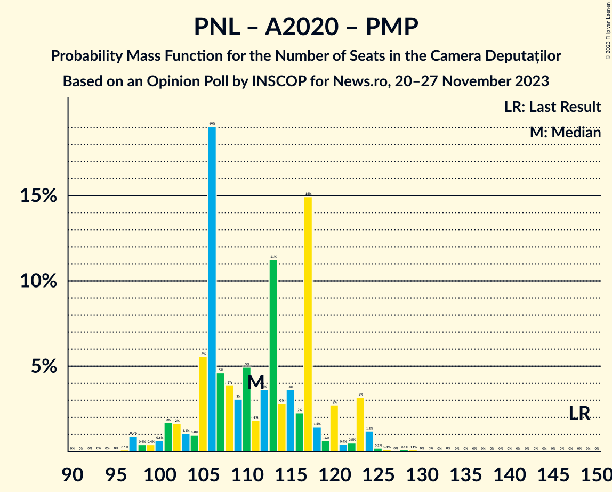

| Number of Seats | Probability | Accumulated | Special Marks |
|:---------------:|:-----------:|:-----------:|:-------------:|
| 94 | 0% | 100% |  |
| 95 | 0% | 99.9% |  |
| 96 | 0.1% | 99.9% |  |
| 97 | 0.9% | 99.8% |  |
| 98 | 0.4% | 98.9% |  |
| 99 | 0.4% | 98.5% |  |
| 100 | 0.6% | 98% |  |
| 101 | 2% | 97% |  |
| 102 | 2% | 96% |  |
| 103 | 1.1% | 94% |  |
| 104 | 1.0% | 93% |  |
| 105 | 6% | 92% |  |
| 106 | 19% | 87% |  |
| 107 | 5% | 68% |  |
| 108 | 4% | 63% |  |
| 109 | 3% | 59% |  |
| 110 | 5% | 56% |  |
| 111 | 2% | 51% |  |
| 112 | 4% | 49% | Median |
| 113 | 11% | 46% |  |
| 114 | 3% | 34% |  |
| 115 | 4% | 31% |  |
| 116 | 2% | 28% |  |
| 117 | 15% | 26% |  |
| 118 | 1.5% | 11% |  |
| 119 | 0.6% | 9% |  |
| 120 | 3% | 9% |  |
| 121 | 0.4% | 6% |  |
| 122 | 0.5% | 5% |  |
| 123 | 3% | 5% |  |
| 124 | 1.2% | 2% |  |
| 125 | 0.2% | 0.5% |  |
| 126 | 0.1% | 0.4% |  |
| 127 | 0% | 0.3% |  |
| 128 | 0.1% | 0.2% |  |
| 129 | 0.1% | 0.1% |  |
| 130 | 0% | 0% |  |
| 131 | 0% | 0% |  |
| 132 | 0% | 0% |  |
| 133 | 0% | 0% |  |
| 134 | 0% | 0% |  |
| 135 | 0% | 0% |  |
| 136 | 0% | 0% |  |
| 137 | 0% | 0% |  |
| 138 | 0% | 0% |  |
| 139 | 0% | 0% |  |
| 140 | 0% | 0% |  |
| 141 | 0% | 0% |  |
| 142 | 0% | 0% |  |
| 143 | 0% | 0% |  |
| 144 | 0% | 0% |  |
| 145 | 0% | 0% |  |
| 146 | 0% | 0% |  |
| 147 | 0% | 0% |  |
| 148 | 0% | 0% | Last Result |

### Partidul Național Liberal – Alianța 2020 USR-PLUS

| Number of Seats | Probability | Accumulated | Special Marks |
|:---------------:|:-----------:|:-----------:|:-------------:|
| 94 | 0% | 100% |  |
| 95 | 0% | 99.9% |  |
| 96 | 0.1% | 99.9% |  |
| 97 | 0.9% | 99.8% |  |
| 98 | 0.4% | 98.9% |  |
| 99 | 0.4% | 98.5% |  |
| 100 | 0.6% | 98% |  |
| 101 | 2% | 97% |  |
| 102 | 2% | 96% |  |
| 103 | 1.1% | 94% |  |
| 104 | 1.0% | 93% |  |
| 105 | 6% | 92% |  |
| 106 | 19% | 87% |  |
| 107 | 5% | 68% |  |
| 108 | 4% | 63% |  |
| 109 | 3% | 59% |  |
| 110 | 5% | 56% |  |
| 111 | 2% | 51% |  |
| 112 | 4% | 49% | Median |
| 113 | 11% | 46% |  |
| 114 | 3% | 34% |  |
| 115 | 4% | 31% |  |
| 116 | 2% | 28% |  |
| 117 | 15% | 26% |  |
| 118 | 1.5% | 11% |  |
| 119 | 0.6% | 9% |  |
| 120 | 3% | 9% |  |
| 121 | 0.4% | 6% |  |
| 122 | 0.5% | 5% |  |
| 123 | 3% | 5% |  |
| 124 | 1.2% | 2% |  |
| 125 | 0.2% | 0.5% |  |
| 126 | 0.1% | 0.4% |  |
| 127 | 0% | 0.3% |  |
| 128 | 0.1% | 0.2% |  |
| 129 | 0.1% | 0.1% |  |
| 130 | 0% | 0% |  |
| 131 | 0% | 0% |  |
| 132 | 0% | 0% |  |
| 133 | 0% | 0% |  |
| 134 | 0% | 0% |  |
| 135 | 0% | 0% |  |
| 136 | 0% | 0% |  |
| 137 | 0% | 0% |  |
| 138 | 0% | 0% |  |
| 139 | 0% | 0% |  |
| 140 | 0% | 0% |  |
| 141 | 0% | 0% |  |
| 142 | 0% | 0% |  |
| 143 | 0% | 0% |  |
| 144 | 0% | 0% |  |
| 145 | 0% | 0% |  |
| 146 | 0% | 0% |  |
| 147 | 0% | 0% |  |
| 148 | 0% | 0% | Last Result |

### Partidul Social Democrat – PRO România

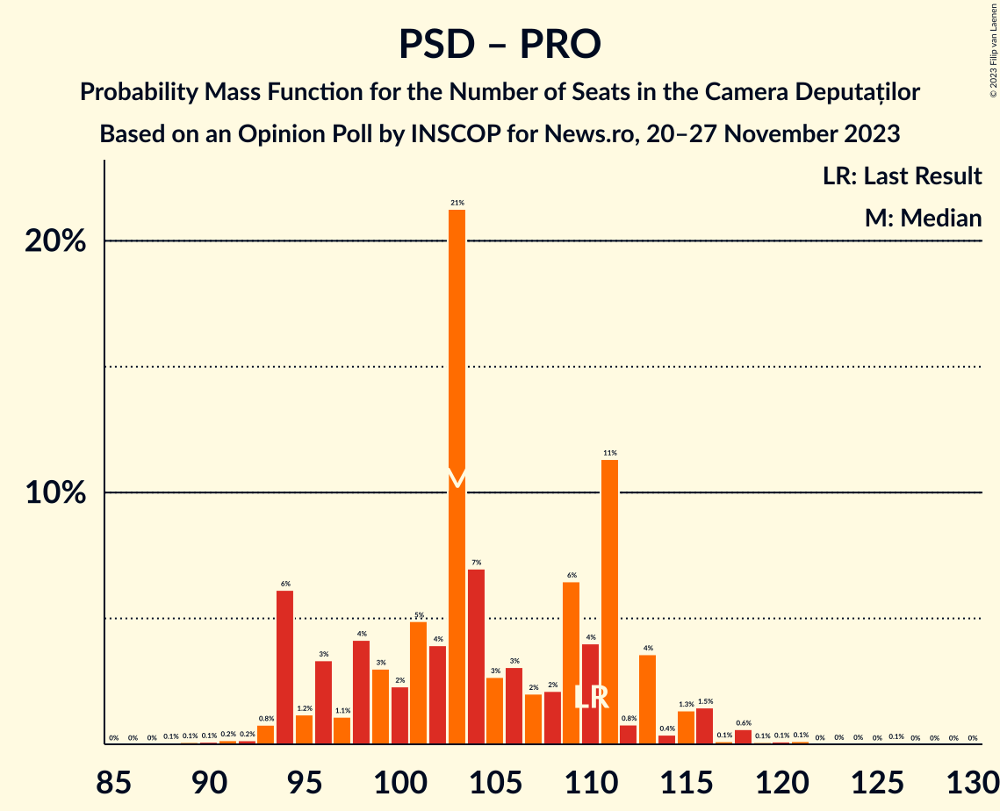

| Number of Seats | Probability | Accumulated | Special Marks |
|:---------------:|:-----------:|:-----------:|:-------------:|
| 88 | 0.1% | 100% |  |
| 89 | 0.1% | 99.9% |  |
| 90 | 0.1% | 99.8% |  |
| 91 | 0.2% | 99.7% |  |
| 92 | 0.2% | 99.6% |  |
| 93 | 0.8% | 99.4% |  |
| 94 | 6% | 98.6% |  |
| 95 | 1.2% | 92% |  |
| 96 | 3% | 91% |  |
| 97 | 1.1% | 88% |  |
| 98 | 4% | 87% |  |
| 99 | 3% | 83% |  |
| 100 | 2% | 80% |  |
| 101 | 5% | 77% |  |
| 102 | 4% | 73% |  |
| 103 | 21% | 69% | Median |
| 104 | 7% | 47% |  |
| 105 | 3% | 40% |  |
| 106 | 3% | 38% |  |
| 107 | 2% | 35% |  |
| 108 | 2% | 33% |  |
| 109 | 6% | 31% |  |
| 110 | 4% | 24% | Last Result |
| 111 | 11% | 20% |  |
| 112 | 0.8% | 9% |  |
| 113 | 4% | 8% |  |
| 114 | 0.4% | 4% |  |
| 115 | 1.3% | 4% |  |
| 116 | 1.5% | 3% |  |
| 117 | 0.1% | 1.2% |  |
| 118 | 0.6% | 1.0% |  |
| 119 | 0.1% | 0.4% |  |
| 120 | 0.1% | 0.4% |  |
| 121 | 0.1% | 0.3% |  |
| 122 | 0% | 0.1% |  |
| 123 | 0% | 0.1% |  |
| 124 | 0% | 0.1% |  |
| 125 | 0% | 0.1% |  |
| 126 | 0.1% | 0.1% |  |
| 127 | 0% | 0% |  |

### Partidul Național Liberal – Uniunea Democrată Maghiară din România – Partidul Mișcarea Populară

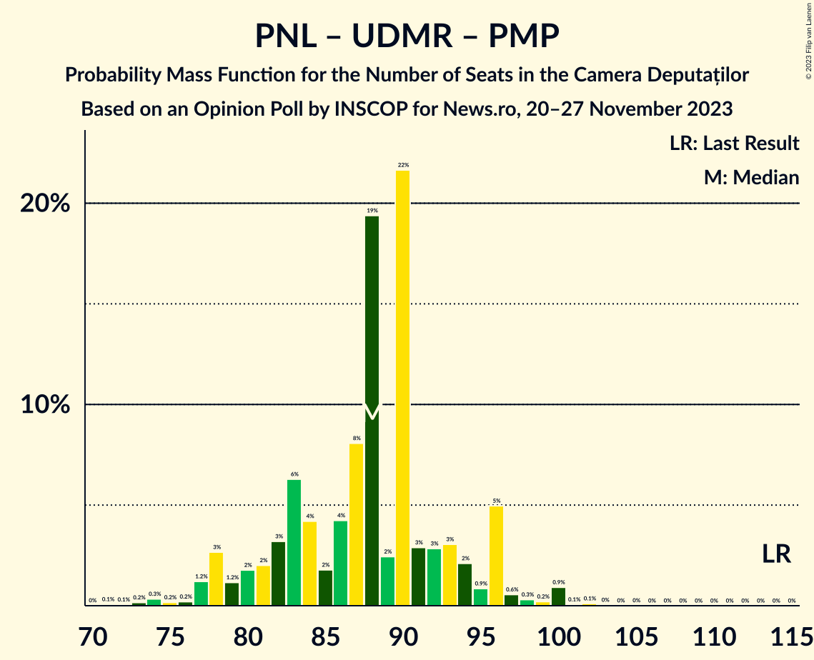

| Number of Seats | Probability | Accumulated | Special Marks |
|:---------------:|:-----------:|:-----------:|:-------------:|
| 71 | 0.1% | 100% |  |
| 72 | 0.1% | 99.9% |  |
| 73 | 0.2% | 99.9% |  |
| 74 | 0.3% | 99.7% |  |
| 75 | 0.2% | 99.4% |  |
| 76 | 0.2% | 99.2% |  |
| 77 | 1.2% | 99.0% |  |
| 78 | 3% | 98% |  |
| 79 | 1.2% | 95% |  |
| 80 | 2% | 94% |  |
| 81 | 2% | 92% |  |
| 82 | 3% | 90% |  |
| 83 | 6% | 87% |  |
| 84 | 4% | 81% |  |
| 85 | 2% | 76% |  |
| 86 | 4% | 75% |  |
| 87 | 8% | 70% |  |
| 88 | 19% | 62% | Median |
| 89 | 2% | 43% |  |
| 90 | 22% | 41% |  |
| 91 | 3% | 19% |  |
| 92 | 3% | 16% |  |
| 93 | 3% | 13% |  |
| 94 | 2% | 10% |  |
| 95 | 0.9% | 8% |  |
| 96 | 5% | 7% |  |
| 97 | 0.6% | 2% |  |
| 98 | 0.3% | 2% |  |
| 99 | 0.2% | 1.4% |  |
| 100 | 0.9% | 1.2% |  |
| 101 | 0.1% | 0.2% |  |
| 102 | 0.1% | 0.2% |  |
| 103 | 0% | 0.1% |  |
| 104 | 0% | 0% |  |
| 105 | 0% | 0% |  |
| 106 | 0% | 0% |  |
| 107 | 0% | 0% |  |
| 108 | 0% | 0% |  |
| 109 | 0% | 0% |  |
| 110 | 0% | 0% |  |
| 111 | 0% | 0% |  |
| 112 | 0% | 0% |  |
| 113 | 0% | 0% |  |
| 114 | 0% | 0% | Last Result |

### Partidul Național Liberal – Uniunea Democrată Maghiară din România

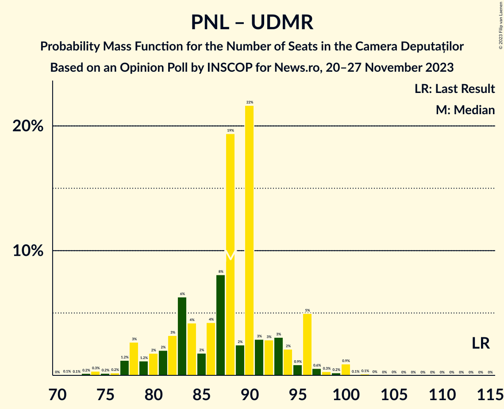

| Number of Seats | Probability | Accumulated | Special Marks |
|:---------------:|:-----------:|:-----------:|:-------------:|
| 71 | 0.1% | 100% |  |
| 72 | 0.1% | 99.9% |  |
| 73 | 0.2% | 99.9% |  |
| 74 | 0.3% | 99.7% |  |
| 75 | 0.2% | 99.4% |  |
| 76 | 0.2% | 99.2% |  |
| 77 | 1.2% | 99.0% |  |
| 78 | 3% | 98% |  |
| 79 | 1.2% | 95% |  |
| 80 | 2% | 94% |  |
| 81 | 2% | 92% |  |
| 82 | 3% | 90% |  |
| 83 | 6% | 87% |  |
| 84 | 4% | 81% |  |
| 85 | 2% | 76% |  |
| 86 | 4% | 75% |  |
| 87 | 8% | 70% |  |
| 88 | 19% | 62% | Median |
| 89 | 2% | 43% |  |
| 90 | 22% | 41% |  |
| 91 | 3% | 19% |  |
| 92 | 3% | 16% |  |
| 93 | 3% | 13% |  |
| 94 | 2% | 10% |  |
| 95 | 0.9% | 8% |  |
| 96 | 5% | 7% |  |
| 97 | 0.6% | 2% |  |
| 98 | 0.3% | 2% |  |
| 99 | 0.2% | 1.4% |  |
| 100 | 0.9% | 1.2% |  |
| 101 | 0.1% | 0.2% |  |
| 102 | 0.1% | 0.2% |  |
| 103 | 0% | 0.1% |  |
| 104 | 0% | 0% |  |
| 105 | 0% | 0% |  |
| 106 | 0% | 0% |  |
| 107 | 0% | 0% |  |
| 108 | 0% | 0% |  |
| 109 | 0% | 0% |  |
| 110 | 0% | 0% |  |
| 111 | 0% | 0% |  |
| 112 | 0% | 0% |  |
| 113 | 0% | 0% |  |
| 114 | 0% | 0% | Last Result |

### Partidul Național Liberal – Partidul Mișcarea Populară

| Number of Seats | Probability | Accumulated | Special Marks |
|:---------------:|:-----------:|:-----------:|:-------------:|
| 56 | 0.1% | 100% |  |
| 57 | 0.1% | 99.9% |  |
| 58 | 0.4% | 99.8% |  |
| 59 | 0.3% | 99.4% |  |
| 60 | 0.6% | 99.1% |  |
| 61 | 3% | 98% |  |
| 62 | 1.4% | 95% |  |
| 63 | 1.2% | 94% |  |
| 64 | 2% | 93% |  |
| 65 | 3% | 91% |  |
| 66 | 2% | 88% |  |
| 67 | 9% | 86% |  |
| 68 | 3% | 77% |  |
| 69 | 4% | 75% |  |
| 70 | 6% | 71% |  |
| 71 | 23% | 65% | Median |
| 72 | 16% | 43% |  |
| 73 | 9% | 26% |  |
| 74 | 3% | 18% |  |
| 75 | 2% | 14% |  |
| 76 | 2% | 12% |  |
| 77 | 5% | 10% |  |
| 78 | 2% | 5% |  |
| 79 | 1.3% | 3% |  |
| 80 | 1.0% | 2% |  |
| 81 | 0.2% | 0.8% |  |
| 82 | 0.3% | 0.6% |  |
| 83 | 0.2% | 0.2% |  |
| 84 | 0% | 0.1% |  |
| 85 | 0% | 0.1% |  |
| 86 | 0% | 0% |  |
| 87 | 0% | 0% |  |
| 88 | 0% | 0% |  |
| 89 | 0% | 0% |  |
| 90 | 0% | 0% |  |
| 91 | 0% | 0% |  |
| 92 | 0% | 0% |  |
| 93 | 0% | 0% | Last Result |

### Partidul Național Liberal

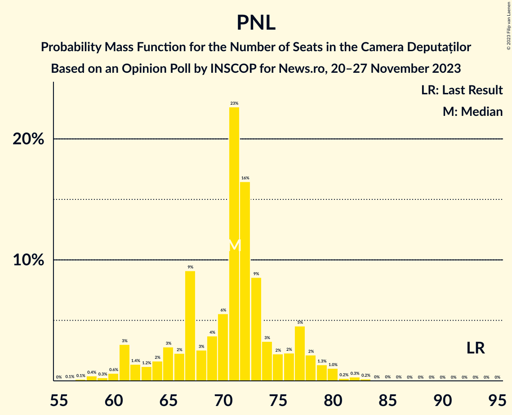

| Number of Seats | Probability | Accumulated | Special Marks |
|:---------------:|:-----------:|:-----------:|:-------------:|
| 56 | 0.1% | 100% |  |
| 57 | 0.1% | 99.9% |  |
| 58 | 0.4% | 99.8% |  |
| 59 | 0.3% | 99.4% |  |
| 60 | 0.6% | 99.1% |  |
| 61 | 3% | 98% |  |
| 62 | 1.4% | 95% |  |
| 63 | 1.2% | 94% |  |
| 64 | 2% | 93% |  |
| 65 | 3% | 91% |  |
| 66 | 2% | 88% |  |
| 67 | 9% | 86% |  |
| 68 | 3% | 77% |  |
| 69 | 4% | 75% |  |
| 70 | 6% | 71% |  |
| 71 | 23% | 65% | Median |
| 72 | 16% | 43% |  |
| 73 | 9% | 26% |  |
| 74 | 3% | 18% |  |
| 75 | 2% | 14% |  |
| 76 | 2% | 12% |  |
| 77 | 5% | 10% |  |
| 78 | 2% | 5% |  |
| 79 | 1.3% | 3% |  |
| 80 | 1.0% | 2% |  |
| 81 | 0.2% | 0.8% |  |
| 82 | 0.3% | 0.6% |  |
| 83 | 0.2% | 0.2% |  |
| 84 | 0% | 0.1% |  |
| 85 | 0% | 0.1% |  |
| 86 | 0% | 0% |  |
| 87 | 0% | 0% |  |
| 88 | 0% | 0% |  |
| 89 | 0% | 0% |  |
| 90 | 0% | 0% |  |
| 91 | 0% | 0% |  |
| 92 | 0% | 0% |  |
| 93 | 0% | 0% | Last Result |

### Alianța 2020 USR-PLUS – Partidul Mișcarea Populară

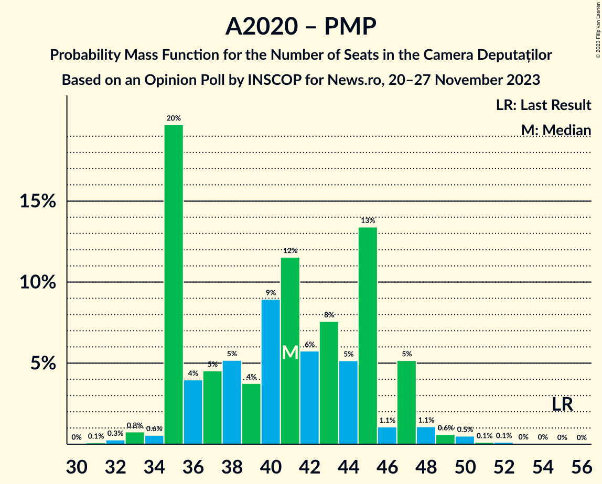

| Number of Seats | Probability | Accumulated | Special Marks |
|:---------------:|:-----------:|:-----------:|:-------------:|
| 31 | 0.1% | 100% |  |
| 32 | 0.3% | 99.9% |  |
| 33 | 0.8% | 99.6% |  |
| 34 | 0.6% | 98.8% |  |
| 35 | 20% | 98% |  |
| 36 | 4% | 79% |  |
| 37 | 5% | 75% |  |
| 38 | 5% | 70% |  |
| 39 | 4% | 65% |  |
| 40 | 9% | 61% |  |
| 41 | 12% | 52% | Median |
| 42 | 6% | 41% |  |
| 43 | 8% | 35% |  |
| 44 | 5% | 27% |  |
| 45 | 13% | 22% |  |
| 46 | 1.1% | 9% |  |
| 47 | 5% | 8% |  |
| 48 | 1.1% | 3% |  |
| 49 | 0.6% | 1.5% |  |
| 50 | 0.5% | 0.9% |  |
| 51 | 0.1% | 0.3% |  |
| 52 | 0.1% | 0.2% |  |
| 53 | 0% | 0.1% |  |
| 54 | 0% | 0.1% |  |
| 55 | 0% | 0% | Last Result |

## Technical Information

### Opinion Poll

+ **Polling firm:** INSCOP
+ **Commissioner(s):** News.ro
+ **Fieldwork period:** 20–27 November 2023

### Calculations

+ **Sample size:** 1091
+ **Simulations done:** 1,048,576
+ **Error estimate:** 2.48%

