# Opinion Poll by Avangarde, 10–20 December 2020

<a href="#voting-intentions">Voting Intentions</a> | <a href="#seats">Seats</a> | <a href="#coalitions">Coalitions</a> | <a href="#technical-information">Technical Information</a>

## Voting Intentions

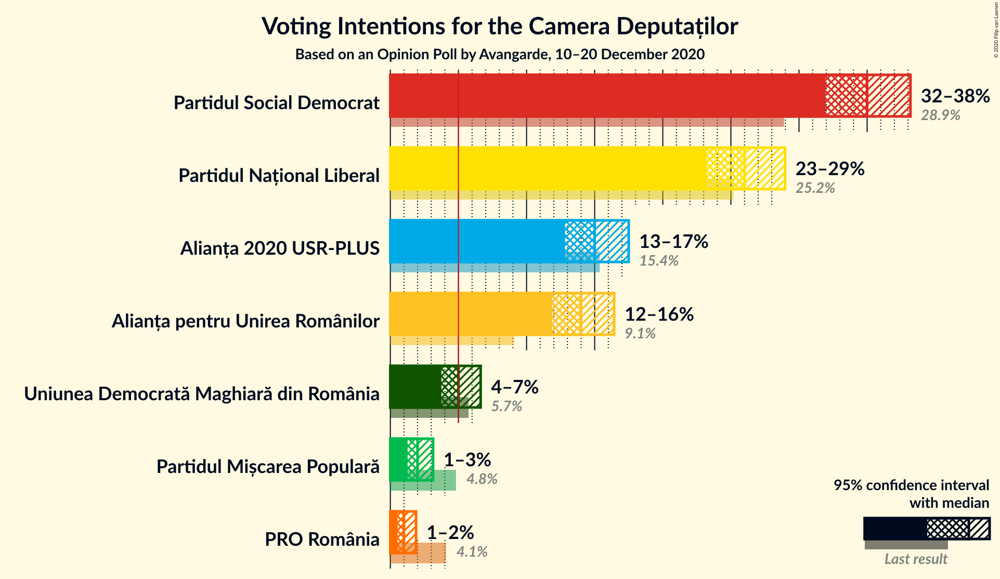

### Confidence Intervals

| Party | Last Result | Poll Result | 80% Confidence Interval | 90% Confidence Interval | 95% Confidence Interval | 99% Confidence Interval |
|:-----:|:-----------:|:-----------:|:-----------------------:|:-----------------------:|:-----------------------:|:-----------------------:|
| Partidul Social Democrat | 28.9% | 35.0% | 33.0–37.1% |32.4–37.7% |31.9–38.2% |31.0–39.2% |
| Partidul Național Liberal | 25.2% | 26.0% | 24.2–27.9% |23.7–28.5% |23.2–29.0% |22.4–29.9% |
| Alianța 2020 USR-PLUS | 15.4% | 15.0% | 13.6–16.6% |13.2–17.1% |12.8–17.5% |12.1–18.3% |
| Alianța pentru Unirea Românilor | 9.1% | 14.0% | 12.6–15.6% |12.2–16.0% |11.9–16.4% |11.2–17.2% |
| Uniunea Democrată Maghiară din România | 5.7% | 5.0% | 4.2–6.1% |3.9–6.4% |3.7–6.6% |3.4–7.2% |
| Partidul Mișcarea Populară | 4.8% | 2.0% | 1.5–2.7% |1.4–3.0% |1.3–3.1% |1.1–3.5% |
| PRO România | 4.1% | 1.0% | 0.7–1.6% |0.6–1.7% |0.5–1.9% |0.4–2.2% |

*Note:* The poll result column reflects the actual value used in the calculations. Published results may vary slightly, and in addition be rounded to fewer digits.

## Seats

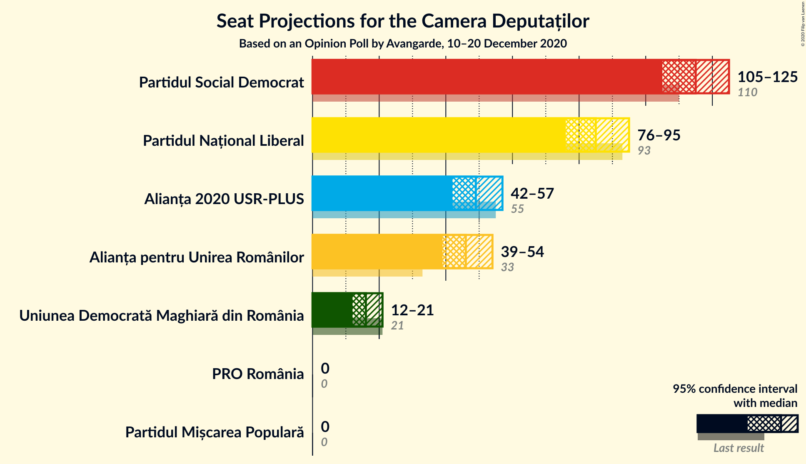

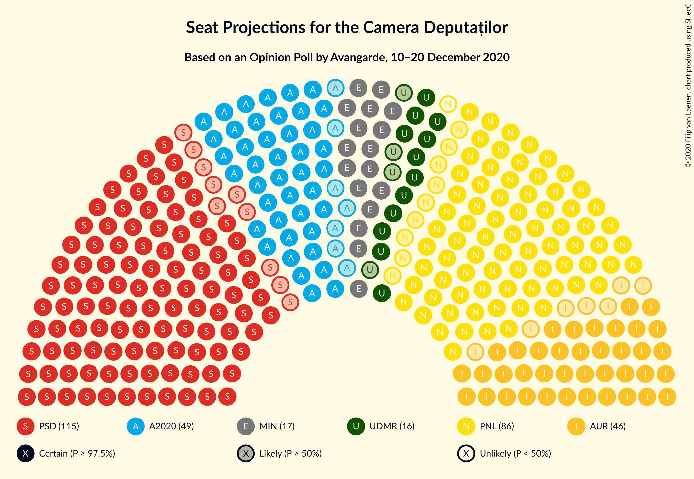

### Confidence Intervals

| Party | Last Result | Median | 80% Confidence Interval | 90% Confidence Interval | 95% Confidence Interval | 99% Confidence Interval |
|:-----:|:-----------:|:------:|:-----------------------:|:-----------------------:|:-----------------------:|:-----------------------:|
| <a href="#partidul-social-democrat">Partidul Social Democrat</a> | 110 | 115 | 108–122 |107–124 |105–125 |102–128 |
| <a href="#partidul-național-liberal">Partidul Național Liberal</a> | 93 | 85 | 79–92 |78–93 |76–95 |73–98 |
| <a href="#alianța-2020-usr-plus">Alianța 2020 USR-PLUS</a> | 55 | 49 | 44–54 |43–56 |42–57 |40–60 |
| <a href="#alianța-pentru-unirea-românilor">Alianța pentru Unirea Românilor</a> | 33 | 46 | 41–51 |40–52 |39–54 |37–56 |
| <a href="#uniunea-democrată-maghiară-din-românia">Uniunea Democrată Maghiară din România</a> | 21 | 16 | 13–19 |13–20 |12–21 |11–23 |
| <a href="#partidul-mișcarea-populară">Partidul Mișcarea Populară</a> | 0 | 0 | 0 |0 |0 |0 |
| <a href="#pro-românia">PRO România</a> | 0 | 0 | 0 |0 |0 |0 |

### Partidul Social Democrat

*For a full overview of the results for this party, see the [Partidul Social Democrat](party-partidulsocialdemocrat.html) page.*

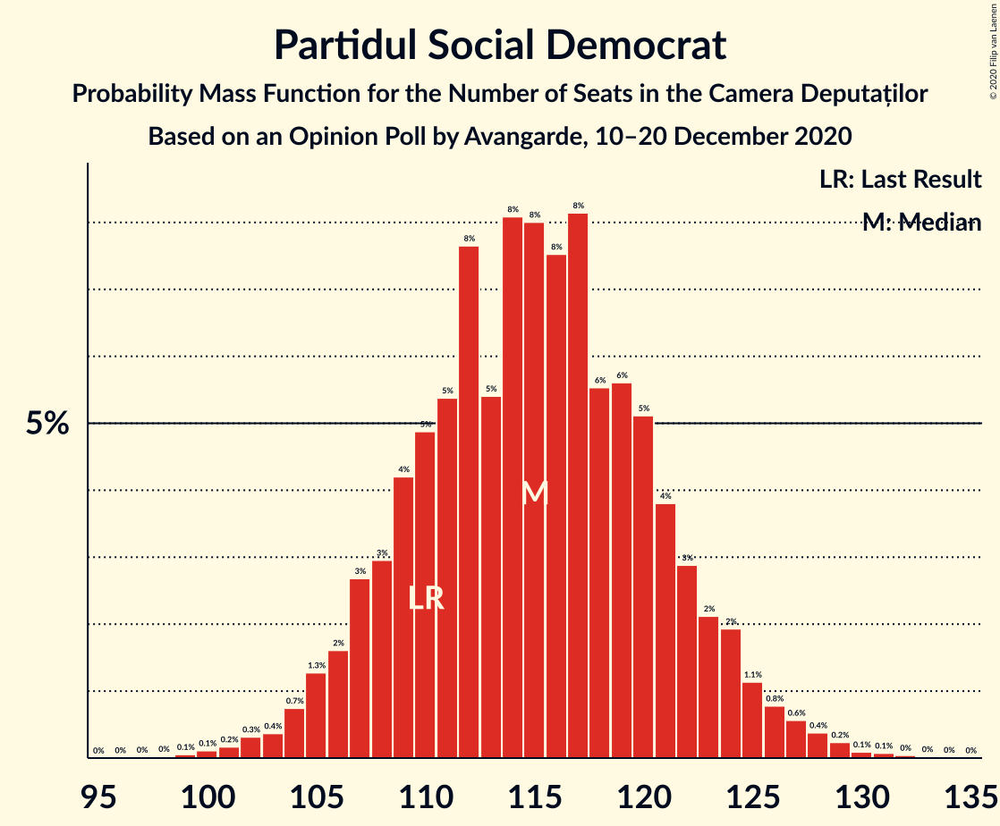

| Number of Seats | Probability | Accumulated | Special Marks |
|:---------------:|:-----------:|:-----------:|:-------------:|
| 98 | 0% | 100% |  |
| 99 | 0.1% | 99.9% |  |
| 100 | 0.1% | 99.9% |  |
| 101 | 0.2% | 99.8% |  |
| 102 | 0.3% | 99.6% |  |
| 103 | 0.4% | 99.3% |  |
| 104 | 0.7% | 98.9% |  |
| 105 | 1.3% | 98% |  |
| 106 | 2% | 97% |  |
| 107 | 3% | 95% |  |
| 108 | 3% | 93% |  |
| 109 | 4% | 90% |  |
| 110 | 5% | 85% | Last Result |
| 111 | 5% | 81% |  |
| 112 | 8% | 75% |  |
| 113 | 5% | 68% |  |
| 114 | 8% | 62% |  |
| 115 | 8% | 54% | Median |
| 116 | 8% | 46% |  |
| 117 | 8% | 39% |  |
| 118 | 6% | 30% |  |
| 119 | 6% | 25% |  |
| 120 | 5% | 19% |  |
| 121 | 4% | 14% |  |
| 122 | 3% | 10% |  |
| 123 | 2% | 7% |  |
| 124 | 2% | 5% |  |
| 125 | 1.1% | 3% |  |
| 126 | 0.8% | 2% |  |
| 127 | 0.6% | 1.4% |  |
| 128 | 0.4% | 0.9% |  |
| 129 | 0.2% | 0.5% |  |
| 130 | 0.1% | 0.3% |  |
| 131 | 0.1% | 0.2% |  |
| 132 | 0% | 0.1% |  |
| 133 | 0% | 0% |  |

### Partidul Național Liberal

*For a full overview of the results for this party, see the [Partidul Național Liberal](party-partidulnaționalliberal.html) page.*

| Number of Seats | Probability | Accumulated | Special Marks |
|:---------------:|:-----------:|:-----------:|:-------------:|
| 70 | 0% | 100% |  |
| 71 | 0.1% | 99.9% |  |
| 72 | 0.1% | 99.9% |  |
| 73 | 0.2% | 99.7% |  |
| 74 | 0.5% | 99.5% |  |
| 75 | 0.6% | 99.0% |  |
| 76 | 1.4% | 98% |  |
| 77 | 2% | 97% |  |
| 78 | 2% | 95% |  |
| 79 | 3% | 93% |  |
| 80 | 5% | 90% |  |
| 81 | 5% | 85% |  |
| 82 | 8% | 79% |  |
| 83 | 6% | 72% |  |
| 84 | 8% | 66% |  |
| 85 | 8% | 58% | Median |
| 86 | 9% | 50% |  |
| 87 | 8% | 41% |  |
| 88 | 8% | 33% |  |
| 89 | 6% | 25% |  |
| 90 | 5% | 20% |  |
| 91 | 4% | 14% |  |
| 92 | 3% | 10% |  |
| 93 | 2% | 7% | Last Result |
| 94 | 2% | 5% |  |
| 95 | 1.1% | 3% |  |
| 96 | 0.7% | 2% |  |
| 97 | 0.6% | 1.2% |  |
| 98 | 0.3% | 0.6% |  |
| 99 | 0.2% | 0.4% |  |
| 100 | 0.1% | 0.2% |  |
| 101 | 0.1% | 0.1% |  |
| 102 | 0% | 0.1% |  |
| 103 | 0% | 0% |  |

### Alianța 2020 USR-PLUS

*For a full overview of the results for this party, see the [Alianța 2020 USR-PLUS](party-alianța2020usr-plus.html) page.*

| Number of Seats | Probability | Accumulated | Special Marks |
|:---------------:|:-----------:|:-----------:|:-------------:|
| 37 | 0% | 100% |  |
| 38 | 0.1% | 99.9% |  |
| 39 | 0.3% | 99.8% |  |
| 40 | 0.5% | 99.6% |  |
| 41 | 1.0% | 99.1% |  |
| 42 | 2% | 98% |  |
| 43 | 3% | 96% |  |
| 44 | 4% | 93% |  |
| 45 | 6% | 89% |  |
| 46 | 7% | 83% |  |
| 47 | 8% | 75% |  |
| 48 | 9% | 67% |  |
| 49 | 10% | 58% | Median |
| 50 | 10% | 48% |  |
| 51 | 9% | 38% |  |
| 52 | 8% | 28% |  |
| 53 | 6% | 20% |  |
| 54 | 4% | 14% |  |
| 55 | 4% | 10% | Last Result |
| 56 | 2% | 6% |  |
| 57 | 1.4% | 3% |  |
| 58 | 0.8% | 2% |  |
| 59 | 0.6% | 1.1% |  |
| 60 | 0.3% | 0.6% |  |
| 61 | 0.2% | 0.3% |  |
| 62 | 0.1% | 0.2% |  |
| 63 | 0% | 0.1% |  |
| 64 | 0% | 0% |  |

### Alianța pentru Unirea Românilor

*For a full overview of the results for this party, see the [Alianța pentru Unirea Românilor](party-alianțapentruunirearomânilor.html) page.*

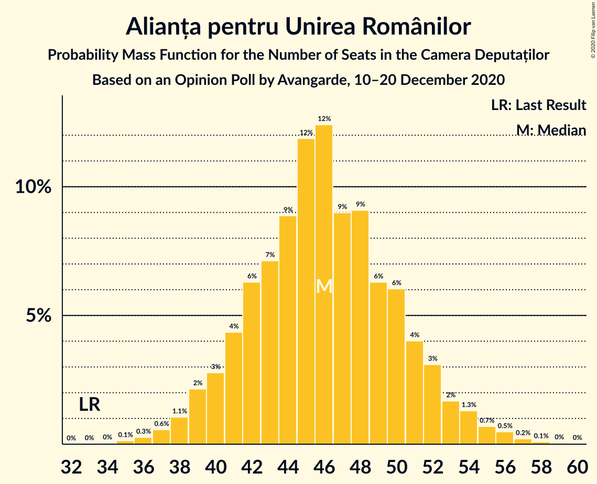

| Number of Seats | Probability | Accumulated | Special Marks |
|:---------------:|:-----------:|:-----------:|:-------------:|
| 33 | 0% | 100% | Last Result |
| 34 | 0% | 100% |  |
| 35 | 0.1% | 99.9% |  |
| 36 | 0.3% | 99.8% |  |
| 37 | 0.6% | 99.5% |  |
| 38 | 1.1% | 99.0% |  |
| 39 | 2% | 98% |  |
| 40 | 3% | 96% |  |
| 41 | 4% | 93% |  |
| 42 | 6% | 89% |  |
| 43 | 7% | 82% |  |
| 44 | 9% | 75% |  |
| 45 | 12% | 66% |  |
| 46 | 12% | 54% | Median |
| 47 | 9% | 42% |  |
| 48 | 9% | 33% |  |
| 49 | 6% | 24% |  |
| 50 | 6% | 18% |  |
| 51 | 4% | 12% |  |
| 52 | 3% | 8% |  |
| 53 | 2% | 5% |  |
| 54 | 1.3% | 3% |  |
| 55 | 0.7% | 2% |  |
| 56 | 0.5% | 0.9% |  |
| 57 | 0.2% | 0.4% |  |
| 58 | 0.1% | 0.2% |  |
| 59 | 0% | 0.1% |  |
| 60 | 0% | 0% |  |

### Uniunea Democrată Maghiară din România

*For a full overview of the results for this party, see the [Uniunea Democrată Maghiară din România](party-uniuneademocratămaghiarădinromânia.html) page.*

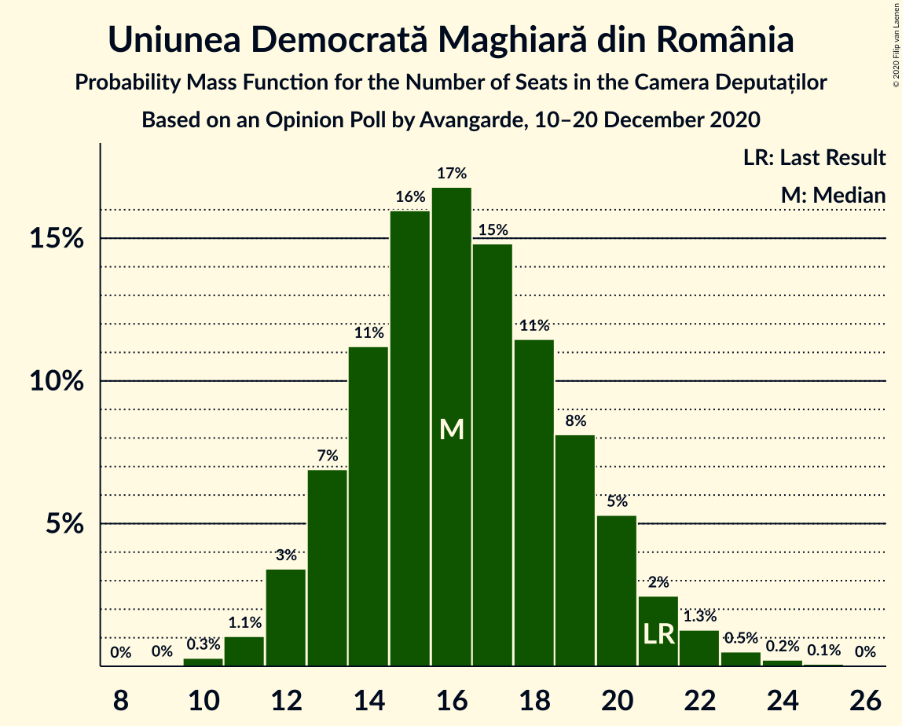

| Number of Seats | Probability | Accumulated | Special Marks |
|:---------------:|:-----------:|:-----------:|:-------------:|
| 9 | 0% | 100% |  |
| 10 | 0.3% | 99.9% |  |
| 11 | 1.1% | 99.7% |  |
| 12 | 3% | 98.6% |  |
| 13 | 7% | 95% |  |
| 14 | 11% | 88% |  |
| 15 | 16% | 77% |  |
| 16 | 17% | 61% | Median |
| 17 | 15% | 44% |  |
| 18 | 11% | 29% |  |
| 19 | 8% | 18% |  |
| 20 | 5% | 10% |  |
| 21 | 2% | 5% | Last Result |
| 22 | 1.3% | 2% |  |
| 23 | 0.5% | 0.9% |  |
| 24 | 0.2% | 0.3% |  |
| 25 | 0.1% | 0.1% |  |
| 26 | 0% | 0% |  |

### Partidul Mișcarea Populară

*For a full overview of the results for this party, see the [Partidul Mișcarea Populară](party-partidulmișcareapopulară.html) page.*

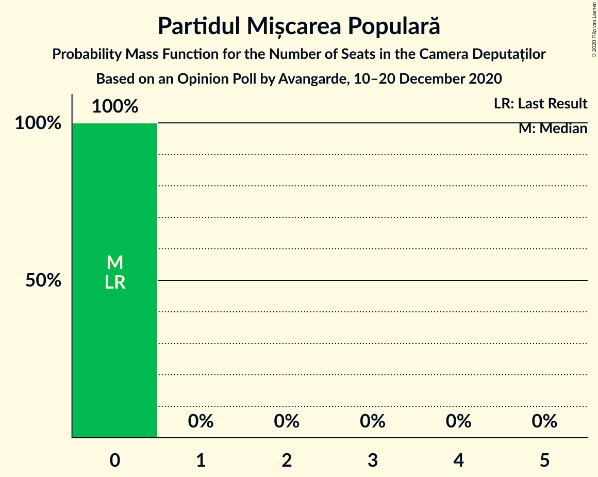

| Number of Seats | Probability | Accumulated | Special Marks |
|:---------------:|:-----------:|:-----------:|:-------------:|
| 0 | 100% | 100% | Last Result, Median |

### PRO România

*For a full overview of the results for this party, see the [PRO România](party-proromânia.html) page.*

| Number of Seats | Probability | Accumulated | Special Marks |
|:---------------:|:-----------:|:-----------:|:-------------:|
| 0 | 100% | 100% | Last Result, Median |

## Coalitions

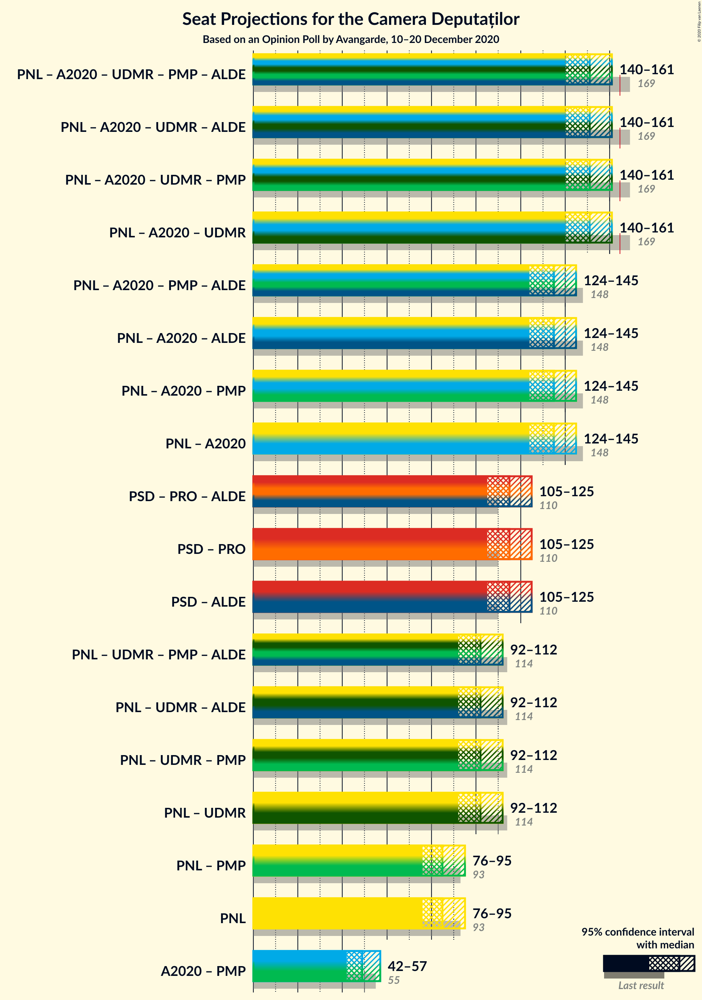

### Confidence Intervals

| Coalition | Last Result | Median | Majority? | 80% Confidence Interval | 90% Confidence Interval | 95% Confidence Interval | 99% Confidence Interval |
|:---------:|:-----------:|:------:|:---------:|:-----------------------:|:-----------------------:|:-----------------------:|:-----------------------:|
| Partidul Național Liberal – Alianța 2020 USR-PLUS – Uniunea Democrată Maghiară din România – Partidul Mișcarea Populară | 169 | 151 | 0.6% | 144–158 | 142–160 | 140–161 | 137–165 |
| Partidul Național Liberal – Alianța 2020 USR-PLUS – Uniunea Democrată Maghiară din România | 169 | 151 | 0.6% | 144–158 | 142–160 | 140–161 | 137–165 |
| Partidul Național Liberal – Alianța 2020 USR-PLUS – Partidul Mișcarea Populară | 148 | 135 | 0% | 128–142 | 126–144 | 124–145 | 121–148 |
| Partidul Național Liberal – Alianța 2020 USR-PLUS | 148 | 135 | 0% | 128–142 | 126–144 | 124–145 | 121–148 |
| Partidul Social Democrat – PRO România | 110 | 115 | 0% | 108–122 | 107–124 | 105–125 | 102–128 |
| Partidul Național Liberal – Uniunea Democrată Maghiară din România – Partidul Mișcarea Populară | 114 | 102 | 0% | 95–108 | 93–110 | 92–112 | 89–115 |
| Partidul Național Liberal – Uniunea Democrată Maghiară din România | 114 | 102 | 0% | 95–108 | 93–110 | 92–112 | 89–115 |
| Partidul Național Liberal – Partidul Mișcarea Populară | 93 | 85 | 0% | 79–92 | 78–93 | 76–95 | 73–98 |
| Partidul Național Liberal | 93 | 85 | 0% | 79–92 | 78–93 | 76–95 | 73–98 |
| Alianța 2020 USR-PLUS – Partidul Mișcarea Populară | 55 | 49 | 0% | 44–54 | 43–56 | 42–57 | 40–60 |

### Partidul Național Liberal – Alianța 2020 USR-PLUS – Uniunea Democrată Maghiară din România – Partidul Mișcarea Populară

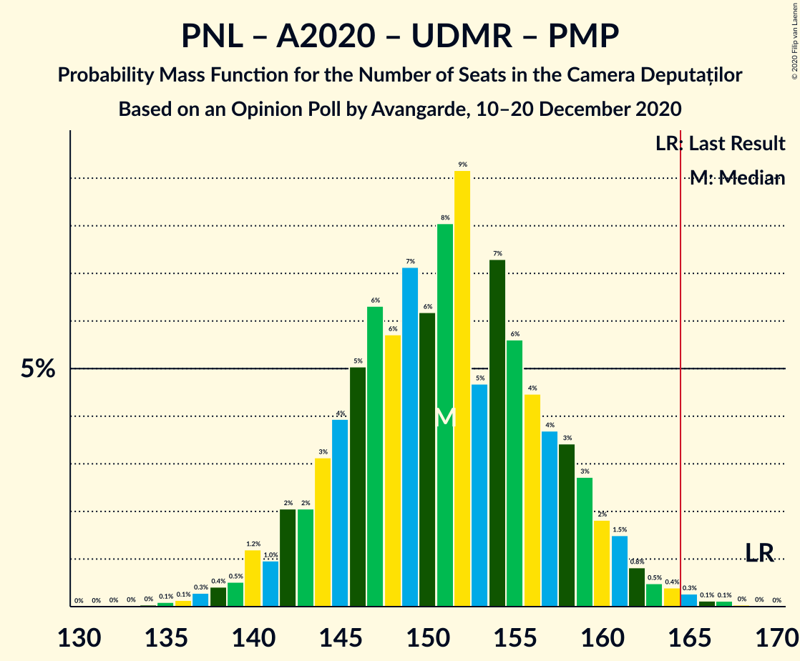

| Number of Seats | Probability | Accumulated | Special Marks |
|:---------------:|:-----------:|:-----------:|:-------------:|
| 133 | 0% | 100% |  |
| 134 | 0% | 99.9% |  |
| 135 | 0.1% | 99.9% |  |
| 136 | 0.1% | 99.8% |  |
| 137 | 0.3% | 99.7% |  |
| 138 | 0.4% | 99.4% |  |
| 139 | 0.5% | 99.0% |  |
| 140 | 1.2% | 98% |  |
| 141 | 1.0% | 97% |  |
| 142 | 2% | 96% |  |
| 143 | 2% | 94% |  |
| 144 | 3% | 92% |  |
| 145 | 4% | 89% |  |
| 146 | 5% | 85% |  |
| 147 | 6% | 80% |  |
| 148 | 6% | 74% |  |
| 149 | 7% | 68% |  |
| 150 | 6% | 61% | Median |
| 151 | 8% | 55% |  |
| 152 | 9% | 47% |  |
| 153 | 5% | 38% |  |
| 154 | 7% | 33% |  |
| 155 | 6% | 26% |  |
| 156 | 4% | 20% |  |
| 157 | 4% | 15% |  |
| 158 | 3% | 12% |  |
| 159 | 3% | 8% |  |
| 160 | 2% | 6% |  |
| 161 | 1.5% | 4% |  |
| 162 | 0.8% | 2% |  |
| 163 | 0.5% | 1.5% |  |
| 164 | 0.4% | 1.0% |  |
| 165 | 0.3% | 0.6% | Majority |
| 166 | 0.1% | 0.3% |  |
| 167 | 0.1% | 0.2% |  |
| 168 | 0% | 0.1% |  |
| 169 | 0% | 0.1% | Last Result |
| 170 | 0% | 0% |  |

### Partidul Național Liberal – Alianța 2020 USR-PLUS – Uniunea Democrată Maghiară din România

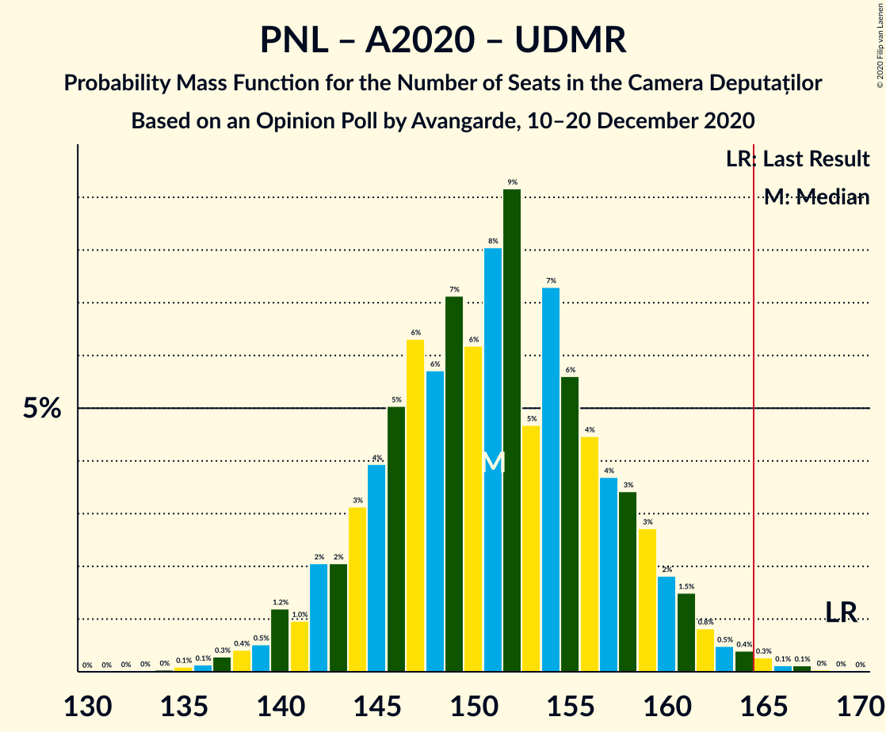

| Number of Seats | Probability | Accumulated | Special Marks |
|:---------------:|:-----------:|:-----------:|:-------------:|
| 133 | 0% | 100% |  |
| 134 | 0% | 99.9% |  |
| 135 | 0.1% | 99.9% |  |
| 136 | 0.1% | 99.8% |  |
| 137 | 0.3% | 99.7% |  |
| 138 | 0.4% | 99.4% |  |
| 139 | 0.5% | 99.0% |  |
| 140 | 1.2% | 98% |  |
| 141 | 1.0% | 97% |  |
| 142 | 2% | 96% |  |
| 143 | 2% | 94% |  |
| 144 | 3% | 92% |  |
| 145 | 4% | 89% |  |
| 146 | 5% | 85% |  |
| 147 | 6% | 80% |  |
| 148 | 6% | 74% |  |
| 149 | 7% | 68% |  |
| 150 | 6% | 61% | Median |
| 151 | 8% | 55% |  |
| 152 | 9% | 47% |  |
| 153 | 5% | 38% |  |
| 154 | 7% | 33% |  |
| 155 | 6% | 26% |  |
| 156 | 4% | 20% |  |
| 157 | 4% | 15% |  |
| 158 | 3% | 12% |  |
| 159 | 3% | 8% |  |
| 160 | 2% | 6% |  |
| 161 | 1.5% | 4% |  |
| 162 | 0.8% | 2% |  |
| 163 | 0.5% | 1.5% |  |
| 164 | 0.4% | 1.0% |  |
| 165 | 0.3% | 0.6% | Majority |
| 166 | 0.1% | 0.3% |  |
| 167 | 0.1% | 0.2% |  |
| 168 | 0% | 0.1% |  |
| 169 | 0% | 0.1% | Last Result |
| 170 | 0% | 0% |  |

### Partidul Național Liberal – Alianța 2020 USR-PLUS – Partidul Mișcarea Populară

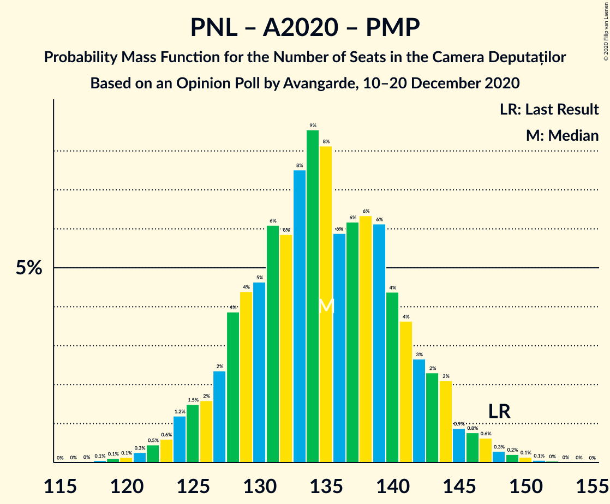

| Number of Seats | Probability | Accumulated | Special Marks |
|:---------------:|:-----------:|:-----------:|:-------------:|
| 118 | 0.1% | 100% |  |
| 119 | 0.1% | 99.9% |  |
| 120 | 0.1% | 99.8% |  |
| 121 | 0.3% | 99.7% |  |
| 122 | 0.5% | 99.4% |  |
| 123 | 0.6% | 98.9% |  |
| 124 | 1.2% | 98% |  |
| 125 | 1.5% | 97% |  |
| 126 | 2% | 96% |  |
| 127 | 2% | 94% |  |
| 128 | 4% | 92% |  |
| 129 | 4% | 88% |  |
| 130 | 5% | 83% |  |
| 131 | 6% | 79% |  |
| 132 | 6% | 73% |  |
| 133 | 8% | 67% |  |
| 134 | 9% | 59% | Median |
| 135 | 8% | 51% |  |
| 136 | 6% | 43% |  |
| 137 | 6% | 37% |  |
| 138 | 6% | 31% |  |
| 139 | 6% | 24% |  |
| 140 | 4% | 18% |  |
| 141 | 4% | 14% |  |
| 142 | 3% | 10% |  |
| 143 | 2% | 7% |  |
| 144 | 2% | 5% |  |
| 145 | 0.9% | 3% |  |
| 146 | 0.8% | 2% |  |
| 147 | 0.6% | 1.4% |  |
| 148 | 0.3% | 0.8% | Last Result |
| 149 | 0.2% | 0.5% |  |
| 150 | 0.1% | 0.3% |  |
| 151 | 0.1% | 0.1% |  |
| 152 | 0% | 0.1% |  |
| 153 | 0% | 0% |  |

### Partidul Național Liberal – Alianța 2020 USR-PLUS

| Number of Seats | Probability | Accumulated | Special Marks |
|:---------------:|:-----------:|:-----------:|:-------------:|
| 118 | 0.1% | 100% |  |
| 119 | 0.1% | 99.9% |  |
| 120 | 0.1% | 99.8% |  |
| 121 | 0.3% | 99.7% |  |
| 122 | 0.5% | 99.4% |  |
| 123 | 0.6% | 98.9% |  |
| 124 | 1.2% | 98% |  |
| 125 | 1.5% | 97% |  |
| 126 | 2% | 96% |  |
| 127 | 2% | 94% |  |
| 128 | 4% | 92% |  |
| 129 | 4% | 88% |  |
| 130 | 5% | 83% |  |
| 131 | 6% | 79% |  |
| 132 | 6% | 73% |  |
| 133 | 8% | 67% |  |
| 134 | 9% | 59% | Median |
| 135 | 8% | 51% |  |
| 136 | 6% | 43% |  |
| 137 | 6% | 37% |  |
| 138 | 6% | 31% |  |
| 139 | 6% | 24% |  |
| 140 | 4% | 18% |  |
| 141 | 4% | 14% |  |
| 142 | 3% | 10% |  |
| 143 | 2% | 7% |  |
| 144 | 2% | 5% |  |
| 145 | 0.9% | 3% |  |
| 146 | 0.8% | 2% |  |
| 147 | 0.6% | 1.4% |  |
| 148 | 0.3% | 0.8% | Last Result |
| 149 | 0.2% | 0.5% |  |
| 150 | 0.1% | 0.3% |  |
| 151 | 0.1% | 0.1% |  |
| 152 | 0% | 0.1% |  |
| 153 | 0% | 0% |  |

### Partidul Social Democrat – PRO România

| Number of Seats | Probability | Accumulated | Special Marks |
|:---------------:|:-----------:|:-----------:|:-------------:|
| 98 | 0% | 100% |  |
| 99 | 0.1% | 99.9% |  |
| 100 | 0.1% | 99.9% |  |
| 101 | 0.2% | 99.8% |  |
| 102 | 0.3% | 99.6% |  |
| 103 | 0.4% | 99.3% |  |
| 104 | 0.7% | 98.9% |  |
| 105 | 1.3% | 98% |  |
| 106 | 2% | 97% |  |
| 107 | 3% | 95% |  |
| 108 | 3% | 93% |  |
| 109 | 4% | 90% |  |
| 110 | 5% | 85% | Last Result |
| 111 | 5% | 81% |  |
| 112 | 8% | 75% |  |
| 113 | 5% | 68% |  |
| 114 | 8% | 62% |  |
| 115 | 8% | 54% | Median |
| 116 | 8% | 46% |  |
| 117 | 8% | 39% |  |
| 118 | 6% | 30% |  |
| 119 | 6% | 25% |  |
| 120 | 5% | 19% |  |
| 121 | 4% | 14% |  |
| 122 | 3% | 10% |  |
| 123 | 2% | 7% |  |
| 124 | 2% | 5% |  |
| 125 | 1.1% | 3% |  |
| 126 | 0.8% | 2% |  |
| 127 | 0.6% | 1.4% |  |
| 128 | 0.4% | 0.9% |  |
| 129 | 0.2% | 0.5% |  |
| 130 | 0.1% | 0.3% |  |
| 131 | 0.1% | 0.2% |  |
| 132 | 0% | 0.1% |  |
| 133 | 0% | 0% |  |

### Partidul Național Liberal – Uniunea Democrată Maghiară din România – Partidul Mișcarea Populară

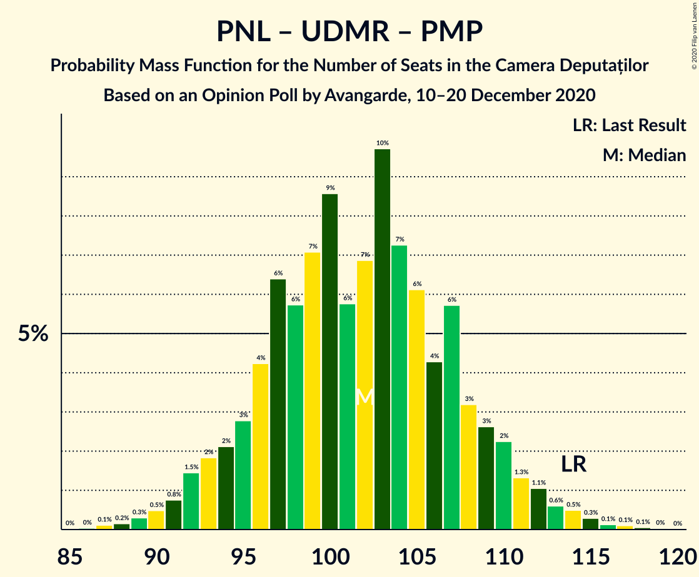

| Number of Seats | Probability | Accumulated | Special Marks |
|:---------------:|:-----------:|:-----------:|:-------------:|
| 86 | 0% | 100% |  |
| 87 | 0.1% | 99.9% |  |
| 88 | 0.2% | 99.8% |  |
| 89 | 0.3% | 99.7% |  |
| 90 | 0.5% | 99.4% |  |
| 91 | 0.8% | 98.9% |  |
| 92 | 1.5% | 98% |  |
| 93 | 2% | 97% |  |
| 94 | 2% | 95% |  |
| 95 | 3% | 93% |  |
| 96 | 4% | 90% |  |
| 97 | 6% | 86% |  |
| 98 | 6% | 79% |  |
| 99 | 7% | 74% |  |
| 100 | 9% | 66% |  |
| 101 | 6% | 58% | Median |
| 102 | 7% | 52% |  |
| 103 | 10% | 45% |  |
| 104 | 7% | 36% |  |
| 105 | 6% | 28% |  |
| 106 | 4% | 22% |  |
| 107 | 6% | 18% |  |
| 108 | 3% | 12% |  |
| 109 | 3% | 9% |  |
| 110 | 2% | 6% |  |
| 111 | 1.3% | 4% |  |
| 112 | 1.1% | 3% |  |
| 113 | 0.6% | 2% |  |
| 114 | 0.5% | 1.1% | Last Result |
| 115 | 0.3% | 0.6% |  |
| 116 | 0.1% | 0.3% |  |
| 117 | 0.1% | 0.2% |  |
| 118 | 0.1% | 0.1% |  |
| 119 | 0% | 0.1% |  |
| 120 | 0% | 0% |  |

### Partidul Național Liberal – Uniunea Democrată Maghiară din România

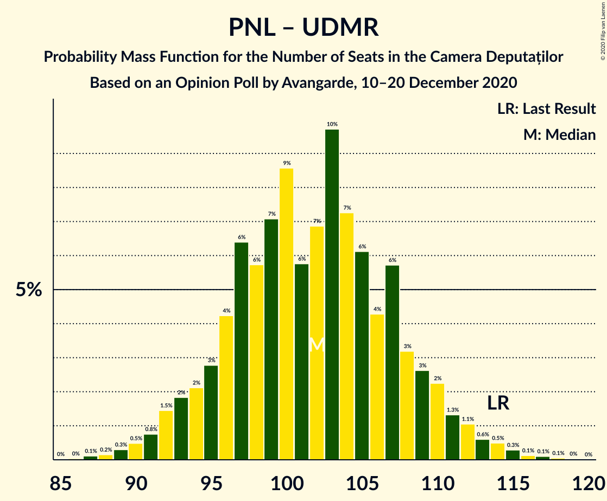

| Number of Seats | Probability | Accumulated | Special Marks |
|:---------------:|:-----------:|:-----------:|:-------------:|
| 86 | 0% | 100% |  |
| 87 | 0.1% | 99.9% |  |
| 88 | 0.2% | 99.8% |  |
| 89 | 0.3% | 99.7% |  |
| 90 | 0.5% | 99.4% |  |
| 91 | 0.8% | 98.9% |  |
| 92 | 1.5% | 98% |  |
| 93 | 2% | 97% |  |
| 94 | 2% | 95% |  |
| 95 | 3% | 93% |  |
| 96 | 4% | 90% |  |
| 97 | 6% | 86% |  |
| 98 | 6% | 79% |  |
| 99 | 7% | 74% |  |
| 100 | 9% | 66% |  |
| 101 | 6% | 58% | Median |
| 102 | 7% | 52% |  |
| 103 | 10% | 45% |  |
| 104 | 7% | 36% |  |
| 105 | 6% | 28% |  |
| 106 | 4% | 22% |  |
| 107 | 6% | 18% |  |
| 108 | 3% | 12% |  |
| 109 | 3% | 9% |  |
| 110 | 2% | 6% |  |
| 111 | 1.3% | 4% |  |
| 112 | 1.1% | 3% |  |
| 113 | 0.6% | 2% |  |
| 114 | 0.5% | 1.1% | Last Result |
| 115 | 0.3% | 0.6% |  |
| 116 | 0.1% | 0.3% |  |
| 117 | 0.1% | 0.2% |  |
| 118 | 0.1% | 0.1% |  |
| 119 | 0% | 0.1% |  |
| 120 | 0% | 0% |  |

### Partidul Național Liberal – Partidul Mișcarea Populară

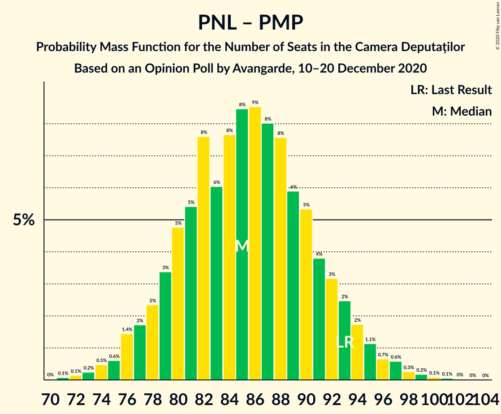

| Number of Seats | Probability | Accumulated | Special Marks |
|:---------------:|:-----------:|:-----------:|:-------------:|
| 70 | 0% | 100% |  |
| 71 | 0.1% | 99.9% |  |
| 72 | 0.1% | 99.9% |  |
| 73 | 0.2% | 99.7% |  |
| 74 | 0.5% | 99.5% |  |
| 75 | 0.6% | 99.0% |  |
| 76 | 1.4% | 98% |  |
| 77 | 2% | 97% |  |
| 78 | 2% | 95% |  |
| 79 | 3% | 93% |  |
| 80 | 5% | 90% |  |
| 81 | 5% | 85% |  |
| 82 | 8% | 79% |  |
| 83 | 6% | 72% |  |
| 84 | 8% | 66% |  |
| 85 | 8% | 58% | Median |
| 86 | 9% | 50% |  |
| 87 | 8% | 41% |  |
| 88 | 8% | 33% |  |
| 89 | 6% | 25% |  |
| 90 | 5% | 20% |  |
| 91 | 4% | 14% |  |
| 92 | 3% | 10% |  |
| 93 | 2% | 7% | Last Result |
| 94 | 2% | 5% |  |
| 95 | 1.1% | 3% |  |
| 96 | 0.7% | 2% |  |
| 97 | 0.6% | 1.2% |  |
| 98 | 0.3% | 0.6% |  |
| 99 | 0.2% | 0.4% |  |
| 100 | 0.1% | 0.2% |  |
| 101 | 0.1% | 0.1% |  |
| 102 | 0% | 0.1% |  |
| 103 | 0% | 0% |  |

### Partidul Național Liberal

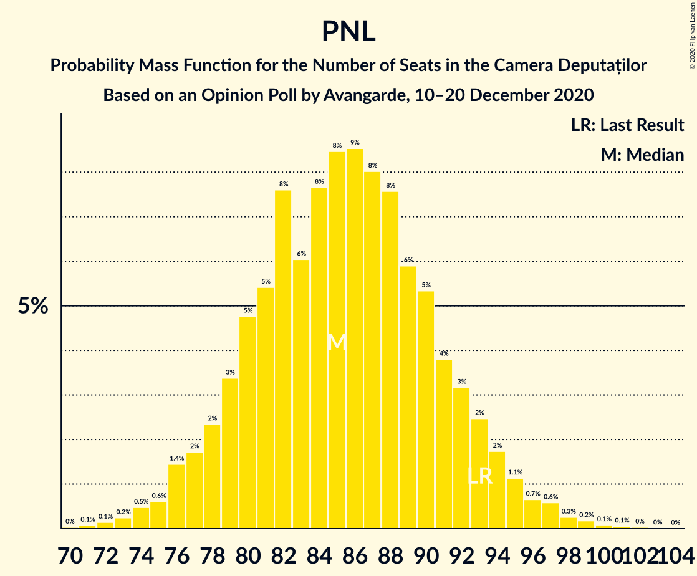

| Number of Seats | Probability | Accumulated | Special Marks |
|:---------------:|:-----------:|:-----------:|:-------------:|
| 70 | 0% | 100% |  |
| 71 | 0.1% | 99.9% |  |
| 72 | 0.1% | 99.9% |  |
| 73 | 0.2% | 99.7% |  |
| 74 | 0.5% | 99.5% |  |
| 75 | 0.6% | 99.0% |  |
| 76 | 1.4% | 98% |  |
| 77 | 2% | 97% |  |
| 78 | 2% | 95% |  |
| 79 | 3% | 93% |  |
| 80 | 5% | 90% |  |
| 81 | 5% | 85% |  |
| 82 | 8% | 79% |  |
| 83 | 6% | 72% |  |
| 84 | 8% | 66% |  |
| 85 | 8% | 58% | Median |
| 86 | 9% | 50% |  |
| 87 | 8% | 41% |  |
| 88 | 8% | 33% |  |
| 89 | 6% | 25% |  |
| 90 | 5% | 20% |  |
| 91 | 4% | 14% |  |
| 92 | 3% | 10% |  |
| 93 | 2% | 7% | Last Result |
| 94 | 2% | 5% |  |
| 95 | 1.1% | 3% |  |
| 96 | 0.7% | 2% |  |
| 97 | 0.6% | 1.2% |  |
| 98 | 0.3% | 0.6% |  |
| 99 | 0.2% | 0.4% |  |
| 100 | 0.1% | 0.2% |  |
| 101 | 0.1% | 0.1% |  |
| 102 | 0% | 0.1% |  |
| 103 | 0% | 0% |  |

### Alianța 2020 USR-PLUS – Partidul Mișcarea Populară

| Number of Seats | Probability | Accumulated | Special Marks |
|:---------------:|:-----------:|:-----------:|:-------------:|
| 37 | 0% | 100% |  |
| 38 | 0.1% | 99.9% |  |
| 39 | 0.3% | 99.8% |  |
| 40 | 0.5% | 99.6% |  |
| 41 | 1.0% | 99.1% |  |
| 42 | 2% | 98% |  |
| 43 | 3% | 96% |  |
| 44 | 4% | 93% |  |
| 45 | 6% | 89% |  |
| 46 | 7% | 83% |  |
| 47 | 8% | 75% |  |
| 48 | 9% | 67% |  |
| 49 | 10% | 58% | Median |
| 50 | 10% | 48% |  |
| 51 | 9% | 38% |  |
| 52 | 8% | 28% |  |
| 53 | 6% | 20% |  |
| 54 | 4% | 14% |  |
| 55 | 4% | 10% | Last Result |
| 56 | 2% | 6% |  |
| 57 | 1.4% | 3% |  |
| 58 | 0.8% | 2% |  |
| 59 | 0.6% | 1.1% |  |
| 60 | 0.3% | 0.6% |  |
| 61 | 0.2% | 0.3% |  |
| 62 | 0.1% | 0.2% |  |
| 63 | 0% | 0.1% |  |
| 64 | 0% | 0% |  |

## Technical Information

### Opinion Poll

+ **Polling firm:** Avangarde
+ **Commissioner(s):** —
+ **Fieldwork period:** 10–20 December 2020

### Calculations

+ **Sample size:** 900
+ **Simulations done:** 1,048,576
+ **Error estimate:** 0.75%

