# Opinion Poll by IRES, 1–31 May 2021

<a href="#voting-intentions">Voting Intentions</a> | <a href="#seats">Seats</a> | <a href="#coalitions">Coalitions</a> | <a href="#technical-information">Technical Information</a>

## Voting Intentions

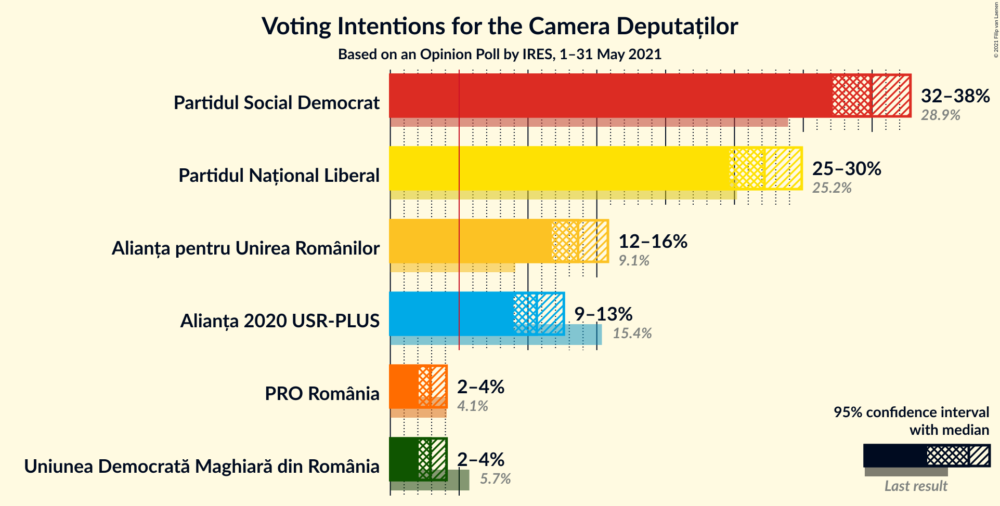

### Confidence Intervals

| Party | Last Result | Poll Result | 80% Confidence Interval | 90% Confidence Interval | 95% Confidence Interval | 99% Confidence Interval |
|:-----:|:-----------:|:-----------:|:-----------------------:|:-----------------------:|:-----------------------:|:-----------------------:|
| Partidul Social Democrat | 28.9% | 34.9% | 33.1–36.8% |32.6–37.3% |32.1–37.8% |31.3–38.7% |
| Partidul Național Liberal | 25.2% | 27.2% | 25.5–29.0% |25.0–29.5% |24.6–29.9% |23.8–30.8% |
| Alianța pentru Unirea Românilor | 9.1% | 13.6% | 12.4–15.0% |12.0–15.5% |11.7–15.8% |11.2–16.5% |
| Alianța 2020 USR-PLUS | 15.4% | 10.6% | 9.5–11.9% |9.2–12.3% |8.9–12.6% |8.4–13.2% |
| Uniunea Democrată Maghiară din România | 5.7% | 2.9% | 2.3–3.7% |2.2–3.9% |2.1–4.1% |1.8–4.5% |
| PRO România | 4.1% | 2.9% | 2.3–3.7% |2.2–3.9% |2.1–4.1% |1.8–4.5% |

*Note:* The poll result column reflects the actual value used in the calculations. Published results may vary slightly, and in addition be rounded to fewer digits.

## Seats

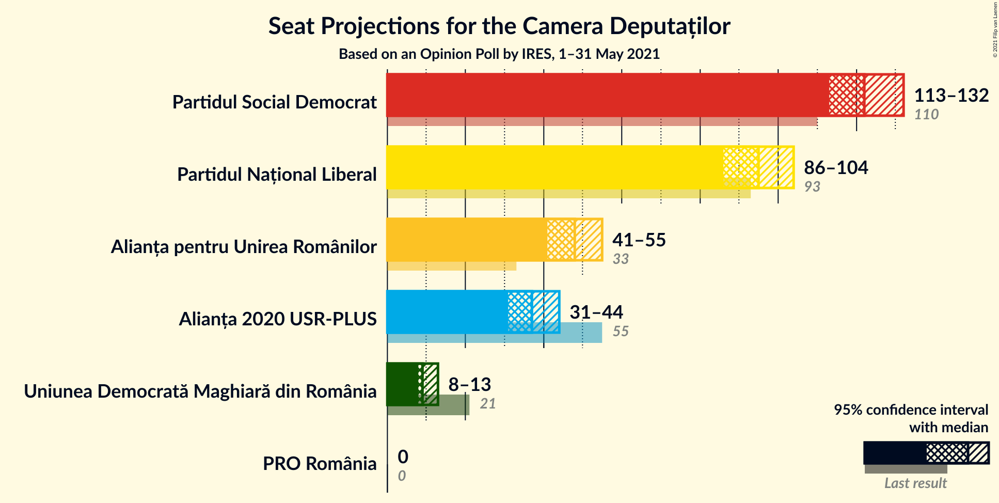

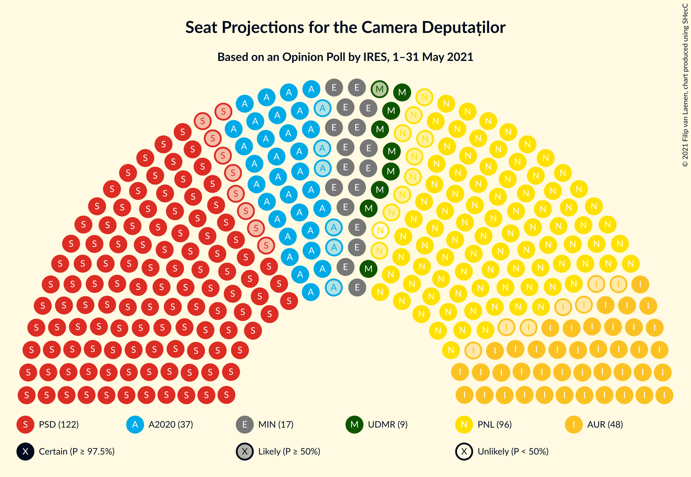

### Confidence Intervals

| Party | Last Result | Median | 80% Confidence Interval | 90% Confidence Interval | 95% Confidence Interval | 99% Confidence Interval |
|:-----:|:-----------:|:------:|:-----------------------:|:-----------------------:|:-----------------------:|:-----------------------:|
| <a href="#partidul-social-democrat">Partidul Social Democrat</a> | 110 | 122 | 116–129 |114–130 |113–132 |110–135 |
| <a href="#partidul-național-liberal">Partidul Național Liberal</a> | 93 | 95 | 89–101 |88–103 |86–104 |84–107 |
| <a href="#alianța-pentru-unirea-românilor">Alianța pentru Unirea Românilor</a> | 33 | 48 | 43–52 |42–54 |41–55 |39–57 |
| <a href="#alianța-2020-usr-plus">Alianța 2020 USR-PLUS</a> | 55 | 37 | 33–41 |32–43 |31–44 |29–46 |
| <a href="#uniunea-democrată-maghiară-din-românia">Uniunea Democrată Maghiară din România</a> | 21 | 9 | 8–12 |8–12 |8–13 |7–16 |
| <a href="#pro-românia">PRO România</a> | 0 | 0 | 0 |0 |0 |0 |

### Partidul Social Democrat

*For a full overview of the results for this party, see the [Partidul Social Democrat](party-partidulsocialdemocrat.html) page.*

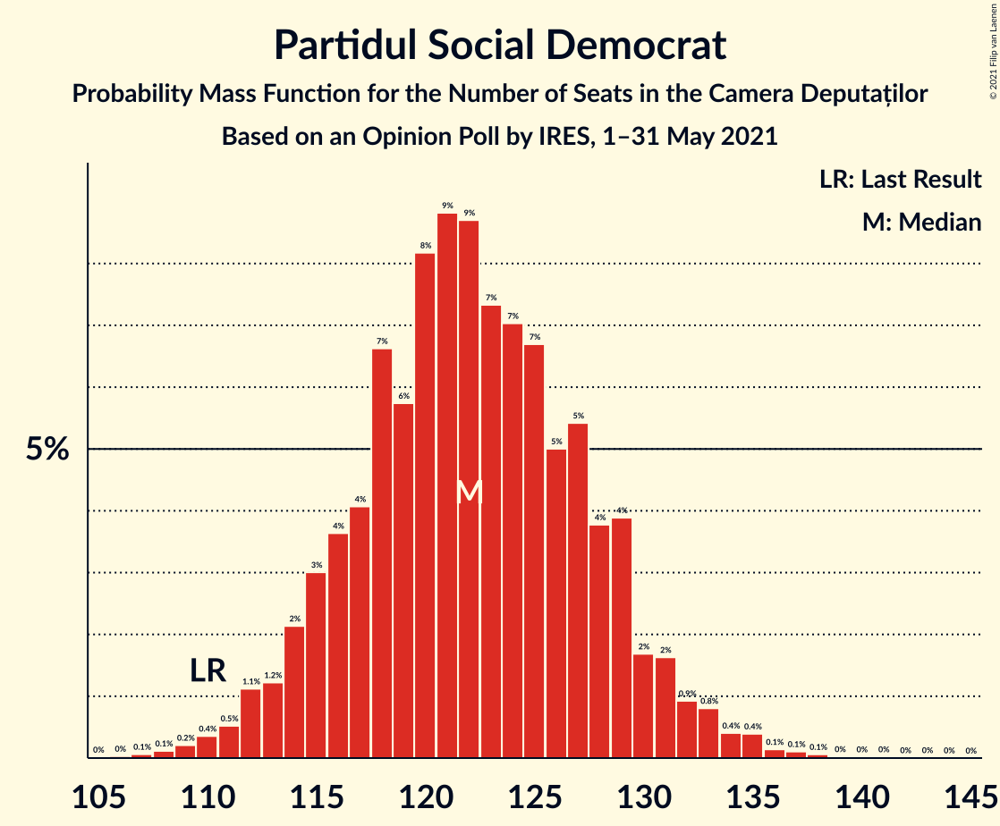

| Number of Seats | Probability | Accumulated | Special Marks |
|:---------------:|:-----------:|:-----------:|:-------------:|
| 106 | 0% | 100% |  |
| 107 | 0.1% | 99.9% |  |
| 108 | 0.1% | 99.9% |  |
| 109 | 0.2% | 99.8% |  |
| 110 | 0.4% | 99.6% | Last Result |
| 111 | 0.5% | 99.2% |  |
| 112 | 1.1% | 98.7% |  |
| 113 | 1.2% | 98% |  |
| 114 | 2% | 96% |  |
| 115 | 3% | 94% |  |
| 116 | 4% | 91% |  |
| 117 | 4% | 88% |  |
| 118 | 7% | 83% |  |
| 119 | 6% | 77% |  |
| 120 | 8% | 71% |  |
| 121 | 9% | 63% |  |
| 122 | 9% | 54% | Median |
| 123 | 7% | 45% |  |
| 124 | 7% | 38% |  |
| 125 | 7% | 31% |  |
| 126 | 5% | 24% |  |
| 127 | 5% | 19% |  |
| 128 | 4% | 14% |  |
| 129 | 4% | 10% |  |
| 130 | 2% | 6% |  |
| 131 | 2% | 5% |  |
| 132 | 0.9% | 3% |  |
| 133 | 0.8% | 2% |  |
| 134 | 0.4% | 1.2% |  |
| 135 | 0.4% | 0.8% |  |
| 136 | 0.1% | 0.4% |  |
| 137 | 0.1% | 0.3% |  |
| 138 | 0.1% | 0.2% |  |
| 139 | 0% | 0.1% |  |
| 140 | 0% | 0.1% |  |
| 141 | 0% | 0.1% |  |
| 142 | 0% | 0% |  |

### Partidul Național Liberal

*For a full overview of the results for this party, see the [Partidul Național Liberal](party-partidulnaționalliberal.html) page.*

| Number of Seats | Probability | Accumulated | Special Marks |
|:---------------:|:-----------:|:-----------:|:-------------:|
| 80 | 0% | 100% |  |
| 81 | 0.1% | 99.9% |  |
| 82 | 0.1% | 99.9% |  |
| 83 | 0.2% | 99.7% |  |
| 84 | 0.5% | 99.5% |  |
| 85 | 0.6% | 99.0% |  |
| 86 | 1.2% | 98% |  |
| 87 | 2% | 97% |  |
| 88 | 2% | 95% |  |
| 89 | 4% | 93% |  |
| 90 | 4% | 89% |  |
| 91 | 6% | 85% |  |
| 92 | 8% | 79% |  |
| 93 | 6% | 71% | Last Result |
| 94 | 11% | 65% |  |
| 95 | 7% | 54% | Median |
| 96 | 9% | 48% |  |
| 97 | 8% | 38% |  |
| 98 | 6% | 30% |  |
| 99 | 6% | 24% |  |
| 100 | 4% | 17% |  |
| 101 | 4% | 13% |  |
| 102 | 3% | 9% |  |
| 103 | 2% | 6% |  |
| 104 | 1.5% | 4% |  |
| 105 | 1.0% | 2% |  |
| 106 | 0.6% | 1.4% |  |
| 107 | 0.4% | 0.9% |  |
| 108 | 0.2% | 0.5% |  |
| 109 | 0.1% | 0.3% |  |
| 110 | 0.1% | 0.1% |  |
| 111 | 0% | 0.1% |  |
| 112 | 0% | 0.1% |  |
| 113 | 0% | 0% |  |

### Alianța pentru Unirea Românilor

*For a full overview of the results for this party, see the [Alianța pentru Unirea Românilor](party-alianțapentruunirearomânilor.html) page.*

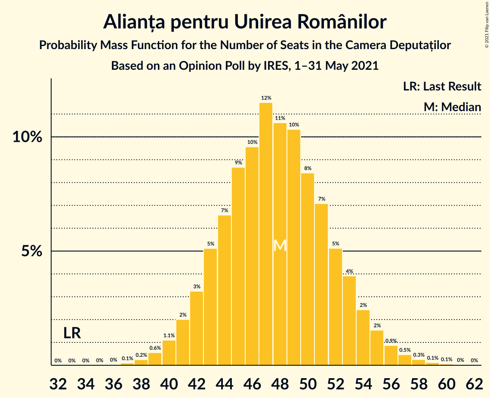

| Number of Seats | Probability | Accumulated | Special Marks |
|:---------------:|:-----------:|:-----------:|:-------------:|
| 33 | 0% | 100% | Last Result |
| 34 | 0% | 100% |  |
| 35 | 0% | 100% |  |
| 36 | 0% | 100% |  |
| 37 | 0.1% | 99.9% |  |
| 38 | 0.2% | 99.9% |  |
| 39 | 0.6% | 99.6% |  |
| 40 | 1.1% | 99.0% |  |
| 41 | 2% | 98% |  |
| 42 | 3% | 96% |  |
| 43 | 5% | 93% |  |
| 44 | 7% | 88% |  |
| 45 | 9% | 81% |  |
| 46 | 10% | 72% |  |
| 47 | 12% | 63% |  |
| 48 | 11% | 51% | Median |
| 49 | 10% | 41% |  |
| 50 | 8% | 30% |  |
| 51 | 7% | 22% |  |
| 52 | 5% | 15% |  |
| 53 | 4% | 10% |  |
| 54 | 2% | 6% |  |
| 55 | 2% | 3% |  |
| 56 | 0.9% | 2% |  |
| 57 | 0.5% | 0.9% |  |
| 58 | 0.3% | 0.5% |  |
| 59 | 0.1% | 0.2% |  |
| 60 | 0.1% | 0.1% |  |
| 61 | 0% | 0% |  |

### Alianța 2020 USR-PLUS

*For a full overview of the results for this party, see the [Alianța 2020 USR-PLUS](party-alianța2020usr-plus.html) page.*

| Number of Seats | Probability | Accumulated | Special Marks |
|:---------------:|:-----------:|:-----------:|:-------------:|
| 0 | 0.1% | 100% |  |
| 1 | 0% | 99.9% |  |
| 2 | 0% | 99.9% |  |
| 3 | 0% | 99.9% |  |
| 4 | 0% | 99.9% |  |
| 5 | 0% | 99.9% |  |
| 6 | 0% | 99.9% |  |
| 7 | 0% | 99.9% |  |
| 8 | 0% | 99.9% |  |
| 9 | 0% | 99.9% |  |
| 10 | 0% | 99.9% |  |
| 11 | 0% | 99.9% |  |
| 12 | 0% | 99.9% |  |
| 13 | 0% | 99.9% |  |
| 14 | 0% | 99.9% |  |
| 15 | 0% | 99.9% |  |
| 16 | 0% | 99.9% |  |
| 17 | 0% | 99.9% |  |
| 18 | 0% | 99.9% |  |
| 19 | 0% | 99.9% |  |
| 20 | 0% | 99.9% |  |
| 21 | 0% | 99.9% |  |
| 22 | 0% | 99.9% |  |
| 23 | 0% | 99.9% |  |
| 24 | 0% | 99.9% |  |
| 25 | 0% | 99.9% |  |
| 26 | 0% | 99.9% |  |
| 27 | 0% | 99.9% |  |
| 28 | 0.1% | 99.9% |  |
| 29 | 0.4% | 99.8% |  |
| 30 | 0.9% | 99.3% |  |
| 31 | 2% | 98% |  |
| 32 | 4% | 96% |  |
| 33 | 6% | 92% |  |
| 34 | 9% | 86% |  |
| 35 | 11% | 78% |  |
| 36 | 11% | 67% |  |
| 37 | 12% | 56% | Median |
| 38 | 11% | 43% |  |
| 39 | 11% | 32% |  |
| 40 | 8% | 22% |  |
| 41 | 5% | 14% |  |
| 42 | 4% | 9% |  |
| 43 | 2% | 5% |  |
| 44 | 1.4% | 3% |  |
| 45 | 0.7% | 1.4% |  |
| 46 | 0.4% | 0.7% |  |
| 47 | 0.2% | 0.3% |  |
| 48 | 0.1% | 0.1% |  |
| 49 | 0% | 0.1% |  |
| 50 | 0% | 0% |  |
| 51 | 0% | 0% |  |
| 52 | 0% | 0% |  |
| 53 | 0% | 0% |  |
| 54 | 0% | 0% |  |
| 55 | 0% | 0% | Last Result |

### Uniunea Democrată Maghiară din România

*For a full overview of the results for this party, see the [Uniunea Democrată Maghiară din România](party-uniuneademocratămaghiarădinromânia.html) page.*

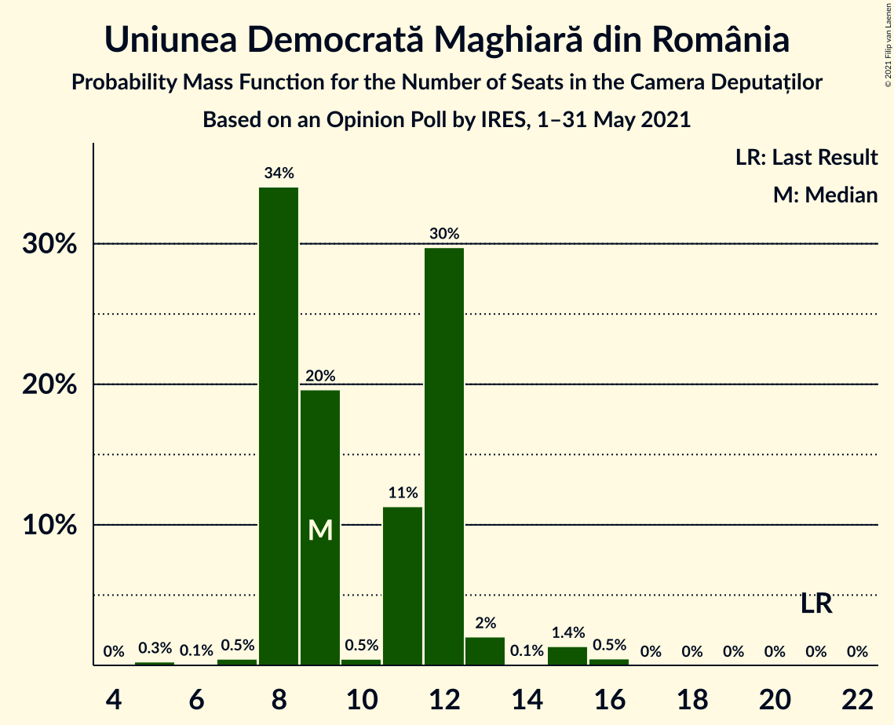

| Number of Seats | Probability | Accumulated | Special Marks |
|:---------------:|:-----------:|:-----------:|:-------------:|
| 5 | 0.3% | 100% |  |
| 6 | 0.1% | 99.7% |  |
| 7 | 0.5% | 99.6% |  |
| 8 | 34% | 99.2% |  |
| 9 | 20% | 65% | Median |
| 10 | 0.5% | 45% |  |
| 11 | 11% | 45% |  |
| 12 | 30% | 34% |  |
| 13 | 2% | 4% |  |
| 14 | 0.1% | 2% |  |
| 15 | 1.4% | 2% |  |
| 16 | 0.5% | 0.5% |  |
| 17 | 0% | 0% |  |
| 18 | 0% | 0% |  |
| 19 | 0% | 0% |  |
| 20 | 0% | 0% |  |
| 21 | 0% | 0% | Last Result |

### PRO România

*For a full overview of the results for this party, see the [PRO România](party-proromânia.html) page.*

| Number of Seats | Probability | Accumulated | Special Marks |
|:---------------:|:-----------:|:-----------:|:-------------:|
| 0 | 100% | 100% | Last Result, Median |

## Coalitions

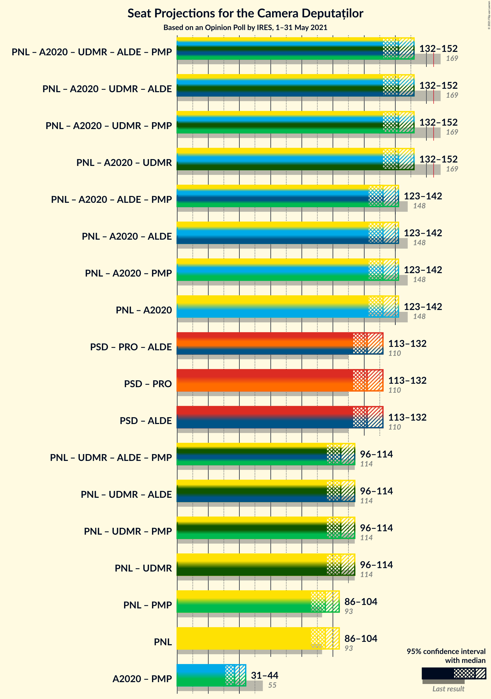

### Confidence Intervals

| Coalition | Last Result | Median | Majority? | 80% Confidence Interval | 90% Confidence Interval | 95% Confidence Interval | 99% Confidence Interval |
|:---------:|:-----------:|:------:|:---------:|:-----------------------:|:-----------------------:|:-----------------------:|:-----------------------:|
| Partidul Național Liberal – Alianța 2020 USR-PLUS – Uniunea Democrată Maghiară din România | 169 | 142 | 0% | 136–149 | 134–150 | 132–152 | 129–155 |
| Partidul Național Liberal – Alianța 2020 USR-PLUS | 148 | 132 | 0% | 126–139 | 124–140 | 123–142 | 119–145 |
| Partidul Social Democrat – PRO România | 110 | 122 | 0% | 116–129 | 114–130 | 113–132 | 110–135 |
| Partidul Național Liberal – Uniunea Democrată Maghiară din România | 114 | 105 | 0% | 99–111 | 97–113 | 96–114 | 93–118 |
| Partidul Național Liberal | 93 | 95 | 0% | 89–101 | 88–103 | 86–104 | 84–107 |

### Partidul Național Liberal – Alianța 2020 USR-PLUS – Uniunea Democrată Maghiară din România

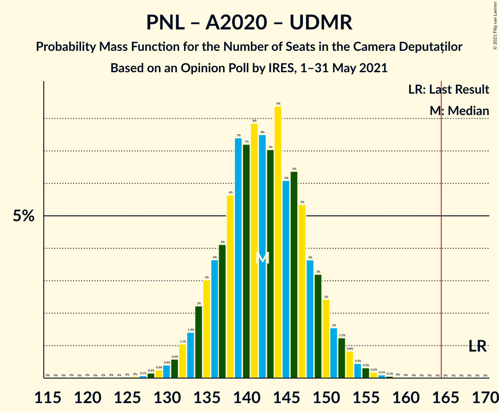

| Number of Seats | Probability | Accumulated | Special Marks |
|:---------------:|:-----------:|:-----------:|:-------------:|
| 118 | 0% | 100% |  |
| 119 | 0% | 99.9% |  |
| 120 | 0% | 99.9% |  |
| 121 | 0% | 99.9% |  |
| 122 | 0% | 99.9% |  |
| 123 | 0% | 99.9% |  |
| 124 | 0% | 99.9% |  |
| 125 | 0% | 99.9% |  |
| 126 | 0% | 99.9% |  |
| 127 | 0.1% | 99.8% |  |
| 128 | 0.2% | 99.8% |  |
| 129 | 0.3% | 99.6% |  |
| 130 | 0.4% | 99.3% |  |
| 131 | 0.6% | 98.9% |  |
| 132 | 1.1% | 98% |  |
| 133 | 1.4% | 97% |  |
| 134 | 2% | 96% |  |
| 135 | 3% | 94% |  |
| 136 | 4% | 91% |  |
| 137 | 4% | 87% |  |
| 138 | 6% | 83% |  |
| 139 | 7% | 77% |  |
| 140 | 7% | 70% |  |
| 141 | 8% | 63% | Median |
| 142 | 8% | 55% |  |
| 143 | 7% | 47% |  |
| 144 | 8% | 40% |  |
| 145 | 6% | 32% |  |
| 146 | 6% | 26% |  |
| 147 | 5% | 19% |  |
| 148 | 4% | 14% |  |
| 149 | 3% | 10% |  |
| 150 | 2% | 7% |  |
| 151 | 2% | 5% |  |
| 152 | 1.2% | 3% |  |
| 153 | 0.8% | 2% |  |
| 154 | 0.5% | 1.2% |  |
| 155 | 0.3% | 0.7% |  |
| 156 | 0.2% | 0.4% |  |
| 157 | 0.1% | 0.2% |  |
| 158 | 0.1% | 0.1% |  |
| 159 | 0% | 0.1% |  |
| 160 | 0% | 0% |  |
| 161 | 0% | 0% |  |
| 162 | 0% | 0% |  |
| 163 | 0% | 0% |  |
| 164 | 0% | 0% |  |
| 165 | 0% | 0% | Majority |
| 166 | 0% | 0% |  |
| 167 | 0% | 0% |  |
| 168 | 0% | 0% |  |
| 169 | 0% | 0% | Last Result |

### Partidul Național Liberal – Alianța 2020 USR-PLUS

| Number of Seats | Probability | Accumulated | Special Marks |
|:---------------:|:-----------:|:-----------:|:-------------:|
| 108 | 0% | 100% |  |
| 109 | 0% | 99.9% |  |
| 110 | 0% | 99.9% |  |
| 111 | 0% | 99.9% |  |
| 112 | 0% | 99.9% |  |
| 113 | 0% | 99.9% |  |
| 114 | 0% | 99.9% |  |
| 115 | 0% | 99.9% |  |
| 116 | 0% | 99.9% |  |
| 117 | 0.1% | 99.8% |  |
| 118 | 0.1% | 99.8% |  |
| 119 | 0.2% | 99.6% |  |
| 120 | 0.4% | 99.4% |  |
| 121 | 0.7% | 99.0% |  |
| 122 | 0.8% | 98% |  |
| 123 | 2% | 98% |  |
| 124 | 2% | 96% |  |
| 125 | 3% | 94% |  |
| 126 | 4% | 91% |  |
| 127 | 5% | 88% |  |
| 128 | 6% | 83% |  |
| 129 | 6% | 77% |  |
| 130 | 8% | 71% |  |
| 131 | 8% | 63% |  |
| 132 | 7% | 55% | Median |
| 133 | 9% | 48% |  |
| 134 | 7% | 39% |  |
| 135 | 7% | 33% |  |
| 136 | 6% | 25% |  |
| 137 | 5% | 19% |  |
| 138 | 4% | 15% |  |
| 139 | 3% | 10% |  |
| 140 | 2% | 7% |  |
| 141 | 2% | 5% |  |
| 142 | 1.1% | 3% |  |
| 143 | 0.7% | 2% |  |
| 144 | 0.6% | 1.2% |  |
| 145 | 0.3% | 0.7% |  |
| 146 | 0.2% | 0.4% |  |
| 147 | 0.1% | 0.2% |  |
| 148 | 0% | 0.1% | Last Result |
| 149 | 0% | 0.1% |  |
| 150 | 0% | 0% |  |

### Partidul Social Democrat – PRO România

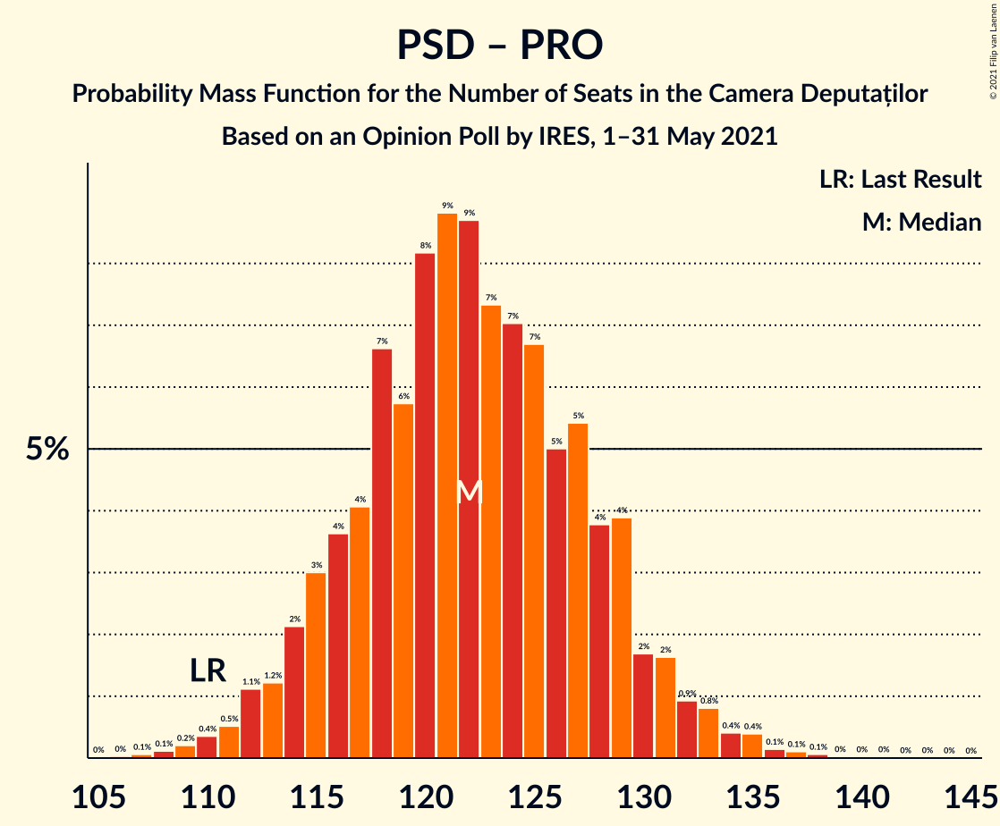

| Number of Seats | Probability | Accumulated | Special Marks |
|:---------------:|:-----------:|:-----------:|:-------------:|
| 106 | 0% | 100% |  |
| 107 | 0.1% | 99.9% |  |
| 108 | 0.1% | 99.9% |  |
| 109 | 0.2% | 99.8% |  |
| 110 | 0.4% | 99.6% | Last Result |
| 111 | 0.5% | 99.2% |  |
| 112 | 1.1% | 98.7% |  |
| 113 | 1.2% | 98% |  |
| 114 | 2% | 96% |  |
| 115 | 3% | 94% |  |
| 116 | 4% | 91% |  |
| 117 | 4% | 88% |  |
| 118 | 7% | 84% |  |
| 119 | 6% | 77% |  |
| 120 | 8% | 71% |  |
| 121 | 9% | 63% |  |
| 122 | 9% | 54% | Median |
| 123 | 7% | 45% |  |
| 124 | 7% | 38% |  |
| 125 | 7% | 31% |  |
| 126 | 5% | 24% |  |
| 127 | 5% | 19% |  |
| 128 | 4% | 14% |  |
| 129 | 4% | 10% |  |
| 130 | 2% | 6% |  |
| 131 | 2% | 5% |  |
| 132 | 0.9% | 3% |  |
| 133 | 0.8% | 2% |  |
| 134 | 0.4% | 1.2% |  |
| 135 | 0.4% | 0.8% |  |
| 136 | 0.1% | 0.4% |  |
| 137 | 0.1% | 0.3% |  |
| 138 | 0.1% | 0.2% |  |
| 139 | 0% | 0.1% |  |
| 140 | 0% | 0.1% |  |
| 141 | 0% | 0.1% |  |
| 142 | 0% | 0% |  |

### Partidul Național Liberal – Uniunea Democrată Maghiară din România

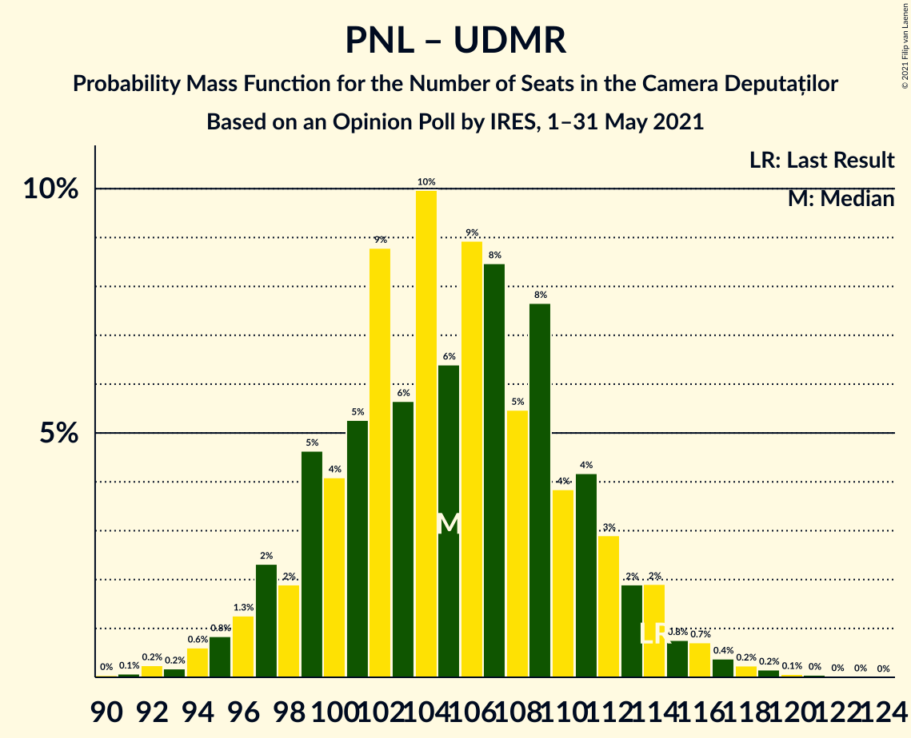

| Number of Seats | Probability | Accumulated | Special Marks |
|:---------------:|:-----------:|:-----------:|:-------------:|
| 90 | 0% | 100% |  |
| 91 | 0.1% | 99.9% |  |
| 92 | 0.2% | 99.8% |  |
| 93 | 0.2% | 99.6% |  |
| 94 | 0.6% | 99.4% |  |
| 95 | 0.8% | 98.8% |  |
| 96 | 1.3% | 98% |  |
| 97 | 2% | 97% |  |
| 98 | 2% | 94% |  |
| 99 | 5% | 92% |  |
| 100 | 4% | 88% |  |
| 101 | 5% | 84% |  |
| 102 | 9% | 79% |  |
| 103 | 6% | 70% |  |
| 104 | 10% | 64% | Median |
| 105 | 6% | 54% |  |
| 106 | 9% | 48% |  |
| 107 | 8% | 39% |  |
| 108 | 5% | 30% |  |
| 109 | 8% | 25% |  |
| 110 | 4% | 17% |  |
| 111 | 4% | 13% |  |
| 112 | 3% | 9% |  |
| 113 | 2% | 6% |  |
| 114 | 2% | 4% | Last Result |
| 115 | 0.8% | 2% |  |
| 116 | 0.7% | 2% |  |
| 117 | 0.4% | 1.0% |  |
| 118 | 0.2% | 0.6% |  |
| 119 | 0.2% | 0.3% |  |
| 120 | 0.1% | 0.2% |  |
| 121 | 0% | 0.1% |  |
| 122 | 0% | 0.1% |  |
| 123 | 0% | 0% |  |

### Partidul Național Liberal

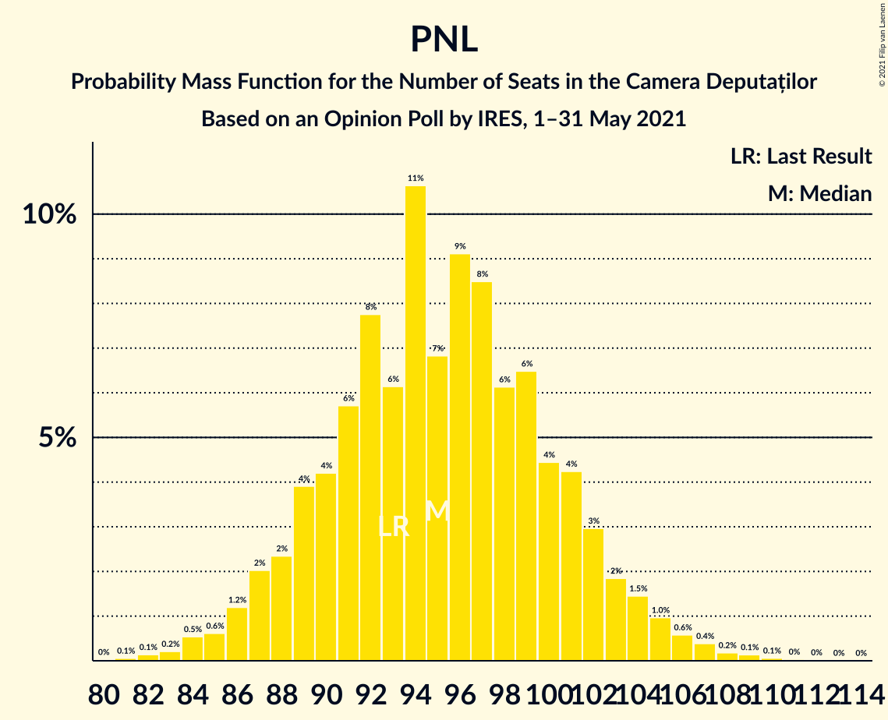

| Number of Seats | Probability | Accumulated | Special Marks |
|:---------------:|:-----------:|:-----------:|:-------------:|
| 80 | 0% | 100% |  |
| 81 | 0.1% | 99.9% |  |
| 82 | 0.1% | 99.9% |  |
| 83 | 0.2% | 99.7% |  |
| 84 | 0.5% | 99.5% |  |
| 85 | 0.6% | 99.0% |  |
| 86 | 1.2% | 98% |  |
| 87 | 2% | 97% |  |
| 88 | 2% | 95% |  |
| 89 | 4% | 93% |  |
| 90 | 4% | 89% |  |
| 91 | 6% | 85% |  |
| 92 | 8% | 79% |  |
| 93 | 6% | 71% | Last Result |
| 94 | 11% | 65% |  |
| 95 | 7% | 54% | Median |
| 96 | 9% | 48% |  |
| 97 | 8% | 38% |  |
| 98 | 6% | 30% |  |
| 99 | 6% | 24% |  |
| 100 | 4% | 17% |  |
| 101 | 4% | 13% |  |
| 102 | 3% | 9% |  |
| 103 | 2% | 6% |  |
| 104 | 1.5% | 4% |  |
| 105 | 1.0% | 2% |  |
| 106 | 0.6% | 1.4% |  |
| 107 | 0.4% | 0.9% |  |
| 108 | 0.2% | 0.5% |  |
| 109 | 0.1% | 0.3% |  |
| 110 | 0.1% | 0.1% |  |
| 111 | 0% | 0.1% |  |
| 112 | 0% | 0.1% |  |
| 113 | 0% | 0% |  |

## Technical Information

### Opinion Poll

+ **Polling firm:** IRES
+ **Commissioner(s):** —
+ **Fieldwork period:** 1–31 May 2021

### Calculations

+ **Sample size:** 1100
+ **Simulations done:** 1,048,576
+ **Error estimate:** 0.30%

