# Opinion Poll by Sociopol, 1–31 May 2021

<a href="#voting-intentions">Voting Intentions</a> | <a href="#seats">Seats</a> | <a href="#coalitions">Coalitions</a> | <a href="#technical-information">Technical Information</a>

## Voting Intentions

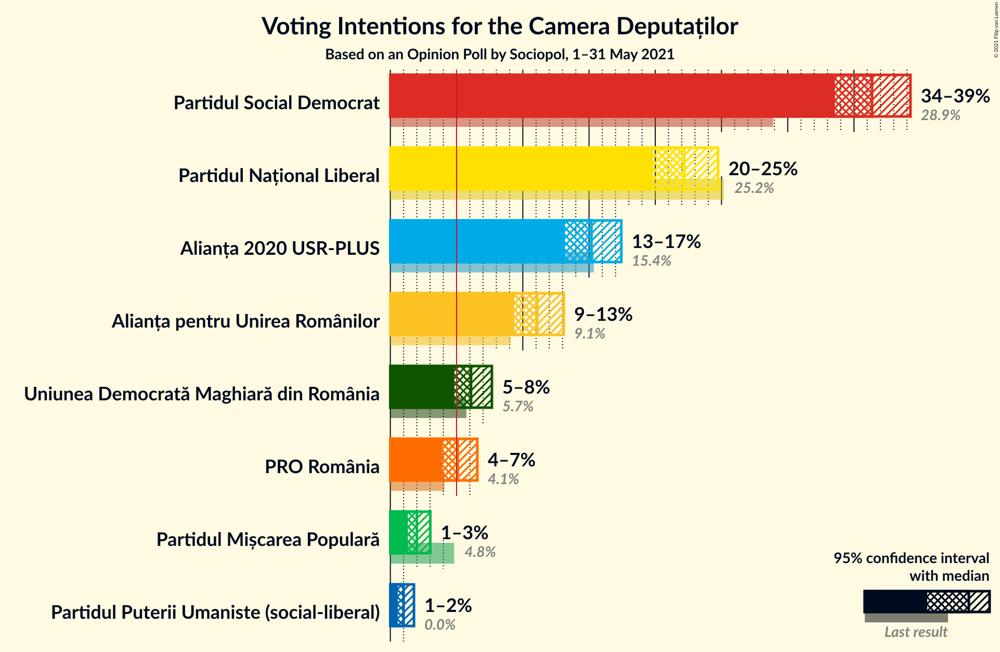

### Confidence Intervals

| Party | Last Result | Poll Result | 80% Confidence Interval | 90% Confidence Interval | 95% Confidence Interval | 99% Confidence Interval |
|:-----:|:-----------:|:-----------:|:-----------------------:|:-----------------------:|:-----------------------:|:-----------------------:|
| Partidul Social Democrat | 28.9% | 36.4% | 34.5–38.3% |34.0–38.8% |33.6–39.3% |32.7–40.2% |
| Partidul Național Liberal | 25.2% | 22.2% | 20.6–23.9% |20.2–24.3% |19.8–24.7% |19.1–25.6% |
| Alianța 2020 USR-PLUS | 15.4% | 15.2% | 13.9–16.7% |13.5–17.1% |13.2–17.4% |12.6–18.2% |
| Alianța pentru Unirea Românilor | 9.1% | 11.1% | 10.0–12.4% |9.6–12.8% |9.4–13.1% |8.8–13.7% |
| Uniunea Democrată Maghiară din România | 5.7% | 6.1% | 5.3–7.1% |5.0–7.4% |4.8–7.7% |4.5–8.2% |
| PRO România | 4.1% | 5.1% | 4.3–6.1% |4.1–6.3% |3.9–6.6% |3.6–7.0% |
| Partidul Mișcarea Populară | 4.8% | 2.0% | 1.6–2.7% |1.4–2.9% |1.3–3.0% |1.1–3.4% |
| Partidul Puterii Umaniste (social-liberal) | 0.0% | 1.0% | 0.7–1.5% |0.6–1.7% |0.6–1.8% |0.4–2.1% |

*Note:* The poll result column reflects the actual value used in the calculations. Published results may vary slightly, and in addition be rounded to fewer digits.

## Seats

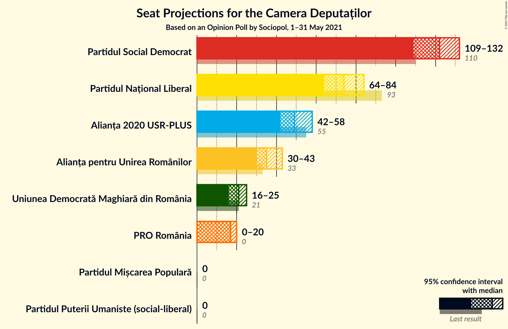

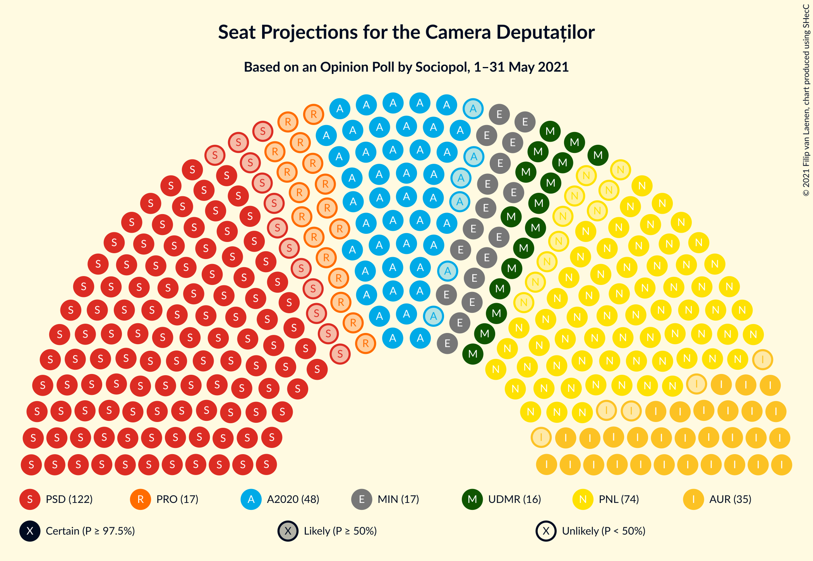

### Confidence Intervals

| Party | Last Result | Median | 80% Confidence Interval | 90% Confidence Interval | 95% Confidence Interval | 99% Confidence Interval |
|:-----:|:-----------:|:------:|:-----------------------:|:-----------------------:|:-----------------------:|:-----------------------:|
| <a href="#partidul-social-democrat">Partidul Social Democrat</a> | 110 | 122 | 113–129 |109–131 |109–132 |107–137 |
| <a href="#partidul-național-liberal">Partidul Național Liberal</a> | 93 | 74 | 67–79 |66–82 |64–84 |62–87 |
| <a href="#alianța-2020-usr-plus">Alianța 2020 USR-PLUS</a> | 55 | 49 | 46–55 |44–56 |42–58 |40–61 |
| <a href="#alianța-pentru-unirea-românilor">Alianța pentru Unirea Românilor</a> | 33 | 35 | 32–41 |31–42 |30–43 |28–46 |
| <a href="#uniunea-democrată-maghiară-din-românia">Uniunea Democrată Maghiară din România</a> | 21 | 21 | 17–24 |16–25 |16–25 |14–28 |
| <a href="#pro-românia">PRO România</a> | 0 | 17 | 0–18 |0–19 |0–20 |0–22 |
| <a href="#partidul-mișcarea-populară">Partidul Mișcarea Populară</a> | 0 | 0 | 0 |0 |0 |0 |
| <a href="#partidul-puterii-umaniste-(social-liberal)">Partidul Puterii Umaniste (social-liberal)</a> | 0 | 0 | 0 |0 |0 |0 |

### Partidul Social Democrat

*For a full overview of the results for this party, see the [Partidul Social Democrat](party-partidulsocialdemocrat.html) page.*

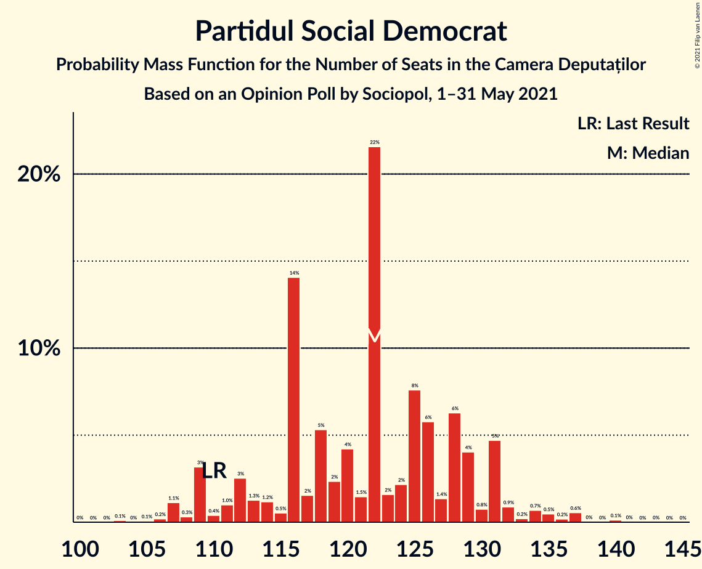

| Number of Seats | Probability | Accumulated | Special Marks |
|:---------------:|:-----------:|:-----------:|:-------------:|
| 103 | 0.1% | 100% |  |
| 104 | 0% | 99.9% |  |
| 105 | 0.1% | 99.9% |  |
| 106 | 0.2% | 99.8% |  |
| 107 | 1.1% | 99.6% |  |
| 108 | 0.3% | 98% |  |
| 109 | 3% | 98% |  |
| 110 | 0.4% | 95% | Last Result |
| 111 | 1.0% | 95% |  |
| 112 | 3% | 94% |  |
| 113 | 1.3% | 91% |  |
| 114 | 1.2% | 90% |  |
| 115 | 0.5% | 89% |  |
| 116 | 14% | 88% |  |
| 117 | 2% | 74% |  |
| 118 | 5% | 72% |  |
| 119 | 2% | 67% |  |
| 120 | 4% | 65% |  |
| 121 | 1.5% | 61% |  |
| 122 | 22% | 59% | Median |
| 123 | 2% | 37% |  |
| 124 | 2% | 36% |  |
| 125 | 8% | 34% |  |
| 126 | 6% | 26% |  |
| 127 | 1.4% | 20% |  |
| 128 | 6% | 19% |  |
| 129 | 4% | 13% |  |
| 130 | 0.8% | 9% |  |
| 131 | 5% | 8% |  |
| 132 | 0.9% | 3% |  |
| 133 | 0.2% | 2% |  |
| 134 | 0.7% | 2% |  |
| 135 | 0.5% | 1.4% |  |
| 136 | 0.2% | 0.9% |  |
| 137 | 0.6% | 0.8% |  |
| 138 | 0% | 0.2% |  |
| 139 | 0% | 0.2% |  |
| 140 | 0.1% | 0.2% |  |
| 141 | 0% | 0% |  |

### Partidul Național Liberal

*For a full overview of the results for this party, see the [Partidul Național Liberal](party-partidulnaționalliberal.html) page.*

| Number of Seats | Probability | Accumulated | Special Marks |
|:---------------:|:-----------:|:-----------:|:-------------:|
| 59 | 0% | 100% |  |
| 60 | 0.1% | 99.9% |  |
| 61 | 0% | 99.8% |  |
| 62 | 1.3% | 99.8% |  |
| 63 | 0.3% | 98.5% |  |
| 64 | 0.8% | 98% |  |
| 65 | 2% | 97% |  |
| 66 | 2% | 96% |  |
| 67 | 4% | 94% |  |
| 68 | 3% | 89% |  |
| 69 | 2% | 86% |  |
| 70 | 4% | 85% |  |
| 71 | 4% | 81% |  |
| 72 | 9% | 76% |  |
| 73 | 9% | 67% |  |
| 74 | 15% | 58% | Median |
| 75 | 6% | 43% |  |
| 76 | 8% | 37% |  |
| 77 | 3% | 29% |  |
| 78 | 5% | 27% |  |
| 79 | 12% | 22% |  |
| 80 | 2% | 9% |  |
| 81 | 1.0% | 7% |  |
| 82 | 3% | 6% |  |
| 83 | 1.0% | 4% |  |
| 84 | 2% | 3% |  |
| 85 | 0.1% | 0.8% |  |
| 86 | 0.2% | 0.7% |  |
| 87 | 0.1% | 0.6% |  |
| 88 | 0.3% | 0.4% |  |
| 89 | 0.1% | 0.2% |  |
| 90 | 0% | 0.1% |  |
| 91 | 0.1% | 0.1% |  |
| 92 | 0% | 0% |  |
| 93 | 0% | 0% | Last Result |

### Alianța 2020 USR-PLUS

*For a full overview of the results for this party, see the [Alianța 2020 USR-PLUS](party-alianța2020usr-plus.html) page.*

| Number of Seats | Probability | Accumulated | Special Marks |
|:---------------:|:-----------:|:-----------:|:-------------:|
| 40 | 1.5% | 100% |  |
| 41 | 0.2% | 98% |  |
| 42 | 0.8% | 98% |  |
| 43 | 2% | 97% |  |
| 44 | 1.4% | 95% |  |
| 45 | 0.9% | 94% |  |
| 46 | 7% | 93% |  |
| 47 | 7% | 86% |  |
| 48 | 24% | 79% |  |
| 49 | 5% | 54% | Median |
| 50 | 6% | 49% |  |
| 51 | 5% | 44% |  |
| 52 | 5% | 39% |  |
| 53 | 15% | 33% |  |
| 54 | 7% | 18% |  |
| 55 | 5% | 11% | Last Result |
| 56 | 2% | 6% |  |
| 57 | 0.7% | 4% |  |
| 58 | 1.1% | 3% |  |
| 59 | 0.4% | 2% |  |
| 60 | 0.4% | 1.4% |  |
| 61 | 0.8% | 1.0% |  |
| 62 | 0.1% | 0.2% |  |
| 63 | 0.1% | 0.1% |  |
| 64 | 0% | 0% |  |

### Alianța pentru Unirea Românilor

*For a full overview of the results for this party, see the [Alianța pentru Unirea Românilor](party-alianțapentruunirearomânilor.html) page.*

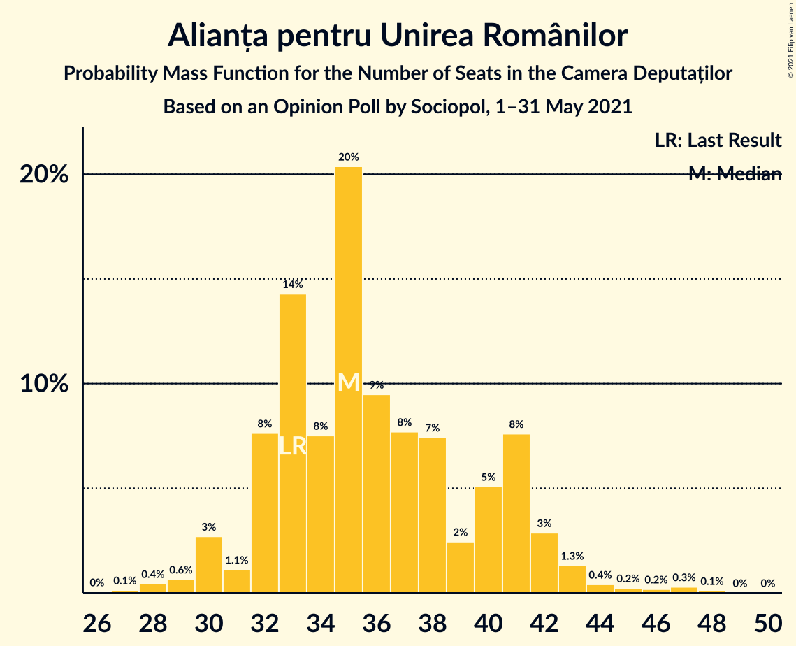

| Number of Seats | Probability | Accumulated | Special Marks |
|:---------------:|:-----------:|:-----------:|:-------------:|
| 26 | 0% | 100% |  |
| 27 | 0.1% | 99.9% |  |
| 28 | 0.4% | 99.8% |  |
| 29 | 0.6% | 99.4% |  |
| 30 | 3% | 98.7% |  |
| 31 | 1.1% | 96% |  |
| 32 | 8% | 95% |  |
| 33 | 14% | 87% | Last Result |
| 34 | 8% | 73% |  |
| 35 | 20% | 65% | Median |
| 36 | 9% | 45% |  |
| 37 | 8% | 36% |  |
| 38 | 7% | 28% |  |
| 39 | 2% | 21% |  |
| 40 | 5% | 18% |  |
| 41 | 8% | 13% |  |
| 42 | 3% | 5% |  |
| 43 | 1.3% | 3% |  |
| 44 | 0.4% | 1.2% |  |
| 45 | 0.2% | 0.8% |  |
| 46 | 0.2% | 0.6% |  |
| 47 | 0.3% | 0.4% |  |
| 48 | 0.1% | 0.1% |  |
| 49 | 0% | 0% |  |

### Uniunea Democrată Maghiară din România

*For a full overview of the results for this party, see the [Uniunea Democrată Maghiară din România](party-uniuneademocratămaghiarădinromânia.html) page.*

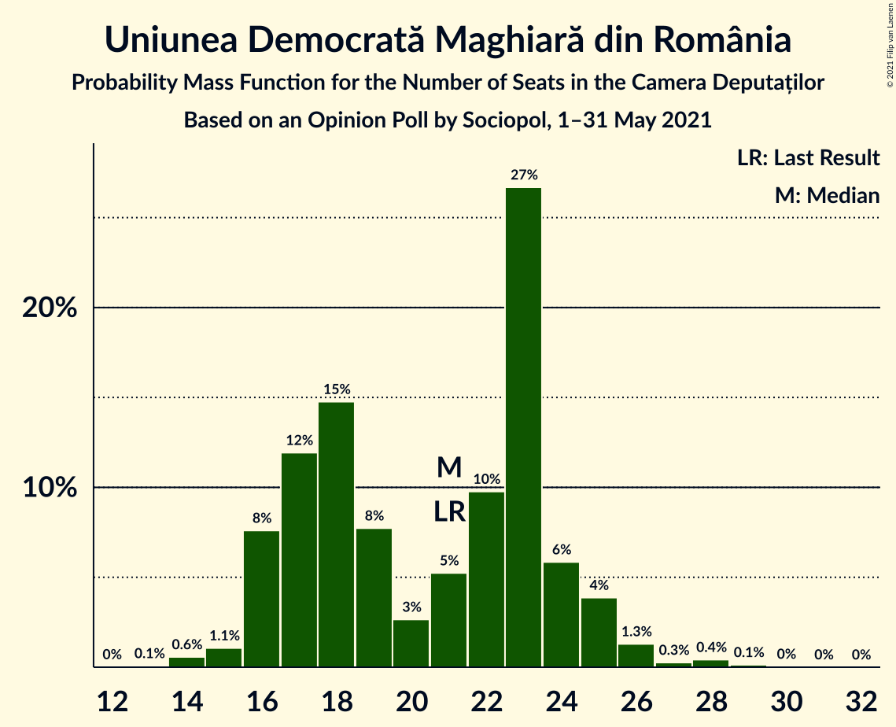

| Number of Seats | Probability | Accumulated | Special Marks |
|:---------------:|:-----------:|:-----------:|:-------------:|
| 13 | 0.1% | 100% |  |
| 14 | 0.6% | 99.9% |  |
| 15 | 1.1% | 99.3% |  |
| 16 | 8% | 98% |  |
| 17 | 12% | 91% |  |
| 18 | 15% | 79% |  |
| 19 | 8% | 64% |  |
| 20 | 3% | 56% |  |
| 21 | 5% | 54% | Last Result, Median |
| 22 | 10% | 48% |  |
| 23 | 27% | 39% |  |
| 24 | 6% | 12% |  |
| 25 | 4% | 6% |  |
| 26 | 1.3% | 2% |  |
| 27 | 0.3% | 0.9% |  |
| 28 | 0.4% | 0.6% |  |
| 29 | 0.1% | 0.2% |  |
| 30 | 0% | 0.1% |  |
| 31 | 0% | 0% |  |

### PRO România

*For a full overview of the results for this party, see the [PRO România](party-proromânia.html) page.*

| Number of Seats | Probability | Accumulated | Special Marks |
|:---------------:|:-----------:|:-----------:|:-------------:|
| 0 | 45% | 100% | Last Result |
| 1 | 0% | 55% |  |
| 2 | 0% | 55% |  |
| 3 | 0% | 55% |  |
| 4 | 0% | 55% |  |
| 5 | 0% | 55% |  |
| 6 | 0% | 55% |  |
| 7 | 0% | 55% |  |
| 8 | 0% | 55% |  |
| 9 | 0% | 55% |  |
| 10 | 0% | 55% |  |
| 11 | 0% | 55% |  |
| 12 | 0% | 55% |  |
| 13 | 0% | 55% |  |
| 14 | 0% | 55% |  |
| 15 | 0% | 55% |  |
| 16 | 5% | 55% |  |
| 17 | 12% | 51% | Median |
| 18 | 29% | 39% |  |
| 19 | 4% | 9% |  |
| 20 | 2% | 5% |  |
| 21 | 2% | 2% |  |
| 22 | 0.3% | 0.8% |  |
| 23 | 0.3% | 0.5% |  |
| 24 | 0.1% | 0.2% |  |
| 25 | 0% | 0% |  |

### Partidul Mișcarea Populară

*For a full overview of the results for this party, see the [Partidul Mișcarea Populară](party-partidulmișcareapopulară.html) page.*

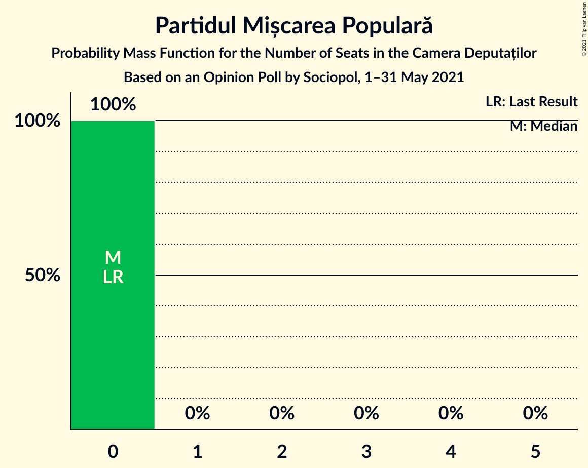

| Number of Seats | Probability | Accumulated | Special Marks |
|:---------------:|:-----------:|:-----------:|:-------------:|
| 0 | 100% | 100% | Last Result, Median |

### Partidul Puterii Umaniste (social-liberal)

*For a full overview of the results for this party, see the [Partidul Puterii Umaniste (social-liberal)](party-partidulputeriiumanistesocial-liberal.html) page.*

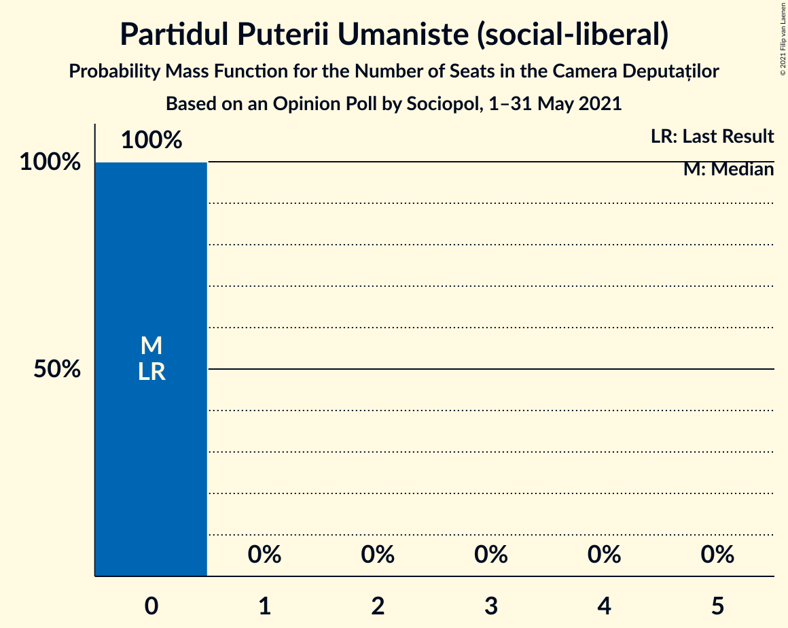

| Number of Seats | Probability | Accumulated | Special Marks |
|:---------------:|:-----------:|:-----------:|:-------------:|
| 0 | 100% | 100% | Last Result, Median |

## Coalitions

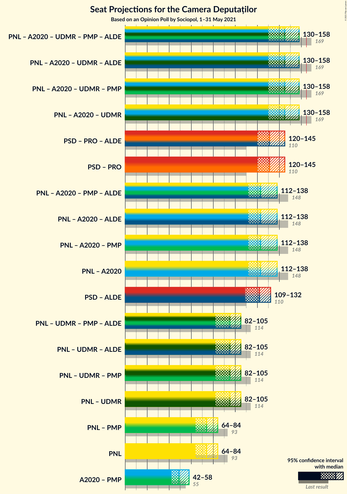

### Confidence Intervals

| Coalition | Last Result | Median | Majority? | 80% Confidence Interval | 90% Confidence Interval | 95% Confidence Interval | 99% Confidence Interval |
|:---------:|:-----------:|:------:|:---------:|:-----------------------:|:-----------------------:|:-----------------------:|:-----------------------:|
| Partidul Național Liberal – Alianța 2020 USR-PLUS – Uniunea Democrată Maghiară din România – Partidul Mișcarea Populară | 169 | 145 | 0% | 136–155 | 135–155 | 130–158 | 129–162 |
| Partidul Național Liberal – Alianța 2020 USR-PLUS – Uniunea Democrată Maghiară din România | 169 | 145 | 0% | 136–155 | 135–155 | 130–158 | 129–162 |
| Partidul Social Democrat – PRO România | 110 | 131 | 0% | 122–140 | 120–143 | 120–145 | 116–148 |
| Partidul Național Liberal – Alianța 2020 USR-PLUS – Partidul Mișcarea Populară | 148 | 123 | 0% | 115–132 | 114–134 | 112–138 | 109–139 |
| Partidul Național Liberal – Alianța 2020 USR-PLUS | 148 | 123 | 0% | 115–132 | 114–134 | 112–138 | 109–139 |
| Partidul Național Liberal – Uniunea Democrată Maghiară din România – Partidul Mișcarea Populară | 114 | 95 | 0% | 87–102 | 85–105 | 82–105 | 79–107 |
| Partidul Național Liberal – Uniunea Democrată Maghiară din România | 114 | 95 | 0% | 87–102 | 85–105 | 82–105 | 79–107 |
| Partidul Național Liberal – Partidul Mișcarea Populară | 93 | 74 | 0% | 67–79 | 66–82 | 64–84 | 62–87 |
| Partidul Național Liberal | 93 | 74 | 0% | 67–79 | 66–82 | 64–84 | 62–87 |
| Alianța 2020 USR-PLUS – Partidul Mișcarea Populară | 55 | 49 | 0% | 46–55 | 44–56 | 42–58 | 40–61 |

### Partidul Național Liberal – Alianța 2020 USR-PLUS – Uniunea Democrată Maghiară din România – Partidul Mișcarea Populară

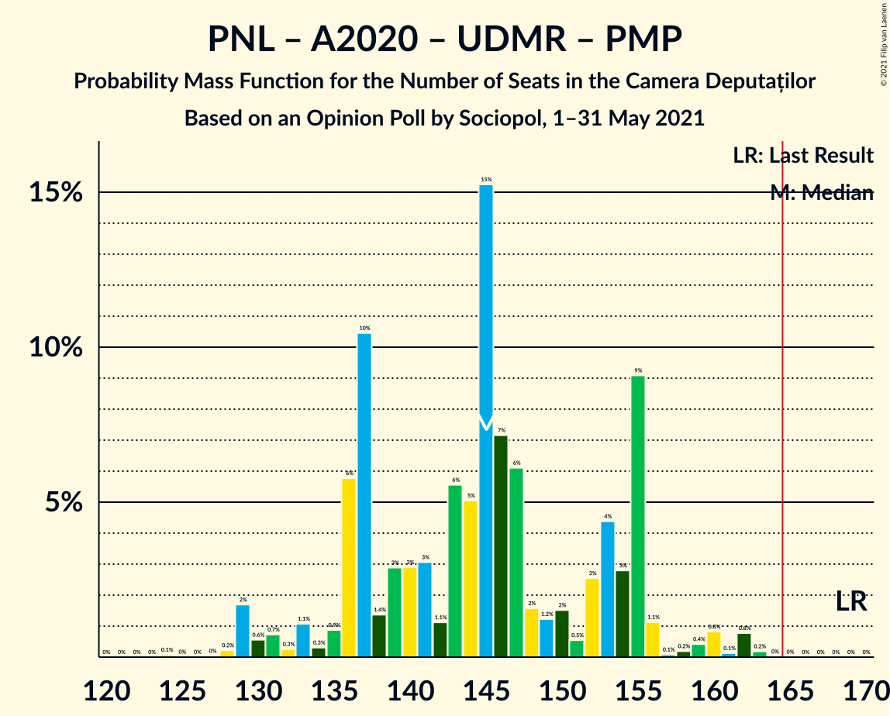

| Number of Seats | Probability | Accumulated | Special Marks |
|:---------------:|:-----------:|:-----------:|:-------------:|
| 124 | 0.1% | 100% |  |
| 125 | 0% | 99.9% |  |
| 126 | 0% | 99.9% |  |
| 127 | 0% | 99.9% |  |
| 128 | 0.2% | 99.9% |  |
| 129 | 2% | 99.6% |  |
| 130 | 0.6% | 98% |  |
| 131 | 0.7% | 97% |  |
| 132 | 0.3% | 97% |  |
| 133 | 1.1% | 96% |  |
| 134 | 0.3% | 95% |  |
| 135 | 0.9% | 95% |  |
| 136 | 6% | 94% |  |
| 137 | 10% | 88% |  |
| 138 | 1.4% | 78% |  |
| 139 | 3% | 77% |  |
| 140 | 3% | 74% |  |
| 141 | 3% | 71% |  |
| 142 | 1.1% | 68% |  |
| 143 | 6% | 67% |  |
| 144 | 5% | 61% | Median |
| 145 | 15% | 56% |  |
| 146 | 7% | 41% |  |
| 147 | 6% | 34% |  |
| 148 | 2% | 27% |  |
| 149 | 1.2% | 26% |  |
| 150 | 2% | 25% |  |
| 151 | 0.5% | 23% |  |
| 152 | 3% | 23% |  |
| 153 | 4% | 20% |  |
| 154 | 3% | 16% |  |
| 155 | 9% | 13% |  |
| 156 | 1.1% | 4% |  |
| 157 | 0.1% | 3% |  |
| 158 | 0.2% | 3% |  |
| 159 | 0.4% | 2% |  |
| 160 | 0.8% | 2% |  |
| 161 | 0.1% | 1.1% |  |
| 162 | 0.8% | 1.0% |  |
| 163 | 0.2% | 0.2% |  |
| 164 | 0% | 0% |  |
| 165 | 0% | 0% | Majority |
| 166 | 0% | 0% |  |
| 167 | 0% | 0% |  |
| 168 | 0% | 0% |  |
| 169 | 0% | 0% | Last Result |

### Partidul Național Liberal – Alianța 2020 USR-PLUS – Uniunea Democrată Maghiară din România

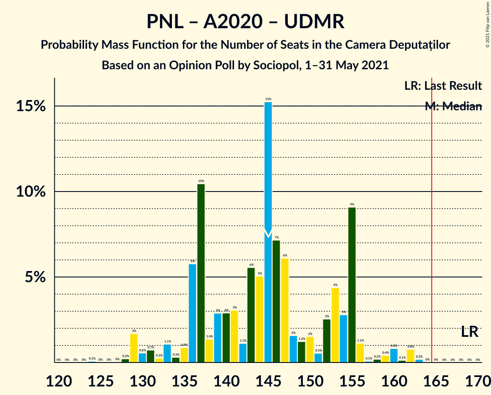

| Number of Seats | Probability | Accumulated | Special Marks |
|:---------------:|:-----------:|:-----------:|:-------------:|
| 124 | 0.1% | 100% |  |
| 125 | 0% | 99.9% |  |
| 126 | 0% | 99.9% |  |
| 127 | 0% | 99.9% |  |
| 128 | 0.2% | 99.9% |  |
| 129 | 2% | 99.6% |  |
| 130 | 0.6% | 98% |  |
| 131 | 0.7% | 97% |  |
| 132 | 0.3% | 97% |  |
| 133 | 1.1% | 96% |  |
| 134 | 0.3% | 95% |  |
| 135 | 0.9% | 95% |  |
| 136 | 6% | 94% |  |
| 137 | 10% | 88% |  |
| 138 | 1.4% | 78% |  |
| 139 | 3% | 77% |  |
| 140 | 3% | 74% |  |
| 141 | 3% | 71% |  |
| 142 | 1.1% | 68% |  |
| 143 | 6% | 67% |  |
| 144 | 5% | 61% | Median |
| 145 | 15% | 56% |  |
| 146 | 7% | 41% |  |
| 147 | 6% | 34% |  |
| 148 | 2% | 27% |  |
| 149 | 1.2% | 26% |  |
| 150 | 2% | 25% |  |
| 151 | 0.5% | 23% |  |
| 152 | 3% | 23% |  |
| 153 | 4% | 20% |  |
| 154 | 3% | 16% |  |
| 155 | 9% | 13% |  |
| 156 | 1.1% | 4% |  |
| 157 | 0.1% | 3% |  |
| 158 | 0.2% | 3% |  |
| 159 | 0.4% | 2% |  |
| 160 | 0.8% | 2% |  |
| 161 | 0.1% | 1.1% |  |
| 162 | 0.8% | 1.0% |  |
| 163 | 0.2% | 0.2% |  |
| 164 | 0% | 0% |  |
| 165 | 0% | 0% | Majority |
| 166 | 0% | 0% |  |
| 167 | 0% | 0% |  |
| 168 | 0% | 0% |  |
| 169 | 0% | 0% | Last Result |

### Partidul Social Democrat – PRO România

| Number of Seats | Probability | Accumulated | Special Marks |
|:---------------:|:-----------:|:-----------:|:-------------:|
| 110 | 0% | 100% | Last Result |
| 111 | 0% | 100% |  |
| 112 | 0% | 100% |  |
| 113 | 0.1% | 99.9% |  |
| 114 | 0.1% | 99.8% |  |
| 115 | 0.1% | 99.8% |  |
| 116 | 0.3% | 99.7% |  |
| 117 | 0.5% | 99.4% |  |
| 118 | 0.1% | 98.9% |  |
| 119 | 0.9% | 98.7% |  |
| 120 | 3% | 98% |  |
| 121 | 0.6% | 95% |  |
| 122 | 11% | 94% |  |
| 123 | 1.5% | 83% |  |
| 124 | 0.8% | 82% |  |
| 125 | 6% | 81% |  |
| 126 | 8% | 75% |  |
| 127 | 1.0% | 68% |  |
| 128 | 8% | 67% |  |
| 129 | 4% | 59% |  |
| 130 | 1.4% | 55% |  |
| 131 | 4% | 53% |  |
| 132 | 2% | 49% |  |
| 133 | 0.3% | 47% |  |
| 134 | 13% | 47% |  |
| 135 | 6% | 33% |  |
| 136 | 2% | 27% |  |
| 137 | 2% | 25% |  |
| 138 | 1.0% | 24% |  |
| 139 | 3% | 23% | Median |
| 140 | 10% | 20% |  |
| 141 | 2% | 10% |  |
| 142 | 0.6% | 8% |  |
| 143 | 4% | 8% |  |
| 144 | 0.7% | 4% |  |
| 145 | 0.9% | 3% |  |
| 146 | 0.1% | 2% |  |
| 147 | 0.5% | 2% |  |
| 148 | 2% | 2% |  |
| 149 | 0.2% | 0.3% |  |
| 150 | 0% | 0.2% |  |
| 151 | 0.1% | 0.1% |  |
| 152 | 0% | 0% |  |

### Partidul Național Liberal – Alianța 2020 USR-PLUS – Partidul Mișcarea Populară

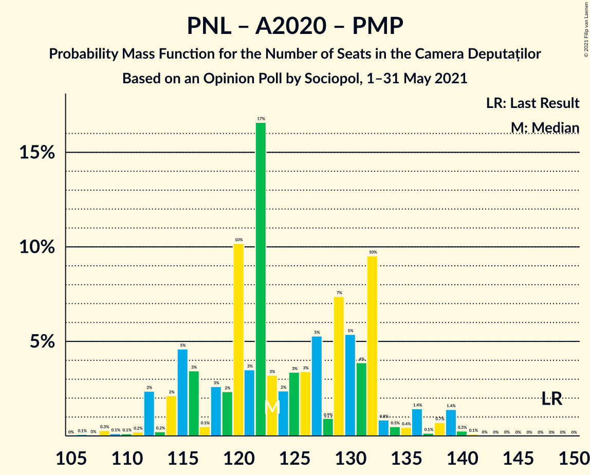

| Number of Seats | Probability | Accumulated | Special Marks |
|:---------------:|:-----------:|:-----------:|:-------------:|
| 106 | 0.1% | 100% |  |
| 107 | 0% | 99.9% |  |
| 108 | 0.3% | 99.9% |  |
| 109 | 0.1% | 99.6% |  |
| 110 | 0.1% | 99.5% |  |
| 111 | 0.2% | 99.3% |  |
| 112 | 2% | 99.1% |  |
| 113 | 0.2% | 97% |  |
| 114 | 2% | 97% |  |
| 115 | 5% | 94% |  |
| 116 | 3% | 90% |  |
| 117 | 0.5% | 86% |  |
| 118 | 3% | 86% |  |
| 119 | 2% | 83% |  |
| 120 | 10% | 81% |  |
| 121 | 3% | 71% |  |
| 122 | 17% | 67% |  |
| 123 | 3% | 51% | Median |
| 124 | 2% | 47% |  |
| 125 | 3% | 45% |  |
| 126 | 3% | 42% |  |
| 127 | 5% | 38% |  |
| 128 | 0.9% | 33% |  |
| 129 | 7% | 32% |  |
| 130 | 5% | 25% |  |
| 131 | 4% | 19% |  |
| 132 | 10% | 15% |  |
| 133 | 0.8% | 6% |  |
| 134 | 0.5% | 5% |  |
| 135 | 0.4% | 5% |  |
| 136 | 1.4% | 4% |  |
| 137 | 0.1% | 3% |  |
| 138 | 0.7% | 3% |  |
| 139 | 1.4% | 2% |  |
| 140 | 0.3% | 0.4% |  |
| 141 | 0.1% | 0.1% |  |
| 142 | 0% | 0% |  |
| 143 | 0% | 0% |  |
| 144 | 0% | 0% |  |
| 145 | 0% | 0% |  |
| 146 | 0% | 0% |  |
| 147 | 0% | 0% |  |
| 148 | 0% | 0% | Last Result |

### Partidul Național Liberal – Alianța 2020 USR-PLUS

| Number of Seats | Probability | Accumulated | Special Marks |
|:---------------:|:-----------:|:-----------:|:-------------:|
| 106 | 0.1% | 100% |  |
| 107 | 0% | 99.9% |  |
| 108 | 0.3% | 99.9% |  |
| 109 | 0.1% | 99.6% |  |
| 110 | 0.1% | 99.5% |  |
| 111 | 0.2% | 99.3% |  |
| 112 | 2% | 99.1% |  |
| 113 | 0.2% | 97% |  |
| 114 | 2% | 97% |  |
| 115 | 5% | 94% |  |
| 116 | 3% | 90% |  |
| 117 | 0.5% | 86% |  |
| 118 | 3% | 86% |  |
| 119 | 2% | 83% |  |
| 120 | 10% | 81% |  |
| 121 | 3% | 71% |  |
| 122 | 17% | 67% |  |
| 123 | 3% | 51% | Median |
| 124 | 2% | 47% |  |
| 125 | 3% | 45% |  |
| 126 | 3% | 42% |  |
| 127 | 5% | 38% |  |
| 128 | 0.9% | 33% |  |
| 129 | 7% | 32% |  |
| 130 | 5% | 25% |  |
| 131 | 4% | 19% |  |
| 132 | 10% | 15% |  |
| 133 | 0.8% | 6% |  |
| 134 | 0.5% | 5% |  |
| 135 | 0.4% | 5% |  |
| 136 | 1.4% | 4% |  |
| 137 | 0.1% | 3% |  |
| 138 | 0.7% | 3% |  |
| 139 | 1.4% | 2% |  |
| 140 | 0.3% | 0.4% |  |
| 141 | 0.1% | 0.1% |  |
| 142 | 0% | 0% |  |
| 143 | 0% | 0% |  |
| 144 | 0% | 0% |  |
| 145 | 0% | 0% |  |
| 146 | 0% | 0% |  |
| 147 | 0% | 0% |  |
| 148 | 0% | 0% | Last Result |

### Partidul Național Liberal – Uniunea Democrată Maghiară din România – Partidul Mișcarea Populară

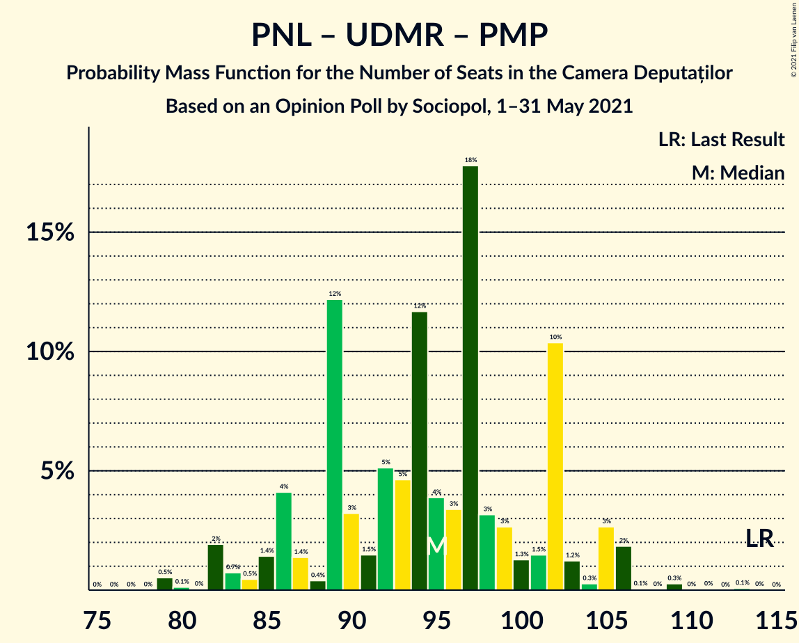

| Number of Seats | Probability | Accumulated | Special Marks |
|:---------------:|:-----------:|:-----------:|:-------------:|
| 79 | 0.5% | 100% |  |
| 80 | 0.1% | 99.4% |  |
| 81 | 0% | 99.3% |  |
| 82 | 2% | 99.3% |  |
| 83 | 0.7% | 97% |  |
| 84 | 0.5% | 97% |  |
| 85 | 1.4% | 96% |  |
| 86 | 4% | 95% |  |
| 87 | 1.4% | 91% |  |
| 88 | 0.4% | 89% |  |
| 89 | 12% | 89% |  |
| 90 | 3% | 77% |  |
| 91 | 1.5% | 73% |  |
| 92 | 5% | 72% |  |
| 93 | 5% | 67% |  |
| 94 | 12% | 62% |  |
| 95 | 4% | 51% | Median |
| 96 | 3% | 47% |  |
| 97 | 18% | 43% |  |
| 98 | 3% | 25% |  |
| 99 | 3% | 22% |  |
| 100 | 1.3% | 20% |  |
| 101 | 1.5% | 18% |  |
| 102 | 10% | 17% |  |
| 103 | 1.2% | 7% |  |
| 104 | 0.3% | 5% |  |
| 105 | 3% | 5% |  |
| 106 | 2% | 2% |  |
| 107 | 0.1% | 0.5% |  |
| 108 | 0% | 0.5% |  |
| 109 | 0.3% | 0.5% |  |
| 110 | 0% | 0.2% |  |
| 111 | 0% | 0.2% |  |
| 112 | 0% | 0.1% |  |
| 113 | 0.1% | 0.1% |  |
| 114 | 0% | 0% | Last Result |

### Partidul Național Liberal – Uniunea Democrată Maghiară din România

| Number of Seats | Probability | Accumulated | Special Marks |
|:---------------:|:-----------:|:-----------:|:-------------:|
| 79 | 0.5% | 100% |  |
| 80 | 0.1% | 99.4% |  |
| 81 | 0% | 99.3% |  |
| 82 | 2% | 99.3% |  |
| 83 | 0.7% | 97% |  |
| 84 | 0.5% | 97% |  |
| 85 | 1.4% | 96% |  |
| 86 | 4% | 95% |  |
| 87 | 1.4% | 91% |  |
| 88 | 0.4% | 89% |  |
| 89 | 12% | 89% |  |
| 90 | 3% | 77% |  |
| 91 | 1.5% | 73% |  |
| 92 | 5% | 72% |  |
| 93 | 5% | 67% |  |
| 94 | 12% | 62% |  |
| 95 | 4% | 51% | Median |
| 96 | 3% | 47% |  |
| 97 | 18% | 43% |  |
| 98 | 3% | 25% |  |
| 99 | 3% | 22% |  |
| 100 | 1.3% | 20% |  |
| 101 | 1.5% | 18% |  |
| 102 | 10% | 17% |  |
| 103 | 1.2% | 7% |  |
| 104 | 0.3% | 5% |  |
| 105 | 3% | 5% |  |
| 106 | 2% | 2% |  |
| 107 | 0.1% | 0.5% |  |
| 108 | 0% | 0.5% |  |
| 109 | 0.3% | 0.5% |  |
| 110 | 0% | 0.2% |  |
| 111 | 0% | 0.2% |  |
| 112 | 0% | 0.1% |  |
| 113 | 0.1% | 0.1% |  |
| 114 | 0% | 0% | Last Result |

### Partidul Național Liberal – Partidul Mișcarea Populară

| Number of Seats | Probability | Accumulated | Special Marks |
|:---------------:|:-----------:|:-----------:|:-------------:|
| 59 | 0% | 100% |  |
| 60 | 0.1% | 99.9% |  |
| 61 | 0% | 99.8% |  |
| 62 | 1.3% | 99.8% |  |
| 63 | 0.3% | 98.5% |  |
| 64 | 0.8% | 98% |  |
| 65 | 2% | 97% |  |
| 66 | 2% | 96% |  |
| 67 | 4% | 94% |  |
| 68 | 3% | 89% |  |
| 69 | 2% | 86% |  |
| 70 | 4% | 85% |  |
| 71 | 4% | 81% |  |
| 72 | 9% | 76% |  |
| 73 | 9% | 67% |  |
| 74 | 15% | 58% | Median |
| 75 | 6% | 43% |  |
| 76 | 8% | 37% |  |
| 77 | 3% | 29% |  |
| 78 | 5% | 27% |  |
| 79 | 12% | 22% |  |
| 80 | 2% | 9% |  |
| 81 | 1.0% | 7% |  |
| 82 | 3% | 6% |  |
| 83 | 1.0% | 4% |  |
| 84 | 2% | 3% |  |
| 85 | 0.1% | 0.8% |  |
| 86 | 0.2% | 0.7% |  |
| 87 | 0.1% | 0.6% |  |
| 88 | 0.3% | 0.4% |  |
| 89 | 0.1% | 0.2% |  |
| 90 | 0% | 0.1% |  |
| 91 | 0.1% | 0.1% |  |
| 92 | 0% | 0% |  |
| 93 | 0% | 0% | Last Result |

### Partidul Național Liberal

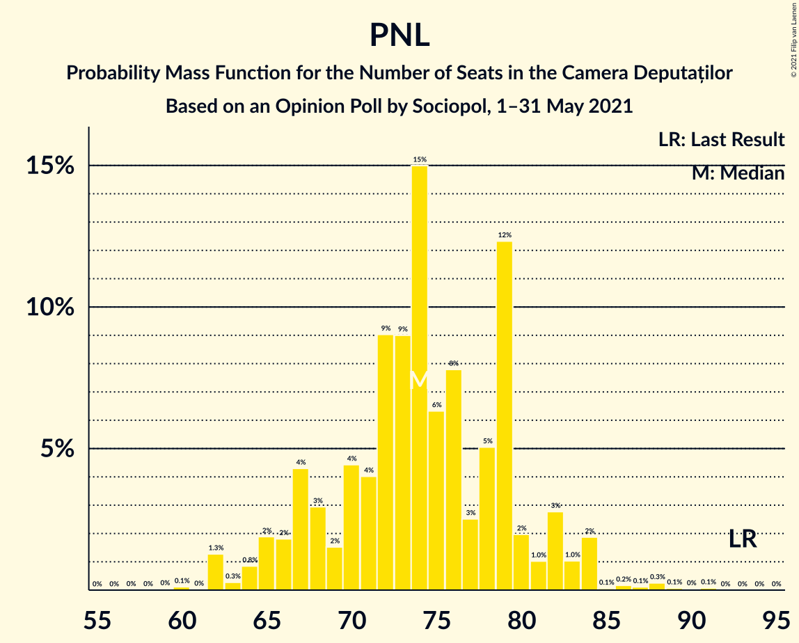

| Number of Seats | Probability | Accumulated | Special Marks |
|:---------------:|:-----------:|:-----------:|:-------------:|
| 59 | 0% | 100% |  |
| 60 | 0.1% | 99.9% |  |
| 61 | 0% | 99.8% |  |
| 62 | 1.3% | 99.8% |  |
| 63 | 0.3% | 98.5% |  |
| 64 | 0.8% | 98% |  |
| 65 | 2% | 97% |  |
| 66 | 2% | 96% |  |
| 67 | 4% | 94% |  |
| 68 | 3% | 89% |  |
| 69 | 2% | 86% |  |
| 70 | 4% | 85% |  |
| 71 | 4% | 81% |  |
| 72 | 9% | 76% |  |
| 73 | 9% | 67% |  |
| 74 | 15% | 58% | Median |
| 75 | 6% | 43% |  |
| 76 | 8% | 37% |  |
| 77 | 3% | 29% |  |
| 78 | 5% | 27% |  |
| 79 | 12% | 22% |  |
| 80 | 2% | 9% |  |
| 81 | 1.0% | 7% |  |
| 82 | 3% | 6% |  |
| 83 | 1.0% | 4% |  |
| 84 | 2% | 3% |  |
| 85 | 0.1% | 0.8% |  |
| 86 | 0.2% | 0.7% |  |
| 87 | 0.1% | 0.6% |  |
| 88 | 0.3% | 0.4% |  |
| 89 | 0.1% | 0.2% |  |
| 90 | 0% | 0.1% |  |
| 91 | 0.1% | 0.1% |  |
| 92 | 0% | 0% |  |
| 93 | 0% | 0% | Last Result |

### Alianța 2020 USR-PLUS – Partidul Mișcarea Populară

| Number of Seats | Probability | Accumulated | Special Marks |
|:---------------:|:-----------:|:-----------:|:-------------:|
| 40 | 1.5% | 100% |  |
| 41 | 0.2% | 98% |  |
| 42 | 0.8% | 98% |  |
| 43 | 2% | 97% |  |
| 44 | 1.4% | 95% |  |
| 45 | 0.9% | 94% |  |
| 46 | 7% | 93% |  |
| 47 | 7% | 86% |  |
| 48 | 24% | 79% |  |
| 49 | 5% | 54% | Median |
| 50 | 6% | 49% |  |
| 51 | 5% | 44% |  |
| 52 | 5% | 39% |  |
| 53 | 15% | 33% |  |
| 54 | 7% | 18% |  |
| 55 | 5% | 11% | Last Result |
| 56 | 2% | 6% |  |
| 57 | 0.7% | 4% |  |
| 58 | 1.1% | 3% |  |
| 59 | 0.4% | 2% |  |
| 60 | 0.4% | 1.4% |  |
| 61 | 0.8% | 1.0% |  |
| 62 | 0.1% | 0.2% |  |
| 63 | 0.1% | 0.1% |  |
| 64 | 0% | 0% |  |

## Technical Information

### Opinion Poll

+ **Polling firm:** Sociopol
+ **Commissioner(s):** —
+ **Fieldwork period:** 1–31 May 2021

### Calculations

+ **Sample size:** 1100
+ **Simulations done:** 131,072
+ **Error estimate:** 2.32%

