# Opinion Poll by INSCOP, 1–15 June 2021

<a href="#voting-intentions">Voting Intentions</a> | <a href="#seats">Seats</a> | <a href="#coalitions">Coalitions</a> | <a href="#technical-information">Technical Information</a>

## Voting Intentions

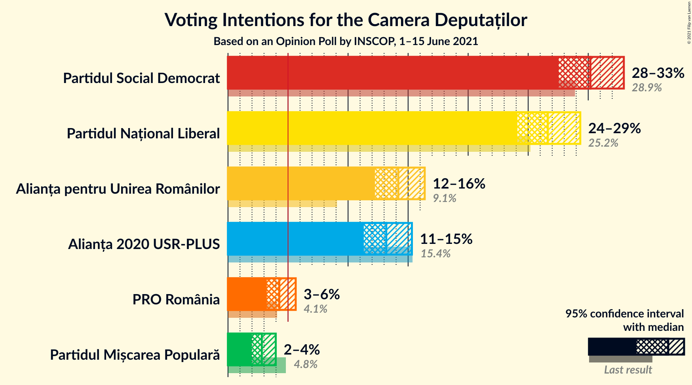

### Confidence Intervals

| Party | Last Result | Poll Result | 80% Confidence Interval | 90% Confidence Interval | 95% Confidence Interval | 99% Confidence Interval |
|:-----:|:-----------:|:-----------:|:-----------------------:|:-----------------------:|:-----------------------:|:-----------------------:|
| Partidul Social Democrat | 28.9% | 30.2% | 28.4–32.0% |28.0–32.5% |27.5–33.0% |26.7–33.9% |
| Partidul Național Liberal | 25.2% | 26.6% | 25.0–28.4% |24.5–28.9% |24.1–29.3% |23.3–30.2% |
| Alianța pentru Unirea Românilor | 9.1% | 14.2% | 12.9–15.6% |12.5–16.0% |12.2–16.4% |11.7–17.1% |
| Alianța 2020 USR-PLUS | 15.4% | 13.2% | 11.9–14.6% |11.6–15.0% |11.3–15.3% |10.7–16.0% |
| PRO România | 4.1% | 4.3% | 3.6–5.2% |3.4–5.4% |3.2–5.6% |2.9–6.1% |
| Partidul Mișcarea Populară | 4.8% | 2.8% | 2.3–3.6% |2.1–3.8% |2.0–4.0% |1.8–4.4% |

*Note:* The poll result column reflects the actual value used in the calculations. Published results may vary slightly, and in addition be rounded to fewer digits.

## Seats

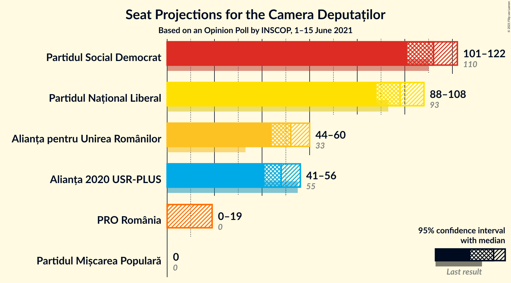

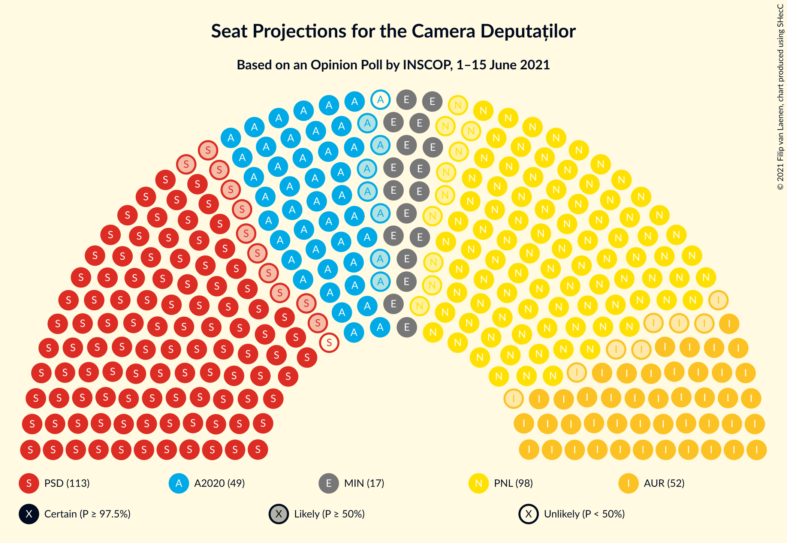

### Confidence Intervals

| Party | Last Result | Median | 80% Confidence Interval | 90% Confidence Interval | 95% Confidence Interval | 99% Confidence Interval |
|:-----:|:-----------:|:------:|:-----------------------:|:-----------------------:|:-----------------------:|:-----------------------:|
| <a href="#partidul-social-democrat">Partidul Social Democrat</a> | 110 | 112 | 104–118 |102–120 |101–122 |96–125 |
| <a href="#partidul-național-liberal">Partidul Național Liberal</a> | 93 | 98 | 91–104 |89–106 |88–108 |84–111 |
| <a href="#alianța-pentru-unirea-românilor">Alianța pentru Unirea Românilor</a> | 33 | 52 | 47–57 |46–59 |44–60 |42–63 |
| <a href="#alianța-2020-usr-plus">Alianța 2020 USR-PLUS</a> | 55 | 48 | 43–53 |42–55 |41–56 |39–59 |
| <a href="#pro-românia">PRO România</a> | 0 | 0 | 0–18 |0–19 |0–19 |0–21 |
| <a href="#partidul-mișcarea-populară">Partidul Mișcarea Populară</a> | 0 | 0 | 0 |0 |0 |0 |

### Partidul Social Democrat

*For a full overview of the results for this party, see the [Partidul Social Democrat](party-partidulsocialdemocrat.html) page.*

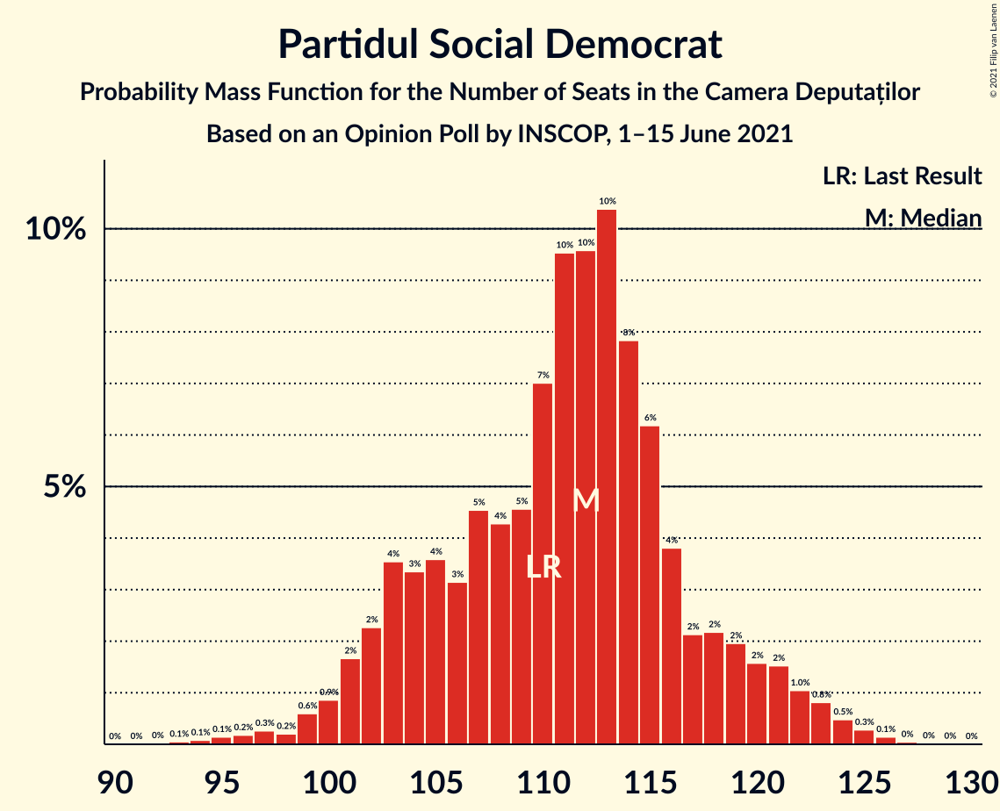

| Number of Seats | Probability | Accumulated | Special Marks |
|:---------------:|:-----------:|:-----------:|:-------------:|
| 93 | 0.1% | 100% |  |
| 94 | 0.1% | 99.9% |  |
| 95 | 0.1% | 99.8% |  |
| 96 | 0.2% | 99.7% |  |
| 97 | 0.3% | 99.5% |  |
| 98 | 0.2% | 99.2% |  |
| 99 | 0.6% | 99.0% |  |
| 100 | 0.9% | 98% |  |
| 101 | 2% | 98% |  |
| 102 | 2% | 96% |  |
| 103 | 4% | 94% |  |
| 104 | 3% | 90% |  |
| 105 | 4% | 87% |  |
| 106 | 3% | 83% |  |
| 107 | 5% | 80% |  |
| 108 | 4% | 75% |  |
| 109 | 5% | 71% |  |
| 110 | 7% | 67% | Last Result |
| 111 | 10% | 60% |  |
| 112 | 10% | 50% | Median |
| 113 | 10% | 40% |  |
| 114 | 8% | 30% |  |
| 115 | 6% | 22% |  |
| 116 | 4% | 16% |  |
| 117 | 2% | 12% |  |
| 118 | 2% | 10% |  |
| 119 | 2% | 8% |  |
| 120 | 2% | 6% |  |
| 121 | 2% | 4% |  |
| 122 | 1.0% | 3% |  |
| 123 | 0.8% | 2% |  |
| 124 | 0.5% | 1.0% |  |
| 125 | 0.3% | 0.5% |  |
| 126 | 0.1% | 0.2% |  |
| 127 | 0% | 0.1% |  |
| 128 | 0% | 0.1% |  |
| 129 | 0% | 0% |  |

### Partidul Național Liberal

*For a full overview of the results for this party, see the [Partidul Național Liberal](party-partidulnaționalliberal.html) page.*

| Number of Seats | Probability | Accumulated | Special Marks |
|:---------------:|:-----------:|:-----------:|:-------------:|
| 81 | 0% | 100% |  |
| 82 | 0.1% | 99.9% |  |
| 83 | 0.1% | 99.9% |  |
| 84 | 0.3% | 99.7% |  |
| 85 | 0.4% | 99.5% |  |
| 86 | 0.5% | 99.1% |  |
| 87 | 0.7% | 98.5% |  |
| 88 | 1.0% | 98% |  |
| 89 | 2% | 97% |  |
| 90 | 2% | 95% |  |
| 91 | 3% | 92% |  |
| 92 | 4% | 89% |  |
| 93 | 4% | 85% | Last Result |
| 94 | 5% | 80% |  |
| 95 | 6% | 76% |  |
| 96 | 7% | 70% |  |
| 97 | 9% | 63% |  |
| 98 | 9% | 53% | Median |
| 99 | 7% | 45% |  |
| 100 | 7% | 38% |  |
| 101 | 5% | 31% |  |
| 102 | 6% | 25% |  |
| 103 | 6% | 20% |  |
| 104 | 4% | 14% |  |
| 105 | 3% | 10% |  |
| 106 | 2% | 6% |  |
| 107 | 1.1% | 4% |  |
| 108 | 0.9% | 3% |  |
| 109 | 0.8% | 2% |  |
| 110 | 0.5% | 1.3% |  |
| 111 | 0.4% | 0.7% |  |
| 112 | 0.2% | 0.4% |  |
| 113 | 0.1% | 0.2% |  |
| 114 | 0.1% | 0.1% |  |
| 115 | 0% | 0.1% |  |
| 116 | 0% | 0% |  |

### Alianța pentru Unirea Românilor

*For a full overview of the results for this party, see the [Alianța pentru Unirea Românilor](party-alianțapentruunirearomânilor.html) page.*

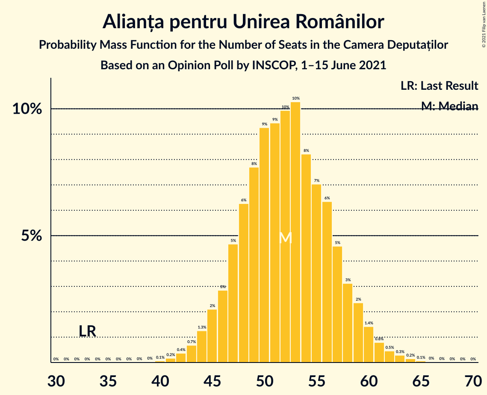

| Number of Seats | Probability | Accumulated | Special Marks |
|:---------------:|:-----------:|:-----------:|:-------------:|
| 33 | 0% | 100% | Last Result |
| 34 | 0% | 100% |  |
| 35 | 0% | 100% |  |
| 36 | 0% | 100% |  |
| 37 | 0% | 100% |  |
| 38 | 0% | 100% |  |
| 39 | 0% | 100% |  |
| 40 | 0.1% | 100% |  |
| 41 | 0.2% | 99.9% |  |
| 42 | 0.4% | 99.7% |  |
| 43 | 0.7% | 99.3% |  |
| 44 | 1.3% | 98.7% |  |
| 45 | 2% | 97% |  |
| 46 | 3% | 95% |  |
| 47 | 5% | 92% |  |
| 48 | 6% | 88% |  |
| 49 | 8% | 82% |  |
| 50 | 9% | 74% |  |
| 51 | 9% | 65% |  |
| 52 | 10% | 55% | Median |
| 53 | 10% | 45% |  |
| 54 | 8% | 35% |  |
| 55 | 7% | 27% |  |
| 56 | 6% | 20% |  |
| 57 | 5% | 13% |  |
| 58 | 3% | 9% |  |
| 59 | 2% | 6% |  |
| 60 | 1.4% | 3% |  |
| 61 | 0.8% | 2% |  |
| 62 | 0.5% | 1.0% |  |
| 63 | 0.3% | 0.6% |  |
| 64 | 0.2% | 0.3% |  |
| 65 | 0.1% | 0.1% |  |
| 66 | 0% | 0.1% |  |
| 67 | 0% | 0% |  |

### Alianța 2020 USR-PLUS

*For a full overview of the results for this party, see the [Alianța 2020 USR-PLUS](party-alianța2020usr-plus.html) page.*

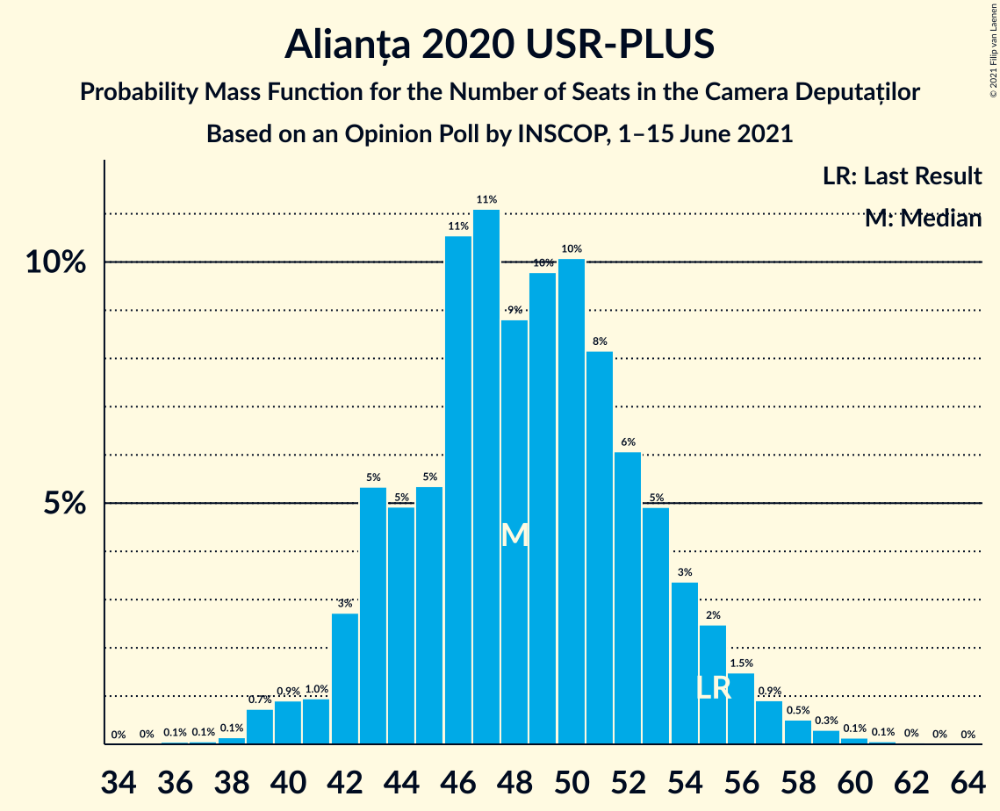

| Number of Seats | Probability | Accumulated | Special Marks |
|:---------------:|:-----------:|:-----------:|:-------------:|
| 36 | 0.1% | 100% |  |
| 37 | 0.1% | 99.9% |  |
| 38 | 0.1% | 99.9% |  |
| 39 | 0.7% | 99.7% |  |
| 40 | 0.9% | 99.0% |  |
| 41 | 1.0% | 98% |  |
| 42 | 3% | 97% |  |
| 43 | 5% | 94% |  |
| 44 | 5% | 89% |  |
| 45 | 5% | 84% |  |
| 46 | 11% | 79% |  |
| 47 | 11% | 68% |  |
| 48 | 9% | 57% | Median |
| 49 | 10% | 48% |  |
| 50 | 10% | 39% |  |
| 51 | 8% | 28% |  |
| 52 | 6% | 20% |  |
| 53 | 5% | 14% |  |
| 54 | 3% | 9% |  |
| 55 | 2% | 6% | Last Result |
| 56 | 1.5% | 3% |  |
| 57 | 0.9% | 2% |  |
| 58 | 0.5% | 1.1% |  |
| 59 | 0.3% | 0.6% |  |
| 60 | 0.1% | 0.3% |  |
| 61 | 0.1% | 0.1% |  |
| 62 | 0% | 0.1% |  |
| 63 | 0% | 0% |  |

### PRO România

*For a full overview of the results for this party, see the [PRO România](party-proromânia.html) page.*

| Number of Seats | Probability | Accumulated | Special Marks |
|:---------------:|:-----------:|:-----------:|:-------------:|
| 0 | 86% | 100% | Last Result, Median |
| 1 | 0% | 14% |  |
| 2 | 0% | 14% |  |
| 3 | 0% | 14% |  |
| 4 | 0% | 14% |  |
| 5 | 0% | 14% |  |
| 6 | 0% | 14% |  |
| 7 | 0% | 14% |  |
| 8 | 0% | 14% |  |
| 9 | 0% | 14% |  |
| 10 | 0% | 14% |  |
| 11 | 0% | 14% |  |
| 12 | 0% | 14% |  |
| 13 | 0% | 14% |  |
| 14 | 0% | 14% |  |
| 15 | 0% | 14% |  |
| 16 | 0% | 14% |  |
| 17 | 2% | 14% |  |
| 18 | 7% | 12% |  |
| 19 | 3% | 6% |  |
| 20 | 1.5% | 2% |  |
| 21 | 0.6% | 0.9% |  |
| 22 | 0.2% | 0.3% |  |
| 23 | 0.1% | 0.1% |  |
| 24 | 0% | 0% |  |

### Partidul Mișcarea Populară

*For a full overview of the results for this party, see the [Partidul Mișcarea Populară](party-partidulmișcareapopulară.html) page.*

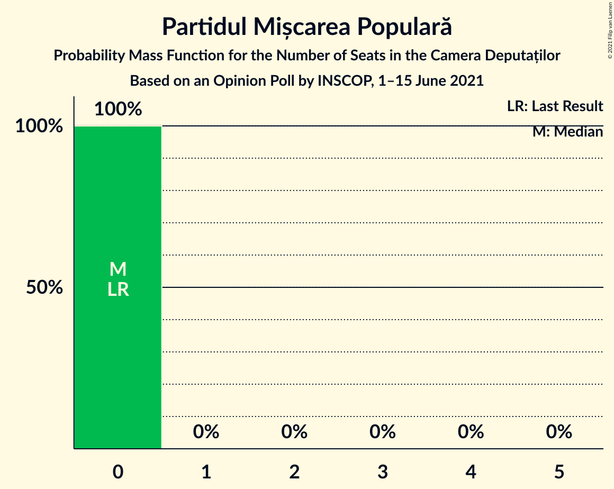

| Number of Seats | Probability | Accumulated | Special Marks |
|:---------------:|:-----------:|:-----------:|:-------------:|
| 0 | 100% | 100% | Last Result, Median |

## Coalitions

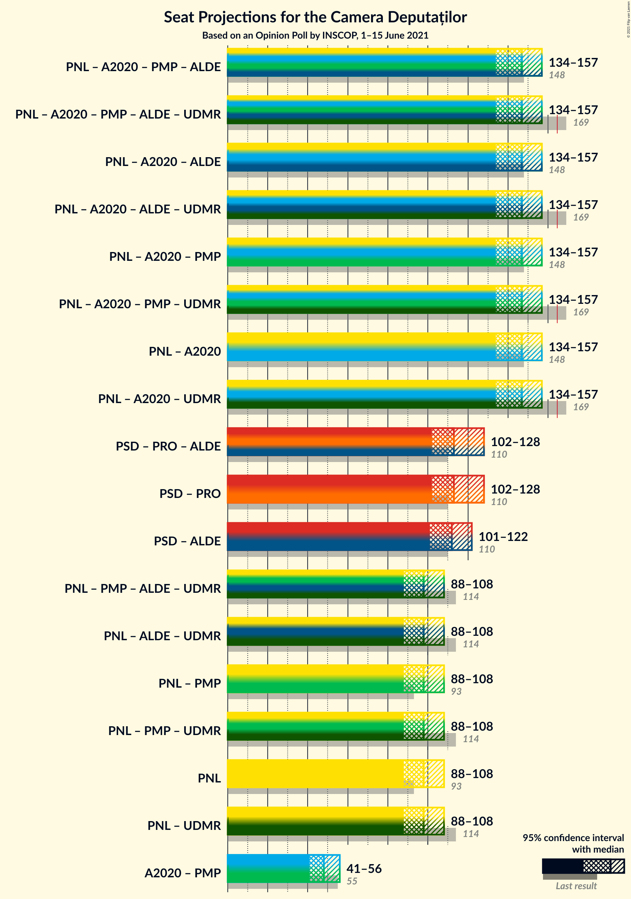

### Confidence Intervals

| Coalition | Last Result | Median | Majority? | 80% Confidence Interval | 90% Confidence Interval | 95% Confidence Interval | 99% Confidence Interval |
|:---------:|:-----------:|:------:|:---------:|:-----------------------:|:-----------------------:|:-----------------------:|:-----------------------:|
| Partidul Național Liberal – Alianța 2020 USR-PLUS – Partidul Mișcarea Populară | 148 | 147 | 0% | 139–154 | 136–156 | 134–157 | 130–161 |
| Partidul Național Liberal – Alianța 2020 USR-PLUS | 148 | 147 | 0% | 139–154 | 136–156 | 134–157 | 130–161 |
| Partidul Social Democrat – PRO România | 110 | 113 | 0% | 106–123 | 104–125 | 102–128 | 100–133 |
| Partidul Național Liberal – Partidul Mișcarea Populară | 93 | 98 | 0% | 91–104 | 89–106 | 88–108 | 84–111 |
| Partidul Național Liberal | 93 | 98 | 0% | 91–104 | 89–106 | 88–108 | 84–111 |
| Alianța 2020 USR-PLUS – Partidul Mișcarea Populară | 55 | 48 | 0% | 43–53 | 42–55 | 41–56 | 39–59 |

### Partidul Național Liberal – Alianța 2020 USR-PLUS – Partidul Mișcarea Populară

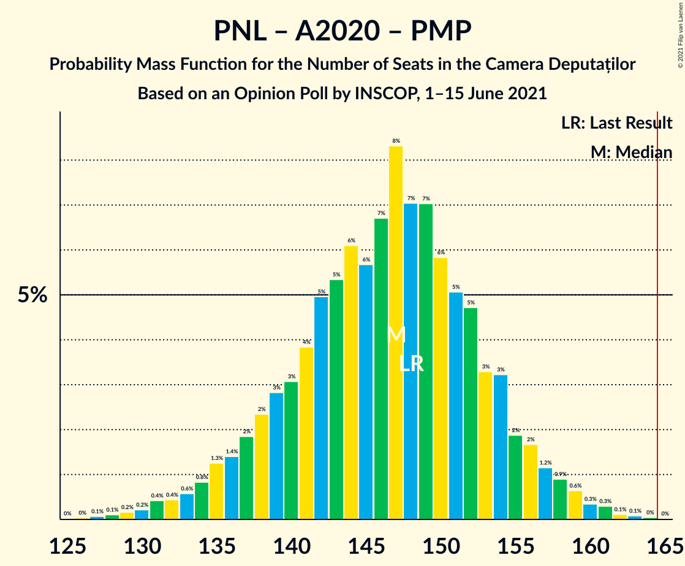

| Number of Seats | Probability | Accumulated | Special Marks |
|:---------------:|:-----------:|:-----------:|:-------------:|
| 126 | 0% | 100% |  |
| 127 | 0.1% | 99.9% |  |
| 128 | 0.1% | 99.8% |  |
| 129 | 0.2% | 99.7% |  |
| 130 | 0.2% | 99.6% |  |
| 131 | 0.4% | 99.4% |  |
| 132 | 0.4% | 98.9% |  |
| 133 | 0.6% | 98.5% |  |
| 134 | 0.8% | 98% |  |
| 135 | 1.3% | 97% |  |
| 136 | 1.4% | 96% |  |
| 137 | 2% | 94% |  |
| 138 | 2% | 93% |  |
| 139 | 3% | 90% |  |
| 140 | 3% | 87% |  |
| 141 | 4% | 84% |  |
| 142 | 5% | 80% |  |
| 143 | 5% | 76% |  |
| 144 | 6% | 70% |  |
| 145 | 6% | 64% |  |
| 146 | 7% | 58% | Median |
| 147 | 8% | 52% |  |
| 148 | 7% | 43% | Last Result |
| 149 | 7% | 36% |  |
| 150 | 6% | 29% |  |
| 151 | 5% | 23% |  |
| 152 | 5% | 18% |  |
| 153 | 3% | 14% |  |
| 154 | 3% | 10% |  |
| 155 | 2% | 7% |  |
| 156 | 2% | 5% |  |
| 157 | 1.2% | 4% |  |
| 158 | 0.9% | 2% |  |
| 159 | 0.6% | 2% |  |
| 160 | 0.3% | 0.9% |  |
| 161 | 0.3% | 0.6% |  |
| 162 | 0.1% | 0.3% |  |
| 163 | 0.1% | 0.2% |  |
| 164 | 0% | 0.1% |  |
| 165 | 0% | 0% | Majority |

### Partidul Național Liberal – Alianța 2020 USR-PLUS

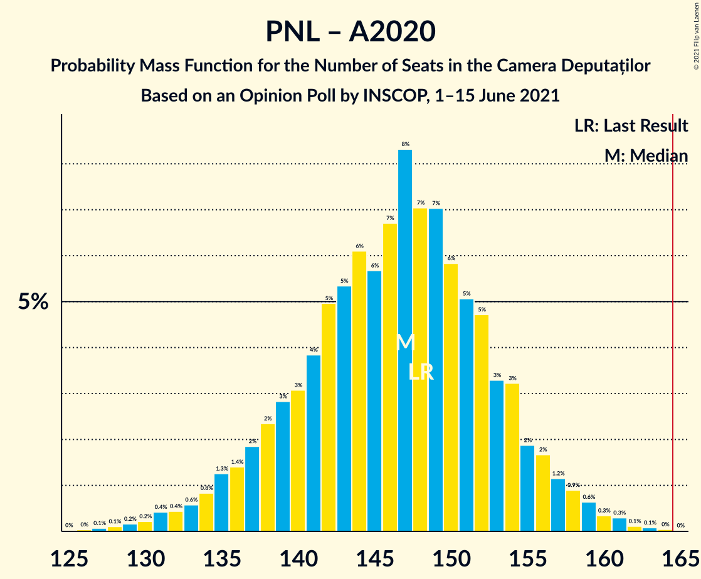

| Number of Seats | Probability | Accumulated | Special Marks |
|:---------------:|:-----------:|:-----------:|:-------------:|
| 126 | 0% | 100% |  |
| 127 | 0.1% | 99.9% |  |
| 128 | 0.1% | 99.8% |  |
| 129 | 0.2% | 99.7% |  |
| 130 | 0.2% | 99.6% |  |
| 131 | 0.4% | 99.4% |  |
| 132 | 0.4% | 98.9% |  |
| 133 | 0.6% | 98.5% |  |
| 134 | 0.8% | 98% |  |
| 135 | 1.3% | 97% |  |
| 136 | 1.4% | 96% |  |
| 137 | 2% | 94% |  |
| 138 | 2% | 93% |  |
| 139 | 3% | 90% |  |
| 140 | 3% | 87% |  |
| 141 | 4% | 84% |  |
| 142 | 5% | 80% |  |
| 143 | 5% | 76% |  |
| 144 | 6% | 70% |  |
| 145 | 6% | 64% |  |
| 146 | 7% | 58% | Median |
| 147 | 8% | 52% |  |
| 148 | 7% | 43% | Last Result |
| 149 | 7% | 36% |  |
| 150 | 6% | 29% |  |
| 151 | 5% | 23% |  |
| 152 | 5% | 18% |  |
| 153 | 3% | 14% |  |
| 154 | 3% | 10% |  |
| 155 | 2% | 7% |  |
| 156 | 2% | 5% |  |
| 157 | 1.2% | 4% |  |
| 158 | 0.9% | 2% |  |
| 159 | 0.6% | 2% |  |
| 160 | 0.3% | 0.9% |  |
| 161 | 0.3% | 0.6% |  |
| 162 | 0.1% | 0.3% |  |
| 163 | 0.1% | 0.2% |  |
| 164 | 0% | 0.1% |  |
| 165 | 0% | 0% | Majority |

### Partidul Social Democrat – PRO România

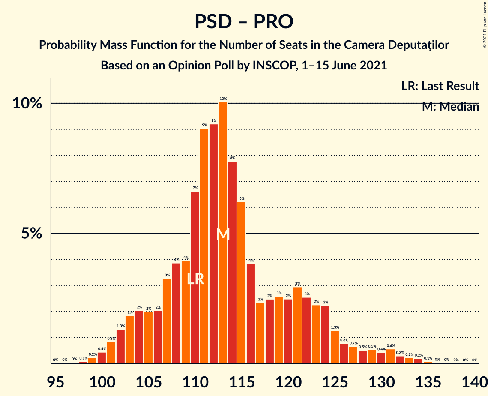

| Number of Seats | Probability | Accumulated | Special Marks |
|:---------------:|:-----------:|:-----------:|:-------------:|
| 97 | 0% | 100% |  |
| 98 | 0.1% | 99.9% |  |
| 99 | 0.2% | 99.8% |  |
| 100 | 0.4% | 99.6% |  |
| 101 | 0.8% | 99.2% |  |
| 102 | 1.3% | 98% |  |
| 103 | 2% | 97% |  |
| 104 | 2% | 95% |  |
| 105 | 2% | 93% |  |
| 106 | 2% | 91% |  |
| 107 | 3% | 89% |  |
| 108 | 4% | 86% |  |
| 109 | 4% | 82% |  |
| 110 | 7% | 78% | Last Result |
| 111 | 9% | 71% |  |
| 112 | 9% | 62% | Median |
| 113 | 10% | 53% |  |
| 114 | 8% | 43% |  |
| 115 | 6% | 35% |  |
| 116 | 4% | 29% |  |
| 117 | 2% | 25% |  |
| 118 | 2% | 23% |  |
| 119 | 3% | 21% |  |
| 120 | 2% | 18% |  |
| 121 | 3% | 16% |  |
| 122 | 3% | 13% |  |
| 123 | 2% | 10% |  |
| 124 | 2% | 8% |  |
| 125 | 1.3% | 6% |  |
| 126 | 0.8% | 4% |  |
| 127 | 0.7% | 4% |  |
| 128 | 0.5% | 3% |  |
| 129 | 0.5% | 2% |  |
| 130 | 0.4% | 2% |  |
| 131 | 0.6% | 1.4% |  |
| 132 | 0.3% | 0.8% |  |
| 133 | 0.2% | 0.5% |  |
| 134 | 0.2% | 0.3% |  |
| 135 | 0.1% | 0.1% |  |
| 136 | 0% | 0.1% |  |
| 137 | 0% | 0% |  |

### Partidul Național Liberal – Partidul Mișcarea Populară

| Number of Seats | Probability | Accumulated | Special Marks |
|:---------------:|:-----------:|:-----------:|:-------------:|
| 81 | 0% | 100% |  |
| 82 | 0.1% | 99.9% |  |
| 83 | 0.1% | 99.9% |  |
| 84 | 0.3% | 99.7% |  |
| 85 | 0.4% | 99.5% |  |
| 86 | 0.5% | 99.1% |  |
| 87 | 0.7% | 98.5% |  |
| 88 | 1.0% | 98% |  |
| 89 | 2% | 97% |  |
| 90 | 2% | 95% |  |
| 91 | 3% | 92% |  |
| 92 | 4% | 89% |  |
| 93 | 4% | 85% | Last Result |
| 94 | 5% | 80% |  |
| 95 | 6% | 76% |  |
| 96 | 7% | 70% |  |
| 97 | 9% | 63% |  |
| 98 | 9% | 53% | Median |
| 99 | 7% | 45% |  |
| 100 | 7% | 38% |  |
| 101 | 5% | 31% |  |
| 102 | 6% | 25% |  |
| 103 | 6% | 20% |  |
| 104 | 4% | 14% |  |
| 105 | 3% | 10% |  |
| 106 | 2% | 6% |  |
| 107 | 1.1% | 4% |  |
| 108 | 0.9% | 3% |  |
| 109 | 0.8% | 2% |  |
| 110 | 0.5% | 1.3% |  |
| 111 | 0.4% | 0.7% |  |
| 112 | 0.2% | 0.4% |  |
| 113 | 0.1% | 0.2% |  |
| 114 | 0.1% | 0.1% |  |
| 115 | 0% | 0.1% |  |
| 116 | 0% | 0% |  |

### Partidul Național Liberal

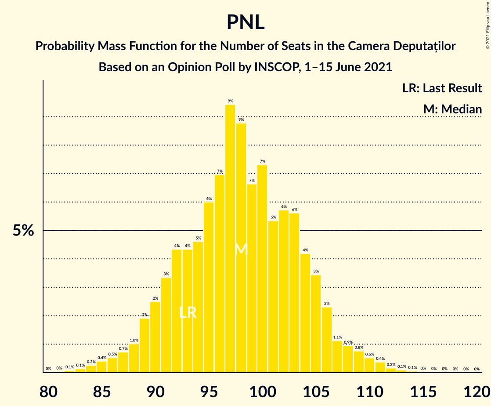

| Number of Seats | Probability | Accumulated | Special Marks |
|:---------------:|:-----------:|:-----------:|:-------------:|
| 81 | 0% | 100% |  |
| 82 | 0.1% | 99.9% |  |
| 83 | 0.1% | 99.9% |  |
| 84 | 0.3% | 99.7% |  |
| 85 | 0.4% | 99.5% |  |
| 86 | 0.5% | 99.1% |  |
| 87 | 0.7% | 98.5% |  |
| 88 | 1.0% | 98% |  |
| 89 | 2% | 97% |  |
| 90 | 2% | 95% |  |
| 91 | 3% | 92% |  |
| 92 | 4% | 89% |  |
| 93 | 4% | 85% | Last Result |
| 94 | 5% | 80% |  |
| 95 | 6% | 76% |  |
| 96 | 7% | 70% |  |
| 97 | 9% | 63% |  |
| 98 | 9% | 53% | Median |
| 99 | 7% | 45% |  |
| 100 | 7% | 38% |  |
| 101 | 5% | 31% |  |
| 102 | 6% | 25% |  |
| 103 | 6% | 20% |  |
| 104 | 4% | 14% |  |
| 105 | 3% | 10% |  |
| 106 | 2% | 6% |  |
| 107 | 1.1% | 4% |  |
| 108 | 0.9% | 3% |  |
| 109 | 0.8% | 2% |  |
| 110 | 0.5% | 1.3% |  |
| 111 | 0.4% | 0.7% |  |
| 112 | 0.2% | 0.4% |  |
| 113 | 0.1% | 0.2% |  |
| 114 | 0.1% | 0.1% |  |
| 115 | 0% | 0.1% |  |
| 116 | 0% | 0% |  |

### Alianța 2020 USR-PLUS – Partidul Mișcarea Populară

| Number of Seats | Probability | Accumulated | Special Marks |
|:---------------:|:-----------:|:-----------:|:-------------:|
| 36 | 0.1% | 100% |  |
| 37 | 0.1% | 99.9% |  |
| 38 | 0.1% | 99.9% |  |
| 39 | 0.7% | 99.7% |  |
| 40 | 0.9% | 99.0% |  |
| 41 | 0.9% | 98% |  |
| 42 | 3% | 97% |  |
| 43 | 5% | 94% |  |
| 44 | 5% | 89% |  |
| 45 | 5% | 84% |  |
| 46 | 11% | 79% |  |
| 47 | 11% | 68% |  |
| 48 | 9% | 57% | Median |
| 49 | 10% | 48% |  |
| 50 | 10% | 39% |  |
| 51 | 8% | 28% |  |
| 52 | 6% | 20% |  |
| 53 | 5% | 14% |  |
| 54 | 3% | 9% |  |
| 55 | 2% | 6% | Last Result |
| 56 | 1.5% | 3% |  |
| 57 | 0.9% | 2% |  |
| 58 | 0.5% | 1.1% |  |
| 59 | 0.3% | 0.6% |  |
| 60 | 0.1% | 0.3% |  |
| 61 | 0.1% | 0.1% |  |
| 62 | 0% | 0.1% |  |
| 63 | 0% | 0% |  |

## Technical Information

### Opinion Poll

+ **Polling firm:** INSCOP
+ **Commissioner(s):** —
+ **Fieldwork period:** 1–15 June 2021

### Calculations

+ **Sample size:** 1100
+ **Simulations done:** 1,048,576
+ **Error estimate:** 1.17%

