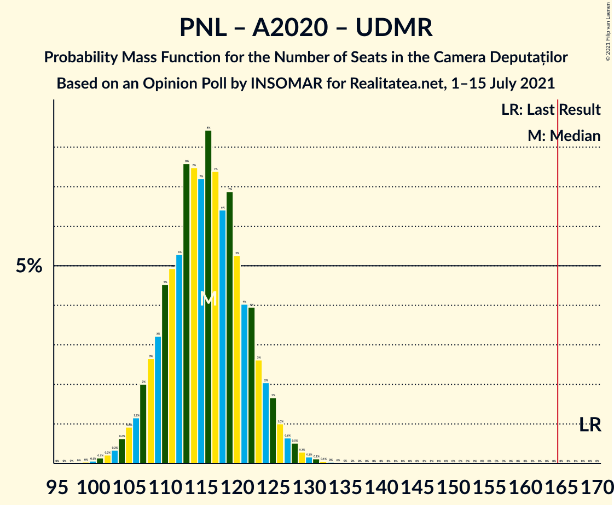

# Opinion Poll by INSOMAR for Realitatea.net, 1–15 July 2021

<a href="#voting-intentions">Voting Intentions</a> | <a href="#seats">Seats</a> | <a href="#coalitions">Coalitions</a> | <a href="#technical-information">Technical Information</a>

## Voting Intentions

### Confidence Intervals

| Party | Last Result | Poll Result | 80% Confidence Interval | 90% Confidence Interval | 95% Confidence Interval | 99% Confidence Interval |
|:-----:|:-----------:|:-----------:|:-----------------------:|:-----------------------:|:-----------------------:|:-----------------------:|
| Partidul Social Democrat | 28.9% | 38.1% | 36.1–40.0% |35.6–40.6% |35.1–41.1% |34.2–42.0% |
| Partidul Național Liberal | 25.2% | 15.1% | 13.8–16.7% |13.4–17.1% |13.1–17.5% |12.5–18.2% |
| Alianța pentru Unirea Românilor | 9.1% | 15.0% | 13.7–16.6% |13.3–17.0% |13.0–17.4% |12.4–18.1% |
| Alianța 2020 USR-PLUS | 15.4% | 11.1% | 9.9–12.4% |9.6–12.8% |9.3–13.1% |8.8–13.8% |
| Uniunea Democrată Maghiară din România | 5.7% | 5.1% | 4.4–6.1% |4.1–6.4% |3.9–6.7% |3.6–7.2% |

*Note:* The poll result column reflects the actual value used in the calculations. Published results may vary slightly, and in addition be rounded to fewer digits.

## Seats

### Confidence Intervals

| Party | Last Result | Median | 80% Confidence Interval | 90% Confidence Interval | 95% Confidence Interval | 99% Confidence Interval |
|:-----:|:-----------:|:------:|:-----------------------:|:-----------------------:|:-----------------------:|:-----------------------:|
| <a href="#partidul-social-democrat">Partidul Social Democrat</a> | 110 | 141 | 134–148 |132–150 |130–151 |127–155 |
| <a href="#partidul-național-liberal">Partidul Național Liberal</a> | 93 | 56 | 51–61 |49–63 |48–64 |46–67 |
| <a href="#alianța-pentru-unirea-românilor">Alianța pentru Unirea Românilor</a> | 33 | 56 | 50–61 |49–62 |48–64 |46–67 |
| <a href="#alianța-2020-usr-plus">Alianța 2020 USR-PLUS</a> | 55 | 41 | 36–46 |35–47 |34–48 |32–51 |
| <a href="#uniunea-democrată-maghiară-din-românia">Uniunea Democrată Maghiară din România</a> | 21 | 19 | 16–22 |15–23 |14–24 |13–26 |

### Partidul Social Democrat

*For a full overview of the results for this party, see the [Partidul Social Democrat](party-partidulsocialdemocrat.html) page.*

| Number of Seats | Probability | Accumulated | Special Marks |
|:---------------:|:-----------:|:-----------:|:-------------:|
| 110 | 0% | 100% | Last Result |
| 111 | 0% | 100% |  |
| 112 | 0% | 100% |  |
| 113 | 0% | 100% |  |
| 114 | 0% | 100% |  |
| 115 | 0% | 100% |  |
| 116 | 0% | 100% |  |
| 117 | 0% | 100% |  |
| 118 | 0% | 100% |  |
| 119 | 0% | 100% |  |
| 120 | 0% | 100% |  |
| 121 | 0% | 100% |  |
| 122 | 0% | 100% |  |
| 123 | 0% | 100% |  |
| 124 | 0% | 99.9% |  |
| 125 | 0.1% | 99.9% |  |
| 126 | 0.2% | 99.8% |  |
| 127 | 0.3% | 99.7% |  |
| 128 | 0.4% | 99.4% |  |
| 129 | 0.6% | 99.0% |  |
| 130 | 1.1% | 98% |  |
| 131 | 1.4% | 97% |  |
| 132 | 2% | 96% |  |
| 133 | 3% | 94% |  |
| 134 | 3% | 91% |  |
| 135 | 4% | 88% |  |
| 136 | 5% | 84% |  |
| 137 | 6% | 79% |  |
| 138 | 6% | 73% |  |
| 139 | 7% | 67% |  |
| 140 | 8% | 59% |  |
| 141 | 7% | 52% | Median |
| 142 | 7% | 44% |  |
| 143 | 8% | 38% |  |
| 144 | 7% | 30% |  |
| 145 | 5% | 23% |  |
| 146 | 5% | 19% |  |
| 147 | 4% | 14% |  |
| 148 | 3% | 10% |  |
| 149 | 2% | 7% |  |
| 150 | 2% | 5% |  |
| 151 | 1.2% | 3% |  |
| 152 | 0.8% | 2% |  |
| 153 | 0.5% | 1.3% |  |
| 154 | 0.4% | 0.9% |  |
| 155 | 0.2% | 0.5% |  |
| 156 | 0.1% | 0.3% |  |
| 157 | 0.1% | 0.2% |  |
| 158 | 0% | 0.1% |  |
| 159 | 0% | 0.1% |  |
| 160 | 0% | 0% |  |

### Partidul Național Liberal

*For a full overview of the results for this party, see the [Partidul Național Liberal](party-partidulnaționalliberal.html) page.*

| Number of Seats | Probability | Accumulated | Special Marks |
|:---------------:|:-----------:|:-----------:|:-------------:|
| 43 | 0% | 100% |  |
| 44 | 0.1% | 99.9% |  |
| 45 | 0.2% | 99.8% |  |
| 46 | 0.5% | 99.6% |  |
| 47 | 0.8% | 99.1% |  |
| 48 | 1.4% | 98% |  |
| 49 | 3% | 97% |  |
| 50 | 3% | 94% |  |
| 51 | 5% | 91% |  |
| 52 | 6% | 86% |  |
| 53 | 8% | 80% |  |
| 54 | 9% | 72% |  |
| 55 | 9% | 63% |  |
| 56 | 10% | 53% | Median |
| 57 | 9% | 44% |  |
| 58 | 8% | 35% |  |
| 59 | 7% | 27% |  |
| 60 | 6% | 19% |  |
| 61 | 4% | 14% |  |
| 62 | 3% | 9% |  |
| 63 | 2% | 6% |  |
| 64 | 1.5% | 4% |  |
| 65 | 1.0% | 2% |  |
| 66 | 0.6% | 1.2% |  |
| 67 | 0.3% | 0.7% |  |
| 68 | 0.2% | 0.4% |  |
| 69 | 0.1% | 0.2% |  |
| 70 | 0% | 0.1% |  |
| 71 | 0% | 0% |  |
| 72 | 0% | 0% |  |
| 73 | 0% | 0% |  |
| 74 | 0% | 0% |  |
| 75 | 0% | 0% |  |
| 76 | 0% | 0% |  |
| 77 | 0% | 0% |  |
| 78 | 0% | 0% |  |
| 79 | 0% | 0% |  |
| 80 | 0% | 0% |  |
| 81 | 0% | 0% |  |
| 82 | 0% | 0% |  |
| 83 | 0% | 0% |  |
| 84 | 0% | 0% |  |
| 85 | 0% | 0% |  |
| 86 | 0% | 0% |  |
| 87 | 0% | 0% |  |
| 88 | 0% | 0% |  |
| 89 | 0% | 0% |  |
| 90 | 0% | 0% |  |
| 91 | 0% | 0% |  |
| 92 | 0% | 0% |  |
| 93 | 0% | 0% | Last Result |

### Alianța pentru Unirea Românilor

*For a full overview of the results for this party, see the [Alianța pentru Unirea Românilor](party-alianțapentruunirearomânilor.html) page.*

| Number of Seats | Probability | Accumulated | Special Marks |
|:---------------:|:-----------:|:-----------:|:-------------:|
| 33 | 0% | 100% | Last Result |
| 34 | 0% | 100% |  |
| 35 | 0% | 100% |  |
| 36 | 0% | 100% |  |
| 37 | 0% | 100% |  |
| 38 | 0% | 100% |  |
| 39 | 0% | 100% |  |
| 40 | 0% | 100% |  |
| 41 | 0% | 100% |  |
| 42 | 0% | 100% |  |
| 43 | 0% | 100% |  |
| 44 | 0.1% | 99.9% |  |
| 45 | 0.3% | 99.8% |  |
| 46 | 0.5% | 99.5% |  |
| 47 | 1.1% | 99.0% |  |
| 48 | 2% | 98% |  |
| 49 | 3% | 96% |  |
| 50 | 4% | 94% |  |
| 51 | 5% | 89% |  |
| 52 | 7% | 84% |  |
| 53 | 9% | 77% |  |
| 54 | 8% | 68% |  |
| 55 | 10% | 60% |  |
| 56 | 11% | 50% | Median |
| 57 | 8% | 40% |  |
| 58 | 8% | 32% |  |
| 59 | 7% | 23% |  |
| 60 | 5% | 16% |  |
| 61 | 4% | 12% |  |
| 62 | 3% | 8% |  |
| 63 | 2% | 5% |  |
| 64 | 1.3% | 3% |  |
| 65 | 0.7% | 2% |  |
| 66 | 0.4% | 0.9% |  |
| 67 | 0.3% | 0.5% |  |
| 68 | 0.1% | 0.2% |  |
| 69 | 0.1% | 0.1% |  |
| 70 | 0% | 0.1% |  |
| 71 | 0% | 0% |  |

### Alianța 2020 USR-PLUS

*For a full overview of the results for this party, see the [Alianța 2020 USR-PLUS](party-alianța2020usr-plus.html) page.*

| Number of Seats | Probability | Accumulated | Special Marks |
|:---------------:|:-----------:|:-----------:|:-------------:|
| 30 | 0.1% | 100% |  |
| 31 | 0.2% | 99.9% |  |
| 32 | 0.5% | 99.7% |  |
| 33 | 1.0% | 99.2% |  |
| 34 | 2% | 98% |  |
| 35 | 3% | 96% |  |
| 36 | 5% | 93% |  |
| 37 | 7% | 88% |  |
| 38 | 8% | 81% |  |
| 39 | 10% | 73% |  |
| 40 | 10% | 63% |  |
| 41 | 11% | 52% | Median |
| 42 | 10% | 42% |  |
| 43 | 9% | 32% |  |
| 44 | 8% | 24% |  |
| 45 | 5% | 16% |  |
| 46 | 4% | 11% |  |
| 47 | 3% | 7% |  |
| 48 | 2% | 4% |  |
| 49 | 1.0% | 2% |  |
| 50 | 0.6% | 1.1% |  |
| 51 | 0.3% | 0.6% |  |
| 52 | 0.2% | 0.3% |  |
| 53 | 0.1% | 0.1% |  |
| 54 | 0% | 0.1% |  |
| 55 | 0% | 0% | Last Result |

### Uniunea Democrată Maghiară din România

*For a full overview of the results for this party, see the [Uniunea Democrată Maghiară din România](party-uniuneademocratămaghiarădinromânia.html) page.*

| Number of Seats | Probability | Accumulated | Special Marks |
|:---------------:|:-----------:|:-----------:|:-------------:|
| 12 | 0.2% | 100% |  |
| 13 | 0.8% | 99.7% |  |
| 14 | 2% | 98.9% |  |
| 15 | 5% | 96% |  |
| 16 | 9% | 92% |  |
| 17 | 13% | 83% |  |
| 18 | 15% | 70% |  |
| 19 | 16% | 55% | Median |
| 20 | 13% | 39% |  |
| 21 | 10% | 26% | Last Result |
| 22 | 7% | 15% |  |
| 23 | 4% | 9% |  |
| 24 | 2% | 4% |  |
| 25 | 1.2% | 2% |  |
| 26 | 0.5% | 0.9% |  |
| 27 | 0.2% | 0.4% |  |
| 28 | 0.1% | 0.1% |  |
| 29 | 0% | 0% |  |

## Coalitions

### Confidence Intervals

| Coalition | Last Result | Median | Majority? | 80% Confidence Interval | 90% Confidence Interval | 95% Confidence Interval | 99% Confidence Interval |
|:---------:|:-----------:|:------:|:---------:|:-----------------------:|:-----------------------:|:-----------------------:|:-----------------------:|
| Partidul Național Liberal – Alianța 2020 USR-PLUS – Uniunea Democrată Maghiară din România | 169 | 116 | 0% | 109–122 | 107–124 | 106–126 | 102–129 |
| Partidul Național Liberal – Alianța 2020 USR-PLUS | 148 | 97 | 0% | 90–103 | 89–105 | 87–107 | 84–110 |
| Partidul Național Liberal – Uniunea Democrată Maghiară din România | 114 | 75 | 0% | 69–81 | 67–82 | 66–84 | 63–87 |
| Partidul Național Liberal | 93 | 56 | 0% | 51–61 | 49–63 | 48–64 | 46–67 |

### Partidul Național Liberal – Alianța 2020 USR-PLUS – Uniunea Democrată Maghiară din România

| Number of Seats | Probability | Accumulated | Special Marks |
|:---------------:|:-----------:|:-----------:|:-------------:|
| 98 | 0% | 100% |  |
| 99 | 0% | 99.9% |  |
| 100 | 0.1% | 99.9% |  |
| 101 | 0.1% | 99.8% |  |
| 102 | 0.2% | 99.7% |  |
| 103 | 0.3% | 99.5% |  |
| 104 | 0.6% | 99.1% |  |
| 105 | 0.9% | 98.5% |  |
| 106 | 1.2% | 98% |  |
| 107 | 2% | 96% |  |
| 108 | 3% | 94% |  |
| 109 | 3% | 92% |  |
| 110 | 5% | 89% |  |
| 111 | 5% | 84% |  |
| 112 | 5% | 79% |  |
| 113 | 8% | 74% |  |
| 114 | 7% | 66% |  |
| 115 | 7% | 59% |  |
| 116 | 8% | 52% | Median |
| 117 | 7% | 43% |  |
| 118 | 6% | 36% |  |
| 119 | 7% | 29% |  |
| 120 | 5% | 22% |  |
| 121 | 4% | 17% |  |
| 122 | 4% | 13% |  |
| 123 | 3% | 9% |  |
| 124 | 2% | 7% |  |
| 125 | 2% | 5% |  |
| 126 | 1.0% | 3% |  |
| 127 | 0.6% | 2% |  |
| 128 | 0.5% | 1.2% |  |
| 129 | 0.3% | 0.7% |  |
| 130 | 0.2% | 0.4% |  |
| 131 | 0.1% | 0.2% |  |
| 132 | 0.1% | 0.1% |  |
| 133 | 0% | 0.1% |  |
| 134 | 0% | 0% |  |
| 135 | 0% | 0% |  |
| 136 | 0% | 0% |  |
| 137 | 0% | 0% |  |
| 138 | 0% | 0% |  |
| 139 | 0% | 0% |  |
| 140 | 0% | 0% |  |
| 141 | 0% | 0% |  |
| 142 | 0% | 0% |  |
| 143 | 0% | 0% |  |
| 144 | 0% | 0% |  |
| 145 | 0% | 0% |  |
| 146 | 0% | 0% |  |
| 147 | 0% | 0% |  |
| 148 | 0% | 0% |  |
| 149 | 0% | 0% |  |
| 150 | 0% | 0% |  |
| 151 | 0% | 0% |  |
| 152 | 0% | 0% |  |
| 153 | 0% | 0% |  |
| 154 | 0% | 0% |  |
| 155 | 0% | 0% |  |
| 156 | 0% | 0% |  |
| 157 | 0% | 0% |  |
| 158 | 0% | 0% |  |
| 159 | 0% | 0% |  |
| 160 | 0% | 0% |  |
| 161 | 0% | 0% |  |
| 162 | 0% | 0% |  |
| 163 | 0% | 0% |  |
| 164 | 0% | 0% |  |
| 165 | 0% | 0% | Majority |
| 166 | 0% | 0% |  |
| 167 | 0% | 0% |  |
| 168 | 0% | 0% |  |
| 169 | 0% | 0% | Last Result |

### Partidul Național Liberal – Alianța 2020 USR-PLUS

| Number of Seats | Probability | Accumulated | Special Marks |
|:---------------:|:-----------:|:-----------:|:-------------:|
| 80 | 0% | 100% |  |
| 81 | 0% | 99.9% |  |
| 82 | 0.1% | 99.9% |  |
| 83 | 0.2% | 99.8% |  |
| 84 | 0.2% | 99.7% |  |
| 85 | 0.4% | 99.4% |  |
| 86 | 0.7% | 99.0% |  |
| 87 | 1.2% | 98% |  |
| 88 | 1.4% | 97% |  |
| 89 | 2% | 96% |  |
| 90 | 3% | 93% |  |
| 91 | 4% | 90% |  |
| 92 | 5% | 86% |  |
| 93 | 7% | 81% |  |
| 94 | 7% | 74% |  |
| 95 | 8% | 67% |  |
| 96 | 8% | 60% |  |
| 97 | 9% | 52% | Median |
| 98 | 8% | 43% |  |
| 99 | 7% | 36% |  |
| 100 | 6% | 29% |  |
| 101 | 6% | 23% |  |
| 102 | 4% | 17% |  |
| 103 | 4% | 12% |  |
| 104 | 3% | 9% |  |
| 105 | 2% | 6% |  |
| 106 | 1.3% | 4% |  |
| 107 | 1.0% | 3% |  |
| 108 | 0.6% | 2% |  |
| 109 | 0.4% | 1.0% |  |
| 110 | 0.2% | 0.6% |  |
| 111 | 0.2% | 0.3% |  |
| 112 | 0.1% | 0.2% |  |
| 113 | 0% | 0.1% |  |
| 114 | 0% | 0% |  |
| 115 | 0% | 0% |  |
| 116 | 0% | 0% |  |
| 117 | 0% | 0% |  |
| 118 | 0% | 0% |  |
| 119 | 0% | 0% |  |
| 120 | 0% | 0% |  |
| 121 | 0% | 0% |  |
| 122 | 0% | 0% |  |
| 123 | 0% | 0% |  |
| 124 | 0% | 0% |  |
| 125 | 0% | 0% |  |
| 126 | 0% | 0% |  |
| 127 | 0% | 0% |  |
| 128 | 0% | 0% |  |
| 129 | 0% | 0% |  |
| 130 | 0% | 0% |  |
| 131 | 0% | 0% |  |
| 132 | 0% | 0% |  |
| 133 | 0% | 0% |  |
| 134 | 0% | 0% |  |
| 135 | 0% | 0% |  |
| 136 | 0% | 0% |  |
| 137 | 0% | 0% |  |
| 138 | 0% | 0% |  |
| 139 | 0% | 0% |  |
| 140 | 0% | 0% |  |
| 141 | 0% | 0% |  |
| 142 | 0% | 0% |  |
| 143 | 0% | 0% |  |
| 144 | 0% | 0% |  |
| 145 | 0% | 0% |  |
| 146 | 0% | 0% |  |
| 147 | 0% | 0% |  |
| 148 | 0% | 0% | Last Result |

### Partidul Național Liberal – Uniunea Democrată Maghiară din România

| Number of Seats | Probability | Accumulated | Special Marks |
|:---------------:|:-----------:|:-----------:|:-------------:|
| 60 | 0% | 100% |  |
| 61 | 0.1% | 99.9% |  |
| 62 | 0.1% | 99.9% |  |
| 63 | 0.3% | 99.7% |  |
| 64 | 0.5% | 99.5% |  |
| 65 | 0.8% | 99.0% |  |
| 66 | 1.4% | 98% |  |
| 67 | 2% | 97% |  |
| 68 | 3% | 95% |  |
| 69 | 4% | 92% |  |
| 70 | 5% | 88% |  |
| 71 | 7% | 83% |  |
| 72 | 7% | 77% |  |
| 73 | 8% | 70% |  |
| 74 | 9% | 62% |  |
| 75 | 9% | 53% | Median |
| 76 | 8% | 43% |  |
| 77 | 8% | 35% |  |
| 78 | 7% | 27% |  |
| 79 | 6% | 21% |  |
| 80 | 4% | 15% |  |
| 81 | 3% | 11% |  |
| 82 | 2% | 7% |  |
| 83 | 2% | 5% |  |
| 84 | 1.2% | 3% |  |
| 85 | 0.8% | 2% |  |
| 86 | 0.5% | 1.2% |  |
| 87 | 0.3% | 0.7% |  |
| 88 | 0.2% | 0.4% |  |
| 89 | 0.1% | 0.2% |  |
| 90 | 0.1% | 0.1% |  |
| 91 | 0% | 0.1% |  |
| 92 | 0% | 0% |  |
| 93 | 0% | 0% |  |
| 94 | 0% | 0% |  |
| 95 | 0% | 0% |  |
| 96 | 0% | 0% |  |
| 97 | 0% | 0% |  |
| 98 | 0% | 0% |  |
| 99 | 0% | 0% |  |
| 100 | 0% | 0% |  |
| 101 | 0% | 0% |  |
| 102 | 0% | 0% |  |
| 103 | 0% | 0% |  |
| 104 | 0% | 0% |  |
| 105 | 0% | 0% |  |
| 106 | 0% | 0% |  |
| 107 | 0% | 0% |  |
| 108 | 0% | 0% |  |
| 109 | 0% | 0% |  |
| 110 | 0% | 0% |  |
| 111 | 0% | 0% |  |
| 112 | 0% | 0% |  |
| 113 | 0% | 0% |  |
| 114 | 0% | 0% | Last Result |

### Partidul Național Liberal

| Number of Seats | Probability | Accumulated | Special Marks |
|:---------------:|:-----------:|:-----------:|:-------------:|
| 43 | 0% | 100% |  |
| 44 | 0.1% | 99.9% |  |
| 45 | 0.2% | 99.8% |  |
| 46 | 0.5% | 99.6% |  |
| 47 | 0.8% | 99.1% |  |
| 48 | 1.4% | 98% |  |
| 49 | 3% | 97% |  |
| 50 | 3% | 94% |  |
| 51 | 5% | 91% |  |
| 52 | 6% | 86% |  |
| 53 | 8% | 80% |  |
| 54 | 9% | 72% |  |
| 55 | 9% | 63% |  |
| 56 | 10% | 53% | Median |
| 57 | 9% | 44% |  |
| 58 | 8% | 35% |  |
| 59 | 7% | 27% |  |
| 60 | 6% | 19% |  |
| 61 | 4% | 14% |  |
| 62 | 3% | 9% |  |
| 63 | 2% | 6% |  |
| 64 | 1.5% | 4% |  |
| 65 | 1.0% | 2% |  |
| 66 | 0.6% | 1.2% |  |
| 67 | 0.3% | 0.7% |  |
| 68 | 0.2% | 0.4% |  |
| 69 | 0.1% | 0.2% |  |
| 70 | 0% | 0.1% |  |
| 71 | 0% | 0% |  |
| 72 | 0% | 0% |  |
| 73 | 0% | 0% |  |
| 74 | 0% | 0% |  |
| 75 | 0% | 0% |  |
| 76 | 0% | 0% |  |
| 77 | 0% | 0% |  |
| 78 | 0% | 0% |  |
| 79 | 0% | 0% |  |
| 80 | 0% | 0% |  |
| 81 | 0% | 0% |  |
| 82 | 0% | 0% |  |
| 83 | 0% | 0% |  |
| 84 | 0% | 0% |  |
| 85 | 0% | 0% |  |
| 86 | 0% | 0% |  |
| 87 | 0% | 0% |  |
| 88 | 0% | 0% |  |
| 89 | 0% | 0% |  |
| 90 | 0% | 0% |  |
| 91 | 0% | 0% |  |
| 92 | 0% | 0% |  |
| 93 | 0% | 0% | Last Result |

## Technical Information

### Opinion Poll

+ **Polling firm:** INSOMAR
+ **Commissioner(s):** Realitatea.net
+ **Fieldwork period:** 1–15 July 2021

### Calculations

+ **Sample size:** 1030
+ **Simulations done:** 1,048,576
+ **Error estimate:** 0.21%

