# Opinion Poll by CURS, 8–10 September 2021

<a href="#voting-intentions">Voting Intentions</a> | <a href="#seats">Seats</a> | <a href="#coalitions">Coalitions</a> | <a href="#technical-information">Technical Information</a>

## Voting Intentions

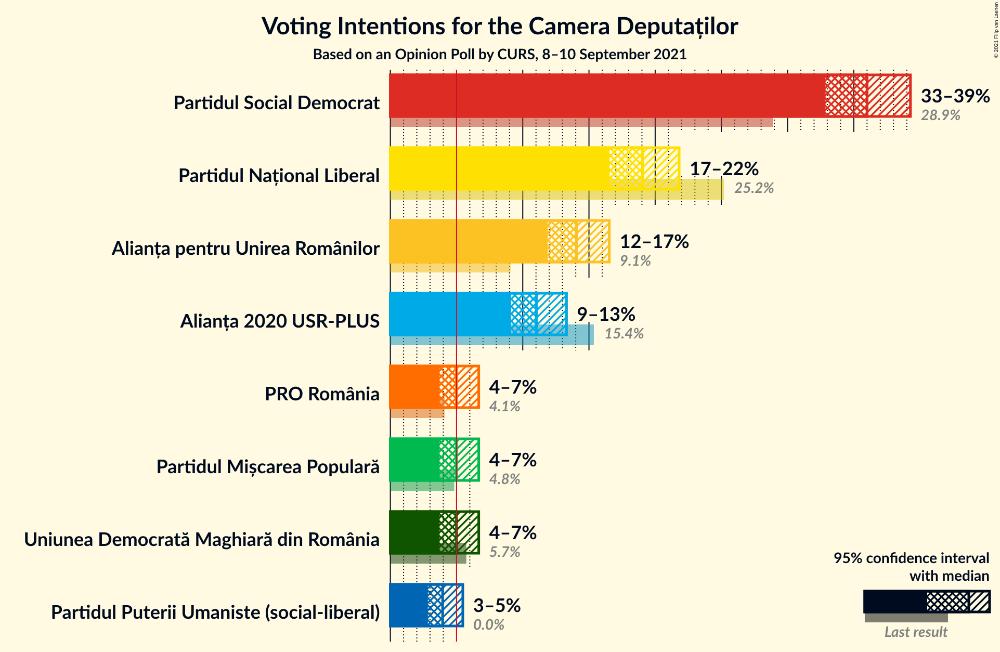

### Confidence Intervals

| Party | Last Result | Poll Result | 80% Confidence Interval | 90% Confidence Interval | 95% Confidence Interval | 99% Confidence Interval |
|:-----:|:-----------:|:-----------:|:-----------------------:|:-----------------------:|:-----------------------:|:-----------------------:|
| Partidul Social Democrat | 28.9% | 36.0% | 33.9–38.1% |33.4–38.7% |32.9–39.3% |31.9–40.3% |
| Partidul Național Liberal | 25.2% | 19.0% | 17.4–20.9% |16.9–21.4% |16.6–21.8% |15.8–22.7% |
| Alianța pentru Unirea Românilor | 9.1% | 14.1% | 12.6–15.7% |12.2–16.1% |11.9–16.5% |11.2–17.3% |
| Alianța 2020 USR-PLUS | 15.4% | 11.0% | 9.8–12.5% |9.4–12.9% |9.1–13.3% |8.5–14.1% |
| Uniunea Democrată Maghiară din România | 5.7% | 5.0% | 4.2–6.1% |3.9–6.4% |3.7–6.7% |3.4–7.2% |
| Partidul Mișcarea Populară | 4.8% | 5.0% | 4.2–6.1% |3.9–6.4% |3.7–6.7% |3.4–7.2% |
| PRO România | 4.1% | 5.0% | 4.2–6.1% |3.9–6.4% |3.7–6.7% |3.4–7.2% |
| Partidul Puterii Umaniste (social-liberal) | 0.0% | 3.9% | 3.2–4.9% |3.0–5.2% |2.8–5.5% |2.5–6.0% |

*Note:* The poll result column reflects the actual value used in the calculations. Published results may vary slightly, and in addition be rounded to fewer digits.

## Seats

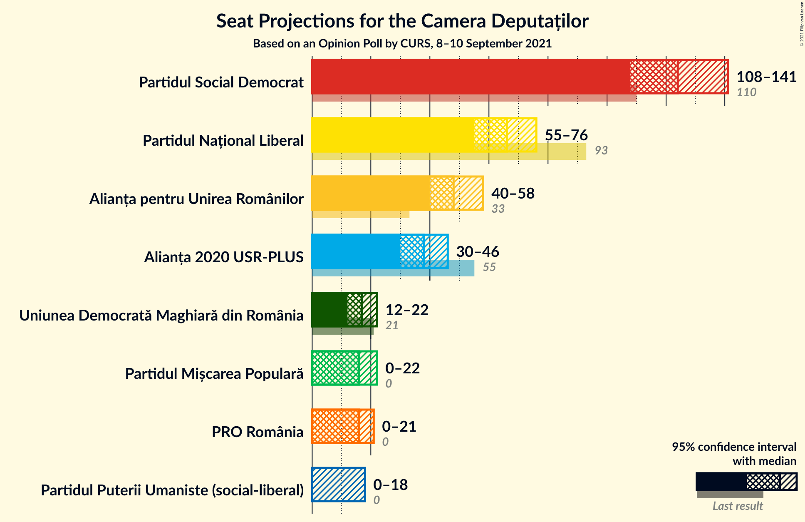

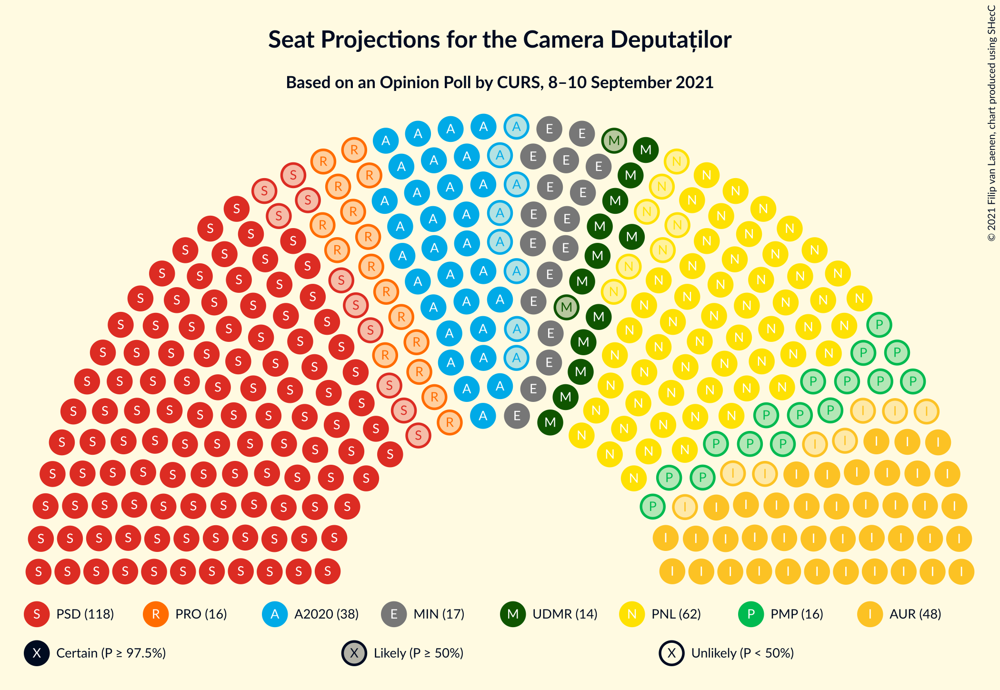

### Confidence Intervals

| Party | Last Result | Median | 80% Confidence Interval | 90% Confidence Interval | 95% Confidence Interval | 99% Confidence Interval |
|:-----:|:-----------:|:------:|:-----------------------:|:-----------------------:|:-----------------------:|:-----------------------:|
| <a href="#partidul-social-democrat">Partidul Social Democrat</a> | 110 | 124 | 112–136 |110–137 |108–141 |104–146 |
| <a href="#partidul-național-liberal">Partidul Național Liberal</a> | 93 | 66 | 58–74 |56–75 |55–76 |52–81 |
| <a href="#alianța-pentru-unirea-românilor">Alianța pentru Unirea Românilor</a> | 33 | 48 | 42–54 |41–56 |40–58 |37–61 |
| <a href="#alianța-2020-usr-plus">Alianța 2020 USR-PLUS</a> | 55 | 38 | 33–43 |31–45 |30–46 |28–50 |
| <a href="#uniunea-democrată-maghiară-din-românia">Uniunea Democrată Maghiară din România</a> | 21 | 17 | 14–21 |13–22 |12–22 |11–24 |
| <a href="#partidul-mișcarea-populară">Partidul Mișcarea Populară</a> | 0 | 16 | 0–18 |0–19 |0–22 |0–25 |
| <a href="#pro-românia">PRO România</a> | 0 | 16 | 0–19 |0–20 |0–21 |0–24 |
| <a href="#partidul-puterii-umaniste-(social-liberal)">Partidul Puterii Umaniste (social-liberal)</a> | 0 | 0 | 0 |0–17 |0–18 |0–20 |

### Partidul Social Democrat

*For a full overview of the results for this party, see the [Partidul Social Democrat](party-partidulsocialdemocrat.html) page.*

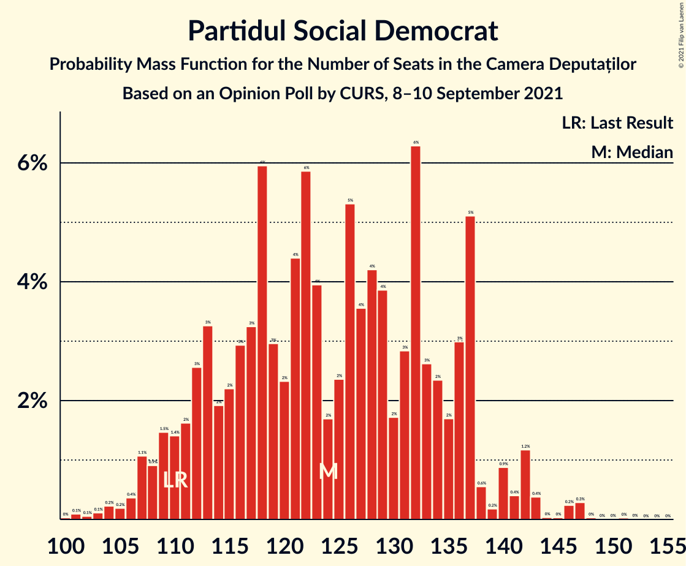

| Number of Seats | Probability | Accumulated | Special Marks |
|:---------------:|:-----------:|:-----------:|:-------------:|
| 100 | 0% | 100% |  |
| 101 | 0.1% | 99.9% |  |
| 102 | 0.1% | 99.8% |  |
| 103 | 0.1% | 99.8% |  |
| 104 | 0.2% | 99.7% |  |
| 105 | 0.2% | 99.4% |  |
| 106 | 0.4% | 99.3% |  |
| 107 | 1.1% | 98.9% |  |
| 108 | 0.9% | 98% |  |
| 109 | 1.5% | 97% |  |
| 110 | 1.4% | 95% | Last Result |
| 111 | 2% | 94% |  |
| 112 | 3% | 92% |  |
| 113 | 3% | 90% |  |
| 114 | 2% | 87% |  |
| 115 | 2% | 85% |  |
| 116 | 3% | 82% |  |
| 117 | 3% | 80% |  |
| 118 | 6% | 76% |  |
| 119 | 3% | 70% |  |
| 120 | 2% | 67% |  |
| 121 | 4% | 65% |  |
| 122 | 6% | 61% |  |
| 123 | 4% | 55% |  |
| 124 | 2% | 51% | Median |
| 125 | 2% | 49% |  |
| 126 | 5% | 47% |  |
| 127 | 4% | 41% |  |
| 128 | 4% | 38% |  |
| 129 | 4% | 34% |  |
| 130 | 2% | 30% |  |
| 131 | 3% | 28% |  |
| 132 | 6% | 25% |  |
| 133 | 3% | 19% |  |
| 134 | 2% | 16% |  |
| 135 | 2% | 14% |  |
| 136 | 3% | 12% |  |
| 137 | 5% | 9% |  |
| 138 | 0.6% | 4% |  |
| 139 | 0.2% | 4% |  |
| 140 | 0.9% | 4% |  |
| 141 | 0.4% | 3% |  |
| 142 | 1.2% | 2% |  |
| 143 | 0.4% | 1.1% |  |
| 144 | 0% | 0.7% |  |
| 145 | 0% | 0.7% |  |
| 146 | 0.2% | 0.6% |  |
| 147 | 0.3% | 0.4% |  |
| 148 | 0% | 0.1% |  |
| 149 | 0% | 0.1% |  |
| 150 | 0% | 0.1% |  |
| 151 | 0% | 0.1% |  |
| 152 | 0% | 0% |  |

### Partidul Național Liberal

*For a full overview of the results for this party, see the [Partidul Național Liberal](party-partidulnaționalliberal.html) page.*

| Number of Seats | Probability | Accumulated | Special Marks |
|:---------------:|:-----------:|:-----------:|:-------------:|
| 49 | 0% | 100% |  |
| 50 | 0.1% | 99.9% |  |
| 51 | 0.2% | 99.8% |  |
| 52 | 0.2% | 99.6% |  |
| 53 | 0.4% | 99.4% |  |
| 54 | 1.2% | 99.0% |  |
| 55 | 1.1% | 98% |  |
| 56 | 2% | 97% |  |
| 57 | 4% | 94% |  |
| 58 | 4% | 91% |  |
| 59 | 4% | 87% |  |
| 60 | 4% | 83% |  |
| 61 | 5% | 79% |  |
| 62 | 8% | 73% |  |
| 63 | 5% | 65% |  |
| 64 | 3% | 60% |  |
| 65 | 6% | 57% |  |
| 66 | 8% | 51% | Median |
| 67 | 9% | 43% |  |
| 68 | 2% | 33% |  |
| 69 | 4% | 31% |  |
| 70 | 5% | 27% |  |
| 71 | 6% | 22% |  |
| 72 | 2% | 16% |  |
| 73 | 3% | 14% |  |
| 74 | 3% | 12% |  |
| 75 | 4% | 8% |  |
| 76 | 2% | 4% |  |
| 77 | 0.7% | 2% |  |
| 78 | 0.6% | 2% |  |
| 79 | 0.4% | 1.2% |  |
| 80 | 0.2% | 0.8% |  |
| 81 | 0.3% | 0.6% |  |
| 82 | 0.1% | 0.2% |  |
| 83 | 0% | 0.1% |  |
| 84 | 0% | 0.1% |  |
| 85 | 0% | 0% |  |
| 86 | 0% | 0% |  |
| 87 | 0% | 0% |  |
| 88 | 0% | 0% |  |
| 89 | 0% | 0% |  |
| 90 | 0% | 0% |  |
| 91 | 0% | 0% |  |
| 92 | 0% | 0% |  |
| 93 | 0% | 0% | Last Result |

### Alianța pentru Unirea Românilor

*For a full overview of the results for this party, see the [Alianța pentru Unirea Românilor](party-alianțapentruunirearomânilor.html) page.*

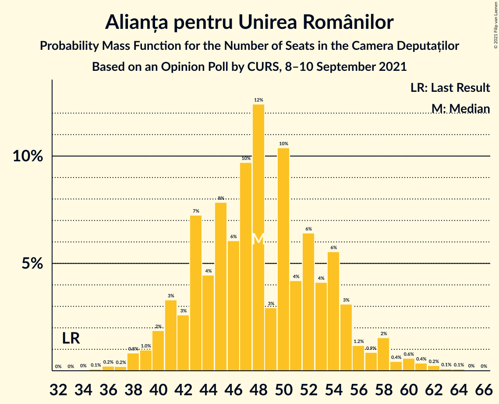

| Number of Seats | Probability | Accumulated | Special Marks |
|:---------------:|:-----------:|:-----------:|:-------------:|
| 33 | 0% | 100% | Last Result |
| 34 | 0% | 100% |  |
| 35 | 0.1% | 99.9% |  |
| 36 | 0.2% | 99.9% |  |
| 37 | 0.2% | 99.7% |  |
| 38 | 0.8% | 99.5% |  |
| 39 | 1.0% | 98.6% |  |
| 40 | 2% | 98% |  |
| 41 | 3% | 96% |  |
| 42 | 3% | 92% |  |
| 43 | 7% | 90% |  |
| 44 | 4% | 83% |  |
| 45 | 8% | 78% |  |
| 46 | 6% | 70% |  |
| 47 | 10% | 64% |  |
| 48 | 12% | 55% | Median |
| 49 | 3% | 42% |  |
| 50 | 10% | 39% |  |
| 51 | 4% | 29% |  |
| 52 | 6% | 25% |  |
| 53 | 4% | 18% |  |
| 54 | 6% | 14% |  |
| 55 | 3% | 9% |  |
| 56 | 1.2% | 5% |  |
| 57 | 0.9% | 4% |  |
| 58 | 2% | 3% |  |
| 59 | 0.4% | 2% |  |
| 60 | 0.6% | 1.4% |  |
| 61 | 0.4% | 0.9% |  |
| 62 | 0.2% | 0.5% |  |
| 63 | 0.1% | 0.3% |  |
| 64 | 0.1% | 0.2% |  |
| 65 | 0% | 0.1% |  |
| 66 | 0% | 0% |  |

### Alianța 2020 USR-PLUS

*For a full overview of the results for this party, see the [Alianța 2020 USR-PLUS](party-alianța2020usr-plus.html) page.*

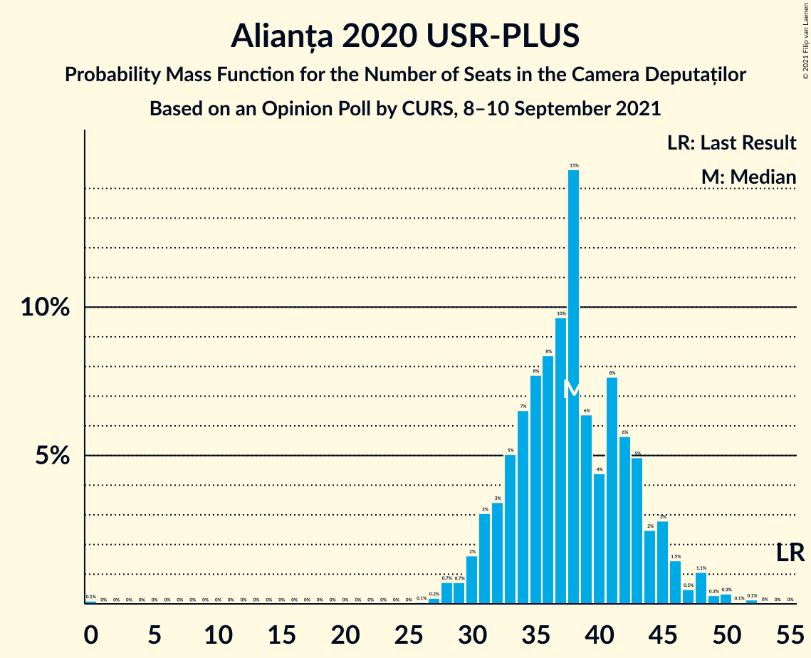

| Number of Seats | Probability | Accumulated | Special Marks |
|:---------------:|:-----------:|:-----------:|:-------------:|
| 0 | 0.1% | 100% |  |
| 1 | 0% | 99.9% |  |
| 2 | 0% | 99.9% |  |
| 3 | 0% | 99.9% |  |
| 4 | 0% | 99.9% |  |
| 5 | 0% | 99.9% |  |
| 6 | 0% | 99.9% |  |
| 7 | 0% | 99.9% |  |
| 8 | 0% | 99.9% |  |
| 9 | 0% | 99.9% |  |
| 10 | 0% | 99.9% |  |
| 11 | 0% | 99.9% |  |
| 12 | 0% | 99.9% |  |
| 13 | 0% | 99.9% |  |
| 14 | 0% | 99.9% |  |
| 15 | 0% | 99.9% |  |
| 16 | 0% | 99.9% |  |
| 17 | 0% | 99.9% |  |
| 18 | 0% | 99.9% |  |
| 19 | 0% | 99.9% |  |
| 20 | 0% | 99.9% |  |
| 21 | 0% | 99.9% |  |
| 22 | 0% | 99.9% |  |
| 23 | 0% | 99.9% |  |
| 24 | 0% | 99.9% |  |
| 25 | 0% | 99.9% |  |
| 26 | 0.1% | 99.9% |  |
| 27 | 0.2% | 99.8% |  |
| 28 | 0.7% | 99.6% |  |
| 29 | 0.7% | 98.9% |  |
| 30 | 2% | 98% |  |
| 31 | 3% | 97% |  |
| 32 | 3% | 94% |  |
| 33 | 5% | 90% |  |
| 34 | 7% | 85% |  |
| 35 | 8% | 79% |  |
| 36 | 8% | 71% |  |
| 37 | 10% | 62% |  |
| 38 | 15% | 53% | Median |
| 39 | 6% | 38% |  |
| 40 | 4% | 32% |  |
| 41 | 8% | 27% |  |
| 42 | 6% | 20% |  |
| 43 | 5% | 14% |  |
| 44 | 2% | 9% |  |
| 45 | 3% | 7% |  |
| 46 | 1.5% | 4% |  |
| 47 | 0.5% | 2% |  |
| 48 | 1.1% | 2% |  |
| 49 | 0.3% | 0.9% |  |
| 50 | 0.3% | 0.6% |  |
| 51 | 0.1% | 0.2% |  |
| 52 | 0.1% | 0.2% |  |
| 53 | 0% | 0% |  |
| 54 | 0% | 0% |  |
| 55 | 0% | 0% | Last Result |

### Uniunea Democrată Maghiară din România

*For a full overview of the results for this party, see the [Uniunea Democrată Maghiară din România](party-uniuneademocratămaghiarădinromânia.html) page.*

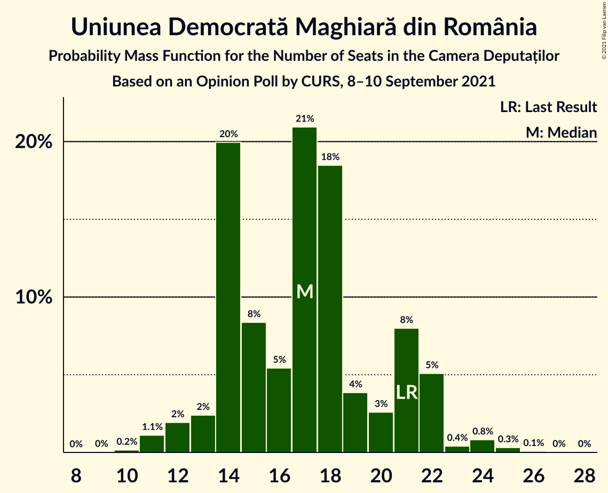

| Number of Seats | Probability | Accumulated | Special Marks |
|:---------------:|:-----------:|:-----------:|:-------------:|
| 10 | 0.2% | 100% |  |
| 11 | 1.1% | 99.8% |  |
| 12 | 2% | 98.7% |  |
| 13 | 2% | 97% |  |
| 14 | 20% | 94% |  |
| 15 | 8% | 74% |  |
| 16 | 5% | 66% |  |
| 17 | 21% | 61% | Median |
| 18 | 18% | 40% |  |
| 19 | 4% | 21% |  |
| 20 | 3% | 17% |  |
| 21 | 8% | 15% | Last Result |
| 22 | 5% | 7% |  |
| 23 | 0.4% | 2% |  |
| 24 | 0.8% | 1.3% |  |
| 25 | 0.3% | 0.4% |  |
| 26 | 0.1% | 0.1% |  |
| 27 | 0% | 0% |  |

### Partidul Mișcarea Populară

*For a full overview of the results for this party, see the [Partidul Mișcarea Populară](party-partidulmișcareapopulară.html) page.*

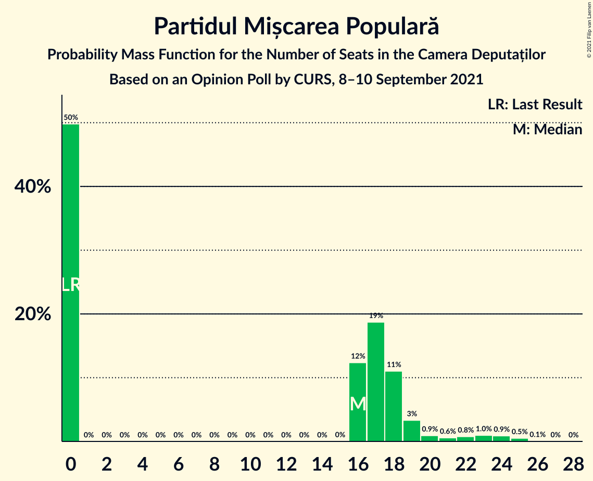

| Number of Seats | Probability | Accumulated | Special Marks |
|:---------------:|:-----------:|:-----------:|:-------------:|
| 0 | 50% | 100% | Last Result |
| 1 | 0% | 50% |  |
| 2 | 0% | 50% |  |
| 3 | 0% | 50% |  |
| 4 | 0% | 50% |  |
| 5 | 0% | 50% |  |
| 6 | 0% | 50% |  |
| 7 | 0% | 50% |  |
| 8 | 0% | 50% |  |
| 9 | 0% | 50% |  |
| 10 | 0% | 50% |  |
| 11 | 0% | 50% |  |
| 12 | 0% | 50% |  |
| 13 | 0% | 50% |  |
| 14 | 0% | 50% |  |
| 15 | 0% | 50% |  |
| 16 | 12% | 50% | Median |
| 17 | 19% | 38% |  |
| 18 | 11% | 19% |  |
| 19 | 3% | 8% |  |
| 20 | 0.9% | 5% |  |
| 21 | 0.6% | 4% |  |
| 22 | 0.8% | 3% |  |
| 23 | 1.0% | 2% |  |
| 24 | 0.9% | 1.5% |  |
| 25 | 0.5% | 0.6% |  |
| 26 | 0.1% | 0.1% |  |
| 27 | 0% | 0% |  |

### PRO România

*For a full overview of the results for this party, see the [PRO România](party-proromânia.html) page.*

| Number of Seats | Probability | Accumulated | Special Marks |
|:---------------:|:-----------:|:-----------:|:-------------:|
| 0 | 49% | 100% | Last Result |
| 1 | 0% | 51% |  |
| 2 | 0% | 51% |  |
| 3 | 0% | 51% |  |
| 4 | 0% | 51% |  |
| 5 | 0% | 51% |  |
| 6 | 0% | 51% |  |
| 7 | 0% | 51% |  |
| 8 | 0% | 51% |  |
| 9 | 0% | 51% |  |
| 10 | 0% | 51% |  |
| 11 | 0% | 51% |  |
| 12 | 0% | 51% |  |
| 13 | 0% | 51% |  |
| 14 | 0% | 51% |  |
| 15 | 0.5% | 51% |  |
| 16 | 8% | 51% | Median |
| 17 | 17% | 42% |  |
| 18 | 12% | 25% |  |
| 19 | 6% | 12% |  |
| 20 | 3% | 6% |  |
| 21 | 2% | 4% |  |
| 22 | 0.9% | 2% |  |
| 23 | 0.6% | 1.3% |  |
| 24 | 0.3% | 0.6% |  |
| 25 | 0.1% | 0.3% |  |
| 26 | 0.1% | 0.2% |  |
| 27 | 0.1% | 0.1% |  |
| 28 | 0% | 0% |  |

### Partidul Puterii Umaniste (social-liberal)

*For a full overview of the results for this party, see the [Partidul Puterii Umaniste (social-liberal)](party-partidulputeriiumanistesocial-liberal.html) page.*

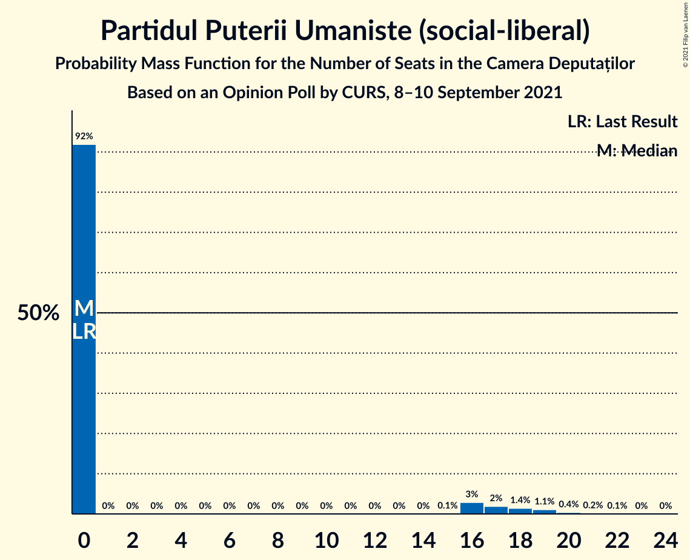

| Number of Seats | Probability | Accumulated | Special Marks |
|:---------------:|:-----------:|:-----------:|:-------------:|
| 0 | 92% | 100% | Last Result, Median |
| 1 | 0% | 8% |  |
| 2 | 0% | 8% |  |
| 3 | 0% | 8% |  |
| 4 | 0% | 8% |  |
| 5 | 0% | 8% |  |
| 6 | 0% | 8% |  |
| 7 | 0% | 8% |  |
| 8 | 0% | 8% |  |
| 9 | 0% | 8% |  |
| 10 | 0% | 8% |  |
| 11 | 0% | 8% |  |
| 12 | 0% | 8% |  |
| 13 | 0% | 8% |  |
| 14 | 0% | 8% |  |
| 15 | 0.1% | 8% |  |
| 16 | 3% | 8% |  |
| 17 | 2% | 5% |  |
| 18 | 1.4% | 3% |  |
| 19 | 1.1% | 2% |  |
| 20 | 0.4% | 0.6% |  |
| 21 | 0.2% | 0.2% |  |
| 22 | 0.1% | 0.1% |  |
| 23 | 0% | 0% |  |

## Coalitions

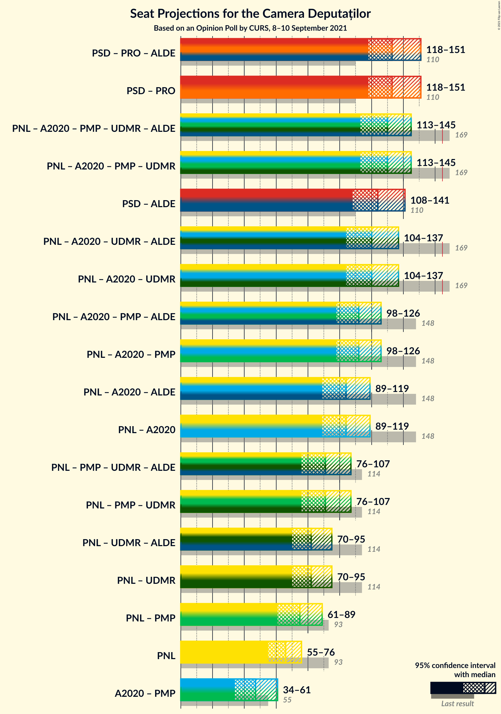

### Confidence Intervals

| Coalition | Last Result | Median | Majority? | 80% Confidence Interval | 90% Confidence Interval | 95% Confidence Interval | 99% Confidence Interval |
|:---------:|:-----------:|:------:|:---------:|:-----------------------:|:-----------------------:|:-----------------------:|:-----------------------:|
| Partidul Social Democrat – PRO România | 110 | 133 | 0% | 122–145 | 121–146 | 118–151 | 113–151 |
| Partidul Național Liberal – Alianța 2020 USR-PLUS – Partidul Mișcarea Populară – Uniunea Democrată Maghiară din România | 169 | 130 | 0% | 119–139 | 116–143 | 113–145 | 109–150 |
| Partidul Național Liberal – Alianța 2020 USR-PLUS – Uniunea Democrată Maghiară din România | 169 | 120 | 0% | 109–132 | 106–135 | 104–137 | 100–140 |
| Partidul Național Liberal – Alianța 2020 USR-PLUS – Partidul Mișcarea Populară | 148 | 112 | 0% | 103–122 | 99–124 | 98–126 | 93–132 |
| Partidul Național Liberal – Alianța 2020 USR-PLUS | 148 | 104 | 0% | 93–113 | 91–117 | 89–119 | 85–121 |
| Partidul Național Liberal – Partidul Mișcarea Populară – Uniunea Democrată Maghiară din România | 114 | 91 | 0% | 81–102 | 78–105 | 76–107 | 73–112 |
| Partidul Național Liberal – Uniunea Democrată Maghiară din România | 114 | 82 | 0% | 74–92 | 72–94 | 70–95 | 68–99 |
| Partidul Național Liberal – Partidul Mișcarea Populară | 93 | 75 | 0% | 65–84 | 62–87 | 61–89 | 57–93 |
| Partidul Național Liberal | 93 | 66 | 0% | 58–74 | 56–75 | 55–76 | 52–81 |
| Alianța 2020 USR-PLUS – Partidul Mișcarea Populară | 55 | 47 | 0% | 36–57 | 35–59 | 34–61 | 31–65 |

### Partidul Social Democrat – PRO România

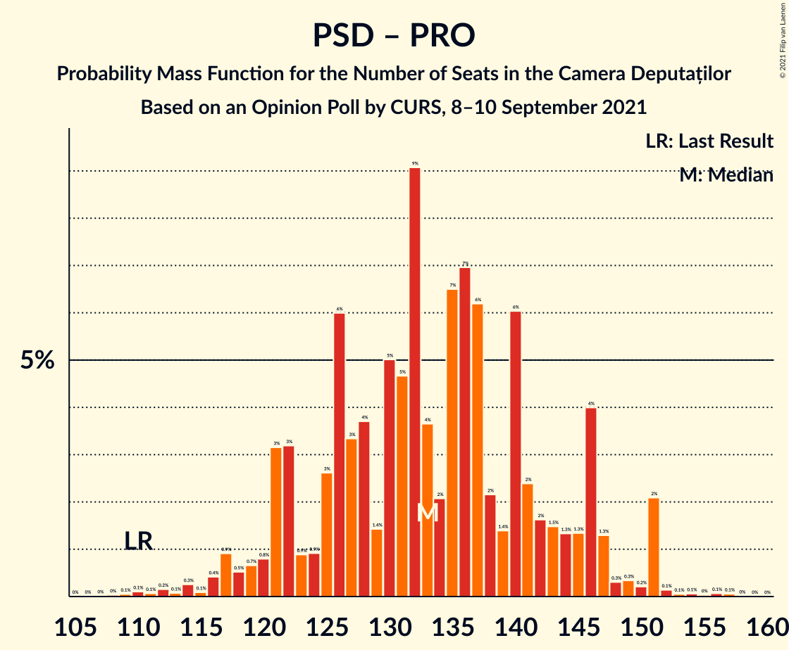

| Number of Seats | Probability | Accumulated | Special Marks |
|:---------------:|:-----------:|:-----------:|:-------------:|
| 108 | 0% | 100% |  |
| 109 | 0.1% | 99.9% |  |
| 110 | 0.1% | 99.9% | Last Result |
| 111 | 0.1% | 99.8% |  |
| 112 | 0.2% | 99.7% |  |
| 113 | 0.1% | 99.6% |  |
| 114 | 0.3% | 99.5% |  |
| 115 | 0.1% | 99.2% |  |
| 116 | 0.4% | 99.1% |  |
| 117 | 0.9% | 98.7% |  |
| 118 | 0.5% | 98% |  |
| 119 | 0.7% | 97% |  |
| 120 | 0.8% | 97% |  |
| 121 | 3% | 96% |  |
| 122 | 3% | 93% |  |
| 123 | 0.9% | 89% |  |
| 124 | 0.9% | 89% |  |
| 125 | 3% | 88% |  |
| 126 | 6% | 85% |  |
| 127 | 3% | 79% |  |
| 128 | 4% | 76% |  |
| 129 | 1.4% | 72% |  |
| 130 | 5% | 71% |  |
| 131 | 5% | 66% |  |
| 132 | 9% | 61% |  |
| 133 | 4% | 52% |  |
| 134 | 2% | 48% |  |
| 135 | 7% | 46% |  |
| 136 | 7% | 40% |  |
| 137 | 6% | 33% |  |
| 138 | 2% | 26% |  |
| 139 | 1.4% | 24% |  |
| 140 | 6% | 23% | Median |
| 141 | 2% | 17% |  |
| 142 | 2% | 14% |  |
| 143 | 1.5% | 13% |  |
| 144 | 1.3% | 11% |  |
| 145 | 1.3% | 10% |  |
| 146 | 4% | 9% |  |
| 147 | 1.3% | 5% |  |
| 148 | 0.3% | 3% |  |
| 149 | 0.3% | 3% |  |
| 150 | 0.2% | 3% |  |
| 151 | 2% | 3% |  |
| 152 | 0.1% | 0.5% |  |
| 153 | 0.1% | 0.3% |  |
| 154 | 0.1% | 0.3% |  |
| 155 | 0% | 0.2% |  |
| 156 | 0.1% | 0.2% |  |
| 157 | 0.1% | 0.1% |  |
| 158 | 0% | 0% |  |

### Partidul Național Liberal – Alianța 2020 USR-PLUS – Partidul Mișcarea Populară – Uniunea Democrată Maghiară din România

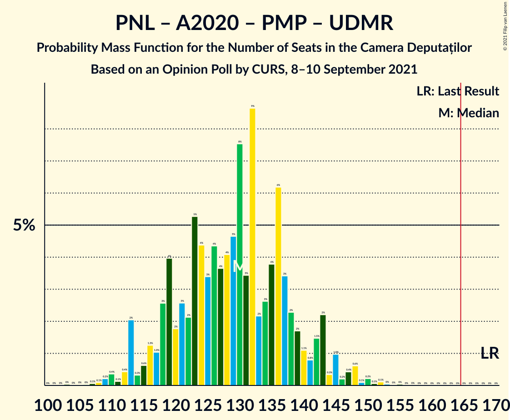

| Number of Seats | Probability | Accumulated | Special Marks |
|:---------------:|:-----------:|:-----------:|:-------------:|
| 103 | 0% | 100% |  |
| 104 | 0% | 99.9% |  |
| 105 | 0% | 99.9% |  |
| 106 | 0% | 99.9% |  |
| 107 | 0.1% | 99.8% |  |
| 108 | 0.1% | 99.8% |  |
| 109 | 0.2% | 99.7% |  |
| 110 | 0.4% | 99.5% |  |
| 111 | 0.1% | 99.1% |  |
| 112 | 0.4% | 99.0% |  |
| 113 | 2% | 98.6% |  |
| 114 | 0.3% | 97% |  |
| 115 | 0.6% | 96% |  |
| 116 | 1.3% | 96% |  |
| 117 | 1.0% | 94% |  |
| 118 | 3% | 93% |  |
| 119 | 4% | 91% |  |
| 120 | 2% | 87% |  |
| 121 | 3% | 85% |  |
| 122 | 2% | 82% |  |
| 123 | 5% | 80% |  |
| 124 | 4% | 75% |  |
| 125 | 3% | 71% |  |
| 126 | 4% | 67% |  |
| 127 | 4% | 63% |  |
| 128 | 4% | 59% |  |
| 129 | 5% | 55% |  |
| 130 | 8% | 51% |  |
| 131 | 3% | 43% |  |
| 132 | 9% | 40% |  |
| 133 | 2% | 31% |  |
| 134 | 3% | 29% |  |
| 135 | 4% | 26% |  |
| 136 | 6% | 22% |  |
| 137 | 3% | 16% | Median |
| 138 | 2% | 13% |  |
| 139 | 2% | 10% |  |
| 140 | 1.1% | 9% |  |
| 141 | 0.8% | 8% |  |
| 142 | 1.5% | 7% |  |
| 143 | 2% | 5% |  |
| 144 | 0.3% | 3% |  |
| 145 | 1.0% | 3% |  |
| 146 | 0.2% | 2% |  |
| 147 | 0.4% | 2% |  |
| 148 | 0.6% | 1.2% |  |
| 149 | 0.1% | 0.6% |  |
| 150 | 0.2% | 0.5% |  |
| 151 | 0.1% | 0.3% |  |
| 152 | 0.1% | 0.2% |  |
| 153 | 0% | 0.1% |  |
| 154 | 0% | 0.1% |  |
| 155 | 0% | 0.1% |  |
| 156 | 0% | 0% |  |
| 157 | 0% | 0% |  |
| 158 | 0% | 0% |  |
| 159 | 0% | 0% |  |
| 160 | 0% | 0% |  |
| 161 | 0% | 0% |  |
| 162 | 0% | 0% |  |
| 163 | 0% | 0% |  |
| 164 | 0% | 0% |  |
| 165 | 0% | 0% | Majority |
| 166 | 0% | 0% |  |
| 167 | 0% | 0% |  |
| 168 | 0% | 0% |  |
| 169 | 0% | 0% | Last Result |

### Partidul Național Liberal – Alianța 2020 USR-PLUS – Uniunea Democrată Maghiară din România

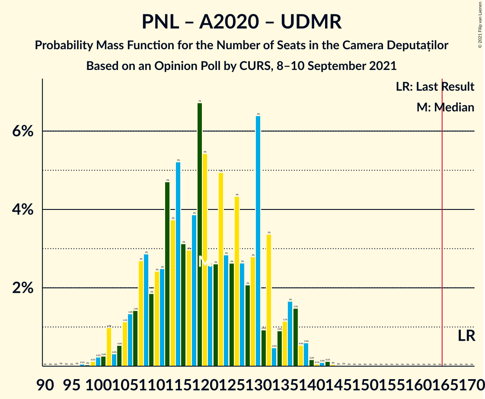

| Number of Seats | Probability | Accumulated | Special Marks |
|:---------------:|:-----------:|:-----------:|:-------------:|
| 93 | 0% | 100% |  |
| 94 | 0% | 99.9% |  |
| 95 | 0% | 99.9% |  |
| 96 | 0% | 99.9% |  |
| 97 | 0.1% | 99.9% |  |
| 98 | 0% | 99.8% |  |
| 99 | 0.1% | 99.8% |  |
| 100 | 0.2% | 99.7% |  |
| 101 | 0.3% | 99.4% |  |
| 102 | 1.0% | 99.2% |  |
| 103 | 0.3% | 98% |  |
| 104 | 0.5% | 98% |  |
| 105 | 1.1% | 97% |  |
| 106 | 1.3% | 96% |  |
| 107 | 1.4% | 95% |  |
| 108 | 3% | 93% |  |
| 109 | 3% | 91% |  |
| 110 | 2% | 88% |  |
| 111 | 2% | 86% |  |
| 112 | 2% | 84% |  |
| 113 | 5% | 81% |  |
| 114 | 4% | 76% |  |
| 115 | 5% | 73% |  |
| 116 | 3% | 68% |  |
| 117 | 3% | 64% |  |
| 118 | 4% | 61% |  |
| 119 | 7% | 58% |  |
| 120 | 5% | 51% |  |
| 121 | 3% | 45% | Median |
| 122 | 3% | 43% |  |
| 123 | 5% | 40% |  |
| 124 | 3% | 35% |  |
| 125 | 3% | 32% |  |
| 126 | 4% | 30% |  |
| 127 | 3% | 25% |  |
| 128 | 2% | 23% |  |
| 129 | 3% | 21% |  |
| 130 | 6% | 18% |  |
| 131 | 0.9% | 12% |  |
| 132 | 3% | 11% |  |
| 133 | 0.5% | 7% |  |
| 134 | 0.9% | 7% |  |
| 135 | 1.1% | 6% |  |
| 136 | 2% | 5% |  |
| 137 | 1.5% | 3% |  |
| 138 | 0.5% | 2% |  |
| 139 | 0.6% | 1.1% |  |
| 140 | 0.2% | 0.5% |  |
| 141 | 0.1% | 0.4% |  |
| 142 | 0.1% | 0.3% |  |
| 143 | 0.1% | 0.2% |  |
| 144 | 0% | 0.1% |  |
| 145 | 0% | 0% |  |
| 146 | 0% | 0% |  |
| 147 | 0% | 0% |  |
| 148 | 0% | 0% |  |
| 149 | 0% | 0% |  |
| 150 | 0% | 0% |  |
| 151 | 0% | 0% |  |
| 152 | 0% | 0% |  |
| 153 | 0% | 0% |  |
| 154 | 0% | 0% |  |
| 155 | 0% | 0% |  |
| 156 | 0% | 0% |  |
| 157 | 0% | 0% |  |
| 158 | 0% | 0% |  |
| 159 | 0% | 0% |  |
| 160 | 0% | 0% |  |
| 161 | 0% | 0% |  |
| 162 | 0% | 0% |  |
| 163 | 0% | 0% |  |
| 164 | 0% | 0% |  |
| 165 | 0% | 0% | Majority |
| 166 | 0% | 0% |  |
| 167 | 0% | 0% |  |
| 168 | 0% | 0% |  |
| 169 | 0% | 0% | Last Result |

### Partidul Național Liberal – Alianța 2020 USR-PLUS – Partidul Mișcarea Populară

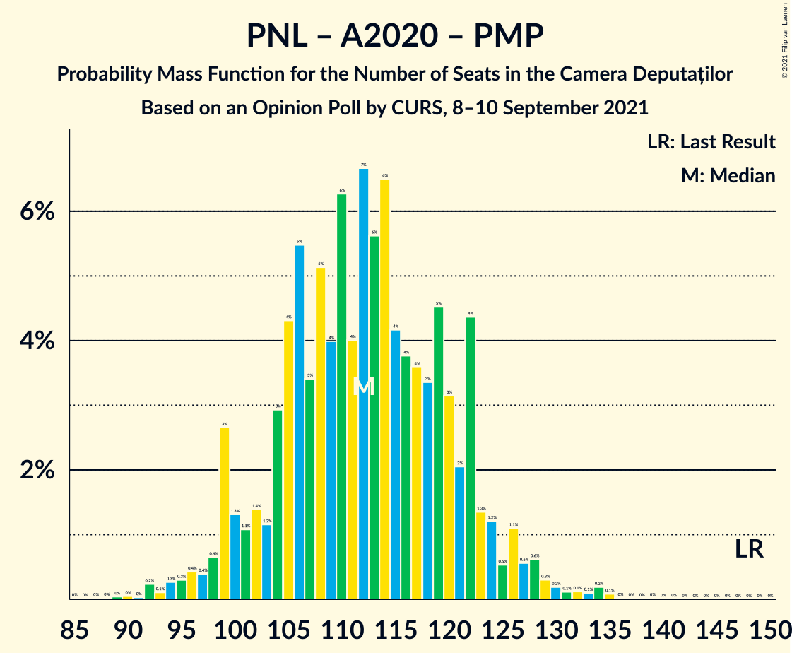

| Number of Seats | Probability | Accumulated | Special Marks |
|:---------------:|:-----------:|:-----------:|:-------------:|
| 86 | 0% | 100% |  |
| 87 | 0% | 99.9% |  |
| 88 | 0% | 99.9% |  |
| 89 | 0% | 99.9% |  |
| 90 | 0% | 99.9% |  |
| 91 | 0% | 99.8% |  |
| 92 | 0.2% | 99.8% |  |
| 93 | 0.1% | 99.5% |  |
| 94 | 0.3% | 99.4% |  |
| 95 | 0.3% | 99.2% |  |
| 96 | 0.4% | 98.9% |  |
| 97 | 0.4% | 98% |  |
| 98 | 0.6% | 98% |  |
| 99 | 3% | 97% |  |
| 100 | 1.3% | 95% |  |
| 101 | 1.1% | 93% |  |
| 102 | 1.4% | 92% |  |
| 103 | 1.2% | 91% |  |
| 104 | 3% | 90% |  |
| 105 | 4% | 87% |  |
| 106 | 5% | 83% |  |
| 107 | 3% | 77% |  |
| 108 | 5% | 74% |  |
| 109 | 4% | 69% |  |
| 110 | 6% | 65% |  |
| 111 | 4% | 58% |  |
| 112 | 7% | 54% |  |
| 113 | 6% | 48% |  |
| 114 | 6% | 42% |  |
| 115 | 4% | 36% |  |
| 116 | 4% | 31% |  |
| 117 | 4% | 28% |  |
| 118 | 3% | 24% |  |
| 119 | 5% | 21% |  |
| 120 | 3% | 16% | Median |
| 121 | 2% | 13% |  |
| 122 | 4% | 11% |  |
| 123 | 1.3% | 7% |  |
| 124 | 1.2% | 5% |  |
| 125 | 0.5% | 4% |  |
| 126 | 1.1% | 3% |  |
| 127 | 0.6% | 2% |  |
| 128 | 0.6% | 2% |  |
| 129 | 0.3% | 1.2% |  |
| 130 | 0.2% | 0.9% |  |
| 131 | 0.1% | 0.7% |  |
| 132 | 0.1% | 0.6% |  |
| 133 | 0.1% | 0.5% |  |
| 134 | 0.2% | 0.4% |  |
| 135 | 0.1% | 0.2% |  |
| 136 | 0% | 0.1% |  |
| 137 | 0% | 0.1% |  |
| 138 | 0% | 0% |  |
| 139 | 0% | 0% |  |
| 140 | 0% | 0% |  |
| 141 | 0% | 0% |  |
| 142 | 0% | 0% |  |
| 143 | 0% | 0% |  |
| 144 | 0% | 0% |  |
| 145 | 0% | 0% |  |
| 146 | 0% | 0% |  |
| 147 | 0% | 0% |  |
| 148 | 0% | 0% | Last Result |

### Partidul Național Liberal – Alianța 2020 USR-PLUS

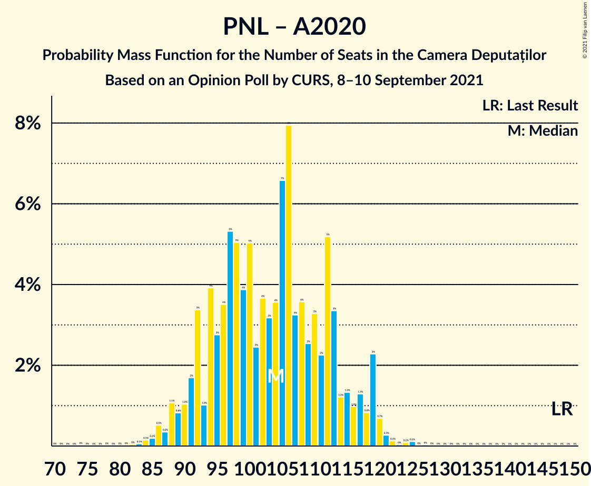

| Number of Seats | Probability | Accumulated | Special Marks |
|:---------------:|:-----------:|:-----------:|:-------------:|
| 74 | 0% | 100% |  |
| 75 | 0% | 99.9% |  |
| 76 | 0% | 99.9% |  |
| 77 | 0% | 99.9% |  |
| 78 | 0% | 99.9% |  |
| 79 | 0% | 99.9% |  |
| 80 | 0% | 99.9% |  |
| 81 | 0% | 99.9% |  |
| 82 | 0% | 99.9% |  |
| 83 | 0.1% | 99.8% |  |
| 84 | 0.1% | 99.8% |  |
| 85 | 0.2% | 99.6% |  |
| 86 | 0.5% | 99.4% |  |
| 87 | 0.3% | 98.9% |  |
| 88 | 1.1% | 98.6% |  |
| 89 | 0.8% | 98% |  |
| 90 | 1.0% | 97% |  |
| 91 | 2% | 96% |  |
| 92 | 3% | 94% |  |
| 93 | 1.0% | 91% |  |
| 94 | 4% | 90% |  |
| 95 | 3% | 86% |  |
| 96 | 4% | 83% |  |
| 97 | 5% | 79% |  |
| 98 | 5% | 74% |  |
| 99 | 4% | 69% |  |
| 100 | 5% | 65% |  |
| 101 | 2% | 60% |  |
| 102 | 4% | 58% |  |
| 103 | 3% | 54% |  |
| 104 | 4% | 51% | Median |
| 105 | 7% | 47% |  |
| 106 | 8% | 41% |  |
| 107 | 3% | 33% |  |
| 108 | 4% | 29% |  |
| 109 | 3% | 26% |  |
| 110 | 3% | 23% |  |
| 111 | 2% | 20% |  |
| 112 | 5% | 18% |  |
| 113 | 3% | 13% |  |
| 114 | 1.2% | 9% |  |
| 115 | 1.3% | 8% |  |
| 116 | 1.0% | 7% |  |
| 117 | 1.3% | 6% |  |
| 118 | 0.8% | 4% |  |
| 119 | 2% | 4% |  |
| 120 | 0.7% | 1.4% |  |
| 121 | 0.3% | 0.7% |  |
| 122 | 0.1% | 0.4% |  |
| 123 | 0% | 0.3% |  |
| 124 | 0.1% | 0.3% |  |
| 125 | 0.1% | 0.2% |  |
| 126 | 0% | 0.1% |  |
| 127 | 0% | 0.1% |  |
| 128 | 0% | 0% |  |
| 129 | 0% | 0% |  |
| 130 | 0% | 0% |  |
| 131 | 0% | 0% |  |
| 132 | 0% | 0% |  |
| 133 | 0% | 0% |  |
| 134 | 0% | 0% |  |
| 135 | 0% | 0% |  |
| 136 | 0% | 0% |  |
| 137 | 0% | 0% |  |
| 138 | 0% | 0% |  |
| 139 | 0% | 0% |  |
| 140 | 0% | 0% |  |
| 141 | 0% | 0% |  |
| 142 | 0% | 0% |  |
| 143 | 0% | 0% |  |
| 144 | 0% | 0% |  |
| 145 | 0% | 0% |  |
| 146 | 0% | 0% |  |
| 147 | 0% | 0% |  |
| 148 | 0% | 0% | Last Result |

### Partidul Național Liberal – Partidul Mișcarea Populară – Uniunea Democrată Maghiară din România

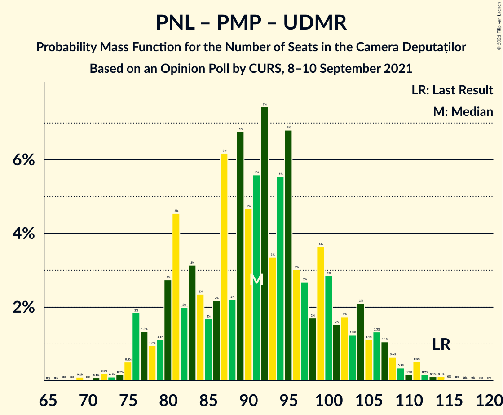

| Number of Seats | Probability | Accumulated | Special Marks |
|:---------------:|:-----------:|:-----------:|:-------------:|
| 68 | 0% | 100% |  |
| 69 | 0.1% | 99.9% |  |
| 70 | 0% | 99.8% |  |
| 71 | 0.1% | 99.8% |  |
| 72 | 0.2% | 99.7% |  |
| 73 | 0.1% | 99.5% |  |
| 74 | 0.2% | 99.4% |  |
| 75 | 0.5% | 99.2% |  |
| 76 | 2% | 98.7% |  |
| 77 | 1.3% | 97% |  |
| 78 | 1.0% | 96% |  |
| 79 | 1.1% | 95% |  |
| 80 | 3% | 93% |  |
| 81 | 5% | 91% |  |
| 82 | 2% | 86% |  |
| 83 | 3% | 84% |  |
| 84 | 2% | 81% |  |
| 85 | 2% | 79% |  |
| 86 | 2% | 77% |  |
| 87 | 6% | 75% |  |
| 88 | 2% | 69% |  |
| 89 | 7% | 66% |  |
| 90 | 5% | 60% |  |
| 91 | 6% | 55% |  |
| 92 | 7% | 49% |  |
| 93 | 3% | 42% |  |
| 94 | 6% | 39% |  |
| 95 | 7% | 33% |  |
| 96 | 3% | 26% |  |
| 97 | 3% | 23% |  |
| 98 | 2% | 21% |  |
| 99 | 4% | 19% | Median |
| 100 | 3% | 15% |  |
| 101 | 2% | 12% |  |
| 102 | 2% | 11% |  |
| 103 | 1.3% | 9% |  |
| 104 | 2% | 8% |  |
| 105 | 1.1% | 6% |  |
| 106 | 1.3% | 5% |  |
| 107 | 1.1% | 3% |  |
| 108 | 0.6% | 2% |  |
| 109 | 0.3% | 2% |  |
| 110 | 0.2% | 1.2% |  |
| 111 | 0.5% | 1.0% |  |
| 112 | 0.2% | 0.5% |  |
| 113 | 0.1% | 0.3% |  |
| 114 | 0.1% | 0.2% | Last Result |
| 115 | 0% | 0.1% |  |
| 116 | 0% | 0.1% |  |
| 117 | 0% | 0% |  |

### Partidul Național Liberal – Uniunea Democrată Maghiară din România

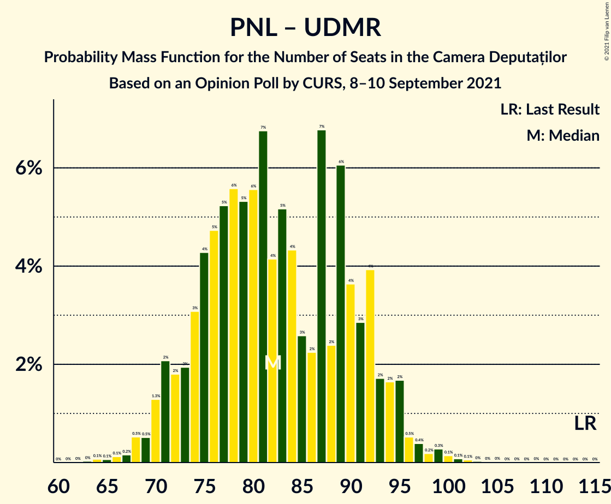

| Number of Seats | Probability | Accumulated | Special Marks |
|:---------------:|:-----------:|:-----------:|:-------------:|
| 64 | 0.1% | 100% |  |
| 65 | 0.1% | 99.9% |  |
| 66 | 0.1% | 99.8% |  |
| 67 | 0.2% | 99.7% |  |
| 68 | 0.5% | 99.5% |  |
| 69 | 0.5% | 99.0% |  |
| 70 | 1.3% | 98.5% |  |
| 71 | 2% | 97% |  |
| 72 | 2% | 95% |  |
| 73 | 2% | 93% |  |
| 74 | 3% | 91% |  |
| 75 | 4% | 88% |  |
| 76 | 5% | 84% |  |
| 77 | 5% | 79% |  |
| 78 | 6% | 74% |  |
| 79 | 5% | 69% |  |
| 80 | 6% | 63% |  |
| 81 | 7% | 58% |  |
| 82 | 4% | 51% |  |
| 83 | 5% | 47% | Median |
| 84 | 4% | 42% |  |
| 85 | 3% | 37% |  |
| 86 | 2% | 35% |  |
| 87 | 7% | 32% |  |
| 88 | 2% | 26% |  |
| 89 | 6% | 23% |  |
| 90 | 4% | 17% |  |
| 91 | 3% | 14% |  |
| 92 | 4% | 11% |  |
| 93 | 2% | 7% |  |
| 94 | 2% | 5% |  |
| 95 | 2% | 3% |  |
| 96 | 0.5% | 2% |  |
| 97 | 0.4% | 1.2% |  |
| 98 | 0.2% | 0.8% |  |
| 99 | 0.3% | 0.6% |  |
| 100 | 0.1% | 0.3% |  |
| 101 | 0.1% | 0.2% |  |
| 102 | 0.1% | 0.1% |  |
| 103 | 0% | 0.1% |  |
| 104 | 0% | 0% |  |
| 105 | 0% | 0% |  |
| 106 | 0% | 0% |  |
| 107 | 0% | 0% |  |
| 108 | 0% | 0% |  |
| 109 | 0% | 0% |  |
| 110 | 0% | 0% |  |
| 111 | 0% | 0% |  |
| 112 | 0% | 0% |  |
| 113 | 0% | 0% |  |
| 114 | 0% | 0% | Last Result |

### Partidul Național Liberal – Partidul Mișcarea Populară

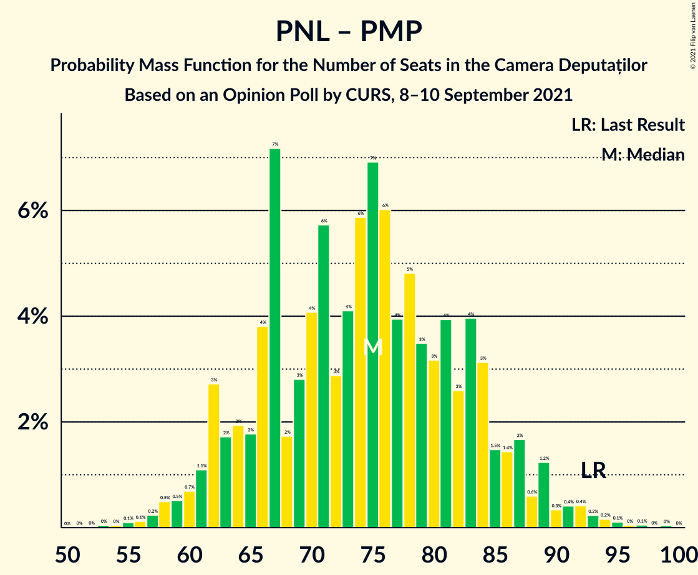

| Number of Seats | Probability | Accumulated | Special Marks |
|:---------------:|:-----------:|:-----------:|:-------------:|
| 53 | 0% | 100% |  |
| 54 | 0% | 99.9% |  |
| 55 | 0.1% | 99.9% |  |
| 56 | 0.1% | 99.8% |  |
| 57 | 0.2% | 99.7% |  |
| 58 | 0.5% | 99.4% |  |
| 59 | 0.5% | 98.9% |  |
| 60 | 0.7% | 98% |  |
| 61 | 1.1% | 98% |  |
| 62 | 3% | 97% |  |
| 63 | 2% | 94% |  |
| 64 | 2% | 92% |  |
| 65 | 2% | 90% |  |
| 66 | 4% | 88% |  |
| 67 | 7% | 85% |  |
| 68 | 2% | 77% |  |
| 69 | 3% | 76% |  |
| 70 | 4% | 73% |  |
| 71 | 6% | 69% |  |
| 72 | 3% | 63% |  |
| 73 | 4% | 60% |  |
| 74 | 6% | 56% |  |
| 75 | 7% | 50% |  |
| 76 | 6% | 43% |  |
| 77 | 4% | 37% |  |
| 78 | 5% | 33% |  |
| 79 | 3% | 29% |  |
| 80 | 3% | 25% |  |
| 81 | 4% | 22% |  |
| 82 | 3% | 18% | Median |
| 83 | 4% | 15% |  |
| 84 | 3% | 11% |  |
| 85 | 1.5% | 8% |  |
| 86 | 1.4% | 7% |  |
| 87 | 2% | 5% |  |
| 88 | 0.6% | 4% |  |
| 89 | 1.2% | 3% |  |
| 90 | 0.3% | 2% |  |
| 91 | 0.4% | 2% |  |
| 92 | 0.4% | 1.1% |  |
| 93 | 0.2% | 0.7% | Last Result |
| 94 | 0.2% | 0.5% |  |
| 95 | 0.1% | 0.3% |  |
| 96 | 0% | 0.2% |  |
| 97 | 0.1% | 0.1% |  |
| 98 | 0% | 0.1% |  |
| 99 | 0% | 0.1% |  |
| 100 | 0% | 0% |  |

### Partidul Național Liberal

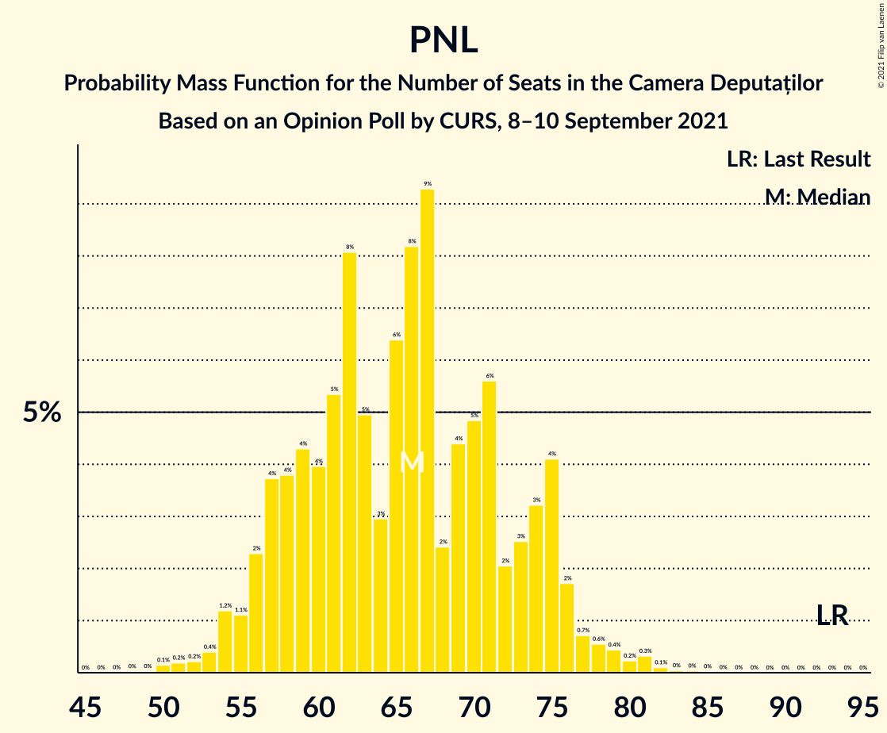

| Number of Seats | Probability | Accumulated | Special Marks |
|:---------------:|:-----------:|:-----------:|:-------------:|
| 49 | 0% | 100% |  |
| 50 | 0.1% | 99.9% |  |
| 51 | 0.2% | 99.8% |  |
| 52 | 0.2% | 99.6% |  |
| 53 | 0.4% | 99.4% |  |
| 54 | 1.2% | 99.0% |  |
| 55 | 1.1% | 98% |  |
| 56 | 2% | 97% |  |
| 57 | 4% | 94% |  |
| 58 | 4% | 91% |  |
| 59 | 4% | 87% |  |
| 60 | 4% | 83% |  |
| 61 | 5% | 79% |  |
| 62 | 8% | 73% |  |
| 63 | 5% | 65% |  |
| 64 | 3% | 60% |  |
| 65 | 6% | 57% |  |
| 66 | 8% | 51% | Median |
| 67 | 9% | 43% |  |
| 68 | 2% | 33% |  |
| 69 | 4% | 31% |  |
| 70 | 5% | 27% |  |
| 71 | 6% | 22% |  |
| 72 | 2% | 16% |  |
| 73 | 3% | 14% |  |
| 74 | 3% | 12% |  |
| 75 | 4% | 8% |  |
| 76 | 2% | 4% |  |
| 77 | 0.7% | 2% |  |
| 78 | 0.6% | 2% |  |
| 79 | 0.4% | 1.2% |  |
| 80 | 0.2% | 0.8% |  |
| 81 | 0.3% | 0.6% |  |
| 82 | 0.1% | 0.2% |  |
| 83 | 0% | 0.1% |  |
| 84 | 0% | 0.1% |  |
| 85 | 0% | 0% |  |
| 86 | 0% | 0% |  |
| 87 | 0% | 0% |  |
| 88 | 0% | 0% |  |
| 89 | 0% | 0% |  |
| 90 | 0% | 0% |  |
| 91 | 0% | 0% |  |
| 92 | 0% | 0% |  |
| 93 | 0% | 0% | Last Result |

### Alianța 2020 USR-PLUS – Partidul Mișcarea Populară

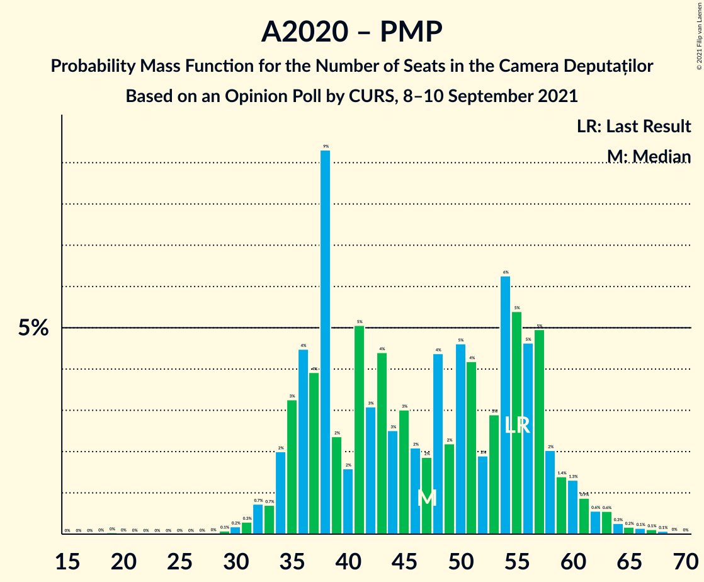

| Number of Seats | Probability | Accumulated | Special Marks |
|:---------------:|:-----------:|:-----------:|:-------------:|
| 19 | 0% | 100% |  |
| 20 | 0% | 99.9% |  |
| 21 | 0% | 99.9% |  |
| 22 | 0% | 99.9% |  |
| 23 | 0% | 99.9% |  |
| 24 | 0% | 99.9% |  |
| 25 | 0% | 99.9% |  |
| 26 | 0% | 99.9% |  |
| 27 | 0% | 99.9% |  |
| 28 | 0% | 99.9% |  |
| 29 | 0.1% | 99.9% |  |
| 30 | 0.2% | 99.8% |  |
| 31 | 0.3% | 99.6% |  |
| 32 | 0.7% | 99.3% |  |
| 33 | 0.7% | 98.6% |  |
| 34 | 2% | 98% |  |
| 35 | 3% | 96% |  |
| 36 | 4% | 93% |  |
| 37 | 4% | 88% |  |
| 38 | 9% | 84% |  |
| 39 | 2% | 75% |  |
| 40 | 2% | 73% |  |
| 41 | 5% | 71% |  |
| 42 | 3% | 66% |  |
| 43 | 4% | 63% |  |
| 44 | 3% | 58% |  |
| 45 | 3% | 56% |  |
| 46 | 2% | 53% |  |
| 47 | 2% | 51% |  |
| 48 | 4% | 49% |  |
| 49 | 2% | 45% |  |
| 50 | 5% | 42% |  |
| 51 | 4% | 38% |  |
| 52 | 2% | 34% |  |
| 53 | 3% | 32% |  |
| 54 | 6% | 29% | Median |
| 55 | 5% | 23% | Last Result |
| 56 | 5% | 17% |  |
| 57 | 5% | 12% |  |
| 58 | 2% | 8% |  |
| 59 | 1.4% | 6% |  |
| 60 | 1.3% | 4% |  |
| 61 | 0.9% | 3% |  |
| 62 | 0.6% | 2% |  |
| 63 | 0.6% | 1.4% |  |
| 64 | 0.3% | 0.8% |  |
| 65 | 0.2% | 0.6% |  |
| 66 | 0.1% | 0.4% |  |
| 67 | 0.1% | 0.2% |  |
| 68 | 0.1% | 0.1% |  |
| 69 | 0% | 0.1% |  |
| 70 | 0% | 0% |  |

## Technical Information

### Opinion Poll

+ **Polling firm:** CURS
+ **Commissioner(s):** —
+ **Fieldwork period:** 8–10 September 2021

### Calculations

+ **Sample size:** 861
+ **Simulations done:** 1,048,576
+ **Error estimate:** 0.88%

