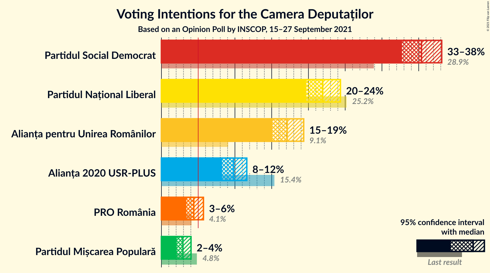
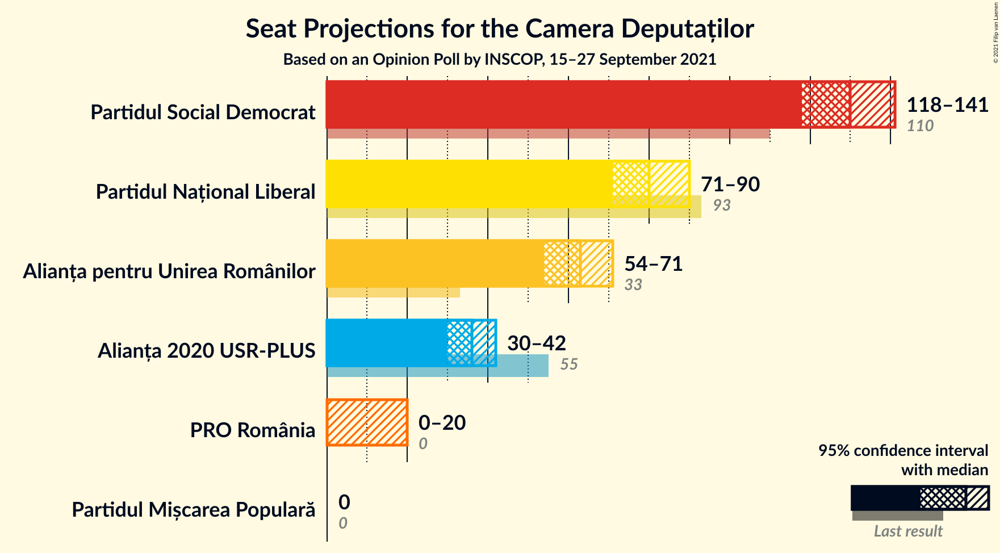
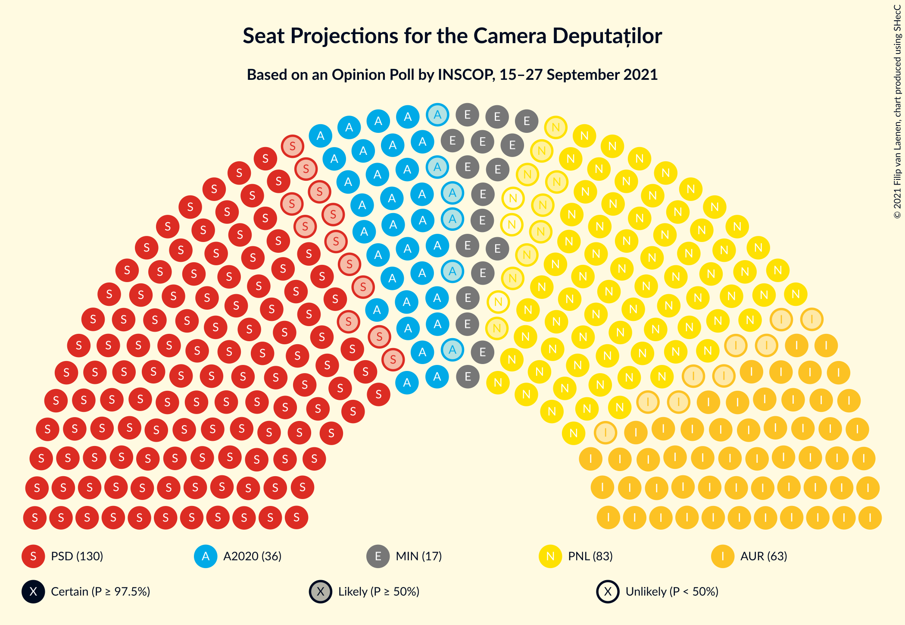
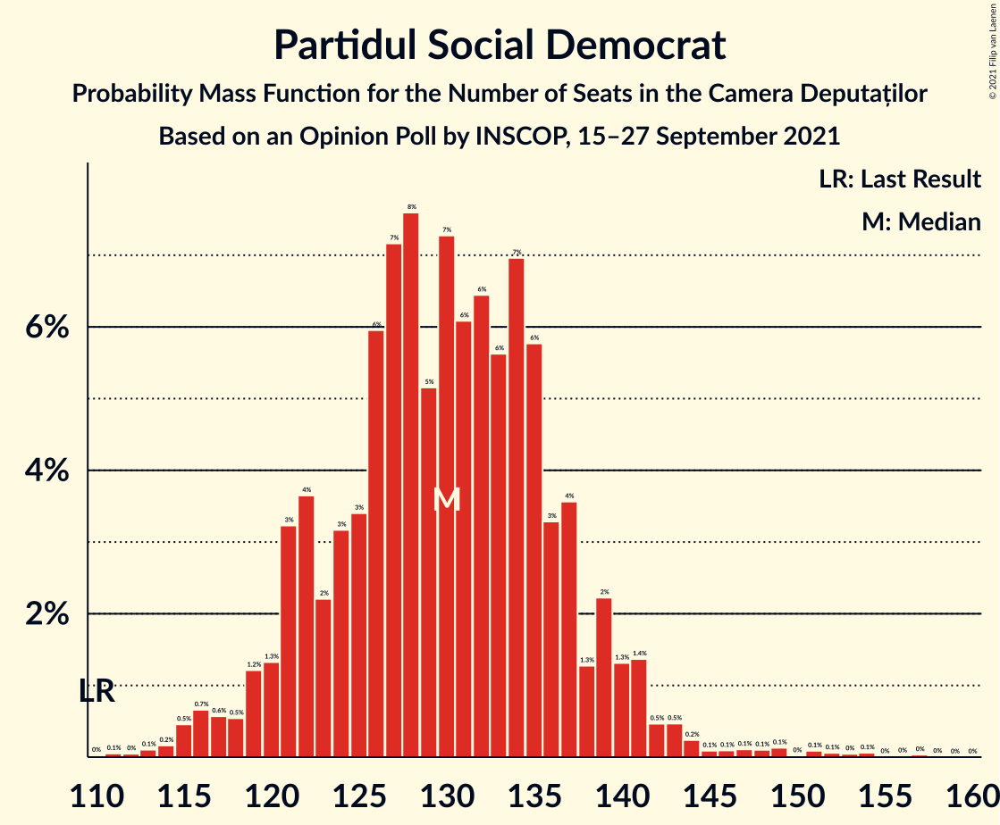
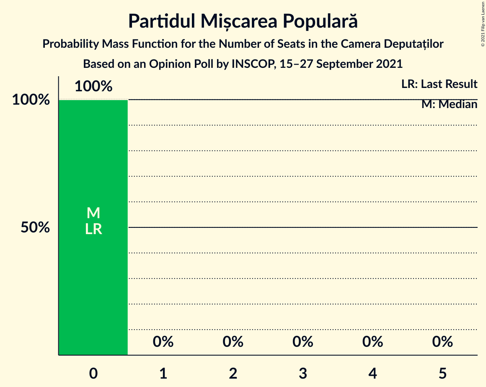
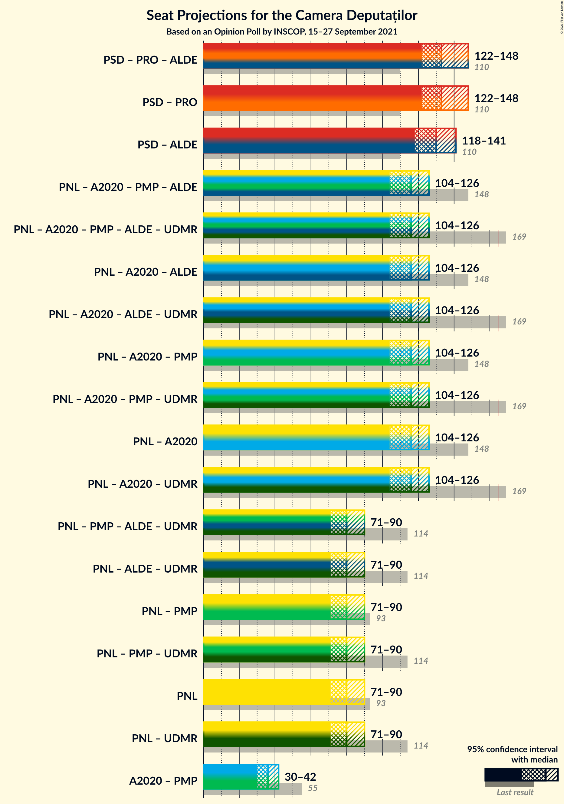
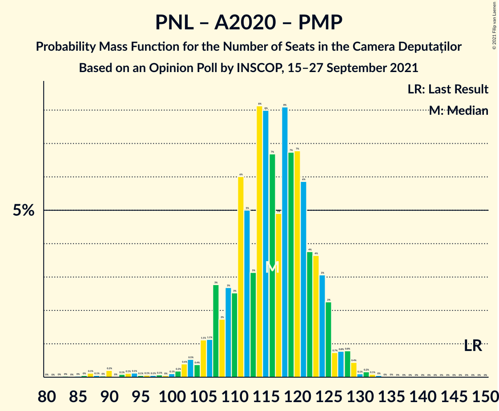
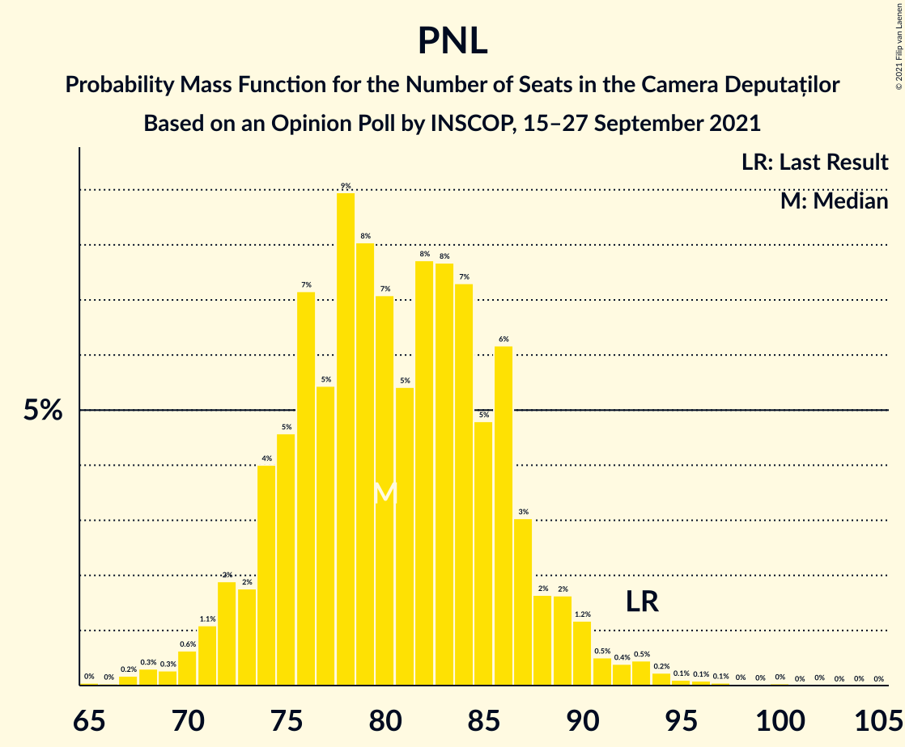

# Opinion Poll by INSCOP, 15–27 September 2021

<a href="#voting-intentions">Voting Intentions</a> | <a href="#seats">Seats</a> | <a href="#coalitions">Coalitions</a> | <a href="#technical-information">Technical Information</a>

## Voting Intentions

### Confidence Intervals

| Party | Last Result | Poll Result | 80% Confidence Interval | 90% Confidence Interval | 95% Confidence Interval | 99% Confidence Interval |
|:-----:|:-----------:|:-----------:|:-----------------------:|:-----------------------:|:-----------------------:|:-----------------------:|
| Partidul Social Democrat | 28.9% | 35.4% | 33.6–37.2% |33.2–37.7% |32.7–38.1% |31.9–39.0% |
| Partidul Național Liberal | 25.2% | 21.9% | 20.5–23.5% |20.0–24.0% |19.7–24.4% |19.0–25.1% |
| Alianța pentru Unirea Românilor | 9.1% | 17.1% | 15.8–18.6% |15.4–19.0% |15.1–19.4% |14.5–20.1% |
| Alianța 2020 USR-PLUS | 15.4% | 9.8% | 8.8–11.0% |8.5–11.3% |8.2–11.6% |7.8–12.2% |
| PRO România | 4.1% | 4.4% | 3.7–5.3% |3.5–5.5% |3.4–5.7% |3.1–6.2% |
| Partidul Mișcarea Populară | 4.8% | 2.9% | 2.4–3.6% |2.2–3.8% |2.1–4.0% |1.9–4.4% |

*Note:* The poll result column reflects the actual value used in the calculations. Published results may vary slightly, and in addition be rounded to fewer digits.

## Seats

### Confidence Intervals

| Party | Last Result | Median | 80% Confidence Interval | 90% Confidence Interval | 95% Confidence Interval | 99% Confidence Interval |
|:-----:|:-----------:|:------:|:-----------------------:|:-----------------------:|:-----------------------:|:-----------------------:|
| <a href="#partidul-social-democrat">Partidul Social Democrat</a> | 110 | 130 | 122–137 |120–139 |118–141 |115–148 |
| <a href="#partidul-național-liberal">Partidul Național Liberal</a> | 93 | 80 | 74–86 |73–88 |71–90 |68–94 |
| <a href="#alianța-pentru-unirea-românilor">Alianța pentru Unirea Românilor</a> | 33 | 63 | 57–68 |56–70 |54–71 |52–74 |
| <a href="#alianța-2020-usr-plus">Alianța 2020 USR-PLUS</a> | 55 | 36 | 32–40 |31–42 |30–42 |0–44 |
| <a href="#pro-românia">PRO România</a> | 0 | 0 | 0–18 |0–19 |0–20 |0–21 |
| <a href="#partidul-mișcarea-populară">Partidul Mișcarea Populară</a> | 0 | 0 | 0 |0 |0 |0 |

### Partidul Social Democrat

*For a full overview of the results for this party, see the [Partidul Social Democrat](party-partidulsocialdemocrat.html) page.*

| Number of Seats | Probability | Accumulated | Special Marks |
|:---------------:|:-----------:|:-----------:|:-------------:|
| 110 | 0% | 100% | Last Result |
| 111 | 0.1% | 99.9% |  |
| 112 | 0% | 99.9% |  |
| 113 | 0.1% | 99.8% |  |
| 114 | 0.2% | 99.7% |  |
| 115 | 0.5% | 99.6% |  |
| 116 | 0.7% | 99.1% |  |
| 117 | 0.6% | 98% |  |
| 118 | 0.5% | 98% |  |
| 119 | 1.2% | 97% |  |
| 120 | 1.3% | 96% |  |
| 121 | 3% | 95% |  |
| 122 | 4% | 92% |  |
| 123 | 2% | 88% |  |
| 124 | 3% | 86% |  |
| 125 | 3% | 83% |  |
| 126 | 6% | 79% |  |
| 127 | 7% | 73% |  |
| 128 | 8% | 66% |  |
| 129 | 5% | 58% |  |
| 130 | 7% | 53% | Median |
| 131 | 6% | 46% |  |
| 132 | 6% | 40% |  |
| 133 | 6% | 33% |  |
| 134 | 7% | 28% |  |
| 135 | 6% | 21% |  |
| 136 | 3% | 15% |  |
| 137 | 4% | 12% |  |
| 138 | 1.3% | 8% |  |
| 139 | 2% | 7% |  |
| 140 | 1.3% | 5% |  |
| 141 | 1.4% | 3% |  |
| 142 | 0.5% | 2% |  |
| 143 | 0.5% | 2% |  |
| 144 | 0.2% | 1.1% |  |
| 145 | 0.1% | 0.9% |  |
| 146 | 0.1% | 0.8% |  |
| 147 | 0.1% | 0.7% |  |
| 148 | 0.1% | 0.6% |  |
| 149 | 0.1% | 0.5% |  |
| 150 | 0% | 0.4% |  |
| 151 | 0.1% | 0.3% |  |
| 152 | 0.1% | 0.3% |  |
| 153 | 0% | 0.2% |  |
| 154 | 0.1% | 0.1% |  |
| 155 | 0% | 0.1% |  |
| 156 | 0% | 0.1% |  |
| 157 | 0% | 0.1% |  |
| 158 | 0% | 0% |  |

### Partidul Național Liberal

*For a full overview of the results for this party, see the [Partidul Național Liberal](party-partidulnaționalliberal.html) page.*

| Number of Seats | Probability | Accumulated | Special Marks |
|:---------------:|:-----------:|:-----------:|:-------------:|
| 65 | 0% | 100% |  |
| 66 | 0% | 99.9% |  |
| 67 | 0.2% | 99.9% |  |
| 68 | 0.3% | 99.7% |  |
| 69 | 0.3% | 99.4% |  |
| 70 | 0.6% | 99.1% |  |
| 71 | 1.1% | 98.5% |  |
| 72 | 2% | 97% |  |
| 73 | 2% | 96% |  |
| 74 | 4% | 94% |  |
| 75 | 5% | 90% |  |
| 76 | 7% | 85% |  |
| 77 | 5% | 78% |  |
| 78 | 9% | 73% |  |
| 79 | 8% | 64% |  |
| 80 | 7% | 56% | Median |
| 81 | 5% | 49% |  |
| 82 | 8% | 43% |  |
| 83 | 8% | 35% |  |
| 84 | 7% | 28% |  |
| 85 | 5% | 20% |  |
| 86 | 6% | 16% |  |
| 87 | 3% | 9% |  |
| 88 | 2% | 6% |  |
| 89 | 2% | 5% |  |
| 90 | 1.2% | 3% |  |
| 91 | 0.5% | 2% |  |
| 92 | 0.4% | 1.4% |  |
| 93 | 0.5% | 1.1% | Last Result |
| 94 | 0.2% | 0.6% |  |
| 95 | 0.1% | 0.4% |  |
| 96 | 0.1% | 0.3% |  |
| 97 | 0.1% | 0.2% |  |
| 98 | 0% | 0.1% |  |
| 99 | 0% | 0.1% |  |
| 100 | 0% | 0.1% |  |
| 101 | 0% | 0% |  |

### Alianța pentru Unirea Românilor

*For a full overview of the results for this party, see the [Alianța pentru Unirea Românilor](party-alianțapentruunirearomânilor.html) page.*

| Number of Seats | Probability | Accumulated | Special Marks |
|:---------------:|:-----------:|:-----------:|:-------------:|
| 33 | 0% | 100% | Last Result |
| 34 | 0% | 100% |  |
| 35 | 0% | 100% |  |
| 36 | 0% | 100% |  |
| 37 | 0% | 100% |  |
| 38 | 0% | 100% |  |
| 39 | 0% | 100% |  |
| 40 | 0% | 100% |  |
| 41 | 0% | 100% |  |
| 42 | 0% | 100% |  |
| 43 | 0% | 100% |  |
| 44 | 0% | 100% |  |
| 45 | 0% | 100% |  |
| 46 | 0% | 100% |  |
| 47 | 0% | 100% |  |
| 48 | 0% | 100% |  |
| 49 | 0% | 100% |  |
| 50 | 0% | 99.9% |  |
| 51 | 0.2% | 99.9% |  |
| 52 | 0.2% | 99.7% |  |
| 53 | 0.9% | 99.5% |  |
| 54 | 1.3% | 98.5% |  |
| 55 | 1.5% | 97% |  |
| 56 | 4% | 96% |  |
| 57 | 3% | 92% |  |
| 58 | 6% | 89% |  |
| 59 | 4% | 83% |  |
| 60 | 6% | 79% |  |
| 61 | 10% | 73% |  |
| 62 | 11% | 63% |  |
| 63 | 12% | 52% | Median |
| 64 | 7% | 39% |  |
| 65 | 6% | 32% |  |
| 66 | 8% | 26% |  |
| 67 | 6% | 18% |  |
| 68 | 3% | 12% |  |
| 69 | 4% | 9% |  |
| 70 | 2% | 5% |  |
| 71 | 1.3% | 4% |  |
| 72 | 1.0% | 2% |  |
| 73 | 0.7% | 2% |  |
| 74 | 0.3% | 0.8% |  |
| 75 | 0.2% | 0.4% |  |
| 76 | 0.1% | 0.2% |  |
| 77 | 0% | 0.1% |  |
| 78 | 0% | 0.1% |  |
| 79 | 0% | 0.1% |  |
| 80 | 0% | 0% |  |

### Alianța 2020 USR-PLUS

*For a full overview of the results for this party, see the [Alianța 2020 USR-PLUS](party-alianța2020usr-plus.html) page.*

| Number of Seats | Probability | Accumulated | Special Marks |
|:---------------:|:-----------:|:-----------:|:-------------:|
| 0 | 1.2% | 100% |  |
| 1 | 0% | 98.8% |  |
| 2 | 0% | 98.8% |  |
| 3 | 0% | 98.8% |  |
| 4 | 0% | 98.8% |  |
| 5 | 0% | 98.8% |  |
| 6 | 0% | 98.8% |  |
| 7 | 0% | 98.8% |  |
| 8 | 0% | 98.8% |  |
| 9 | 0% | 98.8% |  |
| 10 | 0% | 98.8% |  |
| 11 | 0% | 98.8% |  |
| 12 | 0% | 98.8% |  |
| 13 | 0% | 98.8% |  |
| 14 | 0% | 98.8% |  |
| 15 | 0% | 98.8% |  |
| 16 | 0% | 98.8% |  |
| 17 | 0% | 98.8% |  |
| 18 | 0% | 98.8% |  |
| 19 | 0% | 98.8% |  |
| 20 | 0% | 98.8% |  |
| 21 | 0% | 98.8% |  |
| 22 | 0% | 98.8% |  |
| 23 | 0% | 98.8% |  |
| 24 | 0% | 98.8% |  |
| 25 | 0% | 98.8% |  |
| 26 | 0% | 98.8% |  |
| 27 | 0% | 98.8% |  |
| 28 | 0.2% | 98.8% |  |
| 29 | 0.7% | 98.6% |  |
| 30 | 2% | 98% |  |
| 31 | 4% | 96% |  |
| 32 | 6% | 92% |  |
| 33 | 11% | 85% |  |
| 34 | 10% | 74% |  |
| 35 | 9% | 64% |  |
| 36 | 14% | 54% | Median |
| 37 | 11% | 40% |  |
| 38 | 8% | 29% |  |
| 39 | 8% | 21% |  |
| 40 | 5% | 13% |  |
| 41 | 3% | 8% |  |
| 42 | 3% | 5% |  |
| 43 | 1.4% | 2% |  |
| 44 | 0.4% | 0.9% |  |
| 45 | 0.2% | 0.5% |  |
| 46 | 0.2% | 0.3% |  |
| 47 | 0% | 0.1% |  |
| 48 | 0% | 0% |  |
| 49 | 0% | 0% |  |
| 50 | 0% | 0% |  |
| 51 | 0% | 0% |  |
| 52 | 0% | 0% |  |
| 53 | 0% | 0% |  |
| 54 | 0% | 0% |  |
| 55 | 0% | 0% | Last Result |

### PRO România

*For a full overview of the results for this party, see the [PRO România](party-proromânia.html) page.*

| Number of Seats | Probability | Accumulated | Special Marks |
|:---------------:|:-----------:|:-----------:|:-------------:|
| 0 | 82% | 100% | Last Result, Median |
| 1 | 0% | 18% |  |
| 2 | 0% | 18% |  |
| 3 | 0% | 18% |  |
| 4 | 0% | 18% |  |
| 5 | 0% | 18% |  |
| 6 | 0% | 18% |  |
| 7 | 0% | 18% |  |
| 8 | 0% | 18% |  |
| 9 | 0% | 18% |  |
| 10 | 0% | 18% |  |
| 11 | 0% | 18% |  |
| 12 | 0% | 18% |  |
| 13 | 0% | 18% |  |
| 14 | 0% | 18% |  |
| 15 | 0% | 18% |  |
| 16 | 0% | 18% |  |
| 17 | 3% | 18% |  |
| 18 | 8% | 15% |  |
| 19 | 4% | 8% |  |
| 20 | 2% | 3% |  |
| 21 | 0.7% | 1.1% |  |
| 22 | 0.3% | 0.4% |  |
| 23 | 0.1% | 0.1% |  |
| 24 | 0% | 0% |  |

### Partidul Mișcarea Populară

*For a full overview of the results for this party, see the [Partidul Mișcarea Populară](party-partidulmișcareapopulară.html) page.*

| Number of Seats | Probability | Accumulated | Special Marks |
|:---------------:|:-----------:|:-----------:|:-------------:|
| 0 | 100% | 100% | Last Result, Median |

## Coalitions

### Confidence Intervals

| Coalition | Last Result | Median | Majority? | 80% Confidence Interval | 90% Confidence Interval | 95% Confidence Interval | 99% Confidence Interval |
|:---------:|:-----------:|:------:|:---------:|:-----------------------:|:-----------------------:|:-----------------------:|:-----------------------:|
| Partidul Social Democrat – PRO România | 110 | 133 | 0% | 126–142 | 124–145 | 122–148 | 119–153 |
| Partidul Național Liberal – Alianța 2020 USR-PLUS – Partidul Mișcarea Populară | 148 | 116 | 0% | 109–123 | 106–125 | 104–126 | 90–129 |
| Partidul Național Liberal – Alianța 2020 USR-PLUS | 148 | 116 | 0% | 109–123 | 106–125 | 104–126 | 90–129 |
| Partidul Național Liberal – Partidul Mișcarea Populară | 93 | 80 | 0% | 74–86 | 73–88 | 71–90 | 68–94 |
| Partidul Național Liberal | 93 | 80 | 0% | 74–86 | 73–88 | 71–90 | 68–94 |
| Alianța 2020 USR-PLUS – Partidul Mișcarea Populară | 55 | 36 | 0% | 32–40 | 31–42 | 30–42 | 0–45 |

### Partidul Social Democrat – PRO România

| Number of Seats | Probability | Accumulated | Special Marks |
|:---------------:|:-----------:|:-----------:|:-------------:|
| 110 | 0% | 100% | Last Result |
| 111 | 0% | 100% |  |
| 112 | 0% | 100% |  |
| 113 | 0% | 100% |  |
| 114 | 0% | 100% |  |
| 115 | 0% | 100% |  |
| 116 | 0% | 100% |  |
| 117 | 0.1% | 99.9% |  |
| 118 | 0.1% | 99.8% |  |
| 119 | 0.3% | 99.7% |  |
| 120 | 0.5% | 99.5% |  |
| 121 | 1.0% | 99.0% |  |
| 122 | 0.9% | 98% |  |
| 123 | 1.3% | 97% |  |
| 124 | 2% | 96% |  |
| 125 | 2% | 93% |  |
| 126 | 4% | 91% |  |
| 127 | 6% | 87% |  |
| 128 | 7% | 81% |  |
| 129 | 5% | 75% |  |
| 130 | 7% | 70% | Median |
| 131 | 6% | 63% |  |
| 132 | 7% | 57% |  |
| 133 | 6% | 51% |  |
| 134 | 7% | 45% |  |
| 135 | 6% | 38% |  |
| 136 | 4% | 32% |  |
| 137 | 4% | 28% |  |
| 138 | 3% | 24% |  |
| 139 | 3% | 20% |  |
| 140 | 3% | 17% |  |
| 141 | 3% | 14% |  |
| 142 | 1.4% | 11% |  |
| 143 | 2% | 10% |  |
| 144 | 2% | 8% |  |
| 145 | 2% | 6% |  |
| 146 | 1.0% | 4% |  |
| 147 | 0.9% | 3% |  |
| 148 | 0.6% | 3% |  |
| 149 | 0.6% | 2% |  |
| 150 | 0.2% | 1.3% |  |
| 151 | 0.3% | 1.2% |  |
| 152 | 0.2% | 0.8% |  |
| 153 | 0.2% | 0.6% |  |
| 154 | 0.1% | 0.4% |  |
| 155 | 0% | 0.3% |  |
| 156 | 0% | 0.3% |  |
| 157 | 0% | 0.2% |  |
| 158 | 0.1% | 0.2% |  |
| 159 | 0% | 0.1% |  |
| 160 | 0% | 0.1% |  |
| 161 | 0% | 0.1% |  |
| 162 | 0% | 0.1% |  |
| 163 | 0% | 0% |  |

### Partidul Național Liberal – Alianța 2020 USR-PLUS – Partidul Mișcarea Populară

| Number of Seats | Probability | Accumulated | Special Marks |
|:---------------:|:-----------:|:-----------:|:-------------:|
| 82 | 0% | 100% |  |
| 83 | 0% | 99.9% |  |
| 84 | 0% | 99.9% |  |
| 85 | 0% | 99.9% |  |
| 86 | 0% | 99.9% |  |
| 87 | 0.1% | 99.8% |  |
| 88 | 0.1% | 99.7% |  |
| 89 | 0% | 99.6% |  |
| 90 | 0.2% | 99.6% |  |
| 91 | 0% | 99.4% |  |
| 92 | 0.1% | 99.4% |  |
| 93 | 0.1% | 99.3% |  |
| 94 | 0.1% | 99.2% |  |
| 95 | 0.1% | 99.1% |  |
| 96 | 0.1% | 99.0% |  |
| 97 | 0.1% | 99.0% |  |
| 98 | 0.1% | 98.9% |  |
| 99 | 0% | 98.8% |  |
| 100 | 0.1% | 98.8% |  |
| 101 | 0.2% | 98.7% |  |
| 102 | 0.4% | 98% |  |
| 103 | 0.5% | 98% |  |
| 104 | 0.4% | 98% |  |
| 105 | 1.1% | 97% |  |
| 106 | 1.1% | 96% |  |
| 107 | 3% | 95% |  |
| 108 | 2% | 92% |  |
| 109 | 3% | 90% |  |
| 110 | 3% | 88% |  |
| 111 | 6% | 85% |  |
| 112 | 5% | 79% |  |
| 113 | 3% | 74% |  |
| 114 | 8% | 71% |  |
| 115 | 8% | 63% |  |
| 116 | 7% | 55% | Median |
| 117 | 5% | 48% |  |
| 118 | 8% | 43% |  |
| 119 | 7% | 35% |  |
| 120 | 7% | 29% |  |
| 121 | 6% | 22% |  |
| 122 | 4% | 16% |  |
| 123 | 4% | 12% |  |
| 124 | 3% | 8% |  |
| 125 | 2% | 5% |  |
| 126 | 0.7% | 3% |  |
| 127 | 0.8% | 2% |  |
| 128 | 0.8% | 2% |  |
| 129 | 0.4% | 0.9% |  |
| 130 | 0.1% | 0.4% |  |
| 131 | 0.2% | 0.3% |  |
| 132 | 0.1% | 0.2% |  |
| 133 | 0% | 0.1% |  |
| 134 | 0% | 0% |  |
| 135 | 0% | 0% |  |
| 136 | 0% | 0% |  |
| 137 | 0% | 0% |  |
| 138 | 0% | 0% |  |
| 139 | 0% | 0% |  |
| 140 | 0% | 0% |  |
| 141 | 0% | 0% |  |
| 142 | 0% | 0% |  |
| 143 | 0% | 0% |  |
| 144 | 0% | 0% |  |
| 145 | 0% | 0% |  |
| 146 | 0% | 0% |  |
| 147 | 0% | 0% |  |
| 148 | 0% | 0% | Last Result |

### Partidul Național Liberal – Alianța 2020 USR-PLUS

| Number of Seats | Probability | Accumulated | Special Marks |
|:---------------:|:-----------:|:-----------:|:-------------:|
| 82 | 0% | 100% |  |
| 83 | 0% | 99.9% |  |
| 84 | 0% | 99.9% |  |
| 85 | 0% | 99.9% |  |
| 86 | 0% | 99.9% |  |
| 87 | 0.1% | 99.8% |  |
| 88 | 0.1% | 99.7% |  |
| 89 | 0% | 99.6% |  |
| 90 | 0.2% | 99.6% |  |
| 91 | 0% | 99.4% |  |
| 92 | 0.1% | 99.4% |  |
| 93 | 0.1% | 99.3% |  |
| 94 | 0.1% | 99.2% |  |
| 95 | 0.1% | 99.1% |  |
| 96 | 0.1% | 99.0% |  |
| 97 | 0.1% | 99.0% |  |
| 98 | 0.1% | 98.9% |  |
| 99 | 0% | 98.8% |  |
| 100 | 0.1% | 98.8% |  |
| 101 | 0.2% | 98.7% |  |
| 102 | 0.4% | 98% |  |
| 103 | 0.5% | 98% |  |
| 104 | 0.4% | 98% |  |
| 105 | 1.1% | 97% |  |
| 106 | 1.1% | 96% |  |
| 107 | 3% | 95% |  |
| 108 | 2% | 92% |  |
| 109 | 3% | 90% |  |
| 110 | 3% | 88% |  |
| 111 | 6% | 85% |  |
| 112 | 5% | 79% |  |
| 113 | 3% | 74% |  |
| 114 | 8% | 71% |  |
| 115 | 8% | 63% |  |
| 116 | 7% | 55% | Median |
| 117 | 5% | 48% |  |
| 118 | 8% | 43% |  |
| 119 | 7% | 35% |  |
| 120 | 7% | 29% |  |
| 121 | 6% | 22% |  |
| 122 | 4% | 16% |  |
| 123 | 4% | 12% |  |
| 124 | 3% | 8% |  |
| 125 | 2% | 5% |  |
| 126 | 0.7% | 3% |  |
| 127 | 0.8% | 2% |  |
| 128 | 0.8% | 2% |  |
| 129 | 0.4% | 0.9% |  |
| 130 | 0.1% | 0.4% |  |
| 131 | 0.2% | 0.3% |  |
| 132 | 0.1% | 0.2% |  |
| 133 | 0% | 0.1% |  |
| 134 | 0% | 0% |  |
| 135 | 0% | 0% |  |
| 136 | 0% | 0% |  |
| 137 | 0% | 0% |  |
| 138 | 0% | 0% |  |
| 139 | 0% | 0% |  |
| 140 | 0% | 0% |  |
| 141 | 0% | 0% |  |
| 142 | 0% | 0% |  |
| 143 | 0% | 0% |  |
| 144 | 0% | 0% |  |
| 145 | 0% | 0% |  |
| 146 | 0% | 0% |  |
| 147 | 0% | 0% |  |
| 148 | 0% | 0% | Last Result |

### Partidul Național Liberal – Partidul Mișcarea Populară

| Number of Seats | Probability | Accumulated | Special Marks |
|:---------------:|:-----------:|:-----------:|:-------------:|
| 65 | 0% | 100% |  |
| 66 | 0% | 99.9% |  |
| 67 | 0.2% | 99.9% |  |
| 68 | 0.3% | 99.7% |  |
| 69 | 0.3% | 99.4% |  |
| 70 | 0.6% | 99.1% |  |
| 71 | 1.1% | 98.5% |  |
| 72 | 2% | 97% |  |
| 73 | 2% | 96% |  |
| 74 | 4% | 94% |  |
| 75 | 5% | 90% |  |
| 76 | 7% | 85% |  |
| 77 | 5% | 78% |  |
| 78 | 9% | 73% |  |
| 79 | 8% | 64% |  |
| 80 | 7% | 56% | Median |
| 81 | 5% | 49% |  |
| 82 | 8% | 43% |  |
| 83 | 8% | 35% |  |
| 84 | 7% | 28% |  |
| 85 | 5% | 20% |  |
| 86 | 6% | 16% |  |
| 87 | 3% | 9% |  |
| 88 | 2% | 6% |  |
| 89 | 2% | 5% |  |
| 90 | 1.2% | 3% |  |
| 91 | 0.5% | 2% |  |
| 92 | 0.4% | 1.5% |  |
| 93 | 0.5% | 1.1% | Last Result |
| 94 | 0.2% | 0.6% |  |
| 95 | 0.1% | 0.4% |  |
| 96 | 0.1% | 0.3% |  |
| 97 | 0.1% | 0.2% |  |
| 98 | 0% | 0.1% |  |
| 99 | 0% | 0.1% |  |
| 100 | 0% | 0.1% |  |
| 101 | 0% | 0% |  |

### Partidul Național Liberal

| Number of Seats | Probability | Accumulated | Special Marks |
|:---------------:|:-----------:|:-----------:|:-------------:|
| 65 | 0% | 100% |  |
| 66 | 0% | 99.9% |  |
| 67 | 0.2% | 99.9% |  |
| 68 | 0.3% | 99.7% |  |
| 69 | 0.3% | 99.4% |  |
| 70 | 0.6% | 99.1% |  |
| 71 | 1.1% | 98.5% |  |
| 72 | 2% | 97% |  |
| 73 | 2% | 96% |  |
| 74 | 4% | 94% |  |
| 75 | 5% | 90% |  |
| 76 | 7% | 85% |  |
| 77 | 5% | 78% |  |
| 78 | 9% | 73% |  |
| 79 | 8% | 64% |  |
| 80 | 7% | 56% | Median |
| 81 | 5% | 49% |  |
| 82 | 8% | 43% |  |
| 83 | 8% | 35% |  |
| 84 | 7% | 28% |  |
| 85 | 5% | 20% |  |
| 86 | 6% | 16% |  |
| 87 | 3% | 9% |  |
| 88 | 2% | 6% |  |
| 89 | 2% | 5% |  |
| 90 | 1.2% | 3% |  |
| 91 | 0.5% | 2% |  |
| 92 | 0.4% | 1.4% |  |
| 93 | 0.5% | 1.1% | Last Result |
| 94 | 0.2% | 0.6% |  |
| 95 | 0.1% | 0.4% |  |
| 96 | 0.1% | 0.3% |  |
| 97 | 0.1% | 0.2% |  |
| 98 | 0% | 0.1% |  |
| 99 | 0% | 0.1% |  |
| 100 | 0% | 0.1% |  |
| 101 | 0% | 0% |  |

### Alianța 2020 USR-PLUS – Partidul Mișcarea Populară

| Number of Seats | Probability | Accumulated | Special Marks |
|:---------------:|:-----------:|:-----------:|:-------------:|
| 0 | 1.2% | 100% |  |
| 1 | 0% | 98.8% |  |
| 2 | 0% | 98.8% |  |
| 3 | 0% | 98.8% |  |
| 4 | 0% | 98.8% |  |
| 5 | 0% | 98.8% |  |
| 6 | 0% | 98.8% |  |
| 7 | 0% | 98.8% |  |
| 8 | 0% | 98.8% |  |
| 9 | 0% | 98.8% |  |
| 10 | 0% | 98.8% |  |
| 11 | 0% | 98.8% |  |
| 12 | 0% | 98.8% |  |
| 13 | 0% | 98.8% |  |
| 14 | 0% | 98.8% |  |
| 15 | 0% | 98.8% |  |
| 16 | 0% | 98.8% |  |
| 17 | 0% | 98.8% |  |
| 18 | 0% | 98.8% |  |
| 19 | 0% | 98.8% |  |
| 20 | 0% | 98.8% |  |
| 21 | 0% | 98.8% |  |
| 22 | 0% | 98.8% |  |
| 23 | 0% | 98.8% |  |
| 24 | 0% | 98.8% |  |
| 25 | 0% | 98.8% |  |
| 26 | 0% | 98.8% |  |
| 27 | 0% | 98.8% |  |
| 28 | 0.2% | 98.8% |  |
| 29 | 0.7% | 98.6% |  |
| 30 | 2% | 98% |  |
| 31 | 4% | 96% |  |
| 32 | 6% | 92% |  |
| 33 | 11% | 85% |  |
| 34 | 10% | 74% |  |
| 35 | 9% | 64% |  |
| 36 | 14% | 54% | Median |
| 37 | 11% | 40% |  |
| 38 | 8% | 29% |  |
| 39 | 8% | 21% |  |
| 40 | 5% | 13% |  |
| 41 | 3% | 8% |  |
| 42 | 3% | 5% |  |
| 43 | 1.4% | 2% |  |
| 44 | 0.4% | 0.9% |  |
| 45 | 0.2% | 0.5% |  |
| 46 | 0.2% | 0.3% |  |
| 47 | 0% | 0.1% |  |
| 48 | 0% | 0.1% |  |
| 49 | 0% | 0% |  |
| 50 | 0% | 0% |  |
| 51 | 0% | 0% |  |
| 52 | 0% | 0% |  |
| 53 | 0% | 0% |  |
| 54 | 0% | 0% |  |
| 55 | 0% | 0% | Last Result |

## Technical Information

### Opinion Poll

+ **Polling firm:** INSCOP
+ **Commissioner(s):** —
+ **Fieldwork period:** 15–27 September 2021

### Calculations

+ **Sample size:** 1204
+ **Simulations done:** 131,072
+ **Error estimate:** 1.10%

