# Opinion Poll by Sociopol, 17–22 December 2021

<a href="#voting-intentions">Voting Intentions</a> | <a href="#seats">Seats</a> | <a href="#coalitions">Coalitions</a> | <a href="#technical-information">Technical Information</a>

## Voting Intentions

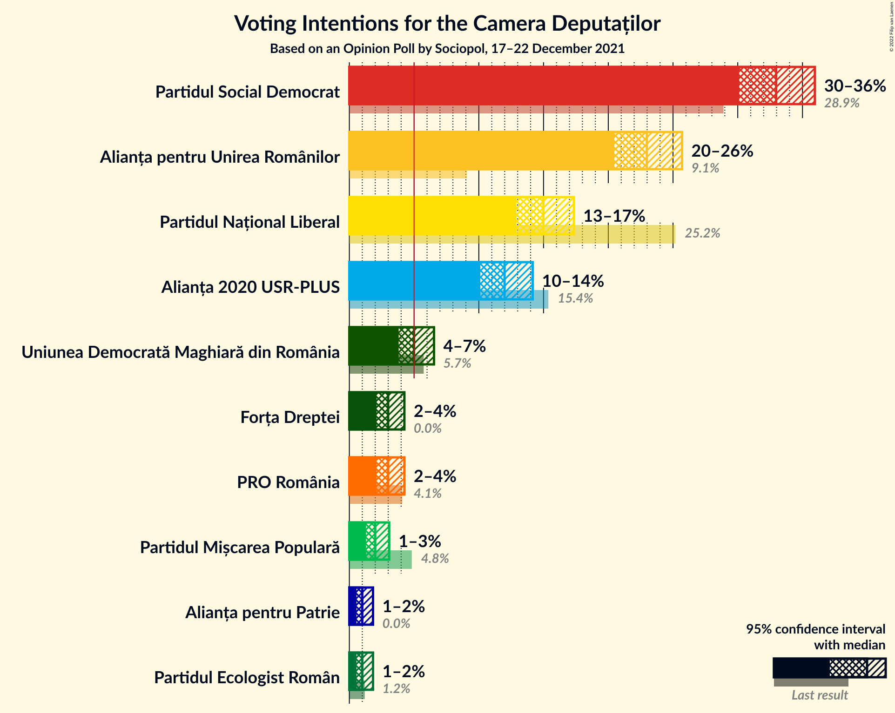

### Confidence Intervals

| Party | Last Result | Poll Result | 80% Confidence Interval | 90% Confidence Interval | 95% Confidence Interval | 99% Confidence Interval |
|:-----:|:-----------:|:-----------:|:-----------------------:|:-----------------------:|:-----------------------:|:-----------------------:|
| Partidul Social Democrat | 28.9% | 33.0% | 31.1–34.9% |30.6–35.5% |30.1–36.0% |29.2–36.9% |
| Alianța pentru Unirea Românilor | 9.1% | 23.0% | 21.3–24.8% |20.9–25.3% |20.5–25.7% |19.7–26.6% |
| Partidul Național Liberal | 25.2% | 15.0% | 13.6–16.5% |13.2–17.0% |12.9–17.3% |12.3–18.1% |
| Alianța 2020 USR-PLUS | 15.4% | 12.0% | 10.8–13.4% |10.4–13.8% |10.1–14.2% |9.6–14.9% |
| Uniunea Democrată Maghiară din România | 5.7% | 5.0% | 4.2–6.0% |4.0–6.3% |3.8–6.5% |3.5–7.0% |
| PRO România | 4.1% | 3.0% | 2.4–3.8% |2.2–4.1% |2.1–4.3% |1.9–4.7% |
| Forța Dreptei | 0.0% | 3.0% | 2.4–3.8% |2.2–4.1% |2.1–4.3% |1.9–4.7% |
| Partidul Mișcarea Populară | 4.8% | 2.0% | 1.5–2.7% |1.4–2.9% |1.3–3.1% |1.1–3.4% |
| Partidul Ecologist Român | 1.2% | 1.0% | 0.7–1.5% |0.6–1.7% |0.5–1.8% |0.4–2.1% |
| Alianța pentru Patrie | 0.0% | 1.0% | 0.7–1.5% |0.6–1.7% |0.5–1.8% |0.4–2.1% |

*Note:* The poll result column reflects the actual value used in the calculations. Published results may vary slightly, and in addition be rounded to fewer digits.

## Seats

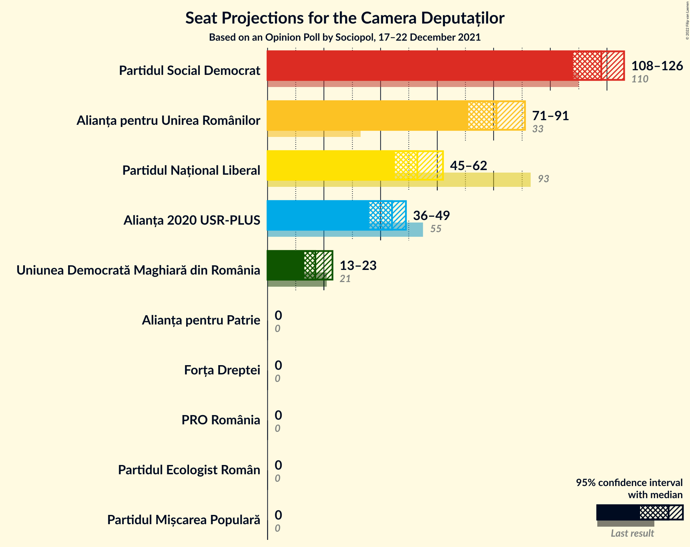

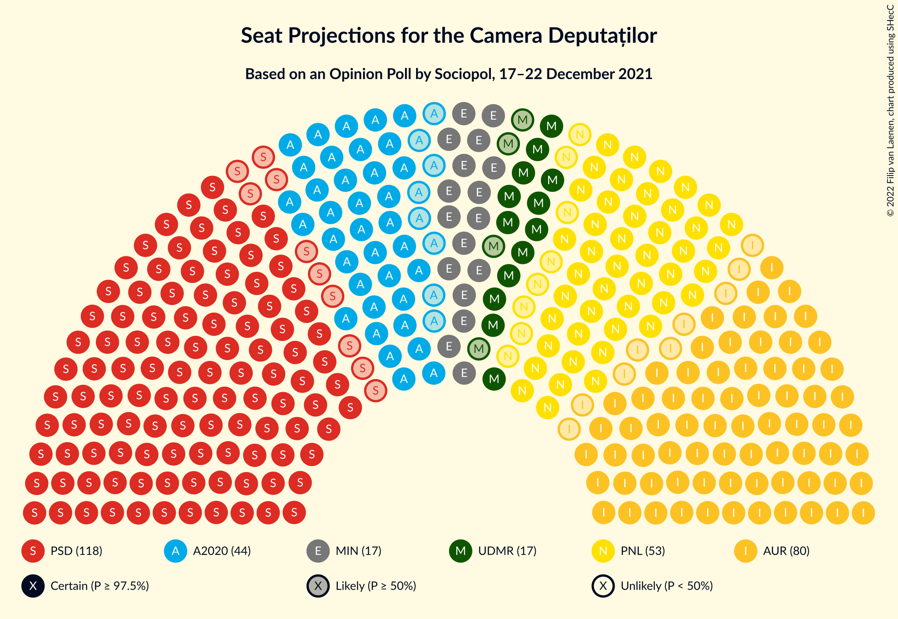

### Confidence Intervals

| Party | Last Result | Median | 80% Confidence Interval | 90% Confidence Interval | 95% Confidence Interval | 99% Confidence Interval |
|:-----:|:-----------:|:------:|:-----------------------:|:-----------------------:|:-----------------------:|:-----------------------:|
| <a href="#partidul-social-democrat">Partidul Social Democrat</a> | 110 | 118 | 111–123 |109–125 |108–126 |104–130 |
| <a href="#alianța-pentru-unirea-românilor">Alianța pentru Unirea Românilor</a> | 33 | 81 | 76–88 |74–90 |71–91 |70–93 |
| <a href="#partidul-național-liberal">Partidul Național Liberal</a> | 93 | 53 | 48–59 |46–60 |45–62 |43–63 |
| <a href="#alianța-2020-usr-plus">Alianța 2020 USR-PLUS</a> | 55 | 44 | 37–48 |36–49 |36–49 |34–53 |
| <a href="#uniunea-democrată-maghiară-din-românia">Uniunea Democrată Maghiară din România</a> | 21 | 17 | 14–21 |13–22 |13–23 |11–25 |
| <a href="#pro-românia">PRO România</a> | 0 | 0 | 0 |0 |0 |0 |
| <a href="#forța-dreptei">Forța Dreptei</a> | 0 | 0 | 0 |0 |0 |0 |
| <a href="#partidul-mișcarea-populară">Partidul Mișcarea Populară</a> | 0 | 0 | 0 |0 |0 |0 |
| <a href="#partidul-ecologist-român">Partidul Ecologist Român</a> | 0 | 0 | 0 |0 |0 |0 |
| <a href="#alianța-pentru-patrie">Alianța pentru Patrie</a> | 0 | 0 | 0 |0 |0 |0 |

### Partidul Social Democrat

*For a full overview of the results for this party, see the [Partidul Social Democrat](party-partidulsocialdemocrat.html) page.*

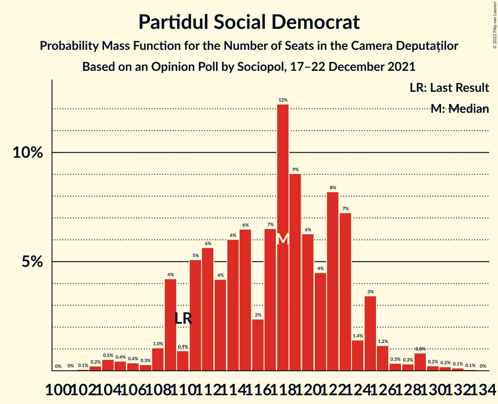

| Number of Seats | Probability | Accumulated | Special Marks |
|:---------------:|:-----------:|:-----------:|:-------------:|
| 101 | 0% | 100% |  |
| 102 | 0.1% | 99.9% |  |
| 103 | 0.2% | 99.9% |  |
| 104 | 0.5% | 99.7% |  |
| 105 | 0.4% | 99.1% |  |
| 106 | 0.4% | 98.7% |  |
| 107 | 0.3% | 98% |  |
| 108 | 1.0% | 98% |  |
| 109 | 4% | 97% |  |
| 110 | 0.9% | 93% | Last Result |
| 111 | 5% | 92% |  |
| 112 | 6% | 87% |  |
| 113 | 4% | 81% |  |
| 114 | 6% | 77% |  |
| 115 | 6% | 71% |  |
| 116 | 2% | 64% |  |
| 117 | 7% | 62% |  |
| 118 | 12% | 56% | Median |
| 119 | 9% | 43% |  |
| 120 | 6% | 34% |  |
| 121 | 4% | 28% |  |
| 122 | 8% | 24% |  |
| 123 | 7% | 15% |  |
| 124 | 1.4% | 8% |  |
| 125 | 3% | 7% |  |
| 126 | 1.2% | 3% |  |
| 127 | 0.3% | 2% |  |
| 128 | 0.3% | 2% |  |
| 129 | 0.8% | 1.5% |  |
| 130 | 0.2% | 0.6% |  |
| 131 | 0.2% | 0.4% |  |
| 132 | 0.1% | 0.2% |  |
| 133 | 0.1% | 0.1% |  |
| 134 | 0% | 0% |  |

### Alianța pentru Unirea Românilor

*For a full overview of the results for this party, see the [Alianța pentru Unirea Românilor](party-alianțapentruunirearomânilor.html) page.*

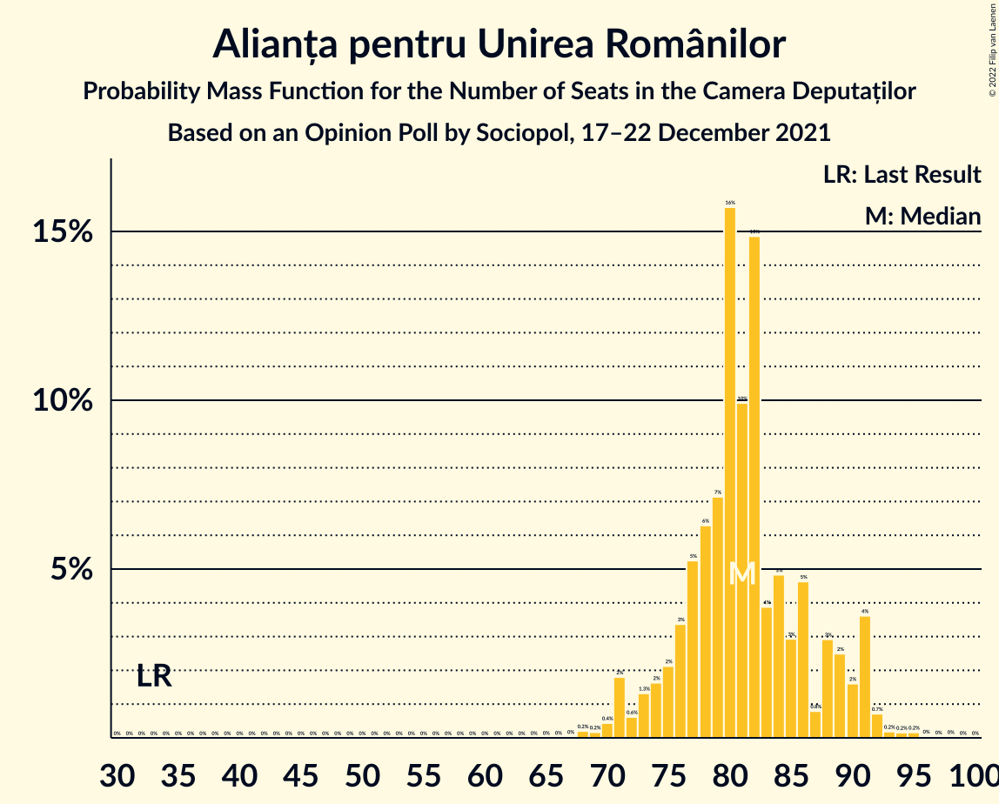

| Number of Seats | Probability | Accumulated | Special Marks |
|:---------------:|:-----------:|:-----------:|:-------------:|
| 33 | 0% | 100% | Last Result |
| 34 | 0% | 100% |  |
| 35 | 0% | 100% |  |
| 36 | 0% | 100% |  |
| 37 | 0% | 100% |  |
| 38 | 0% | 100% |  |
| 39 | 0% | 100% |  |
| 40 | 0% | 100% |  |
| 41 | 0% | 100% |  |
| 42 | 0% | 100% |  |
| 43 | 0% | 100% |  |
| 44 | 0% | 100% |  |
| 45 | 0% | 100% |  |
| 46 | 0% | 100% |  |
| 47 | 0% | 100% |  |
| 48 | 0% | 100% |  |
| 49 | 0% | 100% |  |
| 50 | 0% | 100% |  |
| 51 | 0% | 100% |  |
| 52 | 0% | 100% |  |
| 53 | 0% | 100% |  |
| 54 | 0% | 100% |  |
| 55 | 0% | 100% |  |
| 56 | 0% | 100% |  |
| 57 | 0% | 100% |  |
| 58 | 0% | 100% |  |
| 59 | 0% | 100% |  |
| 60 | 0% | 100% |  |
| 61 | 0% | 100% |  |
| 62 | 0% | 100% |  |
| 63 | 0% | 100% |  |
| 64 | 0% | 100% |  |
| 65 | 0% | 100% |  |
| 66 | 0% | 100% |  |
| 67 | 0% | 100% |  |
| 68 | 0.2% | 99.9% |  |
| 69 | 0.2% | 99.7% |  |
| 70 | 0.4% | 99.6% |  |
| 71 | 2% | 99.1% |  |
| 72 | 0.6% | 97% |  |
| 73 | 1.3% | 97% |  |
| 74 | 2% | 95% |  |
| 75 | 2% | 94% |  |
| 76 | 3% | 92% |  |
| 77 | 5% | 88% |  |
| 78 | 6% | 83% |  |
| 79 | 7% | 77% |  |
| 80 | 16% | 70% |  |
| 81 | 10% | 54% | Median |
| 82 | 15% | 44% |  |
| 83 | 4% | 29% |  |
| 84 | 5% | 25% |  |
| 85 | 3% | 20% |  |
| 86 | 5% | 17% |  |
| 87 | 0.8% | 13% |  |
| 88 | 3% | 12% |  |
| 89 | 2% | 9% |  |
| 90 | 2% | 7% |  |
| 91 | 4% | 5% |  |
| 92 | 0.7% | 1.3% |  |
| 93 | 0.2% | 0.6% |  |
| 94 | 0.2% | 0.4% |  |
| 95 | 0.2% | 0.3% |  |
| 96 | 0% | 0.1% |  |
| 97 | 0% | 0.1% |  |
| 98 | 0% | 0% |  |

### Partidul Național Liberal

*For a full overview of the results for this party, see the [Partidul Național Liberal](party-partidulnaționalliberal.html) page.*

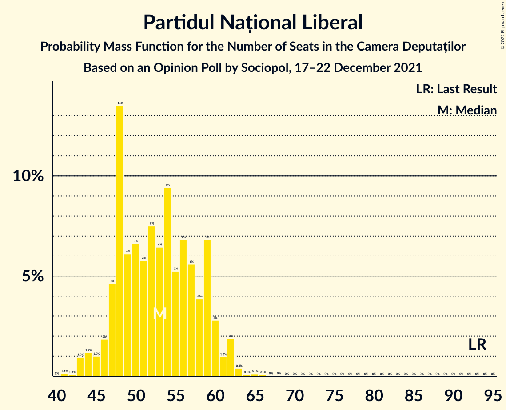

| Number of Seats | Probability | Accumulated | Special Marks |
|:---------------:|:-----------:|:-----------:|:-------------:|
| 41 | 0.1% | 100% |  |
| 42 | 0.1% | 99.8% |  |
| 43 | 1.0% | 99.8% |  |
| 44 | 1.2% | 98.8% |  |
| 45 | 1.0% | 98% |  |
| 46 | 2% | 97% |  |
| 47 | 5% | 95% |  |
| 48 | 14% | 90% |  |
| 49 | 6% | 77% |  |
| 50 | 7% | 71% |  |
| 51 | 6% | 64% |  |
| 52 | 8% | 58% |  |
| 53 | 6% | 51% | Median |
| 54 | 9% | 44% |  |
| 55 | 5% | 35% |  |
| 56 | 7% | 30% |  |
| 57 | 6% | 23% |  |
| 58 | 4% | 17% |  |
| 59 | 7% | 13% |  |
| 60 | 3% | 6% |  |
| 61 | 1.0% | 4% |  |
| 62 | 2% | 3% |  |
| 63 | 0.4% | 0.8% |  |
| 64 | 0.1% | 0.4% |  |
| 65 | 0.1% | 0.3% |  |
| 66 | 0.1% | 0.2% |  |
| 67 | 0% | 0.1% |  |
| 68 | 0% | 0% |  |
| 69 | 0% | 0% |  |
| 70 | 0% | 0% |  |
| 71 | 0% | 0% |  |
| 72 | 0% | 0% |  |
| 73 | 0% | 0% |  |
| 74 | 0% | 0% |  |
| 75 | 0% | 0% |  |
| 76 | 0% | 0% |  |
| 77 | 0% | 0% |  |
| 78 | 0% | 0% |  |
| 79 | 0% | 0% |  |
| 80 | 0% | 0% |  |
| 81 | 0% | 0% |  |
| 82 | 0% | 0% |  |
| 83 | 0% | 0% |  |
| 84 | 0% | 0% |  |
| 85 | 0% | 0% |  |
| 86 | 0% | 0% |  |
| 87 | 0% | 0% |  |
| 88 | 0% | 0% |  |
| 89 | 0% | 0% |  |
| 90 | 0% | 0% |  |
| 91 | 0% | 0% |  |
| 92 | 0% | 0% |  |
| 93 | 0% | 0% | Last Result |

### Alianța 2020 USR-PLUS

*For a full overview of the results for this party, see the [Alianța 2020 USR-PLUS](party-alianța2020usr-plus.html) page.*

| Number of Seats | Probability | Accumulated | Special Marks |
|:---------------:|:-----------:|:-----------:|:-------------:|
| 31 | 0% | 100% |  |
| 32 | 0.1% | 99.9% |  |
| 33 | 0.3% | 99.9% |  |
| 34 | 0.4% | 99.6% |  |
| 35 | 1.2% | 99.2% |  |
| 36 | 5% | 98% |  |
| 37 | 4% | 93% |  |
| 38 | 4% | 90% |  |
| 39 | 4% | 86% |  |
| 40 | 5% | 81% |  |
| 41 | 10% | 76% |  |
| 42 | 10% | 66% |  |
| 43 | 5% | 56% |  |
| 44 | 10% | 51% | Median |
| 45 | 13% | 41% |  |
| 46 | 5% | 28% |  |
| 47 | 7% | 23% |  |
| 48 | 7% | 16% |  |
| 49 | 6% | 9% |  |
| 50 | 1.0% | 2% |  |
| 51 | 0.5% | 2% |  |
| 52 | 0.3% | 1.0% |  |
| 53 | 0.2% | 0.7% |  |
| 54 | 0.4% | 0.5% |  |
| 55 | 0.1% | 0.1% | Last Result |
| 56 | 0% | 0.1% |  |
| 57 | 0% | 0% |  |

### Uniunea Democrată Maghiară din România

*For a full overview of the results for this party, see the [Uniunea Democrată Maghiară din România](party-uniuneademocratămaghiarădinromânia.html) page.*

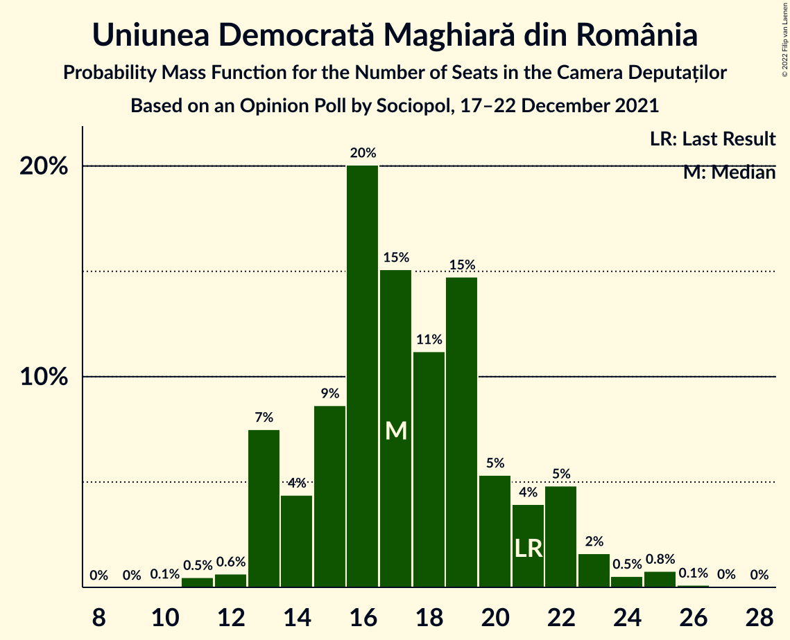

| Number of Seats | Probability | Accumulated | Special Marks |
|:---------------:|:-----------:|:-----------:|:-------------:|
| 10 | 0.1% | 100% |  |
| 11 | 0.5% | 99.9% |  |
| 12 | 0.6% | 99.5% |  |
| 13 | 7% | 98.8% |  |
| 14 | 4% | 91% |  |
| 15 | 9% | 87% |  |
| 16 | 20% | 78% |  |
| 17 | 15% | 58% | Median |
| 18 | 11% | 43% |  |
| 19 | 15% | 32% |  |
| 20 | 5% | 17% |  |
| 21 | 4% | 12% | Last Result |
| 22 | 5% | 8% |  |
| 23 | 2% | 3% |  |
| 24 | 0.5% | 1.5% |  |
| 25 | 0.8% | 1.0% |  |
| 26 | 0.1% | 0.2% |  |
| 27 | 0% | 0.1% |  |
| 28 | 0% | 0% |  |

### PRO România

*For a full overview of the results for this party, see the [PRO România](party-proromânia.html) page.*

| Number of Seats | Probability | Accumulated | Special Marks |
|:---------------:|:-----------:|:-----------:|:-------------:|
| 0 | 99.9% | 100% | Last Result, Median |
| 1 | 0% | 0.1% |  |
| 2 | 0% | 0.1% |  |
| 3 | 0% | 0.1% |  |
| 4 | 0% | 0.1% |  |
| 5 | 0% | 0.1% |  |
| 6 | 0% | 0.1% |  |
| 7 | 0% | 0.1% |  |
| 8 | 0% | 0.1% |  |
| 9 | 0% | 0.1% |  |
| 10 | 0% | 0.1% |  |
| 11 | 0% | 0.1% |  |
| 12 | 0% | 0.1% |  |
| 13 | 0% | 0.1% |  |
| 14 | 0% | 0.1% |  |
| 15 | 0% | 0.1% |  |
| 16 | 0% | 0.1% |  |
| 17 | 0.1% | 0.1% |  |
| 18 | 0% | 0.1% |  |
| 19 | 0% | 0% |  |

### Forța Dreptei

*For a full overview of the results for this party, see the [Forța Dreptei](party-forțadreptei.html) page.*

| Number of Seats | Probability | Accumulated | Special Marks |
|:---------------:|:-----------:|:-----------:|:-------------:|
| 0 | 99.8% | 100% | Last Result, Median |
| 1 | 0% | 0.2% |  |
| 2 | 0% | 0.2% |  |
| 3 | 0% | 0.2% |  |
| 4 | 0% | 0.2% |  |
| 5 | 0% | 0.2% |  |
| 6 | 0% | 0.2% |  |
| 7 | 0% | 0.2% |  |
| 8 | 0% | 0.2% |  |
| 9 | 0% | 0.2% |  |
| 10 | 0% | 0.2% |  |
| 11 | 0% | 0.2% |  |
| 12 | 0% | 0.2% |  |
| 13 | 0% | 0.2% |  |
| 14 | 0% | 0.2% |  |
| 15 | 0% | 0.2% |  |
| 16 | 0% | 0.2% |  |
| 17 | 0.1% | 0.2% |  |
| 18 | 0% | 0% |  |

### Partidul Mișcarea Populară

*For a full overview of the results for this party, see the [Partidul Mișcarea Populară](party-partidulmișcareapopulară.html) page.*

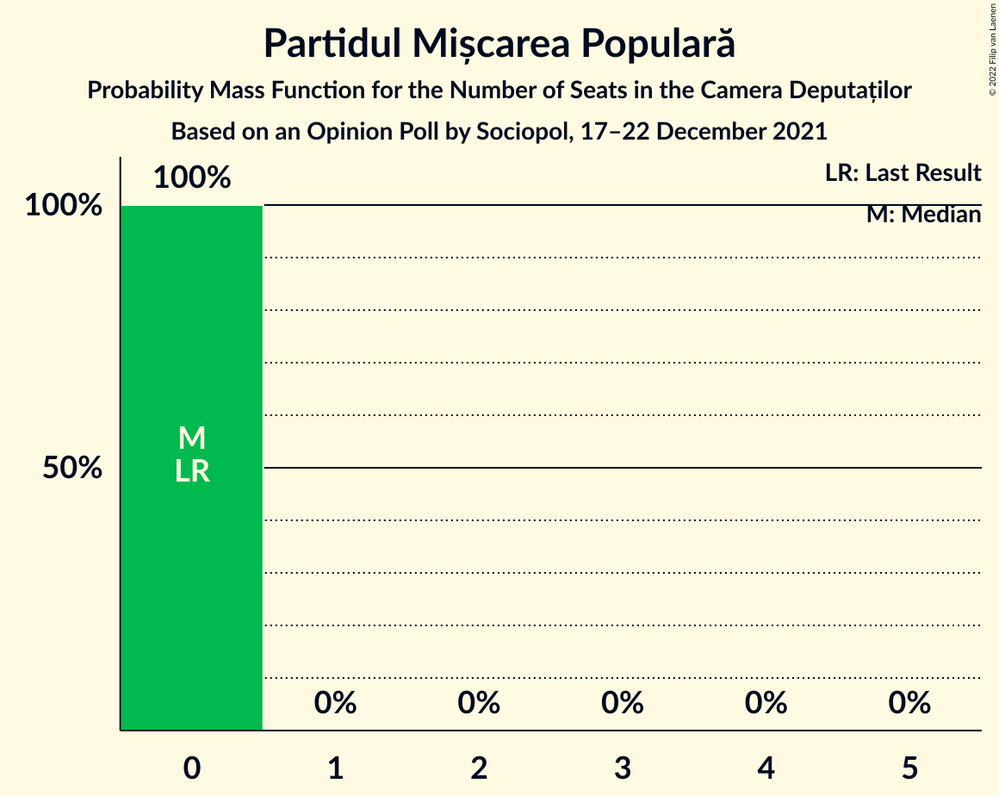

| Number of Seats | Probability | Accumulated | Special Marks |
|:---------------:|:-----------:|:-----------:|:-------------:|
| 0 | 100% | 100% | Last Result, Median |

### Partidul Ecologist Român

*For a full overview of the results for this party, see the [Partidul Ecologist Român](party-partidulecologistromân.html) page.*

| Number of Seats | Probability | Accumulated | Special Marks |
|:---------------:|:-----------:|:-----------:|:-------------:|
| 0 | 100% | 100% | Last Result, Median |

### Alianța pentru Patrie

*For a full overview of the results for this party, see the [Alianța pentru Patrie](party-alianțapentrupatrie.html) page.*

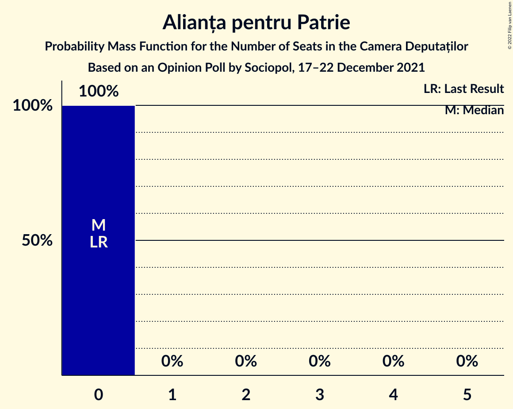

| Number of Seats | Probability | Accumulated | Special Marks |
|:---------------:|:-----------:|:-----------:|:-------------:|
| 0 | 100% | 100% | Last Result, Median |

## Coalitions

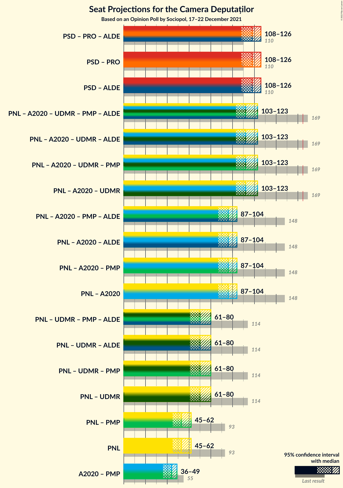

### Confidence Intervals

| Coalition | Last Result | Median | Majority? | 80% Confidence Interval | 90% Confidence Interval | 95% Confidence Interval | 99% Confidence Interval |
|:---------:|:-----------:|:------:|:---------:|:-----------------------:|:-----------------------:|:-----------------------:|:-----------------------:|
| Partidul Social Democrat – PRO România | 110 | 118 | 0% | 111–123 | 109–125 | 108–126 | 104–130 |
| Partidul Național Liberal – Alianța 2020 USR-PLUS – Uniunea Democrată Maghiară din România – Partidul Mișcarea Populară | 169 | 112 | 0% | 107–120 | 103–122 | 103–123 | 101–126 |
| Partidul Național Liberal – Alianța 2020 USR-PLUS – Uniunea Democrată Maghiară din România | 169 | 112 | 0% | 107–120 | 103–122 | 103–123 | 101–126 |
| Partidul Național Liberal – Alianța 2020 USR-PLUS – Partidul Mișcarea Populară | 148 | 96 | 0% | 90–102 | 88–104 | 87–104 | 84–108 |
| Partidul Național Liberal – Alianța 2020 USR-PLUS | 148 | 96 | 0% | 90–102 | 88–104 | 87–104 | 84–108 |
| Partidul Național Liberal – Uniunea Democrată Maghiară din România – Partidul Mișcarea Populară | 114 | 70 | 0% | 64–78 | 63–79 | 61–80 | 60–82 |
| Partidul Național Liberal – Uniunea Democrată Maghiară din România | 114 | 70 | 0% | 64–78 | 63–79 | 61–80 | 60–82 |
| Partidul Național Liberal – Partidul Mișcarea Populară | 93 | 53 | 0% | 48–59 | 46–60 | 45–62 | 43–63 |
| Partidul Național Liberal | 93 | 53 | 0% | 48–59 | 46–60 | 45–62 | 43–63 |
| Alianța 2020 USR-PLUS – Partidul Mișcarea Populară | 55 | 44 | 0% | 37–48 | 36–49 | 36–49 | 34–53 |

### Partidul Social Democrat – PRO România

| Number of Seats | Probability | Accumulated | Special Marks |
|:---------------:|:-----------:|:-----------:|:-------------:|
| 101 | 0% | 100% |  |
| 102 | 0.1% | 99.9% |  |
| 103 | 0.2% | 99.9% |  |
| 104 | 0.5% | 99.7% |  |
| 105 | 0.4% | 99.1% |  |
| 106 | 0.4% | 98.7% |  |
| 107 | 0.2% | 98% |  |
| 108 | 1.0% | 98% |  |
| 109 | 4% | 97% |  |
| 110 | 0.9% | 93% | Last Result |
| 111 | 5% | 92% |  |
| 112 | 6% | 87% |  |
| 113 | 4% | 81% |  |
| 114 | 6% | 77% |  |
| 115 | 6% | 71% |  |
| 116 | 2% | 65% |  |
| 117 | 7% | 62% |  |
| 118 | 12% | 56% | Median |
| 119 | 9% | 43% |  |
| 120 | 6% | 34% |  |
| 121 | 4% | 28% |  |
| 122 | 8% | 24% |  |
| 123 | 7% | 15% |  |
| 124 | 1.4% | 8% |  |
| 125 | 3% | 7% |  |
| 126 | 1.2% | 3% |  |
| 127 | 0.4% | 2% |  |
| 128 | 0.3% | 2% |  |
| 129 | 0.8% | 2% |  |
| 130 | 0.2% | 0.7% |  |
| 131 | 0.2% | 0.4% |  |
| 132 | 0.1% | 0.3% |  |
| 133 | 0.1% | 0.1% |  |
| 134 | 0% | 0.1% |  |
| 135 | 0% | 0% |  |

### Partidul Național Liberal – Alianța 2020 USR-PLUS – Uniunea Democrată Maghiară din România – Partidul Mișcarea Populară

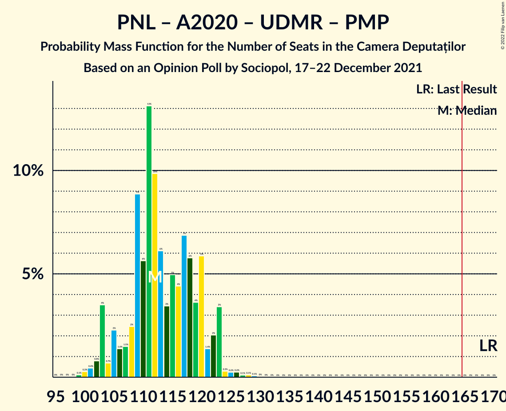

| Number of Seats | Probability | Accumulated | Special Marks |
|:---------------:|:-----------:|:-----------:|:-------------:|
| 96 | 0% | 100% |  |
| 97 | 0% | 99.9% |  |
| 98 | 0% | 99.9% |  |
| 99 | 0.1% | 99.9% |  |
| 100 | 0.3% | 99.8% |  |
| 101 | 0.4% | 99.5% |  |
| 102 | 0.8% | 99.1% |  |
| 103 | 4% | 98% |  |
| 104 | 0.7% | 95% |  |
| 105 | 2% | 94% |  |
| 106 | 1.4% | 92% |  |
| 107 | 1.5% | 90% |  |
| 108 | 2% | 89% |  |
| 109 | 9% | 86% |  |
| 110 | 6% | 78% |  |
| 111 | 13% | 72% |  |
| 112 | 10% | 59% |  |
| 113 | 6% | 49% |  |
| 114 | 3% | 43% | Median |
| 115 | 5% | 39% |  |
| 116 | 4% | 34% |  |
| 117 | 7% | 30% |  |
| 118 | 6% | 23% |  |
| 119 | 4% | 17% |  |
| 120 | 6% | 14% |  |
| 121 | 1.4% | 8% |  |
| 122 | 2% | 7% |  |
| 123 | 3% | 5% |  |
| 124 | 0.3% | 1.1% |  |
| 125 | 0.2% | 0.8% |  |
| 126 | 0.2% | 0.6% |  |
| 127 | 0.1% | 0.3% |  |
| 128 | 0.1% | 0.2% |  |
| 129 | 0.1% | 0.1% |  |
| 130 | 0% | 0.1% |  |
| 131 | 0% | 0% |  |
| 132 | 0% | 0% |  |
| 133 | 0% | 0% |  |
| 134 | 0% | 0% |  |
| 135 | 0% | 0% |  |
| 136 | 0% | 0% |  |
| 137 | 0% | 0% |  |
| 138 | 0% | 0% |  |
| 139 | 0% | 0% |  |
| 140 | 0% | 0% |  |
| 141 | 0% | 0% |  |
| 142 | 0% | 0% |  |
| 143 | 0% | 0% |  |
| 144 | 0% | 0% |  |
| 145 | 0% | 0% |  |
| 146 | 0% | 0% |  |
| 147 | 0% | 0% |  |
| 148 | 0% | 0% |  |
| 149 | 0% | 0% |  |
| 150 | 0% | 0% |  |
| 151 | 0% | 0% |  |
| 152 | 0% | 0% |  |
| 153 | 0% | 0% |  |
| 154 | 0% | 0% |  |
| 155 | 0% | 0% |  |
| 156 | 0% | 0% |  |
| 157 | 0% | 0% |  |
| 158 | 0% | 0% |  |
| 159 | 0% | 0% |  |
| 160 | 0% | 0% |  |
| 161 | 0% | 0% |  |
| 162 | 0% | 0% |  |
| 163 | 0% | 0% |  |
| 164 | 0% | 0% |  |
| 165 | 0% | 0% | Majority |
| 166 | 0% | 0% |  |
| 167 | 0% | 0% |  |
| 168 | 0% | 0% |  |
| 169 | 0% | 0% | Last Result |

### Partidul Național Liberal – Alianța 2020 USR-PLUS – Uniunea Democrată Maghiară din România

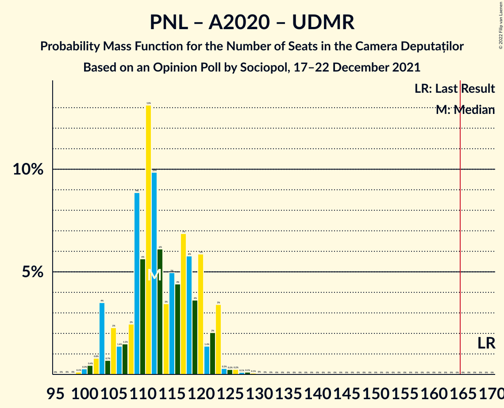

| Number of Seats | Probability | Accumulated | Special Marks |
|:---------------:|:-----------:|:-----------:|:-------------:|
| 96 | 0% | 100% |  |
| 97 | 0% | 99.9% |  |
| 98 | 0% | 99.9% |  |
| 99 | 0.1% | 99.9% |  |
| 100 | 0.3% | 99.8% |  |
| 101 | 0.4% | 99.5% |  |
| 102 | 0.8% | 99.1% |  |
| 103 | 4% | 98% |  |
| 104 | 0.7% | 95% |  |
| 105 | 2% | 94% |  |
| 106 | 1.4% | 92% |  |
| 107 | 1.5% | 90% |  |
| 108 | 2% | 89% |  |
| 109 | 9% | 86% |  |
| 110 | 6% | 78% |  |
| 111 | 13% | 72% |  |
| 112 | 10% | 59% |  |
| 113 | 6% | 49% |  |
| 114 | 3% | 43% | Median |
| 115 | 5% | 39% |  |
| 116 | 4% | 34% |  |
| 117 | 7% | 30% |  |
| 118 | 6% | 23% |  |
| 119 | 4% | 17% |  |
| 120 | 6% | 14% |  |
| 121 | 1.4% | 8% |  |
| 122 | 2% | 7% |  |
| 123 | 3% | 5% |  |
| 124 | 0.3% | 1.1% |  |
| 125 | 0.2% | 0.8% |  |
| 126 | 0.2% | 0.6% |  |
| 127 | 0.1% | 0.3% |  |
| 128 | 0.1% | 0.2% |  |
| 129 | 0.1% | 0.1% |  |
| 130 | 0% | 0.1% |  |
| 131 | 0% | 0% |  |
| 132 | 0% | 0% |  |
| 133 | 0% | 0% |  |
| 134 | 0% | 0% |  |
| 135 | 0% | 0% |  |
| 136 | 0% | 0% |  |
| 137 | 0% | 0% |  |
| 138 | 0% | 0% |  |
| 139 | 0% | 0% |  |
| 140 | 0% | 0% |  |
| 141 | 0% | 0% |  |
| 142 | 0% | 0% |  |
| 143 | 0% | 0% |  |
| 144 | 0% | 0% |  |
| 145 | 0% | 0% |  |
| 146 | 0% | 0% |  |
| 147 | 0% | 0% |  |
| 148 | 0% | 0% |  |
| 149 | 0% | 0% |  |
| 150 | 0% | 0% |  |
| 151 | 0% | 0% |  |
| 152 | 0% | 0% |  |
| 153 | 0% | 0% |  |
| 154 | 0% | 0% |  |
| 155 | 0% | 0% |  |
| 156 | 0% | 0% |  |
| 157 | 0% | 0% |  |
| 158 | 0% | 0% |  |
| 159 | 0% | 0% |  |
| 160 | 0% | 0% |  |
| 161 | 0% | 0% |  |
| 162 | 0% | 0% |  |
| 163 | 0% | 0% |  |
| 164 | 0% | 0% |  |
| 165 | 0% | 0% | Majority |
| 166 | 0% | 0% |  |
| 167 | 0% | 0% |  |
| 168 | 0% | 0% |  |
| 169 | 0% | 0% | Last Result |

### Partidul Național Liberal – Alianța 2020 USR-PLUS – Partidul Mișcarea Populară

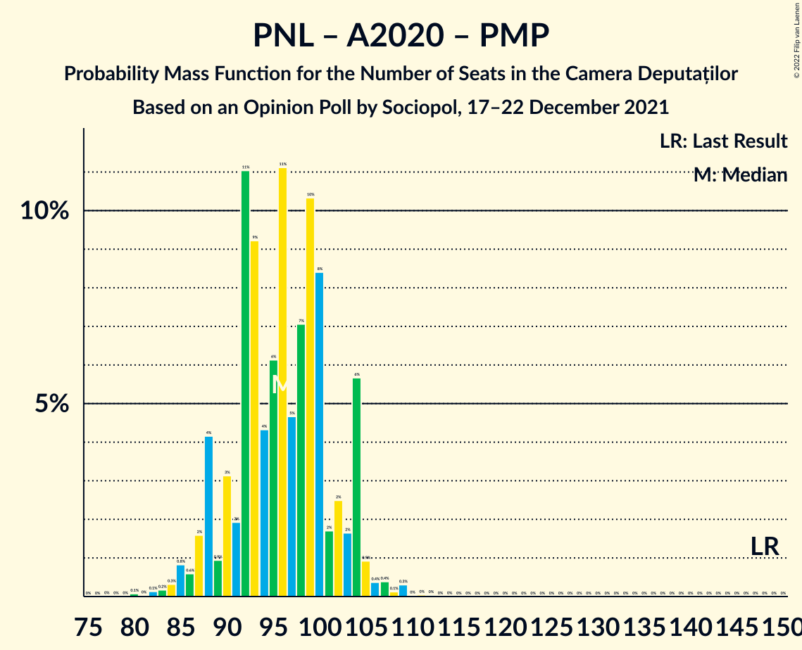

| Number of Seats | Probability | Accumulated | Special Marks |
|:---------------:|:-----------:|:-----------:|:-------------:|
| 80 | 0.1% | 100% |  |
| 81 | 0% | 99.9% |  |
| 82 | 0.1% | 99.9% |  |
| 83 | 0.2% | 99.7% |  |
| 84 | 0.3% | 99.6% |  |
| 85 | 0.8% | 99.2% |  |
| 86 | 0.6% | 98% |  |
| 87 | 2% | 98% |  |
| 88 | 4% | 96% |  |
| 89 | 0.9% | 92% |  |
| 90 | 3% | 91% |  |
| 91 | 2% | 88% |  |
| 92 | 11% | 86% |  |
| 93 | 9% | 75% |  |
| 94 | 4% | 66% |  |
| 95 | 6% | 61% |  |
| 96 | 11% | 55% |  |
| 97 | 5% | 44% | Median |
| 98 | 7% | 40% |  |
| 99 | 10% | 32% |  |
| 100 | 8% | 22% |  |
| 101 | 2% | 14% |  |
| 102 | 2% | 12% |  |
| 103 | 2% | 10% |  |
| 104 | 6% | 8% |  |
| 105 | 0.9% | 2% |  |
| 106 | 0.4% | 1.3% |  |
| 107 | 0.4% | 0.9% |  |
| 108 | 0.1% | 0.6% |  |
| 109 | 0.3% | 0.4% |  |
| 110 | 0% | 0.1% |  |
| 111 | 0% | 0.1% |  |
| 112 | 0% | 0.1% |  |
| 113 | 0% | 0% |  |
| 114 | 0% | 0% |  |
| 115 | 0% | 0% |  |
| 116 | 0% | 0% |  |
| 117 | 0% | 0% |  |
| 118 | 0% | 0% |  |
| 119 | 0% | 0% |  |
| 120 | 0% | 0% |  |
| 121 | 0% | 0% |  |
| 122 | 0% | 0% |  |
| 123 | 0% | 0% |  |
| 124 | 0% | 0% |  |
| 125 | 0% | 0% |  |
| 126 | 0% | 0% |  |
| 127 | 0% | 0% |  |
| 128 | 0% | 0% |  |
| 129 | 0% | 0% |  |
| 130 | 0% | 0% |  |
| 131 | 0% | 0% |  |
| 132 | 0% | 0% |  |
| 133 | 0% | 0% |  |
| 134 | 0% | 0% |  |
| 135 | 0% | 0% |  |
| 136 | 0% | 0% |  |
| 137 | 0% | 0% |  |
| 138 | 0% | 0% |  |
| 139 | 0% | 0% |  |
| 140 | 0% | 0% |  |
| 141 | 0% | 0% |  |
| 142 | 0% | 0% |  |
| 143 | 0% | 0% |  |
| 144 | 0% | 0% |  |
| 145 | 0% | 0% |  |
| 146 | 0% | 0% |  |
| 147 | 0% | 0% |  |
| 148 | 0% | 0% | Last Result |

### Partidul Național Liberal – Alianța 2020 USR-PLUS

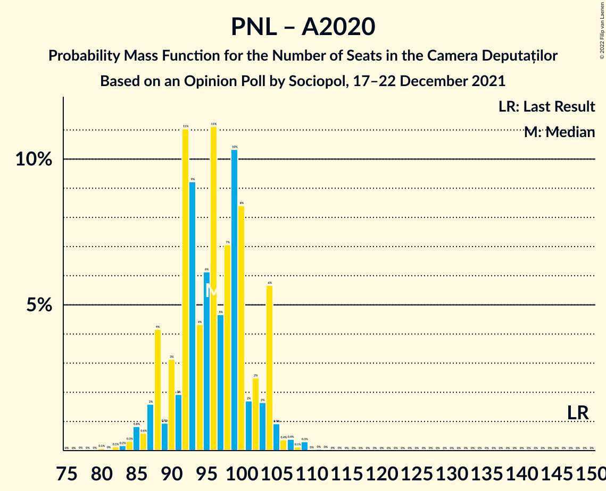

| Number of Seats | Probability | Accumulated | Special Marks |
|:---------------:|:-----------:|:-----------:|:-------------:|
| 80 | 0.1% | 100% |  |
| 81 | 0% | 99.9% |  |
| 82 | 0.1% | 99.9% |  |
| 83 | 0.2% | 99.7% |  |
| 84 | 0.3% | 99.6% |  |
| 85 | 0.8% | 99.2% |  |
| 86 | 0.6% | 98% |  |
| 87 | 2% | 98% |  |
| 88 | 4% | 96% |  |
| 89 | 0.9% | 92% |  |
| 90 | 3% | 91% |  |
| 91 | 2% | 88% |  |
| 92 | 11% | 86% |  |
| 93 | 9% | 75% |  |
| 94 | 4% | 66% |  |
| 95 | 6% | 61% |  |
| 96 | 11% | 55% |  |
| 97 | 5% | 44% | Median |
| 98 | 7% | 40% |  |
| 99 | 10% | 32% |  |
| 100 | 8% | 22% |  |
| 101 | 2% | 14% |  |
| 102 | 2% | 12% |  |
| 103 | 2% | 10% |  |
| 104 | 6% | 8% |  |
| 105 | 0.9% | 2% |  |
| 106 | 0.4% | 1.3% |  |
| 107 | 0.4% | 0.9% |  |
| 108 | 0.1% | 0.6% |  |
| 109 | 0.3% | 0.4% |  |
| 110 | 0% | 0.1% |  |
| 111 | 0% | 0.1% |  |
| 112 | 0% | 0.1% |  |
| 113 | 0% | 0% |  |
| 114 | 0% | 0% |  |
| 115 | 0% | 0% |  |
| 116 | 0% | 0% |  |
| 117 | 0% | 0% |  |
| 118 | 0% | 0% |  |
| 119 | 0% | 0% |  |
| 120 | 0% | 0% |  |
| 121 | 0% | 0% |  |
| 122 | 0% | 0% |  |
| 123 | 0% | 0% |  |
| 124 | 0% | 0% |  |
| 125 | 0% | 0% |  |
| 126 | 0% | 0% |  |
| 127 | 0% | 0% |  |
| 128 | 0% | 0% |  |
| 129 | 0% | 0% |  |
| 130 | 0% | 0% |  |
| 131 | 0% | 0% |  |
| 132 | 0% | 0% |  |
| 133 | 0% | 0% |  |
| 134 | 0% | 0% |  |
| 135 | 0% | 0% |  |
| 136 | 0% | 0% |  |
| 137 | 0% | 0% |  |
| 138 | 0% | 0% |  |
| 139 | 0% | 0% |  |
| 140 | 0% | 0% |  |
| 141 | 0% | 0% |  |
| 142 | 0% | 0% |  |
| 143 | 0% | 0% |  |
| 144 | 0% | 0% |  |
| 145 | 0% | 0% |  |
| 146 | 0% | 0% |  |
| 147 | 0% | 0% |  |
| 148 | 0% | 0% | Last Result |

### Partidul Național Liberal – Uniunea Democrată Maghiară din România – Partidul Mișcarea Populară

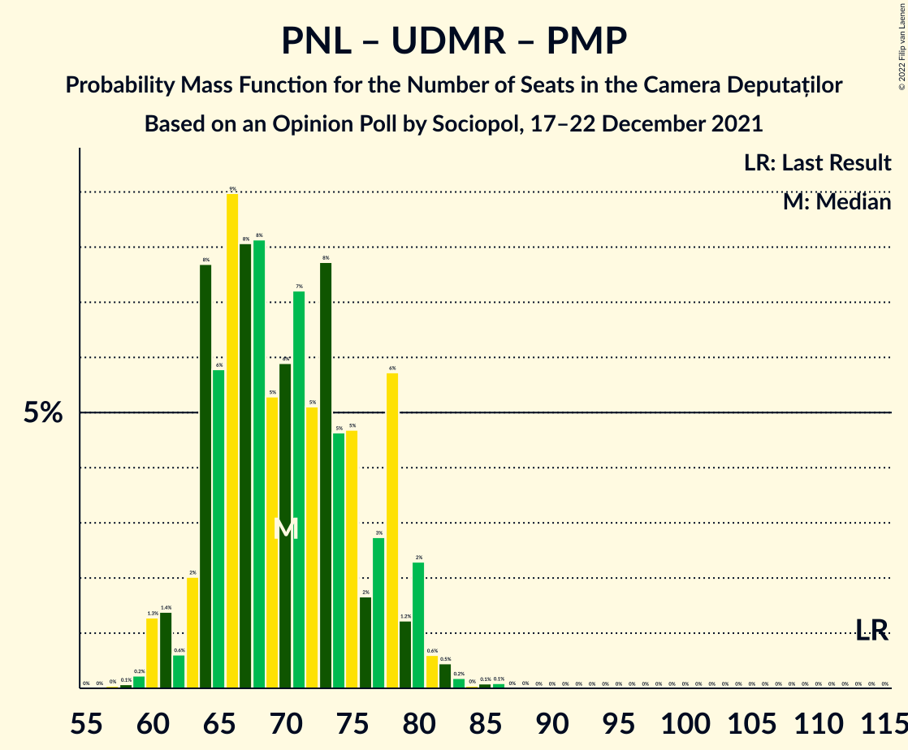

| Number of Seats | Probability | Accumulated | Special Marks |
|:---------------:|:-----------:|:-----------:|:-------------:|
| 57 | 0% | 100% |  |
| 58 | 0.1% | 99.9% |  |
| 59 | 0.2% | 99.9% |  |
| 60 | 1.3% | 99.6% |  |
| 61 | 1.4% | 98% |  |
| 62 | 0.6% | 97% |  |
| 63 | 2% | 96% |  |
| 64 | 8% | 94% |  |
| 65 | 6% | 87% |  |
| 66 | 9% | 81% |  |
| 67 | 8% | 72% |  |
| 68 | 8% | 64% |  |
| 69 | 5% | 56% |  |
| 70 | 6% | 50% | Median |
| 71 | 7% | 44% |  |
| 72 | 5% | 37% |  |
| 73 | 8% | 32% |  |
| 74 | 5% | 24% |  |
| 75 | 5% | 20% |  |
| 76 | 2% | 15% |  |
| 77 | 3% | 13% |  |
| 78 | 6% | 11% |  |
| 79 | 1.2% | 5% |  |
| 80 | 2% | 4% |  |
| 81 | 0.6% | 1.5% |  |
| 82 | 0.5% | 0.9% |  |
| 83 | 0.2% | 0.4% |  |
| 84 | 0% | 0.2% |  |
| 85 | 0.1% | 0.2% |  |
| 86 | 0.1% | 0.1% |  |
| 87 | 0% | 0% |  |
| 88 | 0% | 0% |  |
| 89 | 0% | 0% |  |
| 90 | 0% | 0% |  |
| 91 | 0% | 0% |  |
| 92 | 0% | 0% |  |
| 93 | 0% | 0% |  |
| 94 | 0% | 0% |  |
| 95 | 0% | 0% |  |
| 96 | 0% | 0% |  |
| 97 | 0% | 0% |  |
| 98 | 0% | 0% |  |
| 99 | 0% | 0% |  |
| 100 | 0% | 0% |  |
| 101 | 0% | 0% |  |
| 102 | 0% | 0% |  |
| 103 | 0% | 0% |  |
| 104 | 0% | 0% |  |
| 105 | 0% | 0% |  |
| 106 | 0% | 0% |  |
| 107 | 0% | 0% |  |
| 108 | 0% | 0% |  |
| 109 | 0% | 0% |  |
| 110 | 0% | 0% |  |
| 111 | 0% | 0% |  |
| 112 | 0% | 0% |  |
| 113 | 0% | 0% |  |
| 114 | 0% | 0% | Last Result |

### Partidul Național Liberal – Uniunea Democrată Maghiară din România

| Number of Seats | Probability | Accumulated | Special Marks |
|:---------------:|:-----------:|:-----------:|:-------------:|
| 57 | 0% | 100% |  |
| 58 | 0.1% | 99.9% |  |
| 59 | 0.2% | 99.9% |  |
| 60 | 1.3% | 99.6% |  |
| 61 | 1.4% | 98% |  |
| 62 | 0.6% | 97% |  |
| 63 | 2% | 96% |  |
| 64 | 8% | 94% |  |
| 65 | 6% | 87% |  |
| 66 | 9% | 81% |  |
| 67 | 8% | 72% |  |
| 68 | 8% | 64% |  |
| 69 | 5% | 56% |  |
| 70 | 6% | 50% | Median |
| 71 | 7% | 44% |  |
| 72 | 5% | 37% |  |
| 73 | 8% | 32% |  |
| 74 | 5% | 24% |  |
| 75 | 5% | 20% |  |
| 76 | 2% | 15% |  |
| 77 | 3% | 13% |  |
| 78 | 6% | 11% |  |
| 79 | 1.2% | 5% |  |
| 80 | 2% | 4% |  |
| 81 | 0.6% | 1.5% |  |
| 82 | 0.5% | 0.9% |  |
| 83 | 0.2% | 0.4% |  |
| 84 | 0% | 0.2% |  |
| 85 | 0.1% | 0.2% |  |
| 86 | 0.1% | 0.1% |  |
| 87 | 0% | 0% |  |
| 88 | 0% | 0% |  |
| 89 | 0% | 0% |  |
| 90 | 0% | 0% |  |
| 91 | 0% | 0% |  |
| 92 | 0% | 0% |  |
| 93 | 0% | 0% |  |
| 94 | 0% | 0% |  |
| 95 | 0% | 0% |  |
| 96 | 0% | 0% |  |
| 97 | 0% | 0% |  |
| 98 | 0% | 0% |  |
| 99 | 0% | 0% |  |
| 100 | 0% | 0% |  |
| 101 | 0% | 0% |  |
| 102 | 0% | 0% |  |
| 103 | 0% | 0% |  |
| 104 | 0% | 0% |  |
| 105 | 0% | 0% |  |
| 106 | 0% | 0% |  |
| 107 | 0% | 0% |  |
| 108 | 0% | 0% |  |
| 109 | 0% | 0% |  |
| 110 | 0% | 0% |  |
| 111 | 0% | 0% |  |
| 112 | 0% | 0% |  |
| 113 | 0% | 0% |  |
| 114 | 0% | 0% | Last Result |

### Partidul Național Liberal – Partidul Mișcarea Populară

| Number of Seats | Probability | Accumulated | Special Marks |
|:---------------:|:-----------:|:-----------:|:-------------:|
| 41 | 0.1% | 100% |  |
| 42 | 0.1% | 99.8% |  |
| 43 | 1.0% | 99.8% |  |
| 44 | 1.2% | 98.8% |  |
| 45 | 1.0% | 98% |  |
| 46 | 2% | 97% |  |
| 47 | 5% | 95% |  |
| 48 | 14% | 90% |  |
| 49 | 6% | 77% |  |
| 50 | 7% | 71% |  |
| 51 | 6% | 64% |  |
| 52 | 8% | 58% |  |
| 53 | 6% | 51% | Median |
| 54 | 9% | 44% |  |
| 55 | 5% | 35% |  |
| 56 | 7% | 30% |  |
| 57 | 6% | 23% |  |
| 58 | 4% | 17% |  |
| 59 | 7% | 13% |  |
| 60 | 3% | 6% |  |
| 61 | 1.0% | 4% |  |
| 62 | 2% | 3% |  |
| 63 | 0.4% | 0.8% |  |
| 64 | 0.1% | 0.4% |  |
| 65 | 0.1% | 0.3% |  |
| 66 | 0.1% | 0.2% |  |
| 67 | 0% | 0.1% |  |
| 68 | 0% | 0% |  |
| 69 | 0% | 0% |  |
| 70 | 0% | 0% |  |
| 71 | 0% | 0% |  |
| 72 | 0% | 0% |  |
| 73 | 0% | 0% |  |
| 74 | 0% | 0% |  |
| 75 | 0% | 0% |  |
| 76 | 0% | 0% |  |
| 77 | 0% | 0% |  |
| 78 | 0% | 0% |  |
| 79 | 0% | 0% |  |
| 80 | 0% | 0% |  |
| 81 | 0% | 0% |  |
| 82 | 0% | 0% |  |
| 83 | 0% | 0% |  |
| 84 | 0% | 0% |  |
| 85 | 0% | 0% |  |
| 86 | 0% | 0% |  |
| 87 | 0% | 0% |  |
| 88 | 0% | 0% |  |
| 89 | 0% | 0% |  |
| 90 | 0% | 0% |  |
| 91 | 0% | 0% |  |
| 92 | 0% | 0% |  |
| 93 | 0% | 0% | Last Result |

### Partidul Național Liberal

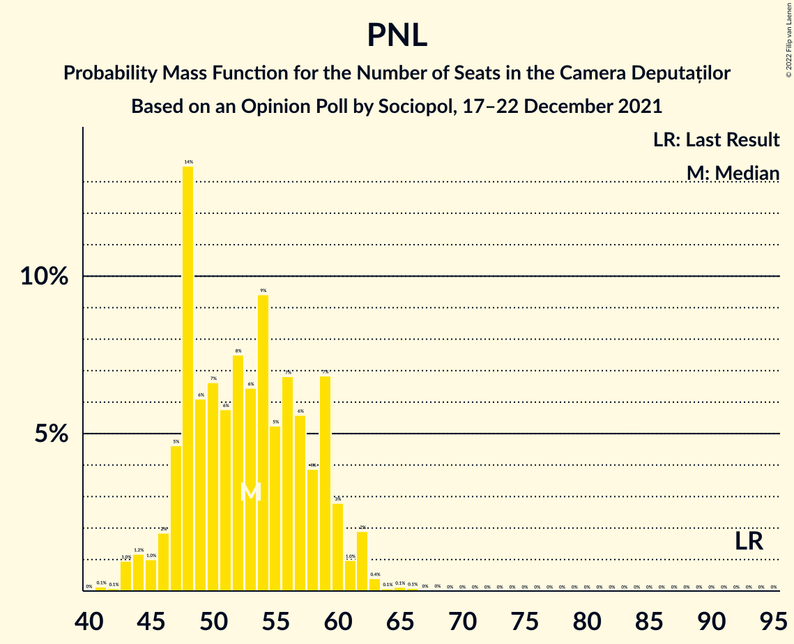

| Number of Seats | Probability | Accumulated | Special Marks |
|:---------------:|:-----------:|:-----------:|:-------------:|
| 41 | 0.1% | 100% |  |
| 42 | 0.1% | 99.8% |  |
| 43 | 1.0% | 99.8% |  |
| 44 | 1.2% | 98.8% |  |
| 45 | 1.0% | 98% |  |
| 46 | 2% | 97% |  |
| 47 | 5% | 95% |  |
| 48 | 14% | 90% |  |
| 49 | 6% | 77% |  |
| 50 | 7% | 71% |  |
| 51 | 6% | 64% |  |
| 52 | 8% | 58% |  |
| 53 | 6% | 51% | Median |
| 54 | 9% | 44% |  |
| 55 | 5% | 35% |  |
| 56 | 7% | 30% |  |
| 57 | 6% | 23% |  |
| 58 | 4% | 17% |  |
| 59 | 7% | 13% |  |
| 60 | 3% | 6% |  |
| 61 | 1.0% | 4% |  |
| 62 | 2% | 3% |  |
| 63 | 0.4% | 0.8% |  |
| 64 | 0.1% | 0.4% |  |
| 65 | 0.1% | 0.3% |  |
| 66 | 0.1% | 0.2% |  |
| 67 | 0% | 0.1% |  |
| 68 | 0% | 0% |  |
| 69 | 0% | 0% |  |
| 70 | 0% | 0% |  |
| 71 | 0% | 0% |  |
| 72 | 0% | 0% |  |
| 73 | 0% | 0% |  |
| 74 | 0% | 0% |  |
| 75 | 0% | 0% |  |
| 76 | 0% | 0% |  |
| 77 | 0% | 0% |  |
| 78 | 0% | 0% |  |
| 79 | 0% | 0% |  |
| 80 | 0% | 0% |  |
| 81 | 0% | 0% |  |
| 82 | 0% | 0% |  |
| 83 | 0% | 0% |  |
| 84 | 0% | 0% |  |
| 85 | 0% | 0% |  |
| 86 | 0% | 0% |  |
| 87 | 0% | 0% |  |
| 88 | 0% | 0% |  |
| 89 | 0% | 0% |  |
| 90 | 0% | 0% |  |
| 91 | 0% | 0% |  |
| 92 | 0% | 0% |  |
| 93 | 0% | 0% | Last Result |

### Alianța 2020 USR-PLUS – Partidul Mișcarea Populară

| Number of Seats | Probability | Accumulated | Special Marks |
|:---------------:|:-----------:|:-----------:|:-------------:|
| 31 | 0% | 100% |  |
| 32 | 0.1% | 99.9% |  |
| 33 | 0.3% | 99.9% |  |
| 34 | 0.4% | 99.6% |  |
| 35 | 1.2% | 99.2% |  |
| 36 | 5% | 98% |  |
| 37 | 4% | 93% |  |
| 38 | 4% | 90% |  |
| 39 | 4% | 86% |  |
| 40 | 5% | 81% |  |
| 41 | 10% | 76% |  |
| 42 | 10% | 66% |  |
| 43 | 5% | 56% |  |
| 44 | 10% | 51% | Median |
| 45 | 13% | 41% |  |
| 46 | 5% | 28% |  |
| 47 | 7% | 23% |  |
| 48 | 7% | 16% |  |
| 49 | 6% | 9% |  |
| 50 | 1.0% | 2% |  |
| 51 | 0.5% | 2% |  |
| 52 | 0.3% | 1.0% |  |
| 53 | 0.2% | 0.7% |  |
| 54 | 0.4% | 0.5% |  |
| 55 | 0.1% | 0.1% | Last Result |
| 56 | 0% | 0.1% |  |
| 57 | 0% | 0% |  |

## Technical Information

### Opinion Poll

+ **Polling firm:** Sociopol
+ **Commissioner(s):** —
+ **Fieldwork period:** 17–22 December 2021

### Calculations

+ **Sample size:** 1001
+ **Simulations done:** 1,048,576
+ **Error estimate:** 1.34%

