# Opinion Poll by Avangarde, 15–23 December 2021

<a href="#voting-intentions">Voting Intentions</a> | <a href="#seats">Seats</a> | <a href="#coalitions">Coalitions</a> | <a href="#technical-information">Technical Information</a>

## Voting Intentions

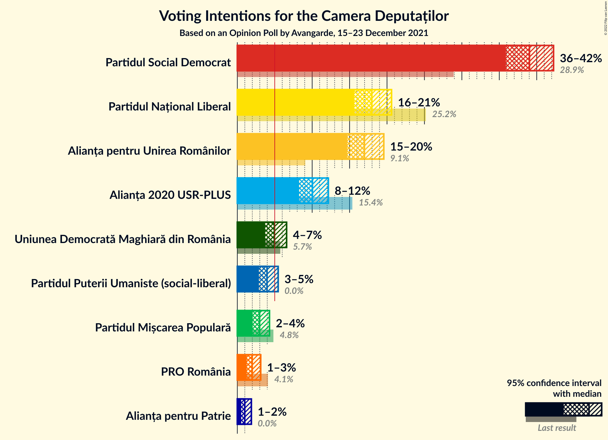

### Confidence Intervals

| Party | Last Result | Poll Result | 80% Confidence Interval | 90% Confidence Interval | 95% Confidence Interval | 99% Confidence Interval |
|:-----:|:-----------:|:-----------:|:-----------------------:|:-----------------------:|:-----------------------:|:-----------------------:|
| Partidul Social Democrat | 28.9% | 39.0% | 37.0–41.1% |36.4–41.7% |35.9–42.2% |34.9–43.3% |
| Partidul Național Liberal | 25.2% | 18.0% | 16.4–19.7% |16.0–20.2% |15.6–20.6% |14.9–21.5% |
| Alianța pentru Unirea Românilor | 9.1% | 17.0% | 15.5–18.7% |15.0–19.1% |14.7–19.6% |14.0–20.4% |
| Alianța 2020 USR-PLUS | 15.4% | 10.0% | 8.9–11.4% |8.5–11.8% |8.2–12.2% |7.7–12.9% |
| Uniunea Democrată Maghiară din România | 5.7% | 5.0% | 4.1–6.0% |3.9–6.3% |3.7–6.6% |3.4–7.1% |
| Partidul Puterii Umaniste (social-liberal) | 0.0% | 4.0% | 3.2–4.9% |3.0–5.2% |2.9–5.5% |2.6–6.0% |
| Partidul Mișcarea Populară | 4.8% | 3.0% | 2.4–3.8% |2.2–4.1% |2.1–4.3% |1.8–4.8% |
| PRO România | 4.1% | 2.0% | 1.5–2.7% |1.4–2.9% |1.2–3.1% |1.1–3.5% |
| Alianța pentru Patrie | 0.0% | 1.0% | 0.7–1.6% |0.6–1.7% |0.5–1.9% |0.4–2.2% |

*Note:* The poll result column reflects the actual value used in the calculations. Published results may vary slightly, and in addition be rounded to fewer digits.

## Seats

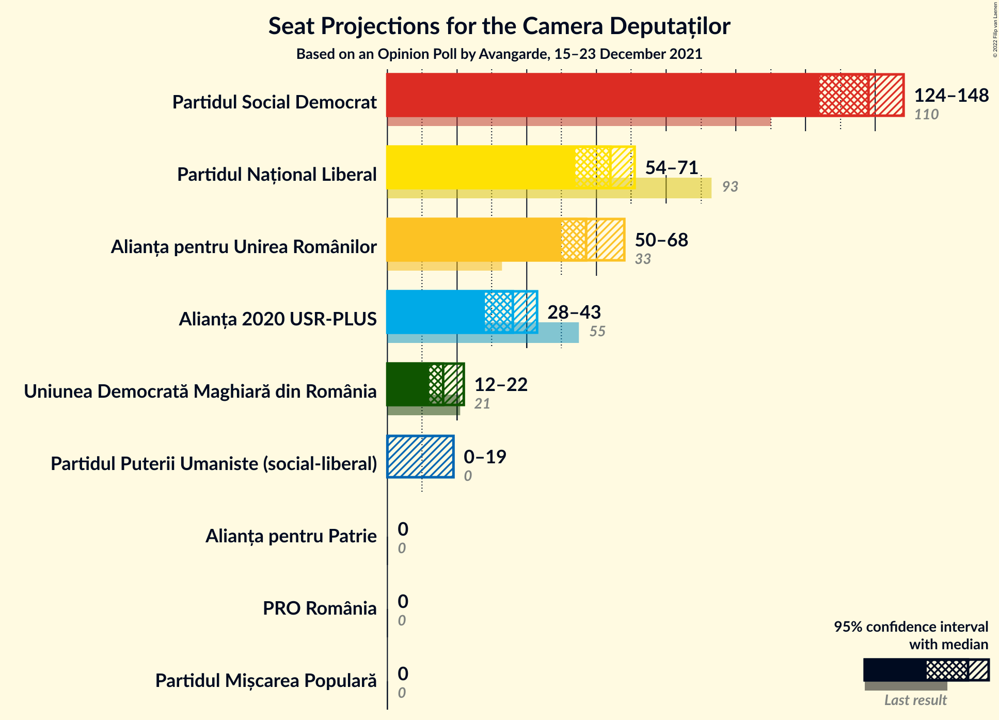

### Confidence Intervals

| Party | Last Result | Median | 80% Confidence Interval | 90% Confidence Interval | 95% Confidence Interval | 99% Confidence Interval |
|:-----:|:-----------:|:------:|:-----------------------:|:-----------------------:|:-----------------------:|:-----------------------:|
| <a href="#partidul-social-democrat">Partidul Social Democrat</a> | 110 | 138 | 129–145 |127–147 |124–148 |120–152 |
| <a href="#partidul-național-liberal">Partidul Național Liberal</a> | 93 | 64 | 57–68 |55–70 |54–71 |51–75 |
| <a href="#alianța-pentru-unirea-românilor">Alianța pentru Unirea Românilor</a> | 33 | 57 | 52–64 |52–67 |50–68 |48–71 |
| <a href="#alianța-2020-usr-plus">Alianța 2020 USR-PLUS</a> | 55 | 36 | 31–39 |29–40 |28–43 |0–45 |
| <a href="#uniunea-democrată-maghiară-din-românia">Uniunea Democrată Maghiară din România</a> | 21 | 16 | 14–19 |13–21 |12–22 |11–24 |
| <a href="#partidul-puterii-umaniste-(social-liberal)">Partidul Puterii Umaniste (social-liberal)</a> | 0 | 0 | 0–17 |0–18 |0–19 |0–20 |
| <a href="#partidul-mișcarea-populară">Partidul Mișcarea Populară</a> | 0 | 0 | 0 |0 |0 |0 |
| <a href="#pro-românia">PRO România</a> | 0 | 0 | 0 |0 |0 |0 |
| <a href="#alianța-pentru-patrie">Alianța pentru Patrie</a> | 0 | 0 | 0 |0 |0 |0 |

### Partidul Social Democrat

*For a full overview of the results for this party, see the [Partidul Social Democrat](party-partidulsocialdemocrat.html) page.*

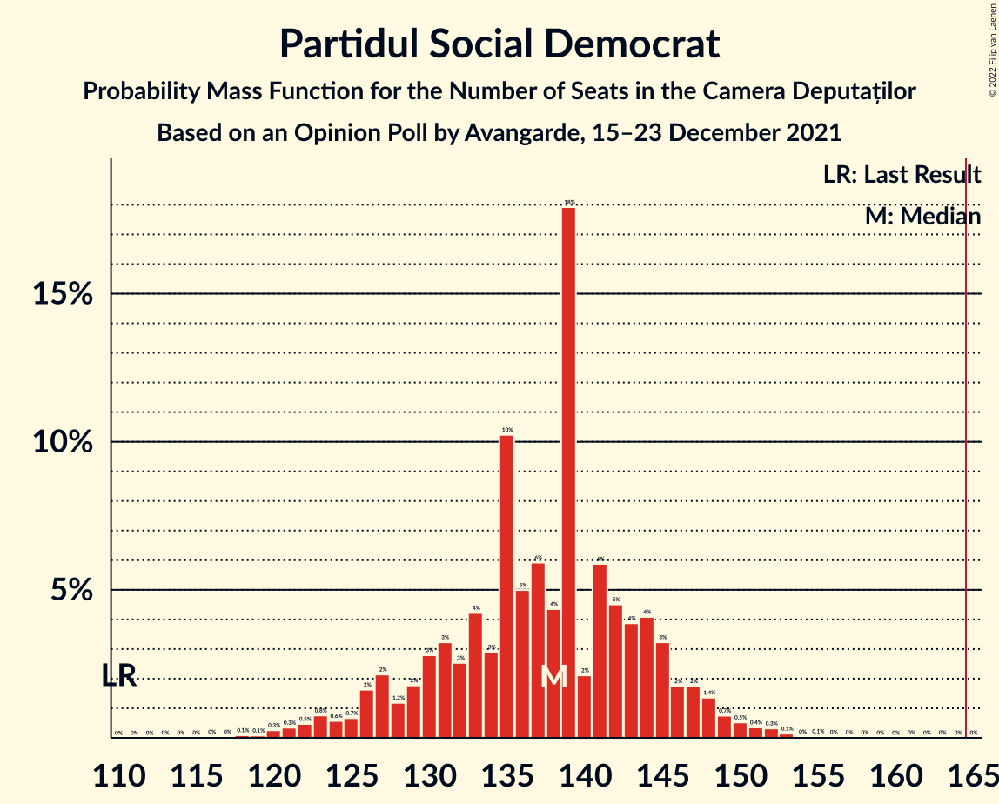

| Number of Seats | Probability | Accumulated | Special Marks |
|:---------------:|:-----------:|:-----------:|:-------------:|
| 110 | 0% | 100% | Last Result |
| 111 | 0% | 100% |  |
| 112 | 0% | 100% |  |
| 113 | 0% | 100% |  |
| 114 | 0% | 100% |  |
| 115 | 0% | 100% |  |
| 116 | 0% | 100% |  |
| 117 | 0% | 99.9% |  |
| 118 | 0.1% | 99.9% |  |
| 119 | 0.1% | 99.8% |  |
| 120 | 0.3% | 99.7% |  |
| 121 | 0.3% | 99.5% |  |
| 122 | 0.5% | 99.1% |  |
| 123 | 0.8% | 98.7% |  |
| 124 | 0.6% | 98% |  |
| 125 | 0.7% | 97% |  |
| 126 | 2% | 97% |  |
| 127 | 2% | 95% |  |
| 128 | 1.2% | 93% |  |
| 129 | 2% | 92% |  |
| 130 | 3% | 90% |  |
| 131 | 3% | 87% |  |
| 132 | 3% | 84% |  |
| 133 | 4% | 81% |  |
| 134 | 3% | 77% |  |
| 135 | 10% | 74% |  |
| 136 | 5% | 64% |  |
| 137 | 6% | 59% |  |
| 138 | 4% | 53% | Median |
| 139 | 18% | 49% |  |
| 140 | 2% | 31% |  |
| 141 | 6% | 29% |  |
| 142 | 5% | 23% |  |
| 143 | 4% | 18% |  |
| 144 | 4% | 14% |  |
| 145 | 3% | 10% |  |
| 146 | 2% | 7% |  |
| 147 | 2% | 5% |  |
| 148 | 1.4% | 4% |  |
| 149 | 0.7% | 2% |  |
| 150 | 0.5% | 2% |  |
| 151 | 0.4% | 1.0% |  |
| 152 | 0.3% | 0.7% |  |
| 153 | 0.1% | 0.4% |  |
| 154 | 0% | 0.2% |  |
| 155 | 0.1% | 0.2% |  |
| 156 | 0% | 0.1% |  |
| 157 | 0% | 0.1% |  |
| 158 | 0% | 0.1% |  |
| 159 | 0% | 0.1% |  |
| 160 | 0% | 0.1% |  |
| 161 | 0% | 0.1% |  |
| 162 | 0% | 0.1% |  |
| 163 | 0% | 0% |  |

### Partidul Național Liberal

*For a full overview of the results for this party, see the [Partidul Național Liberal](party-partidulnaționalliberal.html) page.*

| Number of Seats | Probability | Accumulated | Special Marks |
|:---------------:|:-----------:|:-----------:|:-------------:|
| 48 | 0% | 100% |  |
| 49 | 0.1% | 99.9% |  |
| 50 | 0.1% | 99.9% |  |
| 51 | 0.4% | 99.8% |  |
| 52 | 0.4% | 99.4% |  |
| 53 | 1.1% | 99.0% |  |
| 54 | 0.8% | 98% |  |
| 55 | 2% | 97% |  |
| 56 | 2% | 95% |  |
| 57 | 4% | 93% |  |
| 58 | 4% | 89% |  |
| 59 | 5% | 85% |  |
| 60 | 7% | 79% |  |
| 61 | 3% | 72% |  |
| 62 | 11% | 69% |  |
| 63 | 5% | 58% |  |
| 64 | 10% | 53% | Median |
| 65 | 5% | 44% |  |
| 66 | 13% | 39% |  |
| 67 | 5% | 25% |  |
| 68 | 11% | 20% |  |
| 69 | 3% | 9% |  |
| 70 | 3% | 6% |  |
| 71 | 0.7% | 3% |  |
| 72 | 0.8% | 2% |  |
| 73 | 0.3% | 1.3% |  |
| 74 | 0.3% | 0.9% |  |
| 75 | 0.3% | 0.6% |  |
| 76 | 0.1% | 0.4% |  |
| 77 | 0.1% | 0.3% |  |
| 78 | 0.1% | 0.2% |  |
| 79 | 0% | 0.1% |  |
| 80 | 0% | 0.1% |  |
| 81 | 0.1% | 0.1% |  |
| 82 | 0% | 0% |  |
| 83 | 0% | 0% |  |
| 84 | 0% | 0% |  |
| 85 | 0% | 0% |  |
| 86 | 0% | 0% |  |
| 87 | 0% | 0% |  |
| 88 | 0% | 0% |  |
| 89 | 0% | 0% |  |
| 90 | 0% | 0% |  |
| 91 | 0% | 0% |  |
| 92 | 0% | 0% |  |
| 93 | 0% | 0% | Last Result |

### Alianța pentru Unirea Românilor

*For a full overview of the results for this party, see the [Alianța pentru Unirea Românilor](party-alianțapentruunirearomânilor.html) page.*

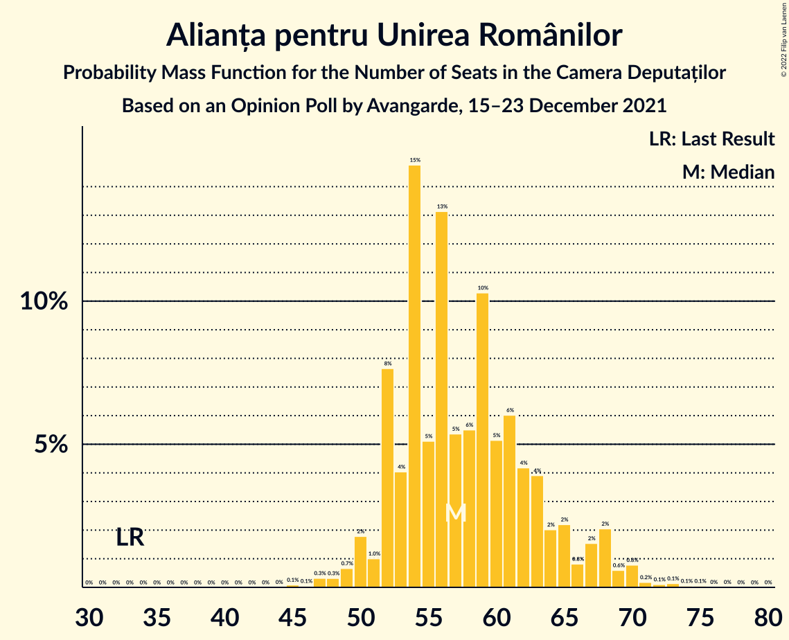

| Number of Seats | Probability | Accumulated | Special Marks |
|:---------------:|:-----------:|:-----------:|:-------------:|
| 33 | 0% | 100% | Last Result |
| 34 | 0% | 100% |  |
| 35 | 0% | 100% |  |
| 36 | 0% | 100% |  |
| 37 | 0% | 100% |  |
| 38 | 0% | 100% |  |
| 39 | 0% | 100% |  |
| 40 | 0% | 100% |  |
| 41 | 0% | 100% |  |
| 42 | 0% | 100% |  |
| 43 | 0% | 100% |  |
| 44 | 0% | 100% |  |
| 45 | 0.1% | 100% |  |
| 46 | 0.1% | 99.9% |  |
| 47 | 0.3% | 99.8% |  |
| 48 | 0.3% | 99.5% |  |
| 49 | 0.7% | 99.2% |  |
| 50 | 2% | 98.5% |  |
| 51 | 1.0% | 97% |  |
| 52 | 8% | 96% |  |
| 53 | 4% | 88% |  |
| 54 | 15% | 84% |  |
| 55 | 5% | 69% |  |
| 56 | 13% | 64% |  |
| 57 | 5% | 51% | Median |
| 58 | 6% | 46% |  |
| 59 | 10% | 40% |  |
| 60 | 5% | 30% |  |
| 61 | 6% | 25% |  |
| 62 | 4% | 19% |  |
| 63 | 4% | 15% |  |
| 64 | 2% | 11% |  |
| 65 | 2% | 9% |  |
| 66 | 0.8% | 6% |  |
| 67 | 2% | 6% |  |
| 68 | 2% | 4% |  |
| 69 | 0.6% | 2% |  |
| 70 | 0.8% | 1.4% |  |
| 71 | 0.2% | 0.6% |  |
| 72 | 0.1% | 0.4% |  |
| 73 | 0.1% | 0.3% |  |
| 74 | 0.1% | 0.2% |  |
| 75 | 0.1% | 0.1% |  |
| 76 | 0% | 0% |  |

### Alianța 2020 USR-PLUS

*For a full overview of the results for this party, see the [Alianța 2020 USR-PLUS](party-alianța2020usr-plus.html) page.*

| Number of Seats | Probability | Accumulated | Special Marks |
|:---------------:|:-----------:|:-----------:|:-------------:|
| 0 | 0.6% | 100% |  |
| 1 | 0% | 99.4% |  |
| 2 | 0% | 99.4% |  |
| 3 | 0% | 99.4% |  |
| 4 | 0% | 99.4% |  |
| 5 | 0% | 99.4% |  |
| 6 | 0% | 99.4% |  |
| 7 | 0% | 99.4% |  |
| 8 | 0% | 99.4% |  |
| 9 | 0% | 99.4% |  |
| 10 | 0% | 99.4% |  |
| 11 | 0% | 99.4% |  |
| 12 | 0% | 99.4% |  |
| 13 | 0% | 99.4% |  |
| 14 | 0% | 99.4% |  |
| 15 | 0% | 99.4% |  |
| 16 | 0% | 99.4% |  |
| 17 | 0% | 99.4% |  |
| 18 | 0% | 99.4% |  |
| 19 | 0% | 99.4% |  |
| 20 | 0% | 99.4% |  |
| 21 | 0% | 99.4% |  |
| 22 | 0% | 99.4% |  |
| 23 | 0% | 99.4% |  |
| 24 | 0% | 99.4% |  |
| 25 | 0% | 99.4% |  |
| 26 | 0% | 99.4% |  |
| 27 | 0.2% | 99.4% |  |
| 28 | 2% | 99.2% |  |
| 29 | 3% | 97% |  |
| 30 | 3% | 94% |  |
| 31 | 7% | 91% |  |
| 32 | 9% | 84% |  |
| 33 | 5% | 75% |  |
| 34 | 2% | 70% |  |
| 35 | 6% | 68% |  |
| 36 | 18% | 61% | Median |
| 37 | 23% | 43% |  |
| 38 | 4% | 20% |  |
| 39 | 8% | 16% |  |
| 40 | 4% | 8% |  |
| 41 | 1.0% | 4% |  |
| 42 | 0.2% | 3% |  |
| 43 | 0.9% | 3% |  |
| 44 | 1.1% | 2% |  |
| 45 | 0.4% | 0.7% |  |
| 46 | 0.2% | 0.3% |  |
| 47 | 0.1% | 0.1% |  |
| 48 | 0.1% | 0.1% |  |
| 49 | 0% | 0% |  |
| 50 | 0% | 0% |  |
| 51 | 0% | 0% |  |
| 52 | 0% | 0% |  |
| 53 | 0% | 0% |  |
| 54 | 0% | 0% |  |
| 55 | 0% | 0% | Last Result |

### Uniunea Democrată Maghiară din România

*For a full overview of the results for this party, see the [Uniunea Democrată Maghiară din România](party-uniuneademocratămaghiarădinromânia.html) page.*

| Number of Seats | Probability | Accumulated | Special Marks |
|:---------------:|:-----------:|:-----------:|:-------------:|
| 10 | 0.1% | 100% |  |
| 11 | 0.5% | 99.8% |  |
| 12 | 2% | 99.3% |  |
| 13 | 4% | 97% |  |
| 14 | 9% | 92% |  |
| 15 | 18% | 83% |  |
| 16 | 23% | 65% | Median |
| 17 | 16% | 42% |  |
| 18 | 8% | 26% |  |
| 19 | 8% | 18% |  |
| 20 | 3% | 10% |  |
| 21 | 3% | 6% | Last Result |
| 22 | 2% | 4% |  |
| 23 | 0.8% | 2% |  |
| 24 | 0.5% | 0.9% |  |
| 25 | 0.2% | 0.5% |  |
| 26 | 0.1% | 0.2% |  |
| 27 | 0.1% | 0.1% |  |
| 28 | 0% | 0.1% |  |
| 29 | 0% | 0% |  |

### Partidul Puterii Umaniste (social-liberal)

*For a full overview of the results for this party, see the [Partidul Puterii Umaniste (social-liberal)](party-partidulputeriiumanistesocial-liberal.html) page.*

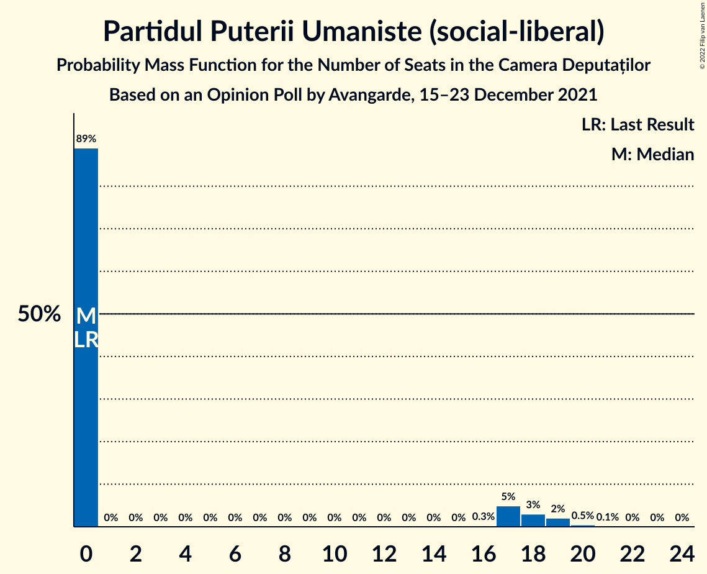

| Number of Seats | Probability | Accumulated | Special Marks |
|:---------------:|:-----------:|:-----------:|:-------------:|
| 0 | 89% | 100% | Last Result, Median |
| 1 | 0% | 11% |  |
| 2 | 0% | 11% |  |
| 3 | 0% | 11% |  |
| 4 | 0% | 11% |  |
| 5 | 0% | 11% |  |
| 6 | 0% | 11% |  |
| 7 | 0% | 11% |  |
| 8 | 0% | 11% |  |
| 9 | 0% | 11% |  |
| 10 | 0% | 11% |  |
| 11 | 0% | 11% |  |
| 12 | 0% | 11% |  |
| 13 | 0% | 11% |  |
| 14 | 0% | 11% |  |
| 15 | 0% | 11% |  |
| 16 | 0.3% | 11% |  |
| 17 | 5% | 11% |  |
| 18 | 3% | 6% |  |
| 19 | 2% | 3% |  |
| 20 | 0.5% | 0.7% |  |
| 21 | 0.1% | 0.2% |  |
| 22 | 0% | 0.1% |  |
| 23 | 0% | 0% |  |

### Partidul Mișcarea Populară

*For a full overview of the results for this party, see the [Partidul Mișcarea Populară](party-partidulmișcareapopulară.html) page.*

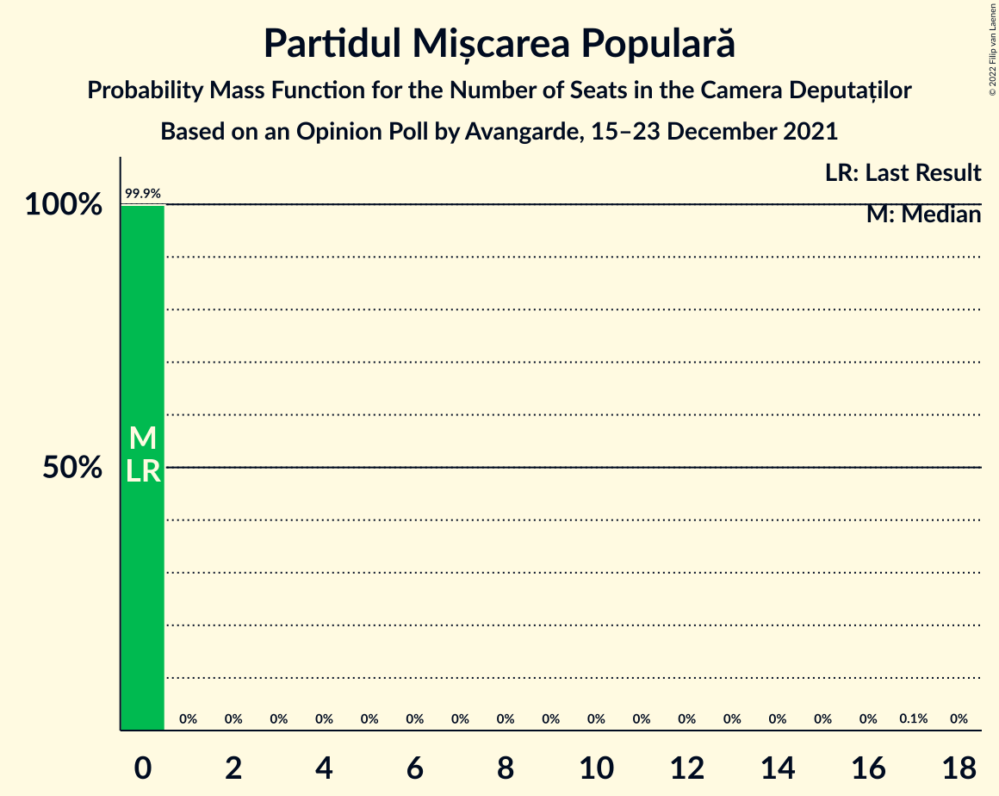

| Number of Seats | Probability | Accumulated | Special Marks |
|:---------------:|:-----------:|:-----------:|:-------------:|
| 0 | 99.9% | 100% | Last Result, Median |
| 1 | 0% | 0.1% |  |
| 2 | 0% | 0.1% |  |
| 3 | 0% | 0.1% |  |
| 4 | 0% | 0.1% |  |
| 5 | 0% | 0.1% |  |
| 6 | 0% | 0.1% |  |
| 7 | 0% | 0.1% |  |
| 8 | 0% | 0.1% |  |
| 9 | 0% | 0.1% |  |
| 10 | 0% | 0.1% |  |
| 11 | 0% | 0.1% |  |
| 12 | 0% | 0.1% |  |
| 13 | 0% | 0.1% |  |
| 14 | 0% | 0.1% |  |
| 15 | 0% | 0.1% |  |
| 16 | 0% | 0.1% |  |
| 17 | 0.1% | 0.1% |  |
| 18 | 0% | 0% |  |

### PRO România

*For a full overview of the results for this party, see the [PRO România](party-proromânia.html) page.*

| Number of Seats | Probability | Accumulated | Special Marks |
|:---------------:|:-----------:|:-----------:|:-------------:|
| 0 | 100% | 100% | Last Result, Median |

### Alianța pentru Patrie

*For a full overview of the results for this party, see the [Alianța pentru Patrie](party-alianțapentrupatrie.html) page.*

| Number of Seats | Probability | Accumulated | Special Marks |
|:---------------:|:-----------:|:-----------:|:-------------:|
| 0 | 100% | 100% | Last Result, Median |

## Coalitions

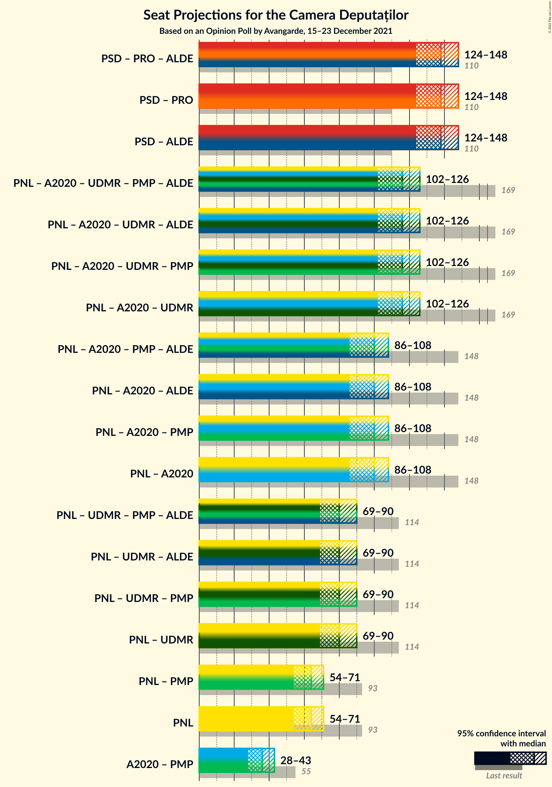

### Confidence Intervals

| Coalition | Last Result | Median | Majority? | 80% Confidence Interval | 90% Confidence Interval | 95% Confidence Interval | 99% Confidence Interval |
|:---------:|:-----------:|:------:|:---------:|:-----------------------:|:-----------------------:|:-----------------------:|:-----------------------:|
| Partidul Social Democrat – PRO România | 110 | 138 | 0% | 129–145 | 127–147 | 124–148 | 120–152 |
| Partidul Național Liberal – Alianța 2020 USR-PLUS – Uniunea Democrată Maghiară din România – Partidul Mișcarea Populară | 169 | 116 | 0% | 106–122 | 104–124 | 102–126 | 95–129 |
| Partidul Național Liberal – Alianța 2020 USR-PLUS – Uniunea Democrată Maghiară din România | 169 | 116 | 0% | 106–122 | 104–124 | 102–126 | 95–129 |
| Partidul Național Liberal – Alianța 2020 USR-PLUS – Partidul Mișcarea Populară | 148 | 100 | 0% | 90–104 | 88–106 | 86–108 | 78–112 |
| Partidul Național Liberal – Alianța 2020 USR-PLUS | 148 | 100 | 0% | 90–104 | 88–106 | 86–108 | 78–111 |
| Partidul Național Liberal – Uniunea Democrată Maghiară din România – Partidul Mișcarea Populară | 114 | 80 | 0% | 73–86 | 71–88 | 69–90 | 66–93 |
| Partidul Național Liberal – Uniunea Democrată Maghiară din România | 114 | 80 | 0% | 73–86 | 71–88 | 69–90 | 66–93 |
| Partidul Național Liberal – Partidul Mișcarea Populară | 93 | 64 | 0% | 57–68 | 55–70 | 54–71 | 51–75 |
| Partidul Național Liberal | 93 | 64 | 0% | 57–68 | 55–70 | 54–71 | 51–75 |
| Alianța 2020 USR-PLUS – Partidul Mișcarea Populară | 55 | 36 | 0% | 31–39 | 29–40 | 28–43 | 0–45 |

### Partidul Social Democrat – PRO România

| Number of Seats | Probability | Accumulated | Special Marks |
|:---------------:|:-----------:|:-----------:|:-------------:|
| 110 | 0% | 100% | Last Result |
| 111 | 0% | 100% |  |
| 112 | 0% | 100% |  |
| 113 | 0% | 100% |  |
| 114 | 0% | 100% |  |
| 115 | 0% | 100% |  |
| 116 | 0% | 100% |  |
| 117 | 0% | 99.9% |  |
| 118 | 0.1% | 99.9% |  |
| 119 | 0.1% | 99.8% |  |
| 120 | 0.3% | 99.7% |  |
| 121 | 0.3% | 99.5% |  |
| 122 | 0.5% | 99.1% |  |
| 123 | 0.8% | 98.7% |  |
| 124 | 0.6% | 98% |  |
| 125 | 0.7% | 97% |  |
| 126 | 2% | 97% |  |
| 127 | 2% | 95% |  |
| 128 | 1.2% | 93% |  |
| 129 | 2% | 92% |  |
| 130 | 3% | 90% |  |
| 131 | 3% | 87% |  |
| 132 | 3% | 84% |  |
| 133 | 4% | 81% |  |
| 134 | 3% | 77% |  |
| 135 | 10% | 74% |  |
| 136 | 5% | 64% |  |
| 137 | 6% | 59% |  |
| 138 | 4% | 53% | Median |
| 139 | 18% | 49% |  |
| 140 | 2% | 31% |  |
| 141 | 6% | 29% |  |
| 142 | 5% | 23% |  |
| 143 | 4% | 18% |  |
| 144 | 4% | 14% |  |
| 145 | 3% | 10% |  |
| 146 | 2% | 7% |  |
| 147 | 2% | 5% |  |
| 148 | 1.4% | 4% |  |
| 149 | 0.7% | 2% |  |
| 150 | 0.5% | 2% |  |
| 151 | 0.4% | 1.0% |  |
| 152 | 0.3% | 0.7% |  |
| 153 | 0.1% | 0.4% |  |
| 154 | 0% | 0.2% |  |
| 155 | 0.1% | 0.2% |  |
| 156 | 0% | 0.1% |  |
| 157 | 0% | 0.1% |  |
| 158 | 0% | 0.1% |  |
| 159 | 0% | 0.1% |  |
| 160 | 0% | 0.1% |  |
| 161 | 0% | 0.1% |  |
| 162 | 0% | 0.1% |  |
| 163 | 0% | 0% |  |

### Partidul Național Liberal – Alianța 2020 USR-PLUS – Uniunea Democrată Maghiară din România – Partidul Mișcarea Populară

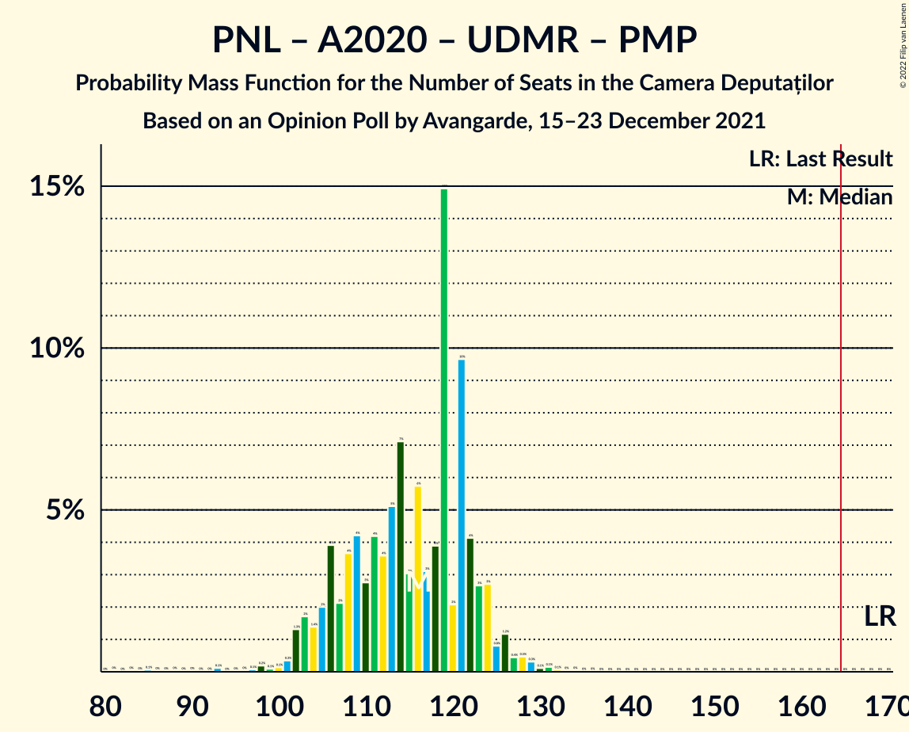

| Number of Seats | Probability | Accumulated | Special Marks |
|:---------------:|:-----------:|:-----------:|:-------------:|
| 81 | 0% | 100% |  |
| 82 | 0% | 99.9% |  |
| 83 | 0% | 99.9% |  |
| 84 | 0% | 99.9% |  |
| 85 | 0.1% | 99.9% |  |
| 86 | 0% | 99.8% |  |
| 87 | 0% | 99.8% |  |
| 88 | 0% | 99.7% |  |
| 89 | 0% | 99.7% |  |
| 90 | 0% | 99.7% |  |
| 91 | 0% | 99.7% |  |
| 92 | 0% | 99.6% |  |
| 93 | 0.1% | 99.6% |  |
| 94 | 0% | 99.5% |  |
| 95 | 0% | 99.5% |  |
| 96 | 0% | 99.5% |  |
| 97 | 0.1% | 99.5% |  |
| 98 | 0.2% | 99.4% |  |
| 99 | 0.1% | 99.2% |  |
| 100 | 0.1% | 99.1% |  |
| 101 | 0.3% | 99.0% |  |
| 102 | 1.3% | 98.6% |  |
| 103 | 2% | 97% |  |
| 104 | 1.4% | 96% |  |
| 105 | 2% | 94% |  |
| 106 | 4% | 92% |  |
| 107 | 2% | 88% |  |
| 108 | 4% | 86% |  |
| 109 | 4% | 83% |  |
| 110 | 3% | 78% |  |
| 111 | 4% | 76% |  |
| 112 | 4% | 71% |  |
| 113 | 5% | 68% |  |
| 114 | 7% | 63% |  |
| 115 | 3% | 56% |  |
| 116 | 6% | 53% | Median |
| 117 | 3% | 47% |  |
| 118 | 4% | 44% |  |
| 119 | 15% | 40% |  |
| 120 | 2% | 25% |  |
| 121 | 10% | 23% |  |
| 122 | 4% | 13% |  |
| 123 | 3% | 9% |  |
| 124 | 3% | 6% |  |
| 125 | 0.8% | 4% |  |
| 126 | 1.2% | 3% |  |
| 127 | 0.4% | 2% |  |
| 128 | 0.5% | 1.2% |  |
| 129 | 0.3% | 0.7% |  |
| 130 | 0.1% | 0.4% |  |
| 131 | 0.1% | 0.3% |  |
| 132 | 0.1% | 0.2% |  |
| 133 | 0% | 0.1% |  |
| 134 | 0% | 0.1% |  |
| 135 | 0% | 0% |  |
| 136 | 0% | 0% |  |
| 137 | 0% | 0% |  |
| 138 | 0% | 0% |  |
| 139 | 0% | 0% |  |
| 140 | 0% | 0% |  |
| 141 | 0% | 0% |  |
| 142 | 0% | 0% |  |
| 143 | 0% | 0% |  |
| 144 | 0% | 0% |  |
| 145 | 0% | 0% |  |
| 146 | 0% | 0% |  |
| 147 | 0% | 0% |  |
| 148 | 0% | 0% |  |
| 149 | 0% | 0% |  |
| 150 | 0% | 0% |  |
| 151 | 0% | 0% |  |
| 152 | 0% | 0% |  |
| 153 | 0% | 0% |  |
| 154 | 0% | 0% |  |
| 155 | 0% | 0% |  |
| 156 | 0% | 0% |  |
| 157 | 0% | 0% |  |
| 158 | 0% | 0% |  |
| 159 | 0% | 0% |  |
| 160 | 0% | 0% |  |
| 161 | 0% | 0% |  |
| 162 | 0% | 0% |  |
| 163 | 0% | 0% |  |
| 164 | 0% | 0% |  |
| 165 | 0% | 0% | Majority |
| 166 | 0% | 0% |  |
| 167 | 0% | 0% |  |
| 168 | 0% | 0% |  |
| 169 | 0% | 0% | Last Result |

### Partidul Național Liberal – Alianța 2020 USR-PLUS – Uniunea Democrată Maghiară din România

| Number of Seats | Probability | Accumulated | Special Marks |
|:---------------:|:-----------:|:-----------:|:-------------:|
| 81 | 0% | 100% |  |
| 82 | 0% | 99.9% |  |
| 83 | 0% | 99.9% |  |
| 84 | 0% | 99.9% |  |
| 85 | 0.1% | 99.9% |  |
| 86 | 0% | 99.8% |  |
| 87 | 0% | 99.8% |  |
| 88 | 0% | 99.7% |  |
| 89 | 0% | 99.7% |  |
| 90 | 0% | 99.7% |  |
| 91 | 0% | 99.7% |  |
| 92 | 0% | 99.6% |  |
| 93 | 0.1% | 99.6% |  |
| 94 | 0% | 99.5% |  |
| 95 | 0% | 99.5% |  |
| 96 | 0% | 99.5% |  |
| 97 | 0.1% | 99.4% |  |
| 98 | 0.2% | 99.4% |  |
| 99 | 0.1% | 99.2% |  |
| 100 | 0.1% | 99.1% |  |
| 101 | 0.3% | 99.0% |  |
| 102 | 1.3% | 98.6% |  |
| 103 | 2% | 97% |  |
| 104 | 1.4% | 96% |  |
| 105 | 2% | 94% |  |
| 106 | 4% | 92% |  |
| 107 | 2% | 88% |  |
| 108 | 4% | 86% |  |
| 109 | 4% | 82% |  |
| 110 | 3% | 78% |  |
| 111 | 4% | 75% |  |
| 112 | 4% | 71% |  |
| 113 | 5% | 68% |  |
| 114 | 7% | 63% |  |
| 115 | 3% | 55% |  |
| 116 | 6% | 52% | Median |
| 117 | 3% | 47% |  |
| 118 | 4% | 44% |  |
| 119 | 15% | 40% |  |
| 120 | 2% | 25% |  |
| 121 | 10% | 23% |  |
| 122 | 4% | 13% |  |
| 123 | 3% | 9% |  |
| 124 | 3% | 6% |  |
| 125 | 0.8% | 4% |  |
| 126 | 1.2% | 3% |  |
| 127 | 0.4% | 2% |  |
| 128 | 0.5% | 1.1% |  |
| 129 | 0.3% | 0.7% |  |
| 130 | 0.1% | 0.4% |  |
| 131 | 0.1% | 0.3% |  |
| 132 | 0% | 0.1% |  |
| 133 | 0% | 0.1% |  |
| 134 | 0% | 0.1% |  |
| 135 | 0% | 0% |  |
| 136 | 0% | 0% |  |
| 137 | 0% | 0% |  |
| 138 | 0% | 0% |  |
| 139 | 0% | 0% |  |
| 140 | 0% | 0% |  |
| 141 | 0% | 0% |  |
| 142 | 0% | 0% |  |
| 143 | 0% | 0% |  |
| 144 | 0% | 0% |  |
| 145 | 0% | 0% |  |
| 146 | 0% | 0% |  |
| 147 | 0% | 0% |  |
| 148 | 0% | 0% |  |
| 149 | 0% | 0% |  |
| 150 | 0% | 0% |  |
| 151 | 0% | 0% |  |
| 152 | 0% | 0% |  |
| 153 | 0% | 0% |  |
| 154 | 0% | 0% |  |
| 155 | 0% | 0% |  |
| 156 | 0% | 0% |  |
| 157 | 0% | 0% |  |
| 158 | 0% | 0% |  |
| 159 | 0% | 0% |  |
| 160 | 0% | 0% |  |
| 161 | 0% | 0% |  |
| 162 | 0% | 0% |  |
| 163 | 0% | 0% |  |
| 164 | 0% | 0% |  |
| 165 | 0% | 0% | Majority |
| 166 | 0% | 0% |  |
| 167 | 0% | 0% |  |
| 168 | 0% | 0% |  |
| 169 | 0% | 0% | Last Result |

### Partidul Național Liberal – Alianța 2020 USR-PLUS – Partidul Mișcarea Populară

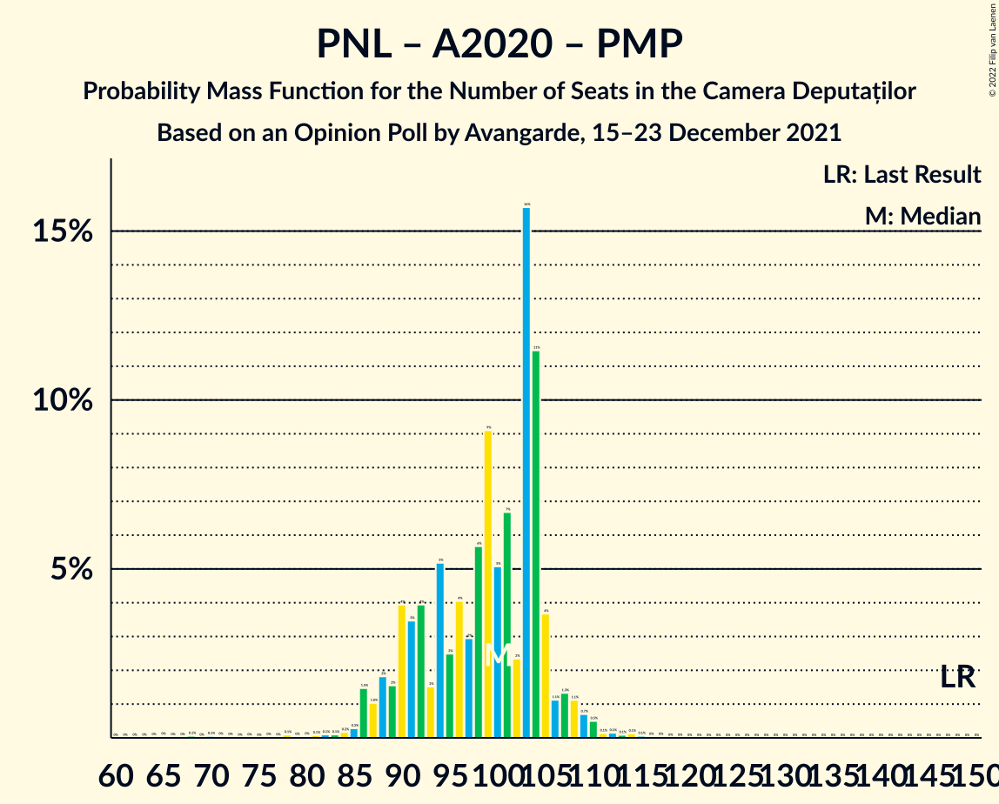

| Number of Seats | Probability | Accumulated | Special Marks |
|:---------------:|:-----------:|:-----------:|:-------------:|
| 64 | 0% | 100% |  |
| 65 | 0% | 99.9% |  |
| 66 | 0% | 99.9% |  |
| 67 | 0% | 99.9% |  |
| 68 | 0.1% | 99.8% |  |
| 69 | 0% | 99.8% |  |
| 70 | 0.1% | 99.8% |  |
| 71 | 0% | 99.7% |  |
| 72 | 0% | 99.7% |  |
| 73 | 0% | 99.6% |  |
| 74 | 0% | 99.6% |  |
| 75 | 0% | 99.6% |  |
| 76 | 0% | 99.6% |  |
| 77 | 0% | 99.6% |  |
| 78 | 0.1% | 99.5% |  |
| 79 | 0% | 99.4% |  |
| 80 | 0% | 99.4% |  |
| 81 | 0.1% | 99.4% |  |
| 82 | 0.1% | 99.3% |  |
| 83 | 0.1% | 99.2% |  |
| 84 | 0.2% | 99.1% |  |
| 85 | 0.3% | 98.9% |  |
| 86 | 1.5% | 98.6% |  |
| 87 | 1.0% | 97% |  |
| 88 | 2% | 96% |  |
| 89 | 2% | 94% |  |
| 90 | 4% | 93% |  |
| 91 | 3% | 89% |  |
| 92 | 4% | 85% |  |
| 93 | 2% | 81% |  |
| 94 | 5% | 80% |  |
| 95 | 2% | 75% |  |
| 96 | 4% | 72% |  |
| 97 | 3% | 68% |  |
| 98 | 6% | 65% |  |
| 99 | 9% | 60% |  |
| 100 | 5% | 50% | Median |
| 101 | 7% | 45% |  |
| 102 | 2% | 39% |  |
| 103 | 16% | 36% |  |
| 104 | 11% | 21% |  |
| 105 | 4% | 9% |  |
| 106 | 1.1% | 5% |  |
| 107 | 1.3% | 4% |  |
| 108 | 1.1% | 3% |  |
| 109 | 0.7% | 2% |  |
| 110 | 0.5% | 1.2% |  |
| 111 | 0.1% | 0.7% |  |
| 112 | 0.1% | 0.5% |  |
| 113 | 0.1% | 0.4% |  |
| 114 | 0.1% | 0.3% |  |
| 115 | 0.1% | 0.2% |  |
| 116 | 0% | 0.1% |  |
| 117 | 0% | 0.1% |  |
| 118 | 0% | 0% |  |
| 119 | 0% | 0% |  |
| 120 | 0% | 0% |  |
| 121 | 0% | 0% |  |
| 122 | 0% | 0% |  |
| 123 | 0% | 0% |  |
| 124 | 0% | 0% |  |
| 125 | 0% | 0% |  |
| 126 | 0% | 0% |  |
| 127 | 0% | 0% |  |
| 128 | 0% | 0% |  |
| 129 | 0% | 0% |  |
| 130 | 0% | 0% |  |
| 131 | 0% | 0% |  |
| 132 | 0% | 0% |  |
| 133 | 0% | 0% |  |
| 134 | 0% | 0% |  |
| 135 | 0% | 0% |  |
| 136 | 0% | 0% |  |
| 137 | 0% | 0% |  |
| 138 | 0% | 0% |  |
| 139 | 0% | 0% |  |
| 140 | 0% | 0% |  |
| 141 | 0% | 0% |  |
| 142 | 0% | 0% |  |
| 143 | 0% | 0% |  |
| 144 | 0% | 0% |  |
| 145 | 0% | 0% |  |
| 146 | 0% | 0% |  |
| 147 | 0% | 0% |  |
| 148 | 0% | 0% | Last Result |

### Partidul Național Liberal – Alianța 2020 USR-PLUS

| Number of Seats | Probability | Accumulated | Special Marks |
|:---------------:|:-----------:|:-----------:|:-------------:|
| 64 | 0% | 100% |  |
| 65 | 0% | 99.9% |  |
| 66 | 0% | 99.9% |  |
| 67 | 0% | 99.9% |  |
| 68 | 0.1% | 99.8% |  |
| 69 | 0% | 99.8% |  |
| 70 | 0.1% | 99.8% |  |
| 71 | 0% | 99.7% |  |
| 72 | 0% | 99.7% |  |
| 73 | 0% | 99.6% |  |
| 74 | 0% | 99.6% |  |
| 75 | 0% | 99.6% |  |
| 76 | 0% | 99.6% |  |
| 77 | 0% | 99.6% |  |
| 78 | 0.1% | 99.5% |  |
| 79 | 0% | 99.4% |  |
| 80 | 0% | 99.4% |  |
| 81 | 0.1% | 99.4% |  |
| 82 | 0.1% | 99.3% |  |
| 83 | 0.1% | 99.2% |  |
| 84 | 0.2% | 99.1% |  |
| 85 | 0.3% | 98.9% |  |
| 86 | 1.5% | 98.6% |  |
| 87 | 1.1% | 97% |  |
| 88 | 2% | 96% |  |
| 89 | 2% | 94% |  |
| 90 | 4% | 93% |  |
| 91 | 3% | 89% |  |
| 92 | 4% | 85% |  |
| 93 | 2% | 81% |  |
| 94 | 5% | 80% |  |
| 95 | 2% | 75% |  |
| 96 | 4% | 72% |  |
| 97 | 3% | 68% |  |
| 98 | 6% | 65% |  |
| 99 | 9% | 59% |  |
| 100 | 5% | 50% | Median |
| 101 | 7% | 45% |  |
| 102 | 2% | 39% |  |
| 103 | 16% | 36% |  |
| 104 | 11% | 20% |  |
| 105 | 4% | 9% |  |
| 106 | 1.1% | 5% |  |
| 107 | 1.3% | 4% |  |
| 108 | 1.1% | 3% |  |
| 109 | 0.7% | 2% |  |
| 110 | 0.5% | 1.1% |  |
| 111 | 0.1% | 0.6% |  |
| 112 | 0.1% | 0.4% |  |
| 113 | 0.1% | 0.3% |  |
| 114 | 0.1% | 0.2% |  |
| 115 | 0% | 0.1% |  |
| 116 | 0% | 0.1% |  |
| 117 | 0% | 0% |  |
| 118 | 0% | 0% |  |
| 119 | 0% | 0% |  |
| 120 | 0% | 0% |  |
| 121 | 0% | 0% |  |
| 122 | 0% | 0% |  |
| 123 | 0% | 0% |  |
| 124 | 0% | 0% |  |
| 125 | 0% | 0% |  |
| 126 | 0% | 0% |  |
| 127 | 0% | 0% |  |
| 128 | 0% | 0% |  |
| 129 | 0% | 0% |  |
| 130 | 0% | 0% |  |
| 131 | 0% | 0% |  |
| 132 | 0% | 0% |  |
| 133 | 0% | 0% |  |
| 134 | 0% | 0% |  |
| 135 | 0% | 0% |  |
| 136 | 0% | 0% |  |
| 137 | 0% | 0% |  |
| 138 | 0% | 0% |  |
| 139 | 0% | 0% |  |
| 140 | 0% | 0% |  |
| 141 | 0% | 0% |  |
| 142 | 0% | 0% |  |
| 143 | 0% | 0% |  |
| 144 | 0% | 0% |  |
| 145 | 0% | 0% |  |
| 146 | 0% | 0% |  |
| 147 | 0% | 0% |  |
| 148 | 0% | 0% | Last Result |

### Partidul Național Liberal – Uniunea Democrată Maghiară din România – Partidul Mișcarea Populară

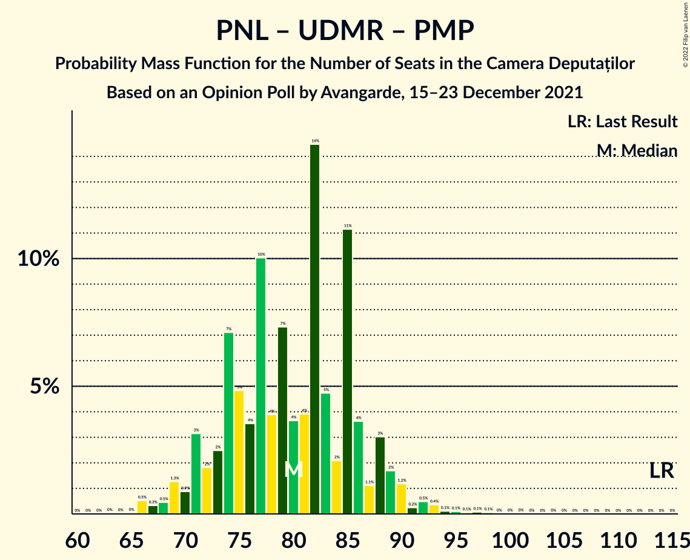

| Number of Seats | Probability | Accumulated | Special Marks |
|:---------------:|:-----------:|:-----------:|:-------------:|
| 64 | 0% | 100% |  |
| 65 | 0% | 99.9% |  |
| 66 | 0.5% | 99.9% |  |
| 67 | 0.3% | 99.4% |  |
| 68 | 0.5% | 99.0% |  |
| 69 | 1.3% | 98.6% |  |
| 70 | 0.9% | 97% |  |
| 71 | 3% | 96% |  |
| 72 | 2% | 93% |  |
| 73 | 2% | 91% |  |
| 74 | 7% | 89% |  |
| 75 | 5% | 82% |  |
| 76 | 4% | 77% |  |
| 77 | 10% | 73% |  |
| 78 | 4% | 63% |  |
| 79 | 7% | 60% |  |
| 80 | 4% | 52% | Median |
| 81 | 4% | 49% |  |
| 82 | 14% | 45% |  |
| 83 | 5% | 30% |  |
| 84 | 2% | 25% |  |
| 85 | 11% | 23% |  |
| 86 | 4% | 12% |  |
| 87 | 1.1% | 9% |  |
| 88 | 3% | 7% |  |
| 89 | 2% | 4% |  |
| 90 | 1.2% | 3% |  |
| 91 | 0.2% | 2% |  |
| 92 | 0.5% | 1.3% |  |
| 93 | 0.4% | 0.8% |  |
| 94 | 0.1% | 0.5% |  |
| 95 | 0.1% | 0.4% |  |
| 96 | 0.1% | 0.3% |  |
| 97 | 0.1% | 0.2% |  |
| 98 | 0.1% | 0.1% |  |
| 99 | 0% | 0.1% |  |
| 100 | 0% | 0.1% |  |
| 101 | 0% | 0.1% |  |
| 102 | 0% | 0% |  |
| 103 | 0% | 0% |  |
| 104 | 0% | 0% |  |
| 105 | 0% | 0% |  |
| 106 | 0% | 0% |  |
| 107 | 0% | 0% |  |
| 108 | 0% | 0% |  |
| 109 | 0% | 0% |  |
| 110 | 0% | 0% |  |
| 111 | 0% | 0% |  |
| 112 | 0% | 0% |  |
| 113 | 0% | 0% |  |
| 114 | 0% | 0% | Last Result |

### Partidul Național Liberal – Uniunea Democrată Maghiară din România

| Number of Seats | Probability | Accumulated | Special Marks |
|:---------------:|:-----------:|:-----------:|:-------------:|
| 64 | 0% | 100% |  |
| 65 | 0% | 99.9% |  |
| 66 | 0.5% | 99.9% |  |
| 67 | 0.3% | 99.4% |  |
| 68 | 0.5% | 99.0% |  |
| 69 | 1.3% | 98.6% |  |
| 70 | 0.9% | 97% |  |
| 71 | 3% | 96% |  |
| 72 | 2% | 93% |  |
| 73 | 3% | 91% |  |
| 74 | 7% | 89% |  |
| 75 | 5% | 82% |  |
| 76 | 4% | 77% |  |
| 77 | 10% | 73% |  |
| 78 | 4% | 63% |  |
| 79 | 7% | 59% |  |
| 80 | 4% | 52% | Median |
| 81 | 4% | 48% |  |
| 82 | 14% | 45% |  |
| 83 | 5% | 30% |  |
| 84 | 2% | 25% |  |
| 85 | 11% | 23% |  |
| 86 | 4% | 12% |  |
| 87 | 1.1% | 8% |  |
| 88 | 3% | 7% |  |
| 89 | 2% | 4% |  |
| 90 | 1.2% | 3% |  |
| 91 | 0.2% | 1.5% |  |
| 92 | 0.5% | 1.2% |  |
| 93 | 0.3% | 0.8% |  |
| 94 | 0.1% | 0.4% |  |
| 95 | 0.1% | 0.3% |  |
| 96 | 0% | 0.2% |  |
| 97 | 0.1% | 0.2% |  |
| 98 | 0.1% | 0.1% |  |
| 99 | 0% | 0.1% |  |
| 100 | 0% | 0% |  |
| 101 | 0% | 0% |  |
| 102 | 0% | 0% |  |
| 103 | 0% | 0% |  |
| 104 | 0% | 0% |  |
| 105 | 0% | 0% |  |
| 106 | 0% | 0% |  |
| 107 | 0% | 0% |  |
| 108 | 0% | 0% |  |
| 109 | 0% | 0% |  |
| 110 | 0% | 0% |  |
| 111 | 0% | 0% |  |
| 112 | 0% | 0% |  |
| 113 | 0% | 0% |  |
| 114 | 0% | 0% | Last Result |

### Partidul Național Liberal – Partidul Mișcarea Populară

| Number of Seats | Probability | Accumulated | Special Marks |
|:---------------:|:-----------:|:-----------:|:-------------:|
| 48 | 0% | 100% |  |
| 49 | 0.1% | 99.9% |  |
| 50 | 0.1% | 99.9% |  |
| 51 | 0.4% | 99.8% |  |
| 52 | 0.4% | 99.4% |  |
| 53 | 1.1% | 99.0% |  |
| 54 | 0.8% | 98% |  |
| 55 | 2% | 97% |  |
| 56 | 2% | 95% |  |
| 57 | 4% | 93% |  |
| 58 | 4% | 89% |  |
| 59 | 5% | 85% |  |
| 60 | 7% | 79% |  |
| 61 | 3% | 72% |  |
| 62 | 11% | 69% |  |
| 63 | 5% | 58% |  |
| 64 | 10% | 53% | Median |
| 65 | 5% | 44% |  |
| 66 | 13% | 39% |  |
| 67 | 5% | 26% |  |
| 68 | 11% | 20% |  |
| 69 | 3% | 9% |  |
| 70 | 3% | 6% |  |
| 71 | 0.7% | 3% |  |
| 72 | 0.8% | 2% |  |
| 73 | 0.3% | 1.4% |  |
| 74 | 0.3% | 1.0% |  |
| 75 | 0.3% | 0.7% |  |
| 76 | 0.1% | 0.5% |  |
| 77 | 0.1% | 0.4% |  |
| 78 | 0.1% | 0.3% |  |
| 79 | 0.1% | 0.2% |  |
| 80 | 0% | 0.1% |  |
| 81 | 0.1% | 0.1% |  |
| 82 | 0% | 0% |  |
| 83 | 0% | 0% |  |
| 84 | 0% | 0% |  |
| 85 | 0% | 0% |  |
| 86 | 0% | 0% |  |
| 87 | 0% | 0% |  |
| 88 | 0% | 0% |  |
| 89 | 0% | 0% |  |
| 90 | 0% | 0% |  |
| 91 | 0% | 0% |  |
| 92 | 0% | 0% |  |
| 93 | 0% | 0% | Last Result |

### Partidul Național Liberal

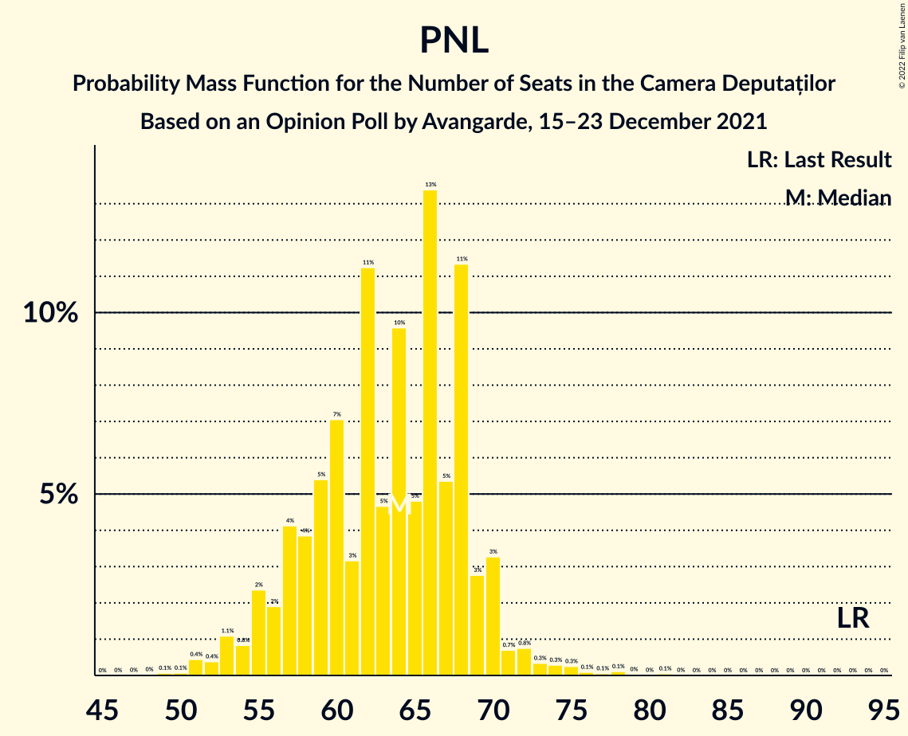

| Number of Seats | Probability | Accumulated | Special Marks |
|:---------------:|:-----------:|:-----------:|:-------------:|
| 48 | 0% | 100% |  |
| 49 | 0.1% | 99.9% |  |
| 50 | 0.1% | 99.9% |  |
| 51 | 0.4% | 99.8% |  |
| 52 | 0.4% | 99.4% |  |
| 53 | 1.1% | 99.0% |  |
| 54 | 0.8% | 98% |  |
| 55 | 2% | 97% |  |
| 56 | 2% | 95% |  |
| 57 | 4% | 93% |  |
| 58 | 4% | 89% |  |
| 59 | 5% | 85% |  |
| 60 | 7% | 79% |  |
| 61 | 3% | 72% |  |
| 62 | 11% | 69% |  |
| 63 | 5% | 58% |  |
| 64 | 10% | 53% | Median |
| 65 | 5% | 44% |  |
| 66 | 13% | 39% |  |
| 67 | 5% | 25% |  |
| 68 | 11% | 20% |  |
| 69 | 3% | 9% |  |
| 70 | 3% | 6% |  |
| 71 | 0.7% | 3% |  |
| 72 | 0.8% | 2% |  |
| 73 | 0.3% | 1.3% |  |
| 74 | 0.3% | 0.9% |  |
| 75 | 0.3% | 0.6% |  |
| 76 | 0.1% | 0.4% |  |
| 77 | 0.1% | 0.3% |  |
| 78 | 0.1% | 0.2% |  |
| 79 | 0% | 0.1% |  |
| 80 | 0% | 0.1% |  |
| 81 | 0.1% | 0.1% |  |
| 82 | 0% | 0% |  |
| 83 | 0% | 0% |  |
| 84 | 0% | 0% |  |
| 85 | 0% | 0% |  |
| 86 | 0% | 0% |  |
| 87 | 0% | 0% |  |
| 88 | 0% | 0% |  |
| 89 | 0% | 0% |  |
| 90 | 0% | 0% |  |
| 91 | 0% | 0% |  |
| 92 | 0% | 0% |  |
| 93 | 0% | 0% | Last Result |

### Alianța 2020 USR-PLUS – Partidul Mișcarea Populară

| Number of Seats | Probability | Accumulated | Special Marks |
|:---------------:|:-----------:|:-----------:|:-------------:|
| 0 | 0.6% | 100% |  |
| 1 | 0% | 99.4% |  |
| 2 | 0% | 99.4% |  |
| 3 | 0% | 99.4% |  |
| 4 | 0% | 99.4% |  |
| 5 | 0% | 99.4% |  |
| 6 | 0% | 99.4% |  |
| 7 | 0% | 99.4% |  |
| 8 | 0% | 99.4% |  |
| 9 | 0% | 99.4% |  |
| 10 | 0% | 99.4% |  |
| 11 | 0% | 99.4% |  |
| 12 | 0% | 99.4% |  |
| 13 | 0% | 99.4% |  |
| 14 | 0% | 99.4% |  |
| 15 | 0% | 99.4% |  |
| 16 | 0% | 99.4% |  |
| 17 | 0% | 99.4% |  |
| 18 | 0% | 99.4% |  |
| 19 | 0% | 99.4% |  |
| 20 | 0% | 99.4% |  |
| 21 | 0% | 99.4% |  |
| 22 | 0% | 99.4% |  |
| 23 | 0% | 99.4% |  |
| 24 | 0% | 99.4% |  |
| 25 | 0% | 99.4% |  |
| 26 | 0% | 99.4% |  |
| 27 | 0.2% | 99.4% |  |
| 28 | 2% | 99.2% |  |
| 29 | 3% | 97% |  |
| 30 | 3% | 94% |  |
| 31 | 7% | 91% |  |
| 32 | 9% | 84% |  |
| 33 | 5% | 75% |  |
| 34 | 2% | 70% |  |
| 35 | 6% | 68% |  |
| 36 | 18% | 61% | Median |
| 37 | 23% | 44% |  |
| 38 | 4% | 20% |  |
| 39 | 8% | 16% |  |
| 40 | 4% | 8% |  |
| 41 | 1.0% | 4% |  |
| 42 | 0.2% | 3% |  |
| 43 | 0.9% | 3% |  |
| 44 | 1.1% | 2% |  |
| 45 | 0.4% | 0.8% |  |
| 46 | 0.2% | 0.4% |  |
| 47 | 0.1% | 0.2% |  |
| 48 | 0.1% | 0.2% |  |
| 49 | 0% | 0.1% |  |
| 50 | 0% | 0.1% |  |
| 51 | 0% | 0.1% |  |
| 52 | 0% | 0.1% |  |
| 53 | 0% | 0.1% |  |
| 54 | 0% | 0% |  |
| 55 | 0% | 0% | Last Result |

## Technical Information

### Opinion Poll

+ **Polling firm:** Avangarde
+ **Commissioner(s):** —
+ **Fieldwork period:** 15–23 December 2021

### Calculations

+ **Sample size:** 907
+ **Simulations done:** 1,048,576
+ **Error estimate:** 1.98%

