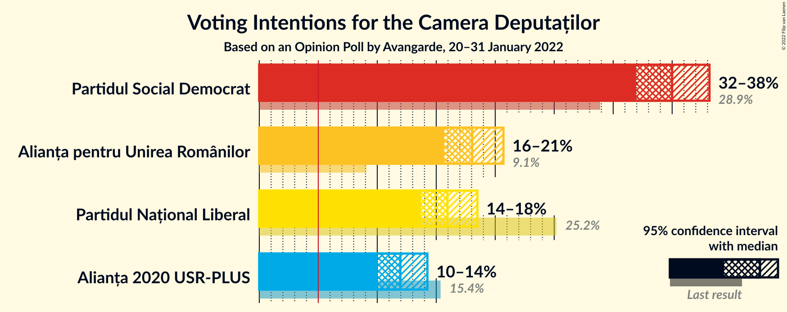
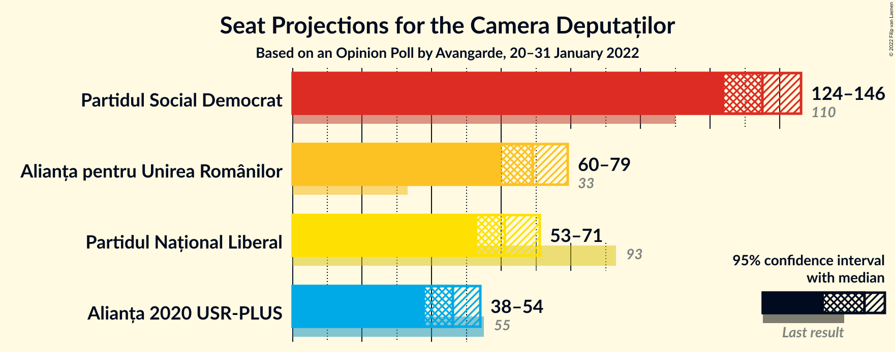
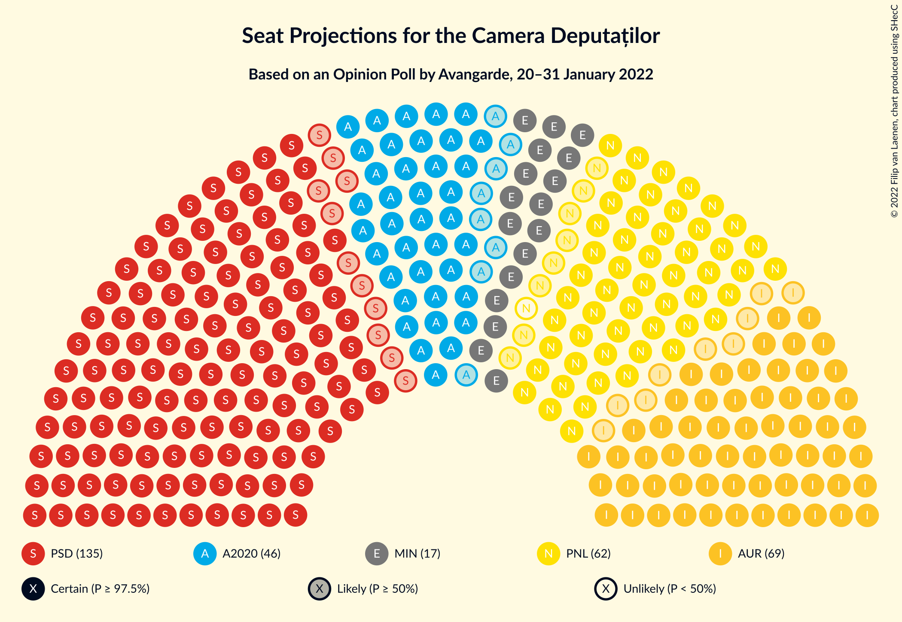
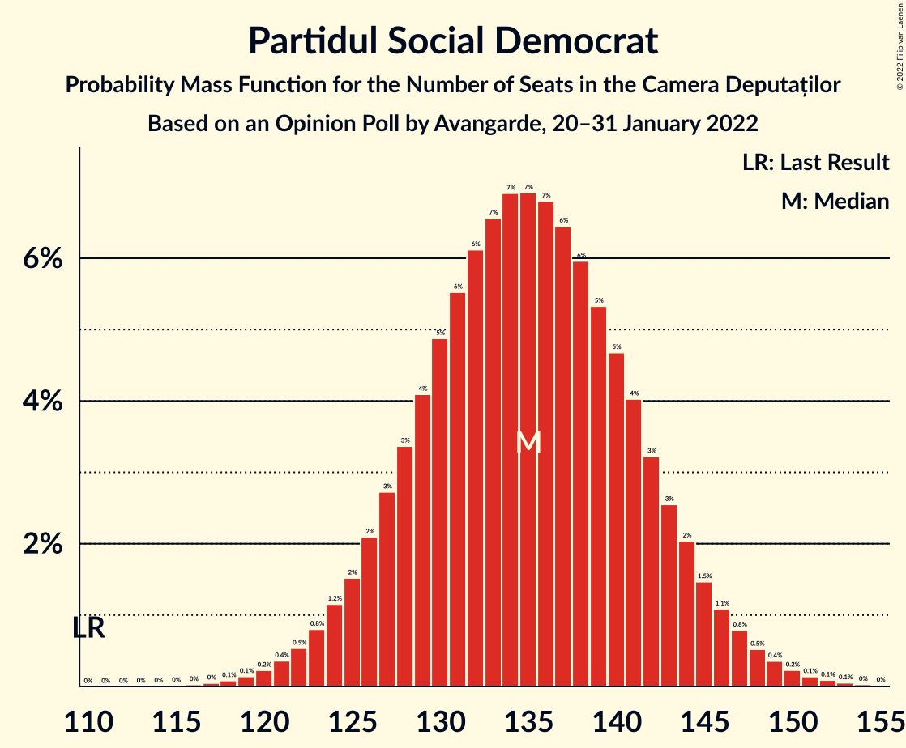
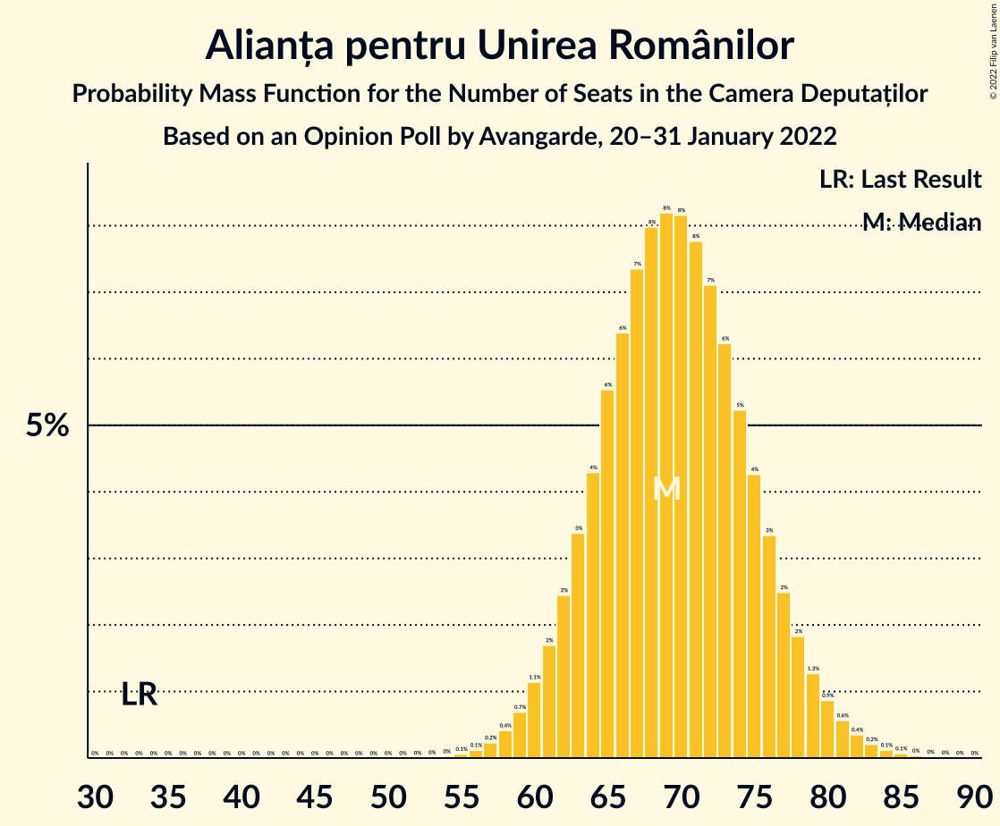
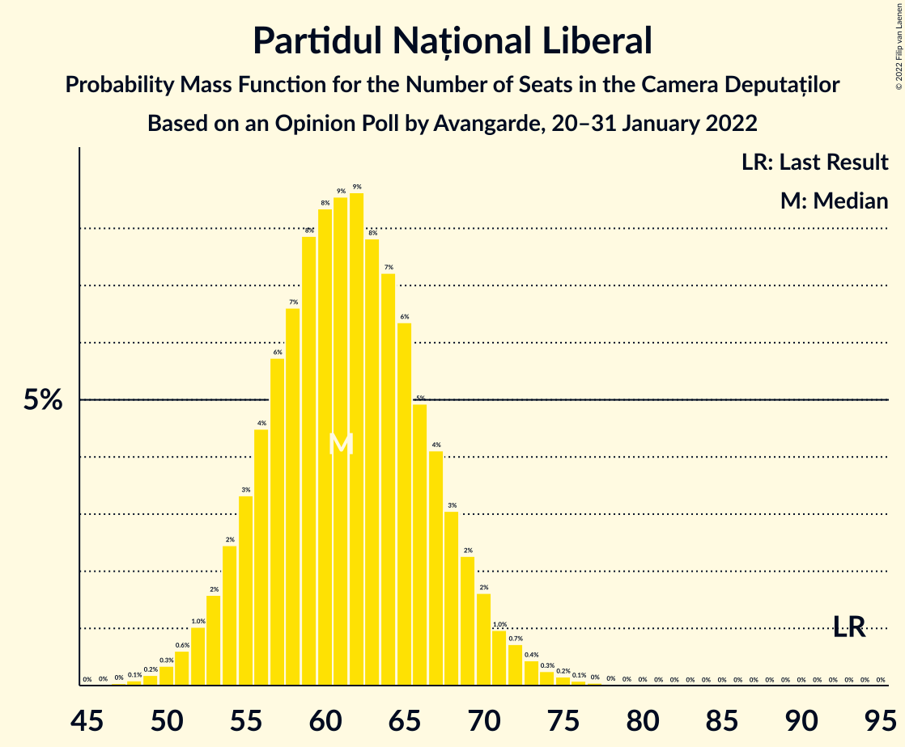
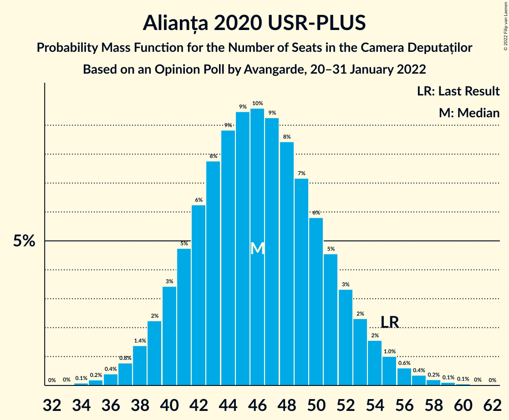
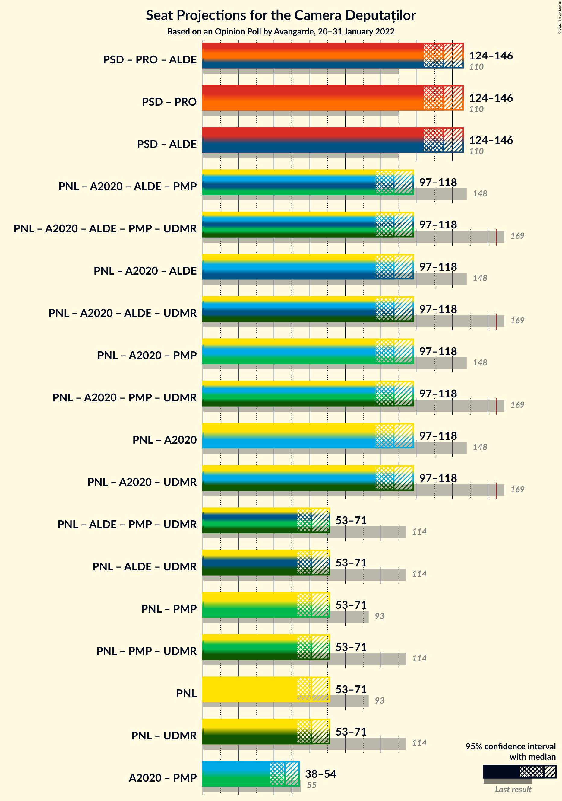
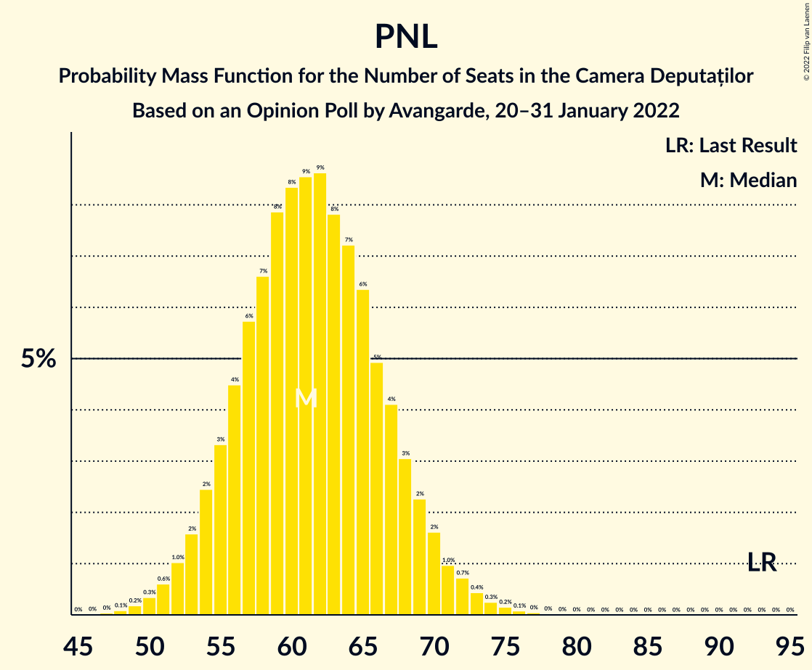

# Opinion Poll by Avangarde, 20–31 January 2022

<a href="#voting-intentions">Voting Intentions</a> | <a href="#seats">Seats</a> | <a href="#coalitions">Coalitions</a> | <a href="#technical-information">Technical Information</a>

## Voting Intentions

### Confidence Intervals

| Party | Last Result | Poll Result | 80% Confidence Interval | 90% Confidence Interval | 95% Confidence Interval | 99% Confidence Interval |
|:-----:|:-----------:|:-----------:|:-----------------------:|:-----------------------:|:-----------------------:|:-----------------------:|
| Partidul Social Democrat | 28.9% | 35.0% | 33.0–37.1% |32.4–37.7% |31.9–38.2% |31.0–39.2% |
| Alianța pentru Unirea Românilor | 9.1% | 18.1% | 16.5–19.8% |16.0–20.3% |15.7–20.7% |15.0–21.6% |
| Partidul Național Liberal | 25.2% | 15.9% | 14.5–17.6% |14.1–18.1% |13.7–18.5% |13.0–19.3% |
| Alianța 2020 USR-PLUS | 15.4% | 12.0% | 10.7–13.5% |10.3–13.9% |10.0–14.3% |9.4–15.0% |

*Note:* The poll result column reflects the actual value used in the calculations. Published results may vary slightly, and in addition be rounded to fewer digits.

## Seats

### Confidence Intervals

| Party | Last Result | Median | 80% Confidence Interval | 90% Confidence Interval | 95% Confidence Interval | 99% Confidence Interval |
|:-----:|:-----------:|:------:|:-----------------------:|:-----------------------:|:-----------------------:|:-----------------------:|
| <a href="#partidul-social-democrat">Partidul Social Democrat</a> | 110 | 135 | 128–142 |126–144 |124–146 |120–150 |
| <a href="#alianța-pentru-unirea-românilor">Alianța pentru Unirea Românilor</a> | 33 | 69 | 63–76 |62–78 |60–79 |58–82 |
| <a href="#partidul-național-liberal">Partidul Național Liberal</a> | 93 | 61 | 56–67 |54–69 |53–71 |50–74 |
| <a href="#alianța-2020-usr-plus">Alianța 2020 USR-PLUS</a> | 55 | 46 | 41–51 |39–53 |38–54 |36–57 |

### Partidul Social Democrat

*For a full overview of the results for this party, see the [Partidul Social Democrat](party-partidulsocialdemocrat.html) page.*

| Number of Seats | Probability | Accumulated | Special Marks |
|:---------------:|:-----------:|:-----------:|:-------------:|
| 110 | 0% | 100% | Last Result |
| 111 | 0% | 100% |  |
| 112 | 0% | 100% |  |
| 113 | 0% | 100% |  |
| 114 | 0% | 100% |  |
| 115 | 0% | 100% |  |
| 116 | 0% | 100% |  |
| 117 | 0% | 99.9% |  |
| 118 | 0.1% | 99.9% |  |
| 119 | 0.1% | 99.8% |  |
| 120 | 0.2% | 99.7% |  |
| 121 | 0.4% | 99.4% |  |
| 122 | 0.5% | 99.1% |  |
| 123 | 0.8% | 98.5% |  |
| 124 | 1.2% | 98% |  |
| 125 | 2% | 97% |  |
| 126 | 2% | 95% |  |
| 127 | 3% | 93% |  |
| 128 | 3% | 90% |  |
| 129 | 4% | 87% |  |
| 130 | 5% | 83% |  |
| 131 | 6% | 78% |  |
| 132 | 6% | 72% |  |
| 133 | 7% | 66% |  |
| 134 | 7% | 60% |  |
| 135 | 7% | 53% | Median |
| 136 | 7% | 46% |  |
| 137 | 6% | 39% |  |
| 138 | 6% | 33% |  |
| 139 | 5% | 27% |  |
| 140 | 5% | 21% |  |
| 141 | 4% | 17% |  |
| 142 | 3% | 13% |  |
| 143 | 3% | 9% |  |
| 144 | 2% | 7% |  |
| 145 | 1.5% | 5% |  |
| 146 | 1.1% | 3% |  |
| 147 | 0.8% | 2% |  |
| 148 | 0.5% | 1.5% |  |
| 149 | 0.4% | 0.9% |  |
| 150 | 0.2% | 0.6% |  |
| 151 | 0.1% | 0.3% |  |
| 152 | 0.1% | 0.2% |  |
| 153 | 0.1% | 0.1% |  |
| 154 | 0% | 0.1% |  |
| 155 | 0% | 0% |  |

### Alianța pentru Unirea Românilor

*For a full overview of the results for this party, see the [Alianța pentru Unirea Românilor](party-alianțapentruunirearomânilor.html) page.*

| Number of Seats | Probability | Accumulated | Special Marks |
|:---------------:|:-----------:|:-----------:|:-------------:|
| 33 | 0% | 100% | Last Result |
| 34 | 0% | 100% |  |
| 35 | 0% | 100% |  |
| 36 | 0% | 100% |  |
| 37 | 0% | 100% |  |
| 38 | 0% | 100% |  |
| 39 | 0% | 100% |  |
| 40 | 0% | 100% |  |
| 41 | 0% | 100% |  |
| 42 | 0% | 100% |  |
| 43 | 0% | 100% |  |
| 44 | 0% | 100% |  |
| 45 | 0% | 100% |  |
| 46 | 0% | 100% |  |
| 47 | 0% | 100% |  |
| 48 | 0% | 100% |  |
| 49 | 0% | 100% |  |
| 50 | 0% | 100% |  |
| 51 | 0% | 100% |  |
| 52 | 0% | 100% |  |
| 53 | 0% | 100% |  |
| 54 | 0% | 100% |  |
| 55 | 0.1% | 100% |  |
| 56 | 0.1% | 99.9% |  |
| 57 | 0.2% | 99.8% |  |
| 58 | 0.4% | 99.5% |  |
| 59 | 0.7% | 99.1% |  |
| 60 | 1.1% | 98% |  |
| 61 | 2% | 97% |  |
| 62 | 2% | 96% |  |
| 63 | 3% | 93% |  |
| 64 | 4% | 90% |  |
| 65 | 6% | 85% |  |
| 66 | 6% | 80% |  |
| 67 | 7% | 74% |  |
| 68 | 8% | 66% |  |
| 69 | 8% | 58% | Median |
| 70 | 8% | 50% |  |
| 71 | 8% | 42% |  |
| 72 | 7% | 34% |  |
| 73 | 6% | 27% |  |
| 74 | 5% | 21% |  |
| 75 | 4% | 15% |  |
| 76 | 3% | 11% |  |
| 77 | 2% | 8% |  |
| 78 | 2% | 5% |  |
| 79 | 1.3% | 4% |  |
| 80 | 0.9% | 2% |  |
| 81 | 0.6% | 1.4% |  |
| 82 | 0.4% | 0.8% |  |
| 83 | 0.2% | 0.5% |  |
| 84 | 0.1% | 0.3% |  |
| 85 | 0.1% | 0.1% |  |
| 86 | 0% | 0.1% |  |
| 87 | 0% | 0% |  |

### Partidul Național Liberal

*For a full overview of the results for this party, see the [Partidul Național Liberal](party-partidulnaționalliberal.html) page.*

| Number of Seats | Probability | Accumulated | Special Marks |
|:---------------:|:-----------:|:-----------:|:-------------:|
| 47 | 0% | 100% |  |
| 48 | 0.1% | 99.9% |  |
| 49 | 0.2% | 99.8% |  |
| 50 | 0.3% | 99.7% |  |
| 51 | 0.6% | 99.3% |  |
| 52 | 1.0% | 98.7% |  |
| 53 | 2% | 98% |  |
| 54 | 2% | 96% |  |
| 55 | 3% | 94% |  |
| 56 | 4% | 90% |  |
| 57 | 6% | 86% |  |
| 58 | 7% | 80% |  |
| 59 | 8% | 73% |  |
| 60 | 8% | 66% |  |
| 61 | 9% | 57% | Median |
| 62 | 9% | 49% |  |
| 63 | 8% | 40% |  |
| 64 | 7% | 32% |  |
| 65 | 6% | 25% |  |
| 66 | 5% | 19% |  |
| 67 | 4% | 14% |  |
| 68 | 3% | 10% |  |
| 69 | 2% | 7% |  |
| 70 | 2% | 4% |  |
| 71 | 1.0% | 3% |  |
| 72 | 0.7% | 2% |  |
| 73 | 0.4% | 1.0% |  |
| 74 | 0.3% | 0.6% |  |
| 75 | 0.2% | 0.3% |  |
| 76 | 0.1% | 0.2% |  |
| 77 | 0% | 0.1% |  |
| 78 | 0% | 0% |  |
| 79 | 0% | 0% |  |
| 80 | 0% | 0% |  |
| 81 | 0% | 0% |  |
| 82 | 0% | 0% |  |
| 83 | 0% | 0% |  |
| 84 | 0% | 0% |  |
| 85 | 0% | 0% |  |
| 86 | 0% | 0% |  |
| 87 | 0% | 0% |  |
| 88 | 0% | 0% |  |
| 89 | 0% | 0% |  |
| 90 | 0% | 0% |  |
| 91 | 0% | 0% |  |
| 92 | 0% | 0% |  |
| 93 | 0% | 0% | Last Result |

### Alianța 2020 USR-PLUS

*For a full overview of the results for this party, see the [Alianța 2020 USR-PLUS](party-alianța2020usr-plus.html) page.*

| Number of Seats | Probability | Accumulated | Special Marks |
|:---------------:|:-----------:|:-----------:|:-------------:|
| 34 | 0.1% | 100% |  |
| 35 | 0.2% | 99.9% |  |
| 36 | 0.4% | 99.7% |  |
| 37 | 0.8% | 99.3% |  |
| 38 | 1.4% | 98% |  |
| 39 | 2% | 97% |  |
| 40 | 3% | 95% |  |
| 41 | 5% | 91% |  |
| 42 | 6% | 87% |  |
| 43 | 8% | 80% |  |
| 44 | 9% | 73% |  |
| 45 | 9% | 64% |  |
| 46 | 10% | 54% | Median |
| 47 | 9% | 45% |  |
| 48 | 8% | 36% |  |
| 49 | 7% | 27% |  |
| 50 | 6% | 20% |  |
| 51 | 5% | 14% |  |
| 52 | 3% | 10% |  |
| 53 | 2% | 6% |  |
| 54 | 2% | 4% |  |
| 55 | 1.0% | 2% | Last Result |
| 56 | 0.6% | 1.4% |  |
| 57 | 0.4% | 0.8% |  |
| 58 | 0.2% | 0.4% |  |
| 59 | 0.1% | 0.2% |  |
| 60 | 0.1% | 0.1% |  |
| 61 | 0% | 0.1% |  |
| 62 | 0% | 0% |  |

## Coalitions

### Confidence Intervals

| Coalition | Last Result | Median | Majority? | 80% Confidence Interval | 90% Confidence Interval | 95% Confidence Interval | 99% Confidence Interval |
|:---------:|:-----------:|:------:|:---------:|:-----------------------:|:-----------------------:|:-----------------------:|:-----------------------:|
| Partidul Național Liberal – Alianța 2020 USR-PLUS | 148 | 107 | 0% | 100–115 | 98–117 | 97–118 | 94–122 |
| Partidul Național Liberal | 93 | 61 | 0% | 56–67 | 54–69 | 53–71 | 50–74 |

### Partidul Național Liberal – Alianța 2020 USR-PLUS

| Number of Seats | Probability | Accumulated | Special Marks |
|:---------------:|:-----------:|:-----------:|:-------------:|
| 90 | 0% | 100% |  |
| 91 | 0.1% | 99.9% |  |
| 92 | 0.1% | 99.8% |  |
| 93 | 0.2% | 99.7% |  |
| 94 | 0.3% | 99.5% |  |
| 95 | 0.5% | 99.2% |  |
| 96 | 0.9% | 98.6% |  |
| 97 | 1.2% | 98% |  |
| 98 | 2% | 97% |  |
| 99 | 2% | 95% |  |
| 100 | 3% | 93% |  |
| 101 | 4% | 90% |  |
| 102 | 4% | 86% |  |
| 103 | 6% | 82% |  |
| 104 | 6% | 76% |  |
| 105 | 7% | 71% |  |
| 106 | 7% | 64% |  |
| 107 | 7% | 57% | Median |
| 108 | 7% | 50% |  |
| 109 | 7% | 42% |  |
| 110 | 7% | 36% |  |
| 111 | 6% | 29% |  |
| 112 | 5% | 23% |  |
| 113 | 4% | 18% |  |
| 114 | 4% | 14% |  |
| 115 | 3% | 10% |  |
| 116 | 2% | 7% |  |
| 117 | 2% | 5% |  |
| 118 | 1.1% | 4% |  |
| 119 | 0.8% | 2% |  |
| 120 | 0.6% | 2% |  |
| 121 | 0.4% | 1.0% |  |
| 122 | 0.3% | 0.6% |  |
| 123 | 0.2% | 0.4% |  |
| 124 | 0.1% | 0.2% |  |
| 125 | 0.1% | 0.1% |  |
| 126 | 0% | 0.1% |  |
| 127 | 0% | 0% |  |
| 128 | 0% | 0% |  |
| 129 | 0% | 0% |  |
| 130 | 0% | 0% |  |
| 131 | 0% | 0% |  |
| 132 | 0% | 0% |  |
| 133 | 0% | 0% |  |
| 134 | 0% | 0% |  |
| 135 | 0% | 0% |  |
| 136 | 0% | 0% |  |
| 137 | 0% | 0% |  |
| 138 | 0% | 0% |  |
| 139 | 0% | 0% |  |
| 140 | 0% | 0% |  |
| 141 | 0% | 0% |  |
| 142 | 0% | 0% |  |
| 143 | 0% | 0% |  |
| 144 | 0% | 0% |  |
| 145 | 0% | 0% |  |
| 146 | 0% | 0% |  |
| 147 | 0% | 0% |  |
| 148 | 0% | 0% | Last Result |

### Partidul Național Liberal

| Number of Seats | Probability | Accumulated | Special Marks |
|:---------------:|:-----------:|:-----------:|:-------------:|
| 47 | 0% | 100% |  |
| 48 | 0.1% | 99.9% |  |
| 49 | 0.2% | 99.8% |  |
| 50 | 0.3% | 99.7% |  |
| 51 | 0.6% | 99.3% |  |
| 52 | 1.0% | 98.7% |  |
| 53 | 2% | 98% |  |
| 54 | 2% | 96% |  |
| 55 | 3% | 94% |  |
| 56 | 4% | 90% |  |
| 57 | 6% | 86% |  |
| 58 | 7% | 80% |  |
| 59 | 8% | 73% |  |
| 60 | 8% | 66% |  |
| 61 | 9% | 57% | Median |
| 62 | 9% | 49% |  |
| 63 | 8% | 40% |  |
| 64 | 7% | 32% |  |
| 65 | 6% | 25% |  |
| 66 | 5% | 19% |  |
| 67 | 4% | 14% |  |
| 68 | 3% | 10% |  |
| 69 | 2% | 7% |  |
| 70 | 2% | 4% |  |
| 71 | 1.0% | 3% |  |
| 72 | 0.7% | 2% |  |
| 73 | 0.4% | 1.0% |  |
| 74 | 0.3% | 0.6% |  |
| 75 | 0.2% | 0.3% |  |
| 76 | 0.1% | 0.2% |  |
| 77 | 0% | 0.1% |  |
| 78 | 0% | 0% |  |
| 79 | 0% | 0% |  |
| 80 | 0% | 0% |  |
| 81 | 0% | 0% |  |
| 82 | 0% | 0% |  |
| 83 | 0% | 0% |  |
| 84 | 0% | 0% |  |
| 85 | 0% | 0% |  |
| 86 | 0% | 0% |  |
| 87 | 0% | 0% |  |
| 88 | 0% | 0% |  |
| 89 | 0% | 0% |  |
| 90 | 0% | 0% |  |
| 91 | 0% | 0% |  |
| 92 | 0% | 0% |  |
| 93 | 0% | 0% | Last Result |

## Technical Information

### Opinion Poll

+ **Polling firm:** Avangarde
+ **Commissioner(s):** —
+ **Fieldwork period:** 20–31 January 2022

### Calculations

+ **Sample size:** 903
+ **Simulations done:** 1,048,576
+ **Error estimate:** 0.30%

