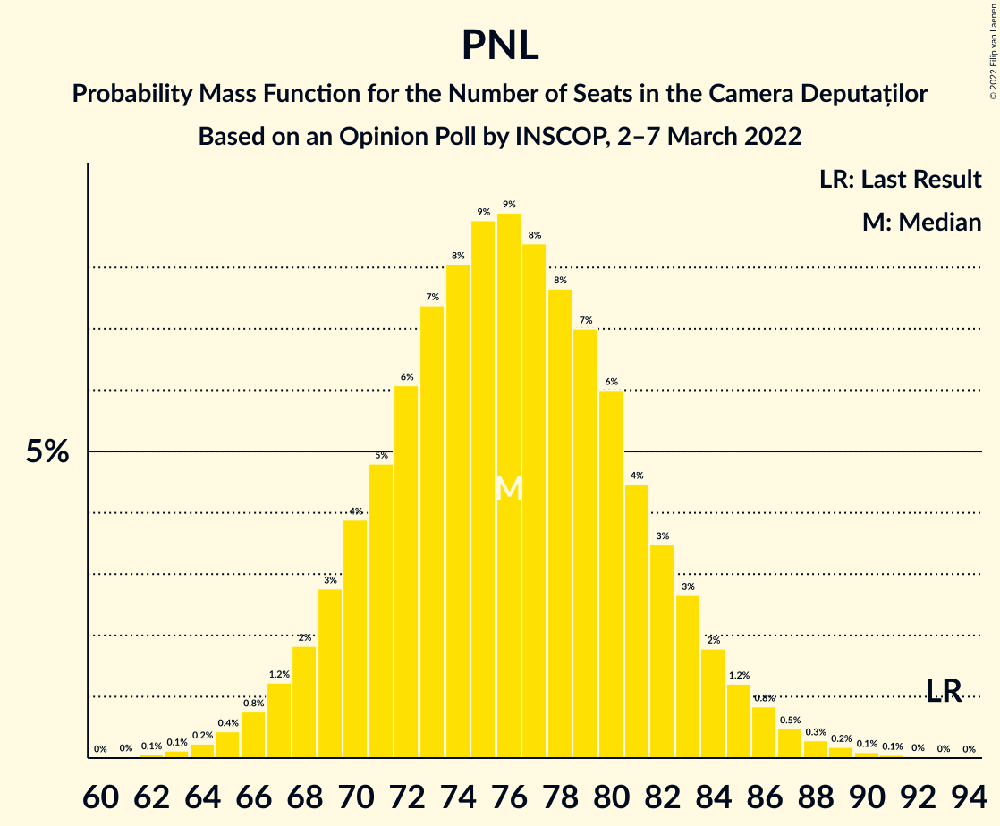

# Opinion Poll by INSCOP, 2–7 March 2022

<a href="#voting-intentions">Voting Intentions</a> | <a href="#seats">Seats</a> | <a href="#coalitions">Coalitions</a> | <a href="#technical-information">Technical Information</a>

## Voting Intentions

### Confidence Intervals

| Party | Last Result | Poll Result | 80% Confidence Interval | 90% Confidence Interval | 95% Confidence Interval | 99% Confidence Interval |
|:-----:|:-----------:|:-----------:|:-----------------------:|:-----------------------:|:-----------------------:|:-----------------------:|
| Partidul Social Democrat | 28.9% | 32.0% | 30.2–33.9% |29.7–34.4% |29.3–34.9% |28.5–35.8% |
| Partidul Național Liberal | 25.2% | 19.9% | 18.4–21.5% |18.0–22.0% |17.6–22.4% |16.9–23.2% |
| Alianța pentru Unirea Românilor | 9.1% | 18.9% | 17.5–20.5% |17.1–21.0% |16.7–21.4% |16.0–22.2% |
| Alianța 2020 USR-PLUS | 15.4% | 10.8% | 9.6–12.1% |9.3–12.5% |9.1–12.8% |8.5–13.4% |

*Note:* The poll result column reflects the actual value used in the calculations. Published results may vary slightly, and in addition be rounded to fewer digits.

## Seats

### Confidence Intervals

| Party | Last Result | Median | 80% Confidence Interval | 90% Confidence Interval | 95% Confidence Interval | 99% Confidence Interval |
|:-----:|:-----------:|:------:|:-----------------------:|:-----------------------:|:-----------------------:|:-----------------------:|
| <a href="#partidul-social-democrat">Partidul Social Democrat</a> | 110 | 122 | 116–129 |114–131 |113–133 |109–136 |
| <a href="#partidul-național-liberal">Partidul Național Liberal</a> | 93 | 76 | 70–82 |69–83 |67–85 |65–88 |
| <a href="#alianța-pentru-unirea-românilor">Alianța pentru Unirea Românilor</a> | 33 | 72 | 67–78 |65–80 |64–81 |61–84 |
| <a href="#alianța-2020-usr-plus">Alianța 2020 USR-PLUS</a> | 55 | 41 | 37–46 |35–47 |34–48 |32–51 |

### Partidul Social Democrat

*For a full overview of the results for this party, see the [Partidul Social Democrat](party-partidulsocialdemocrat.html) page.*

| Number of Seats | Probability | Accumulated | Special Marks |
|:---------------:|:-----------:|:-----------:|:-------------:|
| 106 | 0% | 100% |  |
| 107 | 0.1% | 99.9% |  |
| 108 | 0.1% | 99.8% |  |
| 109 | 0.2% | 99.7% |  |
| 110 | 0.4% | 99.5% | Last Result |
| 111 | 0.6% | 99.1% |  |
| 112 | 0.9% | 98% |  |
| 113 | 1.4% | 98% |  |
| 114 | 2% | 96% |  |
| 115 | 3% | 94% |  |
| 116 | 4% | 91% |  |
| 117 | 4% | 88% |  |
| 118 | 5% | 83% |  |
| 119 | 6% | 78% |  |
| 120 | 7% | 72% |  |
| 121 | 8% | 65% |  |
| 122 | 8% | 58% | Median |
| 123 | 8% | 50% |  |
| 124 | 7% | 42% |  |
| 125 | 7% | 35% |  |
| 126 | 6% | 28% |  |
| 127 | 5% | 22% |  |
| 128 | 4% | 17% |  |
| 129 | 3% | 12% |  |
| 130 | 3% | 9% |  |
| 131 | 2% | 6% |  |
| 132 | 1.5% | 4% |  |
| 133 | 1.0% | 3% |  |
| 134 | 0.7% | 2% |  |
| 135 | 0.4% | 1.1% |  |
| 136 | 0.3% | 0.7% |  |
| 137 | 0.2% | 0.4% |  |
| 138 | 0.1% | 0.3% |  |
| 139 | 0.1% | 0.2% |  |
| 140 | 0% | 0.1% |  |
| 141 | 0% | 0.1% |  |
| 142 | 0% | 0% |  |

### Partidul Național Liberal

*For a full overview of the results for this party, see the [Partidul Național Liberal](party-partidulnaționalliberal.html) page.*

| Number of Seats | Probability | Accumulated | Special Marks |
|:---------------:|:-----------:|:-----------:|:-------------:|
| 62 | 0.1% | 100% |  |
| 63 | 0.1% | 99.9% |  |
| 64 | 0.2% | 99.8% |  |
| 65 | 0.4% | 99.5% |  |
| 66 | 0.8% | 99.1% |  |
| 67 | 1.2% | 98% |  |
| 68 | 2% | 97% |  |
| 69 | 3% | 95% |  |
| 70 | 4% | 93% |  |
| 71 | 5% | 89% |  |
| 72 | 6% | 84% |  |
| 73 | 7% | 78% |  |
| 74 | 8% | 70% |  |
| 75 | 9% | 62% |  |
| 76 | 9% | 54% | Median |
| 77 | 8% | 45% |  |
| 78 | 8% | 36% |  |
| 79 | 7% | 29% |  |
| 80 | 6% | 22% |  |
| 81 | 4% | 16% |  |
| 82 | 3% | 11% |  |
| 83 | 3% | 8% |  |
| 84 | 2% | 5% |  |
| 85 | 1.2% | 3% |  |
| 86 | 0.8% | 2% |  |
| 87 | 0.5% | 1.2% |  |
| 88 | 0.3% | 0.7% |  |
| 89 | 0.2% | 0.4% |  |
| 90 | 0.1% | 0.2% |  |
| 91 | 0.1% | 0.1% |  |
| 92 | 0% | 0.1% |  |
| 93 | 0% | 0% | Last Result |

### Alianța pentru Unirea Românilor

*For a full overview of the results for this party, see the [Alianța pentru Unirea Românilor](party-alianțapentruunirearomânilor.html) page.*

| Number of Seats | Probability | Accumulated | Special Marks |
|:---------------:|:-----------:|:-----------:|:-------------:|
| 33 | 0% | 100% | Last Result |
| 34 | 0% | 100% |  |
| 35 | 0% | 100% |  |
| 36 | 0% | 100% |  |
| 37 | 0% | 100% |  |
| 38 | 0% | 100% |  |
| 39 | 0% | 100% |  |
| 40 | 0% | 100% |  |
| 41 | 0% | 100% |  |
| 42 | 0% | 100% |  |
| 43 | 0% | 100% |  |
| 44 | 0% | 100% |  |
| 45 | 0% | 100% |  |
| 46 | 0% | 100% |  |
| 47 | 0% | 100% |  |
| 48 | 0% | 100% |  |
| 49 | 0% | 100% |  |
| 50 | 0% | 100% |  |
| 51 | 0% | 100% |  |
| 52 | 0% | 100% |  |
| 53 | 0% | 100% |  |
| 54 | 0% | 100% |  |
| 55 | 0% | 100% |  |
| 56 | 0% | 100% |  |
| 57 | 0% | 100% |  |
| 58 | 0% | 100% |  |
| 59 | 0.1% | 99.9% |  |
| 60 | 0.2% | 99.9% |  |
| 61 | 0.3% | 99.7% |  |
| 62 | 0.6% | 99.4% |  |
| 63 | 0.9% | 98.8% |  |
| 64 | 1.4% | 98% |  |
| 65 | 2% | 96% |  |
| 66 | 3% | 94% |  |
| 67 | 4% | 91% |  |
| 68 | 6% | 87% |  |
| 69 | 7% | 81% |  |
| 70 | 8% | 74% |  |
| 71 | 9% | 66% |  |
| 72 | 9% | 57% | Median |
| 73 | 9% | 48% |  |
| 74 | 8% | 39% |  |
| 75 | 7% | 31% |  |
| 76 | 6% | 24% |  |
| 77 | 5% | 18% |  |
| 78 | 4% | 13% |  |
| 79 | 3% | 9% |  |
| 80 | 2% | 6% |  |
| 81 | 1.4% | 4% |  |
| 82 | 1.0% | 2% |  |
| 83 | 0.6% | 1.4% |  |
| 84 | 0.4% | 0.8% |  |
| 85 | 0.2% | 0.4% |  |
| 86 | 0.1% | 0.2% |  |
| 87 | 0.1% | 0.1% |  |
| 88 | 0% | 0.1% |  |
| 89 | 0% | 0% |  |

### Alianța 2020 USR-PLUS

*For a full overview of the results for this party, see the [Alianța 2020 USR-PLUS](party-alianța2020usr-plus.html) page.*

| Number of Seats | Probability | Accumulated | Special Marks |
|:---------------:|:-----------:|:-----------:|:-------------:|
| 0 | 0.1% | 100% |  |
| 1 | 0% | 99.9% |  |
| 2 | 0% | 99.9% |  |
| 3 | 0% | 99.9% |  |
| 4 | 0% | 99.9% |  |
| 5 | 0% | 99.9% |  |
| 6 | 0% | 99.9% |  |
| 7 | 0% | 99.9% |  |
| 8 | 0% | 99.9% |  |
| 9 | 0% | 99.9% |  |
| 10 | 0% | 99.9% |  |
| 11 | 0% | 99.9% |  |
| 12 | 0% | 99.9% |  |
| 13 | 0% | 99.9% |  |
| 14 | 0% | 99.9% |  |
| 15 | 0% | 99.9% |  |
| 16 | 0% | 99.9% |  |
| 17 | 0% | 99.9% |  |
| 18 | 0% | 99.9% |  |
| 19 | 0% | 99.9% |  |
| 20 | 0% | 99.9% |  |
| 21 | 0% | 99.9% |  |
| 22 | 0% | 99.9% |  |
| 23 | 0% | 99.9% |  |
| 24 | 0% | 99.9% |  |
| 25 | 0% | 99.9% |  |
| 26 | 0% | 99.9% |  |
| 27 | 0% | 99.9% |  |
| 28 | 0% | 99.9% |  |
| 29 | 0% | 99.9% |  |
| 30 | 0% | 99.9% |  |
| 31 | 0.1% | 99.9% |  |
| 32 | 0.3% | 99.8% |  |
| 33 | 0.8% | 99.4% |  |
| 34 | 1.5% | 98.7% |  |
| 35 | 3% | 97% |  |
| 36 | 4% | 95% |  |
| 37 | 6% | 90% |  |
| 38 | 8% | 84% |  |
| 39 | 10% | 77% |  |
| 40 | 11% | 67% |  |
| 41 | 11% | 56% | Median |
| 42 | 11% | 45% |  |
| 43 | 9% | 34% |  |
| 44 | 8% | 25% |  |
| 45 | 6% | 17% |  |
| 46 | 4% | 11% |  |
| 47 | 3% | 7% |  |
| 48 | 2% | 4% |  |
| 49 | 1.1% | 2% |  |
| 50 | 0.6% | 1.2% |  |
| 51 | 0.3% | 0.6% |  |
| 52 | 0.2% | 0.3% |  |
| 53 | 0.1% | 0.1% |  |
| 54 | 0% | 0.1% |  |
| 55 | 0% | 0% | Last Result |

## Coalitions

### Confidence Intervals

| Coalition | Last Result | Median | Majority? | 80% Confidence Interval | 90% Confidence Interval | 95% Confidence Interval | 99% Confidence Interval |
|:---------:|:-----------:|:------:|:---------:|:-----------------------:|:-----------------------:|:-----------------------:|:-----------------------:|
| Partidul Național Liberal – Alianța 2020 USR-PLUS | 148 | 117 | 0% | 111–124 | 109–125 | 107–127 | 104–130 |
| Partidul Național Liberal | 93 | 76 | 0% | 70–82 | 69–83 | 67–85 | 65–88 |

### Partidul Național Liberal – Alianța 2020 USR-PLUS

| Number of Seats | Probability | Accumulated | Special Marks |
|:---------------:|:-----------:|:-----------:|:-------------:|
| 92 | 0% | 100% |  |
| 93 | 0% | 99.9% |  |
| 94 | 0% | 99.9% |  |
| 95 | 0% | 99.9% |  |
| 96 | 0% | 99.9% |  |
| 97 | 0% | 99.9% |  |
| 98 | 0% | 99.9% |  |
| 99 | 0% | 99.9% |  |
| 100 | 0% | 99.9% |  |
| 101 | 0.1% | 99.9% |  |
| 102 | 0.1% | 99.8% |  |
| 103 | 0.2% | 99.8% |  |
| 104 | 0.3% | 99.6% |  |
| 105 | 0.4% | 99.3% |  |
| 106 | 0.8% | 98.8% |  |
| 107 | 1.0% | 98% |  |
| 108 | 2% | 97% |  |
| 109 | 2% | 95% |  |
| 110 | 3% | 93% |  |
| 111 | 4% | 90% |  |
| 112 | 5% | 86% |  |
| 113 | 6% | 82% |  |
| 114 | 6% | 76% |  |
| 115 | 8% | 70% |  |
| 116 | 7% | 62% |  |
| 117 | 8% | 55% | Median |
| 118 | 8% | 46% |  |
| 119 | 7% | 39% |  |
| 120 | 7% | 32% |  |
| 121 | 5% | 25% |  |
| 122 | 5% | 20% |  |
| 123 | 4% | 14% |  |
| 124 | 3% | 11% |  |
| 125 | 2% | 7% |  |
| 126 | 2% | 5% |  |
| 127 | 1.2% | 3% |  |
| 128 | 0.7% | 2% |  |
| 129 | 0.6% | 1.4% |  |
| 130 | 0.3% | 0.8% |  |
| 131 | 0.2% | 0.5% |  |
| 132 | 0.1% | 0.3% |  |
| 133 | 0.1% | 0.1% |  |
| 134 | 0% | 0.1% |  |
| 135 | 0% | 0% |  |
| 136 | 0% | 0% |  |
| 137 | 0% | 0% |  |
| 138 | 0% | 0% |  |
| 139 | 0% | 0% |  |
| 140 | 0% | 0% |  |
| 141 | 0% | 0% |  |
| 142 | 0% | 0% |  |
| 143 | 0% | 0% |  |
| 144 | 0% | 0% |  |
| 145 | 0% | 0% |  |
| 146 | 0% | 0% |  |
| 147 | 0% | 0% |  |
| 148 | 0% | 0% | Last Result |

### Partidul Național Liberal

| Number of Seats | Probability | Accumulated | Special Marks |
|:---------------:|:-----------:|:-----------:|:-------------:|
| 62 | 0.1% | 100% |  |
| 63 | 0.1% | 99.9% |  |
| 64 | 0.2% | 99.8% |  |
| 65 | 0.4% | 99.5% |  |
| 66 | 0.8% | 99.1% |  |
| 67 | 1.2% | 98% |  |
| 68 | 2% | 97% |  |
| 69 | 3% | 95% |  |
| 70 | 4% | 93% |  |
| 71 | 5% | 89% |  |
| 72 | 6% | 84% |  |
| 73 | 7% | 78% |  |
| 74 | 8% | 70% |  |
| 75 | 9% | 62% |  |
| 76 | 9% | 54% | Median |
| 77 | 8% | 45% |  |
| 78 | 8% | 36% |  |
| 79 | 7% | 29% |  |
| 80 | 6% | 22% |  |
| 81 | 4% | 16% |  |
| 82 | 3% | 11% |  |
| 83 | 3% | 8% |  |
| 84 | 2% | 5% |  |
| 85 | 1.2% | 3% |  |
| 86 | 0.8% | 2% |  |
| 87 | 0.5% | 1.2% |  |
| 88 | 0.3% | 0.7% |  |
| 89 | 0.2% | 0.4% |  |
| 90 | 0.1% | 0.2% |  |
| 91 | 0.1% | 0.1% |  |
| 92 | 0% | 0.1% |  |
| 93 | 0% | 0% | Last Result |

## Technical Information

### Opinion Poll

+ **Polling firm:** INSCOP
+ **Commissioner(s):** —
+ **Fieldwork period:** 2–7 March 2022

### Calculations

+ **Sample size:** 1077
+ **Simulations done:** 1,048,576
+ **Error estimate:** 0.20%

