# Opinion Poll by CURS, 16–26 May 2022

<a href="#voting-intentions">Voting Intentions</a> | <a href="#seats">Seats</a> | <a href="#coalitions">Coalitions</a> | <a href="#technical-information">Technical Information</a>

## Voting Intentions

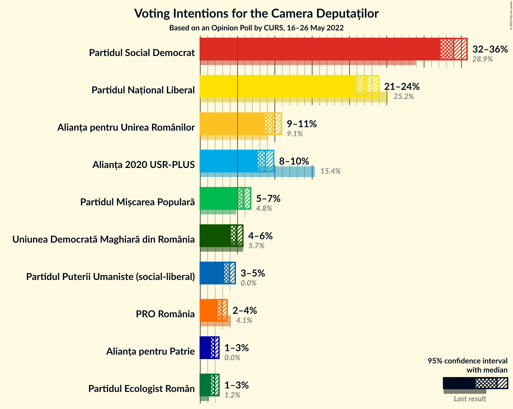

### Confidence Intervals

| Party | Last Result | Poll Result | 80% Confidence Interval | 90% Confidence Interval | 95% Confidence Interval | 99% Confidence Interval |
|:-----:|:-----------:|:-----------:|:-----------------------:|:-----------------------:|:-----------------------:|:-----------------------:|
| Partidul Social Democrat | 28.9% | 34.0% | 32.8–35.1% |32.5–35.5% |32.2–35.8% |31.7–36.3% |
| Partidul Național Liberal | 25.2% | 22.3% | 21.3–23.4% |21.0–23.7% |20.8–23.9% |20.3–24.4% |
| Alianța pentru Unirea Românilor | 9.1% | 9.7% | 9.0–10.5% |8.8–10.7% |8.7–10.9% |8.3–11.2% |
| Alianța 2020 USR-PLUS | 15.4% | 8.7% | 8.1–9.5% |7.9–9.7% |7.7–9.8% |7.4–10.2% |
| Partidul Mișcarea Populară | 4.8% | 5.8% | 5.3–6.4% |5.1–6.6% |5.0–6.8% |4.8–7.1% |
| Uniunea Democrată Maghiară din România | 5.7% | 4.8% | 4.3–5.4% |4.2–5.6% |4.1–5.7% |3.9–6.0% |
| Partidul Puterii Umaniste (social-liberal) | 0.0% | 3.9% | 3.4–4.4% |3.3–4.6% |3.2–4.7% |3.0–5.0% |
| PRO România | 4.1% | 2.9% | 2.5–3.4% |2.4–3.5% |2.3–3.6% |2.2–3.8% |
| Partidul Ecologist Român | 1.2% | 1.9% | 1.6–2.3% |1.5–2.4% |1.5–2.5% |1.3–2.7% |
| Alianța pentru Patrie | 0.0% | 1.9% | 1.6–2.3% |1.5–2.4% |1.5–2.5% |1.3–2.7% |

*Note:* The poll result column reflects the actual value used in the calculations. Published results may vary slightly, and in addition be rounded to fewer digits.

## Seats

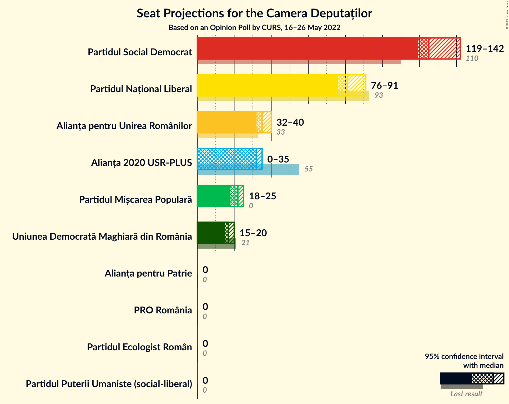

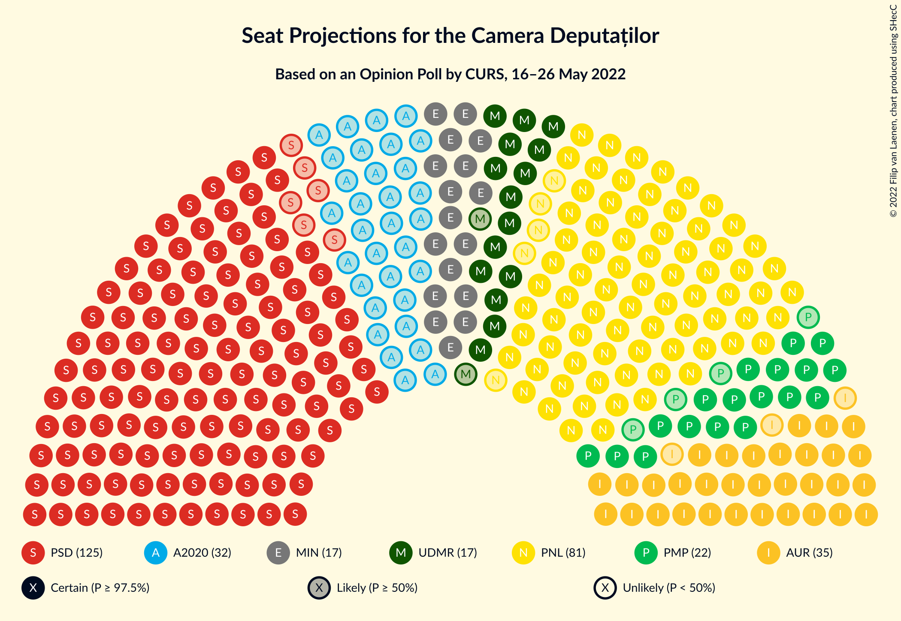

### Confidence Intervals

| Party | Last Result | Median | 80% Confidence Interval | 90% Confidence Interval | 95% Confidence Interval | 99% Confidence Interval |
|:-----:|:-----------:|:------:|:-----------------------:|:-----------------------:|:-----------------------:|:-----------------------:|
| <a href="#partidul-social-democrat">Partidul Social Democrat</a> | 110 | 125 | 121–130 |119–138 |119–142 |116–143 |
| <a href="#partidul-național-liberal">Partidul Național Liberal</a> | 93 | 81 | 79–87 |76–91 |76–91 |75–95 |
| <a href="#alianța-pentru-unirea-românilor">Alianța pentru Unirea Românilor</a> | 33 | 35 | 33–39 |32–39 |32–40 |31–43 |
| <a href="#alianța-2020-usr-plus">Alianța 2020 USR-PLUS</a> | 55 | 32 | 30–34 |0–35 |0–35 |0–37 |
| <a href="#partidul-mișcarea-populară">Partidul Mișcarea Populară</a> | 0 | 22 | 19–23 |18–24 |18–25 |0–26 |
| <a href="#uniunea-democrată-maghiară-din-românia">Uniunea Democrată Maghiară din România</a> | 21 | 17 | 16–19 |15–20 |15–20 |14–22 |
| <a href="#partidul-puterii-umaniste-(social-liberal)">Partidul Puterii Umaniste (social-liberal)</a> | 0 | 0 | 0 |0 |0 |0 |
| <a href="#pro-românia">PRO România</a> | 0 | 0 | 0 |0 |0 |0 |
| <a href="#partidul-ecologist-român">Partidul Ecologist Român</a> | 0 | 0 | 0 |0 |0 |0 |
| <a href="#alianța-pentru-patrie">Alianța pentru Patrie</a> | 0 | 0 | 0 |0 |0 |0 |

### Partidul Social Democrat

*For a full overview of the results for this party, see the [Partidul Social Democrat](party-partidulsocialdemocrat.html) page.*

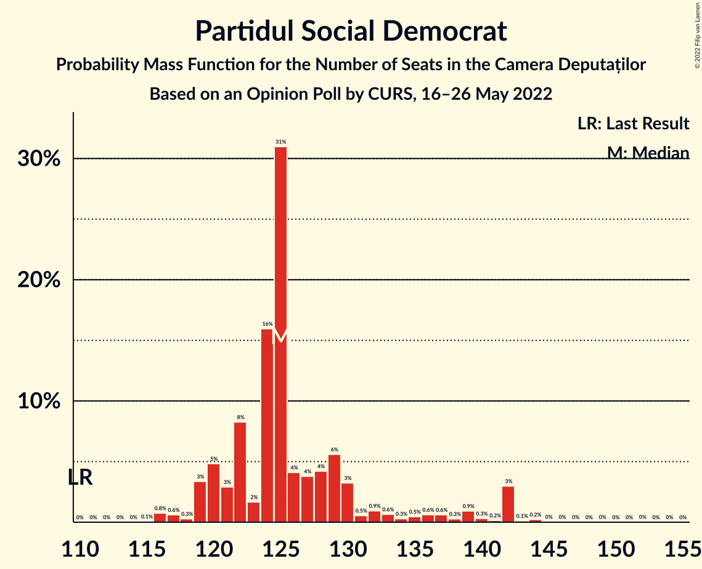

| Number of Seats | Probability | Accumulated | Special Marks |
|:---------------:|:-----------:|:-----------:|:-------------:|
| 110 | 0% | 100% | Last Result |
| 111 | 0% | 100% |  |
| 112 | 0% | 100% |  |
| 113 | 0% | 100% |  |
| 114 | 0% | 100% |  |
| 115 | 0.1% | 99.9% |  |
| 116 | 0.8% | 99.9% |  |
| 117 | 0.6% | 99.1% |  |
| 118 | 0.3% | 98.5% |  |
| 119 | 3% | 98% |  |
| 120 | 5% | 95% |  |
| 121 | 3% | 90% |  |
| 122 | 8% | 87% |  |
| 123 | 2% | 79% |  |
| 124 | 16% | 77% |  |
| 125 | 31% | 61% | Median |
| 126 | 4% | 30% |  |
| 127 | 4% | 26% |  |
| 128 | 4% | 22% |  |
| 129 | 6% | 18% |  |
| 130 | 3% | 13% |  |
| 131 | 0.5% | 9% |  |
| 132 | 0.9% | 9% |  |
| 133 | 0.6% | 8% |  |
| 134 | 0.3% | 7% |  |
| 135 | 0.5% | 7% |  |
| 136 | 0.6% | 6% |  |
| 137 | 0.6% | 6% |  |
| 138 | 0.3% | 5% |  |
| 139 | 0.9% | 5% |  |
| 140 | 0.3% | 4% |  |
| 141 | 0.2% | 4% |  |
| 142 | 3% | 4% |  |
| 143 | 0.1% | 0.5% |  |
| 144 | 0.2% | 0.4% |  |
| 145 | 0% | 0.2% |  |
| 146 | 0% | 0.2% |  |
| 147 | 0% | 0.1% |  |
| 148 | 0% | 0.1% |  |
| 149 | 0% | 0.1% |  |
| 150 | 0% | 0.1% |  |
| 151 | 0% | 0.1% |  |
| 152 | 0% | 0.1% |  |
| 153 | 0% | 0% |  |

### Partidul Național Liberal

*For a full overview of the results for this party, see the [Partidul Național Liberal](party-partidulnaționalliberal.html) page.*

| Number of Seats | Probability | Accumulated | Special Marks |
|:---------------:|:-----------:|:-----------:|:-------------:|
| 73 | 0.2% | 100% |  |
| 74 | 0.1% | 99.8% |  |
| 75 | 0.8% | 99.6% |  |
| 76 | 4% | 98.8% |  |
| 77 | 1.3% | 95% |  |
| 78 | 3% | 93% |  |
| 79 | 9% | 90% |  |
| 80 | 11% | 81% |  |
| 81 | 20% | 70% | Median |
| 82 | 13% | 50% |  |
| 83 | 4% | 37% |  |
| 84 | 13% | 33% |  |
| 85 | 3% | 20% |  |
| 86 | 4% | 17% |  |
| 87 | 4% | 12% |  |
| 88 | 1.1% | 9% |  |
| 89 | 1.2% | 8% |  |
| 90 | 1.0% | 7% |  |
| 91 | 3% | 6% |  |
| 92 | 0.6% | 2% |  |
| 93 | 0.5% | 2% | Last Result |
| 94 | 0.3% | 1.0% |  |
| 95 | 0.4% | 0.8% |  |
| 96 | 0.2% | 0.4% |  |
| 97 | 0% | 0.2% |  |
| 98 | 0.1% | 0.2% |  |
| 99 | 0% | 0.1% |  |
| 100 | 0% | 0.1% |  |
| 101 | 0% | 0% |  |

### Alianța pentru Unirea Românilor

*For a full overview of the results for this party, see the [Alianța pentru Unirea Românilor](party-alianțapentruunirearomânilor.html) page.*

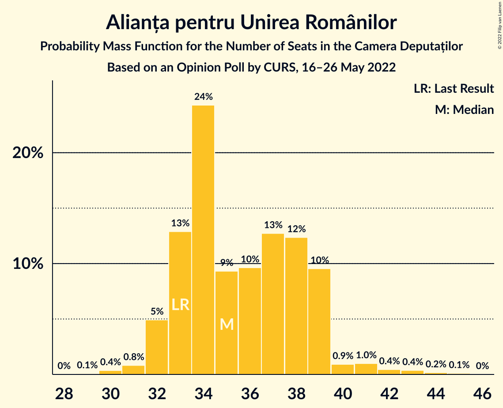

| Number of Seats | Probability | Accumulated | Special Marks |
|:---------------:|:-----------:|:-----------:|:-------------:|
| 29 | 0.1% | 100% |  |
| 30 | 0.4% | 99.9% |  |
| 31 | 0.8% | 99.5% |  |
| 32 | 5% | 98.7% |  |
| 33 | 13% | 94% | Last Result |
| 34 | 24% | 81% |  |
| 35 | 9% | 57% | Median |
| 36 | 10% | 47% |  |
| 37 | 13% | 38% |  |
| 38 | 12% | 25% |  |
| 39 | 10% | 13% |  |
| 40 | 0.9% | 3% |  |
| 41 | 1.0% | 2% |  |
| 42 | 0.4% | 1.1% |  |
| 43 | 0.4% | 0.7% |  |
| 44 | 0.2% | 0.3% |  |
| 45 | 0.1% | 0.1% |  |
| 46 | 0% | 0% |  |

### Alianța 2020 USR-PLUS

*For a full overview of the results for this party, see the [Alianța 2020 USR-PLUS](party-alianța2020usr-plus.html) page.*

| Number of Seats | Probability | Accumulated | Special Marks |
|:---------------:|:-----------:|:-----------:|:-------------:|
| 0 | 7% | 100% |  |
| 1 | 0% | 93% |  |
| 2 | 0% | 93% |  |
| 3 | 0% | 93% |  |
| 4 | 0% | 93% |  |
| 5 | 0% | 93% |  |
| 6 | 0% | 93% |  |
| 7 | 0% | 93% |  |
| 8 | 0% | 93% |  |
| 9 | 0% | 93% |  |
| 10 | 0% | 93% |  |
| 11 | 0% | 93% |  |
| 12 | 0% | 93% |  |
| 13 | 0% | 93% |  |
| 14 | 0% | 93% |  |
| 15 | 0% | 93% |  |
| 16 | 0% | 93% |  |
| 17 | 0% | 93% |  |
| 18 | 0% | 93% |  |
| 19 | 0% | 93% |  |
| 20 | 0% | 93% |  |
| 21 | 0% | 93% |  |
| 22 | 0% | 93% |  |
| 23 | 0% | 93% |  |
| 24 | 0% | 93% |  |
| 25 | 0% | 93% |  |
| 26 | 0% | 93% |  |
| 27 | 0% | 93% |  |
| 28 | 0% | 93% |  |
| 29 | 0.6% | 93% |  |
| 30 | 14% | 93% |  |
| 31 | 23% | 79% |  |
| 32 | 26% | 56% | Median |
| 33 | 13% | 30% |  |
| 34 | 8% | 17% |  |
| 35 | 7% | 10% |  |
| 36 | 2% | 2% |  |
| 37 | 0.3% | 0.6% |  |
| 38 | 0.1% | 0.3% |  |
| 39 | 0.1% | 0.1% |  |
| 40 | 0% | 0% |  |
| 41 | 0% | 0% |  |
| 42 | 0% | 0% |  |
| 43 | 0% | 0% |  |
| 44 | 0% | 0% |  |
| 45 | 0% | 0% |  |
| 46 | 0% | 0% |  |
| 47 | 0% | 0% |  |
| 48 | 0% | 0% |  |
| 49 | 0% | 0% |  |
| 50 | 0% | 0% |  |
| 51 | 0% | 0% |  |
| 52 | 0% | 0% |  |
| 53 | 0% | 0% |  |
| 54 | 0% | 0% |  |
| 55 | 0% | 0% | Last Result |

### Partidul Mișcarea Populară

*For a full overview of the results for this party, see the [Partidul Mișcarea Populară](party-partidulmișcareapopulară.html) page.*

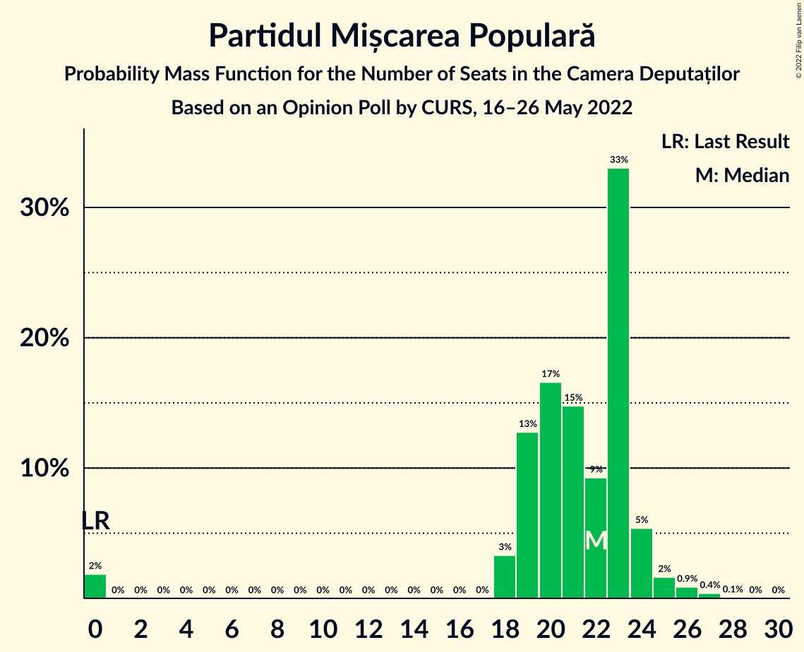

| Number of Seats | Probability | Accumulated | Special Marks |
|:---------------:|:-----------:|:-----------:|:-------------:|
| 0 | 2% | 100% | Last Result |
| 1 | 0% | 98% |  |
| 2 | 0% | 98% |  |
| 3 | 0% | 98% |  |
| 4 | 0% | 98% |  |
| 5 | 0% | 98% |  |
| 6 | 0% | 98% |  |
| 7 | 0% | 98% |  |
| 8 | 0% | 98% |  |
| 9 | 0% | 98% |  |
| 10 | 0% | 98% |  |
| 11 | 0% | 98% |  |
| 12 | 0% | 98% |  |
| 13 | 0% | 98% |  |
| 14 | 0% | 98% |  |
| 15 | 0% | 98% |  |
| 16 | 0% | 98% |  |
| 17 | 0% | 98% |  |
| 18 | 3% | 98% |  |
| 19 | 13% | 95% |  |
| 20 | 17% | 82% |  |
| 21 | 15% | 65% |  |
| 22 | 9% | 51% | Median |
| 23 | 33% | 41% |  |
| 24 | 5% | 8% |  |
| 25 | 2% | 3% |  |
| 26 | 0.9% | 1.4% |  |
| 27 | 0.4% | 0.5% |  |
| 28 | 0.1% | 0.1% |  |
| 29 | 0% | 0% |  |

### Uniunea Democrată Maghiară din România

*For a full overview of the results for this party, see the [Uniunea Democrată Maghiară din România](party-uniuneademocratămaghiarădinromânia.html) page.*

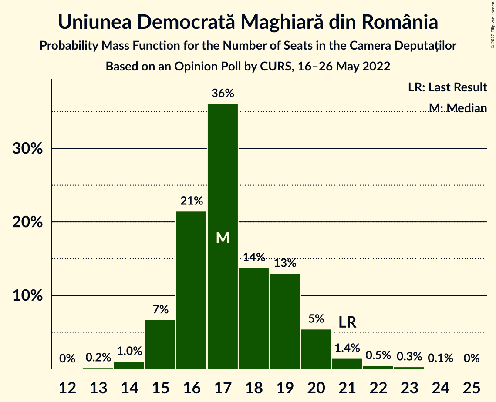

| Number of Seats | Probability | Accumulated | Special Marks |
|:---------------:|:-----------:|:-----------:|:-------------:|
| 13 | 0.2% | 100% |  |
| 14 | 1.0% | 99.8% |  |
| 15 | 7% | 98.8% |  |
| 16 | 21% | 92% |  |
| 17 | 36% | 71% | Median |
| 18 | 14% | 35% |  |
| 19 | 13% | 21% |  |
| 20 | 5% | 8% |  |
| 21 | 1.4% | 2% | Last Result |
| 22 | 0.5% | 0.9% |  |
| 23 | 0.3% | 0.4% |  |
| 24 | 0.1% | 0.1% |  |
| 25 | 0% | 0% |  |

### Partidul Puterii Umaniste (social-liberal)

*For a full overview of the results for this party, see the [Partidul Puterii Umaniste (social-liberal)](party-partidulputeriiumanistesocial-liberal.html) page.*

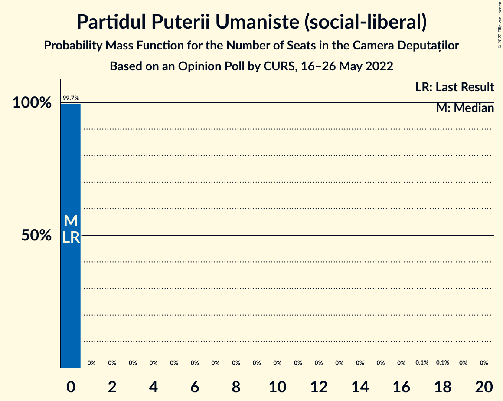

| Number of Seats | Probability | Accumulated | Special Marks |
|:---------------:|:-----------:|:-----------:|:-------------:|
| 0 | 99.7% | 100% | Last Result, Median |
| 1 | 0% | 0.3% |  |
| 2 | 0% | 0.3% |  |
| 3 | 0% | 0.3% |  |
| 4 | 0% | 0.3% |  |
| 5 | 0% | 0.3% |  |
| 6 | 0% | 0.3% |  |
| 7 | 0% | 0.3% |  |
| 8 | 0% | 0.3% |  |
| 9 | 0% | 0.3% |  |
| 10 | 0% | 0.3% |  |
| 11 | 0% | 0.3% |  |
| 12 | 0% | 0.3% |  |
| 13 | 0% | 0.3% |  |
| 14 | 0% | 0.3% |  |
| 15 | 0% | 0.3% |  |
| 16 | 0% | 0.3% |  |
| 17 | 0.1% | 0.3% |  |
| 18 | 0.1% | 0.2% |  |
| 19 | 0% | 0% |  |

### PRO România

*For a full overview of the results for this party, see the [PRO România](party-proromânia.html) page.*

| Number of Seats | Probability | Accumulated | Special Marks |
|:---------------:|:-----------:|:-----------:|:-------------:|
| 0 | 100% | 100% | Last Result, Median |

### Partidul Ecologist Român

*For a full overview of the results for this party, see the [Partidul Ecologist Român](party-partidulecologistromân.html) page.*

| Number of Seats | Probability | Accumulated | Special Marks |
|:---------------:|:-----------:|:-----------:|:-------------:|
| 0 | 100% | 100% | Last Result, Median |

### Alianța pentru Patrie

*For a full overview of the results for this party, see the [Alianța pentru Patrie](party-alianțapentrupatrie.html) page.*

| Number of Seats | Probability | Accumulated | Special Marks |
|:---------------:|:-----------:|:-----------:|:-------------:|
| 0 | 100% | 100% | Last Result, Median |

## Coalitions

### Confidence Intervals

| Coalition | Last Result | Median | Majority? | 80% Confidence Interval | 90% Confidence Interval | 95% Confidence Interval | 99% Confidence Interval |
|:---------:|:-----------:|:------:|:---------:|:-----------------------:|:-----------------------:|:-----------------------:|:-----------------------:|
| Partidul Național Liberal – Alianța 2020 USR-PLUS – Partidul Mișcarea Populară – Uniunea Democrată Maghiară din România | 169 | 152 | 0% | 144–156 | 135–158 | 132–158 | 131–161 |
| Partidul Social Democrat – PRO România | 110 | 125 | 0% | 121–130 | 119–138 | 119–142 | 116–143 |
| Partidul Național Liberal – Alianța 2020 USR-PLUS – Partidul Mișcarea Populară | 148 | 135 | 0% | 128–139 | 116–140 | 114–141 | 110–143 |
| Partidul Național Liberal – Alianța 2020 USR-PLUS – Uniunea Democrată Maghiară din România | 169 | 130 | 0% | 125–136 | 112–137 | 109–139 | 106–142 |
| Partidul Național Liberal – Partidul Mișcarea Populară – Uniunea Democrată Maghiară din România | 114 | 121 | 0% | 116–125 | 114–132 | 113–134 | 104–138 |
| Partidul Național Liberal – Alianța 2020 USR-PLUS | 148 | 113 | 0% | 108–119 | 92–121 | 91–121 | 87–123 |
| Partidul Național Liberal – Partidul Mișcarea Populară | 93 | 104 | 0% | 99–108 | 98–114 | 94–114 | 86–119 |
| Partidul Național Liberal – Uniunea Democrată Maghiară din România | 114 | 98 | 0% | 95–105 | 94–109 | 93–110 | 91–115 |
| Partidul Național Liberal | 93 | 81 | 0% | 79–87 | 76–91 | 76–91 | 75–95 |
| Alianța 2020 USR-PLUS – Partidul Mișcarea Populară | 55 | 53 | 0% | 50–56 | 24–57 | 23–57 | 22–59 |

### Partidul Național Liberal – Alianța 2020 USR-PLUS – Partidul Mișcarea Populară – Uniunea Democrată Maghiară din România

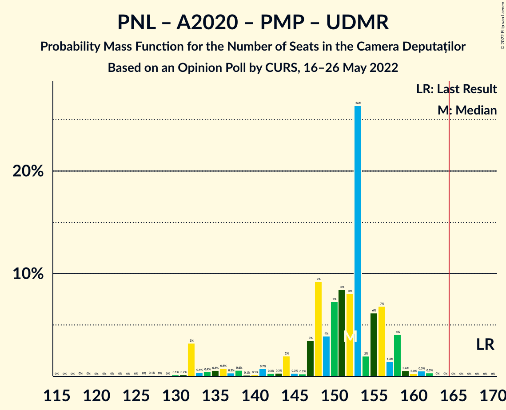

| Number of Seats | Probability | Accumulated | Special Marks |
|:---------------:|:-----------:|:-----------:|:-------------:|
| 118 | 0% | 100% |  |
| 119 | 0% | 99.9% |  |
| 120 | 0% | 99.9% |  |
| 121 | 0% | 99.9% |  |
| 122 | 0% | 99.9% |  |
| 123 | 0% | 99.9% |  |
| 124 | 0% | 99.9% |  |
| 125 | 0% | 99.9% |  |
| 126 | 0% | 99.9% |  |
| 127 | 0.1% | 99.8% |  |
| 128 | 0% | 99.8% |  |
| 129 | 0% | 99.7% |  |
| 130 | 0.1% | 99.7% |  |
| 131 | 0.2% | 99.5% |  |
| 132 | 3% | 99.4% |  |
| 133 | 0.4% | 96% |  |
| 134 | 0.4% | 96% |  |
| 135 | 0.6% | 95% |  |
| 136 | 0.8% | 95% |  |
| 137 | 0.3% | 94% |  |
| 138 | 0.6% | 94% |  |
| 139 | 0.1% | 93% |  |
| 140 | 0.1% | 93% |  |
| 141 | 0.7% | 93% |  |
| 142 | 0.3% | 92% |  |
| 143 | 0.3% | 92% |  |
| 144 | 2% | 92% |  |
| 145 | 0.3% | 90% |  |
| 146 | 0.2% | 89% |  |
| 147 | 3% | 89% |  |
| 148 | 9% | 86% |  |
| 149 | 4% | 76% |  |
| 150 | 7% | 72% |  |
| 151 | 8% | 65% |  |
| 152 | 8% | 57% | Median |
| 153 | 26% | 49% |  |
| 154 | 2% | 22% |  |
| 155 | 6% | 20% |  |
| 156 | 7% | 14% |  |
| 157 | 1.4% | 7% |  |
| 158 | 4% | 6% |  |
| 159 | 0.6% | 2% |  |
| 160 | 0.3% | 1.1% |  |
| 161 | 0.5% | 0.9% |  |
| 162 | 0.3% | 0.4% |  |
| 163 | 0% | 0% |  |
| 164 | 0% | 0% |  |
| 165 | 0% | 0% | Majority |
| 166 | 0% | 0% |  |
| 167 | 0% | 0% |  |
| 168 | 0% | 0% |  |
| 169 | 0% | 0% | Last Result |

### Partidul Social Democrat – PRO România

| Number of Seats | Probability | Accumulated | Special Marks |
|:---------------:|:-----------:|:-----------:|:-------------:|
| 110 | 0% | 100% | Last Result |
| 111 | 0% | 100% |  |
| 112 | 0% | 100% |  |
| 113 | 0% | 100% |  |
| 114 | 0% | 100% |  |
| 115 | 0.1% | 99.9% |  |
| 116 | 0.8% | 99.9% |  |
| 117 | 0.6% | 99.1% |  |
| 118 | 0.3% | 98.5% |  |
| 119 | 3% | 98% |  |
| 120 | 5% | 95% |  |
| 121 | 3% | 90% |  |
| 122 | 8% | 87% |  |
| 123 | 2% | 79% |  |
| 124 | 16% | 77% |  |
| 125 | 31% | 61% | Median |
| 126 | 4% | 30% |  |
| 127 | 4% | 26% |  |
| 128 | 4% | 22% |  |
| 129 | 6% | 18% |  |
| 130 | 3% | 13% |  |
| 131 | 0.5% | 9% |  |
| 132 | 0.9% | 9% |  |
| 133 | 0.6% | 8% |  |
| 134 | 0.3% | 7% |  |
| 135 | 0.5% | 7% |  |
| 136 | 0.6% | 6% |  |
| 137 | 0.6% | 6% |  |
| 138 | 0.3% | 5% |  |
| 139 | 0.9% | 5% |  |
| 140 | 0.3% | 4% |  |
| 141 | 0.2% | 4% |  |
| 142 | 3% | 4% |  |
| 143 | 0.1% | 0.5% |  |
| 144 | 0.2% | 0.4% |  |
| 145 | 0% | 0.2% |  |
| 146 | 0% | 0.2% |  |
| 147 | 0% | 0.1% |  |
| 148 | 0% | 0.1% |  |
| 149 | 0% | 0.1% |  |
| 150 | 0% | 0.1% |  |
| 151 | 0% | 0.1% |  |
| 152 | 0% | 0.1% |  |
| 153 | 0% | 0% |  |

### Partidul Național Liberal – Alianța 2020 USR-PLUS – Partidul Mișcarea Populară

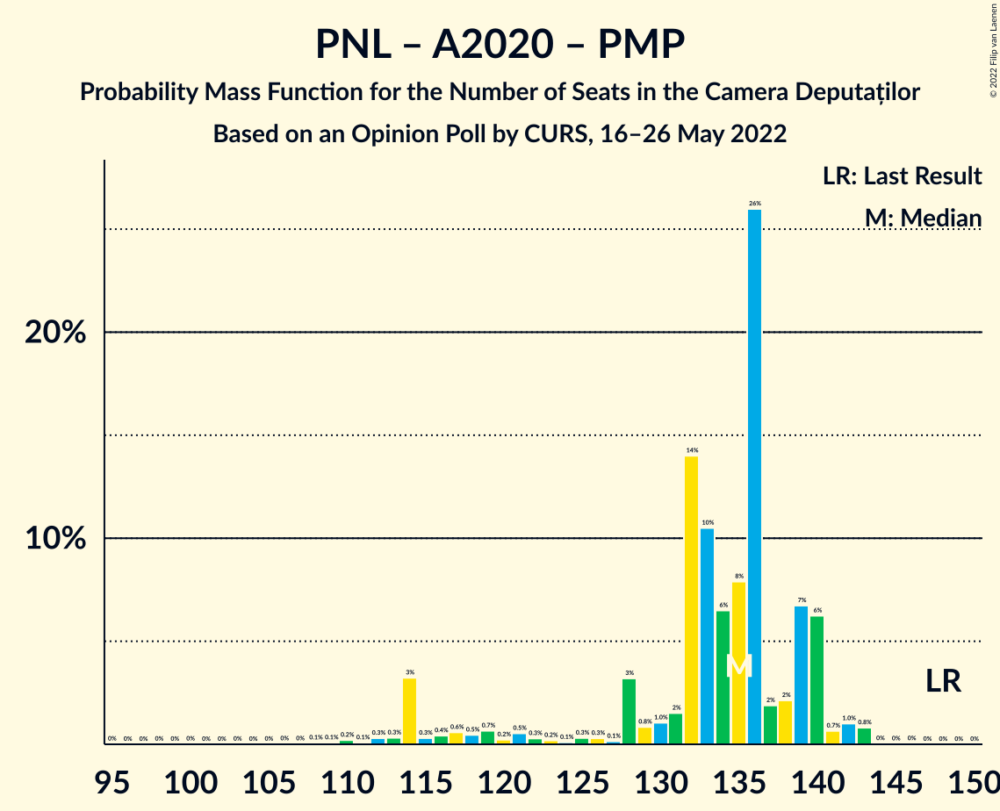

| Number of Seats | Probability | Accumulated | Special Marks |
|:---------------:|:-----------:|:-----------:|:-------------:|
| 98 | 0% | 100% |  |
| 99 | 0% | 99.9% |  |
| 100 | 0% | 99.9% |  |
| 101 | 0% | 99.9% |  |
| 102 | 0% | 99.9% |  |
| 103 | 0% | 99.9% |  |
| 104 | 0% | 99.9% |  |
| 105 | 0% | 99.9% |  |
| 106 | 0% | 99.9% |  |
| 107 | 0% | 99.9% |  |
| 108 | 0.1% | 99.8% |  |
| 109 | 0.1% | 99.8% |  |
| 110 | 0.2% | 99.7% |  |
| 111 | 0.1% | 99.5% |  |
| 112 | 0.3% | 99.4% |  |
| 113 | 0.3% | 99.1% |  |
| 114 | 3% | 98.8% |  |
| 115 | 0.3% | 96% |  |
| 116 | 0.4% | 95% |  |
| 117 | 0.6% | 95% |  |
| 118 | 0.5% | 94% |  |
| 119 | 0.7% | 94% |  |
| 120 | 0.2% | 93% |  |
| 121 | 0.5% | 93% |  |
| 122 | 0.3% | 92% |  |
| 123 | 0.2% | 92% |  |
| 124 | 0.1% | 92% |  |
| 125 | 0.3% | 92% |  |
| 126 | 0.3% | 91% |  |
| 127 | 0.1% | 91% |  |
| 128 | 3% | 91% |  |
| 129 | 0.8% | 88% |  |
| 130 | 1.0% | 87% |  |
| 131 | 2% | 86% |  |
| 132 | 14% | 84% |  |
| 133 | 10% | 70% |  |
| 134 | 6% | 60% |  |
| 135 | 8% | 53% | Median |
| 136 | 26% | 46% |  |
| 137 | 2% | 20% |  |
| 138 | 2% | 18% |  |
| 139 | 7% | 16% |  |
| 140 | 6% | 9% |  |
| 141 | 0.7% | 3% |  |
| 142 | 1.0% | 2% |  |
| 143 | 0.8% | 0.9% |  |
| 144 | 0% | 0.1% |  |
| 145 | 0% | 0.1% |  |
| 146 | 0% | 0% |  |
| 147 | 0% | 0% |  |
| 148 | 0% | 0% | Last Result |

### Partidul Național Liberal – Alianța 2020 USR-PLUS – Uniunea Democrată Maghiară din România

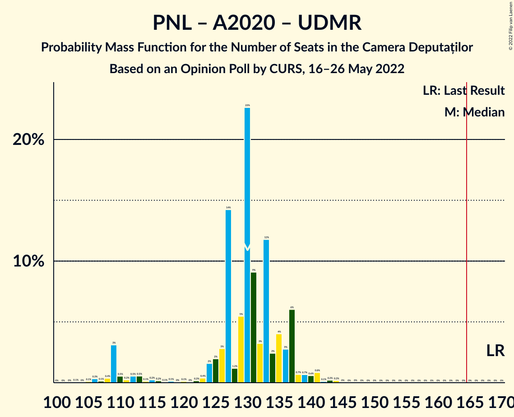

| Number of Seats | Probability | Accumulated | Special Marks |
|:---------------:|:-----------:|:-----------:|:-------------:|
| 103 | 0.1% | 100% |  |
| 104 | 0% | 99.9% |  |
| 105 | 0.1% | 99.9% |  |
| 106 | 0.3% | 99.8% |  |
| 107 | 0.1% | 99.5% |  |
| 108 | 0.4% | 99.3% |  |
| 109 | 3% | 99.0% |  |
| 110 | 0.5% | 96% |  |
| 111 | 0.2% | 95% |  |
| 112 | 0.5% | 95% |  |
| 113 | 0.5% | 95% |  |
| 114 | 0.1% | 94% |  |
| 115 | 0.2% | 94% |  |
| 116 | 0.2% | 94% |  |
| 117 | 0.1% | 93% |  |
| 118 | 0.1% | 93% |  |
| 119 | 0% | 93% |  |
| 120 | 0.1% | 93% |  |
| 121 | 0% | 93% |  |
| 122 | 0.2% | 93% |  |
| 123 | 0.4% | 93% |  |
| 124 | 2% | 93% |  |
| 125 | 2% | 91% |  |
| 126 | 3% | 89% |  |
| 127 | 14% | 86% |  |
| 128 | 1.2% | 72% |  |
| 129 | 5% | 71% |  |
| 130 | 23% | 65% | Median |
| 131 | 9% | 43% |  |
| 132 | 3% | 34% |  |
| 133 | 12% | 30% |  |
| 134 | 2% | 19% |  |
| 135 | 4% | 16% |  |
| 136 | 3% | 12% |  |
| 137 | 6% | 9% |  |
| 138 | 0.7% | 3% |  |
| 139 | 0.7% | 3% |  |
| 140 | 0.6% | 2% |  |
| 141 | 0.8% | 1.4% |  |
| 142 | 0.1% | 0.6% |  |
| 143 | 0.2% | 0.5% |  |
| 144 | 0.2% | 0.2% |  |
| 145 | 0% | 0.1% |  |
| 146 | 0% | 0% |  |
| 147 | 0% | 0% |  |
| 148 | 0% | 0% |  |
| 149 | 0% | 0% |  |
| 150 | 0% | 0% |  |
| 151 | 0% | 0% |  |
| 152 | 0% | 0% |  |
| 153 | 0% | 0% |  |
| 154 | 0% | 0% |  |
| 155 | 0% | 0% |  |
| 156 | 0% | 0% |  |
| 157 | 0% | 0% |  |
| 158 | 0% | 0% |  |
| 159 | 0% | 0% |  |
| 160 | 0% | 0% |  |
| 161 | 0% | 0% |  |
| 162 | 0% | 0% |  |
| 163 | 0% | 0% |  |
| 164 | 0% | 0% |  |
| 165 | 0% | 0% | Majority |
| 166 | 0% | 0% |  |
| 167 | 0% | 0% |  |
| 168 | 0% | 0% |  |
| 169 | 0% | 0% | Last Result |

### Partidul Național Liberal – Partidul Mișcarea Populară – Uniunea Democrată Maghiară din România

| Number of Seats | Probability | Accumulated | Special Marks |
|:---------------:|:-----------:|:-----------:|:-------------:|
| 101 | 0% | 100% |  |
| 102 | 0.1% | 99.9% |  |
| 103 | 0.3% | 99.9% |  |
| 104 | 0.1% | 99.5% |  |
| 105 | 0.1% | 99.4% |  |
| 106 | 0.1% | 99.3% |  |
| 107 | 0.2% | 99.2% |  |
| 108 | 0.1% | 99.0% |  |
| 109 | 0.3% | 98.9% |  |
| 110 | 0.4% | 98.6% |  |
| 111 | 0.1% | 98% |  |
| 112 | 0.3% | 98% |  |
| 113 | 1.1% | 98% |  |
| 114 | 4% | 97% | Last Result |
| 115 | 0.7% | 93% |  |
| 116 | 4% | 93% |  |
| 117 | 12% | 89% |  |
| 118 | 2% | 77% |  |
| 119 | 10% | 75% |  |
| 120 | 10% | 65% | Median |
| 121 | 29% | 55% |  |
| 122 | 6% | 26% |  |
| 123 | 5% | 20% |  |
| 124 | 0.7% | 16% |  |
| 125 | 6% | 15% |  |
| 126 | 0.6% | 9% |  |
| 127 | 1.1% | 9% |  |
| 128 | 0.9% | 8% |  |
| 129 | 0.2% | 7% |  |
| 130 | 0.2% | 6% |  |
| 131 | 0.2% | 6% |  |
| 132 | 3% | 6% |  |
| 133 | 0.4% | 3% |  |
| 134 | 0.4% | 3% |  |
| 135 | 0.5% | 2% |  |
| 136 | 0.7% | 2% |  |
| 137 | 0.2% | 0.9% |  |
| 138 | 0.3% | 0.8% |  |
| 139 | 0% | 0.4% |  |
| 140 | 0.1% | 0.4% |  |
| 141 | 0.2% | 0.3% |  |
| 142 | 0.2% | 0.2% |  |
| 143 | 0% | 0% |  |

### Partidul Național Liberal – Alianța 2020 USR-PLUS

| Number of Seats | Probability | Accumulated | Special Marks |
|:---------------:|:-----------:|:-----------:|:-------------:|
| 84 | 0.1% | 100% |  |
| 85 | 0% | 99.9% |  |
| 86 | 0.2% | 99.9% |  |
| 87 | 0.3% | 99.7% |  |
| 88 | 0.2% | 99.5% |  |
| 89 | 0.5% | 99.3% |  |
| 90 | 0.3% | 98.7% |  |
| 91 | 3% | 98% |  |
| 92 | 0.6% | 95% |  |
| 93 | 0.4% | 95% |  |
| 94 | 0.2% | 94% |  |
| 95 | 0.4% | 94% |  |
| 96 | 0.2% | 94% |  |
| 97 | 0% | 93% |  |
| 98 | 0.1% | 93% |  |
| 99 | 0% | 93% |  |
| 100 | 0% | 93% |  |
| 101 | 0% | 93% |  |
| 102 | 0% | 93% |  |
| 103 | 0% | 93% |  |
| 104 | 0.2% | 93% |  |
| 105 | 0.2% | 93% |  |
| 106 | 1.5% | 93% |  |
| 107 | 0.4% | 91% |  |
| 108 | 2% | 91% |  |
| 109 | 3% | 89% |  |
| 110 | 6% | 86% |  |
| 111 | 11% | 80% |  |
| 112 | 6% | 69% |  |
| 113 | 21% | 63% | Median |
| 114 | 12% | 42% |  |
| 115 | 6% | 31% |  |
| 116 | 5% | 25% |  |
| 117 | 6% | 20% |  |
| 118 | 3% | 14% |  |
| 119 | 4% | 10% |  |
| 120 | 0.8% | 6% |  |
| 121 | 4% | 5% |  |
| 122 | 0.7% | 1.4% |  |
| 123 | 0.2% | 0.7% |  |
| 124 | 0.1% | 0.5% |  |
| 125 | 0.2% | 0.4% |  |
| 126 | 0.1% | 0.2% |  |
| 127 | 0.1% | 0.1% |  |
| 128 | 0% | 0% |  |
| 129 | 0% | 0% |  |
| 130 | 0% | 0% |  |
| 131 | 0% | 0% |  |
| 132 | 0% | 0% |  |
| 133 | 0% | 0% |  |
| 134 | 0% | 0% |  |
| 135 | 0% | 0% |  |
| 136 | 0% | 0% |  |
| 137 | 0% | 0% |  |
| 138 | 0% | 0% |  |
| 139 | 0% | 0% |  |
| 140 | 0% | 0% |  |
| 141 | 0% | 0% |  |
| 142 | 0% | 0% |  |
| 143 | 0% | 0% |  |
| 144 | 0% | 0% |  |
| 145 | 0% | 0% |  |
| 146 | 0% | 0% |  |
| 147 | 0% | 0% |  |
| 148 | 0% | 0% | Last Result |

### Partidul Național Liberal – Partidul Mișcarea Populară

| Number of Seats | Probability | Accumulated | Special Marks |
|:---------------:|:-----------:|:-----------:|:-------------:|
| 83 | 0% | 100% |  |
| 84 | 0.3% | 99.9% |  |
| 85 | 0.1% | 99.6% |  |
| 86 | 0.2% | 99.5% |  |
| 87 | 0.1% | 99.4% |  |
| 88 | 0.2% | 99.3% |  |
| 89 | 0.2% | 99.1% |  |
| 90 | 0.3% | 98.9% |  |
| 91 | 0.1% | 98.6% |  |
| 92 | 0.1% | 98% |  |
| 93 | 0.2% | 98% | Last Result |
| 94 | 0.7% | 98% |  |
| 95 | 0.2% | 97% |  |
| 96 | 0.2% | 97% |  |
| 97 | 1.1% | 97% |  |
| 98 | 5% | 96% |  |
| 99 | 5% | 91% |  |
| 100 | 3% | 86% |  |
| 101 | 13% | 84% |  |
| 102 | 10% | 71% |  |
| 103 | 5% | 61% | Median |
| 104 | 32% | 56% |  |
| 105 | 5% | 25% |  |
| 106 | 4% | 19% |  |
| 107 | 5% | 15% |  |
| 108 | 2% | 11% |  |
| 109 | 0.8% | 8% |  |
| 110 | 1.1% | 8% |  |
| 111 | 0.3% | 6% |  |
| 112 | 0.4% | 6% |  |
| 113 | 0.3% | 6% |  |
| 114 | 3% | 6% |  |
| 115 | 0.3% | 2% |  |
| 116 | 0.4% | 2% |  |
| 117 | 0.6% | 2% |  |
| 118 | 0.4% | 1.1% |  |
| 119 | 0.3% | 0.7% |  |
| 120 | 0.1% | 0.4% |  |
| 121 | 0% | 0.3% |  |
| 122 | 0.2% | 0.2% |  |
| 123 | 0% | 0% |  |

### Partidul Național Liberal – Uniunea Democrată Maghiară din România

| Number of Seats | Probability | Accumulated | Special Marks |
|:---------------:|:-----------:|:-----------:|:-------------:|
| 89 | 0.1% | 100% |  |
| 90 | 0.1% | 99.8% |  |
| 91 | 0.5% | 99.8% |  |
| 92 | 0.5% | 99.3% |  |
| 93 | 2% | 98.8% |  |
| 94 | 4% | 96% |  |
| 95 | 3% | 92% |  |
| 96 | 14% | 90% |  |
| 97 | 1.5% | 76% |  |
| 98 | 28% | 74% | Median |
| 99 | 4% | 46% |  |
| 100 | 6% | 42% |  |
| 101 | 14% | 36% |  |
| 102 | 3% | 22% |  |
| 103 | 5% | 19% |  |
| 104 | 4% | 14% |  |
| 105 | 0.6% | 11% |  |
| 106 | 1.5% | 10% |  |
| 107 | 1.2% | 8% |  |
| 108 | 0.8% | 7% |  |
| 109 | 3% | 6% |  |
| 110 | 0.9% | 3% |  |
| 111 | 0.3% | 2% |  |
| 112 | 0.6% | 2% |  |
| 113 | 0.6% | 1.3% |  |
| 114 | 0.1% | 0.7% | Last Result |
| 115 | 0.2% | 0.6% |  |
| 116 | 0.2% | 0.3% |  |
| 117 | 0% | 0.2% |  |
| 118 | 0.1% | 0.1% |  |
| 119 | 0% | 0.1% |  |
| 120 | 0% | 0% |  |

### Partidul Național Liberal

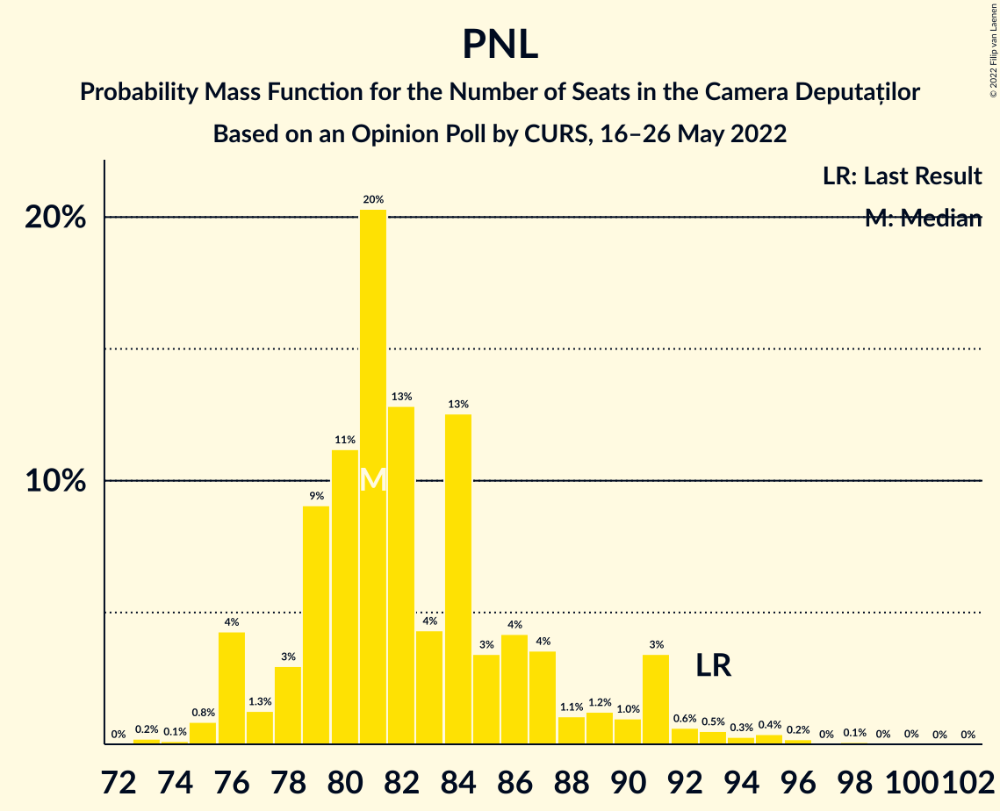

| Number of Seats | Probability | Accumulated | Special Marks |
|:---------------:|:-----------:|:-----------:|:-------------:|
| 73 | 0.2% | 100% |  |
| 74 | 0.1% | 99.8% |  |
| 75 | 0.8% | 99.6% |  |
| 76 | 4% | 98.8% |  |
| 77 | 1.3% | 95% |  |
| 78 | 3% | 93% |  |
| 79 | 9% | 90% |  |
| 80 | 11% | 81% |  |
| 81 | 20% | 70% | Median |
| 82 | 13% | 50% |  |
| 83 | 4% | 37% |  |
| 84 | 13% | 33% |  |
| 85 | 3% | 20% |  |
| 86 | 4% | 17% |  |
| 87 | 4% | 12% |  |
| 88 | 1.1% | 9% |  |
| 89 | 1.2% | 8% |  |
| 90 | 1.0% | 7% |  |
| 91 | 3% | 6% |  |
| 92 | 0.6% | 2% |  |
| 93 | 0.5% | 2% | Last Result |
| 94 | 0.3% | 1.0% |  |
| 95 | 0.4% | 0.8% |  |
| 96 | 0.2% | 0.4% |  |
| 97 | 0% | 0.2% |  |
| 98 | 0.1% | 0.2% |  |
| 99 | 0% | 0.1% |  |
| 100 | 0% | 0.1% |  |
| 101 | 0% | 0% |  |

### Alianța 2020 USR-PLUS – Partidul Mișcarea Populară

| Number of Seats | Probability | Accumulated | Special Marks |
|:---------------:|:-----------:|:-----------:|:-------------:|
| 0 | 0.1% | 100% |  |
| 1 | 0% | 99.9% |  |
| 2 | 0% | 99.9% |  |
| 3 | 0% | 99.9% |  |
| 4 | 0% | 99.9% |  |
| 5 | 0% | 99.9% |  |
| 6 | 0% | 99.9% |  |
| 7 | 0% | 99.9% |  |
| 8 | 0% | 99.9% |  |
| 9 | 0% | 99.9% |  |
| 10 | 0% | 99.9% |  |
| 11 | 0% | 99.9% |  |
| 12 | 0% | 99.9% |  |
| 13 | 0% | 99.9% |  |
| 14 | 0% | 99.9% |  |
| 15 | 0% | 99.9% |  |
| 16 | 0% | 99.9% |  |
| 17 | 0% | 99.9% |  |
| 18 | 0% | 99.9% |  |
| 19 | 0% | 99.9% |  |
| 20 | 0.1% | 99.9% |  |
| 21 | 0.2% | 99.9% |  |
| 22 | 0.3% | 99.7% |  |
| 23 | 4% | 99.4% |  |
| 24 | 0.7% | 96% |  |
| 25 | 0.4% | 95% |  |
| 26 | 0.6% | 94% |  |
| 27 | 0.4% | 94% |  |
| 28 | 0.1% | 93% |  |
| 29 | 0% | 93% |  |
| 30 | 0% | 93% |  |
| 31 | 0.3% | 93% |  |
| 32 | 0.6% | 93% |  |
| 33 | 0.1% | 92% |  |
| 34 | 0.1% | 92% |  |
| 35 | 0.4% | 92% |  |
| 36 | 0.1% | 92% |  |
| 37 | 0.1% | 92% |  |
| 38 | 0% | 92% |  |
| 39 | 0% | 92% |  |
| 40 | 0% | 92% |  |
| 41 | 0% | 92% |  |
| 42 | 0% | 92% |  |
| 43 | 0% | 92% |  |
| 44 | 0% | 92% |  |
| 45 | 0% | 92% |  |
| 46 | 0% | 92% |  |
| 47 | 0.1% | 92% |  |
| 48 | 0.2% | 91% |  |
| 49 | 1.1% | 91% |  |
| 50 | 9% | 90% |  |
| 51 | 8% | 81% |  |
| 52 | 15% | 73% |  |
| 53 | 9% | 58% |  |
| 54 | 13% | 48% | Median |
| 55 | 24% | 36% | Last Result |
| 56 | 4% | 12% |  |
| 57 | 6% | 8% |  |
| 58 | 0.8% | 2% |  |
| 59 | 0.7% | 0.9% |  |
| 60 | 0.1% | 0.2% |  |
| 61 | 0% | 0.1% |  |
| 62 | 0% | 0% |  |

## Technical Information

### Opinion Poll

+ **Polling firm:** CURS
+ **Commissioner(s):** —
+ **Fieldwork period:** 16–26 May 2022

### Calculations

+ **Sample size:** 2750
+ **Simulations done:** 1,048,576
+ **Error estimate:** 0.70%

