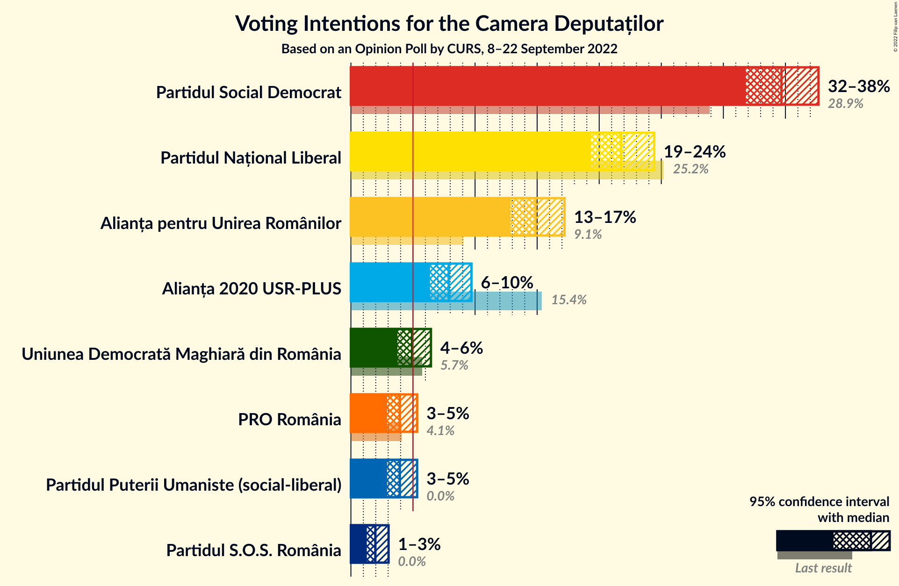
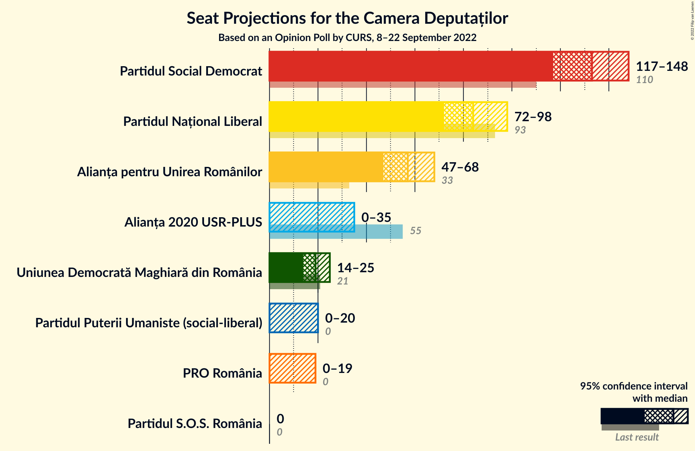
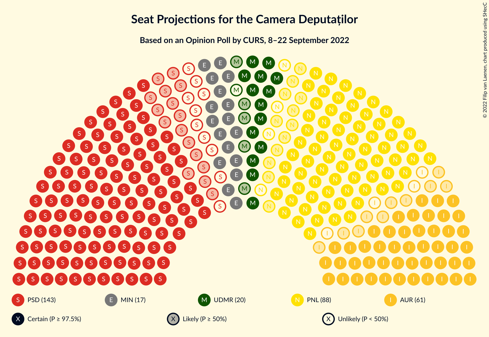
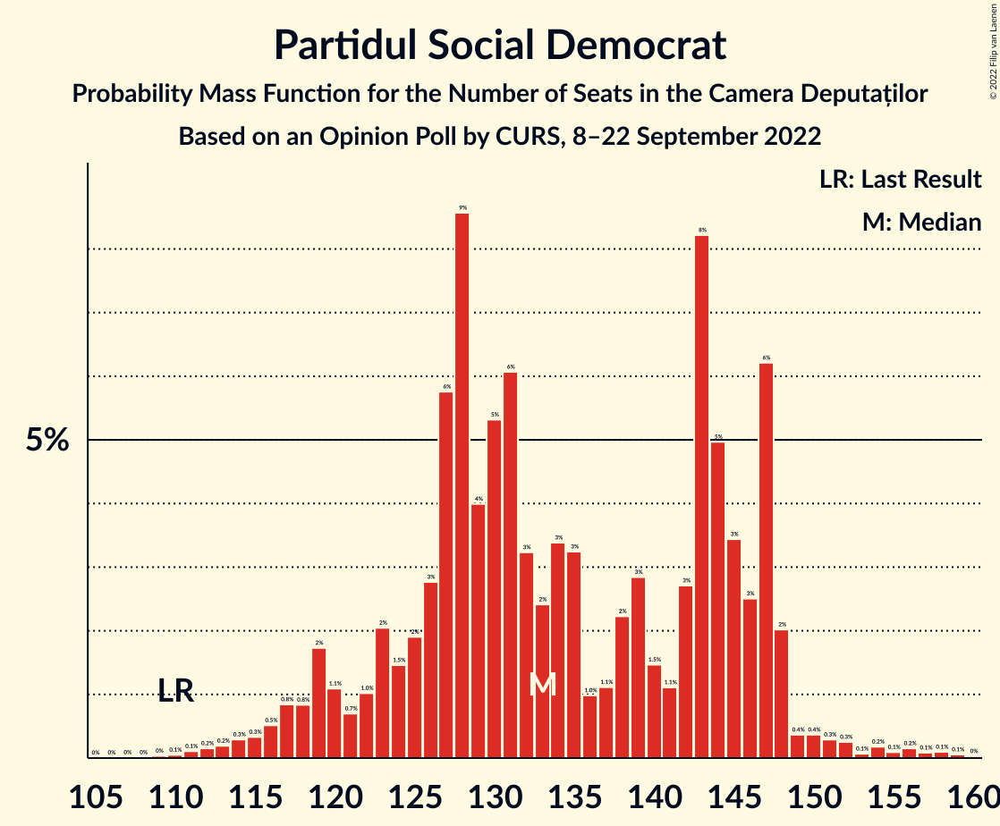
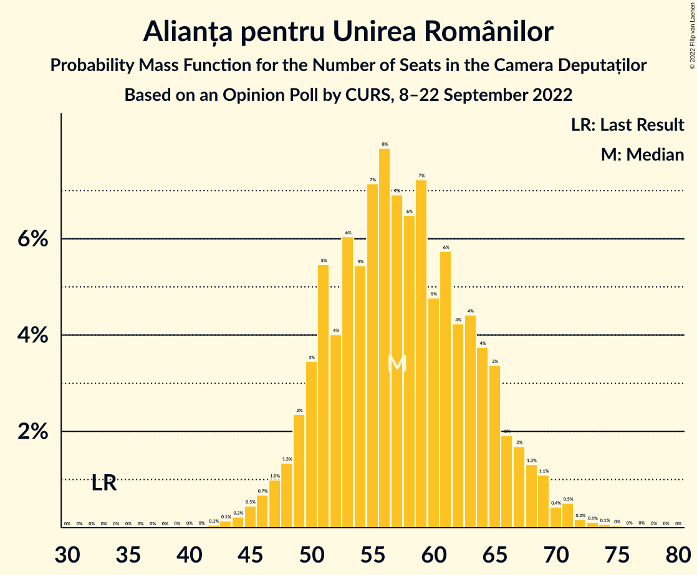
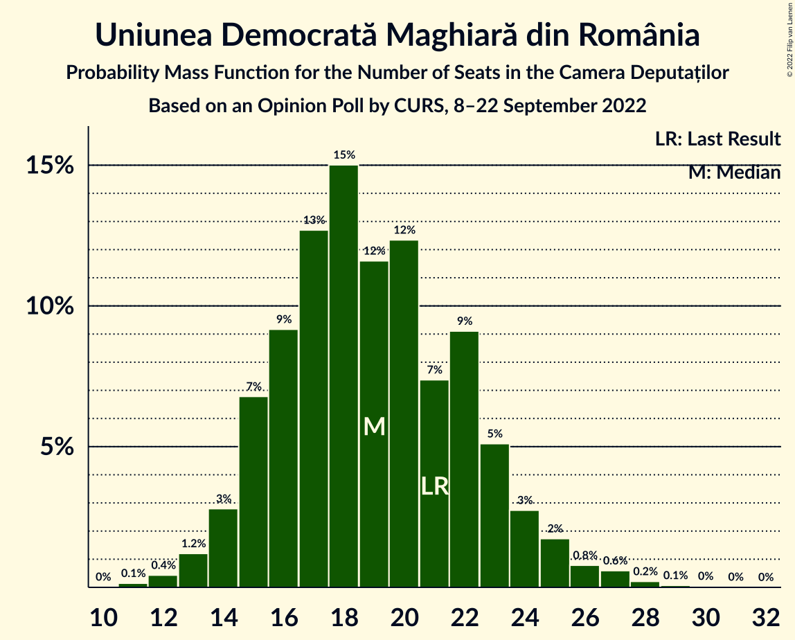
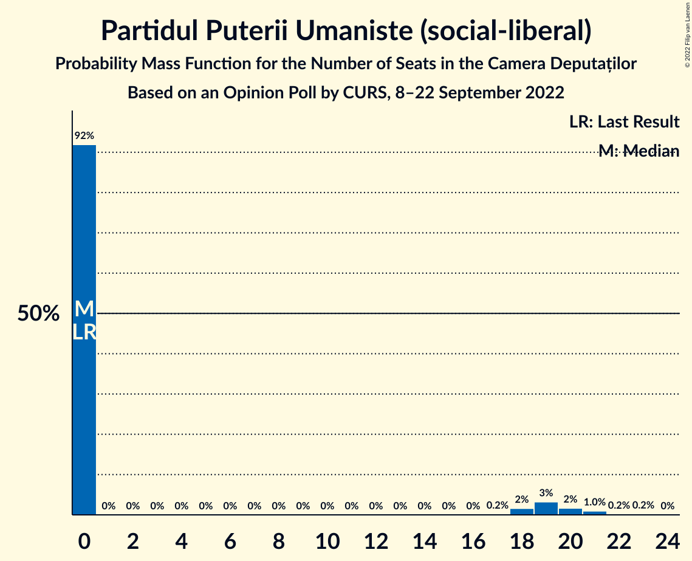
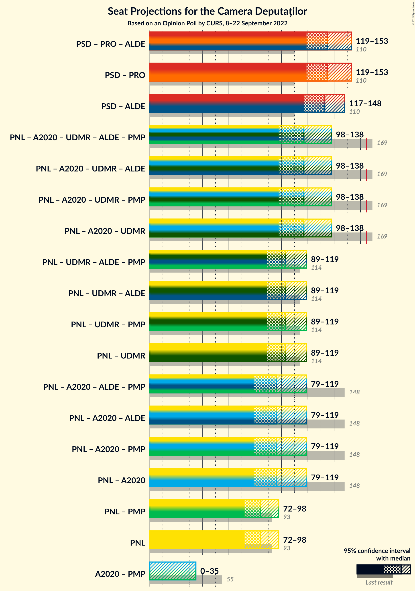
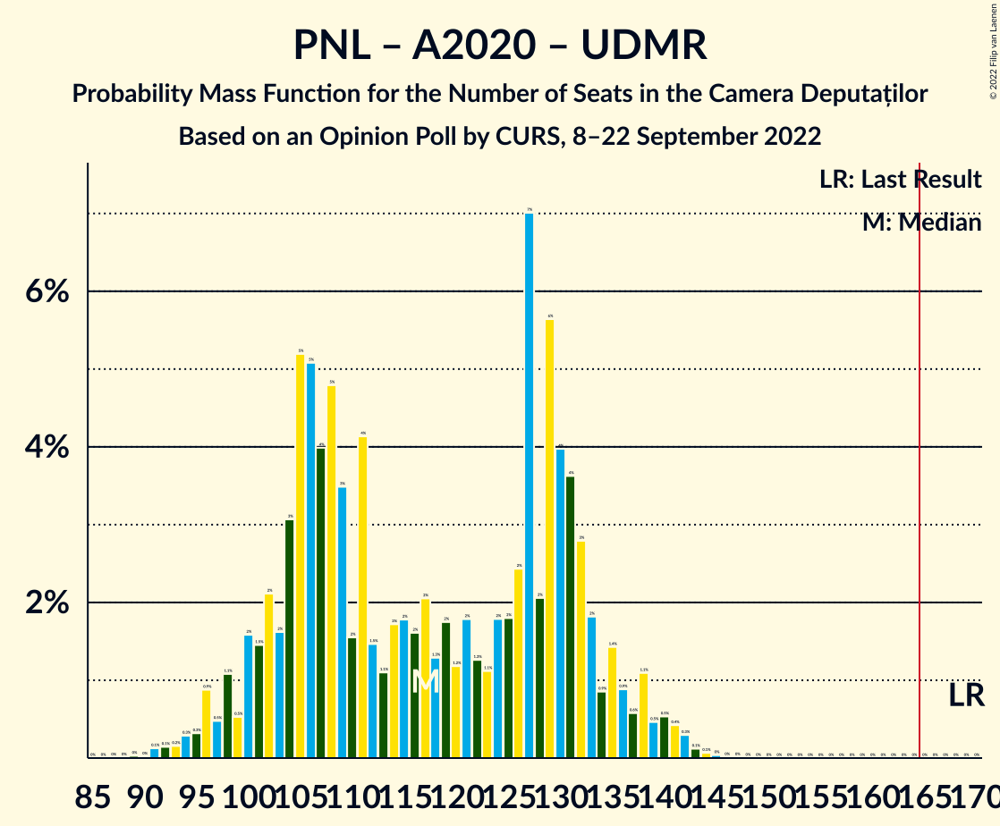
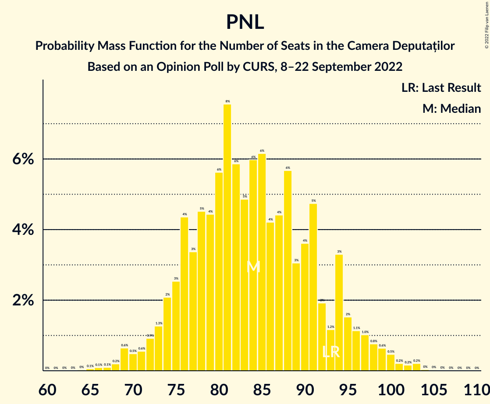

# Opinion Poll by CURS, 8–22 September 2022

<a href="#voting-intentions">Voting Intentions</a> | <a href="#seats">Seats</a> | <a href="#coalitions">Coalitions</a> | <a href="#technical-information">Technical Information</a>

## Voting Intentions

### Confidence Intervals

| Party | Last Result | Poll Result | 80% Confidence Interval | 90% Confidence Interval | 95% Confidence Interval | 99% Confidence Interval |
|:-----:|:-----------:|:-----------:|:-----------------------:|:-----------------------:|:-----------------------:|:-----------------------:|
| Partidul Social Democrat | 28.9% | 34.7% | 32.8–36.6% |32.3–37.2% |31.8–37.7% |30.9–38.6% |
| Partidul Național Liberal | 25.2% | 21.8% | 20.2–23.5% |19.7–24.0% |19.3–24.4% |18.6–25.3% |
| Alianța pentru Unirea Românilor | 9.1% | 14.9% | 13.5–16.4% |13.1–16.8% |12.8–17.2% |12.2–18.0% |
| Alianța 2020 USR-PLUS | 15.4% | 7.9% | 6.9–9.1% |6.6–9.4% |6.4–9.7% |5.9–10.3% |
| Uniunea Democrată Maghiară din România | 5.7% | 4.9% | 4.1–5.9% |3.9–6.2% |3.7–6.4% |3.4–7.0% |
| PRO România | 4.1% | 3.9% | 3.3–4.8% |3.1–5.1% |2.9–5.3% |2.6–5.8% |
| Partidul Puterii Umaniste (social-liberal) | 0.0% | 3.9% | 3.3–4.8% |3.1–5.1% |2.9–5.3% |2.6–5.8% |
| Partidul S.O.S. România | 0.0% | 2.0% | 1.5–2.7% |1.4–2.9% |1.3–3.0% |1.1–3.4% |

*Note:* The poll result column reflects the actual value used in the calculations. Published results may vary slightly, and in addition be rounded to fewer digits.

## Seats

### Confidence Intervals

| Party | Last Result | Median | 80% Confidence Interval | 90% Confidence Interval | 95% Confidence Interval | 99% Confidence Interval |
|:-----:|:-----------:|:------:|:-----------------------:|:-----------------------:|:-----------------------:|:-----------------------:|
| <a href="#partidul-social-democrat">Partidul Social Democrat</a> | 110 | 133 | 124–147 |119–147 |117–148 |113–155 |
| <a href="#partidul-național-liberal">Partidul Național Liberal</a> | 93 | 84 | 76–93 |74–95 |72–98 |69–101 |
| <a href="#alianța-pentru-unirea-românilor">Alianța pentru Unirea Românilor</a> | 33 | 57 | 51–65 |49–67 |47–68 |45–71 |
| <a href="#alianța-2020-usr-plus">Alianța 2020 USR-PLUS</a> | 55 | 0 | 0–33 |0–34 |0–35 |0–38 |
| <a href="#uniunea-democrată-maghiară-din-românia">Uniunea Democrată Maghiară din România</a> | 21 | 19 | 15–23 |15–24 |14–25 |12–27 |
| <a href="#pro-românia">PRO România</a> | 0 | 0 | 0 |0–18 |0–19 |0–21 |
| <a href="#partidul-puterii-umaniste-(social-liberal)">Partidul Puterii Umaniste (social-liberal)</a> | 0 | 0 | 0 |0–19 |0–20 |0–21 |
| <a href="#partidul-s.o.s.-românia">Partidul S.O.S. România</a> | 0 | 0 | 0 |0 |0 |0 |

### Partidul Social Democrat

*For a full overview of the results for this party, see the [Partidul Social Democrat](party-partidulsocialdemocrat.html) page.*

| Number of Seats | Probability | Accumulated | Special Marks |
|:---------------:|:-----------:|:-----------:|:-------------:|
| 109 | 0% | 100% |  |
| 110 | 0.1% | 99.9% | Last Result |
| 111 | 0.1% | 99.9% |  |
| 112 | 0.2% | 99.8% |  |
| 113 | 0.2% | 99.6% |  |
| 114 | 0.3% | 99.4% |  |
| 115 | 0.3% | 99.1% |  |
| 116 | 0.5% | 98.8% |  |
| 117 | 0.8% | 98% |  |
| 118 | 0.8% | 97% |  |
| 119 | 2% | 97% |  |
| 120 | 1.1% | 95% |  |
| 121 | 0.7% | 94% |  |
| 122 | 1.0% | 93% |  |
| 123 | 2% | 92% |  |
| 124 | 1.5% | 90% |  |
| 125 | 2% | 89% |  |
| 126 | 3% | 87% |  |
| 127 | 6% | 84% |  |
| 128 | 9% | 78% |  |
| 129 | 4% | 70% |  |
| 130 | 5% | 66% |  |
| 131 | 6% | 60% |  |
| 132 | 3% | 54% |  |
| 133 | 2% | 51% | Median |
| 134 | 3% | 49% |  |
| 135 | 3% | 45% |  |
| 136 | 1.0% | 42% |  |
| 137 | 1.1% | 41% |  |
| 138 | 2% | 40% |  |
| 139 | 3% | 38% |  |
| 140 | 1.5% | 35% |  |
| 141 | 1.1% | 33% |  |
| 142 | 3% | 32% |  |
| 143 | 8% | 29% |  |
| 144 | 5% | 21% |  |
| 145 | 3% | 16% |  |
| 146 | 3% | 13% |  |
| 147 | 6% | 10% |  |
| 148 | 2% | 4% |  |
| 149 | 0.4% | 2% |  |
| 150 | 0.4% | 2% |  |
| 151 | 0.3% | 1.3% |  |
| 152 | 0.3% | 1.0% |  |
| 153 | 0.1% | 0.8% |  |
| 154 | 0.2% | 0.7% |  |
| 155 | 0.1% | 0.5% |  |
| 156 | 0.2% | 0.4% |  |
| 157 | 0.1% | 0.3% |  |
| 158 | 0.1% | 0.2% |  |
| 159 | 0.1% | 0.1% |  |
| 160 | 0% | 0% |  |

### Partidul Național Liberal

*For a full overview of the results for this party, see the [Partidul Național Liberal](party-partidulnaționalliberal.html) page.*

| Number of Seats | Probability | Accumulated | Special Marks |
|:---------------:|:-----------:|:-----------:|:-------------:|
| 65 | 0.1% | 100% |  |
| 66 | 0.1% | 99.9% |  |
| 67 | 0.1% | 99.8% |  |
| 68 | 0.2% | 99.7% |  |
| 69 | 0.6% | 99.5% |  |
| 70 | 0.5% | 98.9% |  |
| 71 | 0.6% | 98% |  |
| 72 | 0.9% | 98% |  |
| 73 | 1.3% | 97% |  |
| 74 | 2% | 96% |  |
| 75 | 3% | 94% |  |
| 76 | 4% | 91% |  |
| 77 | 3% | 87% |  |
| 78 | 5% | 83% |  |
| 79 | 4% | 79% |  |
| 80 | 6% | 74% |  |
| 81 | 8% | 69% |  |
| 82 | 6% | 61% |  |
| 83 | 5% | 55% |  |
| 84 | 6% | 50% | Median |
| 85 | 6% | 44% |  |
| 86 | 4% | 38% |  |
| 87 | 4% | 34% |  |
| 88 | 6% | 30% |  |
| 89 | 3% | 24% |  |
| 90 | 4% | 21% |  |
| 91 | 5% | 17% |  |
| 92 | 2% | 13% |  |
| 93 | 1.2% | 11% | Last Result |
| 94 | 3% | 10% |  |
| 95 | 2% | 6% |  |
| 96 | 1.1% | 5% |  |
| 97 | 1.0% | 4% |  |
| 98 | 0.8% | 3% |  |
| 99 | 0.6% | 2% |  |
| 100 | 0.5% | 1.1% |  |
| 101 | 0.2% | 0.7% |  |
| 102 | 0.2% | 0.5% |  |
| 103 | 0.2% | 0.3% |  |
| 104 | 0% | 0.1% |  |
| 105 | 0% | 0.1% |  |
| 106 | 0% | 0% |  |

### Alianța pentru Unirea Românilor

*For a full overview of the results for this party, see the [Alianța pentru Unirea Românilor](party-alianțapentruunirearomânilor.html) page.*

| Number of Seats | Probability | Accumulated | Special Marks |
|:---------------:|:-----------:|:-----------:|:-------------:|
| 33 | 0% | 100% | Last Result |
| 34 | 0% | 100% |  |
| 35 | 0% | 100% |  |
| 36 | 0% | 100% |  |
| 37 | 0% | 100% |  |
| 38 | 0% | 100% |  |
| 39 | 0% | 100% |  |
| 40 | 0% | 100% |  |
| 41 | 0% | 100% |  |
| 42 | 0.1% | 100% |  |
| 43 | 0.1% | 99.9% |  |
| 44 | 0.2% | 99.8% |  |
| 45 | 0.5% | 99.6% |  |
| 46 | 0.7% | 99.1% |  |
| 47 | 1.0% | 98% |  |
| 48 | 1.3% | 97% |  |
| 49 | 2% | 96% |  |
| 50 | 3% | 94% |  |
| 51 | 5% | 90% |  |
| 52 | 4% | 85% |  |
| 53 | 6% | 81% |  |
| 54 | 5% | 75% |  |
| 55 | 7% | 69% |  |
| 56 | 8% | 62% |  |
| 57 | 7% | 54% | Median |
| 58 | 6% | 47% |  |
| 59 | 7% | 41% |  |
| 60 | 5% | 34% |  |
| 61 | 6% | 29% |  |
| 62 | 4% | 23% |  |
| 63 | 4% | 19% |  |
| 64 | 4% | 15% |  |
| 65 | 3% | 11% |  |
| 66 | 2% | 7% |  |
| 67 | 2% | 5% |  |
| 68 | 1.3% | 4% |  |
| 69 | 1.1% | 2% |  |
| 70 | 0.4% | 1.4% |  |
| 71 | 0.5% | 0.9% |  |
| 72 | 0.2% | 0.4% |  |
| 73 | 0.1% | 0.3% |  |
| 74 | 0.1% | 0.2% |  |
| 75 | 0% | 0.1% |  |
| 76 | 0% | 0% |  |

### Alianța 2020 USR-PLUS

*For a full overview of the results for this party, see the [Alianța 2020 USR-PLUS](party-alianța2020usr-plus.html) page.*

| Number of Seats | Probability | Accumulated | Special Marks |
|:---------------:|:-----------:|:-----------:|:-------------:|
| 0 | 54% | 100% | Median |
| 1 | 0% | 46% |  |
| 2 | 0% | 46% |  |
| 3 | 0% | 46% |  |
| 4 | 0% | 46% |  |
| 5 | 0% | 46% |  |
| 6 | 0% | 46% |  |
| 7 | 0% | 46% |  |
| 8 | 0% | 46% |  |
| 9 | 0% | 46% |  |
| 10 | 0% | 46% |  |
| 11 | 0% | 46% |  |
| 12 | 0% | 46% |  |
| 13 | 0% | 46% |  |
| 14 | 0% | 46% |  |
| 15 | 0% | 46% |  |
| 16 | 0% | 46% |  |
| 17 | 0% | 46% |  |
| 18 | 0% | 46% |  |
| 19 | 0% | 46% |  |
| 20 | 0% | 46% |  |
| 21 | 0% | 46% |  |
| 22 | 0% | 46% |  |
| 23 | 0% | 46% |  |
| 24 | 0% | 46% |  |
| 25 | 0% | 46% |  |
| 26 | 0% | 46% |  |
| 27 | 0% | 46% |  |
| 28 | 0.6% | 46% |  |
| 29 | 3% | 45% |  |
| 30 | 10% | 42% |  |
| 31 | 9% | 32% |  |
| 32 | 8% | 23% |  |
| 33 | 7% | 14% |  |
| 34 | 4% | 8% |  |
| 35 | 2% | 4% |  |
| 36 | 1.0% | 2% |  |
| 37 | 0.4% | 1.0% |  |
| 38 | 0.4% | 0.6% |  |
| 39 | 0.2% | 0.3% |  |
| 40 | 0.1% | 0.1% |  |
| 41 | 0% | 0% |  |
| 42 | 0% | 0% |  |
| 43 | 0% | 0% |  |
| 44 | 0% | 0% |  |
| 45 | 0% | 0% |  |
| 46 | 0% | 0% |  |
| 47 | 0% | 0% |  |
| 48 | 0% | 0% |  |
| 49 | 0% | 0% |  |
| 50 | 0% | 0% |  |
| 51 | 0% | 0% |  |
| 52 | 0% | 0% |  |
| 53 | 0% | 0% |  |
| 54 | 0% | 0% |  |
| 55 | 0% | 0% | Last Result |

### Uniunea Democrată Maghiară din România

*For a full overview of the results for this party, see the [Uniunea Democrată Maghiară din România](party-uniuneademocratămaghiarădinromânia.html) page.*

| Number of Seats | Probability | Accumulated | Special Marks |
|:---------------:|:-----------:|:-----------:|:-------------:|
| 11 | 0.1% | 100% |  |
| 12 | 0.4% | 99.8% |  |
| 13 | 1.2% | 99.4% |  |
| 14 | 3% | 98% |  |
| 15 | 7% | 95% |  |
| 16 | 9% | 89% |  |
| 17 | 13% | 79% |  |
| 18 | 15% | 67% |  |
| 19 | 12% | 52% | Median |
| 20 | 12% | 40% |  |
| 21 | 7% | 28% | Last Result |
| 22 | 9% | 20% |  |
| 23 | 5% | 11% |  |
| 24 | 3% | 6% |  |
| 25 | 2% | 3% |  |
| 26 | 0.8% | 2% |  |
| 27 | 0.6% | 0.9% |  |
| 28 | 0.2% | 0.4% |  |
| 29 | 0.1% | 0.1% |  |
| 30 | 0% | 0.1% |  |
| 31 | 0% | 0% |  |

### PRO România

*For a full overview of the results for this party, see the [PRO România](party-proromânia.html) page.*

| Number of Seats | Probability | Accumulated | Special Marks |
|:---------------:|:-----------:|:-----------:|:-------------:|
| 0 | 94% | 100% | Last Result, Median |
| 1 | 0% | 6% |  |
| 2 | 0% | 6% |  |
| 3 | 0% | 6% |  |
| 4 | 0% | 6% |  |
| 5 | 0% | 6% |  |
| 6 | 0% | 6% |  |
| 7 | 0% | 6% |  |
| 8 | 0% | 6% |  |
| 9 | 0% | 6% |  |
| 10 | 0% | 6% |  |
| 11 | 0% | 6% |  |
| 12 | 0% | 6% |  |
| 13 | 0% | 6% |  |
| 14 | 0% | 6% |  |
| 15 | 0% | 6% |  |
| 16 | 0% | 6% |  |
| 17 | 0.2% | 6% |  |
| 18 | 2% | 6% |  |
| 19 | 2% | 4% |  |
| 20 | 1.5% | 2% |  |
| 21 | 0.6% | 1.0% |  |
| 22 | 0.2% | 0.4% |  |
| 23 | 0.1% | 0.2% |  |
| 24 | 0% | 0.1% |  |
| 25 | 0% | 0% |  |

### Partidul Puterii Umaniste (social-liberal)

*For a full overview of the results for this party, see the [Partidul Puterii Umaniste (social-liberal)](party-partidulputeriiumanistesocial-liberal.html) page.*

| Number of Seats | Probability | Accumulated | Special Marks |
|:---------------:|:-----------:|:-----------:|:-------------:|
| 0 | 92% | 100% | Last Result, Median |
| 1 | 0% | 8% |  |
| 2 | 0% | 8% |  |
| 3 | 0% | 8% |  |
| 4 | 0% | 8% |  |
| 5 | 0% | 8% |  |
| 6 | 0% | 8% |  |
| 7 | 0% | 8% |  |
| 8 | 0% | 8% |  |
| 9 | 0% | 8% |  |
| 10 | 0% | 8% |  |
| 11 | 0% | 8% |  |
| 12 | 0% | 8% |  |
| 13 | 0% | 8% |  |
| 14 | 0% | 8% |  |
| 15 | 0% | 8% |  |
| 16 | 0% | 8% |  |
| 17 | 0.2% | 8% |  |
| 18 | 2% | 8% |  |
| 19 | 3% | 6% |  |
| 20 | 2% | 3% |  |
| 21 | 1.0% | 1.4% |  |
| 22 | 0.2% | 0.4% |  |
| 23 | 0.2% | 0.2% |  |
| 24 | 0% | 0% |  |

### Partidul S.O.S. România

*For a full overview of the results for this party, see the [Partidul S.O.S. România](party-partidulsosromânia.html) page.*

| Number of Seats | Probability | Accumulated | Special Marks |
|:---------------:|:-----------:|:-----------:|:-------------:|
| 0 | 100% | 100% | Last Result, Median |

## Coalitions

### Confidence Intervals

| Coalition | Last Result | Median | Majority? | 80% Confidence Interval | 90% Confidence Interval | 95% Confidence Interval | 99% Confidence Interval |
|:---------:|:-----------:|:------:|:---------:|:-----------------------:|:-----------------------:|:-----------------------:|:-----------------------:|
| Partidul Social Democrat – PRO România | 110 | 135 | 0.1% | 125–147 | 122–149 | 119–153 | 114–158 |
| Partidul Național Liberal – Alianța 2020 USR-PLUS – Uniunea Democrată Maghiară din România | 169 | 117 | 0% | 103–132 | 100–135 | 98–138 | 94–142 |
| Partidul Național Liberal – Uniunea Democrată Maghiară din România | 114 | 103 | 0% | 94–113 | 91–117 | 89–119 | 85–121 |
| Partidul Național Liberal – Alianța 2020 USR-PLUS | 148 | 96 | 0% | 83–114 | 81–117 | 79–119 | 76–123 |
| Partidul Național Liberal | 93 | 84 | 0% | 76–93 | 74–95 | 72–98 | 69–101 |

### Partidul Social Democrat – PRO România

| Number of Seats | Probability | Accumulated | Special Marks |
|:---------------:|:-----------:|:-----------:|:-------------:|
| 110 | 0% | 100% | Last Result |
| 111 | 0.1% | 100% |  |
| 112 | 0.1% | 99.9% |  |
| 113 | 0.2% | 99.8% |  |
| 114 | 0.2% | 99.6% |  |
| 115 | 0.3% | 99.4% |  |
| 116 | 0.4% | 99.1% |  |
| 117 | 0.6% | 98.7% |  |
| 118 | 0.4% | 98% |  |
| 119 | 1.1% | 98% |  |
| 120 | 1.0% | 97% |  |
| 121 | 0.6% | 96% |  |
| 122 | 0.7% | 95% |  |
| 123 | 2% | 94% |  |
| 124 | 1.4% | 93% |  |
| 125 | 2% | 91% |  |
| 126 | 3% | 90% |  |
| 127 | 6% | 87% |  |
| 128 | 8% | 81% |  |
| 129 | 4% | 73% |  |
| 130 | 5% | 69% |  |
| 131 | 6% | 64% |  |
| 132 | 3% | 58% |  |
| 133 | 2% | 55% | Median |
| 134 | 3% | 53% |  |
| 135 | 3% | 50% |  |
| 136 | 1.2% | 47% |  |
| 137 | 2% | 46% |  |
| 138 | 2% | 44% |  |
| 139 | 3% | 42% |  |
| 140 | 2% | 39% |  |
| 141 | 1.4% | 37% |  |
| 142 | 3% | 36% |  |
| 143 | 8% | 33% |  |
| 144 | 5% | 25% |  |
| 145 | 3% | 19% |  |
| 146 | 3% | 16% |  |
| 147 | 6% | 13% |  |
| 148 | 2% | 7% |  |
| 149 | 0.5% | 5% |  |
| 150 | 0.6% | 5% |  |
| 151 | 0.5% | 4% |  |
| 152 | 0.4% | 3% |  |
| 153 | 1.1% | 3% |  |
| 154 | 0.5% | 2% |  |
| 155 | 0.2% | 1.4% |  |
| 156 | 0.3% | 1.2% |  |
| 157 | 0.3% | 0.8% |  |
| 158 | 0.1% | 0.5% |  |
| 159 | 0.1% | 0.4% |  |
| 160 | 0.1% | 0.3% |  |
| 161 | 0% | 0.3% |  |
| 162 | 0% | 0.2% |  |
| 163 | 0% | 0.2% |  |
| 164 | 0.1% | 0.2% |  |
| 165 | 0% | 0.1% | Majority |
| 166 | 0% | 0% |  |

### Partidul Național Liberal – Alianța 2020 USR-PLUS – Uniunea Democrată Maghiară din România

| Number of Seats | Probability | Accumulated | Special Marks |
|:---------------:|:-----------:|:-----------:|:-------------:|
| 89 | 0% | 100% |  |
| 90 | 0% | 99.9% |  |
| 91 | 0.1% | 99.9% |  |
| 92 | 0.1% | 99.8% |  |
| 93 | 0.2% | 99.7% |  |
| 94 | 0.3% | 99.5% |  |
| 95 | 0.3% | 99.2% |  |
| 96 | 0.9% | 98.9% |  |
| 97 | 0.5% | 98% |  |
| 98 | 1.1% | 98% |  |
| 99 | 0.5% | 96% |  |
| 100 | 2% | 96% |  |
| 101 | 1.5% | 94% |  |
| 102 | 2% | 93% |  |
| 103 | 2% | 91% | Median |
| 104 | 3% | 89% |  |
| 105 | 5% | 86% |  |
| 106 | 5% | 81% |  |
| 107 | 4% | 76% |  |
| 108 | 5% | 72% |  |
| 109 | 3% | 67% |  |
| 110 | 2% | 64% |  |
| 111 | 4% | 62% |  |
| 112 | 1.5% | 58% |  |
| 113 | 1.1% | 56% |  |
| 114 | 2% | 55% |  |
| 115 | 2% | 54% |  |
| 116 | 2% | 52% |  |
| 117 | 2% | 50% |  |
| 118 | 1.3% | 48% |  |
| 119 | 2% | 47% |  |
| 120 | 1.2% | 45% |  |
| 121 | 2% | 44% |  |
| 122 | 1.3% | 42% |  |
| 123 | 1.1% | 41% |  |
| 124 | 2% | 40% |  |
| 125 | 2% | 38% |  |
| 126 | 2% | 36% |  |
| 127 | 7% | 34% |  |
| 128 | 2% | 27% |  |
| 129 | 6% | 25% |  |
| 130 | 4% | 19% |  |
| 131 | 4% | 15% |  |
| 132 | 3% | 11% |  |
| 133 | 2% | 9% |  |
| 134 | 0.9% | 7% |  |
| 135 | 1.4% | 6% |  |
| 136 | 0.9% | 5% |  |
| 137 | 0.6% | 4% |  |
| 138 | 1.1% | 3% |  |
| 139 | 0.5% | 2% |  |
| 140 | 0.5% | 2% |  |
| 141 | 0.4% | 1.0% |  |
| 142 | 0.3% | 0.5% |  |
| 143 | 0.1% | 0.3% |  |
| 144 | 0.1% | 0.1% |  |
| 145 | 0% | 0.1% |  |
| 146 | 0% | 0% |  |
| 147 | 0% | 0% |  |
| 148 | 0% | 0% |  |
| 149 | 0% | 0% |  |
| 150 | 0% | 0% |  |
| 151 | 0% | 0% |  |
| 152 | 0% | 0% |  |
| 153 | 0% | 0% |  |
| 154 | 0% | 0% |  |
| 155 | 0% | 0% |  |
| 156 | 0% | 0% |  |
| 157 | 0% | 0% |  |
| 158 | 0% | 0% |  |
| 159 | 0% | 0% |  |
| 160 | 0% | 0% |  |
| 161 | 0% | 0% |  |
| 162 | 0% | 0% |  |
| 163 | 0% | 0% |  |
| 164 | 0% | 0% |  |
| 165 | 0% | 0% | Majority |
| 166 | 0% | 0% |  |
| 167 | 0% | 0% |  |
| 168 | 0% | 0% |  |
| 169 | 0% | 0% | Last Result |

### Partidul Național Liberal – Uniunea Democrată Maghiară din România

| Number of Seats | Probability | Accumulated | Special Marks |
|:---------------:|:-----------:|:-----------:|:-------------:|
| 81 | 0% | 100% |  |
| 82 | 0% | 99.9% |  |
| 83 | 0.1% | 99.9% |  |
| 84 | 0.2% | 99.8% |  |
| 85 | 0.3% | 99.6% |  |
| 86 | 0.3% | 99.3% |  |
| 87 | 0.5% | 99.0% |  |
| 88 | 1.0% | 98% |  |
| 89 | 0.9% | 98% |  |
| 90 | 0.7% | 97% |  |
| 91 | 1.4% | 96% |  |
| 92 | 1.4% | 94% |  |
| 93 | 2% | 93% |  |
| 94 | 4% | 91% |  |
| 95 | 2% | 87% |  |
| 96 | 7% | 85% |  |
| 97 | 5% | 78% |  |
| 98 | 6% | 73% |  |
| 99 | 4% | 66% |  |
| 100 | 6% | 62% |  |
| 101 | 2% | 56% |  |
| 102 | 4% | 54% |  |
| 103 | 2% | 50% | Median |
| 104 | 4% | 48% |  |
| 105 | 6% | 44% |  |
| 106 | 6% | 38% |  |
| 107 | 5% | 32% |  |
| 108 | 5% | 27% |  |
| 109 | 4% | 22% |  |
| 110 | 2% | 18% |  |
| 111 | 4% | 17% |  |
| 112 | 2% | 12% |  |
| 113 | 1.1% | 11% |  |
| 114 | 2% | 10% | Last Result |
| 115 | 2% | 8% |  |
| 116 | 2% | 7% |  |
| 117 | 1.3% | 5% |  |
| 118 | 1.0% | 4% |  |
| 119 | 1.3% | 3% |  |
| 120 | 0.4% | 2% |  |
| 121 | 0.7% | 1.2% |  |
| 122 | 0.2% | 0.5% |  |
| 123 | 0.1% | 0.3% |  |
| 124 | 0.1% | 0.2% |  |
| 125 | 0% | 0.1% |  |
| 126 | 0% | 0% |  |

### Partidul Național Liberal – Alianța 2020 USR-PLUS

| Number of Seats | Probability | Accumulated | Special Marks |
|:---------------:|:-----------:|:-----------:|:-------------:|
| 72 | 0% | 100% |  |
| 73 | 0.1% | 99.9% |  |
| 74 | 0.1% | 99.8% |  |
| 75 | 0.2% | 99.7% |  |
| 76 | 0.4% | 99.5% |  |
| 77 | 0.6% | 99.1% |  |
| 78 | 0.4% | 98.5% |  |
| 79 | 0.9% | 98% |  |
| 80 | 2% | 97% |  |
| 81 | 2% | 96% |  |
| 82 | 2% | 93% |  |
| 83 | 2% | 91% |  |
| 84 | 4% | 89% | Median |
| 85 | 5% | 85% |  |
| 86 | 3% | 80% |  |
| 87 | 4% | 77% |  |
| 88 | 5% | 73% |  |
| 89 | 3% | 68% |  |
| 90 | 3% | 66% |  |
| 91 | 4% | 62% |  |
| 92 | 2% | 58% |  |
| 93 | 1.1% | 56% |  |
| 94 | 3% | 55% |  |
| 95 | 2% | 52% |  |
| 96 | 1.2% | 50% |  |
| 97 | 1.1% | 49% |  |
| 98 | 1.1% | 48% |  |
| 99 | 0.9% | 47% |  |
| 100 | 0.7% | 46% |  |
| 101 | 0.5% | 45% |  |
| 102 | 1.0% | 45% |  |
| 103 | 1.1% | 44% |  |
| 104 | 0.9% | 43% |  |
| 105 | 1.2% | 42% |  |
| 106 | 2% | 41% |  |
| 107 | 2% | 38% |  |
| 108 | 3% | 36% |  |
| 109 | 4% | 33% |  |
| 110 | 2% | 29% |  |
| 111 | 5% | 27% |  |
| 112 | 5% | 22% |  |
| 113 | 5% | 17% |  |
| 114 | 3% | 12% |  |
| 115 | 2% | 10% |  |
| 116 | 1.2% | 7% |  |
| 117 | 1.3% | 6% |  |
| 118 | 1.5% | 5% |  |
| 119 | 0.7% | 3% |  |
| 120 | 1.0% | 2% |  |
| 121 | 0.2% | 1.4% |  |
| 122 | 0.4% | 1.3% |  |
| 123 | 0.4% | 0.8% |  |
| 124 | 0.1% | 0.4% |  |
| 125 | 0.1% | 0.2% |  |
| 126 | 0.1% | 0.1% |  |
| 127 | 0% | 0% |  |
| 128 | 0% | 0% |  |
| 129 | 0% | 0% |  |
| 130 | 0% | 0% |  |
| 131 | 0% | 0% |  |
| 132 | 0% | 0% |  |
| 133 | 0% | 0% |  |
| 134 | 0% | 0% |  |
| 135 | 0% | 0% |  |
| 136 | 0% | 0% |  |
| 137 | 0% | 0% |  |
| 138 | 0% | 0% |  |
| 139 | 0% | 0% |  |
| 140 | 0% | 0% |  |
| 141 | 0% | 0% |  |
| 142 | 0% | 0% |  |
| 143 | 0% | 0% |  |
| 144 | 0% | 0% |  |
| 145 | 0% | 0% |  |
| 146 | 0% | 0% |  |
| 147 | 0% | 0% |  |
| 148 | 0% | 0% | Last Result |

### Partidul Național Liberal

| Number of Seats | Probability | Accumulated | Special Marks |
|:---------------:|:-----------:|:-----------:|:-------------:|
| 65 | 0.1% | 100% |  |
| 66 | 0.1% | 99.9% |  |
| 67 | 0.1% | 99.8% |  |
| 68 | 0.2% | 99.7% |  |
| 69 | 0.6% | 99.5% |  |
| 70 | 0.5% | 98.9% |  |
| 71 | 0.6% | 98% |  |
| 72 | 0.9% | 98% |  |
| 73 | 1.3% | 97% |  |
| 74 | 2% | 96% |  |
| 75 | 3% | 94% |  |
| 76 | 4% | 91% |  |
| 77 | 3% | 87% |  |
| 78 | 5% | 83% |  |
| 79 | 4% | 79% |  |
| 80 | 6% | 74% |  |
| 81 | 8% | 69% |  |
| 82 | 6% | 61% |  |
| 83 | 5% | 55% |  |
| 84 | 6% | 50% | Median |
| 85 | 6% | 44% |  |
| 86 | 4% | 38% |  |
| 87 | 4% | 34% |  |
| 88 | 6% | 30% |  |
| 89 | 3% | 24% |  |
| 90 | 4% | 21% |  |
| 91 | 5% | 17% |  |
| 92 | 2% | 13% |  |
| 93 | 1.2% | 11% | Last Result |
| 94 | 3% | 10% |  |
| 95 | 2% | 6% |  |
| 96 | 1.1% | 5% |  |
| 97 | 1.0% | 4% |  |
| 98 | 0.8% | 3% |  |
| 99 | 0.6% | 2% |  |
| 100 | 0.5% | 1.1% |  |
| 101 | 0.2% | 0.7% |  |
| 102 | 0.2% | 0.5% |  |
| 103 | 0.2% | 0.3% |  |
| 104 | 0% | 0.1% |  |
| 105 | 0% | 0.1% |  |
| 106 | 0% | 0% |  |

## Technical Information

### Opinion Poll

+ **Polling firm:** CURS
+ **Commissioner(s):** —
+ **Fieldwork period:** 8–22 September 2022

### Calculations

+ **Sample size:** 1015
+ **Simulations done:** 1,048,576
+ **Error estimate:** 1.02%

