# Opinion Poll by CURS, 8–22 November 2022

<a href="#voting-intentions">Voting Intentions</a> | <a href="#seats">Seats</a> | <a href="#coalitions">Coalitions</a> | <a href="#technical-information">Technical Information</a>

## Voting Intentions

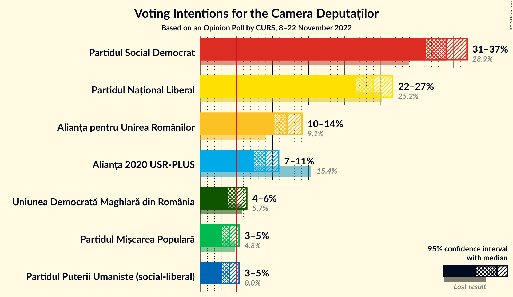

### Confidence Intervals

| Party | Last Result | Poll Result | 80% Confidence Interval | 90% Confidence Interval | 95% Confidence Interval | 99% Confidence Interval |
|:-----:|:-----------:|:-----------:|:-----------------------:|:-----------------------:|:-----------------------:|:-----------------------:|
| Partidul Social Democrat | 28.9% | 34.0% | 32.2–35.9% |31.7–36.5% |31.2–36.9% |30.4–37.8% |
| Partidul Național Liberal | 25.2% | 24.0% | 22.4–25.7% |21.9–26.2% |21.5–26.7% |20.8–27.5% |
| Alianța pentru Unirea Românilor | 9.1% | 12.0% | 10.8–13.4% |10.5–13.7% |10.2–14.1% |9.6–14.8% |
| Alianța 2020 USR-PLUS | 15.4% | 9.0% | 8.0–10.2% |7.7–10.6% |7.4–10.9% |7.0–11.5% |
| Uniunea Democrată Maghiară din România | 5.7% | 5.0% | 4.2–5.9% |4.0–6.2% |3.8–6.4% |3.5–6.9% |
| Partidul Mișcarea Populară | 4.8% | 4.0% | 3.4–4.9% |3.2–5.2% |3.0–5.4% |2.7–5.9% |
| Partidul Puterii Umaniste (social-liberal) | 0.0% | 4.0% | 3.4–4.9% |3.2–5.2% |3.0–5.4% |2.7–5.9% |

*Note:* The poll result column reflects the actual value used in the calculations. Published results may vary slightly, and in addition be rounded to fewer digits.

## Seats

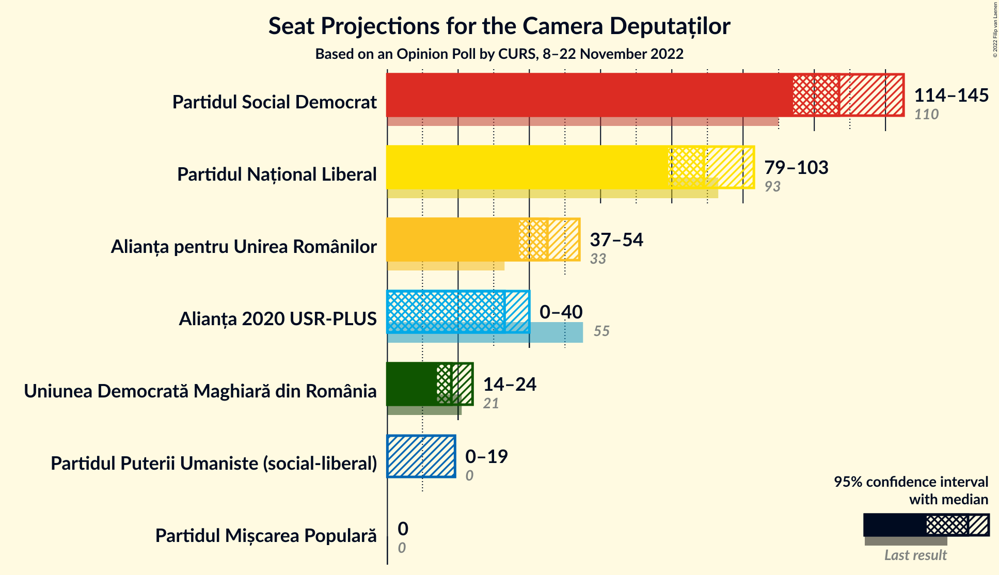

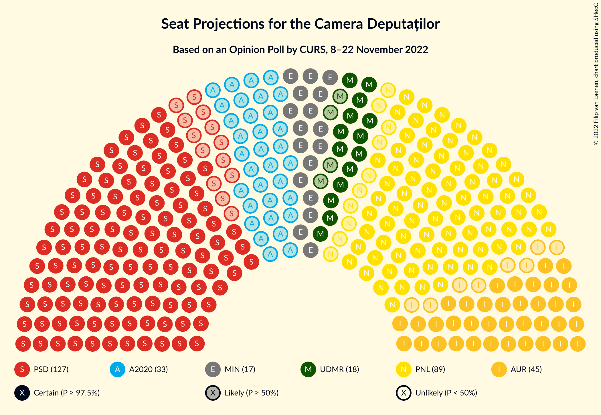

### Confidence Intervals

| Party | Last Result | Median | 80% Confidence Interval | 90% Confidence Interval | 95% Confidence Interval | 99% Confidence Interval |
|:-----:|:-----------:|:------:|:-----------------------:|:-----------------------:|:-----------------------:|:-----------------------:|
| <a href="#partidul-social-democrat">Partidul Social Democrat</a> | 110 | 127 | 120–136 |116–142 |114–145 |111–151 |
| <a href="#partidul-național-liberal">Partidul Național Liberal</a> | 93 | 89 | 82–97 |81–100 |79–103 |76–108 |
| <a href="#alianța-pentru-unirea-românilor">Alianța pentru Unirea Românilor</a> | 33 | 45 | 40–50 |38–52 |37–54 |35–57 |
| <a href="#alianța-2020-usr-plus">Alianța 2020 USR-PLUS</a> | 55 | 33 | 0–38 |0–38 |0–40 |0–42 |
| <a href="#uniunea-democrată-maghiară-din-românia">Uniunea Democrată Maghiară din România</a> | 21 | 18 | 15–22 |14–23 |14–24 |12–26 |
| <a href="#partidul-mișcarea-populară">Partidul Mișcarea Populară</a> | 0 | 0 | 0 |0 |0 |0–21 |
| <a href="#partidul-puterii-umaniste-(social-liberal)">Partidul Puterii Umaniste (social-liberal)</a> | 0 | 0 | 0 |0–18 |0–19 |0–21 |

### Partidul Social Democrat

*For a full overview of the results for this party, see the [Partidul Social Democrat](party-partidulsocialdemocrat.html) page.*

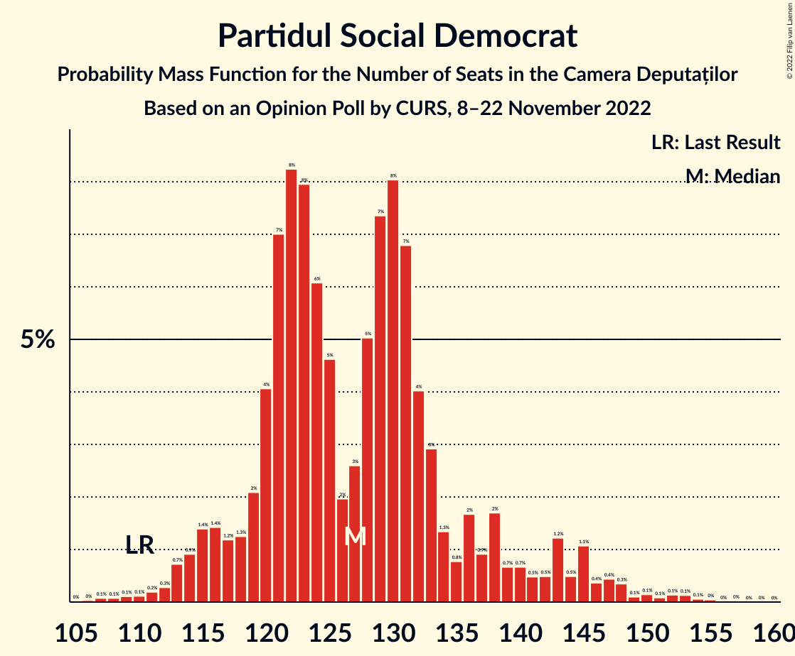

| Number of Seats | Probability | Accumulated | Special Marks |
|:---------------:|:-----------:|:-----------:|:-------------:|
| 106 | 0% | 100% |  |
| 107 | 0.1% | 99.9% |  |
| 108 | 0.1% | 99.9% |  |
| 109 | 0.1% | 99.8% |  |
| 110 | 0.1% | 99.7% | Last Result |
| 111 | 0.2% | 99.6% |  |
| 112 | 0.3% | 99.4% |  |
| 113 | 0.7% | 99.1% |  |
| 114 | 0.9% | 98% |  |
| 115 | 1.4% | 97% |  |
| 116 | 1.4% | 96% |  |
| 117 | 1.2% | 95% |  |
| 118 | 1.3% | 93% |  |
| 119 | 2% | 92% |  |
| 120 | 4% | 90% |  |
| 121 | 7% | 86% |  |
| 122 | 8% | 79% |  |
| 123 | 8% | 71% |  |
| 124 | 6% | 63% |  |
| 125 | 5% | 57% |  |
| 126 | 2% | 52% |  |
| 127 | 3% | 50% | Median |
| 128 | 5% | 48% |  |
| 129 | 7% | 43% |  |
| 130 | 8% | 35% |  |
| 131 | 7% | 27% |  |
| 132 | 4% | 20% |  |
| 133 | 3% | 16% |  |
| 134 | 1.3% | 13% |  |
| 135 | 0.8% | 12% |  |
| 136 | 2% | 11% |  |
| 137 | 0.9% | 10% |  |
| 138 | 2% | 9% |  |
| 139 | 0.7% | 7% |  |
| 140 | 0.7% | 6% |  |
| 141 | 0.5% | 6% |  |
| 142 | 0.5% | 5% |  |
| 143 | 1.2% | 5% |  |
| 144 | 0.5% | 3% |  |
| 145 | 1.1% | 3% |  |
| 146 | 0.4% | 2% |  |
| 147 | 0.4% | 2% |  |
| 148 | 0.3% | 1.1% |  |
| 149 | 0.1% | 0.7% |  |
| 150 | 0.1% | 0.6% |  |
| 151 | 0.1% | 0.5% |  |
| 152 | 0.1% | 0.4% |  |
| 153 | 0.1% | 0.3% |  |
| 154 | 0.1% | 0.1% |  |
| 155 | 0% | 0.1% |  |
| 156 | 0% | 0% |  |

### Partidul Național Liberal

*For a full overview of the results for this party, see the [Partidul Național Liberal](party-partidulnaționalliberal.html) page.*

| Number of Seats | Probability | Accumulated | Special Marks |
|:---------------:|:-----------:|:-----------:|:-------------:|
| 72 | 0% | 100% |  |
| 73 | 0.1% | 99.9% |  |
| 74 | 0.1% | 99.9% |  |
| 75 | 0.2% | 99.8% |  |
| 76 | 0.2% | 99.6% |  |
| 77 | 0.6% | 99.3% |  |
| 78 | 0.8% | 98.7% |  |
| 79 | 1.1% | 98% |  |
| 80 | 2% | 97% |  |
| 81 | 3% | 95% |  |
| 82 | 3% | 92% |  |
| 83 | 4% | 90% |  |
| 84 | 5% | 86% |  |
| 85 | 5% | 80% |  |
| 86 | 6% | 75% |  |
| 87 | 9% | 69% |  |
| 88 | 7% | 61% |  |
| 89 | 6% | 53% | Median |
| 90 | 6% | 48% |  |
| 91 | 7% | 41% |  |
| 92 | 6% | 35% |  |
| 93 | 6% | 29% | Last Result |
| 94 | 6% | 23% |  |
| 95 | 4% | 18% |  |
| 96 | 2% | 14% |  |
| 97 | 2% | 12% |  |
| 98 | 2% | 9% |  |
| 99 | 2% | 7% |  |
| 100 | 1.2% | 6% |  |
| 101 | 1.0% | 5% |  |
| 102 | 0.8% | 4% |  |
| 103 | 0.5% | 3% |  |
| 104 | 0.6% | 2% |  |
| 105 | 0.4% | 2% |  |
| 106 | 0.4% | 1.3% |  |
| 107 | 0.3% | 0.9% |  |
| 108 | 0.2% | 0.6% |  |
| 109 | 0.2% | 0.4% |  |
| 110 | 0.1% | 0.3% |  |
| 111 | 0% | 0.2% |  |
| 112 | 0.1% | 0.1% |  |
| 113 | 0% | 0.1% |  |
| 114 | 0% | 0% |  |

### Alianța pentru Unirea Românilor

*For a full overview of the results for this party, see the [Alianța pentru Unirea Românilor](party-alianțapentruunirearomânilor.html) page.*

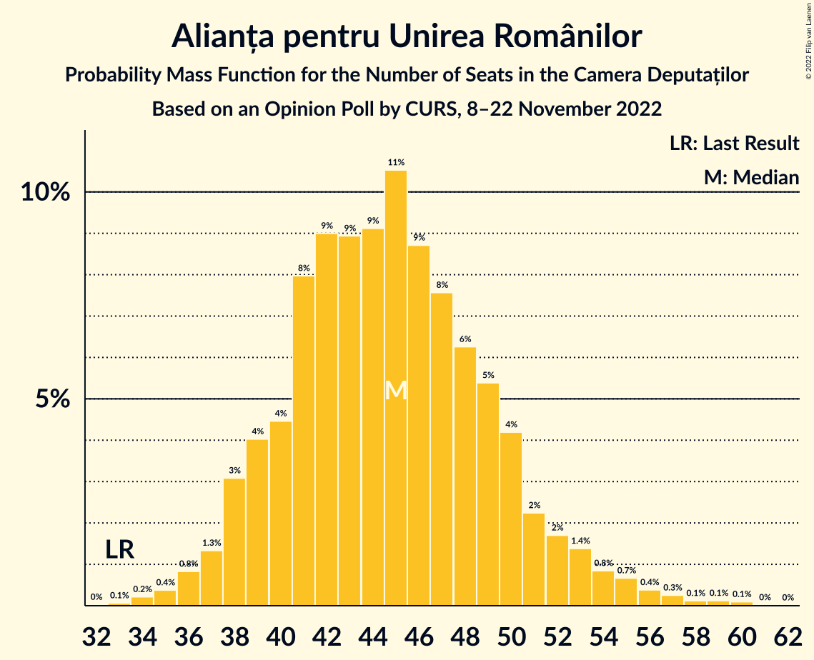

| Number of Seats | Probability | Accumulated | Special Marks |
|:---------------:|:-----------:|:-----------:|:-------------:|
| 33 | 0.1% | 100% | Last Result |
| 34 | 0.2% | 99.9% |  |
| 35 | 0.4% | 99.7% |  |
| 36 | 0.8% | 99.3% |  |
| 37 | 1.3% | 98% |  |
| 38 | 3% | 97% |  |
| 39 | 4% | 94% |  |
| 40 | 4% | 90% |  |
| 41 | 8% | 86% |  |
| 42 | 9% | 78% |  |
| 43 | 9% | 69% |  |
| 44 | 9% | 60% |  |
| 45 | 11% | 51% | Median |
| 46 | 9% | 40% |  |
| 47 | 8% | 31% |  |
| 48 | 6% | 24% |  |
| 49 | 5% | 17% |  |
| 50 | 4% | 12% |  |
| 51 | 2% | 8% |  |
| 52 | 2% | 6% |  |
| 53 | 1.4% | 4% |  |
| 54 | 0.8% | 3% |  |
| 55 | 0.7% | 2% |  |
| 56 | 0.4% | 1.0% |  |
| 57 | 0.3% | 0.6% |  |
| 58 | 0.1% | 0.4% |  |
| 59 | 0.1% | 0.3% |  |
| 60 | 0.1% | 0.1% |  |
| 61 | 0% | 0% |  |

### Alianța 2020 USR-PLUS

*For a full overview of the results for this party, see the [Alianța 2020 USR-PLUS](party-alianța2020usr-plus.html) page.*

| Number of Seats | Probability | Accumulated | Special Marks |
|:---------------:|:-----------:|:-----------:|:-------------:|
| 0 | 10% | 100% |  |
| 1 | 0% | 90% |  |
| 2 | 0% | 90% |  |
| 3 | 0% | 90% |  |
| 4 | 0% | 90% |  |
| 5 | 0% | 90% |  |
| 6 | 0% | 90% |  |
| 7 | 0% | 90% |  |
| 8 | 0% | 90% |  |
| 9 | 0% | 90% |  |
| 10 | 0% | 90% |  |
| 11 | 0% | 90% |  |
| 12 | 0% | 90% |  |
| 13 | 0% | 90% |  |
| 14 | 0% | 90% |  |
| 15 | 0% | 90% |  |
| 16 | 0% | 90% |  |
| 17 | 0% | 90% |  |
| 18 | 0% | 90% |  |
| 19 | 0% | 90% |  |
| 20 | 0% | 90% |  |
| 21 | 0% | 90% |  |
| 22 | 0% | 90% |  |
| 23 | 0% | 90% |  |
| 24 | 0% | 90% |  |
| 25 | 0% | 90% |  |
| 26 | 0% | 90% |  |
| 27 | 0% | 90% |  |
| 28 | 0.7% | 90% |  |
| 29 | 2% | 89% |  |
| 30 | 10% | 87% |  |
| 31 | 8% | 77% |  |
| 32 | 10% | 69% |  |
| 33 | 13% | 59% | Median |
| 34 | 15% | 46% |  |
| 35 | 7% | 31% |  |
| 36 | 7% | 23% |  |
| 37 | 6% | 16% |  |
| 38 | 5% | 10% |  |
| 39 | 2% | 5% |  |
| 40 | 1.1% | 3% |  |
| 41 | 0.8% | 2% |  |
| 42 | 0.6% | 0.9% |  |
| 43 | 0.2% | 0.3% |  |
| 44 | 0.1% | 0.2% |  |
| 45 | 0% | 0.1% |  |
| 46 | 0% | 0% |  |
| 47 | 0% | 0% |  |
| 48 | 0% | 0% |  |
| 49 | 0% | 0% |  |
| 50 | 0% | 0% |  |
| 51 | 0% | 0% |  |
| 52 | 0% | 0% |  |
| 53 | 0% | 0% |  |
| 54 | 0% | 0% |  |
| 55 | 0% | 0% | Last Result |

### Uniunea Democrată Maghiară din România

*For a full overview of the results for this party, see the [Uniunea Democrată Maghiară din România](party-uniuneademocratămaghiarădinromânia.html) page.*

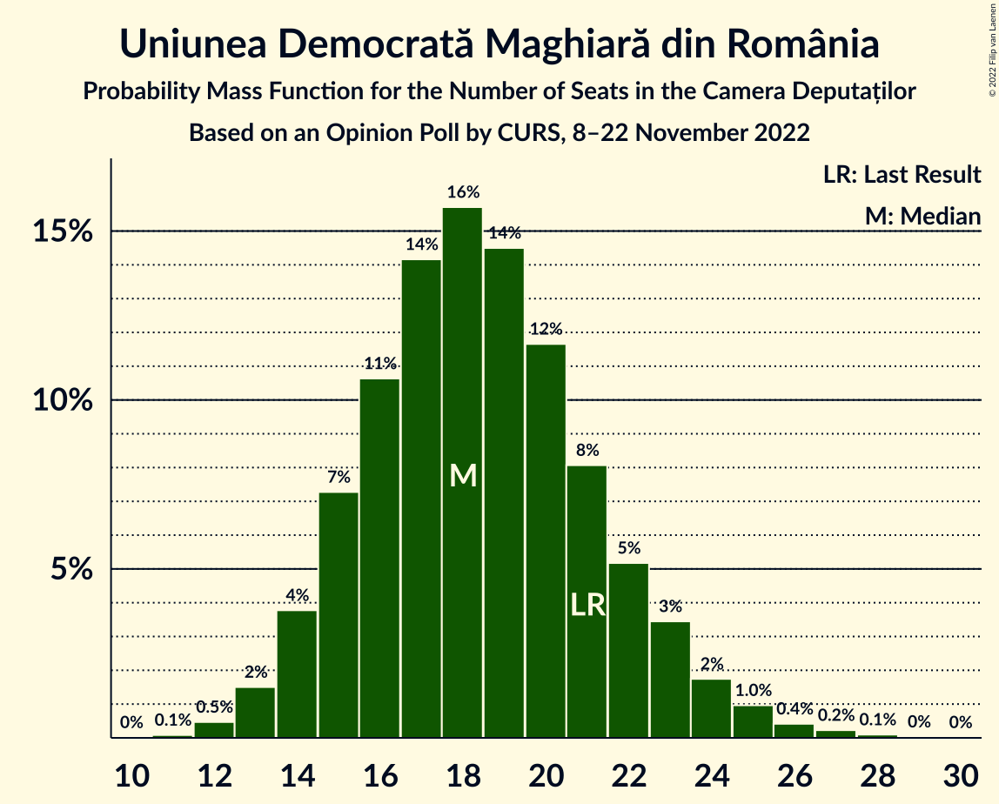

| Number of Seats | Probability | Accumulated | Special Marks |
|:---------------:|:-----------:|:-----------:|:-------------:|
| 11 | 0.1% | 100% |  |
| 12 | 0.5% | 99.9% |  |
| 13 | 2% | 99.4% |  |
| 14 | 4% | 98% |  |
| 15 | 7% | 94% |  |
| 16 | 11% | 87% |  |
| 17 | 14% | 76% |  |
| 18 | 16% | 62% | Median |
| 19 | 14% | 46% |  |
| 20 | 12% | 32% |  |
| 21 | 8% | 20% | Last Result |
| 22 | 5% | 12% |  |
| 23 | 3% | 7% |  |
| 24 | 2% | 4% |  |
| 25 | 1.0% | 2% |  |
| 26 | 0.4% | 0.8% |  |
| 27 | 0.2% | 0.4% |  |
| 28 | 0.1% | 0.2% |  |
| 29 | 0% | 0.1% |  |
| 30 | 0% | 0% |  |

### Partidul Mișcarea Populară

*For a full overview of the results for this party, see the [Partidul Mișcarea Populară](party-partidulmișcareapopulară.html) page.*

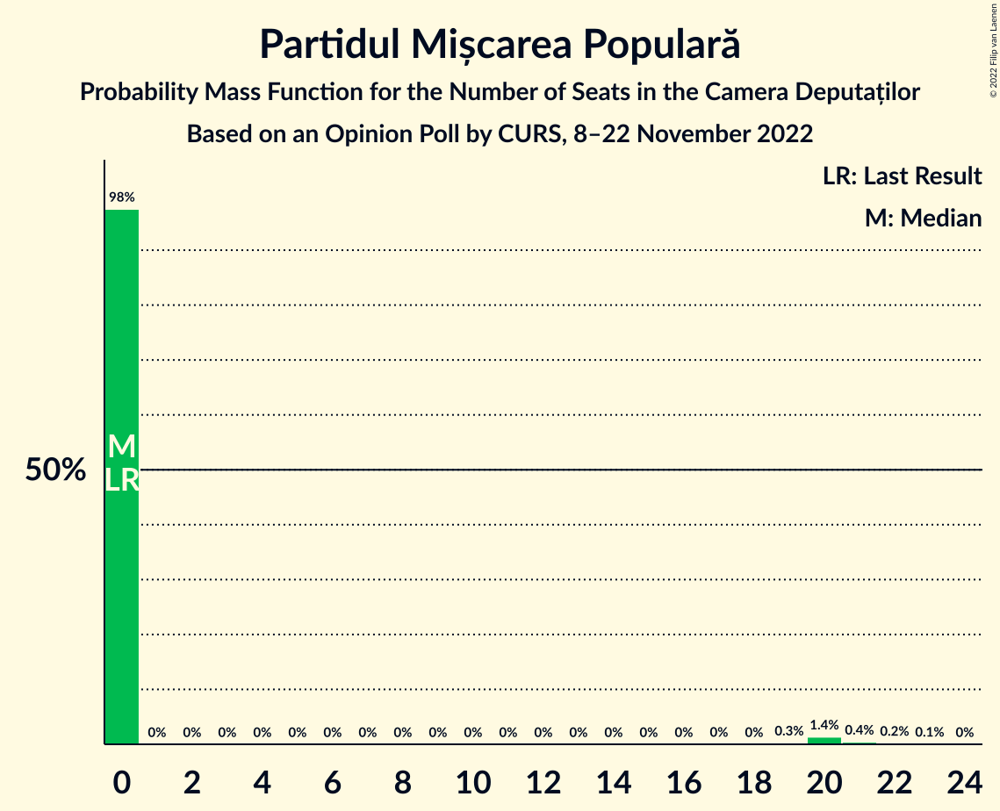

| Number of Seats | Probability | Accumulated | Special Marks |
|:---------------:|:-----------:|:-----------:|:-------------:|
| 0 | 98% | 100% | Last Result, Median |
| 1 | 0% | 2% |  |
| 2 | 0% | 2% |  |
| 3 | 0% | 2% |  |
| 4 | 0% | 2% |  |
| 5 | 0% | 2% |  |
| 6 | 0% | 2% |  |
| 7 | 0% | 2% |  |
| 8 | 0% | 2% |  |
| 9 | 0% | 2% |  |
| 10 | 0% | 2% |  |
| 11 | 0% | 2% |  |
| 12 | 0% | 2% |  |
| 13 | 0% | 2% |  |
| 14 | 0% | 2% |  |
| 15 | 0% | 2% |  |
| 16 | 0% | 2% |  |
| 17 | 0% | 2% |  |
| 18 | 0% | 2% |  |
| 19 | 0.3% | 2% |  |
| 20 | 1.4% | 2% |  |
| 21 | 0.4% | 0.8% |  |
| 22 | 0.2% | 0.3% |  |
| 23 | 0.1% | 0.1% |  |
| 24 | 0% | 0% |  |

### Partidul Puterii Umaniste (social-liberal)

*For a full overview of the results for this party, see the [Partidul Puterii Umaniste (social-liberal)](party-partidulputeriiumanistesocial-liberal.html) page.*

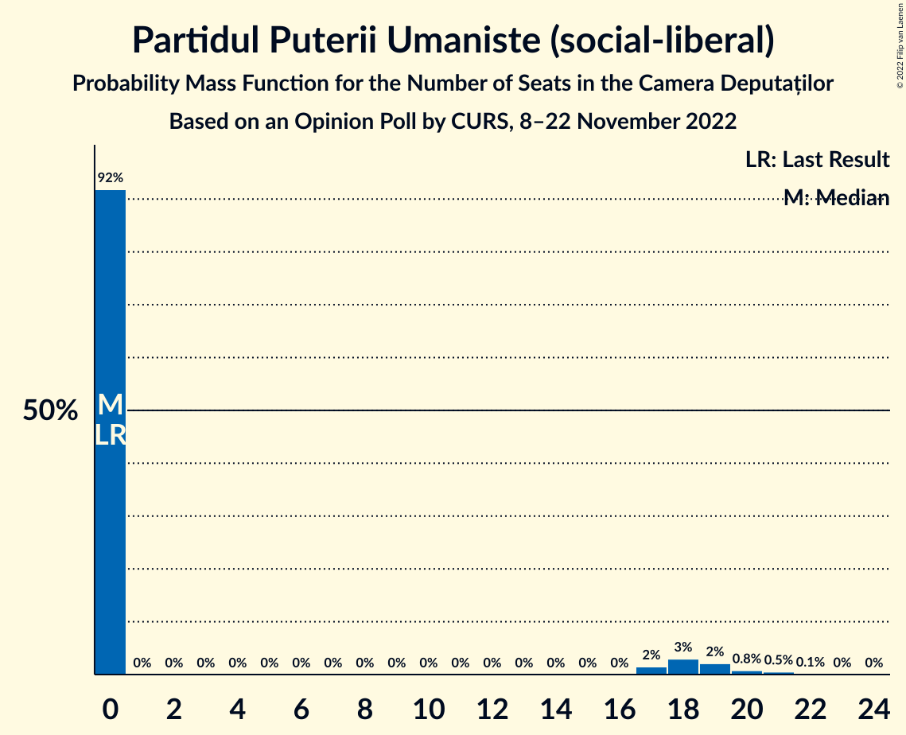

| Number of Seats | Probability | Accumulated | Special Marks |
|:---------------:|:-----------:|:-----------:|:-------------:|
| 0 | 92% | 100% | Last Result, Median |
| 1 | 0% | 8% |  |
| 2 | 0% | 8% |  |
| 3 | 0% | 8% |  |
| 4 | 0% | 8% |  |
| 5 | 0% | 8% |  |
| 6 | 0% | 8% |  |
| 7 | 0% | 8% |  |
| 8 | 0% | 8% |  |
| 9 | 0% | 8% |  |
| 10 | 0% | 8% |  |
| 11 | 0% | 8% |  |
| 12 | 0% | 8% |  |
| 13 | 0% | 8% |  |
| 14 | 0% | 8% |  |
| 15 | 0% | 8% |  |
| 16 | 0% | 8% |  |
| 17 | 2% | 8% |  |
| 18 | 3% | 7% |  |
| 19 | 2% | 4% |  |
| 20 | 0.8% | 2% |  |
| 21 | 0.5% | 0.8% |  |
| 22 | 0.1% | 0.2% |  |
| 23 | 0% | 0.1% |  |
| 24 | 0% | 0% |  |

## Coalitions

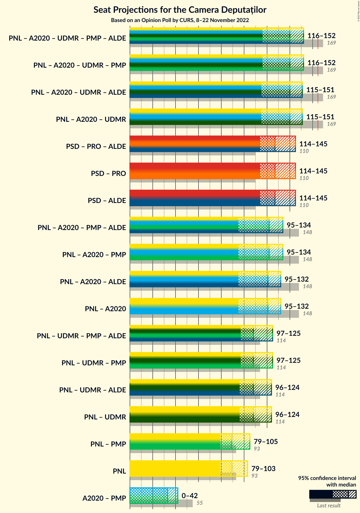

### Confidence Intervals

| Coalition | Last Result | Median | Majority? | 80% Confidence Interval | 90% Confidence Interval | 95% Confidence Interval | 99% Confidence Interval |
|:---------:|:-----------:|:------:|:---------:|:-----------------------:|:-----------------------:|:-----------------------:|:-----------------------:|
| Partidul Național Liberal – Alianța 2020 USR-PLUS – Uniunea Democrată Maghiară din România – Partidul Mișcarea Populară | 169 | 140 | 0% | 127–148 | 120–150 | 116–152 | 110–156 |
| Partidul Național Liberal – Alianța 2020 USR-PLUS – Uniunea Democrată Maghiară din România | 169 | 140 | 0% | 126–147 | 119–149 | 115–151 | 109–154 |
| Partidul Național Liberal – Alianța 2020 USR-PLUS – Partidul Mișcarea Populară | 148 | 122 | 0% | 109–129 | 99–132 | 95–134 | 90–139 |
| Partidul Național Liberal – Alianța 2020 USR-PLUS | 148 | 121 | 0% | 107–129 | 99–131 | 95–132 | 89–136 |
| Partidul Național Liberal – Uniunea Democrată Maghiară din România – Partidul Mișcarea Populară | 114 | 108 | 0% | 100–118 | 99–121 | 97–125 | 93–132 |
| Partidul Național Liberal – Uniunea Democrată Maghiară din România | 114 | 108 | 0% | 100–116 | 98–121 | 96–124 | 93–129 |
| Partidul Național Liberal – Partidul Mișcarea Populară | 93 | 89 | 0% | 83–98 | 81–102 | 79–105 | 76–111 |
| Partidul Național Liberal | 93 | 89 | 0% | 82–97 | 81–100 | 79–103 | 76–108 |
| Alianța 2020 USR-PLUS – Partidul Mișcarea Populară | 55 | 33 | 0% | 21–38 | 0–39 | 0–42 | 0–54 |

### Partidul Național Liberal – Alianța 2020 USR-PLUS – Uniunea Democrată Maghiară din România – Partidul Mișcarea Populară

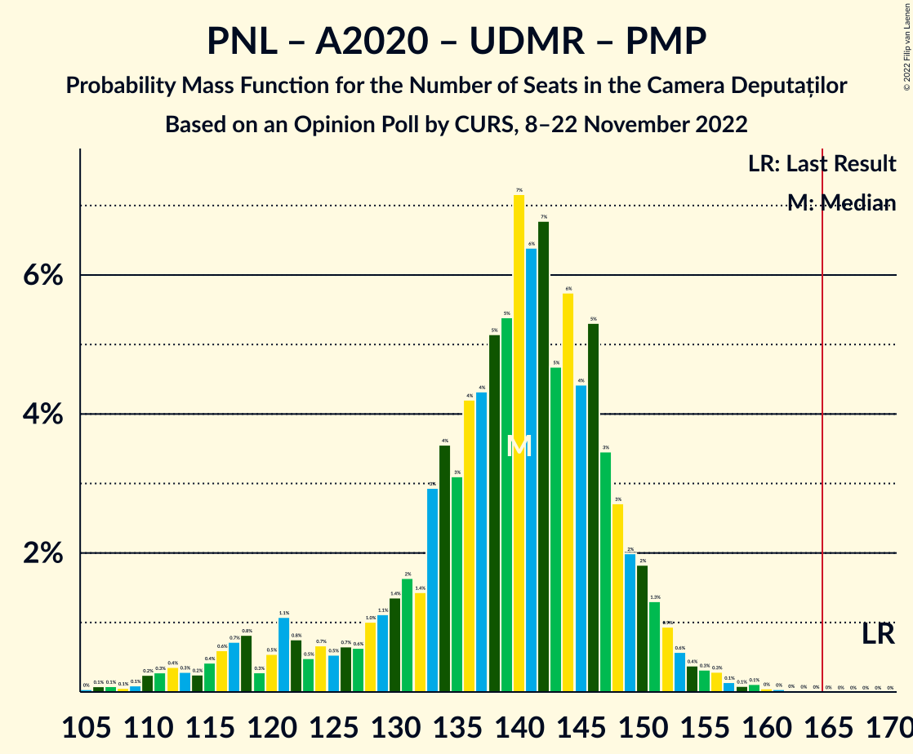

| Number of Seats | Probability | Accumulated | Special Marks |
|:---------------:|:-----------:|:-----------:|:-------------:|
| 105 | 0% | 100% |  |
| 106 | 0.1% | 99.9% |  |
| 107 | 0.1% | 99.8% |  |
| 108 | 0.1% | 99.7% |  |
| 109 | 0.1% | 99.7% |  |
| 110 | 0.2% | 99.6% |  |
| 111 | 0.3% | 99.4% |  |
| 112 | 0.4% | 99.1% |  |
| 113 | 0.3% | 98.7% |  |
| 114 | 0.2% | 98% |  |
| 115 | 0.4% | 98% |  |
| 116 | 0.6% | 98% |  |
| 117 | 0.7% | 97% |  |
| 118 | 0.8% | 96% |  |
| 119 | 0.3% | 96% |  |
| 120 | 0.5% | 95% |  |
| 121 | 1.1% | 95% |  |
| 122 | 0.8% | 94% |  |
| 123 | 0.5% | 93% |  |
| 124 | 0.7% | 92% |  |
| 125 | 0.5% | 92% |  |
| 126 | 0.7% | 91% |  |
| 127 | 0.6% | 91% |  |
| 128 | 1.0% | 90% |  |
| 129 | 1.1% | 89% |  |
| 130 | 1.4% | 88% |  |
| 131 | 2% | 87% |  |
| 132 | 1.4% | 85% |  |
| 133 | 3% | 83% |  |
| 134 | 4% | 80% |  |
| 135 | 3% | 77% |  |
| 136 | 4% | 74% |  |
| 137 | 4% | 70% |  |
| 138 | 5% | 65% |  |
| 139 | 5% | 60% |  |
| 140 | 7% | 55% | Median |
| 141 | 6% | 48% |  |
| 142 | 7% | 41% |  |
| 143 | 5% | 34% |  |
| 144 | 6% | 30% |  |
| 145 | 4% | 24% |  |
| 146 | 5% | 20% |  |
| 147 | 3% | 14% |  |
| 148 | 3% | 11% |  |
| 149 | 2% | 8% |  |
| 150 | 2% | 6% |  |
| 151 | 1.3% | 4% |  |
| 152 | 0.9% | 3% |  |
| 153 | 0.6% | 2% |  |
| 154 | 0.4% | 1.5% |  |
| 155 | 0.3% | 1.1% |  |
| 156 | 0.3% | 0.8% |  |
| 157 | 0.1% | 0.5% |  |
| 158 | 0.1% | 0.3% |  |
| 159 | 0.1% | 0.3% |  |
| 160 | 0% | 0.2% |  |
| 161 | 0% | 0.1% |  |
| 162 | 0% | 0.1% |  |
| 163 | 0% | 0% |  |
| 164 | 0% | 0% |  |
| 165 | 0% | 0% | Majority |
| 166 | 0% | 0% |  |
| 167 | 0% | 0% |  |
| 168 | 0% | 0% |  |
| 169 | 0% | 0% | Last Result |

### Partidul Național Liberal – Alianța 2020 USR-PLUS – Uniunea Democrată Maghiară din România

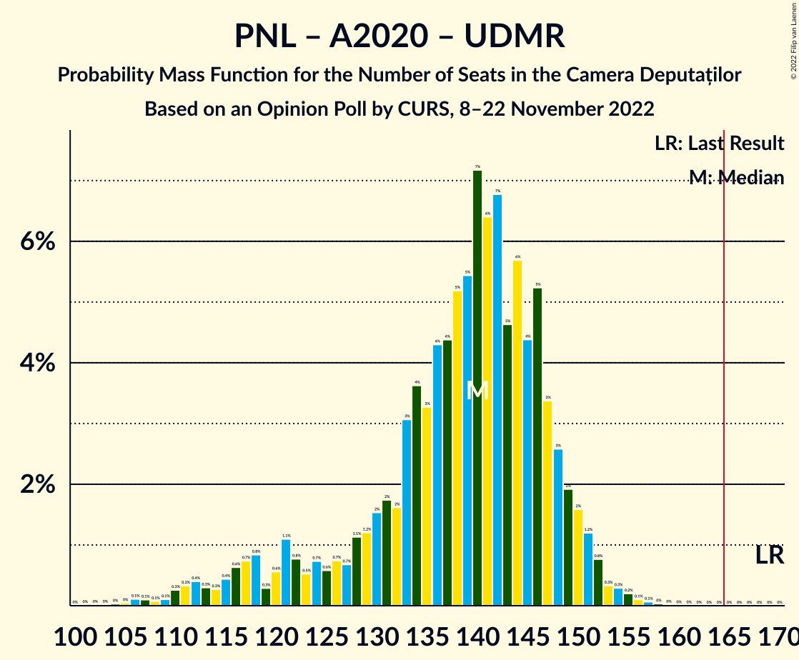

| Number of Seats | Probability | Accumulated | Special Marks |
|:---------------:|:-----------:|:-----------:|:-------------:|
| 103 | 0% | 100% |  |
| 104 | 0% | 99.9% |  |
| 105 | 0% | 99.9% |  |
| 106 | 0.1% | 99.9% |  |
| 107 | 0.1% | 99.8% |  |
| 108 | 0.1% | 99.7% |  |
| 109 | 0.1% | 99.6% |  |
| 110 | 0.3% | 99.5% |  |
| 111 | 0.3% | 99.2% |  |
| 112 | 0.4% | 98.9% |  |
| 113 | 0.3% | 98% |  |
| 114 | 0.3% | 98% |  |
| 115 | 0.4% | 98% |  |
| 116 | 0.6% | 97% |  |
| 117 | 0.7% | 97% |  |
| 118 | 0.8% | 96% |  |
| 119 | 0.3% | 95% |  |
| 120 | 0.6% | 95% |  |
| 121 | 1.1% | 94% |  |
| 122 | 0.8% | 93% |  |
| 123 | 0.5% | 93% |  |
| 124 | 0.7% | 92% |  |
| 125 | 0.6% | 91% |  |
| 126 | 0.7% | 91% |  |
| 127 | 0.7% | 90% |  |
| 128 | 1.1% | 89% |  |
| 129 | 1.2% | 88% |  |
| 130 | 2% | 87% |  |
| 131 | 2% | 85% |  |
| 132 | 2% | 84% |  |
| 133 | 3% | 82% |  |
| 134 | 4% | 79% |  |
| 135 | 3% | 75% |  |
| 136 | 4% | 72% |  |
| 137 | 4% | 68% |  |
| 138 | 5% | 63% |  |
| 139 | 5% | 58% |  |
| 140 | 7% | 53% | Median |
| 141 | 6% | 46% |  |
| 142 | 7% | 39% |  |
| 143 | 5% | 32% |  |
| 144 | 6% | 28% |  |
| 145 | 4% | 22% |  |
| 146 | 5% | 18% |  |
| 147 | 3% | 12% |  |
| 148 | 3% | 9% |  |
| 149 | 2% | 7% |  |
| 150 | 2% | 5% |  |
| 151 | 1.2% | 3% |  |
| 152 | 0.8% | 2% |  |
| 153 | 0.3% | 1.1% |  |
| 154 | 0.3% | 0.7% |  |
| 155 | 0.2% | 0.4% |  |
| 156 | 0.1% | 0.2% |  |
| 157 | 0.1% | 0.1% |  |
| 158 | 0% | 0.1% |  |
| 159 | 0% | 0% |  |
| 160 | 0% | 0% |  |
| 161 | 0% | 0% |  |
| 162 | 0% | 0% |  |
| 163 | 0% | 0% |  |
| 164 | 0% | 0% |  |
| 165 | 0% | 0% | Majority |
| 166 | 0% | 0% |  |
| 167 | 0% | 0% |  |
| 168 | 0% | 0% |  |
| 169 | 0% | 0% | Last Result |

### Partidul Național Liberal – Alianța 2020 USR-PLUS – Partidul Mișcarea Populară

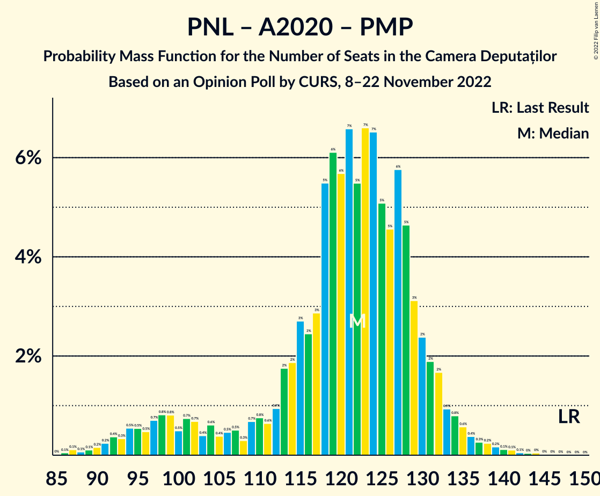

| Number of Seats | Probability | Accumulated | Special Marks |
|:---------------:|:-----------:|:-----------:|:-------------:|
| 85 | 0% | 100% |  |
| 86 | 0.1% | 99.9% |  |
| 87 | 0.1% | 99.9% |  |
| 88 | 0.1% | 99.8% |  |
| 89 | 0.1% | 99.7% |  |
| 90 | 0.2% | 99.6% |  |
| 91 | 0.2% | 99.4% |  |
| 92 | 0.4% | 99.2% |  |
| 93 | 0.3% | 98.8% |  |
| 94 | 0.5% | 98% |  |
| 95 | 0.5% | 98% |  |
| 96 | 0.5% | 97% |  |
| 97 | 0.7% | 97% |  |
| 98 | 0.8% | 96% |  |
| 99 | 0.8% | 95% |  |
| 100 | 0.5% | 95% |  |
| 101 | 0.7% | 94% |  |
| 102 | 0.7% | 93% |  |
| 103 | 0.4% | 93% |  |
| 104 | 0.6% | 92% |  |
| 105 | 0.4% | 92% |  |
| 106 | 0.5% | 91% |  |
| 107 | 0.5% | 91% |  |
| 108 | 0.3% | 90% |  |
| 109 | 0.7% | 90% |  |
| 110 | 0.8% | 89% |  |
| 111 | 0.6% | 89% |  |
| 112 | 0.9% | 88% |  |
| 113 | 2% | 87% |  |
| 114 | 2% | 85% |  |
| 115 | 3% | 83% |  |
| 116 | 2% | 81% |  |
| 117 | 3% | 78% |  |
| 118 | 5% | 75% |  |
| 119 | 6% | 70% |  |
| 120 | 6% | 64% |  |
| 121 | 7% | 58% |  |
| 122 | 5% | 51% | Median |
| 123 | 7% | 46% |  |
| 124 | 7% | 39% |  |
| 125 | 5% | 33% |  |
| 126 | 5% | 28% |  |
| 127 | 6% | 23% |  |
| 128 | 5% | 17% |  |
| 129 | 3% | 13% |  |
| 130 | 2% | 10% |  |
| 131 | 2% | 7% |  |
| 132 | 2% | 5% |  |
| 133 | 0.9% | 4% |  |
| 134 | 0.8% | 3% |  |
| 135 | 0.6% | 2% |  |
| 136 | 0.4% | 1.5% |  |
| 137 | 0.3% | 1.1% |  |
| 138 | 0.2% | 0.8% |  |
| 139 | 0.2% | 0.6% |  |
| 140 | 0.1% | 0.4% |  |
| 141 | 0.1% | 0.3% |  |
| 142 | 0.1% | 0.2% |  |
| 143 | 0% | 0.1% |  |
| 144 | 0% | 0.1% |  |
| 145 | 0% | 0.1% |  |
| 146 | 0% | 0% |  |
| 147 | 0% | 0% |  |
| 148 | 0% | 0% | Last Result |

### Partidul Național Liberal – Alianța 2020 USR-PLUS

| Number of Seats | Probability | Accumulated | Special Marks |
|:---------------:|:-----------:|:-----------:|:-------------:|
| 84 | 0% | 100% |  |
| 85 | 0% | 99.9% |  |
| 86 | 0.1% | 99.9% |  |
| 87 | 0.1% | 99.8% |  |
| 88 | 0.1% | 99.7% |  |
| 89 | 0.1% | 99.6% |  |
| 90 | 0.2% | 99.5% |  |
| 91 | 0.3% | 99.3% |  |
| 92 | 0.4% | 99.0% |  |
| 93 | 0.4% | 98.7% |  |
| 94 | 0.6% | 98% |  |
| 95 | 0.6% | 98% |  |
| 96 | 0.5% | 97% |  |
| 97 | 0.7% | 97% |  |
| 98 | 0.8% | 96% |  |
| 99 | 0.8% | 95% |  |
| 100 | 0.5% | 94% |  |
| 101 | 0.7% | 94% |  |
| 102 | 0.7% | 93% |  |
| 103 | 0.4% | 92% |  |
| 104 | 0.6% | 92% |  |
| 105 | 0.4% | 91% |  |
| 106 | 0.5% | 91% |  |
| 107 | 0.5% | 90% |  |
| 108 | 0.3% | 90% |  |
| 109 | 0.8% | 90% |  |
| 110 | 0.8% | 89% |  |
| 111 | 0.7% | 88% |  |
| 112 | 1.2% | 87% |  |
| 113 | 2% | 86% |  |
| 114 | 2% | 84% |  |
| 115 | 3% | 82% |  |
| 116 | 3% | 79% |  |
| 117 | 3% | 77% |  |
| 118 | 6% | 74% |  |
| 119 | 6% | 68% |  |
| 120 | 6% | 62% |  |
| 121 | 7% | 56% |  |
| 122 | 6% | 50% | Median |
| 123 | 7% | 44% |  |
| 124 | 7% | 37% |  |
| 125 | 5% | 31% |  |
| 126 | 5% | 26% |  |
| 127 | 6% | 21% |  |
| 128 | 5% | 16% |  |
| 129 | 3% | 11% |  |
| 130 | 2% | 8% |  |
| 131 | 2% | 6% |  |
| 132 | 1.5% | 4% |  |
| 133 | 0.8% | 2% |  |
| 134 | 0.6% | 2% |  |
| 135 | 0.4% | 0.9% |  |
| 136 | 0.2% | 0.5% |  |
| 137 | 0.1% | 0.3% |  |
| 138 | 0.1% | 0.2% |  |
| 139 | 0% | 0.1% |  |
| 140 | 0% | 0.1% |  |
| 141 | 0% | 0% |  |
| 142 | 0% | 0% |  |
| 143 | 0% | 0% |  |
| 144 | 0% | 0% |  |
| 145 | 0% | 0% |  |
| 146 | 0% | 0% |  |
| 147 | 0% | 0% |  |
| 148 | 0% | 0% | Last Result |

### Partidul Național Liberal – Uniunea Democrată Maghiară din România – Partidul Mișcarea Populară

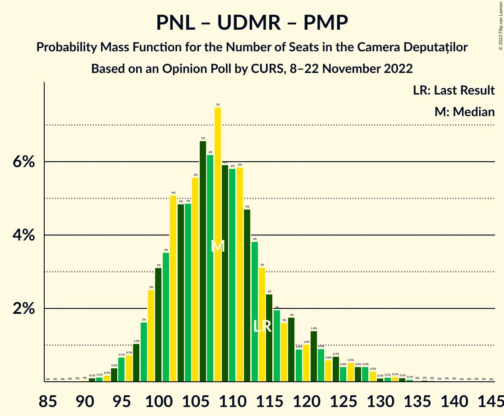

| Number of Seats | Probability | Accumulated | Special Marks |
|:---------------:|:-----------:|:-----------:|:-------------:|
| 89 | 0% | 100% |  |
| 90 | 0% | 99.9% |  |
| 91 | 0.1% | 99.9% |  |
| 92 | 0.1% | 99.8% |  |
| 93 | 0.2% | 99.7% |  |
| 94 | 0.4% | 99.5% |  |
| 95 | 0.7% | 99.1% |  |
| 96 | 0.7% | 98% |  |
| 97 | 1.0% | 98% |  |
| 98 | 2% | 97% |  |
| 99 | 3% | 95% |  |
| 100 | 3% | 93% |  |
| 101 | 4% | 89% |  |
| 102 | 5% | 86% |  |
| 103 | 5% | 81% |  |
| 104 | 5% | 76% |  |
| 105 | 6% | 71% |  |
| 106 | 7% | 66% |  |
| 107 | 6% | 59% | Median |
| 108 | 7% | 53% |  |
| 109 | 6% | 45% |  |
| 110 | 6% | 39% |  |
| 111 | 6% | 34% |  |
| 112 | 5% | 28% |  |
| 113 | 4% | 23% |  |
| 114 | 3% | 19% | Last Result |
| 115 | 2% | 16% |  |
| 116 | 2% | 14% |  |
| 117 | 2% | 12% |  |
| 118 | 2% | 10% |  |
| 119 | 0.9% | 8% |  |
| 120 | 1.0% | 7% |  |
| 121 | 1.4% | 6% |  |
| 122 | 0.9% | 5% |  |
| 123 | 0.6% | 4% |  |
| 124 | 0.7% | 3% |  |
| 125 | 0.4% | 3% |  |
| 126 | 0.5% | 2% |  |
| 127 | 0.4% | 2% |  |
| 128 | 0.4% | 1.4% |  |
| 129 | 0.3% | 1.0% |  |
| 130 | 0.1% | 0.7% |  |
| 131 | 0.1% | 0.6% |  |
| 132 | 0.1% | 0.5% |  |
| 133 | 0.1% | 0.4% |  |
| 134 | 0.1% | 0.3% |  |
| 135 | 0% | 0.2% |  |
| 136 | 0% | 0.2% |  |
| 137 | 0% | 0.1% |  |
| 138 | 0% | 0.1% |  |
| 139 | 0% | 0.1% |  |
| 140 | 0% | 0.1% |  |
| 141 | 0% | 0% |  |

### Partidul Național Liberal – Uniunea Democrată Maghiară din România

| Number of Seats | Probability | Accumulated | Special Marks |
|:---------------:|:-----------:|:-----------:|:-------------:|
| 89 | 0% | 100% |  |
| 90 | 0.1% | 99.9% |  |
| 91 | 0.1% | 99.9% |  |
| 92 | 0.2% | 99.7% |  |
| 93 | 0.2% | 99.5% |  |
| 94 | 0.5% | 99.3% |  |
| 95 | 0.8% | 98.8% |  |
| 96 | 0.8% | 98% |  |
| 97 | 1.1% | 97% |  |
| 98 | 2% | 96% |  |
| 99 | 3% | 94% |  |
| 100 | 3% | 92% |  |
| 101 | 4% | 88% |  |
| 102 | 5% | 85% |  |
| 103 | 5% | 79% |  |
| 104 | 5% | 74% |  |
| 105 | 6% | 69% |  |
| 106 | 7% | 64% |  |
| 107 | 6% | 57% | Median |
| 108 | 8% | 51% |  |
| 109 | 6% | 43% |  |
| 110 | 6% | 37% |  |
| 111 | 6% | 31% |  |
| 112 | 5% | 26% |  |
| 113 | 4% | 21% |  |
| 114 | 3% | 17% | Last Result |
| 115 | 2% | 14% |  |
| 116 | 2% | 12% |  |
| 117 | 2% | 10% |  |
| 118 | 2% | 8% |  |
| 119 | 0.7% | 7% |  |
| 120 | 0.8% | 6% |  |
| 121 | 1.2% | 5% |  |
| 122 | 0.8% | 4% |  |
| 123 | 0.4% | 3% |  |
| 124 | 0.5% | 3% |  |
| 125 | 0.3% | 2% |  |
| 126 | 0.4% | 2% |  |
| 127 | 0.3% | 1.3% |  |
| 128 | 0.4% | 1.0% |  |
| 129 | 0.2% | 0.6% |  |
| 130 | 0.1% | 0.4% |  |
| 131 | 0.1% | 0.4% |  |
| 132 | 0.1% | 0.2% |  |
| 133 | 0% | 0.1% |  |
| 134 | 0% | 0.1% |  |
| 135 | 0% | 0.1% |  |
| 136 | 0% | 0% |  |

### Partidul Național Liberal – Partidul Mișcarea Populară

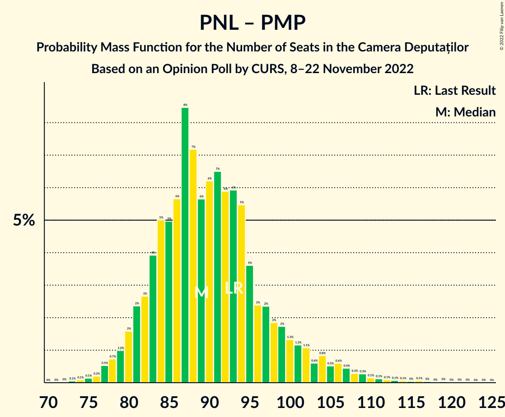

| Number of Seats | Probability | Accumulated | Special Marks |
|:---------------:|:-----------:|:-----------:|:-------------:|
| 73 | 0.1% | 100% |  |
| 74 | 0.1% | 99.9% |  |
| 75 | 0.1% | 99.8% |  |
| 76 | 0.2% | 99.7% |  |
| 77 | 0.5% | 99.5% |  |
| 78 | 0.7% | 99.0% |  |
| 79 | 1.0% | 98% |  |
| 80 | 2% | 97% |  |
| 81 | 2% | 96% |  |
| 82 | 3% | 93% |  |
| 83 | 4% | 91% |  |
| 84 | 5% | 87% |  |
| 85 | 5% | 82% |  |
| 86 | 6% | 77% |  |
| 87 | 8% | 71% |  |
| 88 | 7% | 63% |  |
| 89 | 6% | 55% | Median |
| 90 | 6% | 50% |  |
| 91 | 7% | 44% |  |
| 92 | 6% | 37% |  |
| 93 | 6% | 31% | Last Result |
| 94 | 5% | 25% |  |
| 95 | 4% | 20% |  |
| 96 | 2% | 16% |  |
| 97 | 2% | 14% |  |
| 98 | 2% | 11% |  |
| 99 | 2% | 10% |  |
| 100 | 1.3% | 8% |  |
| 101 | 1.2% | 7% |  |
| 102 | 1.1% | 5% |  |
| 103 | 0.6% | 4% |  |
| 104 | 0.8% | 4% |  |
| 105 | 0.5% | 3% |  |
| 106 | 0.6% | 2% |  |
| 107 | 0.4% | 2% |  |
| 108 | 0.3% | 1.3% |  |
| 109 | 0.3% | 1.0% |  |
| 110 | 0.1% | 0.7% |  |
| 111 | 0.1% | 0.6% |  |
| 112 | 0.1% | 0.5% |  |
| 113 | 0.1% | 0.4% |  |
| 114 | 0.1% | 0.3% |  |
| 115 | 0% | 0.2% |  |
| 116 | 0.1% | 0.2% |  |
| 117 | 0% | 0.1% |  |
| 118 | 0% | 0.1% |  |
| 119 | 0% | 0.1% |  |
| 120 | 0% | 0.1% |  |
| 121 | 0% | 0% |  |

### Partidul Național Liberal

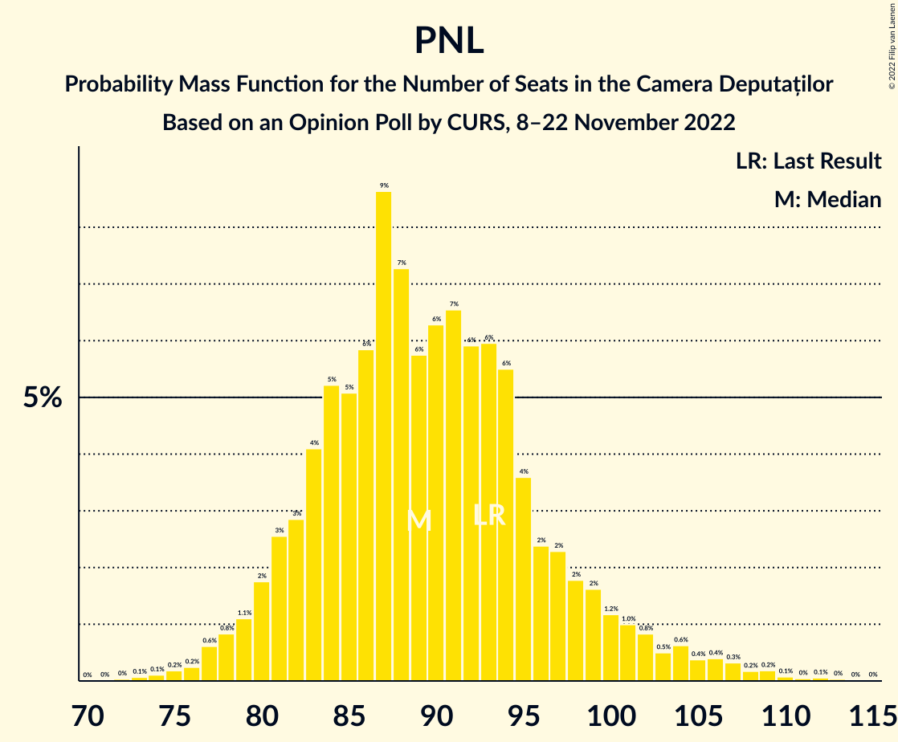

| Number of Seats | Probability | Accumulated | Special Marks |
|:---------------:|:-----------:|:-----------:|:-------------:|
| 72 | 0% | 100% |  |
| 73 | 0.1% | 99.9% |  |
| 74 | 0.1% | 99.9% |  |
| 75 | 0.2% | 99.8% |  |
| 76 | 0.2% | 99.6% |  |
| 77 | 0.6% | 99.3% |  |
| 78 | 0.8% | 98.7% |  |
| 79 | 1.1% | 98% |  |
| 80 | 2% | 97% |  |
| 81 | 3% | 95% |  |
| 82 | 3% | 92% |  |
| 83 | 4% | 90% |  |
| 84 | 5% | 86% |  |
| 85 | 5% | 80% |  |
| 86 | 6% | 75% |  |
| 87 | 9% | 69% |  |
| 88 | 7% | 61% |  |
| 89 | 6% | 53% | Median |
| 90 | 6% | 48% |  |
| 91 | 7% | 41% |  |
| 92 | 6% | 35% |  |
| 93 | 6% | 29% | Last Result |
| 94 | 6% | 23% |  |
| 95 | 4% | 18% |  |
| 96 | 2% | 14% |  |
| 97 | 2% | 12% |  |
| 98 | 2% | 9% |  |
| 99 | 2% | 7% |  |
| 100 | 1.2% | 6% |  |
| 101 | 1.0% | 5% |  |
| 102 | 0.8% | 4% |  |
| 103 | 0.5% | 3% |  |
| 104 | 0.6% | 2% |  |
| 105 | 0.4% | 2% |  |
| 106 | 0.4% | 1.3% |  |
| 107 | 0.3% | 0.9% |  |
| 108 | 0.2% | 0.6% |  |
| 109 | 0.2% | 0.4% |  |
| 110 | 0.1% | 0.3% |  |
| 111 | 0% | 0.2% |  |
| 112 | 0.1% | 0.1% |  |
| 113 | 0% | 0.1% |  |
| 114 | 0% | 0% |  |

### Alianța 2020 USR-PLUS – Partidul Mișcarea Populară

| Number of Seats | Probability | Accumulated | Special Marks |
|:---------------:|:-----------:|:-----------:|:-------------:|
| 0 | 10% | 100% |  |
| 1 | 0% | 90% |  |
| 2 | 0% | 90% |  |
| 3 | 0% | 90% |  |
| 4 | 0% | 90% |  |
| 5 | 0% | 90% |  |
| 6 | 0% | 90% |  |
| 7 | 0% | 90% |  |
| 8 | 0% | 90% |  |
| 9 | 0% | 90% |  |
| 10 | 0% | 90% |  |
| 11 | 0% | 90% |  |
| 12 | 0% | 90% |  |
| 13 | 0% | 90% |  |
| 14 | 0% | 90% |  |
| 15 | 0% | 90% |  |
| 16 | 0% | 90% |  |
| 17 | 0% | 90% |  |
| 18 | 0% | 90% |  |
| 19 | 0% | 90% |  |
| 20 | 0% | 90% |  |
| 21 | 0.1% | 90% |  |
| 22 | 0.2% | 90% |  |
| 23 | 0.1% | 90% |  |
| 24 | 0% | 90% |  |
| 25 | 0% | 90% |  |
| 26 | 0% | 90% |  |
| 27 | 0% | 90% |  |
| 28 | 0.5% | 90% |  |
| 29 | 2% | 89% |  |
| 30 | 9% | 87% |  |
| 31 | 8% | 78% |  |
| 32 | 9% | 70% |  |
| 33 | 12% | 60% | Median |
| 34 | 15% | 48% |  |
| 35 | 7% | 33% |  |
| 36 | 7% | 25% |  |
| 37 | 6% | 18% |  |
| 38 | 5% | 12% |  |
| 39 | 2% | 7% |  |
| 40 | 1.1% | 5% |  |
| 41 | 0.8% | 4% |  |
| 42 | 0.6% | 3% |  |
| 43 | 0.2% | 2% |  |
| 44 | 0.1% | 2% |  |
| 45 | 0% | 2% |  |
| 46 | 0% | 2% |  |
| 47 | 0% | 2% |  |
| 48 | 0.2% | 2% |  |
| 49 | 0.2% | 2% |  |
| 50 | 0.3% | 2% |  |
| 51 | 0.3% | 1.4% |  |
| 52 | 0.3% | 1.1% |  |
| 53 | 0.2% | 0.8% |  |
| 54 | 0.2% | 0.6% |  |
| 55 | 0.1% | 0.4% | Last Result |
| 56 | 0.1% | 0.2% |  |
| 57 | 0% | 0.1% |  |
| 58 | 0% | 0.1% |  |
| 59 | 0% | 0% |  |

## Technical Information

### Opinion Poll

+ **Polling firm:** CURS
+ **Commissioner(s):** —
+ **Fieldwork period:** 8–22 November 2022

### Calculations

+ **Sample size:** 1067
+ **Simulations done:** 1,048,576
+ **Error estimate:** 1.43%

