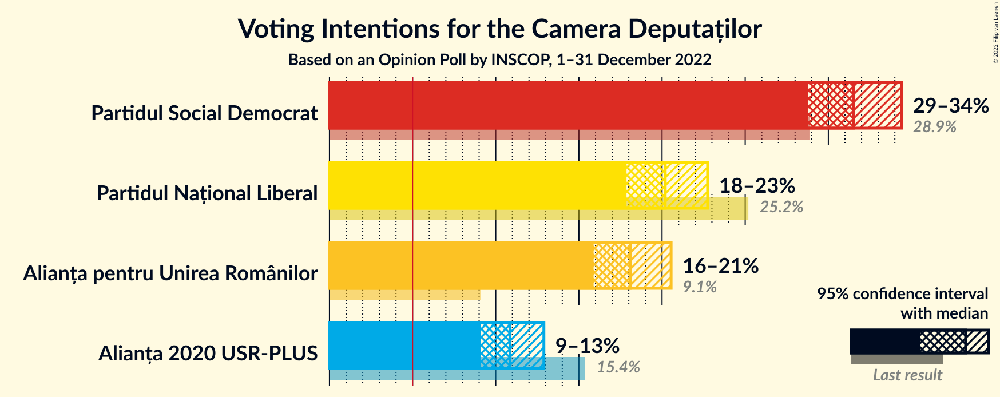
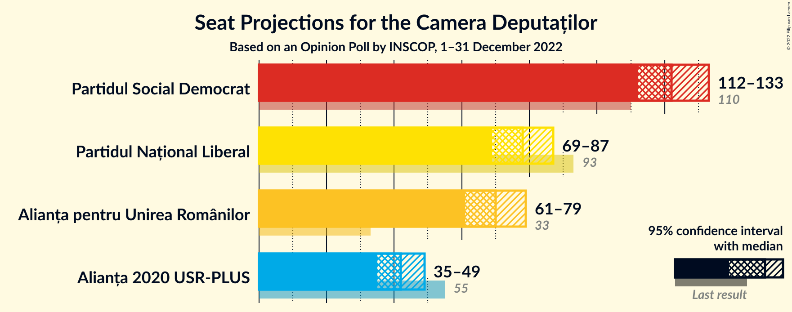
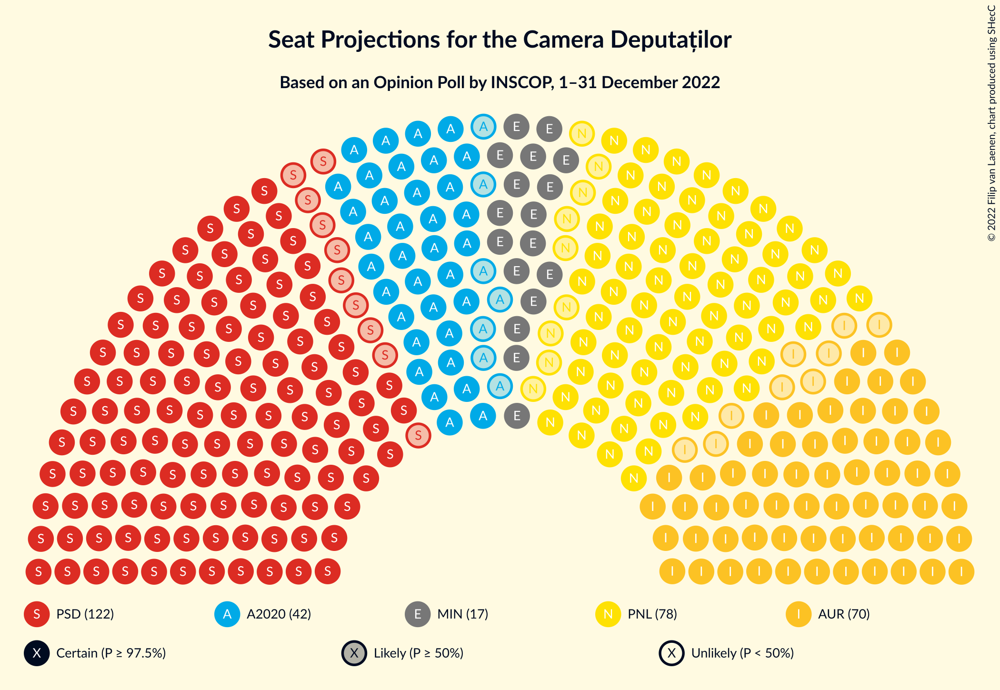
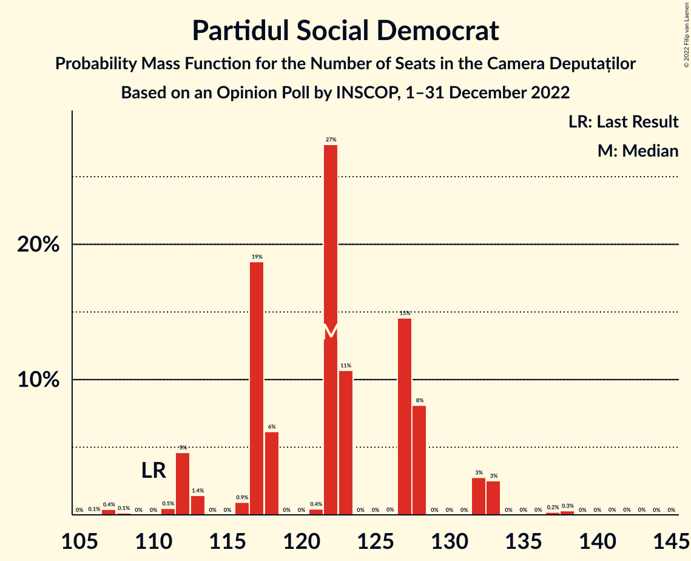
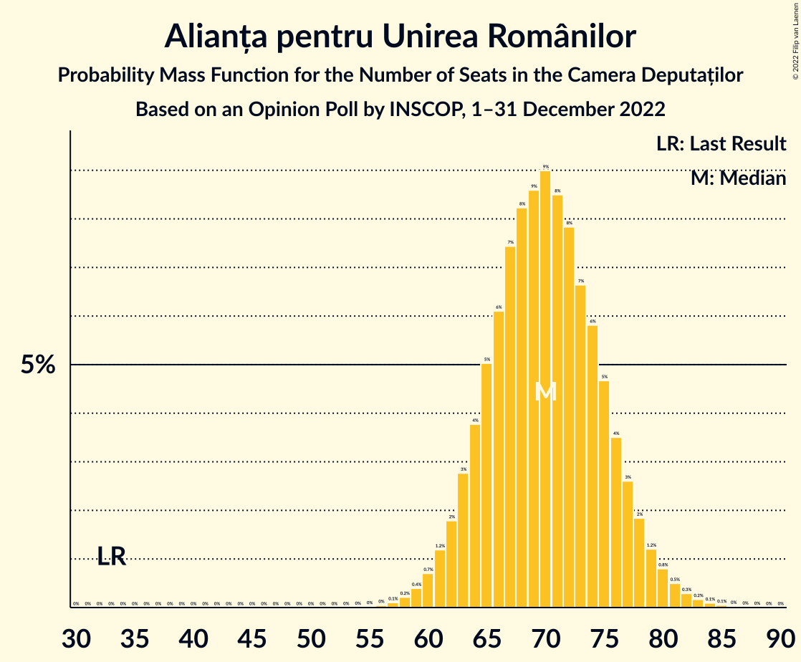
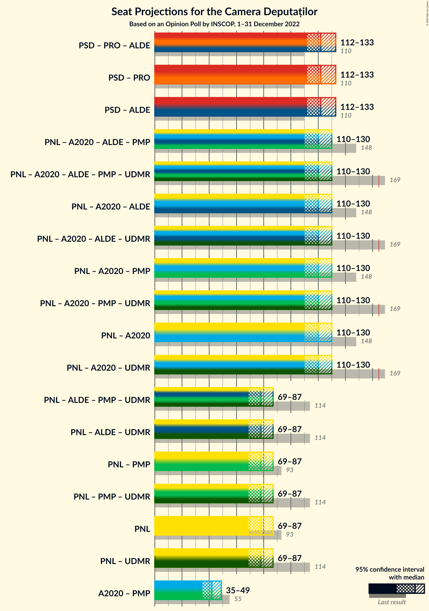
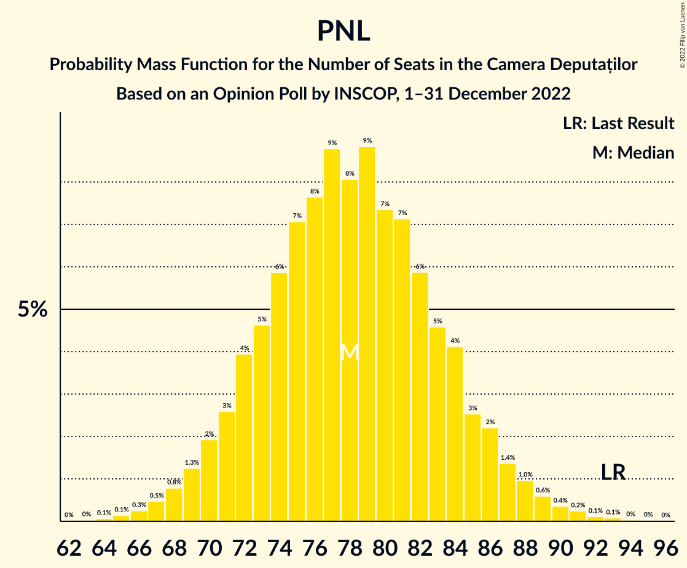

# Opinion Poll by INSCOP, 1–31 December 2022

<a href="#voting-intentions">Voting Intentions</a> | <a href="#seats">Seats</a> | <a href="#coalitions">Coalitions</a> | <a href="#technical-information">Technical Information</a>

## Voting Intentions

### Confidence Intervals

| Party | Last Result | Poll Result | 80% Confidence Interval | 90% Confidence Interval | 95% Confidence Interval | 99% Confidence Interval |
|:-----:|:-----------:|:-----------:|:-----------------------:|:-----------------------:|:-----------------------:|:-----------------------:|
| Partidul Social Democrat | 28.9% | 31.5% | 29.7–33.4% |29.2–33.9% |28.8–34.4% |27.9–35.3% |
| Partidul Național Liberal | 25.2% | 20.2% | 18.7–21.9% |18.2–22.3% |17.9–22.7% |17.2–23.5% |
| Alianța pentru Unirea Românilor | 9.1% | 18.1% | 16.6–19.7% |16.2–20.1% |15.9–20.5% |15.2–21.3% |
| Alianța 2020 USR-PLUS | 15.4% | 10.9% | 9.7–12.2% |9.4–12.6% |9.1–12.9% |8.6–13.5% |

*Note:* The poll result column reflects the actual value used in the calculations. Published results may vary slightly, and in addition be rounded to fewer digits.

## Seats

### Confidence Intervals

| Party | Last Result | Median | 80% Confidence Interval | 90% Confidence Interval | 95% Confidence Interval | 99% Confidence Interval |
|:-----:|:-----------:|:------:|:-----------------------:|:-----------------------:|:-----------------------:|:-----------------------:|
| <a href="#partidul-social-democrat">Partidul Social Democrat</a> | 110 | 122 | 117–128 |112–132 |112–133 |108–137 |
| <a href="#partidul-național-liberal">Partidul Național Liberal</a> | 93 | 78 | 72–84 |71–86 |69–87 |66–91 |
| <a href="#alianța-pentru-unirea-românilor">Alianța pentru Unirea Românilor</a> | 33 | 70 | 64–76 |63–78 |61–79 |59–82 |
| <a href="#alianța-2020-usr-plus">Alianța 2020 USR-PLUS</a> | 55 | 42 | 37–47 |36–48 |35–49 |33–52 |

### Partidul Social Democrat

*For a full overview of the results for this party, see the [Partidul Social Democrat](party-partidulsocialdemocrat.html) page.*

| Number of Seats | Probability | Accumulated | Special Marks |
|:---------------:|:-----------:|:-----------:|:-------------:|
| 106 | 0.1% | 100% |  |
| 107 | 0.4% | 99.9% |  |
| 108 | 0.1% | 99.5% |  |
| 109 | 0% | 99.4% |  |
| 110 | 0% | 99.4% | Last Result |
| 111 | 0.5% | 99.4% |  |
| 112 | 5% | 98.9% |  |
| 113 | 1.4% | 94% |  |
| 114 | 0% | 93% |  |
| 115 | 0% | 93% |  |
| 116 | 0.9% | 93% |  |
| 117 | 19% | 92% |  |
| 118 | 6% | 73% |  |
| 119 | 0% | 67% |  |
| 120 | 0% | 67% |  |
| 121 | 0.4% | 67% |  |
| 122 | 27% | 67% | Median |
| 123 | 11% | 39% |  |
| 124 | 0% | 29% |  |
| 125 | 0% | 29% |  |
| 126 | 0% | 29% |  |
| 127 | 15% | 29% |  |
| 128 | 8% | 14% |  |
| 129 | 0% | 6% |  |
| 130 | 0% | 6% |  |
| 131 | 0% | 6% |  |
| 132 | 3% | 6% |  |
| 133 | 3% | 3% |  |
| 134 | 0% | 0.6% |  |
| 135 | 0% | 0.6% |  |
| 136 | 0% | 0.6% |  |
| 137 | 0.2% | 0.6% |  |
| 138 | 0.3% | 0.4% |  |
| 139 | 0% | 0.1% |  |
| 140 | 0% | 0.1% |  |
| 141 | 0% | 0.1% |  |
| 142 | 0% | 0% |  |

### Partidul Național Liberal

*For a full overview of the results for this party, see the [Partidul Național Liberal](party-partidulnaționalliberal.html) page.*

| Number of Seats | Probability | Accumulated | Special Marks |
|:---------------:|:-----------:|:-----------:|:-------------:|
| 63 | 0% | 100% |  |
| 64 | 0.1% | 99.9% |  |
| 65 | 0.1% | 99.9% |  |
| 66 | 0.3% | 99.7% |  |
| 67 | 0.5% | 99.5% |  |
| 68 | 0.8% | 99.0% |  |
| 69 | 1.3% | 98% |  |
| 70 | 2% | 97% |  |
| 71 | 3% | 95% |  |
| 72 | 4% | 92% |  |
| 73 | 5% | 89% |  |
| 74 | 6% | 84% |  |
| 75 | 7% | 78% |  |
| 76 | 8% | 71% |  |
| 77 | 9% | 63% |  |
| 78 | 8% | 55% | Median |
| 79 | 9% | 46% |  |
| 80 | 7% | 38% |  |
| 81 | 7% | 30% |  |
| 82 | 6% | 23% |  |
| 83 | 5% | 17% |  |
| 84 | 4% | 13% |  |
| 85 | 3% | 9% |  |
| 86 | 2% | 6% |  |
| 87 | 1.4% | 4% |  |
| 88 | 1.0% | 2% |  |
| 89 | 0.6% | 1.5% |  |
| 90 | 0.4% | 0.9% |  |
| 91 | 0.2% | 0.5% |  |
| 92 | 0.1% | 0.3% |  |
| 93 | 0.1% | 0.2% | Last Result |
| 94 | 0% | 0.1% |  |
| 95 | 0% | 0% |  |

### Alianța pentru Unirea Românilor

*For a full overview of the results for this party, see the [Alianța pentru Unirea Românilor](party-alianțapentruunirearomânilor.html) page.*

| Number of Seats | Probability | Accumulated | Special Marks |
|:---------------:|:-----------:|:-----------:|:-------------:|
| 33 | 0% | 100% | Last Result |
| 34 | 0% | 100% |  |
| 35 | 0% | 100% |  |
| 36 | 0% | 100% |  |
| 37 | 0% | 100% |  |
| 38 | 0% | 100% |  |
| 39 | 0% | 100% |  |
| 40 | 0% | 100% |  |
| 41 | 0% | 100% |  |
| 42 | 0% | 100% |  |
| 43 | 0% | 100% |  |
| 44 | 0% | 100% |  |
| 45 | 0% | 100% |  |
| 46 | 0% | 100% |  |
| 47 | 0% | 100% |  |
| 48 | 0% | 100% |  |
| 49 | 0% | 100% |  |
| 50 | 0% | 100% |  |
| 51 | 0% | 100% |  |
| 52 | 0% | 100% |  |
| 53 | 0% | 100% |  |
| 54 | 0% | 100% |  |
| 55 | 0% | 100% |  |
| 56 | 0% | 100% |  |
| 57 | 0.1% | 99.9% |  |
| 58 | 0.2% | 99.8% |  |
| 59 | 0.4% | 99.6% |  |
| 60 | 0.7% | 99.2% |  |
| 61 | 1.2% | 98% |  |
| 62 | 2% | 97% |  |
| 63 | 3% | 96% |  |
| 64 | 4% | 93% |  |
| 65 | 5% | 89% |  |
| 66 | 6% | 84% |  |
| 67 | 7% | 78% |  |
| 68 | 8% | 70% |  |
| 69 | 9% | 62% |  |
| 70 | 9% | 54% | Median |
| 71 | 8% | 45% |  |
| 72 | 8% | 36% |  |
| 73 | 7% | 28% |  |
| 74 | 6% | 22% |  |
| 75 | 5% | 16% |  |
| 76 | 4% | 11% |  |
| 77 | 3% | 8% |  |
| 78 | 2% | 5% |  |
| 79 | 1.2% | 3% |  |
| 80 | 0.8% | 2% |  |
| 81 | 0.5% | 1.2% |  |
| 82 | 0.3% | 0.7% |  |
| 83 | 0.2% | 0.4% |  |
| 84 | 0.1% | 0.2% |  |
| 85 | 0.1% | 0.1% |  |
| 86 | 0% | 0.1% |  |
| 87 | 0% | 0% |  |

### Alianța 2020 USR-PLUS

*For a full overview of the results for this party, see the [Alianța 2020 USR-PLUS](party-alianța2020usr-plus.html) page.*

| Number of Seats | Probability | Accumulated | Special Marks |
|:---------------:|:-----------:|:-----------:|:-------------:|
| 0 | 0.1% | 100% |  |
| 1 | 0% | 99.9% |  |
| 2 | 0% | 99.9% |  |
| 3 | 0% | 99.9% |  |
| 4 | 0% | 99.9% |  |
| 5 | 0% | 99.9% |  |
| 6 | 0% | 99.9% |  |
| 7 | 0% | 99.9% |  |
| 8 | 0% | 99.9% |  |
| 9 | 0% | 99.9% |  |
| 10 | 0% | 99.9% |  |
| 11 | 0% | 99.9% |  |
| 12 | 0% | 99.9% |  |
| 13 | 0% | 99.9% |  |
| 14 | 0% | 99.9% |  |
| 15 | 0% | 99.9% |  |
| 16 | 0% | 99.9% |  |
| 17 | 0% | 99.9% |  |
| 18 | 0% | 99.9% |  |
| 19 | 0% | 99.9% |  |
| 20 | 0% | 99.9% |  |
| 21 | 0% | 99.9% |  |
| 22 | 0% | 99.9% |  |
| 23 | 0% | 99.9% |  |
| 24 | 0% | 99.9% |  |
| 25 | 0% | 99.9% |  |
| 26 | 0% | 99.9% |  |
| 27 | 0% | 99.9% |  |
| 28 | 0% | 99.9% |  |
| 29 | 0% | 99.9% |  |
| 30 | 0% | 99.9% |  |
| 31 | 0.1% | 99.9% |  |
| 32 | 0.2% | 99.9% |  |
| 33 | 0.5% | 99.7% |  |
| 34 | 1.0% | 99.2% |  |
| 35 | 2% | 98% |  |
| 36 | 3% | 96% |  |
| 37 | 5% | 93% |  |
| 38 | 6% | 89% |  |
| 39 | 8% | 82% |  |
| 40 | 10% | 74% |  |
| 41 | 11% | 65% |  |
| 42 | 11% | 54% | Median |
| 43 | 10% | 43% |  |
| 44 | 9% | 33% |  |
| 45 | 7% | 24% |  |
| 46 | 6% | 17% |  |
| 47 | 4% | 11% |  |
| 48 | 3% | 7% |  |
| 49 | 2% | 4% |  |
| 50 | 1.1% | 2% |  |
| 51 | 0.6% | 1.3% |  |
| 52 | 0.3% | 0.7% |  |
| 53 | 0.2% | 0.3% |  |
| 54 | 0.1% | 0.2% |  |
| 55 | 0% | 0.1% | Last Result |
| 56 | 0% | 0% |  |

## Coalitions

### Confidence Intervals

| Coalition | Last Result | Median | Majority? | 80% Confidence Interval | 90% Confidence Interval | 95% Confidence Interval | 99% Confidence Interval |
|:---------:|:-----------:|:------:|:---------:|:-----------------------:|:-----------------------:|:-----------------------:|:-----------------------:|
| Partidul Național Liberal – Alianța 2020 USR-PLUS | 148 | 120 | 0% | 113–127 | 111–129 | 110–130 | 106–134 |
| Partidul Național Liberal | 93 | 78 | 0% | 72–84 | 71–86 | 69–87 | 66–91 |

### Partidul Național Liberal – Alianța 2020 USR-PLUS

| Number of Seats | Probability | Accumulated | Special Marks |
|:---------------:|:-----------:|:-----------:|:-------------:|
| 98 | 0% | 100% |  |
| 99 | 0% | 99.9% |  |
| 100 | 0% | 99.9% |  |
| 101 | 0% | 99.9% |  |
| 102 | 0% | 99.9% |  |
| 103 | 0% | 99.9% |  |
| 104 | 0.1% | 99.9% |  |
| 105 | 0.1% | 99.8% |  |
| 106 | 0.2% | 99.7% |  |
| 107 | 0.3% | 99.5% |  |
| 108 | 0.5% | 99.2% |  |
| 109 | 0.8% | 98.6% |  |
| 110 | 1.2% | 98% |  |
| 111 | 2% | 97% |  |
| 112 | 2% | 95% |  |
| 113 | 3% | 93% |  |
| 114 | 4% | 89% |  |
| 115 | 5% | 85% |  |
| 116 | 5% | 81% |  |
| 117 | 7% | 75% |  |
| 118 | 7% | 69% |  |
| 119 | 8% | 62% |  |
| 120 | 8% | 54% | Median |
| 121 | 8% | 46% |  |
| 122 | 7% | 39% |  |
| 123 | 6% | 32% |  |
| 124 | 6% | 26% |  |
| 125 | 5% | 20% |  |
| 126 | 4% | 15% |  |
| 127 | 3% | 11% |  |
| 128 | 2% | 8% |  |
| 129 | 2% | 5% |  |
| 130 | 1.2% | 4% |  |
| 131 | 0.9% | 2% |  |
| 132 | 0.6% | 1.5% |  |
| 133 | 0.4% | 0.9% |  |
| 134 | 0.2% | 0.5% |  |
| 135 | 0.1% | 0.3% |  |
| 136 | 0.1% | 0.2% |  |
| 137 | 0% | 0.1% |  |
| 138 | 0% | 0.1% |  |
| 139 | 0% | 0% |  |
| 140 | 0% | 0% |  |
| 141 | 0% | 0% |  |
| 142 | 0% | 0% |  |
| 143 | 0% | 0% |  |
| 144 | 0% | 0% |  |
| 145 | 0% | 0% |  |
| 146 | 0% | 0% |  |
| 147 | 0% | 0% |  |
| 148 | 0% | 0% | Last Result |

### Partidul Național Liberal

| Number of Seats | Probability | Accumulated | Special Marks |
|:---------------:|:-----------:|:-----------:|:-------------:|
| 63 | 0% | 100% |  |
| 64 | 0.1% | 99.9% |  |
| 65 | 0.1% | 99.9% |  |
| 66 | 0.3% | 99.7% |  |
| 67 | 0.5% | 99.5% |  |
| 68 | 0.8% | 99.0% |  |
| 69 | 1.3% | 98% |  |
| 70 | 2% | 97% |  |
| 71 | 3% | 95% |  |
| 72 | 4% | 92% |  |
| 73 | 5% | 89% |  |
| 74 | 6% | 84% |  |
| 75 | 7% | 78% |  |
| 76 | 8% | 71% |  |
| 77 | 9% | 63% |  |
| 78 | 8% | 55% | Median |
| 79 | 9% | 46% |  |
| 80 | 7% | 38% |  |
| 81 | 7% | 30% |  |
| 82 | 6% | 23% |  |
| 83 | 5% | 17% |  |
| 84 | 4% | 13% |  |
| 85 | 3% | 9% |  |
| 86 | 2% | 6% |  |
| 87 | 1.4% | 4% |  |
| 88 | 1.0% | 2% |  |
| 89 | 0.6% | 1.5% |  |
| 90 | 0.4% | 0.9% |  |
| 91 | 0.2% | 0.5% |  |
| 92 | 0.1% | 0.3% |  |
| 93 | 0.1% | 0.2% | Last Result |
| 94 | 0% | 0.1% |  |
| 95 | 0% | 0% |  |

## Technical Information

### Opinion Poll

+ **Polling firm:** INSCOP
+ **Commissioner(s):** —
+ **Fieldwork period:** 1–31 December 2022

### Calculations

+ **Sample size:** 1050
+ **Simulations done:** 1,048,576
+ **Error estimate:** 0.14%

